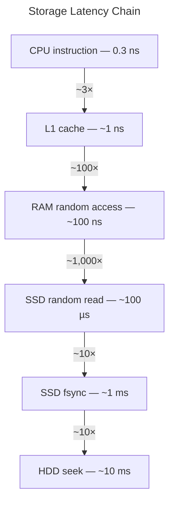
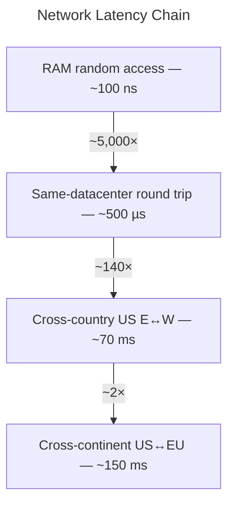

# Back of the Envelope

> Most performance limits are not arbitrary — they fall out of hardware physics and simple arithmetic. Know ~10 primitives and you can derive the numbers that come up in systems design interviews rather than memorising them.

The goal is a mental model that lets you *derive* an unfamiliar limit on the spot and recognise when a quoted number is physically plausible.

---

## The Latency Hierarchy

Two chains dominate most estimates. Every boundary crossing costs at least an order of magnitude.

**Storage chain** — each level roughly 10–1,000× slower than the one above it:

**Network chain** — latency is bounded by the speed of light, not software:

### The 10 primitives

| Operation | Cost | Notes |
|-----------|------|-------|
| CPU instruction | ~0.3 ns | One cycle at 3 GHz |
| L1 cache access | ~1 ns | On-chip |
| RAM random access | ~100 ns | ~100× slower than L1 |
| SSD random read | ~100 µs | ~1,000× slower than RAM |
| SSD fsync (flush to durable storage) | ~1 ms | The write bottleneck |
| HDD seek | ~10 ms | ~10× slower than SSD fsync |
| Same-datacenter round trip | ~500 µs | Within one AWS AZ |
| Cross-country round trip (US E↔W) | ~70 ms | Speed of light + routing |
| Cross-continent round trip (US↔EU) | ~150 ms | Speed of light + routing |
| SSD sequential throughput | ~500 MB/s | Sequential >> random |

!!! tip "The boundary rule"
    Every time you cross a storage or network boundary, expect at least one order of magnitude in latency. RAM→SSD is 1,000×. SSD→network is 5×. Same-DC→cross-country is 140×. If someone quotes a number that requires crossing two boundaries in the time it takes to cross one, it is physically implausible.

---

## The Derivation Pattern

!!! info "Three questions for any unfamiliar limit"
    1. **What resource is this system bounded by?** (CPU, memory, disk I/O, network I/O, or human cognition)
    2. **How much of that resource does one operation consume?** (Look up the relevant primitive above)
    3. **What is the total capacity of that resource?** (Single core, single disk, single NIC)

    Divide 3 by 2. Adjust for batching, parallelism, and overhead. You will land within an order of magnitude — which is all a design interview requires.

---

## Worked Derivations

Each derivation leads with the result. Expand to see the arithmetic.

---

### Redis: ~100k–300k ops/sec

**Bottleneck:** CPU — Redis is single-threaded
**Primitive:** ~1 µs per RAM operation

??? note "Derivation"
    - Per-command cost: ~1 µs (RAM lookup + parse + serialise response)
    - One CPU core: 1,000,000 µs/sec
    - Theoretical ceiling: 1,000,000 / 1 = **1M ops/sec**
    - Practical ceiling: ~100k–300k — network interrupt handling and TCP/IP stack processing steal the remaining CPU cycles at high request rates

    A single Redis node saturates around 100k ops/sec under real workloads. This is where clustering or pipelining becomes necessary.

---

### PostgreSQL: ~10k–20k writes/sec

**Bottleneck:** SSD fsync — every committed transaction must flush to durable storage
**Primitive:** ~1 ms per fsync

??? note "Derivation"
    - Fsync cost: ~1 ms → theoretical ceiling without batching: 1,000 commits/sec
    - PostgreSQL group commit: batches ~10–20 concurrent transactions per fsync
    - Practical ceiling: 1,000 × 10–20 = **10,000–20,000 writes/sec**

    This is the ceiling for a single primary on SSD under mixed OLTP load. Above it, you need write sharding, a different storage engine, or a buffer layer (Kafka → batch inserts).

    *Pinterest's MySQL was at this range when they began sharding. Discord's MongoDB message store was here when they migrated to Cassandra.*

---

### TLS handshake: ~100–150 ms intercontinentally

**Bottleneck:** Network round trips — TLS 1.3 requires 1 round trip before data flows
**Primitive:** ~150 ms US↔EU round trip

??? note "Derivation"
    - TLS 1.3: 1 network round trip before the first application byte
    - US East ↔ Europe: ~150 ms round trip
    - Per cold connection cost: 1 × 150 ms = **~150 ms before any data**
    - At 10 API calls per page load on cold connections: 1.5 seconds of pure handshake
    - TLS 1.2: 2 round trips = ~300 ms — this is why TLS 1.3 was a meaningful improvement

    Session resumption (0-RTT or 1-RTT) eliminates this for returning clients. Without it, TLS overhead dominates latency for any mobile or cross-continent API.

---

### B+Tree writes: degrades on HDD above ~1k writes/sec

**Bottleneck:** HDD seek — random writes require physical head movement
**Primitive:** ~10 ms per seek

??? note "Derivation"
    - HDD seek: ~10 ms
    - Theoretical ceiling: 1,000 ms / 10 ms = **100 random writes/sec per disk**
    - A B+Tree page split touches 2–3 pages = 20–30 ms per split
    - With OS write buffering and batching: reaches ~1k writes/sec before visible degradation
    - On SSD (100 µs seek): same logic gives ~10k random writes/sec — a 10× improvement

    This is why SSDs changed database economics so dramatically. The same B+Tree design went from a 1k to a 10k write/sec ceiling simply from switching storage. LSM trees (Cassandra, RocksDB) sidestep this by converting random writes to sequential appends.

---

### Kafka: ~500 MB/sec producer throughput per broker

**Bottleneck:** Network NIC — sequential disk I/O is fast enough that the network becomes the limit
**Primitives:** SSD sequential ~500 MB/s; 1 Gbps NIC = ~125 MB/s

??? note "Derivation"
    - SSD sequential write: ~500 MB/s (Kafka appends to log segments)
    - 1 Gbps NIC: 1,000 Mbps / 8 = ~125 MB/s of data
    - Replication factor 3: each producer message is written to 3 brokers → effective new-data rate = 125 / 3 ≈ **40 MB/s per broker**
    - With compression (JSON compresses ~5–10×): effective throughput rises to ~200–400 MB/s
    - Multiple partitions across brokers: throughput scales linearly with broker count

    Kafka's design specifically exploits sequential I/O — page cache + sequential writes means the OS can sustain near-disk-bandwidth throughput. The NIC, not the disk, is almost always the bottleneck on modern SSDs.

---

### Thread pool sizing: Little's Law

**Bottleneck:** Thread availability — blocked threads cannot serve new requests
**Formula:** threads needed = target QPS × average latency (seconds)

??? note "Derivation"
    Little's Law: **L = λW** (items in system = arrival rate × time in system)

    Applied to thread pools:

    - Want to handle: 1,000 req/sec (λ)
    - Each request makes one DB call: 100 ms latency (W)
    - Threads needed: 1,000 × 0.1 = **100 threads**

    If each request makes 3 serial DB calls (300 ms total): 1,000 × 0.3 = **300 threads**

    **CPU-bound work:** threads = CPU cores (adding more causes context-switch overhead)
    **I/O-bound work:** threads = QPS × latency_in_seconds (can far exceed core count)

    Virtual threads (Java 21) and goroutines (Go) change this: blocking I/O parks the virtual thread without occupying a carrier thread, so you can have millions of "threads" without the memory or scheduling overhead.

---

### Database connection pool costs

**Bottleneck:** Memory — each PostgreSQL connection is a full OS process
**Primitive:** ~5–10 MB RAM per connection on the database server

??? note "Derivation"
    - PostgreSQL backend process per connection: ~5–10 MB (process overhead + private memory)
    - At `max_connections = 100` (PostgreSQL default): ~500 MB – 1 GB just for connections
    - A 64 GB database server: practical raw connection limit ~500–1,000 before memory pressure
    - Typical microservices deployment: each of 50 services × 20 connections per pod × 5 pods = **5,000 connections** — 25–50 GB just for connection overhead, which crashes most databases

    **PgBouncer in transaction mode:** 5,000 app-level connections → ~20–50 actual PostgreSQL connections. The pool multiplier is often 100–200×.

    This is why connection poolers exist — not for performance, but because the database runs out of memory before it runs out of CPU.

---

### Cache hit rate: the non-linear value

**Bottleneck:** Database — cache misses bypass the cache and hit the DB directly
**Formula:** DB QPS = total QPS × (1 − hit rate)

??? note "Derivation"
    At 10,000 total QPS:

    | Hit rate | DB sees | Change vs previous |
    |----------|---------|-------------------|
    | 90% | 1,000 QPS | baseline |
    | 95% | 500 QPS | 2× reduction |
    | 99% | 100 QPS | 5× reduction |
    | 99.9% | 10 QPS | 10× reduction |

    Going from 95% → 99% (a 4% improvement) reduces DB load by 5×. Going from 99% → 99.9% (a 0.9% improvement) reduces it another 10×. Hit rate improvements near 100% have super-linear impact because you are shrinking the denominator of `1 / (1 − hit_rate)`.

    At 10k+ QPS, 99% hit rate is the target, not a stretch goal. A thundering herd on a popular key can drop hit rate from 99% to 90% for a few seconds — instantly 10× the database load.

---

### NIC saturation: bandwidth limits throughput regardless of CPU

**Bottleneck:** Network interface card — bytes are bytes, regardless of application speed
**Primitive:** 1 Gbps NIC = 125 MB/s; 10 Gbps = 1,250 MB/s

??? note "Derivation"
    Max QPS = NIC bandwidth / average response size

    | NIC | 100 B payload | 1 KB payload | 100 KB payload |
    |----|--------------|-------------|---------------|
    | 1 Gbps | ~1.25M req/sec | ~125k req/sec | ~1,250 req/sec |
    | 10 Gbps | ~12.5M req/sec | ~1.25M req/sec | ~12,500 req/sec |

    A CDN edge node or load balancer handling image thumbnails (100 KB) saturates its 1 Gbps NIC at ~1,250 req/sec — regardless of how fast the CPU processes them. This is often the surprise: the bottleneck is not where engineers look first.

    At scale, engineers move to 10/25/100 Gbps NICs, or shard traffic across more hosts, specifically to push this ceiling.

---

### Prometheus cardinality: memory explosion

**Bottleneck:** RAM — Prometheus stores all active time series in memory
**Primitive:** ~3–5 KB per time series

??? note "Derivation"
    - Per time series cost: ~4 KB (samples + label set + inverted index entry)
    - 1M time series: 1M × 4 KB = **~4 GB** — manageable
    - Adding a label with 1,000 distinct values to 1M existing series: creates 1B combinations → **~4 TB** — not manageable
    - A single `user_id` label with 10M users: 10M × existing_series_count new series

    The cardinality explosion is multiplicative, not additive. Every new high-cardinality label multiplies the existing series count. The rule of thumb — no label with more than a few hundred distinct values — exists because 100 values × 1M series = 100M series × 4 KB = 400 GB.

---

### Event sourcing replay: why snapshots are not optional

**Bottleneck:** Time — replaying a large event log has a hard floor set by read throughput
**Primitive:** SSD sequential read ~500 MB/s

??? note "Derivation"
    - Production event rate: 10,000 events/sec = 864M events/day
    - Replay throughput (sequential Kafka/S3 read): ~100k–1M events/sec
    - Time to replay one day at 100k events/sec: 864M / 100k = **8,640 sec ≈ 2.4 hours**
    - Time to replay one year: 2.4h × 365 = **876 hours ≈ 36 days**
    - With daily snapshots: maximum replay = **2.4 hours** regardless of total log age

    Snapshots are not an optimisation — they are what makes event sourcing operationally viable at any meaningful scale. Without them, cold start time for a new consumer or a recovered service grows linearly with system age.

---

### Cross-region synchronous replication: physics as the constraint

**Bottleneck:** Speed of light — this cannot be engineered away
**Primitive:** US East ↔ US West ~70 ms round trip

??? note "Derivation"
    - US East ↔ US West: ~70 ms round trip (speed of light ~300,000 km/s, routing adds overhead)
    - Every synchronous cross-region write adds ≥70 ms to write latency
    - At 100 writes/sec, each waiting for cross-region acknowledgement:
        - 100 writes × 70 ms = 7,000 ms of latency per second of wall time
        - The system produces latency faster than time passes — it cannot keep up
    - Sub-100ms write SLO + synchronous cross-region replication = physically impossible

    Any architecture requiring cross-region write agreement (synchronous 2PC, synchronous Raft across regions) has a write latency floor of ~70–150 ms before any application logic runs. Active-active with synchronous replication is not a configuration choice; it is a physics violation.

---

## Scale in Context

### Throughput (QPS)

| QPS | What it looks like | Surprising reference points |
|-----|-------------------|-----------------------------|
| 1–100 | Prototype, developer API, cron job | Many internal enterprise services live here permanently |
| 100–1k | Real product with real users; one database instance is comfortable | A mid-size B2B SaaS; most API services at companies under 100 engineers |
| 1k–10k | Infrastructure decisions start to matter; single DB under moderate pressure | GitHub's early MySQL; early Discord; a successful consumer app's core API |
| **10k–20k** | **Significant scale.** PostgreSQL primary near its write ceiling. ~1B requests/day. | Pinterest at first shard; Discord pre-Cassandra; Instagram at acquisition (13 employees, Django monolith) |
| 20k–100k | Major consumer product; distributed architecture required | Shopify peak Black Friday (~80k req/sec); Twitter API gateway pre-2012 |
| 100k–1M | Single Redis node, a CDN PoP, a major platform's core service | Netflix playback per region; WhatsApp at 450M users (32 engineers, ~80 servers) |
| 1M+ | Hyperscaler; speed of light appears in architecture diagrams | Google Search (~100k searches/sec); Cloudflare (~25M HTTP req/sec globally) |

!!! note "Why 10k–20k doesn't feel big"
    Systems design content tends to jump from "add a cache" straight to Google-scale. The 1k–100k range is where most senior engineers actually work and where real architectural decisions get made. 10k–20k QPS is ~1 billion requests per day — that is a real product with real users. It does not feel big because the framing in most content is wrong.

!!! tip "Surprisingly lean systems"
    Some of the most-referenced engineering organisations run on far less infrastructure than their reputation implies:

    - **Stack Overflow** serves ~1.5B page views/month on ~9 web servers and one SQL Server primary. Their team writes about raw query performance because they actually hit database limits.
    - **WhatsApp at Facebook acquisition (2014):** 450M users, 54B messages/day (~625k msg/sec), 32 engineers, ~80 servers. Erlang's lightweight processes made this possible.
    - **Instagram at Facebook acquisition (2012):** 30M users, 13 employees, a Django monolith on EC2 with a handful of PostgreSQL instances.
    - **Basecamp:** Millions of paying customers, ~60 employees, a small number of servers. DHH has written extensively about "the boring stack" being sufficient.

    The pattern: a narrow feature set, a cacheable workload, or a runtime built for concurrency (Erlang, Go) can sustain surprising scale without distributed complexity.

---

### Data storage

| Volume | What it means | Reference points |
|--------|--------------|-----------------|
| < 1 GB | Fits in RAM on any server; SQLite is viable | A prototype, a local app, a single microservice's state |
| 1–100 GB | A healthy production PostgreSQL instance; indexes fit in RAM | Most SaaS products; a mature startup's primary database |
| 100 GB – 1 TB | Approaching single-instance limits; full index may not fit in RAM | A busy OLTP database; a product with years of history |
| 1–10 TB | Archiving, partitioning, or read replicas necessary; backup windows matter | GitHub's early MySQL; a large e-commerce product catalogue + order history |
| 10–100 TB | Data warehouse territory; columnar storage (Redshift, BigQuery, ClickHouse) pays off | Enterprise analytics; a mid-size social platform's event history |
| 100 TB – 1 PB | Distributed storage required; object store (S3, GCS) for cold data | Facebook photo storage was ~1 PB in 2009; a major video platform's content |
| 1 PB+ | Hyperscaler object storage or distributed file systems | Google's web index; AWS S3 as a platform (multiple exabytes) |

---

### Database write volume

| Writes/sec | What it means | Reference points |
|------------|--------------|-----------------|
| < 1k | Comfortable for any SQL database on SSD | Most applications |
| 1k–10k | PostgreSQL healthy; approaching fsync ceiling under high concurrency | A busy OLTP system |
| 10k–20k | Near the single-primary PostgreSQL ceiling | Pinterest at first shard; Discord pre-Cassandra |
| 20k–100k | Sharding or NoSQL required; single-node SQL not viable | Cassandra, DynamoDB, CockroachDB territory |
| 100k–1M | Distributed write path; Kafka as a write buffer in front of storage | Uber's trip events; Twitter's write firehose |
| 1M+ | Kafka/Pulsar directly; batch materialisation into storage | LinkedIn's Kafka origin story (~1B events/day); WhatsApp message persistence |

---

### Event and message volume

| Events/day | Events/sec (avg) | What this implies |
|------------|-----------------|-------------------|
| 1M | ~12/sec | In-process queue or a single Kafka partition |
| 10M | ~115/sec | Single Kafka topic; event sourcing replay in minutes |
| 100M | ~1,150/sec | Kafka with a few partitions; event sourcing replay in hours |
| 1B | ~11,500/sec | LinkedIn's original Kafka scale; serious infrastructure needed |
| 10B | ~115,000/sec | Multiple Kafka clusters; consumer lag monitoring is critical |
| 1T | ~11.5M/sec | Hyperscaler: Cloudflare DNS, major ad platforms |

---

## Quick Formula Reference

| System | Bottleneck | Formula | Typical limit |
|--------|-----------|---------|--------------|
| In-memory cache (Redis) | CPU (single-threaded) | ops/sec ≈ 1M / µs_per_op | ~100–300k ops/sec |
| SQL database writes | SSD fsync | writes/sec ≈ group_commit_size / fsync_ms | ~10–20k writes/sec |
| SQL read replicas | Replication lag | lag ∝ write_rate / replica_throughput | Visible above ~5k writes/sec |
| Thread pool (I/O bound) | Thread count | threads = QPS × latency_sec | Depends on workload |
| DB connections | Server RAM | max_conns ≈ RAM_GB × 100 | ~100–500 without pooler |
| Cache effectiveness | Hit rate | DB_QPS = total_QPS × (1 − hit_rate) | 99%+ target above 10k QPS |
| NIC throughput | Bandwidth | max_QPS = NIC_MB_per_sec / avg_payload_KB | 125k (1Gbps, 1KB payload) |
| Cross-region write SLO | Speed of light | min_latency = round_trip_ms | ≥70 ms US E↔W |
| Kafka producer | NIC (not disk) | throughput ≈ NIC / replication_factor | ~40–125 MB/sec per broker |
| Event sourcing cold replay | Sequential read | replay_time = events / replay_rate | Hours to days without snapshots |
