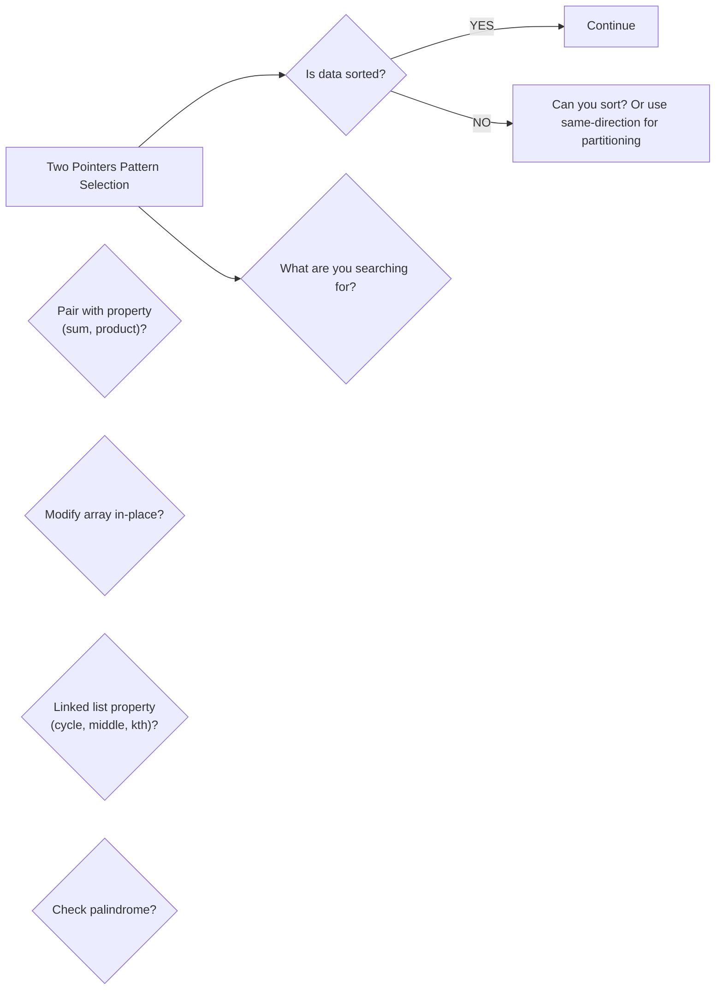

# 01. Two Pointers

> Reduce O(n²) to O(n) by using two indices moving through data

---

## ELI5: Explain Like I'm 5

<div class="learner-section" markdown>

**Your task:** After implementing all three patterns, explain them simply.

**Prompts to guide you:**

1. **What is the two pointers pattern in one sentence?**
    - Your answer: <span class="fill-in">[Fill in after implementation]</span>

2. **Why is it faster than nested loops?**
    - Your answer: <span class="fill-in">[Fill in after implementation]</span>

3. **Real-world analogy:**
    - Example: "Two pointers is like two people searching..."
    - Your analogy: <span class="fill-in">[Fill in]</span>

4. **When does this pattern work?**
    - Your answer: <span class="fill-in">[Fill in after solving problems]</span>

5. **When does this pattern fail?**
    - Your answer: <span class="fill-in">[Fill in after trying unsorted arrays]</span>

</div>

---

## Quick Quiz (Do BEFORE implementing)

<div class="learner-section" markdown>

**Your task:** Test your intuition without looking at code. Answer these, then verify after implementation.

### Complexity Predictions

1. **Two nested loops searching for a pair:**
    - Time complexity: <span class="fill-in">[Your guess: O(?)]</span>
    - Verified after learning: <span class="fill-in">[Actual: O(?)]</span>

2. **Two pointers searching for a pair in sorted array:**
    - Time complexity: <span class="fill-in">[Your guess: O(?)]</span>
    - Space complexity: <span class="fill-in">[Your guess: O(?)]</span>
    - Verified: <span class="fill-in">[Actual]</span>

3. **Speedup calculation:**
    - If n = 1,000, nested loops = n² = <span class="fill-in">_____</span> operations
    - Two pointers = n = <span class="fill-in">_____</span> operations
    - Speedup factor: <span class="fill-in">_____</span> times faster

### Scenario Predictions

**Scenario 1:** Find pair that sums to 10 in `[1, 3, 5, 7, 9]`

- **Can you use two pointers?** <span class="fill-in">[Yes/No - Why?]</span>
- **Starting positions:** left = <span class="fill-in">___</span>, right = <span class="fill-in">___</span>
- **If sum = 8 (too small), which pointer moves?** <span class="fill-in">[Left/Right - Why?]</span>
- **If sum = 12 (too big), which pointer moves?** <span class="fill-in">[Left/Right - Why?]</span>

**Scenario 2:** Find pair that sums to 10 in `[9, 3, 1, 7, 5]` (unsorted)

- **Can you use two pointers directly?** <span class="fill-in">[Yes/No - Why?]</span>
- **What must you do first?** <span class="fill-in">[Fill in]</span>

**Scenario 3:** Remove duplicates from `[1, 1, 2, 2, 3]`

- **Which pattern applies?** <span class="fill-in">[Opposite/Same/Different speed]</span>
- **Why that pattern?** <span class="fill-in">[Fill in your reasoning]</span>

### Trade-off Quiz

**Question:** When would HashSet be BETTER than two pointers for finding pairs?

- Your answer: <span class="fill-in">[Fill in before implementation]</span>
- Verified answer: <span class="fill-in">[Fill in after learning]</span>

**Question:** What's the MAIN requirement for opposite-direction two pointers?

- [ ] Array must be sorted
- [ ] Array must have even length
- [ ] Array must contain unique elements
- [ ] Array must be positive integers

Verify after implementation: <span class="fill-in">[Which one(s)?]</span>


</div>

---

## Before/After: Why This Pattern Matters

**Your task:** Compare naive vs optimized approaches to understand the impact.

### Example: Find Pair Sum

**Problem:** Find two numbers in a sorted array that sum to a target.

#### Approach 1: Brute Force (Nested Loops)

```java
// Naive approach - Check all possible pairs
public static boolean hasPairSum_BruteForce(int[] nums, int target) {
    for (int i = 0; i < nums.length; i++) {
        for (int j = i + 1; j < nums.length; j++) {
            if (nums[i] + nums[j] == target) {
                return true;
            }
        }
    }
    return false;
}
```

**Analysis:**

- Time: O(n²) - For each element, check all remaining elements
- Space: O(1) - No extra space
- For n = 10,000: ~100,000,000 operations

#### Approach 2: Two Pointers (Optimized)

```java
// Optimized approach - Use two pointers from opposite ends
public static boolean hasPairSum_TwoPointers(int[] nums, int target) {
    int left = 0;
    int right = nums.length - 1;

    while (left < right) {
        int sum = nums[left] + nums[right];
        if (sum == target) return true;
        if (sum < target) left++;    // Need larger sum
        else right--;                 // Need smaller sum
    }

    return false;
}
```

**Analysis:**

- Time: O(n) - Each pointer moves at most n/2 steps
- Space: O(1) - No extra space
- For n = 10,000: ~10,000 operations

#### Performance Comparison

| Array Size | Brute Force (O(n²)) | Two Pointers (O(n)) | Speedup |
|------------|---------------------|---------------------|---------|
| n = 100    | 10,000 ops          | 100 ops             | 100x    |
| n = 1,000  | 1,000,000 ops       | 1,000 ops           | 1,000x  |
| n = 10,000 | 100,000,000 ops     | 10,000 ops          | 10,000x |

**Your calculation:** For n = 5,000, the speedup is approximately _____ times faster.

#### Why Does Two Pointers Work?

**Key insight to understand:**

In a sorted array `[1, 3, 5, 7, 9]` looking for sum = 10:

```
Step 1: left=0 (val=1), right=4 (val=9), sum=10 → FOUND!
```

If we were looking for sum = 12:

```
Step 1: left=0 (val=1), right=4 (val=9), sum=10 (too small)
        → Move left++ because we need a LARGER sum

Step 2: left=1 (val=3), right=4 (val=9), sum=12 → FOUND!
```

**Why can we skip pairs?**

- When sum is too small, moving `right--` makes it even smaller (not helpful)
- When sum is too large, moving `left++` makes it even larger (not helpful)
- So each move eliminates multiple pairs in one step!

**After implementing, explain in your own words:**

<div class="learner-section" markdown>

- Why does sorted order matter? <span class="fill-in">[Your answer]</span>
- What pairs do we skip and why is it safe? <span class="fill-in">[Your answer]</span>

</div>

---

## Core Implementation

### Pattern 1: Opposite Direction Pointers

**Concept:** Start from both ends, move toward each other.

**Use case:** Palindromes, pair sum in sorted array.

```java
public class OppositeDirectionPointers {

    /**
     * Problem: Check if string is a palindrome
     * Time: O(n), Space: O(1)
     *
     * TODO: Implement using two pointers from opposite ends
     */
    public static boolean isPalindrome(String s) {
        // TODO: Initialize left = 0, right = s.length() - 1

        // TODO: While left < right
        //   Compare s.charAt(left) with s.charAt(right)
        //   If different, return false
        //   Move pointers: left++, right--

        // TODO: If loop completes, return true

        return false; // Replace with implementation
    }

    /**
     * Problem: Find pair in sorted array that sums to target
     * Time: O(n), Space: O(1)
     *
     * TODO: Implement two-pointer pair sum
     */
    public static int[] twoSum(int[] nums, int target) {
        // TODO: Initialize left = 0, right = nums.length - 1

        // TODO: While left < right
        //   Calculate sum = nums[left] + nums[right]
        //   If sum == target, return [left, right]
        //   If sum < target, move left++ (need larger sum)
        //   If sum > target, move right-- (need smaller sum)

        return new int[] {-1, -1}; // Replace with implementation
    }

    /**
     * Problem: Reverse array in-place
     * Time: O(n), Space: O(1)
     *
     * TODO: Implement using two pointers
     */
    public static void reverseArray(int[] arr) {
        // TODO: left = 0, right = arr.length - 1
        // TODO: While left < right, swap arr[left] with arr[right]
        // TODO: left++, right--
    }
}
```

**Runnable Client Code:**

```java
public class OppositeDirectionClient {

    public static void main(String[] args) {
        System.out.println("=== Opposite Direction Two Pointers ===\n");

        // Test 1: Palindrome check
        System.out.println("--- Test 1: Palindrome ---");
        String[] testStrings = {"racecar", "hello", "noon", "a", ""};

        for (String s : testStrings) {
            boolean result = OppositeDirectionPointers.isPalindrome(s);
            System.out.printf("isPalindrome(\"%s\") = %b%n", s, result);
        }

        // Test 2: Two sum in sorted array
        System.out.println("\n--- Test 2: Two Sum ---");
        int[] sortedArray = {1, 3, 5, 7, 9, 11};
        int target = 12;

        int[] result = OppositeDirectionPointers.twoSum(sortedArray, target);
        System.out.printf("Array: %s%n", Arrays.toString(sortedArray));
        System.out.printf("Target: %d%n", target);
        System.out.printf("Pair indices: %s%n", Arrays.toString(result));
        if (result[0] != -1) {
            System.out.printf("Values: %d + %d = %d%n",
                sortedArray[result[0]], sortedArray[result[1]], target);
        }

        // Test 3: Reverse array
        System.out.println("\n--- Test 3: Reverse Array ---");
        int[] arr = {1, 2, 3, 4, 5};
        System.out.println("Before: " + Arrays.toString(arr));
        OppositeDirectionPointers.reverseArray(arr);
        System.out.println("After:  " + Arrays.toString(arr));
    }
}
```

---

### Pattern 2: Same Direction Pointers (Slow/Fast)

**Concept:** Both pointers move left to right, at different speeds.

**Use case:** Remove duplicates, partition array, in-place modifications.

```java
public class SameDirectionPointers {

    /**
     * Problem: Remove duplicates from sorted array in-place
     * Return new length
     * Time: O(n), Space: O(1)
     *
     * TODO: Implement using slow/fast pointers
     */
    public static int removeDuplicates(int[] nums) {
        if (nums.length == 0) return 0;

        // TODO: slow = 0 (tracks position of last unique element)
        // TODO: fast = 1 (explores array)

        // TODO: While fast < nums.length
        //   If nums[fast] != nums[slow]
        //     slow++
        //     nums[slow] = nums[fast]
        //   fast++

        // TODO: Return slow + 1 (new length)

        return 0; // Replace with implementation
    }

    /**
     * Problem: Move all zeros to end, maintain order of non-zeros
     * Time: O(n), Space: O(1)
     *
     * TODO: Implement using slow/fast pointers
     */
    public static void moveZeroes(int[] nums) {
        // TODO: slow = 0 (position to place next non-zero)
        // TODO: fast = 0 (explores array)

        // TODO: While fast < nums.length
        //   If nums[fast] != 0
        //     Swap nums[slow] with nums[fast]
        //     slow++
        //   fast++
    }

    /**
     * Problem: Partition array - all elements < pivot go left
     * Time: O(n), Space: O(1)
     *
     * TODO: Implement partition logic
     */
    public static int partition(int[] arr, int pivot) {
        // TODO: slow = 0 (boundary between < pivot and >= pivot)
        // TODO: fast = 0 (explores array)

        // TODO: While fast < arr.length
        //   If arr[fast] < pivot
        //     Swap arr[slow] with arr[fast]
        //     slow++
        //   fast++

        // TODO: Return slow (partition index)

        return 0; // Replace with implementation
    }
}
```

**Runnable Client Code:**

```java
public class SameDirectionClient {

    public static void main(String[] args) {
        System.out.println("=== Same Direction Two Pointers ===\n");

        // Test 1: Remove duplicates
        System.out.println("--- Test 1: Remove Duplicates ---");
        int[] arr1 = {1, 1, 2, 2, 2, 3, 4, 4, 5};
        System.out.println("Before: " + Arrays.toString(arr1));

        int newLength = SameDirectionPointers.removeDuplicates(arr1);
        System.out.println("After:  " + Arrays.toString(Arrays.copyOf(arr1, newLength)));
        System.out.println("New length: " + newLength);

        // Test 2: Move zeros
        System.out.println("\n--- Test 2: Move Zeros ---");
        int[] arr2 = {0, 1, 0, 3, 12, 0, 5};
        System.out.println("Before: " + Arrays.toString(arr2));
        SameDirectionPointers.moveZeroes(arr2);
        System.out.println("After:  " + Arrays.toString(arr2));

        // Test 3: Partition
        System.out.println("\n--- Test 3: Partition ---");
        int[] arr3 = {7, 2, 9, 1, 5, 3, 8};
        int pivot = 5;
        System.out.println("Before: " + Arrays.toString(arr3));
        System.out.println("Pivot:  " + pivot);

        int partitionIdx = SameDirectionPointers.partition(arr3, pivot);
        System.out.println("After:  " + Arrays.toString(arr3));
        System.out.println("Partition index: " + partitionIdx);
        System.out.println("(All elements before index " + partitionIdx + " are < " + pivot + ")");
    }
}
```

---

### Pattern 3: Different Speed Pointers

**Concept:** One pointer moves faster than the other.

**Use case:** Linked list cycle detection, finding middle element.

```java
public class DifferentSpeedPointers {

    // Simple ListNode definition
    static class ListNode {
        int val;
        ListNode next;

        ListNode(int val) {
            this.val = val;
        }
    }

    /**
     * Problem: Detect cycle in linked list
     * Time: O(n), Space: O(1)
     *
     * TODO: Implement using slow/fast pointers
     */
    public static boolean hasCycle(ListNode head) {
        // TODO: slow = head, fast = head

        // TODO: While fast != null && fast.next != null
        //   slow = slow.next (move 1 step)
        //   fast = fast.next.next (move 2 steps)
        //   If slow == fast, return true (cycle detected)

        // TODO: Return false (no cycle)

        return false; // Replace with implementation
    }

    /**
     * Problem: Find middle of linked list
     * If even length, return second middle node
     * Time: O(n), Space: O(1)
     *
     * TODO: Implement using slow/fast pointers
     */
    public static ListNode findMiddle(ListNode head) {
        // TODO: slow = head, fast = head

        // TODO: While fast != null && fast.next != null
        //   slow = slow.next
        //   fast = fast.next.next

        // TODO: Return slow (it's at middle when fast reaches end)

        return null; // Replace with implementation
    }

    /**
     * Problem: Find kth node from end
     * Time: O(n), Space: O(1)
     *
     * TODO: Implement using two pointers with gap
     */
    public static ListNode findKthFromEnd(ListNode head, int k) {
        // TODO: fast = head, slow = head

        // TODO: Move fast k steps ahead
        //   For i = 0 to k-1: fast = fast.next
        //   If fast becomes null, k is too large

        // TODO: Move both pointers until fast reaches end
        //   While fast.next != null:
        //     slow = slow.next
        //     fast = fast.next

        // TODO: Return slow (it's k nodes from end)

        return null; // Replace with implementation
    }

    // Helper: Create linked list from array
    static ListNode createList(int[] values) {
        if (values.length == 0) return null;

        ListNode head = new ListNode(values[0]);
        ListNode current = head;

        for (int i = 1; i < values.length; i++) {
            current.next = new ListNode(values[i]);
            current = current.next;
        }

        return head;
    }

    // Helper: Print linked list
    static void printList(ListNode head) {
        ListNode current = head;
        while (current != null) {
            System.out.print(current.val);
            if (current.next != null) System.out.print(" -> ");
            current = current.next;
        }
        System.out.println();
    }
}
```

**Runnable Client Code:**

```java
public class DifferentSpeedClient {

    public static void main(String[] args) {
        System.out.println("=== Different Speed Two Pointers ===\n");

        // Test 1: Cycle detection
        System.out.println("--- Test 1: Cycle Detection ---");

        // List without cycle: 1 -> 2 -> 3 -> 4 -> 5
        ListNode list1 = DifferentSpeedPointers.createList(new int[]{1, 2, 3, 4, 5});
        System.out.print("List: ");
        DifferentSpeedPointers.printList(list1);
        System.out.println("Has cycle: " + DifferentSpeedPointers.hasCycle(list1));

        // List with cycle: 1 -> 2 -> 3 -> 4 -> 5 -> (back to 3)
        ListNode list2 = DifferentSpeedPointers.createList(new int[]{1, 2, 3, 4, 5});
        ListNode node3 = list2.next.next; // Node with value 3
        ListNode tail = list2.next.next.next.next; // Node with value 5
        tail.next = node3; // Create cycle

        System.out.println("\nList with cycle (5 -> 3):");
        System.out.println("Has cycle: " + DifferentSpeedPointers.hasCycle(list2));

        // Test 2: Find middle
        System.out.println("\n--- Test 2: Find Middle ---");
        ListNode list3 = DifferentSpeedPointers.createList(new int[]{1, 2, 3, 4, 5});
        System.out.print("List (odd length): ");
        DifferentSpeedPointers.printList(list3);

        ListNode middle = DifferentSpeedPointers.findMiddle(list3);
        System.out.println("Middle value: " + middle.val);

        ListNode list4 = DifferentSpeedPointers.createList(new int[]{1, 2, 3, 4, 5, 6});
        System.out.print("List (even length): ");
        DifferentSpeedPointers.printList(list4);

        middle = DifferentSpeedPointers.findMiddle(list4);
        System.out.println("Middle value: " + middle.val);

        // Test 3: Kth from end
        System.out.println("\n--- Test 3: Kth From End ---");
        ListNode list5 = DifferentSpeedPointers.createList(new int[]{1, 2, 3, 4, 5});
        System.out.print("List: ");
        DifferentSpeedPointers.printList(list5);

        for (int k = 1; k <= 3; k++) {
            ListNode kthNode = DifferentSpeedPointers.findKthFromEnd(list5, k);
            System.out.printf("%dth from end: %d%n", k, kthNode.val);
        }
    }
}
```

---

## Debugging Challenges

**Your task:** Find and fix bugs in broken implementations. This tests your understanding.

### Challenge 1: Broken Palindrome Checker

```java
/**
 * This code is supposed to check if a string is a palindrome.
 * It has 2 BUGS. Find them!
 */
public static boolean isPalindrome_Buggy(String s) {
    int left = 0;
    int right = s.length();
    while (left < right) {
        if (s.charAt(left) != s.charAt(right)) {
            return false;
        }
        left++;
        right--;
    }

    return true;}
```

**Your debugging:**

- Bug 1: <span class="fill-in">[What\'s the bug?]</span>

- Bug 2: <span class="fill-in">[What\'s the bug?]</span>

<details markdown>
<summary>Click to verify your answers</summary>

**Bug 1 (Line 7):** `right` should be `s.length() - 1`, not `s.length()`. Array indices are 0-based.

**Bug 2 (Line 7 again):** Even after fixing Bug 1, there's an off-by-one error. When accessing `s.charAt(right)` in the
first iteration with right = s.length() - 1, it works. But the real issue is that we're not properly checking the
condition.

**Actually, after fixing Bug 1, the code works!** The second "bug" was a trick - once you fix the index, it's correct.
</details>

---

### Challenge 2: Broken Remove Duplicates

```java
/**
 * Remove duplicates from sorted array.
 * This has 1 CRITICAL BUG and 1 EDGE CASE BUG.
 */
public static int removeDuplicates_Buggy(int[] nums) {
    int slow = 0;
    int fast = 1;

    while (fast < nums.length) {
        if (nums[fast] != nums[slow]) {
            nums[slow] = nums[fast];            slow++;
        }
        fast++;
    }

    return slow;}
```

**Your debugging:**

- **Bug 1:** <span class="fill-in">[What's the problem? What gets overwritten incorrectly?]</span>
- **Bug 1 fix:** <span class="fill-in">[Correct the order of operations]</span>

- **Bug 2:** <span class="fill-in">[What should the return value be?]</span>
- **Bug 2 fix:** <span class="fill-in">[Fill in]</span>

**Test case to expose the bug:**

- Input: `[1, 1, 2, 2, 3]`
- Expected output: `[1, 2, 3, ?, ?]` and return length = 3
- Actual output with buggy code: <span class="fill-in">[Trace through manually]</span>

<details markdown>
<summary>Click to verify your answers</summary>

**Bug 1:** Should be `slow++` BEFORE `nums[slow] = nums[fast]`. Current code overwrites the unique element before
advancing.

**Correct:**

```java
if (nums[fast] != nums[slow]) {
    slow++;
    nums[slow] = nums[fast];
}
```

**Bug 2:** Should return `slow + 1`, not `slow`. The length is one more than the index.
</details>

---

### Challenge 3: Broken Cycle Detection

```java
/**
 * Detect cycle in linked list.
 * This has 1 SUBTLE BUG that causes infinite loop.
 */
public static boolean hasCycle_Buggy(ListNode head) {
    if (head == null) return false;

    ListNode slow = head;
    ListNode fast = head;

    while (fast != null && fast.next != null) {
        slow = slow.next;
        fast = fast.next.next;
    }
    if (slow == fast) return true;
    return false;
}
```

**Your debugging:**

- Bug: <span class="fill-in">[What\'s the bug?]</span>

**Trace through example:**

- List with cycle: 1 → 2 → 3 → 4 → 2 (cycle back to 2)
- Expected: `true`
- Actual: <span class="fill-in">[What happens?]</span>

<details markdown>
<summary>Click to verify your answer</summary>

**Bug:** The check `if (slow == fast)` should be INSIDE the while loop, not after!

**Correct:**

```java
while (fast != null && fast.next != null) {
    slow = slow.next;
    fast = fast.next.next;

    if (slow == fast) return true;  // Check inside loop!
}
return false;  // No cycle found
```

**Why:** If there's a cycle, slow and fast will meet inside the loop. Checking after means we exit the loop (which only
happens when there's NO cycle), so we'd never detect the cycle.
</details>

---

### Challenge 4: Move Zeroes Logic Error

```java
/**
 * Move all zeros to the end while maintaining order of non-zeros.
 * This code compiles but produces WRONG output.
 */
public static void moveZeroes_Buggy(int[] nums) {
    int slow = 0;

    for (int fast = 0; fast < nums.length; fast++) {
        if (nums[fast] != 0) {
            nums[slow] = nums[fast];            slow++;
        }
    }
}
```

**Your debugging:**

- **Bug:** <span class="fill-in">[What's the logic error?]</span>
- **Example:** Input `[0, 1, 0, 3, 12]`, output is <span class="fill-in">[Fill in - trace manually]</span>
- **Expected:** `[1, 3, 12, 0, 0]`
- **Actual:** <span class="fill-in">[What do you get?]</span>
- **Fix:** <span class="fill-in">[How to correct it?]</span>

<details markdown>
<summary>Click to verify your answer</summary>

**Bug:** When `slow == fast`, we're copying a number onto itself. Then we increment slow, leaving the original position
unchanged. We need to ZERO OUT the original position OR use a swap.

**Fix Option 1 - Use swap:**

```java
if (nums[fast] != 0) {
    // Swap nums[slow] and nums[fast]
    int temp = nums[slow];
    nums[slow] = nums[fast];
    nums[fast] = temp;
    slow++;
}
```

**Fix Option 2 - Zero out after first pass:**

```java
// ... existing code ...
// After the loop, fill remaining with zeros
for (int i = slow; i < nums.length; i++) {
    nums[i] = 0;
}
```

</details>

---

### Your Debugging Scorecard

After finding and fixing all bugs:

- [ ] Found all 6+ bugs across 4 challenges
- [ ] Understood WHY each bug causes incorrect behavior
- [ ] Could explain the fix to someone else
- [ ] Learned common two-pointer mistakes to avoid

**Common mistakes you discovered:**

1. <span class="fill-in">[List the patterns you noticed]</span>
2. <span class="fill-in">[Fill in]</span>
3. <span class="fill-in">[Fill in]</span>

---

## Decision Framework

**Your task:** Build decision trees for when to use two pointers.

### Question 1: Is the data sorted?

Answer after solving problems:

- **Why does sorting matter?** <span class="fill-in">[Fill in]</span>
- **Can two pointers work on unsorted arrays?** <span class="fill-in">[Yes/No - when?]</span>
- **Your observation:** <span class="fill-in">[Fill in based on testing]</span>

### Question 2: What are you looking for?

Answer for each pattern:

**Opposite direction when:**

- Looking for: <span class="fill-in">[Pairs? Palindromes? What else?]</span>
- Movement rule: <span class="fill-in">[How do pointers move?]</span>
- Example problems: <span class="fill-in">[List problems you solved]</span>

**Same direction when:**

- Looking for: <span class="fill-in">[Duplicates? Partitioning? What else?]</span>
- Movement rule: <span class="fill-in">[How do slow/fast pointers move?]</span>
- Example problems: <span class="fill-in">[List problems you solved]</span>

**Different speed when:**

- Looking for: <span class="fill-in">[Cycles? Middle? What else?]</span>
- Movement rule: <span class="fill-in">[How do pointers move at different speeds?]</span>
- Example problems: <span class="fill-in">[List problems you solved]</span>

### Your Decision Tree

Build this after solving practice problems:



---

## Practice

### LeetCode Problems

**Easy (Complete all 3):**

- [ ] [125. Valid Palindrome](https://leetcode.com/problems/valid-palindrome/)
    - Pattern: <span class="fill-in">[Which one?]</span>
    - Your solution time: <span class="fill-in">___</span>
    - Key insight: <span class="fill-in">[Fill in after solving]</span>

- [ ] [26. Remove Duplicates from Sorted Array](https://leetcode.com/problems/remove-duplicates-from-sorted-array/)
    - Pattern: <span class="fill-in">[Which one?]</span>
    - Your solution time: <span class="fill-in">___</span>
    - Key insight: <span class="fill-in">[Fill in]</span>

- [ ] [283. Move Zeroes](https://leetcode.com/problems/move-zeroes/)
    - Pattern: <span class="fill-in">[Which one?]</span>
    - Your solution time: <span class="fill-in">___</span>
    - Key insight: <span class="fill-in">[Fill in]</span>

**Medium (Complete 2-3):**

- [ ] [15. 3Sum](https://leetcode.com/problems/3sum/)
    - Pattern: <span class="fill-in">[Extension of which pattern?]</span>
    - Difficulty: <span class="fill-in">[Rate 1-10]</span>
    - Key insight: <span class="fill-in">[Fill in]</span>
    - Mistake made: <span class="fill-in">[Fill in if any]</span>

- [ ] [11. Container With Most Water](https://leetcode.com/problems/container-with-most-water/)
    - Pattern: <span class="fill-in">[Which one?]</span>
    - Difficulty: <span class="fill-in">[Rate 1-10]</span>
    - Key insight: <span class="fill-in">[Fill in]</span>

- [ ] [167. Two Sum II](https://leetcode.com/problems/two-sum-ii-input-array-is-sorted/)
    - Pattern: <span class="fill-in">[Which one?]</span>
    - Comparison to Two Sum I: <span class="fill-in">[How is it different?]</span>

**Hard (Optional):**

- [ ] [42. Trapping Rain Water](https://leetcode.com/problems/trapping-rain-water/)
    - Pattern: <span class="fill-in">[Which variant?]</span>
    - Key insight: <span class="fill-in">[Fill in after solving]</span>

---

## Review Checklist

Before moving to the next topic:

- [ ] **Implementation**
    - [ ] Opposite direction: palindrome, two sum, reverse all work
    - [ ] Same direction: remove duplicates, move zeros, partition all work
    - [ ] Different speed: cycle detection, find middle, kth from end all work
    - [ ] All client code runs successfully

- [ ] **Pattern Recognition**
    - [ ] Can identify which pattern to use for new problems
    - [ ] Understand when each pattern applies
    - [ ] Know the movement rules for each variant

- [ ] **Problem Solving**
    - [ ] Solved 3 easy problems
    - [ ] Solved 2-3 medium problems
    - [ ] Analyzed time/space complexity

- [ ] **Understanding**
    - [ ] Filled in all ELI5 explanations
    - [ ] Built decision tree
    - [ ] Identified when NOT to use two pointers
    - [ ] Can explain trade-offs vs other approaches

- [ ] **Mastery Check**
    - [ ] Could implement all patterns from memory
    - [ ] Could recognize pattern in new problem
    - [ ] Could explain to someone else

---

### Mastery Certification

**I certify that I can:**

- [ ] Implement all three two-pointer patterns from memory
- [ ] Explain when and why to use each pattern
- [ ] Identify the correct pattern for new problems
- [ ] Analyze time and space complexity
- [ ] Compare trade-offs with alternative approaches
- [ ] Debug common two-pointer mistakes
- [ ] Teach this concept to someone else

**Self-assessment score:** ___/10

**If score < 8:** Review the sections where you struggled, then retry this gate.

**If score ≥ 8:** Congratulations! You've mastered two pointers. Proceed to the next topic.
