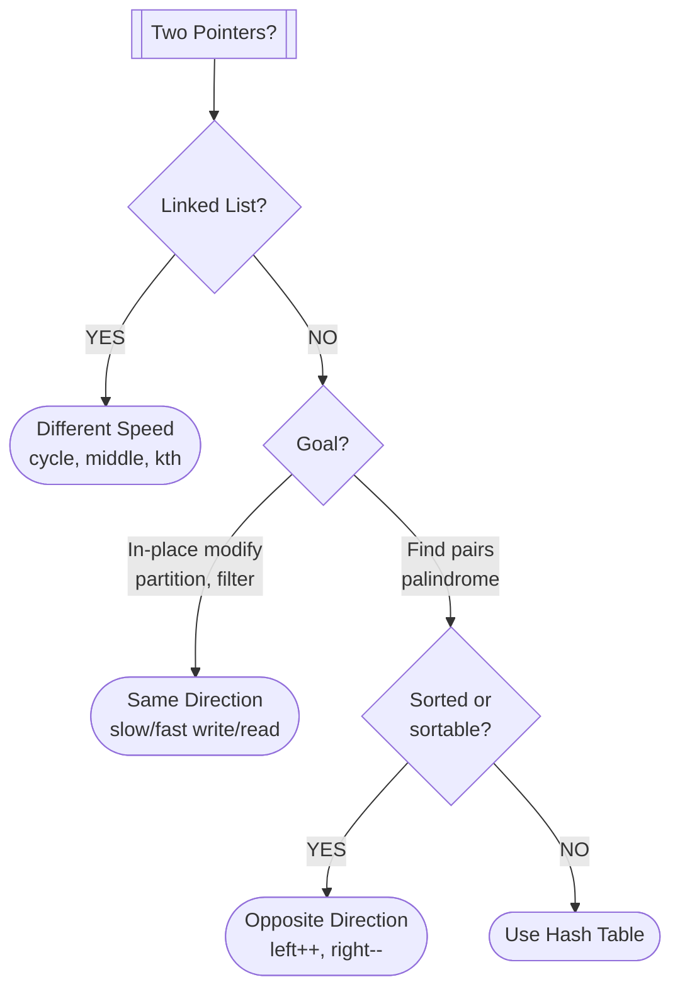

# Two Pointers

> Reduce O(n²) to O(n) by using two indices moving through data

---

## Important info

- Can be same/different direction/speed
- Same direction cursor conventions
    - Write Cursor: Points to the first available space where the next piece of incoming data will be
      stored
    - Read Cursor: Points to the first piece of available data that has not been read yet.

---

## Learning Objectives

By the end of this topic you will be able to:

- Explain why two pointers reduces O(n²) nested-loop problems to O(n)
- Implement all three two-pointer variants: opposite-direction, same-direction, and different-speed
- Identify which variant applies to a given problem (pair search vs. in-place modification vs. linked-list properties)
- Analyse the time and space complexity of each pattern
- Recognise when the sorted-array requirement is necessary and when it is not
- Compare two-pointer solutions against HashSet alternatives and justify the choice

---

!!! note "Operational reality"
    The merge step in every merge sort implementation is two pointers advancing through sorted sequences — it is so fundamental it becomes invisible. The partition step in quicksort is the same pattern with a write pointer trailing a read pointer. Outside of sorting, this shows up in streaming decoders: Protocol Buffers and most binary codec implementations use a read/write pointer pair to parse and emit data in a single pass without allocating intermediate buffers. The fast/slow pointer pattern (Floyd's cycle detection) is used in garbage collectors to detect reference cycles and in linked list implementations inside OS kernels.

## ELI5: Explain Like I'm 5

<div class="learner-section" markdown>

**Your task:** After implementing all three patterns, explain them simply.

**Prompts to guide you:**

1. **What is the two pointers pattern in one sentence?**
    - Your answer: <span class="fill-in">Avoiding the need to exhaustively "check every pair" by keeping track of two
      pointers and exploiting some property of the input</span>

2. **Why is it faster than nested loops?**
    - Your answer: <span class="fill-in">You don't need to check all combinations leading to fewer ops</span>

3. **Real-world analogy:**
    - Same direction partitioning: <span class="fill-in">Using your left arm to keep the good apples in your sweater and
      your right arm to sort new ones in or out. When you get a good one, your left arm moves a little to make room for
      the good apple</span>
    - Opposite direction matching: <span class="fill-in">You and your brother have 20 chuck-e-cheese tickets for 2
      prizes. You want to use all 20 tickets and all the prizes are sorted by ticket price.</span>
    - Different speeds exploring: <span class="fill-in">You're lost and walking along a rushing river. You throw a
      message in a bottle, wait a bit, then keep walking. If you eventually see the bottle again, you know you're on a
      circular river. Importantly, this wouldn't work if you started running the same speed as the river current!</span>

4. **When does this pattern work?**
    - Your answer: <span class="fill-in">When you can eliminate multiple possibilities with each pointer
      movement or when trying to explore paths and you can't store state.</span>

5. **When does this pattern fail?**
    - Your answer: <span class="fill-in">when you truly need to check every combination or when the problem requires
      random access to all elements simultaneously.</span>

</div>

---

## Core Implementation

### Pattern 1: Opposite Direction Pointers

**Concept:** Start from both ends, move toward each other.

**Use case:** Palindromes, pair sum in sorted array.

```java
--8<-- "com/study/dsa/twopointers/OppositeDirectionPointers.java"
```


!!! warning "Debugging Challenge — Broken Palindrome Checker"
    The `isPalindrome_Buggy` below has **2 bugs**. Find them before running the code.

    ```java
    public static boolean isPalindrome_Buggy(String s) {
        int left = 0;
        int right = s.length();
        while (left < right) {
            if (s.charAt(left) != s.charAt(right)) {
                return false;
            }
            left++;
            right--;
        }
        return true;
    }
    ```

    - Bug 1: <span class="fill-in">[What's the bug?]</span>
    - Bug 2: <span class="fill-in">[What's the bug?]</span>

    ??? success "Answer"
        **Bug 1 (initialisation):** `right` should be `s.length() - 1`, not `s.length()`. Array indices are 0-based, so `s.charAt(s.length())` throws `StringIndexOutOfBoundsException`.

        **Bug 2 (trick question):** Once Bug 1 is fixed the code is correct — the apparent second bug was a deliberate distraction. The lesson: always fix the most fundamental error first and re-trace before hunting for more.

---

### Pattern 2: Same Direction Pointers (Slow/Fast)

**Concept:** Both pointers move left to right, at different speeds.

**Use case:** Remove duplicates, partition array, in-place modifications.

```java
--8<-- "com/study/dsa/twopointers/SameDirectionPointers.java"
```


!!! warning "Debugging Challenge — Broken Remove Duplicates"
    The `removeDuplicates_Buggy` below has **1 critical bug** and **1 return-value bug**. Trace through `[1, 1, 2, 2, 3]` manually before checking the answer.

    ```java
    public static int removeDuplicates_Buggy(int[] nums) {
        int slow = 0;
        int fast = 1;
        while (fast < nums.length) {
            if (nums[fast] != nums[slow]) {
                nums[slow] = nums[fast];            slow++;
            }
            fast++;
        }
        return slow;
    }
    ```

    - Bug 1: <span class="fill-in">[What gets overwritten incorrectly?]</span>
    - Bug 2: <span class="fill-in">[What should the return value be?]</span>

    ??? success "Answer"
        **Bug 1:** `slow++` must come **before** `nums[slow] = nums[fast]`. The current order overwrites the unique element at `slow` before the write pointer has advanced, corrupting the first unique value.

        **Correct:**
        ```java
        if (nums[fast] != nums[slow]) {
            slow++;
            nums[slow] = nums[fast];
        }
        ```

        **Bug 2:** Should return `slow + 1`, not `slow`. The length is one more than the last written index.

---

### Pattern 3: Different Speed Pointers

**Concept:** One pointer moves faster than the other.

**Use case:** Linked list cycle detection, finding middle element.

```java
--8<-- "com/study/dsa/twopointers/DifferentSpeedPointers.java"
```


---

## Before/After: Why This Pattern Matters

**Your task:** Compare naive vs optimized approaches to understand the impact.

### Example: Find Pair Sum

**Problem:** Find two numbers in a sorted array that sum to a target.

#### Approach 1: Brute Force (Nested Loops)

```java
// Naive approach - Check all possible pairs
public static boolean hasPairSum_BruteForce(int[] nums, int target) {
    for (int i = 0; i < nums.length; i++) {
        for (int j = i + 1; j < nums.length; j++) {
            if (nums[i] + nums[j] == target) {
                return true;
            }
        }
    }
    return false;
}
```

**Analysis:**

- Time: O(n²) - For each element, check all remaining elements
- Space: O(1) - No extra space
- For n = 10,000: ~100,000,000 operations

#### Approach 2: Two Pointers (Optimized)

```java
// Optimized approach - Use two pointers from opposite ends
public static boolean hasPairSum_TwoPointers(int[] nums, int target) {
    int left = 0;
    int right = nums.length - 1;

    while (left < right) {
        int sum = nums[left] + nums[right];
        if (sum == target) return true;
        if (sum < target) left++;    // Need larger sum
        else right--;                 // Need smaller sum
    }

    return false;
}
```

**Analysis:**

- Time: O(n) - Each pointer moves at most n/2 steps
- Space: O(1) - No extra space
- For n = 10,000: ~10,000 operations

#### Performance Comparison

| Array Size | Brute Force (O(n²)) | Two Pointers (O(n)) | Speedup |
|------------|---------------------|---------------------|---------|
| n = 100    | 10,000 ops          | 100 ops             | 100x    |
| n = 1,000  | 1,000,000 ops       | 1,000 ops           | 1,000x  |
| n = 10,000 | 100,000,000 ops     | 10,000 ops          | 10,000x |

**Your calculation:** For n = 5,000, the speedup is approximately _____ times faster.

#### Why Does Two Pointers Work?

**Key insight to understand:**

In a sorted array `[1, 3, 5, 7, 9]` looking for sum = 10:

```
Step 1: left=0 (val=1), right=4 (val=9), sum=10 → FOUND!
```

If we were looking for sum = 12:

```
Step 1: left=0 (val=1), right=4 (val=9), sum=10 (too small)
        → Move left++ because we need a LARGER sum

Step 2: left=1 (val=3), right=4 (val=9), sum=12 → FOUND!
```

!!! note "Why can we skip pairs safely?"
    When `sum < target`, moving `right--` makes the sum even smaller — that direction is provably useless. Likewise, when `sum > target`, moving `left++` only increases the sum further. Sorted order guarantees that each pointer move eliminates an entire row or column of pairs from consideration, which is the source of the O(n) behaviour.

**After implementing, explain in your own words:**

<div class="learner-section" markdown>

- Why does sorted order matter? <span class="fill-in">[Your answer]</span>
- What pairs do we skip and why is it safe? <span class="fill-in">[Your answer]</span>

</div>

---

## Common Misconceptions

!!! danger "Misconception 1: Two pointers always requires a sorted array"
    Opposite-direction pointers for pair-sum **do** require sorted order, but same-direction and different-speed patterns do not. `moveZeroes`, `removeDuplicates`, and Floyd's cycle detection all work on unsorted or linked-list input. The sorting requirement is specific to the convergence proof for opposite-direction, not to the technique itself.

!!! danger "Misconception 2: Two pointers and sliding window are the same thing"
    Both use two indices, but the goals differ. Two pointers typically search for a **pair of elements** satisfying a condition, while sliding window maintains a **contiguous subarray** and tracks aggregate state (sum, frequency map) within it. A dynamic sliding window is a two-pointer technique, but two pointers is a broader category.

!!! danger "Misconception 3: Same-direction slow/fast pointers need different starting positions"
    It is tempting to start `slow = 0, fast = 1` always, but the correct starting position depends on the problem. For `removeDuplicates` both start at 0 (or 0 and 1); for Floyd's cycle detection both start at `head`. Internalise the **invariant** each pattern maintains rather than memorising the starting positions.

!!! warning "When it breaks"
    The opposite-direction variant requires a sorted array or a monotonic invariant — applying it to an unsorted array produces incorrect results with no error signal. Same-direction (slow/fast) has no such precondition. The pattern also breaks when you need all pairs with a given property and duplicates exist: moving the pointer past a duplicate without skipping all matching values produces duplicate result pairs, requiring explicit deduplication logic that is easy to omit.

---

## Decision Framework

<div class="learner-section" markdown>

**Your task:** Build decision trees for when to use two pointers.

### Question 1: Is the data sorted?

Answer after solving problems:

- **Why does sorting matter?** <span class="fill-in">Two pointers eliminates possibilities - we can only be sure we're
  not eliminating valid possibilities with sorted input. Sorting establishes a predictable relationship between elements
  and their positions.</span>
- **Can two pointers work on unsorted arrays?** <span class="fill-in">Yes but only when the array value is irrelevant,
  e.g. you're working with linkedlist pointers</span>

### Question 2: What are you looking for?

Answer for each pattern:

**Opposite direction when:**

- Looking for: <span class="fill-in">when you need to consider combinations from both ends of a sorted array</span>
- Movement rule: <span class="fill-in">Start at ends, conditionally move one of the pointers in each iter</span>
- Example problems: <span class="fill-in">Two Sum (sorted), Valid Palindrome, Container With Most Water, Trapping Rain Water, 3Sum/4Sum variants</span>

**Same direction when:**

- Looking for: <span class="fill-in">In-place array modification, partitioning (lomuto)</span>
- Movement rule: <span class="fill-in">Read and write pointer. ***Do a write each iteration*** but conditionally move pointers</span>
- Example problems: <span class="fill-in">Remove Duplicates from Sorted Array, Move Zeroes, Remove Element, Partition Array, Sort Colors (Dutch National Flag)</span>

**Different speed when:**
- Looking for: <span class="fill-in">Linked list structural properties</span>
- Movement rule: <span class="fill-in">Slow moves 1 step per iteration, fast moves 2 steps</span>
- Example problems: <span class="fill-in">Linked List Cycle I & II, Find Middle of Linked List, Kth Node From End, Happy Number, Reorder List</span>

### Your Decision Tree

Build this after solving practice problems:

```mermaid
flowchart TD
    Start[["Two Pointers?"]]

    Start --> Q1{Linked List?}
    Q1 -->|YES| DiffSpeed([Different Speed<br/>cycle, middle, kth])

    Q1 -->|NO| Q2{Goal?}

    Q2 -->|In-place modify<br/>partition, filter| SameDir([Same Direction<br/>slow/fast write/read])

    Q2 -->|Find pairs<br/>palindrome| Q3{Sorted or<br/>sortable?}
    Q3 -->|YES| OppDir([Opposite Direction<br/>left++, right--])
    Q3 -->|NO| Other([Use Hash Table])
```

</div>

---

## Practice

<div class="learner-section" markdown>

### LeetCode Problems

**Easy (Complete all 3):**

- [ ] [125. Valid Palindrome](https://leetcode.com/problems/valid-palindrome/)
    - Pattern: <span class="fill-in">[Which one?]</span>
    - Your solution time: <span class="fill-in">___</span>
    - Key insight: <span class="fill-in">[Fill in after solving]</span>

- [ ] [26. Remove Duplicates from Sorted Array](https://leetcode.com/problems/remove-duplicates-from-sorted-array/)
    - Pattern: <span class="fill-in">[Which one?]</span>
    - Your solution time: <span class="fill-in">___</span>
    - Key insight: <span class="fill-in">[Fill in]</span>

- [ ] [283. Move Zeroes](https://leetcode.com/problems/move-zeroes/)
    - Pattern: <span class="fill-in">[Which one?]</span>
    - Your solution time: <span class="fill-in">___</span>
    - Key insight: <span class="fill-in">[Fill in]</span>

**Medium (Complete 2-3):**

- [ ] [15. 3Sum](https://leetcode.com/problems/3sum/)
    - Pattern: <span class="fill-in">[Extension of which pattern?]</span>
    - Difficulty: <span class="fill-in">[Rate 1-10]</span>
    - Key insight: <span class="fill-in">[Fill in]</span>
    - Mistake made: <span class="fill-in">[Fill in if any]</span>

- [ ] [11. Container With Most Water](https://leetcode.com/problems/container-with-most-water/)
    - Pattern: <span class="fill-in">[Which one?]</span>
    - Difficulty: <span class="fill-in">[Rate 1-10]</span>
    - Key insight: <span class="fill-in">[Fill in]</span>

- [ ] [167. Two Sum II](https://leetcode.com/problems/two-sum-ii-input-array-is-sorted/)
    - Pattern: <span class="fill-in">[Which one?]</span>
    - Comparison to Two Sum I: <span class="fill-in">[How is it different?]</span>

**Hard (Optional):**

- [ ] [42. Trapping Rain Water](https://leetcode.com/problems/trapping-rain-water/)
    - Pattern: <span class="fill-in">[Which variant?]</span>
    - Key insight: <span class="fill-in">[Fill in after solving]</span>

**Failure modes:**

- What happens if both pointers converge without finding a valid pair — does your loop terminate correctly or does it overshoot and access out-of-bounds indices? <span class="fill-in">[Fill in]</span>
- How does your implementation behave when the array has exactly two elements and neither pointer can advance past the other? <span class="fill-in">[Fill in]</span>

</div>

---

## Test Your Understanding

Answer these questions without looking at your notes. Write a sentence or two for each.

1. **You are given an unsorted array and asked to find whether any two elements sum to a target. A colleague suggests two pointers. Is that correct? What must be done first, and what is the total time complexity including that step?**

    ??? success "Rubric"
        A complete answer addresses: (1) two pointers for pair-sum requires sorted order for the convergence proof to hold — without it, skipping a pointer position is not safe; (2) sorting costs O(n log n), which dominates the O(n) pointer scan, giving a total of O(n log n); (3) a HashSet alternative achieves O(n) time with O(n) space and does not require sorting, so the choice depends on whether extra space is acceptable.

2. **Explain in your own words why Floyd's cycle detection (slow/fast pointers) is guaranteed to detect a cycle if one exists. What happens to the gap between the pointers inside a cycle?**

    ??? success "Rubric"
        A complete answer addresses: (1) once both pointers enter the cycle, the fast pointer gains one position on the slow pointer per step (it moves 2, slow moves 1, so the gap closes by 1 each round); (2) because the gap decreases by 1 each step modulo the cycle length, the pointers must eventually occupy the same node — they cannot skip past each other; (3) if there is no cycle, fast reaches null in finite time, terminating the algorithm without a false positive.

3. **You implement `removeDuplicates` and get the wrong length back. You print the array and the values look correct. What is the most likely bug, and why does the array look right even though the length is wrong?**

    ??? success "Rubric"
        A complete answer addresses: (1) the most likely bug is returning `slow` instead of `slow + 1` — the slow pointer is an index, and the count of unique elements is always one more than the last index written; (2) the array "looks correct" because the in-place writes are done properly — the bug is purely in the return value, not the element placement; (3) a related bug is advancing slow before writing, which shifts the first unique element, but this produces a visibly wrong array, not just a wrong length.

4. **A friend says "same-direction pointers are just a slower version of sliding window." What is the key distinction? Give one problem that clearly belongs to same-direction two pointers but not sliding window.**

    ??? success "Rubric"
        A complete answer addresses: (1) same-direction two pointers track two specific element positions and perform in-place writes between them; sliding window tracks aggregate state (sum, frequency count) across a contiguous subarray; (2) same-direction pointers do not maintain a running window value — the "fast" pointer is a scout, not a window boundary; (3) `moveZeroes` or `partition` are canonical same-direction problems — there is no window value to aggregate, only positional logic.

5. **Trapping Rain Water (LeetCode 42) can be solved with O(n) space using prefix arrays, or with O(1) space using two pointers. Describe the core insight that lets the two-pointer solution avoid the prefix arrays.**

    ??? success "Rubric"
        A complete answer addresses: (1) the water at any index is bounded by `min(maxLeft, maxRight)` — the two-pointer solution observes that whichever side has the smaller current max fully determines the water at that pointer without needing the other side's full prefix array; (2) if `maxLeft < maxRight`, you can safely compute water at `left` because the right side is guaranteed to be at least as tall, so move left inward; (3) the two pointers maintain running max-left and max-right variables, replacing the O(n) prefix arrays with O(1) accumulators.

---

## Connected Topics

<div class="bs-callout bs-callout-info" markdown>

**Where this topic connects**

- **02. Sliding Window** — sliding window is a specialised two-pointer technique where both pointers advance in the same direction to maintain a window → [02. Sliding Window](02-sliding-window.md)
- **04. Linked Lists** — fast/slow pointer (Floyd's cycle detection) is a direct application of the two-pointer pattern to linked structures → [04. Linked Lists](04-linked-lists.md)

</div>
