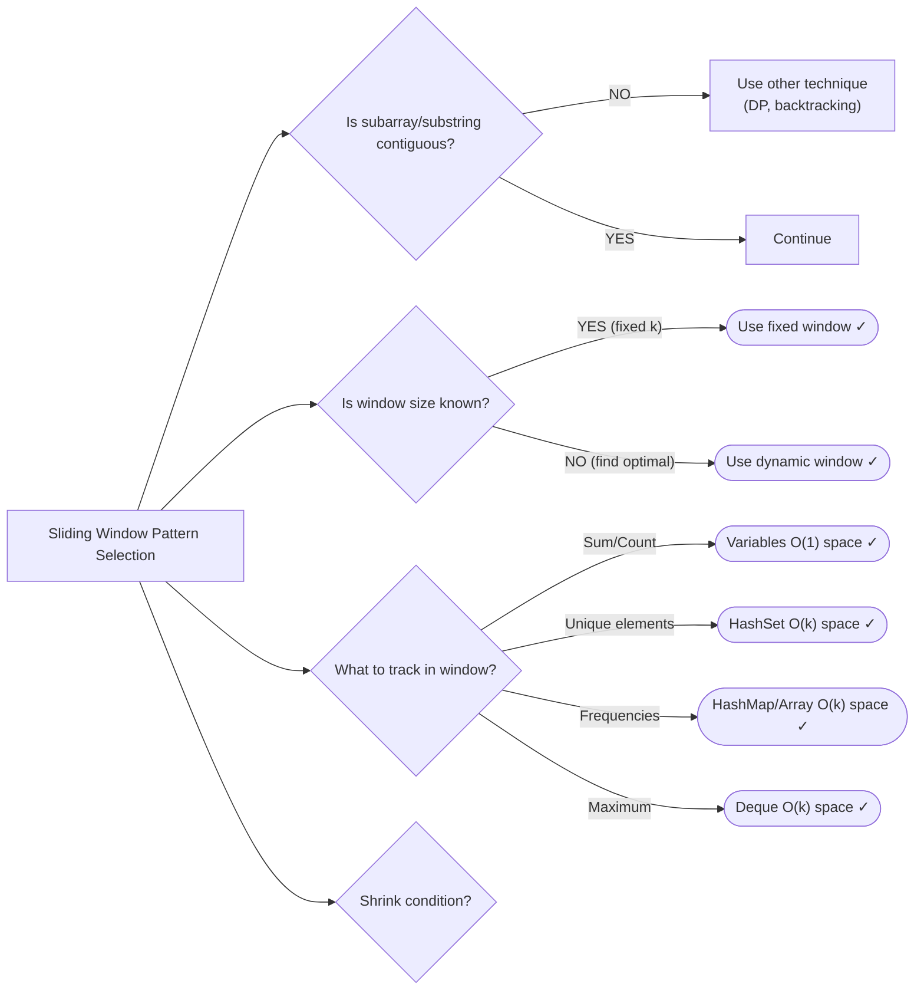

# 02. Sliding Window

> Optimize subarray/substring problems from O(n²) to O(n)

---

## ELI5: Explain Like I'm 5

<div class="learner-section" markdown>

**Your task:** After implementing all patterns, explain them simply.

**Prompts to guide you:**

1. **What is the sliding window pattern in one sentence?**
    - Your answer: <span class="fill-in">[Fill in after implementation]</span>

2. **How is it different from two pointers?**
    - Your answer: <span class="fill-in">[Fill in after implementation]</span>

3. **Real-world analogy:**
    - Example: "Sliding window is like a camera viewfinder moving across a scene..."
    - Your analogy: <span class="fill-in">[Fill in]</span>

4. **When does this pattern work?**
    - Your answer: <span class="fill-in">[Fill in after solving problems]</span>

5. **When does this pattern fail?**
    - Your answer: <span class="fill-in">[Fill in after trying non-contiguous problems]</span>

</div>

---

## Quick Quiz (Do BEFORE implementing)

<div class="learner-section" markdown>

**Your task:** Test your intuition without looking at code. Answer these, then verify after implementation.

### Complexity Predictions

1. **Two nested loops finding max sum of k elements:**
    - Time complexity: <span class="fill-in">[Your guess: O(?)]</span>
    - Verified after learning: <span class="fill-in">[Actual: O(?)]</span>

2. **Sliding window finding max sum of k elements:**
    - Time complexity: <span class="fill-in">[Your guess: O(?)]</span>
    - Space complexity: <span class="fill-in">[Your guess: O(?)]</span>
    - Verified: <span class="fill-in">[Actual]</span>

3. **Speedup calculation:**
    - If n = 1,000 and k = 100, nested loops = n × k = <span class="fill-in">_____</span> operations
    - Sliding window = n = <span class="fill-in">_____</span> operations
    - Speedup factor: <span class="fill-in">_____</span> times faster

### Scenario Predictions

**Scenario 1:** Find maximum sum of 3 consecutive elements in `[1, 4, 2, 10, 2, 3, 1, 0, 20]`

- **Can you use sliding window?** <span class="fill-in">[Yes/No - Why?]</span>
- **Window type:** <span class="fill-in">[Fixed/Dynamic - Why?]</span>
- **What do you track in the window?** <span class="fill-in">[Sum? Elements? Other?]</span>
- **When you slide from index 0-2 to 1-3, what changes?** <span class="fill-in">[Fill in]</span>

**Scenario 2:** Find longest substring without repeating characters in `"abcabcbb"`

- **Can you use sliding window?** <span class="fill-in">[Yes/No - Why?]</span>
- **Window type:** <span class="fill-in">[Fixed/Dynamic - Why?]</span>
- **What happens when you encounter a duplicate?** <span class="fill-in">[Expand/Shrink window?]</span>
- **What data structure tracks window state?** <span class="fill-in">[Fill in]</span>

**Scenario 3:** Find subarray with sum = 10 in `[1, 2, 3, 7, 5]` (can be non-contiguous)

- **Can you use sliding window?** <span class="fill-in">[Yes/No - Why?]</span>
- **What's the key requirement that breaks sliding window?** <span class="fill-in">[Fill in]</span>

### Trade-off Quiz

**Question:** When would brute force be SIMPLER than sliding window for max sum of k elements?

- Your answer: <span class="fill-in">[Fill in before implementation]</span>
- Verified answer: <span class="fill-in">[Fill in after learning]</span>

**Question:** What's the MAIN requirement for sliding window to work?

- [ ] Array must be sorted
- [ ] Problem involves contiguous subarray/substring
- [ ] Window size must be constant
- [ ] Array must contain positive integers

Verify after implementation: <span class="fill-in">[Which one(s)?]</span>

**Question:** Fixed vs Dynamic window - which applies when?

- **Fixed window when:** <span class="fill-in">[Fill in]</span>
- **Dynamic window when:** <span class="fill-in">[Fill in]</span>

</div>

---

## Before/After: Why This Pattern Matters

**Your task:** Compare naive vs optimized approaches to understand the impact.

### Example: Maximum Sum of K Consecutive Elements

**Problem:** Find the maximum sum of any k consecutive elements in an array.

#### Approach 1: Brute Force (Nested Loops)

```java
// Naive approach - Recalculate sum for each window
public static int maxSum_BruteForce(int[] nums, int k) {
    if (nums.length < k) return 0;

    int maxSum = Integer.MIN_VALUE;

    // For each possible starting position
    for (int i = 0; i <= nums.length - k; i++) {
        int windowSum = 0;

        // Calculate sum of k elements starting at i
        for (int j = i; j < i + k; j++) {
            windowSum += nums[j];
        }

        maxSum = Math.max(maxSum, windowSum);
    }

    return maxSum;
}
```

**Analysis:**

- Time: O(n × k) - For each of n-k positions, sum k elements
- Space: O(1) - No extra space
- For n = 10,000, k = 100: ~1,000,000 operations

#### Approach 2: Sliding Window (Optimized)

```java
// Optimized approach - Reuse previous sum by sliding
public static int maxSum_SlidingWindow(int[] nums, int k) {
    if (nums.length < k) return 0;

    // Calculate sum of first window
    int windowSum = 0;
    for (int i = 0; i < k; i++) {
        windowSum += nums[i];
    }
    int maxSum = windowSum;

    // Slide window: remove left, add right
    for (int i = k; i < nums.length; i++) {
        windowSum = windowSum - nums[i - k] + nums[i];  // KEY: Reuse previous sum!
        maxSum = Math.max(maxSum, windowSum);
    }

    return maxSum;
}
```

**Analysis:**

- Time: O(n) - One pass to build first window, one pass to slide
- Space: O(1) - Only track window sum
- For n = 10,000, k = 100: ~10,000 operations

#### Performance Comparison

| Array Size (n) | Window Size (k) | Brute Force (O(n×k)) | Sliding Window (O(n)) | Speedup |
|----------------|-----------------|----------------------|-----------------------|---------|
| n = 100        | k = 10          | 1,000 ops            | 100 ops               | 10x     |
| n = 1,000      | k = 100         | 100,000 ops          | 1,000 ops             | 100x    |
| n = 10,000     | k = 100         | 1,000,000 ops        | 10,000 ops            | 100x    |

**Your calculation:** For n = 5,000 and k = 50, the speedup is approximately _____ times faster.

#### Why Does Sliding Window Work?

**Key insight to understand:**

In array `[1, 4, 2, 10, 2, 3]` with k = 3:

```
Window 1: [1, 4, 2]     sum = 7
Window 2:    [4, 2, 10]  sum = 16

Brute force: Calculate 4 + 2 + 10 = 16 (3 operations)
Sliding window: Previous sum (7) - 1 + 10 = 16 (2 operations)
```

**Why can we reuse the sum?**

- Window 2 shares elements [4, 2] with Window 1
- Only difference: remove leftmost (1), add rightmost (10)
- No need to recalculate the shared elements!

**Visualization:**

```
[1, 4, 2, 10, 2, 3]
 ^-----^              Window 1: sum = 7
    ^-----^           Window 2: Remove 1, Add 10 → sum = 7 - 1 + 10 = 16
       ^-----^        Window 3: Remove 4, Add 2 → sum = 16 - 4 + 2 = 14
```

**After implementing, explain in your own words:**

<div class="learner-section" markdown>

- Why does the window "slide" instead of "jump"? <span class="fill-in">[Your answer]</span>
- What would happen if the window wasn't contiguous? <span class="fill-in">[Your answer]</span>
- How is this different from two pointers? <span class="fill-in">[Your answer]</span>

</div>

---

## Core Implementation

### Pattern 1: Fixed Window Size

**Concept:** Window size is constant, slide one position at a time.

**Use case:** Maximum/minimum of k consecutive elements, average of subarrays.

```java
public class FixedWindow {

    /**
     * Problem: Maximum sum of K consecutive elements
     * Time: O(n), Space: O(1)
     *
     * TODO: Implement fixed window
     */
    public static double maxAverageSubarray(int[] nums, int k) {
        if (nums.length < k) return 0.0;

        // TODO: Calculate sum of first k elements
        //   int windowSum = 0;
        //   for (int i = 0; i < k; i++) windowSum += nums[i];
        //   double maxAvg = windowSum / (double) k;

        // TODO: Slide window:
        //   for (int i = k; i < nums.length; i++)
        //     Remove nums[i-k] from windowSum
        //     Add nums[i] to windowSum
        //     Update maxAvg if needed

        return 0.0; // Replace with implementation
    }

    /**
     * Problem: Contains nearby duplicate within k distance
     * Time: O(n), Space: O(k)
     *
     * TODO: Implement using HashSet as fixed window
     */
    public static boolean containsNearbyDuplicate(int[] nums, int k) {
        // TODO: Create HashSet for window
        //   Set<Integer> window = new HashSet<>();

        // TODO: For each index i:
        //   If window contains nums[i], return true
        //   Add nums[i] to window
        //   If window.size() > k, remove nums[i-k]

        return false; // Replace with implementation
    }

    /**
     * Problem: Maximum of all subarrays of size k
     * Time: O(n), Space: O(k) using deque
     *
     * TODO: Implement using deque for efficient max tracking
     */
    public static int[] maxSlidingWindow(int[] nums, int k) {
        // TODO: Use Deque<Integer> to store indices
        //   Deque stores indices in decreasing order of values
        //   Front of deque always has index of maximum in current window

        return new int[0]; // Replace with implementation
    }
}
```

**Runnable Client Code:**

```java
import java.util.*;

public class FixedWindowClient {

    public static void main(String[] args) {
        System.out.println("=== Fixed Window Size ===\n");

        // Test 1: Max average subarray
        System.out.println("--- Test 1: Max Average ---");
        int[] nums1 = {1, 12, -5, -6, 50, 3};
        int k1 = 4;

        double maxAvg = FixedWindow.maxAverageSubarray(nums1, k1);
        System.out.printf("Array: %s%n", Arrays.toString(nums1));
        System.out.printf("k = %d%n", k1);
        System.out.printf("Max average: %.2f%n", maxAvg);

        // Test 2: Contains nearby duplicate
        System.out.println("\n--- Test 2: Nearby Duplicate ---");
        int[][] dupTests = {
            {1, 2, 3, 1},     // k=3, should be true
            {1, 0, 1, 1},     // k=1, should be true
            {1, 2, 3, 1, 2, 3} // k=2, should be false
        };
        int[] kValues = {3, 1, 2};

        for (int i = 0; i < dupTests.length; i++) {
            boolean hasDup = FixedWindow.containsNearbyDuplicate(dupTests[i], kValues[i]);
            System.out.printf("Array: %s, k=%d -> %b%n",
                Arrays.toString(dupTests[i]), kValues[i], hasDup);
        }

        // Test 3: Max sliding window
        System.out.println("\n--- Test 3: Max Sliding Window ---");
        int[] nums3 = {1, 3, -1, -3, 5, 3, 6, 7};
        int k3 = 3;

        int[] maxes = FixedWindow.maxSlidingWindow(nums3, k3);
        System.out.printf("Array: %s%n", Arrays.toString(nums3));
        System.out.printf("k = %d%n", k3);
        System.out.printf("Maximums: %s%n", Arrays.toString(maxes));
    }
}
```

---

### Pattern 2: Dynamic Window Size

**Concept:** Window expands and contracts based on condition.

**Use case:** Longest/shortest substring with constraint, subarray sum.

```java
import java.util.*;

public class DynamicWindow {

    /**
     * Problem: Longest substring without repeating characters
     * Time: O(n), Space: O(k) where k = unique chars
     *
     * TODO: Implement dynamic window with HashSet
     */
    public static int lengthOfLongestSubstring(String s) {
        Set<Character> window = new HashSet<>();
        int left = 0, maxLen = 0;

        // TODO: For each right pointer (0 to s.length()):
        //   char c = s.charAt(right)
        //   While window contains c:
        //     Remove s.charAt(left) from window
        //     left++
        //   Add c to window
        //   Update maxLen = Math.max(maxLen, right - left + 1)

        return 0; // Replace with implementation
    }

    /**
     * Problem: Longest substring with at most K distinct characters
     * Time: O(n), Space: O(k)
     *
     * TODO: Implement with HashMap for frequency counting
     */
    public static int lengthOfLongestSubstringKDistinct(String s, int k) {
        if (k == 0) return 0;

        Map<Character, Integer> window = new HashMap<>();
        int left = 0, maxLen = 0;

        // TODO: For each right pointer:
        //   Add s.charAt(right) to window (increment frequency)
        //   While window.size() > k:
        //     Decrease frequency of s.charAt(left)
        //     If frequency becomes 0, remove from window
        //     left++
        //   Update maxLen

        return 0; // Replace with implementation
    }

    /**
     * Problem: Minimum size subarray sum >= target
     * Time: O(n), Space: O(1)
     *
     * TODO: Implement shrinking window
     */
    public static int minSubArrayLen(int target, int[] nums) {
        int left = 0, sum = 0, minLen = Integer.MAX_VALUE;

        // TODO: For each right pointer:
        //   Add nums[right] to sum
        //   While sum >= target:
        //     Update minLen = Math.min(minLen, right - left + 1)
        //     Subtract nums[left] from sum
        //     left++

        // TODO: Return minLen == Integer.MAX_VALUE ? 0 : minLen

        return 0; // Replace with implementation
    }
}
```

**Runnable Client Code:**

```java
import java.util.*;

public class DynamicWindowClient {

    public static void main(String[] args) {
        System.out.println("=== Dynamic Window Size ===\n");

        // Test 1: Longest substring without repeating
        System.out.println("--- Test 1: Longest Substring (No Repeats) ---");
        String[] test1 = {"abcabcbb", "bbbbb", "pwwkew", ""};

        for (String s : test1) {
            int len = DynamicWindow.lengthOfLongestSubstring(s);
            System.out.printf("\"%s\" -> %d%n", s, len);
        }

        // Test 2: Longest with K distinct
        System.out.println("\n--- Test 2: K Distinct Characters ---");
        String[] test2 = {"eceba", "aa", "aaabbccd"};
        int[] kValues = {2, 1, 2};

        for (int i = 0; i < test2.length; i++) {
            int len = DynamicWindow.lengthOfLongestSubstringKDistinct(test2[i], kValues[i]);
            System.out.printf("\"%s\", k=%d -> %d%n", test2[i], kValues[i], len);
        }

        // Test 3: Minimum subarray sum
        System.out.println("\n--- Test 3: Min Subarray Sum >= Target ---");
        int[][] arrays = {
            {2, 3, 1, 2, 4, 3},
            {1, 4, 4},
            {1, 1, 1, 1, 1, 1, 1, 1}
        };
        int[] targets = {7, 4, 11};

        for (int i = 0; i < arrays.length; i++) {
            int minLen = DynamicWindow.minSubArrayLen(targets[i], arrays[i]);
            System.out.printf("Array: %s, target=%d -> %d%n",
                Arrays.toString(arrays[i]), targets[i], minLen);
        }
    }
}
```

---

### Pattern 3: String Problems with Window

**Concept:** Track character frequencies in window for pattern matching.

**Use case:** Anagram problems, substring with all characters.

```java
import java.util.*;

public class StringWindow {

    /**
     * Problem: Find all anagrams of pattern in string
     * Time: O(n), Space: O(1) - only 26 letters
     *
     * TODO: Implement using frequency arrays
     */
    public static List<Integer> findAnagrams(String s, String p) {
        List<Integer> result = new ArrayList<>();
        if (s.length() < p.length()) return result;

        // TODO: Create frequency array for pattern p
        //   int[] pCount = new int[26];
        //   for (char c : p.toCharArray()) pCount[c - 'a']++;

        // TODO: Create frequency array for current window
        //   int[] sCount = new int[26];

        // TODO: Fixed window of size p.length()
        //   Build first window
        //   Compare counts, if match add index 0
        //   Slide window: remove left, add right, compare

        return result; // Replace with implementation
    }

    /**
     * Problem: Permutation in string (s2 contains permutation of s1)
     * Time: O(n), Space: O(1)
     *
     * TODO: Implement using sliding window comparison
     */
    public static boolean checkInclusion(String s1, String s2) {
        if (s1.length() > s2.length()) return false;

        // TODO: Similar to findAnagrams but return true on first match

        return false; // Replace with implementation
    }

    /**
     * Problem: Minimum window substring containing all chars of t
     * Time: O(n + m), Space: O(k) where k = unique chars
     *
     * TODO: Implement using two frequency maps
     */
    public static String minWindow(String s, String t) {
        if (s.isEmpty() || t.isEmpty()) return "";

        // TODO: Create frequency map for t
        //   Map<Character, Integer> required = new HashMap<>();

        // TODO: Track matched characters
        //   int matched = 0, required_size = required.size()

        // TODO: Expand right, shrink left when valid
        //   Track minimum window start and length

        return ""; // Replace with implementation
    }
}
```

**Runnable Client Code:**

```java
import java.util.*;

public class StringWindowClient {

    public static void main(String[] args) {
        System.out.println("=== String Window Problems ===\n");

        // Test 1: Find anagrams
        System.out.println("--- Test 1: Find Anagrams ---");
        String[][] anagramTests = {
            {"cbaebabacd", "abc"},
            {"abab", "ab"}
        };

        for (String[] test : anagramTests) {
            List<Integer> indices = StringWindow.findAnagrams(test[0], test[1]);
            System.out.printf("s=\"%s\", p=\"%s\" -> %s%n",
                test[0], test[1], indices);
        }

        // Test 2: Check inclusion
        System.out.println("\n--- Test 2: Permutation In String ---");
        String[][] inclusionTests = {
            {"ab", "eidbaooo"},
            {"ab", "eidboaoo"},
            {"abc", "bbbca"}
        };

        for (String[] test : inclusionTests) {
            boolean found = StringWindow.checkInclusion(test[0], test[1]);
            System.out.printf("s1=\"%s\", s2=\"%s\" -> %b%n",
                test[0], test[1], found);
        }

        // Test 3: Minimum window
        System.out.println("\n--- Test 3: Minimum Window Substring ---");
        String[][] windowTests = {
            {"ADOBECODEBANC", "ABC"},
            {"a", "a"},
            {"a", "aa"}
        };

        for (String[] test : windowTests) {
            String result = StringWindow.minWindow(test[0], test[1]);
            System.out.printf("s=\"%s\", t=\"%s\" -> \"%s\"%n",
                test[0], test[1], result);
        }
    }
}
```

---

### Pattern 4: Two Pointers + Window Hybrid

**Concept:** Combine sliding window with two-pointer techniques.

**Use case:** Character replacement, fruit baskets, longest repeating replacement.

```java
import java.util.*;

public class HybridWindow {

    /**
     * Problem: Longest repeating character replacement
     * Time: O(n), Space: O(1) - only 26 letters
     *
     * TODO: Implement window with character replacement
     */
    public static int characterReplacement(String s, int k) {
        int[] count = new int[26];
        int left = 0, maxCount = 0, maxLen = 0;

        // TODO: For each right pointer:
        //   Increment count[s.charAt(right) - 'A']
        //   Update maxCount (most frequent char in window)
        //   If (window_size - maxCount) > k:
        //     Need to shrink window
        //     Decrement count[s.charAt(left) - 'A']
        //     left++
        //   Update maxLen

        return 0; // Replace with implementation
    }

    /**
     * Problem: Max consecutive ones with k flips
     * Time: O(n), Space: O(1)
     *
     * TODO: Implement window tracking flips
     */
    public static int longestOnes(int[] nums, int k) {
        int left = 0, zeros = 0, maxLen = 0;

        // TODO: For each right pointer:
        //   If nums[right] == 0, increment zeros
        //   While zeros > k:
        //     If nums[left] == 0, decrement zeros
        //     left++
        //   Update maxLen

        return 0; // Replace with implementation
    }

    /**
     * Problem: Fruits into baskets (at most 2 types)
     * Time: O(n), Space: O(1)
     *
     * TODO: Implement window with at most 2 distinct elements
     */
    public static int totalFruit(int[] fruits) {
        Map<Integer, Integer> basket = new HashMap<>();
        int left = 0, maxFruits = 0;

        // TODO: For each right pointer:
        //   Add fruits[right] to basket
        //   While basket.size() > 2:
        //     Remove fruits[left] from basket
        //     left++
        //   Update maxFruits

        return 0; // Replace with implementation
    }
}
```

**Runnable Client Code:**

```java
import java.util.*;

public class HybridWindowClient {

    public static void main(String[] args) {
        System.out.println("=== Two Pointers + Window Hybrid ===\n");

        // Test 1: Character replacement
        System.out.println("--- Test 1: Character Replacement ---");
        String[] strings = {"ABAB", "AABABBA", "AAAA"};
        int[] kValues = {2, 1, 2};

        for (int i = 0; i < strings.length; i++) {
            int len = HybridWindow.characterReplacement(strings[i], kValues[i]);
            System.out.printf("s=\"%s\", k=%d -> %d%n",
                strings[i], kValues[i], len);
        }

        // Test 2: Max consecutive ones
        System.out.println("\n--- Test 2: Max Consecutive Ones ---");
        int[][] arrays = {
            {1, 1, 1, 0, 0, 0, 1, 1, 1, 1, 0},
            {0, 0, 1, 1, 0, 0, 1, 1, 1, 0, 1, 1, 0, 0, 0, 1, 1, 1, 1}
        };
        int[] flips = {2, 3};

        for (int i = 0; i < arrays.length; i++) {
            int len = HybridWindow.longestOnes(arrays[i], flips[i]);
            System.out.printf("Array: %s%n", Arrays.toString(arrays[i]));
            System.out.printf("k=%d -> %d%n%n", flips[i], len);
        }

        // Test 3: Fruits into baskets
        System.out.println("--- Test 3: Fruits Into Baskets ---");
        int[][] fruitArrays = {
            {1, 2, 1},
            {0, 1, 2, 2},
            {1, 2, 3, 2, 2}
        };

        for (int[] fruits : fruitArrays) {
            int total = HybridWindow.totalFruit(fruits);
            System.out.printf("Fruits: %s -> %d%n",
                Arrays.toString(fruits), total);
        }
    }
}
```

---

## Debugging Challenges

**Your task:** Find and fix bugs in broken implementations. This tests your understanding of sliding window mechanics.

### Challenge 1: Broken Fixed Window (Max Average)

```java
/**
 * Find maximum average of k consecutive elements.
 * This has 2 BUGS. Find them!
 */
public static double maxAverage_Buggy(int[] nums, int k) {
    int windowSum = 0;

    // Build first window
    for (int i = 0; i <= k; i++) {        windowSum += nums[i];
    }

    double maxAvg = windowSum / k;

    // Slide window
    for (int i = k; i < nums.length; i++) {
        windowSum = windowSum - nums[i - k] + nums[i];
        maxAvg = Math.max(maxAvg, windowSum / k);    }

    return maxAvg;
}
```

**Your debugging:**

- Bug 1: <span class="fill-in">[What\'s the bug?]</span>

- Bug 2: <span class="fill-in">[What\'s the bug?]</span>

**Test case to expose bugs:**

- Input: `nums = [1, 12, -5, -6, 50, 3]`, `k = 4`
- Expected: Maximum average should be `12.75` (for subarray `[12, -5, -6, 50]`)
- Actual with bugs: <span class="fill-in">[Trace through manually]</span>

<details markdown>
<summary>Click to verify your answers</summary>

**Bug 1 (Line 5):** Loop should be `i < k`, not `i <= k`. We want k elements (indices 0 to k-1), not k+1 elements.

**Bug 2 (Line 15):** `windowSum / k` performs integer division. Should be `windowSum / (double) k` to get accurate
average.

**Correct code:**

```java
for (int i = 0; i < k; i++) {  // Fixed: i < k
    windowSum += nums[i];
}
double maxAvg = windowSum / (double) k;  // Fixed: cast to double

for (int i = k; i < nums.length; i++) {
    windowSum = windowSum - nums[i - k] + nums[i];
    maxAvg = Math.max(maxAvg, windowSum / (double) k);  // Fixed: cast to double
}
```

</details>

---

### Challenge 2: Broken Dynamic Window (Longest Substring)

```java
/**
 * Find longest substring without repeating characters.
 * This has 1 CRITICAL BUG. Find it!
 */
public static int longestSubstring_Buggy(String s) {
    Set<Character> window = new HashSet<>();
    int left = 0, maxLen = 0;

    for (int right = 0; right < s.length(); right++) {
        char c = s.charAt(right);

        while (window.contains(c)) {
            window.remove(s.charAt(left));
            left++;
        }

        window.add(c);
        maxLen = Math.max(maxLen, window.size());    }

    return maxLen;
}
```

**Your debugging:**

- Bug: <span class="fill-in">[What\'s the bug?]</span>

**Trace through example:**

- Input: `"abcabcbb"`
- Expected: `3` (substring "abc")
- Trace the window and maxLen calculation at each step: <span class="fill-in">[Fill in]</span>

<details markdown>
<summary>Click to verify your answer</summary>

**Bug (Line 16):** Using `window.size()` seems correct but could fail in edge cases. The proper calculation is
`right - left + 1` to get the current window length.

**Why the bug is subtle:** In this specific implementation, `window.size()` and `right - left + 1` are usually the same
because we maintain a set. However, using indices is the standard approach and more explicit.

**Correct:**

```java
maxLen = Math.max(maxLen, right - left + 1);  // Proper window length calculation
```

**Note:** This is a subtle bug because the code might work in many cases, but using index-based calculation is clearer
and more maintainable.
</details>

---

### Challenge 3: Broken Window Shrinking Logic

```java
/**
 * Find minimum subarray length with sum >= target.
 * This has 1 CRITICAL BUG in shrinking logic.
 */
public static int minSubArrayLen_Buggy(int target, int[] nums) {
    int left = 0, sum = 0, minLen = Integer.MAX_VALUE;

    for (int right = 0; right < nums.length; right++) {
        sum += nums[right];

        if (sum >= target) {            minLen = Math.min(minLen, right - left + 1);
            sum -= nums[left];
            left++;
        }
    }

    return minLen == Integer.MAX_VALUE ? 0 : minLen;
}
```

**Your debugging:**

- **Bug location:** <span class="fill-in">[What's wrong with the condition?]</span>
- **Bug explanation:** <span class="fill-in">[Why does IF fail but WHILE works?]</span>

**Test case to expose bug:**

- Input: `nums = [2, 3, 1, 2, 4, 3]`, `target = 7`
- Expected: `2` (subarray `[4, 3]`)
- Actual with buggy code: <span class="fill-in">[Trace through and predict]</span>

**Trace manually:**

```
right=0: sum=2, sum < 7, skip
right=1: sum=5, sum < 7, skip
right=2: sum=6, sum < 7, skip
right=3: sum=8, sum >= 7, minLen=4, left=1, sum=6
right=4: sum=10, sum >= 7, minLen=4 (not updated!), left=2, sum=8
...
```

<details markdown>
<summary>Click to verify your answer</summary>

**Bug (Line 7):** Should be `while (sum >= target)` instead of `if (sum >= target)`.

**Why:** When we find a valid window, we should shrink it as much as possible to find the minimum length. Using `if`
only shrinks once, but we might be able to shrink multiple times and still maintain `sum >= target`.

**Correct:**

```java
while (sum >= target) {  // Keep shrinking while valid
    minLen = Math.min(minLen, right - left + 1);
    sum -= nums[left];
    left++;
}
```

**Key insight:** Dynamic windows often need `while` loops for shrinking, not `if` statements, because you want to shrink
as much as possible while maintaining the constraint.
</details>

---

### Challenge 4: Not Shrinking Window at All

```java
/**
 * Longest substring with at most K distinct characters.
 * This code expands the window but NEVER SHRINKS it properly!
 */
public static int longestKDistinct_Buggy(String s, int k) {
    Map<Character, Integer> window = new HashMap<>();
    int left = 0, maxLen = 0;

    for (int right = 0; right < s.length(); right++) {
        char c = s.charAt(right);
        window.put(c, window.getOrDefault(c, 0) + 1);

        if (window.size() > k) {            char leftChar = s.charAt(left);
            window.put(leftChar, window.get(leftChar) - 1);
            left++;
        }

        maxLen = Math.max(maxLen, right - left + 1);
    }

    return maxLen;
}
```

**Your debugging:**

- **Bug 1:** <span class="fill-in">[Why is checking size > k once not enough?]</span>
- **Bug 2:** <span class="fill-in">[What happens if frequency becomes 0?]</span>
- **Fixes:** <span class="fill-in">[Fill in both fixes]</span>

**Example to trace:**

- Input: `s = "eceba"`, `k = 2`
- Expected: `3` (substring "ece" or "eba")
- Trace window map state at each step: <span class="fill-in">[Fill in]</span>

<details markdown>
<summary>Click to verify your answers</summary>

**Bug 1:** Should be `while (window.size() > k)` instead of `if`. We need to keep shrinking until we have at most k
distinct characters.

**Bug 2:** After decrementing frequency, we must remove the character from the map if frequency becomes 0. Otherwise,
`window.size()` will never decrease!

**Correct:**

```java
while (window.size() > k) {  // Keep shrinking while invalid
    char leftChar = s.charAt(left);
    window.put(leftChar, window.get(leftChar) - 1);

    if (window.get(leftChar) == 0) {  // Remove if frequency is 0
        window.remove(leftChar);
    }

    left++;
}
```

**Key mistake:** Not removing keys from HashMap when their frequency reaches 0 is a common bug in sliding window
problems with frequency tracking.
</details>

---

### Your Debugging Scorecard

After finding and fixing all bugs:

- [ ] Found all 6+ bugs across 4 challenges
- [ ] Understood WHY each bug causes incorrect behavior
- [ ] Could explain the fix to someone else
- [ ] Learned common sliding window mistakes to avoid

**Common mistakes you discovered:**

1. **Off-by-one errors:** <span class="fill-in">[In loop bounds, especially building first window]</span>
2. **Using IF instead of WHILE for shrinking:** <span class="fill-in">[Window doesn't shrink enough]</span>
3. **Not removing from HashMap when frequency = 0:** <span class="fill-in">[Window size never decreases]</span>
4. **Integer division errors:** <span class="fill-in">[Forgetting to cast to double for averages]</span>
5. <span class="fill-in">[Add any other patterns you noticed]</span>

---

## Decision Framework

**Your task:** Build decision trees for when to use sliding window.

### Question 1: Is the subarray/substring contiguous?

Answer after solving problems:

- **Why contiguous matters?** <span class="fill-in">[Sliding window only works on contiguous data]</span>
- **Can sliding window work on non-contiguous?** <span class="fill-in">[No - need other techniques]</span>
- **Your observation:** <span class="fill-in">[Fill in based on testing]</span>

### Question 2: Fixed vs Dynamic window?

Answer for each pattern:

**Fixed window when:**

- Window size: <span class="fill-in">[Known constant k]</span>
- Movement rule: <span class="fill-in">[Always move both pointers together]</span>
- Example problems: <span class="fill-in">[Max average, nearby duplicate]</span>

**Dynamic window when:**

- Window size: <span class="fill-in">[Varies based on constraint]</span>
- Movement rule: <span class="fill-in">[Expand right, shrink left when needed]</span>
- Example problems: <span class="fill-in">[Longest substring, min subarray sum]</span>

### Question 3: What state to track?

Answer for different scenarios:

**For sum/count problems:**

- Track: <span class="fill-in">[Running sum, count]</span>
- Data structure: <span class="fill-in">[Variables, no extra space]</span>

**For unique elements:**

- Track: <span class="fill-in">[Set of current elements]</span>
- Data structure: <span class="fill-in">[HashSet]</span>

**For frequency:**

- Track: <span class="fill-in">[Count of each element]</span>
- Data structure: <span class="fill-in">[HashMap or frequency array]</span>

### Your Decision Tree

Build this after solving practice problems:



---

## Practice

### LeetCode Problems

**Easy (Complete all 4):**

- [ ] [643. Maximum Average Subarray I](https://leetcode.com/problems/maximum-average-subarray-i/)
    - Pattern: <span class="fill-in">[Fixed window]</span>
    - Your solution time: <span class="fill-in">___</span>
    - Key insight: <span class="fill-in">[Fill in after solving]</span>

- [ ] [219. Contains Duplicate II](https://leetcode.com/problems/contains-duplicate-ii/)
    - Pattern: <span class="fill-in">[Fixed window with HashSet]</span>
    - Your solution time: <span class="fill-in">___</span>
    - Key insight: <span class="fill-in">[Fill in]</span>

- [ ] [1876. Substrings of Size Three with Distinct Characters](https://leetcode.com/problems/substrings-of-size-three-with-distinct-characters/)
    - Pattern: <span class="fill-in">[Fixed window]</span>
    - Your solution time: <span class="fill-in">___</span>
    - Key insight: <span class="fill-in">[Fill in]</span>

- [ ] [1456. Maximum Number of Vowels](https://leetcode.com/problems/maximum-number-of-vowels-in-a-substring-of-given-length/)
    - Pattern: <span class="fill-in">[Fixed window]</span>
    - Your solution time: <span class="fill-in">___</span>
    - Key insight: <span class="fill-in">[Fill in]</span>

**Medium (Complete 3-4):**

- [ ] [3. Longest Substring Without Repeating Characters](https://leetcode.com/problems/longest-substring-without-repeating-characters/)
    - Pattern: <span class="fill-in">[Dynamic window]</span>
    - Difficulty: <span class="fill-in">[Rate 1-10]</span>
    - Key insight: <span class="fill-in">[Fill in]</span>
    - Mistake made: <span class="fill-in">[Fill in if any]</span>

- [ ] [424. Longest Repeating Character Replacement](https://leetcode.com/problems/longest-repeating-character-replacement/)
    - Pattern: <span class="fill-in">[Dynamic window with replacement]</span>
    - Difficulty: <span class="fill-in">[Rate 1-10]</span>
    - Key insight: <span class="fill-in">[Fill in]</span>

- [ ] [438. Find All Anagrams in a String](https://leetcode.com/problems/find-all-anagrams-in-a-string/)
    - Pattern: <span class="fill-in">[Fixed window with frequency]</span>
    - Difficulty: <span class="fill-in">[Rate 1-10]</span>
    - Key insight: <span class="fill-in">[Fill in]</span>

- [ ] [567. Permutation in String](https://leetcode.com/problems/permutation-in-string/)
    - Pattern: <span class="fill-in">[Fixed window with frequency]</span>
    - Comparison to 438: <span class="fill-in">[How similar?]</span>

**Hard (Optional):**

- [ ] [76. Minimum Window Substring](https://leetcode.com/problems/minimum-window-substring/)
    - Pattern: <span class="fill-in">[Dynamic window with frequency]</span>
    - Key insight: <span class="fill-in">[Fill in after solving]</span>

- [ ] [239. Sliding Window Maximum](https://leetcode.com/problems/sliding-window-maximum/)
    - Pattern: <span class="fill-in">[Fixed window with deque]</span>
    - Key insight: <span class="fill-in">[Monotonic deque technique]</span>

---

## Review Checklist

Before moving to the next topic:

- [ ] **Implementation**
    - [ ] Fixed window: max average, nearby duplicate, max sliding window all work
    - [ ] Dynamic window: longest substring, k distinct, min subarray sum all work
    - [ ] String window: find anagrams, check inclusion, min window all work
    - [ ] Hybrid: character replacement, max ones, fruit baskets all work
    - [ ] All client code runs successfully

- [ ] **Pattern Recognition**
    - [ ] Can identify fixed vs dynamic window
    - [ ] Understand when to expand vs shrink
    - [ ] Know what state to track in window
    - [ ] Understand the contiguous requirement

- [ ] **Problem Solving**
    - [ ] Solved 4 easy problems
    - [ ] Solved 3-4 medium problems
    - [ ] Analyzed time/space complexity
    - [ ] Handled edge cases (empty, k > length)

- [ ] **Understanding**
    - [ ] Filled in all ELI5 explanations
    - [ ] Built decision tree
    - [ ] Identified when NOT to use sliding window
    - [ ] Can explain trade-offs vs other approaches

- [ ] **Mastery Check**
    - [ ] Could implement all patterns from memory
    - [ ] Could recognize pattern in new problem
    - [ ] Could explain to someone else
    - [ ] Understand difference from two pointers

---

### Mastery Certification

**I certify that I can:**

- [ ] Implement both fixed and dynamic window patterns from memory
- [ ] Explain when and why to use each pattern
- [ ] Identify the correct window type for new problems
- [ ] Track appropriate state (sum, frequency, set) in the window
- [ ] Analyze time and space complexity
- [ ] Debug common sliding window mistakes (if/while, HashMap cleanup, off-by-one)
- [ ] Compare trade-offs with brute force approaches
- [ ] Teach this concept to someone else

**Self-assessment score:** ___/10

**If score < 8:** Review the sections where you struggled, then retry this gate.

**If score ≥ 8:** Congratulations! You've mastered sliding window. Proceed to the next topic.
