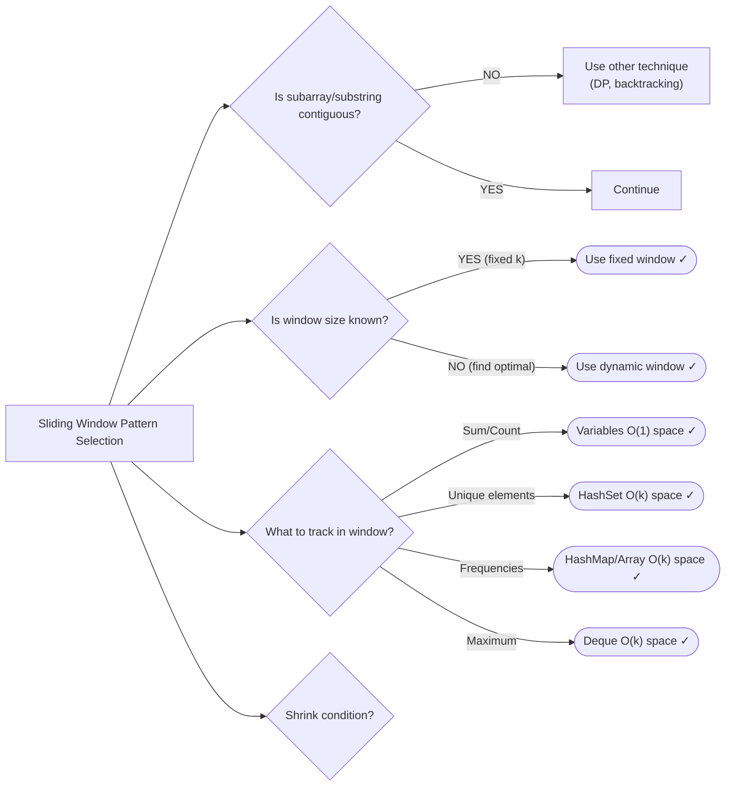

# Sliding Window

> Optimize subarray/substring problems from O(n²) to O(n)

---

## Learning Objectives

By the end of this topic you will be able to:

- Explain why sliding window eliminates redundant recalculation compared to nested loops
- Implement both fixed-size and dynamic-size window patterns
- Track window state using variables, HashSet, HashMap, or frequency arrays as appropriate
- Distinguish between sliding window and two-pointer techniques and select the right one
- Identify the shrink condition that determines when a dynamic window must contract
- Analyse time and space complexity for all four window variants

---

## ELI5: Explain Like I'm 5

<div class="learner-section" markdown>

**Your task:** After implementing all patterns, explain them simply.

**Prompts to guide you:**

1. **What is the sliding window pattern in one sentence?**
    - Your answer: <span class="fill-in">[Instead of recalculating a subarray from scratch each time, sliding window ___ by removing the element that left the window and ___ the element that just entered, so each step costs ___ instead of O(k)]</span>

2. **How is it different from two pointers?**
    - Your answer: <span class="fill-in">[Two pointers typically searches for a pair satisfying a condition, while sliding window maintains ___ and tracks ___ within it; the key distinction is ___]</span>

3. **Real-world analogy:**
    - Example: "Sliding window is like a camera viewfinder moving across a scene..."
    - Your analogy: <span class="fill-in">[Fill in]</span>

4. **When does this pattern work?**
    - Your answer: <span class="fill-in">[Fill in after solving problems]</span>

5. **When does this pattern fail?**
    - Your answer: <span class="fill-in">[Fill in after trying non-contiguous problems]</span>

</div>

---

## Quick Quiz (Do BEFORE implementing)

!!! tip "How to use this section"
    Write your best guess in each fill-in span **before** reading any implementation code. After you finish coding and running the tests, come back and fill in the "Verified" answers. The gap between your prediction and the actual answer is where the real learning happens.

<div class="learner-section" markdown>

**Your task:** Test your intuition without looking at code. Answer these, then verify after implementation.

### Complexity Predictions

1. **Two nested loops finding max sum of k elements:**
    - Time complexity: <span class="fill-in">[Your guess: O(?)]</span>
    - Verified after learning: <span class="fill-in">[Actual: O(?)]</span>

2. **Sliding window finding max sum of k elements:**
    - Time complexity: <span class="fill-in">[Your guess: O(?)]</span>
    - Space complexity: <span class="fill-in">[Your guess: O(?)]</span>
    - Verified: <span class="fill-in">[Actual]</span>

3. **Speedup calculation:**
    - If n = 1,000 and k = 100, nested loops = n × k = <span class="fill-in">_____</span> operations
    - Sliding window = n = <span class="fill-in">_____</span> operations
    - Speedup factor: <span class="fill-in">_____</span> times faster

### Scenario Predictions

**Scenario 1:** Find maximum sum of 3 consecutive elements in `[1, 4, 2, 10, 2, 3, 1, 0, 20]`

- **Can you use sliding window?** <span class="fill-in">[Yes/No - Why?]</span>
- **Window type:** <span class="fill-in">[Fixed/Dynamic - Why?]</span>
- **What do you track in the window?** <span class="fill-in">[Sum? Elements? Other?]</span>
- **When you slide from index 0-2 to 1-3, what changes?** <span class="fill-in">[Fill in]</span>

**Scenario 2:** Find longest substring without repeating characters in `"abcabcbb"`

- **Can you use sliding window?** <span class="fill-in">[Yes/No - Why?]</span>
- **Window type:** <span class="fill-in">[Fixed/Dynamic - Why?]</span>
- **What happens when you encounter a duplicate?** <span class="fill-in">[Expand/Shrink window?]</span>
- **What data structure tracks window state?** <span class="fill-in">[Fill in]</span>

**Scenario 3:** Find subarray with sum = 10 in `[1, 2, 3, 7, 5]` (can be non-contiguous)

- **Can you use sliding window?** <span class="fill-in">[Yes/No - Why?]</span>
- **What's the key requirement that breaks sliding window?** <span class="fill-in">[Fill in]</span>

### Trade-off Quiz

**Question:** When would brute force be SIMPLER than sliding window for max sum of k elements?

- Your answer: <span class="fill-in">[Fill in before implementation]</span>
- Verified answer: <span class="fill-in">[Fill in after learning]</span>

**Question:** What's the MAIN requirement for sliding window to work?

- [ ] Array must be sorted
- [ ] Problem involves contiguous subarray/substring
- [ ] Window size must be constant
- [ ] Array must contain positive integers

Verify after implementation: <span class="fill-in">[Which one(s)?]</span>

**Question:** Fixed vs Dynamic window - which applies when?

- **Fixed window when:** <span class="fill-in">[Fill in]</span>
- **Dynamic window when:** <span class="fill-in">[Fill in]</span>

</div>

---

## Core Implementation

### Pattern 1: Fixed Window Size

**Concept:** Window size is constant, slide one position at a time.

**Use case:** Maximum/minimum of k consecutive elements, average of subarrays.

```java
--8<-- "com/study/dsa/slidingwindow/FixedWindow.java"
```

**Runnable Client Code:**

```java
import java.util.*;

public class FixedWindowClient {

    public static void main(String[] args) {
        System.out.println("=== Fixed Window Size ===\n");

        // Test 1: Max average subarray
        System.out.println("--- Test 1: Max Average ---");
        int[] nums1 = {1, 12, -5, -6, 50, 3};
        int k1 = 4;

        double maxAvg = FixedWindow.maxAverageSubarray(nums1, k1);
        System.out.printf("Array: %s%n", Arrays.toString(nums1));
        System.out.printf("k = %d%n", k1);
        System.out.printf("Max average: %.2f%n", maxAvg);

        // Test 2: Contains nearby duplicate
        System.out.println("\n--- Test 2: Nearby Duplicate ---");
        int[][] dupTests = {
            {1, 2, 3, 1},     // k=3, should be true
            {1, 0, 1, 1},     // k=1, should be true
            {1, 2, 3, 1, 2, 3} // k=2, should be false
        };
        int[] kValues = {3, 1, 2};

        for (int i = 0; i < dupTests.length; i++) {
            boolean hasDup = FixedWindow.containsNearbyDuplicate(dupTests[i], kValues[i]);
            System.out.printf("Array: %s, k=%d -> %b%n",
                Arrays.toString(dupTests[i]), kValues[i], hasDup);
        }

        // Test 3: Max sliding window
        System.out.println("\n--- Test 3: Max Sliding Window ---");
        int[] nums3 = {1, 3, -1, -3, 5, 3, 6, 7};
        int k3 = 3;

        int[] maxes = FixedWindow.maxSlidingWindow(nums3, k3);
        System.out.printf("Array: %s%n", Arrays.toString(nums3));
        System.out.printf("k = %d%n", k3);
        System.out.printf("Maximums: %s%n", Arrays.toString(maxes));
    }
}
```

!!! warning "Debugging Challenge — Broken Fixed Window (Max Average)"
    The code below has **2 bugs**. Trace through `nums = [1, 12, -5, -6, 50, 3]`, `k = 4` before checking the answer.

    ```java
    public static double maxAverage_Buggy(int[] nums, int k) {
        int windowSum = 0;
        for (int i = 0; i <= k; i++) {        windowSum += nums[i];
        }
        double maxAvg = windowSum / k;
        for (int i = k; i < nums.length; i++) {
            windowSum = windowSum - nums[i - k] + nums[i];
            maxAvg = Math.max(maxAvg, windowSum / k);    }
        return maxAvg;
    }
    ```

    - Bug 1: <span class="fill-in">[What's the bug?]</span>
    - Bug 2: <span class="fill-in">[What's the bug?]</span>

    ??? success "Answer"
        **Bug 1 (loop bound):** The first loop uses `i <= k`, which reads `k + 1` elements instead of `k`. It should be `i < k`.

        **Bug 2 (integer division):** `windowSum / k` performs integer division. Both occurrences must cast to double: `windowSum / (double) k`.

        **Correct first window:**
        ```java
        for (int i = 0; i < k; i++) {     // Fixed: i < k
            windowSum += nums[i];
        }
        double maxAvg = windowSum / (double) k;   // Fixed: cast
        ```

---

### Pattern 2: Dynamic Window Size

**Concept:** Window expands and contracts based on condition.

**Use case:** Longest/shortest substring with constraint, subarray sum.

```java
--8<-- "com/study/dsa/slidingwindow/DynamicWindow.java"
```

**Runnable Client Code:**

```java
import java.util.*;

public class DynamicWindowClient {

    public static void main(String[] args) {
        System.out.println("=== Dynamic Window Size ===\n");

        // Test 1: Longest substring without repeating
        System.out.println("--- Test 1: Longest Substring (No Repeats) ---");
        String[] test1 = {"abcabcbb", "bbbbb", "pwwkew", ""};

        for (String s : test1) {
            int len = DynamicWindow.lengthOfLongestSubstring(s);
            System.out.printf("\"%s\" -> %d%n", s, len);
        }

        // Test 2: Longest with K distinct
        System.out.println("\n--- Test 2: K Distinct Characters ---");
        String[] test2 = {"eceba", "aa", "aaabbccd"};
        int[] kValues = {2, 1, 2};

        for (int i = 0; i < test2.length; i++) {
            int len = DynamicWindow.lengthOfLongestSubstringKDistinct(test2[i], kValues[i]);
            System.out.printf("\"%s\", k=%d -> %d%n", test2[i], kValues[i], len);
        }

        // Test 3: Minimum subarray sum
        System.out.println("\n--- Test 3: Min Subarray Sum >= Target ---");
        int[][] arrays = {
            {2, 3, 1, 2, 4, 3},
            {1, 4, 4},
            {1, 1, 1, 1, 1, 1, 1, 1}
        };
        int[] targets = {7, 4, 11};

        for (int i = 0; i < arrays.length; i++) {
            int minLen = DynamicWindow.minSubArrayLen(targets[i], arrays[i]);
            System.out.printf("Array: %s, target=%d -> %d%n",
                Arrays.toString(arrays[i]), targets[i], minLen);
        }
    }
}
```

!!! warning "Debugging Challenge — `if` vs `while` in Window Shrinking"
    The code below uses an `if` to shrink the window. It compiles but produces wrong results. Trace through `nums = [2, 3, 1, 2, 4, 3]`, `target = 7` before checking the answer.

    ```java
    public static int minSubArrayLen_Buggy(int target, int[] nums) {
        int left = 0, sum = 0, minLen = Integer.MAX_VALUE;
        for (int right = 0; right < nums.length; right++) {
            sum += nums[right];
            if (sum >= target) {            minLen = Math.min(minLen, right - left + 1);
                sum -= nums[left];
                left++;
            }
        }
        return minLen == Integer.MAX_VALUE ? 0 : minLen;
    }
    ```

    - Bug: <span class="fill-in">[Why does `if` fail here where `while` would succeed?]</span>

    ??? success "Answer"
        **Bug:** The shrink condition must be `while (sum >= target)`, not `if`. After shrinking once, the window may still satisfy `sum >= target` and could shrink further to reveal a shorter valid subarray. Using `if` only shrinks once per `right` step, so the algorithm misses the minimum.

        **Correct:**
        ```java
        while (sum >= target) {
            minLen = Math.min(minLen, right - left + 1);
            sum -= nums[left];
            left++;
        }
        ```

        **Key principle:** Dynamic windows need `while` for shrinking whenever the validity condition can remain true after one shrink step.

---

### Pattern 3: String Problems with Window

**Concept:** Track character frequencies in window for pattern matching.

**Use case:** Anagram problems, substring with all characters.

```java
--8<-- "com/study/dsa/slidingwindow/StringWindow.java"
```

**Runnable Client Code:**

```java
import java.util.*;

public class StringWindowClient {

    public static void main(String[] args) {
        System.out.println("=== String Window Problems ===\n");

        // Test 1: Find anagrams
        System.out.println("--- Test 1: Find Anagrams ---");
        String[][] anagramTests = {
            {"cbaebabacd", "abc"},
            {"abab", "ab"}
        };

        for (String[] test : anagramTests) {
            List<Integer> indices = StringWindow.findAnagrams(test[0], test[1]);
            System.out.printf("s=\"%s\", p=\"%s\" -> %s%n",
                test[0], test[1], indices);
        }

        // Test 2: Check inclusion
        System.out.println("\n--- Test 2: Permutation In String ---");
        String[][] inclusionTests = {
            {"ab", "eidbaooo"},
            {"ab", "eidboaoo"},
            {"abc", "bbbca"}
        };

        for (String[] test : inclusionTests) {
            boolean found = StringWindow.checkInclusion(test[0], test[1]);
            System.out.printf("s1=\"%s\", s2=\"%s\" -> %b%n",
                test[0], test[1], found);
        }

        // Test 3: Minimum window
        System.out.println("\n--- Test 3: Minimum Window Substring ---");
        String[][] windowTests = {
            {"ADOBECODEBANC", "ABC"},
            {"a", "a"},
            {"a", "aa"}
        };

        for (String[] test : windowTests) {
            String result = StringWindow.minWindow(test[0], test[1]);
            System.out.printf("s=\"%s\", t=\"%s\" -> \"%s\"%n",
                test[0], test[1], result);
        }
    }
}
```

---

### Pattern 4: Two Pointers + Window Hybrid

**Concept:** Combine sliding window with two-pointer techniques.

**Use case:** Character replacement, fruit baskets, longest repeating replacement.

```java
--8<-- "com/study/dsa/slidingwindow/HybridWindow.java"
```

**Runnable Client Code:**

```java
import java.util.*;

public class HybridWindowClient {

    public static void main(String[] args) {
        System.out.println("=== Two Pointers + Window Hybrid ===\n");

        // Test 1: Character replacement
        System.out.println("--- Test 1: Character Replacement ---");
        String[] strings = {"ABAB", "AABABBA", "AAAA"};
        int[] kValues = {2, 1, 2};

        for (int i = 0; i < strings.length; i++) {
            int len = HybridWindow.characterReplacement(strings[i], kValues[i]);
            System.out.printf("s=\"%s\", k=%d -> %d%n",
                strings[i], kValues[i], len);
        }

        // Test 2: Max consecutive ones
        System.out.println("\n--- Test 2: Max Consecutive Ones ---");
        int[][] arrays = {
            {1, 1, 1, 0, 0, 0, 1, 1, 1, 1, 0},
            {0, 0, 1, 1, 0, 0, 1, 1, 1, 0, 1, 1, 0, 0, 0, 1, 1, 1, 1}
        };
        int[] flips = {2, 3};

        for (int i = 0; i < arrays.length; i++) {
            int len = HybridWindow.longestOnes(arrays[i], flips[i]);
            System.out.printf("Array: %s%n", Arrays.toString(arrays[i]));
            System.out.printf("k=%d -> %d%n%n", flips[i], len);
        }

        // Test 3: Fruits into baskets
        System.out.println("--- Test 3: Fruits Into Baskets ---");
        int[][] fruitArrays = {
            {1, 2, 1},
            {0, 1, 2, 2},
            {1, 2, 3, 2, 2}
        };

        for (int[] fruits : fruitArrays) {
            int total = HybridWindow.totalFruit(fruits);
            System.out.printf("Fruits: %s -> %d%n",
                Arrays.toString(fruits), total);
        }
    }
}
```

---

!!! info "Loop back"
    Before moving on, return to the ELI5 section and Quick Quiz at the top. Fill in any answers you left blank. Pay particular attention to the fixed-vs-dynamic distinction and the `if`-vs-`while` shrink question — those two points catch most sliding window bugs.

---

## Before/After: Why This Pattern Matters

**Your task:** Compare naive vs optimized approaches to understand the impact.

### Example: Maximum Sum of K Consecutive Elements

**Problem:** Find the maximum sum of any k consecutive elements in an array.

#### Approach 1: Brute Force (Nested Loops)

```java
// Naive approach - Recalculate sum for each window
public static int maxSum_BruteForce(int[] nums, int k) {
    if (nums.length < k) return 0;

    int maxSum = Integer.MIN_VALUE;

    // For each possible starting position
    for (int i = 0; i <= nums.length - k; i++) {
        int windowSum = 0;

        // Calculate sum of k elements starting at i
        for (int j = i; j < i + k; j++) {
            windowSum += nums[j];
        }

        maxSum = Math.max(maxSum, windowSum);
    }

    return maxSum;
}
```

**Analysis:**

- Time: O(n × k) - For each of n-k positions, sum k elements
- Space: O(1) - No extra space
- For n = 10,000, k = 100: ~1,000,000 operations

#### Approach 2: Sliding Window (Optimized)

```java
// Optimized approach - Reuse previous sum by sliding
public static int maxSum_SlidingWindow(int[] nums, int k) {
    if (nums.length < k) return 0;

    // Calculate sum of first window
    int windowSum = 0;
    for (int i = 0; i < k; i++) {
        windowSum += nums[i];
    }
    int maxSum = windowSum;

    // Slide window: remove left, add right
    for (int i = k; i < nums.length; i++) {
        windowSum = windowSum - nums[i - k] + nums[i];  // KEY: Reuse previous sum!
        maxSum = Math.max(maxSum, windowSum);
    }

    return maxSum;
}
```

**Analysis:**

- Time: O(n) - One pass to build first window, one pass to slide
- Space: O(1) - Only track window sum
- For n = 10,000, k = 100: ~10,000 operations

#### Performance Comparison

| Array Size (n) | Window Size (k) | Brute Force (O(n×k)) | Sliding Window (O(n)) | Speedup |
|----------------|-----------------|----------------------|-----------------------|---------|
| n = 100        | k = 10          | 1,000 ops            | 100 ops               | 10x     |
| n = 1,000      | k = 100         | 100,000 ops          | 1,000 ops             | 100x    |
| n = 10,000     | k = 100         | 1,000,000 ops        | 10,000 ops            | 100x    |

**Your calculation:** For n = 5,000 and k = 50, the speedup is approximately _____ times faster.

#### Why Does Sliding Window Work?

!!! note "The reuse insight"
    Window 2 shares all but one element with Window 1. Sliding window **reuses** the previous sum rather than recalculating the shared portion. The only work per step is one subtraction (remove left element) and one addition (add right element) — constant time regardless of k.

In array `[1, 4, 2, 10, 2, 3]` with k = 3:

```
Window 1: [1, 4, 2]     sum = 7
Window 2:    [4, 2, 10]  sum = 16

Brute force: Calculate 4 + 2 + 10 = 16 (3 operations)
Sliding window: Previous sum (7) - 1 + 10 = 16 (2 operations)
```

**Visualization:**

```
[1, 4, 2, 10, 2, 3]
 ^-----^              Window 1: sum = 7
    ^-----^           Window 2: Remove 1, Add 10 → sum = 7 - 1 + 10 = 16
       ^-----^        Window 3: Remove 4, Add 2 → sum = 16 - 4 + 2 = 14
```

**After implementing, explain in your own words:**

<div class="learner-section" markdown>

- Why does the window "slide" instead of "jump"? <span class="fill-in">[Your answer]</span>
- What would happen if the window wasn't contiguous? <span class="fill-in">[Your answer]</span>
- How is this different from two pointers? <span class="fill-in">[Your answer]</span>

</div>

---

## Common Misconceptions

!!! warning "Misconception 1: Sliding window requires a sorted array"
    Unlike two-pointer pair-sum, sliding window has no sorting requirement. It works on any sequence because it relies only on **contiguity**, not on element order. `maxSlidingWindow`, `lengthOfLongestSubstring`, and `minSubArrayLen` all operate on unsorted input.

!!! warning "Misconception 2: You always need `while` to shrink a dynamic window"
    Use `while` when the constraint can remain satisfied after one shrink step (e.g., `sum >= target`). Use `if` when shrinking once is always sufficient to restore validity (e.g., removing the leftmost element of a fixed-size window). Choosing the wrong one is the single most common sliding window bug.

!!! warning "Misconception 3: Not removing zero-frequency keys from a HashMap breaks nothing"
    If you decrement a character's count to 0 but leave it in the map, `window.size()` never decreases. The shrink condition `window.size() > k` becomes permanently true, causing the window to collapse to size 1. Always remove a key when its frequency hits 0.

---

## Decision Framework

<div class="learner-section" markdown>

**Your task:** Build decision trees for when to use sliding window.

### Question 1: Is the subarray/substring contiguous?

Answer after solving problems:

- **Why contiguous matters?** <span class="fill-in">[Sliding window only works on contiguous data]</span>
- **Can sliding window work on non-contiguous?** <span class="fill-in">[No - need other techniques]</span>
- **Your observation:** <span class="fill-in">[Fill in based on testing]</span>

### Question 2: Fixed vs Dynamic window?

Answer for each pattern:

**Fixed window when:**

- Window size: <span class="fill-in">[Known constant k]</span>
- Movement rule: <span class="fill-in">[Always move both pointers together]</span>
- Example problems: <span class="fill-in">[Max average, nearby duplicate]</span>

**Dynamic window when:**

- Window size: <span class="fill-in">[Varies based on constraint]</span>
- Movement rule: <span class="fill-in">[Expand right, shrink left when needed]</span>
- Example problems: <span class="fill-in">[Longest substring, min subarray sum]</span>

### Question 3: What state to track?

Answer for different scenarios:

**For sum/count problems:**

- Track: <span class="fill-in">[Running sum, count]</span>
- Data structure: <span class="fill-in">[Variables, no extra space]</span>

**For unique elements:**

- Track: <span class="fill-in">[Set of current elements]</span>
- Data structure: <span class="fill-in">[HashSet]</span>

**For frequency:**

- Track: <span class="fill-in">[Count of each element]</span>
- Data structure: <span class="fill-in">[HashMap or frequency array]</span>

### Your Decision Tree

Build this after solving practice problems:

```mermaid
flowchart LR
    Start["Sliding Window Pattern Selection"]

    Q1{"Is subarray/substring contiguous?"}
    Start --> Q1
    N2["Use other technique<br/>(DP, backtracking)"]
    Q1 -->|"NO"| N2
    N3["Continue"]
    Q1 -->|"YES"| N3
    Q4{"Is window size known?"}
    Start --> Q4
    N5(["Use fixed window ✓"])
    Q4 -->|"YES (fixed k)"| N5
    N6(["Use dynamic window ✓"])
    Q4 -->|"NO (find optimal)"| N6
    Q7{"What to track in window?"}
    Start --> Q7
    N8(["Variables O(1) space ✓"])
    Q7 -->|"Sum/Count"| N8
    N9(["HashSet O(k) space ✓"])
    Q7 -->|"Unique elements"| N9
    N10(["HashMap/Array O(k) space ✓"])
    Q7 -->|"Frequencies"| N10
    N11(["Deque O(k) space ✓"])
    Q7 -->|"Maximum"| N11
    Q12{"Shrink condition?"}
    Start --> Q12
```

</div>

---

## Practice

<div class="learner-section" markdown>

### LeetCode Problems

**Easy (Complete all 4):**

- [ ] [643. Maximum Average Subarray I](https://leetcode.com/problems/maximum-average-subarray-i/)
    - Pattern: <span class="fill-in">[Fixed window]</span>
    - Your solution time: <span class="fill-in">___</span>
    - Key insight: <span class="fill-in">[Fill in after solving]</span>

- [ ] [219. Contains Duplicate II](https://leetcode.com/problems/contains-duplicate-ii/)
    - Pattern: <span class="fill-in">[Fixed window with HashSet]</span>
    - Your solution time: <span class="fill-in">___</span>
    - Key insight: <span class="fill-in">[Fill in]</span>

- [ ] [1876. Substrings of Size Three with Distinct Characters](https://leetcode.com/problems/substrings-of-size-three-with-distinct-characters/)
    - Pattern: <span class="fill-in">[Fixed window]</span>
    - Your solution time: <span class="fill-in">___</span>
    - Key insight: <span class="fill-in">[Fill in]</span>

- [ ] [1456. Maximum Number of Vowels](https://leetcode.com/problems/maximum-number-of-vowels-in-a-substring-of-given-length/)
    - Pattern: <span class="fill-in">[Fixed window]</span>
    - Your solution time: <span class="fill-in">___</span>
    - Key insight: <span class="fill-in">[Fill in]</span>

**Medium (Complete 3-4):**

- [ ] [3. Longest Substring Without Repeating Characters](https://leetcode.com/problems/longest-substring-without-repeating-characters/)
    - Pattern: <span class="fill-in">[Dynamic window]</span>
    - Difficulty: <span class="fill-in">[Rate 1-10]</span>
    - Key insight: <span class="fill-in">[Fill in]</span>
    - Mistake made: <span class="fill-in">[Fill in if any]</span>

- [ ] [424. Longest Repeating Character Replacement](https://leetcode.com/problems/longest-repeating-character-replacement/)
    - Pattern: <span class="fill-in">[Dynamic window with replacement]</span>
    - Difficulty: <span class="fill-in">[Rate 1-10]</span>
    - Key insight: <span class="fill-in">[Fill in]</span>

- [ ] [438. Find All Anagrams in a String](https://leetcode.com/problems/find-all-anagrams-in-a-string/)
    - Pattern: <span class="fill-in">[Fixed window with frequency]</span>
    - Difficulty: <span class="fill-in">[Rate 1-10]</span>
    - Key insight: <span class="fill-in">[Fill in]</span>

- [ ] [567. Permutation in String](https://leetcode.com/problems/permutation-in-string/)
    - Pattern: <span class="fill-in">[Fixed window with frequency]</span>
    - Comparison to 438: <span class="fill-in">[How similar?]</span>

**Hard (Optional):**

- [ ] [76. Minimum Window Substring](https://leetcode.com/problems/minimum-window-substring/)
    - Pattern: <span class="fill-in">[Dynamic window with frequency]</span>
    - Key insight: <span class="fill-in">[Fill in after solving]</span>

- [ ] [239. Sliding Window Maximum](https://leetcode.com/problems/sliding-window-maximum/)
    - Pattern: <span class="fill-in">[Fixed window with deque]</span>
    - Key insight: <span class="fill-in">[Monotonic deque technique]</span>

**Failure modes:**

- What happens if the window condition is never satisfied — does your dynamic window correctly return 0 or an empty string, or does it return a sentinel value like `Integer.MAX_VALUE`? <span class="fill-in">[Fill in]</span>
- How does your implementation behave when the entire input string consists of a single repeated character and `k = 0` distinct characters are allowed? <span class="fill-in">[Fill in]</span>

</div>

---

## Test Your Understanding

Answer these questions without looking at your notes. Write a sentence or two for each.

1. **A fixed window of size k is sliding across an array. The brute-force approach recomputes the sum from scratch each step. Explain exactly why the sliding window only needs two operations (one add, one subtract) per step, and what property of the problem makes this possible.**

    ??? success "Rubric"
        A complete answer addresses: (1) consecutive windows of size k overlap in k-1 elements — the new window is the old window minus the leftmost element plus one new rightmost element; (2) this reuse is safe because the problem asks about a contiguous subarray, so the shared elements contribute identically to both windows; (3) non-contiguous problems (e.g., "maximum sum of any k elements") cannot use this trick because there is no guaranteed overlap between optimal selections.

2. **You write a dynamic window solution for "longest substring with at most k distinct characters." It works on most inputs but fails on `"aab"` with `k = 1`. You suspect the shrink logic. Describe the most likely bug and trace through the failing case to confirm it.**

    ??? success "Rubric"
        A complete answer addresses: (1) the most likely bug is using `if` instead of `while` for the shrink loop — after removing one character from the left, the window may still have more than k distinct characters and must shrink again; (2) tracing `"aab"`, `k=1`: right=0 (`a`, size=1 ok), right=1 (`a`, size=1 ok), right=2 (`b`, size=2 > 1) — one `if`-shrink removes the first `a` but leaves the second `a` and `b` still in the map, so the window is still invalid; (3) `while` ensures the window shrinks until the invariant is restored.

3. **Minimum Window Substring (LeetCode 76) requires tracking "how many required characters are currently satisfied." Explain why simply comparing two frequency maps at each step would be too slow, and what optimisation the standard O(n) solution uses instead.**

    ??? success "Rubric"
        A complete answer addresses: (1) comparing two HashMaps costs O(|t|) per step — multiplied by O(n) steps this gives O(n × |t|), which is quadratic when |t| is large; (2) the standard optimisation maintains a single integer `formed` — a counter incremented when a character's window count reaches the required count, and decremented when it falls below; (3) when `formed == required` (number of distinct characters in t that are fully satisfied), the window is valid — this check is O(1) per step, giving overall O(n + |t|) time.

4. **When should you use a monotonic deque instead of a plain variable to track the window maximum? What does the deque store, and what is the invariant it maintains?**

    ??? success "Rubric"
        A complete answer addresses: (1) a plain `max` variable cannot efficiently update when the maximum element leaves the window — you would need an O(k) scan to find the new max, making the algorithm O(nk); (2) the deque stores indices of elements in decreasing order of their values — the front of the deque always holds the index of the current window maximum; (3) the invariant is that elements in the deque are in strictly decreasing order, so any element smaller than a newly added element is popped from the back (it can never be the future maximum while the larger element is still in the window).

5. **Sliding window and two-pointer techniques both use two indices. Give a concrete example of a problem that is naturally a sliding window problem, and explain why framing it as a two-pointer pair-search would not work.**

    ??? success "Rubric"
        A complete answer addresses: (1) a canonical example is "Minimum Window Substring" — the goal is to find a contiguous substring satisfying a character coverage constraint, not to find a pair of elements with a numeric relationship; (2) two-pointer pair-search relies on sorted order and a monotone sum relationship to know which pointer to advance; in sliding window the "value" of the window is multi-dimensional (a frequency map), so there is no scalar comparison that tells you which end to move; (3) the sliding window's shrink condition is driven by a constraint violation, not by a comparison of two element values.

---

## Connected Topics

!!! info "Where this topic connects"

    - **01. Two Pointers** — the sliding window left/right boundary IS a two-pointer pattern; understanding opposite-direction pointers first builds intuition for same-direction window pointers → [01. Two Pointers](01-two-pointers.md)
    - **03. Hash Tables** — variable-size sliding windows use a HashMap to track element frequencies inside the window in O(1) → [03. Hash Tables](03-hash-tables.md)
    - **14. Prefix Sums** — both patterns answer range-query questions; prefix sums are better for static arrays with many queries, sliding window for single-pass streaming problems → [14. Prefix Sums](14-prefix-sums.md)
