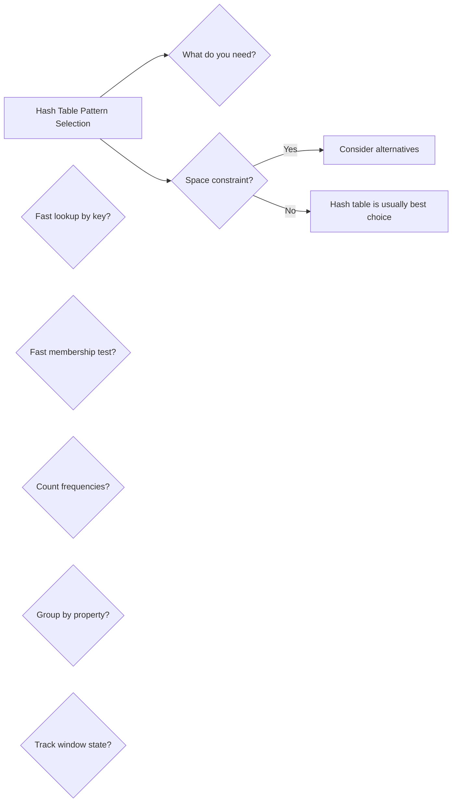

# Hash Tables

> O(1) average lookup, insertion, and deletion using key-value mapping

---

## Learning Objectives

By the end of this topic you will be able to:

- Explain how a hash function maps keys to bucket indices and why this enables O(1) average lookups
- Implement four core patterns: basic lookup, set membership, grouping, and sliding window state tracking
- Design appropriate keys for grouping problems (e.g., sorted-character keys for anagram grouping)
- Diagnose and fix common bugs: `NullPointerException` from missing `getOrDefault`, same-index reuse in Two Sum, and stale zero-frequency keys
- Articulate the O(n) worst-case scenario caused by hash collisions and explain what a good hash function prevents
- Choose between HashMap, HashSet, and array-based frequency tables based on key type and space constraints

---

## ELI5: Explain Like I'm 5

<div class="learner-section" markdown>

**Your task:** After implementing all patterns, explain them simply.

**Prompts to guide you:**

1. **What is a hash table in one sentence?**
    - Your answer: <span class="fill-in">[A hash table is a data structure that converts a key into an index using a hash function so that ___, giving O(1) average lookup instead of ___]</span>

2. **Why is O(1) lookup possible?**
    - Your answer: <span class="fill-in">[Instead of scanning the entire collection, the hash function tells you ___ directly, so the lookup cost does not grow with ___]</span>

3. **Real-world analogy:**
    - Example: "Hash tables are like a library card catalog..."
    - Your analogy: <span class="fill-in">[Fill in]</span>

4. **When does this pattern work?**
    - Your answer: <span class="fill-in">[Fill in after solving problems]</span>

5. **What happens when two keys hash to the same location?**
    - Your answer: <span class="fill-in">[Fill in after learning about collisions]</span>

</div>

---

## Quick Quiz (Do BEFORE implementing)

!!! tip "How to use this section"
    Write your best guess in each fill-in span **before** reading any implementation code. After you finish coding and running the tests, come back and fill in the "Verified" answers. The gap between your prediction and the actual answer is where the real learning happens.

<div class="learner-section" markdown>

**Your task:** Test your intuition without looking at code. Answer these, then verify after implementation.

### Complexity Predictions

1. **Linear search through array to find if element exists:**
    - Time complexity: <span class="fill-in">[Your guess: O(?)]</span>
    - Verified after learning: <span class="fill-in">[Actual: O(?)]</span>

2. **Hash table lookup to find if element exists:**
    - Time complexity: <span class="fill-in">[Your guess: O(?)]</span>
    - Space complexity: <span class="fill-in">[Your guess: O(?)]</span>
    - Verified: <span class="fill-in">[Actual]</span>

3. **Speedup calculation:**
    - If n = 1,000, linear search = n = <span class="fill-in">_____</span> operations
    - Hash table lookup = <span class="fill-in">_____</span> operations (average case)
    - Speedup factor: <span class="fill-in">_____</span> times faster

### Scenario Predictions

**Scenario 1:** Count frequency of each word in `["cat", "dog", "cat", "bird", "dog", "cat"]`

- **Can you use a hash map?** <span class="fill-in">[Yes/No - Why?]</span>
- **What would be the key?** <span class="fill-in">[Fill in]</span>
- **What would be the value?** <span class="fill-in">[Fill in]</span>
- **What's the final map for "cat"?** <span class="fill-in">[Key: "cat", Value: ?]</span>

**Scenario 2:** Find two numbers that sum to 10 in `[2, 7, 11, 15]`

- **Can you use a hash map?** <span class="fill-in">[Yes/No - Why?]</span>
- **What would you store in the map?** <span class="fill-in">[Fill in]</span>
- **How does hash map help vs nested loops?** <span class="fill-in">[Fill in]</span>

**Scenario 3:** Group anagrams: `["eat", "tea", "tan", "ate", "nat", "bat"]`

- **What makes two strings anagrams?** <span class="fill-in">[Fill in]</span>
- **What should be the map key?** <span class="fill-in">[Fill in your idea]</span>
- **How to create the key from "eat"?** <span class="fill-in">[Fill in]</span>

### Hash Collision Quiz

**Question:** What happens when two different keys hash to the same location?

- Your answer: <span class="fill-in">[Fill in before implementation]</span>
- Verified answer: <span class="fill-in">[Fill in after learning]</span>

**Question:** Why is HashMap lookup O(1) average but O(n) worst case?

- Your answer: <span class="fill-in">[Fill in before implementation]</span>
- Verified answer: <span class="fill-in">[Fill in after learning]</span>

### Trade-off Quiz

**Question:** When would sorting + binary search be BETTER than using a HashMap?

- Your answer: <span class="fill-in">[Fill in before implementation]</span>
- Verified answer: <span class="fill-in">[Fill in after learning]</span>

**Question:** What's the MAIN advantage of HashMap over arrays?

- [ ] Always uses less memory
- [ ] Can use non-integer keys
- [ ] Maintains sorted order
- [ ] Always faster for all operations

Verify after implementation: <span class="fill-in">[Which one(s)?]</span>


</div>

---

## Core Implementation

### Pattern 1: Basic Hash Map Operations

**Concept:** Fast lookups using key-value pairs.

**Use case:** Frequency counting, two-sum problems, duplicate detection.

```java
public class BasicHashMap {

    /**
     * Problem: Two Sum - find indices of two numbers that sum to target
     * Time: O(n), Space: O(n)
     *
     * TODO: Implement using HashMap for O(1) lookup
     */
    public static int[] twoSum(int[] nums, int target) {
        // TODO: Use a map to remember what you've seen
        // What should be stored as the key? As the value?

        return new int[] {-1, -1}; // Replace with implementation
    }

    /**
     * Problem: Count frequency of each character
     * Time: O(n), Space: O(k) where k = unique characters
     *
     * TODO: Implement frequency counter
     */
    public static Map<Character, Integer> countCharacters(String s) {
        // TODO: Track how many times each character appears
        // Consider using getOrDefault for cleaner code

        return new HashMap<>(); // Replace with implementation
    }

    /**
     * Problem: Contains duplicate - check if array has duplicates
     * Time: O(n), Space: O(n)
     *
     * TODO: Implement using HashSet
     */
    public static boolean containsDuplicate(int[] nums) {
        // TODO: Use a set to track seen elements
        // What indicates a duplicate has been found?

        return false; // Replace with implementation
    }
}
```

**Runnable Client Code:**

```java
import java.util.*;

public class BasicHashMapClient {

    public static void main(String[] args) {
        System.out.println("=== Basic Hash Map Operations ===\n");

        // Test 1: Two Sum
        System.out.println("--- Test 1: Two Sum ---");
        int[] nums = {2, 7, 11, 15};
        int target = 9;

        int[] result = BasicHashMap.twoSum(nums, target);
        System.out.printf("Array: %s%n", Arrays.toString(nums));
        System.out.printf("Target: %d%n", target);
        System.out.printf("Indices: %s%n", Arrays.toString(result));
        if (result[0] != -1) {
            System.out.printf("Values: %d + %d = %d%n",
                nums[result[0]], nums[result[1]], target);
        }

        // Test 2: Character frequency
        System.out.println("\n--- Test 2: Character Frequency ---");
        String[] testStrings = {"hello", "mississippi", "aabbcc"};

        for (String s : testStrings) {
            Map<Character, Integer> freq = BasicHashMap.countCharacters(s);
            System.out.printf("String: \"%s\"%n", s);
            System.out.println("Frequency: " + freq);
            System.out.println();
        }

        // Test 3: Contains duplicate
        System.out.println("--- Test 3: Contains Duplicate ---");
        int[][] testArrays = {
            {1, 2, 3, 4, 5},
            {1, 2, 3, 1},
            {1, 1, 1, 3, 3, 4, 3, 2, 4, 2}
        };

        for (int[] arr : testArrays) {
            boolean hasDup = BasicHashMap.containsDuplicate(arr);
            System.out.printf("Array: %s -> %s%n",
                Arrays.toString(arr), hasDup ? "HAS duplicates" : "NO duplicates");
        }
    }
}
```

!!! warning "Debugging Challenge — Broken Two Sum"
    The code below has **2 bugs**. Test with `nums = [3, 2, 4], target = 6` before checking the answer.

    ```java
    public static int[] twoSum_Buggy(int[] nums, int target) {
        Map<Integer, Integer> map = new HashMap<>();
        for (int i = 0; i < nums.length; i++) {
            map.put(nums[i], i);    }
        for (int i = 0; i < nums.length; i++) {
            int complement = target - nums[i];
            if (map.containsKey(complement)) {
                return new int[] {map.get(complement), i};        }
        }
        return new int[] {-1, -1};
    }
    ```

    - Bug 1: <span class="fill-in">[What's the structural inefficiency in the two-pass approach?]</span>
    - Bug 2: <span class="fill-in">[What if nums[i] + nums[i] == target? Which index is returned twice?]</span>

    ??? success "Answer"
        **Bug 1:** Building the entire map first and then searching in a second pass allows `map.get(complement)` to return the same index `i` when `complement == nums[i]` (e.g., `nums = [3, 2, 4], target = 6` — index 0 maps to `3`, and `6 - 3 = 3` finds itself).

        **Bug 2:** The same-index problem: add a guard `map.get(complement) != i`.

        **Best fix — check before adding:**
        ```java
        for (int i = 0; i < nums.length; i++) {
            int complement = target - nums[i];
            if (map.containsKey(complement)) {
                return new int[] {map.get(complement), i};
            }
            map.put(nums[i], i);  // Add AFTER checking
        }
        ```
        Adding after checking eliminates the same-index problem entirely without extra guards.

---

### Pattern 2: Hash Set for Fast Membership Testing

**Concept:** Use HashSet for O(1) membership checks.

**Use case:** Finding missing numbers, intersection/union operations.

```java
import java.util.*;

public class HashSetOperations {

    /**
     * Problem: Find intersection of two arrays
     * Time: O(n + m), Space: O(min(n, m))
     *
     * TODO: Implement using HashSet
     */
    public static int[] intersection(int[] nums1, int[] nums2) {
        // TODO: Store one array in a set for fast lookup
        // How do you find common elements?

        return new int[0]; // Replace with implementation
    }

    /**
     * Problem: Find missing number from 0 to n
     * Time: O(n), Space: O(n)
     *
     * TODO: Implement using HashSet
     */
    public static int missingNumber(int[] nums) {
        // TODO: Store all present numbers
        // How do you check which number is missing?

        return -1; // Replace with implementation
    }

    /**
     * Problem: Longest consecutive sequence
     * Time: O(n), Space: O(n)
     *
     * TODO: Implement using HashSet
     */
    public static int longestConsecutive(int[] nums) {
        // TODO: Store all numbers in a set for O(1) lookup
        // How do you identify the start of a sequence?
        // How do you count consecutive numbers?

        return 0; // Replace with implementation
    }
}
```

**Runnable Client Code:**

```java
import java.util.*;

public class HashSetOperationsClient {

    public static void main(String[] args) {
        System.out.println("=== Hash Set Operations ===\n");

        // Test 1: Intersection
        System.out.println("--- Test 1: Intersection ---");
        int[] arr1 = {1, 2, 2, 1};
        int[] arr2 = {2, 2};

        int[] intersection = HashSetOperations.intersection(arr1, arr2);
        System.out.printf("Array 1: %s%n", Arrays.toString(arr1));
        System.out.printf("Array 2: %s%n", Arrays.toString(arr2));
        System.out.printf("Intersection: %s%n", Arrays.toString(intersection));

        int[] arr3 = {4, 9, 5};
        int[] arr4 = {9, 4, 9, 8, 4};

        int[] intersection2 = HashSetOperations.intersection(arr3, arr4);
        System.out.printf("\nArray 1: %s%n", Arrays.toString(arr3));
        System.out.printf("Array 2: %s%n", Arrays.toString(arr4));
        System.out.printf("Intersection: %s%n", Arrays.toString(intersection2));

        // Test 2: Missing number
        System.out.println("\n--- Test 2: Missing Number ---");
        int[][] testArrays = {
            {3, 0, 1},
            {0, 1},
            {9, 6, 4, 2, 3, 5, 7, 0, 1}
        };

        for (int[] arr : testArrays) {
            int missing = HashSetOperations.missingNumber(arr);
            System.out.printf("Array: %s -> Missing: %d%n",
                Arrays.toString(arr), missing);
        }

        // Test 3: Longest consecutive sequence
        System.out.println("\n--- Test 3: Longest Consecutive ---");
        int[][] sequenceArrays = {
            {100, 4, 200, 1, 3, 2},
            {0, 3, 7, 2, 5, 8, 4, 6, 0, 1},
            {9, 1, -3, 2, 4, 8, 3, -1, 6, -2, -4, 7}
        };

        for (int[] arr : sequenceArrays) {
            int length = HashSetOperations.longestConsecutive(arr);
            System.out.printf("Array: %s%n", Arrays.toString(arr));
            System.out.printf("Longest consecutive: %d%n%n", length);
        }
    }
}
```

---

### Pattern 3: Hash Map for Grouping

**Concept:** Group elements by a computed key.

**Use case:** Anagrams, group by property, categorization.

```java
import java.util.*;

public class HashMapGrouping {

    /**
     * Problem: Group anagrams together
     * Time: O(n * k log k) where k = max word length, Space: O(n * k)
     *
     * TODO: Implement using HashMap with sorted string as key
     */
    public static List<List<String>> groupAnagrams(String[] strs) {
        // TODO: What makes anagrams have the same key?
        // How can you transform each string into a unique key?

        return new ArrayList<>(); // Replace with implementation
    }

    /**
     * Problem: Group numbers by digit sum
     * Time: O(n * d) where d = digits, Space: O(n)
     *
     * TODO: Implement custom grouping
     */
    public static Map<Integer, List<Integer>> groupByDigitSum(int[] nums) {
        // TODO: Compute a key for each number based on its digits
        // Group numbers with the same key together

        return new HashMap<>(); // Replace with implementation
    }

    /**
     * Problem: Find all strings that start with same character
     * Time: O(n), Space: O(n)
     *
     * TODO: Implement grouping by first character
     */
    public static Map<Character, List<String>> groupByFirstChar(String[] words) {
        // TODO: Extract the grouping criterion from each word
        // Store words with the same criterion together

        return new HashMap<>(); // Replace with implementation
    }

    // Helper: Calculate digit sum
    private static int digitSum(int n) {
        int sum = 0;
        n = Math.abs(n);
        while (n > 0) {
            sum += n % 10;
            n /= 10;
        }
        return sum;
    }
}
```

**Runnable Client Code:**

```java
import java.util.*;

public class HashMapGroupingClient {

    public static void main(String[] args) {
        System.out.println("=== Hash Map Grouping ===\n");

        // Test 1: Group anagrams
        System.out.println("--- Test 1: Group Anagrams ---");
        String[] words = {"eat", "tea", "tan", "ate", "nat", "bat"};

        List<List<String>> groups = HashMapGrouping.groupAnagrams(words);
        System.out.println("Words: " + Arrays.toString(words));
        System.out.println("Grouped:");
        for (List<String> group : groups) {
            System.out.println("  " + group);
        }

        // Test 2: Group by digit sum
        System.out.println("\n--- Test 2: Group by Digit Sum ---");
        int[] numbers = {12, 21, 13, 31, 100, 10, 1, 23, 32};

        Map<Integer, List<Integer>> digitGroups = HashMapGrouping.groupByDigitSum(numbers);
        System.out.println("Numbers: " + Arrays.toString(numbers));
        System.out.println("Grouped by digit sum:");
        for (Map.Entry<Integer, List<Integer>> entry : digitGroups.entrySet()) {
            System.out.printf("  Sum %d: %s%n", entry.getKey(), entry.getValue());
        }

        // Test 3: Group by first character
        System.out.println("\n--- Test 3: Group by First Character ---");
        String[] dictionary = {"apple", "ant", "ball", "bear", "cat", "car", "dog"};

        Map<Character, List<String>> charGroups = HashMapGrouping.groupByFirstChar(dictionary);
        System.out.println("Words: " + Arrays.toString(dictionary));
        System.out.println("Grouped by first character:");
        for (Map.Entry<Character, List<String>> entry : charGroups.entrySet()) {
            System.out.printf("  %c: %s%n", entry.getKey(), entry.getValue());
        }
    }
}
```

!!! warning "Debugging Challenge — Broken Group Anagrams Key"
    The code below groups words but gives wrong results. Test with `["eat", "tea", "tan", "ate", "nat", "bat"]` before checking the answer.

    ```java
    public static List<List<String>> groupAnagrams_Buggy(String[] strs) {
        Map<String, List<String>> groups = new HashMap<>();
        for (String s : strs) {
            String key = s.toLowerCase();
            if (!groups.containsKey(key)) {
                groups.put(key, new ArrayList<>());
            }
            groups.get(key).add(s);
        }
        return new ArrayList<>(groups.values());
    }
    ```

    - Bug: <span class="fill-in">[What property must the key encode that `toLowerCase()` misses?]</span>

    ??? success "Answer"
        **Bug:** `toLowerCase()` does not change character order. `"eat"` and `"tea"` lowercase to `"eat"` and `"tea"` — still different keys. Anagrams share the **same characters in the same frequencies**, which is captured by sorting the characters.

        **Fix:**
        ```java
        char[] chars = s.toCharArray();
        Arrays.sort(chars);
        String key = new String(chars);
        ```
        Now `"eat"`, `"tea"`, and `"ate"` all produce the key `"aet"`.

---

### Pattern 4: Hash Map for Sliding Window with Constraints

**Concept:** Track window state using frequency map.

**Use case:** Substring problems with character constraints.

```java
import java.util.*;

public class HashMapWindow {

    /**
     * Problem: Minimum window substring containing all chars of target
     * Time: O(n + m), Space: O(k) where k = unique chars
     *
     * TODO: Implement using HashMap to track frequencies
     */
    public static String minWindow(String s, String t) {
        // TODO: Track character frequencies in the target string
        // Use a sliding window to find the minimum valid window

        return ""; // Replace with implementation
    }

    /**
     * Problem: Check if s2 contains permutation of s1
     * Time: O(n), Space: O(1) - only 26 chars
     *
     * TODO: Implement using frequency comparison
     */
    public static boolean checkInclusion(String s1, String s2) {
        // TODO: How can you detect a permutation using frequencies?
        // Consider using a fixed-size window

        return false; // Replace with implementation
    }
}
```

**Runnable Client Code:**

```java
import java.util.*;

public class HashMapWindowClient {

    public static void main(String[] args) {
        System.out.println("=== Hash Map Sliding Window ===\n");

        // Test 1: Minimum window substring
        System.out.println("--- Test 1: Minimum Window ---");
        String[][] testCases = {
            {"ADOBECODEBANC", "ABC"},
            {"a", "a"},
            {"a", "aa"}
        };

        for (String[] test : testCases) {
            String s = test[0];
            String t = test[1];
            String result = HashMapWindow.minWindow(s, t);
            System.out.printf("s=\"%s\", t=\"%s\" -> \"%s\"%n", s, t, result);
        }

        // Test 2: Check inclusion (permutation)
        System.out.println("\n--- Test 2: Check Inclusion ---");
        String[][] inclusionTests = {
            {"ab", "eidbaooo"},
            {"ab", "eidboaoo"},
            {"abc", "ccccbbbbaaaa"}
        };

        for (String[] test : inclusionTests) {
            String s1 = test[0];
            String s2 = test[1];
            boolean result = HashMapWindow.checkInclusion(s1, s2);
            System.out.printf("s1=\"%s\", s2=\"%s\" -> %b%n", s1, s2, result);
        }
    }
}
```

---

!!! info "Loop back"
    Before moving on, return to the ELI5 section and Quick Quiz at the top. Fill in any answers you left blank. If your understanding of hash collisions is still fuzzy, re-read the HashCollisionAwareness challenge answer — O(n) worst case is one of the most commonly misunderstood aspects of HashMap.

---

## Before/After: Why This Pattern Matters

**Your task:** Compare naive vs optimized approaches to understand the impact.

### Example: Two Sum Problem

**Problem:** Find two numbers in an array that sum to a target value.

#### Approach 1: Brute Force (Nested Loops)

```java
// Naive approach - Check all possible pairs
public static int[] twoSum_BruteForce(int[] nums, int target) {
    for (int i = 0; i < nums.length; i++) {
        for (int j = i + 1; j < nums.length; j++) {
            if (nums[i] + nums[j] == target) {
                return new int[] {i, j};
            }
        }
    }
    return new int[] {-1, -1};
}
```

**Analysis:**

- Time: O(n²) - For each element, check all remaining elements
- Space: O(1) - No extra space
- For n = 10,000: ~100,000,000 comparisons

#### Approach 2: HashMap (Optimized)

```java
// Optimized approach - Use HashMap for O(1) lookup
public static int[] twoSum_HashMap(int[] nums, int target) {
    Map<Integer, Integer> map = new HashMap<>();

    for (int i = 0; i < nums.length; i++) {
        int complement = target - nums[i];
        if (map.containsKey(complement)) {
            return new int[] {map.get(complement), i};
        }
        map.put(nums[i], i);
    }

    return new int[] {-1, -1};
}
```

**Analysis:**

- Time: O(n) - Single pass through array, O(1) lookups
- Space: O(n) - Store up to n elements in map
- For n = 10,000: ~10,000 operations

#### Performance Comparison

| Array Size | Brute Force (O(n²)) | HashMap (O(n)) | Speedup |
|------------|---------------------|----------------|---------|
| n = 100    | 10,000 ops          | 100 ops        | 100x    |
| n = 1,000  | 1,000,000 ops       | 1,000 ops      | 1,000x  |
| n = 10,000 | 100,000,000 ops     | 10,000 ops     | 10,000x |

**Your calculation:** For n = 5,000, the speedup is approximately _____ times faster.

#### Why Does HashMap Work?

!!! note "The complement lookup insight"
    Instead of checking every pair `(nums[i], nums[j])`, for each element we ask "does its complement already exist in the map?" Because `map.containsKey()` is O(1) on average, the inner loop is eliminated entirely. The map acts as a memory of everything seen so far, so finding the complement is instant.

In array `[2, 7, 11, 15]` looking for sum = 9:

```
Step 1: num=2, complement=7, map={} → not found, add 2→0
Step 2: num=7, complement=2, map={2→0} → FOUND! Return [0, 1]
```

**After implementing, explain in your own words:**

<div class="learner-section" markdown>

- Why does O(1) lookup matter? <span class="fill-in">[Your answer]</span>
- What's the space/time trade-off? <span class="fill-in">[Your answer]</span>

</div>

---

### Example: Finding Duplicates

**Problem:** Check if an array contains any duplicate values.

#### Approach 1: Linear Search for Each Element

```java
// Naive approach - For each element, search rest of array
public static boolean containsDuplicate_LinearSearch(int[] nums) {
    for (int i = 0; i < nums.length; i++) {
        for (int j = i + 1; j < nums.length; j++) {
            if (nums[i] == nums[j]) {
                return true;
            }
        }
    }
    return false;
}
```

**Analysis:**

- Time: O(n²) - Nested loops
- Space: O(1) - No extra space

#### Approach 2: HashSet (Optimized)

```java
// Optimized approach - Use HashSet for O(1) membership test
public static boolean containsDuplicate_HashSet(int[] nums) {
    Set<Integer> seen = new HashSet<>();

    for (int num : nums) {
        if (seen.contains(num)) {
            return true;  // Found duplicate!
        }
        seen.add(num);
    }

    return false;
}
```

**Analysis:**

- Time: O(n) - Single pass, O(1) contains/add operations
- Space: O(n) - Store up to n elements

#### Performance Comparison

| Array Size | Linear Search (O(n²)) | HashSet (O(n)) | Speedup |
|------------|-----------------------|----------------|---------|
| n = 100    | 10,000 ops            | 100 ops        | 100x    |
| n = 1,000  | 1,000,000 ops         | 1,000 ops      | 1,000x  |
| n = 10,000 | 100,000,000 ops       | 10,000 ops     | 10,000x |

**Key insight:**

- HashSet remembers what we've seen in O(1) time
- No need to repeatedly search through previous elements
- Trade memory for speed!

**After implementing, answer:**

<div class="learner-section" markdown>

- When is the space trade-off worth it? <span class="fill-in">[Your answer]</span>
- When might you prefer the O(1) space solution? <span class="fill-in">[Your answer]</span>

</div>

---

## Common Misconceptions

!!! warning "Misconception 1: HashMap lookup is always O(1)"
    HashMap lookup is O(1) **on average**, assuming a good hash function. If all keys collide into one bucket (see the `BadHashCode` challenge), every operation degrades to O(n) because the bucket becomes a linear list. In practice, Java's HashMap uses tree-based buckets after a threshold, improving worst case to O(log n), but this is still far from O(1).

!!! warning "Misconception 2: `freq.get(c)` is safe for the first occurrence"
    `HashMap.get()` returns `null` when a key is absent — it does not return 0. Calling `freq.get(c) + 1` on a missing key throws a `NullPointerException`. Always use `freq.getOrDefault(c, 0)` or check `containsKey` first. This is the single most common hash map bug.

!!! warning "Misconception 3: HashMap and HashSet maintain insertion order"
    Standard `HashMap` and `HashSet` do **not** guarantee ordering. If you need insertion order, use `LinkedHashMap` or `LinkedHashSet`. If you need sorted order, use `TreeMap` or `TreeSet`. Confusing these leads to non-deterministic iteration bugs that are hard to reproduce.

---

## Decision Framework

<div class="learner-section" markdown>

**Your task:** Build decision trees for when to use hash tables.

### Question 1: What operation do you need?

Answer after solving problems:

- **Fast lookup by key?** <span class="fill-in">[When to use HashMap vs array?]</span>
- **Fast membership test?** <span class="fill-in">[When to use HashSet?]</span>
- **Frequency counting?** <span class="fill-in">[Why is HashMap ideal?]</span>
- **Your observation:** <span class="fill-in">[Fill in based on testing]</span>

### Question 2: What are the time/space trade-offs?

Answer for each pattern:

**HashMap for lookups:**

- Time complexity: <span class="fill-in">[Average case? Worst case?]</span>
- Space complexity: <span class="fill-in">[How much extra space?]</span>
- Best use cases: <span class="fill-in">[List problems you solved]</span>

**HashSet for membership:**

- Time complexity: <span class="fill-in">[Compare to linear search]</span>
- Space complexity: <span class="fill-in">[Trade-off worth it when?]</span>
- Best use cases: <span class="fill-in">[List problems you solved]</span>

**HashMap for grouping:**

- Time complexity: <span class="fill-in">[Depends on what?]</span>
- Space complexity: <span class="fill-in">[How to estimate?]</span>
- Best use cases: <span class="fill-in">[List problems you solved]</span>

### Your Decision Tree

Build this after solving practice problems:


</div>

---

## Practice

<div class="learner-section" markdown>

### LeetCode Problems

**Easy (Complete all 4):**

- [ ] [1. Two Sum](https://leetcode.com/problems/two-sum/)
    - Pattern: <span class="fill-in">[Which one?]</span>
    - Your solution time: <span class="fill-in">___</span>
    - Key insight: <span class="fill-in">[Fill in after solving]</span>

- [ ] [217. Contains Duplicate](https://leetcode.com/problems/contains-duplicate/)
    - Pattern: <span class="fill-in">[Which one?]</span>
    - Your solution time: <span class="fill-in">___</span>
    - Key insight: <span class="fill-in">[Fill in]</span>

- [ ] [242. Valid Anagram](https://leetcode.com/problems/valid-anagram/)
    - Pattern: <span class="fill-in">[Which one?]</span>
    - Your solution time: <span class="fill-in">___</span>
    - Key insight: <span class="fill-in">[Fill in]</span>

- [ ] [349. Intersection of Two Arrays](https://leetcode.com/problems/intersection-of-two-arrays/)
    - Pattern: <span class="fill-in">[Which one?]</span>
    - Your solution time: <span class="fill-in">___</span>
    - Key insight: <span class="fill-in">[Fill in]</span>

**Medium (Complete 3-4):**

- [ ] [49. Group Anagrams](https://leetcode.com/problems/group-anagrams/)
    - Pattern: <span class="fill-in">[Which one?]</span>
    - Difficulty: <span class="fill-in">[Rate 1-10]</span>
    - Key insight: <span class="fill-in">[Fill in]</span>
    - Mistake made: <span class="fill-in">[Fill in if any]</span>

- [ ] [128. Longest Consecutive Sequence](https://leetcode.com/problems/longest-consecutive-sequence/)
    - Pattern: <span class="fill-in">[Which one?]</span>
    - Difficulty: <span class="fill-in">[Rate 1-10]</span>
    - Key insight: <span class="fill-in">[Fill in]</span>

- [ ] [560. Subarray Sum Equals K](https://leetcode.com/problems/subarray-sum-equals-k/)
    - Pattern: <span class="fill-in">[Which one?]</span>
    - Difficulty: <span class="fill-in">[Rate 1-10]</span>
    - Key insight: <span class="fill-in">[Prefix sum + HashMap]</span>

- [ ] [387. First Unique Character in a String](https://leetcode.com/problems/first-unique-character-in-a-string/)
    - Pattern: <span class="fill-in">[Which one?]</span>
    - Comparison: <span class="fill-in">[Two-pass vs one-pass?]</span>

**Hard (Optional):**

- [ ] [76. Minimum Window Substring](https://leetcode.com/problems/minimum-window-substring/)
    - Pattern: <span class="fill-in">[Sliding window + HashMap]</span>
    - Key insight: <span class="fill-in">[Fill in after solving]</span>

- [ ] [30. Substring with Concatenation of All Words](https://leetcode.com/problems/substring-with-concatenation-of-all-words/)
    - Pattern: <span class="fill-in">[Which variant?]</span>
    - Key insight: <span class="fill-in">[Fill in after solving]</span>

**Failure modes:**

- What happens when two keys collide at extreme scale — does your HashMap still return correct values, and what is the actual worst-case time complexity when all n keys hash to the same bucket? <span class="fill-in">[Fill in]</span>
- How does your implementation behave when `getOrDefault` is replaced by a raw `get` call and the key is absent for the first time — specifically, what runtime error occurs and on which line? <span class="fill-in">[Fill in]</span>

</div>

---

## Test Your Understanding

Answer these questions without looking at your notes. Write a sentence or two for each.

1. **Two Sum can be solved with O(n²) time and O(1) space (nested loops) or O(n) time and O(n) space (HashMap). Describe a real scenario where you would deliberately choose the slower O(n²) approach, and justify your choice.**

    ??? success "Rubric"
        A complete answer addresses: (1) the clearest justification is extreme memory pressure — if n is large and the system has very limited RAM (embedded systems, memory-mapped files), the O(n) extra space for a HashMap may be impractical while O(1) space is free; (2) a second valid scenario is when the array is extremely small (n < 10) — the constant-factor overhead of HashMap (boxing, hashing, bucket allocation) makes nested loops faster in practice; (3) a strong answer also notes that if the array is sorted, two pointers give O(n) time AND O(1) space, making the HashMap trade-off moot.

2. **Your `groupAnagrams` implementation passes most tests but fails on `["", ""]`. Trace through what happens with empty strings and identify the bug. What does the sorted empty string key look like?**

    ??? success "Rubric"
        A complete answer addresses: (1) sorting an empty char array produces an empty char array, and `new String(new char[]{})` produces `""` — so both empty strings produce the same key `""` and should correctly group together; (2) if the implementation fails, the most likely bug is that it returns all groups including a group for `""` but the test expects them merged — the algorithm itself is correct; (3) a subtler bug is using `s.toCharArray()` on an empty string, then calling `Arrays.sort`, then trying to access the array — this is safe in Java because `Arrays.sort` on a zero-length array is a no-op; the real check is whether the grouping map handles duplicate keys correctly.

3. **Explain what happens to HashMap performance when a custom object is used as a key but only `equals()` is overridden without `hashCode()`. What is the Java contract between `equals` and `hashCode`, and what breaks when you violate it?**

    ??? success "Rubric"
        A complete answer addresses: (1) Java's contract: if `a.equals(b)` is true, then `a.hashCode() == b.hashCode()` must also be true — violating this means two logically equal objects hash to different buckets; (2) without overriding `hashCode`, Java uses the identity hash (memory address), so two distinct objects that are `equals` land in different buckets — `map.get(equalKey)` returns `null` even though the key is logically present; (3) the symptom is that `containsKey` returns false for an equal-but-not-identical object, causing silent logic errors rather than exceptions.

4. **Longest Consecutive Sequence (LeetCode 128) requires O(n) time. Why does storing all numbers in a HashSet and then only starting counts from sequence-start elements achieve O(n) even though each sequence is traversed fully? Why doesn't this give O(n²) in the worst case?**

    ??? success "Rubric"
        A complete answer addresses: (1) a number `n` is a sequence-start only if `n-1` is NOT in the set — this check is O(1); (2) each number in the array is visited at most twice: once to check if it is a start, and at most once as part of counting from a start; the total work across all sequences is O(n), not O(n) per sequence; (3) the key insight is that the inner `while` loop only runs for sequence-start elements — non-start elements are never inner-loop heads, so the amortised cost per element is O(1).

5. **You are implementing a frequency counter using a `HashMap<Character, Integer>`. A colleague suggests using an `int[26]` array instead. Under what conditions is the array strictly better, and what does it assume about the input?**

    ??? success "Rubric"
        A complete answer addresses: (1) the array is strictly better when the key space is small and known at compile time — for lowercase ASCII letters, `int[26]` has O(1) access with no boxing, no hashing, and no collision handling; (2) the array assumes the input contains only lowercase English letters (or whatever range it covers) — passing a character outside this range causes an `ArrayIndexOutOfBoundsException`; (3) the HashMap is necessary when the key space is large, unknown, or non-integer (e.g., Unicode strings, arbitrary objects), or when you need to iterate only over keys that actually appeared rather than all 26 slots.

---

## Connected Topics

!!! info "Where this topic connects"

    - **02. Sliding Window** — HashMap frequency counting is the standard inner data structure for variable-size sliding window problems → [02. Sliding Window](02-sliding-window.md)
    - **13. Prefix Sums** — HashMap + prefix sum is the canonical pattern for subarray-sum-equals-k; the hash table stores prefix sum frequencies → [13. Prefix Sums](13-prefix-sums.md)
    - **12. Dynamic Programming** — bottom-up DP often uses a HashMap to memoize subproblems when keys are non-integer or sparse → [12. Dynamic Programming](12-dynamic-programming.md)
