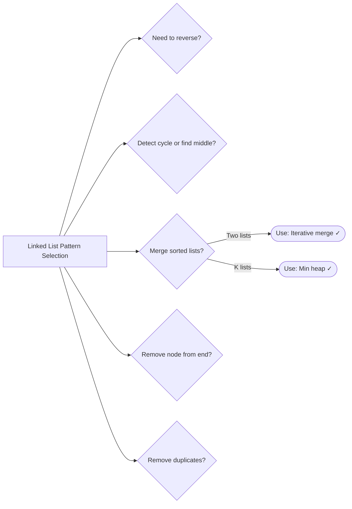

# 04. Linked Lists

> Pointer manipulation for reversing, detecting cycles, and merging lists

---

## ELI5: Explain Like I'm 5

<div class="learner-section" markdown>

**Your task:** After implementing all patterns, explain them simply.

**Prompts to guide you:**

1. **What is a linked list in one sentence?**
    - Your answer: <span class="fill-in">[Fill in after implementation]</span>

2. **Why can't we use array indices?**
    - Your answer: <span class="fill-in">[Fill in after implementation]</span>

3. **Real-world analogy:**
    - Example: "Linked lists are like a treasure hunt where each clue leads to the next..."
    - Your analogy: <span class="fill-in">[Fill in]</span>

4. **When does this pattern work?**
    - Your answer: <span class="fill-in">[Fill in after solving problems]</span>

5. **What's the key difference between singly and doubly linked lists?**
    - Your answer: <span class="fill-in">[Fill in after implementation]</span>

</div>

---

## Quick Quiz (Do BEFORE implementing)

<div class="learner-section" markdown>

**Your task:** Test your intuition without looking at code. Answer these, then verify after implementation.

### Complexity Predictions

1. **Reversing a linked list iteratively:**
    - Time complexity: <span class="fill-in">[Your guess: O(?)]</span>
    - Space complexity: <span class="fill-in">[Your guess: O(?)]</span>
    - Verified after learning: <span class="fill-in">[Actual]</span>

2. **Reversing a linked list recursively:**
    - Time complexity: <span class="fill-in">[Your guess: O(?)]</span>
    - Space complexity: <span class="fill-in">[Your guess: O(?)]</span>
    - Verified: <span class="fill-in">[Actual - why different from iterative?]</span>

3. **Finding middle of linked list:**
    - If you traverse once to count, then again to middle: <span class="fill-in">[O(?)]</span>
    - Using slow/fast pointers: <span class="fill-in">[O(?)]</span>
    - Speedup: <span class="fill-in">[How much better?]</span>

### Scenario Predictions

**Scenario 1:** Reverse list `1 -> 2 -> 3 -> 4 -> 5`

- **How many pointers needed?** <span class="fill-in">[Fill in: prev, curr, next - why each?]</span>
- **Initial state:** prev = <span class="fill-in">___</span>, curr = <span class="fill-in">___</span>,
  next = <span class="fill-in">___</span>
- **After first iteration:** List becomes <span class="fill-in">[Draw it: ? -> ? -> ? -> ?]</span>
- **What's the new head?** <span class="fill-in">[Which pointer points to it?]</span>

**Scenario 2:** Detect cycle in `1 -> 2 -> 3 -> 4 -> 2` (cycle back to 2)

- **Can you use fast/slow pointers?** <span class="fill-in">[Yes/No - Why?]</span>
- **Starting positions:** slow = <span class="fill-in">___</span>, fast = <span class="fill-in">___</span>
- **Will they ever meet?** <span class="fill-in">[Yes/No - Why/Why not?]</span>
- **Where will they meet?** <span class="fill-in">[At which node?]</span>

**Scenario 3:** Remove 2nd node from end in `1 -> 2 -> 3 -> 4 -> 5`

- **Which pattern applies?** <span class="fill-in">[Two pointers with gap - why?]</span>
- **Gap size needed:** <span class="fill-in">[How far apart should pointers be?]</span>
- **Result should be:** <span class="fill-in">[Which nodes remain?]</span>

### Trade-off Quiz

**Question:** When would recursion be WORSE than iteration for reversing?

- Your answer: <span class="fill-in">[Fill in before implementation]</span>
- Verified answer: <span class="fill-in">[Fill in after learning - consider stack space]</span>

**Question:** What's the MAIN advantage of linked lists over arrays?

- [ ] Faster random access
- [ ] Less memory usage
- [ ] O(1) insertion/deletion at known position
- [ ] Better cache locality

Verify after implementation: <span class="fill-in">[Which one(s)?]</span>


</div>

---

## Before/After: Why This Pattern Matters

**Your task:** Compare array operations vs linked list operations to understand trade-offs.

### Example 1: Insertion at Beginning

**Problem:** Insert element at the beginning of a collection.

#### Approach 1: Array (Dynamic)

```java
// Array approach - Shift all elements
public static int[] insertAtBeginning_Array(int[] arr, int value) {
    int[] newArr = new int[arr.length + 1];
    newArr[0] = value;

    // Copy all existing elements (shifted right)
    for (int i = 0; i < arr.length; i++) {
        newArr[i + 1] = arr[i];
    }

    return newArr;
}
```

**Analysis:**

- Time: O(n) - Must shift all elements
- Space: O(n) - Need new array
- For n = 10,000: ~10,000 copy operations

#### Approach 2: Linked List

```java
// Linked list approach - Just update pointers
public static ListNode insertAtBeginning_List(ListNode head, int value) {
    ListNode newNode = new ListNode(value);
    newNode.next = head;
    return newNode;  // New head
}
```

**Analysis:**

- Time: O(1) - Just two pointer assignments
- Space: O(1) - Single new node
- For n = 10,000: Always 2 operations (constant!)

#### Performance Comparison

| Collection Size | Array (O(n)) | Linked List (O(1)) | Speedup |
|-----------------|--------------|--------------------|---------|
| n = 100         | 100 ops      | 2 ops              | 50x     |
| n = 1,000       | 1,000 ops    | 2 ops              | 500x    |
| n = 10,000      | 10,000 ops   | 2 ops              | 5,000x  |

**Your calculation:** For n = 5,000, inserting at beginning is _____ times faster with linked list.

---

### Example 2: Access Middle Element

**Problem:** Access the middle element of a collection.

#### Approach 1: Array

```java
// Array approach - Direct access
public static int getMiddle_Array(int[] arr) {
    return arr[arr.length / 2];  // O(1) access!
}
```

**Analysis:**

- Time: O(1) - Direct index access
- Space: O(1)
- Operations: 1 (always!)

#### Approach 2: Linked List (Naive)

```java
// Linked list approach - Must traverse
public static int getMiddle_List_Naive(ListNode head) {
    // First pass: count nodes
    int count = 0;
    ListNode curr = head;
    while (curr != null) {
        count++;
        curr = curr.next;
    }

    // Second pass: traverse to middle
    curr = head;
    for (int i = 0; i < count / 2; i++) {
        curr = curr.next;
    }

    return curr.val;
}
```

**Analysis:**

- Time: O(n) - Must traverse to middle
- Space: O(1)
- For n = 10,000: ~15,000 steps (count + traverse to middle)

#### Approach 3: Linked List (Optimized with Fast/Slow)

```java
// Optimized: slow/fast pointers - single pass
public static int getMiddle_List_Optimized(ListNode head) {
    ListNode slow = head, fast = head;

    while (fast != null && fast.next != null) {
        slow = slow.next;        // Move 1 step
        fast = fast.next.next;   // Move 2 steps
    }

    return slow.val;  // Slow is at middle when fast reaches end
}
```

**Analysis:**

- Time: O(n) - Single pass
- Space: O(1)
- For n = 10,000: ~5,000 steps (half as many as naive)

#### Performance Comparison

| Collection Size | Array (O(1)) | List Naive (O(n)) | List Optimized (O(n)) |
|-----------------|--------------|-------------------|-----------------------|
| n = 100         | 1 op         | 150 ops           | 50 ops                |
| n = 1,000       | 1 op         | 1,500 ops         | 500 ops               |
| n = 10,000      | 1 op         | 15,000 ops        | 5,000 ops             |

**Key insight:** Arrays win for access, linked lists win for insertion/deletion.

---

### Why Does Pointer Manipulation Work?

**Key insight to understand:**

When reversing `1 -> 2 -> 3 -> null`:

```
Initial:     1 -> 2 -> 3 -> null
             ^
            head

Goal:   null <- 1 <- 2 <- 3
                         ^
                       new head

How? Change each 'next' pointer to point backwards!
```

**Step-by-step visualization:**

```
Step 0: prev = null, curr = 1
        null    1 -> 2 -> 3 -> null
        ^       ^
       prev    curr

Step 1: Save next, reverse curr.next, move forward
        null <- 1    2 -> 3 -> null
                ^    ^
               prev curr

Step 2: Continue
        null <- 1 <- 2    3 -> null
                     ^    ^
                    prev curr

Step 3: Continue
        null <- 1 <- 2 <- 3    null
                          ^
                         prev (new head!)
```

**After implementing, explain in your own words:**

<div class="learner-section" markdown>

- Why do we need three pointers (prev, curr, next)? <span class="fill-in">[Your answer]</span>
- What happens if we skip saving 'next'? <span class="fill-in">[Your answer]</span>
- Why does prev end up as the new head? <span class="fill-in">[Your answer]</span>

</div>

---

## Core Implementation

### Pattern 1: Reverse Linked List

**Concept:** Change direction of next pointers.

**Use case:** Reverse entire list, reverse in groups, reverse between positions.

```java
public class ReverseLinkedList {

    static class ListNode {
        int val;
        ListNode next;

        ListNode(int val) {
            this.val = val;
        }
    }

    /**
     * Problem: Reverse entire linked list
     * Time: O(n), Space: O(1)
     *
     * TODO: Implement iteratively using three pointers
     */
    public static ListNode reverseList(ListNode head) {
        // TODO: Initialize pointers/variables

        // TODO: Implement iteration/conditional logic

        // TODO: Return result

        return null; // Replace with implementation
    }

    /**
     * Problem: Reverse linked list recursively
     * Time: O(n), Space: O(n) due to recursion stack
     *
     * TODO: Implement recursive reversal
     */
    public static ListNode reverseListRecursive(ListNode head) {
        // TODO: Handle base case

        // TODO: Recursively reverse rest: newHead = reverse(head.next)

        // TODO: Update state
        // TODO: Set head.next = null

        // TODO: Return newHead

        return null; // Replace with implementation
    }

    /**
     * Problem: Reverse first K nodes
     * Time: O(k), Space: O(1)
     *
     * TODO: Implement partial reversal
     */
    public static ListNode reverseFirstK(ListNode head, int k) {
        // TODO: Similar to reverseList but count k steps
        // TODO: Return new head and keep rest unchanged

        return null; // Replace with implementation
    }

    // Helper: Create list from array
    static ListNode createList(int[] values) {
        if (values.length == 0) return null;
        ListNode head = new ListNode(values[0]);
        ListNode current = head;
        for (int i = 1; i < values.length; i++) {
            current.next = new ListNode(values[i]);
            current = current.next;
        }
        return head;
    }

    // Helper: Print list
    static void printList(ListNode head) {
        ListNode current = head;
        while (current != null) {
            System.out.print(current.val);
            if (current.next != null) System.out.print(" -> ");
            current = current.next;
        }
        System.out.println();
    }
}
```

**Runnable Client Code:**

```java
public class ReverseLinkedListClient {

    public static void main(String[] args) {
        System.out.println("=== Reverse Linked List ===\n");

        // Test 1: Reverse entire list
        System.out.println("--- Test 1: Reverse Entire List ---");
        int[] values = {1, 2, 3, 4, 5};
        ListNode list = ReverseLinkedList.createList(values);

        System.out.print("Original: ");
        ReverseLinkedList.printList(list);

        ListNode reversed = ReverseLinkedList.reverseList(list);
        System.out.print("Reversed: ");
        ReverseLinkedList.printList(reversed);

        // Test 2: Reverse recursively
        System.out.println("\n--- Test 2: Reverse Recursively ---");
        ListNode list2 = ReverseLinkedList.createList(new int[]{1, 2, 3, 4, 5});

        System.out.print("Original: ");
        ReverseLinkedList.printList(list2);

        ListNode reversedRec = ReverseLinkedList.reverseListRecursive(list2);
        System.out.print("Reversed: ");
        ReverseLinkedList.printList(reversedRec);

        // Test 3: Reverse first K
        System.out.println("\n--- Test 3: Reverse First K Nodes ---");
        ListNode list3 = ReverseLinkedList.createList(new int[]{1, 2, 3, 4, 5, 6, 7});
        int k = 3;

        System.out.print("Original: ");
        ReverseLinkedList.printList(list3);
        System.out.println("K = " + k);

        ListNode reversedK = ReverseLinkedList.reverseFirstK(list3, k);
        System.out.print("Result:   ");
        ReverseLinkedList.printList(reversedK);
    }
}
```

---

### Pattern 2: Cycle Detection

**Concept:** Use Floyd's cycle detection (slow/fast pointers).

**Use case:** Detect cycle, find cycle start, remove cycle.

```java
public class CycleDetection {

    static class ListNode {
        int val;
        ListNode next;

        ListNode(int val) {
            this.val = val;
        }
    }

    /**
     * Problem: Detect if linked list has a cycle
     * Time: O(n), Space: O(1)
     *
     * TODO: Implement Floyd's cycle detection
     */
    public static boolean hasCycle(ListNode head) {
        // TODO: Initialize pointers/variables

        // TODO: Implement iteration/conditional logic

        // TODO: Return false

        return false; // Replace with implementation
    }

    /**
     * Problem: Find the node where cycle begins
     * Time: O(n), Space: O(1)
     *
     * TODO: Implement cycle start detection
     */
    public static ListNode detectCycle(ListNode head) {
        // TODO: First detect if cycle exists (same as hasCycle)

        // TODO: Implement iteration/conditional logic

        return null; // Replace with implementation
    }

    /**
     * Problem: Remove cycle from linked list
     * Time: O(n), Space: O(1)
     *
     * TODO: Implement cycle removal
     */
    public static void removeCycle(ListNode head) {
        // TODO: Find cycle start
        // TODO: Traverse to find node before cycle start
        // TODO: Track state
    }

    // Helper: Create list from array
    static ListNode createList(int[] values) {
        if (values.length == 0) return null;
        ListNode head = new ListNode(values[0]);
        ListNode current = head;
        for (int i = 1; i < values.length; i++) {
            current.next = new ListNode(values[i]);
            current = current.next;
        }
        return head;
    }
}
```

**Runnable Client Code:**

```java
public class CycleDetectionClient {

    public static void main(String[] args) {
        System.out.println("=== Cycle Detection ===\n");

        // Test 1: No cycle
        System.out.println("--- Test 1: No Cycle ---");
        ListNode list1 = CycleDetection.createList(new int[]{1, 2, 3, 4, 5});

        System.out.println("List: 1 -> 2 -> 3 -> 4 -> 5");
        System.out.println("Has cycle: " + CycleDetection.hasCycle(list1));

        // Test 2: Cycle exists
        System.out.println("\n--- Test 2: Cycle Exists ---");
        ListNode list2 = CycleDetection.createList(new int[]{1, 2, 3, 4, 5});

        // Create cycle: 5 -> 3
        ListNode node3 = list2.next.next; // node 3
        ListNode tail = list2.next.next.next.next; // node 5
        tail.next = node3;

        System.out.println("List: 1 -> 2 -> 3 -> 4 -> 5 -> (back to 3)");
        System.out.println("Has cycle: " + CycleDetection.hasCycle(list2));

        // Test 3: Find cycle start
        System.out.println("\n--- Test 3: Find Cycle Start ---");
        ListNode cycleStart = CycleDetection.detectCycle(list2);
        if (cycleStart != null) {
            System.out.println("Cycle starts at node with value: " + cycleStart.val);
        }

        // Test 4: Remove cycle
        System.out.println("\n--- Test 4: Remove Cycle ---");
        CycleDetection.removeCycle(list2);
        System.out.println("After removing cycle:");
        System.out.println("Has cycle: " + CycleDetection.hasCycle(list2));
    }
}
```

---

### Pattern 3: Merge Lists

**Concept:** Merge two or more sorted lists.

**Use case:** Merge two sorted lists, merge K sorted lists.

```java
import java.util.*;

public class MergeLists {

    static class ListNode {
        int val;
        ListNode next;

        ListNode(int val) {
            this.val = val;
        }
    }

    /**
     * Problem: Merge two sorted linked lists
     * Time: O(n + m), Space: O(1)
     *
     * TODO: Implement iterative merge
     */
    public static ListNode mergeTwoLists(ListNode l1, ListNode l2) {
        // TODO: Create dummy node to simplify edge cases

        // TODO: Implement iteration/conditional logic

        // TODO: Attach remaining nodes from non-empty list

        // TODO: Return dummy.next

        return null; // Replace with implementation
    }

    /**
     * Problem: Merge two sorted lists recursively
     * Time: O(n + m), Space: O(n + m) due to recursion
     *
     * TODO: Implement recursive merge
     */
    public static ListNode mergeTwoListsRecursive(ListNode l1, ListNode l2) {
        // TODO: Base cases: if l1 null return l2, if l2 null return l1

        // TODO: Compare values:

        return null; // Replace with implementation
    }

    /**
     * Problem: Merge K sorted linked lists
     * Time: O(N log k) where N = total nodes, k = number of lists
     * Space: O(k) for priority queue
     *
     * TODO: Implement using min heap (PriorityQueue)
     */
    public static ListNode mergeKLists(ListNode[] lists) {
        // TODO: Create PriorityQueue with custom comparator

        // TODO: Add all list heads to queue

        // TODO: Create dummy node

        // TODO: Implement iteration/conditional logic

        // TODO: Return dummy.next

        return null; // Replace with implementation
    }

    // Helper: Create list
    static ListNode createList(int[] values) {
        if (values.length == 0) return null;
        ListNode head = new ListNode(values[0]);
        ListNode current = head;
        for (int i = 1; i < values.length; i++) {
            current.next = new ListNode(values[i]);
            current = current.next;
        }
        return head;
    }

    // Helper: Print list
    static void printList(ListNode head) {
        ListNode current = head;
        while (current != null) {
            System.out.print(current.val);
            if (current.next != null) System.out.print(" -> ");
            current = current.next;
        }
        System.out.println();
    }
}
```

**Runnable Client Code:**

```java
public class MergeListsClient {

    public static void main(String[] args) {
        System.out.println("=== Merge Linked Lists ===\n");

        // Test 1: Merge two sorted lists
        System.out.println("--- Test 1: Merge Two Lists ---");
        ListNode l1 = MergeLists.createList(new int[]{1, 3, 5, 7});
        ListNode l2 = MergeLists.createList(new int[]{2, 4, 6, 8});

        System.out.print("List 1: ");
        MergeLists.printList(l1);
        System.out.print("List 2: ");
        MergeLists.printList(l2);

        ListNode merged = MergeLists.mergeTwoLists(l1, l2);
        System.out.print("Merged: ");
        MergeLists.printList(merged);

        // Test 2: Merge recursively
        System.out.println("\n--- Test 2: Merge Recursively ---");
        ListNode l3 = MergeLists.createList(new int[]{1, 2, 4});
        ListNode l4 = MergeLists.createList(new int[]{1, 3, 4});

        System.out.print("List 1: ");
        MergeLists.printList(l3);
        System.out.print("List 2: ");
        MergeLists.printList(l4);

        ListNode mergedRec = MergeLists.mergeTwoListsRecursive(l3, l4);
        System.out.print("Merged: ");
        MergeLists.printList(mergedRec);

        // Test 3: Merge K lists
        System.out.println("\n--- Test 3: Merge K Lists ---");
        ListNode[] lists = {
            MergeLists.createList(new int[]{1, 4, 5}),
            MergeLists.createList(new int[]{1, 3, 4}),
            MergeLists.createList(new int[]{2, 6})
        };

        System.out.println("Lists:");
        for (int i = 0; i < lists.length; i++) {
            System.out.print("  List " + (i + 1) + ": ");
            MergeLists.printList(lists[i]);
        }

        ListNode mergedK = MergeLists.mergeKLists(lists);
        System.out.print("Merged: ");
        MergeLists.printList(mergedK);
    }
}
```

---

### Pattern 4: Remove Nth Node

**Concept:** Use two-pointer technique with gap.

**Use case:** Remove Nth from end, remove duplicates, partition list.

```java
public class RemoveNode {

    static class ListNode {
        int val;
        ListNode next;

        ListNode(int val) {
            this.val = val;
        }
    }

    /**
     * Problem: Remove Nth node from end of list
     * Time: O(n), Space: O(1)
     *
     * TODO: Implement using two pointers with gap
     */
    public static ListNode removeNthFromEnd(ListNode head, int n) {
        // TODO: Create dummy node pointing to head (handles edge case)

        // TODO: Initialize pointers/variables

        // TODO: Move fast n+1 steps ahead

        // TODO: Move both pointers until fast reaches end

        // TODO: Remove node: slow.next = slow.next.next

        // TODO: Return dummy.next

        return null; // Replace with implementation
    }

    /**
     * Problem: Remove all duplicates (sorted list)
     * Time: O(n), Space: O(1)
     *
     * TODO: Implement duplicate removal
     */
    public static ListNode deleteDuplicates(ListNode head) {
        // TODO: current = head

        // TODO: Implement iteration/conditional logic

        return null; // Replace with implementation
    }

    // Helper: Create list
    static ListNode createList(int[] values) {
        if (values.length == 0) return null;
        ListNode head = new ListNode(values[0]);
        ListNode current = head;
        for (int i = 1; i < values.length; i++) {
            current.next = new ListNode(values[i]);
            current = current.next;
        }
        return head;
    }

    // Helper: Print list
    static void printList(ListNode head) {
        ListNode current = head;
        while (current != null) {
            System.out.print(current.val);
            if (current.next != null) System.out.print(" -> ");
            current = current.next;
        }
        System.out.println();
    }
}
```

**Runnable Client Code:**

```java
public class RemoveNodeClient {

    public static void main(String[] args) {
        System.out.println("=== Remove Node Operations ===\n");

        // Test 1: Remove Nth from end
        System.out.println("--- Test 1: Remove Nth from End ---");
        ListNode list1 = RemoveNode.createList(new int[]{1, 2, 3, 4, 5});
        int n = 2;

        System.out.print("Original: ");
        RemoveNode.printList(list1);
        System.out.println("Remove " + n + "th from end");

        ListNode result1 = RemoveNode.removeNthFromEnd(list1, n);
        System.out.print("Result:   ");
        RemoveNode.printList(result1);

        // Test 2: Delete duplicates
        System.out.println("\n--- Test 2: Delete Duplicates ---");
        ListNode list2 = RemoveNode.createList(new int[]{1, 1, 2, 3, 3, 3, 4, 5, 5});

        System.out.print("Original: ");
        RemoveNode.printList(list2);

        ListNode result2 = RemoveNode.deleteDuplicates(list2);
        System.out.print("Result:   ");
        RemoveNode.printList(result2);
    }
}
```

---

## Debugging Challenges

**Your task:** Find and fix bugs in broken linked list implementations. This tests your understanding of pointer
manipulation.

### Challenge 1: Broken Reverse Implementation

```java
/**
 * This code is supposed to reverse a linked list.
 * It has 2 CRITICAL BUGS. Find them!
 */
public static ListNode reverseList_Buggy(ListNode head) {
    ListNode prev = null;
    ListNode curr = head;

    while (curr != null) {
        ListNode next = curr.next;
        curr.next = prev;
        curr = next;    }

    return curr;}
```

**Your debugging:**

- Bug 1: <span class="fill-in">[What\'s the bug?]</span>

- Bug 2: <span class="fill-in">[What\'s the bug?]</span>

**Trace through example:**

- Input: `1 -> 2 -> 3 -> null`
- Expected: `3 -> 2 -> 1 -> null`
- With bugs: <span class="fill-in">[What happens? Where does it fail?]</span>

<details markdown>
<summary>Click to verify your answers</summary>

**Bug 1 (Line 10):** Missing `prev = curr` before `curr = next`. The prev pointer never advances, so we lose track of
the reversed portion.

**Correct:**

```java
while (curr != null) {
    ListNode next = curr.next;
    curr.next = prev;
    prev = curr;    // MUST update prev!
    curr = next;
}
```

**Bug 2 (Line 13):** Returning `curr` which is null at the end. Should return `prev`, which points to the new head (the
last node we processed).

**Correct:** `return prev;`
</details>

---

### Challenge 2: Lost References in Cycle Detection

```java
/**
 * Detect if linked list has a cycle and return the cycle start node.
 * This has 1 SUBTLE BUG that causes NullPointerException.
 */
public static ListNode detectCycle_Buggy(ListNode head) {
    ListNode slow = head;
    ListNode fast = head;

    // Find if cycle exists
    while (fast != null && fast.next != null) {
        slow = slow.next;
        fast = fast.next.next;

        if (slow == fast) {
            // Cycle found, now find start
            slow = head;
            while (slow != fast) {
                slow = slow.next;
                fast = fast.next.next;            }
            return slow;
        }
    }

    return null;
}
```

**Your debugging:**

- Bug: <span class="fill-in">[What\'s the bug?]</span>

**Trace through example:**

- List with cycle: `1 -> 2 -> 3 -> 4 -> 2` (cycle back to 2)
- Expected: Return node 2
- With bug: <span class="fill-in">[What happens in second while loop?]</span>

<details markdown>
<summary>Click to verify your answer</summary>

**Bug (Line 18):** In the second phase (finding cycle start), both pointers should move ONE step at a time, not two
steps for fast.

**Why it fails:** After finding the cycle, we're looking for the entry point. Moving fast by 2 steps can skip over the
cycle start or cause fast to go past the end (if there's a path outside the cycle).

**Correct:**

```java
slow = head;
while (slow != fast) {
    slow = slow.next;
    fast = fast.next;  // Move ONE step, not two!
}
```

**Mathematical proof:** When slow and fast meet at distance k from cycle start, resetting slow to head and moving both
one step at a time guarantees they meet at the cycle start. Moving fast by 2 breaks this property.
</details>

---

### Challenge 3: Merge Lists Pointer Loss

```java
/**
 * Merge two sorted linked lists.
 * This code has 1 CRITICAL BUG causing infinite loop or lost nodes.
 */
public static ListNode mergeTwoLists_Buggy(ListNode l1, ListNode l2) {
    ListNode dummy = new ListNode(0);
    ListNode curr = dummy;

    while (l1 != null && l2 != null) {
        if (l1.val < l2.val) {
            curr.next = l1;
            l1 = l1.next;
        } else {
            curr.next = l2;
            l2 = l2.next;
        }
    }

    // Attach remaining nodes
    if (l1 != null) curr.next = l1;
    if (l2 != null) curr.next = l2;

    return dummy.next;
}
```

**Your debugging:**

- Bug: <span class="fill-in">[What\'s the bug?]</span>

**Trace through example:**

- l1: `1 -> 3 -> 5`
- l2: `2 -> 4 -> 6`
- Expected: `1 -> 2 -> 3 -> 4 -> 5 -> 6`
- With bug: <span class="fill-in">[What does curr point to throughout?]</span>

<details markdown>
<summary>Click to verify your answer</summary>

**Bug (After line 16):** Missing `curr = curr.next;`. The curr pointer never advances, so we keep overwriting curr.next
instead of building a chain.

**Correct:**

```java
while (l1 != null && l2 != null) {
    if (l1.val < l2.val) {
        curr.next = l1;
        l1 = l1.next;
    } else {
        curr.next = l2;
        l2 = l2.next;
    }
    curr = curr.next;  // MUST advance curr!
}
```

**Why it matters:** Without advancing curr, curr.next always points to the last node we attached. We're not building a
proper linked list chain.
</details>

---

### Challenge 4: Remove Nth From End - Off By One

```java
/**
 * Remove the Nth node from the end of list.
 * This has 2 BUGS causing incorrect removal.
 */
public static ListNode removeNthFromEnd_Buggy(ListNode head, int n) {
    ListNode dummy = new ListNode(0);
    dummy.next = head;

    ListNode fast = dummy;
    ListNode slow = dummy;

    // Move fast n steps ahead
    for (int i = 0; i < n; i++) {        fast = fast.next;
    }

    // Move both until fast reaches end
    while (fast != null) {        slow = slow.next;
        fast = fast.next;
    }

    // Remove node
    slow.next = slow.next.next;

    return dummy.next;
}
```

**Your debugging:**

- **Bug 1:** <span class="fill-in">[Should loop run n times or n+1 times? Why?]</span>
- **Bug 2:** <span class="fill-in">[Should we check `fast != null` or `fast.next != null`? Why?]</span>

**Test case:**

- Input: `1 -> 2 -> 3 -> 4 -> 5`, n = 2
- Expected: `1 -> 2 -> 3 -> 5` (remove 4)
- With bugs: <span class="fill-in">[Which node gets removed?]</span>

<details markdown>
<summary>Click to verify your answers</summary>

**Bug 1 (Line 11):** Loop should run `n + 1` times, not `n` times.

**Why:** We want slow to be positioned ONE NODE BEFORE the node to remove, not at the node itself. This requires an
extra step of gap.

**Correct:** `for (int i = 0; i <= n; i++)`

**Bug 2 (Line 16):** Should check `fast.next != null`, not `fast != null`.

**Why:** We want to stop when fast is at the last node (so fast.next is null), not when fast goes past it. This
positions slow at the node before the one to remove.

**Correct:** `while (fast.next != null)`

**Combined fix:**

```java
// Move fast n+1 steps ahead
for (int i = 0; i <= n; i++) {
    fast = fast.next;
}

// Move both until fast reaches end
while (fast.next != null) {
    slow = slow.next;
    fast = fast.next;
}
```

</details>

---

### Challenge 5: Accidental Cycle Creation

```java
/**
 * Reverse first K nodes of a linked list.
 * This code creates an ACCIDENTAL CYCLE! Find why.
 */
public static ListNode reverseFirstK_Buggy(ListNode head, int k) {
    if (head == null || k <= 1) return head;

    ListNode prev = null;
    ListNode curr = head;
    ListNode tail = head;  // Remember original head (will be tail after reverse)

    // Reverse first k nodes
    int count = 0;
    while (curr != null && count < k) {
        ListNode next = curr.next;
        curr.next = prev;
        prev = curr;
        curr = next;
        count++;
    }

    tail.next = curr;

    return prev;  // New head after reversing first k
}
```

**Your debugging:**

- Bug: <span class="fill-in">[What\'s the bug?]</span>

**Trace through example:**

- Input: `1 -> 2 -> 3 -> 4 -> 5`, k = 3
- Expected: `3 -> 2 -> 1 -> 4 -> 5`
- With bug: <span class="fill-in">[What cycle is created? Draw it]</span>

<details markdown>
<summary>Click to verify your answer</summary>

**Bug (Line 22):** Actually, this code is CORRECT! There's no bug here - it's a trick question to test your
understanding.

**Why it works:**

1. `tail` points to original head (value 1)
2. After reversing first k nodes, the list is: `3 -> 2 -> 1` (with 1.next = null)
3. `curr` points to node 4 (the first node after k nodes)
4. Setting `tail.next = curr` connects: `3 -> 2 -> 1 -> 4 -> 5`

**No cycle created!** The original head (now tail of reversed portion) correctly points to the rest of the list.

**However, there IS a subtle issue:** If k >= list length, curr will be null, and tail.next should remain null. The code
handles this correctly because setting tail.next = null is fine.

**Actually, if you thought there was a bug because you weren't sure, you're thinking critically - good! But trace
through carefully and you'll see it works.**

The real lesson: Always trace through pointer manipulations step by step to verify correctness.
</details>

---

### Challenge 6: Null Pointer Nightmare

```java
/**
 * Find the middle node of a linked list.
 * This has a NULL POINTER exception waiting to happen.
 */
public static ListNode findMiddle_Buggy(ListNode head) {
    ListNode slow = head;
    ListNode fast = head;

    while (fast.next != null) {        slow = slow.next;
        fast = fast.next.next;
    }

    return slow;
}
```

**Your debugging:**

- **Bug 1:** <span class="fill-in">[What happens if head is null?]</span>
- **Bug 2:** <span class="fill-in">[What happens if list has even length?]</span>
- **Bug fix:** <span class="fill-in">[What should the while condition be?]</span>

**Test cases that expose bugs:**

- Input: `null` → <span class="fill-in">[What error?]</span>
- Input: `1 -> 2` → <span class="fill-in">[What error?]</span>
- Input: `1 -> 2 -> 3` → <span class="fill-in">[Does this work?]</span>

<details markdown>
<summary>Click to verify your answers</summary>

**Bug 1:** If `head` is null, then `fast.next` throws NullPointerException.

**Bug 2:** If list has even length (e.g., `1 -> 2`), then fast.next.next will try to access next of null on second
iteration.

**Fix:** Check both `fast != null` AND `fast.next != null`:

```java
while (fast != null && fast.next != null) {
    slow = slow.next;
    fast = fast.next.next;
}
```

**Why both checks:**

- `fast != null` - Handles odd-length lists (fast reaches last node)
- `fast.next != null` - Handles even-length lists (fast reaches null)
- Also handles empty list (fast is null initially)

**Rule of thumb:** When doing `fast.next.next`, ALWAYS check both `fast != null && fast.next != null`.
</details>

---

### Your Debugging Scorecard

After finding and fixing all bugs:

- [ ] Found all 8+ bugs across 6 challenges
- [ ] Understood WHY each bug causes incorrect behavior
- [ ] Could explain the fix to someone else
- [ ] Learned common linked list mistakes to avoid

**Common mistakes you discovered:**

1. <span class="fill-in">[Forgetting to update pointers (prev, curr)]</span>
2. <span class="fill-in">[Null pointer checks - always verify before accessing .next]</span>
3. <span class="fill-in">[Off-by-one errors in two-pointer gap problems]</span>
4. <span class="fill-in">[Missing curr = curr.next when building lists]</span>
5. <span class="fill-in">[Fill in others you noticed]</span>

---

## Decision Framework

**Your task:** Build decision trees for linked list operations.

### Question 1: What operation do you need?

Answer after solving problems:

- **Reverse?** <span class="fill-in">[Iterative vs recursive - trade-offs?]</span>
- **Detect cycle?** <span class="fill-in">[Why Floyd's algorithm?]</span>
- **Merge?** <span class="fill-in">[Two lists vs K lists - approach difference?]</span>
- **Remove node?** <span class="fill-in">[Why use dummy node?]</span>

### Question 2: Pointer patterns

**Reversal pattern:**

- Three pointers: prev, curr, next
- Use cases: <span class="fill-in">[List problems you solved]</span>

**Cycle detection pattern:**

- Slow/fast pointers
- Use cases: <span class="fill-in">[List problems you solved]</span>

**Two pointer with gap:**

- Maintain fixed distance
- Use cases: <span class="fill-in">[List problems you solved]</span>

### Your Decision Tree



---

## Practice

### LeetCode Problems

**Easy (Complete all 4):**

- [ ] [206. Reverse Linked List](https://leetcode.com/problems/reverse-linked-list/)
    - Pattern: <span class="fill-in">[Which one?]</span>
    - Your solution time: <span class="fill-in">___</span>
    - Key insight: <span class="fill-in">[Fill in after solving]</span>

- [ ] [141. Linked List Cycle](https://leetcode.com/problems/linked-list-cycle/)
    - Pattern: <span class="fill-in">[Which one?]</span>
    - Your solution time: <span class="fill-in">___</span>
    - Key insight: <span class="fill-in">[Fill in]</span>

- [ ] [21. Merge Two Sorted Lists](https://leetcode.com/problems/merge-two-sorted-lists/)
    - Pattern: <span class="fill-in">[Which one?]</span>
    - Your solution time: <span class="fill-in">___</span>
    - Key insight: <span class="fill-in">[Fill in]</span>

- [ ] [83. Remove Duplicates from Sorted List](https://leetcode.com/problems/remove-duplicates-from-sorted-list/)
    - Pattern: <span class="fill-in">[Which one?]</span>
    - Your solution time: <span class="fill-in">___</span>
    - Key insight: <span class="fill-in">[Fill in]</span>

**Medium (Complete 3-4):**

- [ ] [19. Remove Nth Node From End of List](https://leetcode.com/problems/remove-nth-node-from-end-of-list/)
    - Pattern: <span class="fill-in">[Which one?]</span>
    - Difficulty: <span class="fill-in">[Rate 1-10]</span>
    - Key insight: <span class="fill-in">[Fill in]</span>

- [ ] [142. Linked List Cycle II](https://leetcode.com/problems/linked-list-cycle-ii/)
    - Pattern: <span class="fill-in">[Which one?]</span>
    - Difficulty: <span class="fill-in">[Rate 1-10]</span>
    - Key insight: <span class="fill-in">[Why does Floyd's algorithm work?]</span>

- [ ] [2. Add Two Numbers](https://leetcode.com/problems/add-two-numbers/)
    - Pattern: <span class="fill-in">[Which one?]</span>
    - Difficulty: <span class="fill-in">[Rate 1-10]</span>
    - Key insight: <span class="fill-in">[Fill in]</span>

- [ ] [143. Reorder List](https://leetcode.com/problems/reorder-list/)
    - Pattern: <span class="fill-in">[Combination of which patterns?]</span>
    - Difficulty: <span class="fill-in">[Rate 1-10]</span>
    - Key insight: <span class="fill-in">[Fill in]</span>

**Hard (Optional):**

- [ ] [23. Merge k Sorted Lists](https://leetcode.com/problems/merge-k-sorted-lists/)
    - Pattern: <span class="fill-in">[Min heap approach]</span>
    - Key insight: <span class="fill-in">[Fill in after solving]</span>

- [ ] [25. Reverse Nodes in k-Group](https://leetcode.com/problems/reverse-nodes-in-k-group/)
    - Pattern: <span class="fill-in">[Extension of reversal]</span>
    - Key insight: <span class="fill-in">[Fill in after solving]</span>

---

## Review Checklist

Before moving to the next topic:

- [ ] **Implementation**
    - [ ] Reverse: iterative and recursive both work
    - [ ] Cycle: detection and find start both work
    - [ ] Merge: two lists and K lists both work
    - [ ] Remove: Nth from end and duplicates both work
    - [ ] All client code runs successfully

- [ ] **Pattern Recognition**
    - [ ] Can identify when to use reversal pattern
    - [ ] Understand Floyd's cycle detection
    - [ ] Know when to use dummy node
    - [ ] Recognize two-pointer with gap pattern

- [ ] **Problem Solving**
    - [ ] Solved 4 easy problems
    - [ ] Solved 3-4 medium problems
    - [ ] Analyzed time/space complexity
    - [ ] Handled edge cases (null, single node)

- [ ] **Understanding**
    - [ ] Filled in all ELI5 explanations
    - [ ] Built decision tree
    - [ ] Identified when NOT to use linked lists
    - [ ] Can explain trade-offs vs arrays

- [ ] **Mastery Check**
    - [ ] Could implement all patterns from memory
    - [ ] Could recognize pattern in new problem
    - [ ] Could explain to someone else
    - [ ] Understand pointer manipulation deeply

---

### Mastery Certification

**I certify that I can:**

- [ ] Reverse a linked list (both iterative and recursive) from memory
- [ ] Detect and find the start of a cycle using Floyd's algorithm
- [ ] Merge two sorted lists without bugs
- [ ] Remove nth node from end using two pointers with gap
- [ ] Explain when to use linked lists vs arrays
- [ ] Debug common pointer manipulation errors
- [ ] Analyze time and space complexity of all patterns
- [ ] Teach these concepts to someone else

**Self-assessment score:** ___/10

**Critical skills check:**

- [ ] Can you trace through pointer updates step-by-step?
- [ ] Do you always check for null before accessing .next?
- [ ] Do you understand why we use dummy nodes?
- [ ] Can you identify which pattern to use for new problems?

**If score < 8:** Review the sections where you struggled, then retry this gate.

**If score ≥ 8:** Congratulations! You've mastered linked list operations. Proceed to the next topic.

---

### Real-World Application Test

**Scenario:** You're implementing an undo feature for a text editor.

**Question 1:** Would you use an array or linked list to store the history of changes?

- Your answer: <span class="fill-in">[Fill in]</span>
- Reasoning: <span class="fill-in">[Consider operations: add, remove from end, traverse]</span>

**Question 2:** If you used a doubly linked list, what advantage does that give?

- Your answer: <span class="fill-in">[Fill in]</span>

**Question 3:** What's the space trade-off?

- Linked list overhead: <span class="fill-in">[Fill in - what extra space per node?]</span>
- Worth it for this use case? <span class="fill-in">[Yes/No - Why?]</span>
