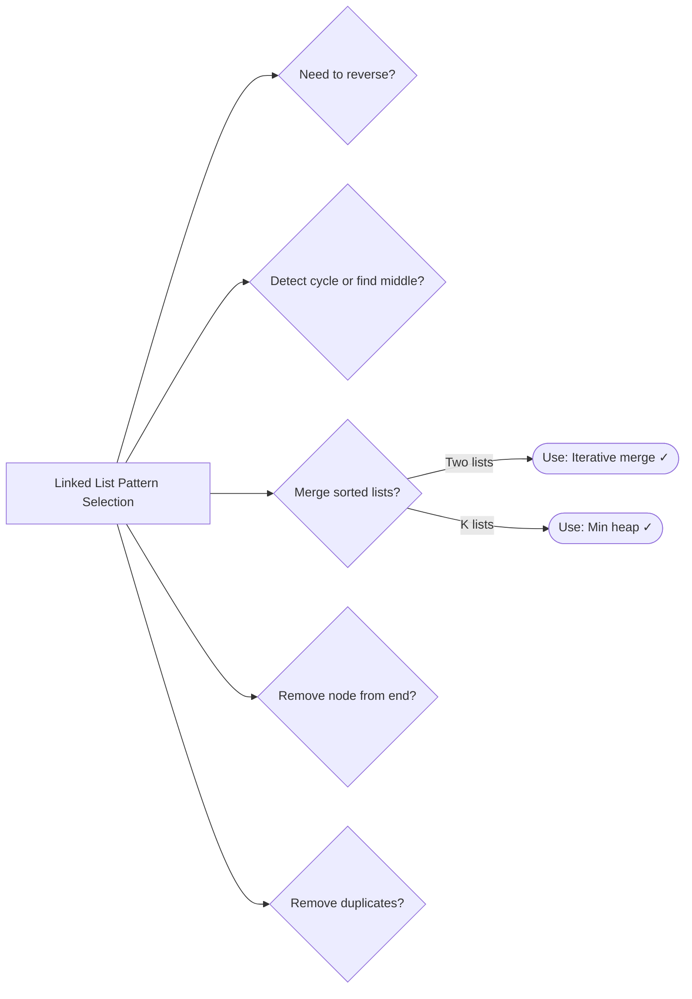

# Linked Lists

> Pointer manipulation for reversing, detecting cycles, and merging lists

---

## Learning Objectives

By the end of this topic you will be able to:

- Explain the structural difference between arrays and linked lists and articulate when each is preferable
- Implement iterative and recursive list reversal using the three-pointer (prev/curr/next) pattern
- Detect cycles and find the cycle-entry node using Floyd's algorithm with O(1) space
- Merge two sorted lists and K sorted lists, using a dummy head node to eliminate edge cases
- Remove the Nth node from the end in a single pass using a two-pointer gap technique
- Diagnose and fix the most common bugs: missing `prev = curr`, returning `curr` instead of `prev`, and incorrect null checks for fast/slow pointers

---

## ELI5: Explain Like I'm 5

<div class="learner-section" markdown>

**Your task:** After implementing all patterns, explain them simply.

**Prompts to guide you:**

1. **What is a linked list in one sentence?**
    - Your answer: <span class="fill-in">[A linked list is a sequence of nodes where each node holds a value and a pointer to ___, unlike an array which stores elements in ___ memory locations]</span>

2. **Why can't we use array indices?**
    - Your answer: <span class="fill-in">[Linked list nodes are not stored in contiguous memory, so there is no formula to compute the address of the nth node — you must ___ from the head]</span>

3. **Real-world analogy:**
    - Example: "Linked lists are like a treasure hunt where each clue leads to the next..."
    - Your analogy: <span class="fill-in">[Fill in]</span>

4. **When does this pattern work?**
    - Your answer: <span class="fill-in">[Fill in after solving problems]</span>

5. **What's the key difference between singly and doubly linked lists?**
    - Your answer: <span class="fill-in">[Fill in after implementation]</span>

</div>

---

## Quick Quiz (Do BEFORE implementing)

!!! tip "How to use this section"
    Write your best guess in each fill-in span **before** reading any implementation code. After you finish coding and running the tests, come back and fill in the "Verified" answers. The gap between your prediction and the actual answer is where the real learning happens.

<div class="learner-section" markdown>

**Your task:** Test your intuition without looking at code. Answer these, then verify after implementation.

### Complexity Predictions

1. **Reversing a linked list iteratively:**
    - Time complexity: <span class="fill-in">[Your guess: O(?)]</span>
    - Space complexity: <span class="fill-in">[Your guess: O(?)]</span>
    - Verified after learning: <span class="fill-in">[Actual]</span>

2. **Reversing a linked list recursively:**
    - Time complexity: <span class="fill-in">[Your guess: O(?)]</span>
    - Space complexity: <span class="fill-in">[Your guess: O(?)]</span>
    - Verified: <span class="fill-in">[Actual - why different from iterative?]</span>

3. **Finding middle of linked list:**
    - If you traverse once to count, then again to middle: <span class="fill-in">[O(?)]</span>
    - Using slow/fast pointers: <span class="fill-in">[O(?)]</span>
    - Speedup: <span class="fill-in">[How much better?]</span>

### Scenario Predictions

**Scenario 1:** Reverse list `1 -> 2 -> 3 -> 4 -> 5`

- **How many pointers needed?** <span class="fill-in">[Fill in: prev, curr, next - why each?]</span>
- **Initial state:** prev = <span class="fill-in">___</span>, curr = <span class="fill-in">___</span>,
  next = <span class="fill-in">___</span>
- **After first iteration:** List becomes <span class="fill-in">[Draw it: ? -> ? -> ? -> ?]</span>
- **What's the new head?** <span class="fill-in">[Which pointer points to it?]</span>

**Scenario 2:** Detect cycle in `1 -> 2 -> 3 -> 4 -> 2` (cycle back to 2)

- **Can you use fast/slow pointers?** <span class="fill-in">[Yes/No - Why?]</span>
- **Starting positions:** slow = <span class="fill-in">___</span>, fast = <span class="fill-in">___</span>
- **Will they ever meet?** <span class="fill-in">[Yes/No - Why/Why not?]</span>
- **Where will they meet?** <span class="fill-in">[At which node?]</span>

**Scenario 3:** Remove 2nd node from end in `1 -> 2 -> 3 -> 4 -> 5`

- **Which pattern applies?** <span class="fill-in">[Two pointers with gap - why?]</span>
- **Gap size needed:** <span class="fill-in">[How far apart should pointers be?]</span>
- **Result should be:** <span class="fill-in">[Which nodes remain?]</span>

### Trade-off Quiz

**Question:** When would recursion be WORSE than iteration for reversing?

- Your answer: <span class="fill-in">[Fill in before implementation]</span>
- Verified answer: <span class="fill-in">[Fill in after learning - consider stack space]</span>

**Question:** What's the MAIN advantage of linked lists over arrays?

- [ ] Faster random access
- [ ] Less memory usage
- [ ] O(1) insertion/deletion at known position
- [ ] Better cache locality

Verify after implementation: <span class="fill-in">[Which one(s)?]</span>


</div>

---

## Core Implementation

### Pattern 1: Reverse Linked List

**Concept:** Change direction of next pointers.

**Use case:** Reverse entire list, reverse in groups, reverse between positions.

```java
public class ReverseLinkedList {

    static class ListNode {
        int val;
        ListNode next;

        ListNode(int val) {
            this.val = val;
        }
    }

    /**
     * Problem: Reverse entire linked list
     * Time: O(n), Space: O(1)
     *
     * TODO: Implement iteratively using three pointers
     */
    public static ListNode reverseList(ListNode head) {
        // TODO: Initialize pointers/variables

        // TODO: Implement iteration/conditional logic

        // TODO: Return result

        return null; // Replace with implementation
    }

    /**
     * Problem: Reverse linked list recursively
     * Time: O(n), Space: O(n) due to recursion stack
     *
     * TODO: Implement recursive reversal
     */
    public static ListNode reverseListRecursive(ListNode head) {
        // TODO: Handle base case

        // TODO: Recursively reverse rest: newHead = reverse(head.next)

        // TODO: Update state
        // TODO: Set head.next = null

        // TODO: Return newHead

        return null; // Replace with implementation
    }

    /**
     * Problem: Reverse first K nodes
     * Time: O(k), Space: O(1)
     *
     * TODO: Implement partial reversal
     */
    public static ListNode reverseFirstK(ListNode head, int k) {
        // TODO: Similar to reverseList but count k steps
        // TODO: Return new head and keep rest unchanged

        return null; // Replace with implementation
    }

    // Helper: Create list from array
    static ListNode createList(int[] values) {
        if (values.length == 0) return null;
        ListNode head = new ListNode(values[0]);
        ListNode current = head;
        for (int i = 1; i < values.length; i++) {
            current.next = new ListNode(values[i]);
            current = current.next;
        }
        return head;
    }

    // Helper: Print list
    static void printList(ListNode head) {
        ListNode current = head;
        while (current != null) {
            System.out.print(current.val);
            if (current.next != null) System.out.print(" -> ");
            current = current.next;
        }
        System.out.println();
    }
}
```

**Runnable Client Code:**

```java
public class ReverseLinkedListClient {

    public static void main(String[] args) {
        System.out.println("=== Reverse Linked List ===\n");

        // Test 1: Reverse entire list
        System.out.println("--- Test 1: Reverse Entire List ---");
        int[] values = {1, 2, 3, 4, 5};
        ListNode list = ReverseLinkedList.createList(values);

        System.out.print("Original: ");
        ReverseLinkedList.printList(list);

        ListNode reversed = ReverseLinkedList.reverseList(list);
        System.out.print("Reversed: ");
        ReverseLinkedList.printList(reversed);

        // Test 2: Reverse recursively
        System.out.println("\n--- Test 2: Reverse Recursively ---");
        ListNode list2 = ReverseLinkedList.createList(new int[]{1, 2, 3, 4, 5});

        System.out.print("Original: ");
        ReverseLinkedList.printList(list2);

        ListNode reversedRec = ReverseLinkedList.reverseListRecursive(list2);
        System.out.print("Reversed: ");
        ReverseLinkedList.printList(reversedRec);

        // Test 3: Reverse first K
        System.out.println("\n--- Test 3: Reverse First K Nodes ---");
        ListNode list3 = ReverseLinkedList.createList(new int[]{1, 2, 3, 4, 5, 6, 7});
        int k = 3;

        System.out.print("Original: ");
        ReverseLinkedList.printList(list3);
        System.out.println("K = " + k);

        ListNode reversedK = ReverseLinkedList.reverseFirstK(list3, k);
        System.out.print("Result:   ");
        ReverseLinkedList.printList(reversedK);
    }
}
```

!!! warning "Debugging Challenge — Broken Reverse Implementation"
    The code below has **2 critical bugs**. Trace through `1 -> 2 -> 3 -> null` before checking the answer.

    ```java
    public static ListNode reverseList_Buggy(ListNode head) {
        ListNode prev = null;
        ListNode curr = head;
        while (curr != null) {
            ListNode next = curr.next;
            curr.next = prev;
            curr = next;    }
        return curr;
    }
    ```

    - Bug 1: <span class="fill-in">[Which pointer never advances? What is lost?]</span>
    - Bug 2: <span class="fill-in">[What does `curr` equal when the loop exits?]</span>

    ??? success "Answer"
        **Bug 1:** Missing `prev = curr` before `curr = next`. The `prev` pointer never advances, so the reversed portion is lost — every node's `next` is set back to `null` (the initial value of `prev`).

        **Bug 2:** `curr` is `null` when the loop exits (that's the exit condition). Returning `curr` returns `null`. Should return `prev`, which points to the new head (the last node processed).

        **Correct inner loop body:**
        ```java
        ListNode next = curr.next;
        curr.next = prev;
        prev = curr;    // MUST advance prev
        curr = next;
        ```
        **Correct return:** `return prev;`

---

### Pattern 2: Cycle Detection

**Concept:** Use Floyd's cycle detection (slow/fast pointers).

**Use case:** Detect cycle, find cycle start, remove cycle.

```java
public class CycleDetection {

    static class ListNode {
        int val;
        ListNode next;

        ListNode(int val) {
            this.val = val;
        }
    }

    /**
     * Problem: Detect if linked list has a cycle
     * Time: O(n), Space: O(1)
     *
     * TODO: Implement Floyd's cycle detection
     */
    public static boolean hasCycle(ListNode head) {
        // TODO: Initialize pointers/variables

        // TODO: Implement iteration/conditional logic

        // TODO: Return false

        return false; // Replace with implementation
    }

    /**
     * Problem: Find the node where cycle begins
     * Time: O(n), Space: O(1)
     *
     * TODO: Implement cycle start detection
     */
    public static ListNode detectCycle(ListNode head) {
        // TODO: First detect if cycle exists (same as hasCycle)

        // TODO: Implement iteration/conditional logic

        return null; // Replace with implementation
    }

    /**
     * Problem: Remove cycle from linked list
     * Time: O(n), Space: O(1)
     *
     * TODO: Implement cycle removal
     */
    public static void removeCycle(ListNode head) {
        // TODO: Find cycle start
        // TODO: Traverse to find node before cycle start
        // TODO: Track state
    }

    // Helper: Create list from array
    static ListNode createList(int[] values) {
        if (values.length == 0) return null;
        ListNode head = new ListNode(values[0]);
        ListNode current = head;
        for (int i = 1; i < values.length; i++) {
            current.next = new ListNode(values[i]);
            current = current.next;
        }
        return head;
    }
}
```

**Runnable Client Code:**

```java
public class CycleDetectionClient {

    public static void main(String[] args) {
        System.out.println("=== Cycle Detection ===\n");

        // Test 1: No cycle
        System.out.println("--- Test 1: No Cycle ---");
        ListNode list1 = CycleDetection.createList(new int[]{1, 2, 3, 4, 5});

        System.out.println("List: 1 -> 2 -> 3 -> 4 -> 5");
        System.out.println("Has cycle: " + CycleDetection.hasCycle(list1));

        // Test 2: Cycle exists
        System.out.println("\n--- Test 2: Cycle Exists ---");
        ListNode list2 = CycleDetection.createList(new int[]{1, 2, 3, 4, 5});

        // Create cycle: 5 -> 3
        ListNode node3 = list2.next.next; // node 3
        ListNode tail = list2.next.next.next.next; // node 5
        tail.next = node3;

        System.out.println("List: 1 -> 2 -> 3 -> 4 -> 5 -> (back to 3)");
        System.out.println("Has cycle: " + CycleDetection.hasCycle(list2));

        // Test 3: Find cycle start
        System.out.println("\n--- Test 3: Find Cycle Start ---");
        ListNode cycleStart = CycleDetection.detectCycle(list2);
        if (cycleStart != null) {
            System.out.println("Cycle starts at node with value: " + cycleStart.val);
        }

        // Test 4: Remove cycle
        System.out.println("\n--- Test 4: Remove Cycle ---");
        CycleDetection.removeCycle(list2);
        System.out.println("After removing cycle:");
        System.out.println("Has cycle: " + CycleDetection.hasCycle(list2));
    }
}
```

---

### Pattern 3: Merge Lists

**Concept:** Merge two or more sorted lists.

**Use case:** Merge two sorted lists, merge K sorted lists.

```java
import java.util.*;

public class MergeLists {

    static class ListNode {
        int val;
        ListNode next;

        ListNode(int val) {
            this.val = val;
        }
    }

    /**
     * Problem: Merge two sorted linked lists
     * Time: O(n + m), Space: O(1)
     *
     * TODO: Implement iterative merge
     */
    public static ListNode mergeTwoLists(ListNode l1, ListNode l2) {
        // TODO: Create dummy node to simplify edge cases

        // TODO: Implement iteration/conditional logic

        // TODO: Attach remaining nodes from non-empty list

        // TODO: Return dummy.next

        return null; // Replace with implementation
    }

    /**
     * Problem: Merge two sorted lists recursively
     * Time: O(n + m), Space: O(n + m) due to recursion
     *
     * TODO: Implement recursive merge
     */
    public static ListNode mergeTwoListsRecursive(ListNode l1, ListNode l2) {
        // TODO: Base cases: if l1 null return l2, if l2 null return l1

        // TODO: Compare values:

        return null; // Replace with implementation
    }

    /**
     * Problem: Merge K sorted linked lists
     * Time: O(N log k) where N = total nodes, k = number of lists
     * Space: O(k) for priority queue
     *
     * TODO: Implement using min heap (PriorityQueue)
     */
    public static ListNode mergeKLists(ListNode[] lists) {
        // TODO: Create PriorityQueue with custom comparator

        // TODO: Add all list heads to queue

        // TODO: Create dummy node

        // TODO: Implement iteration/conditional logic

        // TODO: Return dummy.next

        return null; // Replace with implementation
    }

    // Helper: Create list
    static ListNode createList(int[] values) {
        if (values.length == 0) return null;
        ListNode head = new ListNode(values[0]);
        ListNode current = head;
        for (int i = 1; i < values.length; i++) {
            current.next = new ListNode(values[i]);
            current = current.next;
        }
        return head;
    }

    // Helper: Print list
    static void printList(ListNode head) {
        ListNode current = head;
        while (current != null) {
            System.out.print(current.val);
            if (current.next != null) System.out.print(" -> ");
            current = current.next;
        }
        System.out.println();
    }
}
```

**Runnable Client Code:**

```java
public class MergeListsClient {

    public static void main(String[] args) {
        System.out.println("=== Merge Linked Lists ===\n");

        // Test 1: Merge two sorted lists
        System.out.println("--- Test 1: Merge Two Lists ---");
        ListNode l1 = MergeLists.createList(new int[]{1, 3, 5, 7});
        ListNode l2 = MergeLists.createList(new int[]{2, 4, 6, 8});

        System.out.print("List 1: ");
        MergeLists.printList(l1);
        System.out.print("List 2: ");
        MergeLists.printList(l2);

        ListNode merged = MergeLists.mergeTwoLists(l1, l2);
        System.out.print("Merged: ");
        MergeLists.printList(merged);

        // Test 2: Merge recursively
        System.out.println("\n--- Test 2: Merge Recursively ---");
        ListNode l3 = MergeLists.createList(new int[]{1, 2, 4});
        ListNode l4 = MergeLists.createList(new int[]{1, 3, 4});

        System.out.print("List 1: ");
        MergeLists.printList(l3);
        System.out.print("List 2: ");
        MergeLists.printList(l4);

        ListNode mergedRec = MergeLists.mergeTwoListsRecursive(l3, l4);
        System.out.print("Merged: ");
        MergeLists.printList(mergedRec);

        // Test 3: Merge K lists
        System.out.println("\n--- Test 3: Merge K Lists ---");
        ListNode[] lists = {
            MergeLists.createList(new int[]{1, 4, 5}),
            MergeLists.createList(new int[]{1, 3, 4}),
            MergeLists.createList(new int[]{2, 6})
        };

        System.out.println("Lists:");
        for (int i = 0; i < lists.length; i++) {
            System.out.print("  List " + (i + 1) + ": ");
            MergeLists.printList(lists[i]);
        }

        ListNode mergedK = MergeLists.mergeKLists(lists);
        System.out.print("Merged: ");
        MergeLists.printList(mergedK);
    }
}
```

!!! warning "Debugging Challenge — Missing `curr = curr.next` in Merge"
    The merge below compiles and runs but produces a single-node result instead of a full merged list. Trace through `l1 = 1->3->5` and `l2 = 2->4->6` before checking the answer.

    ```java
    public static ListNode mergeTwoLists_Buggy(ListNode l1, ListNode l2) {
        ListNode dummy = new ListNode(0);
        ListNode curr = dummy;
        while (l1 != null && l2 != null) {
            if (l1.val < l2.val) {
                curr.next = l1;
                l1 = l1.next;
            } else {
                curr.next = l2;
                l2 = l2.next;
            }
        }
        if (l1 != null) curr.next = l1;
        if (l2 != null) curr.next = l2;
        return dummy.next;
    }
    ```

    - Bug: <span class="fill-in">[Which pointer never advances? What does `dummy.next` actually point to?]</span>

    ??? success "Answer"
        **Bug:** `curr = curr.next` is missing at the end of each loop iteration. Without it, `curr` stays at `dummy` throughout, and `curr.next` is overwritten every iteration. Only the last node appended survives; the rest are silently discarded.

        **Fix:** Add `curr = curr.next;` as the last statement inside the `while` loop body.

---

### Pattern 4: Remove Nth Node

**Concept:** Use two-pointer technique with gap.

**Use case:** Remove Nth from end, remove duplicates, partition list.

```java
public class RemoveNode {

    static class ListNode {
        int val;
        ListNode next;

        ListNode(int val) {
            this.val = val;
        }
    }

    /**
     * Problem: Remove Nth node from end of list
     * Time: O(n), Space: O(1)
     *
     * TODO: Implement using two pointers with gap
     */
    public static ListNode removeNthFromEnd(ListNode head, int n) {
        // TODO: Create dummy node pointing to head (handles edge case)

        // TODO: Initialize pointers/variables

        // TODO: Move fast n+1 steps ahead

        // TODO: Move both pointers until fast reaches end

        // TODO: Remove node: slow.next = slow.next.next

        // TODO: Return dummy.next

        return null; // Replace with implementation
    }

    /**
     * Problem: Remove all duplicates (sorted list)
     * Time: O(n), Space: O(1)
     *
     * TODO: Implement duplicate removal
     */
    public static ListNode deleteDuplicates(ListNode head) {
        // TODO: current = head

        // TODO: Implement iteration/conditional logic

        return null; // Replace with implementation
    }

    // Helper: Create list
    static ListNode createList(int[] values) {
        if (values.length == 0) return null;
        ListNode head = new ListNode(values[0]);
        ListNode current = head;
        for (int i = 1; i < values.length; i++) {
            current.next = new ListNode(values[i]);
            current = current.next;
        }
        return head;
    }

    // Helper: Print list
    static void printList(ListNode head) {
        ListNode current = head;
        while (current != null) {
            System.out.print(current.val);
            if (current.next != null) System.out.print(" -> ");
            current = current.next;
        }
        System.out.println();
    }
}
```

**Runnable Client Code:**

```java
public class RemoveNodeClient {

    public static void main(String[] args) {
        System.out.println("=== Remove Node Operations ===\n");

        // Test 1: Remove Nth from end
        System.out.println("--- Test 1: Remove Nth from End ---");
        ListNode list1 = RemoveNode.createList(new int[]{1, 2, 3, 4, 5});
        int n = 2;

        System.out.print("Original: ");
        RemoveNode.printList(list1);
        System.out.println("Remove " + n + "th from end");

        ListNode result1 = RemoveNode.removeNthFromEnd(list1, n);
        System.out.print("Result:   ");
        RemoveNode.printList(result1);

        // Test 2: Delete duplicates
        System.out.println("\n--- Test 2: Delete Duplicates ---");
        ListNode list2 = RemoveNode.createList(new int[]{1, 1, 2, 3, 3, 3, 4, 5, 5});

        System.out.print("Original: ");
        RemoveNode.printList(list2);

        ListNode result2 = RemoveNode.deleteDuplicates(list2);
        System.out.print("Result:   ");
        RemoveNode.printList(result2);
    }
}
```

---

!!! info "Loop back"
    Before moving on, return to the ELI5 section and Quick Quiz at the top. Fill in any answers you left blank. Pay special attention to the recursion space-complexity question — many learners expect O(1) for recursive reversal and are surprised it is O(n).

---

## Before/After: Why This Pattern Matters

**Your task:** Compare array operations vs linked list operations to understand trade-offs.

### Example 1: Insertion at Beginning

**Problem:** Insert element at the beginning of a collection.

#### Approach 1: Array (Dynamic)

```java
// Array approach - Shift all elements
public static int[] insertAtBeginning_Array(int[] arr, int value) {
    int[] newArr = new int[arr.length + 1];
    newArr[0] = value;

    // Copy all existing elements (shifted right)
    for (int i = 0; i < arr.length; i++) {
        newArr[i + 1] = arr[i];
    }

    return newArr;
}
```

**Analysis:**

- Time: O(n) - Must shift all elements
- Space: O(n) - Need new array
- For n = 10,000: ~10,000 copy operations

#### Approach 2: Linked List

```java
// Linked list approach - Just update pointers
public static ListNode insertAtBeginning_List(ListNode head, int value) {
    ListNode newNode = new ListNode(value);
    newNode.next = head;
    return newNode;  // New head
}
```

**Analysis:**

- Time: O(1) - Just two pointer assignments
- Space: O(1) - Single new node
- For n = 10,000: Always 2 operations (constant!)

#### Performance Comparison

| Collection Size | Array (O(n)) | Linked List (O(1)) | Speedup |
|-----------------|--------------|--------------------|---------|
| n = 100         | 100 ops      | 2 ops              | 50x     |
| n = 1,000       | 1,000 ops    | 2 ops              | 500x    |
| n = 10,000      | 10,000 ops   | 2 ops              | 5,000x  |

**Your calculation:** For n = 5,000, inserting at beginning is _____ times faster with linked list.

---

### Example 2: Access Middle Element

**Problem:** Access the middle element of a collection.

#### Approach 1: Array

```java
// Array approach - Direct access
public static int getMiddle_Array(int[] arr) {
    return arr[arr.length / 2];  // O(1) access!
}
```

**Analysis:**

- Time: O(1) - Direct index access
- Space: O(1)
- Operations: 1 (always!)

#### Approach 2: Linked List (Naive)

```java
// Linked list approach - Must traverse
public static int getMiddle_List_Naive(ListNode head) {
    // First pass: count nodes
    int count = 0;
    ListNode curr = head;
    while (curr != null) {
        count++;
        curr = curr.next;
    }

    // Second pass: traverse to middle
    curr = head;
    for (int i = 0; i < count / 2; i++) {
        curr = curr.next;
    }

    return curr.val;
}
```

**Analysis:**

- Time: O(n) - Must traverse to middle
- Space: O(1)
- For n = 10,000: ~15,000 steps (count + traverse to middle)

#### Approach 3: Linked List (Optimized with Fast/Slow)

```java
// Optimized: slow/fast pointers - single pass
public static int getMiddle_List_Optimized(ListNode head) {
    ListNode slow = head, fast = head;

    while (fast != null && fast.next != null) {
        slow = slow.next;        // Move 1 step
        fast = fast.next.next;   // Move 2 steps
    }

    return slow.val;  // Slow is at middle when fast reaches end
}
```

**Analysis:**

- Time: O(n) - Single pass
- Space: O(1)
- For n = 10,000: ~5,000 steps (half as many as naive)

#### Performance Comparison

| Collection Size | Array (O(1)) | List Naive (O(n)) | List Optimized (O(n)) |
|-----------------|--------------|-------------------|-----------------------|
| n = 100         | 1 op         | 150 ops           | 50 ops                |
| n = 1,000       | 1 op         | 1,500 ops         | 500 ops               |
| n = 10,000      | 1 op         | 15,000 ops        | 5,000 ops             |

!!! note "The fundamental trade-off"
    Arrays offer O(1) random access but O(n) insertion/deletion at arbitrary positions. Linked lists offer O(1) insertion/deletion at a known position but O(n) access to reach that position. Choose based on which operation dominates in your use case.

---

### Why Does Pointer Manipulation Work?

**Key insight to understand:**

When reversing `1 -> 2 -> 3 -> null`:

```
Initial:     1 -> 2 -> 3 -> null
             ^
            head

Goal:   null <- 1 <- 2 <- 3
                         ^
                       new head

How? Change each 'next' pointer to point backwards!
```

**Step-by-step visualization:**

```
Step 0: prev = null, curr = 1
        null    1 -> 2 -> 3 -> null
        ^       ^
       prev    curr

Step 1: Save next, reverse curr.next, move forward
        null <- 1    2 -> 3 -> null
                ^    ^
               prev curr

Step 2: Continue
        null <- 1 <- 2    3 -> null
                     ^    ^
                    prev curr

Step 3: Continue
        null <- 1 <- 2 <- 3    null
                          ^
                         prev (new head!)
```

**After implementing, explain in your own words:**

<div class="learner-section" markdown>

- Why do we need three pointers (prev, curr, next)? <span class="fill-in">[Your answer]</span>
- What happens if we skip saving 'next'? <span class="fill-in">[Your answer]</span>
- Why does prev end up as the new head? <span class="fill-in">[Your answer]</span>

</div>

---

## Common Misconceptions

!!! warning "Misconception 1: Recursive reversal uses O(1) space"
    Every recursive call creates a new stack frame. Reversing a list of n nodes recurses n levels deep, consuming O(n) stack space. For very long lists this can cause a stack overflow. Iterative reversal with three pointers uses O(1) space and is generally preferred in production code.

!!! warning "Misconception 2: `fast.next != null` is enough for the loop condition"
    If `fast` itself can be null (even-length lists), then checking `fast.next` first causes a `NullPointerException`. The condition must be `fast != null && fast.next != null` — short-circuit evaluation ensures the second check only runs when `fast` is non-null.

!!! warning "Misconception 3: The cycle-start algorithm just needs both pointers moving one step"
    In the second phase of Floyd's algorithm (finding the cycle entry), resetting `slow` to `head` and advancing **both** pointers one step at a time is correct. If you advance `fast` by two steps in the second phase you break the mathematical guarantee — the two pointers will no longer converge at the cycle entry node.

---

## Decision Framework

<div class="learner-section" markdown>

**Your task:** Build decision trees for linked list operations.

### Question 1: What operation do you need?

Answer after solving problems:

- **Reverse?** <span class="fill-in">[Iterative vs recursive - trade-offs?]</span>
- **Detect cycle?** <span class="fill-in">[Why Floyd's algorithm?]</span>
- **Merge?** <span class="fill-in">[Two lists vs K lists - approach difference?]</span>
- **Remove node?** <span class="fill-in">[Why use dummy node?]</span>

### Question 2: Pointer patterns

**Reversal pattern:**

- Three pointers: prev, curr, next
- Use cases: <span class="fill-in">[List problems you solved]</span>

**Cycle detection pattern:**

- Slow/fast pointers
- Use cases: <span class="fill-in">[List problems you solved]</span>

**Two pointer with gap:**

- Maintain fixed distance
- Use cases: <span class="fill-in">[List problems you solved]</span>

### Your Decision Tree

```mermaid
flowchart LR
    Start["Linked List Pattern Selection"]

    Q1{"Need to reverse?"}
    Start --> Q1
    Q2{"Detect cycle or find middle?"}
    Start --> Q2
    Q3{"Merge sorted lists?"}
    Start --> Q3
    N4(["Use: Iterative merge ✓"])
    Q3 -->|"Two lists"| N4
    N5(["Use: Min heap ✓"])
    Q3 -->|"K lists"| N5
    Q6{"Remove node from end?"}
    Start --> Q6
    Q7{"Remove duplicates?"}
    Start --> Q7
```

</div>

---

## Practice

<div class="learner-section" markdown>

### LeetCode Problems

**Easy (Complete all 4):**

- [ ] [206. Reverse Linked List](https://leetcode.com/problems/reverse-linked-list/)
    - Pattern: <span class="fill-in">[Which one?]</span>
    - Your solution time: <span class="fill-in">___</span>
    - Key insight: <span class="fill-in">[Fill in after solving]</span>

- [ ] [141. Linked List Cycle](https://leetcode.com/problems/linked-list-cycle/)
    - Pattern: <span class="fill-in">[Which one?]</span>
    - Your solution time: <span class="fill-in">___</span>
    - Key insight: <span class="fill-in">[Fill in]</span>

- [ ] [21. Merge Two Sorted Lists](https://leetcode.com/problems/merge-two-sorted-lists/)
    - Pattern: <span class="fill-in">[Which one?]</span>
    - Your solution time: <span class="fill-in">___</span>
    - Key insight: <span class="fill-in">[Fill in]</span>

- [ ] [83. Remove Duplicates from Sorted List](https://leetcode.com/problems/remove-duplicates-from-sorted-list/)
    - Pattern: <span class="fill-in">[Which one?]</span>
    - Your solution time: <span class="fill-in">___</span>
    - Key insight: <span class="fill-in">[Fill in]</span>

**Medium (Complete 3-4):**

- [ ] [19. Remove Nth Node From End of List](https://leetcode.com/problems/remove-nth-node-from-end-of-list/)
    - Pattern: <span class="fill-in">[Which one?]</span>
    - Difficulty: <span class="fill-in">[Rate 1-10]</span>
    - Key insight: <span class="fill-in">[Fill in]</span>

- [ ] [142. Linked List Cycle II](https://leetcode.com/problems/linked-list-cycle-ii/)
    - Pattern: <span class="fill-in">[Which one?]</span>
    - Difficulty: <span class="fill-in">[Rate 1-10]</span>
    - Key insight: <span class="fill-in">[Why does Floyd's algorithm work?]</span>

- [ ] [2. Add Two Numbers](https://leetcode.com/problems/add-two-numbers/)
    - Pattern: <span class="fill-in">[Which one?]</span>
    - Difficulty: <span class="fill-in">[Rate 1-10]</span>
    - Key insight: <span class="fill-in">[Fill in]</span>

- [ ] [143. Reorder List](https://leetcode.com/problems/reorder-list/)
    - Pattern: <span class="fill-in">[Combination of which patterns?]</span>
    - Difficulty: <span class="fill-in">[Rate 1-10]</span>
    - Key insight: <span class="fill-in">[Fill in]</span>

**Hard (Optional):**

- [ ] [23. Merge k Sorted Lists](https://leetcode.com/problems/merge-k-sorted-lists/)
    - Pattern: <span class="fill-in">[Min heap approach]</span>
    - Key insight: <span class="fill-in">[Fill in after solving]</span>

- [ ] [25. Reverse Nodes in k-Group](https://leetcode.com/problems/reverse-nodes-in-k-group/)
    - Pattern: <span class="fill-in">[Extension of reversal]</span>
    - Key insight: <span class="fill-in">[Fill in after solving]</span>

**Failure modes:**

- What happens if the fast pointer in cycle detection advances past `null` because you check `fast.next != null` without first checking `fast != null` — which specific exception is thrown and on which condition? <span class="fill-in">[Fill in]</span>
- How does your `removeNthFromEnd` behave when `n` equals the list length (i.e., removing the head node) — does it crash, return null, or return the correct second node? <span class="fill-in">[Fill in]</span>

</div>

---

## Test Your Understanding

Answer these questions without looking at your notes. Write a sentence or two for each.

1. **Explain exactly why three pointers (prev, curr, next) are needed to reverse a linked list iteratively. What specific information would be lost if you used only two pointers?**

    ??? success "Rubric"
        A complete answer addresses: (1) `curr.next = prev` destroys the original forward link — without saving `next = curr.next` beforehand, the rest of the list becomes unreachable (memory leak / incorrect traversal); (2) `prev` is needed to track the already-reversed portion so each node can point backwards; (3) a two-pointer approach (just `prev` and `curr`) fails because setting `curr.next = prev` immediately before advancing means `curr` cannot move forward — the `next` save is the only bridge to the rest of the unprocessed list.

2. **Floyd's cycle detection resets `slow` to `head` after the first meeting and then moves both pointers one step at a time. Prove informally why they must meet at the cycle entry node — what mathematical property guarantees this?**

    ??? success "Rubric"
        A complete answer addresses: (1) let F = distance from head to cycle entry, C = cycle length, k = distance from cycle entry to meeting point; when the pointers first meet, the slow pointer has travelled F + k steps and the fast pointer has travelled F + k + mC steps for some integer m; since fast travels twice as far, 2(F + k) = F + k + mC, giving F = mC - k; (2) this means F and (C - k) are congruent modulo C — advancing one pointer from head and one from the meeting point each by one step causes them to traverse exactly F more steps and land simultaneously at the cycle entry; (3) a complete informal summary: the meeting point is exactly C - k steps before the entry, which is the same distance as F modulo the cycle length.

3. **You are asked to remove the Nth node from the end of a list in one pass. Your implementation works for all inputs except when N equals the list length (removing the head). What causes this edge case and how does a dummy node fix it?**

    ??? success "Rubric"
        A complete answer addresses: (1) when N equals the list length, the node to remove is the head — the `slow` pointer would need to point to a node *before* the head, which does not exist in a standard implementation; (2) a dummy node prepended before the head gives `slow` a valid predecessor to land on; after removal, `dummy.next` correctly returns the new head (the original second node); (3) without the dummy node you need a special case `if (head == nodeToRemove) return head.next`, which works but is error-prone — the dummy node eliminates the special case entirely.

4. **A colleague implements `mergeKLists` by repeatedly calling `mergeTwoLists` on adjacent pairs. Compare this approach's time complexity with the min-heap approach. For what value of k does the difference become significant?**

    ??? success "Rubric"
        A complete answer addresses: (1) the naive repeated-merge approach costs O(N × k) in the worst case — each of the k merge passes touches all N nodes, giving O(Nk) total; (2) the min-heap approach costs O(N log k) — each node is inserted and extracted from a heap of size k once, and heap operations cost O(log k); (3) the crossover point is where N × k > N × log k, i.e., k > log k, which is true for all k ≥ 3 — so the heap is better for essentially any real workload; the difference becomes dramatic when k is in the hundreds or thousands.

5. **Describe a real-world application where a singly linked list is clearly the right data structure and arrays would be significantly worse. Explain which specific operation drives that choice.**

    ??? success "Rubric"
        A complete answer addresses: (1) a strong example is implementing an undo history or a message queue where elements are always added and removed from one end — O(1) prepend/removal with no shifting; (2) another canonical case is adjacency lists in sparse graphs — the number of edges per node varies, and linked lists avoid wasted space that would occur with a fixed-size 2D array; (3) the key operation is O(1) insertion or deletion at a known pointer position — any application where random-access reads are rare and structural modifications are frequent favours linked lists over arrays.

---

## Connected Topics

!!! info "Where this topic connects"

    - **01. Two Pointers** — fast/slow pointer (Floyd's cycle detection, finding middle node) is the two-pointer pattern applied to linked lists → [01. Two Pointers](01-two-pointers.md)
    - **08. Heaps** — merging K sorted linked lists is the canonical heap problem; understanding list traversal is prerequisite → [08. Heaps](08-heaps.md)
