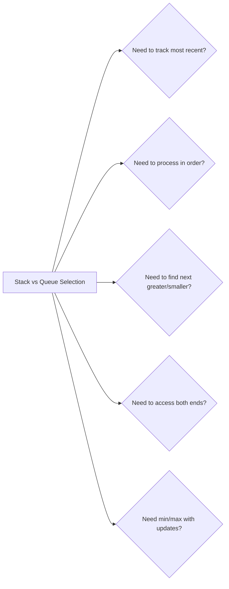

# 05. Stacks & Queues

> LIFO and FIFO data structures for tracking state and processing order

---

## ELI5: Explain Like I'm 5

<div class="learner-section" markdown>

**Your task:** After implementing all patterns, explain them simply.

**Prompts to guide you:**

1. **What are stacks and queues in one sentence?**
    - Your answer: <span class="fill-in">[Fill in after implementation]</span>

2. **What's the key difference between stack and queue?**
    - Your answer: <span class="fill-in">[Fill in after implementation]</span>

3. **Real-world analogy:**
    - Example: "A stack is like a stack of plates - last one on, first one off..."
    - Your analogy for stack: <span class="fill-in">[Fill in]</span>
    - Your analogy for queue: <span class="fill-in">[Fill in]</span>

4. **When does each pattern work?**
    - Your answer: <span class="fill-in">[Fill in after solving problems]</span>

5. **What problems require stacks vs queues?**
    - Your answer: <span class="fill-in">[Fill in after practice]</span>

</div>

---

## Quick Quiz (Do BEFORE implementing)

<div class="learner-section" markdown>

**Your task:** Test your intuition without looking at code. Answer these, then verify after implementation.

### Complexity Predictions

1. **Stack operations (push, pop, peek):**
    - Time complexity: <span class="fill-in">[Your guess: O(?)]</span>
    - Verified after learning: <span class="fill-in">[Actual: O(?)]</span>

2. **Queue operations (enqueue, dequeue):**
    - Time complexity: <span class="fill-in">[Your guess: O(?)]</span>
    - Verified after learning: <span class="fill-in">[Actual: O(?)]</span>

3. **Monotonic stack for next greater element:**
    - Time complexity: <span class="fill-in">[Your guess: O(?) - seems like nested loops?]</span>
    - Verified: <span class="fill-in">[Actual: O(?)]</span>
    - Why not O(n²): <span class="fill-in">[Fill in after learning]</span>

### Scenario Predictions

**Scenario 1:** Check if brackets are balanced: `"([{}])"`

- **Can you use a stack?** <span class="fill-in">[Yes/No - Why?]</span>
- **What do you push?** <span class="fill-in">[Opening brackets? Closing brackets?]</span>
- **When you see `)`**, what do you do? <span class="fill-in">[Push or Pop?]</span>
- **How do you know it's valid?** <span class="fill-in">[Fill in]</span>

**Scenario 2:** Find next greater element in `[2, 1, 2, 4, 3]`

- **Can you use a regular stack?** <span class="fill-in">[Yes/No]</span>
- **What kind of stack?** <span class="fill-in">[Monotonic increasing or decreasing?]</span>
- **What do you store in the stack?** <span class="fill-in">[Values or indices?]</span>
- **When do you pop?** <span class="fill-in">[Fill in your reasoning]</span>

**Scenario 3:** Implement a queue using two stacks

- **Which stack handles enqueue?** <span class="fill-in">[Stack 1 or Stack 2?]</span>
- **Which stack handles dequeue?** <span class="fill-in">[Stack 1 or Stack 2?]</span>
- **When do you transfer elements?** <span class="fill-in">[Fill in]</span>
- **What's the amortized time complexity?** <span class="fill-in">[Your guess]</span>

### Trade-off Quiz

**Question:** When would you use a stack vs a queue?

- Stack (LIFO): <span class="fill-in">[Fill in - what problems need last-in-first-out?]</span>
- Queue (FIFO): <span class="fill-in">[Fill in - what problems need first-in-first-out?]</span>
- Your observation: <span class="fill-in">[Fill in after testing]</span>

**Question:** What's the MAIN requirement for monotonic stack to work?

- [ ] Array must be sorted
- [ ] Array must have unique elements
- [ ] You need to find next greater/smaller element
- [ ] Array must be positive integers

Verify after implementation: <span class="fill-in">[Which one(s)?]</span>


</div>

---

## Before/After: Why This Pattern Matters

**Your task:** Compare naive vs optimized approaches to understand the impact.

### Example 1: Valid Parentheses

**Problem:** Check if brackets are balanced in a string like `"([{}])"`.

#### Approach 1: Brute Force (String Replacement)

```java
// Naive approach - Keep removing pairs until none left
public static boolean isValid_BruteForce(String s) {
    while (s.contains("()") || s.contains("[]") || s.contains("{}")) {
        s = s.replace("()", "");
        s = s.replace("[]", "");
        s = s.replace("{}", "");
    }
    return s.isEmpty();
}
```

**Analysis:**

- Time: O(n²) - Each replacement scans the entire string, potentially n/2 iterations
- Space: O(n) - String replacement creates new strings
- For n = 10,000: Up to ~50,000,000 operations

#### Approach 2: Stack (Optimized)

```java
// Optimized approach - Use stack to track opening brackets
public static boolean isValid_Stack(String s) {
    Stack<Character> stack = new Stack<>();

    for (char c : s.toCharArray()) {
        if (c == '(' || c == '[' || c == '{') {
            stack.push(c);
        } else {
            if (stack.isEmpty()) return false;
            char open = stack.pop();
            if (c == ')' && open != '(') return false;
            if (c == ']' && open != '[') return false;
            if (c == '}' && open != '{') return false;
        }
    }

    return stack.isEmpty();
}
```

**Analysis:**

- Time: O(n) - Single pass through string
- Space: O(n) - Stack for opening brackets
- For n = 10,000: ~10,000 operations

#### Performance Comparison

| String Length | Brute Force (O(n²)) | Stack (O(n)) | Speedup |
|---------------|---------------------|--------------|---------|
| n = 100       | ~5,000 ops          | 100 ops      | 50x     |
| n = 1,000     | ~500,000 ops        | 1,000 ops    | 500x    |
| n = 10,000    | ~50,000,000 ops     | 10,000 ops   | 5,000x  |

**Your calculation:** For n = 5,000, the speedup is approximately _____ times faster.

---

### Example 2: Next Greater Element

**Problem:** For each element, find the next greater element to the right.

#### Approach 1: Brute Force (Nested Loops)

```java
// Naive approach - For each element, scan right to find greater
public static int[] nextGreater_BruteForce(int[] nums) {
    int[] result = new int[nums.length];

    for (int i = 0; i < nums.length; i++) {
        result[i] = -1;  // Default: no greater element
        for (int j = i + 1; j < nums.length; j++) {
            if (nums[j] > nums[i]) {
                result[i] = nums[j];
                break;
            }
        }
    }

    return result;
}
```

**Analysis:**

- Time: O(n²) - For each element, scan remaining elements
- Space: O(n) - Result array only
- For n = 10,000: ~100,000,000 operations

#### Approach 2: Monotonic Stack (Optimized)

```java
// Optimized approach - Use decreasing monotonic stack
public static int[] nextGreater_MonotonicStack(int[] nums) {
    int[] result = new int[nums.length];
    Arrays.fill(result, -1);
    Stack<Integer> stack = new Stack<>();  // Store indices

    for (int i = 0; i < nums.length; i++) {
        // Pop all smaller elements - we found their next greater
        while (!stack.isEmpty() && nums[i] > nums[stack.peek()]) {
            int idx = stack.pop();
            result[idx] = nums[i];
        }
        stack.push(i);
    }

    return result;
}
```

**Analysis:**

- Time: O(n) - Each element pushed and popped at most once
- Space: O(n) - Stack + result array
- For n = 10,000: ~20,000 operations (each element visited twice max)

#### Why Does Monotonic Stack Work?

**Key insight to understand:**

In array `[2, 1, 2, 4, 3]`:

```
i=0, val=2: stack=[0], result=[-1,-1,-1,-1,-1]
i=1, val=1: stack=[0,1], result=[-1,-1,-1,-1,-1]  (1 < 2, just push)
i=2, val=2: Pop index 1 (nums[1]=1 < 2), result[1]=2
            Pop index 0 (nums[0]=2 == 2, no), push 2
            stack=[0,2], result=[-1,2,-1,-1,-1]
i=3, val=4: Pop index 2 (nums[2]=2 < 4), result[2]=4
            Pop index 0 (nums[0]=2 < 4), result[0]=4
            stack=[3], result=[4,2,4,-1,-1]
i=4, val=3: stack=[3,4], result=[4,2,4,-1,-1]  (3 < 4, just push)
```

**Why can we skip comparisons?**

- Stack maintains decreasing order from bottom to top
- When we find a larger element, we immediately know it's the "next greater" for all smaller elements in stack
- Each element is pushed once and popped once = O(n) total

**After implementing, explain in your own words:**

<div class="learner-section" markdown>

- Why does monotonic decreasing order help? <span class="fill-in">[Your answer]</span>
- What work are we avoiding compared to brute force? <span class="fill-in">[Your answer]</span>

</div>

---

### Example 3: Sliding Window Maximum

**Problem:** Find maximum in each window of size k.

#### Approach 1: Brute Force (Scan Each Window)

```java
// Naive approach - Find max in each window independently
public static int[] maxSlidingWindow_BruteForce(int[] nums, int k) {
    int[] result = new int[nums.length - k + 1];

    for (int i = 0; i <= nums.length - k; i++) {
        int max = nums[i];
        for (int j = i; j < i + k; j++) {
            max = Math.max(max, nums[j]);
        }
        result[i] = max;
    }

    return result;
}
```

**Analysis:**

- Time: O(n * k) - For each window, scan k elements
- Space: O(1) - Excluding result array
- For n = 10,000, k = 100: ~1,000,000 operations

#### Approach 2: Monotonic Deque (Optimized)

```java
// Optimized approach - Use decreasing monotonic deque
public static int[] maxSlidingWindow_Deque(int[] nums, int k) {
    int[] result = new int[nums.length - k + 1];
    Deque<Integer> deque = new ArrayDeque<>();  // Store indices

    for (int i = 0; i < nums.length; i++) {
        // Remove indices outside window
        while (!deque.isEmpty() && deque.peekFirst() < i - k + 1) {
            deque.pollFirst();
        }

        // Remove smaller elements (they'll never be max)
        while (!deque.isEmpty() && nums[i] > nums[deque.peekLast()]) {
            deque.pollLast();
        }

        deque.offerLast(i);

        // Record maximum (front of deque)
        if (i >= k - 1) {
            result[i - k + 1] = nums[deque.peekFirst()];
        }
    }

    return result;
}
```

**Analysis:**

- Time: O(n) - Each element added and removed at most once
- Space: O(k) - Deque stores at most k indices
- For n = 10,000, k = 100: ~20,000 operations

#### Performance Comparison

| Array Size  | Window k | Brute Force (O(n*k)) | Deque (O(n)) | Speedup |
|-------------|----------|----------------------|--------------|---------|
| n = 1,000   | k = 10   | 10,000 ops           | 2,000 ops    | 5x      |
| n = 10,000  | k = 100  | 1,000,000 ops        | 20,000 ops   | 50x     |
| n = 100,000 | k = 1000 | 100,000,000 ops      | 200,000 ops  | 500x    |

**After implementing, explain:**

<div class="learner-section" markdown>

- Why does deque work better than rescanning? <span class="fill-in">[Your answer]</span>
- What invariant does the deque maintain? <span class="fill-in">[Your answer]</span>

</div>

---

## Core Implementation

### Pattern 1: Basic Stack Operations

**Concept:** Last In, First Out (LIFO) - like a stack of plates.

**Use case:** Undo operations, expression evaluation, backtracking.

```java
import java.util.*;

public class BasicStack {

    /**
     * Problem: Valid parentheses - check if brackets are balanced
     * Time: O(n), Space: O(n)
     *
     * TODO: Implement using Stack
     */
    public static boolean isValid(String s) {
        // TODO: Create Stack<Character>

        // TODO: For each char in s:
        //   If opening bracket: push to stack
        //   If closing bracket:
        //     Check if stack empty (return false)
        //     Pop and verify it matches

        // TODO: Return stack.isEmpty()

        return false; // Replace with implementation
    }

    /**
     * Problem: Evaluate Reverse Polish Notation
     * Time: O(n), Space: O(n)
     *
     * TODO: Implement RPN calculator
     */
    public static int evalRPN(String[] tokens) {
        // TODO: Create Stack<Integer>

        // TODO: For each token:
        //   If number: push to stack
        //   If operator:
        //     Pop two operands
        //     Apply operation
        //     Push result

        // TODO: Return stack.peek()

        return 0; // Replace with implementation
    }

    /**
     * Problem: Min Stack - stack with O(1) getMin()
     * Time: O(1) for all operations, Space: O(n)
     *
     * TODO: Implement MinStack class
     */
    static class MinStack {
        // TODO: Use two stacks: one for values, one for minimums

        public void push(int val) {
            // TODO: Push to main stack
            // TODO: Update min stack
        }

        public void pop() {
            // TODO: Pop from both stacks
        }

        public int top() {
            // TODO: Return top of main stack
            return 0;
        }

        public int getMin() {
            // TODO: Return top of min stack
            return 0;
        }
    }
}
```

**Runnable Client Code:**

```java
import java.util.*;

public class BasicStackClient {

    public static void main(String[] args) {
        System.out.println("=== Basic Stack Operations ===\n");

        // Test 1: Valid parentheses
        System.out.println("--- Test 1: Valid Parentheses ---");
        String[] testStrings = {
            "()",
            "()[]{}",
            "(]",
            "([)]",
            "{[]}"
        };

        for (String s : testStrings) {
            boolean valid = BasicStack.isValid(s);
            System.out.printf("\"%s\" -> %s%n", s, valid ? "VALID" : "INVALID");
        }

        // Test 2: Evaluate RPN
        System.out.println("\n--- Test 2: Evaluate RPN ---");
        String[][] rpnTests = {
            {"2", "1", "+", "3", "*"},  // ((2 + 1) * 3) = 9
            {"4", "13", "5", "/", "+"}  // (4 + (13 / 5)) = 6
        };

        for (String[] tokens : rpnTests) {
            int result = BasicStack.evalRPN(tokens);
            System.out.printf("%s = %d%n", Arrays.toString(tokens), result);
        }

        // Test 3: Min Stack
        System.out.println("\n--- Test 3: Min Stack ---");
        BasicStack.MinStack minStack = new BasicStack.MinStack();

        System.out.println("Operations:");
        System.out.println("push(-2)");
        minStack.push(-2);
        System.out.println("push(0)");
        minStack.push(0);
        System.out.println("push(-3)");
        minStack.push(-3);
        System.out.println("getMin() -> " + minStack.getMin());
        System.out.println("pop()");
        minStack.pop();
        System.out.println("top() -> " + minStack.top());
        System.out.println("getMin() -> " + minStack.getMin());
    }
}
```

---

### Pattern 2: Monotonic Stack

**Concept:** Stack that maintains elements in monotonic order.

**Use case:** Next greater element, largest rectangle, temperature problems.

```java
import java.util.*;

public class MonotonicStack {

    /**
     * Problem: Next greater element to the right
     * Time: O(n), Space: O(n)
     *
     * TODO: Implement using monotonic decreasing stack
     */
    public static int[] nextGreaterElement(int[] nums) {
        // TODO: Create result array initialized to -1
        // TODO: Create Stack<Integer> to store indices

        // TODO: For i from 0 to nums.length-1:
        //   While stack not empty AND nums[i] > nums[stack.peek()]:
        //     Pop index and set result[index] = nums[i]
        //   Push i to stack

        return new int[0]; // Replace with implementation
    }

    /**
     * Problem: Daily temperatures - days until warmer temperature
     * Time: O(n), Space: O(n)
     *
     * TODO: Implement using monotonic stack
     */
    public static int[] dailyTemperatures(int[] temperatures) {
        // TODO: Similar to nextGreaterElement
        // TODO: Store days difference instead of values

        return new int[0]; // Replace with implementation
    }

    /**
     * Problem: Largest rectangle in histogram
     * Time: O(n), Space: O(n)
     *
     * TODO: Implement using monotonic increasing stack
     */
    public static int largestRectangleArea(int[] heights) {
        // TODO: Use stack to track indices of bars
        // TODO: When we find smaller bar, calculate area
        // TODO: Track maximum area

        return 0; // Replace with implementation
    }
}
```

**Runnable Client Code:**

```java
import java.util.*;

public class MonotonicStackClient {

    public static void main(String[] args) {
        System.out.println("=== Monotonic Stack ===\n");

        // Test 1: Next greater element
        System.out.println("--- Test 1: Next Greater Element ---");
        int[] nums1 = {2, 1, 2, 4, 3};

        System.out.println("Array: " + Arrays.toString(nums1));
        int[] result1 = MonotonicStack.nextGreaterElement(nums1);
        System.out.println("Next greater: " + Arrays.toString(result1));

        // Test 2: Daily temperatures
        System.out.println("\n--- Test 2: Daily Temperatures ---");
        int[] temps = {73, 74, 75, 71, 69, 72, 76, 73};

        System.out.println("Temperatures: " + Arrays.toString(temps));
        int[] result2 = MonotonicStack.dailyTemperatures(temps);
        System.out.println("Days to wait: " + Arrays.toString(result2));

        // Test 3: Largest rectangle
        System.out.println("\n--- Test 3: Largest Rectangle ---");
        int[] heights = {2, 1, 5, 6, 2, 3};

        System.out.println("Heights: " + Arrays.toString(heights));
        int maxArea = MonotonicStack.largestRectangleArea(heights);
        System.out.println("Largest rectangle area: " + maxArea);
    }
}
```

---

### Pattern 3: Basic Queue Operations

**Concept:** First In, First Out (FIFO) - like a line of people.

**Use case:** BFS, task scheduling, buffer management.

```java
import java.util.*;

public class BasicQueue {

    /**
     * Problem: Implement queue using two stacks
     * Time: O(1) amortized, Space: O(n)
     *
     * TODO: Implement QueueWithStacks class
     */
    static class QueueWithStacks {
        // TODO: Use two stacks: inbox and outbox

        public void enqueue(int x) {
            // TODO: Push to inbox
        }

        public int dequeue() {
            // TODO: If outbox empty, transfer from inbox
            // TODO: Pop from outbox
            return 0;
        }

        public int peek() {
            // TODO: If outbox empty, transfer from inbox
            // TODO: Peek outbox
            return 0;
        }

        public boolean empty() {
            // TODO: Check if both stacks empty
            return true;
        }
    }

    /**
     * Problem: Implement circular queue
     * Time: O(1), Space: O(k)
     *
     * TODO: Implement CircularQueue class
     */
    static class CircularQueue {
        private int[] data;
        private int front, rear, size, capacity;

        public CircularQueue(int k) {
            // TODO: Initialize array and pointers
        }

        public boolean enQueue(int value) {
            // TODO: Check if full
            // TODO: Add element at rear
            // TODO: Update rear pointer (circular)
            return false;
        }

        public boolean deQueue() {
            // TODO: Check if empty
            // TODO: Update front pointer (circular)
            return false;
        }

        public int front() {
            // TODO: Return element at front
            return -1;
        }

        public boolean isEmpty() {
            return size == 0;
        }

        public boolean isFull() {
            return size == capacity;
        }
    }
}
```

**Runnable Client Code:**

```java
public class BasicQueueClient {

    public static void main(String[] args) {
        System.out.println("=== Basic Queue Operations ===\n");

        // Test 1: Queue with stacks
        System.out.println("--- Test 1: Queue Using Stacks ---");
        BasicQueue.QueueWithStacks queue = new BasicQueue.QueueWithStacks();

        System.out.println("Operations:");
        System.out.println("enqueue(1)");
        queue.enqueue(1);
        System.out.println("enqueue(2)");
        queue.enqueue(2);
        System.out.println("peek() -> " + queue.peek());
        System.out.println("dequeue() -> " + queue.dequeue());
        System.out.println("empty() -> " + queue.empty());

        // Test 2: Circular queue
        System.out.println("\n--- Test 2: Circular Queue ---");
        BasicQueue.CircularQueue circularQueue = new BasicQueue.CircularQueue(3);

        System.out.println("Operations on queue of size 3:");
        System.out.println("enQueue(1) -> " + circularQueue.enQueue(1));
        System.out.println("enQueue(2) -> " + circularQueue.enQueue(2));
        System.out.println("enQueue(3) -> " + circularQueue.enQueue(3));
        System.out.println("enQueue(4) -> " + circularQueue.enQueue(4)); // false, full
        System.out.println("front() -> " + circularQueue.front());
        System.out.println("isFull() -> " + circularQueue.isFull());
        System.out.println("deQueue() -> " + circularQueue.deQueue());
        System.out.println("enQueue(4) -> " + circularQueue.enQueue(4)); // now succeeds
        System.out.println("front() -> " + circularQueue.front());
    }
}
```

---

### Pattern 4: Deque (Double-Ended Queue)

**Concept:** Add/remove from both ends.

**Use case:** Sliding window maximum, palindrome check.

```java
import java.util.*;

public class DequeOperations {

    /**
     * Problem: Sliding window maximum
     * Time: O(n), Space: O(k)
     *
     * TODO: Implement using monotonic deque
     */
    public static int[] maxSlidingWindow(int[] nums, int k) {
        // TODO: Use Deque<Integer> to store indices
        // TODO: Maintain decreasing order in deque

        // TODO: For each window:
        //   Remove indices outside window
        //   Remove smaller elements from back
        //   Add current index
        //   Record front element as max

        return new int[0]; // Replace with implementation
    }

    /**
     * Problem: Check if string can be rearranged into palindrome
     * Time: O(n), Space: O(n)
     *
     * TODO: Use deque for efficient insertion at both ends
     */
    public static boolean canFormPalindrome(String s) {
        // TODO: Use frequency map to check odd counts
        // TODO: At most one character can have odd count

        return false; // Replace with implementation
    }
}
```

**Runnable Client Code:**

```java
import java.util.*;

public class DequeOperationsClient {

    public static void main(String[] args) {
        System.out.println("=== Deque Operations ===\n");

        // Test 1: Sliding window maximum
        System.out.println("--- Test 1: Sliding Window Maximum ---");
        int[] nums = {1, 3, -1, -3, 5, 3, 6, 7};
        int k = 3;

        System.out.println("Array: " + Arrays.toString(nums));
        System.out.println("Window size: " + k);

        int[] result = DequeOperations.maxSlidingWindow(nums, k);
        System.out.println("Maximums: " + Arrays.toString(result));

        // Test 2: Can form palindrome
        System.out.println("\n--- Test 2: Can Form Palindrome ---");
        String[] testStrings = {"aab", "abc", "racecar", "hello"};

        for (String s : testStrings) {
            boolean canForm = DequeOperations.canFormPalindrome(s);
            System.out.printf("\"%s\" -> %s%n", s, canForm ? "YES" : "NO");
        }
    }
}
```

---

## Debugging Challenges

**Your task:** Find and fix bugs in broken implementations. This tests your understanding.

### Challenge 1: Broken Valid Parentheses

```java
/**
 * This code is supposed to check if brackets are balanced.
 * It has 2 BUGS. Find them!
 */
public static boolean isValid_Buggy(String s) {
    Stack<Character> stack = new Stack<>();

    for (char c : s.toCharArray()) {
        if (c == '(' || c == '[' || c == '{') {
            stack.push(c);
        } else {
            char open = stack.pop();            if (c == ')' && open != '(') return false;
            if (c == ']' && open != '[') return false;
            if (c == '}' && open != '{') return false;
        }
    }

    return true;}
```

**Your debugging:**

- Bug 1: <span class="fill-in">[What\'s the bug?]</span>

- Bug 2: <span class="fill-in">[What\'s the bug?]</span>

<details markdown>
<summary>Click to verify your answers</summary>

**Bug 1 (Line 9):** Should check `if (stack.isEmpty()) return false;` BEFORE popping. Otherwise, popping from empty
stack throws `EmptyStackException`.

**Bug 2 (Line 15):** Should return `stack.isEmpty()`, not `true`. String like "(((" would leave elements in stack, so
it's invalid.

**Correct code:**

```java
} else {
    if (stack.isEmpty()) return false;  // Check first!
    char open = stack.pop();
    // ... matching logic ...
}
return stack.isEmpty();  // All brackets must be matched
```

</details>

---

### Challenge 2: Broken Monotonic Stack

```java
/**
 * Find next greater element to the right.
 * This has 1 CRITICAL BUG and 1 LOGIC ERROR.
 */
public static int[] nextGreaterElement_Buggy(int[] nums) {
    int[] result = new int[nums.length];
    Stack<Integer> stack = new Stack<>();

    for (int i = 0; i < nums.length; i++) {
        while (!stack.isEmpty() && nums[i] > nums[stack.peek()]) {
            int idx = stack.pop();
            result[i] = nums[i];        }
        stack.push(nums[i]);    }

    return result;
}
```

**Your debugging:**

- **Bug 1:** _[What's wrong with result[i] = nums[i]?]_
- **Bug 1 fix:** <span class="fill-in">[What should it be?]</span>

- **Bug 2:** _[Should we push nums[i] or i?]_
- **Bug 2 fix:** <span class="fill-in">[Why does it matter?]</span>

**Test case to expose the bugs:**

- Input: `[2, 1, 2, 4, 3]`
- Expected output: `[4, 2, 4, -1, -1]`
- Actual output with buggy code: <span class="fill-in">[Trace through manually]</span>

<details markdown>
<summary>Click to verify your answers</summary>

**Bug 1:** Should be `result[idx] = nums[i]`, not `result[i] = nums[i]`. We're setting the result for the INDEX we
popped, not the current index.

**Bug 2:** Should push `i` (the index), not `nums[i]` (the value). We need indices to set the result array correctly.

**Correct code:**

```java
while (!stack.isEmpty() && nums[i] > nums[stack.peek()]) {
    int idx = stack.pop();
    result[idx] = nums[i];  // Set result for POPPED index
}
stack.push(i);  // Push INDEX, not value
```

</details>

---

### Challenge 3: Broken Min Stack

```java
/**
 * Implement stack with O(1) getMin().
 * This has 1 SUBTLE BUG in the pop operation.
 */
static class MinStack_Buggy {
    Stack<Integer> stack = new Stack<>();
    Stack<Integer> minStack = new Stack<>();

    public void push(int val) {
        stack.push(val);
        if (minStack.isEmpty() || val < minStack.peek()) {
            minStack.push(val);
        }
    }

    public void pop() {
        stack.pop();
        minStack.pop();    }

    public int getMin() {
        return minStack.peek();
    }
}
```

**Your debugging:**

- Bug: <span class="fill-in">[What\'s the bug?]</span>

**Trace through example:**

- Operations: `push(-2), push(0), push(-3), getMin(), pop(), getMin()`
- Expected final min: `-2`
- Actual: <span class="fill-in">[What happens with buggy code?]</span>

<details markdown>
<summary>Click to verify your answer</summary>

**Bug:** Should only pop from minStack if the value being removed equals the current minimum.

**Correct code:**

```java
public void pop() {
    int val = stack.pop();
    if (val == minStack.peek()) {  // Only pop if it's the min
        minStack.pop();
    }
}
```

**Alternative (simpler):** Always push to minStack:

```java
public void push(int val) {
    stack.push(val);
    int min = minStack.isEmpty() ? val : Math.min(val, minStack.peek());
    minStack.push(min);  // Always push current min
}

public void pop() {
    stack.pop();
    minStack.pop();  // Now both always in sync
}
```

</details>

---

### Challenge 4: Broken Queue with Stacks

```java
/**
 * Implement queue using two stacks.
 * This compiles but has WRONG time complexity.
 */
static class QueueWithStacks_Buggy {
    Stack<Integer> inbox = new Stack<>();
    Stack<Integer> outbox = new Stack<>();

    public void enqueue(int x) {
        inbox.push(x);
    }

    public int dequeue() {
        while (!inbox.isEmpty()) {
            outbox.push(inbox.pop());
        }
        return outbox.pop();
    }
}
```

**Your debugging:**

- **Bug:** <span class="fill-in">[What's the performance issue?]</span>
- **Time complexity:** <span class="fill-in">[What is it now? What should it be?]</span>
- **Fix:** <span class="fill-in">[How to make it amortized O(1)?]</span>

**Example that shows the problem:**

- Operations: `enqueue(1), enqueue(2), dequeue(), dequeue()`
- How many transfers happen? <span class="fill-in">[Count them]</span>
- Expected transfers: <span class="fill-in">[Fill in]</span>
- Actual with buggy code: <span class="fill-in">[Fill in]</span>

<details markdown>
<summary>Click to verify your answer</summary>

**Bug:** Should only transfer when outbox is EMPTY, not on every dequeue.

**Correct code:**

```java
public int dequeue() {
    if (outbox.isEmpty()) {  // Only transfer when needed
        while (!inbox.isEmpty()) {
            outbox.push(inbox.pop());
        }
    }
    return outbox.pop();
}
```

**Why it matters:**

- Buggy version: O(n) per dequeue
- Correct version: O(1) amortized (each element transferred at most once)

</details>

---

### Challenge 5: Broken Monotonic Deque (Sliding Window Max)

```java
/**
 * Find maximum in each sliding window.
 * This has 1 OFF-BY-ONE BUG and 1 LOGIC ERROR.
 */
public static int[] maxSlidingWindow_Buggy(int[] nums, int k) {
    int[] result = new int[nums.length - k + 1];
    Deque<Integer> deque = new ArrayDeque<>();

    for (int i = 0; i < nums.length; i++) {
        // Remove indices outside window
        while (!deque.isEmpty() && deque.peekFirst() <= i - k) {            deque.pollFirst();
        }

        // Remove smaller elements
        while (!deque.isEmpty() && nums[i] > nums[deque.peekLast()]) {
            deque.pollLast();
        }

        deque.offerLast(i);

        // Record maximum
        if (i > k - 1) {            result[i - k + 1] = nums[deque.peekFirst()];
        }
    }

    return result;
}
```

**Your debugging:**

- **Bug 1:** <span class="fill-in">[Should it be <= or <? Why?]</span>
- **Bug 1 fix:** <span class="fill-in">[Correct comparison]</span>

- **Bug 2:** <span class="fill-in">[Should it be > or >=? When should we start recording?]</span>
- **Bug 2 fix:** <span class="fill-in">[Correct comparison]</span>

**Test case:**

- Input: `nums = [1,3,-1,-3,5,3,6,7]`, `k = 3`
- Expected: `[3,3,5,5,6,7]`
- Actual with buggy code: <span class="fill-in">[Trace first few windows]</span>

<details markdown>
<summary>Click to verify your answers</summary>

**Bug 1:** Should be `<`, not `<=`. When `deque.peekFirst() == i - k`, it's still in the window.

- Window at i=3, k=3: includes indices [1,2,3]
- Remove when index < 1 (i.e., index 0)

**Bug 2:** Should be `>=`, not `>`. We want to start recording when i = k-1 (first complete window).

- First window completes at i=2 (indices 0,1,2 for k=3)

**Correct code:**

```java
while (!deque.isEmpty() && deque.peekFirst() < i - k + 1) {
    deque.pollFirst();
}
// ...
if (i >= k - 1) {
    result[i - k + 1] = nums[deque.peekFirst()];
}
```

</details>

---

### Your Debugging Scorecard

After finding and fixing all bugs:

- [ ] Found all 8+ bugs across 5 challenges
- [ ] Understood WHY each bug causes incorrect behavior
- [ ] Could explain the fix to someone else
- [ ] Learned common stack/queue mistakes to avoid

**Common mistakes you discovered:**

1. <span class="fill-in">[List the patterns you noticed]</span>
2. <span class="fill-in">[Fill in]</span>
3. <span class="fill-in">[Fill in]</span>

**Stack-specific gotchas:**

- What are the common stack underflow issues? <span class="fill-in">[Your answer]</span>
- When do you check isEmpty()? <span class="fill-in">[Your answer]</span>
- Index vs value in monotonic stack? <span class="fill-in">[Your answer]</span>

**Queue-specific gotchas:**

- When to transfer between stacks? <span class="fill-in">[Your answer]</span>
- Off-by-one errors in deque? <span class="fill-in">[Your answer]</span>
- How to maintain invariants? <span class="fill-in">[Your answer]</span>

---

## Decision Framework

**Your task:** Build decision trees for stack/queue selection.

### Question 1: LIFO vs FIFO?

Answer after solving problems:

- **Need last item first?** <span class="fill-in">[Use stack]</span>
- **Need first item first?** <span class="fill-in">[Use queue]</span>
- **Need both ends?** <span class="fill-in">[Use deque]</span>
- **Your observation:** <span class="fill-in">[Fill in based on testing]</span>

### Question 2: When to use each pattern?

**Stack patterns:**

- Valid parentheses: <span class="fill-in">[Why stack?]</span>
- Expression evaluation: <span class="fill-in">[Why stack?]</span>
- Monotonic stack: <span class="fill-in">[What problems?]</span>

**Queue patterns:**

- BFS: <span class="fill-in">[Why queue?]</span>
- Level order traversal: <span class="fill-in">[Why queue?]</span>
- Task scheduling: <span class="fill-in">[Why queue?]</span>

### Your Decision Tree



---

## Practice

### LeetCode Problems

**Easy (Complete all 4):**

- [ ] [20. Valid Parentheses](https://leetcode.com/problems/valid-parentheses/)
    - Pattern: <span class="fill-in">[Basic stack]</span>
    - Your solution time: <span class="fill-in">___</span>
    - Key insight: <span class="fill-in">[Fill in after solving]</span>

- [ ] [232. Implement Queue using Stacks](https://leetcode.com/problems/implement-queue-using-stacks/)
    - Pattern: <span class="fill-in">[Queue with stacks]</span>
    - Your solution time: <span class="fill-in">___</span>
    - Key insight: <span class="fill-in">[Fill in]</span>

- [ ] [225. Implement Stack using Queues](https://leetcode.com/problems/implement-stack-using-queues/)
    - Pattern: <span class="fill-in">[Stack with queues]</span>
    - Your solution time: <span class="fill-in">___</span>
    - Key insight: <span class="fill-in">[Fill in]</span>

- [ ] [155. Min Stack](https://leetcode.com/problems/min-stack/)
    - Pattern: <span class="fill-in">[Stack with tracking]</span>
    - Your solution time: <span class="fill-in">___</span>
    - Key insight: <span class="fill-in">[Fill in]</span>

**Medium (Complete 3-4):**

- [ ] [739. Daily Temperatures](https://leetcode.com/problems/daily-temperatures/)
    - Pattern: <span class="fill-in">[Monotonic stack]</span>
    - Difficulty: <span class="fill-in">[Rate 1-10]</span>
    - Key insight: <span class="fill-in">[Fill in]</span>

- [ ] [150. Evaluate Reverse Polish Notation](https://leetcode.com/problems/evaluate-reverse-polish-notation/)
    - Pattern: <span class="fill-in">[Basic stack]</span>
    - Difficulty: <span class="fill-in">[Rate 1-10]</span>
    - Key insight: <span class="fill-in">[Fill in]</span>

- [ ] [394. Decode String](https://leetcode.com/problems/decode-string/)
    - Pattern: <span class="fill-in">[Stack]</span>
    - Difficulty: <span class="fill-in">[Rate 1-10]</span>
    - Key insight: <span class="fill-in">[Fill in]</span>

- [ ] [622. Design Circular Queue](https://leetcode.com/problems/design-circular-queue/)
    - Pattern: <span class="fill-in">[Circular queue]</span>
    - Difficulty: <span class="fill-in">[Rate 1-10]</span>
    - Key insight: <span class="fill-in">[Fill in]</span>

**Hard (Optional):**

- [ ] [84. Largest Rectangle in Histogram](https://leetcode.com/problems/largest-rectangle-in-histogram/)
    - Pattern: <span class="fill-in">[Monotonic stack]</span>
    - Key insight: <span class="fill-in">[Fill in after solving]</span>

- [ ] [239. Sliding Window Maximum](https://leetcode.com/problems/sliding-window-maximum/)
    - Pattern: <span class="fill-in">[Monotonic deque]</span>
    - Key insight: <span class="fill-in">[Fill in after solving]</span>

---

## Review Checklist

Before moving to the next topic:

- [ ] **Implementation**
    - [ ] Basic stack: valid parentheses, RPN, min stack all work
    - [ ] Monotonic stack: next greater, daily temps all work
    - [ ] Queue: queue with stacks, circular queue both work
    - [ ] Deque: sliding window maximum works
    - [ ] All client code runs successfully

- [ ] **Pattern Recognition**
    - [ ] Can identify when to use stack vs queue
    - [ ] Understand monotonic stack pattern
    - [ ] Know when to use deque
    - [ ] Recognize valid parentheses variants

- [ ] **Problem Solving**
    - [ ] Solved 4 easy problems
    - [ ] Solved 3-4 medium problems
    - [ ] Analyzed time/space complexity
    - [ ] Handled edge cases (empty, single element)

- [ ] **Understanding**
    - [ ] Filled in all ELI5 explanations
    - [ ] Built decision tree
    - [ ] Identified when NOT to use stacks/queues
    - [ ] Can explain LIFO vs FIFO clearly

- [ ] **Mastery Check**
    - [ ] Could implement all patterns from memory
    - [ ] Could recognize pattern in new problem
    - [ ] Could explain to someone else
    - [ ] Understand amortized analysis for queue with stacks

---

### Mastery Certification

**I certify that I can:**

- [ ] Implement all stack patterns from memory
- [ ] Implement all queue patterns from memory
- [ ] Explain LIFO vs FIFO clearly
- [ ] Recognize when to use monotonic stack
- [ ] Understand amortized time complexity
- [ ] Debug common stack/queue mistakes
- [ ] Compare trade-offs with alternative approaches
- [ ] Teach these concepts to someone else

**Self-assessment score:** ___/10

**Specific competencies:**

- Stack operations (push/pop/peek): <span class="fill-in">___</span>/10
- Queue operations (enqueue/dequeue): <span class="fill-in">___</span>/10
- Monotonic stack pattern: <span class="fill-in">___</span>/10
- Deque for sliding window: <span class="fill-in">___</span>/10
- Queue with stacks: <span class="fill-in">___</span>/10

**If any score < 7:** Review that specific pattern, then retry this gate.

**If average score ≥ 8:** Congratulations! You've mastered stacks and queues. Proceed to the next topic.

**What was your biggest challenge?**

- <span class="fill-in">[Reflect on what was hardest to understand]</span>

**What clicked for you?**

- What insight made it all come together? <span class="fill-in">[Your answer]</span>

**What would you explain differently to your past self?**

- How would you teach this more effectively? <span class="fill-in">[Your answer]</span>
