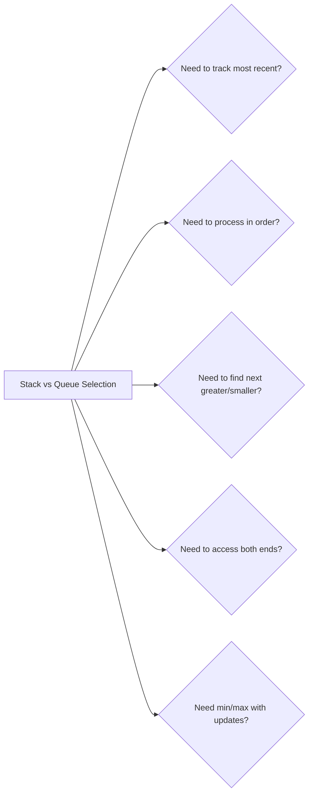

# Stacks & Queues

> LIFO and FIFO data structures for tracking state and processing order

---

## Learning Objectives

By the end of this section you should be able to:

- Distinguish LIFO (stack) from FIFO (queue) and select the right one given a problem description
- Implement the four core patterns: basic stack, monotonic stack, basic queue, and deque
- Explain why the monotonic stack processes each element at most twice, giving O(n) despite an apparent inner loop
- Identify the deque invariant (monotonically decreasing indices) and explain why it guarantees O(n) sliding-window maximum
- Diagnose common bugs: popping from an empty stack, pushing values instead of indices in a monotonic stack, and transferring on every dequeue instead of only when the outbox is empty
- Choose between stack, queue, and deque given the access pattern a problem requires

---

!!! note "Operational reality"
    A stack overflow error is a literal stack overflow — the call stack is a stack data structure with a fixed memory ceiling, and deep recursion exhausts it. Monotonic stack logic appears in columnar storage engines when computing run-length encoding boundaries and in compilers during expression parsing (the shunting-yard algorithm is a monotonic stack). Kafka and RabbitMQ are bounded queues with backpressure: when the queue is full, producers block or drop — the same bounded semantics from these exercises. Browser history (back/forward) is a pair of stacks; undo/redo in every text editor is the same pattern.

## ELI5: Explain Like I'm 5

<div class="learner-section" markdown>

**Your task:** After implementing all patterns, explain them simply.

**Prompts to guide you:**

1. **What are stacks and queues in one sentence?**
    - Your answer: <span class="fill-in">[A stack is a collection where the last element added is the first one removed, while a queue is a collection where the first element added is ___, making them useful for ___ respectively]</span>

2. **What's the key difference between stack and queue?**
    - Your answer: <span class="fill-in">[A stack uses LIFO so that the most-recently-pushed item is retrieved first, whereas a queue uses FIFO so that items are retrieved in ___ order, which is why stacks are used for ___ and queues for ___]</span>

3. **Real-world analogy:**
    - Example: "A stack is like a stack of plates - last one on, first one off..."
    - Your analogy for stack: <span class="fill-in">[Fill in]</span>
    - Your analogy for queue: <span class="fill-in">[Fill in]</span>

4. **When does each pattern work?**
    - Your answer: <span class="fill-in">[Use a stack when you need to remember state to undo or match later; use a queue when you need to process items in ___ order; use a monotonic stack when you need the ___ greater/smaller element to the right of each position]</span>

5. **What problems require stacks vs queues?**
    - Your answer: <span class="fill-in">[Fill in after practice]</span>

6. **What is a monotonic stack in one sentence?**
    - Your answer: <span class="fill-in">[A monotonic stack is a stack that maintains its elements in sorted order by popping all elements that violate the ordering property before each push, so that ___ and each element is pushed and popped at most ___ time]</span>

7. **Why is it useful for finding the "next greater element"?**
    - Your answer: <span class="fill-in">[When we encounter a value larger than the stack top, that larger value is the "next greater" for the popped element, so we can record the answer immediately without ___ as in brute force]</span>

8. **Real-world analogy for monotonic stack:**
    - Example: "A (decreasing) monotonic stack is like people of different heights standing in a line; when someone taller comes, they block the view of everyone shorter than them."
    - Your analogy: <span class="fill-in">[Fill in]</span>

</div>

---

## Core Implementation

### Pattern 1: Basic Stack Operations

**Concept:** Last In, First Out (LIFO) - like a stack of plates.

**Use case:** Undo operations, expression evaluation, backtracking.

```java
--8<-- "com/study/dsa/stacksqueues/BasicStack.java"
```

!!! warning "Debugging Challenge — Empty Stack Before Pop"
    ```java
    /**
     * This code is supposed to check if brackets are balanced.
     * It has 2 BUGS. Find them!
     */
    public static boolean isValid_Buggy(String s) {
        Stack<Character> stack = new Stack<>();

        for (char c : s.toCharArray()) {
            if (c == '(' || c == '[' || c == '{') {
                stack.push(c);
            } else {
                char open = stack.pop();            if (c == ')' && open != '(') return false;
                if (c == ']' && open != '[') return false;
                if (c == '}' && open != '{') return false;
            }
        }

        return true;}
    ```

    - Bug 1: <span class="fill-in">[What's the bug?]</span>
    - Bug 2: <span class="fill-in">[What's the bug?]</span>

??? success "Answer"
    **Bug 1:** Must check `if (stack.isEmpty()) return false;` **before** calling `stack.pop()`. Popping an empty stack
    throws `EmptyStackException`. Any input starting with a closing bracket (e.g., `"]"`) exposes this.

    **Bug 2:** The function returns `true` unconditionally. It should return `stack.isEmpty()`. A string like `"((("` pushes
    three items onto the stack and never pops them, but the buggy code returns `true` anyway.

    **Fixed code:**
    ```java
    } else {
        if (stack.isEmpty()) return false;  // Check before pop
        char open = stack.pop();
        if (c == ')' && open != '(') return false;
        if (c == ']' && open != '[') return false;
        if (c == '}' && open != '{') return false;
    }
    return stack.isEmpty();  // All openers must be matched
    ```


---

### Pattern 2: Monotonic Stack

**Concept:** Stack that maintains elements in monotonic order.

**Use case:** Next greater element, largest rectangle, temperature problems.

```java
--8<-- "com/study/dsa/stacksqueues/MonotonicStack.java"
```

!!! warning "Debugging Challenge — Index vs Value in Monotonic Stack"
    ```java
    /**
     * Find next greater element to the right.
     * This has 1 CRITICAL BUG and 1 LOGIC ERROR.
     */
    public static int[] nextGreaterElement_Buggy(int[] nums) {
        int[] result = new int[nums.length];
        Stack<Integer> stack = new Stack<>();

        for (int i = 0; i < nums.length; i++) {
            while (!stack.isEmpty() && nums[i] > nums[stack.peek()]) {
                int idx = stack.pop();
                result[i] = nums[i];        }
            stack.push(nums[i]);    }

        return result;
    }
    ```

    - **Bug 1:** _[What's wrong with `result[i] = nums[i]`?]_
    - **Bug 1 fix:** <span class="fill-in">[What should it be?]</span>
    - **Bug 2:** _[Should we push `nums[i]` or `i`?]_
    - **Bug 2 fix:** <span class="fill-in">[Why does it matter?]</span>

??? success "Answer"
    **Bug 1:** Should be `result[idx] = nums[i]`, not `result[i] = nums[i]`. We are answering the question for the element
    we just **popped** (`idx`), not for the current element `i`.

    **Bug 2:** Should push `i` (the index), not `nums[i]` (the value). We need the index so we can write into `result[idx]`
    and also so we can compare `nums[i] > nums[stack.peek()]` correctly. Pushing the value makes `nums[stack.peek()]`
    double-dereference (treating a value as an index), which gives wrong results.

    **Fixed code:**
    ```java
    while (!stack.isEmpty() && nums[i] > nums[stack.peek()]) {
        int idx = stack.pop();
        result[idx] = nums[i];  // Answer for the POPPED index
    }
    stack.push(i);  // Push INDEX, not value
    ```


---

### Pattern 3: Basic Queue Operations

**Concept:** First In, First Out (FIFO) - like a line of people.

**Use case:** BFS, task scheduling, buffer management.

```java
--8<-- "com/study/dsa/stacksqueues/BasicQueue.java"
```


---

### Pattern 4: Deque (Double-Ended Queue)

**Concept:** Add/remove from both ends.

**Use case:** Sliding window maximum, palindrome check.

```java
--8<-- "com/study/dsa/stacksqueues/DequeOperations.java"
```


---

## Before/After: Why This Pattern Matters

**Your task:** Compare naive vs optimized approaches to understand the impact.

### Example 1: Valid Parentheses

**Problem:** Check if brackets are balanced in a string like `"([{}])"`.

#### Approach 1: Brute Force (String Replacement)

```java
// Naive approach - Keep removing pairs until none left
public static boolean isValid_BruteForce(String s) {
    while (s.contains("()") || s.contains("[]") || s.contains("{}")) {
        s = s.replace("()", "");
        s = s.replace("[]", "");
        s = s.replace("{}", "");
    }
    return s.isEmpty();
}
```

**Analysis:**

- Time: O(n²) - Each replacement scans the entire string, potentially n/2 iterations
- Space: O(n) - String replacement creates new strings
- For n = 10,000: Up to ~50,000,000 operations

#### Approach 2: Stack (Optimized)

```java
// Optimized approach - Use stack to track opening brackets
public static boolean isValid_Stack(String s) {
    Stack<Character> stack = new Stack<>();

    for (char c : s.toCharArray()) {
        if (c == '(' || c == '[' || c == '{') {
            stack.push(c);
        } else {
            if (stack.isEmpty()) return false;
            char open = stack.pop();
            if (c == ')' && open != '(') return false;
            if (c == ']' && open != '[') return false;
            if (c == '}' && open != '{') return false;
        }
    }

    return stack.isEmpty();
}
```

**Analysis:**

- Time: O(n) - Single pass through string
- Space: O(n) - Stack for opening brackets
- For n = 10,000: ~10,000 operations

#### Performance Comparison

| String Length | Brute Force (O(n²)) | Stack (O(n)) | Speedup |
|---------------|---------------------|--------------|---------|
| n = 100       | ~5,000 ops          | 100 ops      | 50x     |
| n = 1,000     | ~500,000 ops        | 1,000 ops    | 500x    |
| n = 10,000    | ~50,000,000 ops     | 10,000 ops   | 5,000x  |

**Your calculation:** For n = 5,000, the speedup is approximately _____ times faster.

---

### Example 2: Next Greater Element

**Problem:** For each element, find the next greater element to the right.

#### Approach 1: Brute Force (Nested Loops)

```java
// Naive approach - For each element, scan right to find greater
public static int[] nextGreater_BruteForce(int[] nums) {
    int[] result = new int[nums.length];

    for (int i = 0; i < nums.length; i++) {
        result[i] = -1;  // Default: no greater element
        for (int j = i + 1; j < nums.length; j++) {
            if (nums[j] > nums[i]) {
                result[i] = nums[j];
                break;
            }
        }
    }

    return result;
}
```

**Analysis:**

- Time: O(n²) - For each element, scan remaining elements
- Space: O(n) - Result array only
- For n = 10,000: ~100,000,000 operations

#### Approach 2: Monotonic Stack (Optimized)

```java
// Optimized approach - Use decreasing monotonic stack
public static int[] nextGreater_MonotonicStack(int[] nums) {
    int[] result = new int[nums.length];
    Arrays.fill(result, -1);
    Stack<Integer> stack = new Stack<>();  // Store indices

    for (int i = 0; i < nums.length; i++) {
        // Pop all smaller elements - we found their next greater
        while (!stack.isEmpty() && nums[i] > nums[stack.peek()]) {
            int idx = stack.pop();
            result[idx] = nums[i];
        }
        stack.push(i);
    }

    return result;
}
```

**Analysis:**

- Time: O(n) - Each element pushed and popped at most once
- Space: O(n) - Stack + result array
- For n = 10,000: ~20,000 operations (each element visited twice max)

#### Why Does Monotonic Stack Work?

!!! note "The each-element-once insight"
    Even though there is a `while` loop inside a `for` loop, the total number of **pop** operations across the entire run is at most n — because each element can only be popped once after it was pushed once. This is the amortised O(n) argument. The nested loops in the brute-force version are genuinely O(n²) because they do independent work for each pair; the monotonic stack version is O(n) because the inner loop's total work is bounded by n, not n per outer iteration.

In array `[2, 1, 2, 4, 3]`:

```
i=0, val=2: stack=[0], result=[-1,-1,-1,-1,-1]
i=1, val=1: stack=[0,1], result=[-1,-1,-1,-1,-1]  (1 < 2, just push)
i=2, val=2: Pop index 1 (nums[1]=1 < 2), result[1]=2
            Pop index 0 (nums[0]=2 == 2, no), push 2
            stack=[0,2], result=[-1,2,-1,-1,-1]
i=3, val=4: Pop index 2 (nums[2]=2 < 4), result[2]=4
            Pop index 0 (nums[0]=2 < 4), result[0]=4
            stack=[3], result=[4,2,4,-1,-1]
i=4, val=3: stack=[3,4], result=[4,2,4,-1,-1]  (3 < 4, just push)
```

**After implementing, explain in your own words:**

<div class="learner-section" markdown>

- Why does monotonic decreasing order help? <span class="fill-in">[Your answer]</span>
- What work are we avoiding compared to brute force? <span class="fill-in">[Your answer]</span>

</div>

---

### Example 3: Sliding Window Maximum

**Problem:** Find maximum in each window of size k.

#### Approach 1: Brute Force (Scan Each Window)

```java
// Naive approach - Find max in each window independently
public static int[] maxSlidingWindow_BruteForce(int[] nums, int k) {
    int[] result = new int[nums.length - k + 1];

    for (int i = 0; i <= nums.length - k; i++) {
        int max = nums[i];
        for (int j = i; j < i + k; j++) {
            max = Math.max(max, nums[j]);
        }
        result[i] = max;
    }

    return result;
}
```

**Analysis:**

- Time: O(n * k) - For each window, scan k elements
- Space: O(1) - Excluding result array
- For n = 10,000, k = 100: ~1,000,000 operations

#### Approach 2: Monotonic Deque (Optimized)

```java
// Optimized approach - Use decreasing monotonic deque
public static int[] maxSlidingWindow_Deque(int[] nums, int k) {
    int[] result = new int[nums.length - k + 1];
    Deque<Integer> deque = new ArrayDeque<>();  // Store indices

    for (int i = 0; i < nums.length; i++) {
        // Remove indices outside window
        while (!deque.isEmpty() && deque.peekFirst() < i - k + 1) {
            deque.pollFirst();
        }

        // Remove smaller elements (they'll never be max)
        while (!deque.isEmpty() && nums[i] > nums[deque.peekLast()]) {
            deque.pollLast();
        }

        deque.offerLast(i);

        // Record maximum (front of deque)
        if (i >= k - 1) {
            result[i - k + 1] = nums[deque.peekFirst()];
        }
    }

    return result;
}
```

**Analysis:**

- Time: O(n) - Each element added and removed at most once
- Space: O(k) - Deque stores at most k indices
- For n = 10,000, k = 100: ~20,000 operations

#### Performance Comparison

| Array Size  | Window k | Brute Force (O(n*k)) | Deque (O(n)) | Speedup |
|-------------|----------|----------------------|--------------|---------|
| n = 1,000   | k = 10   | 10,000 ops           | 2,000 ops    | 5x      |
| n = 10,000  | k = 100  | 1,000,000 ops        | 20,000 ops   | 50x     |
| n = 100,000 | k = 1000 | 100,000,000 ops      | 200,000 ops  | 500x    |

**After implementing, explain:**

<div class="learner-section" markdown>

- Why does deque work better than rescanning? <span class="fill-in">[Your answer]</span>
- What invariant does the deque maintain? <span class="fill-in">[Your answer]</span>

</div>

---

## Common Misconceptions

!!! danger "Misconception 1: You must check isEmpty() only before pop, not peek"
    Both `pop()` and `peek()` throw `EmptyStackException` on an empty stack. Always guard **both** operations with `isEmpty()`.
    A common pattern that still crashes:
    ```java
    if (!stack.isEmpty()) {
        stack.pop();
    }
    char top = stack.peek();  // ← crashes if stack is now empty after the pop
    ```
    Guard every stack access individually unless you have a structural guarantee that the stack is non-empty.

!!! danger "Misconception 2: The monotonic stack stores values, not indices"
    Storing values instead of indices is the single most common bug when implementing next-greater-element. You need the
    index to write into the result array (`result[idx] = nums[i]`). If you store the value, you can no longer map back to
    the position of the element that was waiting for its answer. Always push **indices** into a monotonic stack unless the
    problem explicitly only asks for values and you have no result array to fill.

!!! danger "Misconception 3: Queue-with-stacks must transfer on every dequeue"
    The lazy (amortised O(1)) implementation transfers elements from the inbox stack to the outbox stack **only when the
    outbox is empty**. If you transfer on every dequeue, each operation is O(n) — equivalent to a naive approach. The
    amortised argument holds because each element crosses from inbox to outbox at most once over its lifetime, so the total
    transfer work across all operations is O(n), not O(n) per call.

!!! warning "When it breaks"
    Monotonic stack breaks silently when indices are needed but values are stored — the implementation produces correct answers on non-duplicate inputs but wrong answers with repeated values. The two-stack queue breaks when you need O(1) peek at the front without dequeuing: peeking requires transferring all elements, making it O(n). For production queues requiring O(1) peek, use a deque or a purpose-built queue. The deque sliding window maximum breaks when the problem requires tracking both maximum and minimum simultaneously — you need two separate deques.

---

## Decision Framework

<div class="learner-section" markdown>

**Your task:** Build decision trees for stack/queue selection.

### Question 1: LIFO vs FIFO?

Answer after solving problems:

- **Need last item first?** <span class="fill-in">[Use stack]</span>
- **Need first item first?** <span class="fill-in">[Use queue]</span>
- **Need both ends?** <span class="fill-in">[Use deque]</span>
- **Your observation:** <span class="fill-in">[Fill in based on testing]</span>

### Question 2: When to use each pattern?

**Stack patterns:**

- Valid parentheses: <span class="fill-in">[Why stack?]</span>
- Expression evaluation: <span class="fill-in">[Why stack?]</span>
- Monotonic stack: <span class="fill-in">[What problems?]</span>

**Queue patterns:**

- BFS: <span class="fill-in">[Why queue?]</span>
- Level order traversal: <span class="fill-in">[Why queue?]</span>
- Task scheduling: <span class="fill-in">[Why queue?]</span>

### Your Decision Tree

```mermaid
flowchart LR
    Start["Stack vs Queue Selection"]

    Q1{"Need to track most recent?"}
    Start --> Q1
    Q2{"Need to process in order?"}
    Start --> Q2
    Q3{"Need to find next greater/smaller?"}
    Start --> Q3
    Q4{"Need to access both ends?"}
    Start --> Q4
    Q5{"Need min/max with updates?"}
    Start --> Q5
```

</div>

---

## Practice

<div class="learner-section" markdown>

### LeetCode Problems

**Easy (Complete all 4):**

- [ ] [20. Valid Parentheses](https://leetcode.com/problems/valid-parentheses/)
    - Pattern: <span class="fill-in">[Basic stack]</span>
    - Your solution time: <span class="fill-in">___</span>
    - Key insight: <span class="fill-in">[Fill in after solving]</span>

- [ ] [232. Implement Queue using Stacks](https://leetcode.com/problems/implement-queue-using-stacks/)
    - Pattern: <span class="fill-in">[Queue with stacks]</span>
    - Your solution time: <span class="fill-in">___</span>
    - Key insight: <span class="fill-in">[Fill in]</span>

- [ ] [225. Implement Stack using Queues](https://leetcode.com/problems/implement-stack-using-queues/)
    - Pattern: <span class="fill-in">[Stack with queues]</span>
    - Your solution time: <span class="fill-in">___</span>
    - Key insight: <span class="fill-in">[Fill in]</span>

- [ ] [155. Min Stack](https://leetcode.com/problems/min-stack/)
    - Pattern: <span class="fill-in">[Stack with tracking]</span>
    - Your solution time: <span class="fill-in">___</span>
    - Key insight: <span class="fill-in">[Fill in]</span>

**Medium (Complete 3-4):**

- [ ] [739. Daily Temperatures](https://leetcode.com/problems/daily-temperatures/)
    - Pattern: <span class="fill-in">[Monotonic stack]</span>
    - Difficulty: <span class="fill-in">[Rate 1-10]</span>
    - Key insight: <span class="fill-in">[Fill in]</span>

- [ ] [150. Evaluate Reverse Polish Notation](https://leetcode.com/problems/evaluate-reverse-polish-notation/)
    - Pattern: <span class="fill-in">[Basic stack]</span>
    - Difficulty: <span class="fill-in">[Rate 1-10]</span>
    - Key insight: <span class="fill-in">[Fill in]</span>

- [ ] [394. Decode String](https://leetcode.com/problems/decode-string/)
    - Pattern: <span class="fill-in">[Stack]</span>
    - Difficulty: <span class="fill-in">[Rate 1-10]</span>
    - Key insight: <span class="fill-in">[Fill in]</span>

- [ ] [622. Design Circular Queue](https://leetcode.com/problems/design-circular-queue/)
    - Pattern: <span class="fill-in">[Circular queue]</span>
    - Difficulty: <span class="fill-in">[Rate 1-10]</span>
    - Key insight: <span class="fill-in">[Fill in]</span>

**Hard (Optional):**

- [ ] [84. Largest Rectangle in Histogram](https://leetcode.com/problems/largest-rectangle-in-histogram/)
    - Pattern: <span class="fill-in">[Monotonic stack]</span>
    - Key insight: <span class="fill-in">[Fill in after solving]</span>

- [ ] [239. Sliding Window Maximum](https://leetcode.com/problems/sliding-window-maximum/)
    - Pattern: <span class="fill-in">[Monotonic deque]</span>
    - Key insight: <span class="fill-in">[Fill in after solving]</span>

**Failure modes:**

- What happens if your stack is empty when a closing bracket is encountered and you call `pop()` without first checking `isEmpty()` — which exception is thrown and on which line of `isValid`? <span class="fill-in">[Fill in]</span>
- How does your monotonic stack behave when the entire input array is strictly decreasing (e.g., `[5, 4, 3, 2, 1]`) — how many elements remain on the stack at the end, and are their result entries correctly left as -1? <span class="fill-in">[Fill in]</span>

</div>

---

## Test Your Understanding

1. You write a `isValid_Buggy` that returns `true` instead of `stack.isEmpty()`. Give a concrete input string that produces the wrong answer, trace the execution to show why, and explain which invariant the correct implementation enforces that the buggy one breaks.

    ??? success "Rubric"
        A complete answer addresses: (1) the concrete failing input is any string with unmatched opening brackets, e.g., `"((("` — the loop pushes three `(` characters, the buggy code returns `true`, but the correct answer is `false`; (2) the invariant the correct implementation enforces is that the stack must be empty after the entire string is processed — every opening bracket must have been matched and popped; (3) returning `true` hardcoded skips this final check entirely, so any input ending with leftover openers passes incorrectly.

2. A colleague implements queue-with-stacks by always transferring all elements from the inbox to the outbox on every `dequeue()` call. They test it with `enqueue(1), enqueue(2), dequeue(), dequeue()` and get correct results. Why does their implementation appear to work on this test case but is still O(n) per dequeue? Construct a sequence of operations that exposes the quadratic behaviour.

    ??? success "Rubric"
        A complete answer addresses: (1) the test sequence happens to work because the inbox has exactly 2 elements before each dequeue — each transfer cost is O(2), which is not visible at small n; (2) a sequence that exposes quadratic behaviour: `enqueue(1)` through `enqueue(n)`, then `dequeue()` n times — each dequeue transfers all remaining elements back and forth, giving O(n) work per call and O(n²) total; (3) the lazy approach avoids this by only transferring when the outbox is empty — each element crosses from inbox to outbox at most once in its lifetime, amortising the transfer cost to O(1) per operation.

3. In the monotonic deque for sliding-window maximum, the eviction condition is `deque.peekFirst() < i - k + 1` (strictly less than). What would happen if you changed `<` to `<=`? Give a concrete example showing which window would produce the wrong maximum.

    ??? success "Rubric"
        A complete answer addresses: (1) changing `<` to `<=` would evict the element at index `i - k + 1`, which is still inside the current window (the window spans indices `i - k + 1` through `i` inclusive); (2) concrete example: `nums = [3, 1, 3]`, `k = 3` — at `i = 2`, the valid window covers all three elements and the maximum is 3 (at index 0); the eviction condition `<= 2 - 3 + 1 = 0` would remove index 0 from the deque, leaving only index 2 (value 3) — this happens to be correct here, but with `nums = [3, 1, 2]`, the deque front at index 0 (value 3) would be incorrectly evicted, reporting 2 instead of 3; (3) the boundary is inclusive precisely because the element at `i - k + 1` contributes to the current window.

4. When implementing a monotonic stack for the "next greater element" problem, you must push the **index** rather than the **value**. Describe a problem (distinct from next-greater-element) where you could get away with pushing values, and explain what structural property of that problem makes index tracking unnecessary.

    ??? success "Rubric"
        A complete answer addresses: (1) a valid example is checking whether a stack of operations is valid in a purely value-comparison context where you never need to write answers at specific positions — e.g., determining if a sequence of push/pop operations could produce a given output sequence; (2) the structural property is that the problem only asks for a boolean or a count, not for indexed output — when there is no result array to fill at specific positions, the index is never needed; (3) another valid case: "stock span" problems where you only need to count how many consecutive preceding days had lower or equal price — you could push values and compare directly, since you are counting, not indexing into a result array.

5. A monotonic stack problem sometimes needs an **increasing** stack and sometimes a **decreasing** stack. Explain the rule: for "next greater element" you use a decreasing stack, and for "largest rectangle in histogram" you use an increasing stack. Why does each problem require the opposite ordering?

    ??? success "Rubric"
        A complete answer addresses: (1) for next-greater-element, you want to be triggered when a LARGER element arrives — a decreasing stack keeps candidates in decreasing order so that any new element larger than the top is the answer for the top; (2) for largest rectangle, you want to be triggered when a SMALLER element arrives — an increasing stack keeps bars in increasing order of height, and when a shorter bar arrives it reveals the maximum rectangle that could be formed with each taller bar that gets popped; (3) the general rule: use a decreasing stack when you need the next GREATER element (pop on increase), and an increasing stack when you need the next SMALLER element (pop on decrease).

---

## Connected Topics

<div class="bs-callout bs-callout-info" markdown>

**Where this topic connects**

- **06. Trees** — tree traversal using an explicit stack (iterative DFS) replaces the call stack used in recursive traversal; BFS of a tree uses a queue → [06. Trees](06-trees.md)
- **10. Graphs** — iterative DFS of a graph uses an explicit stack; BFS uses a queue; monotonic stacks appear in graph shortest-path preprocessing → [10. Graphs](10-graphs.md)

</div>
