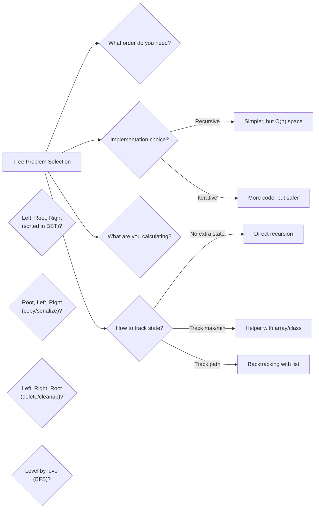

# Trees

> Master tree traversals and recursive tree patterns

---

## Learning Objectives

By the end of this section you should be able to:

- Name the four standard traversal orders and state the visit sequence each uses (Left-Root-Right, Root-Left-Right, Left-Right-Root, level by level)
- Explain why inorder traversal of a BST produces values in sorted order
- Implement both recursive and iterative versions of inorder traversal and state the key difference between the loop condition `curr != null` and the full condition `curr != null || !stack.isEmpty()`
- Describe what Morris traversal achieves, what thread it temporarily creates, and why it must remove that thread before moving on
- Choose the correct traversal for a given task: sorted extraction (inorder), tree copy or serialisation (preorder), safe deletion (postorder), shortest path or level-wise processing (level-order)
- Diagnose common traversal bugs: wrong loop condition in iterative inorder, processing all nodes in one pass in level-order, and using a stack instead of a queue for BFS
- Explain why trees are naturally recursive structures and state the two-part definition: a tree is either null or a root node with a left subtree and a right subtree
- Implement height, balanced-check, minimum-depth, diameter, path-sum, and LCA recursively — each with the correct base case
- Identify when to return a single value up the call stack, when to use a helper that threads extra state (an array or a class), and when to use backtracking
- Explain why the O(n²) diameter algorithm recomputes heights, and rewrite it as an O(n) single-pass algorithm using the combine-height-and-diameter trick
- Diagnose the five most common tree-recursion bugs: missing base case, missing +1, using `||` instead of `&&` in leaf check, using `&&` instead of `||` in path search, and missing `root == p || root == q` in LCA
- Choose between recursive and iterative implementations based on tree depth and stack-overflow risk

---

!!! note "Operational reality"
    The DOM (Document Object Model) is a tree, and every browser's layout engine traverses it with the same DFS and BFS patterns from these exercises. Git's object model stores each directory snapshot as a tree object — a commit points to a tree, which points to subtrees and blobs, forming a Merkle tree where each node's hash covers its children. SQL query planners represent execution plans as trees; the optimiser rewrites the tree by applying transformation rules, which is tree traversal and mutation at the core. Trie (prefix tree) structures power autocomplete in search engines, IP routing tables (longest prefix match in BGP and OSPF), and spell checkers.

## ELI5: Explain Like I'm 5

<div class="learner-section" markdown>

**Your task:** Trees are naturally recursive structures — a tree is either empty, or a root node whose children are themselves trees. That recursive definition shapes everything: both how you *visit* nodes (traversals, Patterns 1–4) and what you *compute* at each visit (recursive patterns, Patterns 5–8). Work through all eight patterns, then come back and fill in all ten prompts below.

**Traversals (Patterns 1–4):**

1. **What are tree traversals in one sentence?**
    - Your answer: <span class="fill-in">[Tree traversals are systematic ways to visit every node in a tree exactly once, where the only difference between them is ___ — the order in which you visit the root relative to its left and right subtrees]</span>

2. **Why do we need different traversal orders?**
    - Your answer: <span class="fill-in">[Different orders expose different relationships: inorder gives ___ for a BST, preorder gives the root before its children which is useful for ___, and postorder processes children before the parent which is required when ___]</span>

3. **Real-world analogy:**
    - Example: "Tree traversals are like different ways to read a family tree..."
    - Your analogy: <span class="fill-in">[Fill in]</span>

4. **When does each traversal order matter?**
    - Your answer: <span class="fill-in">[Fill in after solving problems]</span>

5. **What's the difference between iterative and recursive?**
    - Your answer: <span class="fill-in">[Recursive traversal uses the call stack implicitly, so it has O(h) space from recursion frames; iterative traversal uses an explicit ___ data structure and avoids ___ overflow risk for very deep trees, though both have the same O(h) worst-case space]</span>

**Recursive patterns (Patterns 5–8):**

6. **What is tree recursion in one sentence?**
    - Your answer: <span class="fill-in">[Tree recursion is the technique of solving a tree problem by breaking it into the same problem on smaller trees, where the base case handles ___ nodes and every other case combines the results from the ___ and ___ subtrees]</span>

7. **Why is recursion natural for trees?**
    - Your answer: <span class="fill-in">[A tree is literally defined recursively: it is either empty or a root with two subtrees that are themselves trees. This means any algorithm that matches the structure of the definition — handle the null case, then combine left and right results — is already ___]</span>

8. **Real-world analogy:**
    - Example: "Tree recursion is like solving a puzzle by breaking it into smaller identical puzzles..."
    - Your analogy: <span class="fill-in">[Fill in]</span>

9. **When does recursion work well for trees?**
    - Your answer: <span class="fill-in">[Fill in after solving problems]</span>

10. **What's the base case pattern for tree recursion?**
    - Your answer: <span class="fill-in">[Almost every tree recursion starts with `if (root == null) return ___`, where the return value represents the correct answer for an empty tree — for height that is ___, for path sum that is ___, and for LCA that is ___]</span>

</div>

---

## Core Implementation

### Pattern 1: Inorder Traversal (Left, Root, Right)

**Concept:** Visit left subtree, then root, then right subtree.

**Use case:** Get sorted order from BST, expression evaluation.

```java
--8<-- "com/study/dsa/trees/InorderTraversal.java"
```

!!! warning "Debugging Challenge — Wrong Loop Condition in Iterative Inorder"
    ```java
    /**
     * Iterative inorder with stack.
     * This has 2 CRITICAL BUGS with stack logic.
     */
    public static List<Integer> inorderIterative_Buggy(TreeNode root) {
        List<Integer> result = new ArrayList<>();
        Stack<TreeNode> stack = new Stack<>();
        TreeNode curr = root;

        while (!stack.isEmpty()) {        while (curr != null) {
                stack.push(curr);
                curr = curr.left;
            }

            TreeNode node = stack.pop();
            result.add(node.val);
            curr = curr.left;    }

        return result;
    }
    ```

    - **Bug 1:** <span class="fill-in">[What's wrong with the outer while condition?]</span>
    - **Bug 2:** <span class="fill-in">[Which direction should curr move after visiting a node?]</span>

??? success "Answer"
    **Bug 1:** The outer condition `while (!stack.isEmpty())` is wrong. At the very start the stack is empty, so the loop
    never executes even when root is non-null. The correct condition is `while (curr != null || !stack.isEmpty())`.
    This keeps the loop alive as long as either there are nodes yet to push (curr != null) or nodes already pushed that
    have not been visited yet (!stack.isEmpty()).

    **Bug 2:** After popping and visiting a node, `curr` should be set to `node.right`, not `curr.left`. After visiting a
    node we need to explore its **right** subtree. Using `curr.left` causes an infinite loop or NullPointerException.

    **Correct code:**
    ```java
    while (curr != null || !stack.isEmpty()) {
        while (curr != null) {
            stack.push(curr);
            curr = curr.left;
        }
        TreeNode node = stack.pop();
        result.add(node.val);
        curr = node.right;  // Go right after visiting
    }
    ```


---

### Pattern 2: Preorder Traversal (Root, Left, Right)

**Concept:** Visit root first, then left subtree, then right subtree.

**Use case:** Create copy of tree, prefix expression, serialize tree.

```java
--8<-- "com/study/dsa/trees/PreorderTraversal.java"
```


---

### Pattern 3: Postorder Traversal (Left, Right, Root)

**Concept:** Visit left subtree, then right subtree, then root.

**Use case:** Delete tree, calculate directory size, postfix expression.

```java
--8<-- "com/study/dsa/trees/PostorderTraversal.java"
```


---

### Pattern 4: Level-Order Traversal (BFS)

**Concept:** Visit nodes level by level, left to right.

**Use case:** Find shortest path, serialize by level, level-wise processing.

```java
--8<-- "com/study/dsa/trees/LevelOrderTraversal.java"
```


---

You can now visit every node in any order. The next question is *what to compute at each visit*. Because a tree is defined recursively — either null, or a root with two tree children — any algorithm that says "handle null, solve left, solve right, combine" already has the right shape. The four patterns that follow build on exactly that template.

---

### Pattern 5: Height and Depth

**Concept:** Calculate tree metrics recursively.

**Use case:** Tree height, depth, balanced tree check.

```java
--8<-- "com/study/dsa/trees/TreeHeightDepth.java"
```

!!! warning "Debugging Challenge — Missing Base Case and Missing +1"
    ```java
    /**
     * Calculate height of binary tree.
     * This has 2 BUGS. Find them!
     */
    public static int height_Buggy(TreeNode root) {

        int leftHeight = height_Buggy(root.left);
        int rightHeight = height_Buggy(root.right);

        return Math.max(leftHeight, rightHeight);}
    ```

    - Bug 1: <span class="fill-in">[What's the bug?]</span>
    - Bug 2: <span class="fill-in">[What's the bug?]</span>

??? success "Answer"
    **Bug 1:** Missing base case. The function calls `height_Buggy(root.left)` without first checking `if (root == null)`.
    When the recursion reaches a null child (leaf's child), it throws a `NullPointerException`. Fix: add
    `if (root == null) return 0;` as the very first line.

    **Bug 2:** The return statement is `Math.max(leftHeight, rightHeight)` but it should be
    `1 + Math.max(leftHeight, rightHeight)`. The "+1" counts the current node. Without it, a single-node tree returns 0
    instead of 1, and every height is off by the number of levels.

    **Fixed code:**
    ```java
    public static int height(TreeNode root) {
        if (root == null) return 0;

        int leftHeight = height(root.left);
        int rightHeight = height(root.right);

        return 1 + Math.max(leftHeight, rightHeight);
    }
    ```


---

### Pattern 6: Diameter and Paths

**Concept:** Find longest paths in tree.

**Use case:** Tree diameter, max path sum, all paths.

```java
--8<-- "com/study/dsa/trees/TreeDiameterPaths.java"
```

!!! warning "Debugging Challenge — Leaf Check Uses Wrong Logical Operator"
    ```java
    /**
     * Check if any root-to-leaf path sums to target.
     * This has 2 SUBTLE BUGS.
     */
    public static boolean hasPathSum_Buggy(TreeNode root, int targetSum) {
        if (root == null) return false;

        if (root.left == null || root.right == null) {
            return root.val == targetSum;
        }

        int remaining = targetSum - root.val;

        return hasPathSum_Buggy(root.left, remaining) &&
               hasPathSum_Buggy(root.right, remaining);
    }
    ```

    - **Bug 1:** <span class="fill-in">[What's wrong with the leaf check?]</span>
    - **Bug 2:** <span class="fill-in">[Should we use && or ||? Why?]</span>

??? success "Answer"
    **Bug 1:** The leaf check uses `||` (OR) but should use `&&` (AND). A leaf has BOTH children null. The condition
    `root.left == null || root.right == null` is true for any node that is missing at least one child — including a node
    with only a left child. That node is not a leaf, but the buggy code treats it as one and stops descending, potentially
    returning the wrong answer.

    **Bug 2:** The recursive return uses `&&` (AND) but should use `||` (OR). We need to find **any** root-to-leaf path
    that sums to target, not every path. Using `&&` requires BOTH subtrees to contain a valid path, which is almost always
    false.

    **Fixed code:**
    ```java
    if (root.left == null && root.right == null) {   // leaf check: both null
        return root.val == targetSum;
    }
    int remaining = targetSum - root.val;
    return hasPathSum(root.left, remaining) ||        // any path works
           hasPathSum(root.right, remaining);
    ```


---

### Pattern 7: Lowest Common Ancestor (LCA)

**Concept:** Find common ancestor of two nodes.

**Use case:** LCA in binary tree, LCA in BST, distance between nodes.

```java
--8<-- "com/study/dsa/trees/LowestCommonAncestor.java"
```


---

### Pattern 8: Tree Construction

**Concept:** Build tree from traversal arrays.

**Use case:** Construct from inorder/preorder, inorder/postorder.

```java
--8<-- "com/study/dsa/trees/TreeConstruction.java"
```


---

## Before/After: Why This Pattern Matters

**Your task:** Compare naive vs optimized approaches to understand the impact.

### Example 1: Collecting Tree Values

**Problem:** Get all values from a tree in sorted order (BST).

#### Approach 1: Collect All, Then Sort

```java
// Naive approach - Collect values in any order, then sort
public static List<Integer> getTreeValues_BruteForce(TreeNode root) {
    List<Integer> result = new ArrayList<>();

    // Collect values using preorder (any order)
    collectValues(root, result);

    // Sort the collected values
    Collections.sort(result);

    return result;
}

private static void collectValues(TreeNode node, List<Integer> result) {
    if (node == null) return;
    result.add(node.val);
    collectValues(node.left, result);
    collectValues(node.right, result);
}
```

**Analysis:**

- Time: O(n log n) - O(n) to collect + O(n log n) to sort
- Space: O(n) for list + O(log n) for recursion stack
- For n = 10,000: ~140,000 operations

#### Approach 2: Inorder Traversal (Optimized)

```java
// Optimized approach - Use inorder traversal for BST
public static List<Integer> getTreeValues_Inorder(TreeNode root) {
    List<Integer> result = new ArrayList<>();

    inorderHelper(root, result);

    return result; // Already sorted!
}

private static void inorderHelper(TreeNode node, List<Integer> result) {
    if (node == null) return;

    inorderHelper(node.left, result);   // Visit left subtree
    result.add(node.val);                // Visit root
    inorderHelper(node.right, result);   // Visit right subtree
}
```

**Analysis:**

- Time: O(n) - Visit each node exactly once
- Space: O(n) for list + O(h) for recursion stack (h = height)
- For n = 10,000: ~10,000 operations

#### Performance Comparison

| Tree Size  | Collect + Sort (O(n log n)) | Inorder (O(n)) | Speedup |
|------------|-----------------------------|----------------|---------|
| n = 100    | ~664 ops                    | 100 ops        | 6.6x    |
| n = 1,000  | ~9,966 ops                  | 1,000 ops      | 10x     |
| n = 10,000 | ~132,877 ops                | 10,000 ops     | 13x     |

**Your calculation:** For n = 5,000, the speedup is approximately _____ times faster.

#### Recursive vs Iterative: Stack Space

**Problem:** Inorder traversal of a deeply nested tree.

**Approach 1: Recursive**

```java
public static void inorderRecursive(TreeNode root) {
    if (root == null) return;

    inorderRecursive(root.left);
    System.out.print(root.val + " ");
    inorderRecursive(root.right);
}
```

**Analysis:**

- Space: O(h) where h = tree height
- For balanced tree: h = log n (good!)
- For skewed tree: h = n (danger of stack overflow!)
- Example: Tree with 100,000 nodes in a line = 100,000 recursive calls

**Approach 2: Iterative with Explicit Stack**

```java
public static void inorderIterative(TreeNode root) {
    Stack<TreeNode> stack = new Stack<>();
    TreeNode curr = root;

    while (curr != null || !stack.isEmpty()) {
        while (curr != null) {
            stack.push(curr);
            curr = curr.left;
        }
        curr = stack.pop();
        System.out.print(curr.val + " ");
        curr = curr.right;
    }
}
```

**Analysis:**

- Space: O(h) - same as recursive, but explicit stack
- No stack overflow risk - heap memory is larger
- More control over the process
- Production-safe for deep trees

!!! note "Why the iterative version is safer for production"
    The JVM's call stack is typically limited to a few thousand frames (configurable but small). A skewed tree with 100,000 nodes will overflow that stack recursively but NOT with the iterative version — because the `Stack<TreeNode>` on the heap can grow as large as available memory. Both approaches are O(h) in theory, but in practice the iterative version handles the worst case far more reliably.

#### Why Does Traversal Order Matter?

**Key insight to understand:**

For this tree:

```
       4
      / \
     2   6
    / \
   1   3
```

**Inorder (Left, Root, Right):** 1, 2, 3, 4, 6

- Visits left child before parent
- **Use case:** Get sorted values from BST

**Preorder (Root, Left, Right):** 4, 2, 1, 3, 6

- Visits parent before children
- **Use case:** Copy tree structure, serialize tree

**Postorder (Left, Right, Root):** 1, 3, 2, 6, 4

- Visits children before parent
- **Use case:** Delete tree (delete children first!)

**Level-order (BFS):** [[4], [2, 6], [1, 3]]

- Visits level by level
- **Use case:** Find shortest path, level-wise processing

**After implementing, explain in your own words:**

<div class="learner-section" markdown>

- Why does postorder make sense for tree deletion? <span class="fill-in">[Your answer]</span>
- Why does preorder make sense for copying a tree? <span class="fill-in">[Your answer]</span>
- When would level-order be preferred over depth-first? <span class="fill-in">[Your answer]</span>

</div>

---

### Example 2: Tree Height

**Problem:** Calculate the height of a binary tree.

#### Approach 1: Iterative (Level-Order Traversal)

```java
// Iterative approach - Use queue for level-order traversal
public static int height_Iterative(TreeNode root) {
    if (root == null) return 0;

    Queue<TreeNode> queue = new LinkedList<>();
    queue.offer(root);
    int height = 0;

    while (!queue.isEmpty()) {
        int levelSize = queue.size();
        height++;

        for (int i = 0; i < levelSize; i++) {
            TreeNode node = queue.poll();
            if (node.left != null) queue.offer(node.left);
            if (node.right != null) queue.offer(node.right);
        }
    }

    return height;
}
```

**Analysis:**

- Time: O(n) - Visit every node once
- Space: O(w) - Queue holds max width of tree (could be n/2 for balanced tree)
- Lines of code: ~15
- Complexity: Need to track levels explicitly with queue size

#### Approach 2: Recursive (Divide-and-Conquer)

```java
// Recursive approach - Natural tree structure
public static int height_Recursive(TreeNode root) {
    if (root == null) return 0;

    int leftHeight = height_Recursive(root.left);
    int rightHeight = height_Recursive(root.right);

    return 1 + Math.max(leftHeight, rightHeight);
}
```

**Analysis:**

- Time: O(n) - Visit every node once
- Space: O(h) - Recursion stack depth equals tree height
- Lines of code: ~5
- Complexity: Natural, elegant, follows tree structure

!!! note "Why recursion matches the tree's own structure"
    A tree is defined as: empty, OR root node + left subtree + right subtree. The recursive height function mirrors this
    exactly: base case for empty, then combine the left-subtree height and right-subtree height with `1 + max(...)`. When
    your code's structure matches the data structure's definition, both the logic and the proof of correctness become
    immediately obvious.

#### Why Does Recursion Work Better?

**Key insight to understand:**

Trees are inherently recursive structures:

- A tree is either empty (null) OR
- A root node with left subtree and right subtree

This natural recursion makes problems like height trivial:

1. Height of empty tree = 0 (base case)
2. Height of tree = 1 + max(left height, right height)

**After implementing, explain in your own words:**

<div class="learner-section" markdown>

- Why is recursion more natural for trees? <span class="fill-in">[Your answer]</span>
- When would iterative be better? <span class="fill-in">[Your answer]</span>

</div>

---

### Example 3: Tree Diameter

**Problem:** Find the longest path between any two nodes.

#### Approach 1: Brute Force (Calculate height at every node)

```java
// Naive approach - Calculate height at every node separately
public static int diameter_BruteForce(TreeNode root) {
    if (root == null) return 0;

    // Option 1: Diameter passes through root
    int leftHeight = height(root.left);
    int rightHeight = height(root.right);
    int diameterThroughRoot = leftHeight + rightHeight;

    // Option 2: Diameter is in left subtree
    int diameterLeft = diameter_BruteForce(root.left);

    // Option 3: Diameter is in right subtree
    int diameterRight = diameter_BruteForce(root.right);

    return Math.max(diameterThroughRoot,
                    Math.max(diameterLeft, diameterRight));
}

private static int height(TreeNode root) {
    if (root == null) return 0;
    return 1 + Math.max(height(root.left), height(root.right));
}
```

**Analysis:**

- Time: O(n²) - For each node, calculate height (which visits subtree)
- Space: O(h) - Recursion stack
- Problem: Recalculates height multiple times

#### Approach 2: Optimized Recursion (Calculate both at once)

```java
// Optimized approach - Calculate height and update diameter in one pass
public static int diameter_Optimized(TreeNode root) {
    int[] maxDiameter = new int[1];
    calculateHeight(root, maxDiameter);
    return maxDiameter[0];
}

private static int calculateHeight(TreeNode root, int[] maxDiameter) {
    if (root == null) return 0;

    int leftHeight = calculateHeight(root.left, maxDiameter);
    int rightHeight = calculateHeight(root.right, maxDiameter);

    // Update diameter while calculating height
    maxDiameter[0] = Math.max(maxDiameter[0], leftHeight + rightHeight);

    return 1 + Math.max(leftHeight, rightHeight);
}
```

**Analysis:**

- Time: O(n) - Visit every node exactly once
- Space: O(h) - Recursion stack
- Key insight: Combine height calculation with diameter tracking

#### Performance Comparison

| Tree Size  | Brute Force (O(n²)) | Optimized (O(n)) | Speedup |
|------------|---------------------|------------------|---------|
| n = 100    | ~10,000 ops         | 100 ops          | 100x    |
| n = 1,000  | ~1,000,000 ops      | 1,000 ops        | 1,000x  |
| n = 10,000 | ~100,000,000 ops    | 10,000 ops       | 10,000x |

**Your calculation:** For n = 5,000, the speedup is approximately _____ times faster.

**After implementing, explain in your own words:**

<div class="learner-section" markdown>

- Why does the optimized version avoid recalculation? <span class="fill-in">[Your answer]</span>
- What pattern do you see in combining calculations? <span class="fill-in">[Your answer]</span>

</div>

---

### Example 4: Path Sum

**Problem:** Check if a root-to-leaf path exists with a given sum.

#### Approach 1: Collect All Paths, Then Check

```java
// Less efficient - Build all paths, then check
public static boolean hasPathSum_Naive(TreeNode root, int targetSum) {
    List<List<Integer>> allPaths = new ArrayList<>();
    collectPaths(root, new ArrayList<>(), allPaths);

    for (List<Integer> path : allPaths) {
        int sum = 0;
        for (int val : path) sum += val;
        if (sum == targetSum) return true;
    }

    return false;
}

private static void collectPaths(TreeNode root, List<Integer> current,
                                 List<List<Integer>> allPaths) {
    if (root == null) return;

    current.add(root.val);

    if (root.left == null && root.right == null) {
        allPaths.add(new ArrayList<>(current));
    } else {
        collectPaths(root.left, current, allPaths);
        collectPaths(root.right, current, allPaths);
    }

    current.remove(current.size() - 1);
}
```

**Analysis:**

- Time: O(n) to collect + O(n) to check = O(n)
- Space: O(n) - Store all paths
- Problem: Unnecessary space usage

#### Approach 2: Check While Traversing

```java
// Efficient - Check sum during traversal
public static boolean hasPathSum_Optimized(TreeNode root, int targetSum) {
    if (root == null) return false;

    // At leaf: check if remaining sum equals node value
    if (root.left == null && root.right == null) {
        return root.val == targetSum;
    }

    // Recursively check left and right with reduced sum
    int remaining = targetSum - root.val;
    return hasPathSum_Optimized(root.left, remaining) ||
           hasPathSum_Optimized(root.right, remaining);
}
```

**Analysis:**

- Time: O(n) - May terminate early
- Space: O(h) - Only recursion stack
- Key insight: Check condition while traversing, not after

**Why is the second approach better?**

- Early termination: Returns as soon as a path is found
- Less space: No need to store all paths
- Clearer logic: Directly expresses the problem

**After implementing, explain in your own words:**

<div class="learner-section" markdown>

- When should you check conditions during recursion vs after? <span class="fill-in">[Your answer]</span>
- What's the benefit of reducing the target while recursing? <span class="fill-in">[Your answer]</span>

</div>

---

## Common Misconceptions

!!! danger "Misconception 1: Stack (LIFO) and Queue (FIFO) give the same traversal order"
    Using a stack gives DFS (depth-first), which processes the deepest nodes first. Using a queue gives BFS (breadth-first),
    which processes the shallowest nodes first. They are fundamentally different traversals. A common mistake is writing
    `Stack<TreeNode>` when the problem asks for level-order — the code compiles and produces *some* output, but it is
    DFS preorder, not level-order. Always use a `Queue` for level-order traversal.

!!! danger "Misconception 2: The inner loop in level-order should run until the queue is empty"
    Level-order groups nodes by level. The inner loop must process exactly the nodes that belong to the **current** level,
    not all nodes currently in the queue. The correct pattern is to capture `int levelSize = queue.size()` before the
    inner loop and iterate exactly `levelSize` times. Running until `queue.isEmpty()` collapses all levels into one list.

!!! danger "Misconception 3: Inorder of any binary tree gives sorted output"
    Inorder traversal gives sorted output **only for a Binary Search Tree (BST)** — a tree where every node's left
    subtree contains only smaller values and right subtree contains only larger values. For a general binary tree with
    arbitrary values, inorder traversal just visits nodes in Left-Root-Right order with no guarantee of sorted output.
    Always confirm the tree is a BST before relying on inorder for sorted results.

!!! danger "Misconception 4: The diameter always passes through the root"
    A very common mistake is to compute `leftHeight + rightHeight` at the root and return that as the diameter. The
    diameter is the longest path between **any** two nodes and may be entirely within a subtree. Consider a deeply
    unbalanced tree where the left subtree is a long chain — the longest path is inside that chain and never touches the
    root. The correct implementation must check every node as a potential "bend point" of the path, which is why the
    O(n) algorithm threads a `maxDiameter` array through the height calculation.

!!! danger "Misconception 5: Recursive tree algorithms have O(n) space because of n nodes"
    Recursive tree algorithms use O(h) stack space where h is the **height**, not O(n). For a balanced tree h = O(log n),
    so the stack depth is logarithmic. For a completely skewed tree (like a linked list), h = n, so the stack depth is
    linear. Always state the space complexity in terms of h and then clarify whether the tree is balanced or not. Saying
    "O(n) space" without qualification is imprecise and misleading for balanced trees.

!!! danger "Misconception 6: LCA requires finding p and q before searching"
    A common brute-force approach finds the paths from root to p and root to q separately, then compares them. The
    recursive LCA algorithm is cleaner: if we find p or q at the current node we return it immediately, and the first
    node where both left and right subtrees return non-null is the LCA. This works in a single O(n) pass without storing
    paths. The key base case that is frequently forgotten is `if (root == null || root == p || root == q) return root` —
    omitting `root == p || root == q` causes the algorithm to continue searching past the target nodes.

!!! warning "When it breaks"
    Recursive tree algorithms break at depth: most JVM and Python runtimes have a default stack depth of ~500–1000 frames, so a degenerate tree (effectively a linked list) of 10,000 nodes causes a stack overflow. Iterative implementations with an explicit stack eliminate this risk. BST operations break when the tree is unbalanced: a sorted-input insertion order degenerates to O(n) search, which is why production BST usage always involves self-balancing variants (AVL, red-black). Diameter and path-sum algorithms that call height as a sub-function break at O(n²) for unbalanced trees — the single-pass combination trick is required.

---

## Decision Framework

<div class="learner-section" markdown>

**Your task:** Build decision trees for tree traversal and recursion selection.

### Question 1: Which traversal order do you need?

Answer after solving problems:

- **Need sorted order from BST?** <span class="fill-in">[Use inorder]</span>
- **Need to copy tree structure?** <span class="fill-in">[Use preorder]</span>
- **Need to delete tree safely?** <span class="fill-in">[Use postorder]</span>
- **Need level-by-level processing?** <span class="fill-in">[Use level-order]</span>

### Question 2: Recursive vs Iterative?

**Recursive approach:**

- Pros: <span class="fill-in">[Simpler code, cleaner logic]</span>
- Cons: <span class="fill-in">[O(h) stack space, risk of stack overflow]</span>
- Use when: <span class="fill-in">[Tree depth is reasonable]</span>

**Iterative approach:**

- Pros: <span class="fill-in">[Explicit control, no stack overflow]</span>
- Cons: <span class="fill-in">[More complex code, need explicit stack/queue]</span>
- Use when: <span class="fill-in">[Deep trees, production code]</span>

### Question 3: What information flows up the tree?

Answer after solving problems:

- **Single value (height, count)?** <span class="fill-in">[Simple recursion]</span>
- **Multiple values (balanced + height)?** <span class="fill-in">[Use array or class]</span>
- **Path information?** <span class="fill-in">[Use backtracking]</span>
- **Global state?** <span class="fill-in">[Use instance variable]</span>

### Question 4: When to use helper functions?

**Direct recursion:**

- Use when: <span class="fill-in">[Single return value, no extra state]</span>
- Example: <span class="fill-in">[Height calculation]</span>

**Helper with extra parameters:**

- Use when: <span class="fill-in">[Need to track state, indices, ranges]</span>
- Example: <span class="fill-in">[Tree construction from arrays]</span>

**Helper with global variables:**

- Use when: <span class="fill-in">[Need to update global max/min]</span>
- Example: <span class="fill-in">[Diameter, max path sum]</span>

### Your Decision Tree


</div>

---

## Practice

<div class="learner-section" markdown>

### LeetCode Problems

**Easy (Complete all 8):**

- [ ] [94. Binary Tree Inorder Traversal](https://leetcode.com/problems/binary-tree-inorder-traversal/)
    - Pattern: <span class="fill-in">[Inorder - recursive/iterative/Morris]</span>
    - Your solution time: <span class="fill-in">___</span>
    - Key insight: <span class="fill-in">[Fill in after solving]</span>

- [ ] [144. Binary Tree Preorder Traversal](https://leetcode.com/problems/binary-tree-preorder-traversal/)
    - Pattern: <span class="fill-in">[Preorder]</span>
    - Your solution time: <span class="fill-in">___</span>
    - Key insight: <span class="fill-in">[Fill in]</span>

- [ ] [145. Binary Tree Postorder Traversal](https://leetcode.com/problems/binary-tree-postorder-traversal/)
    - Pattern: <span class="fill-in">[Postorder]</span>
    - Your solution time: <span class="fill-in">___</span>
    - Key insight: <span class="fill-in">[Fill in]</span>

- [ ] [102. Binary Tree Level Order Traversal](https://leetcode.com/problems/binary-tree-level-order-traversal/)
    - Pattern: <span class="fill-in">[Level-order BFS]</span>
    - Your solution time: <span class="fill-in">___</span>
    - Key insight: <span class="fill-in">[Fill in]</span>

- [ ] [104. Maximum Depth of Binary Tree](https://leetcode.com/problems/maximum-depth-of-binary-tree/)
    - Pattern: <span class="fill-in">[Height calculation]</span>
    - Your solution time: <span class="fill-in">___</span>
    - Key insight: <span class="fill-in">[Fill in after solving]</span>

- [ ] [110. Balanced Binary Tree](https://leetcode.com/problems/balanced-binary-tree/)
    - Pattern: <span class="fill-in">[Balance check]</span>
    - Your solution time: <span class="fill-in">___</span>
    - Key insight: <span class="fill-in">[Fill in]</span>

- [ ] [111. Minimum Depth of Binary Tree](https://leetcode.com/problems/minimum-depth-of-binary-tree/)
    - Pattern: <span class="fill-in">[Min depth]</span>
    - Your solution time: <span class="fill-in">___</span>
    - Key insight: <span class="fill-in">[Fill in]</span>

- [ ] [112. Path Sum](https://leetcode.com/problems/path-sum/)
    - Pattern: <span class="fill-in">[Path recursion]</span>
    - Your solution time: <span class="fill-in">___</span>
    - Key insight: <span class="fill-in">[Fill in]</span>

**Medium (Complete 5-6):**

- [ ] [103. Binary Tree Zigzag Level Order Traversal](https://leetcode.com/problems/binary-tree-zigzag-level-order-traversal/)
    - Pattern: <span class="fill-in">[Level-order with direction alternation]</span>
    - Difficulty: <span class="fill-in">[Rate 1-10]</span>
    - Key insight: <span class="fill-in">[Fill in]</span>

- [ ] [199. Binary Tree Right Side View](https://leetcode.com/problems/binary-tree-right-side-view/)
    - Pattern: <span class="fill-in">[Level-order, track rightmost]</span>
    - Difficulty: <span class="fill-in">[Rate 1-10]</span>
    - Key insight: <span class="fill-in">[Fill in]</span>

- [ ] [107. Binary Tree Level Order Traversal II](https://leetcode.com/problems/binary-tree-level-order-traversal-ii/)
    - Pattern: <span class="fill-in">[Level-order bottom-up]</span>
    - Difficulty: <span class="fill-in">[Rate 1-10]</span>
    - Key insight: <span class="fill-in">[Fill in]</span>

- [ ] [230. Kth Smallest Element in a BST](https://leetcode.com/problems/kth-smallest-element-in-a-bst/)
    - Pattern: <span class="fill-in">[Inorder with counter]</span>
    - Difficulty: <span class="fill-in">[Rate 1-10]</span>
    - Key insight: <span class="fill-in">[Fill in]</span>

- [ ] [543. Diameter of Binary Tree](https://leetcode.com/problems/diameter-of-binary-tree/)
    - Pattern: <span class="fill-in">[Diameter calculation]</span>
    - Difficulty: <span class="fill-in">[Rate 1-10]</span>
    - Key insight: <span class="fill-in">[Fill in]</span>

- [ ] [236. Lowest Common Ancestor of a Binary Tree](https://leetcode.com/problems/lowest-common-ancestor-of-a-binary-tree/)
    - Pattern: <span class="fill-in">[LCA]</span>
    - Difficulty: <span class="fill-in">[Rate 1-10]</span>
    - Key insight: <span class="fill-in">[Fill in]</span>

- [ ] [105. Construct Binary Tree from Preorder and Inorder Traversal](https://leetcode.com/problems/construct-binary-tree-from-preorder-and-inorder-traversal/)
    - Pattern: <span class="fill-in">[Tree construction]</span>
    - Difficulty: <span class="fill-in">[Rate 1-10]</span>
    - Key insight: <span class="fill-in">[Fill in]</span>

- [ ] [113. Path Sum II](https://leetcode.com/problems/path-sum-ii/)
    - Pattern: <span class="fill-in">[Backtracking paths]</span>
    - Difficulty: <span class="fill-in">[Rate 1-10]</span>
    - Key insight: <span class="fill-in">[Fill in]</span>

**Hard (Optional):**

- [ ] [124. Binary Tree Maximum Path Sum](https://leetcode.com/problems/binary-tree-maximum-path-sum/)
    - Pattern: <span class="fill-in">[Global max tracking]</span>
    - Key insight: <span class="fill-in">[Fill in after solving]</span>

- [ ] [297. Serialize and Deserialize Binary Tree](https://leetcode.com/problems/serialize-and-deserialize-binary-tree/)
    - Pattern: <span class="fill-in">[Preorder or level-order / construction/serialization]</span>
    - Key insight: <span class="fill-in">[Fill in after solving]</span>

- [ ] [987. Vertical Order Traversal of a Binary Tree](https://leetcode.com/problems/vertical-order-traversal-of-a-binary-tree/)
    - Pattern: <span class="fill-in">[Custom traversal with coordinates]</span>
    - Key insight: <span class="fill-in">[Fill in after solving]</span>

**Failure modes:**

- What happens if your recursive tree function does not handle null children before recursing — which specific runtime error occurs, and on which operation on a null `TreeNode`? <span class="fill-in">[Fill in]</span>
- How does your diameter or path-sum implementation behave on a single-node tree (no children) — does it return 0, 1, or the node's value, and is that the correct answer for each problem? <span class="fill-in">[Fill in]</span>

</div>

---

## Test Your Understanding

1. The iterative inorder traversal uses the condition `while (curr != null || !stack.isEmpty())`. Explain precisely what each part of this condition guards against. Then show what happens if you use only `while (!stack.isEmpty())` by tracing the execution on a two-node tree (root with only a left child).

    ??? success "Rubric"
        A complete answer addresses: (1) `curr != null` keeps the loop running while there are still unvisited nodes reachable via `curr` — at the start, the stack is empty but `curr = root` is non-null, so this part handles the initial descent; (2) `!stack.isEmpty()` keeps the loop running after `curr` becomes null but there are still nodes on the stack waiting to be visited and their right subtrees explored; (3) tracing a root-with-left-child-only tree: with only `!stack.isEmpty()`, the first iteration pushes `root` and goes left to `leftChild`, pushes it, goes left to null — now `curr = null` and stack = `[root, leftChild]`; then pops `leftChild`, visits it, sets `curr = leftChild.right = null` — loop condition `!stack.isEmpty()` is still true, pops `root`, visits it, sets `curr = root.right = null` — loop ends correctly here by coincidence; but if root also had no right child and the stack were empty at some intermediate point while curr was still non-null, the loop would terminate prematurely.

2. Morris traversal achieves O(1) space by temporarily modifying the tree. Describe the thread it creates, when it removes it, and why failing to remove the thread causes an infinite loop. Then explain why Morris traversal is rarely used in production despite its space advantage.

    ??? success "Rubric"
        A complete answer addresses: (1) Morris traversal finds the inorder predecessor of `curr` (the rightmost node in `curr`'s left subtree) and sets that node's `right` pointer to `curr` — this is the "thread"; (2) the thread is removed when Morris traversal encounters it a second time (detected by `predecessor.right == curr`) — it restores `predecessor.right = null` before visiting `curr`; (3) without removal, the traversal would revisit `curr` again after following the thread back, and the predecessor's right would still point to `curr`, creating an infinite loop; (4) production code avoids Morris traversal because it temporarily corrupts the tree structure — if an exception or concurrent read occurs mid-traversal, the tree is left with dangling pointers.

3. The level-order implementation must capture `int levelSize = queue.size()` **before** the inner loop. Explain what goes wrong if you instead write `while (!queue.isEmpty())` as the inner loop condition. Trace the execution on a three-level tree to demonstrate.

    ??? success "Rubric"
        A complete answer addresses: (1) if the inner loop condition is `while (!queue.isEmpty())`, the loop keeps running as long as there are any nodes in the queue — including nodes that were added by children enqueued during this same level's processing; (2) tracing a three-level tree (root, two children, four grandchildren): after processing root and enqueuing its two children, the inner loop does not stop — it immediately processes both children and enqueues all four grandchildren, all within the same "level"; (3) the result is a single-element list `[[root, leftChild, rightChild, ...all grandchildren]]` instead of three separate level lists; (4) `levelSize = queue.size()` freezes the count of nodes at the current level before any children are added, allowing the inner loop to process exactly that many nodes.

4. The brute-force diameter algorithm is O(n²) because it calls `height()` at every node. Prove this claim: write out the recurrence for the number of nodes visited and show it is quadratic for a balanced binary tree. Then explain exactly why threading `maxDiameter` through `calculateHeight` reduces this to O(n).

    ??? success "Rubric"
        A complete answer addresses: (1) in a balanced tree, `diameter(node)` calls `height(node.left)` and `height(node.right)`, each of which visits O(n/2) nodes, then recurses into the left and right children — the recurrence is T(n) = 2T(n/2) + O(n), which by Master theorem gives O(n log n), or O(n²) for a skewed tree; (2) the single-pass fix computes both the height to return AND updates `maxDiameter` as a side effect inside the same postorder traversal — `maxDiameter = Math.max(maxDiameter, leftHeight + rightHeight)` at each node; (3) since height is computed once per node and the diameter update is O(1) per node, the total work is O(n) — the height of every subtree is available as the return value of the recursive call without re-traversal.

5. The LCA base case is `if (root == null || root == p || root == q) return root`. Consider the scenario where p is an ancestor of q. Trace through the LCA algorithm to show that it still returns the correct answer (p) without needing to continue searching inside p's subtree.

    ??? success "Rubric"
        A complete answer addresses: (1) when the recursion reaches node `p`, the base case `root == p` fires and returns `p` immediately — the algorithm does NOT recurse into `p`'s subtrees; (2) this is correct because `q` is somewhere inside `p`'s subtree — since we found `p` first, `p` is by definition the lowest ancestor that contains both `p` and `q`; (3) at the level above `p`, one recursive call returns `p` (non-null) and the other returns either `null` (if `q` is in `p`'s subtree, which was not explored) or a non-null node; since only one side returns non-null, the LCA function returns `p` — the correct answer without needing to verify that `q` is actually below `p`.

6. The `minDepth` function must handle single-child nodes as a special case. Explain precisely why `1 + Math.min(leftDepth, rightDepth)` gives the wrong answer when a node has only one child, and write the corrected version. Then explain why the same special case does not affect `maxDepth` (height).

    ??? success "Rubric"
        A complete answer addresses: (1) when a node has only a left child (right is null), `minDepth(right) = 0` — `Math.min(leftDepth, 0)` always returns 0, so the formula gives `1 + 0 = 1` regardless of left subtree depth; this is wrong because minDepth must follow the only existing path, not a non-existent null path; (2) the corrected version: if `left == null` return `1 + minDepth(right)`; if `right == null` return `1 + minDepth(left)`; otherwise return `1 + Math.min(minDepth(left), minDepth(right))`; (3) `maxDepth` is unaffected because `Math.max(leftDepth, 0) = leftDepth` when right is null — taking the maximum naturally ignores the null side and follows the real path, so no special case is needed.

---

## Review Checklist

<div class="learner-section" markdown>

Complete this checklist after implementing and studying both traversal and recursive tree patterns.

- [ ] Can implement inorder traversal recursively, iteratively, and with Morris O(1) space
- [ ] Can implement level-order traversal and explain why levelSize must be captured before the inner loop
- [ ] Can calculate tree height, diameter, and check balance in O(n) using a single-pass helper
- [ ] Can implement LCA for both general binary trees and BSTs
- [ ] Can trace the recursive call stack for a path-sum problem on a 4-level tree
- [ ] Can choose between recursive and iterative implementations based on tree depth and stack-overflow risk

</div>

---

## Connected Topics

<div class="bs-callout bs-callout-info" markdown>

**Where this topic connects**

- **08. Heaps** — a binary heap is a complete binary tree stored as an array; tree height reasoning applies directly to heap operations → [08. Heaps](08-heaps.md)
- **10. Graphs** — trees are acyclic connected graphs; tree traversals (DFS/BFS) generalise directly to graph traversals → [10. Graphs](10-graphs.md)
- **13. Dynamic Programming** — many tree DP problems (diameter, path sum, LCA) use post-order traversal to propagate subproblem results up the tree → [13. Dynamic Programming](13-dynamic-programming.md)

</div>
