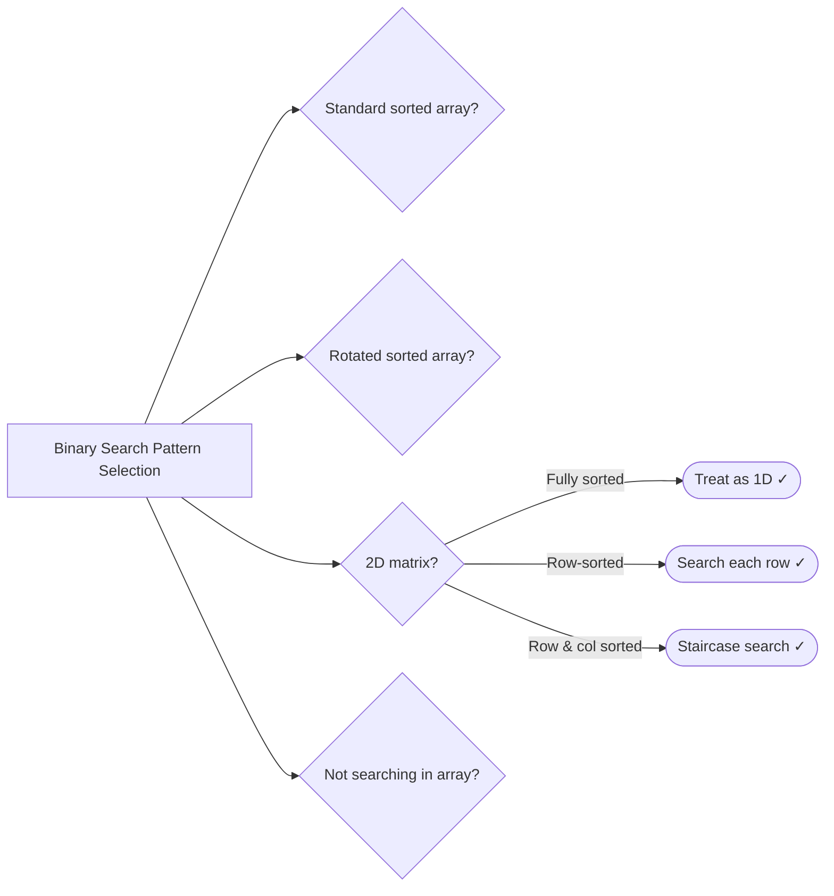

# Binary Search

> Reduce O(n) to O(log n) by eliminating half the search space each step

---

## Learning Objectives

By the end of this section you should be able to:

- Explain why binary search requires the sorted (or monotonic) property, and give one example of each of the four patterns: classic search, rotated array search, 2D matrix search, and binary search on the answer space
- Write the three binary search template lines from memory: `int mid = left + (right - left) / 2`, `while (left <= right)`, and `left = mid + 1` / `right = mid - 1`
- Explain why `(left + right) / 2` can overflow and why `left + (right - left) / 2` cannot
- Diagnose the three most common binary search bugs: off-by-one in initialisation (`right = nums.length` instead of `nums.length - 1`), infinite loop from `right = mid` instead of `right = mid - 1` in find-first, and wrong pointer update direction in rotated-array search
- Apply binary search on the answer space: identify the monotonic predicate, set the search bounds, and write the `canAchieve(capacity)` validation function
- Choose between the `left <= right` template (classic search returning -1) and the `left < right` template (find-boundary returning `left`)

---

## ELI5: Explain Like I'm 5

<div class="learner-section" markdown>

**Your task:** After implementing all patterns, explain them simply.

**Prompts to guide you:**

1. **What is binary search in one sentence?**
    - Your answer: <span class="fill-in">[Binary search is a technique for finding a value in a sorted collection by repeatedly checking the middle element and eliminating ___ of the remaining candidates, so the search space shrinks from n to ___ to ___ to 1 in just O(log n) steps]</span>

2. **Why is O(log n) so fast?**
    - Your answer: <span class="fill-in">[O(log n) is fast because doubling n only adds ___ extra step; at n = 1,000,000 you need only about ___ comparisons, compared to up to 1,000,000 for linear search]</span>

3. **Real-world analogy:**
    - Example: "Binary search is like finding a word in a dictionary by opening to the middle..."
    - Your analogy: <span class="fill-in">[Fill in]</span>

4. **When does binary search work?**
    - Your answer: <span class="fill-in">[Binary search works whenever there is a ___ property: if we test the middle element and the answer is clearly not in one half, we can discard that half entirely. The array does not need to be sorted in the traditional sense — it just needs a ___ predicate that divides the space cleanly into two halves]</span>

5. **What breaks binary search?**
    - Your answer: <span class="fill-in">[Fill in after testing]</span>

</div>

---

## Quick Quiz (Do BEFORE implementing)

!!! tip "How to use this section"
    Write your best guess in each fill-in span **before** reading any implementation code. Your predictions do not need to be correct — the act of committing to an answer first makes the correct answer stick much better when you verify it later.

<div class="learner-section" markdown>

**Your task:** Test your intuition without looking at code. Answer these, then verify after implementation.

### Complexity Predictions

1. **Linear search through entire array:**
    - Time complexity: <span class="fill-in">[Your guess: O(?)]</span>
    - Verified after learning: <span class="fill-in">[Actual: O(?)]</span>

2. **Binary search in sorted array:**
    - Time complexity: <span class="fill-in">[Your guess: O(?)]</span>
    - Space complexity: <span class="fill-in">[Your guess: O(?)]</span>
    - Verified: <span class="fill-in">[Actual]</span>

3. **Speedup calculation:**
    - If n = 1,024, linear search = n = <span class="fill-in">_____</span> operations
    - Binary search = log₂(n) = <span class="fill-in">_____</span> operations
    - Speedup factor: <span class="fill-in">_____</span> times faster

### Scenario Predictions

**Scenario 1:** Find 7 in `[1, 3, 5, 7, 9, 11, 13]`

- **Can you use binary search?** <span class="fill-in">[Yes/No - Why?]</span>
- **Starting positions:** left = <span class="fill-in">___</span>, right = <span class="fill-in">___</span>
- **First mid calculation:** mid = <span class="fill-in">___</span>
- **If nums[mid] = 5 (too small), which pointer moves?** <span class="fill-in">[Left/Right - Why?]</span>
- **If nums[mid] = 9 (too big), which pointer moves?** <span class="fill-in">[Left/Right - Why?]</span>

**Scenario 2:** Find 6 in `[1, 3, 5, 7, 9, 11, 13]` (not present)

- **What will binary search return?** <span class="fill-in">[Fill in]</span>
- **What's the value of left when search ends?** <span class="fill-in">[Fill in]</span>
- **Could you use that for insert position?** <span class="fill-in">[Yes/No - Why?]</span>

**Scenario 3:** Find 8 in rotated array `[6, 7, 8, 1, 2, 3, 4, 5]`

- **Can you use classic binary search directly?** <span class="fill-in">[Yes/No - Why?]</span>
- **Which half is sorted after first mid?** <span class="fill-in">[Fill in your reasoning]</span>
- **How do you determine which half to search?** <span class="fill-in">[Fill in]</span>

### Trade-off Quiz

**Question:** When would linear search be BETTER than binary search?

- Your answer: <span class="fill-in">[Fill in before implementation]</span>
- Verified answer: <span class="fill-in">[Fill in after learning]</span>

**Question:** What's the MAIN requirement for binary search to work?

- [ ] Array must have even length
- [ ] Array must be sorted or have monotonic property
- [ ] Array must contain unique elements
- [ ] Array must be positive integers

Verify after implementation: <span class="fill-in">[Which one(s)?]</span>

**Question:** What happens if you calculate mid as `(left + right) / 2` with large numbers?

- Your answer: <span class="fill-in">[Fill in - consider integer overflow]</span>
- Verified answer: <span class="fill-in">[Fill in after learning]</span>

</div>

---

## Before/After: Why This Pattern Matters

**Your task:** Compare naive vs optimized approaches to understand the impact.

### Example: Find Target in Array

**Problem:** Find target value in a sorted array of 1 million elements.

#### Approach 1: Linear Search (Brute Force)

```java
// Naive approach - Check every element
public static int linearSearch(int[] nums, int target) {
    for (int i = 0; i < nums.length; i++) {
        if (nums[i] == target) {
            return i;
        }
    }
    return -1;
}
```

**Analysis:**

- Time: O(n) - Worst case: check all elements
- Space: O(1) - No extra space
- For n = 1,000,000: up to 1,000,000 comparisons

#### Approach 2: Binary Search (Optimized)

```java
// Optimized approach - Eliminate half each step
public static int binarySearch(int[] nums, int target) {
    int left = 0;
    int right = nums.length - 1;

    while (left <= right) {
        int mid = left + (right - left) / 2;  // Avoid overflow

        if (nums[mid] == target) return mid;
        if (nums[mid] < target) left = mid + 1;   // Search right half
        else right = mid - 1;                     // Search left half
    }

    return -1;  // Not found
}
```

**Analysis:**

- Time: O(log n) - Each step eliminates half
- Space: O(1) - No extra space
- For n = 1,000,000: only ~20 comparisons

#### Performance Comparison

| Array Size    | Linear Search (O(n)) | Binary Search (O(log n)) | Speedup |
|---------------|----------------------|--------------------------|---------|
| n = 100       | 100 ops              | 7 ops                    | 14x     |
| n = 1,000     | 1,000 ops            | 10 ops                   | 100x    |
| n = 10,000    | 10,000 ops           | 14 ops                   | 714x    |
| n = 1,000,000 | 1,000,000 ops        | 20 ops                   | 50,000x |

**Your calculation:** For n = 16,384, binary search needs _____ comparisons.

#### Why Does Binary Search Work?

**Key insight to understand:**

In a sorted array `[1, 3, 5, 7, 9, 11, 13]` looking for 7:

```
Step 1: left=0, right=6, mid=3, nums[3]=7 → FOUND!
```

If we were looking for 11:

```
Step 1: left=0, right=6, mid=3, nums[3]=7 (too small)
        → Move left=4 because target must be in right half

Step 2: left=4, right=6, mid=5, nums[5]=11 → FOUND!
```

**Why can we eliminate half?**

- Array is sorted, so all values to the left of mid are ≤ nums[mid]
- All values to the right of mid are ≥ nums[mid]
- If target > nums[mid], it CANNOT be in the left half
- If target < nums[mid], it CANNOT be in the right half
- So each comparison eliminates half the remaining elements!

**Logarithmic growth visualization:**

```
n = 1,024 → log₂(1,024) = 10 steps
n = 2,048 → log₂(2,048) = 11 steps  (doubled n, only +1 step!)
n = 1,048,576 → log₂(1,048,576) = 20 steps
```

!!! note "Why doubling n adds only one step"
    When you double the input from n to 2n, binary search needs just one extra comparison to discard one half and reduce
    the problem back to size n. This is the defining property of logarithmic growth: it takes log₂(n) steps to get from n
    down to 1, and adding another power of 2 adds exactly 1 more step. Linear search has no such property — doubling the
    input doubles the worst-case comparisons.

**After implementing, explain in your own words:**

<div class="learner-section" markdown>

- Why is O(log n) so much faster than O(n)? <span class="fill-in">[Your answer]</span>
- What property of sorted arrays makes this possible? <span class="fill-in">[Your answer]</span>
- What happens at each step that makes it logarithmic? <span class="fill-in">[Your answer]</span>

</div>

---

## Aside: Java's Collections.binarySearch

**Quick reference:** Understanding Java's built-in binary search helps with B+Tree implementation.

### Return Value Convention

```java
List<Integer> nums = Arrays.asList(1, 3, 5, 7, 9);

// Element FOUND → returns index
Collections.binarySearch(nums, 5);  // Returns: 2

// Element NOT FOUND → returns -(insertion point) - 1
Collections.binarySearch(nums, 6);  // Returns: -4
// Decode: insertion point = -(−4) - 1 = 3
```

**Why negative encoding?**

- Distinguishes "not found" from "found at index 0"
- Encodes where to insert to maintain sorted order

### Using with Comparators

```java
class Person {
    String name;
    int age;
}

// Search by specific field
Comparator<Person> byAge = (p1, p2) -> Integer.compare(p1.age, p2.age);
int idx = Collections.binarySearch(people, searchKey, byAge);
```

**Key insight:** You can search by one field without exact object equality.

### Generic Implementation Pattern

```java
public static <T extends Comparable<T>> int binarySearch(List<T> list, T key) {
    int left = 0, right = list.size() - 1;

    while (left <= right) {
        int mid = left + (right - left) / 2;  // Avoid overflow
        int cmp = list.get(mid).compareTo(key);

        if (cmp == 0) return mid;              // Found
        else if (cmp < 0) left = mid + 1;      // Search right
        else right = mid - 1;                  // Search left
    }

    return -(left + 1);  // Not found - encode insertion point
}
```

### Applying to B+Tree

**Finding child pointer in internal node:**

```java
class InternalNode<K extends Comparable<K>> {
    List<K> keys;           // [10, 20, 30]
    List<Node<K>> children; // [child0, child1, child2, child3]
}

private int findChildIndex(K searchKey) {
    int idx = Collections.binarySearch(keys, searchKey);

    if (idx >= 0) {
        return idx + 1;  // Key found - go to right child
    } else {
        return -(idx + 1);  // Not found - decode insertion point
    }
}
```

**Visual:** Given keys `[10, 20, 30]`, searching for `25`:

```
Children:  [<10]  [10-20)  [20-30)  [≥30]
Keys:         10      20       30
Indices:   0      1       2        3
```

Result: child index 2 (between 20 and 30)

### Common Pitfalls

```java
// ❌ WRONG: Integer overflow
int mid = (left + right) / 2;

// ✓ CORRECT: Avoids overflow
int mid = left + (right - left) / 2;

// ❌ WRONG: Misses single element case
while (left < right) { ... }

// ✓ CORRECT: Handles all cases
while (left <= right) { ... }

// ❌ WRONG: Forgets to decode
return Math.abs(idx);

// ✓ CORRECT: Properly decodes insertion point
return idx >= 0 ? idx : -(idx + 1);
```

---

## Core Implementation

### Pattern 1: Classic Binary Search

**Concept:** Search in sorted array by halving search space.

**Use case:** Find target, find insert position, find boundaries.

```java
public class ClassicBinarySearch {

    /**
     * Problem: Find target in sorted array
     * Time: O(log n), Space: O(1)
     *
     * TODO: Implement classic binary search
     */
    public static int binarySearch(int[] nums, int target) {
        // TODO: Initialize pointers/variables

        // TODO: Implement iteration/conditional logic

        // TODO: Return -1 if not found

        return -1; // Replace with implementation
    }

    /**
     * Problem: Find insert position for target
     * Time: O(log n), Space: O(1)
     *
     * TODO: Implement search insert position
     */
    public static int searchInsert(int[] nums, int target) {
        // TODO: Similar to binary search
        // TODO: Return left pointer when not found

        return 0; // Replace with implementation
    }

    /**
     * Problem: Find first and last position of target
     * Time: O(log n), Space: O(1)
     *
     * TODO: Implement find range
     */
    public static int[] searchRange(int[] nums, int target) {
        // TODO: Find leftmost occurrence
        // TODO: Find rightmost occurrence
        // TODO: Return [-1, -1] if not found

        return new int[]{-1, -1}; // Replace with implementation
    }

    private static int findFirst(int[] nums, int target) {
        // TODO: Binary search to find first occurrence
        // TODO: When found, continue searching left half

        return -1; // Replace with implementation
    }

    private static int findLast(int[] nums, int target) {
        // TODO: Binary search to find last occurrence
        // TODO: When found, continue searching right half

        return -1; // Replace with implementation
    }
}
```

!!! warning "Debugging Challenge — Two Classic Binary Search Bugs"
    ```java
    /**
     * This code is supposed to find target in sorted array.
     * It has 2 BUGS. Find them!
     */
    public static int binarySearch_Buggy(int[] nums, int target) {
        int left = 0;
        int right = nums.length;
        while (left <= right) {
            int mid = (left + right) / 2;
            if (nums[mid] == target) {
                return mid;
            }
            if (nums[mid] < target) {
                left = mid + 1;
            } else {
                right = mid - 1;
            }
        }

        return -1;
    }
    ```

    - Bug 1: <span class="fill-in">[What's the bug?]</span>
    - Bug 2: <span class="fill-in">[What's the bug?]</span>

??? success "Answer"
    **Bug 1:** `right` is initialised to `nums.length` but should be `nums.length - 1`. Arrays are 0-indexed so the last
    valid index is `length - 1`. When `left = right = nums.length`, the loop runs and accesses `nums[mid]` at an
    out-of-bounds index, throwing `ArrayIndexOutOfBoundsException`.

    **Bug 2:** `(left + right) / 2` can overflow when both `left` and `right` are close to `Integer.MAX_VALUE`. Their sum
    can exceed `Integer.MAX_VALUE` and wrap to a negative number. The safe formula is `left + (right - left) / 2`, which
    computes the same midpoint without overflow.

    **Fixed code:**
    ```java
    int right = nums.length - 1;          // Fix Bug 1
    int mid = left + (right - left) / 2;  // Fix Bug 2
    ```

**Runnable Client Code:**

```java
import java.util.*;

public class ClassicBinarySearchClient {

    public static void main(String[] args) {
        System.out.println("=== Classic Binary Search ===\n");

        // Test 1: Find target
        System.out.println("--- Test 1: Find Target ---");
        int[] arr = {1, 3, 5, 7, 9, 11, 13};
        int[] targets = {5, 8, 1, 13};

        System.out.println("Array: " + Arrays.toString(arr));
        for (int target : targets) {
            int index = ClassicBinarySearch.binarySearch(arr, target);
            System.out.printf("Search %d: index = %d%n", target, index);
        }

        // Test 2: Search insert position
        System.out.println("\n--- Test 2: Search Insert Position ---");
        int[] arr2 = {1, 3, 5, 6};
        int[] insertTargets = {5, 2, 7, 0};

        System.out.println("Array: " + Arrays.toString(arr2));
        for (int target : insertTargets) {
            int pos = ClassicBinarySearch.searchInsert(arr2, target);
            System.out.printf("Insert position for %d: %d%n", target, pos);
        }

        // Test 3: Find range
        System.out.println("\n--- Test 3: Find First and Last Position ---");
        int[] arr3 = {5, 7, 7, 8, 8, 8, 10};
        int rangeTarget = 8;

        System.out.println("Array: " + Arrays.toString(arr3));
        int[] range = ClassicBinarySearch.searchRange(arr3, rangeTarget);
        System.out.printf("Range for %d: [%d, %d]%n", rangeTarget, range[0], range[1]);
    }
}
```

---

### Pattern 2: Rotated Array Search

**Concept:** Search in rotated sorted array.

**Use case:** Find target in rotated array, find minimum, find rotation point.

```java
public class RotatedArraySearch {

    /**
     * Problem: Search in rotated sorted array
     * Time: O(log n), Space: O(1)
     *
     * TODO: Implement rotated array search
     */
    public static int search(int[] nums, int target) {
        // TODO: Initialize pointers/variables

        // TODO: Implement iteration/conditional logic
        //
        //   Determine which half is sorted:
        //   If nums[left] <= nums[mid]: left half sorted
        //     Check if target in left half
        //   Else: right half sorted
        //     Check if target in right half

        return -1; // Replace with implementation
    }

    /**
     * Problem: Find minimum in rotated sorted array
     * Time: O(log n), Space: O(1)
     *
     * TODO: Implement find minimum
     */
    public static int findMin(int[] nums) {
        // TODO: Initialize pointers/variables

        // TODO: Implement iteration/conditional logic

        // TODO: Return nums[left]

        return 0; // Replace with implementation
    }

    /**
     * Problem: Find rotation count (how many rotations)
     * Time: O(log n), Space: O(1)
     *
     * TODO: Implement rotation count
     */
    public static int findRotationCount(int[] nums) {
        // TODO: Find index of minimum element
        // TODO: That index is the rotation count

        return 0; // Replace with implementation
    }
}
```

**Runnable Client Code:**

```java
import java.util.*;

public class RotatedArraySearchClient {

    public static void main(String[] args) {
        System.out.println("=== Rotated Array Search ===\n");

        // Test 1: Search in rotated array
        System.out.println("--- Test 1: Search in Rotated Array ---");
        int[] rotated = {4, 5, 6, 7, 0, 1, 2};
        int[] searchTargets = {0, 3, 4, 7};

        System.out.println("Rotated array: " + Arrays.toString(rotated));
        for (int target : searchTargets) {
            int index = RotatedArraySearch.search(rotated, target);
            System.out.printf("Search %d: index = %d%n", target, index);
        }

        // Test 2: Find minimum
        System.out.println("\n--- Test 2: Find Minimum ---");
        int[][] rotatedArrays = {
            {3, 4, 5, 1, 2},
            {4, 5, 6, 7, 0, 1, 2},
            {11, 13, 15, 17}
        };

        for (int[] arr : rotatedArrays) {
            int min = RotatedArraySearch.findMin(arr);
            System.out.printf("Array: %s -> Min: %d%n", Arrays.toString(arr), min);
        }

        // Test 3: Find rotation count
        System.out.println("\n--- Test 3: Find Rotation Count ---");
        for (int[] arr : rotatedArrays) {
            int count = RotatedArraySearch.findRotationCount(arr);
            System.out.printf("Array: %s -> Rotations: %d%n", Arrays.toString(arr), count);
        }
    }
}
```

---

### Pattern 3: Search in 2D Matrix

**Concept:** Binary search in matrix with sorted properties.

**Use case:** Search in row-sorted matrix, search in fully sorted matrix.

```java
public class Search2DMatrix {

    /**
     * Problem: Search in matrix where each row is sorted
     * Time: O(m log n), Space: O(1)
     *
     * TODO: Implement 2D matrix search (rows sorted)
     */
    public static boolean searchMatrix1(int[][] matrix, int target) {
        // TODO: Binary search on each row
        // TODO: Or: binary search to find row, then binary search in row

        return false; // Replace with implementation
    }

    /**
     * Problem: Search in matrix sorted like a flat array
     * Time: O(log(m*n)), Space: O(1)
     *
     * TODO: Implement 2D matrix search (fully sorted)
     */
    public static boolean searchMatrix2(int[][] matrix, int target) {
        // TODO: Treat matrix as 1D array
        // TODO: Initialize pointers/variables
        // TODO: Implement logic

        return false; // Replace with implementation
    }

    /**
     * Problem: Search in matrix sorted row-wise and column-wise
     * Time: O(m + n), Space: O(1)
     *
     * TODO: Implement staircase search
     */
    public static boolean searchMatrixStaircase(int[][] matrix, int target) {
        // TODO: Start from top-right corner
        // TODO: Implement iteration/conditional logic
        // TODO: Implement iteration/conditional logic
        // TODO: Implement iteration/conditional logic

        return false; // Replace with implementation
    }
}
```

**Runnable Client Code:**

```java
public class Search2DMatrixClient {

    public static void main(String[] args) {
        System.out.println("=== Search in 2D Matrix ===\n");

        // Test 1: Search in row-sorted matrix
        System.out.println("--- Test 1: Row-Sorted Matrix ---");
        int[][] matrix1 = {
            {1, 3, 5, 7},
            {10, 11, 16, 20},
            {23, 30, 34, 60}
        };

        int[] targets1 = {3, 13, 60};
        for (int target : targets1) {
            boolean found = Search2DMatrix.searchMatrix1(matrix1, target);
            System.out.printf("Search %d: %s%n", target, found ? "FOUND" : "NOT FOUND");
        }

        // Test 2: Search in fully sorted matrix
        System.out.println("\n--- Test 2: Fully Sorted Matrix ---");
        int[][] matrix2 = {
            {1, 3, 5, 7},
            {10, 11, 16, 20},
            {23, 30, 34, 50}
        };

        int[] targets2 = {3, 13, 50};
        for (int target : targets2) {
            boolean found = Search2DMatrix.searchMatrix2(matrix2, target);
            System.out.printf("Search %d: %s%n", target, found ? "FOUND" : "NOT FOUND");
        }

        // Test 3: Staircase search
        System.out.println("\n--- Test 3: Staircase Search ---");
        int[][] matrix3 = {
            {1, 4, 7, 11},
            {2, 5, 8, 12},
            {3, 6, 9, 16},
            {10, 13, 14, 17}
        };

        int[] targets3 = {5, 20, 14};
        for (int target : targets3) {
            boolean found = Search2DMatrix.searchMatrixStaircase(matrix3, target);
            System.out.printf("Search %d: %s%n", target, found ? "FOUND" : "NOT FOUND");
        }
    }
}
```

---

### Pattern 4: Binary Search on Answer

**Concept:** Binary search on solution space, not array index.

**Use case:** Find square root, find kth smallest, capacity problems.

```java
public class BinarySearchOnAnswer {

    /**
     * Problem: Find square root (integer part)
     * Time: O(log n), Space: O(1)
     *
     * TODO: Implement integer square root
     */
    public static int mySqrt(int x) {
        // TODO: Binary search from 0 to x
        // TODO: Check if mid * mid <= x
        // TODO: Return largest mid where mid * mid <= x

        return 0; // Replace with implementation
    }

    /**
     * Problem: Find minimum capacity to ship packages in D days
     * Time: O(n log(sum)), Space: O(1)
     *
     * TODO: Implement capacity to ship
     */
    public static int shipWithinDays(int[] weights, int days) {
        // TODO: Binary search on capacity
        // TODO: Initialize pointers/variables
        // TODO: Check if capacity allows shipping in D days

        return 0; // Replace with implementation
    }

    private static boolean canShip(int[] weights, int days, int capacity) {
        // TODO: Simulate shipping with given capacity
        // TODO: Return true if possible in D days

        return false; // Replace with implementation
    }

    /**
     * Problem: Find kth missing positive number
     * Time: O(log n), Space: O(1)
     *
     * TODO: Implement kth missing
     */
    public static int findKthPositive(int[] arr, int k) {
        // TODO: Binary search on array
        // TODO: Count missing numbers at each position

        return 0; // Replace with implementation
    }
}
```

**Runnable Client Code:**

```java
import java.util.*;

public class BinarySearchOnAnswerClient {

    public static void main(String[] args) {
        System.out.println("=== Binary Search on Answer ===\n");

        // Test 1: Square root
        System.out.println("--- Test 1: Integer Square Root ---");
        int[] sqrtInputs = {4, 8, 16, 27};

        for (int x : sqrtInputs) {
            int sqrt = BinarySearchOnAnswer.mySqrt(x);
            System.out.printf("sqrt(%d) = %d%n", x, sqrt);
        }

        // Test 2: Ship within days
        System.out.println("\n--- Test 2: Ship Within Days ---");
        int[] weights = {1, 2, 3, 4, 5, 6, 7, 8, 9, 10};
        int days = 5;

        System.out.println("Weights: " + Arrays.toString(weights));
        System.out.println("Days: " + days);
        int capacity = BinarySearchOnAnswer.shipWithinDays(weights, days);
        System.out.println("Minimum capacity: " + capacity);

        // Test 3: Kth missing positive
        System.out.println("\n--- Test 3: Kth Missing Positive ---");
        int[] arr = {2, 3, 4, 7, 11};
        int k = 5;

        System.out.println("Array: " + Arrays.toString(arr));
        System.out.println("k = " + k);
        int kthMissing = BinarySearchOnAnswer.findKthPositive(arr, k);
        System.out.println("Kth missing: " + kthMissing);
    }
}
```

---

!!! info "Loop back"
    Now that you have implemented all four patterns, return to the **ELI5** section and fill in prompts 1, 2, and 4. Prompt 4 (monotonic property) is the most important: binary search on the answer space (Pattern 4) does not sort an array — it searches a range of candidate answers using a monotonic predicate like "can I ship all packages in D days with capacity C?". Make sure you can articulate why that predicate is monotonic and how you set the search bounds.

---

## Common Misconceptions

!!! warning "Misconception 1: Binary search only works on arrays"
    Binary search applies to any situation where there is a **monotonic property** that lets you discard half the candidates
    at each step. The search space does not need to be a physical array — it can be a range of integers (finding a square
    root), a range of capacities (shipping problem), or even an implicit space defined by a predicate. Whenever you can
    answer "is the answer above or below mid?" in O(n) or better, binary search on the answer space gives you O(n log(range)).

!!! warning "Misconception 2: `right = mid` and `right = mid - 1` are interchangeable"
    These two pointer updates correspond to two different loop invariants and must match the loop condition. The `left <= right`
    template requires `right = mid - 1` when discarding the right half, because `mid` has been examined and ruled out. Using
    `right = mid` with `left <= right` creates an infinite loop when `left == right == mid` — the loop condition stays true
    but neither pointer moves. The `left < right` template uses `right = mid` (keeping mid as a candidate), but then the loop
    condition must be strict `<` to guarantee termination. Mixing these patterns is the single most common source of infinite
    loops in binary search implementations.

!!! warning "Misconception 3: The sorted-array requirement means the whole array must be sorted"
    Classic binary search needs the array sorted, but several variants do not. In a rotated sorted array, neither half is
    globally sorted — but at least one half is locally sorted, which is enough. In 2D staircase search, neither row nor
    column is globally sorted, but starting from the top-right corner guarantees that you can always eliminate a row or a
    column. In binary search on the answer space, the "array" is a conceptual range and the sorted property is replaced by
    the monotonic predicate. The real requirement is: "can I determine which half contains the answer without examining
    every element?"

---

## Decision Framework

<div class="learner-section" markdown>

**Your task:** Build decision trees for binary search problems.

### Question 1: Is the data sorted?

Answer after solving problems:

- **Already sorted?** <span class="fill-in">[Classic binary search]</span>
- **Rotated?** <span class="fill-in">[Find sorted half, adjust search]</span>
- **Partially sorted?** <span class="fill-in">[Modified binary search]</span>
- **Not sorted?** <span class="fill-in">[Can't use binary search]</span>

### Question 2: What are you searching for?

**Search for value:**

- Direct search: <span class="fill-in">[Classic binary search]</span>
- First/last occurrence: <span class="fill-in">[Modified binary search]</span>

**Search for position:**

- Insert position: <span class="fill-in">[Binary search with left pointer]</span>
- Peak element: <span class="fill-in">[Binary search on local property]</span>

**Search on answer space:**

- Square root, capacity: <span class="fill-in">[Binary search on range]</span>
- Minimize/maximize: <span class="fill-in">[Binary search with validation]</span>

### Your Decision Tree


</div>

---

## Practice

<div class="learner-section" markdown>

### LeetCode Problems

**Easy (Complete all 4):**

- [ ] [704. Binary Search](https://leetcode.com/problems/binary-search/)
    - Pattern: <span class="fill-in">[Classic binary search]</span>
    - Your solution time: <span class="fill-in">___</span>
    - Key insight: <span class="fill-in">[Fill in after solving]</span>

- [ ] [35. Search Insert Position](https://leetcode.com/problems/search-insert-position/)
    - Pattern: <span class="fill-in">[Binary search with insert]</span>
    - Your solution time: <span class="fill-in">___</span>
    - Key insight: <span class="fill-in">[Fill in]</span>

- [ ] [69. Sqrt(x)](https://leetcode.com/problems/sqrtx/)
    - Pattern: <span class="fill-in">[Binary search on answer]</span>
    - Your solution time: <span class="fill-in">___</span>
    - Key insight: <span class="fill-in">[Fill in]</span>

- [ ] [278. First Bad Version](https://leetcode.com/problems/first-bad-version/)
    - Pattern: <span class="fill-in">[Find first occurrence]</span>
    - Your solution time: <span class="fill-in">___</span>
    - Key insight: <span class="fill-in">[Fill in]</span>

**Medium (Complete 3-4):**

- [ ] [33. Search in Rotated Sorted Array](https://leetcode.com/problems/search-in-rotated-sorted-array/)
    - Pattern: <span class="fill-in">[Rotated array]</span>
    - Difficulty: <span class="fill-in">[Rate 1-10]</span>
    - Key insight: <span class="fill-in">[Fill in]</span>

- [ ] [34. Find First and Last Position of Element in Sorted Array](https://leetcode.com/problems/find-first-and-last-position-of-element-in-sorted-array/)
    - Pattern: <span class="fill-in">[Find range]</span>
    - Difficulty: <span class="fill-in">[Rate 1-10]</span>
    - Key insight: <span class="fill-in">[Fill in]</span>

- [ ] [74. Search a 2D Matrix](https://leetcode.com/problems/search-a-2d-matrix/)
    - Pattern: <span class="fill-in">[2D binary search]</span>
    - Difficulty: <span class="fill-in">[Rate 1-10]</span>
    - Key insight: <span class="fill-in">[Fill in]</span>

- [ ] [153. Find Minimum in Rotated Sorted Array](https://leetcode.com/problems/find-minimum-in-rotated-sorted-array/)
    - Pattern: <span class="fill-in">[Find minimum]</span>
    - Difficulty: <span class="fill-in">[Rate 1-10]</span>
    - Key insight: <span class="fill-in">[Fill in]</span>

**Hard (Optional):**

- [ ] [4. Median of Two Sorted Arrays](https://leetcode.com/problems/median-of-two-sorted-arrays/)
    - Pattern: <span class="fill-in">[Binary search on two arrays]</span>
    - Key insight: <span class="fill-in">[Fill in after solving]</span>

- [ ] [410. Split Array Largest Sum](https://leetcode.com/problems/split-array-largest-sum/)
    - Pattern: <span class="fill-in">[Binary search on answer]</span>
    - Key insight: <span class="fill-in">[Fill in after solving]</span>

</div>

---

## Test Your Understanding

1. The safe mid formula is `left + (right - left) / 2`. Demonstrate with concrete numbers why `(left + right) / 2` can overflow: give the smallest values of `left` and `right` (using Java's `Integer.MAX_VALUE = 2,147,483,647`) that cause overflow, and show the exact incorrect mid value produced.

2. Finding the first occurrence of a target uses `right = mid - 1` (not `right = mid`) when `nums[mid] == target`. Construct a concrete array (e.g., `[5, 7, 7, 8, 8, 8, 10]`, target = 8) and trace the execution with `right = mid` to show the infinite loop, then explain the invariant that `right = mid - 1` maintains.

3. The rotated array search uses `nums[left] <= nums[mid]` (with equals) rather than `nums[left] < nums[mid]`. Construct the specific two-element array that breaks the strict inequality version and trace the execution to show the wrong result. Why does the equals case arise from how integer division computes mid?

4. Binary search on the answer space (Pattern 4) requires a monotonic predicate. For the "ship packages in D days" problem, state the predicate formally (in terms of capacity C and days D), prove it is monotonic (if capacity C works, then capacity C+1 also works), and explain how you set the initial `left` and `right` bounds.

5. The `searchInsert` function should return the index where target would be inserted to keep the array sorted. After the `while (left <= right)` loop exits without finding the target, prove that `left` is always the correct insert position — specifically, prove that `nums[left - 1] < target <= nums[left]` holds when the loop exits.
