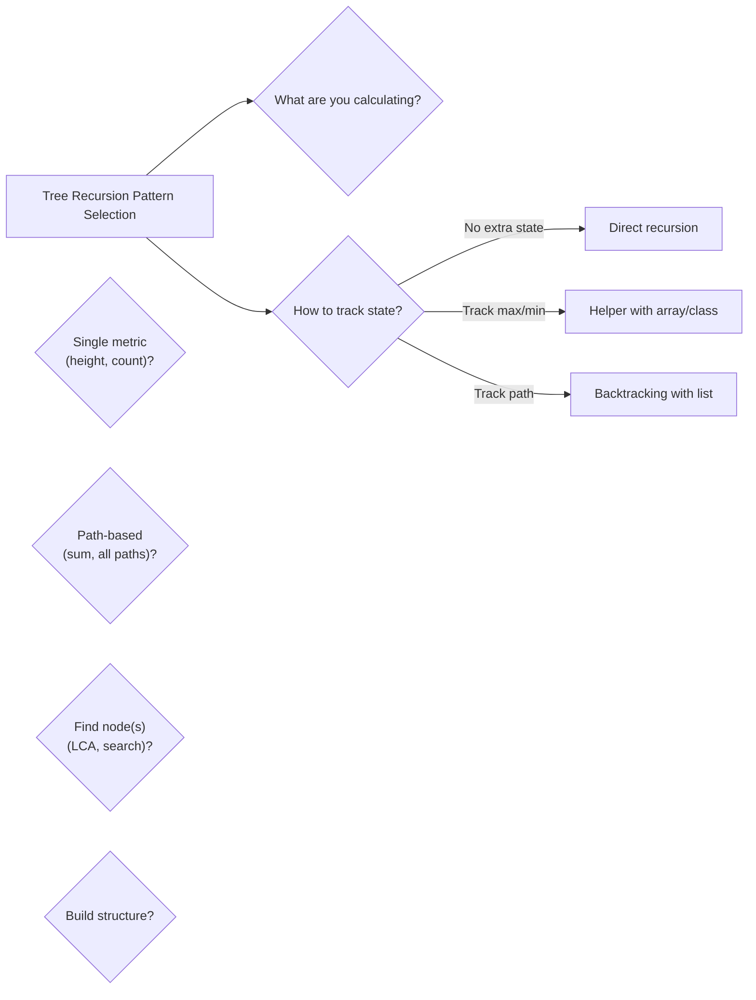

# 07. Trees - Recursion

> Solve tree problems using recursive divide-and-conquer approach

---

## ELI5: Explain Like I'm 5

<div class="learner-section" markdown>

**Your task:** After implementing all patterns, explain them simply.

**Prompts to guide you:**

1. **What is tree recursion in one sentence?**
    - Your answer: <span class="fill-in">[Fill in after implementation]</span>

2. **Why is recursion natural for trees?**
    - Your answer: <span class="fill-in">[Fill in after implementation]</span>

3. **Real-world analogy:**
    - Example: "Tree recursion is like solving a puzzle by breaking it into smaller identical puzzles..."
    - Your analogy: <span class="fill-in">[Fill in]</span>

4. **When does recursion work well for trees?**
    - Your answer: <span class="fill-in">[Fill in after solving problems]</span>

5. **What's the base case pattern for tree recursion?**
    - Your answer: <span class="fill-in">[Fill in after implementation]</span>

</div>

---

## Quick Quiz (Do BEFORE implementing)

<div class="learner-section" markdown>

**Your task:** Test your intuition without looking at code. Answer these, then verify after implementation.

### Complexity Predictions

1. **Iterative tree height using level-order traversal:**
    - Time complexity: <span class="fill-in">[Your guess: O(?)]</span>
    - Space complexity: <span class="fill-in">[Your guess: O(?)]</span>
    - Verified after learning: <span class="fill-in">[Actual: O(?)]</span>

2. **Recursive tree height:**
    - Time complexity: <span class="fill-in">[Your guess: O(?)]</span>
    - Space complexity: <span class="fill-in">[Your guess: O(?)]</span>
    - Verified: <span class="fill-in">[Actual]</span>

3. **Space usage comparison:**
    - For a balanced tree with n = 1,000 nodes, height h = <span class="fill-in">_____</span>
    - Recursive call stack depth = <span class="fill-in">_____</span>
    - Level-order queue max size = <span class="fill-in">_____</span>

### Scenario Predictions

**Scenario 1:** Calculate height of this tree:

```
       5
      / \
     3   8
    /     \
   1       9
```

- **Base case returns:** <span class="fill-in">[What value for null nodes?]</span>
- **Left subtree height:** <span class="fill-in">[Calculate]</span>
- **Right subtree height:** <span class="fill-in">[Calculate]</span>
- **Total height:** <span class="fill-in">[What formula combines them?]</span>

**Scenario 2:** Find LCA of nodes 1 and 9 in the above tree

- **Which subtrees contain each node?** <span class="fill-in">[Fill in]</span>
- **Where will LCA be found?** <span class="fill-in">[Node 5, 3, 8, or other?]</span>
- **Why?** <span class="fill-in">[Explain your reasoning]</span>

**Scenario 3:** Calculate diameter of the same tree

- **What is diameter?** <span class="fill-in">[Define in your words]</span>
- **Diameter through root?** <span class="fill-in">[Left height + right height = ?]</span>
- **Could diameter be in a subtree?** <span class="fill-in">[Yes/No - Why?]</span>

### Base Case Quiz

**Question:** What should the base case return for tree height?

- [ ] return 0 when root is null
- [ ] return 1 when root is null
- [ ] return -1 when root is null
- [ ] return 0 when root is a leaf

Verify after implementation: <span class="fill-in">[Which one(s)?]</span>

**Question:** For path sum, what makes a valid path?

- Your answer: <span class="fill-in">[Root to leaf? Any path? Fill in]</span>
- When is targetSum considered found? <span class="fill-in">[At leaf node? Any node?]</span>

### Recursion Flow Quiz

**Question:** In tree diameter calculation, why do we need both height AND diameter?

- Your answer: <span class="fill-in">[Fill in before implementation]</span>
- Verified answer: <span class="fill-in">[Fill in after learning]</span>

**Question:** What's the MAIN difference between tree recursion and array recursion?

- [ ] Trees have two recursive calls, arrays have one
- [ ] Trees need base case, arrays don't
- [ ] Trees use divide-and-conquer, arrays use iteration
- [ ] Trees always return values up, arrays modify in-place

Verify after implementation: <span class="fill-in">[Which one(s)?]</span>


</div>

---

## Before/After: Why This Pattern Matters

**Your task:** Compare iterative vs recursive approaches to understand the impact.

### Example 1: Tree Height

**Problem:** Calculate the height of a binary tree.

#### Approach 1: Iterative (Level-Order Traversal)

```java
// Iterative approach - Use queue for level-order traversal
public static int height_Iterative(TreeNode root) {
    if (root == null) return 0;

    Queue<TreeNode> queue = new LinkedList<>();
    queue.offer(root);
    int height = 0;

    while (!queue.isEmpty()) {
        int levelSize = queue.size();
        height++;

        for (int i = 0; i < levelSize; i++) {
            TreeNode node = queue.poll();
            if (node.left != null) queue.offer(node.left);
            if (node.right != null) queue.offer(node.right);
        }
    }

    return height;
}
```

**Analysis:**

- Time: O(n) - Visit every node once
- Space: O(w) - Queue holds max width of tree (could be n/2 for balanced tree)
- Lines of code: ~15
- Complexity: Need to track levels explicitly with queue size

#### Approach 2: Recursive (Divide-and-Conquer)

```java
// Recursive approach - Natural tree structure
public static int height_Recursive(TreeNode root) {
    if (root == null) return 0;

    int leftHeight = height_Recursive(root.left);
    int rightHeight = height_Recursive(root.right);

    return 1 + Math.max(leftHeight, rightHeight);
}
```

**Analysis:**

- Time: O(n) - Visit every node once
- Space: O(h) - Recursion stack depth equals tree height
- Lines of code: ~5
- Complexity: Natural, elegant, follows tree structure

#### Why Does Recursion Work Better?

**Key insight to understand:**

Trees are inherently recursive structures:

- A tree is either empty (null) OR
- A root node with left subtree and right subtree

This natural recursion makes problems like height trivial:

1. Height of empty tree = 0 (base case)
2. Height of tree = 1 + max(left height, right height)

**After implementing, explain in your own words:**

<div class="learner-section" markdown>

- Why is recursion more natural for trees? <span class="fill-in">[Your answer]</span>
- When would iterative be better? <span class="fill-in">[Your answer]</span>

</div>

---

### Example 2: Tree Diameter

**Problem:** Find the longest path between any two nodes.

#### Approach 1: Brute Force (Calculate height at every node)

```java
// Naive approach - Calculate height at every node separately
public static int diameter_BruteForce(TreeNode root) {
    if (root == null) return 0;

    // Option 1: Diameter passes through root
    int leftHeight = height(root.left);
    int rightHeight = height(root.right);
    int diameterThroughRoot = leftHeight + rightHeight;

    // Option 2: Diameter is in left subtree
    int diameterLeft = diameter_BruteForce(root.left);

    // Option 3: Diameter is in right subtree
    int diameterRight = diameter_BruteForce(root.right);

    return Math.max(diameterThroughRoot,
                    Math.max(diameterLeft, diameterRight));
}

private static int height(TreeNode root) {
    if (root == null) return 0;
    return 1 + Math.max(height(root.left), height(root.right));
}
```

**Analysis:**

- Time: O(n²) - For each node, calculate height (which visits subtree)
- Space: O(h) - Recursion stack
- Problem: Recalculates height multiple times

#### Approach 2: Optimized Recursion (Calculate both at once)

```java
// Optimized approach - Calculate height and update diameter in one pass
public static int diameter_Optimized(TreeNode root) {
    int[] maxDiameter = new int[1];
    calculateHeight(root, maxDiameter);
    return maxDiameter[0];
}

private static int calculateHeight(TreeNode root, int[] maxDiameter) {
    if (root == null) return 0;

    int leftHeight = calculateHeight(root.left, maxDiameter);
    int rightHeight = calculateHeight(root.right, maxDiameter);

    // Update diameter while calculating height
    maxDiameter[0] = Math.max(maxDiameter[0], leftHeight + rightHeight);

    return 1 + Math.max(leftHeight, rightHeight);
}
```

**Analysis:**

- Time: O(n) - Visit every node exactly once
- Space: O(h) - Recursion stack
- Key insight: Combine height calculation with diameter tracking

#### Performance Comparison

| Tree Size  | Brute Force (O(n²)) | Optimized (O(n)) | Speedup |
|------------|---------------------|------------------|---------|
| n = 100    | ~10,000 ops         | 100 ops          | 100x    |
| n = 1,000  | ~1,000,000 ops      | 1,000 ops        | 1,000x  |
| n = 10,000 | ~100,000,000 ops    | 10,000 ops       | 10,000x |

**Your calculation:** For n = 5,000, the speedup is approximately _____ times faster.

**After implementing, explain in your own words:**

<div class="learner-section" markdown>

- Why does the optimized version avoid recalculation? <span class="fill-in">[Your answer]</span>
- What pattern do you see in combining calculations? <span class="fill-in">[Your answer]</span>

</div>

---

### Example 3: Path Sum

**Problem:** Check if a root-to-leaf path exists with a given sum.

#### Approach 1: Collect All Paths, Then Check

```java
// Less efficient - Build all paths, then check
public static boolean hasPathSum_Naive(TreeNode root, int targetSum) {
    List<List<Integer>> allPaths = new ArrayList<>();
    collectPaths(root, new ArrayList<>(), allPaths);

    for (List<Integer> path : allPaths) {
        int sum = 0;
        for (int val : path) sum += val;
        if (sum == targetSum) return true;
    }

    return false;
}

private static void collectPaths(TreeNode root, List<Integer> current,
                                 List<List<Integer>> allPaths) {
    if (root == null) return;

    current.add(root.val);

    if (root.left == null && root.right == null) {
        allPaths.add(new ArrayList<>(current));
    } else {
        collectPaths(root.left, current, allPaths);
        collectPaths(root.right, current, allPaths);
    }

    current.remove(current.size() - 1);
}
```

**Analysis:**

- Time: O(n) to collect + O(n) to check = O(n)
- Space: O(n) - Store all paths
- Problem: Unnecessary space usage

#### Approach 2: Check While Traversing

```java
// Efficient - Check sum during traversal
public static boolean hasPathSum_Optimized(TreeNode root, int targetSum) {
    if (root == null) return false;

    // At leaf: check if remaining sum equals node value
    if (root.left == null && root.right == null) {
        return root.val == targetSum;
    }

    // Recursively check left and right with reduced sum
    int remaining = targetSum - root.val;
    return hasPathSum_Optimized(root.left, remaining) ||
           hasPathSum_Optimized(root.right, remaining);
}
```

**Analysis:**

- Time: O(n) - May terminate early
- Space: O(h) - Only recursion stack
- Key insight: Check condition while traversing, not after

**Why is the second approach better?**

- Early termination: Returns as soon as a path is found
- Less space: No need to store all paths
- Clearer logic: Directly expresses the problem

**After implementing, explain in your own words:**

<div class="learner-section" markdown>

- When should you check conditions during recursion vs after? <span class="fill-in">[Your answer]</span>
- What's the benefit of reducing the target while recursing? <span class="fill-in">[Your answer]</span>

</div>

---

## Core Implementation

### Pattern 1: Height and Depth

**Concept:** Calculate tree metrics recursively.

**Use case:** Tree height, depth, balanced tree check.

```java
public class TreeHeightDepth {

    static class TreeNode {
        int val;
        TreeNode left, right;

        TreeNode(int val) {
            this.val = val;
        }
    }

    /**
     * Problem: Calculate height of tree
     * Time: O(n), Space: O(h) for recursion stack
     *
     * TODO: Implement recursive height calculation
     */
    public static int height(TreeNode root) {
        // TODO: Handle base case

        // TODO: Recursively get left height
        // TODO: Recursively get right height
        // TODO: Return 1 + max(leftHeight, rightHeight)

        return 0; // Replace with implementation
    }

    /**
     * Problem: Check if tree is balanced
     * Time: O(n), Space: O(h)
     *
     * TODO: Implement balanced tree check
     */
    public static boolean isBalanced(TreeNode root) {
        // TODO: Tree is balanced if:

        // TODO: Return checkBalance(root) \!= -1
        return false; // Replace with implementation
    }

    private static int checkBalance(TreeNode root) {
        // TODO: Base case: null returns 0

        // TODO: Check left subtree balance
        // TODO: Implement iteration/conditional logic

        // TODO: Check right subtree balance
        // TODO: Implement iteration/conditional logic

        // TODO: Implement iteration/conditional logic
        // TODO: Otherwise return 1 + max(left, right)

        return 0; // Replace with implementation
    }

    /**
     * Problem: Calculate minimum depth (shortest path to leaf)
     * Time: O(n), Space: O(h)
     *
     * TODO: Implement minimum depth
     */
    public static int minDepth(TreeNode root) {
        // TODO: Handle base case

        // TODO: Implement iteration/conditional logic
        // TODO: Implement iteration/conditional logic

        // TODO: Both children exist: return 1 + min(left, right)

        return 0; // Replace with implementation
    }
}
```

**Runnable Client Code:**

```java
public class TreeHeightDepthClient {

    public static void main(String[] args) {
        System.out.println("=== Tree Height and Depth ===\n");

        // Create balanced tree:
        //       4
        //      / \
        //     2   6
        //    / \ / \
        //   1  3 5  7
        TreeNode balanced = new TreeNode(4);
        balanced.left = new TreeNode(2);
        balanced.right = new TreeNode(6);
        balanced.left.left = new TreeNode(1);
        balanced.left.right = new TreeNode(3);
        balanced.right.left = new TreeNode(5);
        balanced.right.right = new TreeNode(7);

        System.out.println("--- Test 1: Balanced Tree ---");
        System.out.println("Height: " + TreeHeightDepth.height(balanced));
        System.out.println("Is balanced: " + TreeHeightDepth.isBalanced(balanced));
        System.out.println("Min depth: " + TreeHeightDepth.minDepth(balanced));

        // Create unbalanced tree:
        //       1
        //      /
        //     2
        //    /
        //   3
        TreeNode unbalanced = new TreeNode(1);
        unbalanced.left = new TreeNode(2);
        unbalanced.left.left = new TreeNode(3);

        System.out.println("\n--- Test 2: Unbalanced Tree ---");
        System.out.println("Height: " + TreeHeightDepth.height(unbalanced));
        System.out.println("Is balanced: " + TreeHeightDepth.isBalanced(unbalanced));
        System.out.println("Min depth: " + TreeHeightDepth.minDepth(unbalanced));
    }
}
```

---

### Pattern 2: Diameter and Paths

**Concept:** Find longest paths in tree.

**Use case:** Tree diameter, max path sum, all paths.

```java
import java.util.*;

public class TreeDiameterPaths {

    static class TreeNode {
        int val;
        TreeNode left, right;

        TreeNode(int val) {
            this.val = val;
        }
    }

    /**
     * Problem: Calculate diameter (longest path between any two nodes)
     * Time: O(n), Space: O(h)
     *
     * TODO: Implement diameter calculation
     */
    public static int diameter(TreeNode root) {
        int[] maxDiameter = new int[1];

        // TODO: Helper function to calculate height and update diameter
        // TODO: Implement iteration/conditional logic
        // TODO: Track maximum diameter seen

        calculateHeight(root, maxDiameter);
        return maxDiameter[0];
    }

    private static int calculateHeight(TreeNode root, int[] maxDiameter) {
        // TODO: Base case: null returns 0

        // TODO: Get left and right heights
        // TODO: Update maxDiameter: max(current, left + right)
        // TODO: Return 1 + max(left, right)

        return 0; // Replace with implementation
    }

    /**
     * Problem: Check if path exists with given sum
     * Time: O(n), Space: O(h)
     *
     * TODO: Implement path sum check
     */
    public static boolean hasPathSum(TreeNode root, int targetSum) {
        // TODO: Handle base case

        // TODO: Implement iteration/conditional logic

        // TODO: Recursively check left and right subtrees
        // TODO: with targetSum - root.val

        return false; // Replace with implementation
    }

    /**
     * Problem: Find all root-to-leaf paths with given sum
     * Time: O(n), Space: O(h)
     *
     * TODO: Implement path sum II with backtracking
     */
    public static List<List<Integer>> pathSum(TreeNode root, int targetSum) {
        List<List<Integer>> result = new ArrayList<>();

        // TODO: Use backtracking to explore all paths
        // TODO: Add node to path, recurse, remove node (backtrack)

        return result; // Replace with implementation
    }
}
```

**Runnable Client Code:**

```java
import java.util.*;

public class TreeDiameterPathsClient {

    public static void main(String[] args) {
        System.out.println("=== Tree Diameter and Paths ===\n");

        // Create tree:
        //       5
        //      / \
        //     4   8
        //    /   / \
        //   11  13  4
        //  / \      / \
        // 7   2    5   1
        TreeNode root = new TreeNode(5);
        root.left = new TreeNode(4);
        root.right = new TreeNode(8);
        root.left.left = new TreeNode(11);
        root.left.left.left = new TreeNode(7);
        root.left.left.right = new TreeNode(2);
        root.right.left = new TreeNode(13);
        root.right.right = new TreeNode(4);
        root.right.right.left = new TreeNode(5);
        root.right.right.right = new TreeNode(1);

        System.out.println("--- Test 1: Diameter ---");
        System.out.println("Diameter: " + TreeDiameterPaths.diameter(root));

        System.out.println("\n--- Test 2: Has Path Sum (22) ---");
        System.out.println("Has path: " + TreeDiameterPaths.hasPathSum(root, 22));

        System.out.println("\n--- Test 3: All Paths with Sum 22 ---");
        List<List<Integer>> paths = TreeDiameterPaths.pathSum(root, 22);
        System.out.println("Paths: " + paths);
    }
}
```

---

### Pattern 3: Lowest Common Ancestor (LCA)

**Concept:** Find common ancestor of two nodes.

**Use case:** LCA in binary tree, LCA in BST, distance between nodes.

```java
public class LowestCommonAncestor {

    static class TreeNode {
        int val;
        TreeNode left, right;

        TreeNode(int val) {
            this.val = val;
        }
    }

    /**
     * Problem: Find LCA in binary tree
     * Time: O(n), Space: O(h)
     *
     * TODO: Implement LCA for binary tree
     */
    public static TreeNode lowestCommonAncestor(TreeNode root, TreeNode p, TreeNode q) {
        // TODO: Handle base case

        // TODO: Recursively search in left and right subtrees

        // TODO: Implement iteration/conditional logic
        // TODO: Implement iteration/conditional logic
        // TODO: Implement iteration/conditional logic

        return null; // Replace with implementation
    }

    /**
     * Problem: Find LCA in BST (optimized)
     * Time: O(h), Space: O(h)
     *
     * TODO: Implement LCA for BST
     */
    public static TreeNode lowestCommonAncestorBST(TreeNode root, TreeNode p, TreeNode q) {
        // TODO: Implement iteration/conditional logic
        // TODO: Implement iteration/conditional logic
        // TODO: Otherwise, root is LCA

        return null; // Replace with implementation
    }
}
```

**Runnable Client Code:**

```java
public class LowestCommonAncestorClient {

    public static void main(String[] args) {
        System.out.println("=== Lowest Common Ancestor ===\n");

        // Create BST:
        //       6
        //      / \
        //     2   8
        //    / \ / \
        //   0  4 7  9
        //     / \
        //    3   5
        TreeNode root = new TreeNode(6);
        root.left = new TreeNode(2);
        root.right = new TreeNode(8);
        root.left.left = new TreeNode(0);
        root.left.right = new TreeNode(4);
        root.left.right.left = new TreeNode(3);
        root.left.right.right = new TreeNode(5);
        root.right.left = new TreeNode(7);
        root.right.right = new TreeNode(9);

        TreeNode p = root.left; // Node 2
        TreeNode q = root.right; // Node 8

        System.out.println("--- Test 1: LCA of 2 and 8 ---");
        TreeNode lca = LowestCommonAncestor.lowestCommonAncestor(root, p, q);
        System.out.println("LCA: " + (lca \!= null ? lca.val : "null"));

        p = root.left; // Node 2
        q = root.left.right; // Node 4

        System.out.println("\n--- Test 2: LCA of 2 and 4 ---");
        lca = LowestCommonAncestor.lowestCommonAncestor(root, p, q);
        System.out.println("LCA: " + (lca \!= null ? lca.val : "null"));

        System.out.println("\n--- Test 3: LCA in BST (optimized) ---");
        lca = LowestCommonAncestor.lowestCommonAncestorBST(root, p, q);
        System.out.println("LCA: " + (lca \!= null ? lca.val : "null"));
    }
}
```

---

### Pattern 4: Tree Construction

**Concept:** Build tree from traversal arrays.

**Use case:** Construct from inorder/preorder, inorder/postorder.

```java
import java.util.*;

public class TreeConstruction {

    static class TreeNode {
        int val;
        TreeNode left, right;

        TreeNode(int val) {
            this.val = val;
        }
    }

    /**
     * Problem: Build tree from preorder and inorder traversals
     * Time: O(n), Space: O(n)
     *
     * TODO: Implement tree construction
     */
    public static TreeNode buildTreePreIn(int[] preorder, int[] inorder) {
        // TODO: Create map of inorder indices for O(1) lookup
        // TODO: Use helper with preorder index pointer
        // TODO: Implement iteration/conditional logic

        return null; // Replace with implementation
    }

    /**
     * Problem: Build tree from postorder and inorder traversals
     * Time: O(n), Space: O(n)
     *
     * TODO: Implement tree construction
     */
    public static TreeNode buildTreePostIn(int[] postorder, int[] inorder) {
        // TODO: Similar to preorder approach
        // TODO: But process postorder from right to left
        // TODO: Build right subtree before left

        return null; // Replace with implementation
    }

    // Helper: Print tree inorder
    static void printInorder(TreeNode root) {
        if (root == null) return;
        printInorder(root.left);
        System.out.print(root.val + " ");
        printInorder(root.right);
    }
}
```

**Runnable Client Code:**

```java
import java.util.*;

public class TreeConstructionClient {

    public static void main(String[] args) {
        System.out.println("=== Tree Construction ===\n");

        // Test 1: Build from preorder and inorder
        System.out.println("--- Test 1: Build from Preorder and Inorder ---");
        int[] preorder = {3, 9, 20, 15, 7};
        int[] inorder = {9, 3, 15, 20, 7};

        System.out.println("Preorder: " + Arrays.toString(preorder));
        System.out.println("Inorder:  " + Arrays.toString(inorder));

        TreeNode root1 = TreeConstruction.buildTreePreIn(preorder, inorder);
        System.out.print("Built tree (inorder): ");
        TreeConstruction.printInorder(root1);
        System.out.println();

        // Test 2: Build from postorder and inorder
        System.out.println("\n--- Test 2: Build from Postorder and Inorder ---");
        int[] postorder = {9, 15, 7, 20, 3};
        int[] inorder2 = {9, 3, 15, 20, 7};

        System.out.println("Postorder: " + Arrays.toString(postorder));
        System.out.println("Inorder:   " + Arrays.toString(inorder2));

        TreeNode root2 = TreeConstruction.buildTreePostIn(postorder, inorder2);
        System.out.print("Built tree (inorder): ");
        TreeConstruction.printInorder(root2);
        System.out.println();
    }
}
```

---

## Debugging Challenges

**Your task:** Find and fix bugs in broken tree recursion implementations. This tests your understanding of recursion
flow.

### Challenge 1: Broken Tree Height

```java
/**
 * Calculate height of binary tree.
 * This has 2 BUGS. Find them!
 */
public static int height_Buggy(TreeNode root) {

    int leftHeight = height_Buggy(root.left);
    int rightHeight = height_Buggy(root.right);

    return Math.max(leftHeight, rightHeight);}
```

**Your debugging:**

- Bug 1: <span class="fill-in">[What\'s the bug?]</span>

- Bug 2: <span class="fill-in">[What\'s the bug?]</span>

**Test case to expose bugs:**

- Tree: Single node (value = 5)
- Expected height: 1
- Actual with bugs: <span class="fill-in">[What do you get? Trace through]</span>

<details markdown>
<summary>Click to verify your answers</summary>

**Bug 1:** Missing base case! Should check `if (root == null) return 0;` at the start.

**Bug 2:** Missing the "+1" for the current node. Should be:

```java
return 1 + Math.max(leftHeight, rightHeight);
```

**Complete correct version:**

```java
public static int height(TreeNode root) {
    if (root == null) return 0;

    int leftHeight = height(root.left);
    int rightHeight = height(root.right);

    return 1 + Math.max(leftHeight, rightHeight);
}
```

</details>

---

### Challenge 2: Broken Diameter Calculation

```java
/**
 * Calculate tree diameter (longest path between any two nodes).
 * This has 1 CRITICAL BUG.
 */
public static int diameter_Buggy(TreeNode root) {
    if (root == null) return 0;

    int leftHeight = height(root.left);
    int rightHeight = height(root.right);

    return leftHeight + rightHeight;
}

private static int height(TreeNode root) {
    if (root == null) return 0;
    return 1 + Math.max(height(root.left), height(root.right));
}
```

**Your debugging:**

- **Bug explanation:** <span class="fill-in">[What case is this code missing?]</span>
- **Example that breaks it:**

```
    Tree:     1
             /
            2
           / \
          3   4
```

- Expected diameter: <span class="fill-in">[What is it? Count the edges]</span>
- Actual with bug: <span class="fill-in">[What does the buggy code return?]</span>

**Bug fix:** <span class="fill-in">[What must we also check?]</span>

<details markdown>
<summary>Click to verify your answer</summary>

**Bug:** The diameter might NOT pass through the root! It could be entirely in the left or right subtree.

**Example:**

```
    1
   /
  2
 / \
3   4
```

The longest path is 3 → 2 → 4 (length 2), which is entirely in the left subtree of node 1.

**Correct approach:**

```java
public static int diameter(TreeNode root) {
    if (root == null) return 0;

    int leftHeight = height(root.left);
    int rightHeight = height(root.right);
    int diameterThroughRoot = leftHeight + rightHeight;

    // MUST also check diameter in subtrees!
    int diameterLeft = diameter(root.left);
    int diameterRight = diameter(root.right);

    return Math.max(diameterThroughRoot,
                    Math.max(diameterLeft, diameterRight));
}
```

**Better optimization:** Calculate both height and diameter in one pass (as shown in Pattern 2).
</details>

---

### Challenge 3: Broken Path Sum

```java
/**
 * Check if any root-to-leaf path sums to target.
 * This has 2 SUBTLE BUGS.
 */
public static boolean hasPathSum_Buggy(TreeNode root, int targetSum) {
    if (root == null) return false;

    if (root.left == null || root.right == null) {
        return root.val == targetSum;
    }

    int remaining = targetSum - root.val;

    return hasPathSum_Buggy(root.left, remaining) &&
           hasPathSum_Buggy(root.right, remaining);
}
```

**Your debugging:**

- **Bug 1:** <span class="fill-in">[What's wrong with the leaf check?]</span>
- **Bug 1 fix:** <span class="fill-in">[How should we check if a node is a leaf?]</span>

- **Bug 2:** <span class="fill-in">[Should we use && or ||? Why?]</span>
- **Bug 2 fix:** <span class="fill-in">[Fill in the correct operator]</span>

**Test case:**

```
Tree:     5
         / \
        4   8
       /
      11
```

Target: 9 (path 5 → 4, but 4 is not a leaf!)

- Expected: false (no root-to-leaf path sums to 9)
- Actual with bugs: <span class="fill-in">[What happens?]</span>

<details markdown>
<summary>Click to verify your answers</summary>

**Bug 1:** Leaf check should use `&&` not `||`. A leaf has BOTH children null, not just one!

**Correct:** `if (root.left == null && root.right == null)`

**Bug 2:** Should use `||` not `&&`. We're checking if EITHER subtree has a valid path, not both!

**Why:** We only need ONE path that sums to target. Using `&&` means BOTH subtrees must have valid paths, which is
wrong.

**Complete correct version:**

```java
public static boolean hasPathSum(TreeNode root, int targetSum) {
    if (root == null) return false;

    // Check if leaf node and sum matches
    if (root.left == null && root.right == null) {
        return root.val == targetSum;
    }

    int remaining = targetSum - root.val;
    return hasPathSum(root.left, remaining) ||
           hasPathSum(root.right, remaining);
}
```

</details>

---

### Challenge 4: Broken LCA

```java
/**
 * Find lowest common ancestor of two nodes.
 * This has 1 LOGIC ERROR in base case.
 */
public static TreeNode lowestCommonAncestor_Buggy(TreeNode root,
                                                   TreeNode p, TreeNode q) {
    if (root == null) return null;

    TreeNode left = lowestCommonAncestor_Buggy(root.left, p, q);
    TreeNode right = lowestCommonAncestor_Buggy(root.right, p, q);

    if (left != null && right != null) return root;
    if (left != null) return left;
    return right;
}
```

**Your debugging:**

- **Bug location:** <span class="fill-in">[What's missing in the base case?]</span>
- **Bug explanation:** <span class="fill-in">[What should happen when root equals p or q?]</span>

**Test case:**

```
Tree:     3
         / \
        5   1
       / \
      6   2

p = node 5, q = node 1
```

- Expected LCA: node 3
- Actual with bug: <span class="fill-in">[Trace through - what happens?]</span>

**Bug fix:** <span class="fill-in">[What condition should be added?]</span>

<details markdown>
<summary>Click to verify your answer</summary>

**Bug:** Missing the check for when `root == p` or `root == q`!

**Why it matters:** If we find p or q, we should return it immediately. The LCA logic depends on this!

**Correct base case:**

```java
if (root == null || root == p || root == q) return root;
```

**Why this works:**

- If root is p, then either:
    1. q is in a subtree of p → LCA is p
    2. q is elsewhere → p will be returned up
- When both left and right are non-null, current root is LCA
- When only one side is non-null, LCA is in that subtree

**Complete correct version:**

```java
public static TreeNode lowestCommonAncestor(TreeNode root,
                                            TreeNode p, TreeNode q) {
    if (root == null || root == p || root == q) return root;

    TreeNode left = lowestCommonAncestor(root.left, p, q);
    TreeNode right = lowestCommonAncestor(root.right, p, q);

    if (left != null && right != null) return root;
    return left != null ? left : right;
}
```

</details>

---

### Challenge 5: Broken Balanced Tree Check

```java
/**
 * Check if tree is balanced (height difference <= 1 at every node).
 * This has 1 EFFICIENCY BUG.
 */
public static boolean isBalanced_Buggy(TreeNode root) {
    if (root == null) return true;

    int leftHeight = height(root.left);
    int rightHeight = height(root.right);

    return Math.abs(leftHeight - rightHeight) <= 1 &&
           isBalanced_Buggy(root.left) &&
           isBalanced_Buggy(root.right);
}

private static int height(TreeNode root) {
    if (root == null) return 0;
    return 1 + Math.max(height(root.left), height(root.right));
}
```

**Your debugging:**

- **Bug type:** <span class="fill-in">[Correctness or efficiency?]</span>
- **Time complexity:** <span class="fill-in">[What is it? O(n)? O(n²)? O(n log n)?]</span>
- **Bug explanation:** <span class="fill-in">[Why is it inefficient?]</span>

**Better approach:** <span class="fill-in">[How can we check balance while calculating height in one pass?]</span>

<details markdown>
<summary>Click to verify your answer</summary>

**Bug:** Time complexity is O(n²)! Same issue as the diameter brute force approach.

**Why:** For each node, we calculate height (O(n) in worst case), and we do this for all n nodes.

**Better approach:** Return -1 to signal imbalance, actual height otherwise.

**Optimized version:**

```java
public static boolean isBalanced(TreeNode root) {
    return checkBalance(root) != -1;
}

private static int checkBalance(TreeNode root) {
    if (root == null) return 0;

    int leftHeight = checkBalance(root.left);
    if (leftHeight == -1) return -1;  // Left subtree unbalanced

    int rightHeight = checkBalance(root.right);
    if (rightHeight == -1) return -1;  // Right subtree unbalanced

    // Check current node's balance
    if (Math.abs(leftHeight - rightHeight) > 1) return -1;

    return 1 + Math.max(leftHeight, rightHeight);
}
```

**Time:** O(n) - Each node visited once
**Space:** O(h) - Recursion stack
</details>

---

### Challenge 6: Return Value Confusion

```java
/**
 * Find minimum depth (shortest path to a leaf).
 * This has 1 SUBTLE BUG with edge cases.
 */
public static int minDepth_Buggy(TreeNode root) {
    if (root == null) return 0;

    int leftDepth = minDepth_Buggy(root.left);
    int rightDepth = minDepth_Buggy(root.right);

    return 1 + Math.min(leftDepth, rightDepth);
}
```

**Your debugging:**

- **Edge case that breaks:** <span class="fill-in">[What kind of tree structure fails?]</span>

**Test case:**

```
Tree:     1
         /
        2
       /
      3
```

- Expected min depth: 3 (only path is 1 → 2 → 3)
- Actual with bug: <span class="fill-in">[What does the buggy code return?]</span>

**Bug explanation:** <span class="fill-in">[Why does it return the wrong value?]</span>

**Bug fix:** <span class="fill-in">[What special case must we handle?]</span>

<details markdown>
<summary>Click to verify your answer</summary>

**Bug:** When a node has only one child, taking the min incorrectly uses 0 from the null child!

**Example trace:**

```
Tree:  1
      /
     2
    /
   3

At node 3: leftDepth=0, rightDepth=0, return 1 + min(0,0) = 1 ✓
At node 2: leftDepth=1, rightDepth=0, return 1 + min(1,0) = 1 ✗ (WRONG!)
At node 1: leftDepth=1, rightDepth=0, return 1 + min(1,0) = 1 ✗ (WRONG!)
```

Should return 3, but returns 1!

**Fix:** Must handle single-child case specially:

```java
public static int minDepth(TreeNode root) {
    if (root == null) return 0;

    int leftDepth = minDepth(root.left);
    int rightDepth = minDepth(root.right);

    // If one child is null, we must take the other path
    if (root.left == null) return 1 + rightDepth;
    if (root.right == null) return 1 + leftDepth;

    // Both children exist, take minimum
    return 1 + Math.min(leftDepth, rightDepth);
}
```

**Key insight:** Min depth must be to a LEAF node. A node with one null child is NOT a leaf!
</details>

---

### Your Debugging Scorecard

After finding and fixing all bugs:

- [ ] Found all 8+ bugs across 6 challenges
- [ ] Understood WHY each bug causes incorrect behavior
- [ ] Could explain the fix to someone else
- [ ] Learned common tree recursion mistakes to avoid

**Common recursion mistakes you discovered:**

1. <span class="fill-in">[Missing base cases]</span>
2. <span class="fill-in">[Forgetting to add current node in calculation]</span>
3. <span class="fill-in">[Using && instead of || (or vice versa)]</span>
4. <span class="fill-in">[Not considering all cases (diameter in subtrees, single-child nodes)]</span>
5. <span class="fill-in">[Recalculating values inefficiently]</span>

---

## Decision Framework

**Your task:** Build decision trees for tree recursion.

### Question 1: What information flows up the tree?

Answer after solving problems:

- **Single value (height, count)?** <span class="fill-in">[Simple recursion]</span>
- **Multiple values (balanced + height)?** <span class="fill-in">[Use array or class]</span>
- **Path information?** <span class="fill-in">[Use backtracking]</span>
- **Global state?** <span class="fill-in">[Use instance variable]</span>

### Question 2: When to use helper functions?

**Direct recursion:**

- Use when: <span class="fill-in">[Single return value, no extra state]</span>
- Example: <span class="fill-in">[Height calculation]</span>

**Helper with extra parameters:**

- Use when: <span class="fill-in">[Need to track state, indices, ranges]</span>
- Example: <span class="fill-in">[Tree construction from arrays]</span>

**Helper with global variables:**

- Use when: <span class="fill-in">[Need to update global max/min]</span>
- Example: <span class="fill-in">[Diameter, max path sum]</span>

### Your Decision Tree



---

## Practice

### LeetCode Problems

**Easy (Complete all 4):**

- [ ] [104. Maximum Depth of Binary Tree](https://leetcode.com/problems/maximum-depth-of-binary-tree/)
    - Pattern: <span class="fill-in">[Height calculation]</span>
    - Your solution time: <span class="fill-in">___</span>
    - Key insight: <span class="fill-in">[Fill in after solving]</span>

- [ ] [110. Balanced Binary Tree](https://leetcode.com/problems/balanced-binary-tree/)
    - Pattern: <span class="fill-in">[Balance check]</span>
    - Your solution time: <span class="fill-in">___</span>
    - Key insight: <span class="fill-in">[Fill in]</span>

- [ ] [111. Minimum Depth of Binary Tree](https://leetcode.com/problems/minimum-depth-of-binary-tree/)
    - Pattern: <span class="fill-in">[Min depth]</span>
    - Your solution time: <span class="fill-in">___</span>
    - Key insight: <span class="fill-in">[Fill in]</span>

- [ ] [112. Path Sum](https://leetcode.com/problems/path-sum/)
    - Pattern: <span class="fill-in">[Path recursion]</span>
    - Your solution time: <span class="fill-in">___</span>
    - Key insight: <span class="fill-in">[Fill in]</span>

**Medium (Complete 3-4):**

- [ ] [543. Diameter of Binary Tree](https://leetcode.com/problems/diameter-of-binary-tree/)
    - Pattern: <span class="fill-in">[Diameter calculation]</span>
    - Difficulty: <span class="fill-in">[Rate 1-10]</span>
    - Key insight: <span class="fill-in">[Fill in]</span>

- [ ] [236. Lowest Common Ancestor of a Binary Tree](https://leetcode.com/problems/lowest-common-ancestor-of-a-binary-tree/)
    - Pattern: <span class="fill-in">[LCA]</span>
    - Difficulty: <span class="fill-in">[Rate 1-10]</span>
    - Key insight: <span class="fill-in">[Fill in]</span>

- [ ] [105. Construct Binary Tree from Preorder and Inorder Traversal](https://leetcode.com/problems/construct-binary-tree-from-preorder-and-inorder-traversal/)
    - Pattern: <span class="fill-in">[Tree construction]</span>
    - Difficulty: <span class="fill-in">[Rate 1-10]</span>
    - Key insight: <span class="fill-in">[Fill in]</span>

- [ ] [113. Path Sum II](https://leetcode.com/problems/path-sum-ii/)
    - Pattern: <span class="fill-in">[Backtracking paths]</span>
    - Difficulty: <span class="fill-in">[Rate 1-10]</span>
    - Key insight: <span class="fill-in">[Fill in]</span>

**Hard (Optional):**

- [ ] [124. Binary Tree Maximum Path Sum](https://leetcode.com/problems/binary-tree-maximum-path-sum/)
    - Pattern: <span class="fill-in">[Global max tracking]</span>
    - Key insight: <span class="fill-in">[Fill in after solving]</span>

- [ ] [297. Serialize and Deserialize Binary Tree](https://leetcode.com/problems/serialize-and-deserialize-binary-tree/)
    - Pattern: <span class="fill-in">[Construction/serialization]</span>
    - Key insight: <span class="fill-in">[Fill in after solving]</span>

---

## Review Checklist

Before moving to the next topic:

- [ ] **Implementation**
    - [ ] Height and depth: all metrics work
    - [ ] Diameter and paths: calculation and search work
    - [ ] LCA: binary tree and BST both work
    - [ ] Construction: preorder/inorder and postorder/inorder work
    - [ ] All client code runs successfully

- [ ] **Pattern Recognition**
    - [ ] Can identify when to use recursion
    - [ ] Understand base case patterns
    - [ ] Know when to use helper functions
    - [ ] Recognize backtracking patterns

- [ ] **Problem Solving**
    - [ ] Solved 4 easy problems
    - [ ] Solved 3-4 medium problems
    - [ ] Analyzed time/space complexity
    - [ ] Handled edge cases (null, single node, leaf)

- [ ] **Understanding**
    - [ ] Filled in all ELI5 explanations
    - [ ] Built decision tree
    - [ ] Identified when NOT to use recursion
    - [ ] Can explain recursion flow for each pattern

- [ ] **Mastery Check**
    - [ ] Could implement all patterns from memory
    - [ ] Could recognize pattern in new problem
    - [ ] Could explain to someone else
    - [ ] Understand recursion stack and space complexity

---

### Mastery Certification

**I certify that I can:**

- [ ] Implement all tree recursion patterns from memory
- [ ] Explain when and why to use each pattern
- [ ] Write correct base cases without hesitation
- [ ] Visualize the recursion flow for any tree problem
- [ ] Optimize O(n²) solutions to O(n)
- [ ] Debug common recursion mistakes
- [ ] Choose between recursion and iteration
- [ ] Teach these concepts to someone else

**Self-assessment score:** ___/10

**What I still need to review:**

1. <span class="fill-in">[Fill in if score < 8]</span>
2. <span class="fill-in">[Fill in]</span>
3. <span class="fill-in">[Fill in]</span>

**If score < 8:** Review the weak areas, practice more problems, then retry this gate.

**If score ≥ 8:** Congratulations! You've mastered tree recursion. Proceed to the next topic.
