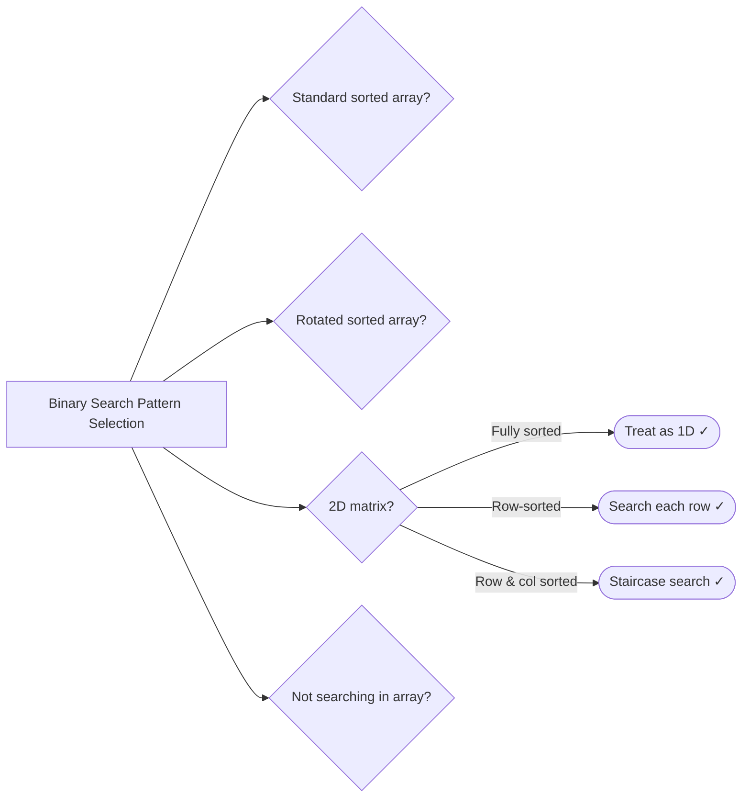

# 08. Binary Search

> Reduce O(n) to O(log n) by eliminating half the search space each step

---

## ELI5: Explain Like I'm 5

<div class="learner-section" markdown>

**Your task:** After implementing all patterns, explain them simply.

**Prompts to guide you:**

1. **What is binary search in one sentence?**
    - Your answer: <span class="fill-in">[Fill in after implementation]</span>

2. **Why is O(log n) so fast?**
    - Your answer: <span class="fill-in">[Fill in after implementation]</span>

3. **Real-world analogy:**
    - Example: "Binary search is like finding a word in a dictionary by opening to the middle..."
    - Your analogy: <span class="fill-in">[Fill in]</span>

4. **When does binary search work?**
    - Your answer: <span class="fill-in">[Fill in after solving problems]</span>

5. **What breaks binary search?**
    - Your answer: <span class="fill-in">[Fill in after testing]</span>

</div>

---

## Quick Quiz (Do BEFORE implementing)

<div class="learner-section" markdown>

**Your task:** Test your intuition without looking at code. Answer these, then verify after implementation.

### Complexity Predictions

1. **Linear search through entire array:**
    - Time complexity: <span class="fill-in">[Your guess: O(?)]</span>
    - Verified after learning: <span class="fill-in">[Actual: O(?)]</span>

2. **Binary search in sorted array:**
    - Time complexity: <span class="fill-in">[Your guess: O(?)]</span>
    - Space complexity: <span class="fill-in">[Your guess: O(?)]</span>
    - Verified: <span class="fill-in">[Actual]</span>

3. **Speedup calculation:**
    - If n = 1,024, linear search = n = <span class="fill-in">_____</span> operations
    - Binary search = log₂(n) = <span class="fill-in">_____</span> operations
    - Speedup factor: <span class="fill-in">_____</span> times faster

### Scenario Predictions

**Scenario 1:** Find 7 in `[1, 3, 5, 7, 9, 11, 13]`

- **Can you use binary search?** <span class="fill-in">[Yes/No - Why?]</span>
- **Starting positions:** left = <span class="fill-in">___</span>, right = <span class="fill-in">___</span>
- **First mid calculation:** mid = <span class="fill-in">___</span>
- **If nums[mid] = 5 (too small), which pointer moves?** <span class="fill-in">[Left/Right - Why?]</span>
- **If nums[mid] = 9 (too big), which pointer moves?** <span class="fill-in">[Left/Right - Why?]</span>

**Scenario 2:** Find 6 in `[1, 3, 5, 7, 9, 11, 13]` (not present)

- **What will binary search return?** <span class="fill-in">[Fill in]</span>
- **What's the value of left when search ends?** <span class="fill-in">[Fill in]</span>
- **Could you use that for insert position?** <span class="fill-in">[Yes/No - Why?]</span>

**Scenario 3:** Find 8 in rotated array `[6, 7, 8, 1, 2, 3, 4, 5]`

- **Can you use classic binary search directly?** <span class="fill-in">[Yes/No - Why?]</span>
- **Which half is sorted after first mid?** <span class="fill-in">[Fill in your reasoning]</span>
- **How do you determine which half to search?** <span class="fill-in">[Fill in]</span>

### Trade-off Quiz

**Question:** When would linear search be BETTER than binary search?

- Your answer: <span class="fill-in">[Fill in before implementation]</span>
- Verified answer: <span class="fill-in">[Fill in after learning]</span>

**Question:** What's the MAIN requirement for binary search to work?

- [ ] Array must have even length
- [ ] Array must be sorted or have monotonic property
- [ ] Array must contain unique elements
- [ ] Array must be positive integers

Verify after implementation: <span class="fill-in">[Which one(s)?]</span>

**Question:** What happens if you calculate mid as `(left + right) / 2` with large numbers?

- Your answer: <span class="fill-in">[Fill in - consider integer overflow]</span>
- Verified answer: <span class="fill-in">[Fill in after learning]</span>

</div>

---

## Before/After: Why This Pattern Matters

**Your task:** Compare naive vs optimized approaches to understand the impact.

### Example: Find Target in Array

**Problem:** Find target value in a sorted array of 1 million elements.

#### Approach 1: Linear Search (Brute Force)

```java
// Naive approach - Check every element
public static int linearSearch(int[] nums, int target) {
    for (int i = 0; i < nums.length; i++) {
        if (nums[i] == target) {
            return i;
        }
    }
    return -1;
}
```

**Analysis:**

- Time: O(n) - Worst case: check all elements
- Space: O(1) - No extra space
- For n = 1,000,000: up to 1,000,000 comparisons

#### Approach 2: Binary Search (Optimized)

```java
// Optimized approach - Eliminate half each step
public static int binarySearch(int[] nums, int target) {
    int left = 0;
    int right = nums.length - 1;

    while (left <= right) {
        int mid = left + (right - left) / 2;  // Avoid overflow

        if (nums[mid] == target) return mid;
        if (nums[mid] < target) left = mid + 1;   // Search right half
        else right = mid - 1;                     // Search left half
    }

    return -1;  // Not found
}
```

**Analysis:**

- Time: O(log n) - Each step eliminates half
- Space: O(1) - No extra space
- For n = 1,000,000: only ~20 comparisons

#### Performance Comparison

| Array Size    | Linear Search (O(n)) | Binary Search (O(log n)) | Speedup |
|---------------|----------------------|--------------------------|---------|
| n = 100       | 100 ops              | 7 ops                    | 14x     |
| n = 1,000     | 1,000 ops            | 10 ops                   | 100x    |
| n = 10,000    | 10,000 ops           | 14 ops                   | 714x    |
| n = 1,000,000 | 1,000,000 ops        | 20 ops                   | 50,000x |

**Your calculation:** For n = 16,384, binary search needs _____ comparisons.

#### Why Does Binary Search Work?

**Key insight to understand:**

In a sorted array `[1, 3, 5, 7, 9, 11, 13]` looking for 7:

```
Step 1: left=0, right=6, mid=3, nums[3]=7 → FOUND!
```

If we were looking for 11:

```
Step 1: left=0, right=6, mid=3, nums[3]=7 (too small)
        → Move left=4 because target must be in right half

Step 2: left=4, right=6, mid=5, nums[5]=11 → FOUND!
```

**Why can we eliminate half?**

- Array is sorted, so all values to the left of mid are ≤ nums[mid]
- All values to the right of mid are ≥ nums[mid]
- If target > nums[mid], it CANNOT be in the left half
- If target < nums[mid], it CANNOT be in the right half
- So each comparison eliminates half the remaining elements!

**Logarithmic growth visualization:**

```
n = 1,024 → log₂(1,024) = 10 steps
n = 2,048 → log₂(2,048) = 11 steps  (doubled n, only +1 step!)
n = 1,048,576 → log₂(1,048,576) = 20 steps
```

**After implementing, explain in your own words:**

<div class="learner-section" markdown>

- Why is O(log n) so much faster than O(n)? <span class="fill-in">[Your answer]</span>
- What property of sorted arrays makes this possible? <span class="fill-in">[Your answer]</span>
- What happens at each step that makes it logarithmic? <span class="fill-in">[Your answer]</span>

</div>

---

## Aside: Java's Collections.binarySearch

**Quick reference:** Understanding Java's built-in binary search helps with B+Tree implementation.

### Return Value Convention

```java
List<Integer> nums = Arrays.asList(1, 3, 5, 7, 9);

// Element FOUND → returns index
Collections.binarySearch(nums, 5);  // Returns: 2

// Element NOT FOUND → returns -(insertion point) - 1
Collections.binarySearch(nums, 6);  // Returns: -4
// Decode: insertion point = -(−4) - 1 = 3
```

**Why negative encoding?**

- Distinguishes "not found" from "found at index 0"
- Encodes where to insert to maintain sorted order

### Using with Comparators

```java
class Person {
    String name;
    int age;
}

// Search by specific field
Comparator<Person> byAge = (p1, p2) -> Integer.compare(p1.age, p2.age);
int idx = Collections.binarySearch(people, searchKey, byAge);
```

**Key insight:** You can search by one field without exact object equality.

### Generic Implementation Pattern

```java
public static <T extends Comparable<T>> int binarySearch(List<T> list, T key) {
    int left = 0, right = list.size() - 1;

    while (left <= right) {
        int mid = left + (right - left) / 2;  // Avoid overflow
        int cmp = list.get(mid).compareTo(key);

        if (cmp == 0) return mid;              // Found
        else if (cmp < 0) left = mid + 1;      // Search right
        else right = mid - 1;                  // Search left
    }

    return -(left + 1);  // Not found - encode insertion point
}
```

### Applying to B+Tree

**Finding child pointer in internal node:**

```java
class InternalNode<K extends Comparable<K>> {
    List<K> keys;           // [10, 20, 30]
    List<Node<K>> children; // [child0, child1, child2, child3]
}

private int findChildIndex(K searchKey) {
    int idx = Collections.binarySearch(keys, searchKey);

    if (idx >= 0) {
        return idx + 1;  // Key found - go to right child
    } else {
        return -(idx + 1);  // Not found - decode insertion point
    }
}
```

**Visual:** Given keys `[10, 20, 30]`, searching for `25`:

```
Children:  [<10]  [10-20)  [20-30)  [≥30]
Keys:         10      20       30
Indices:   0      1       2        3
```

Result: child index 2 (between 20 and 30)

### Common Pitfalls

```java
// ❌ WRONG: Integer overflow
int mid = (left + right) / 2;

// ✓ CORRECT: Avoids overflow
int mid = left + (right - left) / 2;

// ❌ WRONG: Misses single element case
while (left < right) { ... }

// ✓ CORRECT: Handles all cases
while (left <= right) { ... }

// ❌ WRONG: Forgets to decode
return Math.abs(idx);

// ✓ CORRECT: Properly decodes insertion point
return idx >= 0 ? idx : -(idx + 1);
```

---

## Core Implementation

### Pattern 1: Classic Binary Search

**Concept:** Search in sorted array by halving search space.

**Use case:** Find target, find insert position, find boundaries.

```java
public class ClassicBinarySearch {

    /**
     * Problem: Find target in sorted array
     * Time: O(log n), Space: O(1)
     *
     * TODO: Implement classic binary search
     */
    public static int binarySearch(int[] nums, int target) {
        // TODO: left = 0, right = nums.length - 1

        // TODO: While left <= right:
        //   mid = left + (right - left) / 2
        //   If nums[mid] == target, return mid
        //   If nums[mid] < target, left = mid + 1
        //   If nums[mid] > target, right = mid - 1

        // TODO: Return -1 if not found

        return -1; // Replace with implementation
    }

    /**
     * Problem: Find insert position for target
     * Time: O(log n), Space: O(1)
     *
     * TODO: Implement search insert position
     */
    public static int searchInsert(int[] nums, int target) {
        // TODO: Similar to binary search
        // TODO: Return left pointer when not found

        return 0; // Replace with implementation
    }

    /**
     * Problem: Find first and last position of target
     * Time: O(log n), Space: O(1)
     *
     * TODO: Implement find range
     */
    public static int[] searchRange(int[] nums, int target) {
        // TODO: Find leftmost occurrence
        // TODO: Find rightmost occurrence
        // TODO: Return [-1, -1] if not found

        return new int[]{-1, -1}; // Replace with implementation
    }

    private static int findFirst(int[] nums, int target) {
        // TODO: Binary search to find first occurrence
        // TODO: When found, continue searching left half

        return -1; // Replace with implementation
    }

    private static int findLast(int[] nums, int target) {
        // TODO: Binary search to find last occurrence
        // TODO: When found, continue searching right half

        return -1; // Replace with implementation
    }
}
```

**Runnable Client Code:**

```java
import java.util.*;

public class ClassicBinarySearchClient {

    public static void main(String[] args) {
        System.out.println("=== Classic Binary Search ===\n");

        // Test 1: Find target
        System.out.println("--- Test 1: Find Target ---");
        int[] arr = {1, 3, 5, 7, 9, 11, 13};
        int[] targets = {5, 8, 1, 13};

        System.out.println("Array: " + Arrays.toString(arr));
        for (int target : targets) {
            int index = ClassicBinarySearch.binarySearch(arr, target);
            System.out.printf("Search %d: index = %d%n", target, index);
        }

        // Test 2: Search insert position
        System.out.println("\n--- Test 2: Search Insert Position ---");
        int[] arr2 = {1, 3, 5, 6};
        int[] insertTargets = {5, 2, 7, 0};

        System.out.println("Array: " + Arrays.toString(arr2));
        for (int target : insertTargets) {
            int pos = ClassicBinarySearch.searchInsert(arr2, target);
            System.out.printf("Insert position for %d: %d%n", target, pos);
        }

        // Test 3: Find range
        System.out.println("\n--- Test 3: Find First and Last Position ---");
        int[] arr3 = {5, 7, 7, 8, 8, 8, 10};
        int rangeTarget = 8;

        System.out.println("Array: " + Arrays.toString(arr3));
        int[] range = ClassicBinarySearch.searchRange(arr3, rangeTarget);
        System.out.printf("Range for %d: [%d, %d]%n", rangeTarget, range[0], range[1]);
    }
}
```

---

### Pattern 2: Rotated Array Search

**Concept:** Search in rotated sorted array.

**Use case:** Find target in rotated array, find minimum, find rotation point.

```java
public class RotatedArraySearch {

    /**
     * Problem: Search in rotated sorted array
     * Time: O(log n), Space: O(1)
     *
     * TODO: Implement rotated array search
     */
    public static int search(int[] nums, int target) {
        // TODO: left = 0, right = nums.length - 1

        // TODO: While left <= right:
        //   mid = left + (right - left) / 2
        //   If nums[mid] == target, return mid
        //
        //   Determine which half is sorted:
        //   If nums[left] <= nums[mid]: left half sorted
        //     Check if target in left half
        //   Else: right half sorted
        //     Check if target in right half

        return -1; // Replace with implementation
    }

    /**
     * Problem: Find minimum in rotated sorted array
     * Time: O(log n), Space: O(1)
     *
     * TODO: Implement find minimum
     */
    public static int findMin(int[] nums) {
        // TODO: left = 0, right = nums.length - 1

        // TODO: While left < right:
        //   mid = left + (right - left) / 2
        //   If nums[mid] > nums[right]:
        //     Minimum is in right half: left = mid + 1
        //   Else:
        //     Minimum is in left half or mid: right = mid

        // TODO: Return nums[left]

        return 0; // Replace with implementation
    }

    /**
     * Problem: Find rotation count (how many rotations)
     * Time: O(log n), Space: O(1)
     *
     * TODO: Implement rotation count
     */
    public static int findRotationCount(int[] nums) {
        // TODO: Find index of minimum element
        // TODO: That index is the rotation count

        return 0; // Replace with implementation
    }
}
```

**Runnable Client Code:**

```java
import java.util.*;

public class RotatedArraySearchClient {

    public static void main(String[] args) {
        System.out.println("=== Rotated Array Search ===\n");

        // Test 1: Search in rotated array
        System.out.println("--- Test 1: Search in Rotated Array ---");
        int[] rotated = {4, 5, 6, 7, 0, 1, 2};
        int[] searchTargets = {0, 3, 4, 7};

        System.out.println("Rotated array: " + Arrays.toString(rotated));
        for (int target : searchTargets) {
            int index = RotatedArraySearch.search(rotated, target);
            System.out.printf("Search %d: index = %d%n", target, index);
        }

        // Test 2: Find minimum
        System.out.println("\n--- Test 2: Find Minimum ---");
        int[][] rotatedArrays = {
            {3, 4, 5, 1, 2},
            {4, 5, 6, 7, 0, 1, 2},
            {11, 13, 15, 17}
        };

        for (int[] arr : rotatedArrays) {
            int min = RotatedArraySearch.findMin(arr);
            System.out.printf("Array: %s -> Min: %d%n", Arrays.toString(arr), min);
        }

        // Test 3: Find rotation count
        System.out.println("\n--- Test 3: Find Rotation Count ---");
        for (int[] arr : rotatedArrays) {
            int count = RotatedArraySearch.findRotationCount(arr);
            System.out.printf("Array: %s -> Rotations: %d%n", Arrays.toString(arr), count);
        }
    }
}
```

---

### Pattern 3: Search in 2D Matrix

**Concept:** Binary search in matrix with sorted properties.

**Use case:** Search in row-sorted matrix, search in fully sorted matrix.

```java
public class Search2DMatrix {

    /**
     * Problem: Search in matrix where each row is sorted
     * Time: O(m log n), Space: O(1)
     *
     * TODO: Implement 2D matrix search (rows sorted)
     */
    public static boolean searchMatrix1(int[][] matrix, int target) {
        // TODO: Binary search on each row
        // TODO: Or: binary search to find row, then binary search in row

        return false; // Replace with implementation
    }

    /**
     * Problem: Search in matrix sorted like a flat array
     * Time: O(log(m*n)), Space: O(1)
     *
     * TODO: Implement 2D matrix search (fully sorted)
     */
    public static boolean searchMatrix2(int[][] matrix, int target) {
        // TODO: Treat matrix as 1D array
        // TODO: left = 0, right = rows * cols - 1
        // TODO: Convert mid to [row, col]: row = mid / cols, col = mid % cols

        return false; // Replace with implementation
    }

    /**
     * Problem: Search in matrix sorted row-wise and column-wise
     * Time: O(m + n), Space: O(1)
     *
     * TODO: Implement staircase search
     */
    public static boolean searchMatrixStaircase(int[][] matrix, int target) {
        // TODO: Start from top-right corner
        // TODO: If target < current, move left
        // TODO: If target > current, move down
        // TODO: If target == current, found

        return false; // Replace with implementation
    }
}
```

**Runnable Client Code:**

```java
public class Search2DMatrixClient {

    public static void main(String[] args) {
        System.out.println("=== Search in 2D Matrix ===\n");

        // Test 1: Search in row-sorted matrix
        System.out.println("--- Test 1: Row-Sorted Matrix ---");
        int[][] matrix1 = {
            {1, 3, 5, 7},
            {10, 11, 16, 20},
            {23, 30, 34, 60}
        };

        int[] targets1 = {3, 13, 60};
        for (int target : targets1) {
            boolean found = Search2DMatrix.searchMatrix1(matrix1, target);
            System.out.printf("Search %d: %s%n", target, found ? "FOUND" : "NOT FOUND");
        }

        // Test 2: Search in fully sorted matrix
        System.out.println("\n--- Test 2: Fully Sorted Matrix ---");
        int[][] matrix2 = {
            {1, 3, 5, 7},
            {10, 11, 16, 20},
            {23, 30, 34, 50}
        };

        int[] targets2 = {3, 13, 50};
        for (int target : targets2) {
            boolean found = Search2DMatrix.searchMatrix2(matrix2, target);
            System.out.printf("Search %d: %s%n", target, found ? "FOUND" : "NOT FOUND");
        }

        // Test 3: Staircase search
        System.out.println("\n--- Test 3: Staircase Search ---");
        int[][] matrix3 = {
            {1, 4, 7, 11},
            {2, 5, 8, 12},
            {3, 6, 9, 16},
            {10, 13, 14, 17}
        };

        int[] targets3 = {5, 20, 14};
        for (int target : targets3) {
            boolean found = Search2DMatrix.searchMatrixStaircase(matrix3, target);
            System.out.printf("Search %d: %s%n", target, found ? "FOUND" : "NOT FOUND");
        }
    }
}
```

---

### Pattern 4: Binary Search on Answer

**Concept:** Binary search on solution space, not array index.

**Use case:** Find square root, find kth smallest, capacity problems.

```java
public class BinarySearchOnAnswer {

    /**
     * Problem: Find square root (integer part)
     * Time: O(log n), Space: O(1)
     *
     * TODO: Implement integer square root
     */
    public static int mySqrt(int x) {
        // TODO: Binary search from 0 to x
        // TODO: Check if mid * mid <= x
        // TODO: Return largest mid where mid * mid <= x

        return 0; // Replace with implementation
    }

    /**
     * Problem: Find minimum capacity to ship packages in D days
     * Time: O(n log(sum)), Space: O(1)
     *
     * TODO: Implement capacity to ship
     */
    public static int shipWithinDays(int[] weights, int days) {
        // TODO: Binary search on capacity
        // TODO: left = max(weights), right = sum(weights)
        // TODO: Check if capacity allows shipping in D days

        return 0; // Replace with implementation
    }

    private static boolean canShip(int[] weights, int days, int capacity) {
        // TODO: Simulate shipping with given capacity
        // TODO: Return true if possible in D days

        return false; // Replace with implementation
    }

    /**
     * Problem: Find kth missing positive number
     * Time: O(log n), Space: O(1)
     *
     * TODO: Implement kth missing
     */
    public static int findKthPositive(int[] arr, int k) {
        // TODO: Binary search on array
        // TODO: Count missing numbers at each position

        return 0; // Replace with implementation
    }
}
```

**Runnable Client Code:**

```java
import java.util.*;

public class BinarySearchOnAnswerClient {

    public static void main(String[] args) {
        System.out.println("=== Binary Search on Answer ===\n");

        // Test 1: Square root
        System.out.println("--- Test 1: Integer Square Root ---");
        int[] sqrtInputs = {4, 8, 16, 27};

        for (int x : sqrtInputs) {
            int sqrt = BinarySearchOnAnswer.mySqrt(x);
            System.out.printf("sqrt(%d) = %d%n", x, sqrt);
        }

        // Test 2: Ship within days
        System.out.println("\n--- Test 2: Ship Within Days ---");
        int[] weights = {1, 2, 3, 4, 5, 6, 7, 8, 9, 10};
        int days = 5;

        System.out.println("Weights: " + Arrays.toString(weights));
        System.out.println("Days: " + days);
        int capacity = BinarySearchOnAnswer.shipWithinDays(weights, days);
        System.out.println("Minimum capacity: " + capacity);

        // Test 3: Kth missing positive
        System.out.println("\n--- Test 3: Kth Missing Positive ---");
        int[] arr = {2, 3, 4, 7, 11};
        int k = 5;

        System.out.println("Array: " + Arrays.toString(arr));
        System.out.println("k = " + k);
        int kthMissing = BinarySearchOnAnswer.findKthPositive(arr, k);
        System.out.println("Kth missing: " + kthMissing);
    }
}
```

---

## Debugging Challenges

**Your task:** Find and fix bugs in broken binary search implementations. This tests your understanding.

### Challenge 1: Broken Classic Binary Search

```java
/**
 * This code is supposed to find target in sorted array.
 * It has 2 BUGS. Find them!
 */
public static int binarySearch_Buggy(int[] nums, int target) {
    int left = 0;
    int right = nums.length;
    while (left <= right) {
        int mid = (left + right) / 2;
        if (nums[mid] == target) {
            return mid;
        }
        if (nums[mid] < target) {
            left = mid + 1;
        } else {
            right = mid - 1;
        }
    }

    return -1;
}
```

**Your debugging:**

- Bug 1: <span class="fill-in">[What\'s the bug?]</span>

- Bug 2: <span class="fill-in">[What\'s the bug?]</span>

<details markdown>
<summary>Click to verify your answers</summary>

**Bug 1 (Line 7):** `right` should be `nums.length - 1`, not `nums.length`. Array indices are 0-based, so valid range is
0 to length-1. Using `nums.length` will cause ArrayIndexOutOfBoundsException.

**Bug 2 (Line 10):** `(left + right) / 2` can overflow when left and right are large integers. Should use
`left + (right - left) / 2` to avoid overflow.

**Correct version:**

```java
int right = nums.length - 1;  // Fix Bug 1
int mid = left + (right - left) / 2;  // Fix Bug 2
```

</details>

---

### Challenge 2: Broken Infinite Loop

```java
/**
 * Find first occurrence of target.
 * This has 1 CRITICAL BUG that causes infinite loop.
 */
public static int findFirst_Buggy(int[] nums, int target) {
    int left = 0;
    int right = nums.length - 1;
    int result = -1;

    while (left <= right) {
        int mid = left + (right - left) / 2;

        if (nums[mid] == target) {
            result = mid;
            right = mid;        } else if (nums[mid] < target) {
            left = mid + 1;
        } else {
            right = mid - 1;
        }
    }

    return result;
}
```

**Your debugging:**

- Bug: <span class="fill-in">[What\'s the bug?]</span>

**Test case to expose the bug:**

- Input: `[5, 7, 7, 8, 8, 8, 10]`, target = 8
- Expected: index 3 (first occurrence)
- Actual: <span class="fill-in">[What happens? Trace through manually]</span>

<details markdown>
<summary>Click to verify your answer</summary>

**Bug (Line 12):** Should be `right = mid - 1`, not `right = mid`.

**Why:** When `nums[mid] == target`, we want to search the left half for an earlier occurrence. But if we set
`right = mid`, and if `mid` happens to equal `left` (when left and right differ by 1), the loop never terminates because
mid stays the same.

**Example trace with bug:**

```
nums = [5, 7, 7, 8, 8, 8, 10], target = 8
left=3, right=5, mid=4, nums[4]=8 → right=4
left=3, right=4, mid=3, nums[3]=8 → right=3
left=3, right=3, mid=3, nums[3]=8 → right=3  ← INFINITE LOOP!
```

**Correct version:**

```java
if (nums[mid] == target) {
    result = mid;
    right = mid - 1;  // Continue searching left half
}
```

</details>

---

### Challenge 3: Broken Rotated Array Search

```java
/**
 * Search in rotated sorted array.
 * This has 1 LOGIC BUG.
 */
public static int searchRotated_Buggy(int[] nums, int target) {
    int left = 0;
    int right = nums.length - 1;

    while (left <= right) {
        int mid = left + (right - left) / 2;

        if (nums[mid] == target) return mid;

        if (nums[left] < nums[mid]) {
            // Left half is sorted
            if (target >= nums[left] && target <= nums[mid]) {
                right = mid - 1;
            } else {
                left = mid + 1;
            }
        } else {
            // Right half is sorted
            if (target >= nums[mid] && target <= nums[right]) {
                left = mid + 1;
            } else {
                right = mid - 1;
            }
        }
    }

    return -1;
}
```

**Your debugging:**

- **Bug:** <span class="fill-in">[What's the logic error in the left-sorted check?]</span>
- **Example:** Test with `[3, 1]`, target = 1
    - Step 1: left=0, right=1, mid=0, nums[0]=3, nums[1]=1
    - nums[left] < nums[mid]? <span class="fill-in">[What happens?]</span>
    - Expected: return 1
    - Actual: <span class="fill-in">[What do you get?]</span>
- **Fix:** <span class="fill-in">[How to correct the condition?]</span>

<details markdown>
<summary>Click to verify your answer</summary>

**Bug:** Should be `nums[left] <= nums[mid]` (with equals), not `nums[left] < nums[mid]`.

**Why:** When left == mid (happens when there are only 2 elements left and mid rounds down), the condition
`nums[left] < nums[mid]` is false (3 is not < 3), so we incorrectly assume the right half is sorted.

**Example trace with bug:**

```
nums = [3, 1], target = 1
left=0, right=1, mid=0
nums[left]=3, nums[mid]=3
3 < 3? FALSE → assumes right half sorted
target=1 >= nums[mid]=3? FALSE
→ right = mid - 1 = -1
→ loop ends, returns -1 (WRONG!)
```

**Correct version:**

```java
if (nums[left] <= nums[mid]) {  // Include equals case
    // Left half is sorted
    if (target >= nums[left] && target < nums[mid]) {  // Also: < not <=
        right = mid - 1;
    } else {
        left = mid + 1;
    }
}
```

</details>

---

### Challenge 4: Wrong Mid Calculation in Search Insert

```java
/**
 * Find insert position for target.
 * This produces WRONG results.
 */
public static int searchInsert_Buggy(int[] nums, int target) {
    int left = 0;
    int right = nums.length - 1;

    while (left < right) {        int mid = left + (right - left) / 2;

        if (nums[mid] == target) {
            return mid;
        } else if (nums[mid] < target) {
            left = mid + 1;
        } else {
            right = mid - 1;
        }
    }

    return left;}
```

**Your debugging:**

- **Bug 1:** <span class="fill-in">[Should loop condition be `<` or `<=`?]</span>
- **Bug 2:** <span class="fill-in">[What if target should go after all elements?]</span>
- **Example:** Input `[1, 3, 5]`, target = 4
    - Expected: 2 (insert between 3 and 5)
    - Trace through: <span class="fill-in">[What do you get?]</span>
- **Example:** Input `[1, 3, 5]`, target = 6
    - Expected: 3 (insert at end)
    - Trace through: <span class="fill-in">[What do you get?]</span>
- **Fix:** <span class="fill-in">[How to handle both cases correctly?]</span>

<details markdown>
<summary>Click to verify your answer</summary>

**Bug:** The loop condition and pointer updates don't work together correctly.

**Two correct approaches:**

**Approach 1: Use `left <= right`**

```java
while (left <= right) {
    int mid = left + (right - left) / 2;
    if (nums[mid] == target) {
        return mid;
    } else if (nums[mid] < target) {
        left = mid + 1;
    } else {
        right = mid - 1;
    }
}
return left;  // left is the insert position
```

**Approach 2: Use `left < right` with different pointer update**

```java
while (left < right) {
    int mid = left + (right - left) / 2;
    if (nums[mid] < target) {
        left = mid + 1;
    } else {
        right = mid;  // Keep right at mid (don't subtract 1)
    }
}
return left;
```

**The original bug:** With `left < right` and `right = mid - 1`, we can miss the correct insert position.
</details>

---

### Challenge 5: Off-by-One in Find Minimum (Rotated Array)

```java
/**
 * Find minimum in rotated sorted array.
 * This has OFF-BY-ONE error.
 */
public static int findMin_Buggy(int[] nums) {
    int left = 0;
    int right = nums.length - 1;

    while (left < right) {
        int mid = left + (right - left) / 2;

        if (nums[mid] > nums[right]) {
            left = mid;        } else {
            right = mid - 1;        }
    }

    return nums[left];
}
```

**Your debugging:**

- **Bug 1:** <span class="fill-in">[Line with `left = mid` - what's wrong?]</span>
- **Bug 2:** <span class="fill-in">[Line with `right = mid - 1` - what's wrong?]</span>
- **Example:** Input `[3, 4, 5, 1, 2]`
    - Expected: 1
    - Trace through buggy version: <span class="fill-in">[What do you get?]</span>
- **Fix:** <span class="fill-in">[Correct both pointer updates]</span>

<details markdown>
<summary>Click to verify your answer</summary>

**Bug 1:** `left = mid` should be `left = mid + 1`. When `nums[mid] > nums[right]`, the minimum is in the right half,
but NOT at mid (since nums[mid] is large), so we can safely skip mid.

**Bug 2:** `right = mid - 1` should be `right = mid`. When `nums[mid] <= nums[right]`, the minimum could BE at mid, so
we can't skip it.

**Trace with bugs:**

```
nums = [3, 4, 5, 1, 2]
left=0, right=4, mid=2, nums[2]=5, nums[4]=2
5 > 2 → left=2  (WRONG! Should be 3)
left=2, right=4, mid=3, nums[3]=1, nums[4]=2

1 > 2? NO → right=2  (WRONG! Should be 3)
left=2, right=2, loop ends
return nums[2]=5  (WRONG! Should be 1)
```

**Correct version:**

```java
if (nums[mid] > nums[right]) {
    left = mid + 1;  // Min is definitely in right half
} else {
    right = mid;     // Min could be at mid
}
```

</details>

---

### Your Debugging Scorecard

After finding and fixing all bugs:

- [ ] Found all 8+ bugs across 5 challenges
- [ ] Understood WHY each bug causes incorrect behavior
- [ ] Could explain the fix to someone else
- [ ] Learned common binary search mistakes to avoid

**Common mistakes you discovered:**

1. <span class="fill-in">[Off-by-one errors in initialization: right = length vs length-1]</span>
2. <span class="fill-in">[Integer overflow in mid calculation]</span>
3. <span class="fill-in">[Infinite loops from wrong pointer updates]</span>
4. <span class="fill-in">[Wrong loop conditions: < vs <=]</span>
5. <span class="fill-in">[Fill in more patterns you noticed]</span>

**The three most dangerous binary search bugs:**

1. **Off-by-one:** <span class="fill-in">[When does this happen?]</span>
2. **Infinite loop:** <span class="fill-in">[What causes this?]</span>
3. **Integer overflow:** <span class="fill-in">[How to prevent?]</span>

---

## Decision Framework

**Your task:** Build decision trees for binary search problems.

### Question 1: Is the data sorted?

Answer after solving problems:

- **Already sorted?** <span class="fill-in">[Classic binary search]</span>
- **Rotated?** <span class="fill-in">[Find sorted half, adjust search]</span>
- **Partially sorted?** <span class="fill-in">[Modified binary search]</span>
- **Not sorted?** <span class="fill-in">[Can't use binary search]</span>

### Question 2: What are you searching for?

**Search for value:**

- Direct search: <span class="fill-in">[Classic binary search]</span>
- First/last occurrence: <span class="fill-in">[Modified binary search]</span>

**Search for position:**

- Insert position: <span class="fill-in">[Binary search with left pointer]</span>
- Peak element: <span class="fill-in">[Binary search on local property]</span>

**Search on answer space:**

- Square root, capacity: <span class="fill-in">[Binary search on range]</span>
- Minimize/maximize: <span class="fill-in">[Binary search with validation]</span>

### Your Decision Tree



---

## Practice

### LeetCode Problems

**Easy (Complete all 4):**

- [ ] [704. Binary Search](https://leetcode.com/problems/binary-search/)
    - Pattern: <span class="fill-in">[Classic binary search]</span>
    - Your solution time: <span class="fill-in">___</span>
    - Key insight: <span class="fill-in">[Fill in after solving]</span>

- [ ] [35. Search Insert Position](https://leetcode.com/problems/search-insert-position/)
    - Pattern: <span class="fill-in">[Binary search with insert]</span>
    - Your solution time: <span class="fill-in">___</span>
    - Key insight: <span class="fill-in">[Fill in]</span>

- [ ] [69. Sqrt(x)](https://leetcode.com/problems/sqrtx/)
    - Pattern: <span class="fill-in">[Binary search on answer]</span>
    - Your solution time: <span class="fill-in">___</span>
    - Key insight: <span class="fill-in">[Fill in]</span>

- [ ] [278. First Bad Version](https://leetcode.com/problems/first-bad-version/)
    - Pattern: <span class="fill-in">[Find first occurrence]</span>
    - Your solution time: <span class="fill-in">___</span>
    - Key insight: <span class="fill-in">[Fill in]</span>

**Medium (Complete 3-4):**

- [ ] [33. Search in Rotated Sorted Array](https://leetcode.com/problems/search-in-rotated-sorted-array/)
    - Pattern: <span class="fill-in">[Rotated array]</span>
    - Difficulty: <span class="fill-in">[Rate 1-10]</span>
    - Key insight: <span class="fill-in">[Fill in]</span>

- [ ] [34. Find First and Last Position of Element in Sorted Array](https://leetcode.com/problems/find-first-and-last-position-of-element-in-sorted-array/)
    - Pattern: <span class="fill-in">[Find range]</span>
    - Difficulty: <span class="fill-in">[Rate 1-10]</span>
    - Key insight: <span class="fill-in">[Fill in]</span>

- [ ] [74. Search a 2D Matrix](https://leetcode.com/problems/search-a-2d-matrix/)
    - Pattern: <span class="fill-in">[2D binary search]</span>
    - Difficulty: <span class="fill-in">[Rate 1-10]</span>
    - Key insight: <span class="fill-in">[Fill in]</span>

- [ ] [153. Find Minimum in Rotated Sorted Array](https://leetcode.com/problems/find-minimum-in-rotated-sorted-array/)
    - Pattern: <span class="fill-in">[Find minimum]</span>
    - Difficulty: <span class="fill-in">[Rate 1-10]</span>
    - Key insight: <span class="fill-in">[Fill in]</span>

**Hard (Optional):**

- [ ] [4. Median of Two Sorted Arrays](https://leetcode.com/problems/median-of-two-sorted-arrays/)
    - Pattern: <span class="fill-in">[Binary search on two arrays]</span>
    - Key insight: <span class="fill-in">[Fill in after solving]</span>

- [ ] [410. Split Array Largest Sum](https://leetcode.com/problems/split-array-largest-sum/)
    - Pattern: <span class="fill-in">[Binary search on answer]</span>
    - Key insight: <span class="fill-in">[Fill in after solving]</span>

---

## Review Checklist

Before moving to the next topic:

- [ ] **Implementation**
    - [ ] Classic: search, insert, find range all work
    - [ ] Rotated: search and find min both work
    - [ ] 2D: all three matrix patterns work
    - [ ] On answer: sqrt, capacity, kth missing work
    - [ ] All client code runs successfully

- [ ] **Pattern Recognition**
    - [ ] Can identify when to use binary search
    - [ ] Understand sorted vs rotated arrays
    - [ ] Know when to search on answer space
    - [ ] Recognize 2D matrix patterns

- [ ] **Problem Solving**
    - [ ] Solved 4 easy problems
    - [ ] Solved 3-4 medium problems
    - [ ] Analyzed time/space complexity
    - [ ] Handled edge cases (empty, single element)

- [ ] **Understanding**
    - [ ] Filled in all ELI5 explanations
    - [ ] Built decision tree
    - [ ] Identified when NOT to use binary search
    - [ ] Can explain why O(log n) is fast

- [ ] **Mastery Check**
    - [ ] Could implement all patterns from memory
    - [ ] Could recognize pattern in new problem
    - [ ] Could explain to someone else
    - [ ] Understand off-by-one errors and how to avoid them

---

### Mastery Certification

**I certify that I can:**

- [ ] Implement classic binary search from memory
- [ ] Explain why O(log n) is fundamentally different from O(n)
- [ ] Identify and fix common binary search bugs
- [ ] Choose the correct binary search variant for new problems
- [ ] Analyze when binary search is better than alternatives
- [ ] Avoid off-by-one errors and infinite loops
- [ ] Explain the sorted/monotonic requirement clearly
- [ ] Teach this concept to someone else

**Self-assessment score:** ___/10

**If score < 8:** Review the sections where you struggled, then retry this gate.

**If score ≥ 8:** Congratulations! You've mastered binary search. Proceed to the next topic.

**Final reflection:**

- Most difficult part: <span class="fill-in">[Fill in]</span>
- Biggest "aha" moment: <span class="fill-in">[Fill in]</span>
- Pattern you'll remember most: <span class="fill-in">[Fill in]</span>
- One thing you'd explain differently to a friend: <span class="fill-in">[Fill in]</span>
