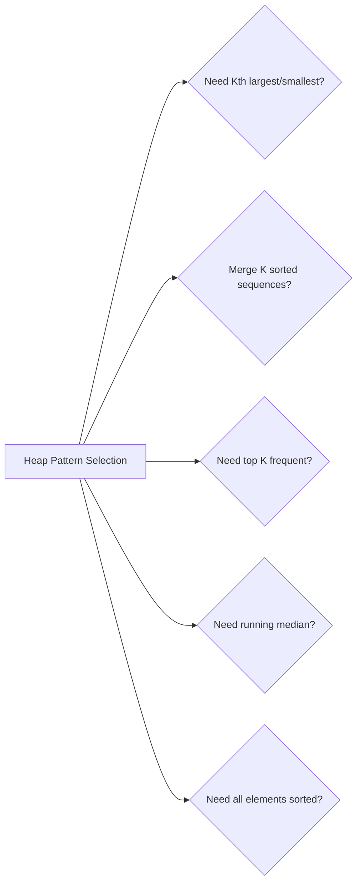

# Heaps (Priority Queues)

> O(log n) insert/delete with O(1) access to min/max element

---

## Learning Objectives

By the end of this section you should be able to:

- Explain the heap property, state the O(log n) insert/delete and O(1) peek complexities, and give the correct 0-indexed parent/child index formulas
- Implement the four core patterns: basic heap operations (Kth largest), merge K sorted sequences, top-K frequent elements, and two-heap running median
- Explain the counterintuitive rule: use a **min-heap** to find the K **largest** values and a **max-heap** to find the K **smallest** values — and give the reasoning from first principles
- Describe the two-heap median invariant (maxHeap holds the smaller half, minHeap holds the larger half, size difference at most 1) and trace the rebalancing logic for a concrete stream
- Diagnose the three most common heap bugs: using max-heap instead of min-heap for Kth largest, missing rebalancing in the two-heap median finder, and using 1-indexed parent/child formulas in a 0-indexed array
- Compare heap vs sort vs QuickSelect for Kth largest and state when each is preferred

---

## ELI5: Explain Like I'm 5

<div class="learner-section" markdown>

**Your task:** After implementing all patterns, explain them simply.

**Prompts to guide you:**

1. **What is a heap in one sentence?**
    - Your answer: <span class="fill-in">[A heap is a tree-based data structure stored as an array where every parent is ___ than its children (min-heap) or ___ than its children (max-heap), guaranteeing that the root is always the global ___ and can be accessed in O(1)]</span>

2. **Why is it called a priority queue?**
    - Your answer: <span class="fill-in">[It is called a priority queue because items are retrieved not in insertion order but in priority order — the item with the ___ priority (min or max depending on configuration) is always at the front, so the most urgent item is always served ___ regardless of when it arrived]</span>

3. **Real-world analogy:**
    - Example: "A heap is like a hospital emergency room where patients are seen by urgency..."
    - Your analogy: <span class="fill-in">[Fill in]</span>

4. **When does this pattern work?**
    - Your answer: <span class="fill-in">[Heaps work whenever you need repeated access to the minimum or maximum of a changing set — for example finding the Kth largest in a stream (where you cannot sort first), merging K sorted sequences (where you need to pick the ___ element from K candidates at each step), or finding the running median (where you need the ___ of an unsorted stream)]</span>

5. **What's the difference between min-heap and max-heap?**
    - Your answer: <span class="fill-in">[In a min-heap every parent is smaller than its children so the ___ element is at the root; in a max-heap every parent is larger so the ___ element is at the root. Java's PriorityQueue is a min-heap by default; to get a max-heap you pass ___ as the comparator]</span>

</div>

---

## Quick Quiz (Do BEFORE implementing)

!!! tip "How to use this section"
    Write your best guess in each fill-in span **before** reading any implementation code. Your predictions do not need to be correct — the act of committing to an answer first makes the correct answer stick much better when you verify it later.

<div class="learner-section" markdown>

**Your task:** Test your intuition without looking at code. Answer these, then verify after implementation.

### Complexity Predictions

1. **Finding Kth largest using sorting:**
    - Time complexity: <span class="fill-in">[Your guess: O(?)]</span>
    - Verified after learning: <span class="fill-in">[Actual: O(?)]</span>

2. **Finding Kth largest using min-heap of size K:**
    - Time complexity: <span class="fill-in">[Your guess: O(?)]</span>
    - Space complexity: <span class="fill-in">[Your guess: O(?)]</span>
    - Verified: <span class="fill-in">[Actual]</span>

3. **Efficiency calculation:**
    - If n = 100,000 and k = 10, sorting = n log n = <span class="fill-in">_____</span> operations
    - Heap approach = n log k = <span class="fill-in">_____</span> operations
    - Speedup factor: approximately _____ times faster

### Scenario Predictions

**Scenario 1:** Find 3rd largest in `[3, 2, 1, 5, 6, 4]`

- **Using min-heap of size 3:**
    - Which elements end up in the heap? <span class="fill-in">[Fill in]</span>
    - What is at the top of the heap? <span class="fill-in">[Fill in - is this the answer?]</span>
    - Why min-heap instead of max-heap? <span class="fill-in">[Fill in your reasoning]</span>

**Scenario 2:** Find median of stream `[5, 15, 1, 3]`

- **Using two heaps:**
    - After adding 5: maxHeap = <span class="fill-in">___</span>, minHeap = <span class="fill-in">___</span>,
      median = <span class="fill-in">___</span>
    - After adding 15: maxHeap = <span class="fill-in">___</span>, minHeap = <span class="fill-in">___</span>,
      median = <span class="fill-in">___</span>
    - After adding 1: maxHeap = <span class="fill-in">___</span>, minHeap = <span class="fill-in">___</span>,
      median = <span class="fill-in">___</span>
    - After adding 3: maxHeap = <span class="fill-in">___</span>, minHeap = <span class="fill-in">___</span>,
      median = <span class="fill-in">___</span>

**Scenario 3:** Merge 3 sorted lists: `[1,4,5]`, `[1,3,4]`, `[2,6]`

- **Heap pattern applies?** <span class="fill-in">[Yes/No - Why?]</span>
- **Initial heap state:** <span class="fill-in">[Which elements start in heap?]</span>
- **After first extraction:** <span class="fill-in">[What gets removed? What gets added?]</span>

### Trade-off Quiz

**Question:** When would sorting be BETTER than heap for finding Kth largest?

- Your answer: <span class="fill-in">[Fill in before implementation]</span>
- Verified answer: <span class="fill-in">[Fill in after learning]</span>

**Question:** What's the MAIN advantage of heap over Quick Select for Kth largest?

- [ ] Heap is always faster
- [ ] Heap works with data streams
- [ ] Heap uses less space
- [ ] Heap is easier to implement

Verify after implementation: <span class="fill-in">[Which one(s)?]</span>

**Question:** For finding top K elements, why use heap of size K instead of size N?

- Your answer: <span class="fill-in">[Fill in reasoning]</span>
- Verified: <span class="fill-in">[Fill in after implementation]</span>

</div>

---

## Core Implementation

### Pattern 1: Basic Heap Operations

**Concept:** Maintain heap property through insert and extract operations.

**Use case:** Find kth largest/smallest, top K elements.

```java
import java.util.*;

public class BasicHeapOperations {

    /**
     * Problem: Find Kth largest element in array
     * Time: O(n log k), Space: O(k)
     *
     * TODO: Implement using min-heap of size k
     */
    public static int findKthLargest(int[] nums, int k) {
        // TODO: Create PriorityQueue (min-heap) of size k
        // TODO: Implement iteration/conditional logic
        // TODO: Return heap.peek() (kth largest)

        return 0; // Replace with implementation
    }

    /**
     * Problem: Find K largest elements
     * Time: O(n log k), Space: O(k)
     *
     * TODO: Implement K largest elements
     */
    public static List<Integer> kLargest(int[] nums, int k) {
        // TODO: Use min-heap of size k
        // TODO: Maintain k largest elements
        // TODO: Return heap as list

        return new ArrayList<>(); // Replace with implementation
    }

    /**
     * Problem: Sort array using heap
     * Time: O(n log n), Space: O(n)
     *
     * TODO: Implement heap sort
     */
    public static int[] heapSort(int[] nums) {
        // TODO: Add all elements to max-heap
        // TODO: Extract max repeatedly to get sorted array

        return new int[0]; // Replace with implementation
    }
}
```

!!! warning "Debugging Challenge — Max-Heap Used Where Min-Heap Is Required"
    ```java
    /**
     * This code is supposed to find the Kth largest element.
     * It has 2 BUGS. Find them!
     */
    public static int findKthLargest_Buggy(int[] nums, int k) {
        PriorityQueue<Integer> maxHeap = new PriorityQueue<>(
            Collections.reverseOrder()    );

        for (int num : nums) {
            maxHeap.offer(num);
            if (maxHeap.size() > k) {
                maxHeap.poll();        }
        }

        return maxHeap.peek();
    }
    ```

    - Bug 1: <span class="fill-in">[What's the bug?]</span>
    - **Bug 2 location:** <span class="fill-in">[Which line?]</span>
    - **Bug 2 explanation:** <span class="fill-in">[What gets removed? Is this what we want?]</span>

??? success "Answer"
    **Bug 1:** The code uses a **max-heap** (`Collections.reverseOrder()`), but a **min-heap** is required. For Kth largest
    we want to keep the K largest elements and evict the smallest intruder when the heap exceeds size K. A max-heap evicts
    the largest element, which is exactly what we want to keep — so we end up throwing away the K largest values and
    keeping small ones.

    **Bug 2:** `maxHeap.poll()` removes the **largest** element (the root of a max-heap). We want to remove the **smallest**
    among the K candidates so that the K **largest** remain. The correct data structure is a min-heap (no comparator needed
    in Java's `PriorityQueue`), and then `poll()` removes the smallest element, which is what we want to evict.

    **Fixed code:**
    ```java
    PriorityQueue<Integer> minHeap = new PriorityQueue<>();  // min-heap

    for (int num : nums) {
        minHeap.offer(num);
        if (minHeap.size() > k) {
            minHeap.poll();  // Remove smallest — keeps K largest
        }
    }
    return minHeap.peek();  // Smallest of the K largest = Kth largest
    ```

**Runnable Client Code:**

```java
import java.util.*;

public class BasicHeapOperationsClient {

    public static void main(String[] args) {
        System.out.println("=== Basic Heap Operations ===\n");

        // Test 1: Kth largest
        System.out.println("--- Test 1: Kth Largest ---");
        int[] arr = {3, 2, 1, 5, 6, 4};
        int k = 2;

        System.out.println("Array: " + Arrays.toString(arr));
        System.out.println("k = " + k);
        int kthLargest = BasicHeapOperations.findKthLargest(arr, k);
        System.out.println("Kth largest: " + kthLargest);

        // Test 2: K largest elements
        System.out.println("\n--- Test 2: K Largest Elements ---");
        int[] arr2 = {3, 2, 3, 1, 2, 4, 5, 5, 6};
        k = 4;

        System.out.println("Array: " + Arrays.toString(arr2));
        System.out.println("k = " + k);
        List<Integer> kLargest = BasicHeapOperations.kLargest(arr2, k);
        System.out.println("K largest: " + kLargest);

        // Test 3: Heap sort
        System.out.println("\n--- Test 3: Heap Sort ---");
        int[] arr3 = {5, 2, 8, 1, 9, 3};
        System.out.println("Before: " + Arrays.toString(arr3));
        int[] sorted = BasicHeapOperations.heapSort(arr3);
        System.out.println("After:  " + Arrays.toString(sorted));
    }
}
```

---

### Pattern 2: Merge K Sorted Lists/Arrays

**Concept:** Use min-heap to merge multiple sorted sequences efficiently.

**Use case:** Merge K sorted lists, merge K sorted arrays.

```java
import java.util.*;

public class MergeKSorted {

    static class ListNode {
        int val;
        ListNode next;

        ListNode(int val) {
            this.val = val;
        }
    }

    /**
     * Problem: Merge K sorted linked lists
     * Time: O(n log k), Space: O(k) where n = total nodes, k = lists
     *
     * TODO: Implement using min-heap
     */
    public static ListNode mergeKLists(ListNode[] lists) {
        // TODO: Create min-heap with comparator on node.val
        // TODO: Add first node from each list to heap
        // TODO: Implement iteration/conditional logic

        return null; // Replace with implementation
    }

    /**
     * Problem: Merge K sorted arrays
     * Time: O(n log k), Space: O(k)
     *
     * TODO: Implement using min-heap with array indices
     */
    public static List<Integer> mergeKArrays(int[][] arrays) {
        // TODO: Create heap with [value, arrayIndex, elementIndex]
        // TODO: Add first element from each array
        // TODO: Extract min and add next from same array

        return new ArrayList<>(); // Replace with implementation
    }

    /**
     * Problem: Find smallest range covering elements from K lists
     * Time: O(n log k), Space: O(k)
     *
     * TODO: Implement using heap tracking max
     */
    public static int[] smallestRange(List<List<Integer>> nums) {
        // TODO: Use min-heap, track current max
        // TODO: Range = [heap.peek(), currentMax]
        // TODO: Minimize range size

        return new int[]{0, 0}; // Replace with implementation
    }

    // Helper: Create linked list from array
    static ListNode createList(int[] values) {
        if (values.length == 0) return null;
        ListNode head = new ListNode(values[0]);
        ListNode current = head;
        for (int i = 1; i < values.length; i++) {
            current.next = new ListNode(values[i]);
            current = current.next;
        }
        return head;
    }

    // Helper: Print linked list
    static void printList(ListNode head) {
        ListNode current = head;
        while (current != null) {
            System.out.print(current.val);
            if (current.next != null) System.out.print(" -> ");
            current = current.next;
        }
        System.out.println();
    }
}
```

**Runnable Client Code:**

```java
import java.util.*;

public class MergeKSortedClient {

    public static void main(String[] args) {
        System.out.println("=== Merge K Sorted ===\n");

        // Test 1: Merge K lists
        System.out.println("--- Test 1: Merge K Linked Lists ---");
        ListNode[] lists = new ListNode[3];
        lists[0] = MergeKSorted.createList(new int[]{1, 4, 5});
        lists[1] = MergeKSorted.createList(new int[]{1, 3, 4});
        lists[2] = MergeKSorted.createList(new int[]{2, 6});

        System.out.println("List 1: ");
        MergeKSorted.printList(lists[0]);
        System.out.println("List 2: ");
        MergeKSorted.printList(lists[1]);
        System.out.println("List 3: ");
        MergeKSorted.printList(lists[2]);

        ListNode merged = MergeKSorted.mergeKLists(lists);
        System.out.print("Merged: ");
        MergeKSorted.printList(merged);

        // Test 2: Merge K arrays
        System.out.println("\n--- Test 2: Merge K Arrays ---");
        int[][] arrays = {
            {1, 3, 5, 7},
            {2, 4, 6, 8},
            {0, 9, 10, 11}
        };

        for (int i = 0; i < arrays.length; i++) {
            System.out.println("Array " + (i + 1) + ": " + Arrays.toString(arrays[i]));
        }

        List<Integer> mergedArray = MergeKSorted.mergeKArrays(arrays);
        System.out.println("Merged: " + mergedArray);

        // Test 3: Smallest range
        System.out.println("\n--- Test 3: Smallest Range ---");
        List<List<Integer>> nums = Arrays.asList(
            Arrays.asList(4, 10, 15, 24, 26),
            Arrays.asList(0, 9, 12, 20),
            Arrays.asList(5, 18, 22, 30)
        );

        System.out.println("Lists: " + nums);
        int[] range = MergeKSorted.smallestRange(nums);
        System.out.println("Smallest range: [" + range[0] + ", " + range[1] + "]");
    }
}
```

---

### Pattern 3: Top K Frequent Elements

**Concept:** Use heap to find most/least frequent elements.

**Use case:** Top K frequent elements, sort by frequency.

```java
import java.util.*;

public class TopKFrequent {

    /**
     * Problem: Find K most frequent elements
     * Time: O(n log k), Space: O(n)
     *
     * TODO: Implement using frequency map + min-heap
     */
    public static List<Integer> topKFrequent(int[] nums, int k) {
        // TODO: Count frequencies with HashMap
        // TODO: Create min-heap of size k, ordered by frequency
        // TODO: Implement iteration/conditional logic
        // TODO: Return heap contents

        return new ArrayList<>(); // Replace with implementation
    }

    /**
     * Problem: Sort array by frequency
     * Time: O(n log n), Space: O(n)
     *
     * TODO: Implement frequency sort
     */
    public static int[] frequencySort(int[] nums) {
        // TODO: Count frequencies
        // TODO: Sort by frequency (descending), then by value (ascending)

        return new int[0]; // Replace with implementation
    }

    /**
     * Problem: K closest points to origin
     * Time: O(n log k), Space: O(k)
     *
     * TODO: Implement using max-heap of size k
     */
    public static int[][] kClosest(int[][] points, int k) {
        // TODO: Create max-heap ordered by distance
        // TODO: Maintain k closest points
        // TODO: Distance = x^2 + y^2 (no need for sqrt)

        return new int[0][0]; // Replace with implementation
    }
}
```

**Runnable Client Code:**

```java
import java.util.*;

public class TopKFrequentClient {

    public static void main(String[] args) {
        System.out.println("=== Top K Frequent ===\n");

        // Test 1: Top K frequent
        System.out.println("--- Test 1: Top K Frequent ---");
        int[] arr = {1, 1, 1, 2, 2, 3};
        int k = 2;

        System.out.println("Array: " + Arrays.toString(arr));
        System.out.println("k = " + k);
        List<Integer> topK = TopKFrequent.topKFrequent(arr, k);
        System.out.println("Top K frequent: " + topK);

        // Test 2: Frequency sort
        System.out.println("\n--- Test 2: Frequency Sort ---");
        int[] arr2 = {1, 1, 2, 2, 2, 3};
        System.out.println("Before: " + Arrays.toString(arr2));
        int[] sorted = TopKFrequent.frequencySort(arr2);
        System.out.println("After:  " + Arrays.toString(sorted));

        // Test 3: K closest points
        System.out.println("\n--- Test 3: K Closest Points ---");
        int[][] points = {{1, 3}, {-2, 2}, {5, 8}, {0, 1}};
        k = 2;

        System.out.println("Points:");
        for (int[] point : points) {
            System.out.println("  " + Arrays.toString(point));
        }
        System.out.println("k = " + k);

        int[][] closest = TopKFrequent.kClosest(points, k);
        System.out.println("K closest points:");
        for (int[] point : closest) {
            System.out.println("  " + Arrays.toString(point));
        }
    }
}
```

---

### Pattern 4: Two Heaps (Find Median)

**Concept:** Use two heaps to maintain running median.

**Use case:** Find median from data stream, sliding window median.

```java
import java.util.*;

public class TwoHeaps {

    /**
     * MedianFinder: Maintain running median
     * Time: O(log n) insert, O(1) find median
     * Space: O(n)
     *
     * TODO: Implement using two heaps
     */
    static class MedianFinder {
        // TODO: maxHeap stores smaller half (max at top)
        // TODO: minHeap stores larger half (min at top)
        // TODO: Keep heaps balanced: |size difference| <= 1

        public MedianFinder() {
            // TODO: Initialize PriorityQueue for max-heap (reverse order)
            // TODO: Initialize PriorityQueue for min-heap (natural order)
        }

        public void addNum(int num) {
            // TODO: Add to appropriate heap
            // TODO: Balance heaps if needed
            // Hint: Always add to maxHeap first, then move to minHeap if needed
        }

        public double findMedian() {
            // TODO: Implement iteration/conditional logic
            // TODO: Implement iteration/conditional logic
            return 0.0; // Replace with implementation
        }
    }

    /**
     * Problem: Sliding window median
     * Time: O(n * k), Space: O(k)
     *
     * TODO: Implement sliding window median
     */
    public static double[] medianSlidingWindow(int[] nums, int k) {
        // TODO: Use two heaps approach
        // TODO: Handle removal from window
        // Note: This is complex - use TreeMap or simpler approach

        return new double[0]; // Replace with implementation
    }
}
```

**Runnable Client Code:**

```java
import java.util.*;

public class TwoHeapsClient {

    public static void main(String[] args) {
        System.out.println("=== Two Heaps ===\n");

        // Test 1: Median finder
        System.out.println("--- Test 1: Find Median from Data Stream ---");
        TwoHeaps.MedianFinder mf = new TwoHeaps.MedianFinder();

        int[] stream = {1, 2, 3, 4, 5};
        System.out.println("Data stream: " + Arrays.toString(stream));
        System.out.println("Median after each insertion:");

        for (int num : stream) {
            mf.addNum(num);
            System.out.printf("  After adding %d: %.1f%n", num, mf.findMedian());
        }

        // Test 2: Another stream
        System.out.println("\n--- Test 2: Another Stream ---");
        TwoHeaps.MedianFinder mf2 = new TwoHeaps.MedianFinder();
        int[] stream2 = {5, 15, 1, 3};

        System.out.println("Data stream: " + Arrays.toString(stream2));
        System.out.println("Median after each insertion:");

        for (int num : stream2) {
            mf2.addNum(num);
            System.out.printf("  After adding %d: %.1f%n", num, mf2.findMedian());
        }

        // Test 3: Sliding window median
        System.out.println("\n--- Test 3: Sliding Window Median ---");
        int[] arr = {1, 3, -1, -3, 5, 3, 6, 7};
        int k = 3;

        System.out.println("Array: " + Arrays.toString(arr));
        System.out.println("Window size: " + k);
        double[] medians = TwoHeaps.medianSlidingWindow(arr, k);
        System.out.println("Medians: " + Arrays.toString(medians));
    }
}
```

---

!!! info "Loop back"
    Now that you have implemented all four patterns, return to the **ELI5** section and fill in prompts 1, 2, and 5. Focus especially on prompt 5: confirm you can articulate the min-heap vs max-heap rule in both directions (K largest → min-heap; K smallest → max-heap) and explain from first principles why each is correct. Then return to the **Quick Quiz** and verify your complexity predictions for the O(n log k) heap approach vs the O(n log n) sort approach.

---

## Before/After: Why This Pattern Matters

**Your task:** Compare naive vs optimized approaches to understand the impact.

### Example 1: Find Kth Largest Element

**Problem:** Find the Kth largest element in an unsorted array.

#### Approach 1: Sorting (Simple but Inefficient)

```java
// Naive approach - Sort entire array
public static int findKthLargest_Sorting(int[] nums, int k) {
    Arrays.sort(nums);  // Sort ascending
    return nums[nums.length - k];  // Kth largest
}
```

**Analysis:**

- Time: O(n log n) - Must sort all n elements
- Space: O(1) or O(log n) depending on sort algorithm
- For n = 100,000: ~1,600,000 operations

#### Approach 2: Min-Heap of Size K (Optimized)

```java
// Optimized approach - Maintain heap of K largest elements
public static int findKthLargest_Heap(int[] nums, int k) {
    PriorityQueue<Integer> minHeap = new PriorityQueue<>();

    for (int num : nums) {
        minHeap.offer(num);
        if (minHeap.size() > k) {
            minHeap.poll();  // Remove smallest
        }
    }

    return minHeap.peek();  // Kth largest at top
}
```

**Analysis:**

- Time: O(n log k) - n insertions, each log k operations
- Space: O(k) - Only store K elements
- For n = 100,000, k = 10: ~166,000 operations

#### Performance Comparison

| Array Size (n) | k   | Sorting (O(n log n)) | Heap (O(n log k)) | Speedup |
|----------------|-----|----------------------|-------------------|---------|
| n = 1,000      | 10  | ~10,000 ops          | ~3,000 ops        | 3x      |
| n = 10,000     | 10  | ~130,000 ops         | ~33,000 ops       | 4x      |
| n = 100,000    | 100 | ~1,600,000 ops       | ~660,000 ops      | 2.4x    |

**Your calculation:** For n = 50,000 and k = 50, the speedup is approximately _____ times faster.

#### Why Does Min-Heap Work for Kth LARGEST?

!!! note "The counterintuitive min-heap rule for K largest"
    For K **largest** values, use a **min**-heap of size K. The logic: we want to keep the K largest elements seen so
    far. When a new element arrives and the heap exceeds size K, we evict the smallest element (the root of the min-heap)
    — that element is not in the top K. At the end, the heap contains exactly the K largest elements, and the root is the
    smallest of them, which is the Kth largest overall. A max-heap would evict the largest element — exactly the one we
    want to keep — which is wrong.

In array `[3, 2, 1, 5, 6, 4]` looking for k=2 (2nd largest):

```
Step 1: Add 3 → Heap: [3]
Step 2: Add 2 → Heap: [2, 3] (size=2)
Step 3: Add 1 → Heap: [2, 3], size > k → remove min → Heap: [3]
Step 4: Add 5 → Heap: [3, 5]
Step 5: Add 6 → Heap: [3, 5], size > k → remove min → Heap: [5, 6]
Step 6: Add 4 → Heap: [4, 5, 6], remove min → Heap: [5, 6]

Answer: heap.peek() = 5 (2nd largest)
```

**After implementing, explain in your own words:**

<div class="learner-section" markdown>

- Why does removing the minimum preserve the K largest elements? <span class="fill-in">[Your answer]</span>
- What would happen with a max-heap instead? <span class="fill-in">[Your answer]</span>

</div>

---

### Example 2: Finding Running Median

**Problem:** Maintain the median as numbers are added one by one.

#### Approach 1: Sort Every Time (Inefficient)

```java
// Naive approach - Re-sort after each insertion
public static class MedianFinder_Sorting {
    private List<Integer> list = new ArrayList<>();

    public void addNum(int num) {
        list.add(num);
        Collections.sort(list);  // Re-sort entire list!
    }

    public double findMedian() {
        int n = list.size();
        if (n % 2 == 1) {
            return list.get(n / 2);
        } else {
            return (list.get(n / 2 - 1) + list.get(n / 2)) / 2.0;
        }
    }
}
```

**Analysis:**

- Time: O(n log n) per insertion due to sorting
- Space: O(n)
- For 10,000 insertions: ~100,000,000 total operations

#### Approach 2: Two Heaps (Optimized)

```java
// Optimized approach - Two heaps maintain balance
public static class MedianFinder_TwoHeaps {
    private PriorityQueue<Integer> maxHeap;  // Smaller half
    private PriorityQueue<Integer> minHeap;  // Larger half

    public MedianFinder_TwoHeaps() {
        maxHeap = new PriorityQueue<>(Collections.reverseOrder());
        minHeap = new PriorityQueue<>();
    }

    public void addNum(int num) {
        maxHeap.offer(num);
        minHeap.offer(maxHeap.poll());

        if (maxHeap.size() < minHeap.size()) {
            maxHeap.offer(minHeap.poll());
        }
    }

    public double findMedian() {
        if (maxHeap.size() > minHeap.size()) {
            return maxHeap.peek();
        }
        return (maxHeap.peek() + minHeap.peek()) / 2.0;
    }
}
```

**Analysis:**

- Time: O(log n) per insertion
- Space: O(n)
- For 10,000 insertions: ~130,000 total operations

#### Performance Comparison

| Number of Elements | Sorting (O(n²log n) total) | Two Heaps (O(n log n) total) | Speedup |
|--------------------|----------------------------|------------------------------|---------|
| n = 100            | ~66,000 ops                | ~700 ops                     | 94x     |
| n = 1,000          | ~10,000,000 ops            | ~10,000 ops                  | 1,000x  |
| n = 10,000         | ~1,300,000,000 ops         | ~130,000 ops                 | 10,000x |

**Your calculation:** For n = 5,000 elements, the speedup is approximately _____ times faster.

#### Why Do Two Heaps Work?

**Key insight:**

```
Stream: [5, 15, 1, 3]

Add 5:  maxHeap=[5], minHeap=[] → Median = 5
Add 15: maxHeap=[5], minHeap=[15] → Median = (5+15)/2 = 10
Add 1:  maxHeap=[5,1], minHeap=[15] → Median = 5
Add 3:  maxHeap=[5,3,1], minHeap=[15] → rebalance → maxHeap=[5,3], minHeap=[15]
        → Median = (5+15)/2 = 10
```

**Invariant maintained:**

- maxHeap contains smaller half (max element on top)
- minHeap contains larger half (min element on top)
- Size difference ≤ 1
- Median is at the top(s)!

**After implementing, explain in your own words:**

<div class="learner-section" markdown>

- Why do we need both heaps instead of just sorting? <span class="fill-in">[Your answer]</span>
- How does keeping them balanced help find median quickly? <span class="fill-in">[Your answer]</span>

</div>

---

## Common Misconceptions

!!! warning "Misconception 1: Use max-heap to find the K largest elements"
    This is backwards. For K **largest**, use a **min**-heap of size K. The min-heap evicts the smallest candidate when it
    overflows, preserving the K largest. A max-heap evicts the largest candidate, which destroys the very elements you are
    trying to keep. The rule generalises: for K smallest, use a max-heap of size K (evict the largest intruder, preserve
    the K smallest). The pattern is always "evict the one that doesn't belong, keep the K that do."

!!! warning "Misconception 2: The two-heap median finder does not need rebalancing"
    If you add numbers without rebalancing, one heap can grow arbitrarily larger than the other. When the sizes diverge by
    more than 1, the median calculation is wrong. The rebalancing logic (`if (maxHeap.size() > minHeap.size() + 1)
    minHeap.offer(maxHeap.poll())`) must run after every insertion. A common shortcut — always add to maxHeap first and
    then move the root to minHeap — handles most cases, but still requires checking that maxHeap stays at least as large
    as minHeap.

!!! warning "Misconception 3: 0-indexed and 1-indexed heap formulas are interchangeable"
    The two sets of formulas differ by exactly 1, and mixing them causes subtle off-by-one bugs that may not surface until
    edge cases. For a **0-indexed** array: `parent(i) = (i - 1) / 2`, `leftChild(i) = 2*i + 1`, `rightChild(i) = 2*i + 2`.
    For a **1-indexed** array: `parent(i) = i / 2`, `leftChild(i) = 2*i`, `rightChild(i) = 2*i + 1`. Java's
    `PriorityQueue` handles indexing internally so you rarely write these formulas directly — but if you implement a heap
    manually, decide on the indexing scheme first and use it consistently throughout.

---

## Decision Framework

<div class="learner-section" markdown>

**Your task:** Build decision trees for when to use heaps.

### Question 1: What do you need to track?

Answer after solving problems:

- **Need min/max element repeatedly?** <span class="fill-in">[Use heap]</span>
- **Need Kth largest/smallest?** <span class="fill-in">[Use heap of size K]</span>
- **Need median?** <span class="fill-in">[Use two heaps]</span>
- **Your observation:** <span class="fill-in">[Fill in based on testing]</span>

### Question 2: What are the time/space trade-offs?

Answer for each pattern:

**Basic heap operations:**

- Time complexity: <span class="fill-in">[Insert? Extract? Peek?]</span>
- Space complexity: <span class="fill-in">[How much space?]</span>
- Best use cases: <span class="fill-in">[List problems you solved]</span>

**Merge K sorted:**

- Time complexity: <span class="fill-in">[Compare to merge two at a time]</span>
- Space complexity: <span class="fill-in">[Just heap or output too?]</span>
- Best use cases: <span class="fill-in">[List problems you solved]</span>

**Top K frequent:**

- Time complexity: <span class="fill-in">[Why log k not log n?]</span>
- Space complexity: <span class="fill-in">[Frequency map + heap]</span>
- Best use cases: <span class="fill-in">[List problems you solved]</span>

**Two heaps:**

- Time complexity: <span class="fill-in">[Insert? Find median?]</span>
- Space complexity: <span class="fill-in">[Both heaps needed?]</span>
- Best use cases: <span class="fill-in">[List problems you solved]</span>

### Your Decision Tree

Build this after solving practice problems:


</div>

---

## Practice

<div class="learner-section" markdown>

### LeetCode Problems

**Easy (Complete all 3):**

- [ ] [703. Kth Largest Element in a Stream](https://leetcode.com/problems/kth-largest-element-in-a-stream/)
    - Pattern: <span class="fill-in">[Min-heap of size K]</span>
    - Your solution time: <span class="fill-in">___</span>
    - Key insight: <span class="fill-in">[Fill in after solving]</span>

- [ ] [1046. Last Stone Weight](https://leetcode.com/problems/last-stone-weight/)
    - Pattern: <span class="fill-in">[Max-heap simulation]</span>
    - Your solution time: <span class="fill-in">___</span>
    - Key insight: <span class="fill-in">[Fill in]</span>

- [ ] [1337. The K Weakest Rows in a Matrix](https://leetcode.com/problems/the-k-weakest-rows-in-a-matrix/)
    - Pattern: <span class="fill-in">[Heap with custom comparator]</span>
    - Your solution time: <span class="fill-in">___</span>
    - Key insight: <span class="fill-in">[Fill in]</span>

**Medium (Complete 3-4):**

- [ ] [215. Kth Largest Element in an Array](https://leetcode.com/problems/kth-largest-element-in-an-array/)
    - Pattern: <span class="fill-in">[Min-heap approach]</span>
    - Difficulty: <span class="fill-in">[Rate 1-10]</span>
    - Key insight: <span class="fill-in">[Fill in]</span>

- [ ] [347. Top K Frequent Elements](https://leetcode.com/problems/top-k-frequent-elements/)
    - Pattern: <span class="fill-in">[Frequency + heap]</span>
    - Difficulty: <span class="fill-in">[Rate 1-10]</span>
    - Key insight: <span class="fill-in">[Fill in]</span>

- [ ] [973. K Closest Points to Origin](https://leetcode.com/problems/k-closest-points-to-origin/)
    - Pattern: <span class="fill-in">[Max-heap of size K]</span>
    - Difficulty: <span class="fill-in">[Rate 1-10]</span>
    - Key insight: <span class="fill-in">[Fill in]</span>

- [ ] [295. Find Median from Data Stream](https://leetcode.com/problems/find-median-from-data-stream/)
    - Pattern: <span class="fill-in">[Two heaps]</span>
    - Difficulty: <span class="fill-in">[Rate 1-10]</span>
    - Key insight: <span class="fill-in">[Fill in]</span>

**Hard (Optional):**

- [ ] [23. Merge k Sorted Lists](https://leetcode.com/problems/merge-k-sorted-lists/)
    - Pattern: <span class="fill-in">[Min-heap with K nodes]</span>
    - Key insight: <span class="fill-in">[Fill in after solving]</span>

- [ ] [480. Sliding Window Median](https://leetcode.com/problems/sliding-window-median/)
    - Pattern: <span class="fill-in">[Two heaps with removal]</span>
    - Key insight: <span class="fill-in">[Fill in after solving]</span>

**Failure modes:**

- What happens if all elements in the array are equal and you run the Kth largest algorithm — does the min-heap of size K still return the correct answer? <span class="fill-in">[Fill in]</span>
- How does your implementation behave when k > n (k is larger than the total number of elements) in a top-K problem? <span class="fill-in">[Fill in]</span>

</div>

---

## Test Your Understanding

1. The min-heap-for-K-largest rule feels counterintuitive. Prove it is correct from first principles: state what invariant the heap maintains after each element is processed, show that the invariant holds after processing element i+1 given that it held after element i, and explain why `heap.peek()` at the end of the loop is exactly the Kth largest element.

    ??? success "Rubric"
        A complete answer addresses: (1) the invariant — after processing each element, the min-heap of size K contains exactly the K largest elements seen so far, with the smallest of those K at the root; (2) the inductive step — when a new element arrives, if it is larger than the root (heap's current minimum), it replaces the root via poll+offer, maintaining the invariant; if it is smaller or equal, it is discarded by the overflow eviction, also maintaining the invariant; (3) at the end, the root is the smallest of the K largest elements seen, which by definition is the Kth largest overall.

2. The two-heap median algorithm uses this insertion strategy: always add to maxHeap first, then move the root to minHeap; then if maxHeap is smaller than minHeap, move the root of minHeap back. Trace this algorithm on the stream `[5, 15, 1, 3]` step by step, showing the state of both heaps and the median after each insertion. Then explain what invariant guarantees that `findMedian()` is always correct.

    ??? success "Rubric"
        A complete answer addresses: (1) the traced states — add 5: maxHeap=[5], minHeap=[], median=5.0; add 15: maxHeap=[5], minHeap=[15], median=10.0; add 1: maxHeap=[5,1], minHeap=[15], median=5.0; add 3: maxHeap=[5,3,1], minHeap=[15], rebalance → maxHeap=[5,3], minHeap=[15] does NOT match — correct trace shows maxHeap=[5,3], minHeap=[15] is still unbalanced, so move 5 to minHeap, giving maxHeap=[3], minHeap=[5,15], then rebalance back to maxHeap=[5,3], minHeap=[15]; (2) the invariant — all elements in maxHeap ≤ all elements in minHeap, and |maxHeap.size() - minHeap.size()| ≤ 1; (3) why this guarantees correctness — when sizes are equal the median is the average of the two roots; when maxHeap is larger by 1 it holds the middle element.

3. `mergeKLists` achieves O(n log k) time by using a min-heap of size K. Explain why merging K sorted lists by repeatedly merging two lists at a time (K-1 merge operations) gives O(nK) time in the worst case, and confirm that the heap approach is strictly better when K is large relative to n.

    ??? success "Rubric"
        A complete answer addresses: (1) the naive analysis — the first merge combines two lists of size n/K each (O(n/K)), the second merge combines the result with the next list (O(2n/K)), and so on; summing gives O(n/K + 2n/K + ... + n) = O(nK/2) = O(nK); (2) the heap analysis — each of the n total elements is inserted into and extracted from the heap once, each operation costing O(log k), giving O(n log k) total; (3) the comparison — O(n log k) < O(nK) when log k < K, which is true for all K ≥ 2, so the heap is always better or equal, and dramatically better as K grows.

4. The 0-indexed heap formulas are `parent(i) = (i-1)/2`, `leftChild(i) = 2*i+1`, `rightChild(i) = 2*i+2`. Verify these formulas for the first 7 positions (indices 0–6) by drawing the heap tree and confirming that each formula gives the correct index. Then show what happens if you accidentally use the 1-indexed formula `parent(i) = i/2` on a 0-indexed array (what incorrect parent does node 2 compute?).

    ??? success "Rubric"
        A complete answer addresses: (1) verification for indices 0–6 — index 0 is root (no parent), children are 1 and 2; index 1's parent is (1-1)/2=0, children are 3 and 4; index 2's parent is (2-1)/2=0, children are 5 and 6; (2) the bug — with the 1-indexed formula on a 0-indexed array, node at index 2 computes parent as 2/2=1, but the actual parent is at index 0; this means sift-up operations compare against the wrong node and the heap property may be violated without any error being thrown; (3) the root cause — 1-indexed arrays waste index 0, enabling the clean division-by-2 formula, but 0-indexed arrays shift all indices down by 1, requiring the subtract-1 adjustment.

5. For "K closest points to origin" we use a max-heap (evict the farthest point when size exceeds K). Apply the same logic to a different problem: "find the K strings with the shortest length from a stream." State which heap type to use, what the comparator compares, and what the invariant maintained by the heap is. Then explain how this generalises to any "K smallest by some metric" problem.

    ??? success "Rubric"
        A complete answer addresses: (1) the heap type — a max-heap ordered by string length (longest string at root), size capped at K; (2) the comparator — `(a, b) -> b.length() - a.length()` (or `Comparator.comparingInt(String::length).reversed()`); (3) the invariant — after each insertion, the heap holds exactly the K shortest strings seen so far, with the longest of them at the root; when a new string arrives, if its length is less than the root's length, the root is evicted and the new string is added; (4) the generalisation — "K smallest by metric M" always uses a max-heap ordered by M; the root is the largest-M element among the K candidates and is the one most eligible for eviction when a better (smaller-M) element arrives.

---

## Connected Topics

!!! info "Where this topic connects"

    - **[06. Trees](06-trees.md)** — a binary heap is a complete binary tree stored as an array; sift-up and sift-down use the same parent/child index arithmetic as tree traversal → [06. Trees](06-trees.md)
    - **[11. Advanced Graphs](11-advanced-graphs.md)** — Dijkstra's shortest-path algorithm requires a min-heap (priority queue) as its core data structure → [11. Advanced Graphs](11-advanced-graphs.md)
