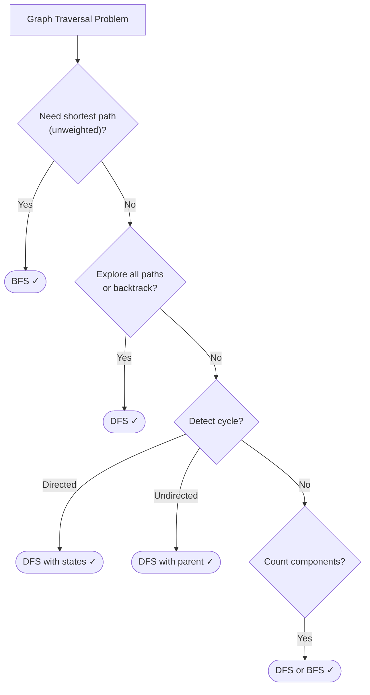

# Graphs: Traversal Patterns

> Master DFS, BFS, and cycle detection - the foundation for all graph problems

---

## ELI5: Explain Like I'm 5

<div class="learner-section" markdown>

**Your task:** After implementing all patterns, explain them simply.

**Prompts to guide you:**

1. **What is a graph in one sentence?**
    - Your answer: <span class="fill-in">[Fill in after implementation]</span>

2. **Why/when do we use graphs?**
    - Your answer: <span class="fill-in">[Fill in after implementation]</span>

3. **Real-world analogy:**
    - Example: "A graph is like a social network where people are nodes and friendships are edges..."
    - Your analogy: <span class="fill-in">[Fill in]</span>

4. **What's the difference between DFS and BFS?**
    - Your answer: <span class="fill-in">[Fill in after solving problems]</span>

5. **When should you use DFS vs BFS?**
    - Your answer: <span class="fill-in">[Fill in after practice]</span>

6. **How do you detect cycles in graphs?**
    - Your answer: <span class="fill-in">[Fill in after learning]</span>

</div>

---

## Quick Quiz (Do BEFORE implementing)

<div class="learner-section" markdown>

**Your task:** Test your intuition without looking at code. Answer these, then verify after implementation.

### Complexity Predictions

1. **BFS to find shortest path in unweighted graph:**
    - Time complexity: <span class="fill-in">[Your guess: O(?)]</span>
    - Space complexity: <span class="fill-in">[Your guess: O(?)]</span>
    - Verified after learning: <span class="fill-in">[Actual: O(?)]</span>

2. **DFS to explore all paths in graph:**
    - Time complexity: <span class="fill-in">[Your guess: O(?)]</span>
    - Space complexity (recursion stack): <span class="fill-in">[Your guess: O(?)]</span>
    - Verified: <span class="fill-in">[Actual]</span>


### Scenario Predictions

**Scenario 1:** Find shortest path from A to E in graph: A→B→E, A→C→D→E

- **Which algorithm?** <span class="fill-in">[BFS/DFS - Why?]</span>
- **BFS will find path in how many steps?** <span class="fill-in">[Fill in]</span>
- **DFS might find which path first?** <span class="fill-in">[Fill in]</span>
- **Why does BFS guarantee shortest?** <span class="fill-in">[Explain]</span>

**Scenario 2:** Detect if there's a cycle in a graph

- **Which algorithm?** <span class="fill-in">[DFS/BFS - Why?]</span>
- **What data structure represents this?** <span class="fill-in">[Directed/Undirected graph]</span>
- **How do you detect the cycle?** <span class="fill-in">[Fill in your approach]</span>

**Scenario 3:** Count number of islands in 2D grid

```
[['1','1','0'],
 ['1','0','0'],
 ['0','0','1']]
```

- **How many islands?** <span class="fill-in">[Your guess]</span>
- **Which algorithm?** <span class="fill-in">[DFS/BFS - Why?]</span>
- **What marks a cell as visited?** <span class="fill-in">[Fill in]</span>

### Trade-off Quiz

**Question 1:** When would DFS be BETTER than BFS?

- Your answer: <span class="fill-in">[Fill in before implementation]</span>
- Verified answer: <span class="fill-in">[Fill in after learning]</span>

**Question 2:** Adjacency Matrix vs Adjacency List - which is better for sparse graphs?

- Your answer: <span class="fill-in">[Matrix/List - Why?]</span>
- Space complexity comparison: <span class="fill-in">[Fill in after learning]</span>

### Graph Representation Quiz

Given graph: 0→1, 0→2, 1→3, 2→3

**Adjacency List representation:**

```
Your answer:
<span class="fill-in">[Draw/write the adjacency list structure]</span>
```

**Adjacency Matrix representation:**

```
Your answer:
<span class="fill-in">[Draw the 4x4 matrix]</span>
```

**Which uses less space?** <span class="fill-in">[Fill in and explain why]</span>


</div>

---

## Before/After: Why This Pattern Matters

**Your task:** Compare naive vs optimized approaches to understand the impact.

### Example 1: Find Shortest Path

**Problem:** Find shortest path between two nodes in an unweighted graph.

#### Approach 1: DFS (Suboptimal)

```java
// Naive approach - DFS finds A path, not shortest path
public static int findPath_DFS(Map<Integer, List<Integer>> graph, int start, int end) {
    Set<Integer> visited = new HashSet<>();
    return dfsPathLength(graph, start, end, visited, 0);
}

private static int dfsPathLength(Map<Integer, List<Integer>> graph,
                                 int current, int end, Set<Integer> visited, int length) {
    if (current == end) return length;
    if (visited.contains(current)) return Integer.MAX_VALUE;

    visited.add(current);
    int minPath = Integer.MAX_VALUE;

    for (int neighbor : graph.getOrDefault(current, new ArrayList<>())) {
        int pathLen = dfsPathLength(graph, neighbor, end, visited, length + 1);
        minPath = Math.min(minPath, pathLen);
    }

    visited.remove(current); // Backtrack
    return minPath;
}
```

**Analysis:**

- Time: O(V!) in worst case - explores all possible paths
- Space: O(V) - recursion stack
- Problem: Explores unnecessary paths, no guarantee of finding shortest first

#### Approach 2: BFS (Optimized)

```java
// Optimized approach - BFS guarantees shortest path
public static int findPath_BFS(Map<Integer, List<Integer>> graph, int start, int end) {
    Queue<Integer> queue = new LinkedList<>();
    Set<Integer> visited = new HashSet<>();

    queue.offer(start);
    visited.add(start);
    int length = 0;

    while (!queue.isEmpty()) {
        int size = queue.size();

        for (int i = 0; i < size; i++) {
            int node = queue.poll();

            if (node == end) return length;

            for (int neighbor : graph.getOrDefault(node, new ArrayList<>())) {
                if (!visited.contains(neighbor)) {
                    queue.offer(neighbor);
                    visited.add(neighbor);
                }
            }
        }
        length++;
    }

    return -1; // Not found
}
```

**Analysis:**

- Time: O(V + E) - visits each node and edge once
- Space: O(V) - queue storage
- Benefit: Explores level-by-level, first path found is shortest

#### Performance Comparison

| Graph Size       | DFS (worst case)     | BFS     | Speedup   |
|------------------|----------------------|---------|-----------|
| V = 10, E = 20   | ~3,628,800 ops (10!) | 30 ops  | ~120,000x |
| V = 6, E = 10    | ~720 ops (6!)        | 16 ops  | 45x       |
| V = 100, E = 200 | Intractable          | 300 ops | Infinite  |

**Your calculation:** For a graph with V = 8 nodes, BFS would be approximately _____ times faster in worst case.

#### Why Does BFS Find Shortest Path?

**Key insight to understand:**

In graph A→B→D, A→C→D looking for path from A to D:

```
BFS Level 0: [A]
BFS Level 1: [B, C]        (distance = 1 from A)
BFS Level 2: [D, D]        (distance = 2 from A, found first time)
```

DFS might go: A → B → D (found) but doesn't know if A → C → D is shorter without exploring everything.

**Why BFS guarantees shortest:**

- Explores all nodes at distance k before distance k+1
- First time we reach target = minimum distance
- No need to explore further paths

**After implementing, explain in your own words:**

<div class="learner-section" markdown>

- Why does level-order exploration matter? <span class="fill-in">[Your answer]</span>
- When would DFS accidentally find shortest path? <span class="fill-in">[Your answer]</span>

</div>

---

### Example 2: Graph Representation

**Problem:** Store graph with 1000 nodes and 5000 edges.

#### Approach 1: Adjacency Matrix

```java
// Matrix representation - simple but space-inefficient for sparse graphs
public class GraphMatrix {
    private int[][] matrix;
    private int V;

    public GraphMatrix(int vertices) {
        this.V = vertices;
        this.matrix = new int[V][V];
    }

    public void addEdge(int src, int dst) {
        matrix[src][dst] = 1;  // O(1) to add
    }

    public boolean hasEdge(int src, int dst) {
        return matrix[src][dst] == 1;  // O(1) to check
    }

    public List<Integer> getNeighbors(int node) {
        List<Integer> neighbors = new ArrayList<>();
        for (int i = 0; i < V; i++) {
            if (matrix[node][i] == 1) {
                neighbors.add(i);
            }
        }
        return neighbors;  // O(V) to get all neighbors
    }
}
```

**Analysis:**

- Space: O(V²) = O(1,000,000) for 1000 nodes
- Add edge: O(1)
- Check edge: O(1)
- Get neighbors: O(V)
- Memory usage: 1000 × 1000 = 1,000,000 integers ≈ 4 MB

#### Approach 2: Adjacency List

```java
// List representation - space-efficient for sparse graphs
public class GraphList {
    private Map<Integer, List<Integer>> adjList;

    public GraphList() {
        this.adjList = new HashMap<>();
    }

    public void addEdge(int src, int dst) {
        adjList.computeIfAbsent(src, k -> new ArrayList<>()).add(dst);  // O(1) average
    }

    public boolean hasEdge(int src, int dst) {
        return adjList.getOrDefault(src, new ArrayList<>()).contains(dst);  // O(degree)
    }

    public List<Integer> getNeighbors(int node) {
        return adjList.getOrDefault(node, new ArrayList<>());  // O(1) to get list
    }
}
```

**Analysis:**

- Space: O(V + E) = O(1000 + 5000) = O(6000)
- Add edge: O(1) average
- Check edge: O(degree of node)
- Get neighbors: O(1)
- Memory usage: ~6000 integers ≈ 24 KB

#### Space Comparison

| Graph Type                  | Adjacency Matrix | Adjacency List   | Better Choice         |
|-----------------------------|------------------|------------------|-----------------------|
| Dense (V=1000, E=500,000)   | 1M ints (4 MB)   | 501K ints (2 MB) | Matrix (similar)      |
| Sparse (V=1000, E=5000)     | 1M ints (4 MB)   | 6K ints (24 KB)  | **List (167x less)**  |
| Very Sparse (V=1000, E=100) | 1M ints (4 MB)   | 1.1K ints (4 KB) | **List (1000x less)** |

**Your calculation:** For V = 5000 nodes and E = 10,000 edges, adjacency list uses _____ less space than matrix.

#### When to Use Each?

**Use Adjacency Matrix when:**

- Graph is dense (E ≈ V²)
- Need O(1) edge existence checks frequently
- All operations need to be simple array lookups

**Use Adjacency List when:**

- Graph is sparse (E << V²)
- Need to iterate through neighbors frequently
- Memory is limited

**After implementing, explain in your own words:**

<div class="learner-section" markdown>

- Why does sparse vs dense matter? <span class="fill-in">[Your answer]</span>
- What operations are faster with each representation? <span class="fill-in">[Your answer]</span>

</div>

---

## Core Implementation

### Pattern 1: DFS (Depth-First Search)

**Concept:** Explore as far as possible along each branch before backtracking.

**Use case:** Detect cycles, find paths, connected components, backtracking problems.

```java
import java.util.*;

public class DFS {

    /**
     * Problem: Number of islands (connected components)
     * Time: O(m*n), Space: O(m*n) for recursion stack
     *
     * TODO: Implement DFS to count islands
     */
    public static int numIslands(char[][] grid) {
        if (grid == null || grid.length == 0) return 0;

        int count = 0;

        // TODO: Implement iteration/conditional logic

        return 0; // Replace with implementation
    }

    private static void dfs(char[][] grid, int i, int j) {
        // TODO: Base cases

        // TODO: Implement logic

        // TODO: Recursively visit 4 neighbors
    }

    /**
     * Problem: Has path in graph (adjacency list)
     * Time: O(V + E), Space: O(V)
     *
     * TODO: Implement DFS path finding
     */
    public static boolean hasPath(Map<Integer, List<Integer>> graph, int start, int end) {
        Set<Integer> visited = new HashSet<>();

        // TODO: Call recursive DFS helper
        return false; // Replace
    }

    private static boolean dfsPath(Map<Integer, List<Integer>> graph,
                                   int current, int target, Set<Integer> visited) {
        // TODO: Implement iteration/conditional logic

        // TODO: Implement iteration/conditional logic

        // TODO: Mark current as visited

        // TODO: Implement iteration/conditional logic

        // TODO: Return false if no path found

        return false; // Replace
    }
}
```

**Runnable Client Code:**

```java
import java.util.*;

public class DFSClient {

    public static void main(String[] args) {
        System.out.println("=== DFS Pattern ===\n");

        // Test 1: Number of islands
        System.out.println("--- Test 1: Number of Islands ---");
        char[][] grid1 = {
            {'1','1','0','0','0'},
            {'1','1','0','0','0'},
            {'0','0','1','0','0'},
            {'0','0','0','1','1'}
        };

        System.out.println("Grid:");
        for (char[] row : grid1) {
            System.out.println(Arrays.toString(row));
        }
        System.out.println("Islands: " + DFS.numIslands(grid1));

        // Test 2: Has path
        System.out.println("\n--- Test 2: Has Path ---");
        Map<Integer, List<Integer>> graph = new HashMap<>();
        graph.put(0, Arrays.asList(1, 2));
        graph.put(1, Arrays.asList(3));
        graph.put(2, Arrays.asList(3));
        graph.put(3, Arrays.asList());

        System.out.println("Graph: " + graph);
        System.out.println("Path 0 -> 3? " + DFS.hasPath(graph, 0, 3));
        System.out.println("Path 0 -> 4? " + DFS.hasPath(graph, 0, 4));
    }
}
```

---

### Pattern 2: BFS (Breadth-First Search)

**Concept:** Explore all neighbors at current depth before moving deeper.

**Use case:** Shortest path in unweighted graph, level-order traversal, minimum steps.

```java
import java.util.*;

public class BFS {

    /**
     * Problem: Shortest path in unweighted graph
     * Time: O(V + E), Space: O(V)
     *
     * TODO: Implement BFS shortest path
     */
    public static int shortestPath(Map<Integer, List<Integer>> graph, int start, int end) {
        Queue<Integer> queue = new LinkedList<>();
        Set<Integer> visited = new HashSet<>();
        int steps = 0;

        // TODO: Add start to queue and visited

        // TODO: Implement iteration/conditional logic

        return -1; // Not found
    }

    /**
     * Problem: Minimum knight moves to reach target
     * Time: O(n^2), Space: O(n^2)
     *
     * TODO: Implement BFS for chess board
     */
    public static int minKnightMoves(int targetX, int targetY) {
        int[][] directions = {{2,1}, {2,-1}, {-2,1}, {-2,-1},
                              {1,2}, {1,-2}, {-1,2}, {-1,-2}};

        Queue<int[]> queue = new LinkedList<>();
        Set<String> visited = new HashSet<>();

        // TODO: Start from (0, 0)

        int moves = 0;

        // TODO: Implement iteration/conditional logic

        return -1; // Replace
    }

    /**
     * Problem: Rotting oranges (multi-source BFS)
     * Time: O(m*n), Space: O(m*n)
     *
     * TODO: Implement multi-source BFS
     */
    public static int orangesRotting(int[][] grid) {
        Queue<int[]> queue = new LinkedList<>();
        int fresh = 0;
        int minutes = 0;

        // TODO: Count fresh oranges and add rotten to queue

        // TODO: BFS to rot adjacent oranges

        // TODO: Return minutes if all fresh rotted, else -1

        return 0; // Replace
    }
}
```

**Runnable Client Code:**

```java
import java.util.*;

public class BFSClient {

    public static void main(String[] args) {
        System.out.println("=== BFS Pattern ===\n");

        // Test 1: Shortest path
        System.out.println("--- Test 1: Shortest Path ---");
        Map<Integer, List<Integer>> graph = new HashMap<>();
        graph.put(0, Arrays.asList(1, 2));
        graph.put(1, Arrays.asList(3));
        graph.put(2, Arrays.asList(3, 4));
        graph.put(3, Arrays.asList(4));
        graph.put(4, Arrays.asList());

        System.out.println("Graph: " + graph);
        System.out.println("Shortest path 0 -> 4: " + BFS.shortestPath(graph, 0, 4));

        // Test 2: Knight moves
        System.out.println("\n--- Test 2: Knight Moves ---");
        int[][] targets = {{2, 1}, {5, 5}};
        for (int[] target : targets) {
            int moves = BFS.minKnightMoves(target[0], target[1]);
            System.out.printf("To (%d, %d): %d moves%n", target[0], target[1], moves);
        }

        // Test 3: Rotting oranges
        System.out.println("\n--- Test 3: Rotting Oranges ---");
        int[][] grid = {
            {2, 1, 1},
            {1, 1, 0},
            {0, 1, 1}
        };

        System.out.println("Grid:");
        for (int[] row : grid) {
            System.out.println(Arrays.toString(row));
        }
        System.out.println("Minutes to rot all: " + BFS.orangesRotting(grid));
    }
}
```

---

### Pattern 3: Cycle Detection

**Interview Priority: ⭐⭐⭐ CRITICAL** - Cycle detection is essential for many graph problems

**Concept:** Detect if graph contains a cycle.

**Use case:** Validate DAG, detect deadlocks, dependency resolution.

```java
import java.util.*;

public class CycleDetection {

    /**
     * Problem: Detect cycle in directed graph
     * Time: O(V + E), Space: O(V)
     *
     * TODO: Implement using DFS with states
     */
    public static boolean hasCycleDirected(int n, int[][] edges) {
        List<List<Integer>> graph = new ArrayList<>();
        int[] state = new int[n]; // 0: unvisited, 1: visiting, 2: visited

        // TODO: Build graph

        // TODO: DFS from each unvisited node

        return false; // Replace
    }

    private static boolean dfsCycleDirected(List<List<Integer>> graph, int node, int[] state) {
        // TODO: Implement iteration/conditional logic

        // TODO: Implement iteration/conditional logic

        // TODO: Mark as visiting

        // TODO: Visit all neighbors

        // TODO: Mark as visited

        return false; // Replace
    }

    /**
     * Problem: Detect cycle in undirected graph
     * Time: O(V + E), Space: O(V)
     *
     * TODO: Implement using DFS with parent tracking
     */
    public static boolean hasCycleUndirected(int n, int[][] edges) {
        List<List<Integer>> graph = new ArrayList<>();
        boolean[] visited = new boolean[n];

        // TODO: Build graph (both directions for undirected)

        // TODO: DFS from each unvisited component

        return false; // Replace
    }

    private static boolean dfsCycleUndirected(List<List<Integer>> graph, int node,
                                             int parent, boolean[] visited) {
        // TODO: Mark as visited

        // TODO: Visit all neighbors

        return false; // Replace
    }
}
```

**Runnable Client Code:**

```java
import java.util.*;

public class CycleDetectionClient {

    public static void main(String[] args) {
        System.out.println("=== Cycle Detection ===\n");

        // Test 1: Directed graph cycle
        System.out.println("--- Test 1: Directed Graph ---");
        int[][] edges1 = {{0, 1}, {1, 2}};
        int[][] edges2 = {{0, 1}, {1, 2}, {2, 0}};

        System.out.println("Edges [[0,1],[1,2]]: " +
            CycleDetection.hasCycleDirected(3, edges1));
        System.out.println("Edges [[0,1],[1,2],[2,0]]: " +
            CycleDetection.hasCycleDirected(3, edges2));

        // Test 2: Undirected graph cycle
        System.out.println("\n--- Test 2: Undirected Graph ---");
        int[][] edges3 = {{0, 1}, {1, 2}};
        int[][] edges4 = {{0, 1}, {1, 2}, {2, 0}};

        System.out.println("Edges [[0,1],[1,2]]: " +
            CycleDetection.hasCycleUndirected(3, edges3));
        System.out.println("Edges [[0,1],[1,2],[2,0]]: " +
            CycleDetection.hasCycleUndirected(3, edges4));
    }
}
```

---

## Debugging Challenges

**Your task:** Find and fix bugs in broken graph implementations. This tests your understanding.

### Challenge 1: Broken DFS - Visited Array Bug

```java
/**
 * This code is supposed to count connected components using DFS.
 * It has 2 BUGS. Find them!
 */
public static int countComponents_Buggy(int n, int[][] edges) {
    Map<Integer, List<Integer>> graph = new HashMap<>();

    // Build graph
    for (int i = 0; i < n; i++) {
        graph.put(i, new ArrayList<>());
    }
    for (int[] edge : edges) {
        graph.get(edge[0]).add(edge[1]);
        graph.get(edge[1]).add(edge[0]);
    }

    boolean[] visited = new boolean[n];
    int count = 0;

    for (int i = 0; i < n; i++) {
        if (!visited[i]) {
            dfs(graph, i, visited);        }
    }

    return count;}

private static void dfs(Map<Integer, List<Integer>> graph, int node, boolean[] visited) {
    visited[node] = true;

    for (int neighbor : graph.get(node)) {
        if (!visited[neighbor]) {
            dfs(graph, neighbor, visited);
        }
    }
}
```

**Your debugging:**

- Bug 1: <span class="fill-in">[What\'s the bug?]</span>

- Bug 2: <span class="fill-in">[What\'s the bug?]</span>

**Test case:**

- Input: n = 5, edges = [[0,1], [1,2], [3,4]]
- Expected: 2 components
- Actual with buggy code: <span class="fill-in">[What do you get?]</span>

<details markdown>
<summary>Click to verify your answers</summary>

**Bug 1 (Line 18):** After calling `dfs()`, we never increment `count`! Should be:

```java
if (!visited[i]) {
    dfs(graph, i, visited);
    count++;  // Increment after exploring component
}
```

**Bug 2:** Actually the same as Bug 1. The `count` variable is initialized but never incremented, so it always returns
0.

**Correct fix:**

```java
for (int i = 0; i < n; i++) {
    if (!visited[i]) {
        dfs(graph, i, visited);
        count++;
    }
}
return count;
```

</details>

---

### Challenge 2: Broken BFS - Level Tracking Bug

```java
/**
 * Find shortest path length using BFS.
 * This has 1 CRITICAL BUG that causes wrong results.
 */
public static int shortestPath_Buggy(Map<Integer, List<Integer>> graph, int start, int end) {
    Queue<Integer> queue = new LinkedList<>();
    Set<Integer> visited = new HashSet<>();
    int distance = 0;

    queue.offer(start);

    while (!queue.isEmpty()) {
        int node = queue.poll();
        if (node == end) return distance;

        for (int neighbor : graph.getOrDefault(node, new ArrayList<>())) {
            if (!visited.contains(neighbor)) {
                queue.offer(neighbor);
                visited.add(neighbor);
            }
        }

        distance++;
    }

    return -1;
}
```

**Your debugging:**

- **Bug 1:** <span class="fill-in">[What's missing after queue.offer(start)?]</span>
- **Bug 2:** <span class="fill-in">[How should we process the queue by level?]</span>
- **Why it fails:** <span class="fill-in">[Trace through with start=0, end=2, graph: 0→1, 1→2]</span>

**Expected distance:** 2
**Actual with buggy code:** <span class="fill-in">[What do you get?]</span>

<details markdown>
<summary>Click to verify your answer</summary>

**Bug 1:** Missing `visited.add(start)` after adding start to queue. Without this, we might revisit the start node.

**Bug 2:** Not processing nodes level-by-level. Should use:

```java
while (!queue.isEmpty()) {
    int size = queue.size();  // Process all nodes at current level

    for (int i = 0; i < size; i++) {
        int node = queue.poll();

        if (node == end) return distance;

        for (int neighbor : graph.getOrDefault(node, new ArrayList<>())) {
            if (!visited.contains(neighbor)) {
                queue.offer(neighbor);
                visited.add(neighbor);
            }
        }
    }

    distance++;  // Increment after processing entire level
}
```

**Why:** Without level-by-level processing, `distance` increments for every node polled, not for each level.
</details>

---

### Challenge 3: Wrong Adjacency Representation

```java
/**
 * Build graph from edge list for undirected graph.
 * This has 1 LOGIC BUG.
 */
public static Map<Integer, List<Integer>> buildGraph_Buggy(int n, int[][] edges) {
    Map<Integer, List<Integer>> graph = new HashMap<>();

    for (int i = 0; i < n; i++) {
        graph.put(i, new ArrayList<>());
    }

    for (int[] edge : edges) {
        int u = edge[0], v = edge[1];
        graph.get(u).add(v);    }

    return graph;
}
```

**Your debugging:**

- **Bug:** <span class="fill-in">[What's missing for undirected graphs?]</span>
- **What happens:** <span class="fill-in">[Can you find the path with buggy graph?]</span>

<details markdown>
<summary>Click to verify your answer</summary>

**Bug:** For undirected graphs, need to add edge in BOTH directions:

```java
for (int[] edge : edges) {
    int u = edge[0], v = edge[1];
    graph.get(u).add(v);
    graph.get(v).add(u);  // Add reverse edge!
}
```

**Why:** In an undirected graph, edge (u,v) means both u→v and v→u. Without the reverse edge, the graph is incorrectly
treated as directed.
</details>

---

### Your Debugging Scorecard

After finding and fixing all bugs:

- [ ] Found all 5 bugs across 3 challenges
- [ ] Understood WHY each bug causes incorrect behavior
- [ ] Could explain the fix to someone else
- [ ] Learned common graph traversal mistakes to avoid

**Common graph mistakes you discovered:**

1. <span class="fill-in">[Forgetting to increment counter after DFS]</span>
2. <span class="fill-in">[Not marking start node as visited in BFS]</span>
3. <span class="fill-in">[Not processing BFS level-by-level]</span>
4. <span class="fill-in">[Not adding both directions for undirected graphs]</span>
5. <span class="fill-in">[Fill in more patterns you noticed]</span>

---

## Decision Framework

**Your task:** Build decision trees for when to use each graph algorithm.

### Question 1: DFS vs BFS - Which to use?

Answer after solving problems:

**Use DFS when:**

- Need to explore all paths: <span class="fill-in">[Backtracking, cycle detection]</span>
- Memory is limited: <span class="fill-in">[DFS uses less space]</span>
- Finding any path (not shortest): <span class="fill-in">[Fill in]</span>

**Use BFS when:**

- Need shortest path: <span class="fill-in">[Unweighted graphs]</span>
- Level-order traversal: <span class="fill-in">[Process by distance from source]</span>
- Multi-source problems: <span class="fill-in">[Fill in examples]</span>

### Question 2: Graph representation?

**Adjacency List:**

- Use when: <span class="fill-in">[Sparse graphs, need to iterate neighbors]</span>
- Space: <span class="fill-in">[O(V + E)]</span>

**Adjacency Matrix:**

- Use when: <span class="fill-in">[Dense graphs, need to check edge existence]</span>
- Space: <span class="fill-in">[O(V²)]</span>

### Your Decision Tree

Build this after solving practice problems:


**Note:** For weighted graphs, topological sort, and MST problems, see "Advanced Graph Algorithms"


---

## Practice

### LeetCode Problems

**Interview Priority:** Focus on these patterns - they appear in 60% of graph interviews

**Easy (Complete 2-3):**

- [ ] [997. Find the Town Judge](https://leetcode.com/problems/find-the-town-judge/) ⭐
    - Pattern: <span class="fill-in">[Graph properties]</span>
    - Your solution time: <span class="fill-in">___</span>
    - Key insight: <span class="fill-in">[Fill in]</span>

- [ ] [1971. Find if Path Exists in Graph](https://leetcode.com/problems/find-if-path-exists-in-graph/) ⭐⭐
    - Pattern: <span class="fill-in">[DFS/BFS]</span>
    - Your solution time: <span class="fill-in">___</span>
    - Key insight: <span class="fill-in">[Fill in]</span>

**Medium (Complete ALL - these are critical):**

- [ ] [200. Number of Islands](https://leetcode.com/problems/number-of-islands/) ⭐⭐⭐
    - Pattern: <span class="fill-in">[DFS]</span>
    - Difficulty: <span class="fill-in">[Rate 1-10]</span>
    - Key insight: <span class="fill-in">[Fill in]</span>

- [ ] [133. Clone Graph](https://leetcode.com/problems/clone-graph/) ⭐⭐⭐
    - Pattern: <span class="fill-in">[DFS/BFS]</span>
    - Difficulty: <span class="fill-in">[Rate 1-10]</span>
    - Key insight: <span class="fill-in">[Fill in]</span>

- [ ] [994. Rotting Oranges](https://leetcode.com/problems/rotting-oranges/) ⭐⭐⭐
    - Pattern: <span class="fill-in">[Multi-source BFS]</span>
    - Difficulty: <span class="fill-in">[Rate 1-10]</span>
    - Key insight: <span class="fill-in">[Fill in]</span>

- [ ] [417. Pacific Atlantic Water Flow](https://leetcode.com/problems/pacific-atlantic-water-flow/) ⭐⭐
    - Pattern: <span class="fill-in">[DFS/BFS from multiple sources]</span>
    - Difficulty: <span class="fill-in">[Rate 1-10]</span>
    - Key insight: <span class="fill-in">[Fill in]</span>

- [ ] [261. Graph Valid Tree](https://leetcode.com/problems/graph-valid-tree/) ⭐⭐
    - Pattern: <span class="fill-in">[Cycle detection]</span>
    - Difficulty: <span class="fill-in">[Rate 1-10]</span>
    - Key insight: <span class="fill-in">[Fill in]</span>

**Hard (Optional):**

- [ ] [127. Word Ladder](https://leetcode.com/problems/word-ladder/) ⭐⭐
    - Pattern: <span class="fill-in">[BFS]</span>
    - Key insight: <span class="fill-in">[Fill in after solving]</span>

**Next step:** After mastering these, move to "Advanced Graph Algorithms" for Course Schedule, Dijkstra, MST

---

## Review Checklist

Before moving to Advanced Graph Algorithms:

- [ ] **Implementation**
    - [ ] DFS: islands, path finding, cycle detection all work
    - [ ] BFS: shortest path, multi-source BFS (rotting oranges) work
    - [ ] Cycle detection: directed and undirected work
    - [ ] Graph representations: can build adjacency list/matrix
    - [ ] All client code runs successfully

- [ ] **Pattern Recognition**
    - [ ] Can identify when to use DFS vs BFS
    - [ ] Know how to detect cycles in both directed/undirected graphs
    - [ ] Understand graph representation trade-offs (list vs matrix)
    - [ ] Recognize multi-source BFS patterns

- [ ] **Problem Solving**
    - [ ] Solved 2-3 easy problems
    - [ ] Solved 5 core medium problems (Islands, Clone Graph, Rotting Oranges, etc.)
    - [ ] Analyzed time/space complexity
    - [ ] Handled edge cases (empty graph, disconnected components)

- [ ] **Understanding**
    - [ ] Filled in all ELI5 explanations
    - [ ] Built decision tree
    - [ ] Can explain DFS vs BFS trade-offs
    - [ ] Know when NOT to use each traversal method
    - [ ] Understand why BFS finds shortest path in unweighted graphs

- [ ] **Mastery Check**
    - [ ] Could implement DFS/BFS/cycle detection from memory
    - [ ] Could recognize traversal pattern in new problem
    - [ ] Could explain to someone else
    - [ ] Understand why each algorithm works

---

### Mastery Certification

**I certify that I can:**

- [ ] Implement DFS and BFS from memory
- [ ] Explain when to use DFS vs BFS
- [ ] Detect cycles in directed and undirected graphs
- [ ] Choose appropriate graph representation (list vs matrix)
- [ ] Identify graph traversal patterns in new problems
- [ ] Analyze time and space complexity
- [ ] Debug common graph traversal mistakes
- [ ] Teach these concepts to someone else

