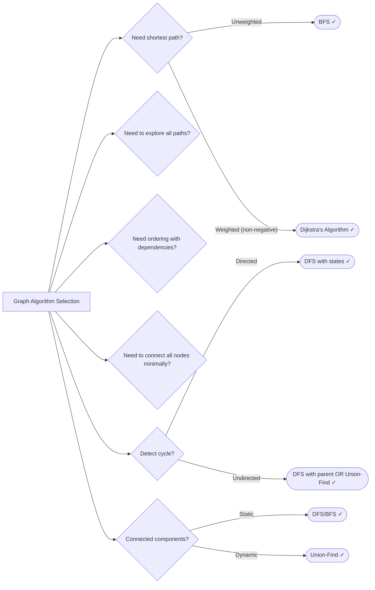

# 09. Graphs

> Traverse and search graph structures using DFS, BFS, and specialized algorithms

---

## ELI5: Explain Like I'm 5

<div class="learner-section" markdown>

**Your task:** After implementing all patterns, explain them simply.

**Prompts to guide you:**

1. **What is a graph in one sentence?**
    - Your answer: <span class="fill-in">[Fill in after implementation]</span>

2. **Why/when do we use graphs?**
    - Your answer: <span class="fill-in">[Fill in after implementation]</span>

3. **Real-world analogy:**
    - Example: "A graph is like a social network where people are nodes and friendships are edges..."
    - Your analogy: <span class="fill-in">[Fill in]</span>

4. **What's the difference between DFS and BFS?**
    - Your answer: <span class="fill-in">[Fill in after solving problems]</span>

5. **When should you use DFS vs BFS?**
    - Your answer: <span class="fill-in">[Fill in after practice]</span>

</div>

---

## Quick Quiz (Do BEFORE implementing)

<div class="learner-section" markdown>

**Your task:** Test your intuition without looking at code. Answer these, then verify after implementation.

### Complexity Predictions

1. **BFS to find shortest path in unweighted graph:**
    - Time complexity: <span class="fill-in">[Your guess: O(?)]</span>
    - Space complexity: <span class="fill-in">[Your guess: O(?)]</span>
    - Verified after learning: <span class="fill-in">[Actual: O(?)]</span>

2. **DFS to explore all paths in graph:**
    - Time complexity: <span class="fill-in">[Your guess: O(?)]</span>
    - Space complexity (recursion stack): <span class="fill-in">[Your guess: O(?)]</span>
    - Verified: <span class="fill-in">[Actual]</span>

3. **Dijkstra's Algorithm for weighted graph:**
    - Time complexity with priority queue: <span class="fill-in">[Your guess: O(?)]</span>
    - Why is it slower than BFS? <span class="fill-in">[Fill in]</span>
    - Verified: <span class="fill-in">[Actual]</span>

### Scenario Predictions

**Scenario 1:** Find shortest path from A to E in graph: A→B→E, A→C→D→E

- **Which algorithm?** <span class="fill-in">[BFS/DFS/Dijkstra - Why?]</span>
- **BFS will find path in how many steps?** <span class="fill-in">[Fill in]</span>
- **DFS might find which path first?** <span class="fill-in">[Fill in]</span>
- **Why does BFS guarantee shortest?** <span class="fill-in">[Explain]</span>

**Scenario 2:** Detect if course prerequisites have a circular dependency

- **Which algorithm?** <span class="fill-in">[DFS/BFS/Topological Sort - Why?]</span>
- **What data structure represents this?** <span class="fill-in">[Directed/Undirected graph]</span>
- **How do you detect the cycle?** <span class="fill-in">[Fill in your approach]</span>

**Scenario 3:** Count number of islands in 2D grid

```
[['1','1','0'],
 ['1','0','0'],
 ['0','0','1']]
```

- **How many islands?** <span class="fill-in">[Your guess]</span>
- **Which algorithm?** <span class="fill-in">[DFS/BFS - Why?]</span>
- **What marks a cell as visited?** <span class="fill-in">[Fill in]</span>

**Scenario 4:** Find shortest path in weighted graph with edges: (A,B,4), (A,C,2), (C,B,1)

- **Path from A to B using BFS:** <span class="fill-in">[What would BFS find?]</span>
- **Optimal path using Dijkstra:** <span class="fill-in">[What's the shortest?]</span>
- **Why can't BFS find optimal path here?** <span class="fill-in">[Explain]</span>

### Trade-off Quiz

**Question 1:** When would DFS be BETTER than BFS?

- Your answer: <span class="fill-in">[Fill in before implementation]</span>
- Verified answer: <span class="fill-in">[Fill in after learning]</span>

**Question 2:** What's the MAIN requirement for Topological Sort to work?

- [ ] Graph must be undirected
- [ ] Graph must have no cycles (DAG)
- [ ] Graph must be weighted
- [ ] Graph must be connected

Verify after implementation: <span class="fill-in">[Which one(s)?]</span>

**Question 3:** Adjacency Matrix vs Adjacency List - which is better for sparse graphs?

- Your answer: <span class="fill-in">[Matrix/List - Why?]</span>
- Space complexity comparison: <span class="fill-in">[Fill in after learning]</span>

### Graph Representation Quiz

Given graph: 0→1, 0→2, 1→3, 2→3

**Adjacency List representation:**

```
Your answer:
<span class="fill-in">[Draw/write the adjacency list structure]</span>
```

**Adjacency Matrix representation:**

```
Your answer:
<span class="fill-in">[Draw the 4x4 matrix]</span>
```

**Which uses less space?** <span class="fill-in">[Fill in and explain why]</span>


</div>

---

## Before/After: Why This Pattern Matters

**Your task:** Compare naive vs optimized approaches to understand the impact.

### Example 1: Find Shortest Path

**Problem:** Find shortest path between two nodes in an unweighted graph.

#### Approach 1: DFS (Suboptimal)

```java
// Naive approach - DFS finds A path, not shortest path
public static int findPath_DFS(Map<Integer, List<Integer>> graph, int start, int end) {
    Set<Integer> visited = new HashSet<>();
    return dfsPathLength(graph, start, end, visited, 0);
}

private static int dfsPathLength(Map<Integer, List<Integer>> graph,
                                 int current, int end, Set<Integer> visited, int length) {
    if (current == end) return length;
    if (visited.contains(current)) return Integer.MAX_VALUE;

    visited.add(current);
    int minPath = Integer.MAX_VALUE;

    for (int neighbor : graph.getOrDefault(current, new ArrayList<>())) {
        int pathLen = dfsPathLength(graph, neighbor, end, visited, length + 1);
        minPath = Math.min(minPath, pathLen);
    }

    visited.remove(current); // Backtrack
    return minPath;
}
```

**Analysis:**

- Time: O(V!) in worst case - explores all possible paths
- Space: O(V) - recursion stack
- Problem: Explores unnecessary paths, no guarantee of finding shortest first

#### Approach 2: BFS (Optimized)

```java
// Optimized approach - BFS guarantees shortest path
public static int findPath_BFS(Map<Integer, List<Integer>> graph, int start, int end) {
    Queue<Integer> queue = new LinkedList<>();
    Set<Integer> visited = new HashSet<>();

    queue.offer(start);
    visited.add(start);
    int length = 0;

    while (!queue.isEmpty()) {
        int size = queue.size();

        for (int i = 0; i < size; i++) {
            int node = queue.poll();

            if (node == end) return length;

            for (int neighbor : graph.getOrDefault(node, new ArrayList<>())) {
                if (!visited.contains(neighbor)) {
                    queue.offer(neighbor);
                    visited.add(neighbor);
                }
            }
        }
        length++;
    }

    return -1; // Not found
}
```

**Analysis:**

- Time: O(V + E) - visits each node and edge once
- Space: O(V) - queue storage
- Benefit: Explores level-by-level, first path found is shortest

#### Performance Comparison

| Graph Size       | DFS (worst case)     | BFS     | Speedup   |
|------------------|----------------------|---------|-----------|
| V = 10, E = 20   | ~3,628,800 ops (10!) | 30 ops  | ~120,000x |
| V = 6, E = 10    | ~720 ops (6!)        | 16 ops  | 45x       |
| V = 100, E = 200 | Intractable          | 300 ops | Infinite  |

**Your calculation:** For a graph with V = 8 nodes, BFS would be approximately _____ times faster in worst case.

#### Why Does BFS Find Shortest Path?

**Key insight to understand:**

In graph A→B→D, A→C→D looking for path from A to D:

```
BFS Level 0: [A]
BFS Level 1: [B, C]        (distance = 1 from A)
BFS Level 2: [D, D]        (distance = 2 from A, found first time)
```

DFS might go: A → B → D (found) but doesn't know if A → C → D is shorter without exploring everything.

**Why BFS guarantees shortest:**

- Explores all nodes at distance k before distance k+1
- First time we reach target = minimum distance
- No need to explore further paths

**After implementing, explain in your own words:**

<div class="learner-section" markdown>

- Why does level-order exploration matter? <span class="fill-in">[Your answer]</span>
- When would DFS accidentally find shortest path? <span class="fill-in">[Your answer]</span>

</div>

---

### Example 2: Graph Representation

**Problem:** Store graph with 1000 nodes and 5000 edges.

#### Approach 1: Adjacency Matrix

```java
// Matrix representation - simple but space-inefficient for sparse graphs
public class GraphMatrix {
    private int[][] matrix;
    private int V;

    public GraphMatrix(int vertices) {
        this.V = vertices;
        this.matrix = new int[V][V];
    }

    public void addEdge(int src, int dst) {
        matrix[src][dst] = 1;  // O(1) to add
    }

    public boolean hasEdge(int src, int dst) {
        return matrix[src][dst] == 1;  // O(1) to check
    }

    public List<Integer> getNeighbors(int node) {
        List<Integer> neighbors = new ArrayList<>();
        for (int i = 0; i < V; i++) {
            if (matrix[node][i] == 1) {
                neighbors.add(i);
            }
        }
        return neighbors;  // O(V) to get all neighbors
    }
}
```

**Analysis:**

- Space: O(V²) = O(1,000,000) for 1000 nodes
- Add edge: O(1)
- Check edge: O(1)
- Get neighbors: O(V)
- Memory usage: 1000 × 1000 = 1,000,000 integers ≈ 4 MB

#### Approach 2: Adjacency List

```java
// List representation - space-efficient for sparse graphs
public class GraphList {
    private Map<Integer, List<Integer>> adjList;

    public GraphList() {
        this.adjList = new HashMap<>();
    }

    public void addEdge(int src, int dst) {
        adjList.computeIfAbsent(src, k -> new ArrayList<>()).add(dst);  // O(1) average
    }

    public boolean hasEdge(int src, int dst) {
        return adjList.getOrDefault(src, new ArrayList<>()).contains(dst);  // O(degree)
    }

    public List<Integer> getNeighbors(int node) {
        return adjList.getOrDefault(node, new ArrayList<>());  // O(1) to get list
    }
}
```

**Analysis:**

- Space: O(V + E) = O(1000 + 5000) = O(6000)
- Add edge: O(1) average
- Check edge: O(degree of node)
- Get neighbors: O(1)
- Memory usage: ~6000 integers ≈ 24 KB

#### Space Comparison

| Graph Type                  | Adjacency Matrix | Adjacency List   | Better Choice         |
|-----------------------------|------------------|------------------|-----------------------|
| Dense (V=1000, E=500,000)   | 1M ints (4 MB)   | 501K ints (2 MB) | Matrix (similar)      |
| Sparse (V=1000, E=5000)     | 1M ints (4 MB)   | 6K ints (24 KB)  | **List (167x less)**  |
| Very Sparse (V=1000, E=100) | 1M ints (4 MB)   | 1.1K ints (4 KB) | **List (1000x less)** |

**Your calculation:** For V = 5000 nodes and E = 10,000 edges, adjacency list uses _____ less space than matrix.

#### When to Use Each?

**Use Adjacency Matrix when:**

- Graph is dense (E ≈ V²)
- Need O(1) edge existence checks frequently
- All operations need to be simple array lookups

**Use Adjacency List when:**

- Graph is sparse (E << V²)
- Need to iterate through neighbors frequently
- Memory is limited

**After implementing, explain in your own words:**

<div class="learner-section" markdown>

- Why does sparse vs dense matter? <span class="fill-in">[Your answer]</span>
- What operations are faster with each representation? <span class="fill-in">[Your answer]</span>

</div>

---

### Example 3: Dijkstra vs BFS

**Problem:** Find shortest path in weighted graph from A to D.

Graph: A→B(weight=1), A→C(weight=4), B→D(weight=5), C→D(weight=1)

#### Approach 1: BFS (Wrong for Weighted Graphs)

```java
// BFS finds shortest in terms of edges, not weights
public static int shortestPath_BFS(Map<Integer, List<int[]>> graph, int start, int end) {
    Queue<Integer> queue = new LinkedList<>();
    Set<Integer> visited = new HashSet<>();

    queue.offer(start);
    visited.add(start);
    int edges = 0;

    while (!queue.isEmpty()) {
        int size = queue.size();
        for (int i = 0; i < size; i++) {
            int node = queue.poll();
            if (node == end) return edges;  // Returns 2 (A→B→D)

            for (int[] neighbor : graph.getOrDefault(node, new ArrayList<>())) {
                if (!visited.contains(neighbor[0])) {
                    queue.offer(neighbor[0]);
                    visited.add(neighbor[0]);
                }
            }
        }
        edges++;
    }
    return -1;
}
// Result: 2 edges (A→B→D), but total weight = 1+5 = 6
```

**Analysis:**

- Finds: A → B → D (2 edges, weight = 6)
- Misses: A → C → D (2 edges, weight = 5) - **optimal path!**

- Problem: Doesn't consider edge weights at all

#### Approach 2: Dijkstra (Correct for Weighted Graphs)

```java
// Dijkstra finds shortest in terms of total weight
public static int shortestPath_Dijkstra(Map<Integer, List<int[]>> graph, int start, int end) {
    PriorityQueue<int[]> pq = new PriorityQueue<>((a, b) -> a[0] - b[0]); // [distance, node]
    Map<Integer, Integer> dist = new HashMap<>();

    pq.offer(new int[]{0, start});
    dist.put(start, 0);

    while (!pq.isEmpty()) {
        int[] curr = pq.poll();
        int d = curr[0], node = curr[1];

        if (node == end) return d;  // Returns 5 (A→C→D)
        if (d > dist.getOrDefault(node, Integer.MAX_VALUE)) continue;

        for (int[] neighbor : graph.getOrDefault(node, new ArrayList<>())) {
            int next = neighbor[0], weight = neighbor[1];
            int newDist = d + weight;

            if (newDist < dist.getOrDefault(next, Integer.MAX_VALUE)) {
                dist.put(next, newDist);
                pq.offer(new int[]{newDist, next});
            }
        }
    }
    return -1;
}
// Result: A→C→D, total weight = 4+1 = 5 (optimal!)
```

**Analysis:**

- Time: O((V + E) log V) - priority queue operations
- Finds: A → C → D (weight = 5)
- Correct: Considers cumulative weights, not edge count

#### Algorithm Comparison

| Scenario                   | BFS Result            | Dijkstra Result | Correct?                   |
|----------------------------|-----------------------|-----------------|----------------------------|
| Unweighted graph           | Shortest path         | Shortest path   | Both ✓                     |
| Weighted (all weights = 1) | Shortest path         | Shortest path   | Both ✓                     |
| Weighted (varying weights) | **Wrong** (min edges) | Shortest path   | Dijkstra ✓                 |
| Negative weights           | Wrong                 | **Wrong**       | Neither (use Bellman-Ford) |

**Your analysis:** When all edge weights are equal, BFS is _____ than Dijkstra because _____.

**After implementing, explain in your own words:**

<div class="learner-section" markdown>

- Why does BFS fail on weighted graphs? <span class="fill-in">[Your answer]</span>
- What does the priority queue do in Dijkstra? <span class="fill-in">[Your answer]</span>
- When is BFS actually better than Dijkstra? <span class="fill-in">[Your answer]</span>

</div>

---

## Core Implementation

### Pattern 1: DFS (Depth-First Search)

**Concept:** Explore as far as possible along each branch before backtracking.

**Use case:** Detect cycles, find paths, connected components, backtracking problems.

```java
import java.util.*;

public class DFS {

    /**
     * Problem: Number of islands (connected components)
     * Time: O(m*n), Space: O(m*n) for recursion stack
     *
     * TODO: Implement DFS to count islands
     */
    public static int numIslands(char[][] grid) {
        if (grid == null || grid.length == 0) return 0;

        int count = 0;

        // TODO: For each cell in grid:
        //   If cell is '1' (land) and not visited:
        //     Increment count
        //     Call dfs(grid, i, j) to mark entire island

        return 0; // Replace with implementation
    }

    private static void dfs(char[][] grid, int i, int j) {
        // TODO: Base cases
        //   If out of bounds: return
        //   If water ('0'): return

        // TODO: Mark current cell as visited (change '1' to '0' or use visited set)
        //   grid[i][j] = '0';

        // TODO: Recursively visit 4 neighbors
        //   dfs(grid, i+1, j);  // down
        //   dfs(grid, i-1, j);  // up
        //   dfs(grid, i, j+1);  // right
        //   dfs(grid, i, j-1);  // left
    }

    /**
     * Problem: Has path in graph (adjacency list)
     * Time: O(V + E), Space: O(V)
     *
     * TODO: Implement DFS path finding
     */
    public static boolean hasPath(Map<Integer, List<Integer>> graph, int start, int end) {
        Set<Integer> visited = new HashSet<>();

        // TODO: Call recursive DFS helper
        return false; // Replace
    }

    private static boolean dfsPath(Map<Integer, List<Integer>> graph,
                                   int current, int target, Set<Integer> visited) {
        // TODO: If current == target, return true

        // TODO: If visited contains current, return false

        // TODO: Mark current as visited

        // TODO: For each neighbor of current:
        //   If dfsPath(graph, neighbor, target, visited) returns true:
        //     Return true

        // TODO: Return false if no path found

        return false; // Replace
    }
}
```

**Runnable Client Code:**

```java
import java.util.*;

public class DFSClient {

    public static void main(String[] args) {
        System.out.println("=== DFS Pattern ===\n");

        // Test 1: Number of islands
        System.out.println("--- Test 1: Number of Islands ---");
        char[][] grid1 = {
            {'1','1','0','0','0'},
            {'1','1','0','0','0'},
            {'0','0','1','0','0'},
            {'0','0','0','1','1'}
        };

        System.out.println("Grid:");
        for (char[] row : grid1) {
            System.out.println(Arrays.toString(row));
        }
        System.out.println("Islands: " + DFS.numIslands(grid1));

        // Test 2: Has path
        System.out.println("\n--- Test 2: Has Path ---");
        Map<Integer, List<Integer>> graph = new HashMap<>();
        graph.put(0, Arrays.asList(1, 2));
        graph.put(1, Arrays.asList(3));
        graph.put(2, Arrays.asList(3));
        graph.put(3, Arrays.asList());

        System.out.println("Graph: " + graph);
        System.out.println("Path 0 -> 3? " + DFS.hasPath(graph, 0, 3));
        System.out.println("Path 0 -> 4? " + DFS.hasPath(graph, 0, 4));
    }
}
```

---

### Pattern 2: BFS (Breadth-First Search)

**Concept:** Explore all neighbors at current depth before moving deeper.

**Use case:** Shortest path in unweighted graph, level-order traversal, minimum steps.

```java
import java.util.*;

public class BFS {

    /**
     * Problem: Shortest path in unweighted graph
     * Time: O(V + E), Space: O(V)
     *
     * TODO: Implement BFS shortest path
     */
    public static int shortestPath(Map<Integer, List<Integer>> graph, int start, int end) {
        Queue<Integer> queue = new LinkedList<>();
        Set<Integer> visited = new HashSet<>();
        int steps = 0;

        // TODO: Add start to queue and visited
        //   queue.offer(start);
        //   visited.add(start);

        // TODO: While queue not empty:
        //   int size = queue.size();
        //   For each node in current level:
        //     int node = queue.poll();
        //     If node == end, return steps
        //     For each neighbor:
        //       If not visited:
        //         Add to queue and visited
        //   Increment steps

        return -1; // Not found
    }

    /**
     * Problem: Minimum knight moves to reach target
     * Time: O(n^2), Space: O(n^2)
     *
     * TODO: Implement BFS for chess board
     */
    public static int minKnightMoves(int targetX, int targetY) {
        int[][] directions = {{2,1}, {2,-1}, {-2,1}, {-2,-1},
                              {1,2}, {1,-2}, {-1,2}, {-1,-2}};

        Queue<int[]> queue = new LinkedList<>();
        Set<String> visited = new HashSet<>();

        // TODO: Start from (0, 0)
        //   queue.offer(new int[]{0, 0});
        //   visited.add("0,0");

        int moves = 0;

        // TODO: While queue not empty:
        //   Process all positions at current distance
        //   For each position:
        //     If reached target, return moves
        //     Try all 8 knight moves
        //     Add unvisited positions to queue
        //   Increment moves

        return -1; // Replace
    }

    /**
     * Problem: Rotting oranges (multi-source BFS)
     * Time: O(m*n), Space: O(m*n)
     *
     * TODO: Implement multi-source BFS
     */
    public static int orangesRotting(int[][] grid) {
        Queue<int[]> queue = new LinkedList<>();
        int fresh = 0;
        int minutes = 0;

        // TODO: Count fresh oranges and add rotten to queue
        //   For each cell in grid:
        //     If grid[i][j] == 1, increment fresh
        //     If grid[i][j] == 2, add (i, j) to queue

        // TODO: BFS to rot adjacent oranges
        //   While queue not empty and fresh > 0:
        //     Process all rotten at current minute
        //     For each rotten, check 4 neighbors
        //     If neighbor is fresh, rot it and add to queue
        //     Increment minutes

        // TODO: Return minutes if all fresh rotted, else -1

        return 0; // Replace
    }
}
```

**Runnable Client Code:**

```java
import java.util.*;

public class BFSClient {

    public static void main(String[] args) {
        System.out.println("=== BFS Pattern ===\n");

        // Test 1: Shortest path
        System.out.println("--- Test 1: Shortest Path ---");
        Map<Integer, List<Integer>> graph = new HashMap<>();
        graph.put(0, Arrays.asList(1, 2));
        graph.put(1, Arrays.asList(3));
        graph.put(2, Arrays.asList(3, 4));
        graph.put(3, Arrays.asList(4));
        graph.put(4, Arrays.asList());

        System.out.println("Graph: " + graph);
        System.out.println("Shortest path 0 -> 4: " + BFS.shortestPath(graph, 0, 4));

        // Test 2: Knight moves
        System.out.println("\n--- Test 2: Knight Moves ---");
        int[][] targets = {{2, 1}, {5, 5}};
        for (int[] target : targets) {
            int moves = BFS.minKnightMoves(target[0], target[1]);
            System.out.printf("To (%d, %d): %d moves%n", target[0], target[1], moves);
        }

        // Test 3: Rotting oranges
        System.out.println("\n--- Test 3: Rotting Oranges ---");
        int[][] grid = {
            {2, 1, 1},
            {1, 1, 0},
            {0, 1, 1}
        };

        System.out.println("Grid:");
        for (int[] row : grid) {
            System.out.println(Arrays.toString(row));
        }
        System.out.println("Minutes to rot all: " + BFS.orangesRotting(grid));
    }
}
```

---

### Pattern 3: Topological Sort

**Concept:** Linear ordering of vertices in a Directed Acyclic Graph (DAG).

**Use case:** Course schedule, task dependencies, build systems.

```java
import java.util.*;

public class TopologicalSort {

    /**
     * Problem: Course schedule (can finish all courses)
     * Time: O(V + E), Space: O(V + E)
     *
     * TODO: Implement using Kahn's algorithm (BFS)
     */
    public static boolean canFinish(int numCourses, int[][] prerequisites) {
        // Build adjacency list and in-degree array
        List<List<Integer>> graph = new ArrayList<>();
        int[] inDegree = new int[numCourses];

        // TODO: Initialize graph
        //   for (int i = 0; i < numCourses; i++)
        //     graph.add(new ArrayList<>());

        // TODO: Build graph from prerequisites
        //   For each [course, prereq]:
        //     graph.get(prereq).add(course);
        //     inDegree[course]++;

        // TODO: Add all courses with inDegree 0 to queue
        //   Queue<Integer> queue = new LinkedList<>();
        //   for (int i = 0; i < numCourses; i++)
        //     if (inDegree[i] == 0) queue.offer(i);

        int completed = 0;

        // TODO: Process courses in topological order
        //   While queue not empty:
        //     int course = queue.poll();
        //     completed++;
        //     For each dependent course:
        //       Decrement inDegree
        //       If inDegree becomes 0, add to queue

        // TODO: Return true if completed == numCourses

        return false; // Replace
    }

    /**
     * Problem: Course schedule II (return order)
     * Time: O(V + E), Space: O(V + E)
     *
     * TODO: Implement with DFS
     */
    public static int[] findOrder(int numCourses, int[][] prerequisites) {
        List<List<Integer>> graph = new ArrayList<>();
        int[] visited = new int[numCourses]; // 0: unvisited, 1: visiting, 2: visited
        Stack<Integer> stack = new Stack<>();

        // TODO: Initialize graph
        //   for (int i = 0; i < numCourses; i++)
        //     graph.add(new ArrayList<>());

        // TODO: Build graph
        //   For each [course, prereq]:
        //     graph.get(prereq).add(course);

        // TODO: DFS from each unvisited node
        //   For each course:
        //     If dfs returns false (cycle detected):
        //       Return empty array

        // TODO: Build result from stack (reverse order)

        return new int[0]; // Replace
    }

    private static boolean dfsTopSort(List<List<Integer>> graph, int node,
                                     int[] visited, Stack<Integer> stack) {
        // TODO: If node is being visited (1), cycle detected, return false

        // TODO: If node already visited (2), return true

        // TODO: Mark as being visited
        //   visited[node] = 1;

        // TODO: Visit all neighbors
        //   For each neighbor:
        //     If dfs fails, return false

        // TODO: Mark as visited and push to stack
        //   visited[node] = 2;
        //   stack.push(node);

        return true; // Replace
    }
}
```

**Runnable Client Code:**

```java
import java.util.*;

public class TopologicalSortClient {

    public static void main(String[] args) {
        System.out.println("=== Topological Sort ===\n");

        // Test 1: Can finish courses
        System.out.println("--- Test 1: Can Finish Courses ---");
        int[][] prereq1 = {{1, 0}};
        int[][] prereq2 = {{1, 0}, {0, 1}};

        System.out.println("2 courses, [[1,0]]: " +
            TopologicalSort.canFinish(2, prereq1));
        System.out.println("2 courses, [[1,0],[0,1]]: " +
            TopologicalSort.canFinish(2, prereq2));

        // Test 2: Find course order
        System.out.println("\n--- Test 2: Course Order ---");
        int[][] prereq3 = {{1, 0}, {2, 0}, {3, 1}, {3, 2}};
        int[] order = TopologicalSort.findOrder(4, prereq3);
        System.out.println("4 courses: " + Arrays.toString(order));
    }
}
```

---

### Pattern 4: Cycle Detection

**Concept:** Detect if graph contains a cycle.

**Use case:** Validate DAG, detect deadlocks, dependency resolution.

```java
import java.util.*;

public class CycleDetection {

    /**
     * Problem: Detect cycle in directed graph
     * Time: O(V + E), Space: O(V)
     *
     * TODO: Implement using DFS with states
     */
    public static boolean hasCycleDirected(int n, int[][] edges) {
        List<List<Integer>> graph = new ArrayList<>();
        int[] state = new int[n]; // 0: unvisited, 1: visiting, 2: visited

        // TODO: Build graph

        // TODO: DFS from each unvisited node
        //   For each node:
        //     If dfs detects cycle, return true

        return false; // Replace
    }

    private static boolean dfsCycleDirected(List<List<Integer>> graph, int node, int[] state) {
        // TODO: If state[node] == 1 (visiting), cycle found, return true

        // TODO: If state[node] == 2 (visited), no cycle from here, return false

        // TODO: Mark as visiting
        //   state[node] = 1;

        // TODO: Visit all neighbors
        //   For each neighbor:
        //     If dfs finds cycle, return true

        // TODO: Mark as visited
        //   state[node] = 2;

        return false; // Replace
    }

    /**
     * Problem: Detect cycle in undirected graph
     * Time: O(V + E), Space: O(V)
     *
     * TODO: Implement using DFS with parent tracking
     */
    public static boolean hasCycleUndirected(int n, int[][] edges) {
        List<List<Integer>> graph = new ArrayList<>();
        boolean[] visited = new boolean[n];

        // TODO: Build graph (both directions for undirected)

        // TODO: DFS from each unvisited component
        //   For each node:
        //     If not visited and dfs finds cycle, return true

        return false; // Replace
    }

    private static boolean dfsCycleUndirected(List<List<Integer>> graph, int node,
                                             int parent, boolean[] visited) {
        // TODO: Mark as visited

        // TODO: Visit all neighbors
        //   For each neighbor:
        //     If neighbor == parent, skip (came from here)
        //     If neighbor is visited, cycle found, return true
        //     If dfs from neighbor finds cycle, return true

        return false; // Replace
    }
}
```

**Runnable Client Code:**

```java
import java.util.*;

public class CycleDetectionClient {

    public static void main(String[] args) {
        System.out.println("=== Cycle Detection ===\n");

        // Test 1: Directed graph cycle
        System.out.println("--- Test 1: Directed Graph ---");
        int[][] edges1 = {{0, 1}, {1, 2}};
        int[][] edges2 = {{0, 1}, {1, 2}, {2, 0}};

        System.out.println("Edges [[0,1],[1,2]]: " +
            CycleDetection.hasCycleDirected(3, edges1));
        System.out.println("Edges [[0,1],[1,2],[2,0]]: " +
            CycleDetection.hasCycleDirected(3, edges2));

        // Test 2: Undirected graph cycle
        System.out.println("\n--- Test 2: Undirected Graph ---");
        int[][] edges3 = {{0, 1}, {1, 2}};
        int[][] edges4 = {{0, 1}, {1, 2}, {2, 0}};

        System.out.println("Edges [[0,1],[1,2]]: " +
            CycleDetection.hasCycleUndirected(3, edges3));
        System.out.println("Edges [[0,1],[1,2],[2,0]]: " +
            CycleDetection.hasCycleUndirected(3, edges4));
    }
}
```

---

### Pattern 5: Dijkstra's Algorithm (Single-Source Shortest Path)

**Concept:** Find shortest paths from a source node to all other nodes in a weighted graph with non-negative edge
weights.

**Use case:** Network routing, GPS navigation, shortest path in weighted graphs.

```java
import java.util.*;

public class DijkstraAlgorithm {

    /**
     * Problem: Network delay time - time for all nodes to receive signal from source
     * Time: O((V + E) log V), Space: O(V)
     *
     * TODO: Implement Dijkstra's algorithm using PriorityQueue
     */
    public static int networkDelayTime(int[][] times, int n, int k) {
        // Build adjacency list: node -> List of [neighbor, weight]
        Map<Integer, List<int[]>> graph = new HashMap<>();

        // TODO: Build graph from times array
        //   for (int[] time : times) {
        //     int src = time[0], dst = time[1], weight = time[2];
        //     graph.computeIfAbsent(src, x -> new ArrayList<>()).add(new int[]{dst, weight});
        //   }

        // TODO: Initialize distances array
        //   int[] dist = new int[n + 1];
        //   Arrays.fill(dist, Integer.MAX_VALUE);
        //   dist[k] = 0;

        // TODO: Use PriorityQueue (min-heap) to track [distance, node]
        //   PriorityQueue<int[]> pq = new PriorityQueue<>((a, b) -> a[0] - b[0]);
        //   pq.offer(new int[]{0, k});

        // TODO: Process nodes in order of distance
        //   While pq not empty:
        //     int[] curr = pq.poll();
        //     int d = curr[0], node = curr[1];
        //
        //     If d > dist[node], skip (already processed)
        //
        //     For each neighbor of node:
        //       int newDist = dist[node] + weight;
        //       If newDist < dist[neighbor]:
        //         dist[neighbor] = newDist;
        //         pq.offer(new int[]{newDist, neighbor});

        // TODO: Find maximum distance (time for all nodes to receive signal)
        //   int maxTime = 0;
        //   for (int i = 1; i <= n; i++) {
        //     if (dist[i] == Integer.MAX_VALUE) return -1;
        //     maxTime = Math.max(maxTime, dist[i]);
        //   }
        //   return maxTime;

        return -1; // Replace
    }

    /**
     * Problem: Shortest path in weighted graph
     * Time: O((V + E) log V), Space: O(V)
     *
     * TODO: Implement basic Dijkstra's algorithm
     */
    public static int[] dijkstra(Map<Integer, List<int[]>> graph, int start, int n) {
        int[] dist = new int[n];
        Arrays.fill(dist, Integer.MAX_VALUE);
        dist[start] = 0;

        // TODO: Use PriorityQueue for efficient minimum extraction
        //   PriorityQueue<int[]> pq = new PriorityQueue<>((a, b) -> a[0] - b[0]);
        //   pq.offer(new int[]{0, start});

        // TODO: Process each node once
        //   Set<Integer> visited = new HashSet<>();
        //
        //   While pq not empty:
        //     int[] curr = pq.poll();
        //     int d = curr[0], node = curr[1];
        //
        //     If visited contains node, skip
        //     visited.add(node);
        //
        //     For each [neighbor, weight] in graph.get(node):
        //       int newDist = dist[node] + weight;
        //       If newDist < dist[neighbor]:
        //         dist[neighbor] = newDist;
        //         pq.offer(new int[]{newDist, neighbor});

        return dist; // Replace with implementation
    }
}
```

**Runnable Client Code:**

```java
import java.util.*;

public class DijkstraClient {

    public static void main(String[] args) {
        System.out.println("=== Dijkstra's Algorithm ===\n");

        // Test 1: Network delay time
        System.out.println("--- Test 1: Network Delay Time ---");
        int[][] times1 = {{2, 1, 1}, {2, 3, 1}, {3, 4, 1}};
        int n1 = 4, k1 = 2;
        System.out.println("Network: " + Arrays.deepToString(times1));
        System.out.println("Start node: " + k1);
        System.out.println("Time to reach all nodes: " +
            DijkstraAlgorithm.networkDelayTime(times1, n1, k1));

        // Test 2: Shortest paths
        System.out.println("\n--- Test 2: Shortest Paths ---");
        Map<Integer, List<int[]>> graph = new HashMap<>();
        graph.put(0, Arrays.asList(new int[]{1, 4}, new int[]{2, 1}));
        graph.put(1, Arrays.asList(new int[]{3, 1}));
        graph.put(2, Arrays.asList(new int[]{1, 2}, new int[]{3, 5}));
        graph.put(3, Arrays.asList());

        int[] distances = DijkstraAlgorithm.dijkstra(graph, 0, 4);
        System.out.println("Graph: " + graph);
        System.out.println("Shortest distances from node 0: " + Arrays.toString(distances));
    }
}
```

---

### Pattern 6: Minimum Spanning Tree (MST)

**Concept:** Find the minimum cost subset of edges that connects all vertices in a weighted undirected graph.

**Use case:** Network design, clustering, approximation algorithms.

```java
import java.util.*;

public class MinimumSpanningTree {

    /**
     * Problem: Min cost to connect all points (Prim's algorithm)
     * Time: O((V + E) log V), Space: O(V + E)
     *
     * TODO: Implement Prim's algorithm using PriorityQueue
     */
    public static int minCostConnectPoints(int[][] points) {
        int n = points.length;

        // TODO: Build adjacency list with Manhattan distances
        //   Map<Integer, List<int[]>> graph = new HashMap<>();
        //   for (int i = 0; i < n; i++) {
        //     graph.put(i, new ArrayList<>());
        //     for (int j = 0; j < n; j++) {
        //       if (i != j) {
        //         int dist = Math.abs(points[i][0] - points[j][0]) +
        //                    Math.abs(points[i][1] - points[j][1]);
        //         graph.get(i).add(new int[]{j, dist});
        //       }
        //     }
        //   }

        // TODO: Use PriorityQueue to track [cost, node]
        //   PriorityQueue<int[]> pq = new PriorityQueue<>((a, b) -> a[0] - b[0]);
        //   pq.offer(new int[]{0, 0}); // Start from node 0 with cost 0

        // TODO: Track visited nodes and total cost
        //   Set<Integer> visited = new HashSet<>();
        //   int totalCost = 0;

        // TODO: Greedily add minimum cost edges
        //   While visited.size() < n:
        //     int[] curr = pq.poll();
        //     int cost = curr[0], node = curr[1];
        //
        //     If visited contains node, skip
        //
        //     visited.add(node);
        //     totalCost += cost;
        //
        //     For each [neighbor, edgeCost] in graph.get(node):
        //       If neighbor not visited:
        //         pq.offer(new int[]{edgeCost, neighbor});

        return 0; // Replace
    }

    /**
     * Problem: MST using Prim's algorithm (generic version)
     * Time: O((V + E) log V), Space: O(V + E)
     *
     * TODO: Implement Prim's algorithm
     */
    public static int primMST(Map<Integer, List<int[]>> graph, int n) {
        // TODO: Use PriorityQueue for minimum edge selection
        //   PriorityQueue<int[]> pq = new PriorityQueue<>((a, b) -> a[0] - b[0]);

        // TODO: Start from node 0
        //   Set<Integer> visited = new HashSet<>();
        //   int totalCost = 0;
        //
        //   Add all edges from node 0 to pq
        //   visited.add(0);

        // TODO: Process edges in order of weight
        //   While visited.size() < n and pq not empty:
        //     int[] edge = pq.poll();
        //     int cost = edge[0], node = edge[1];
        //
        //     If visited contains node, skip
        //
        //     visited.add(node);
        //     totalCost += cost;
        //
        //     Add all edges from node to pq (if neighbor not visited)

        return 0; // Replace
    }

    /**
     * Edge class for MST algorithms
     */
    static class Edge implements Comparable<Edge> {
        int src, dst, weight;

        Edge(int src, int dst, int weight) {
            this.src = src;
            this.dst = dst;
            this.weight = weight;
        }

        @Override
        public int compareTo(Edge other) {
            return this.weight - other.weight;
        }
    }
}
```

**Runnable Client Code:**

```java
import java.util.*;

public class MinimumSpanningTreeClient {

    public static void main(String[] args) {
        System.out.println("=== Minimum Spanning Tree ===\n");

        // Test 1: Min cost to connect points
        System.out.println("--- Test 1: Connect All Points ---");
        int[][] points1 = {{0, 0}, {2, 2}, {3, 10}, {5, 2}, {7, 0}};
        System.out.println("Points: " + Arrays.deepToString(points1));
        System.out.println("Min cost: " +
            MinimumSpanningTree.minCostConnectPoints(points1));

        // Test 2: Simple MST
        System.out.println("\n--- Test 2: MST (Prim's Algorithm) ---");
        int[][] points2 = {{0, 0}, {1, 1}, {1, 0}, {0, 1}};
        System.out.println("Points: " + Arrays.deepToString(points2));
        System.out.println("Min cost: " +
            MinimumSpanningTree.minCostConnectPoints(points2));

        // Test 3: Graph with weighted edges
        System.out.println("\n--- Test 3: Weighted Graph MST ---");
        Map<Integer, List<int[]>> graph = new HashMap<>();
        graph.put(0, Arrays.asList(new int[]{1, 2}, new int[]{2, 3}));
        graph.put(1, Arrays.asList(new int[]{0, 2}, new int[]{2, 1}, new int[]{3, 5}));
        graph.put(2, Arrays.asList(new int[]{0, 3}, new int[]{1, 1}, new int[]{3, 4}));
        graph.put(3, Arrays.asList(new int[]{1, 5}, new int[]{2, 4}));

        System.out.println("Graph: " + graph);
        System.out.println("MST cost: " + MinimumSpanningTree.primMST(graph, 4));
    }
}
```

---

## Debugging Challenges

**Your task:** Find and fix bugs in broken graph implementations. This tests your understanding.

### Challenge 1: Broken DFS - Visited Array Bug

```java
/**
 * This code is supposed to count connected components using DFS.
 * It has 2 BUGS. Find them!
 */
public static int countComponents_Buggy(int n, int[][] edges) {
    Map<Integer, List<Integer>> graph = new HashMap<>();

    // Build graph
    for (int i = 0; i < n; i++) {
        graph.put(i, new ArrayList<>());
    }
    for (int[] edge : edges) {
        graph.get(edge[0]).add(edge[1]);
        graph.get(edge[1]).add(edge[0]);
    }

    boolean[] visited = new boolean[n];
    int count = 0;

    for (int i = 0; i < n; i++) {
        if (!visited[i]) {
            dfs(graph, i, visited);        }
    }

    return count;}

private static void dfs(Map<Integer, List<Integer>> graph, int node, boolean[] visited) {
    visited[node] = true;

    for (int neighbor : graph.get(node)) {
        if (!visited[neighbor]) {
            dfs(graph, neighbor, visited);
        }
    }
}
```

**Your debugging:**

- Bug 1: <span class="fill-in">[What\'s the bug?]</span>

- Bug 2: <span class="fill-in">[What\'s the bug?]</span>

**Test case:**

- Input: n = 5, edges = [[0,1], [1,2], [3,4]]
- Expected: 2 components
- Actual with buggy code: <span class="fill-in">[What do you get?]</span>

<details markdown>
<summary>Click to verify your answers</summary>

**Bug 1 (Line 18):** After calling `dfs()`, we never increment `count`! Should be:

```java
if (!visited[i]) {
    dfs(graph, i, visited);
    count++;  // Increment after exploring component
}
```

**Bug 2:** Actually the same as Bug 1. The `count` variable is initialized but never incremented, so it always returns
0.

**Correct fix:**

```java
for (int i = 0; i < n; i++) {
    if (!visited[i]) {
        dfs(graph, i, visited);
        count++;
    }
}
return count;
```

</details>

---

### Challenge 2: Broken BFS - Level Tracking Bug

```java
/**
 * Find shortest path length using BFS.
 * This has 1 CRITICAL BUG that causes wrong results.
 */
public static int shortestPath_Buggy(Map<Integer, List<Integer>> graph, int start, int end) {
    Queue<Integer> queue = new LinkedList<>();
    Set<Integer> visited = new HashSet<>();
    int distance = 0;

    queue.offer(start);

    while (!queue.isEmpty()) {
        int node = queue.poll();
        if (node == end) return distance;

        for (int neighbor : graph.getOrDefault(node, new ArrayList<>())) {
            if (!visited.contains(neighbor)) {
                queue.offer(neighbor);
                visited.add(neighbor);
            }
        }

        distance++;
    }

    return -1;
}
```

**Your debugging:**

- **Bug 1:** <span class="fill-in">[What's missing after queue.offer(start)?]</span>
- **Bug 2:** <span class="fill-in">[How should we process the queue by level?]</span>
- **Why it fails:** <span class="fill-in">[Trace through with start=0, end=2, graph: 0→1, 1→2]</span>

**Expected distance:** 2
**Actual with buggy code:** <span class="fill-in">[What do you get?]</span>

<details markdown>
<summary>Click to verify your answer</summary>

**Bug 1:** Missing `visited.add(start)` after adding start to queue. Without this, we might revisit the start node.

**Bug 2:** Not processing nodes level-by-level. Should use:

```java
while (!queue.isEmpty()) {
    int size = queue.size();  // Process all nodes at current level

    for (int i = 0; i < size; i++) {
        int node = queue.poll();

        if (node == end) return distance;

        for (int neighbor : graph.getOrDefault(node, new ArrayList<>())) {
            if (!visited.contains(neighbor)) {
                queue.offer(neighbor);
                visited.add(neighbor);
            }
        }
    }

    distance++;  // Increment after processing entire level
}
```

**Why:** Without level-by-level processing, `distance` increments for every node polled, not for each level.
</details>

---

### Challenge 3: Broken Topological Sort - Cycle Detection Miss

```java
/**
 * Topological sort using DFS.
 * This has 1 SUBTLE BUG that causes incorrect cycle detection.
 */
public static List<Integer> topSort_Buggy(int n, int[][] edges) {
    Map<Integer, List<Integer>> graph = new HashMap<>();
    for (int i = 0; i < n; i++) graph.put(i, new ArrayList<>());
    for (int[] edge : edges) graph.get(edge[0]).add(edge[1]);

    int[] visited = new int[n];  // 0: unvisited, 1: visiting, 2: visited
    Stack<Integer> stack = new Stack<>();

    for (int i = 0; i < n; i++) {
        if (visited[i] == 0) {
            if (!dfsTopSort(graph, i, visited, stack)) {
                return new ArrayList<>();  // Cycle detected
            }
        }
    }

    List<Integer> result = new ArrayList<>();
    while (!stack.isEmpty()) {
        result.add(stack.pop());
    }
    return result;
}

private static boolean dfsTopSort(Map<Integer, List<Integer>> graph, int node,
                                 int[] visited, Stack<Integer> stack) {
    visited[node] = 1;  // Mark as visiting

    for (int neighbor : graph.get(node)) {
        if (visited[neighbor] == 1) {
            return false;  // Cycle detected
        }
        if (visited[neighbor] == 0) {
            dfsTopSort(graph, neighbor, visited, stack);
        }
    }

    visited[node] = 2;  // Mark as visited
    stack.push(node);
    return true;
}
```

**Your debugging:**

- Bug: <span class="fill-in">[What\'s the bug?]</span>

**Test case with cycle:**

- Input: n = 3, edges = [[0,1], [1,2], [2,0]]
- Expected: Empty list (cycle exists)
- Actual with buggy code: <span class="fill-in">[Does it detect the cycle?]</span>

<details markdown>
<summary>Click to verify your answer</summary>

**Bug (Line 38):** Missing return value check! Should be:

```java
if (visited[neighbor] == 0) {
    if (!dfsTopSort(graph, neighbor, visited, stack)) {
        return false;  // Propagate cycle detection
    }
}
```

**Why:** Even if a recursive call detects a cycle (returns false), we ignore it and continue. The cycle detection never
propagates back up the call stack.

**Correct version:**

```java
for (int neighbor : graph.get(node)) {
    if (visited[neighbor] == 1) {
        return false;  // Cycle detected
    }
    if (visited[neighbor] == 0) {
        if (!dfsTopSort(graph, neighbor, visited, stack)) {
            return false;  // Propagate cycle detection
        }
    }
}
```

</details>

---

### Challenge 4: Broken Dijkstra - Priority Queue Bug

```java
/**
 * Dijkstra's algorithm for shortest path.
 * This has 1 PERFORMANCE BUG that causes incorrect results.
 */
public static int dijkstra_Buggy(Map<Integer, List<int[]>> graph, int start, int end, int n) {
    PriorityQueue<int[]> pq = new PriorityQueue<>((a, b) -> a[0] - b[0]);
    int[] dist = new int[n];
    Arrays.fill(dist, Integer.MAX_VALUE);
    dist[start] = 0;

    pq.offer(new int[]{0, start});

    while (!pq.isEmpty()) {
        int[] curr = pq.poll();
        int d = curr[0], node = curr[1];


        if (node == end) return d;

        for (int[] neighbor : graph.getOrDefault(node, new ArrayList<>())) {
            int next = neighbor[0], weight = neighbor[1];
            int newDist = d + weight;

            if (newDist < dist[next]) {
                dist[next] = newDist;
                pq.offer(new int[]{newDist, next});
            }
        }
    }

    return dist[end] == Integer.MAX_VALUE ? -1 : dist[end];
}
```

**Your debugging:**

- **Bug:** <span class="fill-in">[What check is missing after polling from pq?]</span>
- **Why it matters:** <span class="fill-in">[What happens without this check?]</span>
- **Performance impact:** <span class="fill-in">[How does this affect time complexity?]</span>

**Test case:**

- Graph: 0→1(weight=5), 0→1(weight=3), 1→2(weight=1)
- Without fix: <span class="fill-in">[How many times do we process node 1?]</span>
- With fix: <span class="fill-in">[How many times should we process node 1?]</span>

<details markdown>
<summary>Click to verify your answer</summary>

**Bug:** Missing distance check after polling. Should be:

```java
while (!pq.isEmpty()) {
    int[] curr = pq.poll();
    int d = curr[0], node = curr[1];

    // Skip if we've already found a better path to this node
    if (d > dist[node]) continue;

    if (node == end) return d;

    // ... rest of code
}
```

**Why:** We may add the same node to the priority queue multiple times with different distances. Without this check, we
process outdated entries, doing unnecessary work and potentially getting wrong results.

**Example trace without fix:**

```
Step 1: Process (0, dist=0), add (1, dist=5)
Step 2: Process (1, dist=5), find shorter path, add (1, dist=3)
Step 3: Process (1, dist=3) ✓ (correct)
Step 4: Process (1, dist=5) ✗ (should skip - outdated)
```

With fix, step 4 would be skipped because d=5 > dist[1]=3.
</details>

---

### Challenge 5: Wrong Adjacency Representation

```java
/**
 * Build graph from edge list for undirected graph.
 * This has 1 LOGIC BUG.
 */
public static Map<Integer, List<Integer>> buildGraph_Buggy(int n, int[][] edges) {
    Map<Integer, List<Integer>> graph = new HashMap<>();

    for (int i = 0; i < n; i++) {
        graph.put(i, new ArrayList<>());
    }

    for (int[] edge : edges) {
        int u = edge[0], v = edge[1];
        graph.get(u).add(v);    }

    return graph;
}
```

**Your debugging:**

- **Bug:** <span class="fill-in">[What's missing for undirected graphs?]</span>
- **What happens:** <span class="fill-in">[Can you find the path with buggy graph?]</span>

<details markdown>
<summary>Click to verify your answer</summary>

**Bug:** For undirected graphs, need to add edge in BOTH directions:

```java
for (int[] edge : edges) {
    int u = edge[0], v = edge[1];
    graph.get(u).add(v);
    graph.get(v).add(u);  // Add reverse edge!
}
```

**Why:** In an undirected graph, edge (u,v) means both u→v and v→u. Without the reverse edge, the graph is incorrectly
treated as directed.
</details>

---

### Challenge 6: MST Prim's Algorithm Bug

```java
/**
 * Prim's algorithm for Minimum Spanning Tree.
 * This has 1 SUBTLE BUG that causes incorrect MST cost.
 */
public static int primMST_Buggy(Map<Integer, List<int[]>> graph, int n) {
    PriorityQueue<int[]> pq = new PriorityQueue<>((a, b) -> a[0] - b[0]);
    Set<Integer> visited = new HashSet<>();
    int totalCost = 0;

    pq.offer(new int[]{0, 0});  // Start from node 0 with cost 0

    while (!visited.isEmpty() && visited.size() < n) {        int[] curr = pq.poll();
        int cost = curr[0], node = curr[1];


        visited.add(node);
        totalCost += cost;

        for (int[] neighbor : graph.getOrDefault(node, new ArrayList<>())) {
            int next = neighbor[0], edgeCost = neighbor[1];
            if (!visited.contains(next)) {
                pq.offer(new int[]{edgeCost, next});
            }
        }
    }

    return totalCost;
}
```

**Your debugging:**

- **Bug 1:** <span class="fill-in">[What's wrong with the while loop condition?]</span>
- **Bug 2:** <span class="fill-in">[What check is missing after polling?]</span>
- **Result:** <span class="fill-in">[What happens if we process same node twice?]</span>

<details markdown>
<summary>Click to verify your answer</summary>

**Bug 1 (Line 7):** Condition `!visited.isEmpty()` is wrong. Should be `!pq.isEmpty()`:

```java
while (!pq.isEmpty() && visited.size() < n) {
```

**Bug 2 (Line 10):** Need to check if node was already visited before adding to MST:

```java
int[] curr = pq.poll();
int cost = curr[0], node = curr[1];

if (visited.contains(node)) continue;  // Skip if already in MST

visited.add(node);
totalCost += cost;
```

**Why:** Multiple edges can lead to the same node with different costs. Without the check, we might add a node to the
MST multiple times, inflating the total cost.
</details>

---

### Your Debugging Scorecard

After finding and fixing all bugs:

- [ ] Found all 8+ bugs across 6 challenges
- [ ] Understood WHY each bug causes incorrect behavior
- [ ] Could explain the fix to someone else
- [ ] Learned common graph algorithm mistakes to avoid

**Common graph mistakes you discovered:**

1. <span class="fill-in">[Forgetting to mark start node as visited in BFS]</span>
2. <span class="fill-in">[Not propagating cycle detection in recursive calls]</span>
3. <span class="fill-in">[Missing distance check in Dijkstra after polling]</span>
4. <span class="fill-in">[Not adding both directions for undirected graphs]</span>
5. <span class="fill-in">[Processing queue/priority queue incorrectly]</span>
6. <span class="fill-in">[Fill in more patterns you noticed]</span>

---

## Decision Framework

**Your task:** Build decision trees for when to use each graph algorithm.

### Question 1: DFS vs BFS - Which to use?

Answer after solving problems:

**Use DFS when:**

- Need to explore all paths: <span class="fill-in">[Backtracking, cycle detection]</span>
- Memory is limited: <span class="fill-in">[DFS uses less space]</span>
- Finding any path (not shortest): <span class="fill-in">[Fill in]</span>

**Use BFS when:**

- Need shortest path: <span class="fill-in">[Unweighted graphs]</span>
- Level-order traversal: <span class="fill-in">[Process by distance from source]</span>
- Multi-source problems: <span class="fill-in">[Fill in examples]</span>

### Question 2: When to use Topological Sort?

Answer for different scenarios:

**Use topological sort when:**

- Have dependencies: <span class="fill-in">[Course prerequisites, build order]</span>
- Need ordering: <span class="fill-in">[Task scheduling]</span>
- Graph is DAG: <span class="fill-in">[Must be acyclic]</span>

### Question 3: Graph representation?

**Adjacency List:**

- Use when: <span class="fill-in">[Sparse graphs, need to iterate neighbors]</span>
- Space: <span class="fill-in">[O(V + E)]</span>

**Adjacency Matrix:**

- Use when: <span class="fill-in">[Dense graphs, need to check edge existence]</span>
- Space: <span class="fill-in">[O(V²)]</span>

### Question 4: When to use Dijkstra's Algorithm?

Answer for different scenarios:

**Use Dijkstra when:**

- Need shortest path in weighted graph: <span class="fill-in">[Non-negative edge weights]</span>
- Single-source shortest paths: <span class="fill-in">[From one node to all others]</span>
- Optimal path finding: <span class="fill-in">[GPS navigation, network routing]</span>

**Don't use Dijkstra when:**

- Negative edge weights exist: <span class="fill-in">[Use Bellman-Ford instead]</span>
- Unweighted graph: <span class="fill-in">[BFS is simpler and faster]</span>
- All-pairs shortest paths needed: <span class="fill-in">[Consider Floyd-Warshall]</span>

### Question 5: When to use Minimum Spanning Tree?

Answer for different scenarios:

**Use MST when:**

- Need to connect all nodes minimally: <span class="fill-in">[Network design, clustering]</span>
- Minimize total edge cost: <span class="fill-in">[Infrastructure optimization]</span>
- Graph is undirected and weighted: <span class="fill-in">[MST only for undirected graphs]</span>

**MST Algorithm Choice:**

- Prim's: <span class="fill-in">[Dense graphs, good with adjacency matrix]</span>
- Kruskal's: <span class="fill-in">[Sparse graphs, uses Union-Find]</span>

### Your Decision Tree

Build this after solving practice problems:



---

## Practice

### LeetCode Problems

**Easy (Complete 2-3):**

- [ ] [997. Find the Town Judge](https://leetcode.com/problems/find-the-town-judge/)
    - Pattern: <span class="fill-in">[Graph properties]</span>
    - Your solution time: <span class="fill-in">___</span>
    - Key insight: <span class="fill-in">[Fill in]</span>

- [ ] [1971. Find if Path Exists in Graph](https://leetcode.com/problems/find-if-path-exists-in-graph/)
    - Pattern: <span class="fill-in">[DFS/BFS]</span>
    - Your solution time: <span class="fill-in">___</span>
    - Key insight: <span class="fill-in">[Fill in]</span>

**Medium (Complete 4-5):**

- [ ] [200. Number of Islands](https://leetcode.com/problems/number-of-islands/)
    - Pattern: <span class="fill-in">[DFS]</span>
    - Difficulty: <span class="fill-in">[Rate 1-10]</span>
    - Key insight: <span class="fill-in">[Fill in]</span>

- [ ] [133. Clone Graph](https://leetcode.com/problems/clone-graph/)
    - Pattern: <span class="fill-in">[DFS/BFS]</span>
    - Difficulty: <span class="fill-in">[Rate 1-10]</span>
    - Key insight: <span class="fill-in">[Fill in]</span>

- [ ] [207. Course Schedule](https://leetcode.com/problems/course-schedule/)
    - Pattern: <span class="fill-in">[Topological Sort]</span>
    - Difficulty: <span class="fill-in">[Rate 1-10]</span>
    - Key insight: <span class="fill-in">[Fill in]</span>

- [ ] [210. Course Schedule II](https://leetcode.com/problems/course-schedule-ii/)
    - Pattern: <span class="fill-in">[Topological Sort]</span>
    - Comparison to 207: <span class="fill-in">[How similar?]</span>

- [ ] [994. Rotting Oranges](https://leetcode.com/problems/rotting-oranges/)
    - Pattern: <span class="fill-in">[Multi-source BFS]</span>
    - Difficulty: <span class="fill-in">[Rate 1-10]</span>
    - Key insight: <span class="fill-in">[Fill in]</span>

- [ ] [743. Network Delay Time](https://leetcode.com/problems/network-delay-time/)
    - Pattern: <span class="fill-in">[Dijkstra's Algorithm]</span>
    - Difficulty: <span class="fill-in">[Rate 1-10]</span>
    - Key insight: <span class="fill-in">[Fill in]</span>

- [ ] [1584. Min Cost to Connect All Points](https://leetcode.com/problems/min-cost-to-connect-all-points/)
    - Pattern: <span class="fill-in">[Minimum Spanning Tree (Prim's)]</span>
    - Difficulty: <span class="fill-in">[Rate 1-10]</span>
    - Key insight: <span class="fill-in">[Fill in]</span>

**Hard (Optional):**

- [ ] [127. Word Ladder](https://leetcode.com/problems/word-ladder/)
    - Pattern: <span class="fill-in">[BFS]</span>
    - Key insight: <span class="fill-in">[Fill in after solving]</span>

- [ ] [329. Longest Increasing Path in Matrix](https://leetcode.com/problems/longest-increasing-path-in-a-matrix/)
    - Pattern: <span class="fill-in">[DFS + Memoization]</span>
    - Key insight: <span class="fill-in">[Fill in]</span>

- [ ] [787. Cheapest Flights Within K Stops](https://leetcode.com/problems/cheapest-flights-within-k-stops/)
    - Pattern: <span class="fill-in">[Dijkstra's Algorithm with constraints]</span>
    - Key insight: <span class="fill-in">[Fill in after solving]</span>

---

## Review Checklist

Before moving to the next topic:

- [ ] **Implementation**
    - [ ] DFS: islands, path finding all work
    - [ ] BFS: shortest path, knight moves, rotting oranges all work
    - [ ] Topological sort: both algorithms work
    - [ ] Cycle detection: directed and undirected work
    - [ ] Dijkstra's Algorithm: network delay time, shortest paths work
    - [ ] MST: Prim's algorithm for connecting points works
    - [ ] All client code runs successfully

- [ ] **Pattern Recognition**
    - [ ] Can identify when to use DFS vs BFS
    - [ ] Understand topological sort applications
    - [ ] Know how to detect cycles
    - [ ] Understand when to use Dijkstra vs BFS
    - [ ] Recognize when MST is needed
    - [ ] Understand graph representation trade-offs

- [ ] **Problem Solving**
    - [ ] Solved 2-3 easy problems
    - [ ] Solved 6-7 medium problems (including Dijkstra and MST)
    - [ ] Analyzed time/space complexity
    - [ ] Handled edge cases (empty graph, disconnected)

- [ ] **Understanding**
    - [ ] Filled in all ELI5 explanations
    - [ ] Built decision tree
    - [ ] Can explain DFS vs BFS trade-offs
    - [ ] Know when NOT to use each algorithm
    - [ ] Understand Dijkstra's priority queue optimization
    - [ ] Understand MST greedy approach

- [ ] **Mastery Check**
    - [ ] Could implement all patterns from memory
    - [ ] Could recognize pattern in new problem
    - [ ] Could explain to someone else
    - [ ] Understand why each algorithm works

---

### Mastery Certification

**I certify that I can:**

- [ ] Implement DFS and BFS from memory
- [ ] Explain when to use each graph algorithm
- [ ] Identify the correct algorithm for new problems
- [ ] Analyze time and space complexity
- [ ] Choose appropriate graph representation
- [ ] Implement Dijkstra's algorithm correctly
- [ ] Understand when to use MST algorithms
- [ ] Debug common graph algorithm mistakes
- [ ] Teach these concepts to someone else

**Self-assessment score:** ___/10

**If score < 8:** Review the sections where you struggled, then retry this gate.

**If score ≥ 8:** Congratulations! You've mastered graph algorithms. Proceed to the next topic.
