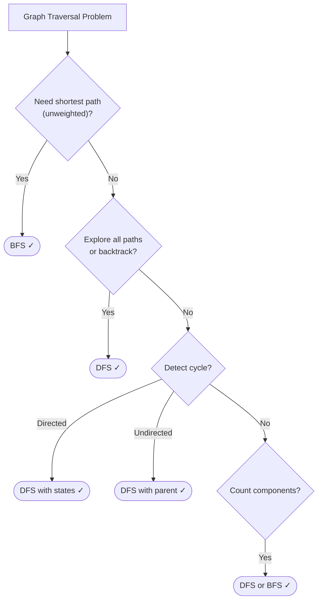

# Graphs: Traversal Patterns

> Master DFS, BFS, and cycle detection - the foundation for all graph problems

---

## Learning Objectives

By the end of this topic you will be able to:

- Implement DFS and BFS from memory, including multi-source BFS variants
- Explain why BFS guarantees shortest path in unweighted graphs while DFS does not
- Detect cycles in both directed and undirected graphs using appropriate state-tracking techniques
- Choose between adjacency list and adjacency matrix representations given a graph's density
- Identify the correct traversal pattern (DFS, BFS, or cycle detection) from a problem description
- Compare the time and space complexity trade-offs between DFS and BFS for a given problem

---

!!! note "Operational reality"
    Package managers do topological sort on the dependency graph every time you install a package — npm, Maven, Cargo, and pip all solve the same problem. Cyclic dependencies cause the sort to fail, which is why package managers either reject them outright or require special cycle-breaking. Build systems (Bazel, Gradle, Make) model targets and dependencies as a DAG and use topological sort to determine build order and parallelism. The "dependency hell" you experience with npm is a graph problem: the resolver is searching for a consistent version assignment that satisfies all edge constraints simultaneously, which can be NP-hard in the general case.

## ELI5: Explain Like I'm 5

<div class="learner-section" markdown>

**Your task:** After implementing all patterns, explain them simply.

**Prompts to guide you:**

1. **What is a graph in one sentence?**
    - A graph is a ___ where ___ are connected by ___
    - Your answer: <span class="fill-in">[Fill in after implementation]</span>

2. **Why/when do we use graphs?**
    - We use graphs when the problem involves ___ between ___, such as ___
    - Your answer: <span class="fill-in">[Fill in after implementation]</span>

3. **Real-world analogy:**
    - Example: "A graph is like a social network where people are nodes and friendships are edges..."
    - Think about how you'd navigate a city map or a subway system.
    - Your analogy: <span class="fill-in">[Fill in]</span>

4. **What's the difference between DFS and BFS?**
    - DFS explores ___ before ___, while BFS explores all ___ before moving ___
    - Your answer: <span class="fill-in">[Fill in after solving problems]</span>

5. **When should you use DFS vs BFS?**
    - Use BFS when you need ___ because it guarantees ___; use DFS when you need ___ because it uses less ___
    - Your answer: <span class="fill-in">[Fill in after practice]</span>

6. **How do you detect cycles in graphs?**
    - Cycles are detected by tracking ___ states. In directed graphs you need ___, in undirected graphs you track ___
    - Your answer: <span class="fill-in">[Fill in after learning]</span>

</div>

---

## Core Implementation

### Pattern 1: DFS (Depth-First Search)

**Concept:** Explore as far as possible along each branch before backtracking.

**Use case:** Detect cycles, find paths, connected components, backtracking problems.

```java
--8<-- "com/study/dsa/graphs/DFS.java"
```


---

!!! warning "Debugging Challenge — Missing Component Counter"

    The `countComponents_Buggy` below has 2 bugs. Find them before reading the answer.

    ```java
    public static int countComponents_Buggy(int n, int[][] edges) {
        Map<Integer, List<Integer>> graph = new HashMap<>();

        for (int i = 0; i < n; i++) {
            graph.put(i, new ArrayList<>());
        }
        for (int[] edge : edges) {
            graph.get(edge[0]).add(edge[1]);
            graph.get(edge[1]).add(edge[0]);
        }

        boolean[] visited = new boolean[n];
        int count = 0;

        for (int i = 0; i < n; i++) {
            if (!visited[i]) {
                dfs(graph, i, visited);        }
        }

        return count;}

    private static void dfs(Map<Integer, List<Integer>> graph, int node, boolean[] visited) {
        visited[node] = true;

        for (int neighbor : graph.get(node)) {
            if (!visited[neighbor]) {
                dfs(graph, neighbor, visited);
            }
        }
    }
    ```

    Trace through with: n = 5, edges = [[0,1], [1,2], [3,4]]
    Expected: 2 components. What do you actually get?

    ??? success "Answer"

        **Bug 1 (inside the loop):** After calling `dfs()`, we never increment `count`. Should be:

        ```java
        if (!visited[i]) {
            dfs(graph, i, visited);
            count++;  // Increment after exploring component
        }
        ```

        **Bug 2:** The same as Bug 1 — `count` is initialised but never incremented, so it always returns 0. Both fixes are the same: add `count++` after the DFS call.

---

### Pattern 2: BFS (Breadth-First Search)

**Concept:** Explore all neighbors at current depth before moving deeper.

**Use case:** Shortest path in unweighted graph, level-order traversal, minimum steps.

```java
--8<-- "com/study/dsa/graphs/BFS.java"
```


---

!!! warning "Debugging Challenge — Broken BFS Level Tracking"

    The `shortestPath_Buggy` below has 2 bugs that cause wrong distances. Find them.

    ```java
    public static int shortestPath_Buggy(Map<Integer, List<Integer>> graph, int start, int end) {
        Queue<Integer> queue = new LinkedList<>();
        Set<Integer> visited = new HashSet<>();
        int distance = 0;

        queue.offer(start);

        while (!queue.isEmpty()) {
            int node = queue.poll();
            if (node == end) return distance;

            for (int neighbor : graph.getOrDefault(node, new ArrayList<>())) {
                if (!visited.contains(neighbor)) {
                    queue.offer(neighbor);
                    visited.add(neighbor);
                }
            }

            distance++;
        }

        return -1;
    }
    ```

    Trace with start=0, end=2, graph: 0→1, 1→2. Expected distance: 2.

    ??? success "Answer"

        **Bug 1:** Missing `visited.add(start)` after adding start to the queue. Without this, the start node may be revisited.

        **Bug 2:** Not processing nodes level-by-level. `distance++` increments for every node polled, not for each complete level. Fix:

        ```java
        while (!queue.isEmpty()) {
            int size = queue.size();  // Process all nodes at current level

            for (int i = 0; i < size; i++) {
                int node = queue.poll();
                if (node == end) return distance;

                for (int neighbor : graph.getOrDefault(node, new ArrayList<>())) {
                    if (!visited.contains(neighbor)) {
                        queue.offer(neighbor);
                        visited.add(neighbor);
                    }
                }
            }

            distance++;  // Increment after processing entire level
        }
        ```

---

### Pattern 3: Cycle Detection

**Interview Priority: ⭐⭐⭐ CRITICAL** - Cycle detection is essential for many graph problems

**Concept:** Detect if graph contains a cycle.

**Use case:** Validate DAG, detect deadlocks, dependency resolution.

```java
--8<-- "com/study/dsa/graphs/CycleDetection.java"
```


---

## Before/After: Why This Pattern Matters

**Your task:** Compare naive vs optimized approaches to understand the impact.

### Example 1: Find Shortest Path

**Problem:** Find shortest path between two nodes in an unweighted graph.

#### Approach 1: DFS (Suboptimal)

```java
// Naive approach - DFS finds A path, not shortest path
public static int findPath_DFS(Map<Integer, List<Integer>> graph, int start, int end) {
    Set<Integer> visited = new HashSet<>();
    return dfsPathLength(graph, start, end, visited, 0);
}

private static int dfsPathLength(Map<Integer, List<Integer>> graph,
                                 int current, int end, Set<Integer> visited, int length) {
    if (current == end) return length;
    if (visited.contains(current)) return Integer.MAX_VALUE;

    visited.add(current);
    int minPath = Integer.MAX_VALUE;

    for (int neighbor : graph.getOrDefault(current, new ArrayList<>())) {
        int pathLen = dfsPathLength(graph, neighbor, end, visited, length + 1);
        minPath = Math.min(minPath, pathLen);
    }

    visited.remove(current); // Backtrack
    return minPath;
}
```

**Analysis:**

- Time: O(V!) in worst case - explores all possible paths
- Space: O(V) - recursion stack
- Problem: Explores unnecessary paths, no guarantee of finding shortest first

#### Approach 2: BFS (Optimized)

```java
// Optimized approach - BFS guarantees shortest path
public static int findPath_BFS(Map<Integer, List<Integer>> graph, int start, int end) {
    Queue<Integer> queue = new LinkedList<>();
    Set<Integer> visited = new HashSet<>();

    queue.offer(start);
    visited.add(start);
    int length = 0;

    while (!queue.isEmpty()) {
        int size = queue.size();

        for (int i = 0; i < size; i++) {
            int node = queue.poll();

            if (node == end) return length;

            for (int neighbor : graph.getOrDefault(node, new ArrayList<>())) {
                if (!visited.contains(neighbor)) {
                    queue.offer(neighbor);
                    visited.add(neighbor);
                }
            }
        }
        length++;
    }

    return -1; // Not found
}
```

**Analysis:**

- Time: O(V + E) - visits each node and edge once
- Space: O(V) - queue storage
- Benefit: Explores level-by-level, first path found is shortest

#### Performance Comparison

| Graph Size       | DFS (worst case)     | BFS     | Speedup   |
|------------------|----------------------|---------|-----------|
| V = 10, E = 20   | ~3,628,800 ops (10!) | 30 ops  | ~120,000x |
| V = 6, E = 10    | ~720 ops (6!)        | 16 ops  | 45x       |
| V = 100, E = 200 | Intractable          | 300 ops | Infinite  |

**Your calculation:** For a graph with V = 8 nodes, BFS would be approximately _____ times faster in worst case.

#### Why Does BFS Find Shortest Path?

!!! note "Key insight"
    BFS explores all nodes at distance k before exploring any node at distance k+1. The first time it reaches the target node is therefore guaranteed to be via the shortest path.

In graph A→B→D, A→C→D looking for path from A to D:

```
BFS Level 0: [A]
BFS Level 1: [B, C]        (distance = 1 from A)
BFS Level 2: [D, D]        (distance = 2 from A, found first time)
```

DFS might go: A → B → D (found) but doesn't know if A → C → D is shorter without exploring everything.

**After implementing, explain in your own words:**

<div class="learner-section" markdown>

- Why does level-order exploration matter? <span class="fill-in">[Your answer]</span>
- When would DFS accidentally find shortest path? <span class="fill-in">[Your answer]</span>

</div>

---

### Example 2: Graph Representation

**Problem:** Store graph with 1000 nodes and 5000 edges.

#### Approach 1: Adjacency Matrix

```java
// Matrix representation - simple but space-inefficient for sparse graphs
public class GraphMatrix {
    private int[][] matrix;
    private int V;

    public GraphMatrix(int vertices) {
        this.V = vertices;
        this.matrix = new int[V][V];
    }

    public void addEdge(int src, int dst) {
        matrix[src][dst] = 1;  // O(1) to add
    }

    public boolean hasEdge(int src, int dst) {
        return matrix[src][dst] == 1;  // O(1) to check
    }

    public List<Integer> getNeighbors(int node) {
        List<Integer> neighbors = new ArrayList<>();
        for (int i = 0; i < V; i++) {
            if (matrix[node][i] == 1) {
                neighbors.add(i);
            }
        }
        return neighbors;  // O(V) to get all neighbors
    }
}
```

**Analysis:**

- Space: O(V²) = O(1,000,000) for 1000 nodes
- Add edge: O(1)
- Check edge: O(1)
- Get neighbors: O(V)
- Memory usage: 1000 × 1000 = 1,000,000 integers ≈ 4 MB

#### Approach 2: Adjacency List

```java
// List representation - space-efficient for sparse graphs
public class GraphList {
    private Map<Integer, List<Integer>> adjList;

    public GraphList() {
        this.adjList = new HashMap<>();
    }

    public void addEdge(int src, int dst) {
        adjList.computeIfAbsent(src, k -> new ArrayList<>()).add(dst);  // O(1) average
    }

    public boolean hasEdge(int src, int dst) {
        return adjList.getOrDefault(src, new ArrayList<>()).contains(dst);  // O(degree)
    }

    public List<Integer> getNeighbors(int node) {
        return adjList.getOrDefault(node, new ArrayList<>());  // O(1) to get list
    }
}
```

**Analysis:**

- Space: O(V + E) = O(1000 + 5000) = O(6000)
- Add edge: O(1) average
- Check edge: O(degree of node)
- Get neighbors: O(1)
- Memory usage: ~6000 integers ≈ 24 KB

#### Space Comparison

| Graph Type                  | Adjacency Matrix | Adjacency List   | Better Choice         |
|-----------------------------|------------------|------------------|-----------------------|
| Dense (V=1000, E=500,000)   | 1M ints (4 MB)   | 501K ints (2 MB) | Matrix (similar)      |
| Sparse (V=1000, E=5000)     | 1M ints (4 MB)   | 6K ints (24 KB)  | **List (167x less)**  |
| Very Sparse (V=1000, E=100) | 1M ints (4 MB)   | 1.1K ints (4 KB) | **List (1000x less)** |

**Your calculation:** For V = 5000 nodes and E = 10,000 edges, adjacency list uses _____ less space than matrix.

#### When to Use Each?

**Use Adjacency Matrix when:**

- Graph is dense (E ≈ V²)
- Need O(1) edge existence checks frequently
- All operations need to be simple array lookups

**Use Adjacency List when:**

- Graph is sparse (E << V²)
- Need to iterate through neighbors frequently
- Memory is limited

**After implementing, explain in your own words:**

<div class="learner-section" markdown>

- Why does sparse vs dense matter? <span class="fill-in">[Your answer]</span>
- What operations are faster with each representation? <span class="fill-in">[Your answer]</span>

</div>

---

## Case Studies: Graph Traversal in the Wild

### Social Networks: BFS for Degrees of Separation

LinkedIn's "2nd connections" feature is a direct BFS implementation. Starting from your profile node, the algorithm runs BFS up to depth 2 and returns all reachable people. The level-by-level guarantee of BFS ensures that a "1st connection" is never mislabelled as a "2nd connection".

### Package Managers: DFS for Dependency Resolution

When `npm install` or `pip install` resolves a dependency tree, it performs a DFS on the dependency graph. If a cycle is detected during that DFS (package A depends on B, B depends on A), the install fails with a "circular dependency" error. The directed cycle detection pattern is the exact algorithm applied here.

### Maps and Navigation: BFS for Fewest Transfers

When a transit app calculates the route with the fewest transfers (not the fastest in time), it uses an unweighted BFS on a station graph. Each station is a node, edges connect adjacent stations, and BFS guarantees the minimum number of edges (transfers) in the result path.

!!! warning "When it breaks"
    BFS breaks in memory-constrained environments for graphs with high branching factor: the frontier queue can grow to O(V) nodes at its widest level. Bidirectional BFS reduces memory by meeting in the middle. DFS breaks for shortest paths in weighted graphs — it finds a path, not the shortest path. Adjacency matrix breaks for sparse graphs: a graph with 1M nodes and 2M edges stored as a matrix requires 1TB of memory; the same graph as an adjacency list requires roughly 16MB. The matrix is only appropriate when the graph is dense (edges ≈ V²).

---

## Common Misconceptions

!!! danger "DFS finds the shortest path"
    DFS finds *a* path, not necessarily the shortest one. It explores as deep as possible along one branch before backtracking, so it may discover a long path before a shorter one exists in an unexplored branch. BFS, by exploring level by level, guarantees that the first path found is the shortest in an unweighted graph.

!!! danger "You must mark a node visited before calling DFS on it"
    In undirected graphs, if you mark visited *after* exploring (not before), you risk re-entering the same node from different neighbours before the first DFS call returns. Always add a node to `visited` the moment you decide to explore it — not after.

!!! danger "Adjacency list is always better than adjacency matrix"
    Adjacency list is better *for sparse graphs*. For dense graphs (E ≈ V²), the overhead of linked structures can make adjacency matrix competitive or better, especially when O(1) edge-existence checks are the dominant operation. The right choice depends on graph density and which operations are most frequent.

---

## Decision Framework

<div class="learner-section" markdown>

**Your task:** Build decision trees for when to use each graph algorithm.

### Question 1: DFS vs BFS - Which to use?

Answer after solving problems:

**Use DFS when:**

- Need to explore all paths: <span class="fill-in">[Backtracking, cycle detection]</span>
- Memory is limited: <span class="fill-in">[DFS uses less space]</span>
- Finding any path (not shortest): <span class="fill-in">[Fill in]</span>

**Use BFS when:**

- Need shortest path: <span class="fill-in">[Unweighted graphs]</span>
- Level-order traversal: <span class="fill-in">[Process by distance from source]</span>
- Multi-source problems: <span class="fill-in">[Fill in examples]</span>

### Question 2: Graph representation?

**Adjacency List:**

- Use when: <span class="fill-in">[Sparse graphs, need to iterate neighbors]</span>
- Space: <span class="fill-in">[O(V + E)]</span>

**Adjacency Matrix:**

- Use when: <span class="fill-in">[Dense graphs, need to check edge existence]</span>
- Space: <span class="fill-in">[O(V²)]</span>

### Your Decision Tree

Build this after solving practice problems:

```mermaid
flowchart TD
    Start["Graph Traversal Problem"]

    Q1{"Need shortest path<br/>(unweighted)?"}
    Start --> Q1
    BFS(["BFS ✓"])
    Q1 -->|"Yes"| BFS

    Q2{"Explore all paths<br/>or backtrack?"}
    Q1 -->|"No"| Q2
    DFS1(["DFS ✓"])
    Q2 -->|"Yes"| DFS1

    Q3{"Detect cycle?"}
    Q2 -->|"No"| Q3
    DFS2(["DFS with states ✓"])
    Q3 -->|"Directed"| DFS2
    DFS3(["DFS with parent ✓"])
    Q3 -->|"Undirected"| DFS3

    Q4{"Count components?"}
    Q3 -->|"No"| Q4
    DFSBFS(["DFS or BFS ✓"])
    Q4 -->|"Yes"| DFSBFS
```

**Note:** For weighted graphs, topological sort, and MST problems, see "Advanced Graph Algorithms"

</div>

---

## Practice

<div class="learner-section" markdown>

### LeetCode Problems

**Interview Priority:** Focus on these patterns - they appear in 60% of graph interviews

**Easy (Complete 2-3):**

- [ ] [997. Find the Town Judge](https://leetcode.com/problems/find-the-town-judge/) ⭐
    - Pattern: <span class="fill-in">[Graph properties]</span>
    - Your solution time: <span class="fill-in">___</span>
    - Key insight: <span class="fill-in">[Fill in]</span>

- [ ] [1971. Find if Path Exists in Graph](https://leetcode.com/problems/find-if-path-exists-in-graph/) ⭐⭐
    - Pattern: <span class="fill-in">[DFS/BFS]</span>
    - Your solution time: <span class="fill-in">___</span>
    - Key insight: <span class="fill-in">[Fill in]</span>

**Medium (Complete ALL - these are critical):**

- [ ] [200. Number of Islands](https://leetcode.com/problems/number-of-islands/) ⭐⭐⭐
    - Pattern: <span class="fill-in">[DFS]</span>
    - Difficulty: <span class="fill-in">[Rate 1-10]</span>
    - Key insight: <span class="fill-in">[Fill in]</span>

- [ ] [133. Clone Graph](https://leetcode.com/problems/clone-graph/) ⭐⭐⭐
    - Pattern: <span class="fill-in">[DFS/BFS]</span>
    - Difficulty: <span class="fill-in">[Rate 1-10]</span>
    - Key insight: <span class="fill-in">[Fill in]</span>

- [ ] [994. Rotting Oranges](https://leetcode.com/problems/rotting-oranges/) ⭐⭐⭐
    - Pattern: <span class="fill-in">[Multi-source BFS]</span>
    - Difficulty: <span class="fill-in">[Rate 1-10]</span>
    - Key insight: <span class="fill-in">[Fill in]</span>

- [ ] [417. Pacific Atlantic Water Flow](https://leetcode.com/problems/pacific-atlantic-water-flow/) ⭐⭐
    - Pattern: <span class="fill-in">[DFS/BFS from multiple sources]</span>
    - Difficulty: <span class="fill-in">[Rate 1-10]</span>
    - Key insight: <span class="fill-in">[Fill in]</span>

- [ ] [261. Graph Valid Tree](https://leetcode.com/problems/graph-valid-tree/) ⭐⭐
    - Pattern: <span class="fill-in">[Cycle detection]</span>
    - Difficulty: <span class="fill-in">[Rate 1-10]</span>
    - Key insight: <span class="fill-in">[Fill in]</span>

**Hard (Optional):**

- [ ] [127. Word Ladder](https://leetcode.com/problems/word-ladder/) ⭐⭐
    - Pattern: <span class="fill-in">[BFS]</span>
    - Key insight: <span class="fill-in">[Fill in after solving]</span>

**Next step:** After mastering these, move to "Advanced Graph Algorithms" for Course Schedule, Dijkstra, MST

**Failure modes:**

- What happens if the graph has no edges (only isolated nodes) and you run DFS to count connected components — does your algorithm still return the correct count? <span class="fill-in">[Fill in]</span>
- How does your BFS shortest-path implementation behave when all nodes in the graph are disconnected components and the target node is unreachable? <span class="fill-in">[Fill in]</span>

</div>

---

## Test Your Understanding

Answer these without referring to your notes or implementation.

1. Why does BFS guarantee the shortest path in an unweighted graph, but DFS does not? Describe the structural reason, not just the rule.

    ??? success "Rubric"
        A complete answer addresses: (1) BFS's level-order property — it explores all nodes at distance k before any node at distance k+1, so the first time a target node is dequeued its distance is definitionally the minimum; (2) DFS has no such ordering guarantee — it may descend deep into one branch and find a long path before discovering a shorter path in a sibling branch; (3) the structural cause — BFS uses a FIFO queue that enforces breadth-first ordering, while DFS uses a stack (or recursion) that enforces depth-first ordering with no distance guarantee.

2. What is the difference between the visited-state arrays needed for directed vs undirected cycle detection? Why does a directed graph require a three-state system?

    ??? success "Rubric"
        A complete answer addresses: (1) undirected cycle detection uses a boolean visited array and a parent parameter — a back edge to any node other than the immediate parent indicates a cycle; (2) directed cycle detection uses a three-state system: unvisited (0), in current DFS path / "gray" (1), fully explored / "black" (2); (3) why three states are needed — in a directed graph, a back edge to a "gray" node means we've found a cycle on the current path, but a back edge to a "black" node is just a cross-edge and is not a cycle; collapsing these two states would produce false positives (reporting a cycle when the edge is merely a cross-edge to an already-completed DFS subtree).

3. A social network has 500 million users and each user averages 200 connections. You need to check if two arbitrary users are connected within 3 hops. Which representation and algorithm do you choose, and what is the approximate cost?

    ??? success "Rubric"
        A complete answer addresses: (1) representation — adjacency list, because E ≈ 500M × 200 / 2 = 50 billion edges and an adjacency matrix would require 500M² cells (completely infeasible); (2) algorithm — BFS with a depth limit of 3, starting from one user and stopping when the depth exceeds 3 or the target is found; (3) approximate cost — in the worst case BFS explores up to 200³ = 8 million nodes at depth 3 per query; in practice bidirectional BFS (starting from both endpoints) reduces this to roughly 2 × 200^1.5 ≈ 5,600 nodes; (4) practical consideration — distributed graph engines (like Facebook's TAO) shard the graph across machines, so a naive single-machine BFS is not feasible at this scale.

4. An adjacency matrix and an adjacency list both store the same graph. Which supports faster "does edge (u,v) exist?" checks, and which supports faster "iterate all neighbours of u" operations?

    ??? success "Rubric"
        A complete answer addresses: (1) edge existence — adjacency matrix wins with O(1) by direct indexing `matrix[u][v]`; adjacency list requires O(degree(u)) to scan the neighbour list; (2) iterate all neighbours — adjacency list wins with O(degree(u)) by directly returning the stored list; adjacency matrix requires O(V) to scan the entire row even if the node has only 2 neighbours; (3) the implication — for sparse graphs where most rows in the matrix are nearly empty, the adjacency list dominates; for dense graphs the gap narrows.

5. A colleague says "I always use DFS because it uses less memory than BFS." When is this statement wrong, and what is the actual space complexity comparison?

    ??? success "Rubric"
        A complete answer addresses: (1) when DFS is worse — on a wide, shallow graph (e.g. a star graph with one hub and V-1 leaves), BFS uses O(V) queue space but DFS uses only O(depth) ≈ O(1) stack space, so here DFS is better; but on a long chain graph, DFS uses O(V) recursion stack space while BFS uses O(1) queue space (only a few nodes at each level); (2) the actual complexities — both DFS and BFS are O(V) space in the worst case; (3) the nuance — for very deep graphs, DFS's recursion stack can overflow (Java's default stack is ~500K frames), while BFS's queue is heap-allocated and much safer; so the colleague's rule of thumb can lead to stack overflow bugs on deep graphs.

---

## Connected Topics

<div class="bs-callout bs-callout-info" markdown>

**Where this topic connects**

- **[06. Trees](06-trees.md)** — trees are acyclic connected graphs; every tree traversal (DFS/BFS) is a special case of graph traversal with no cycle handling needed → [06. Trees](06-trees.md)
- **[09. Union-Find](09-union-find.md)** — Union-Find detects connectivity and cycles without explicit graph traversal; compare with DFS-based cycle detection → [09. Union-Find](09-union-find.md)
- **[11. Advanced Graphs](11-advanced-graphs.md)** — DFS/BFS are the building blocks; Advanced Graphs adds weighted edges, directed acyclic graphs, and shortest-path guarantees → [11. Advanced Graphs](11-advanced-graphs.md)

</div>
