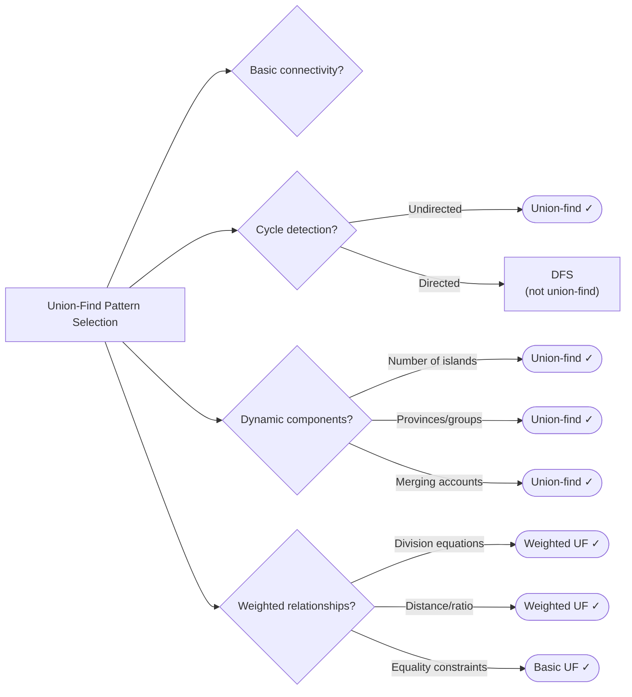

# Union-Find (Disjoint Set Union)

> Efficiently track and merge disjoint sets with near-constant time operations

---

## Learning Objectives

By the end of this topic you will be able to:

- Implement union-find with both path compression and union by rank from memory
- Explain why path compression achieves amortized O(α(n)) time per operation
- Detect cycles in undirected graphs using union-find
- Identify when union-find is the right tool versus DFS/BFS
- Track additional state (component size, count) on top of basic union-find
- Recognize weighted and advanced union-find problem variants

---

## ELI5: Explain Like I'm 5

<div class="learner-section" markdown>

**Your task:** After implementing all patterns, explain them simply.

**Prompts to guide you:**

1. **What is union-find in one sentence?**
    - Union-find is a data structure that ___ by assigning each element a ___ so you can ___ in near-constant time.
    - Your answer: <span class="fill-in">[Fill in after implementation]</span>

2. **What do "union" and "find" operations do?**
    - "Find" returns ___, while "union" merges ___ into ___.
    - Your answer: <span class="fill-in">[Fill in after implementation]</span>

3. **Real-world analogy:**
    - Example: "Union-Find is like organizing people into groups where you can quickly check if two people are in the
      same group..."
    - Your analogy: <span class="fill-in">[Fill in]</span>

4. **When does this pattern work?**
    - This pattern works when you need to ___ and ___ groups dynamically, but never ___.
    - Your answer: <span class="fill-in">[Fill in after solving problems]</span>

5. **What makes union-find fast?**
    - Path compression flattens ___ so future finds cost ___, while union by rank prevents ___.
    - Your answer: <span class="fill-in">[Fill in after learning optimizations]</span>

</div>

---

## Quick Quiz (Do BEFORE implementing)

!!! tip "How to use this section"
    Complete your predictions now, before reading further. You will revisit and verify each answer after running the
    benchmark (or completing the implementation).

<div class="learner-section" markdown>

**Your task:** Test your intuition without looking at code. Answer these, then verify after implementation.

### Complexity Predictions

1. **Naive connectivity check using DFS/BFS:**
    - Time complexity per query: <span class="fill-in">[Your guess: O(?)]</span>
    - Verified after learning: <span class="fill-in">[Actual: O(?)]</span>

2. **Union-Find with optimizations (path compression + union by rank):**
    - Time complexity per operation: <span class="fill-in">[Your guess: O(?)]</span>
    - Space complexity: <span class="fill-in">[Your guess: O(?)]</span>
    - Verified: <span class="fill-in">[Actual]</span>

3. **Speedup calculation:**
    - If n = 10,000 nodes with 1,000 connectivity queries
    - DFS approach: <span class="fill-in">_____</span> operations
    - Union-Find: <span class="fill-in">_____</span> operations
    - Speedup factor: <span class="fill-in">_____</span> times faster

### Scenario Predictions

**Scenario 1:** You have nodes {0, 1, 2, 3, 4}. Perform: union(0,1), union(2,3), union(1,2)

- **After these operations, which nodes are connected?** <span class="fill-in">[Fill in]</span>
- **How many disjoint components remain?** <span class="fill-in">[Your guess]</span>
- **Are nodes 0 and 3 connected?** <span class="fill-in">[Yes/No - Why?]</span>
- **What happens if we call union(0,3) now?** <span class="fill-in">[Fill in]</span>

**Scenario 2:** Graph edges: [(0,1), (1,2), (2,3), (3,0)]

- **Can you detect a cycle using union-find?** <span class="fill-in">[Yes/No - How?]</span>
- **Which edge creates the cycle?** <span class="fill-in">[Fill in your reasoning]</span>
- **What does find(x) return after path compression?** <span class="fill-in">[Fill in]</span>

**Scenario 3:** Why path compression?

- **Without path compression:** Finding root of deeply nested node costs <span class="fill-in">[O(?)]</span>
- **With path compression:** Amortized cost becomes <span class="fill-in">[O(?)]</span>
- **Draw a tree before and after path compression:** <span class="fill-in">[Sketch after implementation]</span>

### Trade-off Quiz

**Question:** When would DFS/BFS be BETTER than union-find for connectivity?

- Your answer: <span class="fill-in">[Fill in before implementation]</span>
- Verified answer: <span class="fill-in">[Fill in after learning]</span>

**Question:** What's the MAIN benefit of union by rank?

- [ ] Saves memory
- [ ] Reduces number of nodes
- [ ] Keeps tree height balanced
- [ ] Makes find operation faster initially

Verify after implementation: <span class="fill-in">[Which one(s)?]</span>

**Question:** Can union-find split a component into smaller components?

- Your answer: <span class="fill-in">[Yes/No - Why or why not?]</span>
- Implication: <span class="fill-in">[When does this limitation matter?]</span>

</div>

---

## Core Implementation

### Pattern 1: Basic Union-Find with Optimizations

**Concept:** Track connected components with path compression and union by rank.

**Use case:** Dynamic connectivity, detecting cycles, network connections.

```java
public class UnionFind {

    /**
     * Union-Find Data Structure
     * Time: O(α(n)) ≈ O(1) per operation with optimizations
     * Space: O(n)
     *
     * TODO: Implement with path compression and union by rank
     */
    static class DSU {
        private int[] parent;
        private int[] rank; // or size, depending on optimization
        private int components; // Track number of disjoint sets

        public DSU(int n) {
            // TODO: Initialize parent array: parent[i] = i
            // TODO: Initialize rank array: rank[i] = 0
            // TODO: Initialize components
        }

        /**
         * Find with path compression
         * Time: O(α(n)) amortized
         *
         * TODO: Implement find with path compression
         */
        public int find(int x) {
            // TODO: Implement iteration/conditional logic
            // TODO: Path compression: parent[x] = find(parent[x])
            // TODO: Return parent[x]
            return 0; // Replace with implementation
        }

        /**
         * Union by rank
         * Time: O(α(n)) amortized
         *
         * TODO: Implement union by rank
         */
        public boolean union(int x, int y) {
            // TODO: Find roots of x and y
            // TODO: Implement iteration/conditional logic
            // TODO: Attach smaller rank tree under larger rank tree
            // TODO: Implement iteration/conditional logic
            // TODO: Decrement components count
            // TODO: Return true (successful union)
            return false; // Replace with implementation
        }

        /**
         * Check if connected
         * Time: O(α(n))
         */
        public boolean connected(int x, int y) {
            // TODO: Return find(x) == find(y)
            return false; // Replace with implementation
        }

        /**
         * Get number of disjoint components
         * Time: O(1)
         */
        public int getComponents() {
            // TODO: Return components count
            return 0; // Replace with implementation
        }

        /**
         * Get size of component containing x
         * Time: O(α(n))
         */
        public int getSize(int x) {
            // TODO: Implement iteration/conditional logic
            // TODO: Otherwise, count elements with same root
            return 0; // Replace with implementation
        }
    }

    /**
     * Problem: Number of connected components in undirected graph
     * Time: O(E * α(V)), Space: O(V)
     *
     * TODO: Implement using union-find
     */
    public static int countComponents(int n, int[][] edges) {
        // TODO: Initialize DSU with n nodes
        // TODO: Implement iteration/conditional logic
        // TODO: Return number of components

        return 0; // Replace with implementation
    }
}
```

**Runnable Client Code:**

```java
public class UnionFindClient {

    public static void main(String[] args) {
        System.out.println("=== Union-Find ===\n");

        // Test 1: Basic operations
        System.out.println("--- Test 1: Basic Operations ---");
        UnionFind.DSU dsu = new UnionFind.DSU(10);

        System.out.println("Initial components: " + dsu.getComponents());

        // Connect some nodes
        int[][] connections = {{0, 1}, {1, 2}, {3, 4}, {5, 6}, {6, 7}};
        System.out.println("\nConnecting nodes:");
        for (int[] conn : connections) {
            boolean success = dsu.union(conn[0], conn[1]);
            System.out.printf("  union(%d, %d): %s%n", conn[0], conn[1],
                success ? "SUCCESS" : "ALREADY CONNECTED");
        }

        System.out.println("\nFinal components: " + dsu.getComponents());

        // Test connectivity
        System.out.println("\nConnectivity tests:");
        int[][] tests = {{0, 2}, {0, 3}, {3, 4}, {5, 8}};
        for (int[] test : tests) {
            boolean connected = dsu.connected(test[0], test[1]);
            System.out.printf("  connected(%d, %d): %s%n", test[0], test[1],
                connected ? "YES" : "NO");
        }

        // Test 2: Count components
        System.out.println("\n--- Test 2: Count Components ---");
        int n = 5;
        int[][] edges = {{0, 1}, {1, 2}, {3, 4}};

        System.out.println("Nodes: " + n);
        System.out.println("Edges: " + java.util.Arrays.deepToString(edges));

        int components = UnionFind.countComponents(n, edges);
        System.out.println("Components: " + components);
    }
}
```

!!! warning "Debugging Challenge — Missing Path Compression"
    The following find implementation is supposed to use path compression but has a critical bug:

    ```java
    public int find_Buggy(int x) {
        if (parent[x] != x) {
            return find_Buggy(parent[x]);
        }
        return parent[x];
    }
    ```

    - What is the missing line?
    - For a chain 0 → 1 → 2 → 3 → 4 → 5, how many links does find(5) traverse without the fix? After the fix?

    ??? success "Answer"
        **Bug:** Missing path compression assignment. The line should be:

        ```java
        parent[x] = find_Buggy(parent[x]);
        ```

        Without this, the recursive call returns the root but does not flatten the tree. Every subsequent call to find(5)
        still traverses all 5 links. With path compression, after the first call each node points directly to the root,
        making subsequent calls O(1).

---

### Pattern 2: Cycle Detection

**Concept:** Detect cycles in undirected graphs using union-find.

**Use case:** Redundant connection, graph valid tree.

```java
import java.util.*;

public class CycleDetection {

    /**
     * Problem: Detect if undirected graph has a cycle
     * Time: O(E * α(V)), Space: O(V)
     *
     * TODO: Implement cycle detection
     */
    public static boolean hasCycle(int n, int[][] edges) {
        // TODO: Initialize union-find
        // TODO: Implement iteration/conditional logic
        // TODO: Return false if no cycle

        return false; // Replace with implementation
    }

    /**
     * Problem: Find redundant connection (edge that creates cycle)
     * Time: O(E * α(V)), Space: O(V)
     *
     * TODO: Implement redundant connection
     */
    public static int[] findRedundantConnection(int[][] edges) {
        // TODO: Initialize union-find
        // TODO: Implement iteration/conditional logic

        return new int[]{-1, -1}; // Replace with implementation
    }

    /**
     * Problem: Check if graph is a valid tree
     * Time: O(E * α(V)), Space: O(V)
     *
     * TODO: Implement tree validation
     */
    public static boolean validTree(int n, int[][] edges) {
        // TODO: Tree must have exactly n-1 edges
        // TODO: Must have no cycles
        // TODO: Must be fully connected (1 component)

        return false; // Replace with implementation
    }

    /**
     * Problem: Find redundant directed connection
     * Time: O(E * α(V)), Space: O(V)
     *
     * TODO: Implement for directed graph
     */
    public static int[] findRedundantDirectedConnection(int[][] edges) {
        // TODO: More complex - need to handle:
        // TODO: Try removing each candidate edge

        return new int[]{-1, -1}; // Replace with implementation
    }
}
```

**Runnable Client Code:**

```java
import java.util.*;

public class CycleDetectionClient {

    public static void main(String[] args) {
        System.out.println("=== Cycle Detection ===\n");

        // Test 1: Has cycle
        System.out.println("--- Test 1: Has Cycle ---");
        int[][] testGraphs = {
            {{0, 1}, {1, 2}},           // No cycle
            {{0, 1}, {1, 2}, {2, 0}},   // Cycle
            {{0, 1}, {0, 2}, {1, 2}}    // Cycle
        };

        for (int i = 0; i < testGraphs.length; i++) {
            int n = 3;
            boolean cycle = CycleDetection.hasCycle(n, testGraphs[i]);
            System.out.printf("Graph %d: %s -> %s%n", i + 1,
                Arrays.deepToString(testGraphs[i]),
                cycle ? "HAS CYCLE" : "NO CYCLE");
        }

        // Test 2: Redundant connection
        System.out.println("\n--- Test 2: Redundant Connection ---");
        int[][] edgeSets = {
            {{1, 2}, {1, 3}, {2, 3}},
            {{1, 2}, {2, 3}, {3, 4}, {1, 4}, {1, 5}}
        };

        for (int[][] edges : edgeSets) {
            int[] redundant = CycleDetection.findRedundantConnection(edges);
            System.out.printf("Edges: %s%n", Arrays.deepToString(edges));
            System.out.printf("Redundant: %s%n%n", Arrays.toString(redundant));
        }

        // Test 3: Valid tree
        System.out.println("--- Test 3: Valid Tree ---");
        int[][] treeTests = {
            {{0, 1}, {0, 2}, {0, 3}, {1, 4}},           // Valid tree (5 nodes)
            {{0, 1}, {1, 2}, {2, 3}, {1, 3}, {1, 4}}    // Not tree (cycle)
        };

        for (int i = 0; i < treeTests.length; i++) {
            int n = 5;
            boolean isTree = CycleDetection.validTree(n, treeTests[i]);
            System.out.printf("Test %d: %s -> %s%n", i + 1,
                Arrays.deepToString(treeTests[i]),
                isTree ? "VALID TREE" : "NOT TREE");
        }
    }
}
```

!!! warning "Debugging Challenge — Wrong Union Target"
    The following union implementation attaches the wrong nodes:

    ```java
    public boolean union_Buggy(int x, int y) {
        int rootX = find(x);
        int rootY = find(y);
        if (rootX == rootY) return false;
        if (rank[rootX] < rank[rootY]) {
            parent[x] = rootY;   // BUG
        } else if (rank[rootX] > rank[rootY]) {
            parent[y] = rootX;   // BUG
        } else {
            parent[rootY] = rootX;
            rank[rootX]++;
        }
        return true;
    }
    ```

    What is wrong with `parent[x] = rootY` and `parent[y] = rootX`?

    ??? success "Answer"
        The bug is attaching the original nodes `x` and `y` instead of their roots `rootX` and `rootY`. This breaks the
        tree structure because `x` is just one node in a potentially large subtree — attaching `x` directly to `rootY`
        disconnects the rest of x's subtree from the union.

        **Correct:**

        ```java
        if (rank[rootX] < rank[rootY]) {
            parent[rootX] = rootY;
        } else if (rank[rootX] > rank[rootY]) {
            parent[rootY] = rootX;
        }
        ```

        Union by rank only maintains its height-bounding guarantee when you attach entire subtrees (at their roots), not
        individual nodes.

---

### Pattern 3: Connected Components Problems

**Concept:** Group elements into connected components.

**Use case:** Number of islands, accounts merge, provinces.

```java
import java.util.*;

public class ConnectedComponents {

    /**
     * Problem: Number of islands (using union-find)
     * Time: O(m*n * α(m*n)), Space: O(m*n)
     *
     * TODO: Implement using union-find
     */
    public static int numIslands(char[][] grid) {
        // TODO: Initialize union-find for all cells
        // TODO: Implement iteration/conditional logic
        // TODO: Count unique components of land cells

        return 0; // Replace with implementation
    }

    /**
     * Problem: Number of provinces (friend circles)
     * Time: O(n^2 * α(n)), Space: O(n)
     *
     * TODO: Implement using union-find
     */
    public static int findCircleNum(int[][] isConnected) {
        // TODO: Initialize union-find with n people
        // TODO: Implement iteration/conditional logic
        // TODO: Return number of components

        return 0; // Replace with implementation
    }

    /**
     * Problem: Accounts merge (emails belonging to same person)
     * Time: O(n*k * α(n*k)), Space: O(n*k)
     *
     * TODO: Implement accounts merge
     */
    public static List<List<String>> accountsMerge(List<List<String>> accounts) {
        // TODO: Map email to account index
        // TODO: Union accounts that share emails
        // TODO: Group emails by component
        // TODO: Sort emails in each group

        return new ArrayList<>(); // Replace with implementation
    }

    /**
     * Problem: Smallest string with swaps
     * Time: O(n log n + E * α(n)), Space: O(n)
     *
     * TODO: Implement using union-find
     */
    public static String smallestStringWithSwaps(String s, List<List<Integer>> pairs) {
        // TODO: Union indices that can be swapped
        // TODO: Group characters by component
        // TODO: Sort characters in each component
        // TODO: Reconstruct string

        return ""; // Replace with implementation
    }
}
```

**Runnable Client Code:**

```java
import java.util.*;

public class ConnectedComponentsClient {

    public static void main(String[] args) {
        System.out.println("=== Connected Components ===\n");

        // Test 1: Number of islands
        System.out.println("--- Test 1: Number of Islands ---");
        char[][] grid = {
            {'1','1','0','0','0'},
            {'1','1','0','0','0'},
            {'0','0','1','0','0'},
            {'0','0','0','1','1'}
        };

        System.out.println("Grid:");
        for (char[] row : grid) {
            System.out.println("  " + Arrays.toString(row));
        }

        int islands = ConnectedComponents.numIslands(grid);
        System.out.println("Number of islands: " + islands);

        // Test 2: Number of provinces
        System.out.println("\n--- Test 2: Number of Provinces ---");
        int[][] isConnected = {
            {1, 1, 0},
            {1, 1, 0},
            {0, 0, 1}
        };

        System.out.println("Connections:");
        for (int[] row : isConnected) {
            System.out.println("  " + Arrays.toString(row));
        }

        int provinces = ConnectedComponents.findCircleNum(isConnected);
        System.out.println("Number of provinces: " + provinces);

        // Test 3: Accounts merge
        System.out.println("\n--- Test 3: Accounts Merge ---");
        List<List<String>> accounts = Arrays.asList(
            Arrays.asList("John", "johnsmith@mail.com", "john00@mail.com"),
            Arrays.asList("John", "johnnybravo@mail.com"),
            Arrays.asList("John", "johnsmith@mail.com", "john_newyork@mail.com"),
            Arrays.asList("Mary", "mary@mail.com")
        );

        System.out.println("Accounts:");
        for (List<String> account : accounts) {
            System.out.println("  " + account);
        }

        List<List<String>> merged = ConnectedComponents.accountsMerge(accounts);
        System.out.println("\nMerged accounts:");
        for (List<String> account : merged) {
            System.out.println("  " + account);
        }

        // Test 4: Smallest string with swaps
        System.out.println("\n--- Test 4: Smallest String with Swaps ---");
        String s = "dcab";
        List<List<Integer>> pairs = Arrays.asList(
            Arrays.asList(0, 3),
            Arrays.asList(1, 2)
        );

        System.out.println("String: " + s);
        System.out.println("Swappable pairs: " + pairs);

        String result = ConnectedComponents.smallestStringWithSwaps(s, pairs);
        System.out.println("Smallest string: " + result);
    }
}
```

---

### Pattern 4: Advanced Union-Find Applications

**Concept:** Use union-find with additional constraints or weights.

**Use case:** Satisfiability, equations, sentence similarity.

```java
import java.util.*;

public class AdvancedUnionFind {

    /**
     * Problem: Satisfiability of equality equations
     * Time: O(n * α(26)), Space: O(26)
     *
     * TODO: Implement equation satisfaction check
     */
    public static boolean equationsPossible(String[] equations) {
        // TODO: Initialize union-find for 26 letters
        // TODO: First pass: union all equal variables (==)
        // TODO: Second pass: check all inequalities (!=)
        // TODO: Return true if no contradictions

        return false; // Replace with implementation
    }

    /**
     * Problem: Evaluate division (transitive division)
     * Time: O(E * α(V) + Q * V), Space: O(V)
     *
     * TODO: Implement with weighted union-find
     */
    public static double[] calcEquation(List<List<String>> equations,
                                       double[] values,
                                       List<List<String>> queries) {
        // TODO: Build graph with division relationships
        // TODO: Implement iteration/conditional logic
        // TODO: Or use weighted union-find with ratios

        return new double[0]; // Replace with implementation
    }

    /**
     * Problem: Sentence similarity II (transitive similarity)
     * Time: O(P * α(W)), Space: O(W)
     *
     * TODO: Implement similarity check
     */
    public static boolean areSentencesSimilar(String[] words1, String[] words2,
                                             List<List<String>> pairs) {
        // TODO: Implement iteration/conditional logic
        // TODO: Union similar word pairs
        // TODO: Check if words1[i] and words2[i] in same component

        return false; // Replace with implementation
    }

    /**
     * Problem: Minimize malware spread
     * Time: O(n^2 * α(n)), Space: O(n)
     *
     * TODO: Implement using union-find
     */
    public static int minMalwareSpread(int[][] graph, int[] initial) {
        // TODO: Union all connected nodes
        // TODO: Implement iteration/conditional logic
        // TODO: Return node whose removal saves most nodes

        return 0; // Replace with implementation
    }
}
```

**Runnable Client Code:**

```java
import java.util.*;

public class AdvancedUnionFindClient {

    public static void main(String[] args) {
        System.out.println("=== Advanced Union-Find ===\n");

        // Test 1: Equations possible
        System.out.println("--- Test 1: Equations Possible ---");
        String[][] equationSets = {
            {"a==b", "b!=a"},
            {"b==a", "a==b"},
            {"a==b", "b==c", "a==c"}
        };

        for (String[] equations : equationSets) {
            boolean possible = AdvancedUnionFind.equationsPossible(equations);
            System.out.printf("Equations: %s%n", Arrays.toString(equations));
            System.out.printf("Possible: %s%n%n", possible ? "YES" : "NO");
        }

        // Test 2: Evaluate division
        System.out.println("--- Test 2: Evaluate Division ---");
        List<List<String>> equations = Arrays.asList(
            Arrays.asList("a", "b"),
            Arrays.asList("b", "c")
        );
        double[] values = {2.0, 3.0};
        List<List<String>> queries = Arrays.asList(
            Arrays.asList("a", "c"),
            Arrays.asList("b", "a"),
            Arrays.asList("a", "e"),
            Arrays.asList("a", "a"),
            Arrays.asList("x", "x")
        );

        System.out.println("Equations: " + equations);
        System.out.println("Values: " + Arrays.toString(values));
        System.out.println("Queries: " + queries);

        double[] results = AdvancedUnionFind.calcEquation(equations, values, queries);
        System.out.println("Results: " + Arrays.toString(results));

        // Test 3: Sentence similarity
        System.out.println("\n--- Test 3: Sentence Similarity II ---");
        String[] words1 = {"great", "acting", "skills"};
        String[] words2 = {"fine", "drama", "talent"};
        List<List<String>> pairs = Arrays.asList(
            Arrays.asList("great", "good"),
            Arrays.asList("fine", "good"),
            Arrays.asList("acting", "drama"),
            Arrays.asList("skills", "talent")
        );

        System.out.println("Sentence 1: " + Arrays.toString(words1));
        System.out.println("Sentence 2: " + Arrays.toString(words2));
        System.out.println("Similar pairs: " + pairs);

        boolean similar = AdvancedUnionFind.areSentencesSimilar(words1, words2, pairs);
        System.out.println("Similar: " + (similar ? "YES" : "NO"));
    }
}
```

---

## Before/After: Why This Pattern Matters

**Your task:** Compare naive vs optimized approaches to understand the impact.

### Example: Connectivity Queries

**Problem:** Check if two nodes are connected in a dynamic graph with union operations.

#### Approach 1: DFS/BFS for Each Query

```java
// Naive approach - Traverse graph for every connectivity check
public class NaiveConnectivity {
    private List<Integer>[] graph;

    public NaiveConnectivity(int n) {
        graph = new ArrayList[n];
        for (int i = 0; i < n; i++) {
            graph[i] = new ArrayList<>();
        }
    }

    public void union(int x, int y) {
        graph[x].add(y);
        graph[y].add(x);
    }

    public boolean connected(int x, int y) {
        // DFS to check connectivity
        boolean[] visited = new boolean[graph.length];
        return dfs(x, y, visited);
    }

    private boolean dfs(int node, int target, boolean[] visited) {
        if (node == target) return true;
        visited[node] = true;

        for (int neighbor : graph[node]) {
            if (!visited[neighbor]) {
                if (dfs(neighbor, target, visited)) return true;
            }
        }
        return false;
    }
}
```

**Analysis:**

- Time per union: O(1) - Just add edges
- Time per connected query: O(V + E) - Full DFS/BFS traversal
- Space: O(V + E) - Store all edges
- For 1,000 queries on 10,000 nodes: ~10,000,000+ operations per query

#### Approach 2: Union-Find (Optimized)

```java
// Optimized approach - Union-Find with path compression and union by rank
public class OptimizedConnectivity {
    private int[] parent;
    private int[] rank;

    public OptimizedConnectivity(int n) {
        parent = new int[n];
        rank = new int[n];
        for (int i = 0; i < n; i++) {
            parent[i] = i;
            rank[i] = 0;
        }
    }

    public int find(int x) {
        // Path compression: point directly to root
        if (parent[x] != x) {
            parent[x] = find(parent[x]);
        }
        return parent[x];
    }

    public void union(int x, int y) {
        int rootX = find(x);
        int rootY = find(y);

        if (rootX == rootY) return;

        // Union by rank: attach smaller tree under larger
        if (rank[rootX] < rank[rootY]) {
            parent[rootX] = rootY;
        } else if (rank[rootX] > rank[rootY]) {
            parent[rootY] = rootX;
        } else {
            parent[rootY] = rootX;
            rank[rootX]++;
        }
    }

    public boolean connected(int x, int y) {
        return find(x) == find(y);
    }
}
```

**Analysis:**

- Time per operation: O(α(n)) ≈ O(1) - Inverse Ackermann (practically constant)
- Space: O(n) - Only parent and rank arrays
- For 1,000 queries: ~1,000 operations total (vs millions)

#### Performance Comparison

| Operations     | DFS/BFS (O(V+E)) | Union-Find (O(α(n))) | Speedup |
|----------------|------------------|----------------------|---------|
| 100 queries    | ~100,000 ops     | ~100 ops             | 1,000x  |
| 1,000 queries  | ~1,000,000 ops   | ~1,000 ops           | 1,000x  |
| 10,000 queries | ~10,000,000 ops  | ~10,000 ops          | 1,000x  |

**Your calculation:** For 5,000 connectivity queries on a graph with 5,000 nodes, the speedup is approximately _____
times faster.

#### Why Does Union-Find Work?

!!! note "Key insight"
    Union-find achieves near-constant time by maintaining a forest of trees where each tree represents a connected
    component. The root of the tree is the "representative" of that component. Path compression flattens these trees
    so future find operations skip intermediate nodes entirely — the structure sacrifices tree shape for query speed.

Starting with nodes: {0, 1, 2, 3, 4} (all separate)

```
Step 1: union(0, 1)
   Component structure:  0    2  3  4
                        /
                       1

Step 2: union(2, 3)
   Component structure:  0    2    4
                        /    /
                       1    3

Step 3: union(1, 2)
   Component structure:  0      4
                        / \
                       1   2
                          /
                         3

Now find(1) and find(3) both return 0 (same root) → connected!
```

**Path compression in action:**

```
Before find(3): 3 → 2 → 0  (must traverse 2 links)
After find(3):  3 → 0      (directly points to root)
                2 → 0      (also flattened)
```

**Why can we skip intermediate nodes?**

- We only care if two nodes share the same root (same component)
- The path structure doesn't matter, only connectivity
- Path compression flattens trees without changing connectivity
- Future operations become faster!

**After implementing, explain in your own words:**

<div class="learner-section" markdown>

- Why does union by rank keep trees balanced? <span class="fill-in">[Your answer]</span>
- How does path compression improve future finds? <span class="fill-in">[Your answer]</span>
- What's the inverse Ackermann function and why does it matter? <span class="fill-in">[Your answer]</span>

</div>

!!! info "Loop back"
    Return to the Quick Quiz now and fill in your verified answers.

---

## Case Studies

### Social Networks: Friend Group Detection

LinkedIn needs to determine whether two users are in the same professional network (connected through mutual
connections). With millions of users and connections added every second, DFS/BFS per query is too slow.

Union-Find processes each new "connection" event with a union operation and answers "are they in the same network?" with
a connected query — both in effectively O(1) amortized time.

### Kruskal's MST: Cable Network Design

A city wants to connect all neighborhoods with fiber optic cable at minimum cost. Kruskal's algorithm sorts edges by
cost and greedily adds the cheapest edge that doesn't create a cycle — which union-find detects in O(α(n)) per edge.

### Online Collaborative Editing: Document Merging

When multiple users edit the same document offline and reconnect, the system must merge their edit graphs. Union-Find
groups edits into connected revision chains before merging, enabling efficient conflict detection.

---

## Common Misconceptions

!!! warning "Union-find supports deletions"
    Union-find only supports merging components, never splitting them. Once two nodes are in the same component, there
    is no efficient way to separate them. If your problem requires removing edges or splitting components, you need a
    different data structure (or an offline algorithm that processes deletions in reverse as additions).

!!! warning "Rank always equals actual tree height"
    Rank is an upper bound on tree height, not the exact height. After path compression flattens nodes, the rank of a
    root may be higher than the actual height of its tree. This is intentional — rank is used only to guide merging
    decisions, not to measure exact depth.

!!! warning "Union-find works for directed graph cycle detection"
    Union-find detects cycles only in **undirected** graphs. For directed graphs, you need DFS with three-color visited
    tracking (unvisited/in-progress/finished). Applying union-find to a directed graph will produce incorrect cycle
    detection results because direction of edges is ignored.

---

## Decision Framework

<div class="learner-section" markdown>

**Your task:** Build decision trees for union-find problems.

### Question 1: What do you need to track?

Answer after solving problems:

- **Connected components?** <span class="fill-in">[Basic union-find]</span>
- **Cycles in graph?** <span class="fill-in">[Union-find with cycle detection]</span>
- **Dynamic connectivity?** <span class="fill-in">[Union-find with online queries]</span>
- **Weighted relationships?** <span class="fill-in">[Weighted union-find]</span>

### Question 2: What optimizations do you need?

**Always use:**

- Path compression: <span class="fill-in">[Makes find nearly O(1)]</span>
- Union by rank/size: <span class="fill-in">[Keeps tree balanced]</span>

**Additional data:**

- Component size: <span class="fill-in">[Track in size array]</span>
- Component count: <span class="fill-in">[Decrement on union]</span>
- Weights/ratios: <span class="fill-in">[For transitive relationships]</span>

### Your Decision Tree


</div>

---

## Practice

<div class="learner-section" markdown>

### LeetCode Problems

**Easy (Complete all 2):**

- [ ] [547. Number of Provinces](https://leetcode.com/problems/number-of-provinces/)
    - Pattern: <span class="fill-in">[Connected components]</span>
    - Your solution time: <span class="fill-in">___</span>
    - Key insight: <span class="fill-in">[Fill in after solving]</span>

- [ ] [990. Satisfiability of Equality Equations](https://leetcode.com/problems/satisfiability-of-equality-equations/)
    - Pattern: <span class="fill-in">[Constraint checking]</span>
    - Your solution time: <span class="fill-in">___</span>
    - Key insight: <span class="fill-in">[Fill in]</span>

**Medium (Complete 3-4):**

- [ ] [200. Number of Islands](https://leetcode.com/problems/number-of-islands/)
    - Pattern: <span class="fill-in">[Connected components in grid]</span>
    - Difficulty: <span class="fill-in">[Rate 1-10]</span>
    - Key insight: <span class="fill-in">[Fill in]</span>

- [ ] [684. Redundant Connection](https://leetcode.com/problems/redundant-connection/)
    - Pattern: <span class="fill-in">[Cycle detection]</span>
    - Difficulty: <span class="fill-in">[Rate 1-10]</span>
    - Key insight: <span class="fill-in">[Fill in]</span>

- [ ] [721. Accounts Merge](https://leetcode.com/problems/accounts-merge/)
    - Pattern: <span class="fill-in">[Grouping with union-find]</span>
    - Difficulty: <span class="fill-in">[Rate 1-10]</span>
    - Key insight: <span class="fill-in">[Fill in]</span>

- [ ] [1202. Smallest String With Swaps](https://leetcode.com/problems/smallest-string-with-swaps/)
    - Pattern: <span class="fill-in">[Components with optimization]</span>
    - Difficulty: <span class="fill-in">[Rate 1-10]</span>
    - Key insight: <span class="fill-in">[Fill in]</span>

**Hard (Optional):**

- [ ] [685. Redundant Connection II](https://leetcode.com/problems/redundant-connection-ii/)
    - Pattern: <span class="fill-in">[Directed graph cycle]</span>
    - Key insight: <span class="fill-in">[Fill in after solving]</span>

- [ ] [399. Evaluate Division](https://leetcode.com/problems/evaluate-division/)
    - Pattern: <span class="fill-in">[Weighted union-find]</span>
    - Key insight: <span class="fill-in">[Fill in after solving]</span>

</div>

---

## Test Your Understanding

Answer these without referring to your notes or implementation.

1. What two optimizations make union-find nearly O(1) per operation, and what does each one do?
2. Given a graph with edges [(0,1), (1,2), (2,3), (3,1)], trace which edge is detected as the redundant connection and
   why.
3. Why does union-find only increment rank when two trees of equal rank are merged, and not in the other two cases?
4. You need to check whether 10,000 pairs of nodes are connected in a graph that has 1,000 nodes and 5,000 edges.
   Compare DFS/BFS per query versus union-find. Which is faster, and by approximately how much?
5. A colleague says "I can use union-find to find cycles in a directed graph — I'll just ignore edge direction." What
   is wrong with this approach? Give a concrete counterexample.
