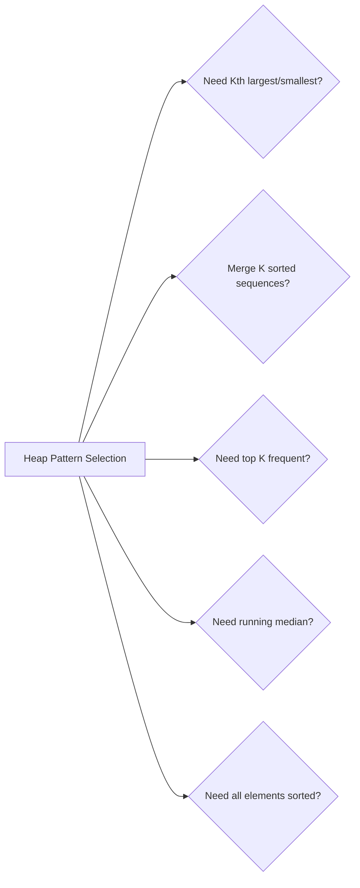

# 10. Heaps (Priority Queues)

> O(log n) insert/delete with O(1) access to min/max element

---

## ELI5: Explain Like I'm 5

<div class="learner-section" markdown>

**Your task:** After implementing all patterns, explain them simply.

**Prompts to guide you:**

1. **What is a heap in one sentence?**
    - Your answer: <span class="fill-in">[Fill in after implementation]</span>

2. **Why is it called a priority queue?**
    - Your answer: <span class="fill-in">[Fill in after implementation]</span>

3. **Real-world analogy:**
    - Example: "A heap is like a hospital emergency room where patients are seen by urgency..."
    - Your analogy: <span class="fill-in">[Fill in]</span>

4. **When does this pattern work?**
    - Your answer: <span class="fill-in">[Fill in after solving problems]</span>

5. **What's the difference between min-heap and max-heap?**
    - Your answer: <span class="fill-in">[Fill in after implementation]</span>

</div>

---

## Quick Quiz (Do BEFORE implementing)

<div class="learner-section" markdown>

**Your task:** Test your intuition without looking at code. Answer these, then verify after implementation.

### Complexity Predictions

1. **Finding Kth largest using sorting:**
    - Time complexity: <span class="fill-in">[Your guess: O(?)]</span>
    - Verified after learning: <span class="fill-in">[Actual: O(?)]</span>

2. **Finding Kth largest using min-heap of size K:**
    - Time complexity: <span class="fill-in">[Your guess: O(?)]</span>
    - Space complexity: <span class="fill-in">[Your guess: O(?)]</span>
    - Verified: <span class="fill-in">[Actual]</span>

3. **Efficiency calculation:**
    - If n = 100,000 and k = 10, sorting = n log n = <span class="fill-in">_____</span> operations
    - Heap approach = n log k = <span class="fill-in">_____</span> operations
    - Speedup factor: approximately _____ times faster

### Scenario Predictions

**Scenario 1:** Find 3rd largest in `[3, 2, 1, 5, 6, 4]`

- **Using min-heap of size 3:**
    - Which elements end up in the heap? <span class="fill-in">[Fill in]</span>
    - What is at the top of the heap? <span class="fill-in">[Fill in - is this the answer?]</span>
    - Why min-heap instead of max-heap? <span class="fill-in">[Fill in your reasoning]</span>

**Scenario 2:** Find median of stream `[5, 15, 1, 3]`

- **Using two heaps:**
    - After adding 5: maxHeap = <span class="fill-in">___</span>, minHeap = <span class="fill-in">___</span>,
      median = <span class="fill-in">___</span>
    - After adding 15: maxHeap = <span class="fill-in">___</span>, minHeap = <span class="fill-in">___</span>,
      median = <span class="fill-in">___</span>
    - After adding 1: maxHeap = <span class="fill-in">___</span>, minHeap = <span class="fill-in">___</span>,
      median = <span class="fill-in">___</span>
    - After adding 3: maxHeap = <span class="fill-in">___</span>, minHeap = <span class="fill-in">___</span>,
      median = <span class="fill-in">___</span>

**Scenario 3:** Merge 3 sorted lists: `[1,4,5]`, `[1,3,4]`, `[2,6]`

- **Heap pattern applies?** <span class="fill-in">[Yes/No - Why?]</span>
- **Initial heap state:** <span class="fill-in">[Which elements start in heap?]</span>
- **After first extraction:** <span class="fill-in">[What gets removed? What gets added?]</span>

### Trade-off Quiz

**Question:** When would sorting be BETTER than heap for finding Kth largest?

- Your answer: <span class="fill-in">[Fill in before implementation]</span>
- Verified answer: <span class="fill-in">[Fill in after learning]</span>

**Question:** What's the MAIN advantage of heap over Quick Select for Kth largest?

- [ ] Heap is always faster
- [ ] Heap works with data streams
- [ ] Heap uses less space
- [ ] Heap is easier to implement

Verify after implementation: <span class="fill-in">[Which one(s)?]</span>

**Question:** For finding top K elements, why use heap of size K instead of size N?

- Your answer: <span class="fill-in">[Fill in reasoning]</span>
- Verified: <span class="fill-in">[Fill in after implementation]</span>

</div>

---

## Before/After: Why This Pattern Matters

**Your task:** Compare naive vs optimized approaches to understand the impact.

### Example 1: Find Kth Largest Element

**Problem:** Find the Kth largest element in an unsorted array.

#### Approach 1: Sorting (Simple but Inefficient)

```java
// Naive approach - Sort entire array
public static int findKthLargest_Sorting(int[] nums, int k) {
    Arrays.sort(nums);  // Sort ascending
    return nums[nums.length - k];  // Kth largest
}
```

**Analysis:**

- Time: O(n log n) - Must sort all n elements
- Space: O(1) or O(log n) depending on sort algorithm
- For n = 100,000: ~1,600,000 operations

#### Approach 2: Min-Heap of Size K (Optimized)

```java
// Optimized approach - Maintain heap of K largest elements
public static int findKthLargest_Heap(int[] nums, int k) {
    PriorityQueue<Integer> minHeap = new PriorityQueue<>();

    for (int num : nums) {
        minHeap.offer(num);
        if (minHeap.size() > k) {
            minHeap.poll();  // Remove smallest
        }
    }

    return minHeap.peek();  // Kth largest at top
}
```

**Analysis:**

- Time: O(n log k) - n insertions, each log k operations
- Space: O(k) - Only store K elements
- For n = 100,000, k = 10: ~166,000 operations

#### Performance Comparison

| Array Size (n) | k   | Sorting (O(n log n)) | Heap (O(n log k)) | Speedup |
|----------------|-----|----------------------|-------------------|---------|
| n = 1,000      | 10  | ~10,000 ops          | ~3,000 ops        | 3x      |
| n = 10,000     | 10  | ~130,000 ops         | ~33,000 ops       | 4x      |
| n = 100,000    | 100 | ~1,600,000 ops       | ~660,000 ops      | 2.4x    |

**Your calculation:** For n = 50,000 and k = 50, the speedup is approximately _____ times faster.

#### Why Does Min-Heap Work for Kth LARGEST?

**Key insight to understand:**

In array `[3, 2, 1, 5, 6, 4]` looking for k=2 (2nd largest):

```
Step 1: Add 3 → Heap: [3]
Step 2: Add 2 → Heap: [2, 3] (size=2)
Step 3: Add 1 → Heap: [2, 3], size > k → remove min → Heap: [3]
Step 4: Add 5 → Heap: [3, 5]
Step 5: Add 6 → Heap: [3, 5], size > k → remove min → Heap: [5, 6]
Step 6: Add 4 → Heap: [4, 5, 6], remove min → Heap: [5, 6]

Answer: heap.peek() = 5 (2nd largest)
```

**Why min-heap, not max-heap?**

- Min-heap keeps K largest elements, smallest of them at top
- When heap size exceeds K, we remove the SMALLEST of the K largest
- The top element is the Kth largest!

**After implementing, explain in your own words:**

<div class="learner-section" markdown>

- Why does removing the minimum preserve the K largest elements? <span class="fill-in">[Your answer]</span>
- What would happen with a max-heap instead? <span class="fill-in">[Your answer]</span>

</div>

---

### Example 2: Finding Running Median

**Problem:** Maintain the median as numbers are added one by one.

#### Approach 1: Sort Every Time (Inefficient)

```java
// Naive approach - Re-sort after each insertion
public static class MedianFinder_Sorting {
    private List<Integer> list = new ArrayList<>();

    public void addNum(int num) {
        list.add(num);
        Collections.sort(list);  // Re-sort entire list!
    }

    public double findMedian() {
        int n = list.size();
        if (n % 2 == 1) {
            return list.get(n / 2);
        } else {
            return (list.get(n / 2 - 1) + list.get(n / 2)) / 2.0;
        }
    }
}
```

**Analysis:**

- Time: O(n log n) per insertion due to sorting
- Space: O(n)
- For 10,000 insertions: ~100,000,000 total operations

#### Approach 2: Two Heaps (Optimized)

```java
// Optimized approach - Two heaps maintain balance
public static class MedianFinder_TwoHeaps {
    private PriorityQueue<Integer> maxHeap;  // Smaller half
    private PriorityQueue<Integer> minHeap;  // Larger half

    public MedianFinder_TwoHeaps() {
        maxHeap = new PriorityQueue<>(Collections.reverseOrder());
        minHeap = new PriorityQueue<>();
    }

    public void addNum(int num) {
        maxHeap.offer(num);
        minHeap.offer(maxHeap.poll());

        if (maxHeap.size() < minHeap.size()) {
            maxHeap.offer(minHeap.poll());
        }
    }

    public double findMedian() {
        if (maxHeap.size() > minHeap.size()) {
            return maxHeap.peek();
        }
        return (maxHeap.peek() + minHeap.peek()) / 2.0;
    }
}
```

**Analysis:**

- Time: O(log n) per insertion
- Space: O(n)
- For 10,000 insertions: ~130,000 total operations

#### Performance Comparison

| Number of Elements | Sorting (O(n²log n) total) | Two Heaps (O(n log n) total) | Speedup |
|--------------------|----------------------------|------------------------------|---------|
| n = 100            | ~66,000 ops                | ~700 ops                     | 94x     |
| n = 1,000          | ~10,000,000 ops            | ~10,000 ops                  | 1,000x  |
| n = 10,000         | ~1,300,000,000 ops         | ~130,000 ops                 | 10,000x |

**Your calculation:** For n = 5,000 elements, the speedup is approximately _____ times faster.

#### Why Do Two Heaps Work?

**Key insight:**

```
Stream: [5, 15, 1, 3]

Add 5:  maxHeap=[5], minHeap=[] → Median = 5
Add 15: maxHeap=[5], minHeap=[15] → Median = (5+15)/2 = 10
Add 1:  maxHeap=[5,1], minHeap=[15] → Median = 5
Add 3:  maxHeap=[5,3,1], minHeap=[15] → rebalance → maxHeap=[5,3], minHeap=[15]
        → Median = (5+15)/2 = 10
```

**Invariant maintained:**

- maxHeap contains smaller half (max element on top)
- minHeap contains larger half (min element on top)
- Size difference ≤ 1
- Median is at the top(s)!

**After implementing, explain in your own words:**

<div class="learner-section" markdown>

- Why do we need both heaps instead of just sorting? <span class="fill-in">[Your answer]</span>
- How does keeping them balanced help find median quickly? <span class="fill-in">[Your answer]</span>

</div>

---

## Core Implementation

### Pattern 1: Basic Heap Operations

**Concept:** Maintain heap property through insert and extract operations.

**Use case:** Find kth largest/smallest, top K elements.

```java
import java.util.*;

public class BasicHeapOperations {

    /**
     * Problem: Find Kth largest element in array
     * Time: O(n log k), Space: O(k)
     *
     * TODO: Implement using min-heap of size k
     */
    public static int findKthLargest(int[] nums, int k) {
        // TODO: Create PriorityQueue (min-heap) of size k
        // TODO: Implement iteration/conditional logic
        // TODO: Return heap.peek() (kth largest)

        return 0; // Replace with implementation
    }

    /**
     * Problem: Find K largest elements
     * Time: O(n log k), Space: O(k)
     *
     * TODO: Implement K largest elements
     */
    public static List<Integer> kLargest(int[] nums, int k) {
        // TODO: Use min-heap of size k
        // TODO: Maintain k largest elements
        // TODO: Return heap as list

        return new ArrayList<>(); // Replace with implementation
    }

    /**
     * Problem: Sort array using heap
     * Time: O(n log n), Space: O(n)
     *
     * TODO: Implement heap sort
     */
    public static int[] heapSort(int[] nums) {
        // TODO: Add all elements to max-heap
        // TODO: Extract max repeatedly to get sorted array

        return new int[0]; // Replace with implementation
    }
}
```

**Runnable Client Code:**

```java
import java.util.*;

public class BasicHeapOperationsClient {

    public static void main(String[] args) {
        System.out.println("=== Basic Heap Operations ===\n");

        // Test 1: Kth largest
        System.out.println("--- Test 1: Kth Largest ---");
        int[] arr = {3, 2, 1, 5, 6, 4};
        int k = 2;

        System.out.println("Array: " + Arrays.toString(arr));
        System.out.println("k = " + k);
        int kthLargest = BasicHeapOperations.findKthLargest(arr, k);
        System.out.println("Kth largest: " + kthLargest);

        // Test 2: K largest elements
        System.out.println("\n--- Test 2: K Largest Elements ---");
        int[] arr2 = {3, 2, 3, 1, 2, 4, 5, 5, 6};
        k = 4;

        System.out.println("Array: " + Arrays.toString(arr2));
        System.out.println("k = " + k);
        List<Integer> kLargest = BasicHeapOperations.kLargest(arr2, k);
        System.out.println("K largest: " + kLargest);

        // Test 3: Heap sort
        System.out.println("\n--- Test 3: Heap Sort ---");
        int[] arr3 = {5, 2, 8, 1, 9, 3};
        System.out.println("Before: " + Arrays.toString(arr3));
        int[] sorted = BasicHeapOperations.heapSort(arr3);
        System.out.println("After:  " + Arrays.toString(sorted));
    }
}
```

---

### Pattern 2: Merge K Sorted Lists/Arrays

**Concept:** Use min-heap to merge multiple sorted sequences efficiently.

**Use case:** Merge K sorted lists, merge K sorted arrays.

```java
import java.util.*;

public class MergeKSorted {

    static class ListNode {
        int val;
        ListNode next;

        ListNode(int val) {
            this.val = val;
        }
    }

    /**
     * Problem: Merge K sorted linked lists
     * Time: O(n log k), Space: O(k) where n = total nodes, k = lists
     *
     * TODO: Implement using min-heap
     */
    public static ListNode mergeKLists(ListNode[] lists) {
        // TODO: Create min-heap with comparator on node.val
        // TODO: Add first node from each list to heap
        // TODO: Implement iteration/conditional logic

        return null; // Replace with implementation
    }

    /**
     * Problem: Merge K sorted arrays
     * Time: O(n log k), Space: O(k)
     *
     * TODO: Implement using min-heap with array indices
     */
    public static List<Integer> mergeKArrays(int[][] arrays) {
        // TODO: Create heap with [value, arrayIndex, elementIndex]
        // TODO: Add first element from each array
        // TODO: Extract min and add next from same array

        return new ArrayList<>(); // Replace with implementation
    }

    /**
     * Problem: Find smallest range covering elements from K lists
     * Time: O(n log k), Space: O(k)
     *
     * TODO: Implement using heap tracking max
     */
    public static int[] smallestRange(List<List<Integer>> nums) {
        // TODO: Use min-heap, track current max
        // TODO: Range = [heap.peek(), currentMax]
        // TODO: Minimize range size

        return new int[]{0, 0}; // Replace with implementation
    }

    // Helper: Create linked list from array
    static ListNode createList(int[] values) {
        if (values.length == 0) return null;
        ListNode head = new ListNode(values[0]);
        ListNode current = head;
        for (int i = 1; i < values.length; i++) {
            current.next = new ListNode(values[i]);
            current = current.next;
        }
        return head;
    }

    // Helper: Print linked list
    static void printList(ListNode head) {
        ListNode current = head;
        while (current != null) {
            System.out.print(current.val);
            if (current.next != null) System.out.print(" -> ");
            current = current.next;
        }
        System.out.println();
    }
}
```

**Runnable Client Code:**

```java
import java.util.*;

public class MergeKSortedClient {

    public static void main(String[] args) {
        System.out.println("=== Merge K Sorted ===\n");

        // Test 1: Merge K lists
        System.out.println("--- Test 1: Merge K Linked Lists ---");
        ListNode[] lists = new ListNode[3];
        lists[0] = MergeKSorted.createList(new int[]{1, 4, 5});
        lists[1] = MergeKSorted.createList(new int[]{1, 3, 4});
        lists[2] = MergeKSorted.createList(new int[]{2, 6});

        System.out.println("List 1: ");
        MergeKSorted.printList(lists[0]);
        System.out.println("List 2: ");
        MergeKSorted.printList(lists[1]);
        System.out.println("List 3: ");
        MergeKSorted.printList(lists[2]);

        ListNode merged = MergeKSorted.mergeKLists(lists);
        System.out.print("Merged: ");
        MergeKSorted.printList(merged);

        // Test 2: Merge K arrays
        System.out.println("\n--- Test 2: Merge K Arrays ---");
        int[][] arrays = {
            {1, 3, 5, 7},
            {2, 4, 6, 8},
            {0, 9, 10, 11}
        };

        for (int i = 0; i < arrays.length; i++) {
            System.out.println("Array " + (i + 1) + ": " + Arrays.toString(arrays[i]));
        }

        List<Integer> mergedArray = MergeKSorted.mergeKArrays(arrays);
        System.out.println("Merged: " + mergedArray);

        // Test 3: Smallest range
        System.out.println("\n--- Test 3: Smallest Range ---");
        List<List<Integer>> nums = Arrays.asList(
            Arrays.asList(4, 10, 15, 24, 26),
            Arrays.asList(0, 9, 12, 20),
            Arrays.asList(5, 18, 22, 30)
        );

        System.out.println("Lists: " + nums);
        int[] range = MergeKSorted.smallestRange(nums);
        System.out.println("Smallest range: [" + range[0] + ", " + range[1] + "]");
    }
}
```

---

### Pattern 3: Top K Frequent Elements

**Concept:** Use heap to find most/least frequent elements.

**Use case:** Top K frequent elements, sort by frequency.

```java
import java.util.*;

public class TopKFrequent {

    /**
     * Problem: Find K most frequent elements
     * Time: O(n log k), Space: O(n)
     *
     * TODO: Implement using frequency map + min-heap
     */
    public static List<Integer> topKFrequent(int[] nums, int k) {
        // TODO: Count frequencies with HashMap
        // TODO: Create min-heap of size k, ordered by frequency
        // TODO: Implement iteration/conditional logic
        // TODO: Return heap contents

        return new ArrayList<>(); // Replace with implementation
    }

    /**
     * Problem: Sort array by frequency
     * Time: O(n log n), Space: O(n)
     *
     * TODO: Implement frequency sort
     */
    public static int[] frequencySort(int[] nums) {
        // TODO: Count frequencies
        // TODO: Sort by frequency (descending), then by value (ascending)

        return new int[0]; // Replace with implementation
    }

    /**
     * Problem: K closest points to origin
     * Time: O(n log k), Space: O(k)
     *
     * TODO: Implement using max-heap of size k
     */
    public static int[][] kClosest(int[][] points, int k) {
        // TODO: Create max-heap ordered by distance
        // TODO: Maintain k closest points
        // TODO: Distance = x^2 + y^2 (no need for sqrt)

        return new int[0][0]; // Replace with implementation
    }
}
```

**Runnable Client Code:**

```java
import java.util.*;

public class TopKFrequentClient {

    public static void main(String[] args) {
        System.out.println("=== Top K Frequent ===\n");

        // Test 1: Top K frequent
        System.out.println("--- Test 1: Top K Frequent ---");
        int[] arr = {1, 1, 1, 2, 2, 3};
        int k = 2;

        System.out.println("Array: " + Arrays.toString(arr));
        System.out.println("k = " + k);
        List<Integer> topK = TopKFrequent.topKFrequent(arr, k);
        System.out.println("Top K frequent: " + topK);

        // Test 2: Frequency sort
        System.out.println("\n--- Test 2: Frequency Sort ---");
        int[] arr2 = {1, 1, 2, 2, 2, 3};
        System.out.println("Before: " + Arrays.toString(arr2));
        int[] sorted = TopKFrequent.frequencySort(arr2);
        System.out.println("After:  " + Arrays.toString(sorted));

        // Test 3: K closest points
        System.out.println("\n--- Test 3: K Closest Points ---");
        int[][] points = {{1, 3}, {-2, 2}, {5, 8}, {0, 1}};
        k = 2;

        System.out.println("Points:");
        for (int[] point : points) {
            System.out.println("  " + Arrays.toString(point));
        }
        System.out.println("k = " + k);

        int[][] closest = TopKFrequent.kClosest(points, k);
        System.out.println("K closest points:");
        for (int[] point : closest) {
            System.out.println("  " + Arrays.toString(point));
        }
    }
}
```

---

### Pattern 4: Two Heaps (Find Median)

**Concept:** Use two heaps to maintain running median.

**Use case:** Find median from data stream, sliding window median.

```java
import java.util.*;

public class TwoHeaps {

    /**
     * MedianFinder: Maintain running median
     * Time: O(log n) insert, O(1) find median
     * Space: O(n)
     *
     * TODO: Implement using two heaps
     */
    static class MedianFinder {
        // TODO: maxHeap stores smaller half (max at top)
        // TODO: minHeap stores larger half (min at top)
        // TODO: Keep heaps balanced: |size difference| <= 1

        public MedianFinder() {
            // TODO: Initialize PriorityQueue for max-heap (reverse order)
            // TODO: Initialize PriorityQueue for min-heap (natural order)
        }

        public void addNum(int num) {
            // TODO: Add to appropriate heap
            // TODO: Balance heaps if needed
            // Hint: Always add to maxHeap first, then move to minHeap if needed
        }

        public double findMedian() {
            // TODO: Implement iteration/conditional logic
            // TODO: Implement iteration/conditional logic
            return 0.0; // Replace with implementation
        }
    }

    /**
     * Problem: Sliding window median
     * Time: O(n * k), Space: O(k)
     *
     * TODO: Implement sliding window median
     */
    public static double[] medianSlidingWindow(int[] nums, int k) {
        // TODO: Use two heaps approach
        // TODO: Handle removal from window
        // Note: This is complex - use TreeMap or simpler approach

        return new double[0]; // Replace with implementation
    }
}
```

**Runnable Client Code:**

```java
import java.util.*;

public class TwoHeapsClient {

    public static void main(String[] args) {
        System.out.println("=== Two Heaps ===\n");

        // Test 1: Median finder
        System.out.println("--- Test 1: Find Median from Data Stream ---");
        TwoHeaps.MedianFinder mf = new TwoHeaps.MedianFinder();

        int[] stream = {1, 2, 3, 4, 5};
        System.out.println("Data stream: " + Arrays.toString(stream));
        System.out.println("Median after each insertion:");

        for (int num : stream) {
            mf.addNum(num);
            System.out.printf("  After adding %d: %.1f%n", num, mf.findMedian());
        }

        // Test 2: Another stream
        System.out.println("\n--- Test 2: Another Stream ---");
        TwoHeaps.MedianFinder mf2 = new TwoHeaps.MedianFinder();
        int[] stream2 = {5, 15, 1, 3};

        System.out.println("Data stream: " + Arrays.toString(stream2));
        System.out.println("Median after each insertion:");

        for (int num : stream2) {
            mf2.addNum(num);
            System.out.printf("  After adding %d: %.1f%n", num, mf2.findMedian());
        }

        // Test 3: Sliding window median
        System.out.println("\n--- Test 3: Sliding Window Median ---");
        int[] arr = {1, 3, -1, -3, 5, 3, 6, 7};
        int k = 3;

        System.out.println("Array: " + Arrays.toString(arr));
        System.out.println("Window size: " + k);
        double[] medians = TwoHeaps.medianSlidingWindow(arr, k);
        System.out.println("Medians: " + Arrays.toString(medians));
    }
}
```

---

## Debugging Challenges

**Your task:** Find and fix bugs in broken heap implementations. This tests your understanding.

### Challenge 1: Broken Kth Largest Finder

```java
/**
 * This code is supposed to find the Kth largest element.
 * It has 2 BUGS. Find them!
 */
public static int findKthLargest_Buggy(int[] nums, int k) {
    PriorityQueue<Integer> maxHeap = new PriorityQueue<>(
        Collections.reverseOrder()    );

    for (int num : nums) {
        maxHeap.offer(num);
        if (maxHeap.size() > k) {
            maxHeap.poll();        }
    }

    return maxHeap.peek();
}
```

**Your debugging:**

- Bug 1: <span class="fill-in">[What\'s the bug?]</span>

- **Bug 2 location:** <span class="fill-in">[Which line?]</span>
- **Bug 2 explanation:** <span class="fill-in">[What gets removed? Is this what we want?]</span>
- **Bug 2 impact:** <span class="fill-in">[What will the final answer be?]</span>

**Test case to expose the bug:**

- Input: `nums = [3, 2, 1, 5, 6, 4]`, `k = 2`
- Expected: `5` (2nd largest)
- Actual with buggy code: <span class="fill-in">[Trace through manually]</span>

<details markdown>
<summary>Click to verify your answers</summary>

**Bug 1:** Should use **min-heap**, not max-heap! For Kth largest, we want to keep the K largest elements and remove the
smallest among them.

**Correct:**

```java
PriorityQueue<Integer> minHeap = new PriorityQueue<>();
```

**Bug 2:** With max-heap, `poll()` removes the LARGEST element, which is exactly what we want to KEEP! This defeats the
purpose.

**Why min-heap works:**

- Min-heap of size K keeps K largest elements
- The smallest of these K largest is at the top
- That smallest element IS the Kth largest!

**Trace with correct code:**

```
[3, 2, 1, 5, 6, 4], k=2
Add 3: [3]
Add 2: [2,3]
Add 1: [1,2,3], size>2, poll() removes 1 → [2,3]
Add 5: [2,3,5], poll() removes 2 → [3,5]
Add 6: [3,5,6], poll() removes 3 → [5,6]
Add 4: [4,5,6], poll() removes 4 → [5,6]
peek() = 5 ✓
```

</details>

---

### Challenge 2: Broken Two-Heap Median Finder

```java
/**
 * Find median from data stream using two heaps.
 * This has 2 CRITICAL BUGS.
 */
static class MedianFinder_Buggy {
    PriorityQueue<Integer> maxHeap = new PriorityQueue<>(Collections.reverseOrder());
    PriorityQueue<Integer> minHeap = new PriorityQueue<>();

    public void addNum(int num) {
        if (maxHeap.isEmpty() || num < maxHeap.peek()) {
            maxHeap.offer(num);
        } else {
            minHeap.offer(num);
        }
    }

    public double findMedian() {
        if (maxHeap.size() > minHeap.size()) {
            return maxHeap.peek();
        } else if (minHeap.size() > maxHeap.size()) {
            return minHeap.peek();        } else {
            return (maxHeap.peek() + minHeap.peek()) / 2;
        }
    }
}
```

**Your debugging:**

- **Bug 1:** <span class="fill-in">[What's missing after adding elements?]</span>
- **Bug 1 explanation:** <span class="fill-in">[What happens if sizes become unbalanced?]</span>
- **Bug 1 fix:** <span class="fill-in">[What code should be added?]</span>

- **Bug 2:** <span class="fill-in">[Which heap should contain the median for even split?]</span>
- **Bug 2 explanation:** <span class="fill-in">[Trace through example: add 1, 2, 3]</span>
- **Bug 2 fix:** <span class="fill-in">[Fill in]</span>

**Test case:**

- Stream: `[1, 2, 3, 4, 5]`
- Expected medians: `[1.0, 1.5, 2.0, 2.5, 3.0]`
- Actual with buggy code: <span class="fill-in">[Trace through]</span>

<details markdown>
<summary>Click to verify your answers</summary>

**Bug 1:** Missing **rebalancing logic**! Heaps can become severely unbalanced.

**Correct addNum:**

```java
public void addNum(int num) {
    if (maxHeap.isEmpty() || num < maxHeap.peek()) {
        maxHeap.offer(num);
    } else {
        minHeap.offer(num);
    }

    // REBALANCE - maintain size difference ≤ 1
    if (maxHeap.size() > minHeap.size() + 1) {
        minHeap.offer(maxHeap.poll());
    } else if (minHeap.size() > maxHeap.size()) {
        maxHeap.offer(minHeap.poll());
    }
}
```

**Bug 2:** The else-if case should probably never happen if we maintain maxHeap.size() >= minHeap.size() as invariant.
But if it does, the logic is actually correct - we'd return minHeap.peek().

**Better approach - Always add to maxHeap first:**

```java
public void addNum(int num) {
    maxHeap.offer(num);
    minHeap.offer(maxHeap.poll());

    if (maxHeap.size() < minHeap.size()) {
        maxHeap.offer(minHeap.poll());
    }
}
```

This ensures maxHeap.size() is always >= minHeap.size().
</details>

---

### Challenge 3: Heap Index Calculation Bugs

```java
/**
 * Manual heap implementation with parent/child index calculations.
 * This has INDEX CALCULATION BUGS.
 */
static class MinHeap_Buggy {
    private List<Integer> heap = new ArrayList<>();

    private int parent(int i) {
        return i / 2;    }

    private int leftChild(int i) {
        return 2 * i;    }

    private int rightChild(int i) {
        return 2 * i + 1;    }

    public void insert(int val) {
        heap.add(val);
        heapifyUp(heap.size() - 1);
    }

    private void heapifyUp(int i) {
        while (i > 0 && heap.get(i) < heap.get(parent(i))) {
            swap(i, parent(i));
            i = parent(i);
        }
    }

    private void swap(int i, int j) {
        int temp = heap.get(i);
        heap.set(i, heap.get(j));
        heap.set(j, temp);
    }
}
```

**Your debugging:**

- **Bug 1:** <span class="fill-in">[What's the correct parent formula for 0-indexed array?]</span>
- **Bug 2:** <span class="fill-in">[What's the correct leftChild formula?]</span>
- **Bug 3:** <span class="fill-in">[What's the correct rightChild formula?]</span>

**Heap index formulas:**

- For 0-indexed array:
    - Parent of i: <span class="fill-in">[Your formula]</span>
    - Left child of i: <span class="fill-in">[Your formula]</span>
    - Right child of i: <span class="fill-in">[Your formula]</span>

**Test case:**

```
Insert: 5, 3, 7, 1
Expected heap array: [1, 3, 7, 5] (min-heap property)
Actual with buggy code: <span class="fill-in">[What happens?]</span>
```

<details markdown>
<summary>Click to verify your answers</summary>

**All three formulas are wrong for 0-indexed arrays!**

**Correct formulas for 0-indexed:**

```java
private int parent(int i) {
    return (i - 1) / 2;  // Not i / 2
}

private int leftChild(int i) {
    return 2 * i + 1;  // Not 2 * i
}

private int rightChild(int i) {
    return 2 * i + 2;  // Not 2 * i + 1
}
```

**Why these formulas?**

In 0-indexed array `[0, 1, 2, 3, 4, 5, 6]`:

```
       0
      / \
     1   2
    / \ / \
   3  4 5  6
```

- Parent of 1: (1-1)/2 = 0 ✓
- Parent of 2: (2-1)/2 = 0 ✓
- Left of 0: 2*0+1 = 1 ✓
- Right of 0: 2*0+2 = 2 ✓
- Left of 1: 2*1+1 = 3 ✓
- Right of 1: 2*1+2 = 4 ✓

**For 1-indexed arrays (if you stored heap starting at index 1):**

```java
parent(i) = i / 2
leftChild(i) = 2 * i
rightChild(i) = 2 * i + 1
```

This is why some people prefer 1-indexed - simpler formulas!
</details>

---

### Challenge 4: Min-Heap vs Max-Heap Confusion

```java
/**
 * Find K closest points to origin.
 * This code has HEAP TYPE BUG.
 */
public static int[][] kClosest_Buggy(int[][] points, int k) {
    PriorityQueue<int[]> minHeap = new PriorityQueue<>(
        (a, b) -> (a[0]*a[0] + a[1]*a[1]) - (b[0]*b[0] + b[1]*b[1])
    );
    for (int[] point : points) {
        minHeap.offer(point);
        if (minHeap.size() > k) {
            minHeap.poll();
        }
    }

    int[][] result = new int[k][2];
    for (int i = 0; i < k; i++) {
        result[i] = minHeap.poll();
    }
    return result;
}
```

**Your debugging:**

- Bug: <span class="fill-in">[What\'s the bug?]</span>

**Think about it:**

- For K largest → Use <span class="fill-in">[min/max]</span>-heap
- For K smallest → Use <span class="fill-in">[min/max]</span>-heap
- For K closest → Same as K <span class="fill-in">[largest/smallest]</span> distances
- Therefore, use <span class="fill-in">[min/max]</span>-heap

**Test case:**

```
Points: [[1,3], [-2,2], [5,8], [0,1]], k=2
Distances: [10, 8, 89, 1]
Expected: [[0,1], [-2,2]] (distances 1 and 8)
Actual with buggy code: <span class="fill-in">[What do you get?]</span>
```

<details markdown>
<summary>Click to verify your answers</summary>

**Bug:** Using min-heap is WRONG! We need **max-heap**.

**Why?**

- K closest = K smallest distances
- For K smallest distances, use max-heap (same logic as Kth largest)
- Keep K smallest, remove the largest of them when heap exceeds size K

**Correct:**

```java
PriorityQueue<int[]> maxHeap = new PriorityQueue<>(
    (a, b) -> (b[0]*b[0] + b[1]*b[1]) - (a[0]*a[0] + a[1]*a[1])
    // Note: b - a for max-heap (reverse comparison)
);
```

**Pattern to remember:**

- **K largest values** → min-heap of size K (remove smallest)
- **K smallest values** → max-heap of size K (remove largest)

This seems backwards but makes sense: you want to remove the "outlier" from your K elements!
</details>

---

### Your Debugging Scorecard

After finding and fixing all bugs:

- [ ] Found all bugs in Kth largest (min vs max heap)
- [ ] Found rebalancing bug in median finder
- [ ] Fixed all three index calculation formulas
- [ ] Understood when to use min-heap vs max-heap
- [ ] Could explain WHY each bug causes incorrect behavior

**Common heap mistakes you discovered:**

1. <span class="fill-in">[Min vs max confusion - when to use which?]</span>
2. <span class="fill-in">[Index calculation errors in manual implementation]</span>
3. <span class="fill-in">[Forgetting to rebalance in two-heap pattern]</span>
4. <span class="fill-in">[Fill in - what other patterns did you notice?]</span>

---

## Decision Framework

**Your task:** Build decision trees for when to use heaps.

### Question 1: What do you need to track?

Answer after solving problems:

- **Need min/max element repeatedly?** <span class="fill-in">[Use heap]</span>
- **Need Kth largest/smallest?** <span class="fill-in">[Use heap of size K]</span>
- **Need median?** <span class="fill-in">[Use two heaps]</span>
- **Your observation:** <span class="fill-in">[Fill in based on testing]</span>

### Question 2: What are the time/space trade-offs?

Answer for each pattern:

**Basic heap operations:**

- Time complexity: <span class="fill-in">[Insert? Extract? Peek?]</span>
- Space complexity: <span class="fill-in">[How much space?]</span>
- Best use cases: <span class="fill-in">[List problems you solved]</span>

**Merge K sorted:**

- Time complexity: <span class="fill-in">[Compare to merge two at a time]</span>
- Space complexity: <span class="fill-in">[Just heap or output too?]</span>
- Best use cases: <span class="fill-in">[List problems you solved]</span>

**Top K frequent:**

- Time complexity: <span class="fill-in">[Why log k not log n?]</span>
- Space complexity: <span class="fill-in">[Frequency map + heap]</span>
- Best use cases: <span class="fill-in">[List problems you solved]</span>

**Two heaps:**

- Time complexity: <span class="fill-in">[Insert? Find median?]</span>
- Space complexity: <span class="fill-in">[Both heaps needed?]</span>
- Best use cases: <span class="fill-in">[List problems you solved]</span>

### Your Decision Tree

Build this after solving practice problems:



---

## Practice

### LeetCode Problems

**Easy (Complete all 3):**

- [ ] [703. Kth Largest Element in a Stream](https://leetcode.com/problems/kth-largest-element-in-a-stream/)
    - Pattern: <span class="fill-in">[Min-heap of size K]</span>
    - Your solution time: <span class="fill-in">___</span>
    - Key insight: <span class="fill-in">[Fill in after solving]</span>

- [ ] [1046. Last Stone Weight](https://leetcode.com/problems/last-stone-weight/)
    - Pattern: <span class="fill-in">[Max-heap simulation]</span>
    - Your solution time: <span class="fill-in">___</span>
    - Key insight: <span class="fill-in">[Fill in]</span>

- [ ] [1337. The K Weakest Rows in a Matrix](https://leetcode.com/problems/the-k-weakest-rows-in-a-matrix/)
    - Pattern: <span class="fill-in">[Heap with custom comparator]</span>
    - Your solution time: <span class="fill-in">___</span>
    - Key insight: <span class="fill-in">[Fill in]</span>

**Medium (Complete 3-4):**

- [ ] [215. Kth Largest Element in an Array](https://leetcode.com/problems/kth-largest-element-in-an-array/)
    - Pattern: <span class="fill-in">[Min-heap approach]</span>
    - Difficulty: <span class="fill-in">[Rate 1-10]</span>
    - Key insight: <span class="fill-in">[Fill in]</span>

- [ ] [347. Top K Frequent Elements](https://leetcode.com/problems/top-k-frequent-elements/)
    - Pattern: <span class="fill-in">[Frequency + heap]</span>
    - Difficulty: <span class="fill-in">[Rate 1-10]</span>
    - Key insight: <span class="fill-in">[Fill in]</span>

- [ ] [973. K Closest Points to Origin](https://leetcode.com/problems/k-closest-points-to-origin/)
    - Pattern: <span class="fill-in">[Max-heap of size K]</span>
    - Difficulty: <span class="fill-in">[Rate 1-10]</span>
    - Key insight: <span class="fill-in">[Fill in]</span>

- [ ] [295. Find Median from Data Stream](https://leetcode.com/problems/find-median-from-data-stream/)
    - Pattern: <span class="fill-in">[Two heaps]</span>
    - Difficulty: <span class="fill-in">[Rate 1-10]</span>
    - Key insight: <span class="fill-in">[Fill in]</span>

**Hard (Optional):**

- [ ] [23. Merge k Sorted Lists](https://leetcode.com/problems/merge-k-sorted-lists/)
    - Pattern: <span class="fill-in">[Min-heap with K nodes]</span>
    - Key insight: <span class="fill-in">[Fill in after solving]</span>

- [ ] [480. Sliding Window Median](https://leetcode.com/problems/sliding-window-median/)
    - Pattern: <span class="fill-in">[Two heaps with removal]</span>
    - Key insight: <span class="fill-in">[Fill in after solving]</span>

---

## Review Checklist

Before moving to the next topic:

- [ ] **Implementation**
    - [ ] Basic operations: Kth largest, K largest, heap sort all work
    - [ ] Merge K: lists and arrays both work
    - [ ] Top K: frequent elements and closest points work
    - [ ] Two heaps: median finder works correctly
    - [ ] All client code runs successfully

- [ ] **Pattern Recognition**
    - [ ] Can identify when to use min-heap vs max-heap
    - [ ] Understand when heap size should be K vs N
    - [ ] Know when to use two heaps
    - [ ] Recognize merge K sorted pattern

- [ ] **Problem Solving**
    - [ ] Solved 3 easy problems
    - [ ] Solved 3-4 medium problems
    - [ ] Analyzed time/space complexity
    - [ ] Understood heap vs sort trade-offs

- [ ] **Understanding**
    - [ ] Filled in all ELI5 explanations
    - [ ] Built decision tree
    - [ ] Identified when NOT to use heaps
    - [ ] Can explain heap property and operations

- [ ] **Mastery Check**
    - [ ] Could implement all patterns from memory
    - [ ] Could recognize pattern in new problem
    - [ ] Could explain to someone else
    - [ ] Understand PriorityQueue in Java

---

### Mastery Certification

**I certify that I can:**

- [ ] Implement all four heap patterns from memory
- [ ] Explain when to use min-heap vs max-heap
- [ ] Identify the correct pattern for new problems
- [ ] Analyze time and space complexity
- [ ] Compare trade-offs with alternative approaches
- [ ] Debug common heap mistakes (min/max confusion, indexing errors)
- [ ] Implement two-heap median finder
- [ ] Calculate parent/child indices correctly
- [ ] Teach this concept to someone else

**Self-assessment score:** ___/10

**If score < 8:** Review the sections where you struggled, then retry this gate.

**If score ≥ 8:** Congratulations! You've mastered heaps. Proceed to the next topic.
