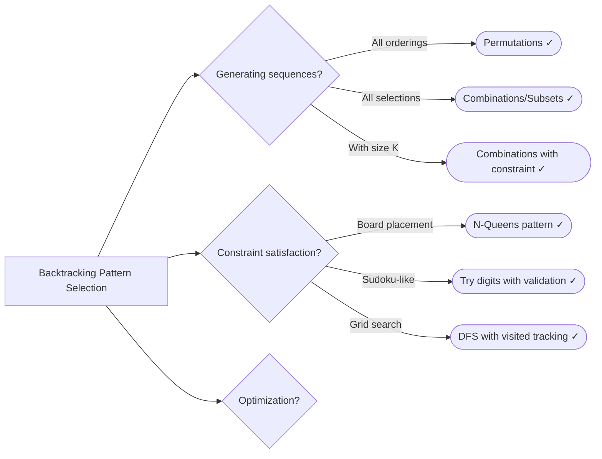

# 11. Backtracking

> Explore all possible solutions by building candidates and abandoning them when they fail

---

## ELI5: Explain Like I'm 5

<div class="learner-section" markdown>

**Your task:** After implementing all patterns, explain them simply.

**Prompts to guide you:**

1. **What is backtracking in one sentence?**
    - Your answer: <span class="fill-in">[Fill in after implementation]</span>

2. **How is backtracking different from brute force?**
    - Your answer: <span class="fill-in">[Fill in after implementation]</span>

3. **Real-world analogy:**
    - Example: "Backtracking is like solving a maze by trying each path and going back when you hit a dead end..."
    - Your analogy: <span class="fill-in">[Fill in]</span>

4. **When does this pattern work?**
    - Your answer: <span class="fill-in">[Fill in after solving problems]</span>

5. **What makes a problem suitable for backtracking?**
    - Your answer: <span class="fill-in">[Fill in after learning the pattern]</span>

</div>

---

## Quick Quiz (Do BEFORE implementing)

<div class="learner-section" markdown>

**Your task:** Test your intuition without looking at code. Answer these, then verify after implementation.

### Complexity Predictions

1. **Brute force generating all permutations of n elements:**
    - Time complexity: <span class="fill-in">[Your guess: O(?)]</span>
    - Verified after learning: <span class="fill-in">[Actual: O(?)]</span>

2. **Backtracking to find N-Queens solutions:**
    - Time complexity: <span class="fill-in">[Your guess: O(?)]</span>
    - Space complexity (excluding output): <span class="fill-in">[Your guess: O(?)]</span>
    - Verified: <span class="fill-in">[Actual]</span>

3. **Speedup calculation:**
    - For generating subsets, brute force with checking = <span class="fill-in">[Fill in]</span>
    - Backtracking with early pruning = <span class="fill-in">[Fill in]</span>
    - Pruning benefit: <span class="fill-in">[Fill in why it helps]</span>

### Scenario Predictions

**Scenario 1:** Generate all permutations of `[1, 2, 3]`

- **How many permutations exist?** <span class="fill-in">[Your guess: <span class="fill-in">___</span>]</span>
- **First permutation:** <span class="fill-in">[Fill in]</span>
- **When do you backtrack?** <span class="fill-in">[Fill in]</span>
- **What state do you restore?** <span class="fill-in">[Fill in]</span>

**Scenario 2:** Generate all subsets of `[1, 2, 3]`

- **How many subsets exist?** <span class="fill-in">[Your guess: <span class="fill-in">___</span>]</span>
- **Formula for n elements:** <span class="fill-in">[Fill in]</span>
- **How is this different from permutations?** <span class="fill-in">[Fill in]</span>

**Scenario 3:** Place 4 queens on a 4x4 board

- **Can you place 2 queens in same column?** <span class="fill-in">[Yes/No - Why?]</span>
- **How do you track which columns are under attack?** <span class="fill-in">[Fill in your idea]</span>
- **What about diagonals?** <span class="fill-in">[Fill in]</span>

### Trade-off Quiz

**Question:** When would iterative enumeration be BETTER than backtracking?

- Your answer: <span class="fill-in">[Fill in before implementation]</span>
- Verified answer: <span class="fill-in">[Fill in after learning]</span>

**Question:** What's the MAIN difference between permutations and combinations?

- [ ] Permutations care about order, combinations don't
- [ ] Permutations are always larger than combinations
- [ ] Permutations use recursion, combinations use iteration
- [ ] Permutations allow duplicates, combinations don't

Verify after implementation: <span class="fill-in">[Which one?]</span>


</div>

---

## Before/After: Why This Pattern Matters

**Your task:** Compare naive vs optimized approaches to understand the impact.

### Example: Find All Subsets

**Problem:** Generate all subsets of an array `[1, 2, 3]`.

#### Approach 1: Brute Force Enumeration

```java
// Naive approach - Generate all possible combinations with checking
public static List<List<Integer>> subsets_BruteForce(int[] nums) {
    List<List<Integer>> result = new ArrayList<>();
    int n = nums.length;

    // Generate all possible bit patterns (2^n combinations)
    for (int mask = 0; mask < (1 << n); mask++) {
        List<Integer> subset = new ArrayList<>();

        // Check each bit to decide if element is included
        for (int i = 0; i < n; i++) {
            if ((mask & (1 << i)) != 0) {
                subset.add(nums[i]);
            }
        }

        result.add(subset);
    }

    return result;
}
```

**Analysis:**

- Time: O(2^n * n) - Generate 2^n combinations, each takes O(n) to build
- Space: O(2^n * n) - Store all subsets
- For n = 10: 1,024 subsets * 10 operations = ~10,240 operations
- **Limitation:** Cannot easily add pruning or constraints

#### Approach 2: Backtracking with Pruning

```java
// Optimized approach - Use backtracking to build subsets
public static List<List<Integer>> subsets_Backtracking(int[] nums) {
    List<List<Integer>> result = new ArrayList<>();
    backtrack(nums, 0, new ArrayList<>(), result);
    return result;
}

private static void backtrack(int[] nums, int start,
                              List<Integer> current,
                              List<List<Integer>> result) {
    // Add current subset (valid at every step)
    result.add(new ArrayList<>(current));

    // Explore further choices
    for (int i = start; i < nums.length; i++) {
        current.add(nums[i]);              // Make choice
        backtrack(nums, i + 1, current, result);  // Explore
        current.remove(current.size() - 1); // Undo choice (backtrack)
    }
}
```

**Analysis:**

- Time: O(2^n * n) - Same asymptotic complexity
- Space: O(n) - Recursion depth (excluding output)
- For n = 10: Similar operations BUT can easily add pruning
- **Advantage:** Can prune branches early with constraints

#### Performance Comparison

| Problem Type         | Brute Force    | Backtracking | Advantage              |
|----------------------|----------------|--------------|------------------------|
| All subsets (n=10)   | 10,240 ops     | 10,240 ops   | Same without pruning   |
| Subsets with sum ≤ K | 10,240 ops     | ~5,000 ops   | 2x faster with pruning |
| N-Queens (n=8)       | 16,777,216 ops | ~2,000 ops   | 8,000x faster!         |

**Your calculation:** For N-Queens with n=4, brute force tries _____ placements, backtracking tries approximately _____.

#### Why Does Backtracking with Pruning Work?

**Key insight to understand:**

In N-Queens (4x4 board):

```
Brute Force: Try all 4^16 possible placements (>4 billion)
Then check if valid

Backtracking:
Row 1: Try 4 positions
  Row 2: Only try valid positions (maybe 2 safe)
    Row 3: Only try valid positions (maybe 1 safe)
      Row 4: Only try valid positions
      ❌ Invalid? Backtrack immediately!
```

**Pruning eliminates entire branches:**

- Brute force: Check constraints AFTER generating complete solution
- Backtracking: Check constraints DURING generation
- Each invalid partial solution eliminates millions of possibilities!

**After implementing, explain in your own words:**

<div class="learner-section" markdown>

- Why is backtracking better than brute force enumeration? <span class="fill-in">[Your answer]</span>
- When does backtracking give the biggest advantage? <span class="fill-in">[Your answer]</span>
- What problems are NOT improved by backtracking? <span class="fill-in">[Your answer]</span>

</div>

---

## Core Implementation

### Pattern 1: Permutations

**Concept:** Generate all possible orderings of elements.

**Use case:** Permutations, permutations with duplicates.

```java
import java.util.*;

public class PermutationsPattern {

    /**
     * Problem: Generate all permutations of distinct integers
     * Time: O(n! * n), Space: O(n!)
     *
     * TODO: Implement using backtracking
     */
    public static List<List<Integer>> permute(int[] nums) {
        List<List<Integer>> result = new ArrayList<>();
        // TODO: Call backtrack with empty list

        return result; // Replace with implementation
    }

    private static void backtrack(int[] nums, List<Integer> current,
                                  boolean[] used, List<List<Integer>> result) {
        // TODO: Handle base case

        // TODO: Implement iteration/conditional logic
    }

    /**
     * Problem: Permutations with duplicates
     * Time: O(n! * n), Space: O(n!)
     *
     * TODO: Implement with duplicate handling
     */
    public static List<List<Integer>> permuteUnique(int[] nums) {
        List<List<Integer>> result = new ArrayList<>();
        // TODO: Sort array first to handle duplicates
        // TODO: Use backtracking with duplicate checking

        return result; // Replace with implementation
    }

    /**
     * Problem: Next permutation
     * Time: O(n), Space: O(1)
     *
     * TODO: Implement next permutation in-place
     */
    public static void nextPermutation(int[] nums) {
        // TODO: Implement logic
        // TODO: Find smallest element greater than nums[i] to the right
        // TODO: Swap them
        // TODO: Reverse suffix after i
    }
}
```

**Runnable Client Code:**

```java
import java.util.*;

public class PermutationsPatternClient {

    public static void main(String[] args) {
        System.out.println("=== Permutations ===\n");

        // Test 1: Basic permutations
        System.out.println("--- Test 1: Permutations ---");
        int[] nums1 = {1, 2, 3};
        System.out.println("Input: " + Arrays.toString(nums1));
        List<List<Integer>> perms = PermutationsPattern.permute(nums1);
        System.out.println("Permutations (" + perms.size() + " total):");
        for (List<Integer> perm : perms) {
            System.out.println("  " + perm);
        }

        // Test 2: Permutations with duplicates
        System.out.println("\n--- Test 2: Permutations with Duplicates ---");
        int[] nums2 = {1, 1, 2};
        System.out.println("Input: " + Arrays.toString(nums2));
        List<List<Integer>> uniquePerms = PermutationsPattern.permuteUnique(nums2);
        System.out.println("Unique permutations (" + uniquePerms.size() + " total):");
        for (List<Integer> perm : uniquePerms) {
            System.out.println("  " + perm);
        }

        // Test 3: Next permutation
        System.out.println("\n--- Test 3: Next Permutation ---");
        int[] nums3 = {1, 2, 3};
        System.out.println("Start: " + Arrays.toString(nums3));
        for (int i = 0; i < 5; i++) {
            PermutationsPattern.nextPermutation(nums3);
            System.out.println("Next:  " + Arrays.toString(nums3));
        }
    }
}
```

---

### Pattern 2: Combinations and Subsets

**Concept:** Generate all possible selections of elements.

**Use case:** Combinations, subsets, subset sum.

```java
import java.util.*;

public class CombinationsPattern {

    /**
     * Problem: Generate all subsets (power set)
     * Time: O(2^n * n), Space: O(2^n)
     *
     * TODO: Implement using backtracking
     */
    public static List<List<Integer>> subsets(int[] nums) {
        List<List<Integer>> result = new ArrayList<>();
        // TODO: Start with empty subset
        // TODO: Backtrack to generate all subsets

        return result; // Replace with implementation
    }

    private static void backtrackSubsets(int[] nums, int start,
                                        List<Integer> current,
                                        List<List<Integer>> result) {
        // TODO: Add current subset to result (valid at every step)

        // TODO: Implement iteration/conditional logic
    }

    /**
     * Problem: Generate combinations of k elements
     * Time: O(C(n,k) * k), Space: O(C(n,k))
     *
     * TODO: Implement combinations
     */
    public static List<List<Integer>> combine(int n, int k) {
        List<List<Integer>> result = new ArrayList<>();
        // TODO: Backtrack with size constraint

        return result; // Replace with implementation
    }

    /**
     * Problem: Combination sum (elements can be reused)
     * Time: O(2^n), Space: O(n)
     *
     * TODO: Implement combination sum
     */
    public static List<List<Integer>> combinationSum(int[] candidates, int target) {
        List<List<Integer>> result = new ArrayList<>();
        // TODO: Backtrack with sum tracking
        // TODO: Can reuse same element

        return result; // Replace with implementation
    }

    /**
     * Problem: Subsets with duplicates
     * Time: O(2^n * n), Space: O(2^n)
     *
     * TODO: Implement with duplicate handling
     */
    public static List<List<Integer>> subsetsWithDup(int[] nums) {
        List<List<Integer>> result = new ArrayList<>();
        // TODO: Sort first
        // TODO: Skip duplicate elements in same level

        return result; // Replace with implementation
    }
}
```

**Runnable Client Code:**

```java
import java.util.*;

public class CombinationsPatternClient {

    public static void main(String[] args) {
        System.out.println("=== Combinations and Subsets ===\n");

        // Test 1: Subsets
        System.out.println("--- Test 1: Subsets ---");
        int[] nums1 = {1, 2, 3};
        System.out.println("Input: " + Arrays.toString(nums1));
        List<List<Integer>> subsets = CombinationsPattern.subsets(nums1);
        System.out.println("Subsets (" + subsets.size() + " total):");
        for (List<Integer> subset : subsets) {
            System.out.println("  " + subset);
        }

        // Test 2: Combinations
        System.out.println("\n--- Test 2: Combinations ---");
        int n = 4, k = 2;
        System.out.println("n = " + n + ", k = " + k);
        List<List<Integer>> combinations = CombinationsPattern.combine(n, k);
        System.out.println("Combinations (" + combinations.size() + " total):");
        for (List<Integer> comb : combinations) {
            System.out.println("  " + comb);
        }

        // Test 3: Combination sum
        System.out.println("\n--- Test 3: Combination Sum ---");
        int[] candidates = {2, 3, 6, 7};
        int target = 7;
        System.out.println("Candidates: " + Arrays.toString(candidates));
        System.out.println("Target: " + target);
        List<List<Integer>> combSums = CombinationsPattern.combinationSum(candidates, target);
        System.out.println("Combinations:");
        for (List<Integer> comb : combSums) {
            System.out.println("  " + comb);
        }

        // Test 4: Subsets with duplicates
        System.out.println("\n--- Test 4: Subsets with Duplicates ---");
        int[] nums2 = {1, 2, 2};
        System.out.println("Input: " + Arrays.toString(nums2));
        List<List<Integer>> uniqueSubsets = CombinationsPattern.subsetsWithDup(nums2);
        System.out.println("Unique subsets (" + uniqueSubsets.size() + " total):");
        for (List<Integer> subset : uniqueSubsets) {
            System.out.println("  " + subset);
        }
    }
}
```

---

### Pattern 3: N-Queens and Constraint Satisfaction

**Concept:** Place elements with constraints, backtrack on violations.

**Use case:** N-Queens, Sudoku solver.

```java
import java.util.*;

public class ConstraintSatisfaction {

    /**
     * Problem: N-Queens - place N queens on N×N board
     * Time: O(N!), Space: O(N^2)
     *
     * TODO: Implement N-Queens using backtracking
     */
    public static List<List<String>> solveNQueens(int n) {
        List<List<String>> result = new ArrayList<>();
        // TODO: Initialize board
        // TODO: Track columns, diagonals under attack
        // TODO: Backtrack row by row

        return result; // Replace with implementation
    }

    private static void backtrackQueens(int row, int n, char[][] board,
                                       Set<Integer> cols, Set<Integer> diag1,
                                       Set<Integer> diag2, List<List<String>> result) {
        // TODO: Handle base case

        // TODO: Implement iteration/conditional logic
    }

    /**
     * Problem: Sudoku solver
     * Time: O(9^m) where m = empty cells, Space: O(1)
     *
     * TODO: Implement Sudoku solver
     */
    public static void solveSudoku(char[][] board) {
        // TODO: Find empty cell
        // TODO: Try digits 1-9
        // TODO: Check row, column, 3×3 box constraints
        // TODO: Backtrack if no valid digit
    }

    private static boolean isValidSudoku(char[][] board, int row, int col, char c) {
        // TODO: Check row constraint
        // TODO: Check column constraint
        // TODO: Check 3×3 box constraint
        return false; // Replace with implementation
    }

    /**
     * Problem: Count total N-Queens solutions
     * Time: O(N!), Space: O(N)
     *
     * TODO: Implement optimized N-Queens counter
     */
    public static int totalNQueens(int n) {
        // TODO: Similar to solveNQueens but just count

        return 0; // Replace with implementation
    }
}
```

**Runnable Client Code:**

```java
import java.util.*;

public class ConstraintSatisfactionClient {

    public static void main(String[] args) {
        System.out.println("=== Constraint Satisfaction ===\n");

        // Test 1: N-Queens
        System.out.println("--- Test 1: N-Queens (n=4) ---");
        List<List<String>> solutions = ConstraintSatisfaction.solveNQueens(4);
        System.out.println("Found " + solutions.size() + " solutions:");
        for (int i = 0; i < solutions.size(); i++) {
            System.out.println("Solution " + (i + 1) + ":");
            for (String row : solutions.get(i)) {
                System.out.println("  " + row);
            }
            System.out.println();
        }

        // Test 2: Count N-Queens
        System.out.println("--- Test 2: Count N-Queens Solutions ---");
        for (int n = 1; n <= 8; n++) {
            int count = ConstraintSatisfaction.totalNQueens(n);
            System.out.printf("n=%d: %d solutions%n", n, count);
        }

        // Test 3: Sudoku solver
        System.out.println("\n--- Test 3: Sudoku Solver ---");
        char[][] sudoku = {
            {'5','3','.','.','7','.','.','.','.'},
            {'6','.','.','1','9','5','.','.','.'},
            {'.','9','8','.','.','.','.','6','.'},
            {'8','.','.','.','6','.','.','.','3'},
            {'4','.','.','8','.','3','.','.','1'},
            {'7','.','.','.','2','.','.','.','6'},
            {'.','6','.','.','.','.','2','8','.'},
            {'.','.','.','4','1','9','.','.','5'},
            {'.','.','.','.','8','.','.','7','9'}
        };

        System.out.println("Before:");
        printSudoku(sudoku);

        ConstraintSatisfaction.solveSudoku(sudoku);

        System.out.println("\nAfter:");
        printSudoku(sudoku);
    }

    private static void printSudoku(char[][] board) {
        for (int i = 0; i < 9; i++) {
            if (i % 3 == 0 && i != 0) {
                System.out.println("------+-------+------");
            }
            for (int j = 0; j < 9; j++) {
                if (j % 3 == 0 && j != 0) {
                    System.out.print("| ");
                }
                System.out.print(board[i][j] + " ");
            }
            System.out.println();
        }
    }
}
```

---

### Pattern 4: Grid Search (Word Search)

**Concept:** Explore grid paths with backtracking.

**Use case:** Word search, path finding with constraints.

```java
public class GridSearch {

    /**
     * Problem: Word search in 2D grid
     * Time: O(m * n * 4^L) where L = word length, Space: O(L)
     *
     * TODO: Implement word search using backtracking
     */
    public static boolean exist(char[][] board, String word) {
        // TODO: Try starting from each cell
        // TODO: Use DFS with backtracking

        return false; // Replace with implementation
    }

    private static boolean dfs(char[][] board, String word, int index,
                              int row, int col, boolean[][] visited) {
        // TODO: Handle base case

        // TODO: Check bounds and visited
        // TODO: Check if board[row][col] == word.charAt(index)

        // TODO: Mark visited
        // TODO: Explore 4 directions (up, down, left, right)
        // TODO: Implement iteration/conditional logic
        // TODO: Unmark visited (backtrack)

        return false; // Replace with implementation
    }

    /**
     * Problem: Count paths from top-left to bottom-right
     * Time: O(2^(m+n)), Space: O(m+n)
     *
     * TODO: Implement path counter with obstacles
     */
    public static int countPaths(int[][] grid) {
        // TODO: Backtrack with path counting
        // TODO: Handle obstacles (grid[i][j] == 1)

        return 0; // Replace with implementation
    }

    /**
     * Problem: Longest increasing path in matrix
     * Time: O(m * n), Space: O(m * n) with memoization
     *
     * TODO: Implement using DFS with memoization
     */
    public static int longestIncreasingPath(int[][] matrix) {
        // TODO: DFS from each cell
        // TODO: Use memo to cache results
        // TODO: Can only move to strictly greater neighbors

        return 0; // Replace with implementation
    }
}
```

**Runnable Client Code:**

```java
public class GridSearchClient {

    public static void main(String[] args) {
        System.out.println("=== Grid Search ===\n");

        // Test 1: Word search
        System.out.println("--- Test 1: Word Search ---");
        char[][] board = {
            {'A','B','C','E'},
            {'S','F','C','S'},
            {'A','D','E','E'}
        };

        String[] words = {"ABCCED", "SEE", "ABCB"};

        System.out.println("Board:");
        for (char[] row : board) {
            for (char c : row) {
                System.out.print(c + " ");
            }
            System.out.println();
        }
        System.out.println();

        for (String word : words) {
            boolean found = GridSearch.exist(board, word);
            System.out.printf("Word \"%s\": %s%n", word, found ? "FOUND" : "NOT FOUND");
        }

        // Test 2: Count paths
        System.out.println("\n--- Test 2: Count Paths ---");
        int[][] grid = {
            {0, 0, 0},
            {0, 1, 0},
            {0, 0, 0}
        };

        System.out.println("Grid (0=path, 1=obstacle):");
        for (int[] row : grid) {
            for (int cell : row) {
                System.out.print(cell + " ");
            }
            System.out.println();
        }
        int paths = GridSearch.countPaths(grid);
        System.out.println("Total paths: " + paths);

        // Test 3: Longest increasing path
        System.out.println("\n--- Test 3: Longest Increasing Path ---");
        int[][] matrix = {
            {9, 9, 4},
            {6, 6, 8},
            {2, 1, 1}
        };

        System.out.println("Matrix:");
        for (int[] row : matrix) {
            for (int cell : row) {
                System.out.print(cell + " ");
            }
            System.out.println();
        }
        int longest = GridSearch.longestIncreasingPath(matrix);
        System.out.println("Longest increasing path: " + longest);
    }
}
```

---

## Debugging Challenges

**Your task:** Find and fix bugs in broken implementations. This tests your understanding of backtracking.

### Challenge 1: Broken Permutations

```java
/**
 * This code is supposed to generate all permutations.
 * It has 2 BUGS. Find them!
 */
public static List<List<Integer>> permute_Buggy(int[] nums) {
    List<List<Integer>> result = new ArrayList<>();
    boolean[] used = new boolean[nums.length];
    backtrack(nums, new ArrayList<>(), used, result);
    return result;
}

private static void backtrack(int[] nums, List<Integer> current,
                              boolean[] used, List<List<Integer>> result) {
    // Base case
    if (current.size() == nums.length) {
        result.add(current);        return;
    }

    for (int i = 0; i < nums.length; i++) {
        if (used[i]) continue;

        used[i] = true;
        current.add(nums[i]);
        backtrack(nums, current, used, result);
    }
}
```

**Your debugging:**

- Bug 1: <span class="fill-in">[What\'s the bug?]</span>

- Bug 2: <span class="fill-in">[What\'s the bug?]</span>

<details markdown>
<summary>Click to verify your answers</summary>

**Bug 1 (Line 11):** Should be `result.add(new ArrayList<>(current))`, not `result.add(current)`. Without copying, all
results will reference the same list object, which gets modified during backtracking!

**Bug 2 (After line 20):** Missing the backtrack step! Should have:

```java
current.remove(current.size() - 1);  // Undo choice
used[i] = false;                      // Undo state
```

Without these lines, the algorithm never properly backtracks and explores other branches.
</details>

---

### Challenge 2: Broken Subsets with Duplicates

```java
/**
 * Generate subsets from array with duplicates [1, 2, 2]
 * This has 2 BUGS causing duplicate subsets in output.
 */
public static List<List<Integer>> subsetsWithDup_Buggy(int[] nums) {
    List<List<Integer>> result = new ArrayList<>();
    backtrack(nums, 0, new ArrayList<>(), result);
    return result;
}

private static void backtrack(int[] nums, int start,
                              List<Integer> current,
                              List<List<Integer>> result) {
    result.add(new ArrayList<>(current));

    for (int i = start; i < nums.length; i++) {
        current.add(nums[i]);
        backtrack(nums, i + 1, current, result);
        current.remove(current.size() - 1);
    }
}
```

**Your debugging:**

- **Bug 1:** <span class="fill-in">[What must be done to the array first?]</span>
- **Bug 1 fix:** <span class="fill-in">[Fill in]</span>

- **Bug 2:** <span class="fill-in">[What check is missing in the loop?]</span>
- **Bug 2 fix:** <span class="fill-in">[Fill in the condition]</span>

**Test case to expose the bug:**

- Input: `[1, 2, 2]`
- Expected: `[[], [1], [1,2], [1,2,2], [2], [2,2]]` (6 unique subsets)
- Actual with buggy code: <span class="fill-in">[How many duplicates?]</span>

<details markdown>
<summary>Click to verify your answers</summary>

**Bug 1:** Must sort the array first! Add `Arrays.sort(nums);` before calling backtrack. Sorting groups duplicates
together so we can skip them.

**Bug 2:** Missing duplicate check. After line 15, add:

```java
if (i > start && nums[i] == nums[i - 1]) {
    continue;  // Skip duplicates at same level
}
```

This skips duplicate elements at the same recursion level, preventing duplicate subsets.
</details>

---

### Challenge 3: Broken N-Queens

```java
/**
 * N-Queens solver with bugs
 * This has 1 CRITICAL BUG in the diagonal checking logic.
 */
public static List<List<String>> solveNQueens_Buggy(int n) {
    List<List<String>> result = new ArrayList<>();
    char[][] board = new char[n][n];
    for (char[] row : board) Arrays.fill(row, '.');

    Set<Integer> cols = new HashSet<>();
    Set<Integer> diag1 = new HashSet<>();
    Set<Integer> diag2 = new HashSet<>();

    backtrack(0, n, board, cols, diag1, diag2, result);
    return result;
}

private static void backtrack(int row, int n, char[][] board,
                              Set<Integer> cols, Set<Integer> diag1,
                              Set<Integer> diag2, List<List<String>> result) {
    if (row == n) {
        result.add(constructBoard(board));
        return;
    }

    for (int col = 0; col < n; col++) {
        int d1 = row - col;
        int d2 = row + col;
        if (cols.contains(col) || diag1.contains(d1) || diag2.contains(d2)) {
            continue;
        }

        // Place queen
        board[row][col] = 'Q';
        cols.add(col);
        diag1.add(d1);
        diag2.add(d2);

        backtrack(row + 1, n, board, cols, diag1, diag2, result);

    }
}
```

**Your debugging:**

- Bug: <span class="fill-in">[What\'s the bug?]</span>

**Hint:** What happens after the recursive call?

<details markdown>
<summary>Click to verify your answer</summary>

**Bug:** Missing backtrack cleanup after the recursive call! After line 37, should add:

```java
// Remove queen (backtrack)
board[row][col] = '.';
cols.remove(col);
diag1.remove(d1);
diag2.remove(d2);
```

Without this cleanup, the queen placement and constraint tracking aren't properly undone, causing incorrect solutions or
missing valid solutions.
</details>

---

### Challenge 4: Broken Combination Sum with Pruning

```java
/**
 * Find all combinations that sum to target
 * This has a PRUNING BUG that misses valid solutions.
 */
public static List<List<Integer>> combinationSum_Buggy(int[] candidates, int target) {
    List<List<Integer>> result = new ArrayList<>();
    Arrays.sort(candidates);  // Sorted for pruning
    backtrack(candidates, target, 0, new ArrayList<>(), result);
    return result;
}

private static void backtrack(int[] candidates, int target, int start,
                              List<Integer> current, List<List<Integer>> result) {
    if (target == 0) {
        result.add(new ArrayList<>(current));
        return;
    }

    if (target < 0) {        return;
    }

    for (int i = start; i < candidates.length; i++) {
        current.add(candidates[i]);
        backtrack(candidates, target - candidates[i], i, current, result);
        current.remove(current.size() - 1);
    }
}
```

**Your debugging:**

- **Bug:** <span class="fill-in">[Where should pruning happen?]</span>
- **Why is it a problem?** <span class="fill-in">[What inefficiency does this cause?]</span>
- **Fix:** <span class="fill-in">[Add the proper pruning condition]</span>

**Performance impact:**

- Without fix: Explores many invalid branches
- With fix: Stops early when candidate exceeds remaining target

<details markdown>
<summary>Click to verify your answer</summary>

**Bug:** Pruning should happen BEFORE recursion, not after! In the for loop, add:

```java
if (candidates[i] > target) {
    break;  // All remaining candidates are too large (sorted array)
}
```

This should be added right after the for loop starts (before line 23). Since the array is sorted, once a candidate
exceeds the target, all subsequent candidates will too, so we can break early.

**Better version of the loop:**

```java
for (int i = start; i < candidates.length; i++) {
    if (candidates[i] > target) break;  // Prune early!

    current.add(candidates[i]);
    backtrack(candidates, target - candidates[i], i, current, result);
    current.remove(current.size() - 1);
}
```

</details>

---

### Challenge 5: Duplicate Results Bug

```java
/**
 * Permutations with duplicates [1, 1, 2]
 * This has a BUG causing duplicate permutations.
 */
public static List<List<Integer>> permuteUnique_Buggy(int[] nums) {
    List<List<Integer>> result = new ArrayList<>();
    Arrays.sort(nums);  // Sorted to handle duplicates
    boolean[] used = new boolean[nums.length];
    backtrack(nums, new ArrayList<>(), used, result);
    return result;
}

private static void backtrack(int[] nums, List<Integer> current,
                              boolean[] used, List<List<Integer>> result) {
    if (current.size() == nums.length) {
        result.add(new ArrayList<>(current));
        return;
    }

    for (int i = 0; i < nums.length; i++) {
        if (used[i]) continue;

        // Should skip if: same as previous && previous not used

        used[i] = true;
        current.add(nums[i]);
        backtrack(nums, current, used, result);
        current.remove(current.size() - 1);
        used[i] = false;
    }
}
```

**Your debugging:**

- **Bug:** <span class="fill-in">[What check is missing?]</span>
- **Why does this cause duplicates?** <span class="fill-in">[Explain the logic]</span>
- **Fix:** <span class="fill-in">[Fill in the condition]</span>

**Test case:**

- Input: `[1, 1, 2]`
- Expected: `[[1,1,2], [1,2,1], [2,1,1]]` (3 unique)
- Actual without fix: <span class="fill-in">[How many duplicates?]</span>

<details markdown>
<summary>Click to verify your answer</summary>

**Bug:** Missing duplicate check! After line 20, add:

```java
// Skip duplicates: if same as previous element and previous not used
if (i > 0 && nums[i] == nums[i - 1] && !used[i - 1]) {
    continue;
}
```

**Why this works:**

- If `nums[i] == nums[i-1]` (duplicates) AND previous not used, we'd generate same permutation
- By requiring previous to be used first, we ensure unique orderings
- Example: For [1, 1, 2], we must use first 1 before second 1 at same position

Without this check, both 1's get treated as distinct, generating duplicate permutations.
</details>

---

### Your Debugging Scorecard

After finding and fixing all bugs:

- [ ] Found all 8+ bugs across 5 challenges
- [ ] Understood WHY each bug causes incorrect behavior
- [ ] Could explain the fix to someone else
- [ ] Learned common backtracking mistakes to avoid

**Common backtracking mistakes you discovered:**

1. <span class="fill-in">[Fill in - e.g., forgetting to copy list when adding to result]</span>
2. <span class="fill-in">[Fill in - e.g., missing backtrack cleanup]</span>
3. <span class="fill-in">[Fill in - e.g., wrong pruning condition]</span>
4. <span class="fill-in">[Fill in]</span>

---

## Decision Framework

**Your task:** Build decision trees for backtracking problems.

### Question 1: What are you generating?

Answer after solving problems:

- **All permutations?** <span class="fill-in">[Use permutation backtracking]</span>
- **All combinations/subsets?** <span class="fill-in">[Use combination backtracking]</span>
- **Single valid solution?** <span class="fill-in">[Return early when found]</span>
- **Count solutions?** <span class="fill-in">[Track count, don't store paths]</span>

### Question 2: What are the constraints?

**No duplicates in input:**

- Approach: <span class="fill-in">[Simple backtracking]</span>

**Duplicates in input:**

- Approach: <span class="fill-in">[Sort first, skip duplicates at same level]</span>

**Size constraint (k elements):**

- Approach: <span class="fill-in">[Add base case for size]</span>

**Sum/product constraint:**

- Approach: <span class="fill-in">[Track running sum/product, prune early]</span>

**Grid constraints:**

- Approach: <span class="fill-in">[Mark visited, unmark on backtrack]</span>

### Your Decision Tree



---

## Practice

### LeetCode Problems

**Easy (Complete all 2):**

- [ ] [257. Binary Tree Paths](https://leetcode.com/problems/binary-tree-paths/)
    - Pattern: <span class="fill-in">[Backtracking with path tracking]</span>
    - Your solution time: <span class="fill-in">___</span>
    - Key insight: <span class="fill-in">[Fill in after solving]</span>

- [ ] [401. Binary Watch](https://leetcode.com/problems/binary-watch/)
    - Pattern: <span class="fill-in">[Generate all combinations]</span>
    - Your solution time: <span class="fill-in">___</span>
    - Key insight: <span class="fill-in">[Fill in]</span>

**Medium (Complete 4-5):**

- [ ] [46. Permutations](https://leetcode.com/problems/permutations/)
    - Pattern: <span class="fill-in">[Classic permutations]</span>
    - Difficulty: <span class="fill-in">[Rate 1-10]</span>
    - Key insight: <span class="fill-in">[Fill in]</span>

- [ ] [78. Subsets](https://leetcode.com/problems/subsets/)
    - Pattern: <span class="fill-in">[Classic subsets]</span>
    - Difficulty: <span class="fill-in">[Rate 1-10]</span>
    - Key insight: <span class="fill-in">[Fill in]</span>

- [ ] [39. Combination Sum](https://leetcode.com/problems/combination-sum/)
    - Pattern: <span class="fill-in">[Combinations with reuse]</span>
    - Difficulty: <span class="fill-in">[Rate 1-10]</span>
    - Key insight: <span class="fill-in">[Fill in]</span>

- [ ] [79. Word Search](https://leetcode.com/problems/word-search/)
    - Pattern: <span class="fill-in">[Grid DFS with backtracking]</span>
    - Difficulty: <span class="fill-in">[Rate 1-10]</span>
    - Key insight: <span class="fill-in">[Fill in]</span>

- [ ] [22. Generate Parentheses](https://leetcode.com/problems/generate-parentheses/)
    - Pattern: <span class="fill-in">[Generate valid sequences]</span>
    - Difficulty: <span class="fill-in">[Rate 1-10]</span>
    - Key insight: <span class="fill-in">[Fill in]</span>

**Hard (Optional):**

- [ ] [51. N-Queens](https://leetcode.com/problems/n-queens/)
    - Pattern: <span class="fill-in">[Constraint satisfaction]</span>
    - Key insight: <span class="fill-in">[Fill in after solving]</span>

- [ ] [37. Sudoku Solver](https://leetcode.com/problems/sudoku-solver/)
    - Pattern: <span class="fill-in">[Grid constraint satisfaction]</span>
    - Key insight: <span class="fill-in">[Fill in after solving]</span>

---

## Review Checklist

Before moving to the next topic:

- [ ] **Implementation**
    - [ ] Permutations: basic and with duplicates work
    - [ ] Combinations: subsets, combinations, combination sum work
    - [ ] N-Queens: placement and counting work
    - [ ] Word search: grid DFS with backtracking works
    - [ ] All client code runs successfully

- [ ] **Pattern Recognition**
    - [ ] Can identify permutation vs combination problems
    - [ ] Understand when to use visited array vs set
    - [ ] Know when to sort input for duplicates
    - [ ] Recognize constraint satisfaction problems

- [ ] **Problem Solving**
    - [ ] Solved 2 easy problems
    - [ ] Solved 4-5 medium problems
    - [ ] Analyzed time/space complexity
    - [ ] Understood pruning strategies

- [ ] **Understanding**
    - [ ] Filled in all ELI5 explanations
    - [ ] Built decision tree
    - [ ] Identified when NOT to use backtracking
    - [ ] Can explain backtrack step clearly

- [ ] **Mastery Check**
    - [ ] Could implement all patterns from memory
    - [ ] Could recognize pattern in new problem
    - [ ] Could explain to someone else
    - [ ] Understand when to prune branches

---

### Mastery Certification

**I certify that I can:**

- [ ] Implement all four backtracking patterns from memory
- [ ] Explain when and why to use backtracking
- [ ] Identify the correct pattern for new problems
- [ ] Write proper base cases and backtrack steps
- [ ] Add effective pruning to reduce search space
- [ ] Debug common backtracking mistakes
- [ ] Teach this concept to someone else
- [ ] Analyze when NOT to use backtracking

**Self-assessment score:** ___/10

**If score < 8:** Review the sections where you struggled, then retry this gate.

**If score ≥ 8:** Congratulations! You've mastered backtracking. Proceed to the next topic.
