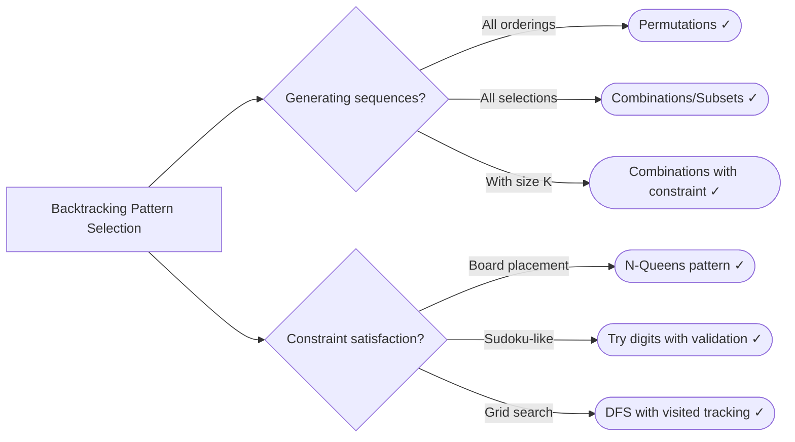

# Backtracking

> Explore all possible solutions by building candidates and abandoning them when they fail

---

## Learning Objectives

By the end of this topic you will be able to:

- Implement the three-step backtracking template (choose, explore, unchoose) for any problem
- Distinguish backtracking from brute force and explain when pruning provides a real speedup
- Generate permutations, combinations, and subsets using the correct variant of the template
- Solve constraint satisfaction problems (N-Queens, Sudoku) by tracking attacked positions
- Identify the duplicate-skipping condition needed when the input contains repeated elements
- Recognize when a problem is NOT improved by backtracking and a simpler DP or greedy solution exists

---

!!! note "Operational reality"
    ReDoS (Regular Expression Denial of Service) is catastrophic backtracking: a carefully crafted input causes a backtracking regex engine to explore exponentially many paths. Cloudflare suffered a global outage in 2019 from a single poorly-written regex that triggered this. SQL query planners use backtracking-style search to find optimal join orderings — the search space is O(n!) for n tables, which is why planners set a threshold and switch to heuristics. SAT solvers, used in hardware verification tools (formal verification of chip designs) and package conflict resolution, are backtracking algorithms with aggressive pruning (CDCL). Dependency resolver conflicts in pip and npm that produce "no solution found" errors are the SAT solver giving up.

## ELI5: Explain Like I'm 5

<div class="learner-section" markdown>

**Your task:** After implementing all patterns, explain them simply.

**Prompts to guide you:**

1. **What is backtracking in one sentence?**
    - Backtracking is a technique that ___ all candidates by ___ choices one at a time, and ___ the last choice
      when it leads to a dead end.
    - Your answer: <span class="fill-in">[Fill in after implementation]</span>

2. **How is backtracking different from brute force?**
    - Brute force generates ___ then checks validity, while backtracking checks ___ during generation, allowing it
      to ___ entire branches.
    - Your answer: <span class="fill-in">[Fill in after implementation]</span>

3. **Real-world analogy:**
    - Example: "Backtracking is like solving a maze by trying each path and going back when you hit a dead end..."
    - Your analogy: <span class="fill-in">[Fill in]</span>

4. **When does this pattern work?**
    - Backtracking works when you must ___ and the solution space has ___ structure that allows ___ invalid paths
      early.
    - Your answer: <span class="fill-in">[Fill in after solving problems]</span>

5. **What makes a problem suitable for backtracking?**
    - A problem is suitable when you can ___ partial solutions incrementally, and when an ___ partial solution can
      never lead to a valid complete solution.
    - Your answer: <span class="fill-in">[Fill in after learning the pattern]</span>

</div>

---

## Core Implementation

### Pattern 1: Permutations

**Concept:** Generate all possible orderings of elements.

**Use case:** Permutations, permutations with duplicates.

```java
--8<-- "com/study/dsa/backtracking/PermutationsPattern.java"
```


!!! warning "Debugging Challenge — Broken Permutations"
    The following permutations implementation has two bugs:

    ```java
    private static void backtrack(int[] nums, List<Integer> current,
                                  boolean[] used, List<List<Integer>> result) {
        if (current.size() == nums.length) {
            result.add(current);        // BUG 1
            return;
        }

        for (int i = 0; i < nums.length; i++) {
            if (used[i]) continue;

            used[i] = true;
            current.add(nums[i]);
            backtrack(nums, current, used, result);
            // BUG 2: missing lines here
        }
    }
    ```

    - Bug 1: What is wrong with `result.add(current)`?
    - Bug 2: What two lines are missing after the recursive call?

    ??? success "Answer"
        **Bug 1:** Should be `result.add(new ArrayList<>(current))`. Without copying, all results reference the
        same list object. As backtracking modifies `current`, every entry in `result` gets overwritten, producing
        wrong output.

        **Bug 2:** Missing the undo (backtrack) step. After the recursive call, add:

        ```java
        current.remove(current.size() - 1);  // Undo choice
        used[i] = false;                      // Undo state
        ```

        Without these lines, the algorithm never properly undoes its choices. It can only explore one branch down the
        leftmost path.

---

### Pattern 2: Combinations and Subsets

**Concept:** Generate all possible selections of elements.

**Use case:** Combinations, subsets, subset sum.

```java
--8<-- "com/study/dsa/backtracking/CombinationsPattern.java"
```


!!! warning "Debugging Challenge — Subsets with Duplicates Missing Both Fixes"
    The following code generates duplicate subsets for input `[1, 2, 2]`:

    ```java
    public static List<List<Integer>> subsetsWithDup_Buggy(int[] nums) {
        List<List<Integer>> result = new ArrayList<>();
        backtrack(nums, 0, new ArrayList<>(), result);
        return result;
    }

    private static void backtrack(int[] nums, int start,
                                  List<Integer> current,
                                  List<List<Integer>> result) {
        result.add(new ArrayList<>(current));

        for (int i = start; i < nums.length; i++) {
            current.add(nums[i]);
            backtrack(nums, i + 1, current, result);
            current.remove(current.size() - 1);
        }
    }
    ```

    For input `[1, 2, 2]`, what is expected and what does the buggy code produce? Name both missing fixes.

    ??? success "Answer"
        **Expected:** `[[], [1], [1,2], [1,2,2], [2], [2,2]]` — 6 unique subsets

        **Buggy output:** 8 subsets (includes `[2]` and `[1,2]` twice each)

        **Fix 1:** Add `Arrays.sort(nums);` before calling backtrack. Sorting groups duplicates together so we can
        detect them.

        **Fix 2:** Add a duplicate-skip check at the start of the loop:

        ```java
        if (i > start && nums[i] == nums[i - 1]) {
            continue;  // Skip duplicates at same recursion level
        }
        ```

        This skips using `nums[i]` as the current element when it equals the previous element at the same level
        (meaning we already explored that branch).

---

### Pattern 3: N-Queens and Constraint Satisfaction

**Concept:** Place elements with constraints, backtrack on violations.

**Use case:** N-Queens, Sudoku solver.

```java
--8<-- "com/study/dsa/backtracking/ConstraintSatisfaction.java"
```


---

### Pattern 4: Grid Search (Word Search)

**Concept:** Explore grid paths with backtracking.

**Use case:** Word search, path finding with constraints.

```java
--8<-- "com/study/dsa/backtracking/GridSearch.java"
```


---

## Before/After: Why This Pattern Matters

**Your task:** Compare naive vs optimized approaches to understand the impact.

### Example: Find All Subsets

**Problem:** Generate all subsets of an array `[1, 2, 3]`.

#### Approach 1: Brute Force Enumeration

```java
// Naive approach - Generate all possible combinations with checking
public static List<List<Integer>> subsets_BruteForce(int[] nums) {
    List<List<Integer>> result = new ArrayList<>();
    int n = nums.length;

    // Generate all possible bit patterns (2^n combinations)
    for (int mask = 0; mask < (1 << n); mask++) {
        List<Integer> subset = new ArrayList<>();

        // Check each bit to decide if element is included
        for (int i = 0; i < n; i++) {
            if ((mask & (1 << i)) != 0) {
                subset.add(nums[i]);
            }
        }

        result.add(subset);
    }

    return result;
}
```

**Analysis:**

- Time: O(2^n * n) — Generate 2^n combinations, each takes O(n) to build
- Space: O(2^n * n) — Store all subsets
- For n = 10: 1,024 subsets * 10 operations = ~10,240 operations
- **Limitation:** Cannot easily add pruning or constraints

#### Approach 2: Backtracking with Pruning

```java
// Optimized approach - Use backtracking to build subsets
public static List<List<Integer>> subsets_Backtracking(int[] nums) {
    List<List<Integer>> result = new ArrayList<>();
    backtrack(nums, 0, new ArrayList<>(), result);
    return result;
}

private static void backtrack(int[] nums, int start,
                              List<Integer> current,
                              List<List<Integer>> result) {
    // Add current subset (valid at every step)
    result.add(new ArrayList<>(current));

    // Explore further choices
    for (int i = start; i < nums.length; i++) {
        current.add(nums[i]);              // Make choice
        backtrack(nums, i + 1, current, result);  // Explore
        current.remove(current.size() - 1); // Undo choice (backtrack)
    }
}
```

**Analysis:**

- Time: O(2^n * n) — Same asymptotic complexity
- Space: O(n) — Recursion depth (excluding output)
- For n = 10: Similar operations BUT can easily add pruning
- **Advantage:** Can prune branches early with constraints

#### Performance Comparison

| Problem Type           | Brute Force    | Backtracking   | Advantage              |
|------------------------|----------------|----------------|------------------------|
| All subsets (n=10)     | 10,240 ops     | 10,240 ops     | Same without pruning   |
| Subsets with sum ≤ K   | 10,240 ops     | ~5,000 ops     | 2x faster with pruning |
| N-Queens (n=8)         | 16,777,216 ops | ~2,000 ops     | 8,000x faster!         |

**Your calculation:** For N-Queens with n=4, brute force tries _____ placements, backtracking tries approximately _____.

#### Why Does Backtracking with Pruning Work?

!!! note "Key insight"
    The power of backtracking comes from **pruning entire subtrees**. When you detect that a partial candidate
    cannot possibly lead to a valid solution, you abandon it immediately — eliminating potentially millions of
    branches without ever exploring them. The earlier in the search tree you prune, the more work you save.

In N-Queens (4x4 board):

```
Brute Force: Try all 4^16 possible placements (>4 billion)
Then check if valid

Backtracking:
Row 1: Try 4 positions
  Row 2: Only try valid positions (maybe 2 safe)
    Row 3: Only try valid positions (maybe 1 safe)
      Row 4: Only try valid positions
      ❌ Invalid? Backtrack immediately!
```

**Pruning eliminates entire branches:**

- Brute force: Check constraints AFTER generating complete solution
- Backtracking: Check constraints DURING generation
- Each invalid partial solution eliminates millions of possibilities!

**After implementing, explain in your own words:**

<div class="learner-section" markdown>

- Why is backtracking better than brute force enumeration? <span class="fill-in">[Your answer]</span>
- When does backtracking give the biggest advantage? <span class="fill-in">[Your answer]</span>
- What problems are NOT improved by backtracking? <span class="fill-in">[Your answer]</span>

</div>

---

## Case Studies

### Chess Engines: N-Queens as the Constraint Satisfaction Foundation

The N-Queens problem is the canonical introduction to constraint satisfaction, which underlies Sudoku solvers, timetable
scheduling, and register allocation in compilers. The key insight — tracking attacked positions in sets of columns and
diagonals (row-col, row+col) rather than scanning the board — applies directly to any problem where you must track
which "slots" are occupied by previously placed elements.

### Game Solvers: Sudoku and Crossword Puzzles

Published Sudoku solvers (used by newspapers and puzzle apps) use backtracking with constraint propagation: at each
empty cell, they first narrow the set of valid digits by checking rows, columns, and boxes (constraint propagation),
then branch on the cell with fewest candidates. The `isValidSudoku` check is exactly this pattern — the combination of
backtracking + early pruning makes 9×9 Sudoku tractable in milliseconds.

### Spell Checking: Combination Sum as Autocorrect Core

Autocorrect systems find all valid word completions within edit distance k. This is essentially a combination problem
where at each character you either keep, replace, or delete — a backtracking search over edit operations. The pruning
condition (stop exploring when the edit budget is exhausted) is exactly the same as pruning in combination sum when the
running total exceeds the target.

!!! warning "When it breaks"
    Backtracking breaks when the search space is too large even with pruning: the exponential nature (O(n!) or O(k^n)) means adding a few elements can turn a millisecond solution into a minute-long computation. It also breaks when the problem has overlapping subproblems — pure backtracking recomputes the same subproblems repeatedly, and memoization converts it to dynamic programming. The tell: if the same `(start, currentState)` tuple appears in multiple branches of the recursion tree, backtracking is doing redundant work and DP is the right approach.

---

## Common Misconceptions

!!! danger "Backtracking always explores the full search tree"
    Backtracking only explores the full tree when there is no pruning. Effective pruning — checking constraints as
    early as possible rather than at the leaves — can reduce the search from exponential to polynomial for many
    practical inputs. The key skill is identifying the earliest point where a partial candidate can be declared
    invalid.

!!! danger "You must use a boolean visited array for all backtracking problems"
    For permutations (where order matters and each element is used once), a `boolean[] used` array is needed. For
    subsets and combinations (where you advance a `start` index), no visited array is needed because you never go
    backwards in the array. Mixing these two approaches causes bugs.

!!! danger "Forgetting to copy the list when adding to results"
    `result.add(current)` adds a **reference** to the same list object. As backtracking modifies `current`, every
    entry in `result` gets overwritten. Always use `result.add(new ArrayList<>(current))` to capture a snapshot
    of the current state.

---

## Decision Framework

<div class="learner-section" markdown>

**Your task:** Build decision trees for backtracking problems.

### Question 1: What are you generating?

Answer after solving problems:

- **All permutations?** <span class="fill-in">[Use permutation backtracking]</span>
- **All combinations/subsets?** <span class="fill-in">[Use combination backtracking]</span>
- **Single valid solution?** <span class="fill-in">[Return early when found]</span>
- **Count solutions?** <span class="fill-in">[Track count, don't store paths]</span>

### Question 2: What are the constraints?

**No duplicates in input:**

- Approach: <span class="fill-in">[Simple backtracking]</span>

**Duplicates in input:**

- Approach: <span class="fill-in">[Sort first, skip duplicates at same level]</span>

**Size constraint (k elements):**

- Approach: <span class="fill-in">[Add base case for size]</span>

**Sum/product constraint:**

- Approach: <span class="fill-in">[Track running sum/product, prune early]</span>

**Grid constraints:**

- Approach: <span class="fill-in">[Mark visited, unmark on backtrack]</span>

### Your Decision Tree


```mermaid
flowchart LR
    Start["Backtracking Pattern Selection"]

    Q1{"Generating sequences?"}
    Start --> Q1
    N2(["Permutations ✓"])
    Q1 -->|"All orderings"| N2
    N3(["Combinations/Subsets ✓"])
    Q1 -->|"All selections"| N3
    N4(["Combinations with constraint ✓"])
    Q1 -->|"With size K"| N4
    Q5{"Constraint satisfaction?"}
    Start --> Q5
    N6(["N-Queens pattern ✓"])
    Q5 -->|"Board placement"| N6
    N7(["Try digits with validation ✓"])
    Q5 -->|"Sudoku-like"| N7
    N8(["DFS with visited tracking ✓"])
    Q5 -->|"Grid search"| N8
```

</div>

---

## Practice

<div class="learner-section" markdown>

### LeetCode Problems

**Easy (Complete all 2):**

- [ ] [257. Binary Tree Paths](https://leetcode.com/problems/binary-tree-paths/)
    - Pattern: <span class="fill-in">[Backtracking with path tracking]</span>
    - Your solution time: <span class="fill-in">___</span>
    - Key insight: <span class="fill-in">[Fill in after solving]</span>

- [ ] [401. Binary Watch](https://leetcode.com/problems/binary-watch/)
    - Pattern: <span class="fill-in">[Generate all combinations]</span>
    - Your solution time: <span class="fill-in">___</span>
    - Key insight: <span class="fill-in">[Fill in]</span>

**Medium (Complete 4-5):**

- [ ] [46. Permutations](https://leetcode.com/problems/permutations/)
    - Pattern: <span class="fill-in">[Classic permutations]</span>
    - Difficulty: <span class="fill-in">[Rate 1-10]</span>
    - Key insight: <span class="fill-in">[Fill in]</span>

- [ ] [78. Subsets](https://leetcode.com/problems/subsets/)
    - Pattern: <span class="fill-in">[Classic subsets]</span>
    - Difficulty: <span class="fill-in">[Rate 1-10]</span>
    - Key insight: <span class="fill-in">[Fill in]</span>

- [ ] [39. Combination Sum](https://leetcode.com/problems/combination-sum/)
    - Pattern: <span class="fill-in">[Combinations with reuse]</span>
    - Difficulty: <span class="fill-in">[Rate 1-10]</span>
    - Key insight: <span class="fill-in">[Fill in]</span>

- [ ] [79. Word Search](https://leetcode.com/problems/word-search/)
    - Pattern: <span class="fill-in">[Grid DFS with backtracking]</span>
    - Difficulty: <span class="fill-in">[Rate 1-10]</span>
    - Key insight: <span class="fill-in">[Fill in]</span>

- [ ] [22. Generate Parentheses](https://leetcode.com/problems/generate-parentheses/)
    - Pattern: <span class="fill-in">[Generate valid sequences]</span>
    - Difficulty: <span class="fill-in">[Rate 1-10]</span>
    - Key insight: <span class="fill-in">[Fill in]</span>

**Hard (Optional):**

- [ ] [51. N-Queens](https://leetcode.com/problems/n-queens/)
    - Pattern: <span class="fill-in">[Constraint satisfaction]</span>
    - Key insight: <span class="fill-in">[Fill in after solving]</span>

- [ ] [37. Sudoku Solver](https://leetcode.com/problems/sudoku-solver/)
    - Pattern: <span class="fill-in">[Grid constraint satisfaction]</span>
    - Key insight: <span class="fill-in">[Fill in after solving]</span>

**Failure modes:**

- What happens if the pruning condition (e.g., running sum exceeds target in combination sum, or column/diagonal conflict in N-Queens) is never triggered? <span class="fill-in">[Fill in]</span>
- How does your algorithm behave when there is no valid solution — for example, an unsolvable Sudoku board or a word search target that does not exist in the grid? <span class="fill-in">[Fill in]</span>

</div>

---

## Test Your Understanding

Answer these without referring to your notes or implementation.

1. Write the three-step backtracking template (choose, explore, unchoose) in pseudocode. What happens if you omit the
   "unchoose" step?

    ??? success "Rubric"
        A complete answer addresses: (1) the three steps are `current.add(choice)` / `backtrack(...)` / `current.remove(last)` plus restoring any auxiliary state (e.g., `used[i] = false`); (2) omitting the unchoose step means the algorithm never restores state — subsequent recursive calls see a polluted `current` list and `used` array, so it can only explore one path all the way down and produces at most one (incorrect) result; (3) the unchoose step is what makes backtracking O(branching-factor ^ depth) rather than O(infinity) — without it the algorithm does not explore other branches.

2. For generating subsets with duplicates from `[1, 2, 2]`, explain why you must sort the array first and what
   condition skips duplicates. What would go wrong if you used a Set to deduplicate the output instead?

    ??? success "Rubric"
        A complete answer addresses: (1) sorting groups equal elements together so that `nums[i] == nums[i-1]` reliably detects a duplicate at the same recursion level — without sorting, equal elements may be non-adjacent and the condition would miss duplicates; (2) the skip condition is `if (i > start && nums[i] == nums[i-1]) continue` — `i > start` ensures we only skip when we are at the same level, not when the duplicate appears in a parent call; (3) using a Set on the output is O(2^n * n) extra space and does not eliminate the exponential blowup in recursive calls — the backtracking still generates all duplicates, then discards them, whereas the skip condition prunes duplicate subtrees before they are explored.

3. In the N-Queens problem, how do you represent "diagonal under attack" without scanning the board? What mathematical
   property of row-col and row+col makes this work?

    ??? success "Rubric"
        A complete answer addresses: (1) two sets `diag1` and `diag2` store the values `row - col` and `row + col` for every placed queen; (2) all cells on the same top-left-to-bottom-right diagonal share the same `row - col` value, and all cells on the same top-right-to-bottom-left diagonal share the same `row + col` value — this is a fixed integer for the entire diagonal, so set membership tests in O(1); (3) placing one queen per row (iterating row by row) automatically guarantees no two queens share a row, so only column and two diagonal sets are needed.

4. Compare subsets (starts advancing `start` index) vs permutations (uses `boolean[] used`). Why does each problem
   require a different mechanism to avoid reuse?

    ??? success "Rubric"
        A complete answer addresses: (1) subsets are order-independent — `[1,2]` and `[2,1]` are the same subset — so advancing `start` past the current index prevents selecting earlier elements again and avoids counting the same subset twice; (2) permutations are order-dependent — `[1,2]` and `[2,1]` are distinct permutations — so every element can appear at every position, and a `boolean[] used` array tracks which elements have already been placed in the current partial permutation; (3) using `start` for permutations would miss orderings that use elements from earlier positions, while using `boolean[] used` for subsets would generate duplicates because the same set of elements could be chosen in different orders.

5. A colleague says "backtracking is always better than dynamic programming because it avoids storing all subproblems."
   Under what conditions is this claim wrong, and what kind of problem is DP faster for?

    ??? success "Rubric"
        A complete answer addresses: (1) backtracking is exponential in the worst case — O(2^n) or O(n!) — because it explores every branch; DP is polynomial when the problem has overlapping subproblems, reducing time from O(2^n) to O(n^2) or O(n*W) by caching subproblem results; (2) the claim is wrong whenever the backtracking search visits the same subproblem state multiple times — for example, Fibonacci, 0/1 knapsack, or longest common subsequence all have exponential backtracking trees with massively overlapping subproblems; (3) backtracking is appropriate when the problem requires enumerating all solutions or when the state space has no overlapping subproblems (e.g., generating all permutations); DP is appropriate when you only need the optimal value and the state space is DAG-shaped with repeated states.

---

## Connected Topics

<div class="bs-callout bs-callout-info" markdown>

**Where this topic connects**

- **[06. Trees](06-trees.md)** — backtracking IS tree DFS on an implicit decision tree; every recursive call expands a node, and backtracking prunes branches → [06. Trees](06-trees.md)
- **[11. Advanced Graphs](11-advanced-graphs.md)** — backtracking is used for constrained graph path problems (Hamiltonian path, word ladder); compare with Dijkstra when edge weights matter → [11. Advanced Graphs](11-advanced-graphs.md)
- **[13. Dynamic Programming](13-dynamic-programming.md)** — DP optimises backtracking by memoising subproblem results; if the backtracking state space has overlapping subproblems, DP cuts exponential time to polynomial → [13. Dynamic Programming](13-dynamic-programming.md)

</div>
