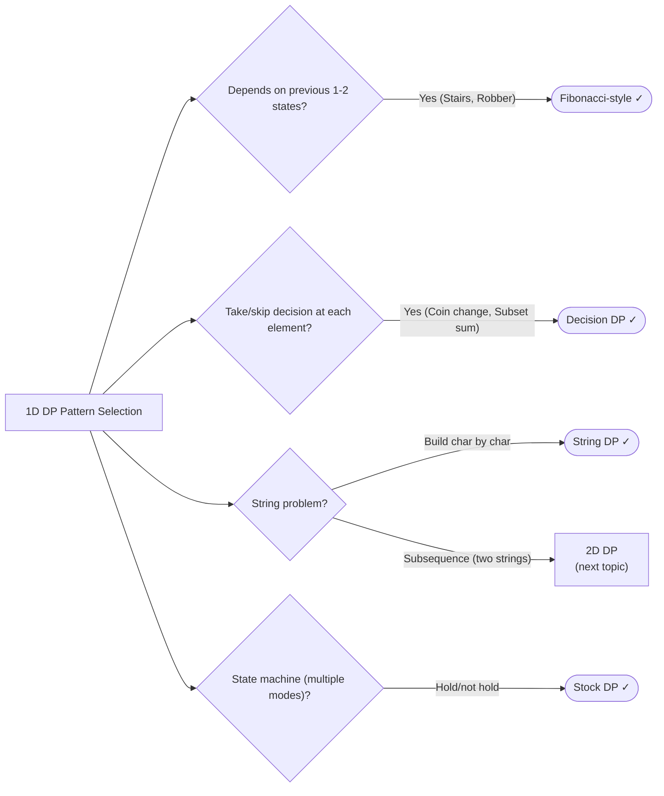

# Dynamic Programming

> Turn exponential recursion into polynomial iteration by caching subproblem results

---

## Learning Objectives

By the end of this topic you will be able to:

- Identify when a problem has both optimal substructure and overlapping subproblems — the two requirements for DP
- Implement both top-down (memoization) and bottom-up (tabulation) approaches for the same problem
- Write correct recurrence relations for Fibonacci-style, decision, string, and stock DP patterns
- Optimize space complexity from O(n) to O(1) when only the previous one or two states are needed
- Distinguish the loop order required for combination counting vs permutation counting in coin change variants
- Debug the five most common DP mistakes: off-by-one bounds, wrong base cases, Integer.MAX_VALUE overflow, incorrect recurrence, and wrong iteration order

---

## ELI5: Explain Like I'm 5

<div class="learner-section" markdown>

**Your task:** After implementing all patterns, explain them simply.

**Prompts to guide you:**

1. **What is dynamic programming in one sentence?**
    - DP is a technique that solves complex problems by breaking them into ___, solving each ___ only once, and
      ___ results to avoid redundant work.
    - Your answer: <span class="fill-in">[Fill in after implementation]</span>

2. **How is DP different from regular recursion?**
    - Regular recursion may recalculate the same ___ many times, while DP ___ each subproblem result so it is only
      computed ___.
    - Your answer: <span class="fill-in">[Fill in after implementation]</span>

3. **Real-world analogy:**
    - Example: "DP is like saving your homework answers so you don't have to recalculate the same problems..."
    - Your analogy: <span class="fill-in">[Fill in]</span>

4. **When does this pattern work?**
    - DP works when a problem has ___ (larger solutions are built from smaller ones) and ___ (the same smaller
      problems appear repeatedly).
    - Your answer: <span class="fill-in">[Fill in after solving problems]</span>

5. **What's the difference between top-down and bottom-up?**
    - Top-down starts with the ___ problem and ___ down, caching results. Bottom-up starts with the ___ cases and
      ___ up, filling a table iteratively.
    - Your answer: <span class="fill-in">[Fill in after learning both approaches]</span>

</div>

---

## Quick Quiz (Do BEFORE implementing)

!!! tip "How to use this section"
    Complete your predictions now, before reading further. You will revisit and verify each answer after running the
    benchmark (or completing the implementation).

<div class="learner-section" markdown>

**Your task:** Test your intuition without looking at code. Answer these, then verify after implementation.

### Complexity Predictions

1. **Pure recursive Fibonacci (no memoization):**
    - Time complexity: <span class="fill-in">[Your guess: O(?)]</span>
    - Verified after learning: <span class="fill-in">[Actual: O(?)]</span>

2. **Fibonacci with memoization (top-down DP):**
    - Time complexity: <span class="fill-in">[Your guess: O(?)]</span>
    - Space complexity: <span class="fill-in">[Your guess: O(?)]</span>
    - Verified: <span class="fill-in">[Actual]</span>

3. **Fibonacci with bottom-up DP:**
    - Time complexity: <span class="fill-in">[Your guess: O(?)]</span>
    - Space complexity with array: <span class="fill-in">[Your guess: O(?)]</span>
    - Space complexity optimized: <span class="fill-in">[Your guess: O(?)]</span>
    - Verified: <span class="fill-in">[Actual]</span>

4. **Speedup calculation for Fibonacci(40):**
    - Recursive (no memo) = 2^40 = <span class="fill-in">_____</span> operations
    - With memoization = 40 = <span class="fill-in">_____</span> operations
    - Speedup factor: <span class="fill-in">_____</span> times faster

### Scenario Predictions

**Scenario 1:** Climbing stairs — 1 or 2 steps at a time to reach step 5

- **How many ways without computing?** <span class="fill-in">[Your guess: ___]</span>
- **Can you see the Fibonacci pattern?** <span class="fill-in">[Yes/No - Why?]</span>
- **Recurrence relation:** ways(n) = <span class="fill-in">[Fill in formula]</span>
- **Why does memoization help here?** <span class="fill-in">[Fill in]</span>

**Scenario 2:** Coin change — coins [1, 2, 5], amount = 11

- **Minimum coins needed:** <span class="fill-in">[Your guess: ___]</span>
- **What makes this a DP problem?** <span class="fill-in">[Fill in]</span>
- **What are the overlapping subproblems?** <span class="fill-in">[Fill in]</span>

**Scenario 3:** House robber — houses [2, 7, 9, 3, 1]

- **Maximum money without adjacents:** <span class="fill-in">[Your guess: ___]</span>
- **Which pattern applies?** <span class="fill-in">[Fibonacci-style/Decision/String/Stock]</span>
- **Recurrence relation:** rob(i) = <span class="fill-in">[Fill in formula]</span>

### Trade-off Quiz

**Question:** When would recursive with memoization be BETTER than bottom-up DP?

- Your answer: <span class="fill-in">[Fill in before implementation]</span>
- Verified answer: <span class="fill-in">[Fill in after learning]</span>

**Question:** What's the MAIN requirement for dynamic programming to work?

- [ ] Problem must involve arrays
- [ ] Must have optimal substructure
- [ ] Must have overlapping subproblems
- [ ] Both optimal substructure AND overlapping subproblems
- [ ] Must be solvable recursively

Verify after implementation: <span class="fill-in">[Which one(s)?]</span>

**Question:** Space optimization — when can you reduce O(n) to O(1)?

- Your answer: <span class="fill-in">[Fill in — what's the pattern?]</span>
- Verified: <span class="fill-in">[Fill in after learning Fibonacci-style problems]</span>

</div>

---

## Core Implementation

### Pattern 1: Fibonacci-Style Problems

**Concept:** Each state depends on previous 1-2 states.

**Use case:** Climbing stairs, house robber, decode ways.

```java
public class FibonacciStyle {

    /**
     * Problem: Climbing stairs (1 or 2 steps at a time)
     * Time: O(n), Space: O(1)
     *
     * TODO: Implement using DP
     */
    public static int climbStairs(int n) {
        // TODO: Base cases: n=1 -> 1, n=2 -> 2

        // TODO: DP approach (bottom-up):

        return 0; // Replace with implementation
    }

    /**
     * Problem: House robber (can't rob adjacent houses)
     * Time: O(n), Space: O(1)
     *
     * TODO: Implement using DP
     */
    public static int rob(int[] nums) {
        // TODO: dp[i] = max money robbing up to house i
        // TODO: dp[i] = max(dp[i-1], dp[i-2] + nums[i])
        // TODO: Optimize space: only need last 2 values

        return 0; // Replace with implementation
    }

    /**
     * Problem: House robber II (houses in a circle)
     * Time: O(n), Space: O(1)
     *
     * TODO: Implement circular version
     */
    public static int robCircular(int[] nums) {
        // TODO: Can't rob both first and last house
        // TODO: Try two scenarios:
        // TODO: Return max of both

        return 0; // Replace with implementation
    }

    /**
     * Problem: Min cost climbing stairs
     * Time: O(n), Space: O(1)
     *
     * TODO: Implement min cost DP
     */
    public static int minCostClimbingStairs(int[] cost) {
        // TODO: dp[i] = min cost to reach step i
        // TODO: dp[i] = cost[i] + min(dp[i-1], dp[i-2])
        // TODO: Can start from step 0 or 1

        return 0; // Replace with implementation
    }
}
```

**Runnable Client Code:**

```java
import java.util.*;

public class FibonacciStyleClient {

    public static void main(String[] args) {
        System.out.println("=== Fibonacci-Style DP ===\n");

        // Test 1: Climbing stairs
        System.out.println("--- Test 1: Climbing Stairs ---");
        int[] stairs = {1, 2, 3, 4, 5, 10};
        for (int n : stairs) {
            int ways = FibonacciStyle.climbStairs(n);
            System.out.printf("n=%d: %d ways%n", n, ways);
        }

        // Test 2: House robber
        System.out.println("\n--- Test 2: House Robber ---");
        int[][] houses = {
            {1, 2, 3, 1},
            {2, 7, 9, 3, 1},
            {2, 1, 1, 2}
        };

        for (int[] house : houses) {
            int maxMoney = FibonacciStyle.rob(house);
            System.out.printf("Houses: %s -> Max: %d%n",
                Arrays.toString(house), maxMoney);
        }

        // Test 3: House robber II (circular)
        System.out.println("\n--- Test 3: House Robber II ---");
        int[][] circularHouses = {
            {2, 3, 2},
            {1, 2, 3, 1},
            {1, 2, 3}
        };

        for (int[] house : circularHouses) {
            int maxMoney = FibonacciStyle.robCircular(house);
            System.out.printf("Houses: %s -> Max: %d%n",
                Arrays.toString(house), maxMoney);
        }

        // Test 4: Min cost climbing
        System.out.println("\n--- Test 4: Min Cost Climbing Stairs ---");
        int[][] costs = {
            {10, 15, 20},
            {1, 100, 1, 1, 1, 100, 1, 1, 100, 1}
        };

        for (int[] cost : costs) {
            int minCost = FibonacciStyle.minCostClimbingStairs(cost);
            System.out.printf("Cost: %s -> Min: %d%n",
                Arrays.toString(cost), minCost);
        }
    }
}
```

!!! warning "Debugging Challenge — Wrong Base Case in House Robber"
    The following implementation returns the wrong answer for `[2, 1, 1, 2]`:

    ```java
    public static int rob_Buggy(int[] nums) {
        if (nums.length == 0) return 0;
        if (nums.length == 1) return nums[0];

        int[] dp = new int[nums.length];
        dp[0] = nums[0];
        dp[1] = nums[1];   // BUG
        for (int i = 2; i < nums.length; i++) {
            dp[i] = Math.max(dp[i - 1], dp[i - 2] + nums[i]);
        }
        return dp[nums.length - 1];
    }
    ```

    Trace through `[2, 1, 1, 2]` manually. What result do you get, and what is the correct answer? How should `dp[1]`
    be set?

    ??? success "Answer"
        **Buggy trace for [2, 1, 1, 2]:**

        - dp[0] = 2
        - dp[1] = 1 (BUG: should be max(2, 1) = 2)
        - dp[2] = max(dp[1], dp[0] + nums[2]) = max(1, 2+1) = 3
        - dp[3] = max(dp[2], dp[1] + nums[3]) = max(3, 1+2) = 3

        Returns 3, but correct answer is 4 (rob houses 0 and 3: 2+2=4).

        **Fix:** `dp[1] = Math.max(nums[0], nums[1])` — at house 1, you choose the better of the two, not automatically
        house 1.

---

### Pattern 2: Decision Problems (Take/Skip)

**Concept:** At each position, decide to take or skip element.

**Use case:** Coin change, subset sum, partition equal subset.

```java
import java.util.*;

public class DecisionProblems {

    /**
     * Problem: Coin change - minimum coins to make amount
     * Time: O(amount * n), Space: O(amount)
     *
     * TODO: Implement using DP
     */
    public static int coinChange(int[] coins, int amount) {
        // TODO: dp[i] = min coins to make amount i
        // TODO: dp[i] = min(dp[i], dp[i - coin] + 1) for each coin
        // TODO: Initialize dp[0] = 0, rest = infinity
        // TODO: Return dp[amount] or -1 if impossible

        return -1; // Replace with implementation
    }

    /**
     * Problem: Coin change II - count ways to make amount
     * Time: O(amount * n), Space: O(amount)
     *
     * TODO: Implement counting ways
     */
    public static int change(int amount, int[] coins) {
        // TODO: dp[i] = ways to make amount i
        // TODO: Implement iteration/conditional logic
        // TODO: dp[i] += dp[i - coin]

        return 0; // Replace with implementation
    }

    /**
     * Problem: Perfect squares - min perfect squares to sum to n
     * Time: O(n * sqrt(n)), Space: O(n)
     *
     * TODO: Implement using DP
     */
    public static int numSquares(int n) {
        // TODO: Similar to coin change
        // TODO: "Coins" are perfect squares: 1, 4, 9, 16, ...
        // TODO: dp[i] = min perfect squares to sum to i

        return 0; // Replace with implementation
    }

    /**
     * Problem: Partition equal subset sum
     * Time: O(n * sum), Space: O(sum)
     *
     * TODO: Implement subset sum DP
     */
    public static boolean canPartition(int[] nums) {
        // TODO: Implement iteration/conditional logic
        // TODO: Problem becomes: can we make sum/2?
        // TODO: dp[i] = can we make sum i?
        // TODO: Implement iteration/conditional logic

        return false; // Replace with implementation
    }
}
```

**Runnable Client Code:**

```java
import java.util.*;

public class DecisionProblemsClient {

    public static void main(String[] args) {
        System.out.println("=== Decision Problems ===\n");

        // Test 1: Coin change
        System.out.println("--- Test 1: Coin Change ---");
        int[] coins = {1, 2, 5};
        int[] amounts = {11, 3, 0, 7};

        System.out.println("Coins: " + Arrays.toString(coins));
        for (int amount : amounts) {
            int result = DecisionProblems.coinChange(coins, amount);
            System.out.printf("Amount %d: %d coins%n", amount, result);
        }

        // Test 2: Coin change II (count ways)
        System.out.println("\n--- Test 2: Coin Change II ---");
        int amount = 5;
        int[] coins2 = {1, 2, 5};

        System.out.println("Amount: " + amount);
        System.out.println("Coins: " + Arrays.toString(coins2));
        int ways = DecisionProblems.change(amount, coins2);
        System.out.println("Ways: " + ways);

        // Test 3: Perfect squares
        System.out.println("\n--- Test 3: Perfect Squares ---");
        int[] numbers = {12, 13, 1, 4, 9, 16};

        for (int n : numbers) {
            int count = DecisionProblems.numSquares(n);
            System.out.printf("n=%d: %d perfect squares%n", n, count);
        }

        // Test 4: Partition equal subset
        System.out.println("\n--- Test 4: Partition Equal Subset ---");
        int[][] arrays = {
            {1, 5, 11, 5},
            {1, 2, 3, 5},
            {1, 2, 3, 4}
        };

        for (int[] arr : arrays) {
            boolean canPartition = DecisionProblems.canPartition(arr);
            System.out.printf("Array: %s -> %s%n",
                Arrays.toString(arr), canPartition ? "YES" : "NO");
        }
    }
}
```

!!! warning "Debugging Challenge — Wrong Loop Order in Coin Change II"
    The following code is supposed to count the number of ways (combinations) to make a target amount:

    ```java
    public static int change_Buggy(int amount, int[] coins) {
        int[] dp = new int[amount + 1];
        dp[0] = 1;

        for (int i = 1; i <= amount; i++) {       // outer: amounts
            for (int coin : coins) {              // inner: coins
                if (i >= coin) {
                    dp[i] += dp[i - coin];
                }
            }
        }
        return dp[amount];
    }
    ```

    For amount=4, coins=[1,2], expected is 3 ways. What does this code return? What does swapping the loop order fix?

    ??? success "Answer"
        **Buggy output:** 5 (it counts permutations: [1,1,2], [1,2,1], [2,1,1], [2,2], [1,1,1,1])

        **Root cause:** Looping over amounts in the outer loop allows using each coin at any earlier amount, effectively
        allowing the same coins in different orders to be counted as distinct combinations.

        **Fix — swap loop order:**

        ```java
        for (int coin : coins) {           // outer: coins
            for (int i = coin; i <= amount; i++) {  // inner: amounts
                dp[i] += dp[i - coin];
            }
        }
        ```

        With coins in the outer loop, each coin type is fully "committed" before moving to the next. This prevents
        counting [1,2] and [2,1] as separate ways.

---

### Pattern 3: String DP

**Concept:** Build solution character by character.

**Use case:** Decode ways, word break, palindrome partitioning.

```java
import java.util.*;

public class StringDP {

    /**
     * Problem: Decode ways (1=A, 2=B, ..., 26=Z)
     * Time: O(n), Space: O(1)
     *
     * TODO: Implement decode ways
     */
    public static int numDecodings(String s) {
        // TODO: dp[i] = ways to decode substring 0..i
        // TODO: Single digit: if s[i] != '0', dp[i] += dp[i-1]
        // TODO: Two digits: if 10 <= s[i-1:i] <= 26, dp[i] += dp[i-2]
        // TODO: Optimize space: only need last 2 values

        return 0; // Replace with implementation
    }

    /**
     * Problem: Word break - can string be segmented into words
     * Time: O(n^2 * m) where m = avg word length, Space: O(n)
     *
     * TODO: Implement word break
     */
    public static boolean wordBreak(String s, List<String> wordDict) {
        // TODO: dp[i] = can substring 0..i be segmented?
        // TODO: dp[i] = true if any dp[j] && s.substring(j,i) in dict
        // TODO: Use HashSet for O(1) word lookup

        return false; // Replace with implementation
    }

    /**
     * Problem: Longest increasing subsequence
     * Time: O(n^2), Space: O(n)
     *
     * TODO: Implement LIS using DP
     */
    public static int lengthOfLIS(int[] nums) {
        // TODO: dp[i] = length of LIS ending at i
        // TODO: Implement logic
        // TODO: Return max value in dp array

        return 0; // Replace with implementation
    }

    /**
     * Problem: Longest palindromic substring
     * Time: O(n^2), Space: O(n^2) or O(1) with expand from center
     *
     * TODO: Implement LPS
     */
    public static String longestPalindrome(String s) {
        // TODO: Expand around center approach (space O(1))
        // TODO: Try each position as center (odd and even length)
        // TODO: Or use DP: dp[i][j] = is substring i..j palindrome?

        return ""; // Replace with implementation
    }
}
```

**Runnable Client Code:**

```java
import java.util.*;

public class StringDPClient {

    public static void main(String[] args) {
        System.out.println("=== String DP ===\n");

        // Test 1: Decode ways
        System.out.println("--- Test 1: Decode Ways ---");
        String[] codes = {"12", "226", "06", "10"};

        for (String code : codes) {
            int ways = StringDP.numDecodings(code);
            System.out.printf("Code \"%s\": %d ways%n", code, ways);
        }

        // Test 2: Word break
        System.out.println("\n--- Test 2: Word Break ---");
        List<String> dict = Arrays.asList("leet", "code", "sand", "and", "cat");
        String[] testStrings = {"leetcode", "catsand", "catsandog"};

        System.out.println("Dictionary: " + dict);
        for (String s : testStrings) {
            boolean canBreak = StringDP.wordBreak(s, dict);
            System.out.printf("String \"%s\": %s%n", s, canBreak ? "YES" : "NO");
        }

        // Test 3: Longest increasing subsequence
        System.out.println("\n--- Test 3: Longest Increasing Subsequence ---");
        int[][] sequences = {
            {10, 9, 2, 5, 3, 7, 101, 18},
            {0, 1, 0, 3, 2, 3},
            {7, 7, 7, 7}
        };

        for (int[] seq : sequences) {
            int length = StringDP.lengthOfLIS(seq);
            System.out.printf("Array: %s -> LIS length: %d%n",
                Arrays.toString(seq), length);
        }

        // Test 4: Longest palindromic substring
        System.out.println("\n--- Test 4: Longest Palindromic Substring ---");
        String[] palindromeTests = {"babad", "cbbd", "racecar", "noon"};

        for (String s : palindromeTests) {
            String lps = StringDP.longestPalindrome(s);
            System.out.printf("String \"%s\" -> LPS: \"%s\"%n", s, lps);
        }
    }
}
```

---

### Pattern 4: Buy/Sell Stock Problems

**Concept:** Track states (holding/not holding stock) through array.

**Use case:** Stock trading with various constraints.

```java
public class StockProblems {

    /**
     * Problem: Best time to buy and sell stock (one transaction)
     * Time: O(n), Space: O(1)
     *
     * TODO: Implement single transaction
     */
    public static int maxProfit(int[] prices) {
        // TODO: Track minimum price seen so far
        // TODO: Track maximum profit (price - minPrice)
        // TODO: One pass solution

        return 0; // Replace with implementation
    }

    /**
     * Problem: Best time to buy and sell stock II (unlimited transactions)
     * Time: O(n), Space: O(1)
     *
     * TODO: Implement unlimited transactions
     */
    public static int maxProfitUnlimited(int[] prices) {
        // TODO: Sum all positive differences
        // TODO: Buy before every increase, sell at peak

        return 0; // Replace with implementation
    }

    /**
     * Problem: Best time to buy and sell stock with cooldown
     * Time: O(n), Space: O(1)
     *
     * TODO: Implement with cooldown
     */
    public static int maxProfitCooldown(int[] prices) {
        // TODO: Track three states:
        // TODO: Transitions: hold -> sold -> rest -> hold

        return 0; // Replace with implementation
    }

    /**
     * Problem: Best time to buy and sell stock with fee
     * Time: O(n), Space: O(1)
     *
     * TODO: Implement with transaction fee
     */
    public static int maxProfitWithFee(int[] prices, int fee) {
        // TODO: Similar to cooldown
        // TODO: Subtract fee when selling

        return 0; // Replace with implementation
    }
}
```

**Runnable Client Code:**

```java
import java.util.*;

public class StockProblemsClient {

    public static void main(String[] args) {
        System.out.println("=== Stock Problems ===\n");

        // Test 1: Single transaction
        System.out.println("--- Test 1: Single Transaction ---");
        int[] prices1 = {7, 1, 5, 3, 6, 4};
        System.out.println("Prices: " + Arrays.toString(prices1));
        int profit1 = StockProblems.maxProfit(prices1);
        System.out.println("Max profit: " + profit1);

        // Test 2: Unlimited transactions
        System.out.println("\n--- Test 2: Unlimited Transactions ---");
        int[] prices2 = {7, 1, 5, 3, 6, 4};
        System.out.println("Prices: " + Arrays.toString(prices2));
        int profit2 = StockProblems.maxProfitUnlimited(prices2);
        System.out.println("Max profit: " + profit2);

        // Test 3: With cooldown
        System.out.println("\n--- Test 3: With Cooldown ---");
        int[] prices3 = {1, 2, 3, 0, 2};
        System.out.println("Prices: " + Arrays.toString(prices3));
        int profit3 = StockProblems.maxProfitCooldown(prices3);
        System.out.println("Max profit: " + profit3);

        // Test 4: With fee
        System.out.println("\n--- Test 4: With Transaction Fee ---");
        int[] prices4 = {1, 3, 2, 8, 4, 9};
        int fee = 2;
        System.out.println("Prices: " + Arrays.toString(prices4));
        System.out.println("Fee: " + fee);
        int profit4 = StockProblems.maxProfitWithFee(prices4, fee);
        System.out.println("Max profit: " + profit4);
    }
}
```

---

## Before/After: Why This Pattern Matters

**Your task:** Compare naive vs optimized approaches to understand exponential to polynomial transformation.

### Example: Fibonacci Number

**Problem:** Calculate the nth Fibonacci number where F(n) = F(n-1) + F(n-2).

#### Approach 1: Pure Recursion (Exponential)

```java
// Naive approach - Recalculates same values many times
public static int fib_Recursive(int n) {
    if (n <= 1) return n;
    return fib_Recursive(n - 1) + fib_Recursive(n - 2);
}
```

**Analysis:**

- Time: O(2^n) — Each call branches into two more calls
- Space: O(n) — Recursion stack depth
- For n = 40: ~2,000,000,000 operations (takes several seconds)
- For n = 50: Would take hours or days

**Why so slow?** Tree of recursive calls:

```
fib(5)
├── fib(4)
│   ├── fib(3)
│   │   ├── fib(2)
│   │   │   ├── fib(1)
│   │   │   └── fib(0)
│   │   └── fib(1)
│   └── fib(2)
│       ├── fib(1)
│       └── fib(0)
└── fib(3)  ← RECALCULATING same subtree!
    ├── fib(2)
    │   ├── fib(1)
    │   └── fib(0)
    └── fib(1)
```

fib(3) is calculated TWICE, fib(2) THREE times, fib(1) FIVE times!

#### Approach 2: Memoization — Top-Down DP (Polynomial)

```java
// Optimized - Cache results to avoid recalculation
public static int fib_Memoization(int n, int[] memo) {
    if (n <= 1) return n;
    if (memo[n] != 0) return memo[n];  // Already calculated!

    memo[n] = fib_Memoization(n - 1, memo) + fib_Memoization(n - 2, memo);
    return memo[n];
}

// Wrapper
public static int fib(int n) {
    return fib_Memoization(n, new int[n + 1]);
}
```

**Analysis:**

- Time: O(n) — Each fib(i) computed exactly once
- Space: O(n) — Memoization array + recursion stack
- For n = 40: ~40 operations (instant)
- For n = 50: ~50 operations (instant)

#### Approach 3: Bottom-Up DP (Best Space Optimization)

```java
// Iterative - Build from bottom, optimize space
public static int fib_BottomUp(int n) {
    if (n <= 1) return n;

    int prev2 = 0;  // F(0)
    int prev1 = 1;  // F(1)

    for (int i = 2; i <= n; i++) {
        int current = prev1 + prev2;
        prev2 = prev1;
        prev1 = current;
    }

    return prev1;
}
```

**Analysis:**

- Time: O(n) — Single pass
- Space: O(1) — Only 3 variables (optimized from O(n) array)
- For n = 40: ~40 operations, minimal memory
- No recursion stack overhead

#### Performance Comparison

| Approach    | n=10    | n=20    | n=30    | n=40    | Space      |
|-------------|---------|---------|---------|---------|------------|
| Recursive   | 0.001ms | 2ms     | 200ms   | 2000ms  | O(n) stack |
| Memoization | 0.001ms | 0.001ms | 0.001ms | 0.001ms | O(n) array |
| Bottom-Up   | 0.001ms | 0.001ms | 0.001ms | 0.001ms | O(1)       |

**Speedup for n=40:** Memoization is ~2,000,000x faster than pure recursion!

#### Why Does DP Work Here?

!!! note "Key insight"
    Two properties must hold for DP to be applicable: **optimal substructure** (the solution to F(n) can be built
    from the solutions to F(n-1) and F(n-2)) and **overlapping subproblems** (the same sub-values are calculated
    repeatedly in naive recursion). If both hold, caching transforms exponential into polynomial time.

**Visualization of overlapping subproblems:**

```
Computing fib(6):
fib(5): needs fib(4) + fib(3)
fib(4): needs fib(3) + fib(2)
fib(3): needs fib(2) + fib(1)
              ↑         ↑
      These repeat!   These repeat!
```

**Without DP:** Recalculate everything (exponential waste)  
**With DP:** Calculate once, reuse (polynomial efficiency)

---

### Example 2: Coin Change (Decision Problem)

**Problem:** Minimum coins needed to make amount = 11 with coins [1, 2, 5].

#### Approach 1: Brute Force Recursion

```java
// Try all combinations - exponential time
public static int coinChange_Recursive(int[] coins, int amount) {
    if (amount == 0) return 0;
    if (amount < 0) return -1;

    int min = Integer.MAX_VALUE;
    for (int coin : coins) {
        int result = coinChange_Recursive(coins, amount - coin);
        if (result >= 0 && result < min) {
            min = result + 1;
        }
    }

    return min == Integer.MAX_VALUE ? -1 : min;
}
```

**Analysis:**

- Time: O(amount^coins) — Exponential branching
- Space: O(amount) — Recursion depth
- For amount = 100, coins = [1, 2, 5]: billions of operations

#### Approach 2: Bottom-Up DP

```java
// Build table of minimum coins for each amount
public static int coinChange_DP(int[] coins, int amount) {
    int[] dp = new int[amount + 1];
    Arrays.fill(dp, amount + 1);  // Initialize with "infinity"
    dp[0] = 0;  // Base case

    for (int i = 1; i <= amount; i++) {
        for (int coin : coins) {
            if (i >= coin) {
                dp[i] = Math.min(dp[i], dp[i - coin] + 1);
            }
        }
    }

    return dp[amount] > amount ? -1 : dp[amount];
}
```

**Analysis:**

- Time: O(amount × coins) — Polynomial
- Space: O(amount) — DP array
- For amount = 100, coins = [1, 2, 5]: ~300 operations

**Speedup:** From exponential to polynomial!

**After implementing, explain in your own words:**

<div class="learner-section" markdown>

- Why does caching subproblem results help? <span class="fill-in">[Your answer]</span>
- What's the difference between top-down and bottom-up? <span class="fill-in">[Your answer]</span>
- When would you choose one approach over the other? <span class="fill-in">[Your answer]</span>

</div>

!!! info "Loop back"
    Return to the Quick Quiz now and fill in your verified answers.

---

## Case Studies

### Browser History: Longest Common Subsequence

When a version control system (git diff) computes the minimal edit between two file versions, it uses a DP
algorithm equivalent to computing the longest common subsequence (LCS). The "diff" you see is derived from the LCS of
the two files' lines. The O(m×n) DP table maps directly to the edit distance pattern in 2D DP.

### Financial Trading Platforms: Stock Buy/Sell Optimization

Real algorithmic trading systems use state-machine DP to determine optimal trading strategies under various constraints
(one transaction, unlimited, cooldown, fees). The key insight — tracking "holding" vs "not holding" as separate DP
states — is exactly the pattern in the stock problems above. The state-machine view generalizes to problems with
multiple modes.

### Mobile Keyboard Autocomplete: Word Break

Smartphone keyboards use word break DP to determine valid word segmentation in swipe-to-type mode. When you swipe
"HELLOWORLD", the keyboard computes `wordBreak` against a dictionary to produce "HELLO WORLD". The DP table's `dp[i]`
stores whether the prefix up to position `i` forms valid words, enabling O(n²) segmentation instead of exponential
backtracking.

---

## Common Misconceptions

!!! warning "DP always requires an array or table"
    Many DP problems can be solved with only two or three variables (O(1) space) when the recurrence only depends on
    the previous one or two states. Fibonacci, house robber, climbing stairs, and the stock problems with states all
    reduce to constant space. Always check if you can eliminate the array after understanding the recurrence.

!!! warning "Initializing the DP array with Integer.MAX_VALUE is safe"
    Using `Integer.MAX_VALUE` as "infinity" in DP is a common source of silent bugs. When you compute
    `dp[i - coin] + 1` and `dp[i - coin]` is `Integer.MAX_VALUE`, integer overflow produces a negative number,
    which silently passes the `Math.min` check. Use `amount + 1` as infinity for coin change (it's impossible to
    need more coins than the amount itself, assuming coin value 1 exists).

!!! warning "Top-down memoization and bottom-up tabulation always give the same complexity"
    Both have the same time complexity (solve each unique subproblem once), but their space complexity can differ.
    Top-down uses O(n) stack space plus the memo array. Bottom-up can often be space-optimized below O(n) because
    you control the iteration order. For problems where only the last 1-2 states matter, bottom-up reaches O(1)
    space; top-down cannot achieve this without eliminating recursion.

---

## Decision Framework

<div class="learner-section" markdown>

**Your task:** Build decision trees for 1D DP problems.

### Question 1: What defines a state?

Answer after solving problems:

- **Single index?** <span class="fill-in">[1D DP array]</span>
- **Two indices?** <span class="fill-in">[2D DP — next topic]</span>
- **Additional state (holding/not)?** <span class="fill-in">[Multiple DP arrays or states]</span>
- **Your observation:** <span class="fill-in">[Fill in]</span>

### Question 2: Top-down or bottom-up?

**Top-down (Memoization):**

- Pros: <span class="fill-in">[Natural recursion, only compute needed states]</span>
- Cons: <span class="fill-in">[Stack space, slightly slower]</span>
- Use when: <span class="fill-in">[Complex recurrence, not all states needed]</span>

**Bottom-up (Tabulation):**

- Pros: <span class="fill-in">[No stack, often faster, space optimization]</span>
- Cons: <span class="fill-in">[Must compute all states]</span>
- Use when: <span class="fill-in">[Simple iteration order, need all states]</span>

### Your Decision Tree



</div>

---

## Practice

<div class="learner-section" markdown>

### LeetCode Problems

**Easy (Complete all 3):**

- [ ] [70. Climbing Stairs](https://leetcode.com/problems/climbing-stairs/)
    - Pattern: <span class="fill-in">[Fibonacci-style]</span>
    - Your solution time: <span class="fill-in">___</span>
    - Key insight: <span class="fill-in">[Fill in after solving]</span>

- [ ] [746. Min Cost Climbing Stairs](https://leetcode.com/problems/min-cost-climbing-stairs/)
    - Pattern: <span class="fill-in">[Fibonacci with cost]</span>
    - Your solution time: <span class="fill-in">___</span>
    - Key insight: <span class="fill-in">[Fill in]</span>

- [ ] [121. Best Time to Buy and Sell Stock](https://leetcode.com/problems/best-time-to-buy-and-sell-stock/)
    - Pattern: <span class="fill-in">[Single transaction]</span>
    - Your solution time: <span class="fill-in">___</span>
    - Key insight: <span class="fill-in">[Fill in]</span>

**Medium (Complete 4-5):**

- [ ] [198. House Robber](https://leetcode.com/problems/house-robber/)
    - Pattern: <span class="fill-in">[Fibonacci-style decision]</span>
    - Difficulty: <span class="fill-in">[Rate 1-10]</span>
    - Key insight: <span class="fill-in">[Fill in]</span>

- [ ] [322. Coin Change](https://leetcode.com/problems/coin-change/)
    - Pattern: <span class="fill-in">[Decision DP]</span>
    - Difficulty: <span class="fill-in">[Rate 1-10]</span>
    - Key insight: <span class="fill-in">[Fill in]</span>

- [ ] [139. Word Break](https://leetcode.com/problems/word-break/)
    - Pattern: <span class="fill-in">[String DP]</span>
    - Difficulty: <span class="fill-in">[Rate 1-10]</span>
    - Key insight: <span class="fill-in">[Fill in]</span>

- [ ] [300. Longest Increasing Subsequence](https://leetcode.com/problems/longest-increasing-subsequence/)
    - Pattern: <span class="fill-in">[Sequence DP]</span>
    - Difficulty: <span class="fill-in">[Rate 1-10]</span>
    - Key insight: <span class="fill-in">[Fill in]</span>

- [ ] [91. Decode Ways](https://leetcode.com/problems/decode-ways/)
    - Pattern: <span class="fill-in">[String DP]</span>
    - Difficulty: <span class="fill-in">[Rate 1-10]</span>
    - Key insight: <span class="fill-in">[Fill in]</span>

**Hard (Optional):**

- [ ] [152. Maximum Product Subarray](https://leetcode.com/problems/maximum-product-subarray/)
    - Pattern: <span class="fill-in">[Track min and max]</span>
    - Key insight: <span class="fill-in">[Fill in after solving]</span>

- [ ] [132. Palindrome Partitioning II](https://leetcode.com/problems/palindrome-partitioning-ii/)
    - Pattern: <span class="fill-in">[String DP with cut optimization]</span>
    - Key insight: <span class="fill-in">[Fill in after solving]</span>

**Failure modes:**

- What happens if the memoization table for coin change is initialized with `Integer.MAX_VALUE` instead of `amount + 1` — what silent bug does the expression `dp[i - coin] + 1` produce? <span class="fill-in">[Fill in]</span>
- How does your implementation behave when the recurrence for house robber uses `dp[i] = max(dp[i-1], nums[i] + dp[i-2])` but `dp[1]` is set to `nums[1]` instead of `max(nums[0], nums[1])` — which inputs expose this bug? <span class="fill-in">[Fill in]</span>

</div>

---

## Test Your Understanding

Answer these without referring to your notes or implementation.

1. State the two properties a problem must have for DP to apply. For each property, give an example from this topic
   that demonstrates it.

    ??? success "Rubric"
        A complete answer addresses: (1) optimal substructure — the optimal solution to the problem contains optimal solutions to its subproblems; example: in coin change, the minimum coins for amount n is 1 + minimum coins for amount n-coin, and this subproblem relationship is used directly in the recurrence; (2) overlapping subproblems — the same subproblems are solved multiple times in the naive recursive solution; example: in Fibonacci, fib(3) is computed independently in both the fib(5)→fib(4) branch and the fib(5)→fib(3) branch; (3) both are required — greedy has optimal substructure but no overlapping subproblems; divide-and-conquer (merge sort) has overlapping work but solves distinct (non-overlapping) subproblems.

2. For the house robber problem `[2, 1, 1, 2]`, trace through the correct DP table values (dp[0] through dp[3]). Why
   is `dp[1] = max(nums[0], nums[1])` rather than just `nums[1]`?

    ??? success "Rubric"
        A complete answer addresses: (1) the correct trace — dp[0]=2, dp[1]=max(2,1)=2, dp[2]=max(dp[1], dp[0]+nums[2])=max(2,3)=3, dp[3]=max(dp[2], dp[1]+nums[3])=max(3,4)=4; return 4; (2) why dp[1] = max — dp[1] represents the maximum profit from the first two houses; you can rob either house 0 or house 1, but not both (they are adjacent); setting dp[1]=nums[1] incorrectly assumes you always rob house 1, ignoring the potentially better choice of house 0; (3) the bug this fixes — for input [2,1,...] the bug gives dp[1]=1 instead of 2, causing all subsequent values to be underestimates.

3. Coin Change I (minimum coins) and Coin Change II (count ways) use different loop orders. Explain why the loop order
   matters for Coin Change II but not for Coin Change I.

    ??? success "Rubric"
        A complete answer addresses: (1) Coin Change II — coins in the outer loop, amounts in the inner loop; this ensures that for a given coin type, all amounts that use it are updated before moving to the next coin; this prevents the same coin being used in different "orderings" (e.g., [1,2] and [2,1] count as one combination, not two); (2) Coin Change I — the loop order (coins outer vs amounts outer) does not affect the minimum count because we are minimizing, not counting; min(dp[i], dp[i-coin]+1) yields the same result regardless of the order coins are considered, since we are taking the minimum over all coin choices; (3) the underlying reason — counting combinations requires a careful distinction between ordered and unordered selections, while minimization only cares about the value at each state.

4. When can you reduce the O(n) DP array to O(1) space? Give two examples from this topic where this optimization
   applies, and one where it does not.

    ??? success "Rubric"
        A complete answer addresses: (1) the condition — O(1) space is possible when the recurrence at position i depends only on the previous 1 or 2 states, not on an arbitrary earlier index; (2) examples where it applies — Fibonacci/climbing stairs (dp[i] depends only on dp[i-1] and dp[i-2], so two variables suffice); house robber (same pattern); stock buy/sell with states (each state depends only on the previous day's states); (3) example where it does not apply — coin change: dp[i] depends on dp[i-coin] for any coin in the coins array; since coins can have arbitrary values, you need the full dp array up to i; similarly, word break's dp[i] depends on dp[j] for any j where s[j..i] is in the dictionary.

5. A colleague says "I always use top-down memoization because it's easier to write." Under what conditions would
   bottom-up tabulation be the better choice? Give one concrete performance reason and one concrete correctness reason.

    ??? success "Rubric"
        A complete answer addresses: (1) performance reason — for large n (e.g., n=100,000), top-down recursion can overflow the call stack (Java's default ~500K frames); bottom-up iterates without any stack overhead; additionally, bottom-up avoids function call overhead and often has better cache locality since it fills the table sequentially; (2) correctness reason — bottom-up makes the iteration order explicit, preventing accidental cycles in state dependencies; with top-down, a poorly designed memo key or a missing base case can cause infinite recursion or incorrect caching without any obvious error; (3) when top-down wins — when only a small fraction of the dp states are actually needed (sparse subproblem space), top-down avoids computing unnecessary states; bottom-up fills the entire table regardless.

---

## Connected Topics

!!! info "Where this topic connects"

    - **[03. Hash Tables](03-hash-tables.md)** — HashMap memoization is the standard top-down DP implementation; the hash table maps subproblem state to result → [03. Hash Tables](03-hash-tables.md)
    - **[06. Trees](06-trees.md)** — tree DP (diameter, max path sum) uses post-order DFS to propagate subproblem solutions from leaves to root → [06. Trees](06-trees.md)
