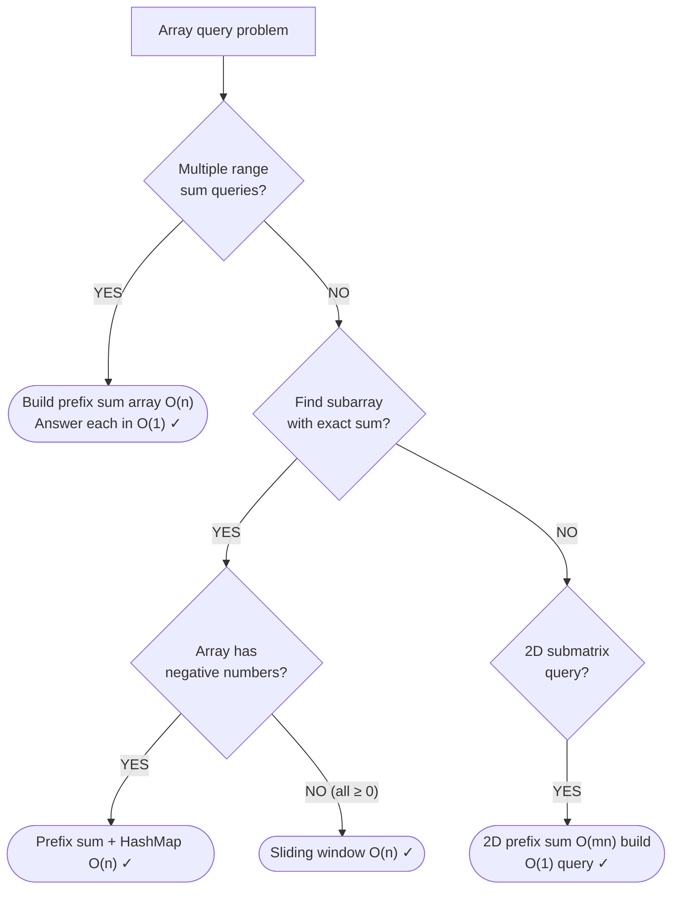

# Prefix Sums

> Precompute cumulative sums to answer range queries in O(1)

---

## Learning Objectives

By the end of this topic you will be able to:

- Build a 1D prefix sum array and answer any range-sum query in O(1) after O(n) preprocessing
- Explain why the prefix sum array has length n+1 and what `prefixSum[0] = 0` represents
- Apply the prefix sum + HashMap pattern to count subarrays with a target sum in O(n)
- Transform a 0/1 array into a signed array to reduce "equal zeros and ones" to "subarray sum = 0"
- Compute prefix and suffix products in two passes to solve product-except-self in O(1) space
- Build a 2D prefix sum matrix and answer submatrix sum queries using the inclusion-exclusion formula
- Distinguish when a sliding window is sufficient versus when a prefix sum + HashMap is needed

---

## ELI5: Explain Like I'm 5

<div class="learner-section" markdown>

**Your task:** After implementing all patterns, explain them simply.

**Prompts to guide you:**

1. **What is a prefix sum array in one sentence?**
    - Your answer: <span class="fill-in">[A prefix sum array precomputes ___ at each index so that any range sum from index L to R can be answered in ___ by ___]</span>

2. **The space-time trade-off:**
    - Your answer: <span class="fill-in">[You pay ___ extra space up front so that each range query costs ___ instead of ___]</span>

3. **Real-world analogy:**
    - Example: "Prefix sums are like a running bank balance — you can find how much was spent between any two dates by subtracting two totals instead of adding up every transaction."
    - Your analogy: <span class="fill-in">[Fill in]</span>

4. **When does this pattern work?**
    - Your answer: <span class="fill-in">[Fill in after solving problems]</span>

5. **When does this pattern fail?**
    - Your answer: <span class="fill-in">[Fill in — think about what property the array must have for prefix sums to be meaningful]</span>

</div>

---

## Quick Quiz (Do BEFORE implementing)

!!! tip "How to use this section"
    Write your best guess in each fill-in span **before** reading any implementation code. After you finish coding and running the tests, come back and fill in the "Verified" answers.

<div class="learner-section" markdown>

**Your task:** Test your intuition without looking at code. Answer these, then verify after implementation.

### Complexity Predictions

1. **Brute-force range sum query (loop over subarray each time):**
    - Time per query: <span class="fill-in">[Your guess: O(?)]</span>
    - Time for Q queries on array of n: <span class="fill-in">[Your guess: O(?)]</span>

2. **Prefix sum range query:**
    - Preprocessing time: <span class="fill-in">[Your guess: O(?)]</span>
    - Time per query after preprocessing: <span class="fill-in">[Your guess: O(?)]</span>
    - Space: <span class="fill-in">[Your guess: O(?)]</span>
    - Verified: <span class="fill-in">[Actual]</span>

3. **Subarray sum equals K using prefix sum + HashMap:**
    - Time: <span class="fill-in">[Your guess: O(?)]</span>
    - Why not O(n²)? <span class="fill-in">[Fill in after learning]</span>

### Scenario Predictions

**Scenario 1:** Array `[-2, 0, 3, -5, 2, -1]`. Find sum of indices 2 to 5.

- **Brute force:** sum elements at indices 2, 3, 4, 5 = <span class="fill-in">[Your calculation: ___]</span>
- **With prefix sums:** `prefixSum[6] - prefixSum[2]` = <span class="fill-in">[What would these values be?]</span>

**Scenario 2:** Array `[1, 1, 1]`, find number of subarrays summing to 2.

- **Must you try all pairs?** <span class="fill-in">[Yes/No — is there a shortcut?]</span>
- **Your prediction:** <span class="fill-in">[How many subarrays?]</span>
- **What HashMap key would you use?** <span class="fill-in">[Fill in after thinking]</span>

**Scenario 3:** Array `[0, 1, 0, 1, 1, 0]`. Find longest subarray with equal 0s and 1s.

- **Can you use a sliding window?** <span class="fill-in">[Yes/No — Why?]</span>
- **What transformation makes this a prefix sum problem?** <span class="fill-in">[Fill in]</span>

### Trade-off Quiz

**Question:** When should you use sliding window instead of prefix sum?

- Your answer: <span class="fill-in">[Fill in before implementation]</span>
- Verified answer: <span class="fill-in">[Fill in after learning]</span>

**Question:** The prefix sum array for `[3, 1, 4]` has length:

- [ ] 3 (same as input)
- [ ] 4 (n+1)
- [ ] 6 (2n)

Verify after implementation: <span class="fill-in">[Which one, and why?]</span>

</div>

---

## Core Implementation

### Pattern 1: 1D Range Sum Query

**Concept:** Precompute cumulative sums so any range query answers in O(1).

**Use case:** Multiple range sum queries on a static array.

```java
public class PrefixSum {

    /**
     * Problem: Range sum query (immutable array)
     * Time: O(1) query after O(n) preprocessing, Space: O(n)
     *
     * TODO: Implement range sum query
     */
    static class NumArray {
        private int[] prefixSum;

        public NumArray(int[] nums) {
            // TODO: Build prefix sum array of length nums.length + 1
            // TODO: prefixSum[0] = 0
            // TODO: prefixSum[i] = prefixSum[i-1] + nums[i-1]
        }

        public int sumRange(int left, int right) {
            // TODO: Return prefixSum[right+1] - prefixSum[left]
            return 0; // Replace with implementation
        }
    }
}
```

**Runnable Client Code:**

```java
import java.util.*;

public class PrefixSumClient {

    public static void main(String[] args) {
        System.out.println("=== Range Sum Query ===\n");

        int[] arr = {-2, 0, 3, -5, 2, -1};
        PrefixSum.NumArray numArray = new PrefixSum.NumArray(arr);
        System.out.println("Array: " + Arrays.toString(arr));

        int[][] queries = {{0, 2}, {2, 5}, {0, 5}};
        for (int[] query : queries) {
            int sum = numArray.sumRange(query[0], query[1]);
            System.out.printf("sumRange(%d, %d) = %d%n", query[0], query[1], sum);
        }
    }
}
```

!!! warning "Debugging Challenge — Off-by-One in sumRange"
    The code below uses a prefix sum array of length `n` (not `n+1`). It compiles but throws an `ArrayIndexOutOfBoundsException` on some inputs. Identify the bug before checking the answer.

    ```java
    static class NumArray_Buggy {
        private int[] prefixSum;

        public NumArray_Buggy(int[] nums) {
            prefixSum = new int[nums.length];   // BUG: wrong length
            prefixSum[0] = nums[0];
            for (int i = 1; i < nums.length; i++) {
                prefixSum[i] = prefixSum[i-1] + nums[i];
            }
        }

        public int sumRange(int left, int right) {
            if (left == 0) return prefixSum[right];
            return prefixSum[right] - prefixSum[left - 1];
        }
    }
    ```

    - Bug: <span class="fill-in">[Why does length n cause problems? What query triggers the crash?]</span>

    ??? success "Answer"
        **Bug:** The array has length `n`, but the standard formula `prefixSum[right+1] - prefixSum[left]` requires index `right+1`, which reaches `n` when `right = n-1` — an out-of-bounds access.

        The workaround in the buggy version (`if (left == 0)`) handles that case, but now the semantics are inconsistent — `prefixSum[i]` sometimes means "sum of first i+1 elements" and sometimes "sum of first i elements", depending on the branch taken. This fragility causes subtle wrong answers on edge cases.

        **Fix:** Use length `n+1` with `prefixSum[0] = 0`. The formula `prefixSum[right+1] - prefixSum[left]` is then uniformly correct for all valid inputs with no special-casing.

---

### Pattern 2: Prefix Sum + HashMap (Subarray Sum)

**Concept:** Store prefix sums in a HashMap to find subarrays with a target sum in O(n).

**Use case:** Count subarrays with sum = k, longest subarray with sum = k.

```java
import java.util.*;

public class SubarraySum {

    /**
     * Problem: Count subarrays summing to K
     * Time: O(n), Space: O(n)
     *
     * TODO: Implement using prefix sum + hashmap
     * Key insight: if prefixSum[j] - prefixSum[i] == k,
     * then nums[i..j-1] sums to k.
     * So for each j, count how many i have prefixSum[i] == prefixSum[j] - k.
     */
    public static int subarraySum(int[] nums, int k) {
        // TODO: Initialize map with {0: 1} (empty prefix has sum 0)
        // TODO: Track running prefix sum
        // TODO: For each element, check if (currentSum - k) is in map
        // TODO: Add currentSum to map

        return 0; // Replace with implementation
    }

    /**
     * Problem: Contiguous array (equal 0s and 1s)
     * Time: O(n), Space: O(n)
     *
     * TODO: Implement using prefix sum
     * Key insight: replace 0s with -1s, then problem becomes
     * "longest subarray with sum = 0"
     */
    public static int findMaxLength(int[] nums) {
        // TODO: Initialize map with {0: -1} (sum 0 seen at index -1)
        // TODO: Track running sum (treat 0 as -1)
        // TODO: If sum seen before, update maxLen using stored index
        // TODO: Otherwise, record current index for this sum

        return 0; // Replace with implementation
    }
}
```

**Runnable Client Code:**

```java
import java.util.*;

public class SubarraySumClient {

    public static void main(String[] args) {
        System.out.println("=== Prefix Sum + HashMap ===\n");

        // Test 1: Subarray sum equals K
        System.out.println("--- Test 1: Subarray Sum Equals K ---");
        int[][] arrays = {{1,1,1}, {1,2,3}, {-1,-1,1}};
        int[] targets = {2, 3, 0};

        for (int i = 0; i < arrays.length; i++) {
            int count = SubarraySum.subarraySum(arrays[i], targets[i]);
            System.out.printf("Array: %s, k=%d -> %d subarrays%n",
                Arrays.toString(arrays[i]), targets[i], count);
        }

        // Test 2: Contiguous array
        System.out.println("\n--- Test 2: Contiguous Array ---");
        int[][] binArrays = {{0,1}, {0,1,0}, {0,1,0,1,1,0}};

        for (int[] arr : binArrays) {
            int maxLen = SubarraySum.findMaxLength(arr);
            System.out.printf("Array: %s -> maxLen=%d%n",
                Arrays.toString(arr), maxLen);
        }
    }
}
```

!!! warning "Debugging Challenge — Missing Initial Map Entry"
    This implementation omits the initial `{0: 1}` entry. It produces wrong answers for subarrays starting at index 0. Trace through `nums = [1, 1, 1]`, `k = 2` to see where it breaks.

    ```java
    public static int subarraySum_Buggy(int[] nums, int k) {
        Map<Integer, Integer> map = new HashMap<>();  // BUG: missing {0:1}
        int count = 0, sum = 0;

        for (int num : nums) {
            sum += num;
            if (map.containsKey(sum - k)) {
                count += map.get(sum - k);
            }
            map.put(sum, map.getOrDefault(sum, 0) + 1);
        }

        return count;
    }
    ```

    - Bug: <span class="fill-in">[What subarrays are missed? Why?]</span>

    ??? success "Answer"
        **Bug:** Without `{0: 1}`, when `sum - k == 0` (meaning the subarray from index 0 to the current index sums to k), the map lookup finds nothing and the subarray is not counted.

        For `[1, 1, 1]` with `k = 2`: after processing indices 0-1, `sum = 2`, so `sum - k = 0`. The correct answer includes the subarray `[1,1]` starting at index 0, but without `{0: 1}` in the map, this is missed. The correct answer is 2 subarrays; the buggy version returns 1.

        **Fix:** `map.put(0, 1)` before the loop. This represents "there is one way to have a prefix sum of 0: the empty prefix."

---

### Pattern 3: Prefix and Suffix Products

**Concept:** Two-pass technique — compute prefix products left-to-right, then multiply by suffix products right-to-left.

**Use case:** Product of array except self (no division allowed).

```java
public class ProductExceptSelf {

    /**
     * Problem: Product of array except self
     * Time: O(n), Space: O(1) excluding output array
     *
     * TODO: Implement using prefix and suffix products
     * Pass 1: result[i] = product of all elements to the LEFT of i
     * Pass 2: multiply result[i] by product of all elements to the RIGHT of i
     */
    public static int[] productExceptSelf(int[] nums) {
        int n = nums.length;
        int[] result = new int[n];

        // TODO: Pass 1 — fill result with prefix products
        // result[0] = 1 (no elements to the left of index 0)
        // result[i] = result[i-1] * nums[i-1]

        // TODO: Pass 2 — multiply by suffix products in-place
        // Track running suffix product (start at 1)
        // Traverse right to left: result[i] *= suffix; suffix *= nums[i]

        return result; // Replace with implementation
    }
}
```

**Runnable Client Code:**

```java
import java.util.*;

public class ProductExceptSelfClient {

    public static void main(String[] args) {
        System.out.println("=== Product Except Self ===\n");

        int[][] tests = {{1,2,3,4}, {-1,1,0,-3,3}, {2,3}};

        for (int[] test : tests) {
            int[] result = ProductExceptSelf.productExceptSelf(test);
            System.out.printf("Input:  %s%n", Arrays.toString(test));
            System.out.printf("Output: %s%n%n", Arrays.toString(result));
        }
    }
}
```

---

### Pattern 4: 2D Prefix Sum

**Concept:** Extend prefix sums to a matrix for O(1) submatrix sum queries.

**Use case:** Sum of rectangle submatrix, count submatrices with target sum.

```java
public class NumMatrix {

    private int[][] prefixSum;

    /**
     * Problem: Range sum query 2D
     * Time: O(1) query after O(m*n) preprocessing, Space: O(m*n)
     *
     * TODO: Implement 2D prefix sum
     * prefixSum[i][j] = sum of submatrix from (0,0) to (i-1,j-1)
     * Build using: prefixSum[i][j] = matrix[i-1][j-1]
     *                              + prefixSum[i-1][j]
     *                              + prefixSum[i][j-1]
     *                              - prefixSum[i-1][j-1]
     */
    public NumMatrix(int[][] matrix) {
        // TODO: Build 2D prefix sum with (m+1) x (n+1) dimensions
    }

    /**
     * TODO: Implement sumRegion using inclusion-exclusion:
     * sum = prefixSum[row2+1][col2+1]
     *     - prefixSum[row1][col2+1]
     *     - prefixSum[row2+1][col1]
     *     + prefixSum[row1][col1]
     */
    public int sumRegion(int row1, int col1, int row2, int col2) {
        return 0; // Replace with implementation
    }
}
```

**Runnable Client Code:**

```java
import java.util.*;

public class NumMatrixClient {

    public static void main(String[] args) {
        System.out.println("=== 2D Range Sum Query ===\n");

        int[][] matrix = {
            {3, 0, 1, 4, 2},
            {5, 6, 3, 2, 1},
            {1, 2, 0, 1, 5},
            {4, 1, 0, 1, 7},
            {1, 0, 3, 0, 5}
        };

        NumMatrix nm = new NumMatrix(matrix);

        System.out.println("Matrix:");
        for (int[] row : matrix) {
            System.out.println("  " + Arrays.toString(row));
        }

        System.out.println();
        System.out.printf("sumRegion(2,1,4,3) = %d (expected 8)%n", nm.sumRegion(2,1,4,3));
        System.out.printf("sumRegion(1,1,2,2) = %d (expected 11)%n", nm.sumRegion(1,1,2,2));
        System.out.printf("sumRegion(1,2,2,4) = %d (expected 12)%n", nm.sumRegion(1,2,2,4));
    }
}
```

---

!!! info "Loop back"
    Before moving on, return to the ELI5 section and Quick Quiz at the top. Fill in any answers you left blank. Pay particular attention to the `{0: 1}` initialization — that single line causes the most bugs in prefix sum + HashMap problems.

---

## Before/After: Why This Pattern Matters

**Your task:** Compare naive vs optimized approaches to understand the impact.

### Example: Multiple Range Sum Queries

**Problem:** Answer Q range sum queries on an array of n elements.

#### Approach 1: Recompute Each Query (Naive)

```java
// Naive: loop over subarray for every query
public static int sumRange_BruteForce(int[] nums, int left, int right) {
    int sum = 0;
    for (int i = left; i <= right; i++) {
        sum += nums[i];
    }
    return sum;
}
```

**Analysis:**

- Time per query: O(n) worst case
- Time for Q queries: O(Q × n)
- For n = 10,000 and Q = 10,000: up to 100,000,000 operations

#### Approach 2: Prefix Sum (Optimized)

```java
// Optimized: O(n) preprocessing, O(1) per query
public static class NumArray {
    private int[] prefixSum;

    public NumArray(int[] nums) {
        prefixSum = new int[nums.length + 1];
        for (int i = 0; i < nums.length; i++) {
            prefixSum[i + 1] = prefixSum[i] + nums[i];
        }
    }

    public int sumRange(int left, int right) {
        return prefixSum[right + 1] - prefixSum[left];
    }
}
```

**Analysis:**

- Preprocessing: O(n) — build prefix sum array once
- Time per query: O(1) — two array lookups and a subtraction
- Total for Q queries: O(n + Q)
- For n = 10,000 and Q = 10,000: ~20,000 operations

#### Performance Comparison

| Queries (Q) | Array Size (n) | Brute Force (O(Q×n)) | Prefix Sum (O(n+Q)) | Speedup |
|-------------|----------------|----------------------|---------------------|---------|
| Q = 100     | n = 1,000      | 100,000 ops          | 1,100 ops           | 91x     |
| Q = 1,000   | n = 10,000     | 10,000,000 ops       | 11,000 ops          | 909x    |
| Q = 10,000  | n = 10,000     | 100,000,000 ops      | 20,000 ops          | 5,000x  |

#### Why Does the Formula Work?

The prefix sum formula `prefixSum[right+1] - prefixSum[left]` is just subtraction of two running totals:

```
nums:       [-2,  0,  3, -5,  2, -1]
prefixSum: [  0, -2, -2,  1, -4, -2, -3]
              ^0   1   2   3   4   5   6

sumRange(2, 5) = prefixSum[6] - prefixSum[2]
              = -3 - (-2)
              = -1
```

!!! note "The running total insight"
    `prefixSum[right+1]` is the total of all elements from 0 to right. `prefixSum[left]` is the total of all elements from 0 to left-1. Their difference is exactly the sum from left to right — the shared prefix cancels out.

<div class="learner-section" markdown>

- Why is `prefixSum[0] = 0` necessary? <span class="fill-in">[Your answer]</span>
- What would go wrong with a prefix sum array of length n instead of n+1? <span class="fill-in">[Your answer]</span>
- Why can't you use a sliding window for subarray sum equals K with negative numbers? <span class="fill-in">[Your answer]</span>

</div>

---

## Common Misconceptions

!!! warning "Misconception: the prefix sum array has the same length as the input array"
    The standard prefix sum array has length n+1, where `prefixSum[0] = 0` and `prefixSum[i] = sum of nums[0..i-1]`. Using length n forces special-casing for `left = 0` and makes the formula inconsistent. The +1 size gives a clean identity: `sumRange(left, right) = prefixSum[right+1] - prefixSum[left]` works for all valid inputs without any branching.

!!! warning "Misconception: prefix sum only works for range sum queries"
    Prefix sums power a broader family: the HashMap variant counts subarrays with a target sum in O(n) by checking whether `currentSum - k` has been seen before. Prefix/suffix products extend the idea to multiplicative accumulation. 2D prefix sums handle submatrix queries. The unifying idea is *precomputed cumulative aggregates* — the underlying operation doesn't have to be addition.

!!! warning "Misconception: sliding window can always replace prefix sum for subarray problems"
    Sliding window requires a **monotonic** property: adding an element either increases or decreases the window metric predictably. With negative numbers, adding an element can both increase and decrease the sum depending on context, so the shrink condition breaks down. The prefix sum + HashMap approach handles negative numbers correctly because it doesn't rely on monotonicity.

---

## Decision Framework

<div class="learner-section" markdown>

**Your task:** Build decision trees for when to use prefix sums.

### Question 1: Do you have multiple range queries on a static array?

Answer after solving problems:

- **If yes:** <span class="fill-in">[Use prefix sum — O(n) preprocessing pays off across Q queries]</span>
- **If only one query:** <span class="fill-in">[Brute force O(n) is fine — don't build the array]</span>
- **Your observation:** <span class="fill-in">[Fill in based on practice problems]</span>

### Question 2: Subarray count/length problem — sliding window or prefix sum?

**Use sliding window when:**

- Array values: <span class="fill-in">[All non-negative — monotonic shrink condition works]</span>
- Query type: <span class="fill-in">[Contiguous window with expandable/contractable bounds]</span>
- Example: <span class="fill-in">[Min subarray length >= target, longest substring]</span>

**Use prefix sum + HashMap when:**

- Array values: <span class="fill-in">[Can be negative — monotonicity breaks sliding window]</span>
- Query type: <span class="fill-in">[Count subarrays with exact sum = k]</span>
- Example: <span class="fill-in">[Subarray sum = k, contiguous array equal 0s/1s]</span>

### Question 3: What to initialize the HashMap with?

Fill in after implementing subarraySum:

- Initial entry: <span class="fill-in">[{0: 1} — represents the empty prefix]</span>
- Why needed: <span class="fill-in">[Counts subarrays starting from index 0]</span>
- For findMaxLength: <span class="fill-in">[{0: -1} — index -1 before the array starts]</span>

### Your Decision Tree

Build this after solving practice problems:



</div>

---

## Practice

<div class="learner-section" markdown>

### LeetCode Problems

**Easy (Complete all 3):**

- [ ] [303. Range Sum Query - Immutable](https://leetcode.com/problems/range-sum-query-immutable/)
    - Pattern: <span class="fill-in">[1D prefix sum]</span>
    - Your solution time: <span class="fill-in">___</span>
    - Key insight: <span class="fill-in">[Fill in after solving]</span>

- [ ] [724. Find Pivot Index](https://leetcode.com/problems/find-pivot-index/)
    - Pattern: <span class="fill-in">[Prefix sum — total sum minus left prefix gives right sum]</span>
    - Your solution time: <span class="fill-in">___</span>
    - Key insight: <span class="fill-in">[Fill in]</span>

- [ ] [1480. Running Sum of 1d Array](https://leetcode.com/problems/running-sum-of-1d-array/)
    - Pattern: <span class="fill-in">[Prefix sum in-place]</span>
    - Your solution time: <span class="fill-in">___</span>
    - Key insight: <span class="fill-in">[Fill in]</span>

**Medium (Complete 3-4):**

- [ ] [560. Subarray Sum Equals K](https://leetcode.com/problems/subarray-sum-equals-k/)
    - Pattern: <span class="fill-in">[Prefix sum + HashMap]</span>
    - Difficulty: <span class="fill-in">[Rate 1-10]</span>
    - Key insight: <span class="fill-in">[Fill in]</span>
    - Mistake made: <span class="fill-in">[Fill in if any]</span>

- [ ] [525. Contiguous Array](https://leetcode.com/problems/contiguous-array/)
    - Pattern: <span class="fill-in">[Prefix sum with 0→-1 transformation]</span>
    - Difficulty: <span class="fill-in">[Rate 1-10]</span>
    - Key insight: <span class="fill-in">[Fill in]</span>

- [ ] [238. Product of Array Except Self](https://leetcode.com/problems/product-of-array-except-self/)
    - Pattern: <span class="fill-in">[Prefix and suffix products]</span>
    - Difficulty: <span class="fill-in">[Rate 1-10]</span>
    - Key insight: <span class="fill-in">[Fill in]</span>

- [ ] [304. Range Sum Query 2D - Immutable](https://leetcode.com/problems/range-sum-query-2d-immutable/)
    - Pattern: <span class="fill-in">[2D prefix sum with inclusion-exclusion]</span>
    - Difficulty: <span class="fill-in">[Rate 1-10]</span>
    - Key insight: <span class="fill-in">[Fill in]</span>

**Hard (Optional):**

- [ ] [307. Range Sum Query - Mutable](https://leetcode.com/problems/range-sum-query-mutable/)
    - Pattern: <span class="fill-in">[Segment tree or Binary Indexed Tree — prefix sum insufficient for updates]</span>
    - Key insight: <span class="fill-in">[Fill in after solving]</span>

- [ ] [1074. Number of Submatrices That Sum to Target](https://leetcode.com/problems/number-of-submatrices-that-sum-to-target/)
    - Pattern: <span class="fill-in">[2D prefix sum + HashMap]</span>
    - Key insight: <span class="fill-in">[Fill in after solving]</span>

**Failure modes:**

- What happens if integer overflow occurs during prefix sum computation on a large array of `int` values — does your implementation silently wrap around or throw an exception? <span class="fill-in">[Fill in]</span>
- How does your `sumRange` or `subarraySum` implementation behave when given an invalid query range where `left > right`? <span class="fill-in">[Fill in]</span>

</div>

---

## Test Your Understanding

Answer these questions without looking at your notes. Write a sentence or two for each.

1. **You build a prefix sum array for `[-2, 0, 3, -5, 2, -1]`. Write out all seven values of `prefixSum[]` and verify that `sumRange(2, 5)` equals -1 using only two array accesses.**

    ??? success "Rubric"
        A complete answer addresses: (1) the seven values — prefixSum[0]=0, prefixSum[1]=-2, prefixSum[2]=-2, prefixSum[3]=1, prefixSum[4]=-4, prefixSum[5]=-2, prefixSum[6]=-3; (2) the query — sumRange(2,5) = prefixSum[6] - prefixSum[2] = -3 - (-2) = -1; (3) verification — manually sum nums[2]+nums[3]+nums[4]+nums[5] = 3+(-5)+2+(-1) = -1, confirming the formula; (4) why only two accesses — the shared prefix (indices 0 to 1) cancels out in the subtraction, leaving exactly the sum of the requested range.

2. **The `subarraySum` solution initializes its HashMap with `{0: 1}`. Give a concrete example (array and target k) where omitting this initialization returns a wrong answer. Trace through the algorithm step by step to show the missed count.**

    ??? success "Rubric"
        A complete answer addresses: (1) the example — nums=[3,1], k=3; (2) the trace without {0:1}: process 3: sum=3, look up sum-k=0, not in map, miss; add {3:1}; process 1: sum=4, look up sum-k=1, not in map, miss; result=0 (wrong); (3) the trace with {0:1}: process 3: sum=3, look up 0, found with count 1, result=1; correct answer is 1 (subarray [3]); (4) the general principle — when sum==k after processing some prefix, sum-k==0 must be found in the map; without {0:1}, the subarray from index 0 to the current index is never counted, regardless of its sum.

3. **Explain why sliding window cannot correctly solve Subarray Sum Equals K when the array contains negative numbers. Give a specific example to illustrate the failure.**

    ??? success "Rubric"
        A complete answer addresses: (1) the requirement — sliding window works by expanding the right pointer when the window sum is too small and contracting the left pointer when too large; this requires a monotonic property: adding elements always increases (or never decreases) the sum; (2) why negatives break this — when negative numbers are present, adding an element can decrease the sum, so contracting the left pointer may make the sum smaller, not larger; the algorithm can no longer determine in which direction to move; (3) the example — nums=[-1,1,1], k=1; a sliding window might see sum=-1, expand to sum=0, expand to sum=1 (found), but would miss the subarray [1] starting at index 1 because it already contracted past it; the prefix sum approach counts both subarrays correctly.

4. **The 2D prefix sum formula uses four lookups and an inclusion-exclusion. Draw a small 3x3 example, label the four prefix sum values used in `sumRegion(1,1,2,2)`, and explain why the formula adds one value back after two subtractions.**

    ??? success "Rubric"
        A complete answer addresses: (1) the formula — sumRegion(r1,c1,r2,c2) = ps[r2+1][c2+1] - ps[r1][c2+1] - ps[r2+1][c1] + ps[r1][c1]; (2) for sumRegion(1,1,2,2): ps[3][3] - ps[1][3] - ps[3][1] + ps[1][1]; (3) the inclusion-exclusion reason — ps[r2+1][c2+1] is the entire rectangle from (0,0) to (r2,c2); subtracting ps[r1][c2+1] removes the rows above r1; subtracting ps[r2+1][c1] removes the columns left of c1; but the top-left corner ps[r1][c1] was subtracted twice (once by each subtraction), so it must be added back once; this is the standard inclusion-exclusion principle for overlapping regions.

5. **Product of Array Except Self is solved in O(1) space (excluding output) using two passes. Explain what each pass computes, and why a single pass is insufficient.**

    ??? success "Rubric"
        A complete answer addresses: (1) pass 1 (left to right) — result[i] is set to the product of all elements strictly to the LEFT of index i (result[0]=1 since nothing is to the left); (2) pass 2 (right to left) — a running suffix variable tracks the product of all elements strictly to the RIGHT of the current index; result[i] is multiplied by this suffix, producing the product of all elements except nums[i]; (3) why a single pass fails — at position i, you need both the left product (already available) and the right product (not yet computed); you cannot know the right product until you have processed elements to the right; the two-pass structure deliberately separates these two dependencies; (4) the O(1) space claim — the output array is not counted, and only one integer variable (the running suffix) is needed beyond the output array.

---

## Connected Topics

!!! info "Where this topic connects"

    - **[03. Hash Tables](03-hash-tables.md)** — the subarray-sum-equals-k pattern combines prefix sums with a HashMap to find pairs in O(n) → [03. Hash Tables](03-hash-tables.md)
    - **[02. Sliding Window](02-sliding-window.md)** — both answer range-sum questions; prefix sums handle arbitrary range queries in O(1) after O(n) preprocessing, while sliding window handles a single moving window in O(n) total → [02. Sliding Window](02-sliding-window.md)
