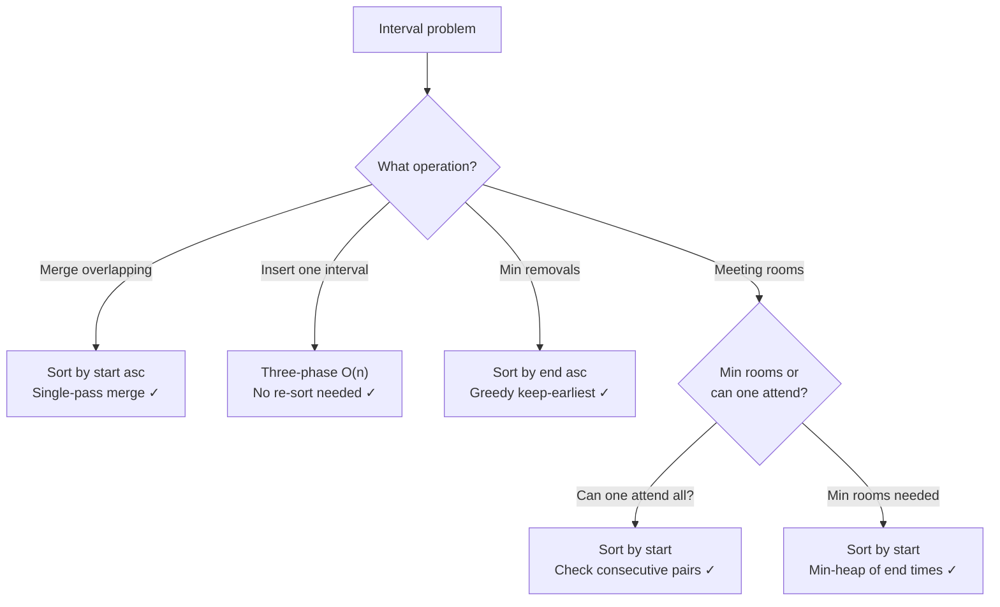

# Intervals

> Merge, insert, and query overlapping ranges efficiently

---

## Learning Objectives

By the end of this topic you will be able to:

- Explain why sorting by start time enables a single-pass merge of overlapping intervals
- Implement merge intervals in O(n log n) and state why `Math.max` is required on the end boundary
- Insert a new interval into a sorted list and handle the three phases: before, overlapping, and after
- Find the intersection of two sorted interval lists using two pointers in O(m + n)
- Solve Meeting Rooms I (can all fit?) and Meeting Rooms II (minimum rooms needed) and state how each differs
- Choose the correct sort key for each interval problem: start ascending for merge/insert, end ascending for greedy removal

---

## ELI5: Explain Like I'm 5

<div class="learner-section" markdown>

**Your task:** After implementing all patterns, explain them simply.

**Prompts to guide you:**

1. **What is the key insight that makes interval problems tractable?**
    - Your answer: <span class="fill-in">[After sorting by ___, overlapping intervals are always ___ in the list, so you only need to compare each interval with ___ instead of all others]</span>

2. **Merge intervals in one sentence:**
    - Your answer: <span class="fill-in">[Sort by start, then walk the list and extend the current interval's end whenever the next interval's start is ___ the current end]</span>

3. **Real-world analogy:**
    - Example: "Intervals are like calendar appointments — merging them is like combining any back-to-back or overlapping meetings into one block."
    - Your analogy: <span class="fill-in">[Fill in]</span>

4. **When does this pattern work?**
    - Your answer: <span class="fill-in">[Fill in after solving problems]</span>

5. **What's the hardest edge case?**
    - Your answer: <span class="fill-in">[Fill in — think about fully-contained intervals like [2,3] inside [1,4]]</span>

</div>

---

## Quick Quiz (Do BEFORE implementing)

!!! tip "How to use this section"
    Write your best guess in each fill-in span **before** reading any implementation code. After you finish coding and running the tests, come back and fill in the "Verified" answers.

<div class="learner-section" markdown>

**Your task:** Test your intuition without looking at code. Answer these, then verify after implementation.

### Complexity Predictions

1. **Brute-force merge (compare all pairs repeatedly):**
    - Time complexity: <span class="fill-in">[Your guess: O(?)]</span>
    - Why that complexity? <span class="fill-in">[Fill in your reasoning]</span>

2. **Sort-and-merge:**
    - Time complexity: <span class="fill-in">[Your guess: O(?)]</span>
    - What dominates the complexity? <span class="fill-in">[Sort? The merge pass?]</span>
    - Verified: <span class="fill-in">[Actual]</span>

3. **Meeting Rooms II (minimum rooms):**
    - Time complexity: <span class="fill-in">[Your guess: O(?)]</span>
    - What data structure helps? <span class="fill-in">[Fill in]</span>

### Scenario Predictions

**Scenario 1:** Merge `[[1,3], [2,6], [8,10], [15,18]]`

- **Must you sort first?** <span class="fill-in">[Yes/No — Why?]</span>
- **How do you detect overlap between two sorted intervals?** <span class="fill-in">[Fill in the condition using start/end values]</span>
- **Expected result:** <span class="fill-in">[Your prediction: ___]</span>

**Scenario 2:** Intervals `[[1,4], [2,3]]` — the second is fully inside the first.

- **After merging, what is the result?** <span class="fill-in">[Your prediction]</span>
- **Which line of code handles this correctly?** <span class="fill-in">[The plain assignment or Math.max?]</span>

**Scenario 3:** Meetings `[[0,30], [5,10], [15,20]]`. How many rooms are needed?

- **Your prediction:** <span class="fill-in">[1 room / 2 rooms / 3 rooms]</span>
- **Key question:** <span class="fill-in">[At what point do two meetings overlap simultaneously?]</span>

### Trade-off Quiz

**Question:** For Meeting Rooms II, is it better to sort starts and ends separately, or use a min-heap?

- Your prediction: <span class="fill-in">[Fill in]</span>
- Verified: <span class="fill-in">[Fill in after implementation]</span>

**Question:** For non-overlapping intervals (minimum removals), which sort key gives the greedy optimum?

- [ ] Sort by start ascending
- [ ] Sort by end ascending
- [ ] Sort by length ascending

Verify after implementation: <span class="fill-in">[Which one, and why?]</span>

</div>

---

## Core Implementation

### Pattern 1: Merge Intervals

**Concept:** Sort by start time, then walk the list merging any overlapping interval into the current one.

**Use case:** Combine overlapping calendar events, merge DNS lookup ranges.

```java
import java.util.*;

public class Intervals {

    /**
     * Problem: Merge overlapping intervals
     * Time: O(n log n), Space: O(n)
     *
     * TODO: Implement merge intervals
     * Step 1: Sort by start time
     * Step 2: Walk the list; if next.start <= current.end, merge
     *         using current.end = Math.max(current.end, next.end)
     * Step 3: Otherwise, push current to result and move on
     * Step 4: Don't forget to add the final current to result
     */
    public static int[][] merge(int[][] intervals) {
        // TODO: Sort by start time
        // TODO: Iterate and merge overlapping intervals

        return new int[0][0]; // Replace with implementation
    }
}
```

**Runnable Client Code:**

```java
import java.util.*;

public class MergeClient {

    public static void main(String[] args) {
        System.out.println("=== Merge Intervals ===\n");

        int[][][] tests = {
            {{1,3}, {2,6}, {8,10}, {15,18}},
            {{1,4}, {4,5}},
            {{1,4}, {2,3}},    // Fully contained
            {{1,4}, {0,4}},    // Starts before
        };

        for (int[][] test : tests) {
            System.out.println("Input:  " + Arrays.deepToString(test));
            int[][] result = Intervals.merge(test);
            System.out.println("Output: " + Arrays.deepToString(result));
            System.out.println();
        }
    }
}
```

!!! warning "Debugging Challenge — Missing Math.max and Missing Final Interval"
    This implementation has 2 bugs. Trace through `[[1,4], [2,3]]` (a fully-contained interval) and `[[1,3], [2,6]]` before checking the answer.

    ```java
    public static int[][] merge_Buggy(int[][] intervals) {
        Arrays.sort(intervals, (a, b) -> a[0] - b[0]);

        List<int[]> merged = new ArrayList<>();
        int[] current = intervals[0];

        for (int i = 1; i < intervals.length; i++) {
            if (intervals[i][0] <= current[1]) {
                current[1] = intervals[i][1];              // Bug 1
            } else {
                merged.add(current);
                current = intervals[i];
            }
        }
                                                           // Bug 2
        return merged.toArray(new int[0][]);
    }
    ```

    - Bug 1: <span class="fill-in">[What's wrong with the merge line? What input reveals it?]</span>
    - Bug 2: <span class="fill-in">[What is never added to the result?]</span>

    ??? success "Answer"
        **Bug 1:** `current[1] = intervals[i][1]` should be `current[1] = Math.max(current[1], intervals[i][1])`. Without `Math.max`, a fully-contained interval like `[2,3]` inside `[1,4]` shrinks the merged interval to `[1,3]` instead of keeping `[1,4]`.

        **Bug 2:** The final value of `current` is never added to `merged`. After the loop ends, the last merged group is still in `current` but never appended. Add `merged.add(current)` after the loop.

        **Correct ending:**
        ```java
        merged.add(current);  // Don't forget the last interval
        return merged.toArray(new int[0][]);
        ```

---

### Pattern 2: Insert Interval

**Concept:** Given a sorted, non-overlapping list, insert a new interval and merge any overlaps — without re-sorting.

**Use case:** Calendar event insertion, dynamic interval sets.

```java
import java.util.*;

public class InsertInterval {

    /**
     * Problem: Insert interval into sorted non-overlapping list
     * Time: O(n), Space: O(n)
     *
     * TODO: Implement three-phase scan
     * Phase 1: Add all intervals that END before newInterval starts
     *          (no overlap: intervals[i][1] < newInterval[0])
     * Phase 2: Merge all intervals that overlap with newInterval
     *          (overlap condition: intervals[i][0] <= newInterval[1])
     *          Expand newInterval: start = min(both starts), end = max(both ends)
     * Phase 3: Add all remaining intervals
     */
    public static int[][] insert(int[][] intervals, int[] newInterval) {
        List<int[]> result = new ArrayList<>();
        int i = 0, n = intervals.length;

        // TODO: Phase 1 — add all intervals ending before newInterval starts

        // TODO: Phase 2 — merge all overlapping intervals into newInterval

        // TODO: Add merged newInterval

        // TODO: Phase 3 — add all remaining intervals

        return result.toArray(new int[0][]);
    }
}
```

**Runnable Client Code:**

```java
import java.util.*;

public class InsertIntervalClient {

    public static void main(String[] args) {
        System.out.println("=== Insert Interval ===\n");

        Object[][] tests = {
            new Object[]{new int[][]{{1,3},{6,9}}, new int[]{2,5}},
            new Object[]{new int[][]{{1,2},{3,5},{6,7},{8,10},{12,16}}, new int[]{4,8}},
            new Object[]{new int[][]{}, new int[]{5,7}},
            new Object[]{new int[][]{{1,5}}, new int[]{2,3}},    // New inside existing
        };

        for (Object[] test : tests) {
            int[][] intervals = (int[][]) test[0];
            int[] newInterval = (int[]) test[1];
            System.out.println("Intervals:   " + Arrays.deepToString(intervals));
            System.out.println("New:         " + Arrays.toString(newInterval));
            int[][] result = InsertInterval.insert(intervals, newInterval);
            System.out.println("Result:      " + Arrays.deepToString(result));
            System.out.println();
        }
    }
}
```

---

### Pattern 3: Interval Intersection

**Concept:** Find all overlapping pairs between two sorted interval lists using two pointers.

**Use case:** Calendar availability overlap, API rate limit intersection.

```java
import java.util.*;

public class IntervalIntersection {

    /**
     * Problem: Interval list intersection
     * Time: O(m + n), Space: O(min(m,n))
     *
     * TODO: Implement two-pointer intersection
     * An intersection exists when max(start1,start2) <= min(end1,end2)
     * Advance the pointer whose interval ends first
     */
    public static int[][] intervalIntersection(int[][] firstList, int[][] secondList) {
        List<int[]> result = new ArrayList<>();
        int i = 0, j = 0;

        // TODO: Advance both pointers, check for intersection each step
        // TODO: Move pointer of interval that ends first

        return result.toArray(new int[0][]);
    }
}
```

**Runnable Client Code:**

```java
import java.util.*;

public class IntersectionClient {

    public static void main(String[] args) {
        System.out.println("=== Interval Intersection ===\n");

        int[][][] firstLists = {
            {{0,2},{5,10},{13,23},{24,25}},
            {{1,3},{5,9}},
        };
        int[][][] secondLists = {
            {{1,5},{8,12},{15,24},{25,26}},
            {},
        };

        for (int t = 0; t < firstLists.length; t++) {
            System.out.println("First:  " + Arrays.deepToString(firstLists[t]));
            System.out.println("Second: " + Arrays.deepToString(secondLists[t]));
            int[][] result = IntervalIntersection.intervalIntersection(firstLists[t], secondLists[t]);
            System.out.println("Result: " + Arrays.deepToString(result));
            System.out.println();
        }
    }
}
```

---

### Pattern 4: Meeting Rooms

**Concept:** Determine whether meetings conflict, or find the minimum number of rooms needed.

**Use case:** Conference room scheduling, resource allocation.

```java
import java.util.*;

public class MeetingRooms {

    /**
     * Problem: Meeting Rooms I — can one person attend all?
     * Time: O(n log n), Space: O(1)
     *
     * TODO: Sort by start time, check if any consecutive pair overlaps
     * Overlap condition: intervals[i][0] < intervals[i-1][1]
     */
    public static boolean canAttendMeetings(int[][] intervals) {
        // TODO: Sort and check consecutive pairs

        return true; // Replace with implementation
    }

    /**
     * Problem: Meeting Rooms II — minimum rooms needed
     * Time: O(n log n), Space: O(n)
     *
     * TODO: Method 1 (min-heap): sort by start time; use heap of end times
     * If heap.peek() <= current start, reuse that room (poll + offer)
     * Otherwise add a new room (just offer)
     * Answer: heap.size() at the end
     *
     * TODO: Method 2 (two sorted arrays): sort starts and ends separately
     * Two pointers: if starts[i] < ends[j], need a new room; else free one
     */
    public static int minMeetingRooms(int[][] intervals) {
        // TODO: Implement either method

        return 0; // Replace with implementation
    }
}
```

**Runnable Client Code:**

```java
import java.util.*;

public class MeetingRoomsClient {

    public static void main(String[] args) {
        System.out.println("=== Meeting Rooms ===\n");

        int[][][] tests = {
            {{0,30},{5,10},{15,20}},
            {{7,10},{2,4}},
            {{9,10},{4,9},{4,17}},
        };

        for (int[][] meetings : tests) {
            boolean canAttend = MeetingRooms.canAttendMeetings(meetings);
            int minRooms = MeetingRooms.minMeetingRooms(meetings);
            System.out.printf("Meetings: %s%n", Arrays.deepToString(meetings));
            System.out.printf("One person can attend all: %b%n", canAttend);
            System.out.printf("Minimum rooms needed: %d%n%n", minRooms);
        }
    }
}
```

!!! warning "Debugging Challenge — Wrong Overlap Condition in Meeting Rooms I"
    The code below uses `<=` instead of `<` in the overlap check. It incorrectly rejects back-to-back (non-overlapping) meetings.

    ```java
    public static boolean canAttendMeetings_Buggy(int[][] intervals) {
        Arrays.sort(intervals, (a, b) -> a[0] - b[0]);

        for (int i = 1; i < intervals.length; i++) {
            if (intervals[i][0] <= intervals[i-1][1]) {  // Bug: <= should be <
                return false;
            }
        }
        return true;
    }
    ```

    - Bug: <span class="fill-in">[Why does `<=` reject a valid schedule? Give a test case.]</span>

    ??? success "Answer"
        **Bug:** Two meetings `[0,5]` and `[5,10]` are back-to-back (not overlapping). The first ends exactly when the second begins. The condition `intervals[i][0] <= intervals[i-1][1]` evaluates `5 <= 5 = true` and incorrectly returns `false`.

        The correct condition is `intervals[i][0] < intervals[i-1][1]` (strict less-than). A meeting starting at the exact end time of the previous one does not overlap.

---

!!! info "Loop back"
    Before moving on, return to the ELI5 section and Quick Quiz at the top. Fill in any answers you left blank. Pay particular attention to the `Math.max` requirement and the final-interval bug in merge — those two points catch most interval merge mistakes.

---

## Before/After: Why This Pattern Matters

**Your task:** Compare naive vs optimized approaches to understand the impact.

### Example: Merge Intervals

**Problem:** Merge all overlapping intervals in `[[1,3], [2,6], [8,10], [15,18]]`.

#### Approach 1: Nested Loops (Naive)

```java
// Naive: compare all pairs, repeat until stable
public static int[][] merge_BruteForce(int[][] intervals) {
    List<int[]> list = new ArrayList<>(Arrays.asList(intervals));
    boolean changed = true;

    while (changed) {
        changed = false;
        for (int i = 0; i < list.size(); i++) {
            for (int j = i + 1; j < list.size(); j++) {
                int[] a = list.get(i), b = list.get(j);
                // Check overlap
                if (a[0] <= b[1] && b[0] <= a[1]) {
                    list.set(i, new int[]{Math.min(a[0],b[0]), Math.max(a[1],b[1])});
                    list.remove(j);
                    changed = true;
                    break;
                }
            }
            if (changed) break;
        }
    }

    return list.toArray(new int[0][]);
}
```

**Analysis:**

- Time: O(n²) per pass, multiple passes needed — overall O(n³) worst case
- Space: O(n)
- For n = 1,000: potentially millions of comparisons

#### Approach 2: Sort + Single Pass (Optimized)

```java
// Optimized: sort once, merge in one linear pass
public static int[][] merge_Optimized(int[][] intervals) {
    Arrays.sort(intervals, (a, b) -> a[0] - b[0]);

    List<int[]> result = new ArrayList<>();
    int[] current = intervals[0];

    for (int i = 1; i < intervals.length; i++) {
        if (intervals[i][0] <= current[1]) {
            current[1] = Math.max(current[1], intervals[i][1]);
        } else {
            result.add(current);
            current = intervals[i];
        }
    }

    result.add(current);
    return result.toArray(new int[0][]);
}
```

**Analysis:**

- Time: O(n log n) — sorting dominates; the merge pass is O(n)
- Space: O(n) — result list
- For n = 1,000: ~10,000 operations (sort) + 1,000 (merge pass)

#### Performance Comparison

| Input Size | Brute Force       | Sort + Merge     | Speedup |
|------------|-------------------|------------------|---------|
| n = 100    | ~100,000 ops      | ~700 ops         | ~143x   |
| n = 1,000  | ~10,000,000 ops   | ~10,000 ops      | ~1,000x |
| n = 10,000 | ~1,000,000,000 ops | ~130,000 ops    | ~7,700x |

#### Why Does Sorting Help?

After sorting by start time, overlapping intervals are always adjacent. You only need to compare each interval with its immediate predecessor:

```
Unsorted: [[8,10], [1,3], [15,18], [2,6]]
Sorted:   [[1,3], [2,6], [8,10], [15,18]]

[1,3] + [2,6]: 2 <= 3 → merge to [1,6]
[1,6] + [8,10]: 8 > 6 → no overlap, save [1,6]
[8,10] + [15,18]: 15 > 10 → no overlap, save [8,10]
Final: [[1,6], [8,10], [15,18]]
```

!!! note "The sort key insight"
    Sorting by start time guarantees that if interval B could overlap interval A (i.e., B.start <= A.end), then B appears immediately after A in the sorted list. You never need to look backwards. This is the property that makes a single linear pass sufficient.

<div class="learner-section" markdown>

- Why is the sort key `start` and not `end`? <span class="fill-in">[Your answer]</span>
- Why does Meeting Rooms II sort by `end` instead? <span class="fill-in">[Your answer — think about what "reuse a room" means]</span>
- What is the overlap condition between two sorted intervals A and B? <span class="fill-in">[B.start <= A.end]</span>

</div>

---

## Common Misconceptions

!!! warning "Misconception: intervals must always be sorted by start time"
    Sorting by start time is correct for merge and insert problems. For **non-overlapping intervals** (minimum removals), sort by **end time** — the greedy argument is to always keep the interval that ends earliest, maximising room for future intervals. For **remove covered intervals**, sort ascending by start then descending by end (so a wide interval with the same start comes before a narrow one). Applying the wrong sort produces subtly wrong answers that pass most test cases.

!!! warning "Misconception: back-to-back intervals [1,5] and [5,10] overlap"
    They are adjacent, not overlapping. The overlap condition is `B.start < A.end` (strict), not `<=`. Two meetings where one ends exactly when the other begins do not conflict — the room is free the instant the first meeting ends. This is the source of the off-by-one bug in Meeting Rooms I.

!!! warning "Misconception: the insert interval problem requires re-sorting"
    The input is guaranteed to be sorted and non-overlapping. You exploit that structure directly with a three-phase O(n) scan — no sort needed. Re-sorting after insertion wastes the O(n log n) budget unnecessarily.

---

## Decision Framework

<div class="learner-section" markdown>

**Your task:** Build decision trees for interval problems.

### Question 1: What operation is needed?

Answer after solving problems:

**Merge/combine overlapping intervals:**

- Sort by: <span class="fill-in">[Start ascending]</span>
- Algorithm: <span class="fill-in">[Single pass, extend current.end with Math.max]</span>
- Example: <span class="fill-in">[Merge Intervals LC 56]</span>

**Insert one interval into a sorted list:**

- Sort by: <span class="fill-in">[Already sorted — three-phase linear scan]</span>
- Algorithm: <span class="fill-in">[Add before, merge overlapping, add after]</span>
- Example: <span class="fill-in">[Insert Interval LC 57]</span>

**Minimum removals to make non-overlapping:**

- Sort by: <span class="fill-in">[End ascending — greedy]</span>
- Algorithm: <span class="fill-in">[Keep intervals that end earliest]</span>
- Example: <span class="fill-in">[Non-overlapping Intervals LC 435]</span>

**Minimum rooms for concurrent meetings:**

- Sort by: <span class="fill-in">[Start ascending]</span>
- Data structure: <span class="fill-in">[Min-heap of end times, or two sorted arrays]</span>
- Example: <span class="fill-in">[Meeting Rooms II]</span>

### Question 2: What is the overlap condition?

Fill in after implementing:

- Two intervals [s1,e1] and [s2,e2] overlap when: <span class="fill-in">[s2 < e1 (assuming sorted, s1 <= s2)]</span>
- Back-to-back [1,5] and [5,10]: <span class="fill-in">[Do NOT overlap — 5 < 5 is false]</span>
- Fully contained [2,3] inside [1,4]: <span class="fill-in">[Overlap — merge to [1,4], requires Math.max on end]</span>

### Your Decision Tree

Build this after solving practice problems:



</div>

---

## Practice

<div class="learner-section" markdown>

### LeetCode Problems

**Easy (Complete all 2):**

- [ ] [252. Meeting Rooms](https://leetcode.com/problems/meeting-rooms/)
    - Pattern: <span class="fill-in">[Sort by start, check consecutive overlap]</span>
    - Your solution time: <span class="fill-in">___</span>
    - Key insight: <span class="fill-in">[Fill in after solving]</span>

- [ ] [228. Summary Ranges](https://leetcode.com/problems/summary-ranges/)
    - Pattern: <span class="fill-in">[Linear scan, extend range while consecutive]</span>
    - Your solution time: <span class="fill-in">___</span>
    - Key insight: <span class="fill-in">[Fill in]</span>

**Medium (Complete 3-4):**

- [ ] [56. Merge Intervals](https://leetcode.com/problems/merge-intervals/)
    - Pattern: <span class="fill-in">[Sort by start, single-pass merge]</span>
    - Difficulty: <span class="fill-in">[Rate 1-10]</span>
    - Key insight: <span class="fill-in">[Fill in]</span>
    - Mistake made: <span class="fill-in">[Fill in if any]</span>

- [ ] [57. Insert Interval](https://leetcode.com/problems/insert-interval/)
    - Pattern: <span class="fill-in">[Three-phase linear scan]</span>
    - Difficulty: <span class="fill-in">[Rate 1-10]</span>
    - Key insight: <span class="fill-in">[Fill in]</span>

- [ ] [435. Non-overlapping Intervals](https://leetcode.com/problems/non-overlapping-intervals/)
    - Pattern: <span class="fill-in">[Sort by end, greedy]</span>
    - Difficulty: <span class="fill-in">[Rate 1-10]</span>
    - Key insight: <span class="fill-in">[Fill in]</span>

- [ ] [253. Meeting Rooms II](https://leetcode.com/problems/meeting-rooms-ii/)
    - Pattern: <span class="fill-in">[Sort by start, min-heap of end times]</span>
    - Difficulty: <span class="fill-in">[Rate 1-10]</span>
    - Key insight: <span class="fill-in">[Fill in]</span>

**Hard (Optional):**

- [ ] [352. Data Stream as Disjoint Intervals](https://leetcode.com/problems/data-stream-as-disjoint-intervals/)
    - Pattern: <span class="fill-in">[Dynamic interval merge with TreeMap]</span>
    - Key insight: <span class="fill-in">[Fill in after solving]</span>

- [ ] [759. Employee Free Time](https://leetcode.com/problems/employee-free-time/)
    - Pattern: <span class="fill-in">[Merge all intervals, find gaps]</span>
    - Key insight: <span class="fill-in">[Fill in after solving]</span>

**Failure modes:**

- What happens if two intervals share only a single endpoint, like `[1,5]` and `[5,8]` — does your merge implementation treat them as overlapping and merge them into `[1,8]`, or correctly keep them separate? <span class="fill-in">[Fill in]</span>
- How does your merge implementation behave when the input array is not sorted by start time — does it silently produce a wrong result or does it handle unsorted input? <span class="fill-in">[Fill in]</span>

</div>

---

## Test Your Understanding

Answer these questions without looking at your notes. Write a sentence or two for each.

1. **Trace through merging `[[3,5],[1,4],[6,8]]`. Show the state of the result list after sorting and after each iteration of the merge pass. What is the final output?**

    ??? success "Rubric"
        A complete answer addresses: (1) after sorting by start: [[1,4],[3,5],[6,8]]; (2) iteration 1: current=[1,4]; process [3,5]: 3 <= 4, overlap → current[1] = max(4,5) = 5, current=[1,5]; (3) iteration 2: process [6,8]: 6 > 5, no overlap → add [1,5] to result, current=[6,8]; (4) after loop: add current=[6,8] to result; (5) final output: [[1,5],[6,8]]; (6) the key step to note — the Math.max ensures [3,5] extends current to [1,5] instead of incorrectly shrinking it to [1,4] or [3,5].

2. **Explain why the merge line must use `Math.max(current[1], next[1])` rather than a plain assignment `current[1] = next[1]`. Give a concrete interval pair where the plain assignment produces the wrong answer.**

    ??? success "Rubric"
        A complete answer addresses: (1) the reason — when a new interval is fully contained within the current one (e.g., current=[1,10], next=[3,5]), next[1]=5 < current[1]=10; a plain assignment shrinks the current interval incorrectly from [1,10] to [1,5], losing coverage of [6,10]; (2) the concrete example — intervals=[1,10],[3,5]; sorted (already): current=[1,10]; process [3,5]: 3 <= 10, overlap → plain assignment gives [1,5] (WRONG); Math.max gives [1,10] (correct); (3) the general rule — Math.max is required because intervals can be partially or fully overlapping in either direction, and you always want to keep the furthest-right endpoint.

3. **In Meeting Rooms II, you sort meetings by start time and maintain a min-heap of end times. Walk through `[[0,30],[5,10],[15,20]]` step by step, showing heap state after each meeting. Why is the answer `heap.size()` at the end?**

    ??? success "Rubric"
        A complete answer addresses: (1) after sorting: [[0,30],[5,10],[15,20]]; (2) process [0,30]: heap empty, add 30; heap=[30]; rooms=1; (3) process [5,10]: heap.peek()=30 > 5 (start), cannot reuse; add 10; heap=[10,30]; rooms=2; (4) process [15,20]: heap.peek()=10 <= 15 (start), reuse that room; poll 10, offer 20; heap=[20,30]; rooms stays 2; (5) why heap.size() — each entry in the heap represents one room currently in use; rooms whose meeting has ended and been reused are replaced but not removed; the size is the high-water mark of concurrently occupied rooms, which equals the minimum rooms needed.

4. **The non-overlapping intervals problem asks for the minimum number of intervals to remove so the rest are non-overlapping. Why does sorting by end time and greedily keeping the interval with the earliest end time give the optimal answer? What goes wrong if you sort by start time instead?**

    ??? success "Rubric"
        A complete answer addresses: (1) the greedy argument — by keeping the interval that ends earliest, we leave the maximum possible space for future intervals; any other choice (keeping a later-ending interval) can only make future conflicts more likely; formally, an exchange argument shows that swapping a later-ending interval for an earlier-ending one at the same position never produces a worse solution; (2) what fails with start-time sort — consider [[1,100],[2,3],[3,4]]; sorted by start: keep [1,100] first (early start), then both [2,3] and [3,4] conflict with it; you'd remove 2; sorted by end: keep [2,3] first (early end), then [3,4] doesn't conflict, then [1,100] conflicts with both; keep [2,3] and [3,4], remove only [1,100]; total 1 removal — better; (3) the minimum removals equals n minus the maximum number of non-overlapping intervals you can keep.

5. **You are given two sorted interval lists and want their intersection. Explain the two-pointer approach: what is the intersection condition, and which pointer do you advance at each step and why?**

    ??? success "Rubric"
        A complete answer addresses: (1) the intersection condition — two intervals [s1,e1] and [s2,e2] intersect when max(s1,s2) <= min(e1,e2); if this holds, the intersection is [max(s1,s2), min(e1,e2)]; (2) the pointer advancement rule — advance the pointer whose interval ends first (i.e., if e1 < e2, advance i; else advance j); the reasoning is that the interval with the smaller end time cannot intersect any future interval in the other list (future intervals start no earlier than the current one), so it is safe to discard; (3) why two pointers work — both lists are sorted, so at each step we compare the "most promising" pair (the pair with the smallest end times); the pointer that would create no future intersections is discarded; total time is O(m+n).

---

## Connected Topics

!!! info "Where this topic connects"

    - **[01. Two Pointers](01-two-pointers.md)** — interval merge uses a pointer advancing through sorted intervals; meeting rooms II uses the two-pointer technique on start/end time arrays → [01. Two Pointers](01-two-pointers.md)
