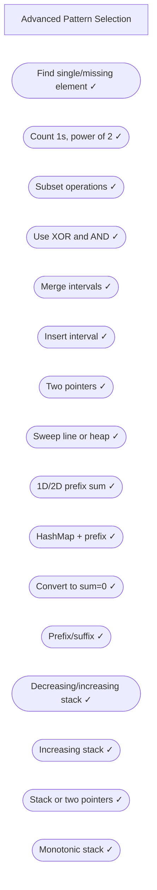

# 16. Advanced Topics

> Master bit manipulation, intervals, prefix sums, and monotonic stacks

---

## ELI5: Explain Like I'm 5

<div class="learner-section" markdown>

**Your task:** After implementing all patterns, explain them simply.

**Prompts to guide you:**

1. **What are these advanced techniques in one sentence each?**
    - Bit manipulation: <span class="fill-in">[Fill in after implementation]</span>
    - Intervals: <span class="fill-in">[Fill in after implementation]</span>
    - Prefix sum: <span class="fill-in">[Fill in after implementation]</span>
    - Monotonic stack: <span class="fill-in">[Fill in after implementation]</span>

2. **Real-world analogies:**
    - Bit manipulation: "Like using switches that are either on or off..."
    - Intervals: "Like managing calendar appointments..."
    - Prefix sum: "Like keeping a running total..."
    - Monotonic stack: "Like organizing plates by size..."
    - Your analogies: <span class="fill-in">[Fill in]</span>

3. **When does each pattern work?**
    - Your answers: <span class="fill-in">[Fill in after solving problems]</span>

</div>

---

## Quick Quiz (Do BEFORE implementing)

<div class="learner-section" markdown>

**Your task:** Test your intuition without looking at code. Answer these, then verify after implementation.

### Complexity Predictions

1. **XOR all elements to find single number:**
    - Time complexity: <span class="fill-in">[Your guess: O(?)]</span>
    - Space complexity: <span class="fill-in">[Your guess: O(?)]</span>
    - Verified after learning: <span class="fill-in">[Actual: O(?)]</span>

2. **Merge overlapping intervals:**
    - Time complexity: <span class="fill-in">[Your guess: O(?)]</span>
    - Why that complexity? <span class="fill-in">[Fill in your reasoning]</span>
    - Verified: <span class="fill-in">[Actual]</span>

3. **Monotonic stack for next greater element:**
    - Time complexity: <span class="fill-in">[Your guess: O(?)]</span>
    - How many times can each element be pushed/popped? <span class="fill-in">[Fill in]</span>
    - Verified: <span class="fill-in">[Actual]</span>

### Scenario Predictions

**Scenario 1:** Find single number in `[2, 3, 2, 4, 3]`

- **Can you use XOR?** <span class="fill-in">[Yes/No - Why?]</span>
- **What property of XOR makes this work?** <span class="fill-in">[Fill in]</span>
- **What is 2 XOR 2?** <span class="fill-in">[Fill in]</span>
- **What is any number XOR 0?** <span class="fill-in">[Fill in]</span>

**Scenario 2:** Merge intervals `[[1,3], [2,6], [8,10], [15,18]]`

- **Must you sort first?** <span class="fill-in">[Yes/No - Why?]</span>
- **How do you check if intervals overlap?** <span class="fill-in">[Fill in the condition]</span>
- **How many intervals in final result?
  ** <span class="fill-in">[Your prediction: <span class="fill-in">___</span>]</span>

**Scenario 3:** Next greater element for `[2, 1, 2, 4, 3]`

- **Which type of stack?** <span class="fill-in">[Increasing/Decreasing]</span>
- **Why that direction?** <span class="fill-in">[Fill in your reasoning]</span>
- **When do you pop from stack?** <span class="fill-in">[Fill in]</span>

### Bit Manipulation Quiz

**Question:** What does `n & (n-1)` do?

- Your answer: <span class="fill-in">[Fill in before implementation]</span>
- Verified answer: <span class="fill-in">[Fill in after learning]</span>

**Question:** How to check if a number is a power of 2?

- [ ] `n % 2 == 0`
- [ ] `n > 0 && (n & (n-1)) == 0`
- [ ] `n == (n | (n-1))`
- [ ] `Math.log(n) % 2 == 0`

Verify after implementation: <span class="fill-in">[Which one(s)?]</span>

### Intervals Quiz

**Question:** For intervals `[1,4]` and `[3,6]`, do they overlap?

- Your answer: <span class="fill-in">[Yes/No]</span>
- The condition is: `start1 <= <span class="fill-in">_____</span> && start2 <= <span class="fill-in">_____</span>`
- Fill in the blanks: <span class="fill-in">[Fill in after learning]</span>

**Question:** What's faster: using a heap vs two sorted arrays for finding meeting rooms?

- Your prediction: <span class="fill-in">[Fill in]</span>
- Verified: <span class="fill-in">[Fill in after implementation]</span>

</div>

---

## Before/After: Why These Patterns Matter

**Your task:** Compare naive vs optimized approaches to understand the impact.

### Example 1: Find Single Number

**Problem:** Find the single number when all others appear twice.

#### Approach 1: Hash Set (Naive)

```java
// Naive approach - Track seen numbers
public static int findSingle_HashSet(int[] nums) {
    Set<Integer> seen = new HashSet<>();

    for (int num : nums) {
        if (seen.contains(num)) {
            seen.remove(num);  // Seen twice, remove
        } else {
            seen.add(num);     // First time seeing
        }
    }

    // The remaining element is the single one
    return seen.iterator().next();
}
```

**Analysis:**

- Time: O(n) - Iterate through array once
- Space: O(n) - Store up to n/2 elements in set
- For n = 10,000: ~10,000 operations + space for 5,000 integers

#### Approach 2: XOR Bit Manipulation (Optimized)

```java
// Optimized approach - Use XOR property
public static int findSingle_XOR(int[] nums) {
    int result = 0;

    for (int num : nums) {
        result ^= num;  // XOR all numbers
    }

    return result;  // Pairs cancel out, single remains
}
```

**Analysis:**

- Time: O(n) - Iterate through array once
- Space: O(1) - Only one variable
- For n = 10,000: ~10,000 operations + space for 1 integer

#### Performance Comparison

| Array Size    | HashSet Space     | XOR Space | Space Saved |
|---------------|-------------------|-----------|-------------|
| n = 1,000     | ~500 integers     | 1 integer | 99.8%       |
| n = 10,000    | ~5,000 integers   | 1 integer | 99.98%      |
| n = 1,000,000 | ~500,000 integers | 1 integer | 99.9998%    |

**Why Does XOR Work?**

**Key properties:**

- `a XOR a = 0` (any number XOR itself is 0)
- `a XOR 0 = a` (any number XOR 0 is itself)
- XOR is commutative and associative

Example with `[2, 3, 2, 4, 3]`:

```
2 XOR 3 XOR 2 XOR 4 XOR 3
= (2 XOR 2) XOR (3 XOR 3) XOR 4  // Rearrange
= 0 XOR 0 XOR 4                   // Pairs cancel
= 4                                // Answer!
```

**After implementing, explain in your own words:**

<div class="learner-section" markdown>

- Why does XOR cancel out duplicates? <span class="fill-in">[Your answer]</span>
- When would HashSet be better than XOR? <span class="fill-in">[Your answer]</span>

</div>

---

### Example 2: Merge Intervals

**Problem:** Merge all overlapping intervals in `[[1,3], [2,6], [8,10], [15,18]]`.

#### Approach 1: Nested Loops (Naive)

```java
// Naive approach - Compare all pairs repeatedly
public static int[][] merge_BruteForce(int[][] intervals) {
    if (intervals.length <= 1) return intervals;

    List<int[]> merged = new ArrayList<>();
    boolean[] used = new boolean[intervals.length];

    for (int i = 0; i < intervals.length; i++) {
        if (used[i]) continue;

        int[] current = intervals[i].clone();
        used[i] = true;

        // Keep merging until no more overlaps found
        boolean changed = true;
        while (changed) {
            changed = false;
            for (int j = 0; j < intervals.length; j++) {
                if (used[j]) continue;

                // Check overlap
                if (current[0] <= intervals[j][1] && intervals[j][0] <= current[1]) {
                    current[0] = Math.min(current[0], intervals[j][0]);
                    current[1] = Math.max(current[1], intervals[j][1]);
                    used[j] = true;
                    changed = true;
                }
            }
        }

        merged.add(current);
    }

    return merged.toArray(new int[0][]);
}
```

**Analysis:**

- Time: O(n²) or worse - Multiple passes needed
- Space: O(n) - Track used intervals
- For n = 1,000: Up to ~1,000,000 comparisons

#### Approach 2: Sort + Single Pass (Optimized)

```java
// Optimized approach - Sort once, merge in one pass
public static int[][] merge_Optimized(int[][] intervals) {
    if (intervals.length <= 1) return intervals;

    // Sort by start time
    Arrays.sort(intervals, (a, b) -> a[0] - b[0]);

    List<int[]> merged = new ArrayList<>();
    int[] current = intervals[0];
    merged.add(current);

    for (int i = 1; i < intervals.length; i++) {
        if (intervals[i][0] <= current[1]) {
            // Overlap - merge by extending end
            current[1] = Math.max(current[1], intervals[i][1]);
        } else {
            // No overlap - start new interval
            current = intervals[i];
            merged.add(current);
        }
    }

    return merged.toArray(new int[0][]);
}
```

**Analysis:**

- Time: O(n log n) - Sorting dominates
- Space: O(n) - Result array
- For n = 1,000: ~10,000 comparisons (sort) + 1,000 (merge)

#### Performance Comparison

| Array Size | Brute Force (O(n²)) | Sort + Merge (O(n log n)) | Speedup |
|------------|---------------------|---------------------------|---------|
| n = 100    | ~10,000 ops         | ~700 ops                  | 14x     |
| n = 1,000  | ~1,000,000 ops      | ~10,000 ops               | 100x    |
| n = 10,000 | ~100,000,000 ops    | ~130,000 ops              | 770x    |

**Why Does Sorting Help?**

After sorting by start time, intervals are in order:

```
Unsorted: [[8,10], [1,3], [15,18], [2,6]]
Sorted:   [[1,3], [2,6], [8,10], [15,18]]
```

Now you only need to check if `current interval end >= next interval start`:

- `[1,3]` and `[2,6]`: 3 >= 2 → Merge to `[1,6]`
- `[1,6]` and `[8,10]`: 6 < 8 → Keep separate
- `[8,10]` and `[15,18]`: 10 < 15 → Keep separate

**After implementing, explain in your own words:**

<div class="learner-section" markdown>

- Why can we merge in a single pass after sorting? <span class="fill-in">[Your answer]</span>
- What intervals do we never need to compare? <span class="fill-in">[Your answer]</span>

</div>

---

### Example 3: Next Greater Element

**Problem:** For each element, find the next greater element to its right.

#### Approach 1: Nested Loops (Naive)

```java
// Naive approach - For each element, search right
public static int[] nextGreater_BruteForce(int[] nums) {
    int n = nums.length;
    int[] result = new int[n];

    for (int i = 0; i < n; i++) {
        result[i] = -1;  // Default: no greater element

        // Search to the right
        for (int j = i + 1; j < n; j++) {
            if (nums[j] > nums[i]) {
                result[i] = nums[j];
                break;  // Found, stop searching
            }
        }
    }

    return result;
}
```

**Analysis:**

- Time: O(n²) - For each element, scan remaining elements
- Space: O(1) - Only output array
- For n = 10,000: Up to ~50,000,000 comparisons

#### Approach 2: Monotonic Stack (Optimized)

```java
// Optimized approach - Use decreasing stack
public static int[] nextGreater_Stack(int[] nums) {
    int n = nums.length;
    int[] result = new int[n];
    Arrays.fill(result, -1);  // Default: no greater element

    Stack<Integer> stack = new Stack<>();  // Store indices

    for (int i = 0; i < n; i++) {
        // Pop all elements smaller than current
        while (!stack.isEmpty() && nums[stack.peek()] < nums[i]) {
            int idx = stack.pop();
            result[idx] = nums[i];  // Found next greater!
        }

        stack.push(i);  // Add current index
    }

    return result;
}
```

**Analysis:**

- Time: O(n) - Each element pushed and popped at most once
- Space: O(n) - Stack storage
- For n = 10,000: ~20,000 operations (push + pop)

#### Performance Comparison

| Array Size | Brute Force (O(n²)) | Monotonic Stack (O(n)) | Speedup |
|------------|---------------------|------------------------|---------|
| n = 100    | ~5,000 ops          | ~200 ops               | 25x     |
| n = 1,000  | ~500,000 ops        | ~2,000 ops             | 250x    |
| n = 10,000 | ~50,000,000 ops     | ~20,000 ops            | 2,500x  |

**Why Does Monotonic Stack Work?**

For array `[2, 1, 2, 4, 3]`:

```
i=0, num=2: Stack=[] → Push 0 → Stack=[0]
i=1, num=1: Stack=[0], nums[0]=2 > 1 → Push 1 → Stack=[0,1]
i=2, num=2: Stack=[0,1], nums[1]=1 < 2 → Pop 1, result[1]=2
            Stack=[0], nums[0]=2 ≥ 2 → Push 2 → Stack=[0,2]
i=3, num=4: Stack=[0,2], nums[2]=2 < 4 → Pop 2, result[2]=4
            Stack=[0], nums[0]=2 < 4 → Pop 0, result[0]=4
            Stack=[] → Push 3 → Stack=[3]
i=4, num=3: Stack=[3], nums[3]=4 > 3 → Push 4 → Stack=[3,4]

Result: [4, 2, 4, -1, -1]
```

**Key insight:** Each element is pushed once and popped once → O(n) total!

**After implementing, explain in your own words:**

<div class="learner-section" markdown>

- Why do we maintain a decreasing stack? <span class="fill-in">[Your answer]</span>
- Why is each element processed only twice? <span class="fill-in">[Your answer]</span>

</div>

---

## Core Implementation

### Pattern 1: Bit Manipulation

**Concept:** Use bitwise operations for efficient computations.

**Use case:** XOR tricks, bit masks, counting bits, power of two.

```java
public class BitManipulation {

    /**
     * Problem: Single number (all appear twice except one)
     * Time: O(n), Space: O(1)
     *
     * TODO: Implement using XOR
     */
    public static int singleNumber(int[] nums) {
        // TODO: XOR all numbers
        // TODO: a XOR a = 0, a XOR 0 = a
        // TODO: Duplicates cancel out, single remains

        return 0; // Replace with implementation
    }

    /**
     * Problem: Number of 1 bits (Hamming weight)
     * Time: O(1), Space: O(1)
     *
     * TODO: Implement bit counting
     */
    public static int hammingWeight(int n) {
        // TODO: Count set bits
        // TODO: Method 1: Loop and check each bit
        // TODO: Method 2: n & (n-1) removes rightmost 1

        return 0; // Replace with implementation
    }

    /**
     * Problem: Reverse bits
     * Time: O(1), Space: O(1)
     *
     * TODO: Implement bit reversal
     */
    public static int reverseBits(int n) {
        // TODO: Process bit by bit
        // TODO: Extract bit: (n >> i) & 1
        // TODO: Place bit: result |= (bit << (31 - i))

        return 0; // Replace with implementation
    }

    /**
     * Problem: Missing number (0 to n with one missing)
     * Time: O(n), Space: O(1)
     *
     * TODO: Implement using XOR or math
     */
    public static int missingNumber(int[] nums) {
        // TODO: Method 1: XOR all indices and values
        // TODO: Method 2: Sum formula - sum(0..n) - sum(nums)

        return 0; // Replace with implementation
    }

    /**
     * Problem: Power of two
     * Time: O(1), Space: O(1)
     *
     * TODO: Implement power of two check
     */
    public static boolean isPowerOfTwo(int n) {
        // TODO: Power of 2 has exactly one bit set
        // TODO: Check: n > 0 && (n & (n-1)) == 0

        return false; // Replace with implementation
    }

    /**
     * Problem: Counting bits (0 to n)
     * Time: O(n), Space: O(n)
     *
     * TODO: Implement using DP with bit manipulation
     */
    public static int[] countBits(int n) {
        // TODO: dp[i] = dp[i >> 1] + (i & 1)
        // TODO: Bits in i = bits in i/2 + (1 if i is odd)

        return new int[0]; // Replace with implementation
    }

    /**
     * Problem: Sum of two integers without + operator
     * Time: O(1), Space: O(1)
     *
     * TODO: Implement using bit operations
     */
    public static int getSum(int a, int b) {
        // TODO: XOR for sum without carry
        // TODO: AND and shift for carry
        // TODO: Repeat until no carry

        return 0; // Replace with implementation
    }
}
```

**Runnable Client Code:**

```java
import java.util.*;

public class BitManipulationClient {

    public static void main(String[] args) {
        System.out.println("=== Bit Manipulation ===\n");

        // Test 1: Single number
        System.out.println("--- Test 1: Single Number ---");
        int[] arr1 = {4, 1, 2, 1, 2};
        System.out.println("Array: " + Arrays.toString(arr1));
        System.out.println("Single number: " + BitManipulation.singleNumber(arr1));

        // Test 2: Hamming weight
        System.out.println("\n--- Test 2: Hamming Weight ---");
        int[] numbers = {11, 128, 255};
        for (int n : numbers) {
            int weight = BitManipulation.hammingWeight(n);
            System.out.printf("%d (binary: %s): %d bits%n",
                n, Integer.toBinaryString(n), weight);
        }

        // Test 3: Reverse bits
        System.out.println("\n--- Test 3: Reverse Bits ---");
        int n = 43261596;
        System.out.printf("Original: %d (binary: %s)%n",
            n, Integer.toBinaryString(n));
        int reversed = BitManipulation.reverseBits(n);
        System.out.printf("Reversed: %d (binary: %s)%n",
            reversed, Integer.toBinaryString(reversed));

        // Test 4: Missing number
        System.out.println("\n--- Test 4: Missing Number ---");
        int[] arr2 = {3, 0, 1};
        System.out.println("Array: " + Arrays.toString(arr2));
        System.out.println("Missing: " + BitManipulation.missingNumber(arr2));

        // Test 5: Power of two
        System.out.println("\n--- Test 5: Power of Two ---");
        int[] testPowers = {1, 2, 3, 4, 16, 18};
        for (int num : testPowers) {
            boolean isPower = BitManipulation.isPowerOfTwo(num);
            System.out.printf("%d: %s%n", num, isPower ? "YES" : "NO");
        }

        // Test 6: Counting bits
        System.out.println("\n--- Test 6: Counting Bits ---");
        int num = 5;
        int[] bitCounts = BitManipulation.countBits(num);
        System.out.printf("Bit counts from 0 to %d: %s%n", num, Arrays.toString(bitCounts));

        // Test 7: Sum without + operator
        System.out.println("\n--- Test 7: Sum Without + ---");
        int a = 15, b = 27;
        int sum = BitManipulation.getSum(a, b);
        System.out.printf("%d + %d = %d%n", a, b, sum);
    }
}
```

---

### Pattern 2: Intervals

**Concept:** Merge, insert, or manipulate intervals efficiently.

**Use case:** Meeting rooms, merge intervals, interval intersection.

```java
import java.util.*;

public class Intervals {

    /**
     * Problem: Merge overlapping intervals
     * Time: O(n log n), Space: O(n)
     *
     * TODO: Implement merge intervals
     */
    public static int[][] merge(int[][] intervals) {
        // TODO: Sort by start time
        // TODO: Iterate and merge overlapping intervals
        // TODO: If current.start <= previous.end, merge
        // TODO: Otherwise, add previous to result

        return new int[0][0]; // Replace with implementation
    }

    /**
     * Problem: Insert interval into sorted intervals
     * Time: O(n), Space: O(n)
     *
     * TODO: Implement insert interval
     */
    public static int[][] insert(int[][] intervals, int[] newInterval) {
        // TODO: Add all intervals before newInterval
        // TODO: Merge all overlapping intervals
        // TODO: Add all intervals after newInterval

        return new int[0][0]; // Replace with implementation
    }

    /**
     * Problem: Interval intersection
     * Time: O(m + n), Space: O(min(m,n))
     *
     * TODO: Implement interval intersection
     */
    public static int[][] intervalIntersection(int[][] firstList, int[][] secondList) {
        // TODO: Two pointers on both lists
        // TODO: Find intersection: max(start1, start2) to min(end1, end2)
        // TODO: Move pointer of interval that ends first

        return new int[0][0]; // Replace with implementation
    }

    /**
     * Problem: Minimum number of meeting rooms
     * Time: O(n log n), Space: O(n)
     *
     * TODO: Implement meeting rooms II
     */
    public static int minMeetingRooms(int[][] intervals) {
        // TODO: Method 1: Sort start and end times separately
        // TODO: Method 2: Use min-heap for end times

        return 0; // Replace with implementation
    }

    /**
     * Problem: Remove covered intervals
     * Time: O(n log n), Space: O(1)
     *
     * TODO: Implement remove covered
     */
    public static int removeCoveredIntervals(int[][] intervals) {
        // TODO: Sort by start (ascending), then end (descending)
        // TODO: Track current max end
        // TODO: If current.end <= maxEnd, it's covered

        return 0; // Replace with implementation
    }

    /**
     * Problem: Non-overlapping intervals (min removals)
     * Time: O(n log n), Space: O(1)
     *
     * TODO: Implement min removals
     */
    public static int eraseOverlapIntervals(int[][] intervals) {
        // TODO: Sort by end time (greedy)
        // TODO: Keep track of last end time
        // TODO: If overlap, increment removal count

        return 0; // Replace with implementation
    }
}
```

**Runnable Client Code:**

```java
import java.util.*;

public class IntervalsClient {

    public static void main(String[] args) {
        System.out.println("=== Intervals ===\n");

        // Test 1: Merge intervals
        System.out.println("--- Test 1: Merge Intervals ---");
        int[][] intervals1 = {{1,3}, {2,6}, {8,10}, {15,18}};
        System.out.println("Input: " + Arrays.deepToString(intervals1));
        int[][] merged = Intervals.merge(intervals1);
        System.out.println("Merged: " + Arrays.deepToString(merged));

        // Test 2: Insert interval
        System.out.println("\n--- Test 2: Insert Interval ---");
        int[][] intervals2 = {{1,3}, {6,9}};
        int[] newInterval = {2, 5};
        System.out.println("Intervals: " + Arrays.deepToString(intervals2));
        System.out.println("New: " + Arrays.toString(newInterval));
        int[][] inserted = Intervals.insert(intervals2, newInterval);
        System.out.println("Result: " + Arrays.deepToString(inserted));

        // Test 3: Interval intersection
        System.out.println("\n--- Test 3: Interval Intersection ---");
        int[][] first = {{0,2}, {5,10}, {13,23}, {24,25}};
        int[][] second = {{1,5}, {8,12}, {15,24}, {25,26}};
        System.out.println("First: " + Arrays.deepToString(first));
        System.out.println("Second: " + Arrays.deepToString(second));
        int[][] intersection = Intervals.intervalIntersection(first, second);
        System.out.println("Intersection: " + Arrays.deepToString(intersection));

        // Test 4: Meeting rooms
        System.out.println("\n--- Test 4: Meeting Rooms ---");
        int[][] meetings = {{0,30}, {5,10}, {15,20}};
        System.out.println("Meetings: " + Arrays.deepToString(meetings));
        int rooms = Intervals.minMeetingRooms(meetings);
        System.out.println("Min rooms needed: " + rooms);

        // Test 5: Remove covered intervals
        System.out.println("\n--- Test 5: Remove Covered Intervals ---");
        int[][] intervals3 = {{1,4}, {3,6}, {2,8}};
        System.out.println("Intervals: " + Arrays.deepToString(intervals3));
        int remaining = Intervals.removeCoveredIntervals(intervals3);
        System.out.println("Remaining after removing covered: " + remaining);

        // Test 6: Erase overlap intervals
        System.out.println("\n--- Test 6: Erase Overlap Intervals ---");
        int[][] intervals4 = {{1,2}, {2,3}, {3,4}, {1,3}};
        System.out.println("Intervals: " + Arrays.deepToString(intervals4));
        int removals = Intervals.eraseOverlapIntervals(intervals4);
        System.out.println("Min removals to make non-overlapping: " + removals);
    }
}
```

---

### Pattern 3: Prefix Sum

**Concept:** Precompute cumulative sums for fast range queries.

**Use case:** Subarray sum, range sum query, contiguous array.

```java
import java.util.*;

public class PrefixSum {

    /**
     * Problem: Range sum query (immutable array)
     * Time: O(1) query after O(n) preprocessing, Space: O(n)
     *
     * TODO: Implement range sum query
     */
    static class NumArray {
        private int[] prefixSum;

        public NumArray(int[] nums) {
            // TODO: Build prefix sum array
            // TODO: prefixSum[i] = sum of nums[0..i-1]
        }

        public int sumRange(int left, int right) {
            // TODO: Return prefixSum[right+1] - prefixSum[left]
            return 0; // Replace with implementation
        }
    }

    /**
     * Problem: Subarray sum equals K
     * Time: O(n), Space: O(n)
     *
     * TODO: Implement using prefix sum + hashmap
     */
    public static int subarraySum(int[] nums, int k) {
        // TODO: Use HashMap<prefixSum, frequency>
        // TODO: For each prefix sum:
        //   Check if (currentSum - k) exists in map
        //   Add count to result
        //   Update map with currentSum

        return 0; // Replace with implementation
    }

    /**
     * Problem: Contiguous array (equal 0s and 1s)
     * Time: O(n), Space: O(n)
     *
     * TODO: Implement using prefix sum
     */
    public static int findMaxLength(int[] nums) {
        // TODO: Convert 0s to -1s
        // TODO: Problem becomes: longest subarray with sum 0
        // TODO: Use HashMap<prefixSum, firstIndex>
        // TODO: If same prefix sum seen before, found zero-sum subarray

        return 0; // Replace with implementation
    }

    /**
     * Problem: Product of array except self
     * Time: O(n), Space: O(1) excluding output
     *
     * TODO: Implement using prefix/suffix products
     */
    public static int[] productExceptSelf(int[] nums) {
        // TODO: First pass: compute prefix products
        // TODO: Second pass: compute suffix products and multiply

        return new int[0]; // Replace with implementation
    }

    /**
     * Problem: Range sum query 2D (matrix)
     * Time: O(1) query after O(m*n) preprocessing, Space: O(m*n)
     *
     * TODO: Implement 2D prefix sum
     */
    static class NumMatrix {
        private int[][] prefixSum;

        public NumMatrix(int[][] matrix) {
            // TODO: Build 2D prefix sum
            // TODO: prefixSum[i][j] = sum of submatrix (0,0) to (i-1,j-1)
            // TODO: Use inclusion-exclusion principle
        }

        public int sumRegion(int row1, int col1, int row2, int col2) {
            // TODO: Use inclusion-exclusion:
            //   sum = total - top - left + top-left
            return 0; // Replace with implementation
        }
    }
}
```

**Runnable Client Code:**

```java
import java.util.*;

public class PrefixSumClient {

    public static void main(String[] args) {
        System.out.println("=== Prefix Sum ===\n");

        // Test 1: Range sum query
        System.out.println("--- Test 1: Range Sum Query ---");
        int[] arr = {-2, 0, 3, -5, 2, -1};
        PrefixSum.NumArray numArray = new PrefixSum.NumArray(arr);
        System.out.println("Array: " + Arrays.toString(arr));

        int[][] queries = {{0, 2}, {2, 5}, {0, 5}};
        for (int[] query : queries) {
            int sum = numArray.sumRange(query[0], query[1]);
            System.out.printf("sumRange(%d, %d) = %d%n", query[0], query[1], sum);
        }

        // Test 2: Subarray sum equals K
        System.out.println("\n--- Test 2: Subarray Sum Equals K ---");
        int[] arr2 = {1, 1, 1};
        int k = 2;
        System.out.println("Array: " + Arrays.toString(arr2));
        System.out.println("k = " + k);
        int count = PrefixSum.subarraySum(arr2, k);
        System.out.println("Count of subarrays: " + count);

        // Test 3: Contiguous array
        System.out.println("\n--- Test 3: Contiguous Array ---");
        int[] arr3 = {0, 1, 0, 1, 1, 0};
        System.out.println("Array: " + Arrays.toString(arr3));
        int maxLen = PrefixSum.findMaxLength(arr3);
        System.out.println("Max length with equal 0s and 1s: " + maxLen);

        // Test 4: Product except self
        System.out.println("\n--- Test 4: Product Except Self ---");
        int[] arr4 = {1, 2, 3, 4};
        System.out.println("Array: " + Arrays.toString(arr4));
        int[] products = PrefixSum.productExceptSelf(arr4);
        System.out.println("Products: " + Arrays.toString(products));

        // Test 5: 2D range sum query
        System.out.println("\n--- Test 5: 2D Range Sum Query ---");
        int[][] matrix = {
            {3, 0, 1, 4, 2},
            {5, 6, 3, 2, 1},
            {1, 2, 0, 1, 5},
            {4, 1, 0, 1, 7},
            {1, 0, 3, 0, 5}
        };
        PrefixSum.NumMatrix numMatrix = new PrefixSum.NumMatrix(matrix);

        System.out.println("Matrix:");
        for (int[] row : matrix) {
            System.out.println("  " + Arrays.toString(row));
        }

        int sum = numMatrix.sumRegion(2, 1, 4, 3);
        System.out.printf("sumRegion(2, 1, 4, 3) = %d%n", sum);
    }
}
```

---

### Pattern 4: Monotonic Stack

**Concept:** Maintain stack in monotonic (increasing/decreasing) order.

**Use case:** Next greater element, largest rectangle, trap rain water.

```java
import java.util.*;

public class MonotonicStack {

    /**
     * Problem: Next greater element
     * Time: O(n), Space: O(n)
     *
     * TODO: Implement using monotonic decreasing stack
     */
    public static int[] nextGreaterElement(int[] nums) {
        int n = nums.length;
        int[] result = new int[n];
        // TODO: Stack stores indices
        // TODO: Maintain decreasing stack
        // TODO: When nums[i] > stack.top(), found next greater

        return result; // Replace with implementation
    }

    /**
     * Problem: Daily temperatures (days until warmer)
     * Time: O(n), Space: O(n)
     *
     * TODO: Implement using monotonic stack
     */
    public static int[] dailyTemperatures(int[] temperatures) {
        // TODO: Similar to next greater element
        // TODO: Store index difference instead of value

        return new int[0]; // Replace with implementation
    }

    /**
     * Problem: Largest rectangle in histogram
     * Time: O(n), Space: O(n)
     *
     * TODO: Implement using monotonic increasing stack
     */
    public static int largestRectangleArea(int[] heights) {
        // TODO: Stack stores indices
        // TODO: Maintain increasing stack
        // TODO: When heights[i] < stack.top(), compute area
        // TODO: Width = current_index - left_boundary - 1
        // TODO: Height = heights[stack.top()]

        return 0; // Replace with implementation
    }

    /**
     * Problem: Maximal rectangle in binary matrix
     * Time: O(m*n), Space: O(n)
     *
     * TODO: Implement using largest rectangle for each row
     */
    public static int maximalRectangle(char[][] matrix) {
        // TODO: Convert each row to histogram
        // TODO: Apply largest rectangle algorithm

        return 0; // Replace with implementation
    }

    /**
     * Problem: Trap rain water
     * Time: O(n), Space: O(1) with two pointers
     *
     * TODO: Implement using two pointers or monotonic stack
     */
    public static int trap(int[] height) {
        // TODO: Method 1: Two pointers
        //   Track leftMax and rightMax
        // TODO: Method 2: Monotonic stack
        //   Stack stores indices of decreasing heights

        return 0; // Replace with implementation
    }

    /**
     * Problem: Remove K digits to make smallest number
     * Time: O(n), Space: O(n)
     *
     * TODO: Implement using monotonic increasing stack
     */
    public static String removeKdigits(String num, int k) {
        // TODO: Maintain increasing stack of digits
        // TODO: Remove k larger digits
        // TODO: Handle leading zeros

        return ""; // Replace with implementation
    }
}
```

**Runnable Client Code:**

```java
import java.util.*;

public class MonotonicStackClient {

    public static void main(String[] args) {
        System.out.println("=== Monotonic Stack ===\n");

        // Test 1: Next greater element
        System.out.println("--- Test 1: Next Greater Element ---");
        int[] arr1 = {2, 1, 2, 4, 3};
        System.out.println("Array: " + Arrays.toString(arr1));
        int[] nextGreater = MonotonicStack.nextGreaterElement(arr1);
        System.out.println("Next greater: " + Arrays.toString(nextGreater));

        // Test 2: Daily temperatures
        System.out.println("\n--- Test 2: Daily Temperatures ---");
        int[] temps = {73, 74, 75, 71, 69, 72, 76, 73};
        System.out.println("Temperatures: " + Arrays.toString(temps));
        int[] days = MonotonicStack.dailyTemperatures(temps);
        System.out.println("Days to wait: " + Arrays.toString(days));

        // Test 3: Largest rectangle
        System.out.println("\n--- Test 3: Largest Rectangle in Histogram ---");
        int[] heights = {2, 1, 5, 6, 2, 3};
        System.out.println("Heights: " + Arrays.toString(heights));
        int maxArea = MonotonicStack.largestRectangleArea(heights);
        System.out.println("Largest rectangle area: " + maxArea);

        // Test 4: Maximal rectangle
        System.out.println("\n--- Test 4: Maximal Rectangle ---");
        char[][] matrix = {
            {'1','0','1','0','0'},
            {'1','0','1','1','1'},
            {'1','1','1','1','1'},
            {'1','0','0','1','0'}
        };
        System.out.println("Matrix:");
        for (char[] row : matrix) {
            System.out.println("  " + Arrays.toString(row));
        }
        int maxRect = MonotonicStack.maximalRectangle(matrix);
        System.out.println("Maximal rectangle: " + maxRect);

        // Test 5: Trap rain water
        System.out.println("\n--- Test 5: Trap Rain Water ---");
        int[] elevation = {0,1,0,2,1,0,1,3,2,1,2,1};
        System.out.println("Elevation: " + Arrays.toString(elevation));
        int water = MonotonicStack.trap(elevation);
        System.out.println("Water trapped: " + water);

        // Test 6: Remove K digits
        System.out.println("\n--- Test 6: Remove K Digits ---");
        String num = "1432219";
        int k = 3;
        System.out.println("Number: " + num);
        System.out.println("k = " + k);
        String smallest = MonotonicStack.removeKdigits(num, k);
        System.out.println("Smallest number: " + smallest);
    }
}
```

---

## Debugging Challenges

**Your task:** Find and fix bugs in broken implementations. This tests your understanding of advanced patterns.

### Challenge 1: Broken Hamming Weight

```java
/**
 * Count number of 1 bits in an integer.
 * This has 1 CRITICAL BUG.
 */
public static int hammingWeight_Buggy(int n) {
    int count = 0;

    while (n > 0) {
        if ((n & 1) == 1) {
            count++;
        }
        n = n >> 1;    }

    return count;
}
```

**Your debugging:**

- Bug: <span class="fill-in">[What\'s the bug?]</span>

**Test case to expose the bug:**

- Input: `n = -1` (all 32 bits are 1)
- Expected output: `32`
- Actual output with buggy code: <span class="fill-in">[Trace through - what happens?]</span>

<details markdown>
<summary>Click to verify your answers</summary>

**Bug:** Using `n > 0` stops too early for negative numbers. Signed right shift (`>>`) preserves the sign bit, so
negative numbers never become 0.

**Better fix:** Use unsigned right shift (`>>>`) or check all 32 bits explicitly:

```java
while (n != 0) {  // Check n != 0, not n > 0
    if ((n & 1) == 1) {
        count++;
    }
    n = n >>> 1;  // Unsigned shift
}
```

**Alternative:** Use `n & (n-1)` trick that works for any integer:

```java
while (n != 0) {
    count++;
    n = n & (n - 1);  // Remove rightmost 1 bit
}
```

</details>

---

### Challenge 2: Broken Interval Merge

```java
/**
 * Merge overlapping intervals.
 * This has 2 BUGS.
 */
public static int[][] merge_Buggy(int[][] intervals) {
    if (intervals.length <= 1) return intervals;

    // Sort by start time
    Arrays.sort(intervals, (a, b) -> a[0] - b[0]);

    List<int[]> merged = new ArrayList<>();
    int[] current = intervals[0];

    for (int i = 1; i < intervals.length; i++) {
        if (intervals[i][0] <= current[1]) {            current[1] = intervals[i][1];        } else {
            merged.add(current);
            current = intervals[i];
        }
    }

    return merged.toArray(new int[0][]);}
```

**Your debugging:**

- **Bug 1:** <span class="fill-in">[Overlap check is correct, but what about the merge?]</span>
- **Bug 2:** <span class="fill-in">[Should use Math.max - why?]</span>
- **Bug 3:** <span class="fill-in">[What's missing at the end?]</span>

**Test case to expose bugs:**

- Input: `[[1,3], [2,6], [8,10]]`
- Expected: `[[1,6], [8,10]]`
- Actual with Bug 1-2: <span class="fill-in">[What do you get?]</span>
- Actual with Bug 3: <span class="fill-in">[What's missing?]</span>

<details markdown>
<summary>Click to verify your answers</summary>

**Bug 1:** Overlap check is actually correct (`intervals[i][0] <= current[1]`).

**Bug 2:** Should be `current[1] = Math.max(current[1], intervals[i][1])`. Without max, if the new interval ends before
current ends, we'd shrink current incorrectly.

Example: `[[1,4], [2,3]]` should merge to `[1,4]`, not `[1,3]`.

**Bug 3:** The last interval (`current`) is never added to the result! Need to add it after the loop:

```java
merged.add(current);  // Add this line before return
return merged.toArray(new int[0][]);
```

</details>

---

### Challenge 3: Broken Prefix Sum

```java
/**
 * Count subarrays with sum equals K.
 * This has 1 SUBTLE BUG.
 */
public static int subarraySum_Buggy(int[] nums, int k) {
    Map<Integer, Integer> prefixSumCount = new HashMap<>();
    int currentSum = 0;
    int count = 0;

    for (int num : nums) {
        currentSum += num;

        // Check if currentSum - k exists
        if (prefixSumCount.containsKey(currentSum - k)) {
            count += prefixSumCount.get(currentSum - k);
        }


        // Update map with current prefix sum
        prefixSumCount.put(currentSum,
            prefixSumCount.getOrDefault(currentSum, 0) + 1);
    }

    return count;
}
```

**Your debugging:**

- Bug: <span class="fill-in">[What\'s the bug?]</span>

**Test case to expose the bug:**

- Input: `nums = [1, 2, 3], k = 3`
- Expected: `2` (subarrays: [1,2] and [3])
- Actual: <span class="fill-in">[Trace through - what do you get?]</span>

<details markdown>
<summary>Click to verify your answer</summary>

**Bug:** Missing the check for when `currentSum == k`. This checks if the entire subarray from index 0 to current equals
k.

**Correct:**

```java
for (int num : nums) {
    currentSum += num;

    // Check if entire subarray from 0 to current equals k
    if (currentSum == k) {
        count++;
    }

    // Check if currentSum - k exists
    if (prefixSumCount.containsKey(currentSum - k)) {
        count += prefixSumCount.get(currentSum - k);
    }

    // Update map
    prefixSumCount.put(currentSum,
        prefixSumCount.getOrDefault(currentSum, 0) + 1);
}
```

**Alternative (better):** Initialize the map with `prefixSumCount.put(0, 1)` before the loop. This handles the case
where the entire prefix equals k.
</details>

---

### Challenge 4: Broken Monotonic Stack

```java
/**
 * Find next greater element.
 * This has 1 LOGIC ERROR.
 */
public static int[] nextGreater_Buggy(int[] nums) {
    int n = nums.length;
    int[] result = new int[n];
    Arrays.fill(result, -1);

    Stack<Integer> stack = new Stack<>();

    for (int i = 0; i < n; i++) {
        while (!stack.isEmpty() && nums[stack.peek()] < nums[i]) {
            int idx = stack.pop();
            result[i] = nums[i];        }

        stack.push(i);
    }

    return result;
}
```

**Your debugging:**

- **Bug:** <span class="fill-in">[What's the logic error?]</span>
- **Example:** Input `[2, 1, 2, 4, 3]`, output is <span class="fill-in">[Fill in - trace manually]</span>
- **Expected:** `[4, 2, 4, -1, -1]`
- **Actual:** <span class="fill-in">[What do you get?]</span>
- **Fix:** <span class="fill-in">[How to correct it?]</span>

<details markdown>
<summary>Click to verify your answer</summary>

**Bug:** Should be `result[idx] = nums[i]`, not `result[i] = nums[i]`.

We're finding the next greater element for `idx`, not for `i`. The index `idx` comes from the stack (popped element),
and `nums[i]` is its next greater element.

**Correct:**

```java
while (!stack.isEmpty() && nums[stack.peek()] < nums[i]) {
    int idx = stack.pop();
    result[idx] = nums[i];  // Fix: idx, not i
}
```

</details>

---

### Challenge 5: Broken Power of Two Check

```java
/**
 * Check if n is a power of 2.
 * This has 1 EDGE CASE BUG.
 */
public static boolean isPowerOfTwo_Buggy(int n) {
    return (n & (n - 1)) == 0;}
```

**Your debugging:**

- **Bug:** <span class="fill-in">[What edge case is missed?]</span>
- **Example:** Try with `n = 0`, expected `false`, actual <span class="fill-in">[what?]</span>
- **Example:** Try with `n = -16`, expected `false`, actual <span class="fill-in">[what?]</span>
- **Fix:** <span class="fill-in">[Add what condition?]</span>

<details markdown>
<summary>Click to verify your answer</summary>

**Bug:** Missing check for `n > 0`. The expression `n & (n-1) == 0` is true for:

- `n = 0`: `0 & -1 = 0` → returns `true` (wrong!)
- `n = -16`: Negative powers of 2 also pass (wrong!)

**Correct:**

```java
return n > 0 && (n & (n - 1)) == 0;
```

**Why it works:**

- Power of 2 has exactly one bit set: 8 = `1000`, 16 = `10000`
- `n - 1` flips all bits after the rightmost 1: 8-1 = `0111`, 16-1 = `01111`
- `n & (n-1)` turns off the rightmost 1 bit, resulting in 0 for powers of 2

</details>

---

### Challenge 6: Interval Intersection Edge Case

```java
/**
 * Find intersection of two interval lists.
 * This has 1 BOUNDARY BUG.
 */
public static int[][] intervalIntersection_Buggy(
    int[][] firstList, int[][] secondList) {

    List<int[]> result = new ArrayList<>();
    int i = 0, j = 0;

    while (i < firstList.length && j < secondList.length) {
        int start = Math.max(firstList[i][0], secondList[j][0]);
        int end = Math.min(firstList[i][1], secondList[j][1]);

        result.add(new int[]{start, end});

        // Move pointer of interval that ends first
        if (firstList[i][1] < secondList[j][1]) {
            i++;
        } else {
            j++;
        }
    }

    return result.toArray(new int[0][]);
}
```

**Your debugging:**

- **Bug:** <span class="fill-in">[What check is missing?]</span>
- **Example:** `firstList = [[0,2]]`, `secondList = [[4,6]]` (no overlap)
- **Expected:** `[]` (empty)
- **Actual:** <span class="fill-in">[What do you get?]</span>
- **Fix:** <span class="fill-in">[Add what condition?]</span>

<details markdown>
<summary>Click to verify your answer</summary>

**Bug:** Need to check if `start <= end` before adding the interval. If there's no overlap, `start > end`, which is
invalid.

**Correct:**

```java
int start = Math.max(firstList[i][0], secondList[j][0]);
int end = Math.min(firstList[i][1], secondList[j][1]);

if (start <= end) {  // Only add if valid intersection
    result.add(new int[]{start, end});
}
```

**Why:** When intervals don't overlap, `start` will be greater than `end`, creating an invalid interval like `[4, 2]`.
</details>

---

### Your Debugging Scorecard

After finding and fixing all bugs:

- [ ] Found all 8+ bugs across 6 challenges
- [ ] Understood WHY each bug causes incorrect behavior
- [ ] Could explain the fix to someone else
- [ ] Learned common mistakes in bit manipulation, intervals, prefix sums, and monotonic stacks

**Common mistakes you discovered:**

1. **Bit manipulation:** <span class="fill-in">[Sign handling, shift operators]</span>
2. **Intervals:** <span class="fill-in">[Forgetting final interval, not using Math.max in merge]</span>
3. **Prefix sum:** <span class="fill-in">[Missing zero-sum check, initial map state]</span>
4. **Monotonic stack:** <span class="fill-in">[Wrong result index, maintaining stack invariant]</span>
5. **Edge cases:** <span class="fill-in">[Zero, negatives, empty arrays, non-overlapping intervals]</span>

---

## Decision Framework

**Your task:** Build decision trees for advanced patterns.

### Question 1: Which pattern to use?

**Bit manipulation when:**

- Need: <span class="fill-in">[Constant space for flags/subsets]</span>
- Operations: <span class="fill-in">[XOR, AND, OR, shifts]</span>
- Examples: <span class="fill-in">[Single number, power of 2]</span>

**Intervals when:**

- Need: <span class="fill-in">[Merge, insert, find overlaps]</span>
- Input: _[Array of [start, end] pairs]_
- Examples: <span class="fill-in">[Meeting rooms, merge intervals]</span>

**Prefix sum when:**

- Need: <span class="fill-in">[Fast range sum queries]</span>
- Trade-off: <span class="fill-in">[O(n) space for O(1) queries]</span>
- Examples: <span class="fill-in">[Subarray sum, range query]</span>

**Monotonic stack when:**

- Need: <span class="fill-in">[Next greater/smaller element]</span>
- Pattern: <span class="fill-in">[Looking for boundary values]</span>
- Examples: <span class="fill-in">[Histogram, temperatures]</span>

### Your Decision Trees



---

## Practice

### LeetCode Problems

**Easy (Complete 4):**

- [ ] [136. Single Number](https://leetcode.com/problems/single-number/)
    - Pattern: <span class="fill-in">[Bit manipulation - XOR]</span>
    - Your solution time: <span class="fill-in">___</span>
    - Key insight: <span class="fill-in">[Fill in after solving]</span>

- [ ] [191. Number of 1 Bits](https://leetcode.com/problems/number-of-1-bits/)
    - Pattern: <span class="fill-in">[Bit counting]</span>
    - Your solution time: <span class="fill-in">___</span>

- [ ] [303. Range Sum Query](https://leetcode.com/problems/range-sum-query-immutable/)
    - Pattern: <span class="fill-in">[Prefix sum]</span>
    - Your solution time: <span class="fill-in">___</span>

- [ ] [496. Next Greater Element I](https://leetcode.com/problems/next-greater-element-i/)
    - Pattern: <span class="fill-in">[Monotonic stack]</span>
    - Your solution time: <span class="fill-in">___</span>

**Medium (Complete 6-8):**

- [ ] [56. Merge Intervals](https://leetcode.com/problems/merge-intervals/)
    - Pattern: <span class="fill-in">[Intervals]</span>
    - Difficulty: <span class="fill-in">[Rate 1-10]</span>

- [ ] [57. Insert Interval](https://leetcode.com/problems/insert-interval/)
    - Pattern: <span class="fill-in">[Intervals]</span>
    - Difficulty: <span class="fill-in">[Rate 1-10]</span>

- [ ] [560. Subarray Sum Equals K](https://leetcode.com/problems/subarray-sum-equals-k/)
    - Pattern: <span class="fill-in">[Prefix sum + hashmap]</span>
    - Difficulty: <span class="fill-in">[Rate 1-10]</span>

- [ ] [739. Daily Temperatures](https://leetcode.com/problems/daily-temperatures/)
    - Pattern: <span class="fill-in">[Monotonic stack]</span>
    - Difficulty: <span class="fill-in">[Rate 1-10]</span>

- [ ] [84. Largest Rectangle in Histogram](https://leetcode.com/problems/largest-rectangle-in-histogram/)
    - Pattern: <span class="fill-in">[Monotonic stack]</span>
    - Difficulty: <span class="fill-in">[Rate 1-10]</span>

- [ ] [238. Product of Array Except Self](https://leetcode.com/problems/product-of-array-except-self/)
    - Pattern: <span class="fill-in">[Prefix/suffix products]</span>
    - Difficulty: <span class="fill-in">[Rate 1-10]</span>

**Hard (Optional):**

- [ ] [42. Trapping Rain Water](https://leetcode.com/problems/trapping-rain-water/)
    - Pattern: <span class="fill-in">[Monotonic stack or two pointers]</span>
    - Key insight: <span class="fill-in">[Fill in after solving]</span>

- [ ] [85. Maximal Rectangle](https://leetcode.com/problems/maximal-rectangle/)
    - Pattern: <span class="fill-in">[Histogram + monotonic stack]</span>
    - Key insight: <span class="fill-in">[Fill in after solving]</span>

---

## Review Checklist

Before moving on:

- [ ] **Implementation**
    - [ ] Bit manipulation: XOR, counting bits, power of 2 all work
    - [ ] Intervals: merge, insert, intersection all work
    - [ ] Prefix sum: range query, subarray sum, 2D all work
    - [ ] Monotonic stack: next greater, histogram, temperatures all work
    - [ ] All client code runs successfully

- [ ] **Pattern Recognition**
    - [ ] Can identify when to use bit manipulation
    - [ ] Recognize interval problems
    - [ ] Know when prefix sum helps
    - [ ] Identify monotonic stack opportunities

- [ ] **Problem Solving**
    - [ ] Solved 4 easy problems
    - [ ] Solved 6-8 medium problems
    - [ ] Analyzed time/space complexity
    - [ ] Understood when each pattern is optimal

- [ ] **Understanding**
    - [ ] Filled in all ELI5 explanations
    - [ ] Built decision trees for each pattern
    - [ ] Identified when NOT to use each pattern
    - [ ] Can explain trade-offs

- [ ] **Mastery Check**
    - [ ] Could implement all patterns from memory
    - [ ] Could recognize pattern in new problem
    - [ ] Could explain to someone else
    - [ ] Understand why these techniques are "advanced"

---

### Mastery Certification

**I certify that I can:**

- [ ] Implement all four advanced patterns from memory
- [ ] Explain when and why to use each pattern
- [ ] Identify the correct pattern for new problems
- [ ] Analyze time and space complexity
- [ ] Compare trade-offs with alternative approaches
- [ ] Debug common mistakes in bit operations, intervals, prefix sums, and stacks
- [ ] Teach these concepts to someone else
- [ ] Recognize when NOT to use each pattern

**Self-assessment score:** ___/10

**Pattern-specific confidence:**

- Bit manipulation: <span class="fill-in">___</span>/10
- Intervals: <span class="fill-in">___</span>/10
- Prefix sum: <span class="fill-in">___</span>/10
- Monotonic stack: <span class="fill-in">___</span>/10

**If any score < 7:** Review the sections where you struggled, then retry this gate.

**If all scores ≥ 7:** Congratulations! You've mastered advanced DSA topics. You're ready to tackle complex algorithm
problems!

---

**Congratulations!** You've completed all 16 DSA topics.
