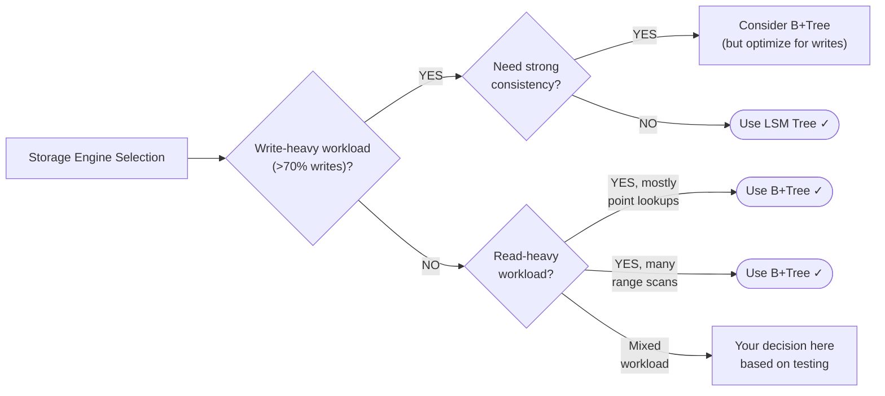

# Storage Engines

> B+Trees vs LSM Trees - The foundation of all database decisions

---

## Learning Objectives

By the end of this topic you will be able to:

- Explain the structural difference between B+Trees and LSM Trees and why each was designed
- Implement insert, search, and range query for a B+Tree
- Implement put, get, flush, and compaction for an LSM Tree
- Benchmark and interpret performance differences between the two engines
- Choose the appropriate engine given a workload's read/write characteristics
- Identify and fix common implementation bugs in tree-based storage structures

---

## ELI5: Explain Like I'm 5

<div class="learner-section" markdown>

**Your task:** After implementing and testing both storage engines, explain them simply.

**Prompts to guide you:**

1. **What is a B+Tree in one sentence?**
    - A B+Tree is a self-balancing tree where <span class="fill-in">[all values are stored in ___ nodes, which are linked together so you can ___]</span>

2. **Why do databases use B+Trees?**
    - Databases use B+Trees because each node is sized to match a <span class="fill-in">[disk ___, minimising the number of ___ needed per query]</span>

3. **Real-world analogy for B+Tree:**
    - Example: "A B+Tree is like a filing cabinet where..."
    - Think about how you'd navigate a large physical index before computers.
    - Your analogy: <span class="fill-in">[Fill in]</span>

4. **What is an LSM Tree in one sentence?**
    - An LSM Tree speeds up writes by <span class="fill-in">[first buffering inserts in ___, then periodically flushing them as sorted, immutable ___ on disk]</span>

5. **Why do write-heavy databases use LSM Trees?**
    - LSM Trees suit write-heavy workloads because each write only touches <span class="fill-in">[___ (RAM / disk?), deferring expensive ___ to background batch operations]</span>

6. **Real-world analogy for LSM Tree:**
    - Example: "An LSM Tree is like a notebook where..."
    - Your analogy: <span class="fill-in">[Fill in]</span>

</div>

---

## Core Implementation

### Part 1: B+Tree

**Your task:** Implement a simplified in-memory B+Tree.

```java
--8<-- "com/study/systems/storage/BPlusTree.java"
```


---

!!! warning "Debugging Challenge — Broken Leaf Search"

    The `findLeaf` below has one subtle bug in its comparison logic. Find it before reading the answer.

    ```java
    private LeafNode findLeaf(K key) {
        Node current = root;

        while (!current.isLeaf()) {
            InternalNode internal = (InternalNode) current;

            int i = 0;
            while (i < internal.keys.size() && key.compareTo(internal.keys.get(i)) > 0) {
                i++;
            }

            current = internal.children.get(i);
        }

        return (LeafNode) current;
    }
    ```

    Trace through manually with this tree:

    ```
    Internal node: keys=[20], children=[ChildA, ChildB]
    ChildA contains: [10, 15]
    ChildB contains: [20, 25, 30]

    Search key=20:
    - key(20) > keys[0](20)? → NO → i stays 0 → visit ChildA
    - But key 20 is in ChildB!
    ```

    ??? success "Answer"

        **Bug:** Using `>` instead of `>=` sends keys equal to a split point left when they belong right.

        **B+Tree invariant:** An internal key K means left child contains keys `< K`, right child contains keys `>= K`.

        **Fix:**
        ```java
        while (i < internal.keys.size() && key.compareTo(internal.keys.get(i)) >= 0) {
            i++;
        }
        ```

---

### Part 2: LSM Tree

**Your task:** Implement a simplified LSM Tree with MemTable and SSTables.

```java
--8<-- "com/study/systems/storage/LSMTree.java"
```


---

!!! warning "Debugging Challenge — Broken Compaction"

    The `compact()` below has two logic bugs that cause data loss and incorrect values. Find both before reading the answers.

    ```java
    public void compact() {
        if (sstables.size() <= 1) return;

        TreeMap<K, V> merged = new TreeMap<>();

        for (int i = sstables.size() - 1; i >= 0; i--) {  // newest → oldest
            SSTable<K, V> table = sstables.get(i);
            for (Map.Entry<K, V> entry : table.entrySet()) {
                merged.put(entry.getKey(), entry.getValue());
            }
        }

        SSTable<K, V> compacted = new SSTable<>(merged);
        sstables.add(compacted);

        System.out.println("Compacted into 1 SSTable");
    }
    ```

    ??? success "Answers"

        **Bug 1 — wrong iteration order:** Iterating newest-to-oldest means that when a key appears in an older SSTable, its older value overwrites the newer one. LSM Trees must keep the newest value.

        **Fix:** Iterate oldest-to-newest so later `put()` calls overwrite earlier ones:
        ```java
        for (int i = 0; i < sstables.size(); i++) { ... }
        ```

        **Bug 2 — old SSTables never removed:** `sstables.add(compacted)` appends the compacted table but leaves all originals in place. Memory leak, and reads become slower after every compaction.

        **Fix:**
        ```java
        sstables.clear();
        sstables.add(compacted);
        ```

---

### Part 3: Benchmark Comparison

**Your task:** Compare B+Tree vs LSM Tree performance.

```java
--8<-- "com/study/systems/storage/StorageBenchmark.java"
```

**Your benchmark results:**

<table class="benchmark-table">
<thead>
  <tr>
    <th>Metric</th>
    <th>B+Tree</th>
    <th>LSM Tree</th>
    <th>Winner</th>
  </tr>
</thead>
<tbody>
  <tr>
    <td>Write Performance (ms)</td>
    <td class="blank">___ ms</td>
    <td class="blank">___ ms</td>
    <td class="blank">___</td>
  </tr>
  <tr>
    <td>Write Throughput (ops/sec)</td>
    <td class="blank">___ writes/sec</td>
    <td class="blank">___ writes/sec</td>
    <td class="blank">___</td>
  </tr>
  <tr>
    <td>Read Performance (ms)</td>
    <td class="blank">___ ms</td>
    <td class="blank">___ ms</td>
    <td class="blank">___</td>
  </tr>
  <tr>
    <td>Read Throughput (ops/sec)</td>
    <td class="blank">___ reads/sec</td>
    <td class="blank">___ reads/sec</td>
    <td class="blank">___</td>
  </tr>
</tbody>
</table>

<div class="learner-section" markdown>

**Key insight from your results:** <span class="fill-in">[Fill in why this difference exists]</span>

</div>

---

## Before/After: Why This Pattern Matters

**Your task:** Compare naive vs optimised approaches to understand the trade-offs.

### Example: Write-Heavy Workload

**Problem:** Insert 10,000 key-value pairs as quickly as possible.

#### Approach 1: B+Tree (Immediate Persistence)

```java
// Every write requires tree traversal and potential rebalancing
BPlusTree<Integer, String> btree = new BPlusTree<>(128);

long start = System.nanoTime();
for (int i = 0; i < 10000; i++) {
    btree.insert(i, "Value" + i);  // Each insert: O(log N)
    // Must traverse tree from root to leaf
    // May trigger node splits (expensive)
    // Must maintain tree balance property
}
long duration = System.nanoTime() - start;
```

**Analysis:**

- Time: O(N log N) — Each insert is O(log N)
- For 10,000 inserts: ~10,000 * log(10,000) = ~130,000 operations
- Write amplification: High (each insert may split nodes, update parent pointers)

#### Approach 2: LSM Tree (Buffered Writes)

```java
// Writes go to in-memory MemTable (just a TreeMap insert)
LSMTree<Integer, String> lsm = new LSMTree<>(100);

long start = System.nanoTime();
for (int i = 0; i < 10000; i++) {
    lsm.put(i, "Value" + i);  // Each put: O(log M), M = memTable size
    // Only updates in-memory TreeMap
    // Occasional flush to disk (batched)
}
long duration = System.nanoTime() - start;
```

**Analysis:**

- Time: O(N log M) where M << N (M = MemTable size)
- For 10,000 inserts: ~10,000 * log(100) = ~20,000 operations
- Write amplification: Lower (batch writes to disk)

#### Performance Comparison

| Operation Count | B+Tree (O(N log N)) | LSM Tree (O(N log M)) | LSM Advantage |
|-----------------|---------------------|-----------------------|---------------|
| N = 1,000       | ~10,000 ops         | ~2,000 ops            | 5x faster     |
| N = 10,000      | ~130,000 ops        | ~20,000 ops           | 6.5x faster   |
| N = 100,000     | ~1,700,000 ops      | ~200,000 ops          | 8.5x faster   |

**Your calculation:** For N = 50,000 writes, LSM Tree is approximately _____ times faster.

#### Why Does LSM Win for Writes?

!!! note "Key insight"
    B+Tree: every insert = tree traversal + potential split.
    LSM Tree: every insert = one in-memory write, occasionally flushed in a batch.

```
B+Tree insert key=50:
1. Traverse root → internal → leaf  (3 disk seeks)
2. Insert in leaf                   (sorted position)
3. If leaf full, split node         (expensive)
4. Update parent pointers           (more writes)
Result: 1 logical write = 4-5 physical writes (write amplification)

LSM Tree insert key=50:
1. Insert into MemTable             (in-memory TreeMap)
2. When MemTable full, flush batch  (sequential write to disk)
Result: 1 logical write = 1 in-memory write
```

**After implementing, explain in your own words:**

<div class="learner-section" markdown>

- Why does B+Tree require more writes per operation? <span class="fill-in">[Your answer]</span>
- How does LSM Tree achieve better write throughput? <span class="fill-in">[Your answer]</span>
- What's the trade-off for read performance? <span class="fill-in">[Your answer]</span>

</div>

---

### Example: Read-Heavy Workload

**Problem:** Perform 1,000 random lookups after loading 10,000 records.

#### Approach 1: B+Tree (Single Location Read)

```java
BPlusTree<Integer, String> btree = new BPlusTree<>(128);
// Load data...

long start = System.nanoTime();
for (int i = 0; i < 1000; i++) {
    int key = random.nextInt(10000);
    String value = btree.search(key);  // Single tree traversal: O(log N)
    // Root → Internal → Leaf (3-4 hops)
}
long duration = System.nanoTime() - start;
```

**Analysis:**

- Time: O(log N) per read
- For 1,000 reads: ~1,000 * log(10,000) = ~13,000 operations
- Read amplification: Low (single path through tree)

#### Approach 2: LSM Tree (Multiple Location Read)

```java
LSMTree<Integer, String> lsm = new LSMTree<>(100);
// Load data... (creates multiple SSTables)

long start = System.nanoTime();
for (int i = 0; i < 1000; i++) {
    int key = random.nextInt(10000);
    String value = lsm.get(key);  // Check MemTable + all SSTables
    // Must check MemTable (O(log M))
    // Then check SSTable-5 (O(log S))
    // Then check SSTable-4 (O(log S))
    // ... continue until found
}
long duration = System.nanoTime() - start;
```

**Analysis:**

- Time: O(log M + K * log S) where K = number of SSTables
- For 1,000 reads with 10 SSTables: ~1,000 * (10 * log(1000)) = ~100,000 operations
- Read amplification: High (must check multiple locations)

#### Performance Comparison

| SSTable Count | B+Tree (O(log N)) | LSM Tree (O(K * log S)) | B+Tree Advantage |
|---------------|-------------------|-------------------------|------------------|
| K = 1         | ~13 ops/read      | ~13 ops/read            | ~1x (equal)      |
| K = 5         | ~13 ops/read      | ~65 ops/read            | 5x faster        |
| K = 10        | ~13 ops/read      | ~130 ops/read           | 10x faster       |

**Your calculation:** With 20 SSTables, B+Tree is approximately _____ times faster for reads.

!!! tip "This is why compaction matters"
    LSM read performance degrades linearly with SSTable count. Compaction controls that count.

**After benchmarking, fill in:**

<div class="learner-section" markdown>

- What happens to LSM read performance as SSTables accumulate? <span class="fill-in">[Your answer]</span>
- Why doesn't B+Tree have this problem? <span class="fill-in">[Your answer]</span>
- How does compaction help LSM Trees? <span class="fill-in">[Your answer]</span>

</div>

---

## Case Studies: Storage Engines in the Wild

### MySQL (InnoDB): The B+Tree Workhorse

- **Engine:** InnoDB, the default storage engine for MySQL.
- **Pattern:** B+Tree.
- **How it works:** InnoDB uses a B+Tree for its primary key index, which is a **clustered index**. This means the table
  data itself is stored in the leaf nodes of the B+Tree, physically ordered by the primary key. This makes primary key
  lookups and range scans extremely fast.
- **Key Takeaway:** B+Trees are the default choice for general-purpose OLTP databases like MySQL that require strong
  consistency, fast point lookups, and efficient range queries (e.g., fetching users in a specific ID range). The
  trade-off is higher write amplification, as in-place updates can cause page splits.

### Apache Cassandra: LSM Trees for Write-Heavy Scale

- **Engine:** Apache Cassandra.
- **Pattern:** Log-Structured Merge-Tree (LSM Tree).
- **How it works:** Writes are first appended to a commit log and then written to an in-memory `memtable`. When the
  `memtable` is full, it's flushed to disk as an immutable `SSTable`. Reads must check the `memtable` and potentially
  multiple `SSTables`. Compaction processes merge `SSTables` in the background to improve read performance.
- **Key Takeaway:** Cassandra is built for massive write throughput and high availability. By turning random writes into
  sequential appends, LSM Trees are perfect for write-heavy workloads like time-series data, IoT metrics, and logging
  systems, at the cost of higher read latency and eventual consistency.

### RocksDB: The Embedded LSM Engine

- **Engine:** RocksDB, an embeddable key-value store developed by Facebook.
- **Pattern:** LSM Tree.
- **How it works:** RocksDB provides an LSM-based storage engine library that other databases can build on top of. It
  manages `memtables`, `SSTables`, and compaction, offering tunable performance for different workloads.
- **Key Takeaway:** The LSM Tree pattern is so powerful that it's used as a foundational component in many modern
  distributed databases like CockroachDB, TiDB, and YugabyteDB. It provides a robust, high-performance engine for
  handling state in a distributed environment.

---

## Common Misconceptions

!!! danger "LSM Trees are always faster than B+Trees"
    LSM Trees are faster for *writes*. B+Trees are faster for *reads*, especially point lookups. The correct framing is: which trade-off matches your workload's read/write ratio?

!!! danger "Compaction is optional"
    Without compaction, SSTables accumulate indefinitely. Read performance degrades as O(K × log S) where K grows without bound — eventually every read scans dozens of files. Compaction is not an optimisation; it is required for sustained read performance.

!!! danger "WAL is part of the storage engine"
    WAL (Write-Ahead Log) is a separate durability layer, not a feature of either engine. Both B+Trees and LSM Trees use WAL for crash recovery — it is orthogonal to how data is structured on disk. Losing your MemTable on a crash and replaying a WAL is an LSM concern; B+Trees have their own WAL-based recovery path.

!!! danger "When it breaks"
    B+Tree write performance degrades under write-heavy workloads when page splits cascade — a single row insert can rebalance multiple levels. At sustained write rates above roughly 10,000 writes/second on spinning disk, write amplification causes measurable latency spikes. LSM trees introduce a different cliff: when write throughput exceeds compaction throughput, compaction debt accumulates, SSTable count grows, and read amplification climbs until reads must check dozens of files. RocksDB exposes a `level0_slowdown_writes_trigger` (default: 20 files) and `level0_stop_writes_trigger` (default: 36 files) specifically for this condition — these are the numbers to know.

---

## Decision Framework

<div class="learner-section" markdown>

**Your task:** Build decision trees for when to use each storage engine.

### Question 1: Write-heavy or Read-heavy?

Answer after implementing and benchmarking:

- **My answer:** <span class="fill-in">[Fill in]</span>
- **Why does this matter?** <span class="fill-in">[Fill in]</span>
- **Performance difference I observed:** <span class="fill-in">[Fill in]</span>

### Question 2: Need range queries?

Answer:

- **Do B+Trees support range queries?** <span class="fill-in">[Yes/No - explain how]</span>
- **Do LSM Trees support range queries?** <span class="fill-in">[Yes/No - explain complexity]</span>
- **Which is faster for range queries?** <span class="fill-in">[Fill in after testing]</span>

### Question 3: Sequential or random writes?

Answer:

- **B+Tree with random writes:** <span class="fill-in">[What happens? Why is it slow?]</span>
- **LSM Tree with random writes:** <span class="fill-in">[What happens? Why is it fast?]</span>
- **Your observation from implementation:** <span class="fill-in">[Fill in]</span>

### Your Decision Tree

Build this after understanding trade-offs:


```mermaid
flowchart LR
    Start["Storage Engine Selection"]

    Start --> Q1{"Write-heavy workload<br/>(>70% writes)?"}
    Q1 -->|"YES"| Q2{"Need strong<br/>consistency?"}
    Q1 -->|"NO"| Q3{"Read-heavy<br/>workload?"}

    Q2 -->|"YES"| A1["Consider B+Tree<br/>(but optimize for writes)"]
    Q2 -->|"NO"| A2(["Use LSM Tree ✓"])

    Q3 -->|"YES, mostly<br/>point lookups"| A3(["Use B+Tree ✓"])
    Q3 -->|"YES, many<br/>range scans"| A4(["Use B+Tree ✓"])
    Q3 -->|"Mixed<br/>workload"| A5["Your decision here<br/>based on testing"]
```

</div>

---

## Practice

<div class="learner-section" markdown>

### Scenario 1: Social Media Posts Table

Design storage for this table:

```sql
CREATE TABLE posts (
    id BIGINT PRIMARY KEY,
    user_id BIGINT,
    content TEXT,
    created_at TIMESTAMP,
    likes_count INT
);
```

**Queries:**

- Q1: Get recent posts by user (sorted by created_at)
- Q2: Get top posts by likes in last 24 hours
- Q3: Insert new posts (10,000 posts/sec)

**Your design:**

Storage engine choice: <span class="fill-in">[B+Tree or LSM?]</span>

Reasoning:

- Write volume: <span class="fill-in">[Fill in]</span>
- Read patterns: <span class="fill-in">[Fill in]</span>
- Your choice: <span class="fill-in">[Fill in]</span>

Index design:

1. <span class="fill-in">[What indexes would you create?]</span>
2. <span class="fill-in">[Why these specific indexes?]</span>
3. <span class="fill-in">[What's the column order and why?]</span>

**Failure modes:**

- What happens if the primary storage node for this posts table becomes unavailable during a write burst of 10,000 posts/sec? <span class="fill-in">[Fill in]</span>
- How does your design behave when index updates lag behind writes and a user queries posts they just created? <span class="fill-in">[Fill in]</span>

### Scenario 2: Time-Series Metrics

Design storage for metrics data:

```sql
CREATE TABLE metrics (
    metric_name VARCHAR(100),
    timestamp TIMESTAMP,
    value DOUBLE,
    tags JSONB
);
```

**Access patterns:**

- Writes: 1M data points/second
- Reads: Recent data (last 1 hour) queried frequently
- Older data rarely accessed
- Retention: 30 days

**Your design:**

Storage engine: <span class="fill-in">[Fill in]</span>

Why?

1. <span class="fill-in">[Write characteristics]</span>
2. <span class="fill-in">[Read characteristics]</span>
3. <span class="fill-in">[Time-series specific considerations]</span>

**Failure modes:**

- What happens if the MemTable is full and the flush-to-SSTable process stalls (e.g., disk I/O saturation at 1M writes/sec)? <span class="fill-in">[Fill in]</span>
- How does your design behave when compaction falls behind and SSTable count grows unbounded over the 30-day retention window? <span class="fill-in">[Fill in]</span>

### Scenario 3: E-commerce Inventory

```sql
CREATE TABLE inventory (
    product_id BIGINT PRIMARY KEY,
    quantity INT,
    reserved INT,
    last_updated TIMESTAMP
);
```

**Access patterns:**

- Reads: Very frequent (1M reads/sec)
- Writes: Updates when orders placed (10k writes/sec)
- Consistency: Critical (no overselling)

**Your design:**

Storage engine: <span class="fill-in">[Fill in]</span>

Trade-offs you considered:

1. <span class="fill-in">[Fill in]</span>
2. <span class="fill-in">[Fill in]</span>
3. <span class="fill-in">[Fill in]</span>

**Failure modes:**

- What happens if the storage node serving inventory reads becomes unavailable while 1M reads/sec are in flight? <span class="fill-in">[Fill in]</span>
- How does your design behave when a high-traffic flash sale causes write contention on the same product_id rows, potentially exhausting B+Tree leaf-page lock slots? <span class="fill-in">[Fill in]</span>

</div>

---

## Test Your Understanding

Answer these without referring to your notes or implementation.

1. What causes write amplification in a B+Tree? Describe the physical I/O operations that occur for a single logical insert.

    ??? success "Rubric"
        A complete answer addresses: (1) each insert requires reading the target leaf page from disk, (2) modifying it in memory and writing the entire page back (even if only a few bytes changed), and (3) potential node splits cascade up the tree, triggering additional reads and writes of parent pages.

2. Why does an LSM Tree need compaction? What specifically breaks if you skip it indefinitely?

    ??? success "Rubric"
        A complete answer addresses: (1) each flush creates a new SSTable, so without compaction the SSTable count grows without bound, (2) read performance degrades as O(K × log S) where K is unbounded — every read must check every SSTable, and (3) disk space is wasted because outdated and deleted values are never reclaimed.

3. A metrics pipeline ingests 500k events/second and queries the last hour of data every 30 seconds. Which engine, and why?

    ??? success "Rubric"
        A complete answer addresses: (1) the 500k/sec write rate strongly favours LSM Tree due to its append-to-MemTable write path and lower write amplification, (2) the infrequent range read (every 30 seconds) makes LSM's higher read amplification acceptable, and (3) compaction should be tuned to keep recent SSTables small so the "last hour" queries remain fast.

4. What structural difference between B-Tree and B+Tree makes range queries significantly more efficient?

    ??? success "Rubric"
        A complete answer addresses: (1) in a B-Tree, data values are stored in both internal and leaf nodes, so a range scan must traverse back up and down the tree for each key, (2) in a B+Tree, all values are stored only in leaf nodes, and (3) leaf nodes are linked in a doubly- or singly-linked list, so after finding the start of a range the scan proceeds sequentially without re-traversing the tree.

5. A colleague says "We should use LSM Trees — they're faster." What is incomplete about this statement?

    ??? success "Rubric"
        A complete answer addresses: (1) LSM Trees are faster for writes but slower for reads, especially point lookups and worst-case range scans with many SSTables, (2) "faster" must be qualified by workload read/write ratio, and (3) LSM Trees introduce operational complexity (compaction tuning, read amplification management) that B+Trees do not require.

---

<details markdown>
<summary>Appendix: The Historical Evolution — From First Principles</summary>

> **Why this appendix exists**: The main chapter teaches B+Trees and LSM Trees side-by-side. But historically, B+Trees
> came first and dominated for 30 years. Understanding this evolution provides deeper intuition about why these designs
> exist.

---

## The Historical Truth

**1970s-2000s**: If you said "database storage engine," you meant **B+Tree**.

- Oracle, MySQL, PostgreSQL, SQL Server - all B+Trees
- Learned in every databases class
- The default, the standard, the only choice

**2006**: Google's BigTable paper changes everything

- Describes LSM-style architecture for web-scale writes
- Solves write amplification problem in B+Trees

**2008-2012**: NoSQL movement adopts LSM Trees

- Cassandra, HBase, RocksDB, LevelDB
- Narrative: "B+Trees are old SQL. LSM Trees are modern NoSQL."

**Reality**: Both solve the same problem (organising data on disk) with different trade-offs.

---

## The Evolution: Starting from Absolute Zero

Let's trace the path that led to these designs, starting from the simplest possible database.

**How to use this section:** At each level, **try to predict what will break** before reading ahead. This builds the
intuition for why each innovation was necessary.

---

### Level 0: Unsorted Append-Only File (Heap File)

<div class="learner-section" markdown>

**⚠️ STOP: Before reading the code below, predict the problem:**

You're building the simplest possible database. You decide to just append every write to a file.

**Prediction Challenge:**

1. What operation will become slow as the database grows? <span class="fill-in">[Reads/Writes/Both?]</span>
2. Why? <span class="fill-in">[Your reasoning]</span>
3. At what scale does it become unbearable? <span class="fill-in">[100 records? 1M records?]</span>

<details markdown>
<summary>Check your prediction</summary>

**Answer**: Reads become O(N) - must scan entire file for every lookup.

**Math**: With 1M records at 1 microsecond per comparison:

- Average search time: 500,000 comparisons = **500ms** 🐌
- This is unacceptable for any interactive application (target: <100ms)

</details>

</div>

```java
// The simplest possible database
public class SimpleDB {
    File dataFile;

    public void insert(K key, V value) {
        dataFile.append(key + "," + value + "\n");  // O(1) - Fast! ✓
    }

    public V search(K key) {
        for (String line : dataFile.readAllLines()) {  // O(N) - Slow! ✗
            if (line.startsWith(key)) {
                return parseValue(line);
            }
        }
        return null;
    }
}
```

**Characteristics**:

- ✅ Writes: O(1) - just append
- ✅ Simple to implement
- ❌ Reads: O(N) - must scan entire file
- ❌ Updates: O(N) - must scan to find, then append new version

**Problem**: With 1 million records, every search reads 1 million lines. Unbearable.

---

### Level 1: Sorted File

<div class="learner-section" markdown>

**⚠️ STOP: Before reading the code below, predict the problem:**

We fixed reads by keeping the file sorted (enabling binary search). But what's the cost?

**Prediction Challenge:**

1. How does insert performance change? <span class="fill-in">[Better/Worse/Same?]</span>
2. Why? <span class="fill-in">[What must happen to maintain sorted order?]</span>
3. For 1M records, what's the average cost of one insert? <span class="fill-in">[How many records moved?]</span>

<details markdown>
<summary>Check your prediction</summary>

**Answer**: Inserts become O(N) - must shift data to maintain sorted order.

**Math**: With 1M records:

- Binary search finds position: log₂(1M) = 20 comparisons (fast)
- Shift half the file on average: 500,000 records moved
- Each record = 100 bytes → **50MB rewritten per insert** 🐌
- This is worse than the unsorted file!

**Trade-off discovered**: Optimising reads (sorting) made writes slower.

</details>

</div>

```java
// Keep file sorted by key - enables binary search
public class SortedFileDB {
    File sortedFile;  // Maintained in sorted order by key

    public void insert(K key, V value) {
        // 1. Binary search to find position: O(log N)
        int position = binarySearchFile(key);

        // 2. Shift everything after position right: O(N) ✗
        shiftDataRight(position);

        // 3. Insert new record
        writeAt(position, key, value);

        // Result: Must rewrite ~50% of file on average!
    }

    public V search(K key) {
        // Binary search through file: O(log N) ✓
        return binarySearchFile(key);
    }
}
```

**Characteristics**:

- ✅ Reads: O(log N) - binary search
- ❌ Writes: O(N) - must shift data to maintain sort order
- ❌ Every insert rewrites half the file on average

**Problem**: Writes went from O(1) to O(N). Optimisation for reads broke writes.

---

### Level 2: Binary Search Tree (BST) - In-Memory

<div class="learner-section" markdown>

**⚠️ STOP: Before reading the code below, predict the problem:**

Binary Search Trees (BST) give us O(log N) for both reads and writes. Perfect! But what happens when we put this on
disk?

**Prediction Challenge:**

1. How many disk seeks are needed to search a BST with 1M
   records? <span class="fill-in">[Hint: What's the tree height?]</span>
2. If each disk seek takes 10ms, how long does one search take? <span class="fill-in">[Calculate total time]</span>
3. What's inefficient about storing each BST node on disk? <span class="fill-in">[Think about disk page sizes]</span>

<details markdown>
<summary>Check your prediction</summary>

**Answer**: BST creates a TALL tree with TINY nodes - terrible for disk I/O.

**Math**: With 1M records:

- Tree height: log₂(1M) ≈ 20 levels
- Each level = 1 disk seek
- Disk seek time: ~10ms
- **Total: 20 × 10ms = 200ms per query** 🐌

**Inefficiency**:

- BST node size: ~32 bytes (2 pointers + key + value)
- Disk page size: 4KB
- **Wasting 99% of each disk read!**

**Problem discovered**: We need to pack more data per disk read to minimise seeks.

</details>

</div>

```java
class Node {
    K key;
    V value;
    Node left;   // Pointer to left child
    Node right;  // Pointer to right child
}

public class BSTDB {
    Node root;

    public void insert(K key, V value) {
        root = insertRec(root, key, value);  // O(log N) average ✓
    }

    public V search(K key) {
        return searchRec(root, key);  // O(log N) average ✓
    }
}
```

**Looks great! Both reads and writes are O(log N).**

**But... when you put this on disk:**

**Problem 1: Each node is tiny**

- Node size: 2 pointers (16 bytes) + key (8 bytes) + value (8 bytes) = ~32 bytes
- Disk page size: 4KB
- Wasting 99% of each disk read!

**Problem 2: Tree is TALL**

- For 1M records: height = log₂(1M) ≈ 20 levels
- Each level = 1 disk seek
- Disk seek time on HDD: ~10ms
- **Total: 20 seeks × 10ms = 200ms per query** 🐌

**Problem 3: Can become unbalanced**

- If inserts are sorted: tree becomes linked list
- O(log N) becomes O(N) worst case

---

### Level 3: B-Tree (1972) - The Breakthrough

**Key insight**: Disk I/O is expensive. **Minimise disk seeks** by making nodes match disk page size.

```java
class BTreeNode {
    List<K> keys;        // 100-1000 keys per node (depending on key size)
    List<Node> children; // 101-1001 children

    // Each node fits in one disk page (4KB)
}
```

**Why this is revolutionary**:

```
Binary Search Tree (1M records):
┌─────────────────────────────────┐
│ Node size: 32 bytes             │
│ Height: log₂(1,000,000) ≈ 20    │
│ Disk seeks per query: 20        │
│ Query time: 20 × 10ms = 200ms ❌ │
└─────────────────────────────────┘

B-Tree with order 100 (1M records):
┌─────────────────────────────────┐
│ Node size: 4KB (one disk page)  │
│ Keys per node: ~100             │
│ Height: log₁₀₀(1,000,000) ≈ 3   │
│ Disk seeks per query: 3         │
│ Query time: 3 × 10ms = 30ms ✓   │
└─────────────────────────────────┘

Result: 6-7x faster!
```

**The key insight**: Each disk read should fetch as much useful data as possible. Wide nodes = short tree = fewer seeks.

**B-Tree characteristics**:

- ✅ Reads: O(log N) with minimal disk seeks
- ✅ Writes: O(log N) with in-place updates
- ✅ Self-balancing
- ⚠️ Data scattered throughout tree (internal + leaf nodes)

---

### Level 4: B+Tree - Optimised for Range Queries

**Problem with B-Tree**: Range queries are awkward.

```java
// Range query in B-Tree
public List<V> rangeQuery(K start, K end) {
    List<V> results = new ArrayList<>();

    // Problem: Data is scattered throughout the tree
    // Must do tree traversal for EACH key in range
    // Jumps around different levels - inefficient!

    for (K key = start; key <= end; key++) {
        results.add(search(key));  // Each search = tree traversal
    }
    return results;
}
```

**B+Tree solution**:

1. **All data in leaf nodes only** (internal nodes = just keys for navigation)
2. **Link leaf nodes together** (sequential list)

```java
class LeafNode {
    List<K> keys;
    List<V> values;
    LeafNode next;  // ← The magic pointer
}

public List<V> rangeQuery(K start, K end) {
    LeafNode leaf = findLeaf(start);  // O(log N) to find start

    List<V> results = new ArrayList<>();
    while (leaf != null) {
        for (int i = 0; i < leaf.keys.size(); i++) {
            K key = leaf.keys.get(i);
            if (key > end) return results;  // Done
            if (key >= start) results.add(leaf.values.get(i));
        }
        leaf = leaf.next;  // ← Sequential! Fast!
    }
    return results;
}
```

**Result**: Range queries are **sequential** after finding the start point. Perfect for databases.

**B+Trees dominated databases for 30+ years (1972-2000s).** Oracle, MySQL, PostgreSQL, SQL Server - all B+Trees.

---

## The Problem That Necessitated LSM Trees

### The Google Problem (mid-2000s)

**Workload**: Indexing the web for Google Search

- **Write volume**: Billions of page updates per day
- **Write pattern**: Mostly inserts (new pages discovered)
- **Read pattern**: Batch processing MapReduce jobs (can tolerate some latency)

**B+Tree performance breakdown**:

```java
// Every insert in B+Tree requires:
public void insert(K key, V value) {
    // 1. Read root page from disk (4KB)
    // 2. Read internal node from disk (4KB)
    // 3. Read leaf page from disk (4KB)
    // 4. Modify leaf (change maybe 100 bytes of data)
    // 5. Write entire leaf page back to disk (4KB) ← WRITE AMPLIFICATION!
    // 6. If leaf is full, split it:
    //    - Create new leaf page (4KB write)
    //    - Update parent pointer (4KB read + 4KB write)
    // 7. May cascade up the tree

    // Result: 1 logical write (100 bytes)
    //       = 5-10 physical I/O operations (20-40KB)
    //       = 200-400x write amplification!
}
```

**The math that broke B+Trees**:

- 1 billion inserts per day
- 40KB average I/O per insert (due to write amplification)
- **= 40TB of disk I/O per day**
- Actual new data: **~100GB**
- **Write amplification: 400x**

---

## First Principles → LSM Tree

**Question**: How can we optimise for massive write volume?

### Core Insight: Delay Sorting

```
When do you pay the cost of sorting?
┌─────────────────────────────────┐
│      On Every Write             │
│         (B+Tree)                │
│           vs                    │
│      In Batches                 │
│       (LSM Tree)                │
└─────────────────────────────────┘
```

**B+Tree philosophy**: Keep data sorted all the time

- Insert cost: O(log N) — must maintain sort order immediately
- Read cost: O(log N) — data is always sorted

**LSM Tree philosophy**: Sort in batches, not per-write

- Insert cost: O(log M) — just update in-memory buffer (M << N)
- Read cost: O(K × log S) — check multiple sorted files
- Amortise sorting cost over many writes

---

### The LSM Tree Evolution

**Step 1: Recognise append-only is fastest**

```java
public void write(K key, V value) {
    log.append(key + "," + value);  // O(1), sequential I/O ✓
}
// But reads are O(N) - scan entire log ✗
```

**Step 2: Buffer writes in memory (sorted)**

```java
TreeMap<K, V> memTable = new TreeMap<>();

public void write(K key, V value) {
    memTable.put(key, value);  // O(log M) where M is small (e.g., 10K)
}

public V read(K key) {
    return memTable.get(key);  // O(log M)
}
```

**Step 3: Flush to sorted files periodically**

```java
public void write(K key, V value) {
    memTable.put(key, value);

    if (memTable.size() >= threshold) {
        SSTable newTable = writeSSTable(memTable);  // Sequential write - FAST!
        sstables.add(newTable);
        memTable.clear();
    }
}
```

**Step 4: Read from multiple locations**

```java
public V read(K key) {
    if (memTable.containsKey(key)) {
        return memTable.get(key);
    }

    for (int i = sstables.size() - 1; i >= 0; i--) {
        SSTable table = sstables.get(i);
        V value = table.get(key);
        if (value != null) return value;
    }

    return null;
}
```

**Step 5: Compact periodically**

```java
public void compact() {
    TreeMap<K, V> merged = new TreeMap<>();

    for (SSTable table : sstables) {  // oldest to newest
        for (Entry<K, V> entry : table.entrySet()) {
            merged.put(entry.getKey(), entry.getValue());
        }
    }

    sstables.clear();
    sstables.add(new SSTable(merged));
}
```

---

## Where WAL (Write-Ahead Log) Fits

**WAL is orthogonal** to your storage engine choice. It's about **durability**, not structure.

```java
// With WAL: Durable ✓
public void put(K key, V value) {
    wal.append(key, value);      // Persist to disk immediately
    memTable.put(key, value);    // Fast in-memory update

    if (memTable.size() >= threshold) {
        flushToSSTable(memTable);
        wal.clear();
    }
}

public void recover() {
    memTable = replayWAL();
}
```

**Both B+Trees and LSM Trees use WAL** for durability. It's a separate layer from the core storage structure.

---

## In-Memory Storage Engines (Redis, Memcached)

**Completely different trade-off**: RAM vs Disk

```java
Map<K, V> data = new HashMap<>();

public void put(K key, V value) {
    data.put(key, value);  // O(1) - instant! ⚡
}

public V get(K key) {
    return data.get(key);  // O(1) - instant! ⚡
}
```

**When to use**:

- Cache (can rebuild from database if lost)
- Session storage (acceptable to lose some sessions)
- Real-time counters (like/view counts)
- Leaderboards (can reconstruct)

**When NOT to use**:

- ❌ Primary data store (too expensive, data loss risk)
- ❌ Large datasets (> available RAM)
- ❌ Requires durability guarantees

---

## Complete Comparison Table

| Storage Engine  | Write Speed  | Read Speed    | Range Queries | Capacity  | Durability   | Best For         |
|-----------------|--------------|---------------|---------------|-----------|--------------|------------------|
| **Heap File**   | ⚡⚡⚡ O(1)     | 🐌 O(N)       | ❌ No          | Unlimited | ✓            | Append-only logs |
| **Sorted File** | 🐌 O(N)      | ⚡⚡ O(log N)   | ✓             | Unlimited | ✓            | Read-only data   |
| **B+Tree**      | ⚡ O(log N)   | ⚡⚡⚡ O(log N)  | ✓✓✓ Excellent | Unlimited | ✓ (with WAL) | Read-heavy OLTP  |
| **LSM Tree**    | ⚡⚡⚡ O(log M) | ⚡⚡ O(K×log S) | ✓✓ Good       | Unlimited | ✓ (with WAL) | Write-heavy OLTP |
| **Redis (RAM)** | ⚡⚡⚡ O(1)     | ⚡⚡⚡ O(1)      | ❌ Limited     | RAM-bound | ⚠️ Optional  | Cache, sessions  |

---

## The Complete Historical Sequence

```
1970s: B-Trees invented (Rudolf Bayer, Boeing)
└── Goal: Minimise disk seeks on spinning disks

1972: B+Trees emerge
├── Optimise B-Trees for range queries
└── Become standard in databases

1980s-2000s: B+Trees dominate
├── Oracle, MySQL, PostgreSQL, SQL Server
└── Perfect for balanced read/write workloads

1996: LSM Trees invented (Patrick O'Neil et al.)
├── Published in academic paper
└── Mostly ignored by industry

2006: Google BigTable paper (THE TURNING POINT)
├── Describes LSM-style architecture
└── Proves it works at massive scale

2008-2012: NoSQL movement
├── Cassandra, HBase, LevelDB, RocksDB
└── "LSM Trees are modern, B+Trees are legacy"

2010s: SSDs change the game
├── Random I/O becomes cheaper
└── Gap between engines narrows

Modern day: Hybrid approaches
├── MongoDB/WiredTiger supports both engines
└── Choice depends on workload characteristics
```

</details>

---

## Connected Topics

<div class="bs-callout bs-callout-info" markdown>

**Where this topic connects**

- **02. Row vs Column Storage** — both address physical data layout; B+Tree suits row access, LSM suits append-heavy columnar writes → [02. Row vs Column Storage](02-row-vs-column-storage.md)
- **05. Caching Patterns** — the buffer pool in a storage engine is a cache; the same LRU eviction logic applies → [05. Caching Patterns](05-caching-patterns.md)
- **11. Database Scaling** — sharding distributes storage engine instances; the engine's write path (WAL vs memtable) shapes which replication strategies are practical → [11. Database Scaling](11-database-scaling.md)

</div>
