# Storage Engines

> B+Trees vs LSM Trees - The foundation of all database decisions

---

## ELI5: Explain Like I'm 5

<div class="learner-section" markdown>

**Your task:** After implementing and testing both storage engines, explain them simply.

**Prompts to guide you:**

1. **What is a B+Tree in one sentence?**
    - Your answer: <span class="fill-in">[Fill in after implementation]</span>

2. **Why do databases use B+Trees?**
    - Your answer: <span class="fill-in">[Fill in after implementation]</span>

3. **Real-world analogy for B+Tree:**
    - Example: "A B+Tree is like a filing cabinet where..."
    - Your analogy: <span class="fill-in">[Fill in]</span>

4. **What is an LSM Tree in one sentence?**
    - Your answer: <span class="fill-in">[Fill in after implementation]</span>

5. **Why do write-heavy databases use LSM Trees?**
    - Your answer: <span class="fill-in">[Fill in after implementation]</span>

6. **Real-world analogy for LSM Tree:**
    - Example: "An LSM Tree is like a notebook where..."
    - Your analogy: <span class="fill-in">[Fill in]</span>

</div>

---

## Quick Quiz (Do BEFORE implementing)

<div class="learner-section" markdown>

**Your task:** Test your intuition without looking at code. Answer these, then verify after implementation.

### Complexity Predictions

1. **B+Tree insert operation:**
    - Time complexity: <span class="fill-in">[Your guess: O(?)]</span>
    - Verified after implementation: <span class="fill-in">[Actual: O(?)]</span>

2. **LSM Tree write operation (to MemTable):**
    - Time complexity: <span class="fill-in">[Your guess: O(?)]</span>
    - Space complexity: <span class="fill-in">[Your guess: O(?)]</span>
    - Verified: <span class="fill-in">[Actual]</span>

3. **Performance calculation:**
    - For 100,000 writes, B+Tree = <span class="fill-in">_____</span> operations (if log base is 10)
    - For 100,000 writes, LSM Tree = <span class="fill-in">_____</span> operations (before flush)
    - Speedup factor for writes: LSM is approximately <span class="fill-in">_____</span> times faster

### Scenario Predictions

**Scenario 1:** Time-series metrics database (1M writes/second, rare reads)

- **Best storage engine?** <span class="fill-in">[B+Tree/LSM Tree - Why?]</span>
- **Key consideration:** <span class="fill-in">[Write amplification/Read speed/Range queries?]</span>
- **Why this choice?** <span class="fill-in">[Fill in your reasoning]</span>

**Scenario 2:** E-commerce inventory system (100k reads/sec, 5k writes/sec)

- **Best storage engine?** <span class="fill-in">[B+Tree/LSM Tree - Why?]</span>
- **What pattern benefits most?** <span class="fill-in">[Point lookups/Range scans/Random writes?]</span>

**Scenario 3:** Social media analytics (read historical posts by date range)

- **Which handles range queries better?** <span class="fill-in">[B+Tree/LSM Tree - Why?]</span>
- **Key data structure feature:** <span class="fill-in">[Linked leaves/Sorted SSTables?]</span>

### Trade-off Quiz

**Question:** When would B+Tree be BETTER than LSM Tree despite slower writes?

- Your answer: <span class="fill-in">[Fill in before implementation]</span>
- Verified answer: <span class="fill-in">[Fill in after benchmarking]</span>

**Question:** What's the MAIN advantage of LSM Trees for writes?

- [ ] No tree balancing required on each write
- [ ] Better space efficiency
- [ ] Faster range queries
- [ ] Lower read amplification

Verify after implementation: <span class="fill-in">[Which one(s)?]</span>

**Question:** What happens if you never compact an LSM Tree?

- Your prediction: <span class="fill-in">[What problem occurs?]</span>
- Verified: <span class="fill-in">[Fill in after testing]</span>

</div>

---

## Before/After: Why This Pattern Matters

**Your task:** Compare naive vs optimized storage approaches to understand the trade-offs.

### Example: Write-Heavy Workload

**Problem:** Insert 10,000 key-value pairs as quickly as possible.

#### Approach 1: B+Tree (Immediate Persistence)

```java
// Every write requires tree traversal and potential rebalancing
BPlusTree<Integer, String> btree = new BPlusTree<>(128);

long start = System.nanoTime();
for (int i = 0; i < 10000; i++) {
    btree.insert(i, "Value" + i);  // Each insert: O(log N)
    // Must traverse tree from root to leaf
    // May trigger node splits (expensive)
    // Must maintain tree balance property
}
long duration = System.nanoTime() - start;
```

**Analysis:**

- Time: O(N log N) - Each insert is O(log N)
- Space: O(N) - Tree structure overhead
- For 10,000 inserts: ~10,000 * log(10,000) = ~130,000 operations
- Write amplification: High (each insert may split nodes, update parent pointers)

#### Approach 2: LSM Tree (Buffered Writes)

```java
// Writes go to in-memory MemTable (just a TreeMap insert)
LSMTree<Integer, String> lsm = new LSMTree<>(100);

long start = System.nanoTime();
for (int i = 0; i < 10000; i++) {
    lsm.put(i, "Value" + i);  // Each put: O(log M), M = memTable size
    // Only updates in-memory TreeMap
    // Occasional flush to disk (batched)
}
long duration = System.nanoTime() - start;
```

**Analysis:**

- Time: O(N log M) where M << N (M = MemTable size)
- Space: O(N) - Eventually flushes to SSTables
- For 10,000 inserts: ~10,000 * log(100) = ~20,000 operations
- Write amplification: Lower (batch writes to disk)

#### Performance Comparison

| Operation Count | B+Tree (O(N log N)) | LSM Tree (O(N log M)) | LSM Advantage |
|-----------------|---------------------|-----------------------|---------------|
| N = 1,000       | ~10,000 ops         | ~2,000 ops            | 5x faster     |
| N = 10,000      | ~130,000 ops        | ~20,000 ops           | 6.5x faster   |
| N = 100,000     | ~1,700,000 ops      | ~200,000 ops          | 8.5x faster   |

**Your calculation:** For N = 50,000 writes, LSM Tree is approximately _____ times faster.

#### Why Does LSM Win for Writes?

**Key insight to understand:**

B+Tree: Every insert = tree traversal + potential split

```
Insert key=50:

1. Traverse root → internal → leaf (3 disk seeks)
2. Insert in leaf (sorted position)
3. If leaf full, split node (expensive)
4. Update parent pointers (more writes)
Result: 1 logical write = 4-5 physical writes (write amplification!)
```

LSM Tree: Batched sequential writes

```
Insert key=50:

1. Insert into MemTable (in-memory TreeMap)
2. When MemTable full, flush entire batch to SSTable
3. Sequential write to disk (very fast)
Result: 1 logical write = 1 in-memory write (occasionally batched to disk)
```

**After implementing, explain in your own words:**

<div class="learner-section" markdown>

- Why does B+Tree require more writes per operation? <span class="fill-in">[Your answer]</span>
- How does LSM Tree achieve better write throughput? <span class="fill-in">[Your answer]</span>
- What's the trade-off for read performance? <span class="fill-in">[Your answer]</span>

</div>

---

### Example: Read-Heavy Workload

**Problem:** Perform 1,000 random lookups after loading 10,000 records.

#### Approach 1: B+Tree (Single Location Read)

```java
BPlusTree<Integer, String> btree = new BPlusTree<>(128);
// Load data...

long start = System.nanoTime();
for (int i = 0; i < 1000; i++) {
    int key = random.nextInt(10000);
    String value = btree.search(key);  // Single tree traversal: O(log N)
    // Root → Internal → Leaf (3-4 hops)
}
long duration = System.nanoTime() - start;
```

**Analysis:**

- Time: O(log N) per read
- For 1,000 reads: ~1,000 * log(10,000) = ~13,000 operations
- Read amplification: Low (single path through tree)

#### Approach 2: LSM Tree (Multiple Location Read)

```java
LSMTree<Integer, String> lsm = new LSMTree<>(100);
// Load data... (creates multiple SSTables)

long start = System.nanoTime();
for (int i = 0; i < 1000; i++) {
    int key = random.nextInt(10000);
    String value = lsm.get(key);  // Check MemTable + all SSTables
    // Must check MemTable (O(log M))
    // Then check SSTable-5 (O(log S))
    // Then check SSTable-4 (O(log S))
    // ... continue until found
}
long duration = System.nanoTime() - start;
```

**Analysis:**

- Time: O(log M + K * log S) where K = number of SSTables
- For 1,000 reads with 10 SSTables: ~1,000 * (10 * log(1000)) = ~100,000 operations
- Read amplification: High (must check multiple locations)

#### Performance Comparison

| SSTable Count | B+Tree (O(log N)) | LSM Tree (O(K * log S)) | B+Tree Advantage |
|---------------|-------------------|-------------------------|------------------|
| K = 1         | ~13 ops/read      | ~13 ops/read            | ~1x (equal)      |
| K = 5         | ~13 ops/read      | ~65 ops/read            | 5x faster        |
| K = 10        | ~13 ops/read      | ~130 ops/read           | 10x faster       |

**Your calculation:** With 20 SSTables, B+Tree is approximately _____ times faster for reads.

**Key insight:** This is why LSM Trees need **compaction** - to reduce SSTable count!

**After benchmarking, fill in:**

<div class="learner-section" markdown>

- What happens to LSM read performance as SSTables accumulate? <span class="fill-in">[Your answer]</span>
- Why doesn't B+Tree have this problem? <span class="fill-in">[Your answer]</span>
- How does compaction help LSM Trees? <span class="fill-in">[Your answer]</span>

</div>

---

## Case Studies: Storage Engines in the Wild

### MySQL (InnoDB): The B+Tree Workhorse

- **Engine:** InnoDB, the default storage engine for MySQL.
- **Pattern:** B+Tree.
- **How it works:** InnoDB uses a B+Tree for its primary key index, which is a **clustered index**. This means the table
  data itself is stored in the leaf nodes of the B+Tree, physically ordered by the primary key. This makes primary key
  lookups and range scans extremely fast.
- **Key Takeaway:** B+Trees are the default choice for general-purpose OLTP databases like MySQL that require strong
  consistency, fast point lookups, and efficient range queries (e.g., fetching users in a specific ID range). The
  trade-off is higher write amplification, as in-place updates can cause page splits.

### Apache Cassandra: LSM Trees for Write-Heavy Scale

- **Engine:** Apache Cassandra.
- **Pattern:** Log-Structured Merge-Tree (LSM Tree).
- **How it works:** Writes are first appended to a commit log and then written to an in-memory `memtable`. When the
  `memtable` is full, it's flushed to disk as an immutable `SSTable`. Reads must check the `memtable` and potentially
  multiple `SSTables`. Compaction processes merge `SSTables` in the background to improve read performance.
- **Key Takeaway:** Cassandra is built for massive write throughput and high availability. By turning random writes into
  sequential appends, LSM Trees are perfect for write-heavy workloads like time-series data, IoT metrics, and logging
  systems, at the cost of higher read latency and eventual consistency.

### RocksDB: The Embedded LSM Engine

- **Engine:** RocksDB, an embeddable key-value store developed by Facebook.
- **Pattern:** LSM Tree.
- **How it works:** RocksDB provides an LSM-based storage engine library that other databases can build on top of. It
  manages `memtables`, `SSTables`, and compaction, offering tunable performance for different workloads.
- **Key Takeaway:** The LSM Tree pattern is so powerful that it's used as a foundational component in many modern
  distributed databases like CockroachDB, TiDB, and YugabyteDB. It provides a robust, high-performance engine for
  handling state in a distributed environment.

---

## Core Implementation

### Part 1: B+Tree

**Your task:** Implement a simplified in-memory B+Tree.

```java
import java.util.*;

/**
 * B+Tree: Self-balancing tree optimized for range queries
 *
 * Properties:
 * - All values stored in leaf nodes
 * - Leaves are linked (for range scans)
 * - Height kept minimal
 * - Order K: max K keys per node
 */
public class BPlusTree<K extends Comparable<K>, V> {

    private final int order; // Max keys per node (e.g., 4)
    private Node root;

    // Base node class
    abstract class Node {
        List<K> keys;
        Node parent;

        Node() {
            this.keys = new ArrayList<>();
        }

        abstract boolean isLeaf();
    }

    // Internal nodes: have children, no values
    class InternalNode extends Node {
        List<Node> children;

        InternalNode() {
            super();
            this.children = new ArrayList<>();
        }

        @Override
        boolean isLeaf() {
            return false;
        }
    }

    // Leaf nodes: have values, no children, linked to next leaf
    class LeafNode extends Node {
        List<V> values;
        LeafNode next; // For range scans

        LeafNode() {
            super();
            this.values = new ArrayList<>();
        }

        @Override
        boolean isLeaf() {
            return true;
        }
    }

    public BPlusTree(int order) {
        this.order = order;
        this.root = new LeafNode();
    }

    /**
     * Insert key-value pair
     * Time: O(log N)
     *
     * TODO: Implement insertion logic
     */
    public void insert(K key, V value) {
        // TODO: Navigate to the appropriate leaf node
        // Handle node splits when capacity is exceeded
        // Consider how splits propagate up the tree
    }

    /**
     * Search for a key
     * Time: O(log N)
     *
     * TODO: Implement search logic
     */
    public V search(K key) {
        // TODO: Navigate from root to the appropriate leaf
        // Search for the key in the leaf node

        return null; // Replace with actual implementation
    }

    /**
     * Range query: all values where startKey <= key <= endKey
     * Time: O(log N + results)
     *
     * TODO: Implement range query
     */
    public List<V> rangeQuery(K startKey, K endKey) {
        List<V> results = new ArrayList<>();

        // TODO: Find starting point and traverse leaf chain
        // Use the linked structure of leaves for efficiency

        return results;
    }

    /**
     * Helper: Find the leaf node where key should be
     */
    private LeafNode findLeaf(K key) {
        Node current = root;

        // TODO: Traverse down using binary search at each internal node
        // Stop at the appropriate leaf

        while (!current.isLeaf()) {
            InternalNode internal = (InternalNode) current;

            // TODO: Find correct child based on key comparisons
        }

        return (LeafNode) current;
    }

    /**
     * Helper: Split a full leaf node
     */
    private void splitLeaf(LeafNode leaf) {
        // TODO: Distribute keys/values to a new leaf node
    }

    /**
     * Helper: Split a full internal node
     */
    private void splitInternal(InternalNode node) {
        // TODO: Distribute keys/children to a new internal node
    }

    /**
     * Print tree structure (for debugging)
     */
    public void printTree() {
        printNode(root, 0);
    }

    private void printNode(Node node, int level) {
        String indent = "  ".repeat(level);
        System.out.println(indent + "Level " + level + ": " + node.keys);

        if (!node.isLeaf()) {
            InternalNode internal = (InternalNode) node;
            for (Node child : internal.children) {
                printNode(child, level + 1);
            }
        }
    }
}
```

**Runnable Client Code:**

```java
public class BPlusTreeClient {

    public static void main(String[] args) {
        // Create B+Tree with order 4 (max 4 keys per node)
        BPlusTree<Integer, String> tree = new BPlusTree<>(4);

        System.out.println("=== B+Tree Demo ===\n");

        // Test 1: Sequential inserts
        System.out.println("Inserting keys 1-20...");
        for (int i = 1; i <= 20; i++) {
            tree.insert(i, "Value" + i);
        }

        System.out.println("\nTree structure:");
        tree.printTree();

        // Test 2: Point lookups
        System.out.println("\n--- Point Lookups ---");
        System.out.println("Search(10): " + tree.search(10));
        System.out.println("Search(15): " + tree.search(15));
        System.out.println("Search(100): " + tree.search(100)); // Not found

        // Test 3: Range queries
        System.out.println("\n--- Range Queries ---");
        List<String> range = tree.rangeQuery(5, 10);
        System.out.println("Range [5, 10]: " + range);

        range = tree.rangeQuery(15, 18);
        System.out.println("Range [15, 18]: " + range);

        // Test 4: Random inserts
        System.out.println("\n--- Random Inserts ---");
        BPlusTree<Integer, String> tree2 = new BPlusTree<>(4);
        int[] randomKeys = {45, 12, 67, 23, 89, 34, 56, 78, 90, 1};

        System.out.println("Inserting random keys...");
        for (int key : randomKeys) {
            tree2.insert(key, "Val" + key);
        }

        tree2.printTree();

        // Test 5: Verify sorted order
        System.out.println("\n--- Verify Sorted Order ---");
        List<String> allValues = tree2.rangeQuery(0, 100);
        System.out.println("All values in order: " + allValues);
    }
}
```

---

### Part 2: LSM Tree

**Your task:** Implement a simplified LSM Tree with MemTable and SSTables.

```java
import java.util.*;

/**
 * LSM Tree: Log-Structured Merge Tree optimized for writes
 *
 * Architecture:
 * - Writes go to in-memory MemTable (sorted)
 * - When MemTable full, flush to SSTable (immutable file)
 * - Reads check MemTable, then SSTables (newest first)
 * - Periodically compact SSTables (merge and remove duplicates)
 */
public class LSMTree<K extends Comparable<K>, V> {

    private final int memTableSize; // Max entries before flush
    private TreeMap<K, V> memTable; // In-memory sorted map
    private List<SSTable<K, V>> sstables; // On-disk sorted tables

    /**
     * SSTable: Sorted String Table (immutable)
     * In production: stored on disk
     * Here: simplified in-memory representation
     */
    static class SSTable<K extends Comparable<K>, V> {
        private final TreeMap<K, V> data;
        private final long timestamp; // When created (for ordering)

        SSTable(TreeMap<K, V> data) {
            this.data = new TreeMap<>(data); // Copy
            this.timestamp = System.currentTimeMillis();
        }

        V get(K key) {
            return data.get(key);
        }

        boolean containsKey(K key) {
            return data.containsKey(key);
        }

        Set<Map.Entry<K, V>> entrySet() {
            return data.entrySet();
        }

        int size() {
            return data.size();
        }
    }

    public LSMTree(int memTableSize) {
        this.memTableSize = memTableSize;
        this.memTable = new TreeMap<>();
        this.sstables = new ArrayList<>();
    }

    /**
     * Insert/Update key-value pair
     * Time: O(log M) where M = memTable size
     *
     * TODO: Implement write logic
     */
    public void put(K key, V value) {
        // TODO: Add to in-memory sorted structure
        // Flush to disk when threshold is reached
    }

    /**
     * Retrieve value for key
     * Time: O(log M + N*log S) where N = number of SSTables, S = SSTable size
     *
     * TODO: Implement read logic
     */
    public V get(K key) {
        // TODO: Check memory first, then SSTables in order

        return null; // Not found
    }

    /**
     * Flush MemTable to SSTable (simulate disk write)
     */
    private void flush() {
        // TODO: Create immutable SSTable from current MemTable
        // Clear MemTable for new writes

        System.out.println("Flushed MemTable to SSTable. Total SSTables: " + sstables.size());
    }

    /**
     * Compact SSTables: Merge multiple tables, remove duplicates
     * Time: O(N * S * log S) where N = tables, S = size
     *
     * TODO: Implement compaction
     */
    public void compact() {
        if (sstables.size() <= 1) {
            return; // Nothing to compact
        }

        // TODO: Merge all SSTables, keeping newest values
        // Replace old SSTables with single compacted one

        System.out.println("Compacted " + sstables.size() + " SSTables into 1");
    }

    /**
     * Print current state
     */
    public void printState() {
        System.out.println("MemTable size: " + memTable.size());
        System.out.println("SSTables: " + sstables.size());
        for (int i = 0; i < sstables.size(); i++) {
            System.out.println("  SSTable " + i + ": " + sstables.get(i).size() + " entries");
        }
    }
}
```

**Runnable Client Code:**

```java
public class LSMTreeClient {

    public static void main(String[] args) {
        // Create LSM Tree with memTable size = 5
        LSMTree<Integer, String> lsm = new LSMTree<>(5);

        System.out.println("=== LSM Tree Demo ===\n");

        // Test 1: Sequential writes (triggers flush)
        System.out.println("--- Test 1: Sequential Writes ---");
        for (int i = 1; i <= 12; i++) {
            lsm.put(i, "Value" + i);
            System.out.println("Put(" + i + ", Value" + i + ")");
        }

        System.out.println("\nState after 12 inserts:");
        lsm.printState();

        // Test 2: Read values
        System.out.println("\n--- Test 2: Reads ---");
        System.out.println("Get(5): " + lsm.get(5));   // In SSTable
        System.out.println("Get(11): " + lsm.get(11)); // In MemTable
        System.out.println("Get(100): " + lsm.get(100)); // Not found

        // Test 3: Update existing keys
        System.out.println("\n--- Test 3: Updates ---");
        lsm.put(5, "UpdatedValue5");
        lsm.put(11, "UpdatedValue11");

        System.out.println("Get(5) after update: " + lsm.get(5));
        System.out.println("Get(11) after update: " + lsm.get(11));

        // Test 4: Trigger more flushes
        System.out.println("\n--- Test 4: More Writes ---");
        for (int i = 20; i <= 35; i++) {
            lsm.put(i, "Value" + i);
        }

        lsm.printState();

        // Test 5: Compaction
        System.out.println("\n--- Test 5: Compaction ---");
        lsm.compact();
        lsm.printState();

        // Test 6: Verify reads after compaction
        System.out.println("\n--- Test 6: Verify After Compaction ---");
        System.out.println("Get(5): " + lsm.get(5));
        System.out.println("Get(25): " + lsm.get(25));
    }
}
```

---

### Part 3: Benchmark Comparison

**Your task:** Compare B+Tree vs LSM Tree performance.

```java
public class StorageBenchmark {

    public static void main(String[] args) {
        System.out.println("=== Storage Engine Benchmark ===\n");

        benchmarkWrites();
        System.out.println();
        benchmarkReads();
        System.out.println();
        benchmarkMixed();
    }

    static void benchmarkWrites() {
        System.out.println("--- Write Performance ---");
        int numWrites = 10000;

        // B+Tree writes
        BPlusTree<Integer, String> btree = new BPlusTree<>(128);
        long start = System.nanoTime();
        for (int i = 0; i < numWrites; i++) {
            btree.insert(i, "Value" + i);
        }
        long btreeTime = System.nanoTime() - start;

        // LSM Tree writes
        LSMTree<Integer, String> lsm = new LSMTree<>(100);
        start = System.nanoTime();
        for (int i = 0; i < numWrites; i++) {
            lsm.put(i, "Value" + i);
        }
        long lsmTime = System.nanoTime() - start;

        System.out.printf("B+Tree: %.2f ms (%.0f writes/sec)%n",
            btreeTime/1e6, numWrites/(btreeTime/1e9));
        System.out.printf("LSM Tree: %.2f ms (%.0f writes/sec)%n",
            lsmTime/1e6, numWrites/(lsmTime/1e9));
        System.out.printf("LSM is %.2fx faster for writes%n",
            (double)btreeTime/lsmTime);
    }

    static void benchmarkReads() {
        System.out.println("--- Read Performance ---");
        int numEntries = 10000;
        int numReads = 1000;

        // Setup B+Tree
        BPlusTree<Integer, String> btree = new BPlusTree<>(128);
        for (int i = 0; i < numEntries; i++) {
            btree.insert(i, "Value" + i);
        }

        // Setup LSM Tree
        LSMTree<Integer, String> lsm = new LSMTree<>(100);
        for (int i = 0; i < numEntries; i++) {
            lsm.put(i, "Value" + i);
        }

        // Benchmark reads
        Random rand = new Random(42);

        long start = System.nanoTime();
        for (int i = 0; i < numReads; i++) {
            int key = rand.nextInt(numEntries);
            btree.search(key);
        }
        long btreeTime = System.nanoTime() - start;

        rand = new Random(42); // Same sequence
        start = System.nanoTime();
        for (int i = 0; i < numReads; i++) {
            int key = rand.nextInt(numEntries);
            lsm.get(key);
        }
        long lsmTime = System.nanoTime() - start;

        System.out.printf("B+Tree: %.2f ms (%.0f reads/sec)%n",
            btreeTime/1e6, numReads/(btreeTime/1e9));
        System.out.printf("LSM Tree: %.2f ms (%.0f reads/sec)%n",
            lsmTime/1e6, numReads/(lsmTime/1e9));
        System.out.printf("B+Tree is %.2fx faster for reads%n",
            (double)lsmTime/btreeTime);
    }

    static void benchmarkMixed() {
        System.out.println("--- Mixed Workload (50% reads, 50% writes) ---");

        // TODO: Implement mixed workload benchmark
        // Interleave reads and writes
        // Compare performance

        System.out.println("TODO: Implement this benchmark");
    }
}
```

**Must complete:**

- [ ] Implement B+Tree insert, search, rangeQuery
- [ ] Implement LSM Tree put, get, flush, compact
- [ ] Run both client programs successfully
- [ ] Run benchmark and record results
- [ ] Understand WHY each performs better in different scenarios

**Your benchmark results:**

<table class="benchmark-table">
<thead>
  <tr>
    <th>Metric</th>
    <th>B+Tree</th>
    <th>LSM Tree</th>
    <th>Winner</th>
  </tr>
</thead>
<tbody>
  <tr>
    <td>Write Performance (ms)</td>
    <td class="blank">___ ms</td>
    <td class="blank">___ ms</td>
    <td class="blank">___</td>
  </tr>
  <tr>
    <td>Write Throughput (ops/sec)</td>
    <td class="blank">___ writes/sec</td>
    <td class="blank">___ writes/sec</td>
    <td class="blank">___</td>
  </tr>
  <tr>
    <td>Read Performance (ms)</td>
    <td class="blank">___ ms</td>
    <td class="blank">___ ms</td>
    <td class="blank">___</td>
  </tr>
  <tr>
    <td>Read Throughput (ops/sec)</td>
    <td class="blank">___ reads/sec</td>
    <td class="blank">___ reads/sec</td>
    <td class="blank">___</td>
  </tr>
</tbody>
</table>

<div class="learner-section" markdown>

**Key insight:** <span class="fill-in">[Fill in why this difference exists]</span>

</div>

---

## Debugging Challenges

**Your task:** Find and fix bugs in broken storage engine implementations. This tests your deep understanding.

### Challenge 1: Broken B+Tree Leaf Split

```java
/**
 * This splitLeaf method is supposed to split a full leaf node.
 * It has 3 CRITICAL BUGS. Find them!
 */
private void splitLeaf(LeafNode leaf) {
    LeafNode newLeaf = new LeafNode();
    int midpoint = leaf.keys.size() / 2;

    // Move half the keys/values to new leaf
    for (int i = midpoint; i < leaf.keys.size(); i++) {
        newLeaf.keys.add(leaf.keys.get(i));
        newLeaf.values.add(leaf.values.get(i));
    }

    for (int i = midpoint; i < leaf.keys.size(); i++) {
        leaf.keys.remove(i);
        leaf.values.remove(i);
    }

    // newLeaf.next = ???

    InternalNode parent = (InternalNode) leaf.parent;
    parent.keys.add(newLeaf.keys.get(0));
    parent.children.add(newLeaf);
}
```

**Your debugging:**

- Bug 1: <span class="fill-in">[What's the bug?]</span>
- Bug 2: <span class="fill-in">[What's the bug?]</span>
- Bug 3: <span class="fill-in">[What's the bug?]</span>

<details markdown>
<summary>Click to verify your answers</summary>

**Bug 1 (Lines 13-16):** Removing elements while iterating forward breaks indices. Each removal shifts remaining
elements left.

**Fix:**

```java
// Remove from end to avoid index shifting
for (int i = leaf.keys.size() - 1; i >= midpoint; i--) {
    leaf.keys.remove(i);
    leaf.values.remove(i);
}
// OR use subList:
leaf.keys.subList(midpoint, leaf.keys.size()).clear();
leaf.values.subList(midpoint, leaf.values.size()).clear();
```

**Bug 2 (After line 11):** Must link new leaf into the leaf chain for range queries!

**Fix:**

```java
newLeaf.next = leaf.next;  // New leaf points to old leaf's next
leaf.next = newLeaf;       // Old leaf points to new leaf
```

**Bug 3 (Lines 22-23):** If leaf is root, parent is null - NullPointerException!

**Fix:**

```java
if (leaf.parent == null) {
    // Create new root
    InternalNode newRoot = new InternalNode();
    newRoot.keys.add(newLeaf.keys.get(0));
    newRoot.children.add(leaf);
    newRoot.children.add(newLeaf);
    leaf.parent = newRoot;
    newLeaf.parent = newRoot;
    root = newRoot;
} else {
    InternalNode parent = (InternalNode) leaf.parent;
    // Insert key in sorted position (not just add!)
    // Insert newLeaf in corresponding position
}
```

</details>

---

### Challenge 2: Broken LSM Tree Compaction

```java
/**
 * Compact all SSTables into one.
 * This has 2 LOGIC BUGS that cause data loss and incorrect ordering.
 */
public void compact() {
    if (sstables.size() <= 1) return;

    TreeMap<K, V> merged = new TreeMap<>();

    for (int i = sstables.size() - 1; i >= 0; i--) {
        SSTable<K, V> table = sstables.get(i);
        for (Map.Entry<K, V> entry : table.entrySet()) {
            merged.put(entry.getKey(), entry.getValue());
        }
    }

    // Create compacted SSTable
    SSTable<K, V> compacted = new SSTable<>(merged);

    sstables.add(compacted);

    System.out.println("Compacted into 1 SSTable");
}
```

**Your debugging:**

- Bug 1: <span class="fill-in">[What's the bug?]</span>
- Bug 2: <span class="fill-in">[What's the bug?]</span>

<details markdown>
<summary>Click to verify your answers</summary>

**Bug 1 (Line 9):** Iterating from newest to oldest means older values overwrite newer ones!

LSM Trees must keep the NEWEST value for each key. By iterating newest-to-oldest and using `put()`, when we encounter
the key again in an older SSTable, it overwrites the newer value.

**Fix:**

```java
// Iterate from OLDEST to NEWEST
for (int i = 0; i < sstables.size(); i++) {
    SSTable<K, V> table = sstables.get(i);
    for (Map.Entry<K, V> entry : table.entrySet()) {
        merged.put(entry.getKey(), entry.getValue());  // Later puts overwrite earlier
    }
}
```

**Bug 2 (Line 18):** We add the compacted SSTable but never remove the old ones! Memory leak!

**Fix:**

```java
sstables.clear();          // Remove all old SSTables
sstables.add(compacted);   // Add compacted one
```

</details>

---

### Challenge 3: B+Tree Search with Wrong Child Selection

```java
/**
 * Find the leaf node where key should be located.
 * This has 1 SUBTLE BUG in binary search logic.
 */
private LeafNode findLeaf(K key) {
    Node current = root;

    while (!current.isLeaf()) {
        InternalNode internal = (InternalNode) current;

        int i = 0;
        while (i < internal.keys.size() && key.compareTo(internal.keys.get(i)) > 0) {
            i++;
        }

        current = internal.children.get(i);
    }

    return (LeafNode) current;
}
```

**Your debugging:**

- Bug: <span class="fill-in">[What's the bug?]</span>

**Trace through manually:**

```
Internal node: keys=[20], children=[ChildA, ChildB]
ChildA contains: [10, 15]
ChildB contains: [20, 25, 30]

Search key=20:

- Line 12: i=0, key(20) > keys[0](20)? NO
- i stays 0
- Visit children[0] = ChildA
- BUG: Key 20 is actually in ChildB!
```

<details markdown>
<summary>Click to verify your answer</summary>

**Bug (Line 12):** Using `>` instead of `>=` causes keys equal to split points to go left when they should go right.

**B+Tree invariant:** Internal node key K means "left child < K, right child >= K"

**Fix:**

```java
while (i < internal.keys.size() && key.compareTo(internal.keys.get(i)) >= 0) {
    i++;
}
```

OR be more explicit:

```java
int i;
for (i = 0; i < internal.keys.size(); i++) {
    if (key.compareTo(internal.keys.get(i)) < 0) {
        break;
    }
}
current = internal.children.get(i);
```

</details>

---

### Challenge 4: LSM Tree Missing Flush

```java
/**
 * This LSM Tree mysteriously loses data after many inserts.
 * Find the CRITICAL MISSING OPERATION.
 */
public class LSMTree<K extends Comparable<K>, V> {
    private TreeMap<K, V> memTable;
    private List<SSTable<K, V>> sstables;
    private final int memTableSize = 100;

    public void put(K key, V value) {
        memTable.put(key, value);

        if (memTable.size() >= memTableSize) {
            flush();
        }
    }

    private void flush() {
        SSTable<K, V> newTable = new SSTable<>(memTable);
        sstables.add(newTable);
        System.out.println("Flushed to SSTable");
    }
}
```

**Your debugging:**

- Bug: <span class="fill-in">[What's the bug?]</span>

<details markdown>
<summary>Click to verify your answer</summary>

**Bug (After line 20):** We never clear the MemTable after flushing!

**Result:** MemTable keeps growing forever. After first flush, memTable has 100 items. After second flush, it has 200.
Eventually OutOfMemoryError.

**Also:** Data gets duplicated across SSTables because we keep the same data in memory and keep flushing it again.

**Fix:**

```java
private void flush() {
    SSTable<K, V> newTable = new SSTable<>(memTable);
    sstables.add(newTable);
    memTable.clear();  // CRITICAL: Clear for new writes!
    System.out.println("Flushed to SSTable");
}
```

OR initialize a new MemTable:

```java
memTable = new TreeMap<>();
```

</details>

---

### Challenge 5: Range Query Doesn't Stop

```java
/**
 * B+Tree range query implementation.
 * This has 1 CRITICAL BUG causing incorrect results.
 */
public List<V> rangeQuery(K startKey, K endKey) {
    List<V> results = new ArrayList<>();

    LeafNode leaf = findLeaf(startKey);

    // Traverse leaves until we exceed endKey
    while (leaf != null) {
        for (int i = 0; i < leaf.keys.size(); i++) {
            K key = leaf.keys.get(i);

            if (key.compareTo(startKey) >= 0) {
                results.add(leaf.values.get(i));
            }
        }

        leaf = leaf.next;
    }

    return results;
}
```

**Your debugging:**

- Bug: <span class="fill-in">[What's the bug?]</span>

<details markdown>
<summary>Click to verify your answer</summary>

**Bug (Lines 11-17):** We check if key >= startKey but never check if key > endKey!

**Result:** Range query returns ALL keys from startKey to the end of the tree, ignoring endKey.

**Fix:**

```java
while (leaf != null) {
    for (int i = 0; i < leaf.keys.size(); i++) {
        K key = leaf.keys.get(i);

        if (key.compareTo(endKey) > 0) {
            return results;  // Stop when we exceed endKey
        }

        if (key.compareTo(startKey) >= 0) {
            results.add(leaf.values.get(i));
        }
    }

    leaf = leaf.next;
}
```

**Optimization:** Can also break out of outer loop:

```java
if (key.compareTo(endKey) > 0) {
    break;  // Exit inner loop
}
// After inner loop:
if (leaf.keys.size() > 0 &&
    leaf.keys.get(leaf.keys.size()-1).compareTo(endKey) > 0) {
    break;  // Exit outer loop
}
```

</details>

---

### Your Debugging Scorecard

After finding and fixing all bugs:

- [ ] Found all 9+ bugs across 5 challenges
- [ ] Understood WHY each bug causes data corruption or incorrect results
- [ ] Could explain the fix to someone else
- [ ] Learned common storage engine mistakes to avoid

**Common mistakes you discovered:**

1. <span class="fill-in">[Index manipulation while iterating]</span>
2. <span class="fill-in">[Missing pointer updates in tree structures]</span>
3. <span class="fill-in">[Wrong iteration order in merge operations]</span>
4. <span class="fill-in">[Forgetting to clear/reset data structures]</span>
5. <span class="fill-in">[Incomplete boundary checks in range queries]</span>

---

## Decision Framework

**Your task:** Build decision trees for when to use each storage engine.

### Question 1: Write-heavy or Read-heavy?

Answer after implementing and benchmarking:

- **My answer:** <span class="fill-in">[Fill in]</span>
- **Why does this matter?** <span class="fill-in">[Fill in]</span>
- **Performance difference I observed:** <span class="fill-in">[Fill in]</span>

### Question 2: Need range queries?

Answer:

- **Do B+Trees support range queries?** <span class="fill-in">[Yes/No - explain how]</span>
- **Do LSM Trees support range queries?** <span class="fill-in">[Yes/No - explain complexity]</span>
- **Which is faster for range queries?** <span class="fill-in">[Fill in after testing]</span>

### Question 3: Sequential or random writes?

Answer:

- **B+Tree with random writes:** <span class="fill-in">[What happens? Why is it slow?]</span>
- **LSM Tree with random writes:** <span class="fill-in">[What happens? Why is it fast?]</span>
- **Your observation from implementation:** <span class="fill-in">[Fill in]</span>

### Your Decision Tree

Build this after understanding trade-offs:

```mermaid
flowchart LR
    Start["Storage Engine Selection"]

    Start --> Q1{"Write-heavy workload<br/>(>70% writes)?"}
    Q1 -->|"YES"| Q2{"Need strong<br/>consistency?"}
    Q1 -->|"NO"| Q3{"Read-heavy<br/>workload?"}

    Q2 -->|"YES"| A1["Consider B+Tree<br/>(but optimize for writes)"]
    Q2 -->|"NO"| A2(["Use LSM Tree ✓"])

    Q3 -->|"YES, mostly<br/>point lookups"| A3(["Use B+Tree ✓"])
    Q3 -->|"YES, many<br/>range scans"| A4(["Use B+Tree ✓"])
    Q3 -->|"Mixed<br/>workload"| A5["Your decision here<br/>based on testing"]
```



## Practice

### Scenario 1: Social Media Posts Table

Design storage for this table:

```sql
CREATE TABLE posts (
    id BIGINT PRIMARY KEY,
    user_id BIGINT,
    content TEXT,
    created_at TIMESTAMP,
    likes_count INT
);
```

**Queries:**

- Q1: Get recent posts by user (sorted by created_at)
- Q2: Get top posts by likes in last 24 hours
- Q3: Insert new posts (10,000 posts/sec)

**Your design:**

Storage engine choice: <span class="fill-in">[B+Tree or LSM?]</span>

Reasoning:

- Write volume: <span class="fill-in">[Fill in]</span>
- Read patterns: <span class="fill-in">[Fill in]</span>
- Your choice: <span class="fill-in">[Fill in]</span>

Index design:

1. <span class="fill-in">[What indexes would you create?]</span>
2. <span class="fill-in">[Why these specific indexes?]</span>
3. <span class="fill-in">[What's the column order and why?]</span>

### Scenario 2: Time-Series Metrics

Design storage for metrics data:

```sql
CREATE TABLE metrics (
    metric_name VARCHAR(100),
    timestamp TIMESTAMP,
    value DOUBLE,
    tags JSONB
);
```

**Access patterns:**

- Writes: 1M data points/second
- Reads: Recent data (last 1 hour) queried frequently
- Older data rarely accessed
- Retention: 30 days

**Your design:**

Storage engine: <span class="fill-in">[Fill in]</span>

Why?

1. <span class="fill-in">[Write characteristics]</span>
2. <span class="fill-in">[Read characteristics]</span>
3. <span class="fill-in">[Time-series specific considerations]</span>

### Scenario 3: E-commerce Inventory

```sql
CREATE TABLE inventory (
    product_id BIGINT PRIMARY KEY,
    quantity INT,
    reserved INT,
    last_updated TIMESTAMP
);
```

**Access patterns:**

- Reads: Very frequent (1M reads/sec)
- Writes: Updates when orders placed (10k writes/sec)
- Consistency: Critical (no overselling)

**Your design:**

Storage engine: <span class="fill-in">[Fill in]</span>

Trade-offs you considered:

1. <span class="fill-in">[Fill in]</span>
2. <span class="fill-in">[Fill in]</span>
3. <span class="fill-in">[Fill in]</span>

---

## Review Checklist

Before moving to the next topic:

- [ ] **Implementation**
    - [ ] B+Tree insert, search, range query work correctly
    - [ ] LSM Tree put, get, flush, compact work correctly
    - [ ] All client code runs without errors
    - [ ] Benchmarks completed and results recorded

- [ ] **Understanding**
    - [ ] Can explain B+Tree in simple terms (filled ELI5)
    - [ ] Can explain LSM Tree in simple terms (filled ELI5)
    - [ ] Understand why writes are different speeds
    - [ ] Understand why reads are different speeds

- [ ] **Decision Making**
    - [ ] Built complete decision tree
    - [ ] Solved all 3 practice scenarios
    - [ ] Can justify each design choice

- [ ] **Mastery Check**
    - [ ] Could implement both from memory
    - [ ] Could explain trade-offs in an interview
    - [ ] Know when to use each without looking at notes

---

### Mastery Certification

**I certify that I can:**

- [ ] Implement B+Tree insert, search, and range query from memory
- [ ] Explain B+Tree node splitting and balancing
- [ ] Implement LSM Tree put, get, flush, and compact operations
- [ ] Explain write amplification in B+Trees vs LSM Trees
- [ ] Explain read amplification in LSM Trees
- [ ] Understand the role of compaction in LSM Trees
- [ ] Choose between B+Tree and LSM Tree for a given workload
- [ ] Explain when to use each storage engine
- [ ] Benchmark and analyze performance differences
- [ ] Debug common storage engine implementation issues
- [ ] Explain these concepts in a system design interview
- [ ] Teach these concepts to someone else

# APPENDIX: The Historical Evolution - From First Principles

> **Why this appendix exists**: The main chapter teaches B+Trees and LSM Trees side-by-side. But historically, B+Trees
> came first and dominated for 30 years. Understanding this evolution provides deeper intuition about why these designs
> exist.

---

## The Historical Truth

**1970s-2000s**: If you said "database storage engine," you meant **B+Tree**.

- Oracle, MySQL, PostgreSQL, SQL Server - all B+Trees
- Learned in every databases class
- The default, the standard, the only choice

**2006**: Google's BigTable paper changes everything

- Describes LSM-style architecture for web-scale writes
- Solves write amplification problem in B+Trees

**2008-2012**: NoSQL movement adopts LSM Trees

- Cassandra, HBase, RocksDB, LevelDB
- Narrative: "B+Trees are old SQL. LSM Trees are modern NoSQL."

**Reality**: Both solve the same problem (organizing data on disk) with different trade-offs.

---

## The Evolution: Starting from Absolute Zero

Let's trace the path that led to these designs, starting from the simplest possible database.

**How to use this section:** At each level, **try to predict what will break** before reading ahead. This builds the
intuition for why each innovation was necessary.

---

### Level 0: Unsorted Append-Only File (Heap File)

<div class="learner-section" markdown>

**⚠️ STOP: Before reading the code below, predict the problem:**

You're building the simplest possible database. You decide to just append every write to a file.

**Prediction Challenge:**

1. What operation will become slow as the database grows? <span class="fill-in">[Reads/Writes/Both?]</span>
2. Why? <span class="fill-in">[Your reasoning]</span>
3. At what scale does it become unbearable? <span class="fill-in">[100 records? 1M records?]</span>

<details markdown>
<summary>Check your prediction</summary>

**Answer**: Reads become O(N) - must scan entire file for every lookup.

**Math**: With 1M records at 1 microsecond per comparison:

- Average search time: 500,000 comparisons = **500ms** 🐌
- This is unacceptable for any interactive application (target: <100ms)

</details>

</div>

```java
// The simplest possible database
public class SimpleDB {
    File dataFile;

    public void insert(K key, V value) {
        dataFile.append(key + "," + value + "\n");  // O(1) - Fast! ✓
    }

    public V search(K key) {
        for (String line : dataFile.readAllLines()) {  // O(N) - Slow! ✗
            if (line.startsWith(key)) {
                return parseValue(line);
            }
        }
        return null;
    }
}
```

**Characteristics**:

- ✅ Writes: O(1) - just append
- ✅ Simple to implement
- ❌ Reads: O(N) - must scan entire file
- ❌ Updates: O(N) - must scan to find, then append new version

**Problem**: With 1 million records, every search reads 1 million lines. Unbearable.

---

### Level 1: Sorted File

<div class="learner-section" markdown>

**⚠️ STOP: Before reading the code below, predict the problem:**

We fixed reads by keeping the file sorted (enabling binary search). But what's the cost?

**Prediction Challenge:**

1. How does insert performance change? <span class="fill-in">[Better/Worse/Same?]</span>
2. Why? <span class="fill-in">[What must happen to maintain sorted order?]</span>
3. For 1M records, what's the average cost of one insert? <span class="fill-in">[How many records moved?]</span>

<details markdown>
<summary>Check your prediction</summary>

**Answer**: Inserts become O(N) - must shift data to maintain sorted order.

**Math**: With 1M records:

- Binary search finds position: log₂(1M) = 20 comparisons (fast)
- Shift half the file on average: 500,000 records moved
- Each record = 100 bytes → **50MB rewritten per insert** 🐌
- This is worse than the unsorted file!

**Trade-off discovered**: Optimizing reads (sorting) made writes slower.

</details>

</div>

```java
// Keep file sorted by key - enables binary search
public class SortedFileDB {
    File sortedFile;  // Maintained in sorted order by key

    public void insert(K key, V value) {
        // 1. Binary search to find position: O(log N)
        int position = binarySearchFile(key);

        // 2. Shift everything after position right: O(N) ✗
        shiftDataRight(position);

        // 3. Insert new record
        writeAt(position, key, value);

        // Result: Must rewrite ~50% of file on average!
    }

    public V search(K key) {
        // Binary search through file: O(log N) ✓
        return binarySearchFile(key);
    }
}
```

**Characteristics**:

- ✅ Reads: O(log N) - binary search
- ❌ Writes: O(N) - must shift data to maintain sort order
- ❌ Every insert rewrites half the file on average

**Problem**: Writes went from O(1) to O(N). Optimization for reads broke writes.

---

### Level 2: Binary Search Tree (BST) - In-Memory

<div class="learner-section" markdown>

**⚠️ STOP: Before reading the code below, predict the problem:**

Binary Search Trees (BST) give us O(log N) for both reads and writes. Perfect! But what happens when we put this on
disk?

**Prediction Challenge:**

1. How many disk seeks are needed to search a BST with 1M
   records? <span class="fill-in">[Hint: What's the tree height?]</span>
2. If each disk seek takes 10ms, how long does one search take? <span class="fill-in">[Calculate total time]</span>
3. What's inefficient about storing each BST node on disk? <span class="fill-in">[Think about disk page sizes]</span>

<details markdown>
<summary>Check your prediction</summary>

**Answer**: BST creates a TALL tree with TINY nodes - terrible for disk I/O.

**Math**: With 1M records:

- Tree height: log₂(1M) ≈ 20 levels
- Each level = 1 disk seek
- Disk seek time: ~10ms
- **Total: 20 × 10ms = 200ms per query** 🐌

**Inefficiency**:

- BST node size: ~32 bytes (2 pointers + key + value)
- Disk page size: 4KB
- **Wasting 99% of each disk read!**

**Problem discovered**: We need to pack more data per disk read to minimize seeks.

</details>

</div>

```java
class Node {
    K key;
    V value;
    Node left;   // Pointer to left child
    Node right;  // Pointer to right child
}

public class BSTDB {
    Node root;

    public void insert(K key, V value) {
        root = insertRec(root, key, value);  // O(log N) average ✓
    }

    public V search(K key) {
        return searchRec(root, key);  // O(log N) average ✓
    }
}
```

**Looks great! Both reads and writes are O(log N).**

**But... when you put this on disk:**

**Problem 1: Each node is tiny**

- Node size: 2 pointers (16 bytes) + key (8 bytes) + value (8 bytes) = ~32 bytes
- Disk page size: 4KB
- Wasting 99% of each disk read!

**Problem 2: Tree is TALL**

- For 1M records: height = log₂(1M) ≈ 20 levels
- Each level = 1 disk seek
- Disk seek time on HDD: ~10ms
- **Total: 20 seeks × 10ms = 200ms per query** 🐌

**Problem 3: Can become unbalanced**

- If inserts are sorted: tree becomes linked list
- O(log N) becomes O(N) worst case

---

### Level 3: B-Tree (1972) - The Breakthrough

**Key insight**: Disk I/O is expensive. **Minimize disk seeks** by making nodes match disk page size.

```java
class BTreeNode {
    List<K> keys;        // 100-1000 keys per node (depending on key size)
    List<Node> children; // 101-1001 children

    // Each node fits in one disk page (4KB)
}
```

**Why this is revolutionary**:

```
Binary Search Tree (1M records):
┌─────────────────────────────────┐
│ Node size: 32 bytes             │
│ Height: log₂(1,000,000) ≈ 20    │
│ Disk seeks per query: 20        │
│ Query time: 20 × 10ms = 200ms ❌ │
└─────────────────────────────────┘

B-Tree with order 100 (1M records):
┌─────────────────────────────────┐
│ Node size: 4KB (one disk page)  │
│ Keys per node: ~100             │
│ Height: log₁₀₀(1,000,000) ≈ 3   │
│ Disk seeks per query: 3         │
│ Query time: 3 × 10ms = 30ms ✓   │
└─────────────────────────────────┘

Result: 6-7x faster!
```

**The key insight**: Each disk read should fetch as much useful data as possible. Wide nodes = short tree = fewer seeks.

**B-Tree characteristics**:

- ✅ Reads: O(log N) with minimal disk seeks
- ✅ Writes: O(log N) with in-place updates
- ✅ Self-balancing
- ⚠️ Data scattered throughout tree (internal + leaf nodes)

---

### Level 4: B+Tree - Optimized for Range Queries

**Problem with B-Tree**: Range queries are awkward.

```java
// Range query in B-Tree
public List<V> rangeQuery(K start, K end) {
    List<V> results = new ArrayList<>();

    // Problem: Data is scattered throughout the tree
    // Must do tree traversal for EACH key in range
    // Jumps around different levels - inefficient!

    for (K key = start; key <= end; key++) {
        results.add(search(key));  // Each search = tree traversal
    }
    return results;
}
```

**B+Tree solution**:

1. **All data in leaf nodes only** (internal nodes = just keys for navigation)
2. **Link leaf nodes together** (sequential list)

```java
class LeafNode {
    List<K> keys;
    List<V> values;
    LeafNode next;  // ← The magic pointer
}

public List<V> rangeQuery(K start, K end) {
    LeafNode leaf = findLeaf(start);  // O(log N) to find start

    List<V> results = new ArrayList<>();
    while (leaf != null) {
        for (int i = 0; i < leaf.keys.size(); i++) {
            K key = leaf.keys.get(i);
            if (key > end) return results;  // Done
            if (key >= start) results.add(leaf.values.get(i));
        }
        leaf = leaf.next;  // ← Sequential! Fast!
    }
    return results;
}
```

**Result**: Range queries are **sequential** after finding the start point. Perfect for databases.

**B+Trees dominated databases for 30+ years (1972-2000s).** Oracle, MySQL, PostgreSQL, SQL Server - all B+Trees.

---

## The Problem That Necessitated LSM Trees

### The Google Problem (mid-2000s)

**Workload**: Indexing the web for Google Search

- **Write volume**: Billions of page updates per day
- **Write pattern**: Mostly inserts (new pages discovered)
- **Read pattern**: Batch processing MapReduce jobs (can tolerate some latency)

**B+Tree performance breakdown**:

```java
// Every insert in B+Tree requires:
public void insert(K key, V value) {
    // 1. Read root page from disk (4KB)
    // 2. Read internal node from disk (4KB)
    // 3. Read leaf page from disk (4KB)
    // 4. Modify leaf (change maybe 100 bytes of data)
    // 5. Write entire leaf page back to disk (4KB) ← WRITE AMPLIFICATION!
    // 6. If leaf is full, split it:
    //    - Create new leaf page (4KB write)
    //    - Update parent pointer (4KB read + 4KB write)
    // 7. May cascade up the tree

    // Result: 1 logical write (100 bytes)
    //       = 5-10 physical I/O operations (20-40KB)
    //       = 200-400x write amplification!
}
```

**The math that broke B+Trees**:

- 1 billion inserts per day
- 40KB average I/O per insert (due to write amplification)
- **= 40TB of disk I/O per day**
- Actual new data: **~100GB**
- **Write amplification: 400x**

**Additional problem**:

- B+Trees do **random I/O** (tree traversal jumps around disk)
- On spinning disks: random I/O = **100x slower** than sequential I/O
- Random seeks kill throughput

---

## First Principles → LSM Tree

**Question**: How can we optimize for massive write volume?

### Core Insight: Delay Sorting

```
When do you pay the cost of sorting?
┌─────────────────────────────────┐
│                                 │
│      On Every Write             │
│         (B+Tree)                │
│           vs                    │
│      In Batches                 │
│       (LSM Tree)                │
│                                 │
└─────────────────────────────────┘
```

**B+Tree philosophy**: Keep data sorted all the time

- Insert cost: O(log N) - must maintain sort order immediately
- Read cost: O(log N) - data is always sorted

**LSM Tree philosophy**: Sort in batches, not per-write

- Insert cost: O(log M) - just update in-memory buffer (M << N)
- Read cost: O(K × log S) - check multiple sorted files
- Amortize sorting cost over many writes

---

### The LSM Tree Evolution

**Step 1: Recognize append-only is fastest**

```java
// Fastest possible write: append to log
public void write(K key, V value) {
    log.append(key + "," + value);  // O(1), sequential I/O ✓
}

// But reads are O(N) - scan entire log ✗
```

---

**Step 2: Buffer writes in memory (sorted)**

```java
TreeMap<K, V> memTable = new TreeMap<>();  // Sorted in memory

public void write(K key, V value) {
    memTable.put(key, value);  // O(log M) where M is small (e.g., 10K)
    // Fast! In-memory operation, no disk I/O
}

public V read(K key) {
    return memTable.get(key);  // O(log M)
}
```

**Benefit**: Writes are fast (in-memory), data is sorted.

**Problem**: Limited by RAM size. Need to flush to disk eventually.

---

**Step 3: Flush to sorted files periodically**

```java
public void write(K key, V value) {
    memTable.put(key, value);

    if (memTable.size() >= threshold) {
        // Flush to disk as sorted file (SSTable)
        SSTable newTable = writeSSTable(memTable);  // Sequential write - FAST!
        sstables.add(newTable);
        memTable.clear();
    }
}
```

**Benefit**:

- Batched writes: 1000 inserts → 1 sequential flush
- **100-1000x less I/O** than B+Tree
- Sequential writes (fast on HDDs)

---

**Step 4: Read from multiple locations**

```java
public V read(K key) {
    // Check memory first (most recent)
    if (memTable.containsKey(key)) {
        return memTable.get(key);
    }

    // Check on-disk files (newest to oldest)
    for (int i = sstables.size() - 1; i >= 0; i--) {
        SSTable table = sstables.get(i);
        V value = table.get(key);  // Binary search in sorted file
        if (value != null) return value;
    }

    return null;  // Not found
}
```

**Trade-off**:

- ❌ Reads are slower (check multiple places)
- ✅ But acceptable for **write-heavy** workloads

**This is called "read amplification"**: must check K files instead of 1 tree.

---

**Step 5: Compact periodically**

```java
// Problem: Too many SSTables → slow reads
// Solution: Merge files periodically

public void compact() {
    TreeMap<K, V> merged = new TreeMap<>();

    // Merge all SSTables (oldest to newest)
    for (SSTable table : sstables) {
        for (Entry<K, V> entry : table.entrySet()) {
            merged.put(entry.getKey(), entry.getValue());
            // Newer values overwrite older ones
        }
    }

    // Replace old SSTables with one compacted file
    sstables.clear();
    sstables.add(new SSTable(merged));
}
```

**Result**: Fewer files = faster reads. Amortize compaction cost over time.

---

## Where WAL (Write-Ahead Log) Fits

**WAL is orthogonal** to your storage engine choice. It's about **durability**, not structure.

**Problem**: MemTable is in RAM - what if crash before flush?

```java
// Without WAL: Data lost on crash ❌
public void put(K key, V value) {
    memTable.put(key, value);  // If crash here, data is LOST!

    if (memTable.size() >= threshold) {
        flushToSSTable(memTable);
    }
}
```

**Solution: WAL (Write-Ahead Log)**

```java
// With WAL: Durable ✓
public void put(K key, V value) {
    // 1. Write to WAL FIRST (append-only log on disk)
    wal.append(key, value);      // Persist to disk immediately

    // 2. Update in-memory MemTable
    memTable.put(key, value);    // Fast in-memory update

    if (memTable.size() >= threshold) {
        flushToSSTable(memTable);
        wal.clear();  // Can delete WAL after successful flush
    }
}

// On crash recovery:
public void recover() {
    memTable = replayWAL();  // Rebuild MemTable from WAL
    // Then continue normal operations
}
```

**WAL characteristics**:

- Append-only (sequential writes - fast)
- Only stores recent uncommitted data
- Deleted after flush
- Used for crash recovery

**Both B+Trees and LSM Trees use WAL** for durability. It's a separate layer from the core storage structure.

---

## In-Memory Storage Engines (Redis, Memcached)

**Completely different trade-off**: RAM vs Disk

### Redis (Pure In-Memory)

```java
// Everything in RAM - no disk I/O for reads!
Map<K, V> data = new HashMap<>();

public void put(K key, V value) {
    data.put(key, value);  // O(1) - instant! ⚡
}

public V get(K key) {
    return data.get(key);  // O(1) - instant! ⚡
}

// Optional: Persist to disk asynchronously (doesn't block)
public void backgroundSave() {
    fork();  // Copy-on-write
    childProcess.writeToDisk(data);  // Snapshot
}
```

**Advantages**:

- ⚡ Extremely fast: O(1) for hash operations
- No disk I/O latency (microseconds vs milliseconds)
- Simple architecture

**Disadvantages**:

- 💰 RAM is 30-50x more expensive than SSD
- 📏 Limited capacity: can't store more than RAM
- ❌ Data loss risk: if crash before persistence
- ❌ No range queries (hash table, not sorted)

**When to use**:

- **Cache** (can rebuild from database if lost)
- **Session storage** (acceptable to lose some sessions)
- **Real-time counters** (like/view counts)
- **Leaderboards** (can reconstruct)
- **Pub/sub** (transient messages)

**When NOT to use**:

- ❌ Primary data store (too expensive, data loss risk)
- ❌ Large datasets (> available RAM)
- ❌ Requires durability guarantees

---

## Complete Comparison Table

| Storage Engine  | Write Speed  | Read Speed    | Range Queries | Capacity  | Durability   | Best For         |
|-----------------|--------------|---------------|---------------|-----------|--------------|------------------|
| **Heap File**   | ⚡⚡⚡ O(1)     | 🐌 O(N)       | ❌ No          | Unlimited | ✓            | Append-only logs |
| **Sorted File** | 🐌 O(N)      | ⚡⚡ O(log N)   | ✓             | Unlimited | ✓            | Read-only data   |
| **B+Tree**      | ⚡ O(log N)   | ⚡⚡⚡ O(log N)  | ✓✓✓ Excellent | Unlimited | ✓ (with WAL) | Read-heavy OLTP  |
| **LSM Tree**    | ⚡⚡⚡ O(log M) | ⚡⚡ O(K×log S) | ✓✓ Good       | Unlimited | ✓ (with WAL) | Write-heavy OLTP |
| **Redis (RAM)** | ⚡⚡⚡ O(1)     | ⚡⚡⚡ O(1)      | ❌ Limited     | RAM-bound | ⚠️ Optional  | Cache, sessions  |

Where:

- N = total number of records
- M = MemTable size (typically 1K-100K)
- K = number of SSTables
- S = SSTable size

---

## The Complete Historical Sequence

```
1970s: B-Trees invented (Rudolf Bayer, Boeing)
└── Goal: Minimize disk seeks on spinning disks

1972: B+Trees emerge
├── Optimize B-Trees for range queries
└── Become standard in databases

1980s-2000s: B+Trees dominate
├── Oracle, MySQL, PostgreSQL, SQL Server
├── Perfect for balanced read/write workloads
└── Optimized over decades

1996: LSM Trees invented (Patrick O'Neil et al.)
├── Published in academic paper
├── Designed for write-heavy workloads
└── Mostly ignored by industry

2006: Google BigTable paper (THE TURNING POINT)
├── Describes LSM-style architecture
├── Proves it works at massive scale (indexing the web)
└── Makes LSM Trees "real" for industry

2008-2012: NoSQL movement
├── Cassandra (2008): Facebook's LSM database
├── HBase (2008): Hadoop's BigTable clone
├── LevelDB (2011): Google's open-source LSM
├── RocksDB (2012): Facebook's LevelDB fork
└── Narrative: "LSM Trees are modern, B+Trees are legacy"

2010s: SSDs change the game
├── Random I/O becomes cheaper
├── Gap between B+Trees and LSM Trees narrows
└── Both remain viable depending on workload

Modern day: Hybrid approaches
├── MongoDB/WiredTiger supports both engines
├── Choice depends on workload characteristics
└── No universal "best" - only trade-offs
```

---

## Key Takeaways

1. **B+Trees came first** (1972) and dominated for 30+ years
    - Optimize for disk seeks (main bottleneck on HDDs)
    - Perfect for balanced read/write workloads

2. **LSM Trees emerged** (popularized 2006) to solve specific problem
    - Google needed massive write throughput for web indexing
    - B+Tree write amplification became bottleneck
    - LSM Trees trade read performance for write performance

3. **WAL is separate** from storage engine choice
    - Both B+Trees and LSM Trees use WAL for durability
    - It's about crash recovery, not core structure

4. **In-memory engines** (Redis) are different trade-off entirely
    - RAM vs disk capacity
    - Speed vs durability
    - Use for caching, not primary storage

5. **No universal "best"**
    - B+Tree: read-heavy, range queries, OLTP
    - LSM Tree: write-heavy, insert-heavy, analytics ingestion
    - Redis: extremely low latency, acceptable data loss

The lesson: **Understand the workload, then choose the tool.**

---

## Real-World Examples

**B+Tree Storage Engines**:

- MySQL InnoDB
- PostgreSQL
- SQLite
- SQL Server
- Oracle Database

**LSM Tree Storage Engines**:

- Cassandra
- HBase
- RocksDB (used by MyRocks, CockroachDB, TiDB)
- LevelDB
- ScyllaDB

**Hybrid (supports both)**:

- MongoDB (WiredTiger can use either)

**In-Memory**:

- Redis
- Memcached
- VoltDB

---

**End of Appendix**

[Return to main content](#01-storage-engines)
