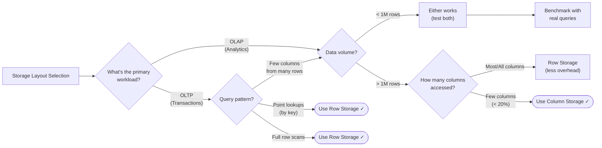

# Row vs Column Storage

> OLTP vs OLAP - Why your database layout fundamentally changes the game

---

## ELI5: Explain Like I'm 5

<div class="learner-section" markdown>

**Your task:** After implementing and testing both storage layouts, explain them simply.

**Prompts to guide you:**

1. **What is row-oriented storage in one sentence?**
    - Your answer: <span class="fill-in">[Fill in after implementation]</span>

2. **What is column-oriented storage in one sentence?**
    - Your answer: <span class="fill-in">[Fill in after implementation]</span>

3. **Real-world analogy for row storage:**
    - Example: "Row storage is like filing cabinets where each drawer contains one person's complete file..."
    - Your analogy: <span class="fill-in">[Fill in]</span>

4. **Real-world analogy for column storage:**
    - Example: "Column storage is like having separate filing cabinets for each attribute..."
    - Your analogy: <span class="fill-in">[Fill in]</span>

5. **When would you use row storage?**
    - Your answer: <span class="fill-in">[Fill in after implementation]</span>

6. **When would you use column storage?**
    - Your answer: <span class="fill-in">[Fill in after implementation]</span>

</div>

---

## Quick Quiz (Do BEFORE implementing)

<div class="learner-section" markdown>

**Your task:** Test your intuition without looking at code. Answer these, then verify after implementation.

### Performance Predictions

1. **Row storage: Fetch one complete user record**
    - Expected I/O operations: <span class="fill-in">[How many disk reads?]</span>
    - Verified after implementation: <span class="fill-in">[Actual]</span>

2. **Column storage: Fetch one complete user record**
    - Expected I/O operations: <span class="fill-in">[How many disk reads?]</span>
    - Verified: <span class="fill-in">[Actual]</span>

3. **Row storage: Calculate average of one column across 1M rows**
    - Expected I/O: <span class="fill-in">[How much data read?]</span>
    - Verified: <span class="fill-in">[Actual]</span>

4. **Column storage: Calculate average of one column across 1M rows**
    - Expected I/O: <span class="fill-in">[How much data read?]</span>
    - Verified: <span class="fill-in">[Actual]</span>

### Scenario Predictions

**Scenario 1:** E-commerce order processing (insert orders, fetch by order_id)

- **Best storage layout?** <span class="fill-in">[Row/Column?]</span>
- **Why?** <span class="fill-in">[Explain]</span>

**Scenario 2:** Business intelligence dashboard (revenue by month, top products)

- **Best storage layout?** <span class="fill-in">[Row/Column?]</span>
- **Why?** <span class="fill-in">[Explain]</span>

**Scenario 3:** Social media user profiles (lookup by user_id, update profile)

- **Best storage layout?** <span class="fill-in">[Row/Column?]</span>
- **Why?** <span class="fill-in">[Explain]</span>

</div>

---

## Before/After: Why This Pattern Matters

**Your task:** Understand the fundamental trade-off between row and column layouts.

### The Core Problem

You have a table with 1 million users:

```sql
CREATE TABLE users (
    id INT,
    name VARCHAR(100),
    email VARCHAR(100),
    age INT,
    city VARCHAR(50),
    salary INT
);
```

**Two different queries with radically different performance:**

```sql
-- Query 1: OLTP - Fetch one user by ID
SELECT * FROM users WHERE id = 12345;

-- Query 2: OLAP - Analytics across millions
SELECT AVG(salary), city FROM users GROUP BY city;
```

**The question:** How should you physically store this data on disk?

---

### Approach 1: Row-Oriented Storage

**Physical layout:** Store entire rows together

```
Disk layout (row-oriented):
┌──────────────────────────────────────────────┐
│ [1, "Alice", "a@x.com", 30, "NYC", 100000]   │  ← Row 1
│ [2, "Bob", "b@x.com", 25, "SF", 120000]      │  ← Row 2
│ [3, "Carol", "c@x.com", 35, "LA", 90000]     │  ← Row 3
│ ...                                           │
└──────────────────────────────────────────────┘
```

**Query 1 performance (fetch one user):**

```java
// Single disk read gets entire row
public User getUser(int id) {
    // 1 disk seek to row location
    // Read entire row (~200 bytes)
    return parseRow(diskRead(rowOffset(id)));  // O(1) - FAST! ✓
}
```

**Query 2 performance (aggregate salary by city):**

```java
// Must read ALL rows to get salary + city columns
public Map<String, Double> avgSalaryByCity() {
    for (int i = 0; i < 1_000_000; i++) {
        byte[] row = diskRead(rowOffset(i));  // Read entire row (~200 bytes)
        // But only need salary (4 bytes) + city (50 bytes)
        // Wasting 146 bytes per row!
    }
    // Total read: 1M * 200 bytes = 200MB
    // Actual needed: 1M * 54 bytes = 54MB
    // Waste: 73% of I/O! ✗
}
```

**Row storage characteristics:**

- ✅ Point lookups: Excellent (single disk read)
- ✅ Insert/Update full row: Excellent (single write)
- ❌ Column scans: Poor (read unnecessary data)
- ❌ Compression: Limited (mixed data types per row)

---

### Approach 2: Column-Oriented Storage

**Physical layout:** Store each column separately

```
Disk layout (column-oriented):
┌─────────────────┐
│ id:      [1,2,3,...]           │  ← All IDs together
│ name:    ["Alice","Bob",...]   │  ← All names together
│ email:   ["a@x","b@x",...]     │  ← All emails together
│ age:     [30,25,35,...]        │  ← All ages together
│ city:    ["NYC","SF","LA",...] │  ← All cities together
│ salary:  [100000,120000,...]   │  ← All salaries together
└─────────────────┘
```

**Query 1 performance (fetch one user):**

```java
// Must read from EACH column file
public User getUser(int id) {
    // 6 disk seeks (one per column)
    int userId = idColumn.read(id);
    String name = nameColumn.read(id);
    String email = emailColumn.read(id);
    int age = ageColumn.read(id);
    String city = cityColumn.read(id);
    int salary = salaryColumn.read(id);
    return new User(userId, name, email, age, city, salary);
    // 6 disk seeks - SLOW! ✗
}
```

**Query 2 performance (aggregate salary by city):**

```java
// Only read the columns we need!
public Map<String, Double> avgSalaryByCity() {
    int[] salaries = salaryColumn.readAll();  // 1M * 4 bytes = 4MB
    String[] cities = cityColumn.readAll();   // 1M * 50 bytes = 50MB

    // Total read: 54MB (only what we need!)
    // vs 200MB with row storage
    // 73% less I/O! ✓

    // Bonus: Columns compress MUCH better
    // salary: All integers, similar range
    // city: Many duplicates ("NYC", "SF", "LA"...)
    // With compression: 54MB → ~10MB! ✓✓
}
```

**Column storage characteristics:**

- ❌ Point lookups: Poor (must read from N columns)
- ❌ Insert/Update: Complex (update N separate files)
- ✅ Column scans: Excellent (only read needed columns)
- ✅ Compression: Excellent (similar data types)
- ✅ SIMD/Vectorization: Possible (homogeneous data)

---

## The Fundamental Trade-off

| Feature            | Row Storage             | Column Storage       |
|--------------------|-------------------------|----------------------|
| **Point Lookups**  | ⚡⚡⚡ (1 read)            | 🐌 (N reads)         |
| **Full Row Scans** | 🐌 (wasted I/O)         | 🐌 (N files)         |
| **Column Scans**   | 🐌 (wasted I/O)         | ⚡⚡⚡ (targeted)       |
| **Compression**    | ⚡ (limited)             | ⚡⚡⚡ (excellent)      |
| **Inserts**        | ⚡⚡⚡ (single write)      | 🐌 (N writes)        |
| **Updates**        | ⚡⚡ (single write)       | 🐌 (N writes)        |
| **Best For**       | **OLTP** (Transactions) | **OLAP** (Analytics) |

**Key insight:**

- **OLTP:** "Give me order #12345" → Need entire row → Use row storage
- **OLAP:** "Show revenue by category" → Need specific columns → Use column storage

---

## Core Implementation

### Part 1: Row-Oriented Storage

**Your task:** Implement a simple row-oriented storage engine.

```java
import java.util.*;

/**
 * Row-Oriented Storage: All columns for a row stored together
 *
 * Use case: OLTP - transactional workloads
 * Optimized for: Point lookups, full row access
 */
public class RowStore {

    // Each row stored as a complete unit
    private Map<Integer, Row> rows = new HashMap<>();

    static class Row {
        int id;
        String name;
        String email;
        int age;
        String city;
        int salary;

        Row(int id, String name, String email, int age, String city, int salary) {
            this.id = id;
            this.name = name;
            this.email = email;
            this.age = age;
            this.city = city;
            this.salary = salary;
        }
    }

    /**
     * Insert: O(1) - single write
     * All columns written together in one operation
     *
     * TODO: Implement insert
     */
    public void insert(Row row) {
        // TODO: Store entire row in map
        // In reality: Write entire row to one disk location
    }

    /**
     * Point lookup: O(1) - optimal!
     * Single disk read gets all columns
     *
     * TODO: Implement point lookup
     */
    public Row getById(int id) {
        // TODO: Retrieve row from map
        // In reality: One disk seek, read entire row
        return null;
    }

    /**
     * Column scan: O(N) - inefficient!
     * Must read entire rows even though we only need one column
     *
     * TODO: Implement column scan
     */
    public double avgSalary() {
        // TODO: Calculate average salary
        // Note: You're reading ALL columns just to get salary
        // This is the key inefficiency of row storage for analytics!

        return 0.0;
    }

    /**
     * Multi-column aggregation
     * Still reads full rows
     *
     * TODO: Implement aggregation by city
     */
    public Map<String, Double> avgSalaryByCity() {
        // TODO: Group salaries by city and calculate averages
        // Note: Still reading entire rows even though only using 2 columns

        return new HashMap<>();
    }
}
```

---

### Part 2: Column-Oriented Storage

**Your task:** Implement a simple column-oriented storage engine.

```java
import java.util.*;

/**
 * Column-Oriented Storage: Each column stored separately
 *
 * Use case: OLAP - analytical workloads
 * Optimized for: Column scans, aggregations
 */
public class ColumnStore {

    // Each column stored separately
    private List<Integer> idColumn = new ArrayList<>();
    private List<String> nameColumn = new ArrayList<>();
    private List<String> emailColumn = new ArrayList<>();
    private List<Integer> ageColumn = new ArrayList<>();
    private List<String> cityColumn = new ArrayList<>();
    private List<Integer> salaryColumn = new ArrayList<>();

    static class Row {
        int id;
        String name;
        String email;
        int age;
        String city;
        int salary;

        Row(int id, String name, String email, int age, String city, int salary) {
            this.id = id;
            this.name = name;
            this.email = email;
            this.age = age;
            this.city = city;
            this.salary = salary;
        }
    }

    /**
     * Insert: O(C) where C = number of columns - slower!
     * Must write to each column separately
     *
     * TODO: Implement insert
     */
    public void insert(Row row) {
        // TODO: Add each field to its corresponding column
        // Must write to 6 separate column lists
        // In reality: 6 separate disk writes - write amplification!
    }

    /**
     * Point lookup: O(C) - inefficient!
     * Must read from each column file
     *
     * TODO: Implement point lookup
     */
    public Row getById(int id) {
        // TODO: Find the index for this ID
        // TODO: Read from each column at that index
        // In reality: 6 disk seeks (one per column)

        return null;
    }

    /**
     * Column scan: O(N) - optimal!
     * Only read the column we need
     *
     * TODO: Implement column scan
     */
    public double avgSalary() {
        // TODO: Calculate average of salary column only
        // Key advantage: Ignore all other columns!
        // If 1M rows: Column store reads 4MB, Row store reads 200MB

        return 0.0;
    }

    /**
     * Multi-column aggregation - still efficient!
     * Only read the columns we need
     *
     * TODO: Implement aggregation by city
     */
    public Map<String, Double> avgSalaryByCity() {
        // TODO: Read only city and salary columns
        // TODO: Group by city and calculate averages
        // Key advantage: Only 2 columns read instead of all 6

        return new HashMap<>();
    }

    /**
     * Column pruning: Read only what's needed
     * This is the killer feature of column stores
     *
     * TODO: Implement selective column query
     */
    public List<Integer> getSalariesInCity(String targetCity) {
        // TODO: Filter city column and return matching salaries
        // Only read city and salary columns - ignore the other 4!

        return new ArrayList<>();
    }
}
```

---

### Part 3: Benchmark Comparison

**Your task:** Compare row vs column storage for different workloads.

```java
import java.util.*;

public class StorageLayoutBenchmark {

    public static void main(String[] args) {
        System.out.println("=== Row vs Column Storage Benchmark ===\n");

        benchmarkInserts();
        System.out.println();
        benchmarkPointLookups();
        System.out.println();
        benchmarkColumnScans();
        System.out.println();
        benchmarkAggregations();
    }

    static void benchmarkInserts() {
        System.out.println("--- Insert Performance ---");
        int numRows = 100000;

        // TODO: Benchmark row store inserts
        RowStore rowStore = new RowStore();
        long start = System.nanoTime();
        // TODO: Insert numRows rows into rowStore
        long rowTime = System.nanoTime() - start;

        // TODO: Benchmark column store inserts
        ColumnStore colStore = new ColumnStore();
        start = System.nanoTime();
        // TODO: Insert numRows rows into colStore
        long colTime = System.nanoTime() - start;

        System.out.printf("Row Store: %.2f ms (%.0f inserts/sec)%n",
            rowTime / 1e6, numRows / (rowTime / 1e9));
        System.out.printf("Column Store: %.2f ms (%.0f inserts/sec)%n",
            colTime / 1e6, numRows / (colTime / 1e9));
        System.out.printf("Row store is %.2fx faster for inserts%n",
            (double) colTime / rowTime);
    }

    static void benchmarkPointLookups() {
        System.out.println("--- Point Lookup Performance ---");
        int numRows = 100000;
        int numLookups = 1000;

        // TODO: Setup - populate both stores
        RowStore rowStore = new RowStore();
        ColumnStore colStore = new ColumnStore();
        // TODO: Insert numRows into both stores

        // TODO: Benchmark row store lookups
        Random rand = new Random(42);
        long start = System.nanoTime();
        // TODO: Perform numLookups random getById calls on rowStore
        long rowTime = System.nanoTime() - start;

        // TODO: Benchmark column store lookups
        rand = new Random(42);
        start = System.nanoTime();
        // TODO: Perform numLookups random getById calls on colStore
        long colTime = System.nanoTime() - start;

        System.out.printf("Row Store: %.2f ms (%.0f lookups/sec)%n",
            rowTime / 1e6, numLookups / (rowTime / 1e9));
        System.out.printf("Column Store: %.2f ms (%.0f lookups/sec)%n",
            colTime / 1e6, numLookups / (colTime / 1e9));
        System.out.printf("Row store is %.2fx faster for point lookups%n",
            (double) colTime / rowTime);
    }

    static void benchmarkColumnScans() {
        System.out.println("--- Column Scan Performance (avg salary) ---");
        int numRows = 100000;

        // TODO: Setup - populate both stores
        RowStore rowStore = new RowStore();
        ColumnStore colStore = new ColumnStore();
        // TODO: Insert numRows into both stores

        // TODO: Benchmark row store column scan
        long start = System.nanoTime();
        double rowAvg = 0.0; // TODO: Call rowStore.avgSalary()
        long rowTime = System.nanoTime() - start;

        // TODO: Benchmark column store column scan
        start = System.nanoTime();
        double colAvg = 0.0; // TODO: Call colStore.avgSalary()
        long colTime = System.nanoTime() - start;

        System.out.printf("Row Store: %.2f ms (result: %.2f)%n",
            rowTime / 1e6, rowAvg);
        System.out.printf("Column Store: %.2f ms (result: %.2f)%n",
            colTime / 1e6, colAvg);
        System.out.printf("Column store is %.2fx faster for column scans%n",
            (double) rowTime / colTime);
    }

    static void benchmarkAggregations() {
        System.out.println("--- Aggregation Performance (avg salary by city) ---");
        int numRows = 100000;

        // TODO: Setup - populate both stores
        RowStore rowStore = new RowStore();
        ColumnStore colStore = new ColumnStore();
        // TODO: Insert numRows into both stores

        // TODO: Benchmark row store aggregation
        long start = System.nanoTime();
        Map<String, Double> rowResult = null; // TODO: Call rowStore.avgSalaryByCity()
        long rowTime = System.nanoTime() - start;

        // TODO: Benchmark column store aggregation
        start = System.nanoTime();
        Map<String, Double> colResult = null; // TODO: Call colStore.avgSalaryByCity()
        long colTime = System.nanoTime() - start;

        System.out.printf("Row Store: %.2f ms%n", rowTime / 1e6);
        System.out.printf("Column Store: %.2f ms%n", colTime / 1e6);
        System.out.printf("Column store is %.2fx faster for aggregations%n",
            (double) rowTime / colTime);
    }
}
```

**Must complete:**

- [ ] Implement RowStore insert, getById, avgSalary, avgSalaryByCity
- [ ] Implement ColumnStore insert, getById, avgSalary, avgSalaryByCity
- [ ] Run benchmarks and record results
- [ ] Understand WHY each performs better for different workloads

**Your benchmark results:**

<table class="benchmark-table">
<thead>
  <tr>
    <th>Operation</th>
    <th>Row Store</th>
    <th>Column Store</th>
    <th>Winner</th>
  </tr>
</thead>
<tbody>
  <tr>
    <td>Inserts (100k rows)</td>
    <td class="blank">___ ms</td>
    <td class="blank">___ ms</td>
    <td class="blank">___</td>
  </tr>
  <tr>
    <td>Point Lookups (1k)</td>
    <td class="blank">___ ms</td>
    <td class="blank">___ ms</td>
    <td class="blank">___</td>
  </tr>
  <tr>
    <td>Column Scan (avg salary)</td>
    <td class="blank">___ ms</td>
    <td class="blank">___ ms</td>
    <td class="blank">___</td>
  </tr>
  <tr>
    <td>Aggregation (by city)</td>
    <td class="blank">___ ms</td>
    <td class="blank">___ ms</td>
    <td class="blank">___</td>
  </tr>
</tbody>
</table>

<div class="learner-section" markdown>

**Key insight:** <span class="fill-in">[Why does column storage win for analytics?]</span>

</div>

---

## Compression: The Hidden Superpower of Column Stores

**Why column stores compress better:**

```
Row-oriented (mixed data types per row):
┌────────────────────────────────────────────┐
│ [1, "Alice", "a@x.com", 30, "NYC", 100000] │
│ [2, "Bob", "b@x.com", 25, "SF", 120000]    │
│ [3, "Carol", "c@x.com", 35, "LA", 90000]   │
└────────────────────────────────────────────┘
Hard to compress: Different data types, no patterns

Column-oriented (homogeneous data):
┌────────────────────┐
│ id:     [1,2,3,4,5,6,7,8,9,10,...]        │ ← Sequential integers
│ city:   ["NYC","NYC","SF","SF","LA",...]  │ ← Many duplicates
│ salary: [100000,120000,90000,95000,...]   │ ← Similar ranges
└────────────────────┘
Easy to compress: Patterns, repetition, similar types
```

### Compression Techniques for Columns

**1. Run-Length Encoding (RLE)** - Great for sorted/repeated values

```
Before: ["NYC", "NYC", "NYC", "SF", "SF", "LA", "LA", "LA", "LA"]
After:  [(NYC, 3), (SF, 2), (LA, 4)]

Space saved: 9 strings → 3 tuples = 67% reduction
```

**2. Dictionary Encoding** - Great for low-cardinality columns

```
Before: ["NYC", "SF", "NYC", "LA", "NYC", "SF"]
Dictionary: {0: "NYC", 1: "SF", 2: "LA"}
After: [0, 1, 0, 2, 0, 1]

Space saved: 6 strings (18 bytes) → 6 integers (24 bits) = 87% reduction
```

**3. Delta Encoding** - Great for sequential/timestamp columns

```
Before: [1000, 1001, 1002, 1003, 1004, 1005]
Base: 1000
After: [0, 1, 1, 1, 1, 1]  (store differences)

Space saved: 6 ints (24 bytes) → 1 int + 5 bytes (9 bytes) = 62% reduction
```

**Real-world impact:**

```
1 billion rows, 10 columns:

Row store (uncompressed):
  Row size: 200 bytes
  Total: 200 GB

Column store (compressed):
  IDs: 4 GB → 500 MB (delta encoding)
  Names: 100 GB → 10 GB (dictionary encoding)
  Cities: 50 GB → 500 MB (RLE + dictionary)
  Salaries: 4 GB → 1 GB (delta encoding)
  ...
  Total: ~50 GB (75% reduction!)
```

---

## Decision Framework

**Your task:** Build decision trees for when to use each storage layout.

### Question 1: OLTP or OLAP Workload?

Answer after implementing and benchmarking:

- **My workload type:** <span class="fill-in">[Fill in]</span>
- **Why does this matter?** <span class="fill-in">[Fill in]</span>
- **Performance difference I observed:** <span class="fill-in">[Fill in]</span>

### Question 2: Query Patterns

Answer:

- **Do I need full rows?** <span class="fill-in">[Yes/No - when?]</span>
- **Do I need selective columns?** <span class="fill-in">[Yes/No - how many?]</span>
- **Which is faster for my queries?** <span class="fill-in">[Fill in after testing]</span>

### Question 3: Data Volume and Compression

Answer:

- **Table size:** <span class="fill-in">[Small/Medium/Large - how many rows?]</span>
- **Column cardinality:** <span class="fill-in">[High/Low - does it matter?]</span>
- **Compression benefits observed:** <span class="fill-in">[Fill in after implementation]</span>

### Your Decision Tree

Build this after understanding trade-offs:



---

## Review Checklist

Before moving to the next topic:

- [ ] **Implementation**
    - [ ] RowStore works correctly (insert, point lookup, scans)
    - [ ] ColumnStore works correctly (insert, point lookup, scans)
    - [ ] Benchmarks completed and results recorded

- [ ] **Understanding**
    - [ ] Can explain why row storage is faster for point lookups
    - [ ] Can explain why column storage is faster for aggregations
    - [ ] Understand compression advantages of column storage

- [ ] **Decision Making**
    - [ ] Can identify OLTP vs OLAP workloads
    - [ ] Know when to use each storage layout
    - [ ] Understand the trade-offs

---

### Mastery Certification

**I certify that I can:**

- [ ] Implement row-oriented storage (insert, point lookup, column scan)
- [ ] Implement column-oriented storage (insert, point lookup, column scan)
- [ ] Explain why row storage is faster for point lookups
- [ ] Explain why column storage is faster for aggregations
- [ ] Understand compression advantages of column storage
- [ ] Identify OLTP vs OLAP workloads from requirements
- [ ] Choose appropriate storage layout for a given workload
- [ ] Explain the fundamental read/write trade-offs
- [ ] Understand when to use each storage representation
- [ ] Benchmark and analyze performance differences
- [ ] Debug storage layout issues
- [ ] Explain these concepts in a system design interview

# APPENDIX

## Real world technologies

### When to Use Row Storage

**Use row storage when:**

- ✅ **Point lookups by key** ("Get user #12345")
- ✅ **Insert/update full records** (OLTP transactions)
- ✅ **Need full row access** (most queries touch all columns)
- ✅ **Small table scans** (< 100k rows)

**Real-world examples:**

- E-commerce order processing → MySQL InnoDB, PostgreSQL
- User authentication/sessions → PostgreSQL, MongoDB
- Banking transactions → Oracle, SQL Server
- Social media user profiles → MySQL, MongoDB

### When to Use Column Storage

**Use column storage when:**

- ✅ **Aggregate queries** ("AVG salary by department")
- ✅ **Selective column access** (only need 2-3 out of 50 columns)
- ✅ **Large table scans** (millions+ rows)
- ✅ **Read-heavy analytics** (dashboards, reports)
- ✅ **Time-series data** (metrics, logs, events)

**Real-world examples:**

- Business intelligence dashboards → ClickHouse, Redshift
- Data warehouse analytics → Snowflake, BigQuery
- Log analysis → ClickHouse, Druid
- Metrics/monitoring → Prometheus, InfluxDB
- Machine learning feature stores → Parquet files

### Database Examples

**Row-Oriented:**

- **MySQL InnoDB** - OLTP transactions
- **PostgreSQL** - General-purpose OLTP
- **MongoDB** - Document store (row-like)
- **Cassandra** - Wide column store (row-oriented within partition)

**Column-Oriented:**

- **Apache Parquet** - File format for Hadoop/Spark
- **ClickHouse** - Real-time analytics
- **Amazon Redshift** - Data warehouse
- **Google BigQuery** - Serverless data warehouse
- **Apache Druid** - Real-time analytics
- **Snowflake** - Cloud data warehouse

**Hybrid Approaches:**

- **Apache Kudu** - Supports both row and column scans
- **InfluxDB** - Time-series with column-like storage
- **TimescaleDB** - PostgreSQL extension with columnar compression
