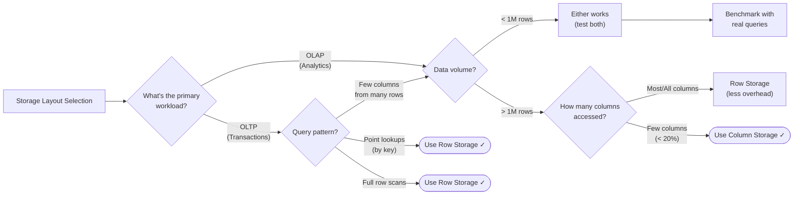

# Row vs Column Storage

> OLTP vs OLAP - Why your database layout fundamentally changes the game

---

## Learning Objectives

By the end of this topic you will be able to:

- Explain why row-oriented and column-oriented layouts produce opposite performance profiles for the same data
- Implement a row store and a column store with insert, point lookup, and aggregation operations
- Benchmark and interpret performance differences across insert, lookup, and column-scan workloads
- Identify whether a given query benefits from row or column storage by analysing its access pattern
- Choose the appropriate storage layout for OLTP vs OLAP workloads based on measured trade-offs
- Explain how column stores achieve compression ratios that row stores cannot, and why that matters at scale

---

## ELI5: Explain Like I'm 5

<div class="learner-section" markdown>

**Your task:** After implementing and testing both storage layouts, explain them simply.

**Prompts to guide you:**

1. **What is row-oriented storage in one sentence?**
    - Row storage is a layout where <span class="fill-in">[each record's fields are stored ___ on disk, so reading one record requires ___ disk operation(s)]</span>

2. **What is column-oriented storage in one sentence?**
    - Column storage is a layout where <span class="fill-in">[all values for a single field are stored ___, so analytics queries only need to read ___]</span>

3. **Real-world analogy for row storage:**
    - Example: "Row storage is like filing cabinets where each drawer contains one person's complete file..."
    - Think about how a HR department keeps employee folders — everything about one person in one place.
    - Your analogy: <span class="fill-in">[Fill in]</span>

4. **Real-world analogy for column storage:**
    - Example: "Column storage is like having separate filing cabinets for each attribute..."
    - Think about how a payroll department might keep one binder of just salaries, another of just departments.
    - Your analogy: <span class="fill-in">[Fill in]</span>

5. **When would you use row storage?**
    - Row storage is preferred when ___ because it avoids the cost of <span class="fill-in">[___ separate reads just to reconstruct one ___]</span>

6. **When would you use column storage?**
    - Column storage is preferred when ___ because it avoids the cost of <span class="fill-in">[reading ___ bytes of unneeded columns just to aggregate one ___]</span>

</div>

---

## Quick Quiz (Do BEFORE implementing)

!!! tip "How to use this section"
    Complete your predictions now, before reading further. You will revisit and verify each answer after running the benchmark.

<div class="learner-section" markdown>

**Your task:** Test your intuition without looking at code. Answer these, then verify after implementation.

### Performance Predictions

1. **Row storage: Fetch one complete user record**
    - Expected I/O operations: <span class="fill-in">[How many disk reads?]</span>
    - Verified after implementation: <span class="fill-in">[Actual]</span>

2. **Column storage: Fetch one complete user record**
    - Expected I/O operations: <span class="fill-in">[How many disk reads?]</span>
    - Verified: <span class="fill-in">[Actual]</span>

3. **Row storage: Calculate average of one column across 1M rows**
    - Expected I/O: <span class="fill-in">[How much data read?]</span>
    - Verified: <span class="fill-in">[Actual]</span>

4. **Column storage: Calculate average of one column across 1M rows**
    - Expected I/O: <span class="fill-in">[How much data read?]</span>
    - Verified: <span class="fill-in">[Actual]</span>

### Scenario Predictions

**Scenario 1:** E-commerce order processing (insert orders, fetch by order_id)

- **Best storage layout?** <span class="fill-in">[Row/Column?]</span>
- **Why?** <span class="fill-in">[Explain]</span>

**Scenario 2:** Business intelligence dashboard (revenue by month, top products)

- **Best storage layout?** <span class="fill-in">[Row/Column?]</span>
- **Why?** <span class="fill-in">[Explain]</span>

**Scenario 3:** Social media user profiles (lookup by user_id, update profile)

- **Best storage layout?** <span class="fill-in">[Row/Column?]</span>
- **Why?** <span class="fill-in">[Explain]</span>

</div>

---

## Core Implementation

### Part 1: Row-Oriented Storage

**Your task:** Implement a simple row-oriented storage engine.

```java
import java.util.*;

/**
 * Row-Oriented Storage: All columns for a row stored together
 *
 * Use case: OLTP - transactional workloads
 * Optimized for: Point lookups, full row access
 */
public class RowStore {

    // Each row stored as a complete unit
    private Map<Integer, Row> rows = new HashMap<>();

    static class Row {
        int id;
        String name;
        String email;
        int age;
        String city;
        int salary;

        Row(int id, String name, String email, int age, String city, int salary) {
            this.id = id;
            this.name = name;
            this.email = email;
            this.age = age;
            this.city = city;
            this.salary = salary;
        }
    }

    /**
     * Insert: O(1) - single write
     * All columns written together in one operation
     *
     * TODO: Implement insert
     */
    public void insert(Row row) {
        // TODO: Store entire row in map
        // In reality: Write entire row to one disk location
    }

    /**
     * Point lookup: O(1) - optimal!
     * Single disk read gets all columns
     *
     * TODO: Implement point lookup
     */
    public Row getById(int id) {
        // TODO: Retrieve row from map
        // In reality: One disk seek, read entire row
        return null;
    }

    /**
     * Column scan: O(N) - inefficient!
     * Must read entire rows even though we only need one column
     *
     * TODO: Implement column scan
     */
    public double avgSalary() {
        // TODO: Calculate average salary
        // Note: You're reading ALL columns just to get salary
        // This is the key inefficiency of row storage for analytics!

        return 0.0;
    }

    /**
     * Multi-column aggregation
     * Still reads full rows
     *
     * TODO: Implement aggregation by city
     */
    public Map<String, Double> avgSalaryByCity() {
        // TODO: Group salaries by city and calculate averages
        // Note: Still reading entire rows even though only using 2 columns

        return new HashMap<>();
    }
}
```

!!! warning "Debugging Challenge — Column Scan Wastes Reads"

    The `avgSalary()` implementation below compiles and runs, but contains a subtle correctness bug when the row set is empty.

    ```java
    public double avgSalary() {
        int total = 0;
        for (Row row : rows.values()) {
            total += row.salary;
        }
        return total / rows.size();
    }
    ```

    Consider what happens when `rows` is empty.

    ??? success "Answer"

        **Bug:** Integer division by zero when the map is empty. `rows.size()` returns 0, causing `ArithmeticException`.

        **Fix:** Guard against the empty case and use floating-point division:
        ```java
        if (rows.isEmpty()) return 0.0;
        double total = 0;
        for (Row row : rows.values()) {
            total += row.salary;
        }
        return total / rows.size();
        ```

---

### Part 2: Column-Oriented Storage

**Your task:** Implement a simple column-oriented storage engine.

```java
import java.util.*;

/**
 * Column-Oriented Storage: Each column stored separately
 *
 * Use case: OLAP - analytical workloads
 * Optimized for: Column scans, aggregations
 */
public class ColumnStore {

    // Each column stored separately
    private List<Integer> idColumn = new ArrayList<>();
    private List<String> nameColumn = new ArrayList<>();
    private List<String> emailColumn = new ArrayList<>();
    private List<Integer> ageColumn = new ArrayList<>();
    private List<String> cityColumn = new ArrayList<>();
    private List<Integer> salaryColumn = new ArrayList<>();

    static class Row {
        int id;
        String name;
        String email;
        int age;
        String city;
        int salary;

        Row(int id, String name, String email, int age, String city, int salary) {
            this.id = id;
            this.name = name;
            this.email = email;
            this.age = age;
            this.city = city;
            this.salary = salary;
        }
    }

    /**
     * Insert: O(C) where C = number of columns - slower!
     * Must write to each column separately
     *
     * TODO: Implement insert
     */
    public void insert(Row row) {
        // TODO: Add each field to its corresponding column
        // Must write to 6 separate column lists
        // In reality: 6 separate disk writes - write amplification!
    }

    /**
     * Point lookup: O(C) - inefficient!
     * Must read from each column file
     *
     * TODO: Implement point lookup
     */
    public Row getById(int id) {
        // TODO: Find the index for this ID
        // TODO: Read from each column at that index
        // In reality: 6 disk seeks (one per column)

        return null;
    }

    /**
     * Column scan: O(N) - optimal!
     * Only read the column we need
     *
     * TODO: Implement column scan
     */
    public double avgSalary() {
        // TODO: Calculate average of salary column only
        // Key advantage: Ignore all other columns!
        // If 1M rows: Column store reads 4MB, Row store reads 200MB

        return 0.0;
    }

    /**
     * Multi-column aggregation - still efficient!
     * Only read the columns we need
     *
     * TODO: Implement aggregation by city
     */
    public Map<String, Double> avgSalaryByCity() {
        // TODO: Read only city and salary columns
        // TODO: Group by city and calculate averages
        // Key advantage: Only 2 columns read instead of all 6

        return new HashMap<>();
    }

    /**
     * Column pruning: Read only what's needed
     * This is the killer feature of column stores
     *
     * TODO: Implement selective column query
     */
    public List<Integer> getSalariesInCity(String targetCity) {
        // TODO: Filter city column and return matching salaries
        // Only read city and salary columns - ignore the other 4!

        return new ArrayList<>();
    }
}
```

---

### Part 3: Benchmark Comparison

**Your task:** Compare row vs column storage for different workloads.

```java
import java.util.*;

public class StorageLayoutBenchmark {

    public static void main(String[] args) {
        System.out.println("=== Row vs Column Storage Benchmark ===\n");

        benchmarkInserts();
        System.out.println();
        benchmarkPointLookups();
        System.out.println();
        benchmarkColumnScans();
        System.out.println();
        benchmarkAggregations();
    }

    static void benchmarkInserts() {
        System.out.println("--- Insert Performance ---");
        int numRows = 100000;

        // TODO: Benchmark row store inserts
        RowStore rowStore = new RowStore();
        long start = System.nanoTime();
        // TODO: Insert numRows rows into rowStore
        long rowTime = System.nanoTime() - start;

        // TODO: Benchmark column store inserts
        ColumnStore colStore = new ColumnStore();
        start = System.nanoTime();
        // TODO: Insert numRows rows into colStore
        long colTime = System.nanoTime() - start;

        System.out.printf("Row Store: %.2f ms (%.0f inserts/sec)%n",
            rowTime / 1e6, numRows / (rowTime / 1e9));
        System.out.printf("Column Store: %.2f ms (%.0f inserts/sec)%n",
            colTime / 1e6, numRows / (colTime / 1e9));
        System.out.printf("Row store is %.2fx faster for inserts%n",
            (double) colTime / rowTime);
    }

    static void benchmarkPointLookups() {
        System.out.println("--- Point Lookup Performance ---");
        int numRows = 100000;
        int numLookups = 1000;

        // TODO: Setup - populate both stores
        RowStore rowStore = new RowStore();
        ColumnStore colStore = new ColumnStore();
        // TODO: Insert numRows into both stores

        // TODO: Benchmark row store lookups
        Random rand = new Random(42);
        long start = System.nanoTime();
        // TODO: Perform numLookups random getById calls on rowStore
        long rowTime = System.nanoTime() - start;

        // TODO: Benchmark column store lookups
        rand = new Random(42);
        start = System.nanoTime();
        // TODO: Perform numLookups random getById calls on colStore
        long colTime = System.nanoTime() - start;

        System.out.printf("Row Store: %.2f ms (%.0f lookups/sec)%n",
            rowTime / 1e6, numLookups / (rowTime / 1e9));
        System.out.printf("Column Store: %.2f ms (%.0f lookups/sec)%n",
            colTime / 1e6, numLookups / (colTime / 1e9));
        System.out.printf("Row store is %.2fx faster for point lookups%n",
            (double) colTime / rowTime);
    }

    static void benchmarkColumnScans() {
        System.out.println("--- Column Scan Performance (avg salary) ---");
        int numRows = 100000;

        // TODO: Setup - populate both stores
        RowStore rowStore = new RowStore();
        ColumnStore colStore = new ColumnStore();
        // TODO: Insert numRows into both stores

        // TODO: Benchmark row store column scan
        long start = System.nanoTime();
        double rowAvg = 0.0; // TODO: Call rowStore.avgSalary()
        long rowTime = System.nanoTime() - start;

        // TODO: Benchmark column store column scan
        start = System.nanoTime();
        double colAvg = 0.0; // TODO: Call colStore.avgSalary()
        long colTime = System.nanoTime() - start;

        System.out.printf("Row Store: %.2f ms (result: %.2f)%n",
            rowTime / 1e6, rowAvg);
        System.out.printf("Column Store: %.2f ms (result: %.2f)%n",
            colTime / 1e6, colAvg);
        System.out.printf("Column store is %.2fx faster for column scans%n",
            (double) rowTime / colTime);
    }

    static void benchmarkAggregations() {
        System.out.println("--- Aggregation Performance (avg salary by city) ---");
        int numRows = 100000;

        // TODO: Setup - populate both stores
        RowStore rowStore = new RowStore();
        ColumnStore colStore = new ColumnStore();
        // TODO: Insert numRows into both stores

        // TODO: Benchmark row store aggregation
        long start = System.nanoTime();
        Map<String, Double> rowResult = null; // TODO: Call rowStore.avgSalaryByCity()
        long rowTime = System.nanoTime() - start;

        // TODO: Benchmark column store aggregation
        start = System.nanoTime();
        Map<String, Double> colResult = null; // TODO: Call colStore.avgSalaryByCity()
        long colTime = System.nanoTime() - start;

        System.out.printf("Row Store: %.2f ms%n", rowTime / 1e6);
        System.out.printf("Column Store: %.2f ms%n", colTime / 1e6);
        System.out.printf("Column store is %.2fx faster for aggregations%n",
            (double) rowTime / colTime);
    }
}
```

**Must complete:**

- [ ] Implement RowStore insert, getById, avgSalary, avgSalaryByCity
- [ ] Implement ColumnStore insert, getById, avgSalary, avgSalaryByCity
- [ ] Run benchmarks and record results
- [ ] Understand WHY each performs better for different workloads

**Your benchmark results:**

<table class="benchmark-table">
<thead>
  <tr>
    <th>Operation</th>
    <th>Row Store</th>
    <th>Column Store</th>
    <th>Winner</th>
  </tr>
</thead>
<tbody>
  <tr>
    <td>Inserts (100k rows)</td>
    <td class="blank">___ ms</td>
    <td class="blank">___ ms</td>
    <td class="blank">___</td>
  </tr>
  <tr>
    <td>Point Lookups (1k)</td>
    <td class="blank">___ ms</td>
    <td class="blank">___ ms</td>
    <td class="blank">___</td>
  </tr>
  <tr>
    <td>Column Scan (avg salary)</td>
    <td class="blank">___ ms</td>
    <td class="blank">___ ms</td>
    <td class="blank">___</td>
  </tr>
  <tr>
    <td>Aggregation (by city)</td>
    <td class="blank">___ ms</td>
    <td class="blank">___ ms</td>
    <td class="blank">___</td>
  </tr>
</tbody>
</table>

<div class="learner-section" markdown>

**Key insight:** <span class="fill-in">[Why does column storage win for analytics?]</span>

</div>

!!! info "Loop back"
    Return to the Quick Quiz now and fill in your verified answers.

---

## Before/After: Why This Pattern Matters

**Your task:** Understand the fundamental trade-off between row and column layouts.

### The Core Problem

You have a table with 1 million users:

```sql
CREATE TABLE users (
    id INT,
    name VARCHAR(100),
    email VARCHAR(100),
    age INT,
    city VARCHAR(50),
    salary INT
);
```

**Two different queries with radically different performance:**

```sql

-- Query 1: OLTP - Fetch one user by ID
SELECT * FROM users WHERE id = 12345;

-- Query 2: OLAP - Analytics across millions
SELECT AVG(salary), city FROM users GROUP BY city;
```

**The question:** How should you physically store this data on disk?

---

### Approach 1: Row-Oriented Storage

**Physical layout:** Store entire rows together

```
Disk layout (row-oriented):
┌──────────────────────────────────────────────┐
│ [1, "Alice", "a@x.com", 30, "NYC", 100000]   │  ← Row 1
│ [2, "Bob", "b@x.com", 25, "SF", 120000]      │  ← Row 2
│ [3, "Carol", "c@x.com", 35, "LA", 90000]     │  ← Row 3
│ ...                                           │
└──────────────────────────────────────────────┘
```

**Query 1 performance (fetch one user):**

```java
// Single disk read gets entire row
public User getUser(int id) {
    // 1 disk seek to row location
    // Read entire row (~200 bytes)
    return parseRow(diskRead(rowOffset(id)));  // O(1) - FAST! ✓
}
```

**Query 2 performance (aggregate salary by city):**

```java
// Must read ALL rows to get salary + city columns
public Map<String, Double> avgSalaryByCity() {
    for (int i = 0; i < 1_000_000; i++) {
        byte[] row = diskRead(rowOffset(i));  // Read entire row (~200 bytes)
        // But only need salary (4 bytes) + city (50 bytes)
        // Wasting 146 bytes per row!
    }
    // Total read: 1M * 200 bytes = 200MB
    // Actual needed: 1M * 54 bytes = 54MB
    // Waste: 73% of I/O! ✗
}
```

**Row storage characteristics:**

- ✅ Point lookups: Excellent (single disk read)
- ✅ Insert/Update full row: Excellent (single write)
- ❌ Column scans: Poor (read unnecessary data)
- ❌ Compression: Limited (mixed data types per row)

---

### Approach 2: Column-Oriented Storage

**Physical layout:** Store each column separately

```
Disk layout (column-oriented):
┌─────────────────┐
│ id:      [1,2,3,...]           │  ← All IDs together
│ name:    ["Alice","Bob",...]   │  ← All names together
│ email:   ["a@x","b@x",...]     │  ← All emails together
│ age:     [30,25,35,...]        │  ← All ages together
│ city:    ["NYC","SF","LA",...] │  ← All cities together
│ salary:  [100000,120000,...]   │  ← All salaries together
└─────────────────┘
```

**Query 1 performance (fetch one user):**

```java
// Must read from EACH column file
public User getUser(int id) {
    // 6 disk seeks (one per column)
    int userId = idColumn.read(id);
    String name = nameColumn.read(id);
    String email = emailColumn.read(id);
    int age = ageColumn.read(id);
    String city = cityColumn.read(id);
    int salary = salaryColumn.read(id);
    return new User(userId, name, email, age, city, salary);
    // 6 disk seeks - SLOW! ✗
}
```

**Query 2 performance (aggregate salary by city):**

```java
// Only read the columns we need!
public Map<String, Double> avgSalaryByCity() {
    int[] salaries = salaryColumn.readAll();  // 1M * 4 bytes = 4MB
    String[] cities = cityColumn.readAll();   // 1M * 50 bytes = 50MB

    // Total read: 54MB (only what we need!)
    // vs 200MB with row storage
    // 73% less I/O! ✓

    // Bonus: Columns compress MUCH better
    // salary: All integers, similar range
    // city: Many duplicates ("NYC", "SF", "LA"...)
    // With compression: 54MB → ~10MB! ✓✓
}
```

**Column storage characteristics:**

- ❌ Point lookups: Poor (must read from N columns)
- ❌ Insert/Update: Complex (update N separate files)
- ✅ Column scans: Excellent (only read needed columns)
- ✅ Compression: Excellent (similar data types)
- ✅ SIMD/Vectorization: Possible (homogeneous data)

---

## The Fundamental Trade-off

| Feature            | Row Storage             | Column Storage       |
|--------------------|-------------------------|----------------------|
| **Point Lookups**  | ⚡⚡⚡ (1 read)            | 🐌 (N reads)         |
| **Full Row Scans** | 🐌 (wasted I/O)         | 🐌 (N files)         |
| **Column Scans**   | 🐌 (wasted I/O)         | ⚡⚡⚡ (targeted)       |
| **Compression**    | ⚡ (limited)             | ⚡⚡⚡ (excellent)      |
| **Inserts**        | ⚡⚡⚡ (single write)      | 🐌 (N writes)        |
| **Updates**        | ⚡⚡ (single write)       | 🐌 (N writes)        |
| **Best For**       | **OLTP** (Transactions) | **OLAP** (Analytics) |

!!! note "Key insight"
    - **OLTP:** "Give me order #12345" → Need entire row → Use row storage
    - **OLAP:** "Show revenue by category" → Need specific columns → Use column storage

---

## Compression: The Hidden Superpower of Column Stores

**Why column stores compress better:**

```
Row-oriented (mixed data types per row):
┌────────────────────────────────────────────┐
│ [1, "Alice", "a@x.com", 30, "NYC", 100000] │
│ [2, "Bob", "b@x.com", 25, "SF", 120000]    │
│ [3, "Carol", "c@x.com", 35, "LA", 90000]   │
└────────────────────────────────────────────┘
Hard to compress: Different data types, no patterns

Column-oriented (homogeneous data):
┌────────────────────┐
│ id:     [1,2,3,4,5,6,7,8,9,10,...]        │ ← Sequential integers
│ city:   ["NYC","NYC","SF","SF","LA",...]  │ ← Many duplicates
│ salary: [100000,120000,90000,95000,...]   │ ← Similar ranges
└────────────────────┘
Easy to compress: Patterns, repetition, similar types
```

### Compression Techniques for Columns

**1. Run-Length Encoding (RLE)** - Great for sorted/repeated values

```
Before: ["NYC", "NYC", "NYC", "SF", "SF", "LA", "LA", "LA", "LA"]
After:  [(NYC, 3), (SF, 2), (LA, 4)]

Space saved: 9 strings → 3 tuples = 67% reduction
```

**2. Dictionary Encoding** - Great for low-cardinality columns

```
Before: ["NYC", "SF", "NYC", "LA", "NYC", "SF"]
Dictionary: {0: "NYC", 1: "SF", 2: "LA"}
After: [0, 1, 0, 2, 0, 1]

Space saved: 6 strings (18 bytes) → 6 integers (24 bits) = 87% reduction
```

**3. Delta Encoding** - Great for sequential/timestamp columns

```
Before: [1000, 1001, 1002, 1003, 1004, 1005]
Base: 1000
After: [0, 1, 1, 1, 1, 1]  (store differences)

Space saved: 6 ints (24 bytes) → 1 int + 5 bytes (9 bytes) = 62% reduction
```

!!! tip "Real-world compression impact"
    1 billion rows, 10 columns with row storage (uncompressed) ≈ 200 GB. The same dataset in a column store with dictionary and delta encoding typically compresses to ~50 GB — a 75% reduction that directly translates to cheaper storage and faster network transfers.

---

## Case Studies: Row vs. Column Storage in the Wild

### PostgreSQL & MySQL: The Row-Oriented Champions

- **Pattern:** Row-Oriented Storage.
- **How it works:** In databases like PostgreSQL and MySQL (with InnoDB), all the values for a single row (`id`, `name`,
  `email`, `city`, `salary`) are stored contiguously on disk.
- **Use Case:** This is ideal for **OLTP (Online Transaction Processing)** workloads. When you query
  `SELECT * FROM users WHERE id = 123`, the database performs a single read to fetch the entire user record, which is
  highly efficient. Creating or updating a user is also a single write operation.
- **Key Takeaway:** For applications where you primarily work with entire records at a time (e.g., e-commerce backends,
  content management systems, user account services), row-oriented storage provides the best performance for read,
  write, and update operations.

### Amazon Redshift & Google BigQuery: Columnar for Analytics

- **Pattern:** Column-Oriented Storage.
- **How it works:** Data warehouses like Redshift, BigQuery, and Snowflake store data in columns. All `user_id` values
  are stored together, all `city` values are stored together, and so on.
- **Use Case:** This is built for **OLAP (Online Analytical Processing)**. When an analyst runs a query like
  `SELECT city, AVG(salary) FROM users GROUP BY city`, the database only needs to read the `city` and `salary` columns.
  It completely ignores the `id`, `name`, and `email` columns, drastically reducing the amount of data read from disk.
- **Key Takeaway:** Columnar storage provides orders-of-magnitude performance improvements for analytical queries that
  aggregate over a small subset of columns in a large dataset. The high compression ratios achieved also lead to
  significant cost savings.

### ClickHouse: High-Performance Real-Time Analytics

- **Pattern:** Column-Oriented Storage.
- **How it works:** ClickHouse is an open-source columnar database designed for extreme speed on analytical queries. It
  not only uses columnar storage but also processes data in vectors using a vectorized query execution engine to
  maximize CPU efficiency.
- **Key Takeaway:** For use cases like real-time dashboards, log analysis, and telemetry monitoring, where you need to
  slice and dice massive datasets interactively, a performance-focused columnar database like ClickHouse is the optimal
  choice. It demonstrates that the benefits of columnar storage go beyond just I/O reduction to include computational
  efficiency.

---

## Common Misconceptions

!!! warning "Column stores are always better for analytics"
    Column stores win for queries that touch a small fraction of columns. If your analytics query selects nearly every column (e.g., `SELECT *` with a WHERE filter), row storage may outperform column storage because the column store must still make one disk seek per column. The gain comes from column *pruning*, not from columnar layout alone.

!!! warning "Row stores cannot compress data"
    Row stores can use general-purpose compression (gzip, LZ4) on pages or blocks. What they cannot do efficiently is apply column-specific compression algorithms like dictionary encoding or RLE, because each disk page contains mixed data types from many columns. Column stores win on compression *ratio*, not on whether compression is possible.

!!! warning "You must choose one layout for the entire database"
    Modern systems like PostgreSQL (with `citus` columnar extension), TimescaleDB, and Apache Kudu support hybrid layouts. OLTP tables can be row-oriented while analytical tables in the same cluster use columnar storage. The choice is per-table (or even per-partition), not per-database.

---

## Decision Framework

<div class="learner-section" markdown>

**Your task:** Build decision trees for when to use each storage layout.

### Question 1: OLTP or OLAP Workload?

Answer after implementing and benchmarking:

- **My workload type:** <span class="fill-in">[Fill in]</span>
- **Why does this matter?** <span class="fill-in">[Fill in]</span>
- **Performance difference I observed:** <span class="fill-in">[Fill in]</span>

### Question 2: Query Patterns

Answer:

- **Do I need full rows?** <span class="fill-in">[Yes/No - when?]</span>
- **Do I need selective columns?** <span class="fill-in">[Yes/No - how many?]</span>
- **Which is faster for my queries?** <span class="fill-in">[Fill in after testing]</span>

### Question 3: Data Volume and Compression

Answer:

- **Table size:** <span class="fill-in">[Small/Medium/Large - how many rows?]</span>
- **Column cardinality:** <span class="fill-in">[High/Low - does it matter?]</span>
- **Compression benefits observed:** <span class="fill-in">[Fill in after implementation]</span>

### Your Decision Tree

Build this after understanding trade-offs:


```mermaid
flowchart LR
    Start["Storage Layout Selection"]

    Start --> Q1{"What's the primary<br/>workload?"}
    Q1 -->|"OLTP<br/>(Transactions)"| Q2{"Query pattern?"}
    Q1 -->|"OLAP<br/>(Analytics)"| Q3{"Data volume?"}

    Q2 -->|"Point lookups<br/>(by key)"| A1(["Use Row Storage ✓"])
    Q2 -->|"Full row scans"| A2(["Use Row Storage ✓"])
    Q2 -->|"Few columns<br/>from many rows"| Q3

    Q3 -->|"< 1M rows"| A3["Either works<br/>(test both)"]
    Q3 -->|"> 1M rows"| Q4{"How many columns<br/>accessed?"}

    Q4 -->|"Most/All columns"| A4["Row Storage<br/>(less overhead)"]
    Q4 -->|"Few columns<br/>(< 20%)"| A5(["Use Column Storage ✓"])

    A3 --> A6["Benchmark with<br/>real queries"]
```

</div>

---

## Practice

<div class="learner-section" markdown>

### Scenario 1: E-Commerce Order Table

Design storage for this table:

```sql
CREATE TABLE orders (
    id BIGINT PRIMARY KEY,
    user_id BIGINT,
    product_id BIGINT,
    quantity INT,
    total_price DECIMAL,
    created_at TIMESTAMP
);
```

**Queries:**

- Q1: Get order details by order ID
- Q2: Total revenue per product for last 30 days
- Q3: Insert new orders (5,000 orders/sec)

**Your design:**

Storage layout choice: <span class="fill-in">[Row or Column?]</span>

Reasoning:

- Write volume: <span class="fill-in">[Fill in]</span>
- Read patterns: <span class="fill-in">[Fill in]</span>
- Your choice: <span class="fill-in">[Fill in]</span>

**Failure modes:**

- What happens if the row storage node serving order lookups becomes unavailable when 5,000 orders/sec are being inserted? <span class="fill-in">[Fill in]</span>
- How does your design behave when an analytics query (`total revenue per product`) runs concurrently with high-throughput inserts and causes lock contention on the orders table? <span class="fill-in">[Fill in]</span>

### Scenario 2: Analytics Event Table

```sql
CREATE TABLE events (
    event_id BIGINT,
    user_id BIGINT,
    event_type VARCHAR(50),
    timestamp TIMESTAMP,
    page VARCHAR(100),
    session_id VARCHAR(50)
);
```

**Access patterns:**

- Writes: 10M events/day
- Reads: Daily aggregation queries over weeks of data
- Common query: `SELECT event_type, COUNT(*) FROM events WHERE timestamp > ? GROUP BY event_type`

**Your design:**

Storage layout: <span class="fill-in">[Fill in]</span>

Why?

1. <span class="fill-in">[Write characteristics]</span>
2. <span class="fill-in">[Read characteristics]</span>
3. <span class="fill-in">[Compression opportunities]</span>

**Failure modes:**

- What happens if the column storage node becomes unavailable mid-way through a nightly aggregation query over weeks of event data? <span class="fill-in">[Fill in]</span>
- How does your design behave when the daily write volume spikes to 100M events and column file compaction cannot keep up with the ingestion rate? <span class="fill-in">[Fill in]</span>

</div>

---

## Test Your Understanding

Answer these without referring to your notes or implementation.

1. A query reads only 2 out of 50 columns across 10 million rows. Explain quantitatively why column storage outperforms row storage for this query.

    ??? success "Rubric"
        A complete answer addresses: (1) row storage must read the full row width (50 columns × row size) for all 10M rows, wasting 96% of I/O on unused columns, (2) column storage reads only the 2 needed column files, reducing I/O by approximately 50×, and (3) column files also compress better (homogeneous data), further amplifying the advantage.

2. Why does inserting a single row require writing to more locations in a column store than in a row store? What is the consequence at high insert throughput?

    ??? success "Rubric"
        A complete answer addresses: (1) a column store must append the new value to each separate column file (N writes for N columns vs. 1 write in a row store), (2) this write amplification means more disk seeks and I/O per insert, and (3) at high insert throughput this bottleneck causes latency spikes and higher storage I/O cost, making column stores unsuitable as the primary store for OLTP workloads.

3. A team is building a system that must both process individual customer orders in real time AND generate nightly revenue reports. How would you approach the storage layout decision, and what is the key trade-off?

    ??? success "Rubric"
        A complete answer addresses: (1) OLTP order processing requires row storage for fast point lookups and single-write inserts, (2) nightly analytics require columnar storage for efficient aggregations across millions of rows, and (3) the practical approach is to use separate purpose-built stores — a row-oriented OLTP database for transactions and a columnar data warehouse populated by ETL, accepting the replication lag that entails.

4. Dictionary encoding reduces a `city` column of 1 million strings to integers. Why is this compression technique only practical for column stores and not for row stores?

    ??? success "Rubric"
        A complete answer addresses: (1) dictionary encoding requires all values of a column to share the same dictionary, which is natural when a column's values are stored contiguously, (2) in a row store, city values are scattered across heterogeneous row pages with other data types, making it impractical to build and maintain a shared dictionary across all pages, and (3) the decompression overhead for random row-level access in a row store would negate any space savings.

5. A colleague says "We migrated to a columnar database and our dashboard queries are 50x faster, so we should use it for our transactional order-processing system too." What is wrong with this reasoning?

    ??? success "Rubric"
        A complete answer addresses: (1) the 50× speedup applies to column-scan analytics, not to point lookups or single-row operations which are the dominant pattern in transactional systems, (2) inserting an order in a columnar store requires writing to every column file, making write throughput significantly worse than a row store, and (3) columnar databases typically lack row-level locking and ACID transaction support at the granularity required for order processing.

---

<details markdown>
<summary>Appendix: Real-World Technology Reference</summary>

### When to Use Row Storage

**Use row storage when:**

- ✅ **Point lookups by key** ("Get user #12345")
- ✅ **Insert/update full records** (OLTP transactions)
- ✅ **Need full row access** (most queries touch all columns)
- ✅ **Small table scans** (< 100k rows)

**Real-world examples:**

- E-commerce order processing → MySQL InnoDB, PostgreSQL
- User authentication/sessions → PostgreSQL, MongoDB
- Banking transactions → Oracle, SQL Server
- Social media user profiles → MySQL, MongoDB

### When to Use Column Storage

**Use column storage when:**

- ✅ **Aggregate queries** ("AVG salary by department")
- ✅ **Selective column access** (only need 2-3 out of 50 columns)
- ✅ **Large table scans** (millions+ rows)
- ✅ **Read-heavy analytics** (dashboards, reports)
- ✅ **Time-series data** (metrics, logs, events)

**Real-world examples:**

- Business intelligence dashboards → ClickHouse, Redshift
- Data warehouse analytics → Snowflake, BigQuery
- Log analysis → ClickHouse, Druid
- Metrics/monitoring → Prometheus, InfluxDB
- Machine learning feature stores → Parquet files

### Database Examples

**Row-Oriented:**

- **MySQL InnoDB** - OLTP transactions
- **PostgreSQL** - General-purpose OLTP
- **MongoDB** - Document store (row-like)
- **Cassandra** - Wide column store (row-oriented within partition)

**Column-Oriented:**

- **Apache Parquet** - File format for Hadoop/Spark
- **ClickHouse** - Real-time analytics
- **Amazon Redshift** - Data warehouse
- **Google BigQuery** - Serverless data warehouse
- **Apache Druid** - Real-time analytics
- **Snowflake** - Cloud data warehouse

**Hybrid Approaches:**

- **Apache Kudu** - Supports both row and column scans
- **InfluxDB** - Time-series with column-like storage
- **TimescaleDB** - PostgreSQL extension with columnar compression

</details>

---

## Connected Topics

!!! info "Where this topic connects"

    - **01. Storage Engines** — row and columnar formats are implemented on top of a storage engine; engine choice affects compression and write amplification trade-offs → [01. Storage Engines](01-storage-engines.md)
    - **04. Search & Indexing** — inverted indexes use columnar-like techniques; columnar storage is the physical foundation for analytical query engines → [04. Search & Indexing](04-search-and-indexing.md)
