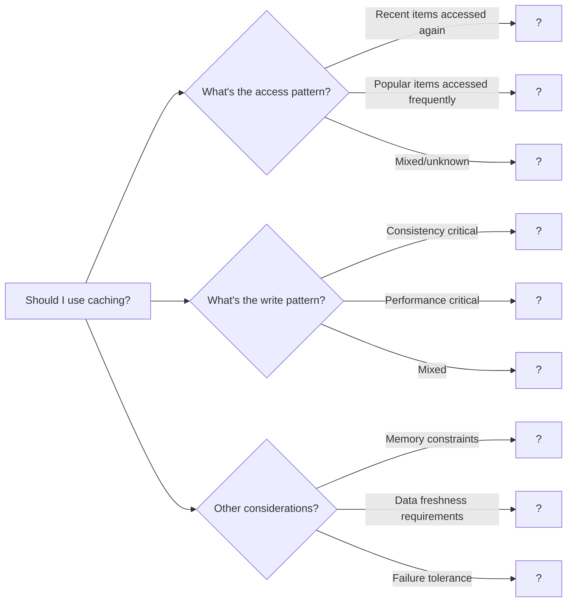

# Caching Patterns

> Master LRU, LFU, and write policies for high-performance systems

---

## ELI5: Explain Like I'm 5

<div class="learner-section" markdown>

**Your task:** After implementing all patterns, explain them simply.

**Prompts to guide you:**

1. **What is caching in one sentence?**
    - Your answer: <span class="fill-in">[Fill in after implementation]</span>

2. **Why/when do we use caching?**
    - Your answer: <span class="fill-in">[Fill in after implementation]</span>

3. **Real-world analogy:**
    - Example: "A cache is like keeping your favorite books on your desk instead of walking to the library..."
    - Your analogy: <span class="fill-in">[Fill in]</span>

4. **What's the difference between LRU and LFU?**
    - Your answer: <span class="fill-in">[Fill in after solving problems]</span>

5. **When should you use Write-Through vs Write-Back?**
    - Your answer: <span class="fill-in">[Fill in after practice]</span>

</div>

---

## Quick Quiz (Do BEFORE implementing)

<div class="learner-section" markdown>

**Your task:** Test your intuition without looking at code. Answer these, then verify after implementation.

### Complexity Predictions

1. **Direct database query for each request:**
    - Time per request: <span class="fill-in">[Your guess: O(?)]</span>
    - If DB query takes 50ms, how many requests/sec can you handle? _____
    - Verified after learning: <span class="fill-in">[Actual]</span>

2. **Cache lookup + occasional DB query:**
    - Cache hit time: <span class="fill-in">[Your guess: O(?)]</span>
    - Cache miss time: <span class="fill-in">[Your guess: O(?)]</span>
    - If 90% cache hit rate, average latency: <span class="fill-in">_____</span>ms
    - Verified: <span class="fill-in">[Actual]</span>

3. **Hit rate calculation:**
    - 1000 requests, 900 cache hits, 100 misses
    - Hit rate: <span class="fill-in">_____</span>%
    - If cache saves 45ms per hit, total time saved: <span class="fill-in">_____</span>ms

### Scenario Predictions

**Scenario 1:** E-commerce product catalog with access pattern:

```
Product A: accessed 5 times
Product B: accessed 10 times
Product C: accessed 3 times
Product D: accessed 8 times
Cache capacity: 2 items
```

- **With LRU, which items remain after all accesses?** <span class="fill-in">[Fill in - trace manually]</span>
- **With LFU, which items remain?** <span class="fill-in">[Fill in - trace manually]</span>
- **Which is better for this pattern?** <span class="fill-in">[LRU/LFU - Why?]</span>

**Scenario 2:** User session cache (last access time matters)

```
Session A: last accessed 10 min ago
Session B: last accessed 2 min ago
Session C: last accessed 5 min ago
Cache full, new session arrives
```

- **Which eviction policy makes sense?** <span class="fill-in">[LRU/LFU - Why?]</span>
- **Which session gets evicted?** <span class="fill-in">[Fill in]</span>

**Scenario 3:** Write policies

```
Request: Update user profile
Write-Through: Cache + DB both take 5ms each
Write-Back: Cache takes 1ms, DB flush happens later
```

- **Write-Through total latency:** _____ms
- **Write-Back perceived latency:** _____ms
- **If DB fails during Write-Back flush, what happens?** <span class="fill-in">[Fill in]</span>
- **Which is safer?** <span class="fill-in">[Fill in - Why?]</span>

### Trade-off Quiz

**Question 1:** When would direct database queries be BETTER than caching?

- Your answer: <span class="fill-in">[Fill in before implementation]</span>
- Verified answer: <span class="fill-in">[Fill in after learning]</span>

**Question 2:** What's the MAIN benefit of caching?

- [ ] Reduces database load
- [ ] Reduces latency
- [ ] Saves money
- [ ] All of the above

Verify after implementation: <span class="fill-in">[Which one(s)?]</span>

**Question 3:** Cache hit rate drops from 90% to 50%. How does this affect performance?

- Your calculation: <span class="fill-in">[Fill in]</span>
- Verified impact: <span class="fill-in">[Fill in after implementation]</span>

</div>

---

## Before/After: Why This Pattern Matters

**Your task:** Compare direct database access vs caching to understand the impact.

### Example: Product Lookup API

**Problem:** Fetch product details for 1000 concurrent users.

#### Approach 1: Direct Database Query (No Cache)

```java
// Naive approach - Query database for every request
public class DirectDatabaseLookup {

    private final Database database;

    public Product getProduct(String productId) {
        // Direct database query every time
        return database.query("SELECT * FROM products WHERE id = ?", productId);
    }
}

// Performance test
public static void benchmarkDirectDB() {
    DirectDatabaseLookup service = new DirectDatabaseLookup(database);

    long start = System.currentTimeMillis();
    for (int i = 0; i < 1000; i++) {
        service.getProduct("prod-123"); // Same product queried 1000 times
    }
    long end = System.currentTimeMillis();

    System.out.println("Total time: " + (end - start) + "ms");
}
```

**Analysis:**

- Time per DB query: ~50ms
- For 1000 requests: 1000 × 50ms = **50,000ms (50 seconds)**

- Database load: 1000 queries/sec
- Cost: High (database compute, network latency)
- Throughput: ~20 requests/sec per thread

#### Approach 2: LRU Cache (Optimized)

```java
// Optimized approach - Cache frequent lookups
public class CachedProductLookup {

    private final LRUCache<String, Product> cache;
    private final Database database;

    public CachedProductLookup(int cacheSize, Database database) {
        this.cache = new LRUCache<>(cacheSize);
        this.database = database;
    }

    public Product getProduct(String productId) {
        // Try cache first (O(1), ~1ms)
        Product product = cache.get(productId);

        if (product != null) {
            return product; // Cache hit - fast!
        }

        // Cache miss - query database (~50ms)
        product = database.query("SELECT * FROM products WHERE id = ?", productId);

        if (product != null) {
            cache.put(productId, product); // Populate cache
        }

        return product;
    }
}

// Performance test
public static void benchmarkCached() {
    CachedProductLookup service = new CachedProductLookup(100, database);

    long start = System.currentTimeMillis();
    for (int i = 0; i < 1000; i++) {
        service.getProduct("prod-123"); // Same product queried 1000 times
    }
    long end = System.currentTimeMillis();

    System.out.println("Total time: " + (end - start) + "ms");
}
```

**Analysis:**

- First request (cache miss): ~50ms
- Subsequent requests (cache hits): ~1ms each
- For 1000 requests: 50ms + (999 × 1ms) = **1,049ms (~1 second)**

- Database load: 1 query for 1000 requests
- Cache hit rate: 99.9%
- Throughput: ~950 requests/sec per thread

#### Performance Comparison

| Metric                         | Direct DB  | With Cache  | Improvement         |
|--------------------------------|------------|-------------|---------------------|
| **Total time (1000 requests)** | 50,000ms   | 1,049ms     | **47.6x faster**    |
| **Average latency**            | 50ms       | 1.05ms      | **47.6x faster**    |
| **Database queries**           | 1000       | 1           | **99.9% reduction** |
| **Throughput**                 | 20 req/sec | 950 req/sec | **47.5x higher**    |
| **DB cost (estimate)**         | $100/day   | $2/day      | **$98/day savings** |

**Your calculation:** For 10,000 requests with 90% cache hit rate:

- Cache hits: 10,000 × 0.9 = <span class="fill-in">_____</span> requests × 1ms = <span class="fill-in">_____</span>ms
- Cache misses: 10,000 × 0.1 = <span class="fill-in">_____</span> requests × 50ms = <span class="fill-in">_____</span>ms
- Total time: <span class="fill-in">_____</span> + _____ = <span class="fill-in">_____</span>ms
- Speedup vs direct DB: <span class="fill-in">_____</span> times faster

#### Hit Rate Analysis

**How hit rate affects performance:**

```
Cache Hit Rate Analysis (1000 requests)

Hit Rate | Cache Hits | DB Queries | Total Time | Speedup

---------|------------|------------|------------|--------
   0%    |     0      |    1000    |  50,000ms  |   1x
  50%    |   500      |     500    |  25,500ms  |   2x
  75%    |   750      |     250    |  13,250ms  |   3.8x
  90%    |   900      |     100    |   5,900ms  |   8.5x
  95%    |   950      |      50    |   3,450ms  |  14.5x
  99%    |   990      |      10    |   1,490ms  |  33.6x
 99.9%   |   999      |      1     |   1,049ms  |  47.7x
```

**Key insight:** Even a modest 75% hit rate gives 3.8x speedup!

**After implementing, explain in your own words:**

<div class="learner-section" markdown>

- Why does caching provide such dramatic speedup? <span class="fill-in">[Your answer]</span>
- What happens when hit rate drops below 50%? <span class="fill-in">[Your answer]</span>
- When might caching not be worth it? <span class="fill-in">[Your answer]</span>

</div>

#### Write Policy Comparison

**Scenario:** Update user profile (name change)

```java
// Write-Through Example
public void updateUserProfile_WriteThrough(String userId, String newName) {
    long start = System.currentTimeMillis();

    // Write to cache (1ms)
    cache.put(userId, newName);

    // Write to database (50ms) - BLOCKS until complete
    database.update(userId, newName);

    long end = System.currentTimeMillis();
    System.out.println("Write-Through latency: " + (end - start) + "ms");
    // Output: ~51ms
}

// Write-Back Example
public void updateUserProfile_WriteBack(String userId, String newName) {
    long start = System.currentTimeMillis();

    // Write to cache (1ms) - IMMEDIATE RETURN
    cache.put(userId, newName);

    // Mark as dirty for async flush
    dirtyEntries.put(userId, newName);

    long end = System.currentTimeMillis();
    System.out.println("Write-Back latency: " + (end - start) + "ms");
    // Output: ~1ms

    // Database write happens later asynchronously
}
```

**Write Policy Performance:**

| Policy        | User Latency   | DB Write     | Consistency | Data Loss Risk        |
|---------------|----------------|--------------|-------------|-----------------------|
| Write-Through | 51ms           | Synchronous  | Immediate   | None                  |
| Write-Back    | 1ms            | Asynchronous | Eventual    | If crash before flush |
| **Speedup**   | **51x faster** | -            | Trade-off   | Trade-off             |

**Your analysis:** When would you choose each?

- Write-Through: <span class="fill-in">[Fill in scenarios]</span>
- Write-Back: <span class="fill-in">[Fill in scenarios]</span>

---

## Case Studies: Caching in the Wild

### Facebook's Social Graph: TAO and Memcached

- **Pattern:** Cache-Aside with a custom distributed caching layer (TAO).
- **How it works:** Facebook's social graph (friends, posts, comments) is too large and interconnected to query from a
  database for every request. They built TAO, a geographically distributed caching system on top of Memcached. When a
  user requests their feed, the application first queries TAO. If the data is present (cache hit), it's returned
  instantly. If not (cache miss), TAO fetches the data from the master database (MySQL), populates the cache, and then
  returns it.
- **Key Takeaway:** At massive scale, a simple cache isn't enough. Facebook needed to build a custom caching *service*
  that handles eventual consistency, replication across data centers, and the "thundering herd" problem. It showcases
  the cache-aside pattern on a global scale.

### Twitter's Timeline Cache: Redis for Real-Time Feeds

- **Pattern:** Pre-computed timelines with a Cache-Aside strategy.
- **How it works:** A user's home timeline is one of the most frequently read pieces of data. Generating it on-the-fly
  for every request is too slow. Instead, Twitter pre-computes user timelines and stores them in a massive Redis
  cluster. When you open Twitter, your app fetches this pre-computed list directly from the cache. When a user you
  follow tweets, a background "fan-out" service pushes that tweet into the timeline caches of all their followers.
- **Key Takeaway:** For read-heavy workloads with complex data generation, it's often better to do the work ahead of
  time and cache the *results*. Redis is a perfect fit for this due to its high performance and versatile data
  structures (like sorted lists for timelines).

### Content Delivery Networks (CDNs): Caching at the Edge

- **Pattern:** Multi-layered caching with LRU/LFU eviction.
- **How it works:** A Content Delivery Network (CDN) like Cloudflare or Akamai acts as a massive, distributed cache for
  a website's static assets (images, CSS, JS). When a user in London requests an image, it's served from the CDN's
  London edge server, not from the origin server in California. The first request might be slow, but subsequent requests
  from that region are served from the local cache.
- **Key Takeaway:** Caching isn't just for databases; it's for any data that can be served closer to the user. CDNs
  demonstrate how layered caching and intelligent eviction policies (like LRU to keep popular assets hot) can
  dramatically improve website performance and reduce bandwidth costs for the origin server.

---

## Core Implementation

### Pattern 1: LRU Cache (Least Recently Used)

**Your task:** Implement LRU cache with O(1) get and put operations.

```java
import java.util.*;

/**
 * LRU Cache - Evicts least recently used items when full
 * Time: O(1) for get/put
 * Space: O(capacity)
 *
 * Key insight: Combine HashMap for O(1) lookup + Doubly Linked List for O(1) move/remove
 */
public class LRUCache<K, V> {

    private final int capacity;
    private final Map<K, Node<K, V>> cache;
    private final DoublyLinkedList<K, V> list;

    static class Node<K, V> {
        K key;
        V value;
        Node<K, V> prev, next;

        Node(K key, V value) {
            this.key = key;
            this.value = value;
        }
    }

    static class DoublyLinkedList<K, V> {
        Node<K, V> head, tail;

        DoublyLinkedList() {
            // TODO: Initialize sentinel nodes for cleaner edge case handling
        }

        /**
         * Add node to front (most recently used position)
         *
         * TODO: Implement addToFront
         */
        void addToFront(Node<K, V> node) {
            // TODO: Insert node right after head
        }

        /**
         * Remove node from list
         *
         * TODO: Implement remove
         */
        void remove(Node<K, V> node) {
            // TODO: Update prev/next pointers to bypass this node
        }

        /**
         * Remove and return least recently used (node before tail)
         *
         * TODO: Implement removeLast
         */
        Node<K, V> removeLast() {
            // TODO: Remove the node closest to tail
            // Handle empty list case

            return null; // Replace
        }

        /**
         * Move existing node to front
         *
         * TODO: Implement moveToFront
         */
        void moveToFront(Node<K, V> node) {
            // TODO: Reposition node to mark it as most recently used
        }
    }

    public LRUCache(int capacity) {
        this.capacity = capacity;
        this.cache = new HashMap<>();
        this.list = new DoublyLinkedList<>();
    }

    /**
     * Get value for key
     * Time: O(1)
     *
     * TODO: Implement get
     */
    public V get(K key) {
        // TODO: Lookup and update recency

        return null; // Replace
    }

    /**
     * Put key-value pair
     * Time: O(1)
     *
     * TODO: Implement put
     */
    public void put(K key, V value) {
        // TODO: Handle updates to existing keys
        // Handle eviction when at capacity
        // Add new entries appropriately
    }

    public int size() {
        return cache.size();
    }
}
```

---

### Pattern 2: LFU Cache (Least Frequently Used)

**Your task:** Implement LFU cache with O(1) get and put operations.

```java
import java.util.*;

/**
 * LFU Cache - Evicts least frequently used items when full
 * Time: O(1) for get/put
 * Space: O(capacity)
 *
 * Key insight: Track frequency for each node, maintain lists per frequency level
 */
public class LFUCache<K, V> {

    private final int capacity;
    private int minFreq;
    private final Map<K, Node<K, V>> cache;
    private final Map<Integer, DoublyLinkedList<K, V>> freqMap; // freq -> list of nodes

    static class Node<K, V> {
        K key;
        V value;
        int freq;
        Node<K, V> prev, next;

        Node(K key, V value) {
            this.key = key;
            this.value = value;
            this.freq = 1;
        }
    }

    static class DoublyLinkedList<K, V> {
        Node<K, V> head, tail;

        DoublyLinkedList() {
            // TODO: Initialize sentinel nodes
        }

        void addToFront(Node<K, V> node) {
            // TODO: Add to front of list
        }

        void remove(Node<K, V> node) {
            // TODO: Remove from list
        }

        Node<K, V> removeLast() {
            // TODO: Remove least frequently used
            return null;
        }

        boolean isEmpty() {
            // TODO: Check if list has any nodes
            return true;
        }
    }

    public LFUCache(int capacity) {
        this.capacity = capacity;
        this.minFreq = 0;
        this.cache = new HashMap<>();
        this.freqMap = new HashMap<>();
    }

    /**
     * Get value for key
     * Time: O(1)
     *
     * TODO: Implement get
     */
    public V get(K key) {
        // TODO: Lookup and update frequency tracking

        return null; // Replace
    }

    /**
     * Put key-value pair
     * Time: O(1)
     *
     * TODO: Implement put
     */
    public void put(K key, V value) {
        if (capacity <= 0) return;

        // TODO: Handle updates and new insertions
        // Evict least frequently used when at capacity
        // Manage frequency tracking structures
    }

    /**
     * Update frequency of node
     *
     * TODO: Implement updateFrequency
     */
    private void updateFrequency(Node<K, V> node) {
        // TODO: Move node from current frequency list to next
    }
}
```

---

### Pattern 3: Write-Through Cache

**Your task:** Implement write-through cache pattern.

```java
/**
 * Write-Through Cache - Writes go to cache AND database synchronously
 *
 * Pros: Data consistency, simple
 * Cons: Higher write latency
 */
public class WriteThroughCache<K, V> {

    private final LRUCache<K, V> cache;
    private final Database<K, V> database;

    interface Database<K, V> {
        V read(K key);
        void write(K key, V value);
    }

    public WriteThroughCache(int capacity, Database<K, V> database) {
        this.cache = new LRUCache<>(capacity);
        this.database = database;
    }

    /**
     * Get value
     *
     * TODO: Implement cache-aside pattern
     */
    public V get(K key) {
        // TODO: Check cache first, then fallback to database

        return null; // Replace
    }

    /**
     * Put value
     *
     * TODO: Implement write-through
     */
    public void put(K key, V value) {
        // TODO: Update both cache and database synchronously
    }
}
```

---

### Pattern 4: Write-Back (Write-Behind) Cache

**Your task:** Implement write-back cache with async flush.

```java
import java.util.*;
import java.util.concurrent.*;

/**
 * Write-Back Cache - Writes go to cache immediately, database asynchronously
 *
 * Pros: Lower write latency
 * Cons: Risk of data loss, more complex
 */
public class WriteBackCache<K, V> {

    private final LRUCache<K, V> cache;
    private final Database<K, V> database;
    private final Map<K, V> dirtyEntries;
    private final ScheduledExecutorService flusher;

    interface Database<K, V> {
        V read(K key);
        void write(K key, V value);
    }

    public WriteBackCache(int capacity, Database<K, V> database, long flushIntervalMs) {
        this.cache = new LRUCache<>(capacity);
        this.database = database;
        this.dirtyEntries = new ConcurrentHashMap<>();
        this.flusher = Executors.newSingleThreadScheduledExecutor();

        // TODO: Schedule background flush task
    }

    /**
     * Get value
     *
     * TODO: Implement get
     */
    public V get(K key) {
        // TODO: Check cache, dirty entries, then database

        return null; // Replace
    }

    /**
     * Put value
     *
     * TODO: Implement write-back
     */
    public void put(K key, V value) {
        // TODO: Update cache immediately
        // Mark for later database flush
    }

    /**
     * Flush dirty entries to database
     *
     * TODO: Implement flush
     */
    private void flushDirtyEntries() {
        // TODO: Write all dirty entries to database
        // Handle failures appropriately
    }

    public void shutdown() {
        // TODO: Ensure all data is flushed before shutdown
    }
}
```

---

## Client Code

```java
import java.util.*;

public class CachingPatternsClient {

    // Mock database for testing
    static class MockDatabase<K, V> implements WriteThroughCache.Database<K, V> {
        private final Map<K, V> storage = new HashMap<>();

        @Override
        public V read(K key) {
            System.out.println("  [DB READ] " + key);
            return storage.get(key);
        }

        @Override
        public void write(K key, V value) {
            System.out.println("  [DB WRITE] " + key + " = " + value);
            storage.put(key, value);
        }
    }

    public static void main(String[] args) {
        testLRUCache();
        System.out.println("\n" + "=".repeat(50) + "\n");
        testLFUCache();
        System.out.println("\n" + "=".repeat(50) + "\n");
        testWriteThroughCache();
    }

    static void testLRUCache() {
        System.out.println("=== LRU Cache Test ===\n");
        LRUCache<String, String> cache = new LRUCache<>(3);

        cache.put("user:1", "Alice");
        cache.put("user:2", "Bob");
        cache.put("user:3", "Charlie");
        System.out.println("Cache size: " + cache.size());

        cache.get("user:1"); // Access Alice (makes it most recent)

        cache.put("user:4", "David"); // Should evict Bob (LRU)

        System.out.println("Get user:1: " + cache.get("user:1")); // Should be Alice
        System.out.println("Get user:2: " + cache.get("user:2")); // Should be null (evicted)
        System.out.println("Get user:3: " + cache.get("user:3")); // Should be Charlie
        System.out.println("Get user:4: " + cache.get("user:4")); // Should be David
    }

    static void testLFUCache() {
        System.out.println("=== LFU Cache Test ===\n");
        LFUCache<String, String> cache = new LFUCache<>(2);

        cache.put("key1", "value1");
        cache.put("key2", "value2");
        System.out.println("Get key1: " + cache.get("key1")); // freq: key1=2, key2=1

        cache.put("key3", "value3"); // Should evict key2 (LFU)

        System.out.println("Get key2: " + cache.get("key2")); // Should be null (evicted)
        System.out.println("Get key3: " + cache.get("key3")); // Should be value3
        System.out.println("Get key1: " + cache.get("key1")); // Should be value1
    }

    static void testWriteThroughCache() {
        System.out.println("=== Write-Through Cache Test ===\n");
        MockDatabase<String, String> db = new MockDatabase<>();
        WriteThroughCache<String, String> cache = new WriteThroughCache<>(2, db);

        System.out.println("Put user:1");
        cache.put("user:1", "Alice"); // Writes to both cache and DB

        System.out.println("\nGet user:1");
        System.out.println("Value: " + cache.get("user:1")); // Cache hit (no DB read)

        System.out.println("\nGet user:2");
        db.storage.put("user:2", "Bob"); // Add directly to DB
        System.out.println("Value: " + cache.get("user:2")); // Cache miss, DB hit
    }
}
```

---

## Debugging Challenges

**Your task:** Find and fix bugs in broken caching implementations. This tests your understanding.

### Challenge 1: Cache Stampede Bug

```java
/**
 * This cache has a CRITICAL BUG during cache misses.
 * Multiple threads can cause "cache stampede" - all hit DB simultaneously!
 */
public class StampedeLRUCache<K, V> {

    private final LRUCache<K, V> cache;
    private final Database<K, V> database;

    public V get(K key) {
        V value = cache.get(key);

        if (value == null) {
            // If 1000 threads miss cache at same time,
            // all 1000 will query database for same key!
            value = database.read(key);

            if (value != null) {
                cache.put(key, value);
            }
        }

        return value;
    }
}
```

**Your debugging:**

- **Bug location:** <span class="fill-in">[Which lines?]</span>
- **Bug explanation:** <span class="fill-in">[What happens with concurrent requests?]</span>

**Test case to expose the bug:**

```java
// Simulate 1000 concurrent requests for same key (cache miss)
ExecutorService executor = Executors.newFixedThreadPool(1000);
for (int i = 0; i < 1000; i++) {
    executor.submit(() -> cache.get("popular-item"));
}
// Expected: 1 DB query
// Actual with bug: <span class="fill-in">_____</span> DB queries
```

<details markdown>
<summary>Click to verify your answer</summary>

**Bug:** No synchronization during cache miss. Multiple threads can simultaneously detect cache miss and all query the
database.

**Fix 1 - Simple locking (but blocks all reads):**

```java
public synchronized V get(K key) {
    // ... same logic
}
```

**Fix 2 - Better: Per-key locking to avoid thundering herd:**

```java
private final ConcurrentHashMap<K, CompletableFuture<V>> inFlightRequests = new ConcurrentHashMap<>();

public V get(K key) {
    V value = cache.get(key);
    if (value != null) return value;

    // Only one thread per key will query DB
    CompletableFuture<V> future = inFlightRequests.computeIfAbsent(key, k -> {
        return CompletableFuture.supplyAsync(() -> {
            V dbValue = database.read(k);
            if (dbValue != null) cache.put(k, dbValue);
            return dbValue;
        });
    });

    try {
        value = future.get();
        inFlightRequests.remove(key);
        return value;
    } catch (Exception e) {
        inFlightRequests.remove(key);
        throw new RuntimeException(e);
    }
}
```

**Key insight:** Cache stampede can overwhelm your database. Always protect cache misses with per-key synchronization.
</details>

---

### Challenge 2: Stale Data Bug

```java
/**
 * This write-back cache has a STALE DATA bug.
 * Readers can get old data even after a write!
 */
public class StaleWriteBackCache<K, V> {

    private final LRUCache<K, V> cache;
    private final Map<K, V> dirtyEntries;
    private final Database<K, V> database;

    public V get(K key) {
        V value = cache.get(key);
        if (value != null) return value;

        // Check dirty entries
        value = dirtyEntries.get(key);
        if (value != null) return value;

        // Read from database
        return database.read(key);
    }

    public void put(K key, V value) {
        cache.put(key, value);
        dirtyEntries.put(key, value);
    }

    public void flush() {
        // Async flush to database
        for (Map.Entry<K, V> entry : dirtyEntries.entrySet()) {
            database.write(entry.getKey(), entry.getValue());
        }
        dirtyEntries.clear();
    }
}
```

**Your debugging:**

- **Bug:** <span class="fill-in">[What's wrong with the get() logic?]</span>
- **Scenario that breaks:**

```

1. put("key1", "value1") - goes to cache and dirty
2. cache evicts key1 (capacity full)
3. get("key1") - what do you get?
```

- **Expected:** "value1" (from dirty entries)
- **Actual:** <span class="fill-in">[What happens?]</span>
- **Fix:** <span class="fill-in">[Correct the order of checks]</span>

<details markdown>
<summary>Click to verify your answer</summary>

**Bug:** Cache lookup happens before dirty entries check. If cache evicts an item that's in dirtyEntries, we'll miss the
latest value.

**Correct order:**

```java
public V get(K key) {
    // Check dirty entries FIRST (most recent writes)
    V value = dirtyEntries.get(key);
    if (value != null) return value;

    // Then check cache
    value = cache.get(key);
    if (value != null) return value;

    // Finally, check database
    return database.read(key);
}
```

**Key insight:** With write-back caching, dirty entries hold the "source of truth" until flushed. Always check them
first!
</details>

---

### Challenge 3: Thundering Herd on Expiration

```java
/**
 * This cache has TTL support but causes "thundering herd"
 * when many items expire at the same time.
 */
public class TTLCache<K, V> {

    static class CacheEntry<V> {
        V value;
        long expiryTime;

        CacheEntry(V value, long ttlMs) {
            this.value = value;
            this.expiryTime = System.currentTimeMillis() + ttlMs;
        }

        boolean isExpired() {
            return System.currentTimeMillis() > expiryTime;
        }
    }

    private final Map<K, CacheEntry<V>> cache = new ConcurrentHashMap<>();
    private final Database<K, V> database;
    private final long ttlMs;

    public TTLCache(Database<K, V> database, long ttlMs) {
        this.database = database;
        this.ttlMs = ttlMs;
    }

    public V get(K key) {
        CacheEntry<V> entry = cache.get(key);

        // Check expiration
        if (entry == null || entry.isExpired()) {
            // All requests hit database simultaneously!
            V value = database.read(key);
            if (value != null) {
                cache.put(key, new CacheEntry<>(value, ttlMs));
            }
            return value;
        }

        return entry.value;
    }
}
```

**Your debugging:**

- **Bug:** <span class="fill-in">[What causes thundering herd?]</span>
- **Scenario:**

```

10:00:00 - Cache is populated with 1000 items, all expire at 10:05:00
10:05:00 - First request arrives
What happens?
```

- **Expected:** Smooth database load
- **Actual:** <span class="fill-in">[What happens to database?]</span>

<details markdown>
<summary>Click to verify your answer</summary>

**Bug:** All items created at the same time will expire at the same time, causing synchronized cache misses and database
overload.

**Fix 1 - Add jitter to TTL:**

```java
private final Random random = new Random();

public V get(K key) {
    // ... existing logic ...
    if (value != null) {
        // Add ±20% jitter to TTL
        long jitter = (long) (ttlMs * (0.8 + random.nextDouble() * 0.4));
        cache.put(key, new CacheEntry<>(value, jitter));
    }
    return value;
}
```

**Fix 2 - Probabilistic early expiration (XFetch algorithm):**

```java
public V get(K key) {
    CacheEntry<V> entry = cache.get(key);

    if (entry == null) {
        return refreshFromDB(key);
    }

    // Probabilistic early expiration
    // As item gets older, higher chance of refresh
    long timeLeft = entry.expiryTime - System.currentTimeMillis();
    double refreshProbability = 1.0 - ((double) timeLeft / ttlMs);

    if (entry.isExpired() || random.nextDouble() < refreshProbability * 0.1) {
        // Refresh asynchronously
        CompletableFuture.runAsync(() -> refreshFromDB(key));
    }

    return entry.value;
}

private V refreshFromDB(K key) {
    V value = database.read(key);
    if (value != null) {
        long jitter = (long) (ttlMs * (0.8 + random.nextDouble() * 0.4));
        cache.put(key, new CacheEntry<>(value, jitter));
    }
    return value;
}
```

**Key insight:** Synchronized expiration creates thundering herd. Add jitter and probabilistic early expiration to
spread load.
</details>

---

### Challenge 4: LFU Frequency Update Bug

```java
/**
 * This LFU cache has a subtle frequency update bug.
 * Can you spot it?
 */
public class BuggyLFUCache<K, V> {

    static class Node<K, V> {
        K key;
        V value;
        int freq;

        Node(K key, V value) {
            this.key = key;
            this.value = value;
            this.freq = 1;
        }
    }

    private final Map<K, Node<K, V>> cache;
    private final Map<Integer, LinkedHashSet<K>> freqMap;
    private int minFreq;
    private final int capacity;

    public V get(K key) {
        Node<K, V> node = cache.get(key);
        if (node == null) return null;

        updateFrequency(node);
        return node.value;
    }

    private void updateFrequency(Node<K, V> node) {
        int freq = node.freq;

        // Remove from current frequency list
        freqMap.get(freq).remove(node.key);

        // And what if freq == minFreq?

        // Increment frequency
        node.freq++;

        // Add to new frequency list
        freqMap.computeIfAbsent(node.freq, k -> new LinkedHashSet<>())
               .add(node.key);
    }

    public void put(K key, V value) {
        // ... implementation
    }
}
```

**Your debugging:**

- **Bug 1:** <span class="fill-in">[What happens to minFreq?]</span>
- **Bug 2:** <span class="fill-in">[What about empty frequency lists?]</span>

```
Cache capacity = 2
put("A", 1) - freq=1, minFreq=1
get("A")    - freq=2
put("B", 2) - freq=1, minFreq should be?
// At this point, what is minFreq? What should it be?
```

- **Fix:** <span class="fill-in">[Complete the updateFrequency method]</span>

<details markdown>
<summary>Click to verify your answer</summary>

**Bug 1:** When the last node at minFreq is moved to a higher frequency, we must update minFreq.

**Bug 2:** Empty frequency lists should be removed from freqMap to save memory.

**Correct implementation:**

```java
private void updateFrequency(Node<K, V> node) {
    int freq = node.freq;

    // Remove from current frequency list
    LinkedHashSet<K> freqList = freqMap.get(freq);
    freqList.remove(node.key);

    // If this was the last node at minFreq, increment minFreq
    if (freq == minFreq && freqList.isEmpty()) {
        minFreq++;
    }

    // Remove empty frequency list
    if (freqList.isEmpty()) {
        freqMap.remove(freq);
    }

    // Increment frequency
    node.freq++;

    // Add to new frequency list
    freqMap.computeIfAbsent(node.freq, k -> new LinkedHashSet<>())
           .add(node.key);
}
```

**Key insight:** LFU requires careful maintenance of minFreq and frequency lists. Missing updates cause incorrect
evictions.
</details>

---

### Challenge 5: Cache Invalidation Race Condition

```java
/**
 * This cache has invalidation logic but contains a race condition.
 * Data can become inconsistent between cache and database.
 */
public class InvalidationCache<K, V> {

    private final LRUCache<K, V> cache;
    private final Database<K, V> database;

    public V get(K key) {
        V value = cache.get(key);

        if (value == null) {
            value = database.read(key);
            if (value != null) {
                cache.put(key, value);
            }
        }

        return value;
    }

    public void update(K key, V newValue) {

        // Thread 1: Writes to database
        database.write(key, newValue);

        // Thread 2: Between these two lines, another thread could:
        //   1. Read stale value from cache
        //   2. Not see the invalidation yet

        // Thread 1: Invalidates cache
        cache.remove(key);
    }
}
```

**Your debugging:**

- **Bug:** <span class="fill-in">[What race condition exists?]</span>
- **Scenario that fails:**

```
T0: cache contains key="user:1" value="Alice"
T1: Thread 1 calls update("user:1", "Bob")
    - Writes "Bob" to database
T2: Thread 2 calls get("user:1")
    - Reads "Alice" from cache (stale!)
T3: Thread 1 invalidates cache
    - Too late! Thread 2 already returned stale data
```


<details markdown>
<summary>Click to verify your answer</summary>

**Bug:** Cache invalidation happens AFTER database write, creating a window where stale data is served.

**Fix 1 - Invalidate before write:**

```java
public void update(K key, V newValue) {
    // Invalidate FIRST
    cache.remove(key);

    // Then write to database
    database.write(key, newValue);

    // Small window where cache misses hit DB, but at least no stale data
}
```

**Fix 2 - Use versioning:**

```java
static class VersionedValue<V> {
    V value;
    long version;
}

public void update(K key, V newValue) {
    // Increment version
    long newVersion = getNextVersion(key);

    // Write to DB with version
    database.write(key, newValue, newVersion);

    // Update cache with version
    cache.put(key, new VersionedValue<>(newValue, newVersion));
}

public V get(K key) {
    VersionedValue<V> cached = cache.get(key);
    VersionedValue<V> dbValue = database.read(key);

    // Compare versions, use latest
    if (cached != null && dbValue != null) {
        return cached.version >= dbValue.version ? cached.value : dbValue.value;
    }
    // ... handle nulls
}
```

**Fix 3 - Cache-aside with write-through (best):**

```java
public void update(K key, V newValue) {
    // Write to both atomically (within transaction if possible)
    cache.put(key, newValue);
    database.write(key, newValue);
    // No invalidation needed - cache is always up to date
}
```

**Key insight:** Cache invalidation is notoriously hard. Order matters: invalidate before write, or use write-through to
avoid invalidation entirely.
</details>

---

### Your Debugging Scorecard

After finding and fixing all bugs:

- [ ] Found all 5+ critical caching bugs
- [ ] Understood WHY each bug causes problems
- [ ] Could explain the fix to someone else
- [ ] Learned common caching mistakes to avoid

**Common caching bugs you discovered:**

1. Cache stampede (no synchronization on miss)
2. Stale data (wrong read order in write-back)
3. Thundering herd (synchronized expiration)
4. Frequency tracking errors (LFU minFreq bug)
5. Invalidation race conditions

**Defensive caching patterns to remember:**

- <span class="fill-in">[Fill in patterns you learned]</span>
- <span class="fill-in">[Fill in]</span>
- <span class="fill-in">[Fill in]</span>

---

## Decision Framework

**Questions to answer after implementation:**

### 1. When to use LRU vs LFU?

**LRU Cache:**

- When to use: <span class="fill-in">[Fill in]</span>
- Pros: <span class="fill-in">[Fill in]</span>
- Cons: <span class="fill-in">[Fill in]</span>
- Example scenarios: <span class="fill-in">[Fill in]</span>

**LFU Cache:**

- When to use: <span class="fill-in">[Fill in]</span>
- Pros: <span class="fill-in">[Fill in]</span>
- Cons: <span class="fill-in">[Fill in]</span>
- Example scenarios: <span class="fill-in">[Fill in]</span>

### 2. When to use Write-Through vs Write-Back?

**Write-Through:**

- When to use: <span class="fill-in">[Fill in]</span>
- Pros: <span class="fill-in">[Fill in]</span>
- Cons: <span class="fill-in">[Fill in]</span>
- Example scenarios: <span class="fill-in">[Fill in]</span>

**Write-Back:**

- When to use: <span class="fill-in">[Fill in]</span>
- Pros: <span class="fill-in">[Fill in]</span>
- Cons: <span class="fill-in">[Fill in]</span>
- Example scenarios: <span class="fill-in">[Fill in]</span>

### 3. Your Decision Tree

Build this after solving practice scenarios:



---

## Practice

### Scenario 1: E-commerce Product Catalog

**Requirements:**

- 1M products, 100K frequently viewed
- Reads: 10K/sec, Writes: 100/sec
- Users browse recent and popular products

**Your cache design:**

- Eviction policy: <span class="fill-in">[LRU or LFU? Why?]</span>
- Write policy: <span class="fill-in">[Write-Through or Write-Back? Why?]</span>
- Capacity: <span class="fill-in">[How much?]</span>
- TTL: <span class="fill-in">[Time-to-live strategy?]</span>
- Invalidation: <span class="fill-in">[When to invalidate?]</span>

### Scenario 2: Social Media Feed

**Requirements:**

- Each user has 500 followers
- Feed shows recent posts (last 24h)
- High read:write ratio (100:1)
- Eventually consistent is OK

**Your cache design:**

- Eviction policy: <span class="fill-in">[Fill in]</span>
- Write policy: <span class="fill-in">[Fill in]</span>
- Cache key structure: <span class="fill-in">[What to cache?]</span>
- Invalidation strategy: <span class="fill-in">[Fill in]</span>
- Capacity planning: <span class="fill-in">[Fill in]</span>

### Scenario 3: Session Store

**Requirements:**

- Store user sessions (auth tokens, preferences)
- Sessions expire after 30 minutes of inactivity
- High read frequency
- Consistency required (can't lose session data)

**Your cache design:**

- Eviction policy: <span class="fill-in">[Fill in]</span>
- Write policy: <span class="fill-in">[Fill in]</span>
- TTL strategy: <span class="fill-in">[Fill in]</span>
- Persistence: <span class="fill-in">[How to ensure durability?]</span>

### LeetCode Problem

**Problem:** [146. LRU Cache](https://leetcode.com/problems/lru-cache/)

Design and implement a data structure for Least Recently Used (LRU) cache.

**Your approach:**

1. <span class="fill-in">[Data structures needed?]</span>
2. <span class="fill-in">[How to achieve O(1) for both get and put?]</span>
3. <span class="fill-in">[Edge cases to handle?]</span>

---

## Review Checklist

Before moving to the next topic:

- [ ] **Implementation**
    - [ ] LRU Cache works with O(1) operations
    - [ ] LFU Cache works with frequency tracking
    - [ ] Write-Through pattern implemented correctly
    - [ ] Write-Back pattern with async flush works
    - [ ] All client code runs successfully

- [ ] **Understanding**
    - [ ] Filled in all ELI5 explanations
    - [ ] Understand LRU vs LFU trade-offs
    - [ ] Understand Write-Through vs Write-Back trade-offs
    - [ ] Built decision tree

- [ ] **Decision Making**
    - [ ] Know when to use LRU vs LFU
    - [ ] Know when to use Write-Through vs Write-Back
    - [ ] Completed practice scenarios
    - [ ] Can explain trade-offs to someone else

- [ ] **Mastery Check**
    - [ ] Could implement LRU from memory
    - [ ] Could implement LFU from memory
    - [ ] Could design cache for new scenario
    - [ ] Understand when NOT to use caching

---

### Mastery Certification

**I certify that I can:**

- [ ] Implement LRU cache from memory in under 15 minutes
- [ ] Implement LFU cache with correct frequency tracking
- [ ] Explain when to use LRU vs LFU with real examples
- [ ] Explain when to use Write-Through vs Write-Back
- [ ] Calculate cache hit rates and performance impact
- [ ] Identify and fix common caching bugs (stampede, stale data, etc.)
- [ ] Design caching strategy for a new system
- [ ] Explain trade-offs to both technical and non-technical audiences

