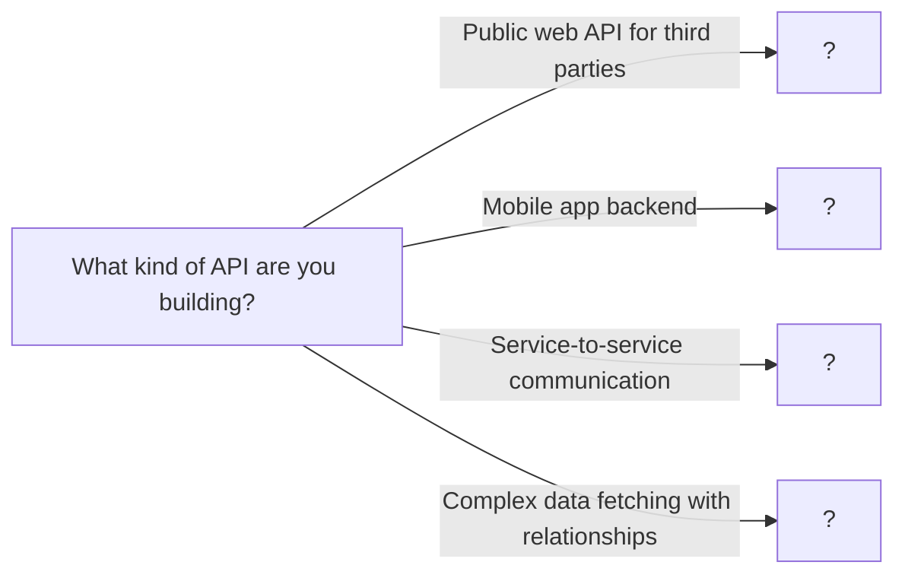

# API Design

> REST, GraphQL, and RPC - Choosing the right API paradigm

---

## ELI5: Explain Like I'm 5

<div class="learner-section" markdown>

**Your task:** After implementing different API patterns, explain them simply.

**Prompts to guide you:**

1. **What is REST in one sentence?**
    - Your answer: <span class="fill-in">[Fill in after implementation]</span>

2. **Why do we use REST for web APIs?**
    - Your answer: <span class="fill-in">[Fill in after implementation]</span>

3. **Real-world analogy for REST:**
    - Example: "REST is like a restaurant menu where..."
    - Your analogy: <span class="fill-in">[Fill in]</span>

4. **What is GraphQL in one sentence?**
    - Your answer: <span class="fill-in">[Fill in after implementation]</span>

5. **When would you choose GraphQL over REST?**
    - Your answer: <span class="fill-in">[Fill in after implementation]</span>

6. **Real-world analogy for GraphQL:**
    - Example: "GraphQL is like a buffet where..."
    - Your analogy: <span class="fill-in">[Fill in]</span>

7. **What is RPC (gRPC) in one sentence?**
    - Your answer: <span class="fill-in">[Fill in after implementation]</span>

8. **When would you use RPC instead of REST?**
    - Your answer: <span class="fill-in">[Fill in after implementation]</span>

</div>

---

## Quick Quiz (Do BEFORE implementing)

<div class="learner-section" markdown>

**Your task:** Test your intuition without looking at code. Answer these, then verify after implementation.

### Complexity Predictions

1. **REST API endpoint for listing resources:**
    - What HTTP method should be used? <span class="fill-in">[Your guess: GET/POST/PUT/DELETE]</span>
    - What status code for success? <span class="fill-in">[Your guess: 200/201/204]</span>
    - Verified after learning: <span class="fill-in">[Actual: ?]</span>

2. **GraphQL query that fetches nested data:**
    - How many HTTP requests needed? <span class="fill-in">[Your guess: 1/multiple]</span>
    - Compared to REST for same data: <span class="fill-in">[More/Less/Same requests?]</span>
    - Verified: <span class="fill-in">[Actual]</span>

3. **API pagination parameters:**
    - Common parameter names: <span class="fill-in">[Your guesses]</span>
    - Default limit should be: <span class="fill-in">[Your guess: 10/50/100/unlimited?]</span>
    - Verified: <span class="fill-in">[Actual best practices]</span>

### Scenario Predictions

**Scenario 1:** Design endpoint to get user with their posts and comments

- **REST approach:** How many endpoints? <span class="fill-in">[Your guess]</span>
- **GraphQL approach:** How many endpoints? <span class="fill-in">[Your guess]</span>
- **Which has over-fetching risk?** <span class="fill-in">[REST/GraphQL - Why?]</span>
- **Which has N+1 query risk?** <span class="fill-in">[REST/GraphQL - Why?]</span>

**Scenario 2:** Client needs to update user's email address

- **Which HTTP method?** <span class="fill-in">[GET/POST/PUT/PATCH/DELETE]</span>
- **PUT vs PATCH - what's the difference?** <span class="fill-in">[Fill in]</span>
- **Success status code:** <span class="fill-in">[200/201/204/304]</span>
- **If email already taken, status code:** <span class="fill-in">[400/404/409/500]</span>

**Scenario 3:** API versioning strategy

- **Version in URL (/v1/users) or header?** <span class="fill-in">[Which is better? Why?]</span>
- **When to create new version?** <span class="fill-in">[Fill in your reasoning]</span>
- **How to deprecate old version?** <span class="fill-in">[Your approach]</span>

### Trade-off Quiz

**Question:** When would REST be BETTER than GraphQL?

- Your answer: <span class="fill-in">[Fill in before implementation]</span>
- Verified answer: <span class="fill-in">[Fill in after learning]</span>

**Question:** What's the MAIN benefit of API pagination?

- [ ] Makes API look professional
- [ ] Prevents database from crashing
- [ ] Reduces response size and improves performance
- [ ] Required by HTTP specification

Verify after implementation: <span class="fill-in">[Which one(s)?]</span>

**Question:** What makes an API idempotent?

- Your answer: <span class="fill-in">[Fill in]</span>
- Example of idempotent operation: <span class="fill-in">[Fill in]</span>
- Example of non-idempotent operation: <span class="fill-in">[Fill in]</span>

</div>

---

## Before/After: Why Good API Design Matters

**Your task:** Compare poorly designed vs well-designed APIs to understand the impact.

### Example 1: API Versioning

**Problem:** API needs to change user field from `name` to `firstName` and `lastName`.

#### Approach 1: Breaking Change (Bad)

```java
// Version 1 (deployed to production)
class User {
    String id;
    String name;        // Single name field
    String email;
}

// Suddenly changed to Version 2 - BREAKS ALL CLIENTS!
class User {
    String id;
    String firstName;   // Broken change
    String lastName;    // Broken change
    String email;
}
```

**Impact:**

- All existing clients break immediately
- Mobile apps that can't update crash
- Third-party integrations fail
- Customer complaints flood in
- Emergency rollback required

**Client code that breaks:**

```java
// This worked yesterday, crashes today!
User user = api.getUser("123");
System.out.println(user.name);  // ERROR: field not found!
```

#### Approach 2: Versioned API (Good)

```java
// Version 1 - Still supported
// GET /v1/users/123
class UserV1 {
    String id;
    String name;        // Still works for old clients
    String email;
}

// Version 2 - New clients can opt in
// GET /v2/users/123
class UserV2 {
    String id;
    String firstName;   // New field
    String lastName;    // New field
    String email;
}

// API routes both versions
@GetMapping("/v1/users/{id}")
public UserV1 getUserV1(String id) {
    User user = database.getUser(id);
    // Convert to V1 format
    return new UserV1(user.id,
                      user.firstName + " " + user.lastName,
                      user.email);
}

@GetMapping("/v2/users/{id}")
public UserV2 getUserV2(String id) {
    User user = database.getUser(id);
    return new UserV2(user.id, user.firstName, user.lastName, user.email);
}
```

**Impact:**

- Old clients continue working
- New clients get better data structure
- Gradual migration over 6-12 months
- Deprecation warnings guide users: "v1 deprecated, migrate to v2 by Dec 2024"
- No emergency fixes needed

**After implementing, answer:**

<div class="learner-section" markdown>

- Why is versioning critical for APIs? <span class="fill-in">[Your answer]</span>
- When would you create a new API version? <span class="fill-in">[Your answer]</span>
- How long should you support old versions? <span class="fill-in">[Your answer]</span>

</div>

---

### Example 2: Pagination

**Problem:** API endpoint returns user's posts.

#### Approach 1: Return All Data (Bad)

```java
// GET /users/123/posts
// Returns ALL posts - no pagination
@GetMapping("/users/{id}/posts")
public List<Post> getUserPosts(String userId) {
    // Returns everything - could be 10,000 posts!
    return database.getAllPostsByUser(userId);
}
```

**Impact:**

- Response size: 10,000 posts = ~50MB JSON
- Query time: 5+ seconds for large users
- Database overwhelmed with full table scans
- Mobile clients crash from memory issues
- Users see blank screen (timeout)

**Performance:**

| User's Posts | Response Size | Load Time | Mobile Result |
|--------------|---------------|-----------|---------------|
| 100 posts | 500 KB | 0.5s | Works |
| 1,000 posts | 5 MB | 2s | Slow |
| 10,000 posts | 50 MB | 10s+ | Crashes |

#### Approach 2: Paginated API (Good)

```java
// GET /users/123/posts?page=1&limit=20
@GetMapping("/users/{id}/posts")
public PaginatedResponse<Post> getUserPosts(
    String userId,
    @RequestParam(defaultValue = "1") int page,
    @RequestParam(defaultValue = "20") int limit
) {
    // Validate limit
    if (limit > 100) limit = 100;  // Cap at 100

    int offset = (page - 1) * limit;
    List<Post> posts = database.getPostsByUser(userId, offset, limit);
    int total = database.countPostsByUser(userId);

    return new PaginatedResponse<>(
        posts,
        page,
        limit,
        total,
        "/users/" + userId + "/posts"  // Base URL for navigation
    );
}

class PaginatedResponse<T> {
    List<T> data;
    PaginationMeta meta;

    class PaginationMeta {
        int currentPage;
        int pageSize;
        int totalItems;
        int totalPages;
        String nextPage;     // "/users/123/posts?page=2&limit=20"
        String prevPage;     // "/users/123/posts?page=1&limit=20"
    }
}
```

**Impact:**

- Response size: 20 posts = ~100 KB (50x smaller!)
- Query time: <100ms (10x faster)
- Database uses indexed queries
- Mobile clients load quickly
- Smooth infinite scroll UX

**Performance Comparison:**

| Approach | Response Size | Query Time | Database Load |
|----------|---------------|------------|---------------|
| No pagination | 50 MB | 10s | Full scan |
| Paginated (limit=20) | 100 KB | 100ms | Indexed query |
| Speedup | **500x smaller** | **100x faster** | Minimal load |

**After implementing, answer:**

<div class="learner-section" markdown>

- Why is pagination essential for production APIs? <span class="fill-in">[Your answer]</span>
- What's a good default page size? <span class="fill-in">[Your answer]</span>
- Offset-based vs cursor-based pagination - when to use each? <span class="fill-in">[Your answer]</span>

</div>

---

### Example 3: Error Handling

**Problem:** User tries to create account with email that already exists.

#### Approach 1: Generic Error (Bad)

```java
@PostMapping("/users")
public Response createUser(@RequestBody CreateUserRequest req) {
    try {
        User user = database.createUser(req.name, req.email);
        return Response.status(201).body(user);
    } catch (Exception e) {
        // Generic error - useless for client!
        return Response.status(500).body("Error occurred");
    }
}
```

**Response:**

```json
{
  "message": "Error occurred"
}
```

**Impact:**

- Client has NO IDEA what went wrong
- Was it duplicate email? Invalid format? Server down?
- User sees generic "Something went wrong" message
- Developers waste hours debugging
- Customer support flooded with tickets

#### Approach 2: Structured Errors (Good)

```java
@PostMapping("/users")
public Response createUser(@RequestBody CreateUserRequest req) {
    // Validate input
    if (req.email == null || !req.email.contains("@")) {
        return Response.status(400).body(new ApiError(
            "INVALID_EMAIL",
            "Email address is invalid",
            "email",
            "Must be a valid email format"
        ));
    }

    try {
        User user = database.createUser(req.name, req.email);
        return Response.status(201).body(user);
    } catch (DuplicateEmailException e) {
        return Response.status(409).body(new ApiError(
            "DUPLICATE_EMAIL",
            "Email address already registered",
            "email",
            "Please use a different email or try logging in"
        ));
    } catch (Exception e) {
        log.error("Unexpected error creating user", e);
        return Response.status(500).body(new ApiError(
            "INTERNAL_ERROR",
            "An unexpected error occurred",
            null,
            "Please try again later or contact support"
        ));
    }
}

class ApiError {
    String code;           // Machine-readable error code
    String message;        // Human-readable message
    String field;          // Which field caused error (for forms)
    String suggestion;     // How to fix it
}
```

**Response (duplicate email):**

```json
{
  "code": "DUPLICATE_EMAIL",
  "message": "Email address already registered",
  "field": "email",
  "suggestion": "Please use a different email or try logging in"
}
```

**Impact:**

- Client knows exactly what went wrong
- Form highlights the specific field
- User gets actionable error message
- Proper HTTP status codes (400, 409, 500)
- Developers debug in minutes, not hours

**HTTP Status Codes Table:**

| Status | Meaning | When to Use |
|--------|---------|-------------|
| 200 OK | Success | GET, PUT successful |
| 201 Created | Resource created | POST successful |
| 204 No Content | Success, no data | DELETE successful |
| 400 Bad Request | Invalid input | Validation failed |
| 401 Unauthorized | Auth required | Missing/invalid token |
| 403 Forbidden | Not allowed | Authenticated but not authorized |
| 404 Not Found | Resource doesn't exist | GET /users/999 (doesn't exist) |
| 409 Conflict | Duplicate/conflict | Email already exists |
| 429 Too Many Requests | Rate limited | Exceeded rate limit |
| 500 Internal Error | Server error | Unexpected exception |

**After implementing, answer:**

<div class="learner-section" markdown>

- Why are specific HTTP status codes important? <span class="fill-in">[Your answer]</span>
- What makes a good error message? <span class="fill-in">[Your answer]</span>
- When should you use 400 vs 409 vs 422? <span class="fill-in">[Your answer]</span>

</div>

---

### Example 4: Idempotency

**Problem:** Process payment - what if client retries due to network timeout?

#### Approach 1: Non-Idempotent (Bad)

```java
// POST /payments
@PostMapping("/payments")
public Response processPayment(@RequestBody PaymentRequest req) {
    // No idempotency check!
    Payment payment = new Payment(req.userId, req.amount);
    database.save(payment);
    creditCard.charge(req.cardToken, req.amount);  // Charges card

    return Response.status(201).body(payment);
}
```

**Scenario:**

```
Client: POST /payments (amount=$100)
Server: Processes payment, charges card $100
Server: Response lost due to network timeout
Client: "Did it work? Let me retry..."
Client: POST /payments (amount=$100) again
Server: Processes payment AGAIN, charges card ANOTHER $100
Result: User charged $200 instead of $100!
```

**Impact:**

- Double charging customers
- Customer disputes and refunds
- Loss of trust
- Legal liability

#### Approach 2: Idempotent with Request ID (Good)

```java
// POST /payments
@PostMapping("/payments")
public Response processPayment(
    @RequestBody PaymentRequest req,
    @RequestHeader("Idempotency-Key") String idempotencyKey
) {
    // Check if already processed
    Payment existing = database.findPaymentByIdempotencyKey(idempotencyKey);
    if (existing != null) {
        // Already processed - return same result
        return Response.status(200).body(existing);
    }

    // Process payment
    Payment payment = new Payment(req.userId, req.amount, idempotencyKey);
    database.save(payment);  // Unique constraint on idempotencyKey
    creditCard.charge(req.cardToken, req.amount);

    return Response.status(201).body(payment);
}
```

**Scenario:**

```
Client: POST /payments (Idempotency-Key: "uuid-12345", amount=$100)
Server: Processes payment, charges card $100, saves with key "uuid-12345"
Server: Response lost due to network timeout
Client: "Did it work? Let me retry..."
Client: POST /payments (Idempotency-Key: "uuid-12345", amount=$100) again
Server: Finds existing payment with key "uuid-12345"
Server: Returns existing payment (status 200, not 201)
Result: User charged $100 only once - correct!
```

**Impact:**

- Safe retries
- No double charging
- Customer trust maintained
- Works with mobile apps (common retries)

**Idempotent HTTP Methods:**

| Method | Idempotent? | Why? |
|--------|-------------|------|
| GET | Yes | Reading data multiple times = same result |
| PUT | Yes | Replacing resource multiple times = same final state |
| DELETE | Yes | Deleting multiple times = still deleted |
| POST | No* | Creating multiple times = multiple resources |
| PATCH | Maybe** | Depends on implementation |

*POST can be made idempotent with Idempotency-Key
**PATCH is idempotent if operations are idempotent (set vs increment)

**After implementing, answer:**

<div class="learner-section" markdown>

- What does idempotent mean? <span class="fill-in">[Your answer]</span>
- Why is POST not naturally idempotent? <span class="fill-in">[Your answer]</span>
- How do you make POST idempotent? <span class="fill-in">[Your answer]</span>
- Why is PUT idempotent but POST is not? <span class="fill-in">[Your answer]</span>

</div>

---

## Case Studies: API Design in the Wild

### Stripe API: The Gold Standard for REST

- **Paradigm:** REST.
- **How it works:** Stripe's API is a model for resource-oriented design. Resources are represented as nouns (e.g.,
  `/v1/customers`, `/v1/charges`, `/v1/subscriptions`). It uses HTTP verbs correctly (e.g., `POST /v1/charges` to create
  a new charge, `GET /v1/charges/{id}` to retrieve it). It also excels at developer experience with clear error
  messages, idempotent request handling, and versioning in the URL.
- **Key Takeaway:** For a public-facing API where predictability, scalability, and a wide range of client support are
  essential, a well-documented REST architecture is a powerful and reliable choice. It sets clear boundaries and is
  easily explorable.

### GitHub API: GraphQL for Flexibility

- **Paradigm:** GraphQL.
- **How it works:** GitHub's v4 API uses GraphQL to allow developers to craft precise queries for the exact data they
  need. Instead of making multiple REST calls to get a repository, its pull requests, and their review comments, a
  developer can write a single GraphQL query that specifies this nested structure.
- **Key Takeaway:** GraphQL is ideal for applications with complex data models and varied client needs (like mobile vs.
  web). It solves the over-fetching and under-fetching problems common in REST, but adds complexity to the server-side
  with query parsing and execution.

### Google & Netflix: gRPC for Internal Microservices

- **Paradigm:** RPC (specifically, gRPC).
- **How it works:** In a microservices architecture, services need to communicate with each other at very high speed.
  Google developed gRPC for this purpose. Services define their interfaces using Protocol Buffers (`.proto` files),
  which act as a strict contract. gRPC then generates client and server code, enabling efficient, low-latency, binary
  communication over HTTP/2.
- **Key Takeaway:** For internal service-to-service communication where performance is critical and contracts need to be
  strictly enforced, gRPC is often superior to REST. The focus is not on human-readable resources but on
  high-performance procedure calls.

---

## Core Implementation

### Part 1: REST API Design

**Your task:** Implement a simple REST API with proper resource design.

```java
import java.util.*;

/**
 * REST API: Resource-oriented design with HTTP verbs
 *
 * Key principles:
 * - Resources are nouns (users, posts, comments)
 * - HTTP verbs define actions (GET, POST, PUT, DELETE)
 * - Stateless communication
 * - HATEOAS (links to related resources)
 */

// Resource representation
class User {
    String id;
    String name;
    String email;
    List<String> postIds; // Links to posts

    public User(String id, String name, String email) {
        this.id = id;
        this.name = name;
        this.email = email;
        this.postIds = new ArrayList<>();
    }
}

class Post {
    String id;
    String authorId; // Link to user
    String title;
    String content;
    long timestamp;

    public Post(String id, String authorId, String title, String content) {
        this.id = id;
        this.authorId = authorId;
        this.title = title;
        this.content = content;
        this.timestamp = System.currentTimeMillis();
    }
}

public class RESTAPIServer {

    private Map<String, User> users = new HashMap<>();
    private Map<String, Post> posts = new HashMap<>();

    /**
     * GET /users/{id}
     * Retrieve a user by ID
     *
     * TODO: Implement user retrieval
     * - Return user if exists
     * - Return 404 if not found
     * - Include links to user's posts (HATEOAS)
     */
    public Response getUser(String userId) {
        // TODO: Lookup user in users map

        // TODO: Implement iteration/conditional logic
        // Include links: { "posts": "/users/{id}/posts" }

        // TODO: Implement iteration/conditional logic

        return null; // Replace
    }

    /**
     * POST /users
     * Create a new user
     *
     * TODO: Implement user creation
     * - Validate input (name, email required)
     * - Generate unique ID
     * - Store user
     * - Return 201 Created with Location header
     */
    public Response createUser(String name, String email) {
        // TODO: Validate input

        // TODO: Generate ID (UUID)

        // TODO: Create and store user

        // TODO: Return 201 with Location: /users/{id}

        return null; // Replace
    }

    /**
     * PUT /users/{id}
     * Update an existing user
     *
     * TODO: Implement user update
     * - Full replacement of resource
     * - Return 200 if updated, 404 if not found
     */
    public Response updateUser(String userId, String name, String email) {
        // TODO: Check if user exists

        // TODO: Replace user data completely

        // TODO: Return appropriate status

        return null; // Replace
    }

    /**
     * DELETE /users/{id}
     * Delete a user
     *
     * TODO: Implement user deletion
     * - Remove user and cascade delete posts
     * - Return 204 No Content if successful
     */
    public Response deleteUser(String userId) {
        // TODO: Remove user

        // TODO: Remove all user's posts

        // TODO: Return 204

        return null; // Replace
    }

    /**
     * GET /users/{userId}/posts
     * Get all posts by a user (nested resource)
     *
     * TODO: Implement nested resource retrieval
     * - Support pagination (page, limit)
     * - Return list of posts with links
     */
    public Response getUserPosts(String userId, int page, int limit) {
        // TODO: Get user's post IDs

        // TODO: Paginate results

        // TODO: Return posts with pagination metadata

        return null; // Replace
    }

    // Response wrapper
    static class Response {
        int statusCode;
        Object body;
        Map<String, String> headers;

        Response(int statusCode, Object body) {
            this.statusCode = statusCode;
            this.body = body;
            this.headers = new HashMap<>();
        }
    }
}
```

### Part 2: GraphQL Query Engine

**Your task:** Implement a simple GraphQL query resolver.

```java
/**
 * GraphQL: Client specifies exactly what data they need
 *
 * Key principles:
 * - Single endpoint
 * - Client defines query shape
 * - No over-fetching or under-fetching
 * - Strong typing with schema
 */

class GraphQLSchema {
    // Schema definition
    String schema = """
        type User {
            id: ID!
            name: String!
            email: String!
            posts: [Post]
        }

        type Post {
            id: ID!
            title: String!
            content: String!
            author: User!
        }

        type Query {
            user(id: ID!): User
            users: [User]
            post(id: ID!): Post
        }
    """;
}

public class GraphQLResolver {

    private Map<String, User> users = new HashMap<>();
    private Map<String, Post> posts = new HashMap<>();

    /**
     * Resolve a GraphQL query
     *
     * Example query:
     * {
     *   user(id: "123") {
     *     name
     *     posts {
     *       title
     *     }
     *   }
     * }
     *
     * TODO: Implement query resolver
     * 1. Parse query (simplified - assume already parsed)
     * 2. Resolve requested fields only
     * 3. Handle nested relationships
     */
    public Map<String, Object> executeQuery(String query) {
        // TODO: Parse query to understand requested fields

        // TODO: Resolve root field (user, users, post)

        // TODO: Implement iteration/conditional logic

        // TODO: Return only requested data

        return null; // Replace
    }

    /**
     * Field resolver for User.posts
     * Only called if "posts" is in the query
     *
     * TODO: Implement field resolver
     * - Get user's post IDs
     * - Return list of Post objects
     */
    public List<Post> resolveUserPosts(User user) {
        // TODO: Look up posts by user.postIds

        return null; // Replace
    }

    /**
     * Field resolver for Post.author
     * Only called if "author" is in the query
     *
     * TODO: Implement field resolver
     * - Get post's author
     * - Return User object
     */
    public User resolvePostAuthor(Post post) {
        // TODO: Look up user by post.authorId

        return null; // Replace
    }
}
```

### Part 3: RPC (Remote Procedure Call)

**Your task:** Implement a simple RPC server with method invocation.

```java
/**
 * RPC: Call remote methods as if they were local
 *
 * Key principles:
 * - Action-oriented (not resource-oriented)
 * - Direct method invocation
 * - Binary protocols (e.g., Protocol Buffers)
 * - Efficient for service-to-service calls
 */

interface UserService {
    User getUser(String userId);
    String createUser(String name, String email);
    boolean updateUser(String userId, String name, String email);
    boolean deleteUser(String userId);
    List<Post> getUserPosts(String userId);
}

public class RPCServer implements UserService {

    private Map<String, User> users = new HashMap<>();
    private Map<String, Post> posts = new HashMap<>();

    /**
     * RPC Method: getUser
     * Direct method call, no HTTP concepts
     *
     * TODO: Implement user retrieval
     * - Return user object or null
     * - Throw exception if error
     */
    @Override
    public User getUser(String userId) {
        // TODO: Lookup and return user

        return null; // Replace
    }

    /**
     * RPC Method: createUser
     *
     * TODO: Implement user creation
     * - Return new user ID
     * - Throw exception if validation fails
     */
    @Override
    public String createUser(String name, String email) {
        // TODO: Validate and create user

        // TODO: Return generated ID

        return null; // Replace
    }

    /**
     * RPC Method: updateUser
     *
     * TODO: Implement user update
     * - Return true if success, false if not found
     * - Throw exception if validation fails
     */
    @Override
    public boolean updateUser(String userId, String name, String email) {
        // TODO: Update user

        return false; // Replace
    }

    /**
     * RPC Method: deleteUser
     *
     * TODO: Implement user deletion
     * - Return true if deleted, false if not found
     */
    @Override
    public boolean deleteUser(String userId) {
        // TODO: Delete user and posts

        return false; // Replace
    }

    /**
     * RPC Method: getUserPosts
     *
     * TODO: Implement posts retrieval
     * - Return list of posts
     * - Return empty list if user not found
     */
    @Override
    public List<Post> getUserPosts(String userId) {
        // TODO: Get user's posts

        return null; // Replace
    }
}
```

---

## Client Code

```java
public class APIDesignClient {

    public static void main(String[] args) {
        testRESTAPI();
        System.out.println("\n" + "=".repeat(50) + "\n");
        testGraphQL();
        System.out.println("\n" + "=".repeat(50) + "\n");
        testRPC();
    }

    static void testRESTAPI() {
        System.out.println("=== REST API Test ===\n");

        RESTAPIServer server = new RESTAPIServer();

        // Test: Create user
        System.out.println("POST /users");
        RESTAPIServer.Response createResp = server.createUser("Alice", "alice@example.com");
        System.out.println("Status: " + createResp.statusCode);
        System.out.println("Body: " + createResp.body);

        // Test: Get user
        System.out.println("\nGET /users/123");
        RESTAPIServer.Response getResp = server.getUser("123");
        System.out.println("Status: " + getResp.statusCode);
        System.out.println("Body: " + getResp.body);

        // Test: Get user's posts
        System.out.println("\nGET /users/123/posts?page=1&limit=10");
        RESTAPIServer.Response postsResp = server.getUserPosts("123", 1, 10);
        System.out.println("Status: " + postsResp.statusCode);
        System.out.println("Body: " + postsResp.body);
    }

    static void testGraphQL() {
        System.out.println("=== GraphQL Test ===\n");

        GraphQLResolver resolver = new GraphQLResolver();

        // Test: Query user with specific fields
        String query = """
            {
              user(id: "123") {
                name
                email
                posts {
                  title
                }
              }
            }
        """;

        System.out.println("Query:");
        System.out.println(query);

        Map<String, Object> result = resolver.executeQuery(query);
        System.out.println("\nResult: " + result);
    }

    static void testRPC() {
        System.out.println("=== RPC Test ===\n");

        UserService service = new RPCServer();

        // Test: Create user (direct method call)
        System.out.println("createUser(\"Bob\", \"bob@example.com\")");
        String userId = service.createUser("Bob", "bob@example.com");
        System.out.println("Returned ID: " + userId);

        // Test: Get user
        System.out.println("\ngetUser(\"" + userId + "\")");
        User user = service.getUser(userId);
        System.out.println("Returned: " + (user != null ? user.name : "null"));

        // Test: Get user posts
        System.out.println("\ngetUserPosts(\"" + userId + "\")");
        List<Post> posts = service.getUserPosts(userId);
        System.out.println("Returned: " + posts.size() + " posts");
    }
}
```

---

## Debugging Challenges

**Your task:** Find and fix bugs in broken API implementations. This tests your understanding.

### Challenge 1: Broken API Versioning

```java
/**
 * API versioning attempt - but has 2 CRITICAL BUGS.
 * Find them!
 */

@RestController
public class UserController {

    // Version 1 endpoint
    @GetMapping("/v1/users/{id}")
    public UserV1 getUserV1(String id) {
        User user = database.getUser(id);
        return convertToV1(user);
    }

    // Version 2 endpoint - BUG 1: What's wrong with this route?
    @GetMapping("/users/{id}")
    public UserV2 getUserV2(String id) {
        User user = database.getUser(id);
        return new UserV2(user.id, user.firstName, user.lastName, user.email);
    }

    // Update endpoint - BUG 2: Version handling issue
    @PutMapping("/users/{id}")
    public Response updateUser(String id, @RequestBody UpdateUserRequest req) {
        // Updates internal model
        User user = database.getUser(id);
        user.firstName = req.firstName;  // What if v1 client calls this?
        user.lastName = req.lastName;
        database.save(user);

        return Response.ok(user);
    }
}
```

**Your debugging:**

- Bug 1: <span class="fill-in">[What\'s the bug?]</span>

- Bug 2: <span class="fill-in">[What\'s the bug?]</span>

<details markdown>
<summary>Click to verify your answers</summary>

**Bug 1:** Version 2 endpoint uses `/users/{id}` instead of `/v2/users/{id}`. This creates ambiguity - which version is
the "default"? Clients expect explicit versioning.

**Fix:**

```java
@GetMapping("/v2/users/{id}")
public UserV2 getUserV2(String id) {
    // Now explicit
}
```

**Bug 2:** Single update endpoint doesn't handle version differences. V1 clients send `name` field, V2 clients send
`firstName`/`lastName`. Need separate endpoints or request versioning.

**Fix:**

```java
@PutMapping("/v1/users/{id}")
public Response updateUserV1(String id, @RequestBody UpdateUserV1Request req) {
    User user = database.getUser(id);
    // Parse single name into firstName/lastName
    String[] parts = req.name.split(" ", 2);
    user.firstName = parts[0];
    user.lastName = parts.length > 1 ? parts[1] : "";
    database.save(user);
    return Response.ok(convertToV1(user));
}

@PutMapping("/v2/users/{id}")
public Response updateUserV2(String id, @RequestBody UpdateUserV2Request req) {
    User user = database.getUser(id);
    user.firstName = req.firstName;
    user.lastName = req.lastName;
    database.save(user);
    return Response.ok(new UserV2(user));
}
```

</details>

---

### Challenge 2: Broken Pagination

```java
/**
 * Pagination implementation with 3 BUGS.
 * Two are logic errors, one is a performance issue.
 */

@GetMapping("/users/{userId}/posts")
public PaginatedResponse getPosts(
    @PathParam("userId") String userId,
    @RequestParam("page") int page,    @RequestParam("limit") int limit) {
    // Calculate offset
    int offset = page * limit;
    List<Post> posts = database.query(
        "SELECT * FROM posts WHERE user_id = ? LIMIT ? OFFSET ?",
        userId, limit, offset
    );

    int total = database.query(
        "SELECT COUNT(*) FROM posts WHERE user_id = ?",
        userId
    );

    return new PaginatedResponse(posts, page, limit, total);
}
```

**Your debugging:**

**Bug 1:** <span class="fill-in">[What happens if client doesn't send page/limit parameters?]</span>

- Impact: <span class="fill-in">[What error occurs?]</span>
- Fix: <span class="fill-in">[What should be added?]</span>

**Bug 2:** <span class="fill-in">[What if client sends limit=999999?]</span>

- Impact: <span class="fill-in">[What problem does this cause?]</span>
- Fix: <span class="fill-in">[How to prevent abuse?]</span>

**Bug 3:** <span class="fill-in">[Is the offset calculation correct?]</span>

- Test: page=1, limit=10 → offset = <span class="fill-in">___</span>
- Expected: offset should be ___
- Fix: <span class="fill-in">[Correct formula?]</span>

<details markdown>
<summary>Click to verify your answers</summary>

**Bug 1:** Missing default values. If client doesn't send parameters, request fails with 400 Bad Request.

**Fix:**

```java
@RequestParam(defaultValue = "1") int page,
@RequestParam(defaultValue = "20") int limit
```

**Bug 2:** No limit validation. Malicious client could send `limit=999999` and DOS the database.

**Fix:**

```java
if (limit > 100) limit = 100;  // Cap at max
if (limit < 1) limit = 20;     // Minimum 1
```

**Bug 3:** Offset calculation is off by one. Page 1 should start at offset 0, not 10.

**Correct calculation:**

- Page 1, limit 10: offset = (1-1) * 10 = 0 (items 0-9)
- Page 2, limit 10: offset = (2-1) * 10 = 10 (items 10-19)

**Fix:**

```java
int offset = (page - 1) * limit;
```

</details>

---

### Challenge 3: Wrong HTTP Methods

```java
/**
 * API with incorrect HTTP method usage.
 * Find which methods are WRONG and explain why.
 */

// Operation 1: Get user profile
@PostMapping("/users/{id}/profile")public User getProfile(@PathParam("id") String id) {
    return database.getUser(id);
}

// Operation 2: Update user's email
@GetMapping("/users/{id}/updateEmail")public Response updateEmail(
    @PathParam("id") String id,
    @RequestParam("email") String newEmail
) {
    User user = database.getUser(id);
    user.email = newEmail;
    database.save(user);
    return Response.ok("Email updated");
}

// Operation 3: Delete user
@PostMapping("/users/{id}/delete")public Response deleteUser(@PathParam("id") String id) {
    database.deleteUser(id);
    return Response.ok("User deleted");
}

// Operation 4: Partial update of user
@PutMapping("/users/{id}")public Response partialUpdate(
    @PathParam("id") String id,
    @RequestBody Map<String, Object> updates
) {
    User user = database.getUser(id);
    // Apply only provided fields
    if (updates.containsKey("email")) {
        user.email = (String) updates.get("email");
    }
    database.save(user);
    return Response.ok(user);
}
```

**Your debugging:**

| Operation      | Current Method | Correct Method                         | Why?                                   |
|----------------|----------------|----------------------------------------|----------------------------------------|
| Get profile    | POST           | <span class="fill-in">[Fill in]</span> | <span class="fill-in">[Explain]</span> |
| Update email   | GET            | <span class="fill-in">[Fill in]</span> | <span class="fill-in">[Explain]</span> |
| Delete user    | POST           | <span class="fill-in">[Fill in]</span> | <span class="fill-in">[Explain]</span> |
| Partial update | PUT            | <span class="fill-in">[Fill in]</span> | <span class="fill-in">[Explain]</span> |

<details markdown>
<summary>Click to verify your answers</summary>

| Operation      | Current Method | Correct Method   | Why?                                                    |
|----------------|----------------|------------------|---------------------------------------------------------|
| Get profile    | POST           | **GET**          | Reading data, no side effects, should be cacheable      |
| Update email   | GET            | **PATCH or PUT** | Modifying data, GET should never modify state           |
| Delete user    | POST           | **DELETE**       | Deleting resource, use proper semantic method           |
| Partial update | PUT            | **PATCH**        | PUT replaces entire resource, PATCH for partial updates |

**Correct implementations:**

```java
// 1. Get profile - use GET
@GetMapping("/users/{id}/profile")
public User getProfile(@PathParam("id") String id) {
    return database.getUser(id);
}

// 2. Update email - use PATCH
@PatchMapping("/users/{id}")
public Response updateEmail(
    @PathParam("id") String id,
    @RequestBody UpdateEmailRequest req
) {
    User user = database.getUser(id);
    user.email = req.email;
    database.save(user);
    return Response.ok(user);
}

// 3. Delete user - use DELETE
@DeleteMapping("/users/{id}")
public Response deleteUser(@PathParam("id") String id) {
    database.deleteUser(id);
    return Response.status(204).build();  // 204 No Content
}

// 4. Partial update - use PATCH
@PatchMapping("/users/{id}")
public Response partialUpdate(
    @PathParam("id") String id,
    @RequestBody Map<String, Object> updates
) {
    // Implementation stays the same
}
```

**Key principle:** HTTP methods have semantic meaning - use them correctly for proper REST API design.
</details>

---

### Challenge 4: Poor Error Handling

```java
/**
 * Error handling that makes debugging IMPOSSIBLE.
 * Find all the problems!
 */

@PostMapping("/users")
public Response createUser(@RequestBody CreateUserRequest req) {
    try {
        // Validation
        if (req.email == null) {
            return Response.status(500).body("Error");        }

        if (!req.email.contains("@")) {
            return Response.status(200).body(null);        }

        // Check duplicate
        User existing = database.findByEmail(req.email);
        if (existing != null) {
            return Response.status(400).body("Error");        }

        // Create user
        User user = database.createUser(req);
        return Response.status(200).body(user);
    } catch (Exception e) {
        return Response.status(500).body("Something went wrong");
    }
}
```

**Your debugging:**

**Bug 1:** Missing email should return status ___ with message ___

**Bug 2:** Invalid email format should return status ___ with message ___

**Bug 3:** Duplicate email should return status ___ with message ___

- Current: 400 Bad Request
- Correct: <span class="fill-in">[Fill in]</span>
- Why: <span class="fill-in">[Explain the difference]</span>

**Bug 4:** Successful creation should return status ___

- Current: 200 OK
- Correct: <span class="fill-in">[Fill in]</span>
- Why: <span class="fill-in">[Explain]</span>

**Bug 5:** Generic catch block problems:

1. <span class="fill-in">[What's lost?]</span>
2. <span class="fill-in">[How to fix?]</span>
3. <span class="fill-in">[What should be logged?]</span>

<details markdown>
<summary>Click to verify your answers</summary>

**Correct implementation:**

```java
@PostMapping("/users")
public Response createUser(@RequestBody CreateUserRequest req) {
    // Validate required fields
    if (req.email == null || req.email.isEmpty()) {
        return Response.status(400).body(new ApiError(
            "MISSING_EMAIL",
            "Email is required",
            "email",
            "Please provide a valid email address"
        ));
    }

    // Validate format
    if (!req.email.contains("@")) {
        return Response.status(400).body(new ApiError(
            "INVALID_EMAIL",
            "Email format is invalid",
            "email",
            "Email must contain @ symbol"
        ));
    }

    try {
        // Check duplicate
        User existing = database.findByEmail(req.email);
        if (existing != null) {
            return Response.status(409).body(new ApiError(
                "DUPLICATE_EMAIL",
                "Email already registered",
                "email",
                "Please use a different email or try logging in"
            ));
        }

        // Create user
        User user = database.createUser(req);
        return Response.status(201)
            .header("Location", "/users/" + user.id)
            .body(user);

    } catch (DatabaseException e) {
        log.error("Database error creating user: {}", req.email, e);
        return Response.status(500).body(new ApiError(
            "DATABASE_ERROR",
            "Unable to create user",
            null,
            "Please try again later"
        ));
    } catch (Exception e) {
        log.error("Unexpected error creating user: {}", req.email, e);
        return Response.status(500).body(new ApiError(
            "INTERNAL_ERROR",
            "An unexpected error occurred",
            null,
            "Please try again later or contact support"
        ));
    }
}
```

**Status code fixes:**

- Bug 1: 400 Bad Request (not 500) - client error, not server error
- Bug 2: 400 Bad Request with proper message
- Bug 3: **409 Conflict** (not 400) - resource conflict, specific error type
- Bug 4: **201 Created** (not 200) - resource was created
- Bug 5: Always log exceptions, provide structured errors, differentiate error types

</details>

---

### Challenge 5: Missing Idempotency

```java
/**
 * Payment processing without idempotency.
 * What could go wrong?
 */

@PostMapping("/payments")
public Response processPayment(@RequestBody PaymentRequest req) {
    // Create payment record
    Payment payment = new Payment();
    payment.userId = req.userId;
    payment.amount = req.amount;
    payment.status = "PENDING";
    database.save(payment);

    // Charge credit card
    try {
        creditCardService.charge(req.cardToken, req.amount);
        payment.status = "COMPLETED";
        database.save(payment);
        return Response.status(201).body(payment);
    } catch (PaymentFailedException e) {
        payment.status = "FAILED";
        database.save(payment);
        return Response.status(400).body("Payment failed");
    }
}
```

**Your debugging:**

**Scenario 1:** Client submits payment, network timeout before response

- Client doesn't know if payment succeeded
- Client retries request
- What happens? <span class="fill-in">[Fill in]</span>
- Impact: <span class="fill-in">[Fill in]</span>

**Scenario 2:** Request processed, card charged, but database save fails

- Card was charged: <span class="fill-in">[Yes/No]</span>
- Payment record exists: <span class="fill-in">[Yes/No]</span>
- User's money: <span class="fill-in">[What happened?]</span>

**Fixes needed:**

1. Add <span class="fill-in">[what field?]</span> to ensure idempotency
2. Check <span class="fill-in">[what?]</span> before processing
3. Handle <span class="fill-in">[what scenario?]</span> to prevent double charging

<details markdown>
<summary>Click to verify your answer</summary>

**Problems:**

1. No idempotency = double charging on retry
2. No transaction = money charged but no record
3. No way to safely retry

**Correct implementation:**

```java
@PostMapping("/payments")
public Response processPayment(
    @RequestBody PaymentRequest req,
    @RequestHeader("Idempotency-Key") String idempotencyKey
) {
    // Check if already processed
    Payment existing = database.findByIdempotencyKey(idempotencyKey);
    if (existing != null) {
        // Already processed - return existing result
        return Response.status(200).body(existing);
    }

    // Start transaction
    Transaction tx = database.beginTransaction();
    try {
        // Create payment record with idempotency key
        Payment payment = new Payment();
        payment.userId = req.userId;
        payment.amount = req.amount;
        payment.idempotencyKey = idempotencyKey;  // Unique constraint
        payment.status = "PENDING";
        database.save(payment);

        // Charge credit card
        String chargeId = creditCardService.charge(req.cardToken, req.amount);
        payment.chargeId = chargeId;
        payment.status = "COMPLETED";
        database.save(payment);

        tx.commit();
        return Response.status(201).body(payment);

    } catch (PaymentFailedException e) {
        tx.rollback();
        payment.status = "FAILED";
        database.save(payment);
        return Response.status(400).body(new ApiError(
            "PAYMENT_FAILED",
            "Payment could not be processed",
            null,
            e.getMessage()
        ));
    } catch (Exception e) {
        tx.rollback();
        log.error("Payment processing failed", e);
        return Response.status(500).body(new ApiError(
            "PAYMENT_ERROR",
            "Payment processing error",
            null,
            "Please try again"
        ));
    }
}
```

**Key fixes:**

1. Idempotency-Key header required
2. Check for existing payment before processing
3. Transaction ensures atomicity
4. Safe to retry with same key

</details>

---

### Your Debugging Scorecard

After finding and fixing all bugs:

- [ ] Found all versioning issues
- [ ] Fixed pagination bugs and understood why they matter
- [ ] Corrected HTTP method usage
- [ ] Improved error handling with proper status codes
- [ ] Implemented idempotency for critical operations

**Common API mistakes you discovered:**

1. <span class="fill-in">[List the patterns you noticed]</span>
2. <span class="fill-in">[Fill in]</span>
3. <span class="fill-in">[Fill in]</span>

**Production-critical issues:**

- Which bug could cause financial loss? <span class="fill-in">[Fill in]</span>
- Which bug would break clients immediately? <span class="fill-in">[Fill in]</span>
- Which bug would cause performance issues at scale? <span class="fill-in">[Fill in]</span>

---

## Decision Framework

**Questions to answer after implementation:**

### 1. REST vs GraphQL vs RPC

**When to use REST?**

- Your scenario: <span class="fill-in">[Fill in]</span>
- Key factors: <span class="fill-in">[Fill in]</span>

**When to use GraphQL?**

- Your scenario: <span class="fill-in">[Fill in]</span>
- Key factors: <span class="fill-in">[Fill in]</span>

**When to use RPC?**

- Your scenario: <span class="fill-in">[Fill in]</span>
- Key factors: <span class="fill-in">[Fill in]</span>

### 2. Trade-offs

**REST:**

- Pros: <span class="fill-in">[Fill in after understanding]</span>
- Cons: <span class="fill-in">[Fill in after understanding]</span>

**GraphQL:**

- Pros: <span class="fill-in">[Fill in after understanding]</span>
- Cons: <span class="fill-in">[Fill in after understanding]</span>

**RPC:**

- Pros: <span class="fill-in">[Fill in after understanding]</span>
- Cons: <span class="fill-in">[Fill in after understanding]</span>

### 3. Your Decision Tree

Build your decision tree after practicing:


---

## Practice

### Scenario 1: Design API for a blogging platform

**Requirements:**

- Users can create, edit, delete posts
- Users can comment on posts
- Users can follow other users
- Feed shows posts from followed users

**Your API design:**

- Which paradigm would you choose? <span class="fill-in">[Fill in]</span>
- Why? <span class="fill-in">[Fill in]</span>
- Key endpoints/queries: <span class="fill-in">[Fill in]</span>
- How to handle feed generation? <span class="fill-in">[Fill in]</span>

### Scenario 2: Design API for microservices

**Requirements:**

- Order service needs to call Payment service
- Payment service needs to call Notification service
- Low latency required
- Services are within same data center

**Your API design:**

- Which paradigm would you choose? <span class="fill-in">[Fill in]</span>
- Why? <span class="fill-in">[Fill in]</span>
- How to handle errors? <span class="fill-in">[Fill in]</span>
- How to handle retries? <span class="fill-in">[Fill in]</span>

### Scenario 3: Design API for mobile app with poor network

**Requirements:**

- Mobile app on slow 3G network
- Needs user profile, posts, and comments
- Different screens need different data
- Want to minimize requests

**Your API design:**

- Which paradigm would you choose? <span class="fill-in">[Fill in]</span>
- Why? <span class="fill-in">[Fill in]</span>
- How to optimize for mobile? <span class="fill-in">[Fill in]</span>
- Caching strategy? <span class="fill-in">[Fill in]</span>

---

## Review Checklist

- [ ] REST API implemented with proper resource design
- [ ] GraphQL resolver implemented with field resolution
- [ ] RPC service implemented with method calls
- [ ] Understand when to use each paradigm
- [ ] Can explain trade-offs between approaches
- [ ] Built decision tree for API selection
- [ ] Completed practice scenarios

---

### Mastery Certification

**I certify that I can:**

- [ ] Design REST APIs with proper resource modeling
- [ ] Choose appropriate HTTP methods and status codes
- [ ] Implement pagination for list endpoints
- [ ] Handle errors with structured responses
- [ ] Version APIs without breaking clients
- [ ] Make critical operations idempotent
- [ ] Compare REST, GraphQL, and RPC trade-offs
- [ ] Identify breaking vs compatible API changes
- [ ] Debug common API design mistakes
- [ ] Teach API design concepts to others

---

## Your API Design Principles (Write Your Own)

Based on everything you've learned, write your personal API design checklist:

**My Top 5 API Design Principles:**

1. <span class="fill-in">[Fill in]</span>
2. <span class="fill-in">[Fill in]</span>
3. <span class="fill-in">[Fill in]</span>
4. <span class="fill-in">[Fill in]</span>
5. <span class="fill-in">[Fill in]</span>

**My Top 3 API Anti-Patterns to Avoid:**

1. <span class="fill-in">[Fill in]</span>
2. <span class="fill-in">[Fill in]</span>
3. <span class="fill-in">[Fill in]</span>

**When I review an API, I check:**

- [ ] <span class="fill-in">[Your checklist item]</span>
- [ ] <span class="fill-in">[Your checklist item]</span>
- [ ] <span class="fill-in">[Your checklist item]</span>
- [ ] <span class="fill-in">[Your checklist item]</span>
- [ ] <span class="fill-in">[Your checklist item]</span>
