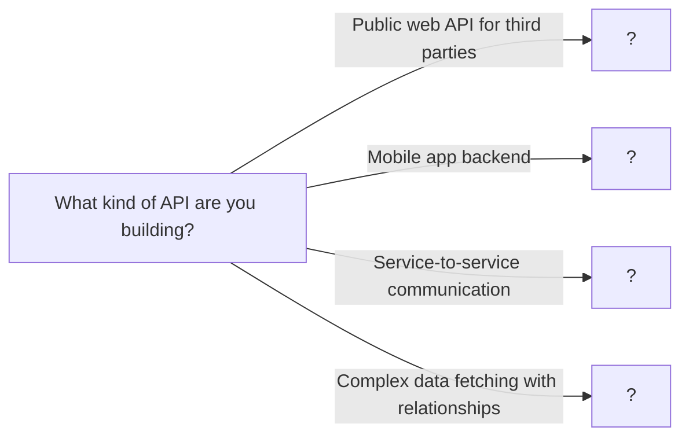

# API Design

> REST, GraphQL, and RPC - Choosing the right API paradigm

---

## Learning Objectives

By the end of this topic you will be able to:

- Design a REST API with correct resource naming, HTTP method usage, status codes, and pagination
- Implement a GraphQL query resolver with field-level resolution to eliminate over-fetching
- Compare REST, GraphQL, and RPC and choose the appropriate paradigm for a given use case
- Apply idempotency patterns to mutation endpoints to make them safe to retry
- Identify and correct common API mistakes: wrong HTTP methods, missing versioning, poor error structure
- Version an API so that existing clients are not broken when the schema evolves

---

## ELI5: Explain Like I'm 5

<div class="learner-section" markdown>

**Your task:** After implementing different API patterns, explain them simply.

**Prompts to guide you:**

1. **What is REST in one sentence?**
    - REST is a style for building APIs where <span class="fill-in">[resources are identified by ___ and actions are expressed using HTTP ___ like GET, POST, PUT, and DELETE]</span>

2. **Why do we use REST for web APIs?**
    - REST is popular because <span class="fill-in">[it maps naturally onto ___, is ___ to explore without a client library, and its ___ nature means any server can handle any ___]</span>

3. **Real-world analogy for REST:**
    - Example: "REST is like a restaurant menu where..."
    - Think about a menu where each dish is a resource with a name (URL), and you order (GET), create (POST), replace (PUT), or cancel (DELETE).
    - Your analogy: <span class="fill-in">[Fill in]</span>

4. **What is GraphQL in one sentence?**
    - GraphQL is a query language for APIs where <span class="fill-in">[the ___ specifies exactly which ___ it needs, so the server returns only ___ and never ___ or under-fetches]</span>

5. **When would you choose GraphQL over REST?**
    - GraphQL is preferred when <span class="fill-in">[different ___ (mobile vs web) need ___ shapes of data from the same endpoint, making multiple ___ round trips impractical]</span>

6. **Real-world analogy for GraphQL:**
    - Example: "GraphQL is like a buffet where..."
    - Think about a buffet where you pick exactly what you want rather than being served a fixed plate.
    - Your analogy: <span class="fill-in">[Fill in]</span>

7. **What is RPC (gRPC) in one sentence?**
    - gRPC is a framework for calling ___ on a remote service <span class="fill-in">[as if they were ___, using ___ contracts defined in `.proto` files and binary serialisation over ___]</span>

8. **When would you use RPC instead of REST?**
    - RPC is preferred when <span class="fill-in">[services are ___ each other inside the same data centre, latency is critical, and a strict typed ___ between services is more valuable than ___]</span>

</div>

---

## Core Implementation

### Part 1: REST API Design

**Your task:** Implement a simple REST API with proper resource design.

```java
--8<-- "com/study/systems/apidesign/RESTAPIServer.java"
```

!!! warning "Debugging Challenge — Wrong HTTP Methods"

    The controller below uses HTTP methods incorrectly in two places. Identify which operations are wrong and explain why the incorrect method matters beyond just convention.

    ```java
    // Operation 1: Get user profile
    @PostMapping("/users/{id}/profile")
    public User getProfile(@PathParam("id") String id) {
        return database.getUser(id);
    }

    // Operation 2: Update user's email (pass new email as query param)
    @GetMapping("/users/{id}/updateEmail")
    public Response updateEmail(
        @PathParam("id") String id,
        @RequestParam("email") String newEmail
    ) {
        User user = database.getUser(id);
        user.email = newEmail;
        database.save(user);
        return Response.ok("Email updated");
    }
    ```

    ??? success "Answer"

        **Operation 1 — POST should be GET:**
        `POST /users/{id}/profile` implies creating a new resource. Using GET is correct for a read-only fetch. Additionally, GET responses can be cached by browsers and proxies; POST responses cannot. Using POST for reads bypasses caching and signals to clients that the call has side effects.

        **Operation 2 — GET should be PATCH:**
        Using GET to modify state violates HTTP semantics. GET requests are expected to be safe (no side effects) and idempotent. Search engines, browser pre-fetchers, and monitoring tools routinely issue GET requests — any of these would inadvertently trigger an email update. PATCH (or PUT) signals that the request modifies server state and should not be pre-fetched.

---

### Part 2: GraphQL Query Engine

**Your task:** Implement a simple GraphQL query resolver.

```java
--8<-- "com/study/systems/apidesign/GraphQLResolver.java"
```

### Part 3: RPC (Remote Procedure Call)

**Your task:** Implement a simple RPC server with method invocation.

```java
--8<-- "com/study/systems/apidesign/RPCServer.java"
```

---

## Debugging Challenges

**Your task:** Find and fix bugs in broken API implementations. This tests your understanding.

### Challenge 1: Broken API Versioning

```java
/**
 * API versioning attempt - but has 2 CRITICAL BUGS.
 * Find them!
 */

@RestController
public class UserController {

    // Version 1 endpoint
    @GetMapping("/v1/users/{id}")
    public UserV1 getUserV1(String id) {
        User user = database.getUser(id);
        return convertToV1(user);
    }

    // Version 2 endpoint - BUG 1: What's wrong with this route?
    @GetMapping("/users/{id}")
    public UserV2 getUserV2(String id) {
        User user = database.getUser(id);
        return new UserV2(user.id, user.firstName, user.lastName, user.email);
    }

    // Update endpoint - BUG 2: Version handling issue
    @PutMapping("/users/{id}")
    public Response updateUser(String id, @RequestBody UpdateUserRequest req) {
        // Updates internal model
        User user = database.getUser(id);
        user.firstName = req.firstName;  // What if v1 client calls this?
        user.lastName = req.lastName;
        database.save(user);

        return Response.ok(user);
    }
}
```

**Your debugging:**

- Bug 1: <span class="fill-in">[What's the bug?]</span>

- Bug 2: <span class="fill-in">[What's the bug?]</span>

??? success "Answer"

    **Bug 1:** Version 2 endpoint uses `/users/{id}` instead of `/v2/users/{id}`. This creates ambiguity - which version is
    the "default"? Clients expect explicit versioning.

    **Fix:**

    ```java
    @GetMapping("/v2/users/{id}")
    public UserV2 getUserV2(String id) {
        // Now explicit
    }
    ```

    **Bug 2:** Single update endpoint doesn't handle version differences. V1 clients send `name` field, V2 clients send
    `firstName`/`lastName`. Need separate endpoints or request versioning.

    **Fix:**

    ```java
    @PutMapping("/v1/users/{id}")
    public Response updateUserV1(String id, @RequestBody UpdateUserV1Request req) {
        User user = database.getUser(id);
        // Parse single name into firstName/lastName
        String[] parts = req.name.split(" ", 2);
        user.firstName = parts[0];
        user.lastName = parts.length > 1 ? parts[1] : "";
        database.save(user);
        return Response.ok(convertToV1(user));
    }

    @PutMapping("/v2/users/{id}")
    public Response updateUserV2(String id, @RequestBody UpdateUserV2Request req) {
        User user = database.getUser(id);
        user.firstName = req.firstName;
        user.lastName = req.lastName;
        database.save(user);
        return Response.ok(new UserV2(user));
    }
    ```

---

### Challenge 2: Broken Pagination

```java
/**
 * Pagination implementation with 3 BUGS.
 * Two are logic errors, one is a performance issue.
 */

@GetMapping("/users/{userId}/posts")
public PaginatedResponse getPosts(
    @PathParam("userId") String userId,
    @RequestParam("page") int page,    @RequestParam("limit") int limit) {
    // Calculate offset
    int offset = page * limit;
    List<Post> posts = database.query(
        "SELECT * FROM posts WHERE user_id = ? LIMIT ? OFFSET ?",
        userId, limit, offset
    );

    int total = database.query(
        "SELECT COUNT(*) FROM posts WHERE user_id = ?",
        userId
    );

    return new PaginatedResponse(posts, page, limit, total);
}
```

**Your debugging:**

**Bug 1:** <span class="fill-in">[What happens if client doesn't send page/limit parameters?]</span>

- Impact: <span class="fill-in">[What error occurs?]</span>
- Fix: <span class="fill-in">[What should be added?]</span>

**Bug 2:** <span class="fill-in">[What if client sends limit=999999?]</span>

- Impact: <span class="fill-in">[What problem does this cause?]</span>
- Fix: <span class="fill-in">[How to prevent abuse?]</span>

**Bug 3:** <span class="fill-in">[Is the offset calculation correct?]</span>

- Test: page=1, limit=10 → offset = <span class="fill-in">___</span>
- Expected: offset should be ___
- Fix: <span class="fill-in">[Correct formula?]</span>

??? success "Answer"

    **Bug 1:** Missing default values. If client doesn't send parameters, request fails with 400 Bad Request.

    **Fix:**

    ```java
    @RequestParam(defaultValue = "1") int page,
    @RequestParam(defaultValue = "20") int limit
    ```

    **Bug 2:** No limit validation. Malicious client could send `limit=999999` and DOS the database.

    **Fix:**

    ```java
    if (limit > 100) limit = 100;  // Cap at max
    if (limit < 1) limit = 20;     // Minimum 1
    ```

    **Bug 3:** Offset calculation is off by one. Page 1 should start at offset 0, not 10.

    **Correct calculation:**

    - Page 1, limit 10: offset = (1-1) * 10 = 0 (items 0-9)
    - Page 2, limit 10: offset = (2-1) * 10 = 10 (items 10-19)

    **Fix:**

    ```java
    int offset = (page - 1) * limit;
    ```

---

### Challenge 3: Poor Error Handling

```java
/**
 * Error handling that makes debugging IMPOSSIBLE.
 * Find all the problems!
 */

@PostMapping("/users")
public Response createUser(@RequestBody CreateUserRequest req) {
    try {
        // Validation
        if (req.email == null) {
            return Response.status(500).body("Error");        }

        if (!req.email.contains("@")) {
            return Response.status(200).body(null);        }

        // Check duplicate
        User existing = database.findByEmail(req.email);
        if (existing != null) {
            return Response.status(400).body("Error");        }

        // Create user
        User user = database.createUser(req);
        return Response.status(200).body(user);
    } catch (Exception e) {
        return Response.status(500).body("Something went wrong");
    }
}
```

**Your debugging:**

**Bug 1:** Missing email should return status ___ with message ___

**Bug 2:** Invalid email format should return status ___ with message ___

**Bug 3:** Duplicate email should return status ___ with message ___

- Current: 400 Bad Request
- Correct: <span class="fill-in">[Fill in]</span>
- Why: <span class="fill-in">[Explain the difference]</span>

**Bug 4:** Successful creation should return status ___

- Current: 200 OK
- Correct: <span class="fill-in">[Fill in]</span>
- Why: <span class="fill-in">[Explain]</span>

**Bug 5:** Generic catch block problems:

1. <span class="fill-in">[What's lost?]</span>
2. <span class="fill-in">[How to fix?]</span>
3. <span class="fill-in">[What should be logged?]</span>

??? success "Answer"

    **Status code fixes:**

    - Bug 1: 400 Bad Request (not 500) — client sent invalid data, not a server error
    - Bug 2: 400 Bad Request with a descriptive message (not 200 with null body)
    - Bug 3: **409 Conflict** (not 400) — resource conflict, not a generic bad request
    - Bug 4: **201 Created** (not 200) — a new resource was created
    - Bug 5: Always log exceptions with context; provide structured `ApiError` objects; differentiate database vs unexpected errors

---

### Challenge 4: Missing Idempotency

```java
/**
 * Payment processing without idempotency.
 * What could go wrong?
 */

@PostMapping("/payments")
public Response processPayment(@RequestBody PaymentRequest req) {
    // Create payment record
    Payment payment = new Payment();
    payment.userId = req.userId;
    payment.amount = req.amount;
    payment.status = "PENDING";
    database.save(payment);

    // Charge credit card
    try {
        creditCardService.charge(req.cardToken, req.amount);
        payment.status = "COMPLETED";
        database.save(payment);
        return Response.status(201).body(payment);
    } catch (PaymentFailedException e) {
        payment.status = "FAILED";
        database.save(payment);
        return Response.status(400).body("Payment failed");
    }
}
```

**Your debugging:**

**Scenario 1:** Client submits payment, network timeout before response

- Client doesn't know if payment succeeded
- Client retries request
- What happens? <span class="fill-in">[Fill in]</span>
- Impact: <span class="fill-in">[Fill in]</span>

**Scenario 2:** Request processed, card charged, but database save fails

- Card was charged: <span class="fill-in">[Yes/No]</span>
- Payment record exists: <span class="fill-in">[Yes/No]</span>
- User's money: <span class="fill-in">[What happened?]</span>

**Fixes needed:**

1. Add <span class="fill-in">[what field?]</span> to ensure idempotency
2. Check <span class="fill-in">[what?]</span> before processing
3. Handle <span class="fill-in">[what scenario?]</span> to prevent double charging

??? success "Answer"

    **Problems:**

    1. No idempotency = double charging on retry
    2. No transaction = money charged but no record
    3. No way to safely retry

    **Key fixes:**

    1. Add `Idempotency-Key` request header (unique UUID per payment attempt)
    2. Look up existing payment by idempotency key before processing; return cached result if found
    3. Wrap card charge and database save in a transaction — if the save fails, roll back so the charge is not recorded against a ghost record
    4. With idempotency key, safe retries return the original result without re-charging

---

### Your Debugging Scorecard

After finding and fixing all bugs:

- [ ] Found all versioning issues
- [ ] Fixed pagination bugs and understood why they matter
- [ ] Improved error handling with proper status codes and structured errors
- [ ] Implemented idempotency for critical operations

**Common API mistakes you discovered:**

1. <span class="fill-in">[List the patterns you noticed]</span>
2. <span class="fill-in">[Fill in]</span>
3. <span class="fill-in">[Fill in]</span>

**Production-critical issues:**

- Which bug could cause financial loss? <span class="fill-in">[Fill in]</span>
- Which bug would break clients immediately? <span class="fill-in">[Fill in]</span>
- Which bug would cause performance issues at scale? <span class="fill-in">[Fill in]</span>

---

## Before/After: Why Good API Design Matters

**Your task:** Compare poorly designed vs well-designed APIs to understand the impact.

### Example 1: API Versioning

**Problem:** API needs to change user field from `name` to `firstName` and `lastName`.

#### Approach 1: Breaking Change (Bad)

```java
// Version 1 (deployed to production)
class User {
    String id;
    String name;        // Single name field
    String email;
}

// Suddenly changed to Version 2 - BREAKS ALL CLIENTS!
class User {
    String id;
    String firstName;   // Broken change
    String lastName;    // Broken change
    String email;
}
```

All existing clients that reference `user.name` break immediately with no migration path.

#### Approach 2: Versioned API (Good)

```java
// Version 1 - Still supported
// GET /v1/users/123
class UserV1 {
    String id;
    String name;        // Still works for old clients
    String email;
}

// Version 2 - New clients can opt in
// GET /v2/users/123
class UserV2 {
    String id;
    String firstName;   // New field
    String lastName;    // New field
    String email;
}

// API routes both versions
@GetMapping("/v1/users/{id}")
public UserV1 getUserV1(String id) {
    User user = database.getUser(id);
    // Convert to V1 format
    return new UserV1(user.id,
                      user.firstName + " " + user.lastName,
                      user.email);
}

@GetMapping("/v2/users/{id}")
public UserV2 getUserV2(String id) {
    User user = database.getUser(id);
    return new UserV2(user.id, user.firstName, user.lastName, user.email);
}
```

Old clients hit `/v1/` and continue working. New clients opt into `/v2/`. A deprecation header (`Deprecation: true`, `Sunset: Dec 2024`) signals when to migrate.

**After implementing, answer:**

<div class="learner-section" markdown>

- Why is versioning critical for APIs? <span class="fill-in">[Your answer]</span>
- When would you create a new API version? <span class="fill-in">[Your answer]</span>
- How long should you support old versions? <span class="fill-in">[Your answer]</span>

</div>

!!! warning "When it breaks"
    Offset pagination breaks at deep pages — `OFFSET 1,000,000` in SQL scans and discards a million rows before returning results, causing query time to grow linearly with page depth. Cursor-based pagination fixes this but prevents jumping to an arbitrary page. GraphQL breaks when query depth is unrestricted: a client can craft a query that fans out exponentially across nested relationships, executing thousands of database queries behind one HTTP request — without depth limiting and query cost analysis, a GraphQL endpoint is a DoS vector. REST versioning breaks when more than two or three major versions are simultaneously maintained; the operational cost of running v1/v2/v3 in parallel (separate deployments, separate bug backlogs) typically forces deprecation timelines that the business then fails to enforce.

---

## Case Studies: API Design in the Wild

### Stripe API: The Gold Standard for REST

- **Paradigm:** REST.
- **How it works:** Stripe's API is a model for resource-oriented design. Resources are represented as nouns (e.g.,
  `/v1/customers`, `/v1/charges`, `/v1/subscriptions`). It uses HTTP verbs correctly (e.g., `POST /v1/charges` to create
  a new charge, `GET /v1/charges/{id}` to retrieve it). It also excels at developer experience with clear error
  messages, idempotent request handling, and versioning in the URL.
- **Key Takeaway:** For a public-facing API where predictability, scalability, and a wide range of client support are
  essential, a well-documented REST architecture is a powerful and reliable choice. It sets clear boundaries and is
  easily explorable.

### GitHub API: GraphQL for Flexibility

- **Paradigm:** GraphQL.
- **How it works:** GitHub's v4 API uses GraphQL to allow developers to craft precise queries for the exact data they
  need. Instead of making multiple REST calls to get a repository, its pull requests, and their review comments, a
  developer can write a single GraphQL query that specifies this nested structure.
- **Key Takeaway:** GraphQL is ideal for applications with complex data models and varied client needs (like mobile vs.
  web). It solves the over-fetching and under-fetching problems common in REST, but adds complexity to the server-side
  with query parsing and execution.

### Google & Netflix: gRPC for Internal Microservices

- **Paradigm:** RPC (specifically, gRPC).
- **How it works:** In a microservices architecture, services need to communicate with each other at very high speed.
  Google developed gRPC for this purpose. Services define their interfaces using Protocol Buffers (`.proto` files),
  which act as a strict contract. gRPC then generates client and server code, enabling efficient, low-latency, binary
  communication over HTTP/2.
- **Key Takeaway:** For internal service-to-service communication where performance is critical and contracts need to be
  strictly enforced, gRPC is often superior to REST. The focus is not on human-readable resources but on
  high-performance procedure calls.

---

## Common Misconceptions

!!! danger "REST requires JSON responses"
    REST is a *style*, not a format. A REST API can return XML, protobuf, plain text, or any media type — the `Content-Type` header tells the client what it received. JSON became the default because it is easy to consume from JavaScript, not because REST mandates it. `Accept: application/xml` is a perfectly valid REST request.

!!! danger "GraphQL automatically prevents the N+1 query problem"
    GraphQL's resolver model can actually *introduce* N+1 queries. If resolving `User.posts` executes one database query per user, fetching 100 users with their posts triggers 101 database queries. Tools like the DataLoader pattern are required to batch these into a single query. GraphQL does not solve N+1 by itself.

!!! danger "HTTP 404 means the server is broken"
    404 Not Found is a completely normal, expected response. It means the requested resource does not exist at that URL — nothing more. Clients should handle 404 gracefully. The distinction that matters in practice is: 404 (resource never existed or has been removed) vs 410 Gone (resource existed and was intentionally deleted) vs 503 (server is temporarily unavailable).

---

## Decision Framework

<div class="learner-section" markdown>

**Questions to answer after implementation:**

### 1. REST vs GraphQL vs RPC

**When to use REST?**

- Your scenario: <span class="fill-in">[Fill in]</span>
- Key factors: <span class="fill-in">[Fill in]</span>

**When to use GraphQL?**

- Your scenario: <span class="fill-in">[Fill in]</span>
- Key factors: <span class="fill-in">[Fill in]</span>

**When to use RPC?**

- Your scenario: <span class="fill-in">[Fill in]</span>
- Key factors: <span class="fill-in">[Fill in]</span>

### 2. Trade-offs

**REST:**

- Pros: <span class="fill-in">[Fill in after understanding]</span>
- Cons: <span class="fill-in">[Fill in after understanding]</span>

**GraphQL:**

- Pros: <span class="fill-in">[Fill in after understanding]</span>
- Cons: <span class="fill-in">[Fill in after understanding]</span>

**RPC:**

- Pros: <span class="fill-in">[Fill in after understanding]</span>
- Cons: <span class="fill-in">[Fill in after understanding]</span>

### 3. Your Decision Tree

Build your decision tree after practicing:

```mermaid
flowchart LR
    Start["What kind of API are you building?"]

    N1["?"]
    Start -->|"Public web API for third parties"| N1
    N2["?"]
    Start -->|"Mobile app backend"| N2
    N3["?"]
    Start -->|"Service-to-service communication"| N3
    N4["?"]
    Start -->|"Complex data fetching with relationships"| N4
```

</div>

---

## Practice

<div class="learner-section" markdown>

### Scenario 1: Design API for a blogging platform

**Requirements:**

- Users can create, edit, delete posts
- Users can comment on posts
- Users can follow other users
- Feed shows posts from followed users

**Your API design:**

- Which paradigm would you choose? <span class="fill-in">[Fill in]</span>
- Why? <span class="fill-in">[Fill in]</span>
- Key endpoints/queries: <span class="fill-in">[Fill in]</span>
- How to handle feed generation? <span class="fill-in">[Fill in]</span>

**Failure modes:**

- What happens if the feed generation service becomes unavailable and clients retry aggressively? <span class="fill-in">[Fill in]</span>
- How does your design behave when a post deletion must propagate across all cached feed responses? <span class="fill-in">[Fill in]</span>

### Scenario 2: Design API for microservices

**Requirements:**

- Order service needs to call Payment service
- Payment service needs to call Notification service
- Low latency required
- Services are within same data center

**Your API design:**

- Which paradigm would you choose? <span class="fill-in">[Fill in]</span>
- Why? <span class="fill-in">[Fill in]</span>
- How to handle errors? <span class="fill-in">[Fill in]</span>
- How to handle retries? <span class="fill-in">[Fill in]</span>

**Failure modes:**

- What happens if the Payment service is down when the Order service calls it mid-transaction? <span class="fill-in">[Fill in]</span>
- How does your design behave when a Notification service call times out and the retry triggers a duplicate notification? <span class="fill-in">[Fill in]</span>

### Scenario 3: Design API for mobile app with poor network

**Requirements:**

- Mobile app on slow 3G network
- Needs user profile, posts, and comments
- Different screens need different data
- Want to minimize requests

**Your API design:**

- Which paradigm would you choose? <span class="fill-in">[Fill in]</span>
- Why? <span class="fill-in">[Fill in]</span>
- How to optimize for mobile? <span class="fill-in">[Fill in]</span>
- Caching strategy? <span class="fill-in">[Fill in]</span>

**Failure modes:**

- What happens if the mobile client loses connectivity mid-request and retries with the same payload? <span class="fill-in">[Fill in]</span>
- How does your design behave when the server returns a partial response due to a timeout on a slow 3G connection? <span class="fill-in">[Fill in]</span>

</div>

---

## Test Your Understanding

Answer these without referring to your notes or implementation.

1. A REST `DELETE /users/123` is called twice. The first call succeeds and deletes the user. The second call finds no user. Should the second call return 200, 204, or 404? Justify your answer in terms of idempotency.

    ??? success "Rubric"
        A complete answer addresses: (1) both 204 and 404 are defensible — the choice depends on API contract; 404 is the more common production choice, (2) the key insight is that idempotency means the server state is identical after multiple identical requests, not that the status code must be identical, (3) returning 404 on the second call is acceptable because the resource is gone; documenting this behaviour in the API contract is the critical requirement.

2. A mobile client needs a user's profile, their last 5 posts, and the like count on each post — all on one screen. Compare the number of HTTP round trips required with REST versus GraphQL, and explain which wins here and why.

    ??? success "Rubric"
        A complete answer addresses: (1) REST requires at least 3 round trips: GET /users/{id}, GET /users/{id}/posts, then N GET /posts/{id}/likes calls (N+1 problem), (2) GraphQL requires 1 round trip with a nested query specifying exactly the fields needed, (3) on a slow mobile network the latency saving from 1 vs 3+ round trips outweighs GraphQL's added server complexity, making GraphQL the better choice here.

3. Your team is adding a `middleName` field to the User resource. Is this a breaking change? What about removing the `age` field? Explain the difference and what versioning strategy each requires.

    ??? success "Rubric"
        A complete answer addresses: (1) adding an optional field is non-breaking — existing clients that ignore unknown fields continue to work, so no new version is needed, (2) removing an existing field is breaking — any client that reads `age` will receive null or an error, requiring a new API version (e.g., `/v2/users`), (3) a sunset header on the old version gives clients a migration window before the old endpoint is decommissioned.

4. A payment endpoint uses `POST /payments` without an idempotency key. A client sends a request, receives a network timeout, and retries. Describe exactly what can go wrong and what the correct fix looks like.

    ??? success "Rubric"
        A complete answer addresses: (1) the server may have processed the first request and charged the card before the timeout, so the retry creates a second charge — double billing the customer, (2) the fix is an `Idempotency-Key` header (a client-generated UUID) stored by the server; if the same key arrives again, return the cached response without re-processing, (3) the idempotency key store must be durable so a server restart does not lose the record and allow re-processing.

5. A colleague says "We should use GraphQL for our internal microservice communication because it's more flexible than REST." What is the better choice and why, and what does GraphQL not provide that internal services actually need?

    ??? success "Rubric"
        A complete answer addresses: (1) gRPC (RPC with Protocol Buffers) is the better choice for internal microservice communication because it provides binary serialisation, HTTP/2 multiplexing, and generated typed clients, (2) GraphQL's flexibility is designed for external clients with varied data needs, not for internal services with known, stable interfaces, (3) GraphQL does not provide the strongly-typed generated contracts and low-latency binary protocol that internal services need for high-throughput inter-service calls.

---

## Your API Design Principles (Write Your Own)

Based on everything you've learned, write your personal API design checklist:

**My Top 5 API Design Principles:**

1. <span class="fill-in">[Fill in]</span>
2. <span class="fill-in">[Fill in]</span>
3. <span class="fill-in">[Fill in]</span>
4. <span class="fill-in">[Fill in]</span>
5. <span class="fill-in">[Fill in]</span>

**My Top 3 API Anti-Patterns to Avoid:**

1. <span class="fill-in">[Fill in]</span>
2. <span class="fill-in">[Fill in]</span>
3. <span class="fill-in">[Fill in]</span>

**When I review an API, I check:**

- [ ] <span class="fill-in">[Your checklist item]</span>
- [ ] <span class="fill-in">[Your checklist item]</span>
- [ ] <span class="fill-in">[Your checklist item]</span>
- [ ] <span class="fill-in">[Your checklist item]</span>
- [ ] <span class="fill-in">[Your checklist item]</span>

---

## Connected Topics

<div class="bs-callout bs-callout-info" markdown>

**Where this topic connects**

- **07. Security Patterns** — all external APIs require authentication (JWT or API keys) and authorization (RBAC); API design choices affect token scope and validation overhead → [07. Security Patterns](07-security-patterns.md)
- **08. Rate Limiting** — rate limiting protects API endpoints from abuse; API versioning strategy affects whether limits are applied per-version or globally → [08. Rate Limiting](08-rate-limiting.md)
- **03. Networking Fundamentals** — HTTP versions covered in topic 03 determine which API features are possible (e.g. HTTP/2 enables server push and header compression) → [03. Networking Fundamentals](03-networking-fundamentals.md)

</div>
