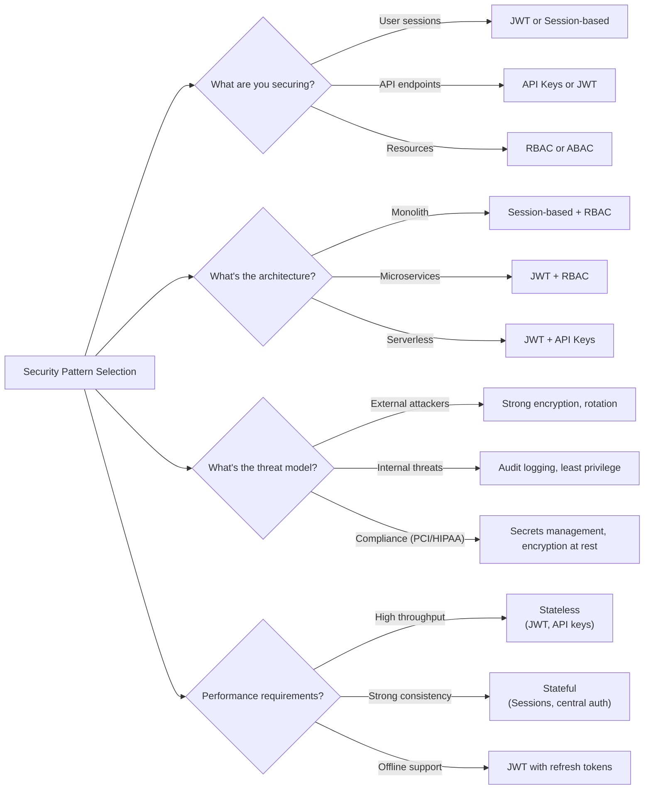

# 07. Security Patterns

> Authentication, authorization, and securing distributed systems

---

## ELI5: Explain Like I'm 5

<div class="learner-section" markdown>

**Your task:** After implementing security patterns, explain them simply.

**Prompts to guide you:**

1. **What is authentication in one sentence?**
    - Your answer: <span class="fill-in">[Fill in after implementation]</span>

2. **What is authorization in one sentence?**
    - Your answer: <span class="fill-in">[Fill in after implementation]</span>

3. **Real-world analogy for authentication:**
    - Example: "Authentication is like showing your ID at the door..."
    - Your analogy: <span class="fill-in">[Fill in]</span>

4. **Real-world analogy for authorization:**
    - Example: "Authorization is like having a key to certain rooms..."
    - Your analogy: <span class="fill-in">[Fill in]</span>

5. **What is JWT in one sentence?**
    - Your answer: <span class="fill-in">[Fill in after implementation]</span>

6. **When should you use JWT vs sessions?**
    - Your answer: <span class="fill-in">[Fill in after practice]</span>

</div>

---

## Quick Quiz (Do BEFORE implementing)

<div class="learner-section" markdown>

**Your task:** Test your security intuition without looking at code. Answer these, then verify after implementation.

### Security Concept Predictions

1. **Authentication vs Authorization:**
    - Authentication is: <span class="fill-in">[Your definition]</span>
    - Authorization is: <span class="fill-in">[Your definition]</span>
    - Example scenario: <span class="fill-in">[Think of real-world example]</span>

2. **JWT token structure:**
    - Three parts: <span class="fill-in">[What are they?]</span>
    - Why is signature needed?: <span class="fill-in">[Your guess]</span>
    - Can client modify payload?: <span class="fill-in">[Yes/No - Why?]</span>

3. **RBAC complexity:**
    - Checking permission for user with 3 roles: O(?)
    - Better than checking each permission individually?: <span class="fill-in">[Yes/No - Why?]</span>

### Scenario Predictions

**Scenario 1:** A user tries to access a protected resource with JWT token

- **What gets validated first?** <span class="fill-in">[Signature? Expiration? Claims?]</span>
- **If signature invalid, what does it mean?** <span class="fill-in">[Token tampered? Expired? Wrong secret?]</span>
- **What happens if token expired but signature valid?** <span class="fill-in">[Allow? Deny? Refresh?]</span>

**Scenario 2:** Implementing RBAC for a blog platform

- **Roles needed:** <span class="fill-in">[List them]</span>
- **VIEWER can:** <span class="fill-in">[What permissions?]</span>
- **EDITOR can:** <span class="fill-in">[What permissions beyond VIEWER?]</span>
- **ADMIN can:** <span class="fill-in">[Everything or specific permissions?]</span>

**Scenario 3:** API key gets leaked on GitHub

- **Immediate action:** <span class="fill-in">[What to do first?]</span>
- **Why rotation matters:** <span class="fill-in">[Explain]</span>
- **How to prevent:** <span class="fill-in">[Fill in]</span>

### Security Trade-off Quiz

**Question:** When would Session-based auth be BETTER than JWT?

- Your answer: <span class="fill-in">[Fill in before implementation]</span>
- Verified answer: <span class="fill-in">[Fill in after learning]</span>

**Question:** What's the MAIN advantage of JWT over sessions?

- [ ] More secure
- [ ] Stateless (no server-side storage)
- [ ] Easier to implement
- [ ] Better performance

Verify after implementation: <span class="fill-in">[Which one(s)?]</span>

**Question:** Why use HMAC for JWT signature instead of just Base64 encoding?

- Your answer: <span class="fill-in">[Fill in]</span>
- Verified: <span class="fill-in">[Fill in after implementation]</span>

</div>

---

## Before/After: Why Security Patterns Matter

**Your task:** Compare insecure vs secure approaches to understand the security impact.

### Example 1: Authentication - Insecure vs Secure

**Problem:** Implement user authentication for an API.

#### Approach 1: Insecure - Username/Password in Every Request

```java
// INSECURE: Sending credentials with every request
public class InsecureAuth {

    public boolean authenticateRequest(String username, String password) {
        // Problem: Credentials sent with EVERY API call
        // - Exposed in logs, network traffic
        // - No expiration mechanism
        // - Can't revoke access without changing password
        return checkDatabase(username, password);
    }

    // Client code
    public void makeAPICall() {
        // INSECURE: Username and password in every request
        String response = httpClient.get("/api/data",
            "username=john",
            "password=secret123");  // Exposed!
    }
}
```

**Security Issues:**

- Credentials exposed in every request (logs, network, proxy)
- No way to revoke access without password change
- Password transmitted repeatedly (more attack surface)
- Can't implement session timeout
- Difficult to audit (which requests from which session?)

#### Approach 2: Secure - JWT Token-Based Auth

```java
// SECURE: Token-based authentication
public class SecureJWTAuth {

    private final String secret = System.getenv("JWT_SECRET");  // From environment
    private final long expirationMs = 3600000;  // 1 hour

    // Step 1: Login once to get token
    public String login(String username, String password) {
        if (!validateCredentials(username, password)) {
            return null;
        }

        // Generate short-lived token
        return generateJWT(username, expirationMs);
    }

    // Step 2: Use token for subsequent requests
    public boolean authenticateRequest(String token) {
        try {
            String userId = validateJWT(token);
            // Check expiration
            if (isExpired(token)) {
                return false;  // Must re-login
            }
            return userId != null;
        } catch (SecurityException e) {
            return false;  // Invalid signature
        }
    }

    // Client code
    public void makeAPICall() {
        // SECURE: Token in Authorization header
        String token = loginOnce("john", "secret123");
        String response = httpClient.get("/api/data",
            headers: {"Authorization": "Bearer " + token});
        // Password only sent once during login!
    }
}
```

**Security Improvements:**

- Credentials only sent once during login
- Token expires automatically (limited exposure window)
- Can revoke tokens without password change
- Signature prevents tampering
- Stateless (scales horizontally)
- Audit-friendly (track token usage)

#### Performance & Security Comparison

| Aspect               | Insecure (Creds Every Request) | Secure (JWT)       | Improvement    |
|----------------------|--------------------------------|--------------------|----------------|
| Credential exposure  | Every request                  | Login only         | 100x less      |
| Revocation           | Change password                | Revoke token       | Immediate      |
| Expiration           | None                           | Built-in           | Auto-logout    |
| Tampering protection | None                           | HMAC signature     | Detectable     |
| Scalability          | Database hit every request     | No database lookup | 10-100x faster |
| Audit trail          | Difficult                      | Token ID trackable | Complete       |

**Your calculation:** If a user makes 1,000 API calls per day:

- Insecure approach exposes credentials _____ times
- Secure approach exposes credentials _____ time(s)
- Security improvement: <span class="fill-in">_____</span> x safer

---

### Example 2: Authorization - No Checks vs RBAC

**Problem:** Control who can delete blog posts.

#### Approach 1: No Authorization Checks

```java
// INSECURE: No authorization, anyone can delete
public class NoAuthzBlog {

    public boolean deletePost(String postId, String userId) {
        // Any authenticated user can delete any post
        database.delete("posts", postId);
        return true;
    }

    // Security hole: Attacker can delete all posts
    public void attackExample() {
        // Even a VIEWER role can do this!
        deletePost("important-post", "attacker-user-id");
    }
}
```

**Security Issues:**

- Any authenticated user can perform any action
- No distinction between roles (viewer, editor, admin)
- Privilege escalation: viewer acts as admin
- No audit trail of who did what
- Cannot implement least privilege principle

#### Approach 2: RBAC Authorization

```java
// SECURE: Role-Based Access Control
public class RBACBlog {

    private final RBACAuthorizer rbac;

    public boolean deletePost(String postId, String userId) {
        // Step 1: Check authorization BEFORE action
        if (!rbac.hasPermission(userId, Permission.DELETE)) {
            auditLog.warn("Unauthorized delete attempt", userId, postId);
            throw new SecurityException("Insufficient permissions");
        }

        // Step 2: Additional check - can only delete own posts (unless admin)
        Post post = database.getPost(postId);
        if (!post.authorId.equals(userId) &&
            !rbac.hasRole(userId, Role.ADMIN)) {
            throw new SecurityException("Can only delete own posts");
        }

        // Step 3: Perform action with audit logging
        database.delete("posts", postId);
        auditLog.info("Post deleted", userId, postId);
        return true;
    }

    // Secure example: Permission properly checked
    public void secureExample() {
        try {
            deletePost("important-post", "viewer-user-id");
        } catch (SecurityException e) {
            // Blocked! Viewer doesn't have DELETE permission
            System.out.println("Access denied: " + e.getMessage());
        }
    }
}
```

**Security Improvements:**

- Explicit permission check before every sensitive action
- Role-based hierarchy (viewer < editor < admin)
- Audit logging for security events
- Fail-secure (deny by default)
- Least privilege principle enforced

#### Security Comparison

| Attack Vector                | No Authorization | With RBAC  | Prevented? |
|------------------------------|------------------|------------|------------|
| Viewer deletes posts         | Succeeds         | Blocked    | ✓          |
| Editor deletes other's posts | Succeeds         | Blocked    | ✓          |
| User promotes self to admin  | Succeeds         | Blocked    | ✓          |
| Audit trail of actions       | None             | Complete   | ✓          |
| Privilege escalation         | Easy             | Impossible | ✓          |

**After implementing, explain in your own words:**

<div class="learner-section" markdown>

- Why is "deny by default" important? <span class="fill-in">[Your answer]</span>
- What happens if you forget one authorization check? <span class="fill-in">[Your answer]</span>
- How does RBAC prevent privilege escalation? <span class="fill-in">[Your answer]</span>

</div>

---

### Example 3: Secrets Management - Hardcoded vs Encrypted

**Problem:** Store database password for application use.

#### Approach 1: Hardcoded Credentials

```java
// INSECURE: Hardcoded credentials in source code
public class HardcodedSecrets {

    private static final String DB_PASSWORD = "super-secret-pwd-123";

    public Connection connectToDatabase() {
        // Problems:
        // 1. Password in version control (git history)
        // 2. Visible to anyone with code access
        // 3. Can't rotate without redeploying
        // 4. Same password in dev, staging, prod
        return DriverManager.getConnection(
            "jdbc:postgresql://db.example.com/mydb",
            "dbuser",
            DB_PASSWORD  // EXPOSED!
        );
    }
}
```

**Security Issues:**

- Secret in git history (can't remove)
- Visible in source code reviews
- Leaked in compiled binaries/JAR files
- Can't rotate without code changes + redeployment
- Same secret across all environments
- Exposed in logs, stack traces, debugging

#### Approach 2: Encrypted Secrets Management

```java
// SECURE: Encrypted secrets with rotation
public class SecureSecretsManagement {

    private final SecretsManager secretsManager;

    public Connection connectToDatabase() {
        // Step 1: Retrieve secret from encrypted store
        // - Master key stored in environment/HSM
        // - Secrets encrypted at rest
        // - Access controlled per service
        String dbPassword = secretsManager.getSecret(
            "db_password",
            getCurrentServiceId()
        );

        // Step 2: Use secret (never log it!)
        return DriverManager.getConnection(
            "jdbc:postgresql://db.example.com/mydb",
            "dbuser",
            dbPassword  // Retrieved securely
        );
        // Step 3: dbPassword cleared from memory after use
    }

    // Rotation without downtime
    public void rotatePassword() {
        // 1. Generate new password
        String newPassword = generateSecurePassword();

        // 2. Update database with new password
        database.updateUserPassword("dbuser", newPassword);

        // 3. Store new version in secrets manager
        secretsManager.rotateSecret("db_password", newPassword);

        // 4. Old version still valid for grace period
        // 5. After grace period, old version deleted
    }
}
```

**Security Improvements:**

- Secrets never in source code or version control
- Encrypted at rest with master key
- Access control (only authorized services can read)
- Audit logging (who accessed what secret when)
- Rotation without code changes or redeployment
- Different secrets per environment (dev/staging/prod)
- Automatic expiration and rotation

#### Security Impact Analysis

| Risk                 | Hardcoded         | Secrets Manager  | Mitigation |
|----------------------|-------------------|------------------|------------|
| Git leak             | Exposed forever   | Not in git       | ✓          |
| Code review leak     | Visible           | Not visible      | ✓          |
| Rotation cost        | Redeploy          | API call         | ✓          |
| Audit capability     | None              | Full logging     | ✓          |
| Blast radius         | All environments  | Isolated         | ✓          |
| Post-breach response | Manual everywhere | Rotate instantly | ✓          |

**Real-world impact:** In 2019, 50,000+ hardcoded secrets leaked on GitHub led to major breaches.

**Your reflection after implementation:**

- How would you rotate a leaked hardcoded password? <span class="fill-in">[Your answer]</span>
- What's the blast radius if secrets manager is breached vs. hardcoded? <span class="fill-in">[Your answer]</span>
- Why is "secrets in environment variables" better than hardcoded but still not ideal? <span class="fill-in">[Your answer]</span>

---

## Core Implementation

### Pattern 1: JWT-Based Authentication

**Concept:** Stateless authentication using JSON Web Tokens.

**Use case:** Microservices, API authentication, mobile apps.

```java
import java.util.*;
import java.nio.charset.StandardCharsets;
import java.util.Base64;
import javax.crypto.Mac;
import javax.crypto.spec.SecretKeySpec;

/**
 * JWT Authentication: Stateless token-based auth
 *
 * Token structure: header.payload.signature
 * - Header: algorithm and token type
 * - Payload: claims (user data, expiration)
 * - Signature: HMAC of header+payload with secret
 */
public class JWTAuthenticator {

    private final String secret;
    private final long expirationMs;

    public JWTAuthenticator(String secret, long expirationMs) {
        this.secret = secret;
        this.expirationMs = expirationMs;
    }

    /**
     * Generate JWT token for user
     * Time: O(1), Space: O(1)
     *
     * TODO: Implement JWT generation
     * 1. Create header: {"alg": "HS256", "typ": "JWT"}
     * 2. Create payload: {"sub": userId, "exp": expiration, "iat": issuedAt}
     * 3. Base64 encode header and payload
     * 4. Sign with HMAC-SHA256
     * 5. Return header.payload.signature
     */
    public String generateToken(String userId) {
        // TODO: Create header

        // TODO: Create payload with expiration

        // TODO: Create signature

        // TODO: Return JWT

        return null; // Replace
    }

    /**
     * Validate and extract user from JWT
     * Time: O(1), Space: O(1)
     *
     * TODO: Implement JWT validation
     * 1. Split token into parts
     * 2. Verify signature
     * 3. Check expiration
     * 4. Extract and return user ID
     */
    public String validateToken(String token) {
        // TODO: Split token

        // TODO: Verify signature

        // TODO: Decode and check expiration

        // TODO: Return userId from payload
        return null; // Replace
    }

    /**
     * Helper: Base64 URL-safe encoding
     *
     * TODO: Implement base64 URL encoding
     */
    private String base64UrlEncode(String input) {
        // TODO: Encode and make URL-safe
        return null; // Replace
    }

    /**
     * Helper: HMAC-SHA256 signature
     *
     * TODO: Implement HMAC signing
     */
    private String hmacSha256(String data, String key) {
        // TODO: Use Mac with HmacSHA256
        return null; // Replace
    }
}
```

**Runnable Client Code:**

```java
public class JWTClient {

    public static void main(String[] args) {
        System.out.println("=== JWT Authentication ===\n");

        String secret = "your-256-bit-secret";
        long expirationMs = 3600000; // 1 hour

        JWTAuthenticator auth = new JWTAuthenticator(secret, expirationMs);

        // Test 1: Generate token
        System.out.println("--- Test 1: Generate Token ---");
        String token = auth.generateToken("user123");
        System.out.println("Generated token: " + token);

        // Test 2: Validate token
        System.out.println("\n--- Test 2: Validate Token ---");
        String userId = auth.validateToken(token);
        System.out.println("Extracted user: " + userId);

        // Test 3: Invalid token
        System.out.println("\n--- Test 3: Invalid Token ---");
        String invalidToken = "invalid.token.here";
        String result = auth.validateToken(invalidToken);
        System.out.println("Validation result: " + result);
    }
}
```

---

### Pattern 2: Role-Based Access Control (RBAC)

**Concept:** Authorization based on user roles and permissions.

**Use case:** Multi-tenant systems, enterprise applications, admin panels.

```java
import java.util.*;

/**
 * RBAC: Role-Based Access Control
 *
 * Concepts:
 * - Users have roles (admin, editor, viewer)
 * - Roles have permissions (read, write, delete)
 * - Check permission before allowing action
 */
public class RBACAuthorizer {

    // Role definitions
    enum Role {
        ADMIN, EDITOR, VIEWER
    }

    enum Permission {
        READ, WRITE, DELETE, MANAGE_USERS
    }

    // Role -> Permissions mapping
    private final Map<Role, Set<Permission>> rolePermissions;
    // User -> Roles mapping
    private final Map<String, Set<Role>> userRoles;

    public RBACAuthorizer() {
        this.rolePermissions = new HashMap<>();
        this.userRoles = new HashMap<>();
        initializeRolePermissions();
    }

    /**
     * Initialize default role permissions
     *
     * TODO: Set up role hierarchies
     * - ADMIN: all permissions
     * - EDITOR: read, write
     * - VIEWER: read only
     */
    private void initializeRolePermissions() {
        // TODO: Define ADMIN permissions

        // TODO: Define EDITOR permissions

        // TODO: Define VIEWER permissions
    }

    /**
     * Assign role to user
     * Time: O(1), Space: O(1)
     *
     * TODO: Implement role assignment
     */
    public void assignRole(String userId, Role role) {
        // TODO: Add role to user's role set
    }

    /**
     * Check if user has permission
     * Time: O(R) where R = number of roles, Space: O(1)
     *
     * TODO: Implement permission check
     * 1. Get user's roles
     * 2. For each role, check if it has the permission
     * 3. Return true if any role grants permission
     */
    public boolean hasPermission(String userId, Permission permission) {
        // TODO: Get user roles

        // TODO: Check each role's permissions

        return false; // Replace
    }

    /**
     * Get all permissions for user
     * Time: O(R*P), Space: O(P)
     *
     * TODO: Implement permission aggregation
     */
    public Set<Permission> getUserPermissions(String userId) {
        Set<Permission> allPermissions = new HashSet<>();

        // TODO: Aggregate permissions from all roles

        return allPermissions; // Replace
    }

    /**
     * Remove role from user
     * Time: O(1), Space: O(1)
     *
     * TODO: Implement role revocation
     */
    public void revokeRole(String userId, Role role) {
        // TODO: Remove role from user
    }
}
```

**Runnable Client Code:**

```java
import static RBACAuthorizer.*;

public class RBACClient {

    public static void main(String[] args) {
        System.out.println("=== RBAC Authorization ===\n");

        RBACAuthorizer rbac = new RBACAuthorizer();

        // Test 1: Assign roles
        System.out.println("--- Test 1: Role Assignment ---");
        rbac.assignRole("alice", Role.ADMIN);
        rbac.assignRole("bob", Role.EDITOR);
        rbac.assignRole("charlie", Role.VIEWER);
        System.out.println("Roles assigned");

        // Test 2: Check permissions
        System.out.println("\n--- Test 2: Permission Checks ---");
        System.out.println("Alice (ADMIN) can DELETE: " +
            rbac.hasPermission("alice", Permission.DELETE));
        System.out.println("Bob (EDITOR) can WRITE: " +
            rbac.hasPermission("bob", Permission.WRITE));
        System.out.println("Charlie (VIEWER) can DELETE: " +
            rbac.hasPermission("charlie", Permission.DELETE));

        // Test 3: Get all permissions
        System.out.println("\n--- Test 3: All Permissions ---");
        System.out.println("Alice permissions: " + rbac.getUserPermissions("alice"));
        System.out.println("Bob permissions: " + rbac.getUserPermissions("bob"));
        System.out.println("Charlie permissions: " + rbac.getUserPermissions("charlie"));
    }
}
```

---

### Pattern 3: API Key Authentication

**Concept:** Long-lived tokens for service-to-service authentication.

**Use case:** REST APIs, webhooks, third-party integrations.

```java
import java.util.*;
import java.security.SecureRandom;

/**
 * API Key Authentication
 *
 * Key properties:
 * - Long-lived credentials
 * - Scoped to specific resources
 * - Can be rate-limited per key
 * - Easy to rotate and revoke
 */
public class APIKeyAuth {

    static class APIKey {
        String key;
        String userId;
        Set<String> scopes;
        long createdAt;
        long lastUsedAt;
        int usageCount;

        APIKey(String key, String userId, Set<String> scopes) {
            this.key = key;
            this.userId = userId;
            this.scopes = scopes;
            this.createdAt = System.currentTimeMillis();
            this.lastUsedAt = createdAt;
            this.usageCount = 0;
        }
    }

    private final Map<String, APIKey> keys;
    private final SecureRandom random;

    public APIKeyAuth() {
        this.keys = new HashMap<>();
        this.random = new SecureRandom();
    }

    /**
     * Generate new API key
     * Time: O(1), Space: O(1)
     *
     * TODO: Implement key generation
     * 1. Generate random key (32-byte hex)
     * 2. Store with user ID and scopes
     * 3. Return key
     */
    public String generateKey(String userId, Set<String> scopes) {
        // TODO: Generate secure random key

        // TODO: Store key

        return null; // Replace
    }

    /**
     * Validate API key and check scope
     * Time: O(1), Space: O(1)
     *
     * TODO: Implement key validation
     * 1. Lookup key
     * 2. Check if scope is allowed
     * 3. Update usage metrics
     * 4. Return user ID or null
     */
    public String validateKey(String key, String requiredScope) {
        // TODO: Lookup key

        // TODO: Check scope

        // TODO: Update usage

        return null; // Replace
    }

    /**
     * Revoke API key
     * Time: O(1), Space: O(1)
     *
     * TODO: Implement key revocation
     */
    public boolean revokeKey(String key) {
        // TODO: Remove key from storage
        return false; // Replace
    }

    /**
     * Get usage statistics for key
     * Time: O(1), Space: O(1)
     *
     * TODO: Implement usage tracking
     */
    public Map<String, Object> getKeyStats(String key) {
        Map<String, Object> stats = new HashMap<>();

        // TODO: Return key statistics

        return stats; // Replace
    }

    private String bytesToHex(byte[] bytes) {
        StringBuilder sb = new StringBuilder();
        for (byte b : bytes) {
            sb.append(String.format("%02x", b));
        }
        return sb.toString();
    }
}
```

**Runnable Client Code:**

```java
import java.util.*;

public class APIKeyClient {

    public static void main(String[] args) {
        System.out.println("=== API Key Authentication ===\n");

        APIKeyAuth apiKeyAuth = new APIKeyAuth();

        // Test 1: Generate keys
        System.out.println("--- Test 1: Generate API Keys ---");
        Set<String> scopes1 = new HashSet<>(Arrays.asList("read", "write"));
        String key1 = apiKeyAuth.generateKey("service1", scopes1);
        System.out.println("Generated key for service1: " + key1);

        Set<String> scopes2 = new HashSet<>(Arrays.asList("read"));
        String key2 = apiKeyAuth.generateKey("service2", scopes2);
        System.out.println("Generated key for service2: " + key2);

        // Test 2: Validate keys
        System.out.println("\n--- Test 2: Validate Keys ---");
        String userId1 = apiKeyAuth.validateKey(key1, "write");
        System.out.println("Key1 with 'write' scope: " + userId1);

        String userId2 = apiKeyAuth.validateKey(key2, "write");
        System.out.println("Key2 with 'write' scope: " + userId2);

        // Test 3: Revoke key
        System.out.println("\n--- Test 3: Revoke Key ---");
        boolean revoked = apiKeyAuth.revokeKey(key1);
        System.out.println("Key1 revoked: " + revoked);
        String userId3 = apiKeyAuth.validateKey(key1, "read");
        System.out.println("Key1 after revocation: " + userId3);
    }
}
```

---

### Pattern 4: Secrets Management

**Concept:** Secure storage and rotation of sensitive credentials.

**Use case:** Database passwords, API keys, encryption keys.

```java
import javax.crypto.Cipher;
import javax.crypto.KeyGenerator;
import javax.crypto.SecretKey;
import javax.crypto.spec.SecretKeySpec;
import java.util.*;

/**
 * Secrets Manager
 *
 * Features:
 * - Encrypted storage
 * - Versioning for rotation
 * - Access control per secret
 * - Audit logging
 */
public class SecretsManager {

    static class Secret {
        String name;
        byte[] encryptedValue;
        int version;
        long createdAt;
        Set<String> authorizedUsers;

        Secret(String name, byte[] encryptedValue, int version, Set<String> authorizedUsers) {
            this.name = name;
            this.encryptedValue = encryptedValue;
            this.version = version;
            this.createdAt = System.currentTimeMillis();
            this.authorizedUsers = authorizedUsers;
        }
    }

    private final Map<String, List<Secret>> secrets; // name -> versions
    private final SecretKey masterKey;

    /**
     * Initialize secrets manager with master encryption key
     *
     * TODO: Set up encryption
     */
    public SecretsManager(SecretKey masterKey) {
        this.secrets = new HashMap<>();
        this.masterKey = masterKey;
    }

    /**
     * Store secret with encryption
     * Time: O(1), Space: O(1)
     *
     * TODO: Implement secret storage
     * 1. Encrypt value with master key
     * 2. Store with version number
     * 3. Set authorized users
     */
    public void storeSecret(String name, String value, Set<String> authorizedUsers) {
        // TODO: Encrypt secret value

        // TODO: Create new version
    }

    /**
     * Retrieve secret with authorization check
     * Time: O(V) where V = versions, Space: O(1)
     *
     * TODO: Implement secret retrieval
     * 1. Check authorization
     * 2. Get latest version
     * 3. Decrypt and return
     */
    public String getSecret(String name, String userId) {
        // TODO: Get latest version

        // TODO: Check authorization

        // TODO: Decrypt and return

        return null; // Replace
    }

    /**
     * Rotate secret (create new version)
     * Time: O(1), Space: O(1)
     *
     * TODO: Implement secret rotation
     */
    public void rotateSecret(String name, String newValue, String userId) {
        // TODO: Verify authorization to rotate
        // TODO: Create new version with new value
        // TODO: Keep old versions for grace period
    }

    /**
     * Helper: Encrypt data
     *
     * TODO: Implement AES encryption
     */
    private byte[] encrypt(byte[] data, SecretKey key) {
        // TODO: Use AES/GCM for authenticated encryption
        return null; // Replace
    }

    /**
     * Helper: Decrypt data
     *
     * TODO: Implement AES decryption
     */
    private byte[] decrypt(byte[] encryptedData, SecretKey key) {
        // TODO: Use AES/GCM for decryption
        return null; // Replace
    }
}
```

**Runnable Client Code:**

```java
import javax.crypto.KeyGenerator;
import javax.crypto.SecretKey;
import java.util.*;

public class SecretsManagerClient {

    public static void main(String[] args) throws Exception {
        System.out.println("=== Secrets Management ===\n");

        // Generate master key
        KeyGenerator keyGen = KeyGenerator.getInstance("AES");
        keyGen.init(256);
        SecretKey masterKey = keyGen.generateKey();

        SecretsManager sm = new SecretsManager(masterKey);

        // Test 1: Store secrets
        System.out.println("--- Test 1: Store Secrets ---");
        Set<String> users1 = new HashSet<>(Arrays.asList("admin", "service1"));
        sm.storeSecret("db_password", "super-secret-pwd", users1);
        System.out.println("Stored db_password");

        Set<String> users2 = new HashSet<>(Arrays.asList("service2"));
        sm.storeSecret("api_key", "sk_live_123456", users2);
        System.out.println("Stored api_key");

        // Test 2: Retrieve secrets
        System.out.println("\n--- Test 2: Retrieve Secrets ---");
        String pwd = sm.getSecret("db_password", "admin");
        System.out.println("Retrieved db_password: " + pwd);

        // Test 3: Unauthorized access
        System.out.println("\n--- Test 3: Unauthorized Access ---");
        try {
            String key = sm.getSecret("api_key", "admin");
            System.out.println("Retrieved api_key: " + key);
        } catch (SecurityException e) {
            System.out.println("Access denied: " + e.getMessage());
        }
    }
}
```

---

## Debugging Challenges

**Your task:** Find and fix security bugs in broken implementations. This tests your understanding.

### Challenge 1: Broken JWT Validation

```java
/**
 * This JWT validator has 3 CRITICAL SECURITY BUGS. Find them!
 */
public class BrokenJWTValidator {

    private final String secret = "my-secret-key";

    public String validateToken_Buggy(String token) {
        String[] parts = token.split("\\.");

        // Extract payload
        String payload = parts[1];
        String decodedPayload = base64Decode(payload);

        // Parse JSON to get user ID
        String userId = extractUserId(decodedPayload);

        return userId;
    }
}
```

**Your debugging:**

- Bug 1: <span class="fill-in">[What\'s the bug?]</span>

- Bug 2: <span class="fill-in">[What\'s the bug?]</span>

- Bug 3: <span class="fill-in">[What\'s the bug?]</span>

**Security impact:** What can an attacker do with these bugs?

- Bug 1 impact: <span class="fill-in">[Fill in]</span>
- Bug 2 impact: <span class="fill-in">[Fill in - this is the worst one!]</span>
- Bug 3 impact: <span class="fill-in">[Fill in]</span>

<details markdown>
<summary>Click to verify your answers</summary>

**Bug 1 (Line 9):** No null/length check on token or parts. Attacker can send malformed token causing
ArrayIndexOutOfBoundsException or NullPointerException.

**Fix:**

```java
if (token == null || token.isEmpty()) return null;
String[] parts = token.split("\\.");
if (parts.length != 3) return null;  // JWT must have 3 parts
```

**Bug 2 (Lines 12-16):** NEVER VALIDATES SIGNATURE! This is critical - attacker can forge any token!

**Fix:**

```java
// Before extracting payload, verify signature
String toVerify = parts[0] + "." + parts[1];
String expectedSig = hmacSha256(toVerify, secret);
if (!expectedSig.equals(parts[2])) {
    throw new SecurityException("Invalid signature");
}
```

**Bug 3 (Line 18):** No expiration check. Token valid forever even after user logout or password change.

**Fix:**

```java
long exp = extractExpiration(decodedPayload);
if (System.currentTimeMillis() / 1000 > exp) {
    throw new SecurityException("Token expired");
}
```

**Security impact:**

- Bug 1: Denial of service, crashes
- Bug 2: **Complete authentication bypass** - attacker can impersonate any user!
- Bug 3: Stolen tokens work forever, can't revoke access

</details>

---

### Challenge 2: RBAC Permission Bypass

```java
/**
 * This RBAC implementation has 2 AUTHORIZATION BUGS.
 */
public class BrokenRBAC {

    private Map<String, Set<Role>> userRoles = new HashMap<>();
    private Map<Role, Set<Permission>> rolePermissions = new HashMap<>();

    public boolean hasPermission_Buggy(String userId, Permission permission) {
        Set<Role> roles = userRoles.get(userId);

        for (Role role : roles) {
            Set<Permission> perms = rolePermissions.get(role);
            if (perms.contains(permission)) {
                return true;
            }
        }

        return false;
    }

    public void deleteResource_Buggy(String resourceId, String userId) {
        database.delete(resourceId);
        System.out.println("Deleted: " + resourceId);
    }
}
```

**Your debugging:**

- **Bug 1:** <span class="fill-in">[What exception occurs?]</span>
- **Bug 1 exploit:** <span class="fill-in">[Can attacker use this?]</span>
- **Bug 1 fix:** <span class="fill-in">[Add what check?]</span>

- **Bug 2:** <span class="fill-in">[What's the security flaw?]</span>
- **Bug 2 exploit:** <span class="fill-in">[How can attacker abuse this?]</span>
- **Bug 2 fix:** <span class="fill-in">[What MUST happen before delete?]</span>

**Trace through attack scenario:**

- Attacker with no roles calls `deleteResource("admin-data", "attacker")`
- What happens at Bug 1? <span class="fill-in">[Fill in]</span>
- What happens at Bug 2? <span class="fill-in">[Fill in]</span>
- Final result: <span class="fill-in">[Is resource deleted? Should it be?]</span>

<details markdown>
<summary>Click to verify your answers</summary>

**Bug 1 (Line 13):** NullPointerException if user has no roles. `userRoles.get(userId)` returns null.

**Fix:**

```java
Set<Role> roles = userRoles.get(userId);
if (roles == null || roles.isEmpty()) {
    return false;  // No roles = no permissions
}
```

**Bug 2 (Lines 23-26):** NO PERMISSION CHECK BEFORE DELETION! Classic authorization bypass.

**Fix:**

```java
public void deleteResource_Buggy(String resourceId, String userId) {
    // MUST check permission first
    if (!hasPermission(userId, Permission.DELETE)) {
        throw new SecurityException("Insufficient permissions");
    }
    database.delete(resourceId);
    auditLog.log("Deleted: " + resourceId + " by " + userId);
}
```

**Attack scenario:**

1. Attacker calls `deleteResource("admin-data", "attacker")`
2. Bug 2: No permission check, deletion proceeds
3. Result: **Resource deleted despite no authorization!**

**Key lesson:** EVERY sensitive operation MUST have explicit authorization check. One missing check = security hole.
</details>

---

### Challenge 3: Timing Attack on Token Comparison

```java
/**
 * This token validator has a SUBTLE TIMING ATTACK vulnerability.
 */
public class TimingAttackVulnerable {

    private static final String VALID_API_KEY = "sk_live_a1b2c3d4e5f6";

    public boolean validateAPIKey_Buggy(String providedKey) {
        if (providedKey.equals(VALID_API_KEY)) {
            return true;
        }
        return false;
    }

    // Alternative buggy version using manual comparison
    public boolean validateAPIKey_Buggy2(String providedKey) {
        if (providedKey.length() != VALID_API_KEY.length()) {
            return false;
        }

        for (int i = 0; i < VALID_API_KEY.length(); i++) {
            if (providedKey.charAt(i) != VALID_API_KEY.charAt(i)) {
                return false;  // Returns immediately on first mismatch
            }
        }
        return true;
    }
}
```

**Your debugging:**

- **Bug location:** <span class="fill-in">[Both versions have the same class of bug]</span>
- **Bug type:** <span class="fill-in">[What kind of attack is possible?]</span>
- **Bug explanation:** <span class="fill-in">[How does attacker exploit timing differences?]</span>
- **Why is this dangerous?** <span class="fill-in">[Can attacker guess the secret?]</span>

**Attack simulation:**

- Try key: `"sk_live_XXXXXXXX"` (wrong prefix) → Takes ___ time
- Try key: `"sk_live_a1XXXXXX"` (first 2 chars match) → Takes ___ time
- Pattern: <span class="fill-in">[What does attacker learn from timing?]</span>

**Your fix:** <span class="fill-in">[How to compare in constant time?]</span>

<details markdown>
<summary>Click to verify your answers</summary>

**Bug:** Both use non-constant-time comparison. String comparison returns early on first mismatch, leaking information
about which characters are correct.

**Attack:** Attacker measures response times:

- `"sk_live_XXXXXXXX"` → Fast (fails at 8th char)
- `"sk_live_a1XXXXXX"` → Slightly slower (fails at 10th char)
- Attacker learns: first 2 chars after underscore are "a1"
- Repeat for each character → Bruteforce key character-by-character!

**Fix - Constant-time comparison:**

```java
public boolean validateAPIKey_Secure(String providedKey) {
    if (providedKey == null || providedKey.length() != VALID_API_KEY.length()) {
        return false;
    }

    // Constant-time comparison: always checks all characters
    int result = 0;
    for (int i = 0; i < VALID_API_KEY.length(); i++) {
        result |= providedKey.charAt(i) ^ VALID_API_KEY.charAt(i);
    }

    return result == 0;  // 0 means all characters matched
}
```

Or use Java's built-in:

```java
import java.security.MessageDigest;

public boolean validateAPIKey_Secure(String providedKey) {
    return MessageDigest.isEqual(
        providedKey.getBytes(),
        VALID_API_KEY.getBytes()
    );
}
```

**Key lesson:** String/token comparisons MUST be constant-time to prevent timing attacks. This applies to passwords, API
keys, HMAC signatures, etc.
</details>

---

### Challenge 4: Secret Exposure in Logs

```java
/**
 * This code accidentally leaks secrets. Find 3 leak points!
 */
public class SecretLeakage {

    private final String dbPassword = System.getenv("DB_PASSWORD");

    public void connectToDatabase() {
        String connectionUrl = "jdbc:postgresql://db.example.com/mydb" +
            "?user=dbuser&password=" + dbPassword;
        System.out.println("Connecting to: " + connectionUrl);
        try {
            Connection conn = DriverManager.getConnection(connectionUrl);
        } catch (SQLException e) {
            e.printStackTrace();
            logger.error("Database connection failed: " + e.getMessage());
        }
    }

    public String generateJWT(String userId) {
        String secret = System.getenv("JWT_SECRET");
        String token = createToken(userId, secret);
        logger.info("Generated token for user " + userId + ": " + token);
- **Bug 1:** <span class="fill-in">[What's exposed in the URL?]</span>
- **Bug 2:** <span class="fill-in">[What gets printed to console?]</span>
- **Bug 3:** <span class="fill-in">[What's in the SQLException details?]</span>
- **Bug 4:** <span class="fill-in">[Is logging the token a security issue? Why?]</span>

**Real-world impact:**

- Logs stored in: <span class="fill-in">[Where can these secrets end up?]</span>
- Who can access logs: <span class="fill-in">[List potential exposure points]</span>
- Lifetime: <span class="fill-in">[How long do logs persist?]</span>

**Your fixes:**

1. <span class="fill-in">[How to connect without password in URL?]</span>
2. <span class="fill-in">[How to log without secrets?]</span>
3. <span class="fill-in">[How to handle exceptions securely?]</span>
4. <span class="fill-in">[What to log instead of full token?]</span>

<details markdown>
<summary>Click to verify your answers</summary>

**Bug 1 (Line 10):** Password in URL! If URL is logged, password exposed.

**Bug 2 (Line 12):** Prints connection URL with password to console/logs!

**Bug 3 (Lines 17-18):** SQLException stack trace may contain connection URL with password. `e.printStackTrace()` goes
to stderr (often logged).

**Bug 4 (Line 24):** Logging full JWT token. If logs compromised, attacker can impersonate user.

**Fixes:**

```java
// Fix 1 & 2: Use Properties, don't put password in URL
public void connectToDatabase_Secure() {
    String url = "jdbc:postgresql://db.example.com/mydb";
    Properties props = new Properties();
    props.setProperty("user", "dbuser");
    props.setProperty("password", dbPassword);  // Not in URL

    // Secure logging - no secrets
    System.out.println("Connecting to: " + url);  // URL only, no password

    try {
        Connection conn = DriverManager.getConnection(url, props);
    } catch (SQLException e) {
        // Secure error handling - don't expose details
        logger.error("Database connection failed", e.getErrorCode());
        // Don't log e.getMessage() - may contain connection details
    }
}

// Fix 4: Log token ID only, not full token
public String generateJWT_Secure(String userId) {
    String secret = System.getenv("JWT_SECRET");
    String token = createToken(userId, secret);

    // Log token ID/fingerprint, not full token
    String tokenId = extractTokenId(token);  // Or hash first 16 chars
    logger.info("Generated token " + tokenId + " for user " + userId);

    return token;
}
```

**Real-world impact:**

- Logs go to: files, centralized logging (Splunk/ELK), monitoring, backups, cloud storage
- Access by: developers, ops, security team, log aggregation services
- Lifetime: Days to years (compliance may require long retention)

**One leaked secret in logs = permanent exposure!**
</details>

---

### Your Debugging Scorecard

After finding and fixing all bugs:

- [ ] Found JWT signature validation bypass (Challenge 1)
- [ ] Found RBAC authorization bypass (Challenge 2)
- [ ] Understood timing attack vulnerability (Challenge 3)
- [ ] Found all secret leakage points (Challenge 4)
- [ ] Could explain WHY each bug is dangerous
- [ ] Learned common security mistakes to avoid

**Common security bugs you discovered:**

1. <span class="fill-in">[List the patterns - e.g., "Missing signature validation"]</span>
2. <span class="fill-in">[Fill in]</span>
3. <span class="fill-in">[Fill in]</span>
4. <span class="fill-in">[Fill in]</span>

**Your security checklist for code review:**

- [ ] All JWT tokens validated (signature + expiration)
- [ ] All sensitive operations have authorization checks
- [ ] No secrets in logs, URLs, or error messages
- [ ] Constant-time comparison for secrets/tokens
- [ ] Null checks before accessing collections
- [ ] Fail-secure (deny by default)

---

## Decision Framework

**Your task:** Build decision trees for when to use each security pattern.

### Question 1: JWT vs Session-Based Auth?

Answer after implementation:

**Use JWT when:**

- Stateless architecture: <span class="fill-in">[No session storage needed]</span>
- Microservices: <span class="fill-in">[Token contains all necessary data]</span>
- Mobile/SPA apps: <span class="fill-in">[Easy to store and send]</span>
- Cross-domain: <span class="fill-in">[Can share across services]</span>

**Use Session-based when:**

- Traditional web apps: <span class="fill-in">[Server-side sessions]</span>
- Need to revoke immediately: <span class="fill-in">[Can invalidate server-side]</span>
- Large user data: <span class="fill-in">[Don't want to send in every request]</span>
- Simpler security model: <span class="fill-in">[Server controls everything]</span>

### Question 2: When to use API Keys vs JWT?

**API Keys when:**

- Service-to-service: <span class="fill-in">[Long-lived credentials]</span>
- Simple auth: <span class="fill-in">[Just need to identify caller]</span>
- Third-party integrations: <span class="fill-in">[Easy to rotate]</span>

**JWT when:**

- User authentication: <span class="fill-in">[Short-lived, contains user claims]</span>
- Need user context: <span class="fill-in">[Embedded in token]</span>
- Stateless: <span class="fill-in">[No lookup needed]</span>

### Question 3: RBAC vs ABAC (Attribute-Based)?

**RBAC when:**

- Clear role hierarchy: <span class="fill-in">[Admin, Editor, Viewer]</span>
- Simple permissions: <span class="fill-in">[Read, Write, Delete]</span>
- Most users: <span class="fill-in">[70% of access control needs]</span>

**ABAC when:**

- Complex rules: <span class="fill-in">[Based on time, location, resource attributes]</span>
- Fine-grained control: <span class="fill-in">[User can edit own posts only]</span>
- Dynamic policies: <span class="fill-in">[Rules change frequently]</span>

### Your Decision Tree

Build this after solving practice scenarios:



---

## Practice

### Scenario 1: E-commerce API Security

**Requirements:**

- REST API for orders, payments, user data
- Mobile app and web frontend
- Third-party integrations (shipping, payments)
- Must handle 10K requests/sec

**Your security design:**

- Auth mechanism: <span class="fill-in">[JWT or API keys? Why?]</span>
- Authorization: <span class="fill-in">[RBAC setup for customer, admin, partner roles]</span>
- Secrets: <span class="fill-in">[How to manage payment gateway keys?]</span>
- Token expiry: <span class="fill-in">[Short-lived or long-lived? Refresh strategy?]</span>
- Rate limiting: <span class="fill-in">[Per user? Per API key?]</span>

### Scenario 2: Multi-Tenant SaaS Platform

**Requirements:**

- Tenants: organizations with multiple users
- Data isolation between tenants
- Admin panel for tenant admins
- SSO support for enterprise customers

**Your security design:**

- Tenant isolation: <span class="fill-in">[How to ensure data separation?]</span>
- User roles: <span class="fill-in">[Super admin, tenant admin, user]</span>
- SSO integration: <span class="fill-in">[SAML, OAuth2, or both?]</span>
- Token claims: <span class="fill-in">[What to include in JWT?]</span>
- Cross-tenant attacks: <span class="fill-in">[How to prevent?]</span>

### Scenario 3: Microservices Internal Auth

**Requirements:**

- 20 microservices
- Services call each other
- Need to track which service made request
- Some services more privileged than others

**Your security design:**

- Service-to-service auth: <span class="fill-in">[Mutual TLS? JWT? API keys?]</span>
- Service identity: <span class="fill-in">[How to identify calling service?]</span>
- Permission model: <span class="fill-in">[Service-level RBAC?]</span>
- Secret distribution: <span class="fill-in">[How do services get credentials?]</span>
- Rotation: <span class="fill-in">[How to rotate without downtime?]</span>

---

## Review Checklist

Before moving to the next topic:

- [ ] **Implementation**
    - [ ] JWT generation and validation work
    - [ ] RBAC role assignment and permission checks work
    - [ ] API key generation and validation work
    - [ ] Secrets manager encrypt/decrypt work
    - [ ] All client code runs successfully

- [ ] **Understanding**
    - [ ] Filled in all ELI5 explanations
    - [ ] Understand JWT structure and claims
    - [ ] Know difference between authentication and authorization
    - [ ] Understand RBAC role hierarchies
    - [ ] Know when to use each auth mechanism

- [ ] **Security Principles**
    - [ ] Never store passwords in plain text
    - [ ] Always use HTTPS for token transmission
    - [ ] Implement token expiration and refresh
    - [ ] Use strong random for key generation
    - [ ] Validate and sanitize all inputs

- [ ] **Decision Making**
    - [ ] Know when to use JWT vs sessions
    - [ ] Know when to use API keys vs JWT
    - [ ] Completed practice scenarios
    - [ ] Can explain security trade-offs

- [ ] **Mastery Check**
    - [ ] Could implement JWT from memory
    - [ ] Could design auth for new system
    - [ ] Understand security threat models
    - [ ] Know common vulnerabilities (OWASP Top 10)

---

---

### Mastery Certification

**I certify that I can:**

- [ ] Implement JWT generation and validation from memory
- [ ] Implement RBAC with role hierarchy
- [ ] Explain authentication vs authorization clearly
- [ ] Identify common security vulnerabilities
- [ ] Design auth systems for different architectures
- [ ] Compare trade-offs between auth mechanisms
- [ ] Debug security issues systematically
- [ ] Teach these concepts to someone else

**Security mindset check:**

- [ ] I think "how can this be attacked?" when reviewing code
- [ ] I validate and sanitize ALL inputs
- [ ] I check authorization before sensitive operations
- [ ] I use constant-time comparisons for secrets
- [ ] I never log sensitive data
- [ ] I design with "fail secure" principle
- [ ] I understand the security/usability trade-off

**Self-assessment score:** ___/10

**If score < 8:** Review the sections where you struggled, then retry this gate.

**If score ≥ 8:** Congratulations! You've mastered security patterns. Proceed to the next topic.
