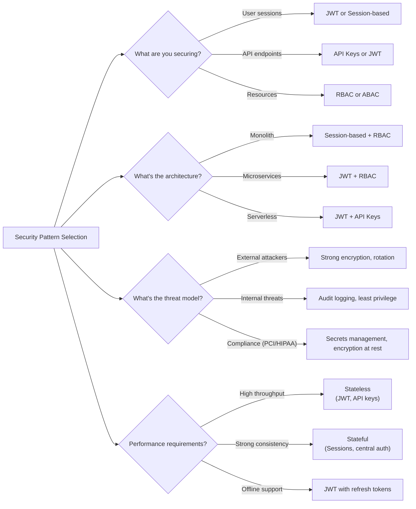

# Security Patterns

> Authentication, authorization, and securing distributed systems

---

## Learning Objectives

By the end of this topic you will be able to:

- Implement JWT generation and validation including HMAC-SHA256 signature, expiration checks, and proper Base64 encoding
- Explain the difference between authentication (who are you?) and authorization (what can you do?)
- Compare JWT and session-based authentication and choose the appropriate mechanism for a given architecture
- Implement a Role-Based Access Control system with hierarchical permissions and deny-by-default enforcement
- Identify common security vulnerabilities including timing attacks, missing signature validation, and secrets leakage in logs
- Choose between JWT, API keys, and session-based auth given a system's scalability and revocation requirements

---

## ELI5: Explain Like I'm 5

<div class="learner-section" markdown>

**Your task:** After implementing security patterns, explain them simply.

**Prompts to guide you:**

1. **What is authentication in one sentence?**
    - Your answer: <span class="fill-in">Authentication is a ___ that works by ___</span>

2. **What is authorization in one sentence?**
    - Your answer: <span class="fill-in">Authorization is a ___ that controls ___ after you are already ___</span>

3. **Real-world analogy for authentication:**
    - Example: "Authentication is like showing your ID at the door..."
    - Your analogy: <span class="fill-in">Think about how you'd prove your identity when entering a building — what do you show, and who checks it?</span>

4. **Real-world analogy for authorization:**
    - Example: "Authorization is like having a key to certain rooms..."
    - Your analogy: <span class="fill-in">Think about a hotel key card — once you've checked in, what determines which floors and rooms you can enter?</span>

5. **What is JWT in one sentence?**
    - Your answer: <span class="fill-in">A JWT is a ___ that lets a server ___ without storing ___</span>

6. **When should you use JWT vs sessions?**
    - Your answer: <span class="fill-in">JWT is preferred when ___ because it avoids the cost of ___; sessions are better when ___</span>

</div>

---

## Case Studies: Security Patterns in the Wild

### Google & Facebook Login: OAuth 2.0 and OpenID Connect

- **Pattern:** OAuth 2.0 for delegated authorization and OIDC for authentication.
- **How it works:** When you click "Login with Google" on a third-party site (like Stack Overflow), the site (the
  Client) redirects you to Google (the Authorization Server). You grant permission for Stack Overflow to access your
  basic profile. Google then redirects you back with an authorization code. Stack Overflow's server exchanges this code
  for an Access Token (a JWT). It can then use this token to fetch your profile information from Google's API. OIDC
  provides the identity layer on top of OAuth 2.0, standardizing how profile information is shared.
- **Key Takeaway:** OAuth 2.0 is the standard for delegated authorization, allowing users to grant limited access to
  their data without sharing their passwords. It separates the roles of the user, the client application, and the
  authorization server.

### AWS & Google Cloud APIs: API Keys and IAM

- **Pattern:** API Keys for programmatic access and IAM for fine-grained authorization.
- **How it works:** When a developer wants to use an AWS S3 or Google Maps API from their server, they generate an API
  Key. This key is a long, unique string that is passed in an HTTP header with each request. The API gateway validates
  the key to authenticate the calling service. The key is linked to an **IAM (Identity and Access Management)** role,
  which defines exactly what actions that key is authorized to perform (e.g., `s3:GetObject` but not `s3:DeleteObject`).
- **Key Takeaway:** API keys are a simple and effective way to authenticate server-to-server communication. However,
  authentication alone is not enough; it must be paired with a robust authorization system like IAM to enforce the
  principle of least privilege.

### Netflix Microservices: JWT Propagation for Internal Authorization

- **Pattern:** Passing JWTs between internal services for user context.
- **How it works:** When a user streams a movie, their initial request to the Netflix API Gateway includes a JWT that
  identifies them. As that request fans out to internal microservices (e.g., the Bookmarks service, the Recommendations
  service, the Playback service), that JWT is passed along with each internal call. Each microservice can independently
  validate the JWT's signature (using a shared public key) and check its claims (like `userId` and `scopes`) to
  authorize the action without needing to call an external authentication service.
- **Key Takeaway:** JWTs are stateless and portable, making them ideal for microservice architectures. Propagating the
  user's identity allows for decentralized authorization decisions and helps maintain user context for logging and
  auditing throughout a distributed system.

---

## Core Implementation

### Pattern 1: JWT-Based Authentication

**Concept:** Stateless authentication using JSON Web Tokens.

**Use case:** Microservices, API authentication, mobile apps.

```java
--8<-- "com/study/systems/security/JWTAuthenticator.java"
```


!!! warning "Debugging Challenge — Missing Signature Validation"

    The validator below has **3 critical security bugs**. Identify them before running the code.

    ```java
    public class BrokenJWTValidator {

        private final String secret = "my-secret-key";

        public String validateToken_Buggy(String token) {
            String[] parts = token.split("\\.");

            // Extract payload
            String payload = parts[1];
            String decodedPayload = base64Decode(payload);

            // Parse JSON to get user ID
            String userId = extractUserId(decodedPayload);

            return userId;
        }
    }
    ```

    Trace what happens when an attacker sends a crafted token with a fake `userId` claim but a completely made-up signature.

    ??? success "Answer"

        **Bug 1 (line 5):** No null/length check on `parts`. A malformed token like `"abc"` causes `ArrayIndexOutOfBoundsException` — a denial-of-service vector.

        Fix: `if (token == null || token.split("\\.").length != 3) return null;`

        **Bug 2 (lines 8-12):** Signature is never verified. An attacker can Base64-encode any payload they like, attach a fake signature, and this code will accept it — **complete authentication bypass**.

        Fix: Recompute `hmacSha256(parts[0] + "." + parts[1], secret)` and compare to `parts[2]` before reading any claims.

        **Bug 3 (line 15):** No expiration check. Once issued, a stolen token is valid forever, defeating rotation and logout.

        Fix: Extract `exp` from the decoded payload and reject if `System.currentTimeMillis() / 1000 > exp`.

---

### Pattern 2: Role-Based Access Control (RBAC)

**Concept:** Authorization based on user roles and permissions.

**Use case:** Multi-tenant systems, enterprise applications, admin panels.

!!! note "Fail-secure design"
    RBAC must default to **deny**. If a user has no roles, or if a role has no matching permission, the answer is always "no". Never default to "allow" when something is missing or null.

```java
--8<-- "com/study/systems/security/RBACAuthorizer.java"
```


!!! warning "Debugging Challenge — Authorization Bypass in deleteResource"

    The RBAC implementation below has **2 authorization bugs**. The second one is more dangerous than the first.

    ```java
    public class BrokenRBAC {

        private Map<String, Set<Role>> userRoles = new HashMap<>();
        private Map<Role, Set<Permission>> rolePermissions = new HashMap<>();

        public boolean hasPermission_Buggy(String userId, Permission permission) {
            Set<Role> roles = userRoles.get(userId);

            for (Role role : roles) {
                Set<Permission> perms = rolePermissions.get(role);
                if (perms.contains(permission)) {
                    return true;
                }
            }

            return false;
        }

        public void deleteResource_Buggy(String resourceId, String userId) {
            database.delete(resourceId);
            System.out.println("Deleted: " + resourceId);
        }
    }
    ```

    Trace what happens when an attacker with no roles calls `deleteResource("admin-data", "attacker")`.

    ??? success "Answer"

        **Bug 1 (hasPermission, line 4):** `userRoles.get(userId)` returns `null` for a user with no roles. The subsequent `for` loop throws `NullPointerException`. Fix: `if (roles == null || roles.isEmpty()) return false;`

        **Bug 2 (deleteResource):** No permission check at all before deletion. An attacker calls `deleteResource` directly, bypassing `hasPermission` entirely. The resource is deleted despite zero authorization.

        Fix:
        ```java
        public void deleteResource_Buggy(String resourceId, String userId) {
            if (!hasPermission(userId, Permission.DELETE)) {
                throw new SecurityException("Insufficient permissions");
            }
            database.delete(resourceId);
            auditLog.log("Deleted: " + resourceId + " by " + userId);
        }
        ```

        **Key lesson:** EVERY sensitive operation must have an explicit authorization check. One missing check is a security hole regardless of how well the rest of the system is built.

---

### Pattern 3: API Key Authentication

**Concept:** Long-lived tokens for service-to-service authentication.

**Use case:** REST APIs, webhooks, third-party integrations.

```java
--8<-- "com/study/systems/security/APIKeyAuth.java"
```


---

### Pattern 4: Secrets Management

**Concept:** Secure storage and rotation of sensitive credentials.

**Use case:** Database passwords, API keys, encryption keys.

!!! tip "Why AES/GCM over AES/CBC"
    AES/GCM (Galois/Counter Mode) provides *authenticated encryption* — it simultaneously encrypts and produces an authentication tag that detects tampering. AES/CBC encrypts but does not authenticate, leaving you vulnerable to padding oracle attacks. Always prefer GCM for new code.

```java
--8<-- "com/study/systems/security/SecretsManager.java"
```


---

## Common Misconceptions

!!! warning "JWT tokens are encrypted, so the payload is private"
    JWT tokens are Base64-encoded, not encrypted. Anyone who intercepts a JWT can decode the header and payload in seconds — they just cannot forge a valid signature without the secret. Never store sensitive information (passwords, PII, internal system details) inside a JWT payload. If confidentiality is required, use JWE (JSON Web Encryption) instead.

!!! warning "RBAC eliminates all authorization bugs once roles are set up"
    Role assignment solves the coarse-grained problem, but each sensitive operation still requires an explicit `hasPermission` check at the call site. Developers frequently add new endpoints or methods without wiring in the authorization check, leaving gaps. RBAC is a framework, not a guarantee — the check must be present everywhere it matters.

!!! warning "Rotating API keys or secrets is disruptive and should be avoided"
    Modern secrets management supports versioned rotation with a grace period, so old and new credentials are both valid briefly. Zero-downtime rotation is a standard pattern. Not rotating credentials after a suspected leak is far more costly than the short-term operational effort of rotation. Treat infrequent rotation as a risk, not a best practice.

!!! warning "When it breaks"
    JWTs break for revocation: a token is valid until its `exp` claim and there is no standard mechanism to invalidate an issued token. Logout, password change, or account suspension all require either a token denylist (a distributed cache lookup on every request, which negates the stateless benefit) or very short expiry windows. RBAC breaks when roles proliferate — systems typically start with 5 roles and accumulate 50 as individual exceptions are added. The inflection point where RBAC becomes unmanageable is usually when roles are no longer comprehensible to a non-engineer, which happens around 20–30 roles. At that point, attribute-based access control (ABAC) or policy engines like OPA are the alternative.

---

## Decision Framework

<div class="learner-section" markdown>

**Your task:** Build decision trees for when to use each security pattern.

### Question 1: JWT vs Session-Based Auth?

Answer after implementation:

**Use JWT when:**

- Stateless architecture: <span class="fill-in">[No session storage needed]</span>
- Microservices: <span class="fill-in">[Token contains all necessary data]</span>
- Mobile/SPA apps: <span class="fill-in">[Easy to store and send]</span>
- Cross-domain: <span class="fill-in">[Can share across services]</span>

**Use Session-based when:**

- Traditional web apps: <span class="fill-in">[Server-side sessions]</span>
- Need to revoke immediately: <span class="fill-in">[Can invalidate server-side]</span>
- Large user data: <span class="fill-in">[Don't want to send in every request]</span>
- Simpler security model: <span class="fill-in">[Server controls everything]</span>

### Question 2: When to use API Keys vs JWT?

**API Keys when:**

- Service-to-service: <span class="fill-in">[Long-lived credentials]</span>
- Simple auth: <span class="fill-in">[Just need to identify caller]</span>
- Third-party integrations: <span class="fill-in">[Easy to rotate]</span>

**JWT when:**

- User authentication: <span class="fill-in">[Short-lived, contains user claims]</span>
- Need user context: <span class="fill-in">[Embedded in token]</span>
- Stateless: <span class="fill-in">[No lookup needed]</span>

### Question 3: RBAC vs ABAC (Attribute-Based)?

**RBAC when:**

- Clear role hierarchy: <span class="fill-in">[Admin, Editor, Viewer]</span>
- Simple permissions: <span class="fill-in">[Read, Write, Delete]</span>
- Most users: <span class="fill-in">[70% of access control needs]</span>

**ABAC when:**

- Complex rules: <span class="fill-in">[Based on time, location, resource attributes]</span>
- Fine-grained control: <span class="fill-in">[User can edit own posts only]</span>
- Dynamic policies: <span class="fill-in">[Rules change frequently]</span>

### Your Decision Tree

Build this after solving practice scenarios:

```mermaid
flowchart LR
    Start["Security Pattern Selection"]

    Q1{"What are you securing?"}
    Start --> Q1
    N2["JWT or Session-based"]
    Q1 -->|"User sessions"| N2
    N3["API Keys or JWT"]
    Q1 -->|"API endpoints"| N3
    N4["RBAC or ABAC"]
    Q1 -->|"Resources"| N4
    Q5{"What's the architecture?"}
    Start --> Q5
    N6["Session-based + RBAC"]
    Q5 -->|"Monolith"| N6
    N7["JWT + RBAC"]
    Q5 -->|"Microservices"| N7
    N8["JWT + API Keys"]
    Q5 -->|"Serverless"| N8
    Q9{"What's the threat model?"}
    Start --> Q9
    N10["Strong encryption, rotation"]
    Q9 -->|"External attackers"| N10
    N11["Audit logging, least privilege"]
    Q9 -->|"Internal threats"| N11
    N12["Secrets management, encryption at rest"]
    Q9 -->|"Compliance (PCI/HIPAA)"| N12
    Q13{"Performance requirements?"}
    Start --> Q13
    N14["Stateless<br/>(JWT, API keys)"]
    Q13 -->|"High throughput"| N14
    N15["Stateful<br/>(Sessions, central auth)"]
    Q13 -->|"Strong consistency"| N15
    N16["JWT with refresh tokens"]
    Q13 -->|"Offline support"| N16
```

</div>

---

## Practice

<div class="learner-section" markdown>

### Scenario 1: E-commerce API Security

**Requirements:**

- REST API for orders, payments, user data
- Mobile app and web frontend
- Third-party integrations (shipping, payments)
- Must handle 10K requests/sec

**Your security design:**

- Auth mechanism: <span class="fill-in">[JWT or API keys? Why?]</span>
- Authorization: <span class="fill-in">[RBAC setup for customer, admin, partner roles]</span>
- Secrets: <span class="fill-in">[How to manage payment gateway keys?]</span>
- Token expiry: <span class="fill-in">[Short-lived or long-lived? Refresh strategy?]</span>
- Rate limiting: <span class="fill-in">[Per user? Per API key?]</span>

**Failure modes:**

- What happens if the JWT signing secret is accidentally committed to a public GitHub repository? <span class="fill-in">[Fill in]</span>
- How does your design behave when the token validation service becomes unavailable and 10K users try to authenticate simultaneously? <span class="fill-in">[Fill in]</span>

### Scenario 2: Multi-Tenant SaaS Platform

**Requirements:**

- Tenants: organizations with multiple users
- Data isolation between tenants
- Admin panel for tenant admins
- SSO support for enterprise customers

**Your security design:**

- Tenant isolation: <span class="fill-in">[How to ensure data separation?]</span>
- User roles: <span class="fill-in">[Super admin, tenant admin, user]</span>
- SSO integration: <span class="fill-in">[SAML, OAuth2, or both?]</span>
- Token claims: <span class="fill-in">[What to include in JWT?]</span>
- Cross-tenant attacks: <span class="fill-in">[How to prevent?]</span>

**Failure modes:**

- What happens if a misconfigured RBAC rule grants a tenant-admin role access to another tenant's data? <span class="fill-in">[Fill in]</span>
- How does your design behave when an SSO provider goes down and enterprise customers cannot authenticate? <span class="fill-in">[Fill in]</span>

### Scenario 3: Microservices Internal Auth

**Requirements:**

- 20 microservices
- Services call each other
- Need to track which service made request
- Some services more privileged than others

**Your security design:**

- Service-to-service auth: <span class="fill-in">[Mutual TLS? JWT? API keys?]</span>
- Service identity: <span class="fill-in">[How to identify calling service?]</span>
- Permission model: <span class="fill-in">[Service-level RBAC?]</span>
- Secret distribution: <span class="fill-in">[How do services get credentials?]</span>
- Rotation: <span class="fill-in">[How to rotate without downtime?]</span>

**Failure modes:**

- What happens if a service's mTLS certificate expires and is not rotated in time, blocking all inter-service calls? <span class="fill-in">[Fill in]</span>
- How does your design behave when the secrets manager is unavailable and services cannot retrieve their credentials on startup? <span class="fill-in">[Fill in]</span>

</div>

---

## Test Your Understanding

Answer these without referring to your notes or implementation.

1. A JWT token arrives with a valid HMAC signature but the `exp` claim is 10 minutes in the past. Should the request be allowed? Explain what would happen in a high-traffic system if you skipped the expiration check and tokens were never refreshed.

    ??? success "Rubric"
        A complete answer addresses: (1) the request must be rejected — a valid signature only proves the token was issued by the correct server, not that it is still valid; expiration is a separate and mandatory check, (2) without expiration checks, stolen tokens remain valid forever — a token leaked via a compromised client or log file becomes a permanent backdoor, (3) in a high-traffic system with no expiration, token revocation becomes impossible without a centralized blocklist, defeating the statelessness that makes JWT attractive.

2. You are implementing `hasPermission(userId, permission)` for a user who has three roles. Walk through the algorithm step by step and explain what data structures you would choose and why.

    ??? success "Rubric"
        A complete answer addresses: (1) step-by-step: look up the user's role set in a HashMap<String, Set<Role>>, iterate over each role, look up each role's permissions in a HashMap<Role, Set<Permission>>, return true on first match, (2) HashSet for both roles and permissions gives O(1) contains checks so the overall algorithm is O(R) where R is the number of roles, (3) null-safety: return false immediately if the user has no roles or a role has no permission mapping — never default to allow.

3. Your team wants to store the JWT signing secret as an environment variable set at deploy time. Compare this to using a dedicated secrets manager. What are the specific risks of the environment-variable approach that a secrets manager would eliminate?

    ??? success "Rubric"
        A complete answer addresses: (1) environment variables are often readable by any process on the host and can appear in crash dumps, `/proc` listings, or CI logs — a secrets manager restricts access to authorised callers only, (2) environment variables have no rotation mechanism; rotating the secret requires a full redeployment, whereas a secrets manager supports versioned rotation with zero downtime, (3) a secrets manager provides audit logs showing who accessed the secret and when, which is impossible with environment variables.

4. A colleague proposes using `String.equals()` to validate an API key submitted by a client. What is the security flaw, and how would you fix it while still keeping the comparison O(n)?

    ??? success "Rubric"
        A complete answer addresses: (1) `String.equals()` short-circuits on the first differing character, leaking timing information — an attacker measuring response times can determine the correct key one character at a time (timing attack), (2) the fix is a constant-time comparison that always examines every character regardless of where a mismatch occurs (e.g., `MessageDigest.isEqual()` or a custom loop with XOR accumulator), (3) constant-time comparison is still O(n) — it processes all n characters every time — it just removes the early-exit that enables timing attacks.

5. A colleague says "we don't need RBAC because we only have two user types: admin and regular user." What would you say to convince them that a proper role-permission mapping is worth implementing even now, before the system grows?

    ??? success "Rubric"
        A complete answer addresses: (1) two hardcoded roles with scattered `if (isAdmin)` checks become brittle as the system grows — adding a third role (e.g., moderator) requires hunting down every check in the codebase, (2) a role-permission mapping separates the definition of access rules from the enforcement, making it easy to add or modify roles without changing business logic, (3) a proper RBAC foundation also enables audit logging, per-operation permission checks, and future ABAC extensions without a ground-up rewrite.

---

## Connected Topics

!!! info "Where this topic connects"

    - **06. API Design** — JWTs and API keys are the standard authentication mechanisms for REST APIs; idempotency and versioning affect token refresh and revocation strategies → [06. API Design](06-api-design.md)
    - **03. Networking Fundamentals** — TLS provides transport-layer security that makes token-based authentication safe; without it, all tokens are exposed in plaintext → [03. Networking Fundamentals](03-networking-fundamentals.md)
