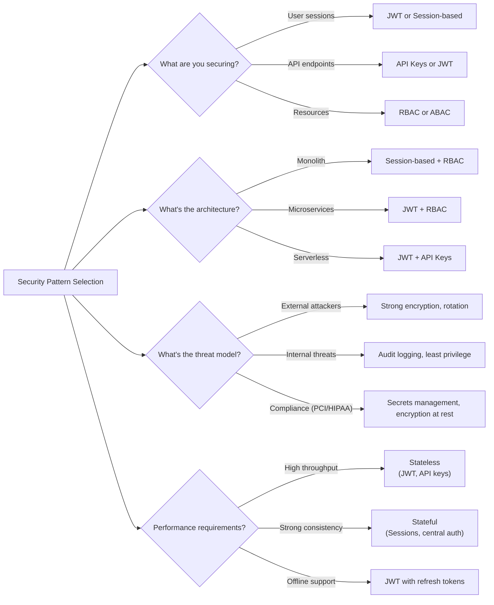

# Security Patterns

> Authentication, authorization, and securing distributed systems

---

## Learning Objectives

By the end of this topic you will be able to:

- Implement JWT generation and validation including HMAC-SHA256 signature, expiration checks, and proper Base64 encoding
- Explain the difference between authentication (who are you?) and authorization (what can you do?)
- Compare JWT and session-based authentication and choose the appropriate mechanism for a given architecture
- Implement a Role-Based Access Control system with hierarchical permissions and deny-by-default enforcement
- Identify common security vulnerabilities including timing attacks, missing signature validation, and secrets leakage in logs
- Choose between JWT, API keys, and session-based auth given a system's scalability and revocation requirements

---

## ELI5: Explain Like I'm 5

<div class="learner-section" markdown>

**Your task:** After implementing security patterns, explain them simply.

**Prompts to guide you:**

1. **What is authentication in one sentence?**
    - Your answer: <span class="fill-in">Authentication is a ___ that works by ___</span>

2. **What is authorization in one sentence?**
    - Your answer: <span class="fill-in">Authorization is a ___ that controls ___ after you are already ___</span>

3. **Real-world analogy for authentication:**
    - Example: "Authentication is like showing your ID at the door..."
    - Your analogy: <span class="fill-in">Think about how you'd prove your identity when entering a building — what do you show, and who checks it?</span>

4. **Real-world analogy for authorization:**
    - Example: "Authorization is like having a key to certain rooms..."
    - Your analogy: <span class="fill-in">Think about a hotel key card — once you've checked in, what determines which floors and rooms you can enter?</span>

5. **What is JWT in one sentence?**
    - Your answer: <span class="fill-in">A JWT is a ___ that lets a server ___ without storing ___</span>

6. **When should you use JWT vs sessions?**
    - Your answer: <span class="fill-in">JWT is preferred when ___ because it avoids the cost of ___; sessions are better when ___</span>

</div>

---

## Quick Quiz (Do BEFORE implementing)

!!! tip "How to use this section"
    Complete your predictions now, before reading further. You will revisit and verify each answer after running the benchmark (or completing the implementation).

<div class="learner-section" markdown>

**Your task:** Test your security intuition without looking at code. Answer these, then verify after implementation.

### Security Concept Predictions

1. **Authentication vs Authorization:**
    - Authentication is: <span class="fill-in">[Your definition]</span>
    - Authorization is: <span class="fill-in">[Your definition]</span>
    - Example scenario: <span class="fill-in">[Think of real-world example]</span>

2. **JWT token structure:**
    - Three parts: <span class="fill-in">[What are they?]</span>
    - Why is signature needed?: <span class="fill-in">[Your guess]</span>
    - Can client modify payload?: <span class="fill-in">[Yes/No - Why?]</span>

3. **RBAC complexity:**
    - Checking permission for user with 3 roles: O(?)
    - Better than checking each permission individually?: <span class="fill-in">[Yes/No - Why?]</span>

### Scenario Predictions

**Scenario 1:** A user tries to access a protected resource with JWT token

- **What gets validated first?** <span class="fill-in">[Signature? Expiration? Claims?]</span>
- **If signature invalid, what does it mean?** <span class="fill-in">[Token tampered? Expired? Wrong secret?]</span>
- **What happens if token expired but signature valid?** <span class="fill-in">[Allow? Deny? Refresh?]</span>

**Scenario 2:** Implementing RBAC for a blog platform

- **Roles needed:** <span class="fill-in">[List them]</span>
- **VIEWER can:** <span class="fill-in">[What permissions?]</span>
- **EDITOR can:** <span class="fill-in">[What permissions beyond VIEWER?]</span>
- **ADMIN can:** <span class="fill-in">[Everything or specific permissions?]</span>

**Scenario 3:** API key gets leaked on GitHub

- **Immediate action:** <span class="fill-in">[What to do first?]</span>
- **Why rotation matters:** <span class="fill-in">[Explain]</span>
- **How to prevent:** <span class="fill-in">[Fill in]</span>

### Security Trade-off Quiz

**Question:** When would Session-based auth be BETTER than JWT?

- Your answer: <span class="fill-in">[Fill in before implementation]</span>
- Verified answer: <span class="fill-in">[Fill in after learning]</span>

**Question:** What's the MAIN advantage of JWT over sessions?

- [ ] More secure
- [ ] Stateless (no server-side storage)
- [ ] Easier to implement
- [ ] Better performance

Verify after implementation: <span class="fill-in">[Which one(s)?]</span>

**Question:** Why use HMAC for JWT signature instead of just Base64 encoding?

- Your answer: <span class="fill-in">[Fill in]</span>
- Verified: <span class="fill-in">[Fill in after implementation]</span>

</div>

---

## Case Studies: Security Patterns in the Wild

### Google & Facebook Login: OAuth 2.0 and OpenID Connect

- **Pattern:** OAuth 2.0 for delegated authorization and OIDC for authentication.
- **How it works:** When you click "Login with Google" on a third-party site (like Stack Overflow), the site (the
  Client) redirects you to Google (the Authorization Server). You grant permission for Stack Overflow to access your
  basic profile. Google then redirects you back with an authorization code. Stack Overflow's server exchanges this code
  for an Access Token (a JWT). It can then use this token to fetch your profile information from Google's API. OIDC
  provides the identity layer on top of OAuth 2.0, standardizing how profile information is shared.
- **Key Takeaway:** OAuth 2.0 is the standard for delegated authorization, allowing users to grant limited access to
  their data without sharing their passwords. It separates the roles of the user, the client application, and the
  authorization server.

### AWS & Google Cloud APIs: API Keys and IAM

- **Pattern:** API Keys for programmatic access and IAM for fine-grained authorization.
- **How it works:** When a developer wants to use an AWS S3 or Google Maps API from their server, they generate an API
  Key. This key is a long, unique string that is passed in an HTTP header with each request. The API gateway validates
  the key to authenticate the calling service. The key is linked to an **IAM (Identity and Access Management)** role,
  which defines exactly what actions that key is authorized to perform (e.g., `s3:GetObject` but not `s3:DeleteObject`).
- **Key Takeaway:** API keys are a simple and effective way to authenticate server-to-server communication. However,
  authentication alone is not enough; it must be paired with a robust authorization system like IAM to enforce the
  principle of least privilege.

### Netflix Microservices: JWT Propagation for Internal Authorization

- **Pattern:** Passing JWTs between internal services for user context.
- **How it works:** When a user streams a movie, their initial request to the Netflix API Gateway includes a JWT that
  identifies them. As that request fans out to internal microservices (e.g., the Bookmarks service, the Recommendations
  service, the Playback service), that JWT is passed along with each internal call. Each microservice can independently
  validate the JWT's signature (using a shared public key) and check its claims (like `userId` and `scopes`) to
  authorize the action without needing to call an external authentication service.
- **Key Takeaway:** JWTs are stateless and portable, making them ideal for microservice architectures. Propagating the
  user's identity allows for decentralized authorization decisions and helps maintain user context for logging and
  auditing throughout a distributed system.

---

## Core Implementation

### Pattern 1: JWT-Based Authentication

**Concept:** Stateless authentication using JSON Web Tokens.

**Use case:** Microservices, API authentication, mobile apps.

```java
import java.util.*;
import java.nio.charset.StandardCharsets;
import java.util.Base64;
import javax.crypto.Mac;
import javax.crypto.spec.SecretKeySpec;

/**
 * JWT Authentication: Stateless token-based auth
 *
 * Token structure: header.payload.signature
 * - Header: algorithm and token type
 * - Payload: claims (user data, expiration)
 * - Signature: HMAC of header+payload with secret
 */
public class JWTAuthenticator {

    private final String secret;
    private final long expirationMs;

    public JWTAuthenticator(String secret, long expirationMs) {
        this.secret = secret;
        this.expirationMs = expirationMs;
    }

    /**
     * Generate JWT token for user
     * Time: O(1), Space: O(1)
     *
     * TODO: Implement JWT generation
     * 1. Create header: {"alg": "HS256", "typ": "JWT"}
     * 2. Create payload: {"sub": userId, "exp": expiration, "iat": issuedAt}
     * 3. Base64 encode header and payload
     * 4. Sign with HMAC-SHA256
     * 5. Return header.payload.signature
     */
    public String generateToken(String userId) {
        // TODO: Create header

        // TODO: Create payload with expiration

        // TODO: Create signature

        // TODO: Return JWT

        return null; // Replace
    }

    /**
     * Validate and extract user from JWT
     * Time: O(1), Space: O(1)
     *
     * TODO: Implement JWT validation
     * 1. Split token into parts
     * 2. Verify signature
     * 3. Check expiration
     * 4. Extract and return user ID
     */
    public String validateToken(String token) {
        // TODO: Split token

        // TODO: Verify signature

        // TODO: Decode and check expiration

        // TODO: Return userId from payload
        return null; // Replace
    }

    /**
     * Helper: Base64 URL-safe encoding
     *
     * TODO: Implement base64 URL encoding
     */
    private String base64UrlEncode(String input) {
        // TODO: Encode and make URL-safe
        return null; // Replace
    }

    /**
     * Helper: HMAC-SHA256 signature
     *
     * TODO: Implement HMAC signing
     */
    private String hmacSha256(String data, String key) {
        // TODO: Use Mac with HmacSHA256
        return null; // Replace
    }
}
```

**Runnable Client Code:**

```java
public class JWTClient {

    public static void main(String[] args) {
        System.out.println("=== JWT Authentication ===\n");

        String secret = "your-256-bit-secret";
        long expirationMs = 3600000; // 1 hour

        JWTAuthenticator auth = new JWTAuthenticator(secret, expirationMs);

        // Test 1: Generate token
        System.out.println("--- Test 1: Generate Token ---");
        String token = auth.generateToken("user123");
        System.out.println("Generated token: " + token);

        // Test 2: Validate token
        System.out.println("\n--- Test 2: Validate Token ---");
        String userId = auth.validateToken(token);
        System.out.println("Extracted user: " + userId);

        // Test 3: Invalid token
        System.out.println("\n--- Test 3: Invalid Token ---");
        String invalidToken = "invalid.token.here";
        String result = auth.validateToken(invalidToken);
        System.out.println("Validation result: " + result);
    }
}
```

!!! warning "Debugging Challenge — Missing Signature Validation"

    The validator below has **3 critical security bugs**. Identify them before running the code.

    ```java
    public class BrokenJWTValidator {

        private final String secret = "my-secret-key";

        public String validateToken_Buggy(String token) {
            String[] parts = token.split("\\.");

            // Extract payload
            String payload = parts[1];
            String decodedPayload = base64Decode(payload);

            // Parse JSON to get user ID
            String userId = extractUserId(decodedPayload);

            return userId;
        }
    }
    ```

    Trace what happens when an attacker sends a crafted token with a fake `userId` claim but a completely made-up signature.

    ??? success "Answer"

        **Bug 1 (line 5):** No null/length check on `parts`. A malformed token like `"abc"` causes `ArrayIndexOutOfBoundsException` — a denial-of-service vector.

        Fix: `if (token == null || token.split("\\.").length != 3) return null;`

        **Bug 2 (lines 8-12):** Signature is never verified. An attacker can Base64-encode any payload they like, attach a fake signature, and this code will accept it — **complete authentication bypass**.

        Fix: Recompute `hmacSha256(parts[0] + "." + parts[1], secret)` and compare to `parts[2]` before reading any claims.

        **Bug 3 (line 15):** No expiration check. Once issued, a stolen token is valid forever, defeating rotation and logout.

        Fix: Extract `exp` from the decoded payload and reject if `System.currentTimeMillis() / 1000 > exp`.

---

### Pattern 2: Role-Based Access Control (RBAC)

**Concept:** Authorization based on user roles and permissions.

**Use case:** Multi-tenant systems, enterprise applications, admin panels.

!!! note "Fail-secure design"
    RBAC must default to **deny**. If a user has no roles, or if a role has no matching permission, the answer is always "no". Never default to "allow" when something is missing or null.

```java
import java.util.*;

/**
 * RBAC: Role-Based Access Control
 *
 * Concepts:
 * - Users have roles (admin, editor, viewer)
 * - Roles have permissions (read, write, delete)
 * - Check permission before allowing action
 */
public class RBACAuthorizer {

    // Role definitions
    enum Role {
        ADMIN, EDITOR, VIEWER
    }

    enum Permission {
        READ, WRITE, DELETE, MANAGE_USERS
    }

    // Role -> Permissions mapping
    private final Map<Role, Set<Permission>> rolePermissions;
    // User -> Roles mapping
    private final Map<String, Set<Role>> userRoles;

    public RBACAuthorizer() {
        this.rolePermissions = new HashMap<>();
        this.userRoles = new HashMap<>();
        initializeRolePermissions();
    }

    /**
     * Initialize default role permissions
     *
     * TODO: Set up role hierarchies
     * - ADMIN: all permissions
     * - EDITOR: read, write
     * - VIEWER: read only
     */
    private void initializeRolePermissions() {
        // TODO: Define ADMIN permissions

        // TODO: Define EDITOR permissions

        // TODO: Define VIEWER permissions
    }

    /**
     * Assign role to user
     * Time: O(1), Space: O(1)
     *
     * TODO: Implement role assignment
     */
    public void assignRole(String userId, Role role) {
        // TODO: Add role to user's role set
    }

    /**
     * Check if user has permission
     * Time: O(R) where R = number of roles, Space: O(1)
     *
     * TODO: Implement permission check
     * 1. Get user's roles
     * 2. For each role, check if it has the permission
     * 3. Return true if any role grants permission
     */
    public boolean hasPermission(String userId, Permission permission) {
        // TODO: Get user roles

        // TODO: Check each role's permissions

        return false; // Replace
    }

    /**
     * Get all permissions for user
     * Time: O(R*P), Space: O(P)
     *
     * TODO: Implement permission aggregation
     */
    public Set<Permission> getUserPermissions(String userId) {
        Set<Permission> allPermissions = new HashSet<>();

        // TODO: Aggregate permissions from all roles

        return allPermissions; // Replace
    }

    /**
     * Remove role from user
     * Time: O(1), Space: O(1)
     *
     * TODO: Implement role revocation
     */
    public void revokeRole(String userId, Role role) {
        // TODO: Remove role from user
    }
}
```

**Runnable Client Code:**

```java
import static RBACAuthorizer.*;

public class RBACClient {

    public static void main(String[] args) {
        System.out.println("=== RBAC Authorization ===\n");

        RBACAuthorizer rbac = new RBACAuthorizer();

        // Test 1: Assign roles
        System.out.println("--- Test 1: Role Assignment ---");
        rbac.assignRole("alice", Role.ADMIN);
        rbac.assignRole("bob", Role.EDITOR);
        rbac.assignRole("charlie", Role.VIEWER);
        System.out.println("Roles assigned");

        // Test 2: Check permissions
        System.out.println("\n--- Test 2: Permission Checks ---");
        System.out.println("Alice (ADMIN) can DELETE: " +
            rbac.hasPermission("alice", Permission.DELETE));
        System.out.println("Bob (EDITOR) can WRITE: " +
            rbac.hasPermission("bob", Permission.WRITE));
        System.out.println("Charlie (VIEWER) can DELETE: " +
            rbac.hasPermission("charlie", Permission.DELETE));

        // Test 3: Get all permissions
        System.out.println("\n--- Test 3: All Permissions ---");
        System.out.println("Alice permissions: " + rbac.getUserPermissions("alice"));
        System.out.println("Bob permissions: " + rbac.getUserPermissions("bob"));
        System.out.println("Charlie permissions: " + rbac.getUserPermissions("charlie"));
    }
}
```

!!! warning "Debugging Challenge — Authorization Bypass in deleteResource"

    The RBAC implementation below has **2 authorization bugs**. The second one is more dangerous than the first.

    ```java
    public class BrokenRBAC {

        private Map<String, Set<Role>> userRoles = new HashMap<>();
        private Map<Role, Set<Permission>> rolePermissions = new HashMap<>();

        public boolean hasPermission_Buggy(String userId, Permission permission) {
            Set<Role> roles = userRoles.get(userId);

            for (Role role : roles) {
                Set<Permission> perms = rolePermissions.get(role);
                if (perms.contains(permission)) {
                    return true;
                }
            }

            return false;
        }

        public void deleteResource_Buggy(String resourceId, String userId) {
            database.delete(resourceId);
            System.out.println("Deleted: " + resourceId);
        }
    }
    ```

    Trace what happens when an attacker with no roles calls `deleteResource("admin-data", "attacker")`.

    ??? success "Answer"

        **Bug 1 (hasPermission, line 4):** `userRoles.get(userId)` returns `null` for a user with no roles. The subsequent `for` loop throws `NullPointerException`. Fix: `if (roles == null || roles.isEmpty()) return false;`

        **Bug 2 (deleteResource):** No permission check at all before deletion. An attacker calls `deleteResource` directly, bypassing `hasPermission` entirely. The resource is deleted despite zero authorization.

        Fix:
        ```java
        public void deleteResource_Buggy(String resourceId, String userId) {
            if (!hasPermission(userId, Permission.DELETE)) {
                throw new SecurityException("Insufficient permissions");
            }
            database.delete(resourceId);
            auditLog.log("Deleted: " + resourceId + " by " + userId);
        }
        ```

        **Key lesson:** EVERY sensitive operation must have an explicit authorization check. One missing check is a security hole regardless of how well the rest of the system is built.

---

### Pattern 3: API Key Authentication

**Concept:** Long-lived tokens for service-to-service authentication.

**Use case:** REST APIs, webhooks, third-party integrations.

```java
import java.util.*;
import java.security.SecureRandom;

/**
 * API Key Authentication
 *
 * Key properties:
 * - Long-lived credentials
 * - Scoped to specific resources
 * - Can be rate-limited per key
 * - Easy to rotate and revoke
 */
public class APIKeyAuth {

    static class APIKey {
        String key;
        String userId;
        Set<String> scopes;
        long createdAt;
        long lastUsedAt;
        int usageCount;

        APIKey(String key, String userId, Set<String> scopes) {
            this.key = key;
            this.userId = userId;
            this.scopes = scopes;
            this.createdAt = System.currentTimeMillis();
            this.lastUsedAt = createdAt;
            this.usageCount = 0;
        }
    }

    private final Map<String, APIKey> keys;
    private final SecureRandom random;

    public APIKeyAuth() {
        this.keys = new HashMap<>();
        this.random = new SecureRandom();
    }

    /**
     * Generate new API key
     * Time: O(1), Space: O(1)
     *
     * TODO: Implement key generation
     * 1. Generate random key (32-byte hex)
     * 2. Store with user ID and scopes
     * 3. Return key
     */
    public String generateKey(String userId, Set<String> scopes) {
        // TODO: Generate secure random key

        // TODO: Store key

        return null; // Replace
    }

    /**
     * Validate API key and check scope
     * Time: O(1), Space: O(1)
     *
     * TODO: Implement key validation
     * 1. Lookup key
     * 2. Check if scope is allowed
     * 3. Update usage metrics
     * 4. Return user ID or null
     */
    public String validateKey(String key, String requiredScope) {
        // TODO: Lookup key

        // TODO: Check scope

        // TODO: Update usage

        return null; // Replace
    }

    /**
     * Revoke API key
     * Time: O(1), Space: O(1)
     *
     * TODO: Implement key revocation
     */
    public boolean revokeKey(String key) {
        // TODO: Remove key from storage
        return false; // Replace
    }

    /**
     * Get usage statistics for key
     * Time: O(1), Space: O(1)
     *
     * TODO: Implement usage tracking
     */
    public Map<String, Object> getKeyStats(String key) {
        Map<String, Object> stats = new HashMap<>();

        // TODO: Return key statistics

        return stats; // Replace
    }

    private String bytesToHex(byte[] bytes) {
        StringBuilder sb = new StringBuilder();
        for (byte b : bytes) {
            sb.append(String.format("%02x", b));
        }
        return sb.toString();
    }
}
```

**Runnable Client Code:**

```java
import java.util.*;

public class APIKeyClient {

    public static void main(String[] args) {
        System.out.println("=== API Key Authentication ===\n");

        APIKeyAuth apiKeyAuth = new APIKeyAuth();

        // Test 1: Generate keys
        System.out.println("--- Test 1: Generate API Keys ---");
        Set<String> scopes1 = new HashSet<>(Arrays.asList("read", "write"));
        String key1 = apiKeyAuth.generateKey("service1", scopes1);
        System.out.println("Generated key for service1: " + key1);

        Set<String> scopes2 = new HashSet<>(Arrays.asList("read"));
        String key2 = apiKeyAuth.generateKey("service2", scopes2);
        System.out.println("Generated key for service2: " + key2);

        // Test 2: Validate keys
        System.out.println("\n--- Test 2: Validate Keys ---");
        String userId1 = apiKeyAuth.validateKey(key1, "write");
        System.out.println("Key1 with 'write' scope: " + userId1);

        String userId2 = apiKeyAuth.validateKey(key2, "write");
        System.out.println("Key2 with 'write' scope: " + userId2);

        // Test 3: Revoke key
        System.out.println("\n--- Test 3: Revoke Key ---");
        boolean revoked = apiKeyAuth.revokeKey(key1);
        System.out.println("Key1 revoked: " + revoked);
        String userId3 = apiKeyAuth.validateKey(key1, "read");
        System.out.println("Key1 after revocation: " + userId3);
    }
}
```

---

### Pattern 4: Secrets Management

**Concept:** Secure storage and rotation of sensitive credentials.

**Use case:** Database passwords, API keys, encryption keys.

!!! tip "Why AES/GCM over AES/CBC"
    AES/GCM (Galois/Counter Mode) provides *authenticated encryption* — it simultaneously encrypts and produces an authentication tag that detects tampering. AES/CBC encrypts but does not authenticate, leaving you vulnerable to padding oracle attacks. Always prefer GCM for new code.

```java
import javax.crypto.Cipher;
import javax.crypto.KeyGenerator;
import javax.crypto.SecretKey;
import javax.crypto.spec.SecretKeySpec;
import java.util.*;

/**
 * Secrets Manager
 *
 * Features:
 * - Encrypted storage
 * - Versioning for rotation
 * - Access control per secret
 * - Audit logging
 */
public class SecretsManager {

    static class Secret {
        String name;
        byte[] encryptedValue;
        int version;
        long createdAt;
        Set<String> authorizedUsers;

        Secret(String name, byte[] encryptedValue, int version, Set<String> authorizedUsers) {
            this.name = name;
            this.encryptedValue = encryptedValue;
            this.version = version;
            this.createdAt = System.currentTimeMillis();
            this.authorizedUsers = authorizedUsers;
        }
    }

    private final Map<String, List<Secret>> secrets; // name -> versions
    private final SecretKey masterKey;

    /**
     * Initialize secrets manager with master encryption key
     *
     * TODO: Set up encryption
     */
    public SecretsManager(SecretKey masterKey) {
        this.secrets = new HashMap<>();
        this.masterKey = masterKey;
    }

    /**
     * Store secret with encryption
     * Time: O(1), Space: O(1)
     *
     * TODO: Implement secret storage
     * 1. Encrypt value with master key
     * 2. Store with version number
     * 3. Set authorized users
     */
    public void storeSecret(String name, String value, Set<String> authorizedUsers) {
        // TODO: Encrypt secret value

        // TODO: Create new version
    }

    /**
     * Retrieve secret with authorization check
     * Time: O(V) where V = versions, Space: O(1)
     *
     * TODO: Implement secret retrieval
     * 1. Check authorization
     * 2. Get latest version
     * 3. Decrypt and return
     */
    public String getSecret(String name, String userId) {
        // TODO: Get latest version

        // TODO: Check authorization

        // TODO: Decrypt and return

        return null; // Replace
    }

    /**
     * Rotate secret (create new version)
     * Time: O(1), Space: O(1)
     *
     * TODO: Implement secret rotation
     */
    public void rotateSecret(String name, String newValue, String userId) {
        // TODO: Verify authorization to rotate
        // TODO: Create new version with new value
        // TODO: Keep old versions for grace period
    }

    /**
     * Helper: Encrypt data
     *
     * TODO: Implement AES encryption
     */
    private byte[] encrypt(byte[] data, SecretKey key) {
        // TODO: Use AES/GCM for authenticated encryption
        return null; // Replace
    }

    /**
     * Helper: Decrypt data
     *
     * TODO: Implement AES decryption
     */
    private byte[] decrypt(byte[] encryptedData, SecretKey key) {
        // TODO: Use AES/GCM for decryption
        return null; // Replace
    }
}
```

**Runnable Client Code:**

```java
import javax.crypto.KeyGenerator;
import javax.crypto.SecretKey;
import java.util.*;

public class SecretsManagerClient {

    public static void main(String[] args) throws Exception {
        System.out.println("=== Secrets Management ===\n");

        // Generate master key
        KeyGenerator keyGen = KeyGenerator.getInstance("AES");
        keyGen.init(256);
        SecretKey masterKey = keyGen.generateKey();

        SecretsManager sm = new SecretsManager(masterKey);

        // Test 1: Store secrets
        System.out.println("--- Test 1: Store Secrets ---");
        Set<String> users1 = new HashSet<>(Arrays.asList("admin", "service1"));
        sm.storeSecret("db_password", "super-secret-pwd", users1);
        System.out.println("Stored db_password");

        Set<String> users2 = new HashSet<>(Arrays.asList("service2"));
        sm.storeSecret("api_key", "sk_live_123456", users2);
        System.out.println("Stored api_key");

        // Test 2: Retrieve secrets
        System.out.println("\n--- Test 2: Retrieve Secrets ---");
        String pwd = sm.getSecret("db_password", "admin");
        System.out.println("Retrieved db_password: " + pwd);

        // Test 3: Unauthorized access
        System.out.println("\n--- Test 3: Unauthorized Access ---");
        try {
            String key = sm.getSecret("api_key", "admin");
            System.out.println("Retrieved api_key: " + key);
        } catch (SecurityException e) {
            System.out.println("Access denied: " + e.getMessage());
        }
    }
}
```

!!! info "Loop back"
    Return to the Quick Quiz now and fill in your verified answers.

---

## Common Misconceptions

!!! warning "JWT tokens are encrypted, so the payload is private"
    JWT tokens are Base64-encoded, not encrypted. Anyone who intercepts a JWT can decode the header and payload in seconds — they just cannot forge a valid signature without the secret. Never store sensitive information (passwords, PII, internal system details) inside a JWT payload. If confidentiality is required, use JWE (JSON Web Encryption) instead.

!!! warning "RBAC eliminates all authorization bugs once roles are set up"
    Role assignment solves the coarse-grained problem, but each sensitive operation still requires an explicit `hasPermission` check at the call site. Developers frequently add new endpoints or methods without wiring in the authorization check, leaving gaps. RBAC is a framework, not a guarantee — the check must be present everywhere it matters.

!!! warning "Rotating API keys or secrets is disruptive and should be avoided"
    Modern secrets management supports versioned rotation with a grace period, so old and new credentials are both valid briefly. Zero-downtime rotation is a standard pattern. Not rotating credentials after a suspected leak is far more costly than the short-term operational effort of rotation. Treat infrequent rotation as a risk, not a best practice.

---

## Decision Framework

<div class="learner-section" markdown>

**Your task:** Build decision trees for when to use each security pattern.

### Question 1: JWT vs Session-Based Auth?

Answer after implementation:

**Use JWT when:**

- Stateless architecture: <span class="fill-in">[No session storage needed]</span>
- Microservices: <span class="fill-in">[Token contains all necessary data]</span>
- Mobile/SPA apps: <span class="fill-in">[Easy to store and send]</span>
- Cross-domain: <span class="fill-in">[Can share across services]</span>

**Use Session-based when:**

- Traditional web apps: <span class="fill-in">[Server-side sessions]</span>
- Need to revoke immediately: <span class="fill-in">[Can invalidate server-side]</span>
- Large user data: <span class="fill-in">[Don't want to send in every request]</span>
- Simpler security model: <span class="fill-in">[Server controls everything]</span>

### Question 2: When to use API Keys vs JWT?

**API Keys when:**

- Service-to-service: <span class="fill-in">[Long-lived credentials]</span>
- Simple auth: <span class="fill-in">[Just need to identify caller]</span>
- Third-party integrations: <span class="fill-in">[Easy to rotate]</span>

**JWT when:**

- User authentication: <span class="fill-in">[Short-lived, contains user claims]</span>
- Need user context: <span class="fill-in">[Embedded in token]</span>
- Stateless: <span class="fill-in">[No lookup needed]</span>

### Question 3: RBAC vs ABAC (Attribute-Based)?

**RBAC when:**

- Clear role hierarchy: <span class="fill-in">[Admin, Editor, Viewer]</span>
- Simple permissions: <span class="fill-in">[Read, Write, Delete]</span>
- Most users: <span class="fill-in">[70% of access control needs]</span>

**ABAC when:**

- Complex rules: <span class="fill-in">[Based on time, location, resource attributes]</span>
- Fine-grained control: <span class="fill-in">[User can edit own posts only]</span>
- Dynamic policies: <span class="fill-in">[Rules change frequently]</span>

### Your Decision Tree

Build this after solving practice scenarios:

```mermaid
flowchart LR
    Start["Security Pattern Selection"]

    Q1{"What are you securing?"}
    Start --> Q1
    N2["JWT or Session-based"]
    Q1 -->|"User sessions"| N2
    N3["API Keys or JWT"]
    Q1 -->|"API endpoints"| N3
    N4["RBAC or ABAC"]
    Q1 -->|"Resources"| N4
    Q5{"What's the architecture?"}
    Start --> Q5
    N6["Session-based + RBAC"]
    Q5 -->|"Monolith"| N6
    N7["JWT + RBAC"]
    Q5 -->|"Microservices"| N7
    N8["JWT + API Keys"]
    Q5 -->|"Serverless"| N8
    Q9{"What's the threat model?"}
    Start --> Q9
    N10["Strong encryption, rotation"]
    Q9 -->|"External attackers"| N10
    N11["Audit logging, least privilege"]
    Q9 -->|"Internal threats"| N11
    N12["Secrets management, encryption at rest"]
    Q9 -->|"Compliance (PCI/HIPAA)"| N12
    Q13{"Performance requirements?"}
    Start --> Q13
    N14["Stateless<br/>(JWT, API keys)"]
    Q13 -->|"High throughput"| N14
    N15["Stateful<br/>(Sessions, central auth)"]
    Q13 -->|"Strong consistency"| N15
    N16["JWT with refresh tokens"]
    Q13 -->|"Offline support"| N16
```

</div>

---

## Practice

<div class="learner-section" markdown>

### Scenario 1: E-commerce API Security

**Requirements:**

- REST API for orders, payments, user data
- Mobile app and web frontend
- Third-party integrations (shipping, payments)
- Must handle 10K requests/sec

**Your security design:**

- Auth mechanism: <span class="fill-in">[JWT or API keys? Why?]</span>
- Authorization: <span class="fill-in">[RBAC setup for customer, admin, partner roles]</span>
- Secrets: <span class="fill-in">[How to manage payment gateway keys?]</span>
- Token expiry: <span class="fill-in">[Short-lived or long-lived? Refresh strategy?]</span>
- Rate limiting: <span class="fill-in">[Per user? Per API key?]</span>

**Failure modes:**

- What happens if the JWT signing secret is accidentally committed to a public GitHub repository? <span class="fill-in">[Fill in]</span>
- How does your design behave when the token validation service becomes unavailable and 10K users try to authenticate simultaneously? <span class="fill-in">[Fill in]</span>

### Scenario 2: Multi-Tenant SaaS Platform

**Requirements:**

- Tenants: organizations with multiple users
- Data isolation between tenants
- Admin panel for tenant admins
- SSO support for enterprise customers

**Your security design:**

- Tenant isolation: <span class="fill-in">[How to ensure data separation?]</span>
- User roles: <span class="fill-in">[Super admin, tenant admin, user]</span>
- SSO integration: <span class="fill-in">[SAML, OAuth2, or both?]</span>
- Token claims: <span class="fill-in">[What to include in JWT?]</span>
- Cross-tenant attacks: <span class="fill-in">[How to prevent?]</span>

**Failure modes:**

- What happens if a misconfigured RBAC rule grants a tenant-admin role access to another tenant's data? <span class="fill-in">[Fill in]</span>
- How does your design behave when an SSO provider goes down and enterprise customers cannot authenticate? <span class="fill-in">[Fill in]</span>

### Scenario 3: Microservices Internal Auth

**Requirements:**

- 20 microservices
- Services call each other
- Need to track which service made request
- Some services more privileged than others

**Your security design:**

- Service-to-service auth: <span class="fill-in">[Mutual TLS? JWT? API keys?]</span>
- Service identity: <span class="fill-in">[How to identify calling service?]</span>
- Permission model: <span class="fill-in">[Service-level RBAC?]</span>
- Secret distribution: <span class="fill-in">[How do services get credentials?]</span>
- Rotation: <span class="fill-in">[How to rotate without downtime?]</span>

**Failure modes:**

- What happens if a service's mTLS certificate expires and is not rotated in time, blocking all inter-service calls? <span class="fill-in">[Fill in]</span>
- How does your design behave when the secrets manager is unavailable and services cannot retrieve their credentials on startup? <span class="fill-in">[Fill in]</span>

</div>

---

## Test Your Understanding

Answer these without referring to your notes or implementation.

1. A JWT token arrives with a valid HMAC signature but the `exp` claim is 10 minutes in the past. Should the request be allowed? Explain what would happen in a high-traffic system if you skipped the expiration check and tokens were never refreshed.

    ??? success "Rubric"
        A complete answer addresses: (1) the request must be rejected — a valid signature only proves the token was issued by the correct server, not that it is still valid; expiration is a separate and mandatory check, (2) without expiration checks, stolen tokens remain valid forever — a token leaked via a compromised client or log file becomes a permanent backdoor, (3) in a high-traffic system with no expiration, token revocation becomes impossible without a centralized blocklist, defeating the statelessness that makes JWT attractive.

2. You are implementing `hasPermission(userId, permission)` for a user who has three roles. Walk through the algorithm step by step and explain what data structures you would choose and why.

    ??? success "Rubric"
        A complete answer addresses: (1) step-by-step: look up the user's role set in a HashMap<String, Set<Role>>, iterate over each role, look up each role's permissions in a HashMap<Role, Set<Permission>>, return true on first match, (2) HashSet for both roles and permissions gives O(1) contains checks so the overall algorithm is O(R) where R is the number of roles, (3) null-safety: return false immediately if the user has no roles or a role has no permission mapping — never default to allow.

3. Your team wants to store the JWT signing secret as an environment variable set at deploy time. Compare this to using a dedicated secrets manager. What are the specific risks of the environment-variable approach that a secrets manager would eliminate?

    ??? success "Rubric"
        A complete answer addresses: (1) environment variables are often readable by any process on the host and can appear in crash dumps, `/proc` listings, or CI logs — a secrets manager restricts access to authorised callers only, (2) environment variables have no rotation mechanism; rotating the secret requires a full redeployment, whereas a secrets manager supports versioned rotation with zero downtime, (3) a secrets manager provides audit logs showing who accessed the secret and when, which is impossible with environment variables.

4. A colleague proposes using `String.equals()` to validate an API key submitted by a client. What is the security flaw, and how would you fix it while still keeping the comparison O(n)?

    ??? success "Rubric"
        A complete answer addresses: (1) `String.equals()` short-circuits on the first differing character, leaking timing information — an attacker measuring response times can determine the correct key one character at a time (timing attack), (2) the fix is a constant-time comparison that always examines every character regardless of where a mismatch occurs (e.g., `MessageDigest.isEqual()` or a custom loop with XOR accumulator), (3) constant-time comparison is still O(n) — it processes all n characters every time — it just removes the early-exit that enables timing attacks.

5. A colleague says "we don't need RBAC because we only have two user types: admin and regular user." What would you say to convince them that a proper role-permission mapping is worth implementing even now, before the system grows?

    ??? success "Rubric"
        A complete answer addresses: (1) two hardcoded roles with scattered `if (isAdmin)` checks become brittle as the system grows — adding a third role (e.g., moderator) requires hunting down every check in the codebase, (2) a role-permission mapping separates the definition of access rules from the enforcement, making it easy to add or modify roles without changing business logic, (3) a proper RBAC foundation also enables audit logging, per-operation permission checks, and future ABAC extensions without a ground-up rewrite.

---

## Connected Topics

!!! info "Where this topic connects"

    - **06. API Design** — JWTs and API keys are the standard authentication mechanisms for REST APIs; idempotency and versioning affect token refresh and revocation strategies → [06. API Design](06-api-design.md)
    - **03. Networking Fundamentals** — TLS provides transport-layer security that makes token-based authentication safe; without it, all tokens are exposed in plaintext → [03. Networking Fundamentals](03-networking-fundamentals.md)
