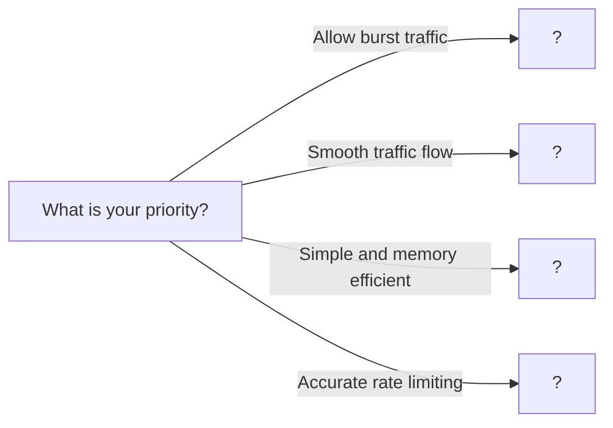

# 08. Rate Limiting

> Protecting APIs from abuse and ensuring fair resource usage

---

## ELI5: Explain Like I'm 5

<div class="learner-section" markdown>

**Your task:** After implementing different rate limiting algorithms, explain them simply.

**Prompts to guide you:**

1. **What is rate limiting in one sentence?**
    - Your answer: <span class="fill-in">[Fill in after implementation]</span>

2. **Why do we need rate limiting?**
    - Your answer: <span class="fill-in">[Fill in after implementation]</span>

3. **Real-world analogy for token bucket:**
    - Example: "Token bucket is like a piggy bank where..."
    - Your analogy: <span class="fill-in">[Fill in]</span>

4. **What is the token bucket algorithm in one sentence?**
    - Your answer: <span class="fill-in">[Fill in after implementation]</span>

5. **How is leaky bucket different from token bucket?**
    - Your answer: <span class="fill-in">[Fill in after implementation]</span>

6. **Real-world analogy for leaky bucket:**
    - Example: "Leaky bucket is like a water tower where..."
    - Your analogy: <span class="fill-in">[Fill in]</span>

7. **What is sliding window algorithm in one sentence?**
    - Your answer: <span class="fill-in">[Fill in after implementation]</span>

8. **When would you use fixed window vs sliding window?**
    - Your answer: <span class="fill-in">[Fill in after implementation]</span>

</div>

---

## Quick Quiz (Do BEFORE implementing)

<div class="learner-section" markdown>

**Your task:** Test your intuition about rate limiting algorithms. Answer these, then verify after implementation.

### Algorithm Understanding Predictions

1. **Token bucket with 10 tokens, 2 tokens/sec refill:**
    - How many requests can burst immediately? <span class="fill-in">[Your guess]</span>
    - After waiting 5 seconds, how many tokens? <span class="fill-in">[Your guess]</span>
    - Verified after implementation: <span class="fill-in">[Actual]</span>

2. **Leaky bucket vs token bucket for 100 req/sec:**
    - Which allows bursts? <span class="fill-in">[Token/Leaky]</span>
    - Which smooths traffic? <span class="fill-in">[Token/Leaky]</span>
    - Verified: <span class="fill-in">[Fill in]</span>

3. **Fixed window: 10 req/min starting at 12:00:00:**
    - 9 requests at 12:00:58
    - 9 requests at 12:01:01
    - Total allowed in 3 seconds: <span class="fill-in">[Your guess: 9? 10? 18?]</span>
    - Why is this a problem? <span class="fill-in">[Fill in]</span>
    - Verified: <span class="fill-in">[Actual behavior]</span>

### Scenario Predictions

**Scenario 1:** API needs to handle traffic spikes but prevent abuse

- **Best algorithm?** <span class="fill-in">[Token bucket/Leaky bucket/Fixed window/Sliding window]</span>
- **Why?** <span class="fill-in">[Your reasoning]</span>
- **Verified after implementation:** <span class="fill-in">[Fill in]</span>

**Scenario 2:** Login system needs steady rate limiting (no bursts)

- **Best algorithm?** <span class="fill-in">[Token bucket/Leaky bucket/Fixed window/Sliding window]</span>
- **Why?** <span class="fill-in">[Your reasoning]</span>
- **Verified after implementation:** <span class="fill-in">[Fill in]</span>

**Scenario 3:** Rate limit 100 requests per minute with 1 million users

- **Fixed window memory:** <span class="fill-in">[Estimate: bytes per user]</span>
- **Sliding window log memory:** <span class="fill-in">[Estimate: bytes per user]</span>
- **Which is more memory efficient?** <span class="fill-in">[Your guess]</span>
- **Verified:** <span class="fill-in">[Fill in calculations]</span>

### Refill Logic Quiz

**Token bucket refills 5 tokens/second, last refill at T=0:**

1. **At T=2 seconds, how many tokens added?** <span class="fill-in">[Your calculation]</span>
2. **At T=2.5 seconds, how many tokens added?** <span class="fill-in">[Your calculation]</span>
3. **If capacity is 10 and current tokens = 8:**
    - After 1 second: <span class="fill-in">[tokens available?]</span>
    - After 5 seconds: <span class="fill-in">[tokens available? can exceed capacity?]</span>

**Verify these calculations after implementation!**

### Trade-off Quiz

**Question:** Why would you choose fixed window over sliding window?

- Your answer: <span class="fill-in">[Fill in before implementation]</span>
- Verified answer: <span class="fill-in">[Fill in after learning]</span>

**Question:** Token bucket allows 100 burst requests. Is this ALWAYS good?

- [ ] Yes, bursts are always beneficial
- [ ] No, depends on backend capacity
- [ ] No, depends on abuse prevention needs
- [ ] It depends on the use case

**Verify after implementation:** <span class="fill-in">[Which one(s) and why?]</span>


</div>

---

## Before/After: Why This Pattern Matters

**Your task:** Compare naive vs optimized rate limiting approaches.

### Example: Protecting an API Endpoint

**Problem:** Prevent API abuse while allowing legitimate traffic.

#### Approach 1: No Rate Limiting

```java
// Naive approach - No protection
public class NoRateLimiting {
    public Response handleRequest(Request req) {
        return processRequest(req); // Process every request
    }
}
```

**Analysis:**

- Time: O(1) per request
- Space: O(1)
- Protection: NONE - vulnerable to abuse
- Result: Server overload, DDoS attacks succeed
- For 1 million malicious requests: Server crashes

#### Approach 2: Fixed Window Rate Limiter

```java
// Simple fixed window - Memory efficient
public class FixedWindowRateLimiter {
    private int counter = 0;
    private long windowStart = System.currentTimeMillis();
    private final int maxRequests = 100;
    private final long windowMs = 60000; // 1 minute

    public boolean tryAcquire() {
        long now = System.currentTimeMillis();

        // Reset window if expired
        if (now - windowStart >= windowMs) {
            counter = 0;
            windowStart = now;
        }

        // Check limit
        if (counter < maxRequests) {
            counter++;
            return true;
        }
        return false;
    }
}
```

**Analysis:**

- Time: O(1) per request
- Space: O(1) - only 3 variables per user
- Protection: Good - limits to 100 req/min
- Issue: Allows 200 requests in 2 seconds at window boundary
- For 1 million users: ~12 bytes × 1M = ~12 MB

#### Approach 3: Token Bucket (Better for Bursts)

```java
// Token bucket - Allows controlled bursts
public class TokenBucketRateLimiter {
    private double tokens;
    private long lastRefillTime;
    private final int capacity = 100;
    private final double refillRate = 10.0; // tokens/sec

    public boolean tryAcquire() {
        refill();

        if (tokens >= 1) {
            tokens -= 1;
            return true;
        }
        return false;
    }

    private void refill() {
        long now = System.currentTimeMillis();
        double elapsed = (now - lastRefillTime) / 1000.0;
        tokens = Math.min(capacity, tokens + elapsed * refillRate);
        lastRefillTime = now;
    }
}
```

**Analysis:**

- Time: O(1) per request
- Space: O(1) - 3 variables per user
- Protection: Excellent - smooth rate limiting + burst capacity
- Flexibility: Can handle legitimate traffic spikes
- For 1 million users: ~16 bytes × 1M = ~16 MB

#### Performance Comparison

| Scenario        | No Limiting | Fixed Window   | Token Bucket | Sliding Window Log          |
|-----------------|-------------|----------------|--------------|-----------------------------|
| Memory per user | 0 bytes     | 12 bytes       | 16 bytes     | ~800 bytes (100 timestamps) |
| 1M users memory | 0 MB        | 12 MB          | 16 MB        | 800 MB                      |
| Prevents abuse  | No          | Yes            | Yes          | Yes                         |
| Allows bursts   | N/A         | No             | Yes          | No                          |
| Accurate rate   | N/A         | Boundary issue | Accurate     | Most accurate               |
| CPU per request | Low         | Low            | Low          | Medium (cleanup)            |

**Your calculation:** For 10 million users with sliding window log tracking 1000 requests each:

- Memory needed: <span class="fill-in">[Calculate after implementation]</span>
- Why this might be impractical: <span class="fill-in">[Fill in]</span>

#### Boundary Attack Demonstration

**Fixed Window Problem:**

```
Window 1: 12:00:00 - 12:01:00 (limit: 100 req)
Window 2: 12:01:00 - 12:02:00 (limit: 100 req)

Attack pattern:

- 12:00:59 → 100 requests (allowed, fills window 1)
- 12:01:01 → 100 requests (allowed, new window 2)
- Total: 200 requests in 2 seconds!
```

**Token Bucket Solution:**

```
Capacity: 100 tokens, Refill: 10 tokens/sec

Attack pattern:

- 12:00:59 → 100 requests (bucket empties)
- 12:01:01 → 20 requests (only ~20 tokens refilled)
- Total: 120 requests max (controlled burst)
```

**After implementing, explain in your own words:**

- Why does fixed window allow double rate at boundaries? <span class="fill-in">[Fill in]</span>
- How does token bucket prevent this? <span class="fill-in">[Fill in]</span>
- When is fixed window "good enough"? <span class="fill-in">[Fill in]</span>

---

## Core Implementation

### Part 1: Token Bucket Algorithm

**Your task:** Implement token bucket rate limiter with refill mechanism.

```java
import java.util.*;
import java.util.concurrent.*;

/**
 * Token Bucket: Tokens refill at constant rate, burst traffic allowed
 *
 * Key principles:
 * - Bucket holds tokens (capacity)
 * - Tokens refill at fixed rate
 * - Request consumes token(s)
 * - Allows burst traffic up to capacity
 */

public class TokenBucketRateLimiter {

    private final int capacity;          // Max tokens in bucket
    private final double refillRate;     // Tokens per second
    private double tokens;               // Current tokens
    private long lastRefillTime;         // Last refill timestamp

    /**
     * Initialize token bucket
     *
     * @param capacity Maximum tokens (burst size)
     * @param refillRate Tokens added per second
     *
     * TODO: Initialize bucket
     * - Set capacity and refill rate
     * - Start with full bucket
     * - Record current time
     */
    public TokenBucketRateLimiter(int capacity, double refillRate) {
        // TODO: Track state

        // TODO: Initialize tokens to capacity (bucket starts full)

        // TODO: Record current time in milliseconds

        this.capacity = 0; // Replace
        this.refillRate = 0; // Replace
    }

    /**
     * Attempt to acquire a token
     *
     * @return true if token acquired, false if rate limited
     *
     * TODO: Implement token acquisition
     * 1. Refill tokens based on time elapsed
     * 2. Check if token available
     * 3. Consume token if available
     *
     * Hint: tokens_to_add = time_elapsed * refill_rate
     */
    public synchronized boolean tryAcquire() {
        // TODO: Calculate time elapsed since last refill

        // TODO: Calculate new tokens to add
        // tokens_to_add = elapsed_seconds * refillRate

        // TODO: Add tokens but cap at capacity
        // tokens = Math.min(tokens + tokens_to_add, capacity)

        // TODO: Update lastRefillTime to now

        // TODO: Implement iteration/conditional logic

        // TODO: Otherwise return false (rate limited)

        return false; // Replace
    }

    /**
     * Try to acquire multiple tokens (for weighted rate limiting)
     *
     * @param tokensNeeded Number of tokens to acquire
     * @return true if acquired, false if insufficient tokens
     *
     * TODO: Implement multi-token acquisition
     * - Refill tokens first
     * - Check if enough tokens available
     * - Consume requested tokens
     */
    public synchronized boolean tryAcquire(int tokensNeeded) {
        // TODO: Refill tokens (same as tryAcquire())

        // TODO: Check if tokens >= tokensNeeded

        // TODO: Implement iteration/conditional logic

        // TODO: Otherwise return false

        return false; // Replace
    }

    /**
     * Get current token count (for monitoring)
     */
    public synchronized double getTokens() {
        refill();
        return tokens;
    }

    /**
     * Refill tokens based on elapsed time
     *
     * TODO: Extract refill logic
     * - Calculate elapsed time
     * - Add tokens
     * - Cap at capacity
     */
    private void refill() {
        // TODO: Implement refill logic
    }
}
```

### Part 2: Leaky Bucket Algorithm

**Your task:** Implement leaky bucket rate limiter with constant outflow.

```java
/**
 * Leaky Bucket: Requests leak out at constant rate
 *
 * Key principles:
 * - Bucket holds pending requests (queue)
 * - Requests leak out at fixed rate
 * - Smooths burst traffic
 * - Rejects requests if bucket full
 */

public class LeakyBucketRateLimiter {

    private final int capacity;           // Max queue size
    private final double leakRate;        // Requests per second
    private final Queue<Long> bucket;     // Request timestamps
    private long lastLeakTime;

    /**
     * Initialize leaky bucket
     *
     * @param capacity Maximum pending requests
     * @param leakRate Requests processed per second
     *
     * TODO: Initialize bucket
     * - Create queue with capacity
     * - Set leak rate
     * - Record current time
     */
    public LeakyBucketRateLimiter(int capacity, double leakRate) {
        // TODO: Track state

        // TODO: Initialize queue (LinkedList)

        // TODO: Record current time

        this.capacity = 0; // Replace
        this.leakRate = 0; // Replace
        this.bucket = null; // Replace
    }

    /**
     * Try to add request to bucket
     *
     * @return true if accepted, false if bucket full
     *
     * TODO: Implement request acceptance
     * 1. Leak out old requests
     * 2. Check if space available
     * 3. Add current request
     *
     * Hint: Remove requests older than (current_time - 1/leak_rate)
     */
    public synchronized boolean tryAcquire() {
        // TODO: Leak out processed requests
        // requests_to_leak = elapsed_seconds * leakRate

        // TODO: Remove that many requests from queue

        // TODO: Implement iteration/conditional logic

        // TODO: Otherwise return false (bucket full)

        return false; // Replace
    }

    /**
     * Leak out processed requests
     *
     * TODO: Remove requests based on elapsed time
     * - Calculate requests that should leak
     * - Remove from queue
     * - Update lastLeakTime
     */
    private void leak() {
        // TODO: Calculate elapsed time

        // TODO: Calculate requests to leak
        // requestsToLeak = elapsed_seconds * leakRate

        // TODO: Poll requestsToLeak items from queue

        // TODO: Update lastLeakTime
    }

    /**
     * Get current bucket size (for monitoring)
     */
    public synchronized int getQueueSize() {
        leak();
        return bucket.size();
    }
}
```

### Part 3: Fixed Window Algorithm

**Your task:** Implement simple fixed window counter.

```java
/**
 * Fixed Window: Count requests in fixed time windows
 *
 * Key principles:
 * - Reset counter at window boundaries
 * - Simple and memory efficient
 * - Can allow 2x rate at window boundaries
 */

public class FixedWindowRateLimiter {

    private final int maxRequests;        // Max requests per window
    private final long windowSizeMs;      // Window size in milliseconds
    private int counter;                  // Requests in current window
    private long windowStart;             // Current window start time

    /**
     * Initialize fixed window rate limiter
     *
     * @param maxRequests Maximum requests per window
     * @param windowSizeMs Window size in milliseconds
     *
     * TODO: Initialize window
     * - Set max requests and window size
     * - Start counter at 0
     * - Record window start time
     */
    public FixedWindowRateLimiter(int maxRequests, long windowSizeMs) {
        // TODO: Track state

        // TODO: Initialize counter to 0

        // TODO: Track state

        this.maxRequests = 0; // Replace
        this.windowSizeMs = 0; // Replace
    }

    /**
     * Try to acquire permission
     *
     * @return true if allowed, false if rate limited
     *
     * TODO: Implement fixed window logic
     * 1. Check if window expired (reset if needed)
     * 2. Check if under limit
     * 3. Increment counter
     */
    public synchronized boolean tryAcquire() {
        long now = System.currentTimeMillis();

        // TODO: Implement iteration/conditional logic

        // TODO: Implement iteration/conditional logic

        // TODO: Otherwise return false

        return false; // Replace
    }

    /**
     * Get current window stats (for monitoring)
     */
    public synchronized WindowStats getStats() {
        return new WindowStats(counter, maxRequests, windowStart);
    }

    static class WindowStats {
        int current;
        int max;
        long windowStart;

        WindowStats(int current, int max, long windowStart) {
            this.current = current;
            this.max = max;
            this.windowStart = windowStart;
        }
    }
}
```

### Part 4: Sliding Window Log Algorithm

**Your task:** Implement sliding window with request log.

```java
/**
 * Sliding Window Log: Track individual request timestamps
 *
 * Key principles:
 * - Store timestamp of each request
 * - Count requests in sliding window
 * - More accurate than fixed window
 * - Higher memory usage
 */

public class SlidingWindowLogRateLimiter {

    private final int maxRequests;        // Max requests per window
    private final long windowSizeMs;      // Window size in milliseconds
    private final Queue<Long> requestLog; // Request timestamps

    /**
     * Initialize sliding window log
     *
     * @param maxRequests Maximum requests per window
     * @param windowSizeMs Window size in milliseconds
     *
     * TODO: Initialize log
     * - Set max requests and window size
     * - Create queue for timestamps
     */
    public SlidingWindowLogRateLimiter(int maxRequests, long windowSizeMs) {
        // TODO: Track state

        // TODO: Initialize LinkedList for request log

        this.maxRequests = 0; // Replace
        this.windowSizeMs = 0; // Replace
        this.requestLog = null; // Replace
    }

    /**
     * Try to acquire permission
     *
     * @return true if allowed, false if rate limited
     *
     * TODO: Implement sliding window logic
     * 1. Remove old requests outside window
     * 2. Check if under limit
     * 3. Add current timestamp
     *
     * Hint: Remove requests older than (now - windowSizeMs)
     */
    public synchronized boolean tryAcquire() {
        long now = System.currentTimeMillis();

        // TODO: Remove timestamps older than (now - windowSizeMs)

        // TODO: Implement iteration/conditional logic

        // TODO: Otherwise return false

        return false; // Replace
    }

    /**
     * Get current request count (for monitoring)
     */
    public synchronized int getCurrentCount() {
        long now = System.currentTimeMillis();
        while (!requestLog.isEmpty() && requestLog.peek() <= now - windowSizeMs) {
            requestLog.poll();
        }
        return requestLog.size();
    }
}
```

### Part 5: Sliding Window Counter (Hybrid)

**Your task:** Implement memory-efficient sliding window counter.

```java
/**
 * Sliding Window Counter: Hybrid of fixed window and sliding window
 *
 * Key principles:
 * - Two counters: current and previous window
 * - Weighted average based on time in window
 * - More accurate than fixed window
 * - Less memory than sliding log
 */

public class SlidingWindowCounterRateLimiter {

    private final int maxRequests;
    private final long windowSizeMs;
    private int currentWindowCount;
    private int previousWindowCount;
    private long currentWindowStart;

    /**
     * Initialize sliding window counter
     *
     * @param maxRequests Maximum requests per window
     * @param windowSizeMs Window size in milliseconds
     *
     * TODO: Initialize counters
     * - Set max requests and window size
     * - Initialize both counters
     * - Record window start
     */
    public SlidingWindowCounterRateLimiter(int maxRequests, long windowSizeMs) {
        // TODO: Track state

        // TODO: Initialize currentWindowCount to 0

        // TODO: Initialize previousWindowCount to 0

        // TODO: Track state

        this.maxRequests = 0; // Replace
        this.windowSizeMs = 0; // Replace
    }

    /**
     * Try to acquire permission
     *
     * @return true if allowed, false if rate limited
     *
     * TODO: Implement sliding window counter
     * 1. Rotate windows if needed
     * 2. Calculate weighted count
     * 3. Check against limit
     *
     * Formula:
     * weighted_count = previous_count * (1 - elapsed_ratio) + current_count
     * where elapsed_ratio = time_in_window / window_size
     */
    public synchronized boolean tryAcquire() {
        long now = System.currentTimeMillis();

        // TODO: Check if window expired

        // TODO: Calculate time elapsed in current window
        // elapsedRatio = (now - currentWindowStart) / windowSizeMs

        // TODO: Calculate weighted count
        // weightedCount = previousWindowCount * (1 - elapsedRatio) + currentWindowCount

        // TODO: Implement iteration/conditional logic

        // TODO: Otherwise return false

        return false; // Replace
    }

    /**
     * Get estimated current count (for monitoring)
     */
    public synchronized double getEstimatedCount() {
        long now = System.currentTimeMillis();
        double elapsedRatio = (double)(now - currentWindowStart) / windowSizeMs;
        return previousWindowCount * (1 - elapsedRatio) + currentWindowCount;
    }
}
```

---

## Client Code

```java
import java.util.concurrent.*;

public class RateLimitingClient {

    public static void main(String[] args) throws Exception {
        testTokenBucket();
        System.out.println("\n" + "=".repeat(50) + "\n");
        testLeakyBucket();
        System.out.println("\n" + "=".repeat(50) + "\n");
        testFixedWindow();
        System.out.println("\n" + "=".repeat(50) + "\n");
        testSlidingWindowLog();
        System.out.println("\n" + "=".repeat(50) + "\n");
        testSlidingWindowCounter();
        System.out.println("\n" + "=".repeat(50) + "\n");
        compareBurstTraffic();
    }

    static void testTokenBucket() {
        System.out.println("=== Token Bucket Test ===\n");

        // 10 tokens capacity, 2 tokens/second refill
        TokenBucketRateLimiter limiter = new TokenBucketRateLimiter(10, 2.0);

        // Test: Burst traffic
        System.out.println("Burst: 15 rapid requests");
        int allowed = 0;
        for (int i = 0; i < 15; i++) {
            if (limiter.tryAcquire()) {
                allowed++;
            }
        }
        System.out.println("Allowed: " + allowed + "/15");
        System.out.println("Remaining tokens: " + limiter.getTokens());

        // Test: Wait and retry
        System.out.println("\nWait 2 seconds for refill...");
        sleep(2000);
        System.out.println("Tokens after refill: " + limiter.getTokens());

        // Test: Weighted request (costs 3 tokens)
        System.out.println("\nWeighted request (3 tokens):");
        boolean acquired = limiter.tryAcquire(3);
        System.out.println("Acquired: " + acquired);
        System.out.println("Remaining tokens: " + limiter.getTokens());
    }

    static void testLeakyBucket() {
        System.out.println("=== Leaky Bucket Test ===\n");

        // 5 capacity, 1 request/second leak rate
        LeakyBucketRateLimiter limiter = new LeakyBucketRateLimiter(5, 1.0);

        // Test: Fill bucket
        System.out.println("Fill bucket with 5 requests");
        int allowed = 0;
        for (int i = 0; i < 5; i++) {
            if (limiter.tryAcquire()) {
                allowed++;
            }
        }
        System.out.println("Allowed: " + allowed + "/5");
        System.out.println("Queue size: " + limiter.getQueueSize());

        // Test: Overflow
        System.out.println("\nTry 3 more requests (should overflow)");
        int overflow = 0;
        for (int i = 0; i < 3; i++) {
            if (limiter.tryAcquire()) {
                overflow++;
            }
        }
        System.out.println("Allowed: " + overflow + "/3");

        // Test: Wait and retry
        System.out.println("\nWait 2 seconds for leak...");
        sleep(2000);
        System.out.println("Queue size after leak: " + limiter.getQueueSize());
    }

    static void testFixedWindow() {
        System.out.println("=== Fixed Window Test ===\n");

        // 5 requests per 2 second window
        FixedWindowRateLimiter limiter = new FixedWindowRateLimiter(5, 2000);

        // Test: Fill window
        System.out.println("Make 5 requests (should all succeed)");
        testRequests(limiter, 5);

        // Test: Overflow
        System.out.println("\nMake 3 more requests (should fail)");
        testRequests(limiter, 3);

        // Test: Window boundary
        System.out.println("\nWait for window reset...");
        sleep(2100);
        System.out.println("Make 5 requests in new window");
        testRequests(limiter, 5);
    }

    static void testSlidingWindowLog() {
        System.out.println("=== Sliding Window Log Test ===\n");

        // 5 requests per 2 second window
        SlidingWindowLogRateLimiter limiter = new SlidingWindowLogRateLimiter(5, 2000);

        // Test: Fill window
        System.out.println("Make 5 requests");
        testRequests(limiter, 5);
        System.out.println("Current count: " + limiter.getCurrentCount());

        // Test: Wait partial window
        System.out.println("\nWait 1 second (half window)...");
        sleep(1000);
        System.out.println("Current count: " + limiter.getCurrentCount());

        // Test: Make more requests
        System.out.println("\nMake 3 more requests");
        testRequests(limiter, 3);
    }

    static void testSlidingWindowCounter() {
        System.out.println("=== Sliding Window Counter Test ===\n");

        // 5 requests per 2 second window
        SlidingWindowCounterRateLimiter limiter = new SlidingWindowCounterRateLimiter(5, 2000);

        // Test: Fill window
        System.out.println("Make 5 requests");
        testRequests(limiter, 5);
        System.out.println("Estimated count: " + limiter.getEstimatedCount());

        // Test: Wait partial window
        System.out.println("\nWait 1 second...");
        sleep(1000);
        System.out.println("Estimated count: " + limiter.getEstimatedCount());

        // Test: Make more requests
        System.out.println("\nMake 3 more requests");
        testRequests(limiter, 3);
        System.out.println("Estimated count: " + limiter.getEstimatedCount());
    }

    static void compareBurstTraffic() {
        System.out.println("=== Burst Traffic Comparison ===\n");

        TokenBucketRateLimiter tokenBucket = new TokenBucketRateLimiter(10, 2.0);
        LeakyBucketRateLimiter leakyBucket = new LeakyBucketRateLimiter(10, 2.0);
        FixedWindowRateLimiter fixedWindow = new FixedWindowRateLimiter(10, 5000);

        // Simulate burst of 20 requests
        System.out.println("Sending 20 rapid requests...");

        int tokenAllowed = 0, leakyAllowed = 0, fixedAllowed = 0;
        for (int i = 0; i < 20; i++) {
            if (tokenBucket.tryAcquire()) tokenAllowed++;
            if (leakyBucket.tryAcquire()) leakyAllowed++;
            if (fixedWindow.tryAcquire()) fixedAllowed++;
        }

        System.out.println("Token Bucket allowed: " + tokenAllowed + "/20");
        System.out.println("Leaky Bucket allowed: " + leakyAllowed + "/20");
        System.out.println("Fixed Window allowed: " + fixedAllowed + "/20");
    }

    static void testRequests(FixedWindowRateLimiter limiter, int count) {
        int allowed = 0;
        for (int i = 0; i < count; i++) {
            if (limiter.tryAcquire()) allowed++;
        }
        System.out.println("Allowed: " + allowed + "/" + count);
    }

    static void testRequests(SlidingWindowLogRateLimiter limiter, int count) {
        int allowed = 0;
        for (int i = 0; i < count; i++) {
            if (limiter.tryAcquire()) allowed++;
        }
        System.out.println("Allowed: " + allowed + "/" + count);
    }

    static void testRequests(SlidingWindowCounterRateLimiter limiter, int count) {
        int allowed = 0;
        for (int i = 0; i < count; i++) {
            if (limiter.tryAcquire()) allowed++;
        }
        System.out.println("Allowed: " + allowed + "/" + count);
    }

    static void sleep(long ms) {
        try {
            Thread.sleep(ms);
        } catch (InterruptedException e) {
            Thread.currentThread().interrupt();
        }
    }
}
```

---

## Debugging Challenges

**Your task:** Find and fix bugs in broken rate limiter implementations. This tests your understanding.

### Challenge 1: Broken Token Bucket Refill

```java
/**
 * This token bucket has a CRITICAL bug in the refill logic.
 * It works initially but breaks after a few minutes.
 */
public class BrokenTokenBucket {
    private int tokens;
    private long lastRefillTime;
    private final int capacity = 10;
    private final int refillRate = 2; // tokens per second

    public BrokenTokenBucket() {
        this.tokens = capacity;
        this.lastRefillTime = System.currentTimeMillis();
    }

    public synchronized boolean tryAcquire() {
        // Refill tokens
        long now = System.currentTimeMillis();
        long elapsed = now - lastRefillTime;
        int tokensToAdd = (int)(elapsed * refillRate);
        tokens = Math.min(capacity, tokens + tokensToAdd);
        lastRefillTime = now;

        // Consume token
        if (tokens >= 1) {
            tokens--;
            return true;
        }
        return false;
    }
}
```

**Your debugging:**

- **Bug location:** <span class="fill-in">[Which line?]</span>
- **Bug explanation:** <span class="fill-in">[What's wrong with the calculation?]</span>
- **Bug manifestation:** <span class="fill-in">[What happens? Too many/few tokens?]</span>
    - Current calculation: `2000 * 2 = 4000` tokens! <span class="fill-in">[Why is this wrong?]</span>
    - Expected: <span class="fill-in">[How many tokens should be added?]</span>
- **Fix:** <span class="fill-in">[Correct the formula]</span>

<details markdown>
<summary>Click to verify your answer</summary>

**Bug:** The formula `elapsed * refillRate` multiplies milliseconds by tokens/second, giving a massive number.

**Correct formula:**

```java
double elapsedSeconds = elapsed / 1000.0;
int tokensToAdd = (int)(elapsedSeconds * refillRate);
```

OR:

```java
int tokensToAdd = (int)((elapsed / 1000.0) * refillRate);
```

**Test:** 2 seconds × 2 tokens/sec = 4 tokens (not 4000!)
</details>

---

### Challenge 2: Race Condition in Token Bucket

```java
/**
 * This token bucket has a RACE CONDITION bug.
 * Works fine single-threaded, breaks under concurrent load.
 */
public class RacyTokenBucket {
    private double tokens;
    private long lastRefillTime;
    private final int capacity = 100;
    private final double refillRate = 10.0;

    public boolean tryAcquire() {        refill();

        if (tokens >= 1) {
            tokens--;            return true;
        }
        return false;
    }

    private void refill() {        long now = System.currentTimeMillis();
        double elapsed = (now - lastRefillTime) / 1000.0;
        tokens = Math.min(capacity, tokens + elapsed * refillRate);
        lastRefillTime = now;
    }
}
```

**Your debugging:**

- **Bug 1:** <span class="fill-in">[What's missing from method signature?]</span>
- **Bug 2:** <span class="fill-in">[What happens when 2 threads check `tokens >= 1` simultaneously?]</span>
- **Scenario to expose bug:**
  ```
  Thread 1: checks tokens (1.0) >= 1 ✓
  Thread 2: checks tokens (1.0) >= 1 ✓  [race!]
  Thread 1: tokens-- (now 0.0)
  Thread 2: tokens-- (now -1.0)  [negative tokens!]
  ```
- **Fix:** <span class="fill-in">[How to prevent race condition?]</span>

<details markdown>
<summary>Click to verify your answer</summary>

**Bug:** Missing `synchronized` keyword. Multiple threads can pass the `tokens >= 1` check before any thread decrements.

**Fix:**

```java
public synchronized boolean tryAcquire() {
    refill();

    if (tokens >= 1) {
        tokens--;
        return true;
    }
    return false;
}

private synchronized void refill() {
    // ... refill logic
}
```

**Alternative:** Use `AtomicReference` or `Lock` for finer-grained control.
</details>

---

### Challenge 3: Fixed Window Off-by-One Error

```java
/**
 * Fixed window counter with subtle off-by-one bug.
 * Sometimes allows one extra request.
 */
public class BrokenFixedWindow {
    private int counter = 0;
    private long windowStart;
    private final int maxRequests = 10;
    private final long windowMs = 60000;

    public BrokenFixedWindow() {
        this.windowStart = System.currentTimeMillis();
    }

    public synchronized boolean tryAcquire() {
        long now = System.currentTimeMillis();

        // Reset window if needed
        if (now - windowStart > windowMs) {            counter = 0;
            windowStart = now;
        }

        // Check limit
        if (counter <= maxRequests) {            counter++;
            return true;
        }

        return false;
    }
}
```

**Your debugging:**

- **Bug 1:** Line with `now - windowStart > windowMs`
    - Why > might be wrong: <span class="fill-in">[Fill in]</span>
    - Should it be >=? <span class="fill-in">[Yes/No and why]</span>
- **Bug 2:** Line with `counter <= maxRequests`
    - Expected: Allow 10 requests (counter 0-9)
    - Actual: <span class="fill-in">[How many requests allowed?]</span>
    - Fix: <span class="fill-in">[Should be < or <= ?]</span>
    - Counter values: 0, 1, 2, 3 → <span class="fill-in">[How many increments? Is 4 requests allowed?]</span>

<details markdown>
<summary>Click to verify your answer</summary>

**Bug 1:** Using `>` instead of `>=` means windows that expire exactly at the boundary don't reset. Using `>=` is
standard and clearer.

**Bug 2:** The condition `counter <= maxRequests` allows 11 requests:

- counter = 0 → increment to 1 (1st request)
- counter = 1 → increment to 2 (2nd request)
- ...
- counter = 9 → increment to 10 (10th request)
- counter = 10 → increment to 11 (11th request) ← BUG!

**Fix:**

```java
if (counter < maxRequests) {  // Use < not <=
    counter++;
    return true;
}
```

OR increment first, then check:

```java
counter++;
if (counter <= maxRequests) {
    return true;
}
counter--; // rollback
return false;
```

</details>

---

### Challenge 4: Sliding Window Log Memory Leak

```java
/**
 * Sliding window log with memory leak bug.
 * Memory grows indefinitely under load.
 */
public class LeakyWindowLog {
    private final int maxRequests = 100;
    private final long windowMs = 60000;
    private final Queue<Long> requestLog = new LinkedList<>();

    public synchronized boolean tryAcquire() {
        long now = System.currentTimeMillis();

        while (!requestLog.isEmpty() && requestLog.peek() < now - windowMs) {
            requestLog.poll();
        }

        if (requestLog.size() < maxRequests) {
            requestLog.add(now);
            return true;
        }

        return false;
    }
}
```

**Your debugging:**

- **Bug scenario:** Low traffic for 5 minutes, then burst of 10,000 rejected requests
    - How many timestamps in queue? <span class="fill-in">[Fill in]</span>
    - Are rejected requests added to log? <span class="fill-in">[Yes/No]</span>
    - Wait, re-read the code carefully... <span class="fill-in">[What actually happens?]</span>
- **Memory analysis:**
    - Each timestamp: 8 bytes (long)
    - After 1 hour of 100 req/min: <span class="fill-in">[Calculate queue size]</span>
    - After 24 hours: <span class="fill-in">[Calculate queue size]</span>
- **The ACTUAL bug:** <span class="fill-in">[Is there actually a memory leak, or is this a trick question?]</span>
- **Discussion:** <span class="fill-in">[Is the cleanup sufficient? When would memory grow?]</span>

<details markdown>
<summary>Click to verify your answer</summary>

**Trick question!** The code is actually correct for the most part. The cleanup loop runs on every request and removes
old timestamps.

**However, there ARE subtle issues:**

1. **Peak memory usage:** During high traffic, the queue holds up to `maxRequests` timestamps (100 × 8 bytes = 800 bytes
   per user). For 1 million users: ~800 MB.

2. **Stale data if no requests:** If a user makes 100 requests then stops, those timestamps stay in memory for the full
   window duration (60 seconds).

3. **Not a traditional memory leak:** Memory is bounded by `maxRequests × number_of_active_users`.

**Better approach:** Use a background cleanup thread or TTL-based cache eviction for inactive users.

**Actual memory leak scenario:** If implementing per-user rate limiting, you might store a `Map<UserId, RateLimiter>`
that grows indefinitely without eviction of inactive users.
</details>

---

### Challenge 5: Incorrect Sliding Window Counter Weight

```java
/**
 * Sliding window counter with incorrect weighted calculation.
 * Rate limiting is too strict or too lenient.
 */
public class BrokenSlidingCounter {
    private int currentCount = 0;
    private int previousCount = 0;
    private long windowStart;
    private final int maxRequests = 100;
    private final long windowMs = 60000;

    public BrokenSlidingCounter() {
        this.windowStart = System.currentTimeMillis();
    }

    public synchronized boolean tryAcquire() {
        long now = System.currentTimeMillis();

        // Rotate window if needed
        if (now - windowStart >= windowMs) {
            previousCount = currentCount;
            currentCount = 0;
            windowStart = now;
        }

        // Calculate weighted count
        double elapsed = now - windowStart;
        double ratio = elapsed / windowMs;

        double weightedCount = previousCount * ratio + currentCount;

        if (weightedCount < maxRequests) {
            currentCount++;
            return true;
        }

        return false;
    }
}
```

**Your debugging:**

- **Formula analysis:** `previousCount * ratio + currentCount`
    - If elapsed = 0ms (start of window): ratio = 0, weighted = <span class="fill-in">[calculate]</span>
    - If elapsed = 30s (halfway): ratio = 0.5, weighted = <span class="fill-in">[calculate]</span>
    - If elapsed = 60s (end of window): ratio = 1.0, weighted = <span class="fill-in">[calculate]</span>
- **Is this correct?** <span class="fill-in">[Should previous count INCREASE or DECREASE as time passes?]</span>
- **Expected:** As time passes, previous window matters less
    - Start of window: previous = 100%, current = 0%
    - Middle of window: previous = 50%, current = 50%
    - End of window: previous = 0%, current = 100%
- **Bug:** <span class="fill-in">[What's wrong with the formula?]</span>
- **Fix:** <span class="fill-in">[Correct formula]</span>

<details markdown>
<summary>Click to verify your answer</summary>

**Bug:** The formula `previousCount * ratio` makes the previous count INCREASE as time passes. It should DECREASE!

**Correct formula:**

```java
double weightedCount = previousCount * (1 - ratio) + currentCount;
```

**Why:**

- ratio = 0.0 (start of window) → previous weight = 1.0 (100%)
- ratio = 0.5 (halfway) → previous weight = 0.5 (50%)
- ratio = 1.0 (end of window) → previous weight = 0.0 (0%)

**Example:**

- previousCount = 80, currentCount = 40
- Elapsed = 30s out of 60s → ratio = 0.5
- Correct: 80 × (1 - 0.5) + 40 = 80 × 0.5 + 40 = 40 + 40 = 80
- Buggy: 80 × 0.5 + 40 = 40 + 40 = 80 (happens to match, but wrong at other ratios!)
- At ratio = 0.75:
    - Correct: 80 × 0.25 + 40 = 20 + 40 = 60
    - Buggy: 80 × 0.75 + 40 = 60 + 40 = 100 (too lenient!)

</details>

---

### Challenge 6: Leaky Bucket Leak Rate Bug

```java
/**
 * Leaky bucket that leaks at wrong rate.
 * Sometimes too fast, sometimes too slow.
 */
public class BrokenLeakyBucket {
    private final Queue<Long> bucket = new LinkedList<>();
    private long lastLeakTime;
    private final int capacity = 10;
    private final double leakRate = 2.0; // requests per second

    public BrokenLeakyBucket() {
        this.lastLeakTime = System.currentTimeMillis();
    }

    public synchronized boolean tryAcquire() {
        leak();

        if (bucket.size() < capacity) {
            bucket.add(System.currentTimeMillis());
            return true;
        }

        return false;
    }

    private void leak() {
        long now = System.currentTimeMillis();
        long elapsed = now - lastLeakTime;

        int requestsToLeak = (int)(elapsed * leakRate);

        for (int i = 0; i < requestsToLeak && !bucket.isEmpty(); i++) {
            bucket.poll();
        }

        lastLeakTime = now;    }
}
```

**Your debugging:**

- **Bug 1:** Calculation `elapsed * leakRate`
    - elapsed = 2000ms, leakRate = 2 req/sec
    - Current: 2000 × 2 = <span class="fill-in">[What?]</span>
    - Expected: <span class="fill-in">[How many requests should leak in 2 seconds?]</span>
    - Fix: <span class="fill-in">[Correct formula]</span>
- **Bug 2:** `lastLeakTime = now` happens every call
    - Scenario: elapsed = 500ms, leakRate = 2 req/sec
    - requests to leak = 1 request
    - We update lastLeakTime, "losing" the remaining 0.5 requests worth of time
    - Fix: <span class="fill-in">[Should we account for fractional leak time?]</span>

<details markdown>
<summary>Click to verify your answer</summary>

**Bug 1:** Same as token bucket - multiplying milliseconds by rate per second.

**Fix:**

```java
double elapsedSeconds = elapsed / 1000.0;
int requestsToLeak = (int)(elapsedSeconds * leakRate);
```

**Bug 2:** Updating `lastLeakTime` every call loses fractional seconds.

**Better approach:**

```java
private void leak() {
    long now = System.currentTimeMillis();
    double elapsedSeconds = (now - lastLeakTime) / 1000.0;
    int requestsToLeak = (int)(elapsedSeconds * leakRate);

    for (int i = 0; i < requestsToLeak && !bucket.isEmpty(); i++) {
        bucket.poll();
    }

    // Only update time for the requests we actually leaked
    if (requestsToLeak > 0) {
        lastLeakTime += (long)((requestsToLeak / leakRate) * 1000);
    }
}
```

This preserves fractional time for more accurate leaking.
</details>

---

### Your Debugging Scorecard

After finding and fixing all bugs:

- [ ] Found time unit conversion errors (ms vs seconds)
- [ ] Identified race conditions in concurrent access
- [ ] Caught off-by-one errors in counters
- [ ] Understood memory implications of different approaches
- [ ] Fixed incorrect weight formulas in sliding window
- [ ] Recognized fractional time loss in leak calculations

**Common rate limiting bugs you discovered:**

1. <span class="fill-in">[List the patterns you noticed]</span>
2. <span class="fill-in">[Fill in]</span>
3. <span class="fill-in">[Fill in]</span>

**Testing strategies you learned:**

<div class="learner-section" markdown>

- How would you test for race conditions? <span class="fill-in">[Your answer]</span>
- How would you test boundary conditions? <span class="fill-in">[Your answer]</span>
- How would you test time-based calculations? <span class="fill-in">[Your answer]</span>

</div>

---

## Decision Framework

**Questions to answer after implementation:**

### 1. Algorithm Selection

**When to use Token Bucket?**

- Your scenario: <span class="fill-in">[Fill in]</span>
- Key factors: <span class="fill-in">[Fill in]</span>

**When to use Leaky Bucket?**

- Your scenario: <span class="fill-in">[Fill in]</span>
- Key factors: <span class="fill-in">[Fill in]</span>

**When to use Fixed Window?**

- Your scenario: <span class="fill-in">[Fill in]</span>
- Key factors: <span class="fill-in">[Fill in]</span>

**When to use Sliding Window?**

- Your scenario: <span class="fill-in">[Fill in]</span>
- Key factors: <span class="fill-in">[Fill in]</span>

### 2. Trade-offs

**Token Bucket:**

- Pros: <span class="fill-in">[Fill in after understanding]</span>
- Cons: <span class="fill-in">[Fill in after understanding]</span>

**Leaky Bucket:**

- Pros: <span class="fill-in">[Fill in after understanding]</span>
- Cons: <span class="fill-in">[Fill in after understanding]</span>

**Fixed Window:**

- Pros: <span class="fill-in">[Fill in after understanding]</span>
- Cons: <span class="fill-in">[Fill in after understanding]</span>

**Sliding Window:**

- Pros: <span class="fill-in">[Fill in after understanding]</span>
- Cons: <span class="fill-in">[Fill in after understanding]</span>

### 3. Your Decision Tree

Build your decision tree after practicing:


---

## Practice

### Scenario 1: Rate limit public API

**Requirements:**

- Public REST API
- Need to allow burst traffic
- 100 requests per minute per user
- Premium users get 1000 requests per minute

**Your design:**

- Which algorithm would you choose? <span class="fill-in">[Fill in]</span>
- Why? <span class="fill-in">[Fill in]</span>
- How to handle different user tiers? <span class="fill-in">[Fill in]</span>
- How to handle distributed servers? <span class="fill-in">[Fill in]</span>

### Scenario 2: Rate limit login attempts

**Requirements:**

- Prevent brute force attacks
- 5 login attempts per minute
- Smooth out retry attempts
- Block for 15 minutes after limit

**Your design:**

- Which algorithm would you choose? <span class="fill-in">[Fill in]</span>
- Why? <span class="fill-in">[Fill in]</span>
- How to implement blocking? <span class="fill-in">[Fill in]</span>
- How to handle false positives? <span class="fill-in">[Fill in]</span>

### Scenario 3: Rate limit microservice calls

**Requirements:**

- Service A calls Service B
- Protect Service B from overload
- Service B can handle 1000 req/sec
- Need graceful degradation

**Your design:**

- Which algorithm would you choose? <span class="fill-in">[Fill in]</span>
- Why? <span class="fill-in">[Fill in]</span>
- How to handle backpressure? <span class="fill-in">[Fill in]</span>
- Circuit breaker integration? <span class="fill-in">[Fill in]</span>

---

## Review Checklist

- [ ] Token bucket implemented with refill mechanism
- [ ] Leaky bucket implemented with constant outflow
- [ ] Fixed window implemented with reset logic
- [ ] Sliding window log implemented with timestamp tracking
- [ ] Sliding window counter implemented with weighted average
- [ ] Understand when to use each algorithm
- [ ] Can explain trade-offs between algorithms
- [ ] Built decision tree for algorithm selection
- [ ] Completed practice scenarios

---

### Mastery Certification

**I certify that I can:**

- [ ] Implement all rate limiting algorithms from memory
- [ ] Explain when and why to use each algorithm
- [ ] Calculate memory and time complexity for each
- [ ] Identify the correct algorithm for new scenarios
- [ ] Debug common rate limiting bugs (time units, race conditions, boundaries)
- [ ] Design distributed rate limiting solutions
- [ ] Compare trade-offs with alternative approaches
- [ ] Teach these concepts to someone else

**Self-assessment score:** ___/10

**If score < 8:** Review the sections where you struggled, then retry this gate.

**If score ≥ 8:** Congratulations! You've mastered rate limiting. Proceed to the next topic.
