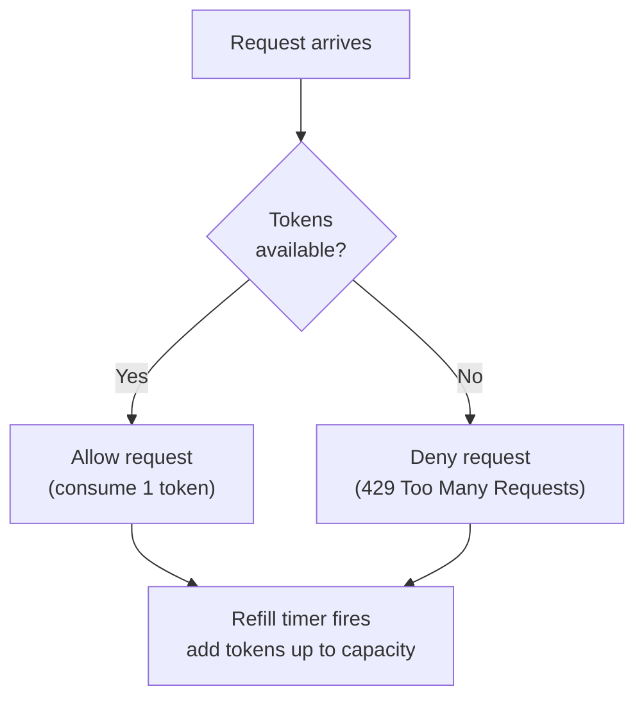
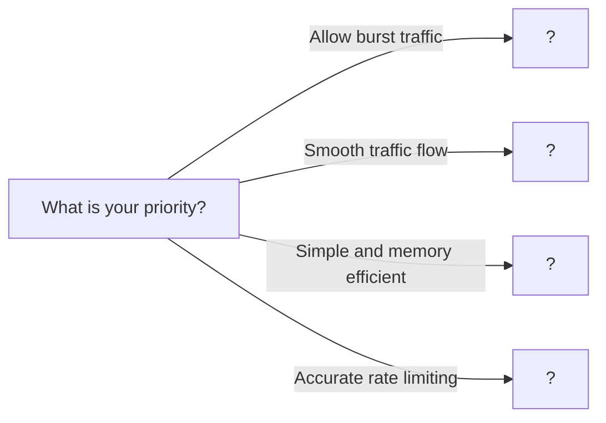

# Rate Limiting

> Protecting APIs from abuse and ensuring fair resource usage

---

## Learning Objectives

By the end of this topic you will be able to:

- Implement the token bucket algorithm including refill logic, burst capacity enforcement, and multi-token acquisition
- Implement the leaky bucket algorithm with a constant-drain queue and explain why it produces smoother traffic than token bucket
- Compare fixed window, sliding window log, and sliding window counter algorithms across accuracy, memory usage, and boundary-case behaviour
- Identify the fixed-window double-rate boundary attack and explain how sliding or token-bucket approaches mitigate it
- Choose the appropriate rate-limiting algorithm given constraints on memory, burst tolerance, and accuracy
- Explain common implementation bugs such as elapsed-time unit mismatches and fractional-time loss in leak calculations

---

## ELI5: Explain Like I'm 5

<div class="learner-section" markdown>

**Your task:** After implementing different rate limiting algorithms, explain them simply.

**Prompts to guide you:**

1. **What is rate limiting in one sentence?**
    - Your answer: <span class="fill-in">Rate limiting is a ___ that works by ___</span>

2. **Why do we need rate limiting?**
    - Your answer: <span class="fill-in">Without rate limiting, a single client could ___, which would cause ___</span>

3. **Real-world analogy for token bucket:**
    - Example: "Token bucket is like a piggy bank where..."
    - Your analogy: <span class="fill-in">Think about how you'd ration coins for a vending machine — you earn coins over time, and you can save up a handful before spending them in a burst...</span>

4. **What is the token bucket algorithm in one sentence?**
    - Your answer: <span class="fill-in">Token bucket is a ___ that allows ___ by ___</span>

5. **How is leaky bucket different from token bucket?**
    - Your answer: <span class="fill-in">Leaky bucket ___ while token bucket ___; the key difference in output is ___</span>

6. **Real-world analogy for leaky bucket:**
    - Example: "Leaky bucket is like a water tower where..."
    - Your analogy: <span class="fill-in">Think about how a dripping faucet smooths out a gush of water — no matter how fast water arrives, it only leaves at one constant rate...</span>

7. **What is sliding window algorithm in one sentence?**
    - Your answer: <span class="fill-in">Sliding window is a ___ that fixes the boundary problem by ___</span>

8. **When would you use fixed window vs sliding window?**
    - Your answer: <span class="fill-in">Fixed window is better when ___ because ___; sliding window is better when ___</span>

</div>

---

## Case Studies: Rate Limiting in the Wild

### Stripe API: The Leaky Bucket for Smooth Traffic

- **Pattern:** Leaky Bucket algorithm.
- **How it works:** Stripe's API processes requests at a fixed, steady rate, smoothing out bursts. Imagine a bucket with
  a small hole in the bottom. Incoming requests fill the bucket, and they are processed at the rate water "leaks" out.
  If requests arrive too quickly, the bucket overflows, and requests are rejected with a `429 Too Many Requests` status
  code.
- **Key Takeaway:** The Leaky Bucket algorithm is excellent for services that require a predictable, stable load and
  want to prevent being overwhelmed by sudden bursts of traffic. It enforces a very smooth processing rate.

### GitHub API: The Token Bucket for Flexibility

- **Pattern:** Token Bucket algorithm.
- **How it works:** GitHub provides each API client with a "bucket" of tokens (e.g., 5,000) that refills over time (
  e.g., per hour). Each API request consumes one token. This allows clients to make short, intense bursts of requests as
  long as they have tokens remaining. The API's HTTP response headers (`X-RateLimit-Limit`, `X-RateLimit-Remaining`,
  `X-RateLimit-Reset`) clearly communicate the client's current status, allowing applications to gracefully back off.
- **Key Takeaway:** The Token Bucket algorithm provides more flexibility than the Leaky Bucket, as it permits bursty
  traffic. This is user-friendly for clients who may have legitimate reasons to make many requests in a short period, as
  long as their average rate remains within the limit.

### Cloudflare: Fixed Windows for DDoS Protection

- **Pattern:** Fixed Window Counters for security.
- **How it works:** As a security company, Cloudflare's priority is blocking malicious traffic. They use simple,
  high-performance fixed window counters at their edge locations. They might have a rule like: "Block any IP that makes
  more than 100 requests in any 10-second window." While this can be cheated by a sophisticated attacker who distributes
  requests across windows, it is extremely effective at stopping basic brute-force attacks and application-layer DDoS
  attempts with very little overhead.
- **Key Takeaway:** For security and DDoS mitigation, the raw performance and simplicity of a fixed window counter can
  be the most effective choice. The goal isn't perfect fairness but rather the rapid identification and blocking of
  abusive behavior.

---

## Core Implementation

### Token Bucket Flow


```mermaid
flowchart TD
    Req["Request arrives"]
    Check{"Tokens\navailable?"}
    Allow["Allow request\n(consume 1 token)"]
    Deny["Deny request\n(429 Too Many Requests)"]
    Refill["Refill timer fires\nadd tokens up to capacity"]

    Req --> Check
    Check -->|"Yes"| Allow
    Check -->|"No"| Deny
    Allow --> Refill
    Deny --> Refill
```

### Part 1: Token Bucket Algorithm

**Your task:** Implement token bucket rate limiter with refill mechanism.

```java
--8<-- "com/study/systems/ratelimiting/TokenBucketRateLimiter.java"
```

!!! warning "Debugging Challenge — Time Unit Mismatch in Token Refill"

    The refill calculation below produces wildly incorrect token counts. Find and fix the bug.

    ```java
    private void refill() {
        long now = System.currentTimeMillis();
        long elapsed = now - lastRefillTime;

        double tokensToAdd = elapsed * refillRate;  // refillRate is tokens/sec

        tokens = Math.min(capacity, tokens + tokensToAdd);
        lastRefillTime = now;
    }
    ```

    Manual trace: `elapsed = 2000` (2 seconds), `refillRate = 2.0` tokens/sec.
    What value does `tokensToAdd` compute to? What should it be?

    ??? success "Answer"

        **Bug:** `elapsed` is in milliseconds but `refillRate` is in tokens/second. Multiplying them gives `2000 × 2.0 = 4000` tokens — 2000x too many. A 2-second wait would overflow any reasonable capacity limit.

        **Fix:** Divide elapsed by 1000.0 before multiplying:

        ```java
        double elapsedSeconds = elapsed / 1000.0;
        double tokensToAdd = elapsedSeconds * refillRate;
        ```

        This is one of the most common rate-limiting bugs in production code. Always be explicit about the time unit of every variable that holds a duration.

---

### Part 2: Leaky Bucket Algorithm

**Your task:** Implement leaky bucket rate limiter with constant outflow.

```java
--8<-- "com/study/systems/ratelimiting/LeakyBucketRateLimiter.java"
```

---

### Part 3: Fixed Window Algorithm

**Your task:** Implement simple fixed window counter.

```java
--8<-- "com/study/systems/ratelimiting/FixedWindowRateLimiter.java"
```

---

### Part 4: Sliding Window Log Algorithm

**Your task:** Implement sliding window with request log.

```java
--8<-- "com/study/systems/ratelimiting/SlidingWindowLogRateLimiter.java"
```

---

### Part 5: Sliding Window Counter (Hybrid)

**Your task:** Implement memory-efficient sliding window counter.

```java
--8<-- "com/study/systems/ratelimiting/SlidingWindowCounterRateLimiter.java"
```

---

## Leaky Bucket Debugging Exercises

**Your task:** Find and fix bugs in broken leaky bucket implementation. This tests your understanding of the algorithm.

### Challenge: Broken Leaky Bucket (Time Unit Bug + Fractional Time Loss)

```java
public class BrokenLeakyBucket {
    private final int capacity;
    private final double leakRate;  // requests per second
    private final Queue<Long> bucket;
    private long lastLeakTime;

    public boolean tryAcquire() {
        leak();

        if (bucket.size() < capacity) {
            bucket.offer(System.currentTimeMillis());
            return true;
        }

        return false;
    }

    private void leak() {
        long now = System.currentTimeMillis();
        long elapsed = now - lastLeakTime;

        int requestsToLeak = (int)(elapsed * leakRate);

        for (int i = 0; i < requestsToLeak && !bucket.isEmpty(); i++) {
            bucket.poll();
        }

        lastLeakTime = now;    }
}
```

**Your debugging:**

- **Bug 1:** Calculation `elapsed * leakRate`
    - elapsed = 2000ms, leakRate = 2 req/sec
    - Current: 2000 × 2 = <span class="fill-in">[What?]</span>
    - Expected: <span class="fill-in">[How many requests should leak in 2 seconds?]</span>
    - Fix: <span class="fill-in">[Correct formula]</span>
- **Bug 2:** `lastLeakTime = now` happens every call
    - Scenario: elapsed = 500ms, leakRate = 2 req/sec
    - requests to leak = 1 request
    - We update lastLeakTime, "losing" the remaining 0.5 requests worth of time
    - Fix: <span class="fill-in">[Should we account for fractional leak time?]</span>

??? success "Answer"

    **Bug 1:** Same as token bucket - multiplying milliseconds by rate per second.

    **Fix:**

    ```java
    double elapsedSeconds = elapsed / 1000.0;
    int requestsToLeak = (int)(elapsedSeconds * leakRate);
    ```

    **Bug 2:** Updating `lastLeakTime` every call loses fractional seconds.

    **Better approach:**

    ```java
    private void leak() {
        long now = System.currentTimeMillis();
        double elapsedSeconds = (now - lastLeakTime) / 1000.0;
        int requestsToLeak = (int)(elapsedSeconds * leakRate);

        for (int i = 0; i < requestsToLeak && !bucket.isEmpty(); i++) {
            bucket.poll();
        }

        // Only update time for the requests we actually leaked
        if (requestsToLeak > 0) {
            lastLeakTime += (long)((requestsToLeak / leakRate) * 1000);
        }
    }
    ```

    This preserves fractional time for more accurate leaking.

---

### Your Debugging Scorecard

After finding and fixing all bugs:

- [ ] Found time unit conversion errors (ms vs seconds)
- [ ] Identified race conditions in concurrent access
- [ ] Caught off-by-one errors in counters
- [ ] Understood memory implications of different approaches
- [ ] Fixed incorrect weight formulas in sliding window
- [ ] Recognized fractional time loss in leak calculations

**Common rate limiting bugs you discovered:**

1. <span class="fill-in">[List the patterns you noticed]</span>
2. <span class="fill-in">[Fill in]</span>
3. <span class="fill-in">[Fill in]</span>

**Testing strategies you learned:**

<div class="learner-section" markdown>

- How would you test for race conditions? <span class="fill-in">[Your answer]</span>
- How would you test boundary conditions? <span class="fill-in">[Your answer]</span>
- How would you test time-based calculations? <span class="fill-in">[Your answer]</span>

</div>

---

## Before/After: Why This Pattern Matters

**Your task:** Compare naive vs optimized rate limiting approaches.

### Example: Protecting an API Endpoint

**Problem:** Prevent API abuse while allowing legitimate traffic.

#### Approach 1: No Rate Limiting

```java
// Naive approach - No protection
public class NoRateLimiting {
    public Response handleRequest(Request req) {
        return processRequest(req); // Process every request
    }
}
```

**Analysis:**

- Time: O(1) per request
- Space: O(1)
- Protection: NONE - vulnerable to abuse
- Result: Server overload, DDoS attacks succeed
- For 1 million malicious requests: Server crashes

#### Approach 2: Fixed Window Rate Limiter

```java
// Simple fixed window - Memory efficient
public class FixedWindowRateLimiter {
    private int counter = 0;
    private long windowStart = System.currentTimeMillis();
    private final int maxRequests = 100;
    private final long windowMs = 60000; // 1 minute

    public boolean tryAcquire() {
        long now = System.currentTimeMillis();

        // Reset window if expired
        if (now - windowStart >= windowMs) {
            counter = 0;
            windowStart = now;
        }

        // Check limit
        if (counter < maxRequests) {
            counter++;
            return true;
        }
        return false;
    }
}
```

**Analysis:**

- Time: O(1) per request
- Space: O(1) - only 3 variables per user
- Protection: Good - limits to 100 req/min
- Issue: Allows 200 requests in 2 seconds at window boundary
- For 1 million users: ~12 bytes × 1M = ~12 MB

#### Approach 3: Token Bucket (Better for Bursts)

```java
// Token bucket - Allows controlled bursts
public class TokenBucketRateLimiter {
    private double tokens;
    private long lastRefillTime;
    private final int capacity = 100;
    private final double refillRate = 10.0; // tokens/sec

    public boolean tryAcquire() {
        refill();

        if (tokens >= 1) {
            tokens -= 1;
            return true;
        }
        return false;
    }

    private void refill() {
        long now = System.currentTimeMillis();
        double elapsed = (now - lastRefillTime) / 1000.0;
        tokens = Math.min(capacity, tokens + elapsed * refillRate);
        lastRefillTime = now;
    }
}
```

**Analysis:**

- Time: O(1) per request
- Space: O(1) - 3 variables per user
- Protection: Excellent - smooth rate limiting + burst capacity
- Flexibility: Can handle legitimate traffic spikes
- For 1 million users: ~16 bytes × 1M = ~16 MB

#### Performance Comparison

| Scenario        | No Limiting | Fixed Window   | Token Bucket | Sliding Window Log          |
|-----------------|-------------|----------------|--------------|-----------------------------|
| Memory per user | 0 bytes     | 12 bytes       | 16 bytes     | ~800 bytes (100 timestamps) |
| 1M users memory | 0 MB        | 12 MB          | 16 MB        | 800 MB                      |
| Prevents abuse  | No          | Yes            | Yes          | Yes                         |
| Allows bursts   | N/A         | No             | Yes          | No                          |
| Accurate rate   | N/A         | Boundary issue | Accurate     | Most accurate               |
| CPU per request | Low         | Low            | Low          | Medium (cleanup)            |

**Your calculation:** For 10 million users with sliding window log tracking 1000 requests each:

- Memory needed: <span class="fill-in">[Calculate after implementation]</span>
- Why this might be impractical: <span class="fill-in">[Fill in]</span>

#### Boundary Attack Demonstration

**Fixed Window Problem:**

```
Window 1: 12:00:00 - 12:01:00 (limit: 100 req)
Window 2: 12:01:00 - 12:02:00 (limit: 100 req)

Attack pattern:

- 12:00:59 → 100 requests (allowed, fills window 1)
- 12:01:01 → 100 requests (allowed, new window 2)
- Total: 200 requests in 2 seconds!
```

**Token Bucket Solution:**

```
Capacity: 100 tokens, Refill: 10 tokens/sec

Attack pattern:

- 12:00:59 → 100 requests (bucket empties)
- 12:01:01 → 20 requests (only ~20 tokens refilled)
- Total: 120 requests max (controlled burst)
```

**After implementing, explain in your own words:**

- Why does fixed window allow double rate at boundaries? <span class="fill-in">[Fill in]</span>
- How does token bucket prevent this? <span class="fill-in">[Fill in]</span>
- When is fixed window "good enough"? <span class="fill-in">[Fill in]</span>

---

## Common Misconceptions

!!! danger "Token bucket and leaky bucket are interchangeable"
    They enforce the same average rate but behave very differently under burst traffic. Token bucket allows a client to spend accumulated tokens instantly — a full bucket of 100 means 100 requests right now. Leaky bucket drains at a constant rate regardless of arrival pattern; burst traffic simply overflows. Use token bucket when legitimate bursty clients exist; use leaky bucket when downstream services need steady load.

!!! danger "Sliding window log is always better than fixed window"
    Sliding window log is more accurate but stores one timestamp per request. For 1 million users each allowed 1,000 req/min, that is potentially 1 billion timestamps (~8 GB) just for the rate-limiter state. Fixed window uses only a counter and a timestamp per user — orders of magnitude less memory. Accuracy must be weighed against memory cost for your specific scale.

!!! danger "Rate limiting only needs to run once per user per minute"
    Rate limiting must run on every incoming request, not periodically. Checking "did this user exceed their limit in the last minute?" is different from "does this specific request arrive within quota?" The check must happen synchronously at request time, before work is done, and it must be atomic to avoid race conditions in distributed deployments.

!!! danger "When it breaks"
    Per-node rate limiting breaks at two nodes: a 1,000 req/s limit across a 10-node cluster actually permits 10,000 req/s. Distributed rate limiting with Redis fixes this but adds a round-trip (~0.5ms) to every request; at 50,000 req/s, Redis itself becomes the bottleneck. Fixed window rate limiting breaks at window boundaries: a client sending 1,000 requests in the last second of window N and 1,000 in the first second of window N+1 passes two consecutive limits while actually delivering 2,000 req/s. Sliding window eliminates this but requires storing per-request timestamps, which costs significantly more memory at high request rates.

---

## Decision Framework

<div class="learner-section" markdown>

**Questions to answer after implementation:**

### 1. Algorithm Selection

**When to use Token Bucket?**

- Your scenario: <span class="fill-in">[Fill in]</span>
- Key factors: <span class="fill-in">[Fill in]</span>

**When to use Leaky Bucket?**

- Your scenario: <span class="fill-in">[Fill in]</span>
- Key factors: <span class="fill-in">[Fill in]</span>

**When to use Fixed Window?**

- Your scenario: <span class="fill-in">[Fill in]</span>
- Key factors: <span class="fill-in">[Fill in]</span>

**When to use Sliding Window?**

- Your scenario: <span class="fill-in">[Fill in]</span>
- Key factors: <span class="fill-in">[Fill in]</span>

### 2. Trade-offs

**Token Bucket:**

- Pros: <span class="fill-in">[Fill in after understanding]</span>
- Cons: <span class="fill-in">[Fill in after understanding]</span>

**Leaky Bucket:**

- Pros: <span class="fill-in">[Fill in after understanding]</span>
- Cons: <span class="fill-in">[Fill in after understanding]</span>

**Fixed Window:**

- Pros: <span class="fill-in">[Fill in after understanding]</span>
- Cons: <span class="fill-in">[Fill in after understanding]</span>

**Sliding Window:**

- Pros: <span class="fill-in">[Fill in after understanding]</span>
- Cons: <span class="fill-in">[Fill in after understanding]</span>

### 3. Your Decision Tree

Build your decision tree after practicing:

```mermaid
flowchart LR
    Start["What is your priority?"]

    N1["?"]
    Start -->|"Allow burst traffic"| N1
    N2["?"]
    Start -->|"Smooth traffic flow"| N2
    N3["?"]
    Start -->|"Simple and memory efficient"| N3
    N4["?"]
    Start -->|"Accurate rate limiting"| N4
```

</div>

---

## Practice

<div class="learner-section" markdown>

### Scenario 1: Rate limit public API

**Requirements:**

- Public REST API
- Need to allow burst traffic
- 100 requests per minute per user
- Premium users get 1000 requests per minute

**Your design:**

- Which algorithm would you choose? <span class="fill-in">[Fill in]</span>
- Why? <span class="fill-in">[Fill in]</span>
- How to handle different user tiers? <span class="fill-in">[Fill in]</span>
- How to handle distributed servers? <span class="fill-in">[Fill in]</span>

**Failure modes:**

- What happens if the shared Redis store used for rate limit counters becomes unavailable across all API servers? <span class="fill-in">[Fill in]</span>
- How does your design behave when a premium user's quota misconfiguration allows unlimited requests and floods the backend? <span class="fill-in">[Fill in]</span>

### Scenario 2: Rate limit login attempts

**Requirements:**

- Prevent brute force attacks
- 5 login attempts per minute
- Smooth out retry attempts
- Block for 15 minutes after limit

**Your design:**

- Which algorithm would you choose? <span class="fill-in">[Fill in]</span>
- Why? <span class="fill-in">[Fill in]</span>
- How to implement blocking? <span class="fill-in">[Fill in]</span>
- How to handle false positives? <span class="fill-in">[Fill in]</span>

**Failure modes:**

- What happens if the rate limiter state is stored only in memory and the server restarts, resetting all block counters mid-attack? <span class="fill-in">[Fill in]</span>
- How does your design behave when a legitimate user is behind a shared NAT and their IP is blocked due to another user's brute-force attempts? <span class="fill-in">[Fill in]</span>

### Scenario 3: Rate limit microservice calls

**Requirements:**

- Service A calls Service B
- Protect Service B from overload
- Service B can handle 1000 req/sec
- Need graceful degradation

**Your design:**

- Which algorithm would you choose? <span class="fill-in">[Fill in]</span>
- Why? <span class="fill-in">[Fill in]</span>
- How to handle backpressure? <span class="fill-in">[Fill in]</span>
- Circuit breaker integration? <span class="fill-in">[Fill in]</span>

**Failure modes:**

- What happens if Service B's rate limiter is bypassed because Service A retries aggressively after 429 responses without exponential backoff? <span class="fill-in">[Fill in]</span>
- How does your design behave when a thundering herd of retries from multiple service instances overwhelms Service B after a brief outage? <span class="fill-in">[Fill in]</span>

</div>

---

## Test Your Understanding

Answer these without referring to your notes or implementation.

1. A token bucket has capacity 100 and refill rate 10 tokens/sec. At T=0 the bucket is full. A client sends 100 requests instantly, then sends 1 more request 500ms later. Is that 101st request allowed? Show your calculation.

    ??? success "Rubric"
        A complete answer addresses: (1) at T=500ms, elapsed time is 0.5 seconds, so tokens refilled = 0.5 × 10 = 5 tokens, (2) the bucket therefore has 5 tokens, so the 101st request (which costs 1 token) is allowed — 4 tokens remain, (3) the key insight is that the bucket refills continuously from the last refill timestamp, not only at discrete intervals.

2. Explain the fixed-window boundary attack in concrete terms. If a limit is 10 requests/minute, what is the maximum number of requests an attacker can send in any 2-second window using this attack?

    ??? success "Rubric"
        A complete answer addresses: (1) the attacker sends 10 requests at 11:59:59 (fills window 1) and 10 more at 12:00:01 (starts fresh window 2), achieving 20 requests in 2 seconds — double the stated rate, (2) this works because each window resets independently with no memory of the previous window's traffic, (3) token bucket or sliding window log prevents this because they track actual elapsed time rather than resetting on a fixed schedule.

3. You need to rate-limit 50 million users at 100 requests/minute each. Compare the memory footprint of fixed window, sliding window log, and token bucket approaches for this scale. Which would you choose and why?

    ??? success "Rubric"
        A complete answer addresses: (1) fixed window: ~12 bytes per user × 50M = ~600 MB total; token bucket: ~16 bytes per user × 50M = ~800 MB total; sliding window log: up to 100 timestamps × 8 bytes × 50M = ~40 GB — impractical, (2) token bucket is the best choice: it is memory-efficient, handles bursts fairly, and avoids the boundary attack that affects fixed window, (3) sliding window log is eliminated at this scale because storing per-request timestamps for 50 million users exhausts available memory.

4. Your leaky bucket implementation passes unit tests but behaves incorrectly under load in production. The bucket appears to allow far more requests than configured. What time-unit bug should you look for first?

    ??? success "Rubric"
        A complete answer addresses: (1) the most common bug is a units mismatch: computing elapsed time in milliseconds but using a drain rate configured in seconds (or vice versa), causing the bucket to drain 1000x slower or faster than intended, (2) a secondary bug is integer truncation when computing fractional drain amounts — if elapsed time is stored as a long in milliseconds and the rate is tokens/second, the division must be floating-point, (3) the fix is to enforce consistent time units throughout (use nanoseconds or milliseconds everywhere) and use double arithmetic for the drain calculation.

5. A colleague proposes using a single in-memory counter for rate limiting on a horizontally-scaled API with 10 servers. What is the problem with this approach, and what storage backend would you recommend instead?

    ??? success "Rubric"
        A complete answer addresses: (1) each server maintains its own in-memory counter, so a client sending 10 requests distributed across 10 servers consumes only 1 request per counter — effectively bypassing the limit by a factor of N servers, (2) the correct approach is a shared atomic counter in a centralised store such as Redis, using INCR and EXPIRE commands which are atomic on a single-threaded Redis server, (3) Redis also enables sliding window counter via sorted sets and supports Lua scripts for atomic multi-step operations, making it the standard backend for distributed rate limiting.

---

## Connected Topics

<div class="bs-callout bs-callout-info" markdown>

**Where this topic connects**

- **06. API Design** — rate limiting is applied at the API layer to protect endpoints; the rate limit unit (per user, per IP, per API key) aligns with the API authentication scheme → [06. API Design](06-api-design.md)
- **09. Load Balancing** — rate limiting is commonly implemented at the load balancer or API gateway level, before requests reach backend services → [09. Load Balancing](09-load-balancing.md)
- **15. Observability** — rate limit hit rate and remaining quota are key metrics; tracking them with counters reveals abuse patterns and helps tune thresholds → [15. Observability](15-observability.md)

</div>
