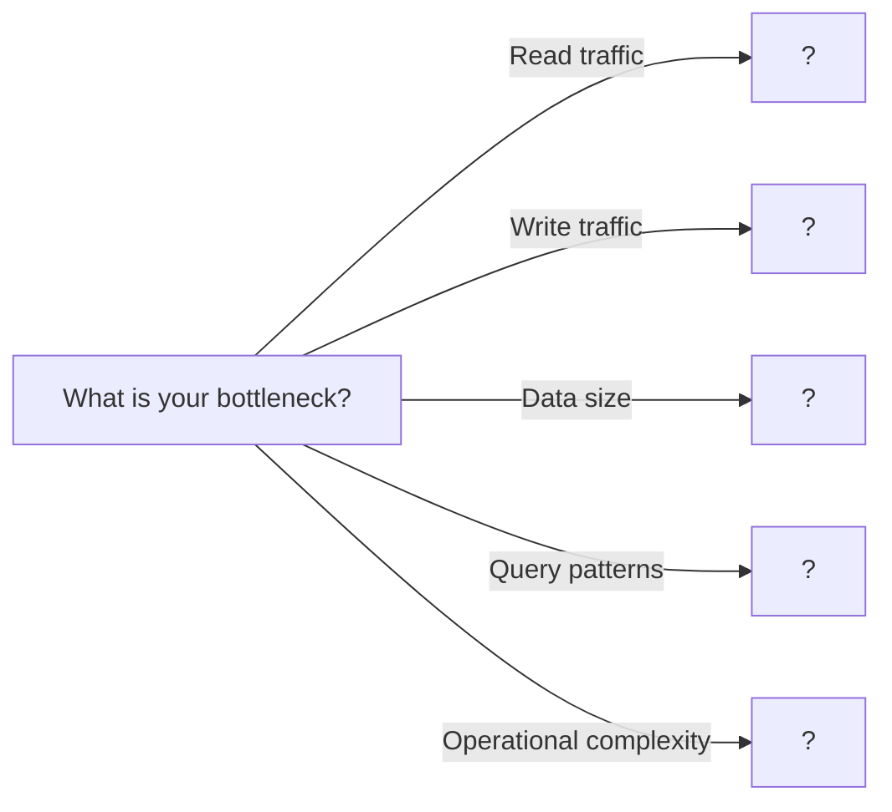

# 07. Database Scaling

> Strategies for handling growing data and traffic through sharding, replication, and partitioning

---

## ELI5: Explain Like I'm 5

<div class="learner-section" markdown>

**Your task:** After implementing database scaling strategies, explain them simply.

**Prompts to guide you:**

1. **What is database scaling in one sentence?**
    - Your answer: <span class="fill-in">[Fill in after implementation]</span>

2. **Why do databases need to scale?**
    - Your answer: <span class="fill-in">[Fill in after implementation]</span>

3. **Real-world analogy for sharding:**
    - Example: "Sharding is like having multiple filing cabinets where..."
    - Your analogy: <span class="fill-in">[Fill in]</span>

4. **What is sharding in one sentence?**
    - Your answer: <span class="fill-in">[Fill in after implementation]</span>

5. **How is replication different from sharding?**
    - Your answer: <span class="fill-in">[Fill in after implementation]</span>

6. **Real-world analogy for replication:**
    - Example: "Replication is like photocopying important documents where..."
    - Your analogy: <span class="fill-in">[Fill in]</span>

7. **What is partitioning in one sentence?**
    - Your answer: <span class="fill-in">[Fill in after implementation]</span>

8. **When would you use horizontal vs vertical scaling?**
    - Your answer: <span class="fill-in">[Fill in after implementation]</span>

</div>

---

## Quick Quiz (Do BEFORE implementing)

<div class="learner-section" markdown>

**Your task:** Test your intuition about database scaling without looking at code. Answer these, then verify after
implementation.

### Complexity Predictions

1. **Single database serving reads and writes:**
    - Bottleneck: <span class="fill-in">[Your guess: CPU/Memory/Disk/Network?]</span>
    - Verified after learning: <span class="fill-in">[Actual bottleneck]</span>

2. **Master-slave replication with 3 read replicas:**
    - Read capacity increase: <span class="fill-in">[Your guess: 2x/3x/4x?]</span>
    - Write capacity increase: <span class="fill-in">[Your guess: No change/2x/3x?]</span>
    - Verified: <span class="fill-in">[Actual capacity changes]</span>

3. **Sharding 1TB database across 10 shards:**
    - Data per shard: <span class="fill-in">[Calculate: <span class="fill-in">_____</span> GB]</span>
    - If one shard fails, data lost: <span class="fill-in">[Yes/No/Depends?]</span>
    - Speedup for single-key lookups: <span class="fill-in">[10x/No change/Slower?]</span>

### Scenario Predictions

**Scenario 1:** Social media app with 100M users, 90% reads, 10% writes

- **Best scaling strategy:** <span class="fill-in">[Sharding/Replication/Both - Why?]</span>
- **If using replication, how many read replicas?** <span class="fill-in">[2/5/10 - Reasoning?]</span>
- **Main challenge:** <span class="fill-in">[Fill in your prediction]</span>

**Scenario 2:** E-commerce site storing user profiles, each 5KB

- **You need to shard by user_id. What happens to:**
    - Single user lookups? <span class="fill-in">[Faster/Same/Slower - Why?]</span>
    - Cross-user analytics queries? <span class="fill-in">[Faster/Same/Slower - Why?]</span>
    - Adding new shards? <span class="fill-in">[Easy/Hard - Why?]</span>

**Scenario 3:** Time-series IoT data, queries by timestamp ranges

- **Best sharding strategy:** <span class="fill-in">[Hash/Range/Consistent - Why?]</span>
- **Shard key should be:** <span class="fill-in">[user_id/timestamp/device_id - Why?]</span>
- **What's the risk?** <span class="fill-in">[Fill in your prediction]</span>

### Trade-off Quiz

**Question:** When would vertical partitioning be BETTER than adding more RAM?

- Your answer: <span class="fill-in">[Fill in before implementation]</span>
- Verified answer: <span class="fill-in">[Fill in after learning]</span>

**Question:** What's the MAIN downside of sharding vs replication?

- [ ] Higher cost
- [ ] Complex queries across shards
- [ ] Slower single-key lookups
- [ ] Requires more DBAs

Verify after implementation: <span class="fill-in">[Which one(s) and why?]</span>

**Question:** Replication lag is 2 seconds. A user updates their profile, then immediately views it. What do they see?

- [ ] Always new data (master read)
- [ ] Always old data (slave lag)
- [ ] Old data if load balancer picks slave
- [ ] Random

Your answer: <span class="fill-in">[Fill in]</span>
Verified: <span class="fill-in">[Fill in after understanding replication]</span>


</div>

---

## Before/After: Why Database Scaling Matters

**Your task:** Compare unscaled vs scaled approaches to understand the impact.

### Example: E-Commerce User Lookup

**Problem:** Product catalog with 10M items, receiving 10,000 read requests/sec and 100 write requests/sec.

#### Approach 1: Single Database (No Scaling)

```
Architecture:
┌─────────────┐
│   Clients   │ ─────> 10,000 reads/sec + 100 writes/sec
└─────────────┘
       │
       ▼
┌─────────────┐
│  Single DB  │ ← All traffic hits one server
└─────────────┘
```

**Analysis:**

- All reads and writes hit one server
- Database becomes CPU and I/O bottleneck
- At ~1,000 req/sec: Response time = 50ms
- At ~5,000 req/sec: Response time = 200ms (degraded)
- At ~10,000 req/sec: Database crashes or times out
- Maximum throughput: ~3,000-5,000 req/sec (hardware limit)

**Breaking point:** 10,000 req/sec target vs 5,000 req/sec capacity = **2x overloaded**

#### Approach 2: Master-Slave Replication (Read Scaling)

```
Architecture:
┌─────────────┐
│   Clients   │
└─────────────┘
       │
       ├─────> 100 writes/sec ────> ┌──────────┐
       │                             │  Master  │
       │                             └──────────┘
       │                                   │
       │                             (replicates to)
       │                                   │
       │                        ┌──────────┴──────────┐
       └─> 10,000 reads/sec ──> │                     │
                                 ▼                     ▼
                           ┌──────────┐         ┌──────────┐
                           │ Slave 1  │         │ Slave 2  │
                           └──────────┘         └──────────┘
                           5,000 reads/sec      5,000 reads/sec
```

**Analysis:**

- Writes: 100 writes/sec to master (well under capacity)
- Reads: 10,000 reads/sec distributed across 2 slaves = 5,000 each
- Master handles: 100 writes + replication = ~200 ops/sec
- Each slave handles: 5,000 reads/sec (within capacity)
- Read capacity: 2x-3x improvement per replica added
- Write capacity: No improvement (still single master)

**Result:** Can now handle 10,000 reads/sec + 100 writes/sec comfortably

#### Approach 3: Sharding (Write + Data Scaling)

```
Architecture:
┌─────────────┐
│   Clients   │
└─────────────┘
       │
(Shard by user_id % 4)
       │
   ┌───┴───┬───────┬───────┐
   ▼       ▼       ▼       ▼
┌──────┐┌──────┐┌──────┐┌──────┐
│Shard0││Shard1││Shard2││Shard3│
│ 2.5M ││ 2.5M ││ 2.5M ││ 2.5M │ items each
│items ││items ││items ││items │
└──────┘└──────┘└──────┘└──────┘
2,500    2,500    2,500    2,500  reads/sec each
25       25       25       25     writes/sec each
```

**Analysis:**

- Data per shard: 10M items / 4 = 2.5M items each
- Reads per shard: 10,000 / 4 = 2,500 reads/sec (well under capacity)
- Writes per shard: 100 / 4 = 25 writes/sec (well under capacity)
- Each shard operates at ~25% capacity (lots of headroom)
- Can scale writes (unlike replication)
- Can add more shards as data grows

**Trade-off:** Cross-shard queries become complex (e.g., "find all items > $100")

#### Performance Comparison

| Metric                 | Single DB     | Replication (2 slaves) | Sharding (4 shards)    |
|------------------------|---------------|------------------------|------------------------|
| **Read Capacity**      | 5,000 req/sec | 15,000 req/sec         | 20,000 req/sec         |
| **Write Capacity**     | 500 req/sec   | 500 req/sec            | 2,000 req/sec          |
| **Data Capacity**      | 1TB max       | 1TB max                | 4TB+ (linear)          |
| **Latency (reads)**    | 50ms @ load   | 50ms @ load            | 50ms @ load            |
| **Latency (writes)**   | 50ms          | 50ms + replication     | 50ms                   |
| **Single-key lookup**  | 1 query       | 1 query                | 1 query (1 shard)      |
| **Cross-entity query** | 1 query       | 1 query                | 4 queries (all shards) |
| **Cost**               | 1x            | 3x (1M + 2S)           | 4x (4 shards)          |
| **Complexity**         | Low           | Medium                 | High                   |

**Your calculation:** For 50,000 read req/sec, you'd need _____ read replicas OR _____ shards.

#### Real-World Impact Example

**Instagram's scaling journey (simplified):**

```
2010: Single PostgreSQL database

- 10K users
- Single server
- Cost: $500/month

2011: Master-slave replication

- 1M users
- 1 master + 3 read replicas
- Can't scale writes fast enough
- Cost: $5K/month

2012: Sharded by user_id

- 10M users
- 100+ shards
- Custom sharding logic
- Cost: $50K/month

2015: Cassandra (distributed database)

- 500M users
- Automatic sharding + replication
- No single point of failure
- Cost: $500K/month
```

#### Why Does Replication Help Reads?

**Key insight to understand:**

```
Single Database (1000 reads/sec capacity):
Request 1 ──┐
Request 2 ──┤
Request 3 ──┤──> ┌────────┐
...         │    │   DB   │ ← Bottleneck
Request 999 ──┤  └────────┘
Request 1000──┘
Request 1001 ✗ (rejected/timeout)
```

```
Replication with 3 slaves (3000 reads/sec total):
Request 1-333   ──> ┌────────┐
                    │ Slave 1│
                    └────────┘

Request 334-666 ──> ┌────────┐
                    │ Slave 2│
                    └────────┘

Request 667-1000──> ┌────────┐
                    │ Slave 3│
                    └────────┘

All 1000 requests handled, with 2000 req/sec headroom
```

**After implementing, explain in your own words:**

<div class="learner-section" markdown>

- Why does replication not help writes? <span class="fill-in">[Your answer]</span>
- Why does sharding help both reads and writes? <span class="fill-in">[Your answer]</span>
- When would you combine replication + sharding? <span class="fill-in">[Your answer]</span>

</div>

---

## Core Implementation

### Part 1: Hash-Based Sharding

**Your task:** Implement hash-based sharding for distributing data.

```java
import java.util.*;

/**
 * Hash-Based Sharding: Distribute data across shards using hash function
 *
 * Key principles:
 * - Hash key determines shard
 * - Even distribution of data
 * - Simple and predictable
 * - Resharding is expensive
 */

public class HashBasedSharding {

    private final List<DatabaseShard> shards;

    /**
     * Initialize hash-based sharding
     *
     * @param numShards Number of database shards
     *
     * TODO: Initialize sharding
     * - Create list of shards
     * - Initialize each shard
     */
    public HashBasedSharding(int numShards) {
        // TODO: Initialize shards list

        // TODO: Create numShards DatabaseShard instances

        this.shards = null; // Replace
    }

    /**
     * Get shard for a given key
     *
     * @param key Record key (e.g., user ID)
     * @return Shard that should store this key
     *
     * TODO: Implement shard selection
     * 1. Hash the key
     * 2. Modulo by number of shards
     * 3. Return shard at that index
     */
    public DatabaseShard getShard(String key) {
        // TODO: Hash key to integer

        // TODO: Get shard index using modulo
        // index = abs(hash) % shards.size()

        // TODO: Return shard at index

        return null; // Replace
    }

    /**
     * Insert record
     *
     * TODO: Route to correct shard and insert
     */
    public void insert(String key, String value) {
        // TODO: Get shard for key

        // TODO: Insert into shard
    }

    /**
     * Get record
     *
     * TODO: Route to correct shard and retrieve
     */
    public String get(String key) {
        // TODO: Get shard for key

        // TODO: Get from shard

        return null; // Replace
    }

    /**
     * Delete record
     *
     * TODO: Route to correct shard and delete
     */
    public void delete(String key) {
        // TODO: Get shard for key

        // TODO: Delete from shard
    }

    /**
     * Get statistics for all shards
     */
    public Map<Integer, Integer> getStats() {
        Map<Integer, Integer> stats = new HashMap<>();
        for (int i = 0; i < shards.size(); i++) {
            stats.put(i, shards.get(i).getRecordCount());
        }
        return stats;
    }

    /**
     * Hash function
     */
    private int hash(String key) {
        // TODO: Hash key to integer
        // Hint: key.hashCode() & 0x7FFFFFFF
        return 0; // Replace
    }

    static class DatabaseShard {
        int shardId;
        Map<String, String> data;

        public DatabaseShard(int shardId) {
            this.shardId = shardId;
            this.data = new HashMap<>();
        }

        public void insert(String key, String value) {
            data.put(key, value);
        }

        public String get(String key) {
            return data.get(key);
        }

        public void delete(String key) {
            data.remove(key);
        }

        public int getRecordCount() {
            return data.size();
        }
    }
}
```

### Part 2: Range-Based Sharding

**Your task:** Implement range-based sharding for ordered data.

```java
/**
 * Range-Based Sharding: Distribute data by key ranges
 *
 * Key principles:
 * - Continuous key ranges per shard
 * - Good for range queries
 * - Risk of hotspots
 * - Easier to add shards
 */

public class RangeBasedSharding {

    private final TreeMap<String, DatabaseShard> rangeMap;
    private final List<DatabaseShard> shards;

    /**
     * Initialize range-based sharding
     *
     * @param ranges List of range boundaries (sorted)
     *
     * TODO: Initialize range sharding
     * - Create TreeMap for range lookup
     * - Assign shard to each range
     *
     * Example: ranges = ["M", "Z"] creates 3 shards
     *   Shard 0: keys < "M"
     *   Shard 1: keys >= "M" and < "Z"
     *   Shard 2: keys >= "Z"
     */
    public RangeBasedSharding(List<String> ranges) {
        // TODO: Initialize rangeMap and shards

        // TODO: Create shard for each range
        // for i in 0 to ranges.size():
        //   Create shard
        //   Put range boundary -> shard in map

        this.rangeMap = null; // Replace
        this.shards = null; // Replace
    }

    /**
     * Get shard for a given key
     *
     * @param key Record key
     * @return Shard that should store this key
     *
     * TODO: Implement range lookup
     * 1. Find first range >= key (ceilingEntry)
     * 2. If null, use last shard
     * 3. Return shard
     */
    public HashBasedSharding.DatabaseShard getShard(String key) {
        // TODO: Look up range in TreeMap
        // entry = rangeMap.ceilingEntry(key)

        // TODO: If entry found, return its shard

        // TODO: Otherwise return last shard (for keys >= last boundary)

        return null; // Replace
    }

    /**
     * Insert record
     */
    public void insert(String key, String value) {
        // TODO: Get shard for key and insert
    }

    /**
     * Get record
     */
    public String get(String key) {
        // TODO: Get shard for key and retrieve
        return null; // Replace
    }

    /**
     * Range query (scan multiple shards if needed)
     *
     * TODO: Find all shards in range and query them
     */
    public List<String> rangeQuery(String startKey, String endKey) {
        // TODO: Find first shard containing startKey

        // TODO: Query all shards until endKey

        // TODO: Combine results

        return null; // Replace
    }

    /**
     * Get statistics
     */
    public Map<Integer, Integer> getStats() {
        Map<Integer, Integer> stats = new HashMap<>();
        for (int i = 0; i < shards.size(); i++) {
            stats.put(i, shards.get(i).getRecordCount());
        }
        return stats;
    }
}
```

### Part 3: Master-Slave Replication

**Your task:** Implement master-slave replication for read scaling.

```java
/**
 * Master-Slave Replication: One writer, multiple readers
 *
 * Key principles:
 * - Master handles all writes
 * - Slaves replicate data from master
 * - Slaves handle reads
 * - Eventual consistency
 */

public class MasterSlaveReplication {

    private final Database master;
    private final List<Database> slaves;
    private int readIndex; // For round-robin read distribution

    /**
     * Initialize master-slave replication
     *
     * @param numSlaves Number of read replicas
     *
     * TODO: Initialize replication
     * - Create master database
     * - Create slave databases
     * - Initialize read index
     */
    public MasterSlaveReplication(int numSlaves) {
        // TODO: Create master

        // TODO: Create slaves

        // TODO: Initialize readIndex to 0

        this.master = null; // Replace
        this.slaves = null; // Replace
    }

    /**
     * Write operation (goes to master)
     *
     * TODO: Implement write
     * 1. Write to master
     * 2. Replicate to all slaves
     *
     * Note: In production, replication is async
     */
    public void write(String key, String value) {
        // TODO: Write to master

        // TODO: Replicate to all slaves
        // for each slave:
        //   slave.write(key, value)
    }

    /**
     * Read operation (load balanced across slaves)
     *
     * TODO: Implement read from slaves
     * - Use round robin to select slave
     * - Read from selected slave
     * - Fallback to master if slave fails
     */
    public synchronized String read(String key) {
        // TODO: Select slave using round robin
        // slave = slaves.get(readIndex)
        // readIndex = (readIndex + 1) % slaves.size()

        // TODO: Read from slave

        // TODO: If slave fails, fallback to master

        return null; // Replace
    }

    /**
     * Delete operation (goes to master)
     */
    public void delete(String key) {
        // TODO: Delete from master

        // TODO: Replicate deletion to slaves
    }

    /**
     * Check replication lag
     *
     * TODO: Compare master and slave data
     * - Count keys that differ
     * - Return lag metrics
     */
    public ReplicationStats getReplicationStats() {
        // TODO: Compare master with each slave

        return null; // Replace
    }

    static class Database {
        String id;
        Map<String, String> data;

        public Database(String id) {
            this.id = id;
            this.data = new HashMap<>();
        }

        public void write(String key, String value) {
            data.put(key, value);
        }

        public String read(String key) {
            return data.get(key);
        }

        public void delete(String key) {
            data.remove(key);
        }

        public int size() {
            return data.size();
        }
    }

    static class ReplicationStats {
        int totalKeys;
        Map<String, Integer> slaveKeyCount;

        public ReplicationStats() {
            this.slaveKeyCount = new HashMap<>();
        }
    }
}
```

### Part 4: Vertical Partitioning

**Your task:** Implement vertical partitioning (column splitting).

```java
/**
 * Vertical Partitioning: Split tables by columns
 *
 * Key principles:
 * - Frequently accessed columns in one partition
 * - Rarely accessed columns in another
 * - Reduces I/O for common queries
 * - Requires joins for full records
 */

public class VerticalPartitioning {

    private final Map<String, HotData> hotStore;   // Frequently accessed
    private final Map<String, ColdData> coldStore; // Rarely accessed

    /**
     * Initialize vertical partitioning
     *
     * TODO: Initialize hot and cold stores
     */
    public VerticalPartitioning() {
        // TODO: Initialize both stores
        this.hotStore = null; // Replace
        this.coldStore = null; // Replace
    }

    /**
     * Insert full record
     *
     * TODO: Split record into hot and cold parts
     * - Store frequently accessed fields in hot store
     * - Store rarely accessed fields in cold store
     */
    public void insert(String id, String name, String email, String bio, byte[] largeData) {
        // TODO: Create HotData with id, name, email

        // TODO: Create ColdData with id, bio, largeData

        // TODO: Store in respective stores
    }

    /**
     * Get hot data only (fast, common query)
     *
     * TODO: Retrieve from hot store only
     */
    public HotData getHotData(String id) {
        // TODO: Get from hotStore
        return null; // Replace
    }

    /**
     * Get full record (requires join)
     *
     * TODO: Retrieve from both stores and merge
     */
    public FullRecord getFullRecord(String id) {
        // TODO: Get hot data

        // TODO: Get cold data

        // TODO: Combine into FullRecord

        return null; // Replace
    }

    /**
     * Update hot data (fast)
     */
    public void updateHotData(String id, String name, String email) {
        // TODO: Update hotStore only
    }

    /**
     * Update cold data (infrequent)
     */
    public void updateColdData(String id, String bio, byte[] largeData) {
        // TODO: Update coldStore only
    }

    /**
     * Get statistics
     */
    public PartitionStats getStats() {
        return new PartitionStats(hotStore.size(), coldStore.size());
    }

    static class HotData {
        String id;
        String name;
        String email;

        public HotData(String id, String name, String email) {
            this.id = id;
            this.name = name;
            this.email = email;
        }
    }

    static class ColdData {
        String id;
        String bio;
        byte[] largeData;

        public ColdData(String id, String bio, byte[] largeData) {
            this.id = id;
            this.bio = bio;
            this.largeData = largeData;
        }
    }

    static class FullRecord {
        String id;
        String name;
        String email;
        String bio;
        byte[] largeData;

        public FullRecord(HotData hot, ColdData cold) {
            this.id = hot.id;
            this.name = hot.name;
            this.email = hot.email;
            this.bio = cold.bio;
            this.largeData = cold.largeData;
        }
    }

    static class PartitionStats {
        int hotRecords;
        int coldRecords;

        public PartitionStats(int hotRecords, int coldRecords) {
            this.hotRecords = hotRecords;
            this.coldRecords = coldRecords;
        }
    }
}
```

### Part 5: Consistent Hashing for Dynamic Sharding

**Your task:** Implement consistent hashing for easier resharding.

```java
/**
 * Consistent Hashing Sharding: Minimal data movement on resharding
 *
 * Key principles:
 * - Uses hash ring (from load balancing)
 * - Adding/removing shards affects limited keys
 * - Virtual nodes for better distribution
 * - Popular for distributed databases
 */

public class ConsistentHashSharding {

    private final TreeMap<Integer, HashBasedSharding.DatabaseShard> ring;
    private final Map<Integer, HashBasedSharding.DatabaseShard> shards;
    private final int virtualNodesPerShard;
    private int nextShardId;

    /**
     * Initialize consistent hash sharding
     *
     * @param initialShards Number of initial shards
     * @param virtualNodesPerShard Virtual nodes per physical shard
     *
     * TODO: Initialize hash ring
     * - Create TreeMap for ring
     * - Add initial shards with virtual nodes
     */
    public ConsistentHashSharding(int initialShards, int virtualNodesPerShard) {
        // TODO: Initialize structures

        // TODO: Add initial shards

        this.ring = null; // Replace
        this.shards = null; // Replace
        this.virtualNodesPerShard = 0;
    }

    /**
     * Get shard for key
     *
     * TODO: Use consistent hashing to find shard
     */
    public HashBasedSharding.DatabaseShard getShard(String key) {
        // TODO: Hash key

        // TODO: Find next shard on ring (ceilingEntry)

        // TODO: If null, wrap to first shard

        return null; // Replace
    }

    /**
     * Add new shard
     *
     * TODO: Add shard with virtual nodes
     * - Place virtual nodes on ring
     * - Migrate data from affected keys
     */
    public void addShard() {
        // TODO: Create new shard

        // TODO: Add virtual nodes to ring

        // TODO: In production: migrate affected data
    }

    /**
     * Remove shard
     *
     * TODO: Remove shard and virtual nodes
     * - Remove from ring
     * - Migrate data to other shards
     */
    public void removeShard(int shardId) {
        // TODO: Get shard

        // TODO: Remove all virtual nodes from ring

        // TODO: In production: migrate data
    }

    /**
     * Insert/Get/Delete operations
     */
    public void insert(String key, String value) {
        getShard(key).insert(key, value);
    }

    public String get(String key) {
        return getShard(key).get(key);
    }

    public void delete(String key) {
        getShard(key).delete(key);
    }

    /**
     * Hash function
     */
    private int hash(String key) {
        return key.hashCode() & 0x7FFFFFFF;
    }

    /**
     * Get statistics
     */
    public Map<Integer, Integer> getStats() {
        Map<Integer, Integer> stats = new HashMap<>();
        for (Map.Entry<Integer, HashBasedSharding.DatabaseShard> entry : shards.entrySet()) {
            stats.put(entry.getKey(), entry.getValue().getRecordCount());
        }
        return stats;
    }
}
```

---

## Client Code

```java
import java.util.*;

public class DatabaseScalingClient {

    public static void main(String[] args) {
        testHashBasedSharding();
        System.out.println("\n" + "=".repeat(50) + "\n");
        testRangeBasedSharding();
        System.out.println("\n" + "=".repeat(50) + "\n");
        testMasterSlaveReplication();
        System.out.println("\n" + "=".repeat(50) + "\n");
        testVerticalPartitioning();
        System.out.println("\n" + "=".repeat(50) + "\n");
        testConsistentHashSharding();
    }

    static void testHashBasedSharding() {
        System.out.println("=== Hash-Based Sharding Test ===\n");

        HashBasedSharding db = new HashBasedSharding(3);

        // Insert data
        String[] users = {"user1", "user2", "user3", "user4", "user5",
                         "user6", "user7", "user8", "user9", "user10"};

        System.out.println("Inserting 10 users:");
        for (String user : users) {
            db.insert(user, user + "_data");
            System.out.println(user + " -> Shard " + db.getShard(user).shardId);
        }

        System.out.println("\nShard distribution:");
        System.out.println(db.getStats());

        // Test retrieval
        System.out.println("\nRetrieving user3:");
        System.out.println(db.get("user3"));
    }

    static void testRangeBasedSharding() {
        System.out.println("=== Range-Based Sharding Test ===\n");

        // Ranges: A-M, M-Z, Z+
        List<String> ranges = Arrays.asList("M", "Z");
        RangeBasedSharding db = new RangeBasedSharding(ranges);

        // Insert data
        String[] names = {"Alice", "Bob", "Charlie", "Mike", "Nancy",
                         "Oscar", "Peter", "Zoe", "Zachary"};

        System.out.println("Inserting names (range-based):");
        for (String name : names) {
            db.insert(name, name + "_data");
            System.out.println(name + " -> Shard " + db.getShard(name).shardId);
        }

        System.out.println("\nShard distribution:");
        System.out.println(db.getStats());

        // Test range query
        System.out.println("\nRange query: M-P");
        List<String> results = db.rangeQuery("M", "P");
        System.out.println("Results: " + results);
    }

    static void testMasterSlaveReplication() {
        System.out.println("=== Master-Slave Replication Test ===\n");

        MasterSlaveReplication db = new MasterSlaveReplication(2);

        // Test writes (go to master, replicate to slaves)
        System.out.println("Writing to master:");
        db.write("key1", "value1");
        db.write("key2", "value2");
        db.write("key3", "value3");

        // Test reads (distributed across slaves)
        System.out.println("\nReading from slaves (round-robin):");
        for (int i = 0; i < 6; i++) {
            String value = db.read("key" + (i % 3 + 1));
            System.out.println("Read " + (i+1) + ": " + value);
        }

        // Check replication
        System.out.println("\nReplication stats:");
        System.out.println(db.getReplicationStats());
    }

    static void testVerticalPartitioning() {
        System.out.println("=== Vertical Partitioning Test ===\n");

        VerticalPartitioning db = new VerticalPartitioning();

        // Insert records
        System.out.println("Inserting records (hot+cold data):");
        db.insert("user1", "Alice", "alice@example.com",
                 "Long bio...", new byte[1000]);
        db.insert("user2", "Bob", "bob@example.com",
                 "Long bio...", new byte[1000]);

        // Fast query (hot data only)
        System.out.println("\nFast query (hot data only):");
        VerticalPartitioning.HotData hot = db.getHotData("user1");
        System.out.println("Name: " + hot.name + ", Email: " + hot.email);

        // Full query (requires join)
        System.out.println("\nFull query (hot + cold data):");
        VerticalPartitioning.FullRecord full = db.getFullRecord("user1");
        System.out.println("Name: " + full.name);
        System.out.println("Bio length: " + full.bio.length());
        System.out.println("Data size: " + full.largeData.length + " bytes");

        // Stats
        System.out.println("\nPartition stats:");
        VerticalPartitioning.PartitionStats stats = db.getStats();
        System.out.println("Hot: " + stats.hotRecords + ", Cold: " + stats.coldRecords);
    }

    static void testConsistentHashSharding() {
        System.out.println("=== Consistent Hash Sharding Test ===\n");

        ConsistentHashSharding db = new ConsistentHashSharding(3, 3);

        // Insert data
        String[] keys = {"key1", "key2", "key3", "key4", "key5"};
        System.out.println("Initial distribution (3 shards):");
        for (String key : keys) {
            db.insert(key, key + "_data");
            System.out.println(key + " -> Shard " + db.getShard(key).shardId);
        }

        System.out.println("\nStats: " + db.getStats());

        // Add shard (minimal redistribution)
        System.out.println("\nAdding 4th shard:");
        db.addShard();

        System.out.println("New distribution:");
        for (String key : keys) {
            System.out.println(key + " -> Shard " + db.getShard(key).shardId);
        }

        System.out.println("\nStats: " + db.getStats());
    }
}
```

---

## Debugging Challenges

**Your task:** Find and fix bugs in broken database scaling implementations. This tests your understanding of scaling
pitfalls.

### Challenge 1: Broken Hash Sharding (Uneven Distribution)

```java
/**
 * This hash-based sharding causes hotspots
 * Find the BUG that creates uneven distribution!
 */
public class BrokenHashSharding {
    private final List<DatabaseShard> shards;

    public DatabaseShard getShard(String key) {
        int hash = key.length() % shards.size();
        return shards.get(hash);
    }

    public void insert(String key, String value) {
        getShard(key).insert(key, value);
    }
}

// Test with user IDs: user1, user2, user3, ..., user100
// All have same key length! All go to same shard!
```

**Your debugging:**

- Bug: <span class="fill-in">[What\'s the bug?]</span>

**Trace through example:**

- Keys: "user1", "user2", "user99" (all length 5)
- With 3 shards, where do they go? <span class="fill-in">[All to shard ___]</span>
- Expected: <span class="fill-in">[Should be distributed across all shards]</span>

<details markdown>
<summary>Click to verify your answer</summary>

**Bug:** Using `key.length()` as hash creates terrible distribution. All keys with same length go to same shard.

**Fix:**

```java
public DatabaseShard getShard(String key) {
    // Use proper hash function
    int hash = Math.abs(key.hashCode()) % shards.size();
    return shards.get(hash);
}
```

**Why:** `hashCode()` produces different values for different strings, even with same length. The `Math.abs()` handles
negative hash codes.
</details>

---

### Challenge 2: Replication Lag Bug (Read-After-Write Consistency)

```java
/**
 * User updates profile, immediately views it, sees OLD data
 * Find the BUG causing stale reads!
 */
public class BrokenReplication {
    private Database master;
    private List<Database> slaves;
    private int readIndex = 0;

    public void updateProfile(String userId, String newName) {
        // Write to master
        master.write(userId, newName);

        // Slaves don't have new data yet
    }

    public String getProfile(String userId) {
        Database slave = slaves.get(readIndex);
        readIndex = (readIndex + 1) % slaves.size();
        return slave.read(userId);
    }
}

// Scenario:
// 1. User updates name to "John"
// 2. Master has "John" immediately
// 3. Replication takes 200ms
// 4. User views profile 50ms later
// 5. Read goes to slave (still has old name "Johnny")
// 6. User sees "Johnny" instead of "John" - CONFUSION!
```

**Your debugging:**

- **Bug location:** <span class="fill-in">[What's the problem?]</span>
- **Bug explanation:** <span class="fill-in">[Why do users see stale data?]</span>
- **Fix option 1:** <span class="fill-in">[How to guarantee read-after-write consistency?]</span>
- **Fix option 2:** <span class="fill-in">[Alternative approach?]</span>

<details markdown>
<summary>Click to verify your answers</summary>

**Bug:** Reading from slaves immediately after writing to master causes stale reads due to replication lag.

**Fix Option 1 - Read-Your-Writes (sticky sessions):**

```java
public void updateProfile(String userId, String newName) {
    master.write(userId, newName);
    // Mark this session to read from master for next N seconds
    markSessionForMasterReads(userId, Duration.ofSeconds(5));
}

public String getProfile(String userId) {
    // Check if user recently wrote
    if (shouldReadFromMaster(userId)) {
        return master.read(userId);  // Read from master
    }
    // Otherwise read from slave
    Database slave = slaves.get(readIndex);
    readIndex = (readIndex + 1) % slaves.size();
    return slave.read(userId);
}
```

**Fix Option 2 - Always read from master after writes:**

```java
public String getProfile(String userId, boolean afterWrite) {
    if (afterWrite) {
        return master.read(userId);  // Guarantee consistency
    }
    // Normal read from slave
    Database slave = slaves.get(readIndex);
    readIndex = (readIndex + 1) % slaves.size();
    return slave.read(userId);
}
```

**Trade-off:** Both fixes reduce read scalability by routing some reads to master.
</details>

---

### Challenge 3: Cross-Shard Query Disaster

```java
/**
 * Analytics query needs to scan all shards
 * This implementation has PERFORMANCE and CORRECTNESS bugs!
 */
public class BrokenCrossShardQuery {
    private List<DatabaseShard> shards;

    public List<User> findAllUsersOver21() {
        List<User> results = new ArrayList<>();

        for (DatabaseShard shard : shards) {
            List<User> shardResults = shard.query("age > 21");
            results.addAll(shardResults);
        }

        // If 1M results * 1KB each = 1GB memory


        return results;
    }
}

// Scenario: 10 shards, each takes 2 seconds to query
// Total time: 10 * 2 = 20 seconds!
// If shard 5 is slow (10 seconds), entire query takes 28 seconds!
```

**Your debugging:**

- **Bug 1 (Performance):** <span class="fill-in">[Why is serial query slow?]</span>
- **Bug 1 fix:** <span class="fill-in">[How to parallelize?]</span>

- **Bug 2 (Memory):** <span class="fill-in">[What happens with millions of results?]</span>
- **Bug 2 fix:** <span class="fill-in">[How to handle large result sets?]</span>

- **Bug 3 (Reliability):** <span class="fill-in">[What if one shard hangs?]</span>
- **Bug 3 fix:** <span class="fill-in">[How to add timeout?]</span>

<details markdown>
<summary>Click to verify your answers</summary>

**Fixed version with all bugs addressed:**

```java
public List<User> findAllUsersOver21(int limit, int offset) {
    List<CompletableFuture<List<User>>> futures = new ArrayList<>();

    // FIX 1: Parallel queries across shards
    for (DatabaseShard shard : shards) {
        CompletableFuture<List<User>> future = CompletableFuture.supplyAsync(() -> {
            // FIX 2: Per-shard pagination
            return shard.query("age > 21", limit / shards.size(), offset / shards.size());
        });

        // FIX 3: Add timeout per shard
        future = future.orTimeout(5, TimeUnit.SECONDS)
                      .exceptionally(ex -> {
                          // Log error, return empty for failed shard
                          System.err.println("Shard query failed: " + ex);
                          return Collections.emptyList();
                      });

        futures.add(future);
    }

    // Wait for all shards (with timeout)
    List<User> results = new ArrayList<>();
    for (CompletableFuture<List<User>> future : futures) {
        try {
            results.addAll(future.get(10, TimeUnit.SECONDS));
        } catch (Exception e) {
            // Handle timeout or failure
            System.err.println("Shard timeout: " + e);
        }
    }

    // FIX 2 continued: Apply global limit
    return results.stream().limit(limit).collect(Collectors.toList());
}
```

**Performance improvement:**

- Before: 10 shards × 2 seconds = 20 seconds
- After: max(2 seconds) = 2 seconds (parallel)
- **10x faster!**

</details>

---

### Challenge 4: Shard Imbalance (Hotspot)

```java
/**
 * Celebrity user causes ONE shard to be overloaded
 * Find the DESIGN BUG!
 */
public class BrokenSharding {
    // Sharding by user_id
    public DatabaseShard getShard(String userId) {
        int hash = Math.abs(userId.hashCode()) % shards.size();
        return shards.get(hash);
    }

    // Social media queries
    public List<Post> getUserPosts(String userId) {
        return getShard(userId).queryPosts(userId);
    }

    public List<Follower> getUserFollowers(String userId) {
        return getShard(userId).queryFollowers(userId);
    }
}

// Scenario: Celebrity "user123" has 100M followers
// - user123's shard stores: 100M follower records
// - Other shards: ~1000 follower records each
// - Shard 3 (celebrity's shard): 99.9% of queries!
// - Shard 3: CPU 100%, disk full, crashing
// - Other shards: CPU 5%, mostly idle

// This is a HOTSPOT or HOT SHARD problem!
```

**Your debugging:**

- **Design bug:** <span class="fill-in">[Why does one user cause shard overload?]</span>
- **When does this happen?** <span class="fill-in">[What data pattern causes hotspots?]</span>
- **Fix option 1:** <span class="fill-in">[How to split celebrity data?]</span>
- **Fix option 2:** <span class="fill-in">[How to cache celebrity data?]</span>
- **Fix option 3:** <span class="fill-in">[Different sharding strategy?]</span>

<details markdown>
<summary>Click to verify your answers</summary>

**Design bug:** Sharding by user_id groups all of a user's data on one shard. For celebrities with massive data/traffic,
that shard becomes a hotspot.

**Fix Option 1 - Split entity sharding:**

```java
// Shard users and their posts by user_id (small data)
public DatabaseShard getUserShard(String userId) {
    return shards.get(hash(userId) % shards.size());
}

// Shard followers by follower_id, not celebrity_id (distributes load)
public DatabaseShard getFollowerShard(String followerId) {
    return followerShards.get(hash(followerId) % followerShards.size());
}

// Now celebrity's 100M followers distributed across ALL shards
```

**Fix Option 2 - Caching layer:**

```java
// Cache celebrity data in Redis/Memcached
public List<Post> getUserPosts(String userId) {
    // Check if celebrity (cached list)
    if (isCelebrity(userId)) {
        return cache.get("posts:" + userId);
    }
    // Normal user -> query shard
    return getShard(userId).queryPosts(userId);
}
```

**Fix Option 3 - Consistent hashing with detection:**

```java
// Detect hot shards and split them
if (shard.requestRate() > threshold) {
    splitShard(shard);  // Create two shards from one
    rehashKeys(shard);  // Redistribute keys
}
```

**Prevention:** Monitor shard metrics (CPU, request rate, data size) and set alerts for imbalance.
</details>

---

### Challenge 5: Split-Brain (Replication Failure)

```java
/**
 * Master-slave replication during network partition
 * Find the CATASTROPHIC bug!
 */
public class BrokenMasterFailover {
    private Database master;
    private List<Database> slaves;

    // Master goes down, promote slave to master
    public void handleMasterFailure() {
        System.out.println("Master failed! Promoting slave to master...");

        master = slaves.get(0);  // Promote first slave
        slaves.remove(0);

        // Now we have NEW master accepting writes
    }

    // Meanwhile, OLD master recovers after network partition
    // OLD master thinks it's still master!
    // NEW master is also accepting writes!
    // TWO MASTERS = SPLIT BRAIN!

    // Writes to OLD master: user updates email to "alice@new.com"
    // Writes to NEW master: user updates email to "alice@old.com"
    // CONFLICT! Which is correct?
}

// Timeline:
// T=0: Master fails (network partition)
// T=10: Slave promoted to new master
// T=20: Clients write to new master
// T=30: Old master recovers, still thinks it's master
// T=40: Some clients write to old master (split brain!)
// T=50: Networks merge - DATA CONFLICTS!
```

**Your debugging:**

- **Bug:** <span class="fill-in">[What's the split-brain problem?]</span>
- **Why it's catastrophic:** <span class="fill-in">[What happens to data?]</span>
- **Fix option 1:** <span class="fill-in">[How to prevent old master from accepting writes?]</span>
- **Fix option 2:** <span class="fill-in">[How to detect split brain?]</span>
- **Real-world solution:** <span class="fill-in">[What do production systems do?]</span>

<details markdown>
<summary>Click to verify your answers</summary>

**Bug:** Split-brain occurs when two nodes both think they're master, accepting conflicting writes. This causes data
divergence and conflicts.

**Fix Option 1 - Fencing (prevent old master from accepting writes):**

```java
public void handleMasterFailure() {
    // Step 1: FENCE old master (disable it)
    oldMaster.fence();  // Prevent further writes

    // Step 2: Wait for in-flight writes to complete
    Thread.sleep(5000);

    // Step 3: Promote slave
    master = slaves.get(0);
    slaves.remove(0);

    // Step 4: Configure slaves to replicate from new master
    for (Database slave : slaves) {
        slave.replicateFrom(master);
    }
}
```

**Fix Option 2 - Consensus protocol (Raft/Paxos):**

```java
// Use leader election with quorum
// - Only ONE master elected at a time
// - Master must have quorum (majority votes)
// - Old master can't get quorum if network partitioned
public void electMaster() {
    int votes = 0;
    int requiredVotes = (nodes.size() / 2) + 1;  // Majority

    for (Node node : nodes) {
        if (node.voteFor(thisNode)) {
            votes++;
        }
    }

    if (votes >= requiredVotes) {
        thisNode.becomeMaster();  // Safe - have quorum
    }
}
```

**Fix Option 3 - Epoch/term numbers:**

```java
class Database {
    int epoch = 0;  // Incremented on each master change

    public void write(String key, String value, int writeEpoch) {
        if (writeEpoch < this.epoch) {
            throw new StaleEpochException("Old master, reject write");
        }
        // Accept write
    }
}
```

**Real-world solutions:**

- **PostgreSQL:** Uses fencing + watchdog
- **MySQL:** Group Replication with consensus
- **MongoDB:** Replica sets with election
- **Distributed databases:** Raft/Paxos consensus algorithms

</details>

---

### Your Debugging Scorecard

After finding and fixing all bugs:

- [ ] Found hotspot bug in hash sharding
- [ ] Understood replication lag and read-after-write consistency
- [ ] Fixed cross-shard query performance issues
- [ ] Identified and solved hot shard problem
- [ ] Understood split-brain problem in replication
- [ ] Could explain each fix to someone else

**Common scaling bugs you discovered:**

1. <span class="fill-in">[Poor hash functions cause hotspots]</span>
2. <span class="fill-in">[Replication lag causes stale reads]</span>
3. <span class="fill-in">[Cross-shard queries need parallelization and pagination]</span>
4. <span class="fill-in">[Celebrity/popular entity data causes hot shards]</span>
5. <span class="fill-in">[Split-brain in failover causes data conflicts]</span>

**Your takeaways:**

- Which bug surprised you most? <span class="fill-in">[Fill in]</span>
- Which bug is hardest to detect in production? <span class="fill-in">[Fill in]</span>
- Which bug has the worst consequences? <span class="fill-in">[Fill in]</span>

---

## Decision Framework

**Questions to answer after implementation:**

### 1. Scaling Strategy Selection

**When to use Hash-Based Sharding?**

- Your scenario: <span class="fill-in">[Fill in]</span>
- Key factors: <span class="fill-in">[Fill in]</span>

**When to use Range-Based Sharding?**

- Your scenario: <span class="fill-in">[Fill in]</span>
- Key factors: <span class="fill-in">[Fill in]</span>

**When to use Master-Slave Replication?**

- Your scenario: <span class="fill-in">[Fill in]</span>
- Key factors: <span class="fill-in">[Fill in]</span>

**When to use Vertical Partitioning?**

- Your scenario: <span class="fill-in">[Fill in]</span>
- Key factors: <span class="fill-in">[Fill in]</span>

**When to use Consistent Hash Sharding?**

- Your scenario: <span class="fill-in">[Fill in]</span>
- Key factors: <span class="fill-in">[Fill in]</span>

### 2. Trade-offs

**Hash-Based Sharding:**

- Pros: <span class="fill-in">[Fill in after understanding]</span>
- Cons: <span class="fill-in">[Fill in after understanding]</span>

**Range-Based Sharding:**

- Pros: <span class="fill-in">[Fill in after understanding]</span>
- Cons: <span class="fill-in">[Fill in after understanding]</span>

**Master-Slave Replication:**

- Pros: <span class="fill-in">[Fill in after understanding]</span>
- Cons: <span class="fill-in">[Fill in after understanding]</span>

**Vertical Partitioning:**

- Pros: <span class="fill-in">[Fill in after understanding]</span>
- Cons: <span class="fill-in">[Fill in after understanding]</span>

### 3. Your Decision Tree

Build your decision tree after practicing:


---

## Practice

### Scenario 1: Scale read-heavy application

**Requirements:**

- 90% reads, 10% writes
- Single database becoming bottleneck
- Need to scale to 10x traffic
- Can tolerate slight staleness

**Your design:**

- Which strategy would you choose? <span class="fill-in">[Fill in]</span>
- Why? <span class="fill-in">[Fill in]</span>
- How many replicas? <span class="fill-in">[Fill in]</span>
- Consistency guarantees? <span class="fill-in">[Fill in]</span>

### Scenario 2: Scale social media platform

**Requirements:**

- 500M users
- User profiles, posts, followers
- Need to distribute data
- Want fast user lookups

**Your design:**

- Which sharding strategy? <span class="fill-in">[Fill in]</span>
- What's the shard key? <span class="fill-in">[Fill in]</span>
- How to handle hot users (celebrities)? <span class="fill-in">[Fill in]</span>
- Cross-shard queries? <span class="fill-in">[Fill in]</span>

### Scenario 3: Time-series data storage

**Requirements:**

- IoT sensor data
- Queries by time range
- Recent data accessed frequently
- Old data rarely accessed

**Your design:**

- Which partitioning strategy? <span class="fill-in">[Fill in]</span>
- How to partition? <span class="fill-in">[Fill in]</span>
- Archival strategy? <span class="fill-in">[Fill in]</span>
- Query optimization? <span class="fill-in">[Fill in]</span>

---

## Review Checklist

- [ ] Hash-based sharding implemented
- [ ] Range-based sharding implemented
- [ ] Master-slave replication implemented
- [ ] Vertical partitioning implemented
- [ ] Consistent hash sharding implemented
- [ ] Understand when to use each strategy
- [ ] Can explain trade-offs between strategies
- [ ] Built decision tree for strategy selection
- [ ] Completed practice scenarios

---

### Mastery Certification

**I certify that I can:**

- [ ] Explain all scaling strategies to non-technical stakeholders
- [ ] Draw architecture diagrams for each strategy from memory
- [ ] Choose the correct strategy for different scenarios
- [ ] Calculate capacity requirements and costs
- [ ] Debug common scaling issues (lag, hotspots, split-brain)
- [ ] Analyze trade-offs between different approaches
- [ ] Handle production incidents involving sharding/replication
- [ ] Design database layer for large-scale systems
- [ ] Teach these concepts to others

**Self-assessment score:** ___/10

**Specific areas to review (if score < 8):**

- [ ] Replication lag and consistency models
- [ ] Hash vs range-based sharding trade-offs
- [ ] Cross-shard query patterns
- [ ] Hot shard detection and mitigation
- [ ] Failover and split-brain prevention
- [ ] Capacity planning calculations

**If score < 8:** Review the sections where you struggled, then retry this gate.

**If score ≥ 8:** Congratulations! You've mastered database scaling. Proceed to the next topic.
