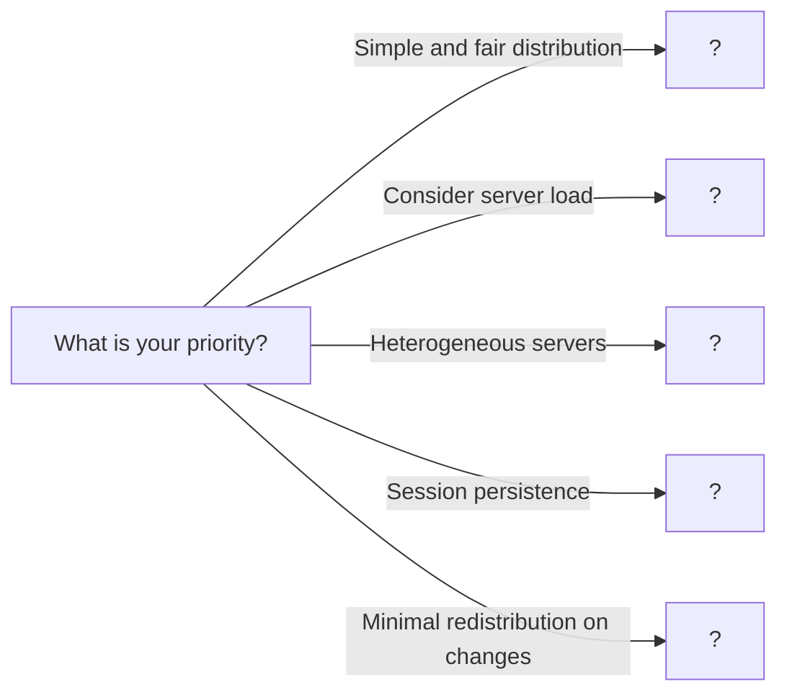

# Load Balancing

> Distributing requests across multiple servers for scalability and reliability

---

## ELI5: Explain Like I'm 5

<div class="learner-section" markdown>

**Your task:** After implementing different load balancing algorithms, explain them simply.

**Prompts to guide you:**

1. **What is load balancing in one sentence?**
    - Your answer: <span class="fill-in">[Fill in after implementation]</span>

2. **Why do we need load balancers?**
    - Your answer: <span class="fill-in">[Fill in after implementation]</span>

3. **Real-world analogy for round robin:**
    - Example: "Round robin is like a carousel where..."
    - Your analogy: <span class="fill-in">[Fill in]</span>

4. **What is round robin in one sentence?**
    - Your answer: <span class="fill-in">[Fill in after implementation]</span>

5. **How is least connections different from round robin?**
    - Your answer: <span class="fill-in">[Fill in after implementation]</span>

6. **Real-world analogy for consistent hashing:**
    - Example: "Consistent hashing is like a clock where..."
    - Your analogy: <span class="fill-in">[Fill in]</span>

7. **What is consistent hashing in one sentence?**
    - Your answer: <span class="fill-in">[Fill in after implementation]</span>

8. **When would you use weighted load balancing?**
    - Your answer: <span class="fill-in">[Fill in after implementation]</span>

</div>

---

## Quick Quiz (Do BEFORE implementing)

<div class="learner-section" markdown>

**Your task:** Test your intuition without looking at code. Answer these, then verify after implementation.

### Complexity Predictions

1. **Round robin server selection:**
    - Time complexity: <span class="fill-in">[Your guess: O(?)]</span>
    - Space complexity: <span class="fill-in">[Your guess: O(?)]</span>
    - Verified after learning: <span class="fill-in">[Actual: O(?)]</span>

2. **Least connections server selection:**
    - Time complexity: <span class="fill-in">[Your guess: O(?)]</span>
    - Space complexity: <span class="fill-in">[Your guess: O(?)]</span>
    - Verified: <span class="fill-in">[Actual]</span>

3. **Consistent hashing lookup:**
    - Time complexity: <span class="fill-in">[Your guess: O(?)]</span>
    - Space complexity: <span class="fill-in">[Your guess: O(?)]</span>
    - Verified: <span class="fill-in">[Actual]</span>

### Scenario Predictions

**Scenario 1:** 3 identical servers, 12 requests using round robin

- **How many requests does each server get?** <span class="fill-in">[Fill in]</span>
- **If we add a 4th server after 8 requests, what happens?** <span class="fill-in">[Explain]</span>
- **Is this distribution optimal for all workloads?** <span class="fill-in">[Yes/No - Why?]</span>

**Scenario 2:** 3 servers, server 1 has 5 connections, server 2 has 2, server 3 has 3

- **Which server does least connections choose?** <span class="fill-in">[Fill in]</span>
- **Why not round robin in this case?** <span class="fill-in">[Explain]</span>
- **What if requests have varying durations?** <span class="fill-in">[Which algorithm is better?]</span>

**Scenario 3:** Consistent hashing with 3 servers, 100 cache keys

- **If you add a 4th server, approximately what % of keys are remapped?** <span class="fill-in">[Fill in]</span>
- **If you remove 1 server, what % of keys are remapped?** <span class="fill-in">[Fill in]</span>
- **Why is this better than simple hash % server_count?** <span class="fill-in">[Explain]</span>

### Trade-off Quiz

**Question:** When would IP hash be WORSE than round robin?

- Your answer: <span class="fill-in">[Fill in before implementation]</span>
- Verified answer: <span class="fill-in">[Fill in after learning]</span>

**Question:** What's the MAIN problem with simple hash-based load balancing?

- [ ] It's too slow
- [ ] It doesn't distribute evenly
- [ ] Adding/removing servers causes massive redistribution
- [ ] It requires too much memory

Verify after implementation: <span class="fill-in">[Which one(s)?]</span>

**Question:** What problem do virtual nodes solve in consistent hashing?

- Your answer: <span class="fill-in">[Fill in before implementation]</span>
- Verified answer: <span class="fill-in">[Fill in after learning]</span>

</div>

---

## Before/After: Why This Pattern Matters

**Your task:** Compare different load balancing approaches to understand the impact.

### Example: Distributing 10 Requests

**Problem:** Route 10 requests across 3 servers with different algorithms.

#### Approach 1: Round Robin

```java
// Round robin - Simple circular rotation
List<Server> servers = Arrays.asList(server1, server2, server3);
int currentIndex = 0;

for (int i = 1; i <= 10; i++) {
    Server selected = servers.get(currentIndex);
    System.out.println("Request " + i + " -> " + selected.id);
    currentIndex = (currentIndex + 1) % servers.size();
}
```

**Output:**

```
Request 1 -> S1, Request 2 -> S2, Request 3 -> S3
Request 4 -> S1, Request 5 -> S2, Request 6 -> S3
Request 7 -> S1, Request 8 -> S2, Request 9 -> S3
Request 10 -> S1
```

**Analysis:**

- Distribution: S1=4, S2=3, S3=3 (even)
- Time: O(1) per request
- Space: O(1)
- Problem: Doesn't consider if S1 is slower or overloaded

#### Approach 2: Least Connections

```java
// Least connections - Route to server with fewest active connections
// Assume current state: S1=5 connections, S2=2 connections, S3=3 connections

ServerWithStats min = servers.get(0);
for (ServerWithStats s : servers) {
    if (s.activeConnections < min.activeConnections) {
        min = s;
    }
}
System.out.println("Route to: " + min.server.id);
min.activeConnections++;
```

**Analysis:**

- Routes to S2 (only 2 connections vs 5 and 3)
- Time: O(n) per request (scan all servers)
- Space: O(n) (track connection counts)
- Benefit: Adapts to varying request durations
- Problem: More overhead than round robin

#### Approach 3: Consistent Hashing

```java
// Consistent hashing - Map user to consistent server
TreeMap<Integer, Server> ring = new TreeMap<>();

// Place servers on ring with virtual nodes
for (Server s : servers) {
    for (int i = 0; i < 3; i++) {
        int hash = hash(s.id + "-" + i);
        ring.put(hash, s);
    }
}

// Route request by user ID
String userId = "user123";
int userHash = hash(userId);
Map.Entry<Integer, Server> entry = ring.ceilingEntry(userHash);
if (entry == null) entry = ring.firstEntry();
System.out.println(userId + " -> " + entry.getValue().id);
```

**Analysis:**

- Time: O(log n) per request (TreeMap lookup)
- Space: O(n * virtual_nodes)
- Benefit: Adding server only remaps ~1/n keys
- Problem: More complex, uneven distribution without enough virtual nodes

#### Performance Comparison: Adding a Server

| Algorithm             | Before    | After     | Keys Remapped          |
|-----------------------|-----------|-----------|------------------------|
| Simple Hash (key % n) | 3 servers | 4 servers | ~75% (3 out of 4 keys) |
| Consistent Hashing    | 3 servers | 4 servers | ~25% (1 out of 4 keys) |

**Why does this matter for caching?**

- Simple hash: 75% cache miss rate after adding server
- Consistent hash: 25% cache miss rate after adding server
- 3x improvement in cache hit rate during scaling

**Your calculation:** With 100 servers and 1,000,000 cached keys:

- Simple hash remapping: <span class="fill-in">_____</span> keys need to move
- Consistent hash remapping: <span class="fill-in">_____</span> keys need to move
- Improvement factor: <span class="fill-in">_____</span> times better

#### Comparison: Session Persistence

**Scenario:** User with shopping cart stored in server memory

**Round Robin:**

```
Request 1 (user123) -> S1 (cart created)
Request 2 (user123) -> S2 (cart lost! No session data)
Request 3 (user123) -> S3 (cart lost! No session data)
```

Result: Cart lost, poor user experience

**IP Hash:**

```
hash("192.168.1.100") % 3 = 1 -> S2
Request 1 (user123 from 192.168.1.100) -> S2 (cart created)
Request 2 (user123 from 192.168.1.100) -> S2 (cart found!)
Request 3 (user123 from 192.168.1.100) -> S2 (cart persists)
```

Result: Same server every time, session maintained

**After implementing, explain in your own words:**

<div class="learner-section" markdown>

- When would you choose round robin over least connections? <span class="fill-in">[Your answer]</span>
- Why use consistent hashing for a cache cluster? <span class="fill-in">[Your answer]</span>
- What are the trade-offs of IP hash for session persistence? <span class="fill-in">[Your answer]</span>

</div>

---

## Case Studies: Load Balancing in the Wild

### Netflix: Zuul API Gateway

- **Pattern:** L7 Load Balancing.
- **How it works:** Netflix's Zuul gateway acts as a smart L7 router. It inspects incoming HTTP requests and routes them
  to the appropriate microservice (e.g., `api/v1/movies` -> Movie Service, `api/v1/billing` -> Billing Service).
- **Key Takeaway:** They use it for more than just traffic distribution; it handles dynamic routing, security, and
  monitoring, acting as the "front door" to their entire microservices architecture.

### Facebook: Katran Load Balancer

- **Pattern:** L4 Load Balancing.
- **How it works:** Katran is a high-performance L4 load balancer that operates at the network packet level (TCP/UDP).
  It uses a technique called Direct Server Return (DSR) where the backend server responds directly to the client,
  bypassing the load balancer on the return path to reduce latency.
- **Key Takeaway:** For massive scale, Facebook optimized at a lower level to achieve extreme performance, sacrificing
  application-level routing logic at the edge for raw speed.

### Cloudflare: Anycast and Geo-Routing

- **Pattern:** Global Load Balancing (GSLB).
- **How it works:** Cloudflare uses Anycast DNS to route users to the nearest data center based on network topology. An
  L4/L7 load balancer within that data center then distributes traffic locally.
- **Key Takeaway:** Load balancing isn't just for a single data center. It's a critical tool for global traffic
  management, improving latency and providing DDoS protection by distributing traffic geographically.

---

## Core Implementation

### Part 1: Round Robin Load Balancer

**Your task:** Implement simple round robin algorithm.

```java
import java.util.*;

/**
 * Round Robin: Distribute requests evenly in rotation
 *
 * Key principles:
 * - Circular iteration through servers
 * - Simple and fair distribution
 * - Doesn't consider server load
 * - Works well for similar servers
 */

public class RoundRobinLoadBalancer {

    private final List<Server> servers;
    private int currentIndex;

    /**
     * Initialize round robin load balancer
     *
     * @param servers List of backend servers
     *
     * TODO: Initialize balancer
     * - Store server list
     * - Start index at 0
     */
    public RoundRobinLoadBalancer(List<Server> servers) {
        // TODO: Store servers (defensive copy)

        // TODO: Initialize currentIndex to 0

        this.servers = null; // Replace
        this.currentIndex = 0;
    }

    /**
     * Select next server using round robin
     *
     * @return Next server in rotation
     *
     * TODO: Implement round robin selection
     * 1. Get server at current index
     * 2. Increment index (with wraparound)
     * 3. Return server
     *
     * Hint: Use modulo for wraparound
     */
    public synchronized Server getNextServer() {
        // TODO: Check if servers list is empty

        // TODO: Get server at currentIndex

        // TODO: Increment currentIndex with wraparound
        // currentIndex = (currentIndex + 1) % servers.size()

        // TODO: Return selected server

        return null; // Replace
    }

    /**
     * Add server to pool
     */
    public synchronized void addServer(Server server) {
        // TODO: Add server to list
    }

    /**
     * Remove server from pool
     */
    public synchronized void removeServer(Server server) {
        // TODO: Remove server from list
        // TODO: Adjust currentIndex if needed
    }

    static class Server {
        String id;
        String host;
        int port;

        public Server(String id, String host, int port) {
            this.id = id;
            this.host = host;
            this.port = port;
        }

        @Override
        public String toString() {
            return id + " (" + host + ":" + port + ")";
        }
    }
}
```

### Part 2: Least Connections Load Balancer

**Your task:** Implement least connections algorithm.

```java
/**
 * Least Connections: Route to server with fewest active connections
 *
 * Key principles:
 * - Track active connections per server
 * - Select server with minimum load
 * - Better for varying request durations
 * - More overhead than round robin
 */

public class LeastConnectionsLoadBalancer {

    private final List<ServerWithStats> servers;

    /**
     * Initialize least connections load balancer
     *
     * @param servers List of backend servers
     *
     * TODO: Initialize balancer
     * - Create ServerWithStats for each server
     * - Initialize connection counters to 0
     */
    public LeastConnectionsLoadBalancer(List<RoundRobinLoadBalancer.Server> servers) {
        // TODO: Wrap each server with connection counter

        this.servers = null; // Replace
    }

    /**
     * Select server with fewest connections
     *
     * @return Server with minimum active connections
     *
     * TODO: Implement least connections selection
     * 1. Find server with minimum connections
     * 2. Increment its connection count
     * 3. Return server
     *
     * Hint: Break ties by choosing first found
     */
    public synchronized RoundRobinLoadBalancer.Server getNextServer() {
        // TODO: Check if servers list is empty

        // TODO: Find server with minimum connections

        // TODO: Increment connection count for selected server

        // TODO: Return selected server

        return null; // Replace
    }

    /**
     * Release connection when request completes
     *
     * @param server Server to release connection from
     *
     * TODO: Decrement connection count
     * - Find server in list
     * - Decrement activeConnections
     * - Ensure doesn't go below 0
     */
    public synchronized void releaseConnection(RoundRobinLoadBalancer.Server server) {
        // TODO: Find ServerWithStats for given server

        // TODO: Decrement activeConnections (min 0)
    }

    /**
     * Get server statistics
     */
    public synchronized Map<String, Integer> getStats() {
        Map<String, Integer> stats = new HashMap<>();
        for (ServerWithStats s : servers) {
            stats.put(s.server.id, s.activeConnections);
        }
        return stats;
    }

    static class ServerWithStats {
        RoundRobinLoadBalancer.Server server;
        int activeConnections;

        public ServerWithStats(RoundRobinLoadBalancer.Server server) {
            this.server = server;
            this.activeConnections = 0;
        }
    }
}
```

### Part 3: Weighted Round Robin

**Your task:** Implement weighted round robin for heterogeneous servers.

```java
/**
 * Weighted Round Robin: Distribute based on server capacity
 *
 * Key principles:
 * - Servers have different weights (capacity)
 * - Higher weight = more requests
 * - Smooth distribution using GCD algorithm
 * - Good for heterogeneous servers
 */

public class WeightedRoundRobinLoadBalancer {

    private final List<WeightedServer> servers;
    private int currentIndex;
    private int currentWeight;
    private int maxWeight;
    private int gcd; // Greatest common divisor of weights

    /**
     * Initialize weighted round robin
     *
     * @param servers List of servers with weights
     *
     * TODO: Initialize balancer
     * - Store servers
     * - Calculate max weight and GCD
     * - Initialize currentWeight to max
     */
    public WeightedRoundRobinLoadBalancer(List<WeightedServer> servers) {
        // TODO: Store servers

        // TODO: Calculate maxWeight (max of all weights)

        // TODO: Calculate GCD of all weights

        // TODO: Initialize currentIndex to -1

        // TODO: Initialize currentWeight to 0

        this.servers = null; // Replace
    }

    /**
     * Select next server using weighted round robin
     *
     * @return Next server based on weight
     *
     * TODO: Implement weighted selection
     * 1. Loop until finding server with weight >= currentWeight
     * 2. When loop completes, decrease currentWeight by GCD
     * 3. Return selected server
     *
     * Hint: This ensures smooth distribution
     */
    public synchronized RoundRobinLoadBalancer.Server getNextServer() {
        // TODO: Loop through servers
        while (true) {
            // TODO: Move to next index (wraparound)
            // currentIndex = (currentIndex + 1) % servers.size()

            // TODO: Implement iteration/conditional logic

            // TODO: Implement iteration/conditional logic

        }
    }

    /**
     * Calculate GCD of all weights
     */
    private int calculateGCD() {
        // TODO: Calculate GCD of all server weights
        // Hint: Use Euclidean algorithm
        return 1; // Replace
    }

    /**
     * Calculate GCD of two numbers
     */
    private int gcd(int a, int b) {
        // TODO: Implement Euclidean algorithm
        return 0; // Replace
    }

    static class WeightedServer {
        RoundRobinLoadBalancer.Server server;
        int weight; // Capacity/power of server

        public WeightedServer(RoundRobinLoadBalancer.Server server, int weight) {
            this.server = server;
            this.weight = weight;
        }
    }
}
```

### Part 4: Consistent Hashing

**Your task:** Implement consistent hashing for distributed caching.

```java
/**
 * Consistent Hashing: Map requests to servers using hash ring
 *
 * Key principles:
 * - Servers placed on virtual ring
 * - Request hashed to position on ring
 * - Clockwise walk to find server
 * - Minimal redistribution when servers change
 */

public class ConsistentHashingLoadBalancer {

    private final TreeMap<Integer, RoundRobinLoadBalancer.Server> ring;
    private final int virtualNodesPerServer;

    /**
     * Initialize consistent hashing
     *
     * @param servers List of servers
     * @param virtualNodesPerServer Number of virtual nodes per physical server
     *
     * TODO: Initialize hash ring
     * - Create TreeMap for ring
     * - Add each server with virtual nodes
     */
    public ConsistentHashingLoadBalancer(List<RoundRobinLoadBalancer.Server> servers, int virtualNodesPerServer) {
        // TODO: Initialize TreeMap

        // TODO: Store virtualNodesPerServer

        // TODO: Add all servers to ring

        this.ring = null; // Replace
        this.virtualNodesPerServer = 0;
    }

    /**
     * Get server for a given key
     *
     * @param key Request key (e.g., user ID, session ID)
     * @return Server to handle this key
     *
     * TODO: Implement consistent hashing lookup
     * 1. Hash the key to integer
     * 2. Find next server clockwise on ring
     * 3. If no server found, wrap to first server
     */
    public RoundRobinLoadBalancer.Server getServer(String key) {
        // TODO: Check if ring is empty

        // TODO: Hash key to integer position

        // TODO: Find next entry on ring (ceilingEntry)

        // TODO: Return server

        return null; // Replace
    }

    /**
     * Add server to hash ring
     *
     * TODO: Add server with virtual nodes
     * - For each virtual node:
     *   - Hash "serverId-virtualNodeIndex"
     *   - Place on ring
     */
    public void addServer(RoundRobinLoadBalancer.Server server) {
        // TODO: Add virtualNodesPerServer copies of this server
    }

    /**
     * Remove server from hash ring
     *
     * TODO: Remove all virtual nodes for this server
     */
    public void removeServer(RoundRobinLoadBalancer.Server server) {
        // TODO: Remove all virtual nodes
    }

    /**
     * Hash function
     *
     * TODO: Implement simple hash function
     * - Use string hashCode()
     * - Ensure positive value
     */
    private int hash(String key) {
        // TODO: Hash key to integer
        // Hint: key.hashCode() & 0x7FFFFFFF (remove sign bit)
        return 0; // Replace
    }

    /**
     * Get ring statistics
     */
    public int getRingSize() {
        return ring.size();
    }
}
```

### Part 5: IP Hash Load Balancer

**Your task:** Implement IP hash for session persistence.

```java
/**
 * IP Hash: Route client to same server based on IP
 *
 * Key principles:
 * - Hash client IP to select server
 * - Ensures session persistence
 * - Client always hits same server
 * - Issues when server pool changes
 */

public class IPHashLoadBalancer {

    private final List<RoundRobinLoadBalancer.Server> servers;

    /**
     * Initialize IP hash load balancer
     *
     * @param servers List of backend servers
     */
    public IPHashLoadBalancer(List<RoundRobinLoadBalancer.Server> servers) {
        // TODO: Store servers
        this.servers = null; // Replace
    }

    /**
     * Select server based on client IP
     *
     * @param clientIP Client IP address
     * @return Server for this client
     *
     * TODO: Implement IP hash selection
     * 1. Hash the client IP
     * 2. Modulo by server count
     * 3. Return server at that index
     */
    public synchronized RoundRobinLoadBalancer.Server getServer(String clientIP) {
        // TODO: Check if servers list is empty

        // TODO: Hash clientIP to integer

        // TODO: Get index using modulo
        // index = abs(hash) % servers.size()

        // TODO: Return server at index

        return null; // Replace
    }

    /**
     * Hash IP address
     */
    private int hash(String ip) {
        // TODO: Hash IP string
        // Hint: ip.hashCode()
        return 0; // Replace
    }

    /**
     * Add server (warning: disrupts session persistence)
     */
    public synchronized void addServer(RoundRobinLoadBalancer.Server server) {
        // TODO: Add server
        // Note: This will change hash distribution
    }

    /**
     * Remove server (warning: disrupts session persistence)
     */
    public synchronized void removeServer(RoundRobinLoadBalancer.Server server) {
        // TODO: Remove server
        // Note: This will change hash distribution
    }
}
```

---

## Client Code

```java
import java.util.*;

public class LoadBalancingClient {

    public static void main(String[] args) {
        testRoundRobin();
        System.out.println("\n" + "=".repeat(50) + "\n");
        testLeastConnections();
        System.out.println("\n" + "=".repeat(50) + "\n");
        testWeightedRoundRobin();
        System.out.println("\n" + "=".repeat(50) + "\n");
        testConsistentHashing();
        System.out.println("\n" + "=".repeat(50) + "\n");
        testIPHash();
    }

    static void testRoundRobin() {
        System.out.println("=== Round Robin Test ===\n");

        // Create servers
        List<RoundRobinLoadBalancer.Server> servers = Arrays.asList(
            new RoundRobinLoadBalancer.Server("S1", "10.0.0.1", 8080),
            new RoundRobinLoadBalancer.Server("S2", "10.0.0.2", 8080),
            new RoundRobinLoadBalancer.Server("S3", "10.0.0.3", 8080)
        );

        RoundRobinLoadBalancer lb = new RoundRobinLoadBalancer(servers);

        // Test: Send 10 requests
        System.out.println("Sending 10 requests:");
        for (int i = 1; i <= 10; i++) {
            RoundRobinLoadBalancer.Server server = lb.getNextServer();
            System.out.println("Request " + i + " -> " + server);
        }
    }

    static void testLeastConnections() {
        System.out.println("=== Least Connections Test ===\n");

        List<RoundRobinLoadBalancer.Server> servers = Arrays.asList(
            new RoundRobinLoadBalancer.Server("S1", "10.0.0.1", 8080),
            new RoundRobinLoadBalancer.Server("S2", "10.0.0.2", 8080),
            new RoundRobinLoadBalancer.Server("S3", "10.0.0.3", 8080)
        );

        LeastConnectionsLoadBalancer lb = new LeastConnectionsLoadBalancer(servers);

        // Test: Send requests and simulate completion
        System.out.println("Request 1:");
        RoundRobinLoadBalancer.Server s1 = lb.getNextServer();
        System.out.println("Routed to: " + s1);
        System.out.println("Stats: " + lb.getStats());

        System.out.println("\nRequest 2:");
        RoundRobinLoadBalancer.Server s2 = lb.getNextServer();
        System.out.println("Routed to: " + s2);
        System.out.println("Stats: " + lb.getStats());

        System.out.println("\nRequest 1 completes:");
        lb.releaseConnection(s1);
        System.out.println("Stats: " + lb.getStats());

        System.out.println("\nRequest 3:");
        RoundRobinLoadBalancer.Server s3 = lb.getNextServer();
        System.out.println("Routed to: " + s3);
        System.out.println("Stats: " + lb.getStats());
    }

    static void testWeightedRoundRobin() {
        System.out.println("=== Weighted Round Robin Test ===\n");

        // Create servers with different capacities
        List<WeightedRoundRobinLoadBalancer.WeightedServer> servers = Arrays.asList(
            new WeightedRoundRobinLoadBalancer.WeightedServer(
                new RoundRobinLoadBalancer.Server("S1-Small", "10.0.0.1", 8080), 1),
            new WeightedRoundRobinLoadBalancer.WeightedServer(
                new RoundRobinLoadBalancer.Server("S2-Medium", "10.0.0.2", 8080), 2),
            new WeightedRoundRobinLoadBalancer.WeightedServer(
                new RoundRobinLoadBalancer.Server("S3-Large", "10.0.0.3", 8080), 3)
        );

        WeightedRoundRobinLoadBalancer lb = new WeightedRoundRobinLoadBalancer(servers);

        // Test: Send 12 requests (should distribute 2:4:6)
        System.out.println("Sending 12 requests (expected: 2:4:6 distribution):");
        Map<String, Integer> distribution = new HashMap<>();
        for (int i = 1; i <= 12; i++) {
            RoundRobinLoadBalancer.Server server = lb.getNextServer();
            distribution.merge(server.id, 1, Integer::sum);
            System.out.println("Request " + i + " -> " + server.id);
        }
        System.out.println("\nDistribution: " + distribution);
    }

    static void testConsistentHashing() {
        System.out.println("=== Consistent Hashing Test ===\n");

        List<RoundRobinLoadBalancer.Server> servers = Arrays.asList(
            new RoundRobinLoadBalancer.Server("S1", "10.0.0.1", 8080),
            new RoundRobinLoadBalancer.Server("S2", "10.0.0.2", 8080),
            new RoundRobinLoadBalancer.Server("S3", "10.0.0.3", 8080)
        );

        ConsistentHashingLoadBalancer lb = new ConsistentHashingLoadBalancer(servers, 3);

        // Test: Same key always goes to same server
        String[] keys = {"user123", "user456", "user789", "user123", "user456"};
        System.out.println("Routing requests by user ID:");
        for (String key : keys) {
            RoundRobinLoadBalancer.Server server = lb.getServer(key);
            System.out.println(key + " -> " + server.id);
        }

        // Test: Add server and see minimal redistribution
        System.out.println("\nAdding new server S4:");
        lb.addServer(new RoundRobinLoadBalancer.Server("S4", "10.0.0.4", 8080));
        for (String key : keys) {
            RoundRobinLoadBalancer.Server server = lb.getServer(key);
            System.out.println(key + " -> " + server.id);
        }
    }

    static void testIPHash() {
        System.out.println("=== IP Hash Test ===\n");

        List<RoundRobinLoadBalancer.Server> servers = Arrays.asList(
            new RoundRobinLoadBalancer.Server("S1", "10.0.0.1", 8080),
            new RoundRobinLoadBalancer.Server("S2", "10.0.0.2", 8080),
            new RoundRobinLoadBalancer.Server("S3", "10.0.0.3", 8080)
        );

        IPHashLoadBalancer lb = new IPHashLoadBalancer(servers);

        // Test: Same IP always goes to same server
        String[] clientIPs = {"192.168.1.100", "192.168.1.101", "192.168.1.102",
                             "192.168.1.100", "192.168.1.101"};
        System.out.println("Routing by client IP (session persistence):");
        for (String ip : clientIPs) {
            RoundRobinLoadBalancer.Server server = lb.getServer(ip);
            System.out.println(ip + " -> " + server.id);
        }
    }
}
```

---

## Debugging Challenges

**Your task:** Find and fix bugs in broken load balancing implementations. This tests your understanding.

### Challenge 1: Broken Round Robin

```java
/**
 * Round robin with wraparound bug
 * This has 1 CRITICAL BUG that causes crashes.
 */
public synchronized Server getNextServer_Buggy() {
    if (servers.isEmpty()) {
        throw new IllegalStateException("No servers available");
    }

    Server server = servers.get(currentIndex);
    currentIndex = currentIndex + 1;
    return server;
}
```

**Your debugging:**

- Bug: <span class="fill-in">[What\'s the bug?]</span>

<details markdown>
<summary>Click to verify your answer</summary>

**Bug:** Missing modulo operation for wraparound. After 3 requests, `currentIndex = 3` which is out of bounds for a list
of size 3.

**Correct:**

```java
currentIndex = (currentIndex + 1) % servers.size();
```

**Why:** The modulo ensures the index wraps to 0 after reaching the end, creating circular iteration.
</details>

---

### Challenge 2: Broken Least Connections

```java
/**
 * Least connections with race condition
 * This has 1 SUBTLE BUG in concurrent scenarios.
 */
public Server getNextServer_Buggy() {
    ServerWithStats minServer = null;
    int minConnections = Integer.MAX_VALUE;

    for (ServerWithStats s : servers) {
        if (s.activeConnections < minConnections) {
            minConnections = s.activeConnections;
            minServer = s;
        }
    }

    minServer.activeConnections++;

    return minServer.server;
}

public void releaseConnection_Buggy(Server server) {
    for (ServerWithStats s : servers) {
        if (s.server.equals(server)) {
            s.activeConnections--;            break;
        }
    }
}
```

**Your debugging:**

- **Bug 1:** <span class="fill-in">[What's the concurrency issue?]</span>
- **Bug 1 fix:** <span class="fill-in">[How to make it thread-safe?]</span>
- **Bug 2:** <span class="fill-in">[What if connections goes negative?]</span>
- **Bug 2 fix:** <span class="fill-in">[Add safety check]</span>

**Trace through scenario:**

```
Thread 1: Reads S1.connections = 5
Thread 2: Reads S1.connections = 5 (same value!)
Thread 1: Increments to 6
Thread 2: Increments to 6 (should be 7!)
Result: Connection count is wrong
```

<details markdown>
<summary>Click to verify your answers</summary>

**Bug 1:** Missing synchronization on activeConnections increment/decrement. Multiple threads can read the same value
and create inconsistent state.

**Fix 1 - Add synchronized:**

```java
public synchronized Server getNextServer() {
    // ... selection logic ...
    minServer.activeConnections++;
    return minServer.server;
}

public synchronized void releaseConnection(Server server) {
    for (ServerWithStats s : servers) {
        if (s.server.equals(server)) {
            s.activeConnections = Math.max(0, s.activeConnections - 1);
            break;
        }
    }
}
```

**Fix 2 - Use AtomicInteger:**

```java
static class ServerWithStats {
    Server server;
    AtomicInteger activeConnections;

    public ServerWithStats(Server server) {
        this.server = server;
        this.activeConnections = new AtomicInteger(0);
    }
}

// Then use:
minServer.activeConnections.incrementAndGet();
```

**Bug 2:** Connection count could go negative if `releaseConnection` called without matching `getNextServer`. Fix with
`Math.max(0, ...)`.
</details>

---

### Challenge 3: Broken Consistent Hashing

```java
/**
 * Consistent hashing with distribution bug
 * This has 1 LOGIC BUG causing poor distribution.
 */
public ConsistentHashingLoadBalancer_Buggy(List<Server> servers, int virtualNodesPerServer) {
    this.ring = new TreeMap<>();
    this.virtualNodesPerServer = virtualNodesPerServer;

    for (Server server : servers) {
        int hash = hash(server.id);
        ring.put(hash, server);
    }
}
```

**Your debugging:**

- **Bug:** <span class="fill-in">[What's wrong with this initialization?]</span>
- **Result:** <span class="fill-in">[How does this affect distribution?]</span>
- **Fix:** <span class="fill-in">[What should the code be?]</span>

**Test case:**

```
3 servers, virtualNodesPerServer = 3
Expected: 9 entries in ring
Actual: 3 entries in ring
Problem: Poor key distribution, some servers get no keys
```

<details markdown>
<summary>Click to verify your answer</summary>

**Bug:** Missing loop to create virtual nodes. Only creating 1 node per server instead of `virtualNodesPerServer`.

**Correct:**

```java
for (Server server : servers) {
    for (int i = 0; i < virtualNodesPerServer; i++) {
        String virtualKey = server.id + "-" + i;
        int hash = hash(virtualKey);
        ring.put(hash, server);
    }
}
```

**Why virtual nodes matter:**

- Without them: Each server gets 1 point on ring, uneven distribution
- With them: Each server gets N points, smoother distribution
- More virtual nodes = better balance, but more memory

</details>

---

### Challenge 4: Consistent Hashing Wraparound Bug

```java
/**
 * Missing wraparound in hash ring lookup
 * This has 1 EDGE CASE BUG.
 */
public Server getServer_Buggy(String key) {
    if (ring.isEmpty()) {
        throw new IllegalStateException("No servers in ring");
    }

    int hash = hash(key);

    Map.Entry<Integer, Server> entry = ring.ceilingEntry(hash);
    return entry.getValue();  // NullPointerException!
}
```

**Your debugging:**

- **Bug:** <span class="fill-in">[When does ceilingEntry return null?]</span>
- **Scenario:** <span class="fill-in">[Give an example where this fails]</span>
- **Fix:** <span class="fill-in">[How to handle wraparound?]</span>

**Example:**

```
Ring has entries at: [100, 200, 300]
Key hashes to: 350 (larger than all ring entries)
ceilingEntry(350) returns: null
Result: NullPointerException
```

<details markdown>
<summary>Click to verify your answer</summary>

**Bug:** `ceilingEntry` returns null when the hash is greater than all keys in the ring. Need to wrap around to first
entry.

**Correct:**

```java
public Server getServer(String key) {
    if (ring.isEmpty()) {
        throw new IllegalStateException("No servers in ring");
    }

    int hash = hash(key);
    Map.Entry<Integer, Server> entry = ring.ceilingEntry(hash);

    // Handle wraparound: if no entry found, use first entry
    if (entry == null) {
        entry = ring.firstEntry();
    }

    return entry.getValue();
}
```

**Why:** The hash ring is conceptually circular. When you go past the largest position, you wrap to the beginning.
</details>

---

### Challenge 5: Weighted Round Robin Distribution Bug

```java
/**
 * Weighted round robin with incorrect distribution
 * This has 1 ALGORITHM BUG.
 */
public Server getNextServer_Buggy() {
    while (true) {
        currentIndex = (currentIndex + 1) % servers.size();

        WeightedServer ws = servers.get(currentIndex);

        if (ws.currentWeight < ws.weight) {
            ws.currentWeight++;
            return ws.server;
        } else {
            ws.currentWeight = 0;
        }
    }
}
```

**Your debugging:**

- **Bug:** <span class="fill-in">[What's wrong with this distribution logic?]</span>
- **Result:** Servers with weight=3 get 3 requests in a row, then none
- **Expected:** Smooth distribution mixed with other servers
- **Fix:** <span class="fill-in">[How to implement smooth weighted round robin?]</span>

**Example with weights [1, 2, 3]:**

```
Buggy output: S1, S2, S2, S3, S3, S3, S1, S2, S2, S3, S3, S3
(Clumpy distribution)

Expected output: S3, S2, S3, S1, S2, S3
(Smooth distribution using GCD algorithm)
```

<details markdown>
<summary>Click to verify your answer</summary>

**Bug:** Using per-server counters doesn't create smooth distribution. Need to use the GCD-based algorithm with global
currentWeight.

**Correct approach:**

```java
public Server getNextServer() {
    while (true) {
        currentIndex = (currentIndex + 1) % servers.size();

        if (currentIndex == 0) {
            currentWeight = currentWeight - gcd;
            if (currentWeight <= 0) {
                currentWeight = maxWeight;
            }
        }

        WeightedServer ws = servers.get(currentIndex);
        if (ws.weight >= currentWeight) {
            return ws.server;
        }
    }
}
```

**Why:** The GCD algorithm ensures servers are selected proportionally but interleaved smoothly, not in blocks.
</details>

---

### Challenge 6: Health Check Race Condition

```java
/**
 * Load balancer with health checks
 * This has 2 RACE CONDITION BUGS.
 */
public class HealthAwareLoadBalancer {
    private List<Server> servers;
    private List<Server> healthyServers;

    public Server getNextServer() {
        if (healthyServers.isEmpty()) {
            throw new IllegalStateException("No healthy servers");
        }

        int index = currentIndex++ % healthyServers.size();
        return healthyServers.get(index);
    }

    // Health check thread updates this
    public void updateHealthStatus(Server server, boolean healthy) {
        if (healthy && !healthyServers.contains(server)) {
            healthyServers.add(server);        } else if (!healthy) {
            healthyServers.remove(server);        }
    }
}
```

**Your debugging:**

- **Bug 1:** <span class="fill-in">[What happens if health check runs during getNextServer?]</span>
- **Bug 2:** <span class="fill-in">[What if list size changes during modulo operation?]</span>
- **Fix:** <span class="fill-in">[How to make this thread-safe?]</span>

<details markdown>
<summary>Click to verify your answer</summary>

**Bugs:** Multiple race conditions with concurrent modification of `healthyServers` list.

**Fix:**

```java
public class HealthAwareLoadBalancer {
    private final List<Server> servers;
    private volatile List<Server> healthyServers;  // volatile for visibility
    private final AtomicInteger currentIndex = new AtomicInteger(0);

    public Server getNextServer() {
        List<Server> snapshot = healthyServers;  // Local copy

        if (snapshot.isEmpty()) {
            throw new IllegalStateException("No healthy servers");
        }

        int index = currentIndex.getAndIncrement() % snapshot.size();
        return snapshot.get(index);
    }

    public synchronized void updateHealthStatus(Server server, boolean healthy) {
        List<Server> newList = new ArrayList<>(healthyServers);

        if (healthy && !newList.contains(server)) {
            newList.add(server);
        } else if (!healthy) {
            newList.remove(server);
        }

        healthyServers = newList;  // Atomic replacement
    }
}
```

**Key insights:**

- Use immutable snapshots for reads
- Copy-on-write for updates
- Volatile for visibility across threads

</details>

---

### Your Debugging Scorecard

After finding and fixing all bugs:

- [ ] Found all 8+ bugs across 6 challenges
- [ ] Understood WHY each bug causes incorrect behavior
- [ ] Could explain the fix to someone else
- [ ] Learned common load balancing mistakes to avoid

**Common mistakes you discovered:**

1. <span class="fill-in">[List the patterns you noticed]</span>
2. <span class="fill-in">[Fill in]</span>
3. <span class="fill-in">[Fill in]</span>

---

## Decision Framework

**Questions to answer after implementation:**

### 1. Algorithm Selection

**When to use Round Robin?**

- Your scenario: <span class="fill-in">[Fill in]</span>
- Key factors: <span class="fill-in">[Fill in]</span>

**When to use Least Connections?**

- Your scenario: <span class="fill-in">[Fill in]</span>
- Key factors: <span class="fill-in">[Fill in]</span>

**When to use Weighted Round Robin?**

- Your scenario: <span class="fill-in">[Fill in]</span>
- Key factors: <span class="fill-in">[Fill in]</span>

**When to use Consistent Hashing?**

- Your scenario: <span class="fill-in">[Fill in]</span>
- Key factors: <span class="fill-in">[Fill in]</span>

**When to use IP Hash?**

- Your scenario: <span class="fill-in">[Fill in]</span>
- Key factors: <span class="fill-in">[Fill in]</span>

### 2. Trade-offs

**Round Robin:**

- Pros: <span class="fill-in">[Fill in after understanding]</span>
- Cons: <span class="fill-in">[Fill in after understanding]</span>

**Least Connections:**

- Pros: <span class="fill-in">[Fill in after understanding]</span>
- Cons: <span class="fill-in">[Fill in after understanding]</span>

**Consistent Hashing:**

- Pros: <span class="fill-in">[Fill in after understanding]</span>
- Cons: <span class="fill-in">[Fill in after understanding]</span>

**IP Hash:**

- Pros: <span class="fill-in">[Fill in after understanding]</span>
- Cons: <span class="fill-in">[Fill in after understanding]</span>

### 3. Your Decision Tree

Build your decision tree after practicing:


---

## Practice

### Scenario 1: Load balance web application

**Requirements:**

- 5 web servers of equal capacity
- Stateless application
- Want even distribution
- Simple to understand

**Your design:**

- Which algorithm would you choose? <span class="fill-in">[Fill in]</span>
- Why? <span class="fill-in">[Fill in]</span>
- How to handle server failures? <span class="fill-in">[Fill in]</span>
- Health check strategy? <span class="fill-in">[Fill in]</span>

### Scenario 2: Load balance with session state

**Requirements:**

- Users have shopping carts
- Cart stored in server memory
- 10 application servers
- Need session persistence

**Your design:**

- Which algorithm would you choose? <span class="fill-in">[Fill in]</span>
- Why? <span class="fill-in">[Fill in]</span>
- How to handle server additions? <span class="fill-in">[Fill in]</span>
- Alternative to sticky sessions? <span class="fill-in">[Fill in]</span>

### Scenario 3: Distributed cache cluster

**Requirements:**

- Cache cluster with 20 nodes
- Frequently add/remove nodes
- Want to minimize cache misses
- Keys should stay on same node

**Your design:**

- Which algorithm would you choose? <span class="fill-in">[Fill in]</span>
- Why? <span class="fill-in">[Fill in]</span>
- How many virtual nodes? <span class="fill-in">[Fill in]</span>
- Replication strategy? <span class="fill-in">[Fill in]</span>

---

## Review Checklist

- [ ] Round robin implemented with circular iteration
- [ ] Least connections implemented with connection tracking
- [ ] Weighted round robin implemented with GCD algorithm
- [ ] Consistent hashing implemented with virtual nodes
- [ ] IP hash implemented for session persistence
- [ ] Understand when to use each algorithm
- [ ] Can explain trade-offs between algorithms
- [ ] Built decision tree for algorithm selection
- [ ] Completed practice scenarios

---

### Mastery Certification

**I certify that I can:**

- [ ] Implement all five load balancing algorithms from memory
- [ ] Explain when and why to use each algorithm
- [ ] Identify the correct algorithm for new scenarios
- [ ] Analyze time and space complexity of each approach
- [ ] Compare trade-offs between algorithms
- [ ] Debug common load balancing bugs
- [ ] Design load balancing for production systems
- [ ] Teach these concepts to someone else

