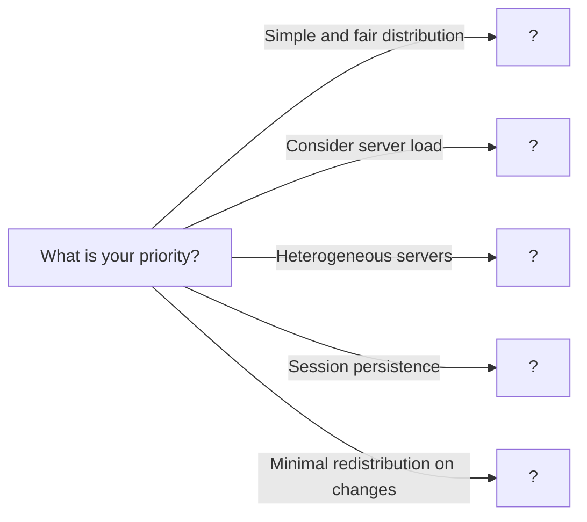

# Load Balancing

> Distributing traffic across multiple servers for availability and performance

---

## Learning Objectives

By the end of this topic you will be able to:

- Implement round robin, least connections, weighted round robin, consistent hashing, and IP hash algorithms from scratch
- Explain why consistent hashing minimises key redistribution when servers are added or removed compared to simple modulo hashing
- Compare the five algorithms across their handling of heterogeneous servers, stateful sessions, and server failures
- Identify thread-safety bugs in load balancer implementations including missing synchronisation and race conditions on the healthy-server list
- Choose the appropriate algorithm given requirements for session persistence, capacity difference, or cache-key locality
- Design virtual-node placement for consistent hashing and explain the trade-off between node count and distribution uniformity

---

## ELI5: Explain Like I'm 5

<div class="learner-section" markdown>

**Your task:** After implementing load balancing algorithms, explain them simply.

**Prompts to guide you:**

1. **What is load balancing in one sentence?**
    - Your answer: <span class="fill-in">Load balancing is a ___ that works by ___</span>

2. **Why do we need load balancing?**
    - Your answer: <span class="fill-in">Without load balancing, a single server would ___, which causes ___</span>

3. **Real-world analogy for round robin:**
    - Example: "Round robin is like a teacher calling on students in order..."
    - Your analogy: <span class="fill-in">Think about how a checkout manager would assign customers to available cashiers one at a time — what rule would make it fair?</span>

4. **Real-world analogy for least connections:**
    - Example: "Least connections is like a bank choosing the shortest queue..."
    - Your analogy: <span class="fill-in">Think about how a supermarket manager watching multiple checkout lines would decide where to direct the next customer in line...</span>

5. **Why is consistent hashing useful?**
    - Your answer: <span class="fill-in">Consistent hashing is preferred when ___ because it avoids the cost of ___</span>

6. **What problem does IP hash solve that round robin can't?**
    - Your answer: <span class="fill-in">IP hash ensures ___ by ___, which round robin cannot guarantee because ___</span>

</div>

---

## Quick Quiz (Do BEFORE implementing)

!!! tip "How to use this section"
    Complete your predictions now, before reading further. You will revisit and verify each answer after running the benchmark (or completing the implementation).

<div class="learner-section" markdown>

**Your task:** Test your load balancing intuition. Answer these, then verify after implementation.

### Algorithm Understanding Predictions

1. **Round Robin with 3 servers, sending 10 requests:**
    - Distribution: <span class="fill-in">[How many per server?]</span>
    - Server sequence: <span class="fill-in">[S1, S2, S3, S1, ...]</span>
    - Verified after implementation: <span class="fill-in">[Actual]</span>

2. **Least Connections: 3 servers with [5, 2, 8] connections:**
    - Next request goes to: <span class="fill-in">[Which server?]</span>
    - After that request, connections: <span class="fill-in">[New counts?]</span>
    - Verified: <span class="fill-in">[Fill in]</span>

3. **Consistent Hashing: 3 servers, adding 1 more:**
    - With 3 servers, keys redistributed: <span class="fill-in">[Your guess: ~33%? ~25%? ~10%?]</span>
    - With simple hash (key % servers), keys redistributed: <span class="fill-in">[Your guess: ~66%? ~75%?]</span>
    - Verified: <span class="fill-in">[Actual]</span>

### Scenario Predictions

**Scenario 1:** 5 identical web servers serving a stateless application

- **Best algorithm:** <span class="fill-in">[Round Robin/Least Connections/Consistent Hash?]</span>
- **Why:** <span class="fill-in">[Your reasoning]</span>

**Scenario 2:** Users have shopping carts stored in server memory

- **Problem with round robin:** <span class="fill-in">[What happens to cart?]</span>
- **Best algorithm:** <span class="fill-in">[Which preserves session?]</span>
- **Why:** <span class="fill-in">[Your reasoning]</span>

**Scenario 3:** Cache cluster with 20 nodes, frequent node additions

- **Problem with simple hash:** <span class="fill-in">[% of cache misses when adding node?]</span>
- **Best algorithm:** <span class="fill-in">[Which minimizes redistribution?]</span>

### Trade-off Quiz

**Question:** When would Least Connections be WORSE than Round Robin?

- Your answer: <span class="fill-in">[Fill in before implementation]</span>
- Verified answer: <span class="fill-in">[Fill in after learning]</span>

**Question:** What's the MAIN risk of IP Hash?

- [ ] Uneven distribution
- [ ] No session persistence
- [ ] Higher overhead
- [ ] Doesn't work with proxies

Verify after implementation: <span class="fill-in">[Which one(s) and why?]</span>

</div>

---

## Case Studies: Load Balancing in the Wild

### Netflix: Consistent Hashing for CDN Content Routing

- **Pattern:** Consistent hashing for routing video content requests.
- **How it works:** Netflix's CDN must serve video chunks to millions of concurrent viewers. Each video chunk is
  identified by a key. Using consistent hashing, a request for a specific chunk is always routed to the same CDN
  server, maximizing cache hits. When a server is added or removed (e.g., during scaling or a failure), consistent
  hashing ensures that only a small fraction of keys (~1/N) need to be remapped, dramatically reducing cache misses
  compared to a naive `key % N` approach.
- **Key Takeaway:** For caching systems where cache-hit rate is critical, consistent hashing is the standard choice.
  The virtual node technique further smooths the distribution across physical servers.

### AWS Elastic Load Balancer: Least Outstanding Requests

- **Pattern:** A variant of least connections called Least Outstanding Requests.
- **How it works:** AWS ELB's Application Load Balancer uses a "least outstanding requests" algorithm by default. This
  is similar to least connections but counts in-flight requests rather than total connections, making it more accurate
  for HTTP/2 connections that multiplex many requests. Each target's request count is tracked, and new requests are
  sent to the target with the fewest outstanding requests. This naturally handles heterogeneous workloads where some
  requests take much longer than others.
- **Key Takeaway:** For modern HTTP workloads with variable request duration, least-connections-style algorithms
  significantly outperform round robin. They are especially powerful when some requests are 10x or 100x slower than
  the average, as they prevent slow servers from accumulating a backlog.

### Memcached / Redis Clusters: Client-Side Consistent Hashing

- **Pattern:** Client-side consistent hashing for cache key distribution.
- **How it works:** In a Memcached or Redis cluster, clients (not a central proxy) implement consistent hashing to
  decide which server to contact for a given cache key. The client library maintains the hash ring in memory and
  performs the lookup locally, eliminating the central load balancer as a bottleneck or single point of failure.
  Libraries like Jedis (Java), ioredis (Node.js), and pylibmc (Python) implement this transparently.
- **Key Takeaway:** For high-throughput caching systems, client-side load balancing eliminates the latency and
  availability risk of a centralized load balancer. The trade-off is increased client complexity and the need to
  propagate cluster topology changes to all clients.

---

## Core Implementation

### Part 1: Round Robin Load Balancer

**Your task:** Implement round robin algorithm for equal traffic distribution.

```java
/**
 * Round Robin: Rotate through servers in order
 *
 * Key principles:
 * - Circular iteration through servers
 * - Simple and fair distribution
 * - Doesn't consider server load
 * - Works well for similar servers
 */

public class RoundRobinLoadBalancer {

    private final List<Server> servers;
    private int currentIndex;

    /**
     * Initialize round robin load balancer
     *
     * @param servers List of backend servers
     *
     * TODO: Initialize balancer
     * - Store server list
     * - Start index at 0
     */
    public RoundRobinLoadBalancer(List<Server> servers) {
        // TODO: Store servers (defensive copy)

        // TODO: Initialize currentIndex to 0

        this.servers = null; // Replace
        this.currentIndex = 0;
    }

    /**
     * Select next server using round robin
     *
     * @return Next server in rotation
     *
     * TODO: Implement round robin selection
     * 1. Get server at current index
     * 2. Increment index (with wraparound)
     * 3. Return server
     *
     * Hint: Use modulo for wraparound
     */
    public synchronized Server getNextServer() {
        // TODO: Check if servers list is empty

        // TODO: Get server at currentIndex

        // TODO: Increment currentIndex with wraparound
        // currentIndex = (currentIndex + 1) % servers.size()

        // TODO: Return selected server

        return null; // Replace
    }

    /**
     * Add server to pool
     */
    public synchronized void addServer(Server server) {
        // TODO: Add server to list
    }

    /**
     * Remove server from pool
     */
    public synchronized void removeServer(Server server) {
        // TODO: Remove server from list
        // TODO: Adjust currentIndex if needed
    }

    static class Server {
        String id;
        String host;
        int port;

        public Server(String id, String host, int port) {
            this.id = id;
            this.host = host;
            this.port = port;
        }

        @Override
        public String toString() {
            return id + " (" + host + ":" + port + ")";
        }
    }
}
```

!!! warning "Debugging Challenge — Missing Wraparound in Round Robin"

    The implementation below works for the first N requests, then throws an exception. Find the bug.

    ```java
    public synchronized Server getNextServer_Buggy() {
        if (servers.isEmpty()) {
            throw new IllegalStateException("No servers available");
        }

        Server server = servers.get(currentIndex);
        currentIndex = currentIndex + 1;
        return server;
    }
    ```

    Trace what happens on request N+1 when `servers.size() == 3` and `currentIndex == 3`.

    ??? success "Answer"

        **Bug:** `currentIndex` increments without wrapping around. After the third request, `currentIndex = 3`, and `servers.get(3)` throws `IndexOutOfBoundsException` on a list of size 3.

        **Fix:**
        ```java
        currentIndex = (currentIndex + 1) % servers.size();
        ```

        The modulo ensures the index wraps to 0 after reaching the end, creating circular iteration. This is one of the most common bugs in round-robin implementations.

---

### Part 2: Least Connections Load Balancer

**Your task:** Implement least connections algorithm.

```java
/**
 * Least Connections: Route to server with fewest active connections
 *
 * Key principles:
 * - Track active connections per server
 * - Select server with minimum load
 * - Better for varying request durations
 * - More overhead than round robin
 */

public class LeastConnectionsLoadBalancer {

    private final List<ServerWithStats> servers;

    /**
     * Initialize least connections load balancer
     *
     * @param servers List of backend servers
     *
     * TODO: Initialize balancer
     * - Create ServerWithStats for each server
     * - Initialize connection counters to 0
     */
    public LeastConnectionsLoadBalancer(List<RoundRobinLoadBalancer.Server> servers) {
        // TODO: Wrap each server with connection counter

        this.servers = null; // Replace
    }

    /**
     * Select server with fewest connections
     *
     * @return Server with minimum active connections
     *
     * TODO: Implement least connections selection
     * 1. Find server with minimum connections
     * 2. Increment its connection count
     * 3. Return server
     *
     * Hint: Break ties by choosing first found
     */
    public synchronized RoundRobinLoadBalancer.Server getNextServer() {
        // TODO: Check if servers list is empty

        // TODO: Find server with minimum connections

        // TODO: Increment connection count for selected server

        // TODO: Return selected server

        return null; // Replace
    }

    /**
     * Release connection when request completes
     *
     * @param server Server to release connection from
     *
     * TODO: Decrement connection count
     * - Find server in list
     * - Decrement activeConnections
     * - Ensure doesn't go below 0
     */
    public synchronized void releaseConnection(RoundRobinLoadBalancer.Server server) {
        // TODO: Find ServerWithStats for given server

        // TODO: Decrement activeConnections (min 0)
    }

    /**
     * Get server statistics
     */
    public synchronized Map<String, Integer> getStats() {
        Map<String, Integer> stats = new HashMap<>();
        for (ServerWithStats s : servers) {
            stats.put(s.server.id, s.activeConnections);
        }
        return stats;
    }

    static class ServerWithStats {
        RoundRobinLoadBalancer.Server server;
        int activeConnections;

        public ServerWithStats(RoundRobinLoadBalancer.Server server) {
            this.server = server;
            this.activeConnections = 0;
        }
    }
}
```

### Part 3: Weighted Round Robin

**Your task:** Implement weighted round robin for heterogeneous servers.

```java
/**
 * Weighted Round Robin: Distribute based on server capacity
 *
 * Key principles:
 * - Servers have different weights (capacity)
 * - Higher weight = more requests
 * - Smooth distribution using GCD algorithm
 * - Good for heterogeneous servers
 */

public class WeightedRoundRobinLoadBalancer {

    private final List<WeightedServer> servers;
    private int currentIndex;
    private int currentWeight;
    private int maxWeight;
    private int gcd; // Greatest common divisor of weights

    /**
     * Initialize weighted round robin
     *
     * @param servers List of servers with weights
     *
     * TODO: Initialize balancer
     * - Store servers
     * - Calculate max weight and GCD
     * - Initialize currentWeight to max
     */
    public WeightedRoundRobinLoadBalancer(List<WeightedServer> servers) {
        // TODO: Store servers

        // TODO: Calculate maxWeight (max of all weights)

        // TODO: Calculate GCD of all weights

        // TODO: Initialize currentIndex to -1

        // TODO: Initialize currentWeight to 0

        this.servers = null; // Replace
    }

    /**
     * Select next server using weighted round robin
     *
     * @return Next server based on weight
     *
     * TODO: Implement weighted selection
     * 1. Loop until finding server with weight >= currentWeight
     * 2. When loop completes, decrease currentWeight by GCD
     * 3. Return selected server
     *
     * Hint: This ensures smooth distribution
     */
    public synchronized RoundRobinLoadBalancer.Server getNextServer() {
        // TODO: Loop through servers
        while (true) {
            // TODO: Move to next index (wraparound)
            // currentIndex = (currentIndex + 1) % servers.size()

            // TODO: Implement iteration/conditional logic

            // TODO: Implement iteration/conditional logic

        }
    }

    /**
     * Calculate GCD of all weights
     */
    private int calculateGCD() {
        // TODO: Calculate GCD of all server weights
        // Hint: Use Euclidean algorithm
        return 1; // Replace
    }

    /**
     * Calculate GCD of two numbers
     */
    private int gcd(int a, int b) {
        // TODO: Implement Euclidean algorithm
        return 0; // Replace
    }

    static class WeightedServer {
        RoundRobinLoadBalancer.Server server;
        int weight; // Capacity/power of server

        public WeightedServer(RoundRobinLoadBalancer.Server server, int weight) {
            this.server = server;
            this.weight = weight;
        }
    }
}
```

### Part 4: Consistent Hashing

**Your task:** Implement consistent hashing for distributed caching.

!!! tip "Why virtual nodes matter"
    Without virtual nodes, each physical server occupies only one point on the ring. With an unlucky placement, one server could end up responsible for 80% of the key space. Virtual nodes (placing each server at N positions) smooth the distribution: with 100–150 virtual nodes per server, distribution error typically falls below 5%.

```java
/**
 * Consistent Hashing: Map requests to servers using hash ring
 *
 * Key principles:
 * - Servers placed on virtual ring
 * - Request hashed to position on ring
 * - Clockwise walk to find server
 * - Minimal redistribution when servers change
 */

public class ConsistentHashingLoadBalancer {

    private final TreeMap<Integer, RoundRobinLoadBalancer.Server> ring;
    private final int virtualNodesPerServer;

    /**
     * Initialize consistent hashing
     *
     * @param servers List of servers
     * @param virtualNodesPerServer Number of virtual nodes per physical server
     *
     * TODO: Initialize hash ring
     * - Create TreeMap for ring
     * - Add each server with virtual nodes
     */
    public ConsistentHashingLoadBalancer(List<RoundRobinLoadBalancer.Server> servers, int virtualNodesPerServer) {
        // TODO: Initialize TreeMap

        // TODO: Store virtualNodesPerServer

        // TODO: Add all servers to ring

        this.ring = null; // Replace
        this.virtualNodesPerServer = 0;
    }

    /**
     * Get server for a given key
     *
     * @param key Request key (e.g., user ID, session ID)
     * @return Server to handle this key
     *
     * TODO: Implement consistent hashing lookup
     * 1. Hash the key to integer
     * 2. Find next server clockwise on ring
     * 3. If no server found, wrap to first server
     */
    public RoundRobinLoadBalancer.Server getServer(String key) {
        // TODO: Check if ring is empty

        // TODO: Hash key to integer position

        // TODO: Find next entry on ring (ceilingEntry)

        // TODO: Return server

        return null; // Replace
    }

    /**
     * Add server to hash ring
     *
     * TODO: Add server with virtual nodes
     * - For each virtual node:
     *   - Hash "serverId-virtualNodeIndex"
     *   - Place on ring
     */
    public void addServer(RoundRobinLoadBalancer.Server server) {
        // TODO: Add virtualNodesPerServer copies of this server
    }

    /**
     * Remove server from hash ring
     *
     * TODO: Remove all virtual nodes for this server
     */
    public void removeServer(RoundRobinLoadBalancer.Server server) {
        // TODO: Remove all virtual nodes
    }

    /**
     * Hash function
     *
     * TODO: Implement simple hash function
     * - Use string hashCode()
     * - Ensure positive value
     */
    private int hash(String key) {
        // TODO: Hash key to integer
        // Hint: key.hashCode() & 0x7FFFFFFF (remove sign bit)
        return 0; // Replace
    }

    /**
     * Get ring statistics
     */
    public int getRingSize() {
        return ring.size();
    }
}
```

### Part 5: IP Hash Load Balancer

**Your task:** Implement IP hash for session persistence.

```java
/**
 * IP Hash: Route client to same server based on IP
 *
 * Key principles:
 * - Hash client IP to select server
 * - Ensures session persistence
 * - Client always hits same server
 * - Issues when server pool changes
 */

public class IPHashLoadBalancer {

    private final List<RoundRobinLoadBalancer.Server> servers;

    /**
     * Initialize IP hash load balancer
     *
     * @param servers List of backend servers
     */
    public IPHashLoadBalancer(List<RoundRobinLoadBalancer.Server> servers) {
        // TODO: Store servers
        this.servers = null; // Replace
    }

    /**
     * Select server based on client IP
     *
     * @param clientIP Client IP address
     * @return Server for this client
     *
     * TODO: Implement IP hash selection
     * 1. Hash the client IP
     * 2. Modulo by server count
     * 3. Return server at that index
     */
    public synchronized RoundRobinLoadBalancer.Server getServer(String clientIP) {
        // TODO: Check if servers list is empty

        // TODO: Hash clientIP to integer

        // TODO: Get index using modulo
        // index = abs(hash) % servers.size()

        // TODO: Return server at index

        return null; // Replace
    }

    /**
     * Hash IP address
     */
    private int hash(String ip) {
        // TODO: Hash IP string
        // Hint: ip.hashCode()
        return 0; // Replace
    }

    /**
     * Add server (warning: disrupts session persistence)
     */
    public synchronized void addServer(RoundRobinLoadBalancer.Server server) {
        // TODO: Add server
        // Note: This will change hash distribution
    }

    /**
     * Remove server (warning: disrupts session persistence)
     */
    public synchronized void removeServer(RoundRobinLoadBalancer.Server server) {
        // TODO: Remove server
        // Note: This will change hash distribution
    }
}
```

---

## Client Code

```java
import java.util.*;

public class LoadBalancingClient {

    public static void main(String[] args) {
        testRoundRobin();
        System.out.println("\n" + "=".repeat(50) + "\n");
        testLeastConnections();
        System.out.println("\n" + "=".repeat(50) + "\n");
        testWeightedRoundRobin();
        System.out.println("\n" + "=".repeat(50) + "\n");
        testConsistentHashing();
        System.out.println("\n" + "=".repeat(50) + "\n");
        testIPHash();
    }

    static void testRoundRobin() {
        System.out.println("=== Round Robin Test ===\n");

        // Create servers
        List<RoundRobinLoadBalancer.Server> servers = Arrays.asList(
            new RoundRobinLoadBalancer.Server("S1", "10.0.0.1", 8080),
            new RoundRobinLoadBalancer.Server("S2", "10.0.0.2", 8080),
            new RoundRobinLoadBalancer.Server("S3", "10.0.0.3", 8080)
        );

        RoundRobinLoadBalancer lb = new RoundRobinLoadBalancer(servers);

        // Test: Send 10 requests
        System.out.println("Sending 10 requests:");
        for (int i = 1; i <= 10; i++) {
            RoundRobinLoadBalancer.Server server = lb.getNextServer();
            System.out.println("Request " + i + " -> " + server);
        }
    }

    static void testLeastConnections() {
        System.out.println("=== Least Connections Test ===\n");

        List<RoundRobinLoadBalancer.Server> servers = Arrays.asList(
            new RoundRobinLoadBalancer.Server("S1", "10.0.0.1", 8080),
            new RoundRobinLoadBalancer.Server("S2", "10.0.0.2", 8080),
            new RoundRobinLoadBalancer.Server("S3", "10.0.0.3", 8080)
        );

        LeastConnectionsLoadBalancer lb = new LeastConnectionsLoadBalancer(servers);

        // Test: Send requests and simulate completion
        System.out.println("Request 1:");
        RoundRobinLoadBalancer.Server s1 = lb.getNextServer();
        System.out.println("Routed to: " + s1);
        System.out.println("Stats: " + lb.getStats());

        System.out.println("\nRequest 2:");
        RoundRobinLoadBalancer.Server s2 = lb.getNextServer();
        System.out.println("Routed to: " + s2);
        System.out.println("Stats: " + lb.getStats());

        System.out.println("\nRequest 1 completes:");
        lb.releaseConnection(s1);
        System.out.println("Stats: " + lb.getStats());

        System.out.println("\nRequest 3:");
        RoundRobinLoadBalancer.Server s3 = lb.getNextServer();
        System.out.println("Routed to: " + s3);
        System.out.println("Stats: " + lb.getStats());
    }

    static void testWeightedRoundRobin() {
        System.out.println("=== Weighted Round Robin Test ===\n");

        // Create servers with different capacities
        List<WeightedRoundRobinLoadBalancer.WeightedServer> servers = Arrays.asList(
            new WeightedRoundRobinLoadBalancer.WeightedServer(
                new RoundRobinLoadBalancer.Server("S1-Small", "10.0.0.1", 8080), 1),
            new WeightedRoundRobinLoadBalancer.WeightedServer(
                new RoundRobinLoadBalancer.Server("S2-Medium", "10.0.0.2", 8080), 2),
            new WeightedRoundRobinLoadBalancer.WeightedServer(
                new RoundRobinLoadBalancer.Server("S3-Large", "10.0.0.3", 8080), 3)
        );

        WeightedRoundRobinLoadBalancer lb = new WeightedRoundRobinLoadBalancer(servers);

        // Test: Send 12 requests (should distribute 2:4:6)
        System.out.println("Sending 12 requests (expected: 2:4:6 distribution):");
        Map<String, Integer> distribution = new HashMap<>();
        for (int i = 1; i <= 12; i++) {
            RoundRobinLoadBalancer.Server server = lb.getNextServer();
            distribution.merge(server.id, 1, Integer::sum);
            System.out.println("Request " + i + " -> " + server.id);
        }
        System.out.println("\nDistribution: " + distribution);
    }

    static void testConsistentHashing() {
        System.out.println("=== Consistent Hashing Test ===\n");

        List<RoundRobinLoadBalancer.Server> servers = Arrays.asList(
            new RoundRobinLoadBalancer.Server("S1", "10.0.0.1", 8080),
            new RoundRobinLoadBalancer.Server("S2", "10.0.0.2", 8080),
            new RoundRobinLoadBalancer.Server("S3", "10.0.0.3", 8080)
        );

        ConsistentHashingLoadBalancer lb = new ConsistentHashingLoadBalancer(servers, 3);

        // Test: Same key always goes to same server
        String[] keys = {"user123", "user456", "user789", "user123", "user456"};
        System.out.println("Routing requests by user ID:");
        for (String key : keys) {
            RoundRobinLoadBalancer.Server server = lb.getServer(key);
            System.out.println(key + " -> " + server.id);
        }

        // Test: Add server and see minimal redistribution
        System.out.println("\nAdding new server S4:");
        lb.addServer(new RoundRobinLoadBalancer.Server("S4", "10.0.0.4", 8080));
        for (String key : keys) {
            RoundRobinLoadBalancer.Server server = lb.getServer(key);
            System.out.println(key + " -> " + server.id);
        }
    }

    static void testIPHash() {
        System.out.println("=== IP Hash Test ===\n");

        List<RoundRobinLoadBalancer.Server> servers = Arrays.asList(
            new RoundRobinLoadBalancer.Server("S1", "10.0.0.1", 8080),
            new RoundRobinLoadBalancer.Server("S2", "10.0.0.2", 8080),
            new RoundRobinLoadBalancer.Server("S3", "10.0.0.3", 8080)
        );

        IPHashLoadBalancer lb = new IPHashLoadBalancer(servers);

        // Test: Same IP always goes to same server
        String[] clientIPs = {"192.168.1.100", "192.168.1.101", "192.168.1.102",
                             "192.168.1.100", "192.168.1.101"};
        System.out.println("Routing by client IP (session persistence):");
        for (String ip : clientIPs) {
            RoundRobinLoadBalancer.Server server = lb.getServer(ip);
            System.out.println(ip + " -> " + server.id);
        }
    }
}
```

!!! info "Loop back"
    Return to the Quick Quiz now and fill in your verified answers.

---

## Layer 4 vs Layer 7

The five algorithms above answer *how* requests are distributed. A separate question is *where* in the network stack the load balancer sits.

| | L4 — Transport layer | L7 — Application layer |
|---|---|---|
| **Sees** | IP address, port, protocol | HTTP headers, URL path, cookies |
| **SSL termination** | No — TLS passes through opaque | Yes — LB decrypts, inspects, re-encrypts |
| **Routing basis** | IP + port only | URL path, hostname, header values, cookies |
| **Overhead** | Low — no protocol parsing | Higher — full HTTP parsing per request |
| **Typical use** | Raw TCP, non-HTTP protocols | HTTP/HTTPS, microservices, API gateways |

**Choose L4 when** you need minimum overhead, are balancing non-HTTP protocols (game servers, MQTT, raw gRPC), or don't need to inspect request content.

**Choose L7 when** you need URL-based routing (e.g., `/api/*` → service-A, `/static/*` → CDN), SSL termination at the load balancer, cookie-based sticky sessions, or canary/A-B deployments.

!!! warning "L7 doesn't replace algorithm choice — it stacks on top of it"
    Choosing L7 determines what information the load balancer can use. You still need to choose *which algorithm* routes those requests. An L7 load balancer commonly runs round robin or least connections across the backend pool, while using URL path or headers to decide *which pool* to send to at all.

---

## Common Misconceptions

!!! warning "Least connections always outperforms round robin"
    Least connections is better when request duration varies widely (some requests take 10ms, others 2 seconds). For truly uniform request durations, round robin is equivalent in outcome and has lower overhead — it needs no per-server connection counter updates on every request start and end. Use least connections when request duration variance is high; use round robin when servers are homogeneous and requests are similar in cost.

!!! warning "Consistent hashing eliminates all redistribution when servers change"
    Consistent hashing minimises redistribution: adding one server to a ring of N causes only ~1/(N+1) of keys to move, compared to ~N/(N+1) with simple modulo hashing. It does not eliminate redistribution. If you need truly zero redistribution for a specific key, you need a manually managed key-to-server mapping table, which comes with its own operational cost.

!!! warning "IP hash provides reliable session persistence at scale"
    IP hash breaks when clients are behind a NAT gateway (many users share one IP) or when users are behind a proxy (IP changes between requests). It also breaks session persistence whenever the server list changes, since all hashes shift. For robust session persistence, prefer consistent hashing with the session ID as the key, or externalise session state to a shared store (Redis) so any server can serve the session.

---

## Decision Framework

<div class="learner-section" markdown>

**Questions to answer after implementation:**

### 1. Algorithm Selection

**When to use Round Robin?**

- Your scenario: <span class="fill-in">[Fill in]</span>
- Key factors: <span class="fill-in">[Fill in]</span>

**When to use Least Connections?**

- Your scenario: <span class="fill-in">[Fill in]</span>
- Key factors: <span class="fill-in">[Fill in]</span>

**When to use Weighted Round Robin?**

- Your scenario: <span class="fill-in">[Fill in]</span>
- Key factors: <span class="fill-in">[Fill in]</span>

**When to use Consistent Hashing?**

- Your scenario: <span class="fill-in">[Fill in]</span>
- Key factors: <span class="fill-in">[Fill in]</span>

**When to use IP Hash?**

- Your scenario: <span class="fill-in">[Fill in]</span>
- Key factors: <span class="fill-in">[Fill in]</span>

### 2. Trade-offs

**Round Robin:**

- Pros: <span class="fill-in">[Fill in after understanding]</span>
- Cons: <span class="fill-in">[Fill in after understanding]</span>

**Least Connections:**

- Pros: <span class="fill-in">[Fill in after understanding]</span>
- Cons: <span class="fill-in">[Fill in after understanding]</span>

**Consistent Hashing:**

- Pros: <span class="fill-in">[Fill in after understanding]</span>
- Cons: <span class="fill-in">[Fill in after understanding]</span>

**IP Hash:**

- Pros: <span class="fill-in">[Fill in after understanding]</span>
- Cons: <span class="fill-in">[Fill in after understanding]</span>

### 3. Your Decision Tree

Build your decision tree after practicing:

```mermaid
flowchart LR
    Start["What is your priority?"]

    N1["?"]
    Start -->|"Simple and fair distribution"| N1
    N2["?"]
    Start -->|"Consider server load"| N2
    N3["?"]
    Start -->|"Heterogeneous servers"| N3
    N4["?"]
    Start -->|"Session persistence"| N4
    N5["?"]
    Start -->|"Minimal redistribution on changes"| N5
```

### 4. Layer selection

**Use L4 when:**

- Your scenario: <span class="fill-in">[Fill in]</span>
- Key signals: <span class="fill-in">[Fill in]</span>

**Use L7 when:**

- Your scenario: <span class="fill-in">[Fill in]</span>
- Key signals: <span class="fill-in">[Fill in]</span>

</div>

---

## Practice

<div class="learner-section" markdown>

### Scenario 1: Load balance web application

**Requirements:**

- 5 web servers of equal capacity
- Stateless application
- Want even distribution
- Simple to understand

**Your design:**

- Which algorithm would you choose? <span class="fill-in">[Fill in]</span>
- Why? <span class="fill-in">[Fill in]</span>
- How to handle server failures? <span class="fill-in">[Fill in]</span>
- Health check strategy? <span class="fill-in">[Fill in]</span>

**Failure modes:**

- What happens if one of the 5 web servers becomes unavailable mid-rotation? <span class="fill-in">[Fill in]</span>
- How does your design behave when all 5 servers are overloaded simultaneously and new requests arrive? <span class="fill-in">[Fill in]</span>

### Scenario 2: Load balance with session state

**Requirements:**

- Users have shopping carts
- Cart stored in server memory
- 10 application servers
- Need session persistence

**Your design:**

- Which algorithm would you choose? <span class="fill-in">[Fill in]</span>
- Why? <span class="fill-in">[Fill in]</span>
- How to handle server additions? <span class="fill-in">[Fill in]</span>
- Alternative to sticky sessions? <span class="fill-in">[Fill in]</span>

**Failure modes:**

- What happens if the server holding a user's in-memory cart goes down? <span class="fill-in">[Fill in]</span>
- How does your design behave when a server is removed from the pool while users have active sessions mapped to it? <span class="fill-in">[Fill in]</span>

### Scenario 3: Distributed cache cluster

**Requirements:**

- Cache cluster with 20 nodes
- Frequently add/remove nodes
- Want to minimize cache misses
- Keys should stay on same node

**Your design:**

- Which algorithm would you choose? <span class="fill-in">[Fill in]</span>
- Why? <span class="fill-in">[Fill in]</span>
- How many virtual nodes? <span class="fill-in">[Fill in]</span>
- Replication strategy? <span class="fill-in">[Fill in]</span>

**Failure modes:**

- What happens if a cache node is removed suddenly and the hash ring is not updated immediately? <span class="fill-in">[Fill in]</span>
- How does your design behave when a hot key causes a single node to receive a disproportionate share of requests? <span class="fill-in">[Fill in]</span>

</div>

---

## Test Your Understanding

Answer these without referring to your notes or implementation.

1. You have a cluster of 10 cache servers using simple modulo hashing (`key % 10`). You add one more server, making it 11. Approximately what percentage of cached keys will need to move? Now explain how consistent hashing reduces this. Show the math for both.

    ??? success "Rubric"
        A complete answer addresses: (1) with modulo hashing, ~10/11 ≈ 91% of keys map to a different server when N changes from 10 to 11, (2) with consistent hashing, only ~1/11 ≈ 9% of keys move because only the keys between the new node and its predecessor on the ring are affected, (3) the derivation: modulo redistributes nearly everything; consistent hashing bounds redistribution to the fraction of the ring the new node occupies.

2. Your least-connections load balancer is supposed to be thread-safe because every method is `synchronized`. A colleague points out a race condition in `releaseConnection`. Describe a scenario with two threads that produces an incorrect connection count despite `synchronized` methods.

    ??? success "Rubric"
        A complete answer addresses: (1) the race window: two threads each call `releaseConnection` for the same server near-simultaneously — each reads count=1, each decrements to 0, result is 0 not -1 but the decrement may produce a negative value if not guarded, (2) `synchronized` prevents interleaved execution within a single method call but does not prevent a thread from reading a stale value if the method re-reads the field after another thread's decrement has been committed, (3) the correct fix is to guard against going below zero and confirm the atomicity of read-modify-write within the synchronized block.

3. A user complains their shopping cart disappears randomly. Your load balancer uses round robin. Explain precisely why this happens and describe two solutions — one that keeps round robin and one that does not.

    ??? success "Rubric"
        A complete answer addresses: (1) round robin sends successive requests from the same user to different servers; in-memory cart is only on the server that first received the add-to-cart request, (2) solution keeping round robin: externalise session state to a shared store (Redis/Memcached) so any server can read the cart regardless of which one is chosen, (3) solution replacing round robin: use IP hash or consistent hashing by session ID to ensure the same user always routes to the same server (with the caveats about what happens on server changes).

4. You are configuring consistent hashing for a cache cluster. The documentation says to use 150 virtual nodes per server. Your manager asks why not just 1, since that's simpler. Give a concrete explanation with an example showing what goes wrong with 1 virtual node and why 150 fixes it.

    ??? success "Rubric"
        A complete answer addresses: (1) with 1 virtual node per server, the physical placement on the ring is random; if three servers happen to land at hash positions 10, 12, and 900 on a 1000-point ring, the third server owns 898/1000 of the key space — extremely uneven, (2) with 150 virtual nodes per server, each physical server occupies 150 positions scattered across the ring, averaging out placement variance so each server ends up owning close to 1/N of the key space, (3) the trade-off is memory for the ring data structure, which is negligible in practice.

5. A colleague says "IP hash is strictly better than round robin for any application that has user sessions, because it keeps users on the same server." What is wrong with this claim? Describe at least two real-world scenarios where IP hash would give worse results than round robin plus externalised sessions.

    ??? success "Rubric"
        A complete answer addresses: (1) NAT: many users behind a corporate gateway or mobile carrier share one public IP, so all those users hash to the same server — creating a hot server while others sit idle, (2) server pool change: adding or removing a server reshuffles all IP-to-server mappings because modulo arithmetic changes, breaking session persistence for every user simultaneously, (3) IP instability: mobile users or users on DHCP change IPs between requests, so IP hash provides no persistence guarantee for these clients.

6. Your team needs to route `/api/*` requests to a backend service cluster and `/static/*` requests to an object-storage CDN, while also terminating TLS at the load balancer. Should this be an L4 or L7 load balancer? What specifically breaks if you use the other layer instead?

    ??? success "Rubric"
        A complete answer addresses: (1) L7 is required because URL path inspection (`/api/*` vs `/static/*`) requires parsing the HTTP request, which is only available at the application layer, (2) TLS termination is also an L7 concern — L4 passes opaque TLS bytes through without decrypting, so the load balancer cannot read the URL path at all, (3) an L4 balancer sees only IP address and port; it cannot distinguish request types or terminate TLS, making both URL-based routing and SSL offloading impossible.

---

## Connected Topics

!!! info "Where this topic connects"

    - **05. Caching Patterns** — consistent hashing was developed for distributed caching; load balancing reuses the same algorithm to minimise key redistribution when servers change → [05. Caching Patterns](05-caching-patterns.md)
    - **11. Database Scaling** — read replicas use load balancing to distribute query traffic; round robin and least-connections apply directly to database proxy routing → [11. Database Scaling](11-database-scaling.md)
    - **03. Networking Fundamentals** — the L4/L7 distinction (transport vs application layer) determines what information the load balancer can use for routing decisions → [03. Networking Fundamentals](03-networking-fundamentals.md)
