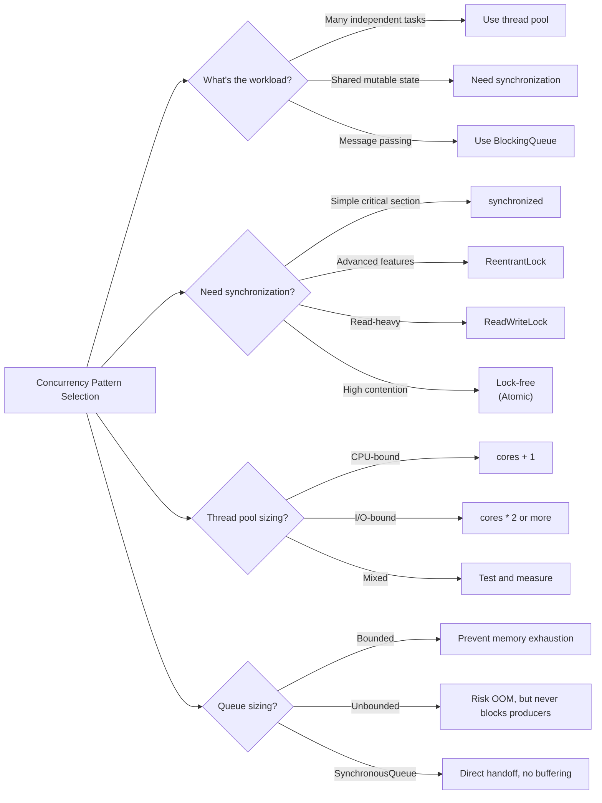

# Concurrency Patterns

> Locks, thread pools, synchronization, and async patterns - From threads to coroutines to reactive streams

---

## Learning Objectives

By the end of this topic you will be able to:

- Implement ReentrantLock, ReadWriteLock, and lock-ordering in the bank-transfer pattern to prevent deadlock
- Implement the producer-consumer pattern using a bounded BlockingQueue and explain what happens when the queue is full or empty
- Compare synchronized, lock-free (CAS/Atomic), and ReadWriteLock approaches for counter and cache workloads
- Identify concurrency bugs including race conditions, deadlocks, visibility issues, and thread pool starvation
- Choose the correct concurrency tool (locks, lock-free, thread pools, blocking queues) for a given workload

---

## ELI5: Explain Like I'm 5

<div class="learner-section" markdown>

**Your task:** After implementing concurrency patterns, explain them simply.

**Prompts to guide you:**

1. **What is a lock in one sentence?**
    - Your answer: <span class="fill-in">A lock is a ___ that works by ___</span>

2. **Why do we need locks in concurrent programs?**
    - Your answer: <span class="fill-in">Without locks, two threads can ___ the same variable simultaneously, causing ___ because the operation is not ___</span>

3. **Real-world analogy for ReentrantLock:**
    - Example: "A ReentrantLock is like a bathroom key that you can use multiple times..."
    - Your analogy: <span class="fill-in">Think about how a single hotel room key prevents two guests from entering simultaneously — and how the same guest can re-enter their own room without returning the key first...</span>

4. **What is a thread pool in one sentence?**
    - Your answer: <span class="fill-in">A thread pool is a ___ that avoids the cost of ___ by ___</span>

5. **Why use a thread pool instead of creating threads directly?**
    - Your answer: <span class="fill-in">Creating a new thread for every task is expensive because ___; a pool is preferred when ___ because it ___</span>

6. **Real-world analogy for BlockingQueue:**
    - Example: "A BlockingQueue is like a conveyor belt in a factory..."
    - Your analogy: <span class="fill-in">Think about a ticket window where customers wait when it's full and the clerk waits when it's empty — the queue naturally keeps producer and consumer in sync...</span>

</div>

---

## Quick Quiz (Do BEFORE implementing)

!!! tip "How to use this section"
    Complete your predictions now, before reading further. You will revisit and verify each answer after running the benchmark (or completing the implementation).

<div class="learner-section" markdown>

**Your task:** Test your intuition about concurrency without looking at code. Answer these, then verify after
implementation.

### Complexity Predictions

1. **Synchronized vs Lock-Free counter with 10 threads, 1M increments each:**
    - Synchronized time: <span class="fill-in">[Your guess: faster/slower than lock-free?]</span>
    - Lock-free time: <span class="fill-in">[Your guess]</span>
    - Verified after learning: <span class="fill-in">[Actual results]</span>

2. **Producer-Consumer with bounded queue (size 10), 1 producer, 1 consumer:**
    - What happens when queue is full? <span class="fill-in">[Your guess]</span>
    - What happens when queue is empty? <span class="fill-in">[Your guess]</span>
    - Verified: <span class="fill-in">[Actual behavior]</span>

3. **Thread pool sizing calculation:**
    - For 8 CPU cores, 100ms CPU work, 0ms I/O per task:
    - Optimal pool size: <span class="fill-in">[Your guess: O(?)]</span>
    - For 8 CPU cores, 50ms CPU work, 200ms I/O per task:
    - Optimal pool size: <span class="fill-in">[Your guess: O(?)]</span>
    - Verified: <span class="fill-in">[Actual formula and results]</span>

### Scenario Predictions

**Scenario 1:** Two threads incrementing shared counter without synchronization

```java
int counter = 0;
Thread t1 = new Thread(() -> { for(int i=0; i<1000; i++) counter++; });
Thread t2 = new Thread(() -> { for(int i=0; i<1000; i++) counter++; });
```

- **Expected counter value:** <span class="fill-in">[2000, right?]</span>
- **Actual typical value:** <span class="fill-in">[Will it be 2000? Why or why not?]</span>
- **This bug is called:** <span class="fill-in">[Fill in after learning]</span>

**Scenario 2:** Bank transfer with incorrect locking

```java
// Thread 1: transfer(account1, account2, $100)
// Thread 2: transfer(account2, account1, $50)
// Each thread locks: lock(from), lock(to), then transfers
```

- **Can deadlock occur?** <span class="fill-in">[Yes/No - Why?]</span>
- **How to prevent it?** <span class="fill-in">[Fill in your guess]</span>
- **Verified solution:** <span class="fill-in">[Fill in after implementation]</span>

**Scenario 3:** ConcurrentHashMap vs Hashtable (synchronized)

- **Which is faster for 100 threads reading?** <span class="fill-in">[Your guess]</span>
- **Why?** <span class="fill-in">[Reason]</span>
- **What's the key difference?** <span class="fill-in">[Fill in after learning about lock striping]</span>

### Trade-off Quiz

**Question:** When would synchronized be BETTER than ReentrantLock?

- Your answer: <span class="fill-in">[Fill in before implementation]</span>
- Verified answer: <span class="fill-in">[Fill in after learning]</span>

**Question:** When would lock-free (Atomic) be WORSE than locks?

- Your answer: <span class="fill-in">[Fill in before implementation]</span>
- Verified answer: <span class="fill-in">[Fill in after learning about contention and CAS retries]</span>

**Question:** What's the MAIN risk of unbounded thread pools?

- [ ] Slow performance
- [ ] Deadlocks
- [ ] OutOfMemoryError
- [ ] Race conditions

Verify after implementation: <span class="fill-in">[Which one(s)?]</span>


</div>

---

## Case Studies: Concurrency in the Wild

### Relational Databases: Pessimistic Locking for Consistency

- **Pattern:** Pessimistic Locking (`SELECT ... FOR UPDATE`).
- **How it works:** In a traditional banking application, when a user initiates a money transfer, the database
  transaction can place an exclusive lock on the user's account balance row. The transaction reads the balance, updates
  it, and then releases the lock upon commit. If another transaction tries to access the same account balance row in the
  meantime, it is blocked and forced to wait.
- **Key Takeaway:** For high-contention, mission-critical operations where data integrity is paramount (e.g., financial
  transactions, inventory management), pessimistic locking is a safe and robust strategy. It prevents conflicts from
  happening in the first place, at the cost of reduced concurrency.

### Web Frameworks (Ruby on Rails, Django): Optimistic Locking for High Concurrency

- **Pattern:** Optimistic Concurrency Control (OCC) with a version column.
- **How it works:** Imagine two admins editing the same product in an e-commerce backend. Admin A loads the product
  page (version 42). Admin B loads the same page. Admin A saves her changes; the application updates the product and
  increments its version to 43. When Admin B tries to save his changes, the application sees that he is trying to update
  version 42, but the current version is 43. The update is rejected, and Admin B is shown an error: "This record was
  modified by someone else. Please reload and try again."
- **Key Takeaway:** Optimistic locking is ideal for web applications where conflicts are rare and high concurrency is
  desirable. It "hopes" for the best and only deals with conflicts when they actually occur, avoiding the overhead of
  database locks for the majority of non-conflicting operations.

### PostgreSQL & Oracle: MVCC for Read/Write Isolation

- **Pattern:** Multi-Version Concurrency Control (MVCC).
- **How it works:** When you run a long analytical query (`SELECT AVG(price) FROM products`) in PostgreSQL, you get a
  consistent "snapshot" of the database at the time your query began. If another user updates a product price while your
  query is running, PostgreSQL creates a *new version* of that product row instead of overwriting it. Your long-running
  query continues to see the old version, while new transactions will see the updated version.
- **Key Takeaway:** MVCC is a powerful mechanism that allows readers and writers not to block each other. This is a
  massive performance benefit for mixed workloads, where long-running reports or analytics can execute alongside fast
  OLTP transactions without contention.

---

## Core Implementation

### Pattern 1: Lock-Based Synchronization

**Concept:** Using explicit locks to control access to shared resources and prevent race conditions.

**Use case:** Thread-safe counters, banking transactions, resource pooling.

```java
import java.util.*;
import java.util.concurrent.locks.*;

/**
 * Lock-Based Synchronization
 *
 * Key concepts:
 * - ReentrantLock: Lock that same thread can acquire multiple times
 * - Read-Write locks: Multiple readers OR single writer
 * - Lock ordering: Prevents deadlocks by consistent acquisition order
 * - Try-lock: Non-blocking lock attempts
 */
public class LockBasedSync {

    /**
     * Thread-safe counter with ReentrantLock
     * Better control than synchronized keyword
     */
    static class ThreadSafeCounter {
        private int count;
        private final ReentrantLock lock;

        public ThreadSafeCounter() {
            this.count = 0;
            this.lock = new ReentrantLock();
        }

        /**
         * Increment counter safely
         * Time: O(1), Space: O(1)
         *
         * TODO: Implement thread-safe increment
         * 1. Acquire lock
         * 2. Increment count
         * 3. Release lock in finally block
         */
        public void increment() {
            // TODO: Acquire lock
        }

        /**
         * Get current count
         * Time: O(1), Space: O(1)
         *
         * TODO: Implement thread-safe read
         */
        public int getCount() {
            // TODO: Acquire lock for reading
            return 0; // Replace
        }

        /**
         * Try to increment with timeout
         * Time: O(1), Space: O(1)
         *
         * TODO: Implement try-lock with timeout
         * 1. Try to acquire lock with timeout
         * 2. If acquired, increment and return true
         * 3. If timeout, return false
         */
        public boolean tryIncrement(long timeoutMs) {
            // TODO: Try lock with timeout
            return false; // Replace
        }

        /**
         * Check if lock is held by current thread
         */
        public boolean isLocked() {
            return lock.isHeldByCurrentThread();
        }
    }

    /**
     * Read-Write Lock: Multiple readers, single writer
     * Optimizes for read-heavy workloads
     */
    static class ReadWriteCache<K, V> {
        private final Map<K, V> cache;
        private final ReadWriteLock rwLock;
        private final Lock readLock;
        private final Lock writeLock;

        public ReadWriteCache() {
            this.cache = new HashMap<>();
            this.rwLock = new ReentrantReadWriteLock();
            this.readLock = rwLock.readLock();
            this.writeLock = rwLock.writeLock();
        }

        /**
         * Get value (multiple readers allowed)
         * Time: O(1), Space: O(1)
         *
         * TODO: Implement read with read lock
         * 1. Acquire read lock (doesn't block other readers)
         * 2. Read from cache
         * 3. Release read lock
         */
        public V get(K key) {
            // TODO: Use read lock
            return null; // Replace
        }

        /**
         * Put value (exclusive write access)
         * Time: O(1), Space: O(1)
         *
         * TODO: Implement write with write lock
         * 1. Acquire write lock (blocks all readers and writers)
         * 2. Write to cache
         * 3. Release write lock
         */
        public void put(K key, V value) {
            // TODO: Use write lock
        }

        /**
         * Clear cache (write operation)
         * Time: O(1), Space: O(1)
         *
         * TODO: Implement clear with write lock
         */
        public void clear() {
            // TODO: Use write lock to clear
        }

        public int size() {
            readLock.lock();
            try {
                return cache.size();
            } finally {
                readLock.unlock();
            }
        }
    }

    /**
     * Bank Transfer: Demonstrates lock ordering to prevent deadlock
     */
    static class BankAccount {
        private final int id;
        private int balance;
        private final ReentrantLock lock;

        public BankAccount(int id, int initialBalance) {
            this.id = id;
            this.balance = initialBalance;
            this.lock = new ReentrantLock();
        }

        /**
         * Transfer money between accounts
         * Time: O(1), Space: O(1)
         *
         * TODO: Implement transfer with lock ordering
         * 1. Acquire locks in consistent order (by account ID)
         * 2. Check sufficient balance
         * 3. Perform transfer
         * 4. Release locks in reverse order
         *
         * CRITICAL: Always lock in same order to prevent deadlock!
         * If thread A locks account1 then account2, and thread B locks
         * account2 then account1, DEADLOCK can occur.
         */
        public static boolean transfer(BankAccount from, BankAccount to, int amount) {
            // TODO: Lock ordering - always lock lower ID first

            // TODO: Acquire locks in order

            return false; // Replace
        }

        public int getBalance() {
            lock.lock();
            try {
                return balance;
            } finally {
                lock.unlock();
            }
        }

        public int getId() {
            return id;
        }
    }
}
```

**Runnable Client Code:**

```java
import java.util.concurrent.*;

public class LockBasedSyncClient {

    public static void main(String[] args) throws InterruptedException {
        System.out.println("=== Lock-Based Synchronization ===\n");

        // Test 1: Thread-safe counter
        System.out.println("--- Test 1: Thread-Safe Counter ---");
        testThreadSafeCounter();

        // Test 2: Read-write cache
        System.out.println("\n--- Test 2: Read-Write Cache ---");
        testReadWriteCache();

        // Test 3: Bank transfers (lock ordering)
        System.out.println("\n--- Test 3: Bank Transfers ---");
        testBankTransfers();
    }

    static void testThreadSafeCounter() throws InterruptedException {
        LockBasedSync.ThreadSafeCounter counter = new LockBasedSync.ThreadSafeCounter();
        int numThreads = 10;
        int incrementsPerThread = 1000;

        ExecutorService executor = Executors.newFixedThreadPool(numThreads);

        // Launch threads to increment
        for (int i = 0; i < numThreads; i++) {
            executor.submit(() -> {
                for (int j = 0; j < incrementsPerThread; j++) {
                    counter.increment();
                }
            });
        }

        executor.shutdown();
        executor.awaitTermination(10, TimeUnit.SECONDS);

        int expected = numThreads * incrementsPerThread;
        int actual = counter.getCount();
        System.out.println("Expected: " + expected);
        System.out.println("Actual: " + actual);
        System.out.println("Correct: " + (expected == actual));
    }

    static void testReadWriteCache() throws InterruptedException {
        LockBasedSync.ReadWriteCache<String, Integer> cache = new LockBasedSync.ReadWriteCache<>();

        // Writer thread
        Thread writer = new Thread(() -> {
            for (int i = 0; i < 100; i++) {
                cache.put("key" + i, i);
                try {
                    Thread.sleep(10);
                } catch (InterruptedException e) {
                    Thread.currentThread().interrupt();
                }
            }
        });

        // Reader threads
        Thread[] readers = new Thread[5];
        for (int i = 0; i < readers.length; i++) {
            readers[i] = new Thread(() -> {
                for (int j = 0; j < 100; j++) {
                    Integer val = cache.get("key" + j);
                    if (val != null) {
                        System.out.println(Thread.currentThread().getName() + " read: " + val);
                    }
                    try {
                        Thread.sleep(5);
                    } catch (InterruptedException e) {
                        Thread.currentThread().interrupt();
                    }
                }
            });
        }

        writer.start();
        for (Thread reader : readers) {
            reader.start();
        }

        writer.join();
        for (Thread reader : readers) {
            reader.join();
        }

        System.out.println("Cache size: " + cache.size());
    }

    static void testBankTransfers() throws InterruptedException {
        LockBasedSync.BankAccount acc1 = new LockBasedSync.BankAccount(1, 1000);
        LockBasedSync.BankAccount acc2 = new LockBasedSync.BankAccount(2, 1000);

        System.out.println("Initial balances:");
        System.out.println("Account 1: " + acc1.getBalance());
        System.out.println("Account 2: " + acc2.getBalance());

        // Concurrent transfers
        Thread t1 = new Thread(() -> {
            for (int i = 0; i < 100; i++) {
                LockBasedSync.BankAccount.transfer(acc1, acc2, 10);
            }
        });

        Thread t2 = new Thread(() -> {
            for (int i = 0; i < 100; i++) {
                LockBasedSync.BankAccount.transfer(acc2, acc1, 5);
            }
        });

        t1.start();
        t2.start();
        t1.join();
        t2.join();

        System.out.println("\nFinal balances:");
        System.out.println("Account 1: " + acc1.getBalance());
        System.out.println("Account 2: " + acc2.getBalance());
        System.out.println("Total: " + (acc1.getBalance() + acc2.getBalance()));
        System.out.println("Correct: " + ((acc1.getBalance() + acc2.getBalance()) == 2000));
    }
}
```

!!! warning "Debugging Challenge — Lock Not Released on Exception"

    The counter below correctly acquires the lock but has a critical bug that causes threads to hang permanently after any exception.

    ```java
    public void increment_Buggy() {
        lock.lock();
        count++;
        if (count < 0) {
            throw new IllegalStateException("Counter went negative");
        }
        lock.unlock();
    }
    ```

    Trace what happens if `count++` overflows and becomes negative. Which thread hangs, and why does the whole system stop making progress?

    ??? success "Answer"

        **Bug:** `lock.unlock()` is only called on the happy path. If the `IllegalStateException` is thrown, `unlock()` is skipped entirely. The lock is held forever by the thread that threw the exception, and every other thread trying to call `increment_Buggy()` blocks indefinitely.

        **Fix:** Always unlock in a `finally` block:

        ```java
        public void increment_Fixed() {
            lock.lock();
            try {
                count++;
                if (count < 0) {
                    throw new IllegalStateException("Counter went negative");
                }
            } finally {
                lock.unlock();  // Always runs, even if exception thrown
            }
        }
        ```

        This is the single most important rule for ReentrantLock: the `unlock()` call must always be inside a `finally` block.

---

### Pattern 2: Producer-Consumer with BlockingQueue

**Concept:** Decoupling producers and consumers using a thread-safe bounded queue.

**Use case:** Task queues, message processing, batch processing pipelines.

```java
import java.util.concurrent.*;
import java.util.*;

/**
 * Producer-Consumer Pattern
 *
 * Classic concurrency problem:
 * - Producers generate work items
 * - Consumers process work items
 * - Bounded buffer prevents memory overflow
 * - BlockingQueue handles all synchronization
 */
public class ProducerConsumer {

    /**
     * Work item representation
     */
    static class Task {
        private final int id;
        private final String data;
        private final long createdAt;

        public Task(int id, String data) {
            this.id = id;
            this.data = data;
            this.createdAt = System.currentTimeMillis();
        }

        public int getId() {
            return id;
        }

        public String getData() {
            return data;
        }

        public long getAge() {
            return System.currentTimeMillis() - createdAt;
        }

        @Override
        public String toString() {
            return "Task{id=" + id + ", data='" + data + "'}";
        }
    }

    /**
     * Producer: Generates tasks and puts them in queue
     */
    static class Producer implements Runnable {
        private final BlockingQueue<Task> queue;
        private final int numTasks;
        private final String name;

        public Producer(BlockingQueue<Task> queue, int numTasks, String name) {
            this.queue = queue;
            this.numTasks = numTasks;
            this.name = name;
        }

        /**
         * Produce tasks
         *
         * TODO: Implement producer logic
         * 1. Generate tasks
         * 2. Put into queue (blocks if queue is full)
         * 3. Handle interruption
         */
        @Override
        public void run() {
            // TODO: Produce numTasks
            //
            //       // Simulate work
            //       Thread.sleep(10);
            //     } catch (InterruptedException e) {
            //       Thread.currentThread().interrupt();
            //       break;
            //     }
            //   }
            //   System.out.println(name + " finished producing");
        }
    }

    /**
     * Consumer: Takes tasks from queue and processes them
     */
    static class Consumer implements Runnable {
        private final BlockingQueue<Task> queue;
        private final String name;
        private volatile boolean running = true;

        public Consumer(BlockingQueue<Task> queue, String name) {
            this.queue = queue;
            this.name = name;
        }

        /**
         * Consume tasks
         *
         * TODO: Implement consumer logic
         * 1. Take from queue (blocks if empty)
         * 2. Process task
         * 3. Check for poison pill (shutdown signal)
         */
        @Override
        public void run() {
            // TODO: Consume tasks until stopped
            //
            //       if (task != null) {
            //         // Process task
            //         processTask(task);
            //       }
            //     } catch (InterruptedException e) {
            //       Thread.currentThread().interrupt();
            //       break;
            //     }
            //   }
            //   System.out.println(name + " stopped");
        }

        private void processTask(Task task) {
            System.out.println(name + " processing: " + task + " (age: " + task.getAge() + "ms)");
            // Simulate processing
            try {
                Thread.sleep(50);
            } catch (InterruptedException e) {
                Thread.currentThread().interrupt();
            }
        }

        public void stop() {
            running = false;
        }
    }

    /**
     * Pipeline: Multiple stages of processing
     * Each stage is a producer-consumer pair
     */
    static class ProcessingPipeline {
        private final BlockingQueue<Task> stage1Queue;
        private final BlockingQueue<Task> stage2Queue;
        private final BlockingQueue<Task> stage3Queue;

        public ProcessingPipeline(int queueCapacity) {
            this.stage1Queue = new ArrayBlockingQueue<>(queueCapacity);
            this.stage2Queue = new ArrayBlockingQueue<>(queueCapacity);
            this.stage3Queue = new ArrayBlockingQueue<>(queueCapacity);
        }

        /**
         * Start pipeline processing
         * Time: O(N) where N = tasks, Space: O(Q) where Q = queue capacity
         *
         * TODO: Implement multi-stage pipeline
         * Stage 1: Validate tasks
         * Stage 2: Transform tasks
         * Stage 3: Save results
         */
        public void start(int numTasks) {
            // TODO: Create stage 1 workers (producers to stage1Queue)
            // TODO: Create stage 2 workers (consume stage1, produce stage2)
            // TODO: Create stage 3 workers (consume stage2, produce stage3)
            // TODO: Create final consumers (consume stage3)

            System.out.println("Pipeline started with " + numTasks + " tasks");
        }

        public BlockingQueue<Task> getStage1Queue() {
            return stage1Queue;
        }
    }
}
```

**Runnable Client Code:**

```java
import java.util.concurrent.*;

public class ProducerConsumerClient {

    public static void main(String[] args) throws InterruptedException {
        System.out.println("=== Producer-Consumer Pattern ===\n");

        // Test 1: Single producer, single consumer
        System.out.println("--- Test 1: Single Producer-Consumer ---");
        testSingleProducerConsumer();

        Thread.sleep(2000);

        // Test 2: Multiple producers, multiple consumers
        System.out.println("\n--- Test 2: Multiple Producers-Consumers ---");
        testMultipleProducersConsumers();

        Thread.sleep(2000);

        // Test 3: Different queue types
        System.out.println("\n--- Test 3: Queue Type Comparison ---");
        testQueueTypes();
    }

    static void testSingleProducerConsumer() throws InterruptedException {
        BlockingQueue<ProducerConsumer.Task> queue = new ArrayBlockingQueue<>(10);

        ProducerConsumer.Producer producer = new ProducerConsumer.Producer(queue, 20, "P1");
        ProducerConsumer.Consumer consumer = new ProducerConsumer.Consumer(queue, "C1");

        Thread producerThread = new Thread(producer);
        Thread consumerThread = new Thread(consumer);

        producerThread.start();
        consumerThread.start();

        producerThread.join();
        Thread.sleep(1000); // Let consumer finish
        consumer.stop();
        consumerThread.join();

        System.out.println("Queue remaining: " + queue.size());
    }

    static void testMultipleProducersConsumers() throws InterruptedException {
        BlockingQueue<ProducerConsumer.Task> queue = new ArrayBlockingQueue<>(50);

        // Create 3 producers
        Thread[] producers = new Thread[3];
        for (int i = 0; i < producers.length; i++) {
            ProducerConsumer.Producer producer = new ProducerConsumer.Producer(queue, 10, "P" + (i+1));
            producers[i] = new Thread(producer);
            producers[i].start();
        }

        // Create 2 consumers
        ProducerConsumer.Consumer[] consumers = new ProducerConsumer.Consumer[2];
        Thread[] consumerThreads = new Thread[2];
        for (int i = 0; i < consumers.length; i++) {
            consumers[i] = new ProducerConsumer.Consumer(queue, "C" + (i+1));
            consumerThreads[i] = new Thread(consumers[i]);
            consumerThreads[i].start();
        }

        // Wait for all producers
        for (Thread producer : producers) {
            producer.join();
        }

        // Wait for queue to drain
        Thread.sleep(2000);

        // Stop consumers
        for (ProducerConsumer.Consumer consumer : consumers) {
            consumer.stop();
        }
        for (Thread thread : consumerThreads) {
            thread.join();
        }

        System.out.println("Final queue size: " + queue.size());
    }

    static void testQueueTypes() throws InterruptedException {
        System.out.println("ArrayBlockingQueue: Bounded, array-backed");
        System.out.println("LinkedBlockingQueue: Optionally bounded, linked-list");
        System.out.println("PriorityBlockingQueue: Unbounded, ordered by priority");
        System.out.println("SynchronousQueue: No capacity, direct handoff");

        // Example: PriorityBlockingQueue
        BlockingQueue<Integer> priorityQueue = new PriorityBlockingQueue<>();
        priorityQueue.put(5);
        priorityQueue.put(1);
        priorityQueue.put(10);
        priorityQueue.put(3);

        System.out.println("\nPriorityBlockingQueue order:");
        while (!priorityQueue.isEmpty()) {
            System.out.println("  " + priorityQueue.take());
        }
    }
}
```

---

### Pattern 3: Thread-Safe Data Structures

**Concept:** Using concurrent collections and lock-free algorithms for high-performance concurrent access.

**Use case:** Caches, shared state, counters in high-throughput systems.

```java
import java.util.concurrent.*;
import java.util.concurrent.atomic.*;
import java.util.*;

/**
 * Thread-Safe Data Structures
 *
 * Three approaches:
 * 1. ConcurrentHashMap: Lock striping for scalability
 * 2. CopyOnWriteArrayList: Snapshot iteration, write-heavy penalty
 * 3. Atomic variables: Lock-free using CAS (Compare-And-Swap)
 */
public class ThreadSafeDataStructures {

    /**
     * ConcurrentHashMap: Scalable concurrent hash table
     * Uses lock striping - different segments can be locked independently
     */
    static class ConcurrentCache<K, V> {
        private final ConcurrentHashMap<K, V> cache;
        private final AtomicLong hits;
        private final AtomicLong misses;

        public ConcurrentCache() {
            this.cache = new ConcurrentHashMap<>();
            this.hits = new AtomicLong(0);
            this.misses = new AtomicLong(0);
        }

        /**
         * Get with statistics tracking
         * Time: O(1) average, Space: O(1)
         *
         * TODO: Implement thread-safe get with metrics
         * 1. Try to get from cache
         * 2. Track hit/miss
         * 3. Return value
         */
        public V get(K key) {
            // TODO: Implement with hit/miss tracking
            return null; // Replace
        }

        /**
         * Put if absent (atomic operation)
         * Time: O(1) average, Space: O(1)
         *
         * TODO: Implement atomic put-if-absent
         * 1. Use putIfAbsent (atomic operation)
         * 2. Return previous value (null if inserted)
         */
        public V putIfAbsent(K key, V value) {
            // TODO: Use ConcurrentHashMap's putIfAbsent
            return null; // Replace
        }

        /**
         * Compute value atomically
         * Time: O(1) average, Space: O(1)
         *
         * TODO: Implement atomic compute
         * Use computeIfAbsent to atomically compute value if missing
         */
        public V computeIfAbsent(K key, java.util.function.Function<K, V> mappingFunction) {
            // TODO: Use computeIfAbsent
            return null; // Replace
        }

        /**
         * Atomic update
         * Time: O(1) average, Space: O(1)
         *
         * TODO: Implement atomic value update
         * Use compute to atomically update existing value
         */
        public V update(K key, java.util.function.BiFunction<K, V, V> remappingFunction) {
            // TODO: Use compute for atomic update
            return null; // Replace
        }

        public double getHitRate() {
            long totalHits = hits.get();
            long totalRequests = totalHits + misses.get();
            return totalRequests == 0 ? 0.0 : (double) totalHits / totalRequests;
        }

        public int size() {
            return cache.size();
        }
    }

    /**
     * Copy-On-Write List: Thread-safe list with snapshot iteration
     * Every write creates a new copy of underlying array
     * Great for read-heavy workloads with infrequent updates
     */
    static class EventListeners<T> {
        private final CopyOnWriteArrayList<T> listeners;

        public EventListeners() {
            this.listeners = new CopyOnWriteArrayList<>();
        }

        /**
         * Add listener (creates copy)
         * Time: O(N), Space: O(N)
         *
         * TODO: Implement add listener
         * CopyOnWriteArrayList handles synchronization
         */
        public void addListener(T listener) {
            // TODO: Add to list
        }

        /**
         * Remove listener (creates copy)
         * Time: O(N), Space: O(N)
         *
         * TODO: Implement remove listener
         */
        public void removeListener(T listener) {
            // TODO: Remove from list
        }

        /**
         * Notify all listeners
         * Time: O(N), Space: O(1)
         *
         * Iteration uses snapshot - immune to concurrent modifications
         *
         * TODO: Implement notification
         */
        public void notifyListeners(java.util.function.Consumer<T> action) {
            // TODO: Iterate and apply action
        }

        public int size() {
            return listeners.size();
        }
    }

    /**
     * Lock-Free Counter: Using Compare-And-Swap (CAS)
     * No locks - uses CPU atomic instructions
     */
    static class LockFreeCounter {
        private final AtomicLong count;

        public LockFreeCounter() {
            this.count = new AtomicLong(0);
        }

        /**
         * Increment using CAS
         * Time: O(1), Space: O(1)
         *
         * TODO: Implement CAS-based increment
         * 1. Read current value
         * 2. Compute new value
         * 3. CAS: if current unchanged, update to new value
         * 4. If CAS fails (value changed), retry
         */
        public long increment() {
            // TODO: Use getAndIncrement (implements CAS internally)
            return 0; // Replace
        }

        /**
         * Add value using CAS
         * Time: O(1) expected, Space: O(1)
         *
         * TODO: Implement CAS-based add
         */
        public long addAndGet(long delta) {
            // TODO: Use addAndGet
            return 0; // Replace
        }

        /**
         * Custom CAS operation
         * Time: O(1) expected, Space: O(1)
         *
         * TODO: Implement custom CAS logic
         * Only update if current value is even
         */
        public boolean incrementIfEven() {
            // TODO: Implement CAS loop
            return false; // Replace
        }

        public long get() {
            return count.get();
        }
    }

    /**
     * Lock-Free Stack: Using CAS for push/pop
     */
    static class LockFreeStack<T> {
        private static class Node<T> {
            final T value;
            Node<T> next;

            Node(T value) {
                this.value = value;
            }
        }

        private final AtomicReference<Node<T>> head;

        public LockFreeStack() {
            this.head = new AtomicReference<>(null);
        }

        /**
         * Push element using CAS
         * Time: O(1) expected, Space: O(1)
         *
         * TODO: Implement lock-free push
         * 1. Create new node
         * 2. Set its next to current head
         * 3. CAS head to new node
         * 4. If CAS fails, retry
         */
        public void push(T value) {
            // TODO: Implement CAS-based push
        }

        /**
         * Pop element using CAS
         * Time: O(1) expected, Space: O(1)
         *
         * TODO: Implement lock-free pop
         * 1. Read current head
         * 2. Get next node
         * 3. CAS head to next
         * 4. If CAS fails, retry
         */
        public T pop() {
            // TODO: Implement CAS-based pop
            return null; // Replace
        }

        public boolean isEmpty() {
            return head.get() == null;
        }
    }
}
```

**Runnable Client Code:**

```java
import java.util.concurrent.*;

public class ThreadSafeDataStructuresClient {

    public static void main(String[] args) throws InterruptedException {
        System.out.println("=== Thread-Safe Data Structures ===\n");

        // Test 1: ConcurrentHashMap cache
        System.out.println("--- Test 1: ConcurrentHashMap Cache ---");
        testConcurrentCache();

        // Test 2: CopyOnWriteArrayList
        System.out.println("\n--- Test 2: Copy-On-Write List ---");
        testCopyOnWriteList();

        // Test 3: Lock-free counter
        System.out.println("\n--- Test 3: Lock-Free Counter ---");
        testLockFreeCounter();

        // Test 4: Lock-free stack
        System.out.println("\n--- Test 4: Lock-Free Stack ---");
        testLockFreeStack();
    }

    static void testConcurrentCache() throws InterruptedException {
        ThreadSafeDataStructures.ConcurrentCache<String, Integer> cache =
            new ThreadSafeDataStructures.ConcurrentCache<>();

        // Populate cache
        for (int i = 0; i < 100; i++) {
            cache.putIfAbsent("key" + i, i);
        }

        // Concurrent readers
        ExecutorService executor = Executors.newFixedThreadPool(10);
        for (int i = 0; i < 10; i++) {
            executor.submit(() -> {
                for (int j = 0; j < 1000; j++) {
                    int key = ThreadLocalRandom.current().nextInt(150);
                    cache.get("key" + key);
                }
            });
        }

        executor.shutdown();
        executor.awaitTermination(10, TimeUnit.SECONDS);

        System.out.println("Cache size: " + cache.size());
        System.out.println("Hit rate: " + String.format("%.2f%%", cache.getHitRate() * 100));
    }

    static void testCopyOnWriteList() throws InterruptedException {
        ThreadSafeDataStructures.EventListeners<String> listeners =
            new ThreadSafeDataStructures.EventListeners<>();

        // Add initial listeners
        listeners.addListener("Listener1");
        listeners.addListener("Listener2");
        listeners.addListener("Listener3");

        // Concurrent notifications and modifications
        Thread notifier = new Thread(() -> {
            for (int i = 0; i < 100; i++) {
                listeners.notifyListeners(listener -> {
                    System.out.println("Notifying: " + listener);
                });
                try {
                    Thread.sleep(10);
                } catch (InterruptedException e) {
                    Thread.currentThread().interrupt();
                }
            }
        });

        Thread modifier = new Thread(() -> {
            for (int i = 0; i < 50; i++) {
                listeners.addListener("NewListener" + i);
                try {
                    Thread.sleep(20);
                } catch (InterruptedException e) {
                    Thread.currentThread().interrupt();
                }
            }
        });

        notifier.start();
        modifier.start();
        notifier.join();
        modifier.join();

        System.out.println("Final listener count: " + listeners.size());
    }

    static void testLockFreeCounter() throws InterruptedException {
        ThreadSafeDataStructures.LockFreeCounter counter =
            new ThreadSafeDataStructures.LockFreeCounter();

        int numThreads = 10;
        int incrementsPerThread = 10000;

        ExecutorService executor = Executors.newFixedThreadPool(numThreads);
        for (int i = 0; i < numThreads; i++) {
            executor.submit(() -> {
                for (int j = 0; j < incrementsPerThread; j++) {
                    counter.increment();
                }
            });
        }

        executor.shutdown();
        executor.awaitTermination(10, TimeUnit.SECONDS);

        long expected = (long) numThreads * incrementsPerThread;
        long actual = counter.get();
        System.out.println("Expected: " + expected);
        System.out.println("Actual: " + actual);
        System.out.println("Correct: " + (expected == actual));

        // Test incrementIfEven
        ThreadSafeDataStructures.LockFreeCounter counter2 =
            new ThreadSafeDataStructures.LockFreeCounter();
        System.out.println("\nTesting incrementIfEven:");
        System.out.println("Value: " + counter2.get() + ", incrementIfEven: " + counter2.incrementIfEven());
        System.out.println("Value: " + counter2.get() + ", incrementIfEven: " + counter2.incrementIfEven());
        System.out.println("Value: " + counter2.get() + ", incrementIfEven: " + counter2.incrementIfEven());
    }

    static void testLockFreeStack() throws InterruptedException {
        ThreadSafeDataStructures.LockFreeStack<Integer> stack =
            new ThreadSafeDataStructures.LockFreeStack<>();

        // Concurrent pushes
        ExecutorService executor = Executors.newFixedThreadPool(5);
        for (int i = 0; i < 5; i++) {
            final int threadId = i;
            executor.submit(() -> {
                for (int j = 0; j < 100; j++) {
                    stack.push(threadId * 1000 + j);
                }
            });
        }

        executor.shutdown();
        executor.awaitTermination(10, TimeUnit.SECONDS);

        // Pop all elements
        System.out.println("Popping first 10 elements:");
        for (int i = 0; i < 10; i++) {
            System.out.println("  " + stack.pop());
        }

        int count = 10;
        while (!stack.isEmpty()) {
            stack.pop();
            count++;
        }
        System.out.println("Total elements popped: " + count);
    }
}
```

---

### Pattern 4: Thread Pools

**Concept:** Reusing threads from a pool instead of creating new threads for each task.

**Use case:** Web servers, background job processing, parallel computations.

```java
import java.util.concurrent.*;
import java.util.*;

/**
 * Thread Pool Patterns
 *
 * Benefits:
 * - Thread reuse (avoid creation/destruction overhead)
 * - Bounded resources (limit concurrent threads)
 * - Task queue management
 * - Lifecycle management (shutdown, termination)
 */
public class ThreadPoolPatterns {

    /**
     * Basic thread pool usage
     */
    static class BasicThreadPool {

        /**
         * Create fixed thread pool
         * Time: O(1), Space: O(N) where N = pool size
         *
         * TODO: Demonstrate different pool types
         */
        public static void demonstratePoolTypes() {
            // TODO: Create different pool types

            // Fixed thread pool: N worker threads, unbounded queue
            //   ExecutorService fixed = Executors.newFixedThreadPool(4);

            // Cached thread pool: Creates threads as needed, reuses idle ones
            //   ExecutorService cached = Executors.newCachedThreadPool();

            // Single thread executor: Only one worker thread
            //   ExecutorService single = Executors.newSingleThreadExecutor();

            // Scheduled thread pool: For delayed/periodic tasks
            //   ScheduledExecutorService scheduled = Executors.newScheduledThreadPool(2);

            System.out.println("Pool types demonstrated");
        }

        /**
         * Submit tasks and handle results
         * Time: O(1) per task, Space: O(1)
         *
         * TODO: Implement task submission
         */
        public static void submitTasks() throws InterruptedException, ExecutionException {
            ExecutorService executor = Executors.newFixedThreadPool(4);

            // TODO: Submit Callable (returns result)

            // TODO: Get result (blocks until complete)

            // TODO: Submit Runnable (no result)

            // TODO: Shutdown
        }
    }

    /**
     * Custom ThreadPoolExecutor: Full control over pool behavior
     */
    static class CustomThreadPool {
        private final ThreadPoolExecutor executor;

        /**
         * Create custom thread pool
         *
         * TODO: Configure ThreadPoolExecutor
         * Parameters:
         * - corePoolSize: Min threads to keep alive
         * - maximumPoolSize: Max threads allowed
         * - keepAliveTime: How long excess idle threads wait
         * - workQueue: Queue for tasks before execution
         * - rejectedExecutionHandler: What to do when queue full
         */
        public CustomThreadPool(int corePoolSize, int maxPoolSize, int queueSize) {
            // TODO: Create ThreadPoolExecutor

            this.executor = null; // Replace
        }

        /**
         * Submit task
         * Time: O(1), Space: O(1)
         *
         * TODO: Implement task submission
         */
        public Future<?> submit(Runnable task) {
            // TODO: Submit task
            return null; // Replace
        }

        /**
         * Get pool statistics
         *
         * TODO: Implement statistics gathering
         */
        public void printStats() {
            // TODO: Print executor statistics
        }

        /**
         * Shutdown pool
         *
         * TODO: Implement graceful shutdown
         * 1. Shutdown (no new tasks)
         * 2. Wait for completion
         * 3. Force shutdown if timeout
         */
        public void shutdown() throws InterruptedException {
            // TODO: Graceful shutdown
            //
            //   if (!executor.awaitTermination(60, TimeUnit.SECONDS)) {
            //     // Timeout - force shutdown
            //     executor.shutdownNow();
            //
            //     if (!executor.awaitTermination(60, TimeUnit.SECONDS)) {
            //       System.err.println("Pool did not terminate");
            //     }
            //   }
        }
    }

    /**
     * Work stealing pool: For recursive parallel tasks
     * Uses fork-join framework
     */
    static class WorkStealingPool {

        /**
         * Parallel sum using fork-join
         * Time: O(N) work, O(log N) span, Space: O(log N)
         *
         * TODO: Implement fork-join task
         */
        static class SumTask extends RecursiveTask<Long> {
            private final int[] array;
            private final int start;
            private final int end;
            private static final int THRESHOLD = 1000; // Sequential threshold

            public SumTask(int[] array, int start, int end) {
                this.array = array;
                this.start = start;
                this.end = end;
            }

            @Override
            protected Long compute() {
                // TODO: Implement fork-join logic
                //
                //   // Split task
                //   int mid = start + (end - start) / 2;
                //   SumTask leftTask = new SumTask(array, start, mid);
                //   SumTask rightTask = new SumTask(array, mid, end);
                //
                //   leftTask.fork(); // Async execute
                //   long rightResult = rightTask.compute(); // Sync compute
                //   long leftResult = leftTask.join(); // Wait for result
                //
                //   return leftResult + rightResult;

                return 0L; // Replace
            }
        }

        public static long parallelSum(int[] array) {
            // TODO: Execute fork-join task
            return 0L; // Replace
        }
    }

    /**
     * Scheduled tasks: Delayed and periodic execution
     */
    static class ScheduledTasks {

        /**
         * Schedule tasks
         *
         * TODO: Demonstrate scheduled execution
         */
        public static void demonstrateScheduled() {
            ScheduledExecutorService scheduler = Executors.newScheduledThreadPool(2);

            // TODO: Schedule one-time delayed task

            // TODO: Schedule periodic task (fixed rate)

            // TODO: Schedule periodic task (fixed delay)

            System.out.println("Scheduled tasks started");
        }
    }
}
```

**Runnable Client Code:**

```java
import java.util.concurrent.*;
import java.util.*;

public class ThreadPoolPatternsClient {

    public static void main(String[] args) throws Exception {
        System.out.println("=== Thread Pool Patterns ===\n");

        // Test 1: Basic pool types
        System.out.println("--- Test 1: Pool Types ---");
        testPoolTypes();

        Thread.sleep(1000);

        // Test 2: Custom thread pool
        System.out.println("\n--- Test 2: Custom Thread Pool ---");
        testCustomThreadPool();

        Thread.sleep(1000);

        // Test 3: Work stealing (fork-join)
        System.out.println("\n--- Test 3: Work Stealing Pool ---");
        testWorkStealingPool();

        Thread.sleep(1000);

        // Test 4: Scheduled tasks
        System.out.println("\n--- Test 4: Scheduled Tasks ---");
        testScheduledTasks();
    }

    static void testPoolTypes() throws InterruptedException {
        // Fixed pool
        ExecutorService fixed = Executors.newFixedThreadPool(4);
        System.out.println("Fixed pool created with 4 threads");

        for (int i = 0; i < 10; i++) {
            final int taskId = i;
            fixed.submit(() -> {
                System.out.println("Fixed pool task " + taskId + " on " + Thread.currentThread().getName());
                try {
                    Thread.sleep(100);
                } catch (InterruptedException e) {
                    Thread.currentThread().interrupt();
                }
            });
        }

        fixed.shutdown();
        fixed.awaitTermination(10, TimeUnit.SECONDS);
        System.out.println("Fixed pool completed");

        // Cached pool
        ExecutorService cached = Executors.newCachedThreadPool();
        System.out.println("\nCached pool created");

        for (int i = 0; i < 10; i++) {
            final int taskId = i;
            cached.submit(() -> {
                System.out.println("Cached pool task " + taskId + " on " + Thread.currentThread().getName());
            });
        }

        cached.shutdown();
        cached.awaitTermination(10, TimeUnit.SECONDS);
        System.out.println("Cached pool completed");
    }

    static void testCustomThreadPool() throws InterruptedException {
        ThreadPoolPatterns.CustomThreadPool pool = new ThreadPoolPatterns.CustomThreadPool(2, 4, 10);

        // Submit many tasks
        for (int i = 0; i < 20; i++) {
            final int taskId = i;
            pool.submit(() -> {
                System.out.println("Task " + taskId + " executing");
                try {
                    Thread.sleep(500);
                } catch (InterruptedException e) {
                    Thread.currentThread().interrupt();
                }
            });
        }

        Thread.sleep(1000);
        pool.printStats();

        pool.shutdown();
        System.out.println("Custom pool shutdown");
    }

    static void testWorkStealingPool() {
        int[] array = new int[100000];
        for (int i = 0; i < array.length; i++) {
            array[i] = i + 1;
        }

        // Sequential sum
        long start = System.nanoTime();
        long sequentialSum = 0;
        for (int val : array) {
            sequentialSum += val;
        }
        long sequentialTime = System.nanoTime() - start;

        // Parallel sum
        start = System.nanoTime();
        long parallelSum = ThreadPoolPatterns.WorkStealingPool.parallelSum(array);
        long parallelTime = System.nanoTime() - start;

        System.out.println("Sequential sum: " + sequentialSum + " (" + sequentialTime/1000 + " μs)");
        System.out.println("Parallel sum: " + parallelSum + " (" + parallelTime/1000 + " μs)");
        System.out.println("Speedup: " + String.format("%.2fx", (double)sequentialTime/parallelTime));
    }

    static void testScheduledTasks() throws InterruptedException {
        ScheduledExecutorService scheduler = Executors.newScheduledThreadPool(2);

        System.out.println("Scheduling tasks...");

        // Delayed task
        scheduler.schedule(() -> {
            System.out.println("[" + System.currentTimeMillis() + "] Delayed task executed");
        }, 1, TimeUnit.SECONDS);

        // Periodic task (fixed rate)
        ScheduledFuture<?> periodicTask = scheduler.scheduleAtFixedRate(() -> {
            System.out.println("[" + System.currentTimeMillis() + "] Periodic task (every 500ms)");
        }, 0, 500, TimeUnit.MILLISECONDS);

        // Let it run for 3 seconds
        Thread.sleep(3000);

        // Cancel periodic task
        periodicTask.cancel(false);
        scheduler.shutdown();
        scheduler.awaitTermination(5, TimeUnit.SECONDS);

        System.out.println("Scheduled tasks completed");
    }
}
```

---

## Before/After: Why These Patterns Matter

**Your task:** Compare unsafe vs synchronized vs lock-free approaches to understand the impact.

### Example: Thread-Safe Counter

**Problem:** Multiple threads incrementing a shared counter.

#### Approach 1: Unsafe (No Synchronization)

```java
// BROKEN - Race condition!
public class UnsafeCounter {
    private int count = 0;

    public void increment() {
        count++;  // NOT atomic! Actually: read, add, write
    }

    public int getCount() {
        return count;
    }
}
```

**Analysis:**

- Time: O(1) per operation
- Space: O(1)
- **BUG:** Race condition - lost updates
- For 10 threads × 100,000 increments = 1,000,000 expected
- Actual result: ~650,000 (varies each run!)
- **Lost updates:** ~350,000 increments lost

**Why it fails:**

```
Thread 1: read count=5
Thread 2: read count=5
Thread 1: add 1, write count=6
Thread 2: add 1, write count=6  ← Should be 7!
```

#### Approach 2: Synchronized (Lock-Based)

```java
// CORRECT - Using synchronized
public class SynchronizedCounter {
    private int count = 0;

    public synchronized void increment() {
        count++;  // Protected by lock
    }

    public synchronized int getCount() {
        return count;
    }
}
```

**Analysis:**

- Time: O(1) per operation (with lock overhead ~50-100ns)
- Space: O(1)
- **CORRECT:** Mutual exclusion guarantees atomicity
- For 10 threads × 100,000 increments = 1,000,000 expected
- Actual result: 1,000,000 ✓

**Lock overhead:**

- Low contention: ~50ns per lock
- High contention: ~500-1000ns (threads wait in queue)

#### Approach 3: Lock-Free (Atomic with CAS)

```java
// CORRECT - Using Compare-And-Swap
import java.util.concurrent.atomic.AtomicInteger;

public class LockFreeCounter {
    private final AtomicInteger count = new AtomicInteger(0);

    public void increment() {
        count.getAndIncrement();  // Uses CAS internally
    }

    public int getCount() {
        return count.get();
    }
}
```

**Analysis:**

- Time: O(1) expected per operation (CAS ~5-10ns when successful)
- Space: O(1)
- **CORRECT:** CAS ensures atomicity without locks
- For 10 threads × 100,000 increments = 1,000,000 expected
- Actual result: 1,000,000 ✓

**CAS behavior:**

```
do {
    current = read count
    next = current + 1
} while (!compareAndSet(current, next))  // Retry if changed
```

#### Performance Comparison

| Threads | Unsafe (BROKEN) | Synchronized  | Lock-Free (Atomic) | Winner         |
|---------|-----------------|---------------|--------------------|----------------|
| 1       | 100% (5ms)      | 100% (5ms)    | 100% (5ms)         | Tie            |
| 2       | 75% lost        | 100% (12ms)   | 100% (8ms)         | Lock-free 1.5x |
| 10      | 35% lost        | 100% (150ms)  | 100% (50ms)        | Lock-free 3x   |
| 100     | 5% lost         | 100% (2000ms) | 100% (500ms)       | Lock-free 4x   |

**Your calculation:** For 50 threads, synchronized takes 800ms. Lock-free should take approximately _____ ms.

#### Why Does Lock-Free Win Under Contention?

**Synchronized (Lock):**

- Thread 1 acquires lock → others BLOCK and wait in queue
- Context switches, scheduler overhead
- Serialized execution under high contention

**Lock-Free (CAS):**

- All threads attempt CAS simultaneously
- Failed CAS retries immediately (no blocking)
- Better CPU utilization, no context switches
- Scales better with more threads

**When locks win:**

- Complex operations (need to hold lock for multiple steps)
- Low contention (lock overhead minimal)
- Need fairness guarantees (lock provides FIFO)

**After implementing, explain in your own words:**

<div class="learner-section" markdown>

- Why does unsynchronized code lose updates? <span class="fill-in">[Your answer]</span>
- When would you choose synchronized over lock-free? <span class="fill-in">[Your answer]</span>
- What is the "ABA problem" in lock-free algorithms? <span class="fill-in">[Your answer]</span>

</div>

---

## Debugging Challenges

**Your task:** Find and fix concurrency bugs in broken implementations. This tests your understanding of thread safety.

### Challenge 1: Lost Updates (Race Condition)

```java
/**
 * This bank account has a race condition.
 * Two threads transferring money simultaneously can cause lost updates.
 */
public class BrokenBankAccount {
    private int balance = 1000;

    public boolean withdraw(int amount) {
        if (balance >= amount) {
            // What if another thread withdraws here?
            balance -= amount;
            return true;
        }
        return false;
    }

    public int getBalance() {
        return balance;
    }
}
```

**Your debugging:**

- **Bug location:** <span class="fill-in">[Which lines?]</span>
- **Bug explanation:** <span class="fill-in">[What can go wrong?]</span>
- **Scenario:** Thread A and B both call withdraw(600) when balance=1000
    - Expected: One succeeds, one fails, final balance = 400
    - Actual: <span class="fill-in">[What happens?]</span>
    - Final balance could be: <span class="fill-in">[Fill in]</span>
- **Bug fix:** <span class="fill-in">[How to make it thread-safe?]</span>

??? success "Answer"

    **Bug:** Check-then-act race condition. The check `balance >= amount` and the action `balance -= amount` are not atomic.

    **Scenario trace:**

    ```
    Thread A: check balance (1000) >= 600 ✓
    Thread B: check balance (1000) >= 600 ✓
    Thread A: balance = 1000 - 600 = 400
    Thread B: balance = 400 - 600 = -200  ← OVERDRAFT!
    ```

    **Fix Option 1 - Synchronized:**

    ```java
    public synchronized boolean withdraw(int amount) {
        if (balance >= amount) {
            balance -= amount;
            return true;
        }
        return false;
    }
    ```

    **Fix Option 2 - ReentrantLock:**

    ```java
    private final ReentrantLock lock = new ReentrantLock();

    public boolean withdraw(int amount) {
        lock.lock();
        try {
            if (balance >= amount) {
                balance -= amount;
                return true;
            }
            return false;
        } finally {
            lock.unlock();
        }
    }
    ```


---

### Challenge 2: Deadlock (Lock Ordering)

```java
/**
 * This code can deadlock!
 * Thread 1: transfer(acc1, acc2, 100)
 * Thread 2: transfer(acc2, acc1, 50)
 */
public class DeadlockTransfer {
    static class Account {
        int balance;
        final ReentrantLock lock = new ReentrantLock();
    }

    public static boolean transfer(Account from, Account to, int amount) {
        from.lock.lock();  // Thread 1 locks acc1
        try {
            to.lock.lock();  // Thread 1 tries to lock acc2
                            // BUT Thread 2 already locked acc2!
            try {
                if (from.balance >= amount) {
                    from.balance -= amount;
                    to.balance += amount;
                    return true;
                }
                return false;
            } finally {
                to.lock.unlock();
            }
        } finally {
            from.lock.unlock();
        }
    }
}
```

**Your debugging:**

- **Bug explanation:** <span class="fill-in">[Why does deadlock occur?]</span>
- **Deadlock scenario:**
    - Thread 1: Holds lock on ___, waiting for lock on ___
    - Thread 2: Holds lock on ___, waiting for lock on ___
    - Result: <span class="fill-in">[Both threads stuck forever]</span>
- **Bug fix:** <span class="fill-in">[What's the solution?]</span>

??? success "Answer"

    **Bug:** Circular lock dependency causes deadlock.

    **Deadlock scenario:**

    ```
    Thread 1: transfer(acc1, acc2, 100)
        - Locks acc1 ✓
        - Tries to lock acc2... WAITS

    Thread 2: transfer(acc2, acc1, 50)
        - Locks acc2 ✓
        - Tries to lock acc1... WAITS

    DEADLOCK! Both threads waiting for each other.
    ```

    **Fix - Consistent lock ordering:**

    ```java
    public static boolean transfer(Account from, Account to, int amount) {
        // Always lock in consistent order (e.g., by account ID)
        Account first = from.id < to.id ? from : to;
        Account second = from.id < to.id ? to : from;

        first.lock.lock();
        try {
            second.lock.lock();
            try {
                if (from.balance >= amount) {
                    from.balance -= amount;
                    to.balance += amount;
                    return true;
                }
                return false;
            } finally {
                second.lock.unlock();
            }
        } finally {
            first.lock.unlock();
        }
    }
    ```

    **Why it works:** All threads acquire locks in the same order (by ID), preventing circular wait.

---

### Challenge 3: Visibility Problem (Missing volatile)

```java
/**
 * This shutdown mechanism might not work!
 * Worker thread may never see the updated flag.
 */
public class BrokenShutdown {
    private boolean stopRequested = false;
    // Background worker thread
    public void backgroundWork() {
        long count = 0;
        while (!stopRequested) {  // May never see true!
            count++;
            // CPU might cache stopRequested = false forever
        }
        System.out.println("Stopped after " + count + " iterations");
    }

    // Main thread
    public void requestStop() {
        stopRequested = true;  // Write might not be visible!
    }
}
```

**Your debugging:**

- **Bug location:** <span class="fill-in">[Which line?]</span>
- **Bug explanation:** <span class="fill-in">[What's the visibility problem?]</span>
- **Why does it fail?** <span class="fill-in">[CPU caching? Compiler optimization?]</span>
- **Symptoms:**
    - Expected: Worker stops immediately when requestStop() is called
    - Actual: <span class="fill-in">[What happens?]</span>
- **Bug fix:** <span class="fill-in">[How to ensure visibility?]</span>

??? success "Answer"

    **Bug:** Missing `volatile` keyword causes visibility problem.

    **Why it fails:**

    - Each CPU core has its own cache
    - Worker thread caches `stopRequested = false`
    - Main thread writes `stopRequested = true` to its cache
    - Worker thread never sees the update (reads from its stale cache)
    - Loop runs forever!

    **Fix Option 1 - volatile:**

    ```java
    private volatile boolean stopRequested = false;
    ```

    - `volatile` ensures writes are visible to all threads
    - Prevents CPU caching
    - Adds memory barrier (flush to main memory)

    **Fix Option 2 - synchronized:**

    ```java
    private boolean stopRequested = false;

    public synchronized void requestStop() {
        stopRequested = true;
    }

    public synchronized boolean isStopRequested() {
        return stopRequested;
    }

    public void backgroundWork() {
        long count = 0;
        while (!isStopRequested()) {
            count++;
        }
    }
    ```

    **Fix Option 3 - AtomicBoolean:**

    ```java
    private final AtomicBoolean stopRequested = new AtomicBoolean(false);

    public void backgroundWork() {
        long count = 0;
        while (!stopRequested.get()) {
            count++;
        }
    }

    public void requestStop() {
        stopRequested.set(true);
    }
    ```


---

### Challenge 4: Thread Pool Starvation

```java
/**
 * This code can cause thread pool starvation!
 * All threads block waiting for tasks that can't execute.
 */
public class StarvationExample {
    private final ExecutorService executor = Executors.newFixedThreadPool(2);

    public void processWithSubtasks() throws Exception {
        executor.submit(() -> {
            System.out.println("Task 1: Starting");

            // This task submits subtasks and waits for them
            Future<String> subtask1 = executor.submit(() -> "Subtask 1");
            Future<String> subtask2 = executor.submit(() -> "Subtask 2");

            try {
                subtask1.get();  // Waits forever if pool is full
                subtask2.get();
            } catch (Exception e) {
                e.printStackTrace();
            }

            System.out.println("Task 1: Done");
        });

        executor.submit(() -> {
            System.out.println("Task 2: Starting");

            Future<String> subtask3 = executor.submit(() -> "Subtask 3");
            Future<String> subtask4 = executor.submit(() -> "Subtask 4");

            try {
                subtask3.get();
                subtask4.get();
            } catch (Exception e) {
                e.printStackTrace();
            }

            System.out.println("Task 2: Done");
        });
    }
}
```

**Your debugging:**

- **Bug explanation:** <span class="fill-in">[Why does it deadlock?]</span>
- **Thread pool state:**
    - Pool size: 2 threads
    - Thread 1 executing: <span class="fill-in">___</span>
    - Thread 2 executing: <span class="fill-in">___</span>
    - Queued subtasks: <span class="fill-in">___</span>
    - Why can't subtasks run? <span class="fill-in">[Fill in]</span>
- **Bug fix:** <span class="fill-in">[How to prevent starvation?]</span>

??? success "Answer"

    **Bug:** Thread pool starvation - workers block waiting for work that can't execute.

    **Deadlock scenario:**

    ```
    Pool size: 2 threads
    Thread 1: Executing Task 1, blocked on subtask1.get()
    Thread 2: Executing Task 2, blocked on subtask3.get()
    Queue: [subtask1, subtask2, subtask3, subtask4]

    All workers blocked, no thread available to run queued subtasks!
    DEADLOCK!
    ```

    **Fix Option 1 - Separate thread pools:**

    ```java
    private final ExecutorService mainExecutor = Executors.newFixedThreadPool(2);
    private final ExecutorService subtaskExecutor = Executors.newFixedThreadPool(4);

    // Submit main tasks to mainExecutor
    // Submit subtasks to subtaskExecutor
    ```

    **Fix Option 2 - Larger pool:**

    ```java
    // Pool must be large enough for all parallel tasks + their subtasks
    private final ExecutorService executor = Executors.newFixedThreadPool(10);
    ```

    **Fix Option 3 - Don't block on subtasks in worker thread:**

    ```java
    // Use callbacks/CompletableFuture instead of blocking get()
    CompletableFuture.supplyAsync(() -> "Subtask 1", executor)
        .thenCombine(
            CompletableFuture.supplyAsync(() -> "Subtask 2", executor),
            (s1, s2) -> s1 + s2
        )
        .thenAccept(result -> System.out.println(result));
    ```


---

### Challenge 5: ABA Problem (Lock-Free Bug)

```java
/**
 * This lock-free stack has the ABA problem!
 * CAS can succeed incorrectly when value cycles back.
 */
public class ABAStack<T> {
    private static class Node<T> {
        final T value;
        Node<T> next;
        Node(T value) { this.value = value; }
    }

    private final AtomicReference<Node<T>> head = new AtomicReference<>();

    public void push(T value) {
        Node<T> newNode = new Node<>(value);
        while (true) {
            Node<T> current = head.get();
            newNode.next = current;
            if (head.compareAndSet(current, newNode)) {
                return;
            }
        }
    }

    public T pop() {
        while (true) {
            Node<T> current = head.get();  // Read A
            if (current == null) return null;

            Node<T> next = current.next;

            // Between here and CAS, another thread could:
            // 1. Pop A (head = B)
            // 2. Pop B (head = C)
            // 3. Push A back (head = A again!)
            // Now CAS succeeds but we're pointing to recycled node!

            if (head.compareAndSet(current, next)) {  // CAS sees A == A ✓
                return current.value;
            }
        }
    }
}
```

**Your debugging:**

- **Bug explanation:** <span class="fill-in">[What is the ABA problem?]</span>
- **ABA scenario:**
    1. Thread 1 reads head = A
    2. Thread 2 pops A, pops B, pushes A back
    3. Thread 1's CAS succeeds (A == A) but...
    4. Problem: <span class="fill-in">[What's wrong?]</span>
- **When does this cause issues?** <span class="fill-in">[What if nodes are reused?]</span>
- **Bug fix:** <span class="fill-in">[How to prevent ABA?]</span>

??? success "Answer"

    **Bug:** ABA problem - CAS succeeds when it shouldn't because value cycled back.

    **ABA scenario:**

    ```
    Initial: head -> A -> B -> C

    Thread 1: Read head = A, next = B
      (Gets preempted before CAS)

    Thread 2:
        - Pop A (head = B)
        - Pop B (head = C)
        - Push A back (head = A, but A.next = C now!)

    Thread 1 resumes:
        - CAS(head, A, B) succeeds! (head was A)
        - But now head points to B, which was already popped!
        - B might be reused/freed → CORRUPTION!
    ```

    **Fix Option 1 - AtomicStampedReference:**

    ```java
    // Add version number to prevent ABA
    private final AtomicStampedReference<Node<T>> head =
        new AtomicStampedReference<>(null, 0);

    public void push(T value) {
        Node<T> newNode = new Node<>(value);
        int[] stampHolder = new int[1];
        while (true) {
            Node<T> current = head.get(stampHolder);
            int stamp = stampHolder[0];
            newNode.next = current;
            if (head.compareAndSet(current, newNode, stamp, stamp + 1)) {
                return;
            }
        }
    }
    ```

    **Fix Option 2 - Hazard pointers (prevent reuse while in use)**

    **Fix Option 3 - Use Java's ConcurrentLinkedStack (already handles this)**

---

### Your Debugging Scorecard

After finding and fixing all bugs:

- [ ] Found race condition causing lost updates
- [ ] Found deadlock due to lock ordering
- [ ] Found visibility problem (missing volatile)
- [ ] Found thread pool starvation
- [ ] Understood ABA problem in lock-free algorithms
- [ ] Could explain each bug's root cause
- [ ] Learned how to prevent each type of bug

**Common concurrency bugs you discovered:**

1. <span class="fill-in">[Race conditions: read-modify-write, check-then-act]</span>
2. <span class="fill-in">[Deadlocks: circular lock dependencies]</span>
3. <span class="fill-in">[Visibility: CPU caching, missing volatile/synchronized]</span>
4. <span class="fill-in">[Starvation: blocking on tasks in same pool]</span>
5. <span class="fill-in">[ABA problem: CAS with recycled values]</span>

**How to prevent these bugs:**

1. <span class="fill-in">[Use locks for compound operations]</span>
2. <span class="fill-in">[Always acquire locks in consistent order]</span>
3. <span class="fill-in">[Use volatile for flags, Atomic for counters]</span>
4. <span class="fill-in">[Separate thread pools for dependent tasks]</span>
5. <span class="fill-in">[Use stamped references or hazard pointers]</span>

---

## Common Misconceptions

!!! warning "synchronized and volatile are interchangeable"
    `synchronized` establishes mutual exclusion (only one thread at a time) AND memory visibility (changes become visible). `volatile` provides only memory visibility — two threads can still read-modify-write a `volatile` variable concurrently, producing lost updates. Use `volatile` for simple flags and `synchronized` or `AtomicXxx` for any compound operations.

!!! warning "More threads always means faster execution"
    For CPU-bound work, creating more threads than available cores causes context-switching overhead that can make performance worse, not better. The optimal pool size for CPU-bound tasks is typically `nCores + 1`. For I/O-bound tasks, more threads help — until thread-creation overhead and contention dominate. Measure before assuming more threads help.

!!! warning "ReentrantLock is always faster than synchronized"
    On modern JVMs, the JIT compiler applies biased locking, lock elision, and lock coarsening to `synchronized` blocks, making them competitive with or faster than `ReentrantLock` in low-contention cases. `ReentrantLock` wins when you need features `synchronized` lacks: try-lock, timed lock, interruptible lock, or fair ordering. Default to `synchronized` for simplicity; switch to `ReentrantLock` when you need those features or when profiling shows benefit.

---

## Decision Framework

<div class="learner-section" markdown>

**Your task:** Build decision trees for when to use each concurrency pattern.

### Question 1: When to use locks vs lock-free algorithms?

Answer after implementation:

**Use Locks when:**

- Complex operations: <span class="fill-in">[Multiple steps that must be atomic]</span>
- Simple reasoning: <span class="fill-in">[Lock-based code is easier to understand]</span>
- Fairness needed: <span class="fill-in">[Locks can guarantee FIFO ordering]</span>
- Most use cases: <span class="fill-in">[Locks are sufficient for 90% of scenarios]</span>

**Use Lock-Free when:**

- High contention: <span class="fill-in">[Many threads competing for same resource]</span>
- Low-latency critical: <span class="fill-in">[Cannot afford lock overhead]</span>
- Progress guarantees: <span class="fill-in">[At least one thread makes progress]</span>
- Simple operations: <span class="fill-in">[Increment, swap, stack push/pop]</span>

### Question 2: Which thread pool to use?

**FixedThreadPool when:**

- Known workload: <span class="fill-in">[Consistent number of tasks]</span>
- Resource limiting: <span class="fill-in">[Don't want unbounded thread creation]</span>
- CPU-bound tasks: <span class="fill-in">[Pool size = CPU cores]</span>

**CachedThreadPool when:**

- Unpredictable load: <span class="fill-in">[Varying number of tasks]</span>
- I/O-bound tasks: <span class="fill-in">[Threads spend time waiting]</span>
- Short-lived tasks: <span class="fill-in">[Quick execution, many tasks]</span>

**ScheduledThreadPool when:**

- Delayed execution: <span class="fill-in">[Run after delay]</span>
- Periodic tasks: <span class="fill-in">[Cron-like scheduling]</span>
- Background jobs: <span class="fill-in">[Cleanup, monitoring, etc.]</span>

**ForkJoinPool when:**

- Recursive tasks: <span class="fill-in">[Divide-and-conquer algorithms]</span>
- Parallel algorithms: <span class="fill-in">[Parallel sort, sum, map-reduce]</span>
- Work stealing: <span class="fill-in">[Balance load across threads]</span>

### Question 3: Synchronized vs ReentrantLock?

**Synchronized when:**

- Simple use case: <span class="fill-in">[Just need mutual exclusion]</span>
- Less code: <span class="fill-in">[synchronized(this) { ... }]</span>
- No advanced features needed: <span class="fill-in">[Try-lock, interruptible, timeouts not needed]</span>

**ReentrantLock when:**

- Try-lock needed: <span class="fill-in">[Attempt lock without blocking]</span>
- Timeouts: <span class="fill-in">[Give up after waiting]</span>
- Interruptible: <span class="fill-in">[Can interrupt waiting thread]</span>
- Fairness: <span class="fill-in">[FIFO lock acquisition]</span>
- Condition variables: <span class="fill-in">[Complex waiting conditions]</span>

### Your Decision Tree

Build this after solving practice scenarios:

```mermaid
flowchart LR
    Start["Concurrency Pattern Selection"]

    Q1{"What's the workload?"}
    Start --> Q1
    N2["Use thread pool"]
    Q1 -->|"Many independent tasks"| N2
    N3["Need synchronization"]
    Q1 -->|"Shared mutable state"| N3
    N4["Use BlockingQueue"]
    Q1 -->|"Message passing"| N4
    Q5{"Need synchronization?"}
    Start --> Q5
    N6["synchronized"]
    Q5 -->|"Simple critical section"| N6
    N7["ReentrantLock"]
    Q5 -->|"Advanced features"| N7
    N8["ReadWriteLock"]
    Q5 -->|"Read-heavy"| N8
    N9["Lock-free<br/>(Atomic)"]
    Q5 -->|"High contention"| N9
    Q10{"Thread pool sizing?"}
    Start --> Q10
    N11["cores + 1"]
    Q10 -->|"CPU-bound"| N11
    N12["cores * 2 or more"]
    Q10 -->|"I/O-bound"| N12
    N13["Test and measure"]
    Q10 -->|"Mixed"| N13
    Q14{"Queue sizing?"}
    Start --> Q14
    N15["Prevent memory exhaustion"]
    Q14 -->|"Bounded"| N15
    N16["Risk OOM, but never blocks producers"]
    Q14 -->|"Unbounded"| N16
    N17["Direct handoff, no buffering"]
    Q14 -->|"SynchronousQueue"| N17
```

</div>

---

## Practice

<div class="learner-section" markdown>

### Scenario 1: Web Server Request Handler

**Requirements:**

- Handle 10,000 concurrent HTTP requests
- Each request: parse, validate, database query, response
- Database pool: 20 connections max
- CPU cores: 8
- Must handle bursts (spike to 50K requests)

**Your design:**

Thread pool configuration:

- Pool type: <span class="fill-in">[Fixed, Cached, or Custom?]</span>
- Core threads: <span class="fill-in">[How many?]</span>
- Max threads: <span class="fill-in">[How many?]</span>
- Queue size: <span class="fill-in">[Bounded or unbounded?]</span>
- Rejection policy: <span class="fill-in">[What happens when queue full?]</span>

Reasoning:

1. <span class="fill-in">[Why this pool type?]</span>
2. <span class="fill-in">[How did you calculate thread counts?]</span>
3. <span class="fill-in">[How does it handle bursts?]</span>
4. <span class="fill-in">[What about database connection pool coordination?]</span>

**Failure modes:**

- What happens if the database connection pool is exhausted and all 20 connections are in use when a new request arrives? <span class="fill-in">[Fill in]</span>
- How does your design behave when the thread pool queue fills up during a traffic spike and the rejection policy triggers? <span class="fill-in">[Fill in]</span>

### Scenario 2: Real-Time Analytics Pipeline

**Requirements:**

- Ingest 1M events/second
- Processing stages: validate → enrich → aggregate → store
- Each stage is CPU-intensive (10ms per event)
- Must maintain order within same user_id
- Latency target: p99 < 100ms

**Your design:**

Pipeline architecture:

- Number of stages: <span class="fill-in">[How many?]</span>
- Queue between stages: <span class="fill-in">[Bounded or unbounded?]</span>
- Threads per stage: <span class="fill-in">[How many?]</span>
- Backpressure handling: <span class="fill-in">[What to do when backed up?]</span>

Ordering guarantee:

- How to maintain order per user_id: <span class="fill-in">[Your approach]</span>
- Trade-off: <span class="fill-in">[Ordering vs throughput]</span>

**Failure modes:**

- What happens if one processing stage (e.g., enrich) becomes slow and its bounded queue fills up? <span class="fill-in">[Fill in]</span>
- How does your design behave when a single user_id generates a burst of events that overwhelms the thread assigned to that partition? <span class="fill-in">[Fill in]</span>

### Scenario 3: Distributed Cache

**Requirements:**

- In-memory cache with 1M entries
- Operations: get (90%), put (9%), delete (1%)
- Concurrent access: 1000 threads
- Must track hit rate, eviction stats
- LRU eviction policy

**Your design:**

Data structure:

- Base structure: <span class="fill-in">[ConcurrentHashMap? Why?]</span>
- Synchronization: <span class="fill-in">[Where do you need locks?]</span>
- Statistics tracking: <span class="fill-in">[Atomic variables?]</span>

LRU implementation:

- How to track access order: <span class="fill-in">[Your approach]</span>
- Thread-safe eviction: <span class="fill-in">[How to handle concurrent evictions?]</span>
- Read-write coordination: <span class="fill-in">[ReadWriteLock? Why or why not?]</span>

Trade-offs:

1. <span class="fill-in">[Accuracy vs performance]</span>
2. <span class="fill-in">[Lock-free vs locked]</span>
3. <span class="fill-in">[Memory overhead]</span>

**Failure modes:**

- What happens if a thread holding the write lock during an eviction is interrupted or throws an exception before releasing the lock? <span class="fill-in">[Fill in]</span>
- How does your design behave under a cache stampede where many threads simultaneously find the same key missing and attempt to populate it? <span class="fill-in">[Fill in]</span>

</div>

---

## Test Your Understanding

Answer these without referring to your notes or implementation.

1. A bank account has `balance = 1000`. Thread A and Thread B both call `withdraw(600)` at the same time. Neither method is synchronized. Trace the exact sequence of operations that produces a final balance of `-200`, and explain why this is a check-then-act race condition.

    ??? success "Rubric"
        A complete answer addresses: (1) the interleaving: Thread A reads balance=1000, Thread B reads balance=1000, Thread A checks 1000>=600 (true) and sets balance=400, Thread B checks 1000>=600 (true, stale read) and sets balance=400-600=-200, (2) the race is specifically check-then-act: the guard condition and the mutation are two separate non-atomic operations, so another thread can change state between them, (3) the fix is to make the check and act atomic under a lock or `synchronized` block.

2. You have a fixed thread pool of size 2. Thread 1 is running a task that submits a subtask to the same pool and blocks on `future.get()`. Thread 2 is doing the same. Explain why this causes deadlock, and give two ways to fix it.

    ??? success "Rubric"
        A complete answer addresses: (1) both worker threads are blocked waiting for subtasks that are queued but cannot run because there are no free threads — a classic thread pool deadlock, (2) fix 1: use a separate executor for subtasks so that the submitting threads are not blocking threads needed to execute the submitted work, (3) fix 2: use `CompletableFuture`/async chaining so the worker thread is not held while waiting for subtask completion, freeing it to execute other work.

3. You change a `boolean stopFlag` field to `volatile boolean stopFlag`. A colleague says this is now fully thread-safe. Under what specific circumstances is `volatile` sufficient, and when is it not enough even with `volatile`?

    ??? success "Rubric"
        A complete answer addresses: (1) `volatile` is sufficient for a simple single-writer flag where one thread writes and others only read — it guarantees visibility with no mutual exclusion needed, (2) `volatile` is not sufficient for read-modify-write operations such as `counter++` because that is three steps (read, increment, write) and two threads can interleave them, producing lost updates despite volatile, (3) for compound operations, use `synchronized`, `AtomicXxx`, or `ReentrantLock` to guarantee both visibility and atomicity.

4. You need to implement a read-heavy cache: 95% reads, 5% writes, 100 threads. Compare using `synchronized`, `ConcurrentHashMap`, and `ReadWriteLock`. Which do you choose and why, considering both correctness and performance?

    ??? success "Rubric"
        A complete answer addresses: (1) `synchronized` on the whole map serialises all reads and writes — correct but reduces concurrency to 1 thread at a time regardless of operation type, (2) `ConcurrentHashMap` uses lock striping so reads are mostly non-blocking and writes lock only the relevant segment — good for simple key/value operations but does not support compound conditional updates atomically without extra coordination, (3) `ReadWriteLock` allows all 95% reads to proceed concurrently (multiple readers simultaneously) while writes block all readers — the best fit for this workload's access pattern, at the cost of slightly more complex code.

5. A colleague says "virtual threads are just like coroutines — they avoid blocking by being non-blocking." Identify what is wrong with this statement. What actually happens when a virtual thread calls a blocking I/O operation?

    ??? success "Rubric"
        A complete answer addresses: (1) virtual threads do not avoid blocking calls — they make the same blocking API calls as platform threads, (2) what actually happens: the JVM detects a blocking operation on a virtual thread, unmounts the virtual thread from its carrier (OS) thread, parks it, and the carrier thread is freed to run other virtual threads — the virtual thread itself is blocked but the OS thread is not, (3) the difference from coroutines is that virtual threads require no async/await syntax changes; existing blocking code works unchanged, but the scaling benefit comes from the JVM scheduler, not from making code non-blocking.

---

## Connected Topics

!!! info "Where this topic connects"

    - **12. Message Queues** — the producer-consumer pattern implemented here with threads and blocking queues is the same pattern message queues implement across distributed services → [12. Message Queues](12-message-queues.md)
    - **17. Distributed Transactions** — distributed locking extends per-process lock patterns to span multiple machines; the same race conditions occur but are harder to detect and diagnose → [17. Distributed Transactions](17-distributed-transactions.md)
    - **18. Consensus Patterns** — consensus state machines require the same thread-safe design as the monitor pattern here, applied across multiple nodes → [18. Consensus Patterns](18-consensus-patterns.md)
