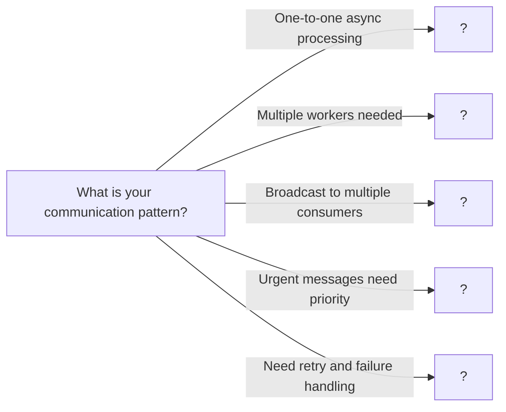

# 08. Message Queues

> Asynchronous communication patterns for decoupled, scalable systems

---

## ELI5: Explain Like I'm 5

<div class="learner-section" markdown>

**Your task:** After implementing different message queue patterns, explain them simply.

**Prompts to guide you:**

1. **What is a message queue in one sentence?**
    - Your answer: <span class="fill-in">[Fill in after implementation]</span>

2. **Why do we need message queues?**
    - Your answer: <span class="fill-in">[Fill in after implementation]</span>

3. **Real-world analogy for simple queue:**
    - Example: "A simple queue is like a line at a store where..."
    - Your analogy: <span class="fill-in">[Fill in]</span>

4. **What is the producer-consumer pattern in one sentence?**
    - Your answer: <span class="fill-in">[Fill in after implementation]</span>

5. **How is pub-sub different from producer-consumer?**
    - Your answer: <span class="fill-in">[Fill in after implementation]</span>

6. **Real-world analogy for pub-sub:**
    - Example: "Pub-sub is like a newsletter subscription where..."
    - Your analogy: <span class="fill-in">[Fill in]</span>

7. **What is a priority queue in one sentence?**
    - Your answer: <span class="fill-in">[Fill in after implementation]</span>

8. **When would you use a dead letter queue?**
    - Your answer: <span class="fill-in">[Fill in after implementation]</span>

</div>

---

## Quick Quiz (Do BEFORE implementing)

<div class="learner-section" markdown>

**Your task:** Test your intuition without looking at code. Answer these, then verify after implementation.

### Complexity Predictions

1. **Synchronous API call to process 100 tasks:**
    - Time if each task takes 1 second: <span class="fill-in">[Your guess: ?]</span>
    - Verified after learning: <span class="fill-in">[Actual: ?]</span>

2. **Message queue with 3 workers processing 100 tasks:**
    - Time if each task takes 1 second: <span class="fill-in">[Your guess: ?]</span>
    - Speedup factor: <span class="fill-in">[Your guess: ?x faster]</span>
    - Verified: <span class="fill-in">[Actual]</span>

3. **Memory usage prediction:**
    - Simple queue with 1000 messages: <span class="fill-in">[Your guess: O(?)]</span>
    - Pub-sub with 5 subscribers and 100 messages: <span class="fill-in">[Your guess: O(?)]</span>
    - Verified: <span class="fill-in">[Actual]</span>

### Scenario Predictions

**Scenario 1:** Image upload service - users upload photos that need resizing

- **Should you use message queue?** <span class="fill-in">[Yes/No - Why?]</span>
- **Pattern to use:** <span class="fill-in">[Simple queue/Producer-consumer/Pub-sub/Priority]</span>
- **Why that pattern?** <span class="fill-in">[Fill in your reasoning]</span>
- **What happens without queue?** <span class="fill-in">[Fill in]</span>

**Scenario 2:** Notification system - send email AND SMS AND push notification

- **Should you use message queue?** <span class="fill-in">[Yes/No - Why?]</span>
- **Pattern to use:** <span class="fill-in">[Simple queue/Producer-consumer/Pub-sub/Priority]</span>
- **Why that pattern?** <span class="fill-in">[Fill in your reasoning]</span>
- **How many times is each message delivered?** <span class="fill-in">[Fill in]</span>

**Scenario 3:** Payment processing - some customers are VIP, need faster processing

- **Should you use message queue?** <span class="fill-in">[Yes/No - Why?]</span>
- **Pattern to use:** <span class="fill-in">[Simple queue/Producer-consumer/Pub-sub/Priority]</span>
- **Why that pattern?** <span class="fill-in">[Fill in your reasoning]</span>
- **How do you prevent low-priority starvation?** <span class="fill-in">[Fill in]</span>

### Trade-off Quiz

**Question:** When is a message queue WORSE than direct synchronous calls?

- Your answer: <span class="fill-in">[Fill in before implementation]</span>
- Verified answer: <span class="fill-in">[Fill in after learning]</span>

**Question:** What's the MAIN difference between a queue and pub-sub?

- [ ] Queue is faster
- [ ] Queue stores messages longer
- [ ] Queue delivers to one consumer, pub-sub to many
- [ ] Queue supports priorities

Verify after implementation: <span class="fill-in">[Which one(s)?]</span>

**Question:** What does "at-least-once delivery" mean?

- Your answer: <span class="fill-in">[Fill in before implementation]</span>
- What problem does it cause? <span class="fill-in">[Fill in]</span>
- Verified: <span class="fill-in">[Actual answer after learning]</span>

**Question:** When should you use a dead letter queue?

- Your answer: <span class="fill-in">[Fill in before implementation]</span>
- Verified: <span class="fill-in">[Fill in after implementation]</span>

</div>

---

## Before/After: Why Message Queues Matter

**Your task:** Compare synchronous vs message queue vs pub-sub approaches to understand the impact.

### Example: Image Processing Service

**Problem:** Users upload images that need to be resized, compressed, and thumbnailed. Each operation takes 2 seconds.

#### Approach 1: Synchronous Processing (No Queue)

```java
// Naive approach - Process immediately in request handler
public class SynchronousImageService {

    public UploadResponse uploadImage(Image image) {
        // User waits for all processing to complete
        resize(image);        // 2 seconds
        compress(image);      // 2 seconds
        thumbnail(image);     // 2 seconds

        return new UploadResponse("success");
    }

    // Total user wait time: 6 seconds!
}
```

**Analysis:**

- User wait time: 6 seconds for each upload
- Scalability: Limited by processing capacity
- Failure handling: User sees error immediately
- For 100 uploads: 600 seconds (10 minutes)

**Problems:**

- Poor user experience (slow response)
- Request timeout on slow operations
- No retry mechanism
- Server blocked during processing

#### Approach 2: Simple Message Queue (Async Processing)

```java
// Better approach - Queue work for background processing
public class QueuedImageService {

    private final SimpleMessageQueue queue;
    private final List<Worker> workers; // 3 worker threads

    public UploadResponse uploadImage(Image image) {
        // Queue the work immediately
        queue.send(new ImageProcessingTask(image));

        // Return immediately - user doesn't wait!
        return new UploadResponse("processing");
    }

    // Workers process in background
    // Total user wait time: <100ms (just queue operation)
}
```

**Analysis:**

- User wait time: <100ms (instant response)
- Scalability: Can add more workers
- Failure handling: Automatic retry with DLQ
- For 100 uploads with 3 workers: ~200 seconds (parallelized)

**Benefits:**

- Fast user response
- Decoupled processing
- Horizontal scaling
- Retry mechanism

#### Approach 3: Pub-Sub (Multiple Subscribers)

```java
// Best approach - Multiple services process independently
public class PubSubImageService {

    private final PubSubMessageQueue pubsub;

    public UploadResponse uploadImage(Image image) {
        // Publish once to "image.uploaded" topic
        pubsub.publish("image.uploaded", new ImageEvent(image));

        // Multiple subscribers receive:
        // - Resize service
        // - Analytics service
        // - Notification service

        return new UploadResponse("processing");
    }

    // Each service processes independently!
}
```

**Analysis:**

- User wait time: <100ms (instant response)
- Scalability: Each subscriber scales independently
- Extensibility: Add new subscribers without code changes
- Loose coupling: Services don't know about each other

#### Performance Comparison

| Approach          | Upload Time | 100 Uploads      | Scalability | Failure Handling  |
|-------------------|-------------|------------------|-------------|-------------------|
| Synchronous       | 6 sec       | 600 sec (10 min) | Poor        | User sees error   |
| Queue (3 workers) | <100ms      | ~200 sec (3 min) | Good        | Auto retry + DLQ  |
| Pub-Sub           | <100ms      | ~200 sec (3 min) | Excellent   | Per-service retry |

**Your calculation:** For 1,000 uploads with 10 workers:

- Synchronous: <span class="fill-in">_____</span> seconds
- Queue: <span class="fill-in">_____</span> seconds
- Speedup: <span class="fill-in">_____</span> times faster

#### Why Does Message Queue Work?

**Key insight to understand:**

```
Without Queue:
User → [Upload + Process] → Response
       ↑ 6 seconds wait ↑

With Queue:
User → [Upload] → Response        (instant)
       Queue → [Worker 1] Process  (async)
            → [Worker 2] Process  (async)
            → [Worker 3] Process  (async)
```

**After implementing, explain in your own words:**

<div class="learner-section" markdown>

- Why does async processing improve user experience? <span class="fill-in">[Your answer]</span>
- What happens if a worker fails? <span class="fill-in">[Your answer]</span>
- When would you NOT use a message queue? <span class="fill-in">[Your answer]</span>

</div>

#### Queue vs Pub-Sub: When to Use Each

**Use Queue when:**

- One consumer should process each message
- Work distribution across workers
- Task processing (jobs, background work)
- Example: <span class="fill-in">[Fill in your example]</span>

**Use Pub-Sub when:**

- Multiple consumers need each message
- Broadcasting events
- Event-driven architecture
- Example: <span class="fill-in">[Fill in your example]</span>

**After implementing, explain the difference:**

<div class="learner-section" markdown>

- How does message delivery differ? <span class="fill-in">[Your answer]</span>
- Which one for image processing? Why? <span class="fill-in">[Your answer]</span>
- Which one for notifications? Why? <span class="fill-in">[Your answer]</span>

</div>

---

## Core Implementation

### Part 1: Simple Message Queue

**Your task:** Implement a basic FIFO message queue.

```java
import java.util.*;
import java.util.concurrent.*;

/**
 * Simple Message Queue: FIFO with blocking operations
 *
 * Key principles:
 * - First In First Out ordering
 * - Blocking when empty (wait for messages)
 * - Thread-safe operations
 * - Decouples producers and consumers
 */

public class SimpleMessageQueue {

    private final Queue<Message> queue;
    private final int capacity;
    private final Object lock = new Object();

    /**
     * Initialize simple message queue
     *
     * @param capacity Maximum queue size
     *
     * TODO: Initialize queue
     * - Create LinkedList for messages
     * - Set capacity limit
     */
    public SimpleMessageQueue(int capacity) {
        // TODO: Initialize queue (LinkedList)

        // TODO: Store capacity

        this.queue = null; // Replace
        this.capacity = 0;
    }

    /**
     * Send message to queue (producer)
     *
     * @param message Message to send
     * @throws InterruptedException if interrupted while waiting
     *
     * TODO: Implement send
     * 1. Wait if queue is full
     * 2. Add message to queue
     * 3. Notify waiting consumers
     *
     * Hint: Use wait() and notifyAll() with synchronized block
     */
    public void send(Message message) throws InterruptedException {
        synchronized (lock) {
            // TODO: While queue is full, wait
            // while (queue.size() >= capacity):
            //   lock.wait()

            // TODO: Add message to queue

            // TODO: Notify all waiting consumers
            // lock.notifyAll()
        }
    }

    /**
     * Receive message from queue (consumer)
     *
     * @return Next message from queue
     * @throws InterruptedException if interrupted while waiting
     *
     * TODO: Implement receive
     * 1. Wait if queue is empty
     * 2. Remove and return message
     * 3. Notify waiting producers
     */
    public Message receive() throws InterruptedException {
        synchronized (lock) {
            // TODO: While queue is empty, wait
            // while (queue.isEmpty()):
            //   lock.wait()

            // TODO: Remove message from queue

            // TODO: Notify all waiting producers
            // lock.notifyAll()

            // TODO: Return message

            return null; // Replace
        }
    }

    /**
     * Try to receive with timeout
     *
     * @param timeoutMs Timeout in milliseconds
     * @return Message or null if timeout
     */
    public Message receive(long timeoutMs) throws InterruptedException {
        synchronized (lock) {
            long deadline = System.currentTimeMillis() + timeoutMs;

            // TODO: Wait until message available or timeout
            // while (queue.isEmpty() && timeRemaining > 0):
            //   lock.wait(timeRemaining)
            //   timeRemaining = deadline - currentTime

            // TODO: If queue not empty, remove and return message

            return null; // Replace (or message)
        }
    }

    /**
     * Get queue size
     */
    public synchronized int size() {
        return queue.size();
    }

    /**
     * Check if queue is empty
     */
    public synchronized boolean isEmpty() {
        return queue.isEmpty();
    }

    static class Message {
        String id;
        String content;
        long timestamp;

        public Message(String id, String content) {
            this.id = id;
            this.content = content;
            this.timestamp = System.currentTimeMillis();
        }

        @Override
        public String toString() {
            return "Message{id='" + id + "', content='" + content + "'}";
        }
    }
}
```

### Part 2: Producer-Consumer Pattern

**Your task:** Implement producer-consumer with multiple workers.

```java
/**
 * Producer-Consumer: Multiple producers and consumers processing work
 *
 * Key principles:
 * - Work distribution across consumers
 * - Load balancing
 * - Backpressure handling
 * - Graceful shutdown
 */

public class ProducerConsumer {

    private final SimpleMessageQueue queue;
    private final List<Thread> consumerThreads;
    private volatile boolean running;

    /**
     * Initialize producer-consumer system
     *
     * @param queueCapacity Queue size
     * @param numConsumers Number of consumer threads
     *
     * TODO: Initialize system
     * - Create message queue
     * - Create consumer threads
     * - Set running flag
     */
    public ProducerConsumer(int queueCapacity, int numConsumers) {
        // TODO: Create SimpleMessageQueue

        // TODO: Initialize consumer threads list

        // TODO: Set running to true

        this.queue = null; // Replace
        this.consumerThreads = null; // Replace
    }

    /**
     * Start all consumers
     *
     * TODO: Start consumer threads
     * - Each consumer polls queue and processes messages
     * - Handle InterruptedException
     * - Check running flag
     */
    public void start() {
        // TODO: For each consumer:
        //   Create thread that:
        //     - Runs while 'running' is true
        //     - Receives message from queue
        //     - Processes message
        //     - Handles exceptions
        //   Start thread
        //   Add to consumerThreads list
    }

    /**
     * Produce message (called by producers)
     *
     * TODO: Send message to queue
     */
    public void produce(String messageId, String content) throws InterruptedException {
        // TODO: Create Message and send to queue
    }

    /**
     * Process message (override in subclass for custom logic)
     *
     * TODO: Implement message processing
     * - Extract message content
     * - Perform work
     * - Handle errors
     */
    protected void processMessage(SimpleMessageQueue.Message message) {
        // TODO: Process message (simulated work)
        System.out.println(Thread.currentThread().getName() +
                          " processing: " + message);

        // TODO: Simulate work
        try {
            Thread.sleep(100);
        } catch (InterruptedException e) {
            Thread.currentThread().interrupt();
        }
    }

    /**
     * Shutdown system
     *
     * TODO: Graceful shutdown
     * - Set running to false
     * - Wait for consumers to finish
     */
    public void shutdown() throws InterruptedException {
        // TODO: Set running to false

        // TODO: Interrupt all consumer threads

        // TODO: Wait for all threads to finish (join)
    }

    /**
     * Get queue statistics
     */
    public QueueStats getStats() {
        return new QueueStats(queue.size(), consumerThreads.size());
    }

    static class QueueStats {
        int queueSize;
        int activeConsumers;

        public QueueStats(int queueSize, int activeConsumers) {
            this.queueSize = queueSize;
            this.activeConsumers = activeConsumers;
        }
    }
}
```

### Part 3: Publish-Subscribe Pattern

**Your task:** Implement pub-sub for multiple subscribers.

```java
/**
 * Publish-Subscribe: Broadcast messages to multiple subscribers
 *
 * Key principles:
 * - One message delivered to all subscribers
 * - Topic-based routing
 * - Decoupled publishers and subscribers
 * - Each subscriber has own queue
 */

public class PubSubMessageQueue {

    private final Map<String, List<Subscriber>> topicSubscribers;
    private final Object lock = new Object();

    /**
     * Initialize pub-sub system
     *
     * TODO: Initialize topic mapping
     */
    public PubSubMessageQueue() {
        // TODO: Initialize topicSubscribers map (ConcurrentHashMap)
        this.topicSubscribers = null; // Replace
    }

    /**
     * Subscribe to topic
     *
     * @param topic Topic name
     * @param subscriber Subscriber to register
     *
     * TODO: Register subscriber
     * - Create topic if doesn't exist
     * - Add subscriber to topic list
     */
    public void subscribe(String topic, Subscriber subscriber) {
        synchronized (lock) {
            // TODO: Get or create subscriber list for topic

            // TODO: Add subscriber to list

            System.out.println(subscriber.name + " subscribed to " + topic);
        }
    }

    /**
     * Unsubscribe from topic
     *
     * TODO: Remove subscriber from topic
     */
    public void unsubscribe(String topic, Subscriber subscriber) {
        synchronized (lock) {
            // TODO: Get subscriber list for topic

            // TODO: Remove subscriber
        }
    }

    /**
     * Publish message to topic
     *
     * @param topic Topic to publish to
     * @param message Message to publish
     *
     * TODO: Deliver to all subscribers
     * - Get all subscribers for topic
     * - Send message to each subscriber's queue
     */
    public void publish(String topic, SimpleMessageQueue.Message message) {
        synchronized (lock) {
            // TODO: Get subscribers for topic

            // TODO: For each subscriber:
            //   Add message to subscriber's queue

            System.out.println("Published to " + topic + ": " + message);
        }
    }

    /**
     * Get topic statistics
     */
    public Map<String, Integer> getTopicStats() {
        Map<String, Integer> stats = new HashMap<>();
        synchronized (lock) {
            for (Map.Entry<String, List<Subscriber>> entry : topicSubscribers.entrySet()) {
                stats.put(entry.getKey(), entry.getValue().size());
            }
        }
        return stats;
    }

    static class Subscriber {
        String name;
        Queue<SimpleMessageQueue.Message> queue;

        public Subscriber(String name) {
            this.name = name;
            this.queue = new LinkedList<>();
        }

        public void deliver(SimpleMessageQueue.Message message) {
            queue.offer(message);
        }

        public SimpleMessageQueue.Message receive() {
            return queue.poll();
        }

        public int getQueueSize() {
            return queue.size();
        }
    }
}
```

### Part 4: Priority Message Queue

**Your task:** Implement priority queue for urgent messages.

```java
/**
 * Priority Message Queue: Process high-priority messages first
 *
 * Key principles:
 * - Priority levels (HIGH, MEDIUM, LOW)
 * - Higher priority processed first
 * - FIFO within same priority
 * - Prevents starvation of low priority
 */

public class PriorityMessageQueue {

    private final PriorityQueue<PriorityMessage> queue;
    private final Object lock = new Object();
    private final int capacity;

    /**
     * Initialize priority queue
     *
     * @param capacity Maximum queue size
     *
     * TODO: Initialize priority queue
     * - Create PriorityQueue with comparator
     * - Sort by priority then timestamp
     */
    public PriorityMessageQueue(int capacity) {
        // TODO: Create PriorityQueue with comparator
        // Comparator: First by priority (descending), then timestamp (ascending)

        // TODO: Store capacity

        this.queue = null; // Replace
        this.capacity = 0;
    }

    /**
     * Send message with priority
     *
     * TODO: Add message to priority queue
     * - Wait if queue is full
     * - Add message
     * - Notify consumers
     */
    public void send(PriorityMessage message) throws InterruptedException {
        synchronized (lock) {
            // TODO: Wait while queue is full

            // TODO: Add message to queue

            // TODO: Notify waiting consumers
        }
    }

    /**
     * Receive highest priority message
     *
     * TODO: Get message with highest priority
     * - Wait if queue is empty
     * - Remove highest priority message
     * - Notify producers
     */
    public PriorityMessage receive() throws InterruptedException {
        synchronized (lock) {
            // TODO: Wait while queue is empty

            // TODO: Poll highest priority message

            // TODO: Notify waiting producers

            return null; // Replace
        }
    }

    /**
     * Get queue size
     */
    public synchronized int size() {
        return queue.size();
    }

    static class PriorityMessage implements Comparable<PriorityMessage> {
        String id;
        String content;
        Priority priority;
        long timestamp;

        public PriorityMessage(String id, String content, Priority priority) {
            this.id = id;
            this.content = content;
            this.priority = priority;
            this.timestamp = System.currentTimeMillis();
        }

        @Override
        public int compareTo(PriorityMessage other) {
            // TODO: Compare by priority first (higher priority first)
            // Then by timestamp (earlier first)

            // Hint:
            // int priorityCompare = other.priority.value - this.priority.value;
            // if (priorityCompare != 0) return priorityCompare;
            // return Long.compare(this.timestamp, other.timestamp);

            return 0; // Replace
        }

        @Override
        public String toString() {
            return "PriorityMessage{id='" + id + "', priority=" + priority + "}";
        }
    }

    enum Priority {
        LOW(1), MEDIUM(2), HIGH(3);

        final int value;

        Priority(int value) {
            this.value = value;
        }
    }
}
```

### Part 5: Dead Letter Queue

**Your task:** Implement dead letter queue for failed messages.

```java
/**
 * Dead Letter Queue: Handle messages that fail processing
 *
 * Key principles:
 * - Retry failed messages
 * - Max retry limit
 * - Move to DLQ after max retries
 * - Allows manual inspection/reprocessing
 */

public class DeadLetterQueue {

    private final SimpleMessageQueue mainQueue;
    private final SimpleMessageQueue dlq;
    private final int maxRetries;
    private final Map<String, Integer> retryCount;

    /**
     * Initialize dead letter queue system
     *
     * @param capacity Queue capacity
     * @param maxRetries Maximum retry attempts
     *
     * TODO: Initialize queues
     * - Create main queue
     * - Create DLQ
     * - Initialize retry counter
     */
    public DeadLetterQueue(int capacity, int maxRetries) {
        // TODO: Create main queue

        // TODO: Create DLQ

        // TODO: Store maxRetries

        // TODO: Initialize retry counter map

        this.mainQueue = null; // Replace
        this.dlq = null; // Replace
        this.maxRetries = 0;
        this.retryCount = null; // Replace
    }

    /**
     * Send message to main queue
     */
    public void send(SimpleMessageQueue.Message message) throws InterruptedException {
        // TODO: Send to main queue
        // Initialize retry count to 0
    }

    /**
     * Process message with retry logic
     *
     * @param processor Message processor
     * @return true if processed successfully
     *
     * TODO: Process with retries
     * 1. Receive message from main queue
     * 2. Try to process
     * 3. If fails, check retry count
     * 4. If under limit, requeue with incremented count
     * 5. If over limit, move to DLQ
     */
    public boolean processWithRetry(MessageProcessor processor) throws InterruptedException {
        // TODO: Receive message from main queue

        // TODO: Try to process message
        try {
            // processor.process(message)
            // return true if successful
        } catch (Exception e) {
            // TODO: Get current retry count

            // TODO: If under max retries:
            //   Increment retry count
            //   Send back to main queue
            //   Return false

            // TODO: If at max retries:
            //   Send to DLQ
            //   Remove from retry count
            //   Return false
        }

        return false; // Replace
    }

    /**
     * Get message from DLQ for manual processing
     */
    public SimpleMessageQueue.Message receiveDLQ() throws InterruptedException {
        return dlq.receive();
    }

    /**
     * Reprocess message from DLQ (manual retry)
     */
    public void reprocessFromDLQ(SimpleMessageQueue.Message message) throws InterruptedException {
        // TODO: Reset retry count and send to main queue
    }

    /**
     * Get statistics
     */
    public DLQStats getStats() {
        return new DLQStats(
            mainQueue.size(),
            dlq.size(),
            retryCount.size()
        );
    }

    interface MessageProcessor {
        void process(SimpleMessageQueue.Message message) throws Exception;
    }

    static class DLQStats {
        int mainQueueSize;
        int dlqSize;
        int messagesWithRetries;

        public DLQStats(int mainQueueSize, int dlqSize, int messagesWithRetries) {
            this.mainQueueSize = mainQueueSize;
            this.dlqSize = dlqSize;
            this.messagesWithRetries = messagesWithRetries;
        }

        @Override
        public String toString() {
            return "DLQStats{main=" + mainQueueSize +
                   ", dlq=" + dlqSize +
                   ", retrying=" + messagesWithRetries + "}";
        }
    }
}
```

---

## Client Code

```java
import java.util.*;

public class MessageQueuesClient {

    public static void main(String[] args) throws Exception {
        testSimpleQueue();
        System.out.println("\n" + "=".repeat(50) + "\n");
        testProducerConsumer();
        System.out.println("\n" + "=".repeat(50) + "\n");
        testPubSub();
        System.out.println("\n" + "=".repeat(50) + "\n");
        testPriorityQueue();
        System.out.println("\n" + "=".repeat(50) + "\n");
        testDeadLetterQueue();
    }

    static void testSimpleQueue() throws InterruptedException {
        System.out.println("=== Simple Message Queue Test ===\n");

        SimpleMessageQueue queue = new SimpleMessageQueue(5);

        // Test: Producer thread
        Thread producer = new Thread(() -> {
            try {
                for (int i = 1; i <= 5; i++) {
                    SimpleMessageQueue.Message msg =
                        new SimpleMessageQueue.Message("msg" + i, "Content " + i);
                    queue.send(msg);
                    System.out.println("Sent: " + msg);
                    Thread.sleep(100);
                }
            } catch (InterruptedException e) {
                Thread.currentThread().interrupt();
            }
        });

        // Test: Consumer thread
        Thread consumer = new Thread(() -> {
            try {
                for (int i = 1; i <= 5; i++) {
                    SimpleMessageQueue.Message msg = queue.receive();
                    System.out.println("Received: " + msg);
                }
            } catch (InterruptedException e) {
                Thread.currentThread().interrupt();
            }
        });

        producer.start();
        consumer.start();
        producer.join();
        consumer.join();

        System.out.println("\nFinal queue size: " + queue.size());
    }

    static void testProducerConsumer() throws InterruptedException {
        System.out.println("=== Producer-Consumer Test ===\n");

        ProducerConsumer pc = new ProducerConsumer(10, 3);
        pc.start();

        // Produce messages
        System.out.println("Producing 10 messages...");
        for (int i = 1; i <= 10; i++) {
            pc.produce("msg" + i, "Task " + i);
            Thread.sleep(50);
        }

        // Let consumers process
        Thread.sleep(2000);

        System.out.println("\nStats: " + pc.getStats());
        pc.shutdown();
    }

    static void testPubSub() throws InterruptedException {
        System.out.println("=== Pub-Sub Test ===\n");

        PubSubMessageQueue pubsub = new PubSubMessageQueue();

        // Create subscribers
        PubSubMessageQueue.Subscriber sub1 = new PubSubMessageQueue.Subscriber("User1");
        PubSubMessageQueue.Subscriber sub2 = new PubSubMessageQueue.Subscriber("User2");
        PubSubMessageQueue.Subscriber sub3 = new PubSubMessageQueue.Subscriber("User3");

        // Subscribe to topics
        pubsub.subscribe("news", sub1);
        pubsub.subscribe("news", sub2);
        pubsub.subscribe("sports", sub2);
        pubsub.subscribe("sports", sub3);

        System.out.println("\nTopic stats: " + pubsub.getTopicStats());

        // Publish messages
        System.out.println("\nPublishing messages:");
        pubsub.publish("news", new SimpleMessageQueue.Message("n1", "Breaking news!"));
        pubsub.publish("sports", new SimpleMessageQueue.Message("s1", "Game update!"));

        // Check subscriber queues
        System.out.println("\nSubscriber queues:");
        System.out.println("User1 queue size: " + sub1.getQueueSize());
        System.out.println("User2 queue size: " + sub2.getQueueSize());
        System.out.println("User3 queue size: " + sub3.getQueueSize());

        // Receive messages
        System.out.println("\nUser1 receives: " + sub1.receive());
        System.out.println("User2 receives: " + sub2.receive());
        System.out.println("User2 receives: " + sub2.receive());
    }

    static void testPriorityQueue() throws InterruptedException {
        System.out.println("=== Priority Queue Test ===\n");

        PriorityMessageQueue queue = new PriorityMessageQueue(10);

        // Send messages with different priorities
        System.out.println("Sending messages:");
        queue.send(new PriorityMessageQueue.PriorityMessage(
            "m1", "Low priority", PriorityMessageQueue.Priority.LOW));
        queue.send(new PriorityMessageQueue.PriorityMessage(
            "m2", "High priority", PriorityMessageQueue.Priority.HIGH));
        queue.send(new PriorityMessageQueue.PriorityMessage(
            "m3", "Medium priority", PriorityMessageQueue.Priority.MEDIUM));
        queue.send(new PriorityMessageQueue.PriorityMessage(
            "m4", "High priority 2", PriorityMessageQueue.Priority.HIGH));

        System.out.println("Queue size: " + queue.size());

        // Receive in priority order
        System.out.println("\nReceiving messages (priority order):");
        while (queue.size() > 0) {
            PriorityMessageQueue.PriorityMessage msg = queue.receive();
            System.out.println("Received: " + msg);
        }
    }

    static void testDeadLetterQueue() throws InterruptedException {
        System.out.println("=== Dead Letter Queue Test ===\n");

        DeadLetterQueue dlq = new DeadLetterQueue(10, 3);

        // Create failing processor
        DeadLetterQueue.MessageProcessor failingProcessor = message -> {
            System.out.println("Processing: " + message.id);
            if (message.id.equals("msg2")) {
                throw new Exception("Simulated failure");
            }
        };

        // Send messages
        System.out.println("Sending messages:");
        dlq.send(new SimpleMessageQueue.Message("msg1", "Good message"));
        dlq.send(new SimpleMessageQueue.Message("msg2", "Bad message"));
        dlq.send(new SimpleMessageQueue.Message("msg3", "Good message"));

        // Process messages
        System.out.println("\nProcessing messages:");
        for (int i = 0; i < 3; i++) {
            boolean success = dlq.processWithRetry(failingProcessor);
            System.out.println("Process attempt " + (i+1) + ": " +
                             (success ? "SUCCESS" : "FAILED"));
            System.out.println("Stats: " + dlq.getStats());
        }

        // Try more times to move bad message to DLQ
        System.out.println("\nRetrying failed message:");
        for (int i = 0; i < 3; i++) {
            dlq.processWithRetry(failingProcessor);
            System.out.println("Stats: " + dlq.getStats());
        }
    }
}
```

---

## Debugging Challenges

**Your task:** Find and fix bugs in broken message queue implementations. This tests your understanding of common
message queue pitfalls.

### Challenge 1: Lost Messages

```java
/**
 * This message queue is losing messages under load.
 * It has 2 BUGS. Find them!
 */
public class BuggyMessageQueue {
    private final Queue<Message> queue;
    private final int capacity;

    public BuggyMessageQueue(int capacity) {
        this.queue = new LinkedList<>();
        this.capacity = capacity;
    }

    public void send(Message message) throws InterruptedException {
        if (queue.size() >= capacity) {
            Thread.sleep(100); // Wait for space
        }
        queue.offer(message);
    }

    public Message receive() throws InterruptedException {
        if (queue.isEmpty()) {
            return null; // What happens to waiting consumers?
        }
        return queue.poll();
    }
}
```

**Your debugging:**

- Bug 1: <span class="fill-in">[What\'s the bug?]</span>
- **Scenario that exposes bug:** <span class="fill-in">[Fill in]</span>

- Bug 2: <span class="fill-in">[What\'s the bug?]</span>
- **Why does it lose messages?** <span class="fill-in">[Fill in]</span>

<details markdown>
<summary>Click to verify your answers</summary>

**Bug 1 (send method):** Missing synchronization. Multiple threads can check `queue.size()` simultaneously, both see
space available, both add messages, exceeding capacity. Race condition on queue operations.

**Fix:**

```java
public synchronized void send(Message message) throws InterruptedException {
    while (queue.size() >= capacity) {
        wait(); // Wait until space available
    }
    queue.offer(message);
    notifyAll(); // Wake up waiting receivers
}
```

**Bug 2 (receive method):** Returns null instead of waiting. Consumers poll repeatedly or miss messages. No coordination
between producers and consumers.

**Fix:**

```java
public synchronized Message receive() throws InterruptedException {
    while (queue.isEmpty()) {
        wait(); // Wait until message available
    }
    Message msg = queue.poll();
    notifyAll(); // Wake up waiting senders
    return msg;
}
```

**Why messages are lost:** Without synchronization, concurrent operations can corrupt the queue state. Without
wait/notify, producers may overwrite or consumers may miss messages.
</details>

---

### Challenge 2: Duplicate Processing

```java
/**
 * This consumer processes some messages twice!
 * It has 1 CRITICAL BUG related to at-least-once delivery.
 */
public class BuggyConsumer {
    private final SimpleMessageQueue queue;

    public void processMessages() {
        while (true) {
            try {
                Message msg = queue.receive();
                processMessage(msg); // Long operation - 5 seconds

                // Message was already removed from queue!

            } catch (Exception e) {
                // Message lost or processed twice?
                System.err.println("Error: " + e.getMessage());
            }
        }
    }

    private void processMessage(Message msg) throws Exception {
        // Simulate processing
        if (msg.content.contains("fail")) {
            throw new Exception("Processing failed");
        }
        // Save to database
    }
}
```

**Your debugging:**

- **Bug:** <span class="fill-in">[What's the problem with this pattern?]</span>
- **At-least-once delivery issue:** <span class="fill-in">[Explain the problem]</span>
- **Exactly-once challenge:** <span class="fill-in">[Why is this hard to solve?]</span>
- **Fix option 1:** <span class="fill-in">[How to make it safe?]</span>
- **Fix option 2:** <span class="fill-in">[Alternative approach?]</span>

<details markdown>
<summary>Click to verify your answer</summary>

**Bug:** Message is removed from queue BEFORE successful processing. If `processMessage` fails, the message is lost. If
we add retry logic, we might process it multiple times.

**At-least-once delivery problem:**

```

1. Receive message (removed from queue)
2. Start processing
3. Process fails halfway
4. Message is lost - neither in queue nor processed!
```

**Exactly-once challenge:** Very hard to guarantee. You need:

- Idempotent processing (safe to process twice)
- Transactional processing
- Deduplication mechanism

**Fix Option 1 - Use acknowledgment pattern:**

```java
public void processMessages() {
    while (true) {
        Message msg = null;
        try {
            msg = queue.receive();
            processMessage(msg);
            queue.acknowledge(msg.id); // Explicit ACK

        } catch (Exception e) {
            if (msg != null) {
                queue.nack(msg.id); // Negative ACK - requeue
            }
        }
    }
}
```

**Fix Option 2 - Use idempotent processing:**

```java
private void processMessage(Message msg) throws Exception {
    // Check if already processed (deduplication)
    if (database.isProcessed(msg.id)) {
        return; // Skip duplicate
    }

    // Process and mark as processed in same transaction
    database.transaction(() -> {
        doActualProcessing(msg);
        database.markProcessed(msg.id);
    });
}
```

**Key insight:** At-least-once delivery requires idempotent consumers!
</details>

---

### Challenge 3: Message Ordering Violation

```java
/**
 * This pub-sub system delivers messages OUT OF ORDER.
 * It has 1 SUBTLE BUG in concurrent delivery.
 */
public class BuggyPubSub {
    private final Map<String, List<Subscriber>> topicSubscribers;
    private final ExecutorService executor;

    public BuggyPubSub() {
        this.topicSubscribers = new ConcurrentHashMap<>();
        this.executor = Executors.newFixedThreadPool(10);
    }

    public void publish(String topic, Message message) {
        List<Subscriber> subscribers = topicSubscribers.get(topic);
        if (subscribers == null) return;

        for (Subscriber sub : subscribers) {
            executor.submit(() -> {
                sub.deliver(message);
            });
        }
        // Messages may arrive out of order to each subscriber
    }
}
```

**Your debugging:**

- **Bug:** <span class="fill-in">[What causes out-of-order delivery?]</span>
- **Example scenario:** <span class="fill-in">[When does this fail?]</span>
- **Why is ordering important?** <span class="fill-in">[Give examples]</span>
- **Fix for ordered delivery:** <span class="fill-in">[How to guarantee order?]</span>
- **Trade-off:** <span class="fill-in">[What do you sacrifice?]</span>

<details markdown>
<summary>Click to verify your answer</summary>

**Bug:** Using thread pool for parallel delivery breaks message ordering. Messages sent to thread pool may execute in
any order.

**Example scenario:**

```
Publisher sends: msg1, msg2, msg3
Thread pool:
    - Thread 2 picks up msg1 (delayed)
    - Thread 1 picks up msg2 (fast)
    - Thread 3 picks up msg3 (fast)
Subscriber receives: msg2, msg3, msg1 ❌
```

**Why ordering matters:**

- Database updates (create → update → delete)
- State transitions (pending → processing → completed)
- Financial transactions (debit must follow credit)
- Event sourcing (events must be ordered)

**Fix Option 1 - Serial delivery per subscriber:**

```java
public void publish(String topic, Message message) {
    List<Subscriber> subscribers = topicSubscribers.get(topic);
    if (subscribers == null) return;

    // Each subscriber gets messages in order
    for (Subscriber sub : subscribers) {
        sub.deliverInOrder(message); // Subscriber queues internally
    }
}

class Subscriber {
    private final Queue<Message> orderedQueue;
    private final SingleThreadExecutor executor; // One thread per subscriber

    void deliverInOrder(Message msg) {
        orderedQueue.offer(msg);
        executor.execute(() -> {
            Message m = orderedQueue.poll();
            process(m); // Processed in order
        });
    }
}
```

**Fix Option 2 - Partition-based ordering:**

```java
// Only guarantee order within partition key (like Kafka)
public void publish(String topic, Message message, String partitionKey) {
    int partition = Math.abs(partitionKey.hashCode()) % numPartitions;
    // Messages with same key go to same partition (ordered)
    partitions[partition].deliver(message);
}
```

**Trade-off:** Serial processing is slower than parallel. Must choose between throughput and ordering guarantees.
</details>

---

### Challenge 4: Dead Letter Queue Overflow

```java
/**
 * This DLQ system fills up and loses messages.
 * It has 2 BUGS in retry logic.
 */
public class BuggyDLQ {
    private final SimpleMessageQueue mainQueue;
    private final SimpleMessageQueue dlq;
    private final int maxRetries;
    private final Map<String, Integer> retryCount;

    public boolean processWithRetry(MessageProcessor processor) throws InterruptedException {
        Message msg = mainQueue.receive();

        try {
            processor.process(msg);
            return true;

        } catch (Exception e) {
            int count = retryCount.getOrDefault(msg.id, 0);
            count++;
            retryCount.put(msg.id, count);

            if (count < maxRetries) {
                mainQueue.send(msg);
                return false;
            } else {
                dlq.send(msg);
                retryCount.remove(msg.id);
                return false;
            }
        }
    }
}
```

**Your debugging:**

- **Bug 1:** <span class="fill-in">[What's wrong with immediate retry?]</span>
- **Bug 1 impact:** <span class="fill-in">[What happens to the system?]</span>
- **Bug 1 fix:** <span class="fill-in">[How to fix?]</span>

- **Bug 2:** <span class="fill-in">[What if DLQ is full?]</span>
- **Bug 2 impact:** <span class="fill-in">[Messages lost or blocked?]</span>
- **Bug 2 fix:** <span class="fill-in">[How to handle full DLQ?]</span>

**Additional questions:**

- **Retry timing strategy:** <span class="fill-in">[Constant vs exponential backoff?]</span>
- **When to stop retrying:** <span class="fill-in">[How to decide max retries?]</span>
- **DLQ monitoring:** <span class="fill-in">[How to detect problems?]</span>

<details markdown>
<summary>Click to verify your answers</summary>

**Bug 1:** Immediate retry causes rapid retry loop. If a message consistently fails (e.g., bad data), it will be retried
maxRetries times in rapid succession, wasting CPU and blocking other messages.

**Bug 1 fix - Add exponential backoff:**

```java
if (count < maxRetries) {
    long delay = (long) Math.pow(2, count) * 1000; // 1s, 2s, 4s, 8s...
    Thread.sleep(delay);
    mainQueue.send(msg);
    return false;
}
```

Or better, use a delayed queue:

```java
if (count < maxRetries) {
    long delayMs = (long) Math.pow(2, count) * 1000;
    delayedQueue.send(msg, delayMs); // Reprocess after delay
    return false;
}
```

**Bug 2:** If DLQ is full, `dlq.send(msg)` will block forever (if blocking queue) or throw exception (if non-blocking).
Message processing stalls.

**Bug 2 fix - Handle DLQ overflow:**

```java
} else {
    // Try to send to DLQ with timeout
    boolean sent = dlq.sendWithTimeout(msg, 5000);
    if (!sent) {
        // DLQ full - critical alert!
        alertOps("DLQ full! Message: " + msg.id);
        // Option 1: Drop message (with logging)
        logDroppedMessage(msg);
        // Option 2: Write to disk/database as backup
        persistToBackup(msg);
    }
    retryCount.remove(msg.id);
    return false;
}
```

**Retry strategies:**

1. **Constant backoff:** Fixed delay (1s, 1s, 1s)
    - Pro: Simple
    - Con: Doesn't give system time to recover

2. **Exponential backoff:** Increasing delay (1s, 2s, 4s, 8s)
    - Pro: Reduces load during problems
    - Con: Messages delayed longer

3. **Max retry limits:**
    - Transient errors (network): High retries (10+)
    - Permanent errors (validation): Low retries (3)
    - Timeout errors: Medium retries (5)

**DLQ monitoring:**

- Alert when DLQ size > threshold
- Alert when DLQ growth rate is high
- Dashboard showing DLQ trends
- Automated DLQ processing for known issues

</details>

---

### Your Debugging Scorecard

After finding and fixing all bugs:

- [ ] Understood message loss causes (synchronization, race conditions)
- [ ] Understood duplicate processing (at-least-once vs exactly-once)
- [ ] Understood ordering violations (concurrent delivery)
- [ ] Understood DLQ overflow (backoff, capacity planning)
- [ ] Could explain each bug to someone else
- [ ] Learned common message queue mistakes to avoid

**Common mistakes you discovered:**

1. <span class="fill-in">[List the patterns you noticed]</span>
2. <span class="fill-in">[Fill in]</span>
3. <span class="fill-in">[Fill in]</span>
4. <span class="fill-in">[Fill in]</span>

**Key takeaways:**

- **Concurrency:** <span class="fill-in">[What did you learn?]</span>
- **Delivery guarantees:** <span class="fill-in">[What did you learn?]</span>
- **Error handling:** <span class="fill-in">[What did you learn?]</span>
- **Monitoring:** <span class="fill-in">[What did you learn?]</span>

---

## Decision Framework

**Questions to answer after implementation:**

### 1. Pattern Selection

**When to use Simple Queue?**

- Your scenario: <span class="fill-in">[Fill in]</span>
- Key factors: <span class="fill-in">[Fill in]</span>

**When to use Producer-Consumer?**

- Your scenario: <span class="fill-in">[Fill in]</span>
- Key factors: <span class="fill-in">[Fill in]</span>

**When to use Pub-Sub?**

- Your scenario: <span class="fill-in">[Fill in]</span>
- Key factors: <span class="fill-in">[Fill in]</span>

**When to use Priority Queue?**

- Your scenario: <span class="fill-in">[Fill in]</span>
- Key factors: <span class="fill-in">[Fill in]</span>

**When to use Dead Letter Queue?**

- Your scenario: <span class="fill-in">[Fill in]</span>
- Key factors: <span class="fill-in">[Fill in]</span>

### 2. Trade-offs

**Simple Queue:**

- Pros: <span class="fill-in">[Fill in after understanding]</span>
- Cons: <span class="fill-in">[Fill in after understanding]</span>

**Producer-Consumer:**

- Pros: <span class="fill-in">[Fill in after understanding]</span>
- Cons: <span class="fill-in">[Fill in after understanding]</span>

**Pub-Sub:**

- Pros: <span class="fill-in">[Fill in after understanding]</span>
- Cons: <span class="fill-in">[Fill in after understanding]</span>

**Priority Queue:**

- Pros: <span class="fill-in">[Fill in after understanding]</span>
- Cons: <span class="fill-in">[Fill in after understanding]</span>

### 3. Your Decision Tree

Build your decision tree after practicing:


---

## Practice

### Scenario 1: Process uploaded images

**Requirements:**

- Users upload images
- Need to resize, compress, generate thumbnails
- Processing takes 5-10 seconds
- Want fast upload response
- Handle processing failures

**Your design:**

- Which pattern would you choose? <span class="fill-in">[Fill in]</span>
- Why? <span class="fill-in">[Fill in]</span>
- How many workers? <span class="fill-in">[Fill in]</span>
- Failure handling strategy? <span class="fill-in">[Fill in]</span>

### Scenario 2: Notification system

**Requirements:**

- Send notifications via email, SMS, push
- Users subscribe to notification types
- Some notifications are urgent
- Must deliver to all channels
- Track delivery failures

**Your design:**

- Which pattern would you choose? <span class="fill-in">[Fill in]</span>
- Why? <span class="fill-in">[Fill in]</span>
- How to handle different channels? <span class="fill-in">[Fill in]</span>
- Priority strategy? <span class="fill-in">[Fill in]</span>

### Scenario 3: Order processing system

**Requirements:**

- Process orders from multiple sources
- Some orders need priority (VIP customers)
- Payment processing might fail
- Need retry logic
- Monitor failed orders

**Your design:**

- Which pattern would you choose? <span class="fill-in">[Fill in]</span>
- Why? <span class="fill-in">[Fill in]</span>
- How to handle priorities? <span class="fill-in">[Fill in]</span>
- Retry strategy? <span class="fill-in">[Fill in]</span>

---

## Review Checklist

- [ ] Simple message queue implemented with blocking operations
- [ ] Producer-consumer implemented with multiple workers
- [ ] Pub-sub implemented with topic-based routing
- [ ] Priority queue implemented with priority ordering
- [ ] Dead letter queue implemented with retry logic
- [ ] Understand when to use each pattern
- [ ] Can explain trade-offs between patterns
- [ ] Built decision tree for pattern selection
- [ ] Completed practice scenarios

---

### Mastery Certification

**I certify that I can:**

- [ ] Implement all message queue patterns from memory
- [ ] Explain when and why to use each pattern
- [ ] Identify the correct pattern for new scenarios
- [ ] Analyze delivery guarantees and trade-offs
- [ ] Debug common message queue problems
- [ ] Design scalable message-based systems
- [ ] Explain at-least-once vs exactly-once delivery
- [ ] Implement retry logic with dead letter queues
- [ ] Compare queue vs pub-sub architectures
- [ ] Teach these concepts to someone else

**Self-assessment score:** ___/10

**Specific competencies:**

- Pattern selection: <span class="fill-in">___</span>/10
- Concurrency understanding: <span class="fill-in">___</span>/10
- Delivery guarantees: <span class="fill-in">___</span>/10
- Error handling: <span class="fill-in">___</span>/10
- System design: <span class="fill-in">___</span>/10

**If any score < 7:** Review the sections where you struggled, then retry this gate.

**If all scores ≥ 7:** Congratulations! You've mastered message queues. Proceed to the next topic.
