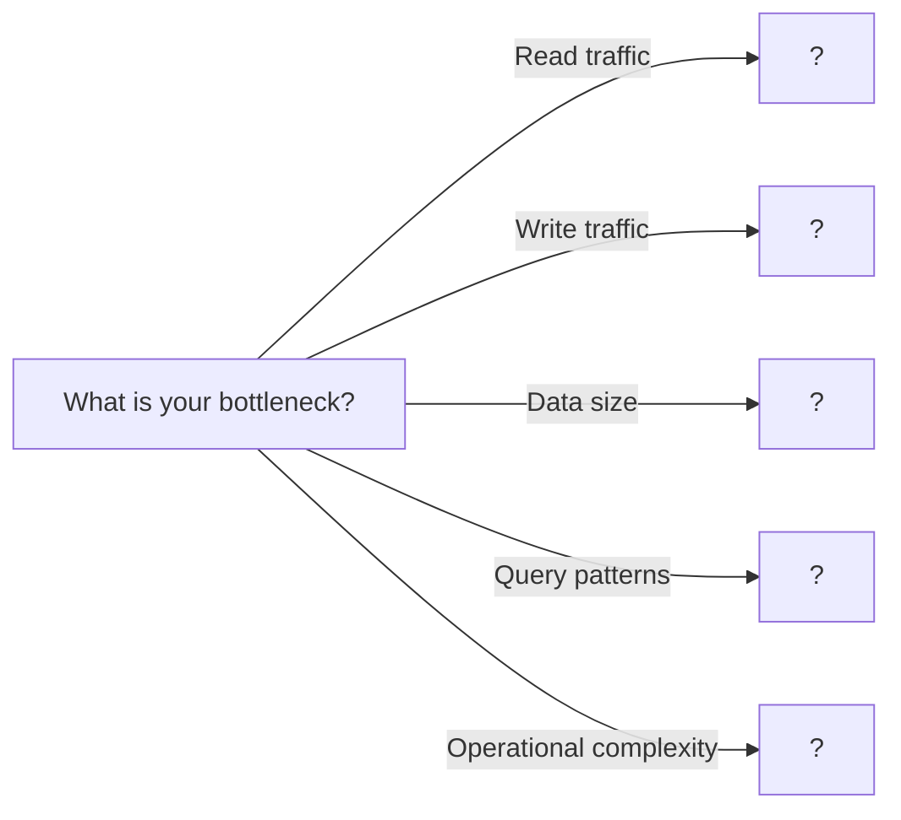

# Database Scaling

> Strategies for handling growing data and traffic through sharding, replication, and partitioning

---

## Learning Objectives

By the end of this topic you will be able to:

- Implement hash-based and range-based sharding and explain the trade-off between even distribution and range-query performance
- Implement master-slave replication and explain why read-after-write consistency requires routing some reads back to the master
- Identify the hot-shard problem and explain when shard-by-user-id causes it
- Compare vertical partitioning and horizontal sharding and choose the appropriate strategy for a given access pattern
- Explain why cross-shard queries are expensive and describe the pagination and parallelisation techniques that mitigate this
- Choose a shard key given requirements for query locality, distribution uniformity, and future resharding cost

---

!!! warning "Operational reality"
    Premature sharding is one of the most common and expensive architectural mistakes in backend engineering. Sharding decisions are very difficult to reverse — choosing the wrong shard key, or sharding before you understand your query patterns, creates distributed systems problems at a fraction of the scale that would actually justify them. A well-tuned Postgres instance with read replicas handles tens of thousands of queries per second and terabytes of data. Most applications never need to shard.

    Read replicas are also not free queries. Replication lag means replicas serve stale reads, and applications that don't account for this produce subtle consistency bugs — a user creates a record, is redirected, and the page showing the new record reads from a replica that hasn't caught up yet. Shard when you must, replicate carefully, and measure before you scale.

## ELI5: Explain Like I'm 5

<div class="learner-section" markdown>

**Your task:** After implementing database scaling strategies, explain them simply.

**Prompts to guide you:**

1. **What is database scaling in one sentence?**
    - Your answer: <span class="fill-in">Database scaling is a ___ that works by ___</span>

2. **Why do databases need to scale?**
    - Your answer: <span class="fill-in">A single database becomes a bottleneck when ___ exceeds ___, causing ___</span>

3. **Real-world analogy for sharding:**
    - Example: "Sharding is like having multiple filing cabinets where..."
    - Your analogy: <span class="fill-in">Think about how a library divides its books — books A-K in one room, L-Z in another — so each librarian handles a smaller collection and can find things faster...</span>

4. **What is sharding in one sentence?**
    - Your answer: <span class="fill-in">Sharding is a ___ that splits ___ across multiple ___ so that each ___</span>

5. **How is replication different from sharding?**
    - Your answer: <span class="fill-in">Replication creates ___ of the same data, while sharding splits ___ so each node holds ___; replication improves ___ while sharding improves ___</span>

6. **Real-world analogy for replication:**
    - Example: "Replication is like photocopying important documents where..."
    - Your analogy: <span class="fill-in">Think about a newspaper: one printing press creates the master copy, and other presses make identical copies for different regions — all copies have the same content but each serves a different audience...</span>

7. **What is partitioning in one sentence?**
    - Your answer: <span class="fill-in">Partitioning is a ___ that divides ___ within ___ so that ___</span>

8. **When would you use horizontal vs vertical scaling?**
    - Your answer: <span class="fill-in">Vertical scaling (bigger machine) is better when ___ because ___; horizontal scaling (more machines) is better when ___ because ___</span>

</div>

---

## Quick Quiz (Do BEFORE implementing)

!!! tip "How to use this section"
    Complete your predictions now, before reading further. You will revisit and verify each answer after running the benchmark (or completing the implementation).

<div class="learner-section" markdown>

**Your task:** Test your intuition about database scaling without looking at code. Answer these, then verify after
implementation.

### Complexity Predictions

1. **Single database serving reads and writes:**
    - Bottleneck: <span class="fill-in">[Your guess: CPU/Memory/Disk/Network?]</span>
    - Verified after learning: <span class="fill-in">[Actual bottleneck]</span>

2. **Master-slave replication with 3 read replicas:**
    - Read capacity increase: <span class="fill-in">[Your guess: 2x/3x/4x?]</span>
    - Write capacity increase: <span class="fill-in">[Your guess: No change/2x/3x?]</span>
    - Verified: <span class="fill-in">[Actual capacity changes]</span>

3. **Sharding 1TB database across 10 shards:**
    - Data per shard: <span class="fill-in">[Calculate: <span class="fill-in">_____</span> GB]</span>
    - If one shard fails, data lost: <span class="fill-in">[Yes/No/Depends?]</span>
    - Speedup for single-key lookups: <span class="fill-in">[10x/No change/Slower?]</span>

### Scenario Predictions

**Scenario 1:** Social media app with 100M users, 90% reads, 10% writes

- **Best scaling strategy:** <span class="fill-in">[Sharding/Replication/Both - Why?]</span>
- **If using replication, how many read replicas?** <span class="fill-in">[2/5/10 - Reasoning?]</span>
- **Main challenge:** <span class="fill-in">[Fill in your prediction]</span>

**Scenario 2:** E-commerce site storing user profiles, each 5KB

- **You need to shard by user_id. What happens to:**
    - Single user lookups? <span class="fill-in">[Faster/Same/Slower - Why?]</span>
    - Cross-user analytics queries? <span class="fill-in">[Faster/Same/Slower - Why?]</span>
    - Adding new shards? <span class="fill-in">[Easy/Hard - Why?]</span>

**Scenario 3:** Time-series IoT data, queries by timestamp ranges

- **Best sharding strategy:** <span class="fill-in">[Hash/Range/Consistent - Why?]</span>
- **Shard key should be:** <span class="fill-in">[user_id/timestamp/device_id - Why?]</span>
- **What's the risk?** <span class="fill-in">[Fill in your prediction]</span>

### Trade-off Quiz

**Question:** When would vertical partitioning be BETTER than adding more RAM?

- Your answer: <span class="fill-in">[Fill in before implementation]</span>
- Verified answer: <span class="fill-in">[Fill in after learning]</span>

**Question:** What's the MAIN downside of sharding vs replication?

- [ ] Higher cost
- [ ] Complex queries across shards
- [ ] Slower single-key lookups
- [ ] Requires more DBAs

Verify after implementation: <span class="fill-in">[Which one(s) and why?]</span>

**Question:** Replication lag is 2 seconds. A user updates their profile, then immediately views it. What do they see?

- [ ] Always new data (master read)
- [ ] Always old data (slave lag)
- [ ] Old data if load balancer picks slave
- [ ] Random

Your answer: <span class="fill-in">[Fill in]</span>
Verified: <span class="fill-in">[Fill in after understanding replication]</span>


</div>

---

## Case Studies: Database Scaling in the Wild

### Facebook's Social Graph: Sharding at Massive Scale

- **Pattern:** Horizontal Sharding (by User ID).
- **How it works:** Facebook's social graph is far too large for a single database. They partition their data, storing a
  user and all their related data (posts, friends, messages) on a specific database server, or **shard**. The
  application logic hashes a user's ID to determine which shard contains their data. This allows Facebook to scale
  almost infinitely by simply adding more shards.
- **Key Takeaway:** For applications with a massive, growing dataset that can be logically partitioned (e.g., by user,
  by geography), sharding is the key to horizontal scalability. The main challenge becomes managing the complexity of
  routing queries to the correct shard and handling cross-shard operations.

### Instagram's Early Scaling: Read Replicas

- **Pattern:** Primary-Replica Replication.
- **How it works:** In its earlier days, Instagram scaled its PostgreSQL database to handle millions of users by using
  read replicas. All writes (new photos, comments, likes) went to a single powerful primary database. This primary
  database then asynchronously replicated all changes to dozens of read-only replica databases. The vast majority of
  user traffic (reading feeds, viewing photos) was served from these replicas, spreading the read load and keeping the
  primary free to handle writes.
- **Key Takeaway:** For workloads that are heavily skewed towards reads, primary-replica replication is a simple and
  highly effective scaling strategy. It's often the first and most impactful step companies take to scale their
  database.

### Slack: Scaling with Vitess

- **Pattern:** Horizontal Sharding via a Database Middleware (Vitess).
- **How it works:** Slack needed to scale its MySQL databases to handle explosive growth in users, messages, and
  channels. They adopted Vitess, a clustering system that sits between their application and their MySQL servers. Vitess
  automatically shards the data and routes queries, making a large cluster of small databases look like one single,
  massive database to the application. This allowed them to scale horizontally without significant changes to their
  application code.
- **Key Takeaway:** Database middleware like Vitess can abstract away the complexity of sharding. It provides the
  scalability benefits of a sharded architecture while minimizing the impact on application development, offering a
  powerful path for scaling existing SQL databases.

---

## Core Implementation

### Part 1: Hash-Based Sharding

**Your task:** Implement hash-based sharding for distributing data.

```java
--8<-- "com/study/systems/databasescaling/HashBasedSharding.java"
```

!!! warning "Debugging Challenge — Key-Length Hotspot in Hash Sharding"

    The sharding implementation below distributes data unevenly in practice, causing one shard to receive nearly all traffic. Find and fix the bug.

    ```java
    public class BrokenHashSharding {
        private final List<DatabaseShard> shards;

        public DatabaseShard getShard(String key) {
            int hash = key.length() % shards.size();
            return shards.get(hash);
        }
    }
    ```

    Trace: keys `"user1"`, `"user2"`, `"user99"`, `"user100"`. With 3 shards, which shard does each key map to?

    ??? success "Answer"

        **Bug:** `key.length()` is used as the hash, not `key.hashCode()`. Every key with the same number of characters maps to the same shard.

        With 3 shards and keys `"user1"` (len 5), `"user2"` (len 5), `"user99"` (len 6), `"user100"` (len 7):
        - `"user1"` → shard `5 % 3 = 2`
        - `"user2"` → shard `5 % 3 = 2`
        - `"user99"` → shard `6 % 3 = 0`
        - `"user100"` → shard `7 % 3 = 1`

        Any real dataset where keys have similar lengths (like `"user1"` through `"user9999"`) piles them all on the same shard.

        **Fix:**
        ```java
        public DatabaseShard getShard(String key) {
            int hash = Math.abs(key.hashCode()) % shards.size();
            return shards.get(hash);
        }
        ```

        `hashCode()` produces different values for different string contents, even when lengths are equal. `Math.abs()` is needed because `hashCode()` can return negative values.

---

### Part 2: Range-Based Sharding

**Your task:** Implement range-based sharding for ordered data.

```java
--8<-- "com/study/systems/databasescaling/RangeBasedSharding.java"
```

### Part 3: Master-Slave Replication

**Your task:** Implement master-slave replication for read scaling.

!!! note "Read-after-write consistency"
    After writing to the master, a client that immediately reads from a slave may see stale data because replication is asynchronous. The classic fix is *sticky reads*: for a short window after a write, route that client's reads to the master. This adds master load but prevents the "I just updated my profile and it shows the old name" experience.

```java
--8<-- "com/study/systems/databasescaling/MasterSlaveReplication.java"
```

### Part 4: Vertical Partitioning

**Your task:** Implement vertical partitioning (column splitting).

```java
--8<-- "com/study/systems/databasescaling/VerticalPartitioning.java"
```

### Part 5: Consistent Hashing for Dynamic Sharding

**Your task:** Implement consistent hashing for easier resharding.

```java
--8<-- "com/study/systems/databasescaling/ConsistentHashSharding.java"
```

---

## Client Code

```java
import java.util.*;

public class DatabaseScalingClient {

    public static void main(String[] args) {
        testHashBasedSharding();
        System.out.println("\n" + "=".repeat(50) + "\n");
        testRangeBasedSharding();
        System.out.println("\n" + "=".repeat(50) + "\n");
        testMasterSlaveReplication();
        System.out.println("\n" + "=".repeat(50) + "\n");
        testVerticalPartitioning();
        System.out.println("\n" + "=".repeat(50) + "\n");
        testConsistentHashSharding();
    }

    static void testHashBasedSharding() {
        System.out.println("=== Hash-Based Sharding Test ===\n");

        HashBasedSharding db = new HashBasedSharding(3);

        // Insert data
        String[] users = {"user1", "user2", "user3", "user4", "user5",
                         "user6", "user7", "user8", "user9", "user10"};

        System.out.println("Inserting 10 users:");
        for (String user : users) {
            db.insert(user, user + "_data");
            System.out.println(user + " -> Shard " + db.getShard(user).shardId);
        }

        System.out.println("\nShard distribution:");
        System.out.println(db.getStats());

        // Test retrieval
        System.out.println("\nRetrieving user3:");
        System.out.println(db.get("user3"));
    }

    static void testRangeBasedSharding() {
        System.out.println("=== Range-Based Sharding Test ===\n");

        // Ranges: A-M, M-Z, Z+
        List<String> ranges = Arrays.asList("M", "Z");
        RangeBasedSharding db = new RangeBasedSharding(ranges);

        // Insert data
        String[] names = {"Alice", "Bob", "Charlie", "Mike", "Nancy",
                         "Oscar", "Peter", "Zoe", "Zachary"};

        System.out.println("Inserting names (range-based):");
        for (String name : names) {
            db.insert(name, name + "_data");
            System.out.println(name + " -> Shard " + db.getShard(name).shardId);
        }

        System.out.println("\nShard distribution:");
        System.out.println(db.getStats());

        // Test range query
        System.out.println("\nRange query: M-P");
        List<String> results = db.rangeQuery("M", "P");
        System.out.println("Results: " + results);
    }

    static void testMasterSlaveReplication() {
        System.out.println("=== Master-Slave Replication Test ===\n");

        MasterSlaveReplication db = new MasterSlaveReplication(2);

        // Test writes (go to master, replicate to slaves)
        System.out.println("Writing to master:");
        db.write("key1", "value1");
        db.write("key2", "value2");
        db.write("key3", "value3");

        // Test reads (distributed across slaves)
        System.out.println("\nReading from slaves (round-robin):");
        for (int i = 0; i < 6; i++) {
            String value = db.read("key" + (i % 3 + 1));
            System.out.println("Read " + (i+1) + ": " + value);
        }

        // Check replication
        System.out.println("\nReplication stats:");
        System.out.println(db.getReplicationStats());
    }

    static void testVerticalPartitioning() {
        System.out.println("=== Vertical Partitioning Test ===\n");

        VerticalPartitioning db = new VerticalPartitioning();

        // Insert records
        System.out.println("Inserting records (hot+cold data):");
        db.insert("user1", "Alice", "alice@example.com",
                 "Long bio...", new byte[1000]);
        db.insert("user2", "Bob", "bob@example.com",
                 "Long bio...", new byte[1000]);

        // Fast query (hot data only)
        System.out.println("\nFast query (hot data only):");
        VerticalPartitioning.HotData hot = db.getHotData("user1");
        System.out.println("Name: " + hot.name + ", Email: " + hot.email);

        // Full query (requires join)
        System.out.println("\nFull query (hot + cold data):");
        VerticalPartitioning.FullRecord full = db.getFullRecord("user1");
        System.out.println("Name: " + full.name);
        System.out.println("Bio length: " + full.bio.length());
        System.out.println("Data size: " + full.largeData.length + " bytes");

        // Stats
        System.out.println("\nPartition stats:");
        VerticalPartitioning.PartitionStats stats = db.getStats();
        System.out.println("Hot: " + stats.hotRecords + ", Cold: " + stats.coldRecords);
    }

    static void testConsistentHashSharding() {
        System.out.println("=== Consistent Hash Sharding Test ===\n");

        ConsistentHashSharding db = new ConsistentHashSharding(3, 3);

        // Insert data
        String[] keys = {"key1", "key2", "key3", "key4", "key5"};
        System.out.println("Initial distribution (3 shards):");
        for (String key : keys) {
            db.insert(key, key + "_data");
            System.out.println(key + " -> Shard " + db.getShard(key).shardId);
        }

        System.out.println("\nStats: " + db.getStats());

        // Add shard (minimal redistribution)
        System.out.println("\nAdding 4th shard:");
        db.addShard();

        System.out.println("New distribution:");
        for (String key : keys) {
            System.out.println(key + " -> Shard " + db.getShard(key).shardId);
        }

        System.out.println("\nStats: " + db.getStats());
    }
}
```

---

!!! info "Loop back"
    Return to the Quick Quiz now and fill in your verified answers.

---

## Before/After: Why Database Scaling Matters

**Your task:** Compare unscaled vs scaled approaches to understand the impact.

### Example: E-Commerce User Lookup

**Problem:** Product catalog with 10M items, receiving 10,000 read requests/sec and 100 write requests/sec.

#### Approach 1: Single Database (No Scaling)

```
Architecture:
┌─────────────┐
│   Clients   │ ─────> 10,000 reads/sec + 100 writes/sec
└─────────────┘
       │
       ▼
┌─────────────┐
│  Single DB  │ ← All traffic hits one server
└─────────────┘
```

**Analysis:**

- All reads and writes hit one server
- Database becomes CPU and I/O bottleneck
- At ~1,000 req/sec: Response time = 50ms
- At ~5,000 req/sec: Response time = 200ms (degraded)
- At ~10,000 req/sec: Database crashes or times out
- Maximum throughput: ~3,000-5,000 req/sec (hardware limit)

**Breaking point:** 10,000 req/sec target vs 5,000 req/sec capacity = **2x overloaded**

#### Approach 2: Master-Slave Replication (Read Scaling)

```
Architecture:
┌─────────────┐
│   Clients   │
└─────────────┘
       │
       ├─────> 100 writes/sec ────> ┌──────────┐
       │                             │  Master  │
       │                             └──────────┘
       │                                   │
       │                             (replicates to)
       │                                   │
       │                        ┌──────────┴──────────┐
       └─> 10,000 reads/sec ──> │                     │
                                 ▼                     ▼
                           ┌──────────┐         ┌──────────┐
                           │ Slave 1  │         │ Slave 2  │
                           └──────────┘         └──────────┘
                           5,000 reads/sec      5,000 reads/sec
```

**Analysis:**

- Writes: 100 writes/sec to master (well under capacity)
- Reads: 10,000 reads/sec distributed across 2 slaves = 5,000 each
- Master handles: 100 writes + replication = ~200 ops/sec
- Each slave handles: 5,000 reads/sec (within capacity)
- Read capacity: 2x-3x improvement per replica added
- Write capacity: No improvement (still single master)

**Result:** Can now handle 10,000 reads/sec + 100 writes/sec comfortably

#### Approach 3: Sharding (Write + Data Scaling)

```
Architecture:
┌─────────────┐
│   Clients   │
└─────────────┘
       │
(Shard by user_id % 4)
       │
   ┌───┴───┬───────┬───────┐
   ▼       ▼       ▼       ▼
┌──────┐┌──────┐┌──────┐┌──────┐
│Shard0││Shard1││Shard2││Shard3│
│ 2.5M ││ 2.5M ││ 2.5M ││ 2.5M │ items each
│items ││items ││items ││items │
└──────┘└──────┘└──────┘└──────┘
2,500    2,500    2,500    2,500  reads/sec each
25       25       25       25     writes/sec each
```

**Analysis:**

- Data per shard: 10M items / 4 = 2.5M items each
- Reads per shard: 10,000 / 4 = 2,500 reads/sec (well under capacity)
- Writes per shard: 100 / 4 = 25 writes/sec (well under capacity)
- Each shard operates at ~25% capacity (lots of headroom)
- Can scale writes (unlike replication)
- Can add more shards as data grows

**Trade-off:** Cross-shard queries become complex (e.g., "find all items > $100")

#### Performance Comparison

| Metric                 | Single DB     | Replication (2 slaves) | Sharding (4 shards)    |
|------------------------|---------------|------------------------|------------------------|
| **Read Capacity**      | 5,000 req/sec | 15,000 req/sec         | 20,000 req/sec         |
| **Write Capacity**     | 500 req/sec   | 500 req/sec            | 2,000 req/sec          |
| **Data Capacity**      | 1TB max       | 1TB max                | 4TB+ (linear)          |
| **Latency (reads)**    | 50ms @ load   | 50ms @ load            | 50ms @ load            |
| **Latency (writes)**   | 50ms          | 50ms + replication     | 50ms                   |
| **Single-key lookup**  | 1 query       | 1 query                | 1 query (1 shard)      |
| **Cross-entity query** | 1 query       | 1 query                | 4 queries (all shards) |
| **Cost**               | 1x            | 3x (1M + 2S)           | 4x (4 shards)          |
| **Complexity**         | Low           | Medium                 | High                   |

**Your calculation:** For 50,000 read req/sec, you'd need _____ read replicas OR _____ shards.

#### Real-World Impact Example

**Instagram's scaling journey (simplified):**

```
2010: Single PostgreSQL database

- 10K users
- Single server
- Cost: $500/month

2011: Master-slave replication

- 1M users
- 1 master + 3 read replicas
- Can't scale writes fast enough
- Cost: $5K/month

2012: Sharded by user_id

- 10M users
- 100+ shards
- Custom sharding logic
- Cost: $50K/month

2015: Cassandra (distributed database)

- 500M users
- Automatic sharding + replication
- No single point of failure
- Cost: $500K/month
```

#### Why Does Replication Help Reads?

**Key insight to understand:**

```
Single Database (1000 reads/sec capacity):
Request 1 ──┐
Request 2 ──┤
Request 3 ──┤──> ┌────────┐
...         │    │   DB   │ ← Bottleneck
Request 999 ──┤  └────────┘
Request 1000──┘
Request 1001 ✗ (rejected/timeout)
```

```
Replication with 3 slaves (3000 reads/sec total):
Request 1-333   ──> ┌────────┐
                    │ Slave 1│
                    └────────┘

Request 334-666 ──> ┌────────┐
                    │ Slave 2│
                    └────────┘

Request 667-1000──> ┌────────┐
                    │ Slave 3│
                    └────────┘

All 1000 requests handled, with 2000 req/sec headroom
```

**After implementing, explain in your own words:**

<div class="learner-section" markdown>

- Why does replication not help writes? <span class="fill-in">[Your answer]</span>
- Why does sharding help both reads and writes? <span class="fill-in">[Your answer]</span>
- When would you combine replication + sharding? <span class="fill-in">[Your answer]</span>

</div>

---

## Debugging Challenges

**Your task:** Find and fix bugs in broken database scaling implementations. This tests your understanding of scaling
pitfalls.

### Challenge 1: Broken Hash Sharding (Uneven Distribution)

```java
/**
 * This hash-based sharding causes hotspots
 * Find the BUG that creates uneven distribution!
 */
public class BrokenHashSharding {
    private final List<DatabaseShard> shards;

    public DatabaseShard getShard(String key) {
        int hash = key.length() % shards.size();
        return shards.get(hash);
    }

    public void insert(String key, String value) {
        getShard(key).insert(key, value);
    }
}

// Test with user IDs: user1, user2, user3, ..., user100
// All have same key length! All go to same shard!
```

**Your debugging:**

- Bug: <span class="fill-in">[What\'s the bug?]</span>

**Trace through example:**

- Keys: "user1", "user2", "user99" (all length 5)
- With 3 shards, where do they go? <span class="fill-in">[All to shard ___]</span>
- Expected: <span class="fill-in">[Should be distributed across all shards]</span>

??? success "Answer"

    **Bug:** Using `key.length()` as hash creates terrible distribution. All keys with same length go to same shard.

    **Fix:**

    ```java
    public DatabaseShard getShard(String key) {
        // Use proper hash function
        int hash = Math.abs(key.hashCode()) % shards.size();
        return shards.get(hash);
    }
    ```

    **Why:** `hashCode()` produces different values for different strings, even with same length. The `Math.abs()` handles
    negative hash codes.

---

### Challenge 2: Replication Lag Bug (Read-After-Write Consistency)

```java
/**
 * User updates profile, immediately views it, sees OLD data
 * Find the BUG causing stale reads!
 */
public class BrokenReplication {
    private Database master;
    private List<Database> slaves;
    private int readIndex = 0;

    public void updateProfile(String userId, String newName) {
        // Write to master
        master.write(userId, newName);

        // Slaves don't have new data yet
    }

    public String getProfile(String userId) {
        Database slave = slaves.get(readIndex);
        readIndex = (readIndex + 1) % slaves.size();
        return slave.read(userId);
    }
}

// Scenario:
// 1. User updates name to "John"
// 2. Master has "John" immediately
// 3. Replication takes 200ms
// 4. User views profile 50ms later
// 5. Read goes to slave (still has old name "Johnny")
// 6. User sees "Johnny" instead of "John" - CONFUSION!
```

**Your debugging:**

- **Bug location:** <span class="fill-in">[What's the problem?]</span>
- **Bug explanation:** <span class="fill-in">[Why do users see stale data?]</span>
- **Fix option 1:** <span class="fill-in">[How to guarantee read-after-write consistency?]</span>
- **Fix option 2:** <span class="fill-in">[Alternative approach?]</span>

??? success "Answer"

    **Bug:** Reading from slaves immediately after writing to master causes stale reads due to replication lag.

    **Fix Option 1 - Read-Your-Writes (sticky sessions):**

    ```java
    public void updateProfile(String userId, String newName) {
        master.write(userId, newName);
        // Mark this session to read from master for next N seconds
        markSessionForMasterReads(userId, Duration.ofSeconds(5));
    }

    public String getProfile(String userId) {
        // Check if user recently wrote
        if (shouldReadFromMaster(userId)) {
            return master.read(userId);  // Read from master
        }
        // Otherwise read from slave
        Database slave = slaves.get(readIndex);
        readIndex = (readIndex + 1) % slaves.size();
        return slave.read(userId);
    }
    ```

    **Fix Option 2 - Always read from master after writes:**

    ```java
    public String getProfile(String userId, boolean afterWrite) {
        if (afterWrite) {
            return master.read(userId);  // Guarantee consistency
        }
        // Normal read from slave
        Database slave = slaves.get(readIndex);
        readIndex = (readIndex + 1) % slaves.size();
        return slave.read(userId);
    }
    ```

    **Trade-off:** Both fixes reduce read scalability by routing some reads to master.

---

### Challenge 3: Cross-Shard Query Disaster

```java
/**
 * Analytics query needs to scan all shards
 * This implementation has PERFORMANCE and CORRECTNESS bugs!
 */
public class BrokenCrossShardQuery {
    private List<DatabaseShard> shards;

    public List<User> findAllUsersOver21() {
        List<User> results = new ArrayList<>();

        for (DatabaseShard shard : shards) {
            List<User> shardResults = shard.query("age > 21");
            results.addAll(shardResults);
        }

        // If 1M results * 1KB each = 1GB memory


        return results;
    }
}

// Scenario: 10 shards, each takes 2 seconds to query
// Total time: 10 * 2 = 20 seconds!
// If shard 5 is slow (10 seconds), entire query takes 28 seconds!
```

**Your debugging:**

- **Bug 1 (Performance):** <span class="fill-in">[Why is serial query slow?]</span>
- **Bug 1 fix:** <span class="fill-in">[How to parallelize?]</span>

- **Bug 2 (Memory):** <span class="fill-in">[What happens with millions of results?]</span>
- **Bug 2 fix:** <span class="fill-in">[How to handle large result sets?]</span>

- **Bug 3 (Reliability):** <span class="fill-in">[What if one shard hangs?]</span>
- **Bug 3 fix:** <span class="fill-in">[How to add timeout?]</span>

??? success "Answer"

    **Fixed version with all bugs addressed:**

    ```java
    public List<User> findAllUsersOver21(int limit, int offset) {
        List<CompletableFuture<List<User>>> futures = new ArrayList<>();

        // FIX 1: Parallel queries across shards
        for (DatabaseShard shard : shards) {
            CompletableFuture<List<User>> future = CompletableFuture.supplyAsync(() -> {
                // FIX 2: Per-shard pagination
                return shard.query("age > 21", limit / shards.size(), offset / shards.size());
            });

            // FIX 3: Add timeout per shard
            future = future.orTimeout(5, TimeUnit.SECONDS)
                          .exceptionally(ex -> {
                              // Log error, return empty for failed shard
                              System.err.println("Shard query failed: " + ex);
                              return Collections.emptyList();
                          });

            futures.add(future);
        }

        // Wait for all shards (with timeout)
        List<User> results = new ArrayList<>();
        for (CompletableFuture<List<User>> future : futures) {
            try {
                results.addAll(future.get(10, TimeUnit.SECONDS));
            } catch (Exception e) {
                // Handle timeout or failure
                System.err.println("Shard timeout: " + e);
            }
        }

        // FIX 2 continued: Apply global limit
        return results.stream().limit(limit).collect(Collectors.toList());
    }
    ```

    **Performance improvement:**

    - Before: 10 shards × 2 seconds = 20 seconds
    - After: max(2 seconds) = 2 seconds (parallel)
    - **10x faster!**


---

### Challenge 4: Shard Imbalance (Hotspot)

```java
/**
 * Celebrity user causes ONE shard to be overloaded
 * Find the DESIGN BUG!
 */
public class BrokenSharding {
    // Sharding by user_id
    public DatabaseShard getShard(String userId) {
        int hash = Math.abs(userId.hashCode()) % shards.size();
        return shards.get(hash);
    }

    // Social media queries
    public List<Post> getUserPosts(String userId) {
        return getShard(userId).queryPosts(userId);
    }

    public List<Follower> getUserFollowers(String userId) {
        return getShard(userId).queryFollowers(userId);
    }
}

// Scenario: Celebrity "user123" has 100M followers
// - user123's shard stores: 100M follower records
// - Other shards: ~1000 follower records each
// - Shard 3 (celebrity's shard): 99.9% of queries!
// - Shard 3: CPU 100%, disk full, crashing
// - Other shards: CPU 5%, mostly idle

// This is a HOTSPOT or HOT SHARD problem!
```

**Your debugging:**

- **Design bug:** <span class="fill-in">[Why does one user cause shard overload?]</span>
- **When does this happen?** <span class="fill-in">[What data pattern causes hotspots?]</span>
- **Fix option 1:** <span class="fill-in">[How to split celebrity data?]</span>
- **Fix option 2:** <span class="fill-in">[How to cache celebrity data?]</span>
- **Fix option 3:** <span class="fill-in">[Different sharding strategy?]</span>

??? success "Answer"

    **Design bug:** Sharding by user_id groups all of a user's data on one shard. For celebrities with massive data/traffic,
    that shard becomes a hotspot.

    **Fix Option 1 - Split entity sharding:**

    ```java
    // Shard users and their posts by user_id (small data)
    public DatabaseShard getUserShard(String userId) {
        return shards.get(hash(userId) % shards.size());
    }

    // Shard followers by follower_id, not celebrity_id (distributes load)
    public DatabaseShard getFollowerShard(String followerId) {
        return followerShards.get(hash(followerId) % followerShards.size());
    }

    // Now celebrity's 100M followers distributed across ALL shards
    ```

    **Fix Option 2 - Caching layer:**

    ```java
    // Cache celebrity data in Redis/Memcached
    public List<Post> getUserPosts(String userId) {
        // Check if celebrity (cached list)
        if (isCelebrity(userId)) {
            return cache.get("posts:" + userId);
        }
        // Normal user -> query shard
        return getShard(userId).queryPosts(userId);
    }
    ```

    **Fix Option 3 - Consistent hashing with detection:**

    ```java
    // Detect hot shards and split them
    if (shard.requestRate() > threshold) {
        splitShard(shard);  // Create two shards from one
        rehashKeys(shard);  // Redistribute keys
    }
    ```

    **Prevention:** Monitor shard metrics (CPU, request rate, data size) and set alerts for imbalance.

---

### Challenge 5: Split-Brain (Replication Failure)

```java
/**
 * Master-slave replication during network partition
 * Find the CATASTROPHIC bug!
 */
public class BrokenMasterFailover {
    private Database master;
    private List<Database> slaves;

    // Master goes down, promote slave to master
    public void handleMasterFailure() {
        System.out.println("Master failed! Promoting slave to master...");

        master = slaves.get(0);  // Promote first slave
        slaves.remove(0);

        // Now we have NEW master accepting writes
    }

    // Meanwhile, OLD master recovers after network partition
    // OLD master thinks it's still master!
    // NEW master is also accepting writes!
    // TWO MASTERS = SPLIT BRAIN!

    // Writes to OLD master: user updates email to "alice@new.com"
    // Writes to NEW master: user updates email to "alice@old.com"
    // CONFLICT! Which is correct?
}

// Timeline:
// T=0: Master fails (network partition)
// T=10: Slave promoted to new master
// T=20: Clients write to new master
// T=30: Old master recovers, still thinks it's master
// T=40: Some clients write to old master (split brain!)
// T=50: Networks merge - DATA CONFLICTS!
```

**Your debugging:**

- **Bug:** <span class="fill-in">[What's the split-brain problem?]</span>
- **Why it's catastrophic:** <span class="fill-in">[What happens to data?]</span>
- **Fix option 1:** <span class="fill-in">[How to prevent old master from accepting writes?]</span>
- **Fix option 2:** <span class="fill-in">[How to detect split brain?]</span>
- **Real-world solution:** <span class="fill-in">[What do production systems do?]</span>

??? success "Answer"

    **Bug:** Split-brain occurs when two nodes both think they're master, accepting conflicting writes. This causes data
    divergence and conflicts.

    **Fix Option 1 - Fencing (prevent old master from accepting writes):**

    ```java
    public void handleMasterFailure() {
        // Step 1: FENCE old master (disable it)
        oldMaster.fence();  // Prevent further writes

        // Step 2: Wait for in-flight writes to complete
        Thread.sleep(5000);

        // Step 3: Promote slave
        master = slaves.get(0);
        slaves.remove(0);

        // Step 4: Configure slaves to replicate from new master
        for (Database slave : slaves) {
            slave.replicateFrom(master);
        }
    }
    ```

    **Fix Option 2 - Consensus protocol (Raft/Paxos):**

    ```java
    // Use leader election with quorum
    // - Only ONE master elected at a time
    // - Master must have quorum (majority votes)
    // - Old master can't get quorum if network partitioned
    public void electMaster() {
        int votes = 0;
        int requiredVotes = (nodes.size() / 2) + 1;  // Majority

        for (Node node : nodes) {
            if (node.voteFor(thisNode)) {
                votes++;
            }
        }

        if (votes >= requiredVotes) {
            thisNode.becomeMaster();  // Safe - have quorum
        }
    }
    ```

    **Fix Option 3 - Epoch/term numbers:**

    ```java
    class Database {
        int epoch = 0;  // Incremented on each master change

        public void write(String key, String value, int writeEpoch) {
            if (writeEpoch < this.epoch) {
                throw new StaleEpochException("Old master, reject write");
            }
            // Accept write
        }
    }
    ```

    **Real-world solutions:**

    - **PostgreSQL:** Uses fencing + watchdog
    - **MySQL:** Group Replication with consensus
    - **MongoDB:** Replica sets with election
    - **Distributed databases:** Raft/Paxos consensus algorithms


---

### Your Debugging Scorecard

After finding and fixing all bugs:

- [ ] Found hotspot bug in hash sharding
- [ ] Understood replication lag and read-after-write consistency
- [ ] Fixed cross-shard query performance issues
- [ ] Identified and solved hot shard problem
- [ ] Understood split-brain problem in replication
- [ ] Could explain each fix to someone else

**Common scaling bugs you discovered:**

1. <span class="fill-in">[Poor hash functions cause hotspots]</span>
2. <span class="fill-in">[Replication lag causes stale reads]</span>
3. <span class="fill-in">[Cross-shard queries need parallelization and pagination]</span>
4. <span class="fill-in">[Celebrity/popular entity data causes hot shards]</span>
5. <span class="fill-in">[Split-brain in failover causes data conflicts]</span>

**Your takeaways:**

- Which bug surprised you most? <span class="fill-in">[Fill in]</span>
- Which bug is hardest to detect in production? <span class="fill-in">[Fill in]</span>
- Which bug has the worst consequences? <span class="fill-in">[Fill in]</span>

---

## Common Misconceptions

!!! warning "Sharding solves all scalability problems"
    Sharding increases write and read throughput by distributing data, but it makes cross-shard queries — joins, aggregations, sorted scans across all users — significantly more expensive. Applications that frequently need to query across shard boundaries often perform worse after sharding than before. Always verify your most important query patterns against the shard key before committing.

!!! warning "Replication doubles your write capacity"
    Replication improves read capacity by distributing reads across replicas, but all writes still go to a single master. If writes are the bottleneck, adding read replicas does nothing to help. Replication is the right tool when reads dominate (typical for read-heavy workloads at 80:20 or higher); horizontal sharding is needed when writes are the constraint.

!!! warning "Choosing a shard key is easy to change later"
    Resharding — migrating an existing dataset to a new shard key — is one of the most disruptive database operations in production. It typically requires a dual-write migration period, careful coordination to avoid data loss, and significant downtime risk. Choose the shard key thoughtfully upfront, considering both current access patterns and likely future growth.

---

## Decision Framework

<div class="learner-section" markdown>

**Questions to answer after implementation:**

### 1. Scaling Strategy Selection

**When to use Hash-Based Sharding?**

- Your scenario: <span class="fill-in">[Fill in]</span>
- Key factors: <span class="fill-in">[Fill in]</span>

**When to use Range-Based Sharding?**

- Your scenario: <span class="fill-in">[Fill in]</span>
- Key factors: <span class="fill-in">[Fill in]</span>

**When to use Master-Slave Replication?**

- Your scenario: <span class="fill-in">[Fill in]</span>
- Key factors: <span class="fill-in">[Fill in]</span>

**When to use Vertical Partitioning?**

- Your scenario: <span class="fill-in">[Fill in]</span>
- Key factors: <span class="fill-in">[Fill in]</span>

**When to use Consistent Hash Sharding?**

- Your scenario: <span class="fill-in">[Fill in]</span>
- Key factors: <span class="fill-in">[Fill in]</span>

### 2. Trade-offs

**Hash-Based Sharding:**

- Pros: <span class="fill-in">[Fill in after understanding]</span>
- Cons: <span class="fill-in">[Fill in after understanding]</span>

**Range-Based Sharding:**

- Pros: <span class="fill-in">[Fill in after understanding]</span>
- Cons: <span class="fill-in">[Fill in after understanding]</span>

**Master-Slave Replication:**

- Pros: <span class="fill-in">[Fill in after understanding]</span>
- Cons: <span class="fill-in">[Fill in after understanding]</span>

**Vertical Partitioning:**

- Pros: <span class="fill-in">[Fill in after understanding]</span>
- Cons: <span class="fill-in">[Fill in after understanding]</span>

### 3. Your Decision Tree

Build your decision tree after practicing:


</div>

---

## Practice

<div class="learner-section" markdown>

### Scenario 1: Scale read-heavy application

**Requirements:**

- 90% reads, 10% writes
- Single database becoming bottleneck
- Need to scale to 10x traffic
- Can tolerate slight staleness

**Your design:**

- Which strategy would you choose? <span class="fill-in">[Fill in]</span>
- Why? <span class="fill-in">[Fill in]</span>
- How many replicas? <span class="fill-in">[Fill in]</span>
- Consistency guarantees? <span class="fill-in">[Fill in]</span>

**Failure modes:**

- What happens if the primary database fails before replication lag is resolved on the replicas? <span class="fill-in">[Fill in]</span>
- How does your design behave when a replica falls significantly behind the primary during a write spike? <span class="fill-in">[Fill in]</span>

### Scenario 2: Scale social media platform

**Requirements:**

- 500M users
- User profiles, posts, followers
- Need to distribute data
- Want fast user lookups

**Your design:**

- Which sharding strategy? <span class="fill-in">[Fill in]</span>
- What's the shard key? <span class="fill-in">[Fill in]</span>
- How to handle hot users (celebrities)? <span class="fill-in">[Fill in]</span>
- Cross-shard queries? <span class="fill-in">[Fill in]</span>

**Failure modes:**

- What happens if the shard holding a celebrity's data becomes unavailable? <span class="fill-in">[Fill in]</span>
- How does your design behave when adding a new shard requires resharding existing data while the system is serving live traffic? <span class="fill-in">[Fill in]</span>

### Scenario 3: Time-series data storage

**Requirements:**

- IoT sensor data
- Queries by time range
- Recent data accessed frequently
- Old data rarely accessed

**Your design:**

- Which partitioning strategy? <span class="fill-in">[Fill in]</span>
- How to partition? <span class="fill-in">[Fill in]</span>
- Archival strategy? <span class="fill-in">[Fill in]</span>
- Query optimization? <span class="fill-in">[Fill in]</span>

**Failure modes:**

- What happens if the partition holding the most recent time range (the hot partition) becomes unavailable during peak ingestion? <span class="fill-in">[Fill in]</span>
- How does your design behave when a time range query spans multiple partitions and one of those partitions is temporarily slow? <span class="fill-in">[Fill in]</span>

</div>

---

## Test Your Understanding

Answer these without referring to your notes or implementation.

1. Your e-commerce platform shards users by `user_id`. The marketing team wants to run a query: "find all users who made a purchase in the last 7 days." Why is this expensive in a sharded setup, and what would you change in the architecture to make it cheaper?

    ??? success "Rubric"
        A complete answer addresses: (1) the query must be broadcast to all shards and results merged (scatter-gather), because the shard key is user_id but the query predicate is on purchase date — there is no way to route to a single shard, (2) mitigation options: add a secondary index shard or materialized view keyed by date so analytics queries can be served from a dedicated store (e.g., a data warehouse or Elasticsearch), or use dual-write to an analytics database with a different partitioning key, (3) the fundamental trade-off: sharding by user_id optimises single-user lookups but makes cross-dimensional queries expensive; no single shard key can optimise all query patterns.

2. You implement master-slave replication with 4 read replicas. A user updates their profile picture and immediately refreshes the page — they see the old picture. Explain exactly why this happens and describe two ways to fix it without removing replicas.

    ??? success "Rubric"
        A complete answer addresses: (1) asynchronous replication lag: the write goes to the master, but the replica serving the subsequent read has not yet received or applied the replication event, so it returns stale data, (2) fix 1: read-after-write consistency — route reads that immediately follow a write for the same user back to the primary for a short window (e.g., 1–5 seconds or until a replication checkpoint), (3) fix 2: synchronous replication for the write — wait for at least one replica to confirm the write before acknowledging success to the client, at the cost of higher write latency.

3. A social media app shards by `user_id`. A celebrity account with 50 million followers causes one shard to receive 95% of all queries. What is the name of this problem, and give two structural approaches to fix it?

    ??? success "Rubric"
        A complete answer addresses: (1) this is the hot-shard (or hot-spot) problem — one shard handles a disproportionate fraction of load because the data distribution is uneven relative to request frequency, (2) fix 1: shard splitting — create sub-shards for the hot user's data, or move the celebrity's records to a dedicated shard with higher capacity, (3) fix 2: read replicas per shard — add additional read replicas specifically for the hot shard so the read load is distributed across several nodes while writes still go to one primary.

4. You are choosing between hash-based sharding and range-based sharding for a time-series sensor dataset where the most common query is "all readings from device X between 2:00 PM and 3:00 PM." Which would you choose and why? What hot-spot risk do you need to address with your choice?

    ??? success "Rubric"
        A complete answer addresses: (1) range-based sharding by time enables efficient range scans — the query touches only the partition(s) covering that time window rather than broadcasting to all shards, (2) the hot-spot risk with range sharding on time: all current writes go to the newest time-range shard (the "right edge" of the ring), creating a write hot-spot while older shards are idle — this is called the monotonically increasing key problem, (3) mitigation: use compound shard keys (device_id + time bucket) to spread writes across multiple shards while preserving time locality, or pre-split partitions and rotate them.

5. A colleague proposes solving all database scaling problems by "just adding more RAM to the primary database server." In what scenario is this the right answer? In what scenario does it completely fail to help, and what should be done instead?

    ??? success "Rubric"
        A complete answer addresses: (1) vertical scaling (adding RAM) helps when the bottleneck is I/O caused by buffer pool misses — more RAM means more data fits in the database buffer cache, reducing disk reads and improving read performance, (2) vertical scaling does not help when the bottleneck is write throughput: a single primary can only commit transactions as fast as its WAL can be flushed — adding RAM does not increase sequential write IOPS, (3) for write scaling, horizontal approaches are required: sharding distributes write load across multiple primaries, or CQRS/event sourcing offloads read queries so the primary handles only writes.

---

## Connected Topics

!!! info "Where this topic connects"

    - **01. Storage Engines** — sharding distributes storage engine instances; the engine's write-ahead log and compaction strategy shape which replication approaches are practical → [01. Storage Engines](01-storage-engines.md)
    - **17. Distributed Transactions** — cross-shard writes cannot be made atomic by a single database engine; distributed transaction protocols are required → [17. Distributed Transactions](17-distributed-transactions.md)
    - **18. Consensus Patterns** — leader election for primary replica failover uses Raft or similar consensus; without it, split-brain allows two nodes to accept writes simultaneously → [18. Consensus Patterns](18-consensus-patterns.md)
