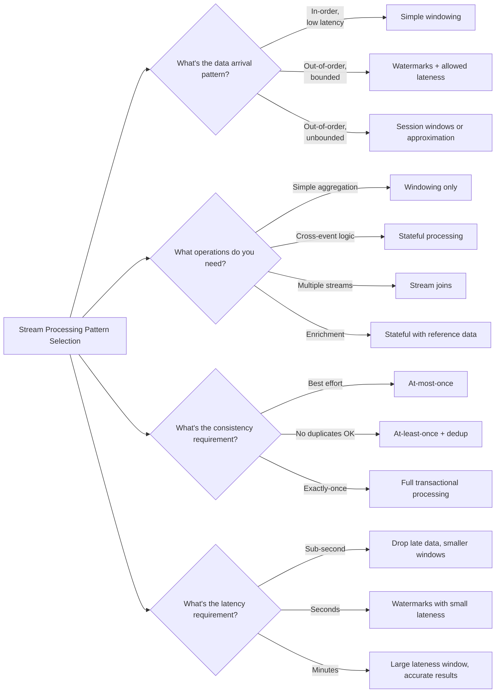

# 11. Stream Processing

> Real-time data processing with windowing, watermarks, and stateful operations

---

## ELI5: Explain Like I'm 5

<div class="learner-section" markdown>

**Your task:** After implementing stream processing patterns, explain them simply.

**Prompts to guide you:**

1. **What is stream processing in one sentence?**
    - Your answer: <span class="fill-in">[Fill in after implementation]</span>

2. **What is a window in stream processing?**
    - Your answer: <span class="fill-in">[Fill in after implementation]</span>

3. **Real-world analogy for tumbling window:**
    - Example: "A tumbling window is like counting cars that pass every 5 minutes..."
    - Your analogy: <span class="fill-in">[Fill in]</span>

4. **What are watermarks in one sentence?**
    - Your answer: <span class="fill-in">[Fill in after implementation]</span>

5. **What is the difference between event time and processing time?**
    - Your answer: <span class="fill-in">[Fill in after implementation]</span>

6. **Real-world analogy for late data handling:**
    - Example: "Late data is like receiving a postcard that was sent last week..."
    - Your analogy: <span class="fill-in">[Fill in]</span>

</div>

---

## Quick Quiz (Do BEFORE implementing)

<div class="learner-section" markdown>

**Your task:** Test your intuition about stream processing. Answer these, then verify after implementation.

### Complexity Predictions

1. **Tumbling window processing:**
    - Time complexity per event: <span class="fill-in">[Your guess: O(?)]</span>
    - Space complexity for K keys over W windows: <span class="fill-in">[Your guess: O(?)]</span>
    - Verified after learning: <span class="fill-in">[Actual]</span>

2. **Sliding window vs tumbling window:**
    - If sliding window size = 10s, slide = 2s, how many windows per event? <span class="fill-in">[Guess]</span>
    - Space overhead compared to tumbling: <span class="fill-in">[Guess: X times larger]</span>
    - Verified: <span class="fill-in">[Actual]</span>

3. **State size calculation:**
    - If you have 100K unique keys, each storing 1KB of state
    - Total memory needed: <span class="fill-in">[Calculate]</span>
    - After 1 hour with TTL = 5 minutes: <span class="fill-in">[Will it grow unbounded?]</span>

### Scenario Predictions

**Scenario 1:** Events arriving: timestamps [100, 200, 150, 300] (out of order)

- **Tumbling window (size=100ms):** Which windows do they belong to?
    - Event@100ms → Window <span class="fill-in">[0-100? 100-200?]</span>
    - Event@200ms → Window <span class="fill-in">[Fill in]</span>
    - Event@150ms → Window <span class="fill-in">[Fill in]</span>
    - Event@300ms → Window <span class="fill-in">[Fill in]</span>

- **If watermark = 250ms and allowed lateness = 50ms:**
    - Event@150ms arrives when watermark=250ms: <span class="fill-in">[Accept or Drop?]</span>
    - Event@100ms arrives when watermark=250ms: <span class="fill-in">[Accept or Drop?]</span>
    - Why? <span class="fill-in">[Fill in your reasoning]</span>

**Scenario 2:** Session window with 3-second gap

Events for user1: [1000ms, 2000ms, 3000ms, 7000ms, 8000ms]

- **How many sessions?** <span class="fill-in">[Guess]</span>
- **Session boundaries:** <span class="fill-in">[Fill in]</span>
- **If event@4500ms arrives late, what happens?** <span class="fill-in">[New session or merge?]</span>

**Scenario 3:** Processing 100K events/second

- **Without state:** Memory usage <span class="fill-in">[Constant? Growing?]</span>
- **With state (no TTL):** Memory usage <span class="fill-in">[Constant? Growing?]</span>
- **With state (TTL=5min):** Memory usage <span class="fill-in">[Constant? Growing?]</span>
- **Your reasoning:** <span class="fill-in">[Fill in]</span>

### Watermark Quiz

**Question:** Watermark = 1000ms, allowed lateness = 200ms

For a tumbling window [0-1000ms]:

- When does the window start computing? <span class="fill-in">[Fill in]</span>
- When does the window close and stop accepting data? <span class="fill-in">[Fill in]</span>
- Event@900ms arrives at processing time 1500ms: <span class="fill-in">[Accepted?]</span>
- Event@900ms arrives at processing time 1300ms: <span class="fill-in">[Accepted?]</span>

**Question:** What happens if you set allowed lateness = 0?

- Your answer: <span class="fill-in">[Fill in before implementation]</span>
- Verified answer: <span class="fill-in">[Fill in after learning]</span>

### Trade-off Quiz

**Question:** When would batch processing be BETTER than stream processing?

- Your answer: <span class="fill-in">[Fill in]</span>
- Verified: <span class="fill-in">[Fill in after implementation]</span>

**Question:** What's the MAIN trade-off of exactly-once processing?

- [ ] Uses more CPU
- [ ] Requires more memory
- [ ] Increases latency
- [ ] All of the above

Verify after implementation: <span class="fill-in">[Which one(s)?]</span>

**Question:** Event time vs Processing time

Event occurs at 10:00:00 but arrives at system at 10:00:05:

- Event time = <span class="fill-in">[Fill in]</span>
- Processing time = <span class="fill-in">[Fill in]</span>
- Which one should windowing use? <span class="fill-in">[Why?]</span>

</div>

---

## Before/After: Why Stream Processing Matters

**Your task:** Compare batch processing vs stream processing to understand the impact.

### Example: Real-Time Analytics

**Problem:** Calculate page views per minute for a website getting 10K events/second.

#### Approach 1: Batch Processing (Traditional)

```java
// Batch processing - Process accumulated data every minute
public class BatchAnalytics {

    private List<Event> eventBuffer = new ArrayList<>();

    public void collectEvent(Event event) {
        eventBuffer.add(event);
    }

    // Runs every 60 seconds
    public Map<String, Long> computePageViews() {
        Map<String, Long> counts = new HashMap<>();

        // Process all accumulated events
        for (Event event : eventBuffer) {
            counts.merge(event.page, 1L, Long::sum);
        }

        // Clear buffer for next batch
        eventBuffer.clear();

        return counts;
    }
}
```

**Analysis:**

- **Latency:** 30-60 seconds average (must wait for batch to complete)
- **Memory:** All events in 1 minute = 10K/sec × 60 = 600K events in memory
- **Throughput:** High (process all at once)
- **Real-time:** No - results delayed by up to 60 seconds
- **Use case:** Reports, ETL jobs, historical analysis

**Timeline visualization:**

```
Events:     |-------- 60 seconds of collection --------|
Processing:                                              [Compute] → Results at T+60s
User sees:                                               ↑
                                                    Results 60s old
```

#### Approach 2: Stream Processing (Real-Time)

```java
// Stream processing - Continuous windowing
public class StreamAnalytics {

    private Map<Long, Map<String, Long>> windows = new TreeMap<>();
    private long windowSize = 60_000; // 60 seconds

    public void processEvent(Event event) {
        // Immediate assignment to window
        long windowStart = (event.timestamp / windowSize) * windowSize;

        // Update count immediately
        windows.computeIfAbsent(windowStart, k -> new HashMap<>())
               .merge(event.page, 1L, Long::sum);

        // Emit results when window closes
        long currentTime = System.currentTimeMillis();
        closeCompletedWindows(currentTime);
    }

    private void closeCompletedWindows(long currentTime) {
        // Windows that ended more than watermark delay ago
        long watermark = currentTime - 5000; // 5s delay tolerance

        windows.entrySet().removeIf(entry -> {
            long windowEnd = entry.getKey() + windowSize;
            if (windowEnd < watermark) {
                emitResults(entry.getKey(), entry.getValue());
                return true; // Remove closed window
            }
            return false;
        });
    }

    private void emitResults(long windowStart, Map<String, Long> counts) {
        // Results available immediately when window closes
        System.out.println("Window [" + windowStart + "]: " + counts);
    }
}
```

**Analysis:**

- **Latency:** 5-10 seconds (watermark delay + processing)
- **Memory:** Only active windows = ~2 windows × events = ~100K events in memory
- **Throughput:** Same (10K events/second)
- **Real-time:** Yes - results within seconds
- **Use case:** Dashboards, alerting, fraud detection

**Timeline visualization:**

```
Events:     |--10s--|--10s--|--10s--|--10s--|--10s--|--10s--|
Windows:    [-------- Window 0-60s --------]
Processing:                                  ↑
Results:                                     Results at T+5s
User sees:                                   ↑
                                        Results ~5s old
```

#### Performance Comparison

| Metric                     | Batch (60s)    | Stream (Real-Time) | Improvement      |
|----------------------------|----------------|--------------------|------------------|
| **Latency to see results** | 30-60 seconds  | 5-10 seconds       | **6-10x faster** |
| **Memory (peak)**          | 600K events    | 100K events        | **6x less**      |
| **Staleness of data**      | Up to 60s old  | Up to 5s old       | **12x fresher**  |
| **Throughput**             | 10K events/sec | 10K events/sec     | Same             |

#### Real-World Impact: Fraud Detection Example

**Batch approach:**

```

10:00:00 - Fraudulent transaction occurs
10:00:05 - 3 more suspicious transactions

10:00:45 - 5 more transactions (pattern clear)
10:01:00 - Batch job runs, detects fraud

10:01:05 - Alert sent, account frozen

Total: 9 fraudulent transactions, $4,500 loss
Detection delay: 65 seconds
```

**Stream approach:**

```

10:00:00 - Fraudulent transaction occurs
10:00:05 - 3 more suspicious transactions

10:00:10 - Pattern detected (window closed at watermark)
10:00:11 - Alert sent, account frozen

Total: 4 fraudulent transactions, $2,000 loss
Detection delay: 11 seconds
```

**Impact:** Stream processing caught fraud **54 seconds faster**, preventing **$2,500 in losses**.

#### Why Does Stream Processing Win?

**Key insight to understand:**

Batch processing treats time in discrete chunks:

```
Batch 1: [0s ────────────────── 60s] → Process → Wait
Batch 2: [60s ──────────────── 120s] → Process → Wait
```

Stream processing treats time continuously:

```
Events: ─•──•─•───•──•─•──•─•──•─→ (continuous)
Windows: [─────────] [─────────]
Results:     ↑            ↑
         (immediate)  (immediate)
```

**Your calculation:**

- For 1M events/second, batch processing with 5-minute windows needs _____ GB memory
- Stream processing with 1-minute windows needs _____ GB memory
- Memory savings: <span class="fill-in">_____</span> times less

#### When Batch Processing Is Still Better

**Batch wins when:**

1. **Historical analysis:** Processing months of data
2. **Complex joins:** Multiple large datasets
3. **Cost-sensitive:** Pay per compute hour (batch cheaper)
4. **No urgency:** Daily reports, weekly summaries

**After implementing, explain in your own words:**

<div class="learner-section" markdown>

- Why does stream processing use less memory? <span class="fill-in">[Your answer]</span>
- What's the trade-off between latency and accuracy with watermarks? <span class="fill-in">[Your answer]</span>
- When would you still choose batch processing? <span class="fill-in">[Your answer]</span>

</div>

---

## Core Implementation

### Pattern 1: Windowing (Tumbling, Sliding, Session)

**Concept:** Group streaming data into finite chunks for aggregation.

**Use case:** Real-time analytics, metrics aggregation, event counting.

```java
import java.util.*;

/**
 * Stream Windowing: Group events into time-based windows
 *
 * Window Types:
 * - Tumbling: Fixed-size, non-overlapping (e.g., every 5 minutes)
 * - Sliding: Fixed-size, overlapping (e.g., last 5 minutes, updated every 1 minute)
 * - Session: Dynamic size based on inactivity gaps
 */
public class StreamWindow<K, V> {

    static class Event<K, V> {
        K key;
        V value;
        long timestamp; // Event time

        Event(K key, V value, long timestamp) {
            this.key = key;
            this.value = value;
            this.timestamp = timestamp;
        }
    }

    static class WindowResult<K> {
        K key;
        long windowStart;
        long windowEnd;
        long count;

        WindowResult(K key, long windowStart, long windowEnd, long count) {
            this.key = key;
            this.windowStart = windowStart;
            this.windowEnd = windowEnd;
            this.count = count;
        }

        @Override
        public String toString() {
            return String.format("Window[%d-%d] key=%s count=%d",
                windowStart, windowEnd, key, count);
        }
    }

    /**
     * Tumbling Window: Fixed, non-overlapping time buckets
     * Time: O(1) per event, Space: O(W*K) where W=windows, K=keys
     *
     * TODO: Implement tumbling window
     * 1. Determine which window the event belongs to
     * 2. windowStart = (timestamp / windowSize) * windowSize
     * 3. Aggregate events in the same window
     * 4. Emit results when window closes
     */
    public static <K, V> Map<Long, Map<K, Long>> tumblingWindow(
            List<Event<K, V>> events,
            long windowSizeMs) {

        Map<Long, Map<K, Long>> windows = new TreeMap<>();

        // TODO: Process each event
        //
        //     // Get or create window
        //     Map<K, Long> window = windows.computeIfAbsent(windowStart, k -> new HashMap<>());
        //
        //     // Aggregate (count in this case)
        //     window.merge(event.key, 1L, Long::sum);
        //   }

        return windows; // Replace
    }

    /**
     * Sliding Window: Overlapping windows
     * Time: O(N) per event where N=num overlapping windows, Space: O(W*K)
     *
     * TODO: Implement sliding window
     * 1. For each event, determine ALL windows it belongs to
     * 2. An event at time T belongs to windows:
     *    [T-windowSize+slide, T-windowSize+2*slide, ..., T]
     * 3. Update all overlapping windows
     */
    public static <K, V> Map<Long, Map<K, Long>> slidingWindow(
            List<Event<K, V>> events,
            long windowSizeMs,
            long slideMs) {

        Map<Long, Map<K, Long>> windows = new TreeMap<>();

        // TODO: Process each event
        //
        //     // Add event to all overlapping windows
        //     for (long windowStart = firstWindowStart;
        //          windowStart <= lastWindowStart;
        //          windowStart += slideMs) {
        //       Map<K, Long> window = windows.computeIfAbsent(windowStart, k -> new HashMap<>());
        //       window.merge(event.key, 1L, Long::sum);
        //     }
        //   }

        return windows; // Replace
    }

    /**
     * Session Window: Group events with inactivity gap
     * Time: O(log N) per event, Space: O(S*K) where S=sessions
     *
     * TODO: Implement session window
     * 1. Sort events by key and timestamp
     * 2. For each key, group events within gap threshold
     * 3. Start new session if gap > threshold
     * 4. Merge sessions if events arrive late
     */
    public static <K, V> List<WindowResult<K>> sessionWindow(
            List<Event<K, V>> events,
            long gapMs) {

        List<WindowResult<K>> results = new ArrayList<>();

        // TODO: Group events by key

        // TODO: Implement iteration/conditional logic
        //
        //     // Sort by timestamp
        //     keyEvents.sort(Comparator.comparingLong(e -> e.timestamp));
        //
        //     // Create sessions
        //     long sessionStart = keyEvents.get(0).timestamp;
        //     long lastTimestamp = sessionStart;
        //     long count = 0;
        //
        //     for (Event<K, V> event : keyEvents) {
        //       if (event.timestamp - lastTimestamp > gapMs) {
        //         // Close current session
        //         results.add(new WindowResult<>(key, sessionStart, lastTimestamp, count));
        //
        //         // Start new session
        //         sessionStart = event.timestamp;
        //         count = 0;
        //       }
        //
        //       lastTimestamp = event.timestamp;
        //       count++;
        //     }
        //
        //     // Close final session
        //     results.add(new WindowResult<>(key, sessionStart, lastTimestamp, count));
        //   }

        return results; // Replace
    }

    /**
     * Helper: Print window results
     */
    public static <K> void printWindows(Map<Long, Map<K, Long>> windows) {
        for (Map.Entry<Long, Map<K, Long>> entry : windows.entrySet()) {
            long windowStart = entry.getKey();
            System.out.println("Window [" + windowStart + "]:");
            for (Map.Entry<K, Long> keyCount : entry.getValue().entrySet()) {
                System.out.println("  " + keyCount.getKey() + ": " + keyCount.getValue());
            }
        }
    }
}
```

**Runnable Client Code:**

```java
import java.util.*;

public class StreamWindowClient {

    public static void main(String[] args) {
        System.out.println("=== Stream Windowing ===\n");

        // Create sample events (userId, action, timestamp)
        List<StreamWindow.Event<String, String>> events = Arrays.asList(
            new StreamWindow.Event<>("user1", "click", 1000L),
            new StreamWindow.Event<>("user2", "click", 2000L),
            new StreamWindow.Event<>("user1", "click", 3000L),
            new StreamWindow.Event<>("user1", "click", 6000L),
            new StreamWindow.Event<>("user2", "click", 7000L),
            new StreamWindow.Event<>("user1", "click", 11000L),
            new StreamWindow.Event<>("user2", "click", 12000L),
            new StreamWindow.Event<>("user1", "click", 15000L),
            new StreamWindow.Event<>("user2", "click", 16000L)
        );

        // Test 1: Tumbling Window (5 second windows)
        System.out.println("--- Test 1: Tumbling Window (5s) ---");
        Map<Long, Map<String, Long>> tumbling =
            StreamWindow.tumblingWindow(events, 5000L);
        StreamWindow.printWindows(tumbling);

        // Test 2: Sliding Window (5s window, 2s slide)
        System.out.println("\n--- Test 2: Sliding Window (5s window, 2s slide) ---");
        Map<Long, Map<String, Long>> sliding =
            StreamWindow.slidingWindow(events, 5000L, 2000L);
        StreamWindow.printWindows(sliding);

        // Test 3: Session Window (3s gap)
        System.out.println("\n--- Test 3: Session Window (3s gap) ---");
        List<StreamWindow.WindowResult<String>> sessions =
            StreamWindow.sessionWindow(events, 3000L);
        for (StreamWindow.WindowResult<String> result : sessions) {
            System.out.println(result);
        }

        // Test 4: Different gap threshold
        System.out.println("\n--- Test 4: Session Window (5s gap) ---");
        List<StreamWindow.WindowResult<String>> sessions2 =
            StreamWindow.sessionWindow(events, 5000L);
        for (StreamWindow.WindowResult<String> result : sessions2) {
            System.out.println(result);
        }
    }
}
```

---

### Pattern 2: Watermarks and Late Data

**Concept:** Handle out-of-order events and determine when to close windows.

**Use case:** Distributed systems, network delays, mobile data sync.

```java
import java.util.*;

/**
 * Watermarks: Track event time progress in the stream
 *
 * Watermark Properties:
 * - Monotonically increasing timestamp
 * - Indicates "all events before this time have been seen"
 * - Allows system to close windows and emit results
 * - Late data: events arriving after watermark
 */
public class WatermarkProcessor<K, V> {

    static class Event<K, V> {
        K key;
        V value;
        long eventTime;      // When event actually occurred
        long processingTime; // When event was processed

        Event(K key, V value, long eventTime, long processingTime) {
            this.key = key;
            this.value = value;
            this.eventTime = eventTime;
            this.processingTime = processingTime;
        }
    }

    static class WindowState<K> {
        K key;
        long windowStart;
        long windowEnd;
        long count;
        boolean closed;

        WindowState(K key, long windowStart, long windowEnd) {
            this.key = key;
            this.windowStart = windowStart;
            this.windowEnd = windowEnd;
            this.count = 0;
            this.closed = false;
        }
    }

    private final long windowSize;
    private final long allowedLateness;
    private long currentWatermark;

    // Active windows: windowStart -> key -> state
    private Map<Long, Map<K, WindowState<K>>> windows;

    // Late data count
    private long lateEventCount;

    public WatermarkProcessor(long windowSize, long allowedLateness) {
        this.windowSize = windowSize;
        this.allowedLateness = allowedLateness;
        this.currentWatermark = 0;
        this.windows = new TreeMap<>();
        this.lateEventCount = 0;
    }

    /**
     * Process event with watermark tracking
     * Time: O(log W) where W=windows, Space: O(W*K)
     *
     * TODO: Implement event processing with watermarks
     * 1. Update watermark based on event time
     * 2. Assign event to window
     * 3. Check if event is late (eventTime < watermark - allowedLateness)
     * 4. Close windows when watermark passes windowEnd + allowedLateness
     */
    public void processEvent(Event<K, V> event) {
        // TODO: Update watermark (typically: eventTime - maxDelay)

        // TODO: Calculate window for this event

        // TODO: Check if event is too late

        // TODO: Get or create window state

        // TODO: Update state if window not closed

        // TODO: Close windows that are ready
    }

    /**
     * Close windows that have passed watermark + allowedLateness
     * Time: O(W*K), Space: O(1)
     *
     * TODO: Implement window closing logic
     */
    private void closeCompletedWindows() {
        List<Long> toRemove = new ArrayList<>();

        // TODO: Check each window
        //
        //     // Close if watermark passed windowEnd + allowedLateness
        //     if (currentWatermark >= windowEnd + allowedLateness) {
        //       Map<K, WindowState<K>> window = entry.getValue();
        //
        //       // Emit results for each key in window
        //       for (WindowState<K> state : window.values()) {
        //         if (!state.closed) {
        //           emitResult(state);
        //           state.closed = true;
        //         }
        //       }
        //
        //       toRemove.add(windowStart);
        //     }
        //   }

        // TODO: Remove closed windows
    }

    /**
     * Emit window result (in production: send to output stream)
     */
    private void emitResult(WindowState<K> state) {
        System.out.printf("EMIT: Window[%d-%d] key=%s count=%d watermark=%d%n",
            state.windowStart, state.windowEnd, state.key, state.count, currentWatermark);
    }

    /**
     * Generate periodic watermark (for idle streams)
     * Time: O(1), Space: O(1)
     *
     * TODO: Implement periodic watermark generation
     */
    public void generatePeriodicWatermark(long timestamp) {
        // TODO: Advance watermark
    }

    /**
     * Get current watermark
     */
    public long getWatermark() {
        return currentWatermark;
    }

    /**
     * Get late event count
     */
    public long getLateEventCount() {
        return lateEventCount;
    }

    /**
     * Get active window count
     */
    public int getActiveWindowCount() {
        return windows.size();
    }
}
```

**Runnable Client Code:**

```java
import java.util.*;

public class WatermarkClient {

    public static void main(String[] args) {
        System.out.println("=== Watermarks and Late Data ===\n");

        WatermarkProcessor<String, String> processor =
            new WatermarkProcessor<>(5000L, 2000L); // 5s window, 2s late

        // Test 1: In-order events
        System.out.println("--- Test 1: In-Order Events ---");
        List<WatermarkProcessor.Event<String, String>> events1 = Arrays.asList(
            new WatermarkProcessor.Event<>("user1", "click", 1000L, 1000L),
            new WatermarkProcessor.Event<>("user1", "click", 2000L, 2000L),
            new WatermarkProcessor.Event<>("user2", "click", 3000L, 3000L)
        );

        for (WatermarkProcessor.Event<String, String> event : events1) {
            processor.processEvent(event);
        }
        System.out.println("Watermark: " + processor.getWatermark());

        // Test 2: Advance watermark to close window
        System.out.println("\n--- Test 2: Close Window ---");
        processor.generatePeriodicWatermark(8000L);
        System.out.println("Active windows: " + processor.getActiveWindowCount());

        // Test 3: Out-of-order events (within allowed lateness)
        System.out.println("\n--- Test 3: Out-of-Order (Within Lateness) ---");
        WatermarkProcessor.Event<String, String> lateEvent =
            new WatermarkProcessor.Event<>("user2", "click", 4000L, 9000L);
        processor.processEvent(lateEvent);

        // Test 4: Very late event (outside allowed lateness)
        System.out.println("\n--- Test 4: Very Late Event (Dropped) ---");
        WatermarkProcessor.Event<String, String> veryLateEvent =
            new WatermarkProcessor.Event<>("user1", "click", 500L, 10000L);
        processor.processEvent(veryLateEvent);
        System.out.println("Late event count: " + processor.getLateEventCount());

        // Test 5: Multiple windows with different keys
        System.out.println("\n--- Test 5: Multiple Windows ---");
        WatermarkProcessor<String, String> processor2 =
            new WatermarkProcessor<>(5000L, 1000L);

        List<WatermarkProcessor.Event<String, String>> events2 = Arrays.asList(
            new WatermarkProcessor.Event<>("A", "x", 1000L, 1000L),
            new WatermarkProcessor.Event<>("B", "y", 2000L, 2000L),
            new WatermarkProcessor.Event<>("A", "x", 3000L, 3000L),
            new WatermarkProcessor.Event<>("A", "x", 7000L, 7000L),
            new WatermarkProcessor.Event<>("B", "y", 8000L, 8000L)
        );

        for (WatermarkProcessor.Event<String, String> event : events2) {
            processor2.processEvent(event);
        }

        // Close all windows
        processor2.generatePeriodicWatermark(15000L);
    }
}
```

---

### Pattern 3: Stateful Stream Processing

**Concept:** Maintain state across events for aggregations, joins, and enrichment.

**Use case:** Running totals, user sessions, stream joins, enrichment.

```java
import java.util.*;

/**
 * Stateful Stream Processing
 *
 * State Types:
 * - Value State: Single value per key
 * - List State: List of values per key
 * - Map State: Nested key-value map per key
 *
 * State Backends:
 * - In-memory (fast, not fault-tolerant)
 * - RocksDB (persistent, fault-tolerant)
 */
public class StatefulProcessor<K, V> {

    static class Event<K, V> {
        K key;
        V value;
        long timestamp;

        Event(K key, V value, long timestamp) {
            this.key = key;
            this.value = value;
            this.timestamp = timestamp;
        }
    }

    static class StateDescriptor<S> {
        String name;
        Class<S> stateType;
        long ttlMs; // Time-to-live for state cleanup

        StateDescriptor(String name, Class<S> stateType, long ttlMs) {
            this.name = name;
            this.stateType = stateType;
            this.ttlMs = ttlMs;
        }
    }

    /**
     * Value State: Single value per key
     * Time: O(1), Space: O(K)
     */
    static class ValueState<K, S> {
        private Map<K, S> state;
        private Map<K, Long> lastAccess; // For TTL
        private long ttlMs;

        ValueState(long ttlMs) {
            this.state = new HashMap<>();
            this.lastAccess = new HashMap<>();
            this.ttlMs = ttlMs;
        }

        /**
         * Get state for key
         *
         * TODO: Implement get with TTL check
         * 1. Check if key exists
         * 2. Check if state expired (current time - lastAccess > ttl)
         * 3. If expired, remove and return null
         * 4. Otherwise return value
         */
        public S get(K key, long currentTime) {
            // TODO: Check expiration
            return null; // Replace
        }

        /**
         * Update state for key
         *
         * TODO: Implement update with TTL tracking
         */
        public void update(K key, S value, long currentTime) {
            // TODO: Update state and last access time
        }

        /**
         * Clear state for key
         */
        public void clear(K key) {
            state.remove(key);
            lastAccess.remove(key);
        }
    }

    /**
     * List State: Append-only list per key
     * Time: O(1) append, O(N) iterate, Space: O(K*N)
     */
    static class ListState<K, S> {
        private Map<K, List<S>> state;
        private Map<K, Long> lastAccess;
        private long ttlMs;

        ListState(long ttlMs) {
            this.state = new HashMap<>();
            this.lastAccess = new HashMap<>();
            this.ttlMs = ttlMs;
        }

        /**
         * Append value to list
         *
         * TODO: Implement append
         */
        public void append(K key, S value, long currentTime) {
            // TODO: Get or create list and append
        }

        /**
         * Get all values for key
         *
         * TODO: Implement get with TTL check
         */
        public List<S> get(K key, long currentTime) {
            // TODO: Check expiration similar to ValueState
            return new ArrayList<>(); // Replace
        }
    }

    /**
     * Example: Running sum aggregation
     * Time: O(1) per event, Space: O(K)
     *
     * TODO: Implement stateful aggregation
     */
    public static class RunningSumProcessor {
        private ValueState<String, Long> sumState;

        public RunningSumProcessor(long ttlMs) {
            this.sumState = new ValueState<>(ttlMs);
        }

        /**
         * Process event and update running sum
         *
         * TODO: Implement running sum
         * 1. Get current sum for key
         * 2. Add new value
         * 3. Update state
         * 4. Return new sum
         */
        public long process(Event<String, Long> event) {
            // TODO: Get current sum

            // TODO: Add new value

            // TODO: Update state

            // TODO: Return result

            return 0L; // Replace
        }

        public Long getCurrentSum(String key, long timestamp) {
            return sumState.get(key, timestamp);
        }
    }

    /**
     * Example: Stream-Stream Join
     * Time: O(1) per event, Space: O(K*W) where W=window size
     *
     * TODO: Implement stream join
     */
    public static class StreamJoinProcessor {
        private ListState<String, Event<String, String>> leftState;
        private ListState<String, Event<String, String>> rightState;
        private long joinWindowMs;

        public StreamJoinProcessor(long joinWindowMs, long stateTtl) {
            this.leftState = new ListState<>(stateTtl);
            this.rightState = new ListState<>(stateTtl);
            this.joinWindowMs = joinWindowMs;
        }

        /**
         * Process left stream event
         *
         * TODO: Implement left stream processing
         * 1. Store event in left state
         * 2. Look for matching events in right state within join window
         * 3. Emit joined results
         */
        public List<String> processLeft(Event<String, String> event) {
            List<String> results = new ArrayList<>();

            // TODO: Store in left state

            // TODO: Find matches in right state

            return results; // Replace
        }

        /**
         * Process right stream event
         *
         * TODO: Implement right stream processing (symmetric to left)
         */
        public List<String> processRight(Event<String, String> event) {
            List<String> results = new ArrayList<>();

            // TODO: Similar to processLeft but reversed

            return results; // Replace
        }
    }

    /**
     * State cleanup: Remove expired state
     * Time: O(K), Space: O(1)
     *
     * TODO: Implement periodic state cleanup
     */
    public static void cleanupExpiredState(ValueState<?, ?> state, long currentTime) {
        // TODO: Iterate through all keys and remove expired entries
        // In production: RocksDB handles this with compaction
    }
}
```

**Runnable Client Code:**

```java
import java.util.*;

public class StatefulProcessorClient {

    public static void main(String[] args) {
        System.out.println("=== Stateful Stream Processing ===\n");

        // Test 1: Running sum
        System.out.println("--- Test 1: Running Sum ---");
        StatefulProcessor.RunningSumProcessor sumProcessor =
            new StatefulProcessor.RunningSumProcessor(10000L);

        List<StatefulProcessor.Event<String, Long>> sumEvents = Arrays.asList(
            new StatefulProcessor.Event<>("user1", 10L, 1000L),
            new StatefulProcessor.Event<>("user1", 20L, 2000L),
            new StatefulProcessor.Event<>("user2", 5L, 2500L),
            new StatefulProcessor.Event<>("user1", 15L, 3000L),
            new StatefulProcessor.Event<>("user2", 10L, 3500L)
        );

        for (StatefulProcessor.Event<String, Long> event : sumEvents) {
            long sum = sumProcessor.process(event);
            System.out.printf("Key=%s Value=%d RunningSum=%d%n",
                event.key, event.value, sum);
        }

        // Test 2: Stream join
        System.out.println("\n--- Test 2: Stream Join ---");
        StatefulProcessor.StreamJoinProcessor joinProcessor =
            new StatefulProcessor.StreamJoinProcessor(2000L, 10000L);

        // Left stream events
        System.out.println("Processing left stream:");
        StatefulProcessor.Event<String, String> left1 =
            new StatefulProcessor.Event<>("order1", "LeftA", 1000L);
        List<String> joined1 = joinProcessor.processLeft(left1);
        System.out.println("  " + left1.key + ": " + joined1);

        // Right stream events
        System.out.println("Processing right stream:");
        StatefulProcessor.Event<String, String> right1 =
            new StatefulProcessor.Event<>("order1", "RightX", 1500L);
        List<String> joined2 = joinProcessor.processRight(right1);
        System.out.println("  " + right1.key + ": " + joined2);

        // More events
        StatefulProcessor.Event<String, String> left2 =
            new StatefulProcessor.Event<>("order2", "LeftB", 2000L);
        List<String> joined3 = joinProcessor.processLeft(left2);
        System.out.println("  " + left2.key + ": " + joined3);

        // Test 3: State TTL
        System.out.println("\n--- Test 3: State TTL ---");
        StatefulProcessor.ValueState<String, String> ttlState =
            new StatefulProcessor.ValueState<>(2000L); // 2s TTL

        ttlState.update("key1", "value1", 1000L);
        System.out.println("Stored at t=1000");

        String val1 = ttlState.get("key1", 2000L);
        System.out.println("Get at t=2000: " + val1); // Should exist

        String val2 = ttlState.get("key1", 4000L);
        System.out.println("Get at t=4000: " + val2); // Should be expired

        // Test 4: List state
        System.out.println("\n--- Test 4: List State ---");
        StatefulProcessor.ListState<String, String> listState =
            new StatefulProcessor.ListState<>(10000L);

        listState.append("user1", "event1", 1000L);
        listState.append("user1", "event2", 2000L);
        listState.append("user1", "event3", 3000L);

        List<String> events = listState.get("user1", 3500L);
        System.out.println("Events for user1: " + events);
    }
}
```

---

### Pattern 4: Exactly-Once Semantics

**Concept:** Ensure each event is processed exactly once, even with failures.

**Use case:** Financial transactions, billing, critical business logic.

```java
import java.util.*;

/**
 * Exactly-Once Processing
 *
 * Techniques:
 * - Idempotent operations (safe to retry)
 * - Two-phase commit for sinks
 * - Transaction markers in stream
 * - Deduplication with state
 */
public class ExactlyOnceProcessor<K, V> {

    static class Event<K, V> {
        String eventId; // Unique ID for deduplication
        K key;
        V value;
        long timestamp;

        Event(String eventId, K key, V value, long timestamp) {
            this.eventId = eventId;
            this.key = key;
            this.value = value;
            this.timestamp = timestamp;
        }
    }

    static class Transaction {
        String transactionId;
        long timestamp;
        List<String> processedEventIds;
        boolean committed;

        Transaction(String transactionId, long timestamp) {
            this.transactionId = transactionId;
            this.timestamp = timestamp;
            this.processedEventIds = new ArrayList<>();
            this.committed = false;
        }
    }

    /**
     * Deduplication State: Track processed events
     * Time: O(1) per check, Space: O(N) where N=events in window
     */
    static class DeduplicationState {
        private Set<String> processedEventIds;
        private long oldestEventTime;
        private long retentionMs;

        DeduplicationState(long retentionMs) {
            this.processedEventIds = new HashSet<>();
            this.retentionMs = retentionMs;
            this.oldestEventTime = Long.MAX_VALUE;
        }

        /**
         * Check if event already processed
         *
         * TODO: Implement deduplication check
         * 1. Check if eventId exists in set
         * 2. If yes, return true (duplicate)
         * 3. If no, add to set and return false
         */
        public boolean isDuplicate(String eventId) {
            // TODO: Check and add

            return false; // Replace
        }

        /**
         * Cleanup old event IDs
         *
         * TODO: Implement periodic cleanup
         * In production: use time-based eviction or Bloom filter
         */
        public void cleanup(long currentTime) {
            // TODO: Remove event IDs older than retention period
            // Simplified: in reality need timestamps per event
            if (currentTime - oldestEventTime > retentionMs) {
                processedEventIds.clear();
                oldestEventTime = currentTime;
            }
        }

        public int size() {
            return processedEventIds.size();
        }
    }

    /**
     * Idempotent Aggregator: Safe to process same event multiple times
     * Time: O(1) per event, Space: O(K)
     *
     * TODO: Implement idempotent aggregation
     */
    static class IdempotentAggregator<K> {
        // Store: key -> (value, eventId)
        private Map<K, Long> values;
        private Map<K, String> lastEventIds;

        IdempotentAggregator() {
            this.values = new HashMap<>();
            this.lastEventIds = new HashMap<>();
        }

        /**
         * Process event idempotently
         *
         * TODO: Implement idempotent update
         * 1. Check if this exact event was already processed
         * 2. If same eventId, skip (idempotent)
         * 3. If new eventId, update value
         */
        public void process(Event<K, Long> event) {
            // TODO: Check if already processed

            // TODO: Update value (idempotent SET operation)
        }

        public Long getValue(K key) {
            return values.get(key);
        }
    }

    /**
     * Two-Phase Commit Sink: Transactional output
     * Time: O(1) per event, O(N) per commit
     *
     * TODO: Implement 2PC for sink
     */
    static class TransactionalSink<T> {
        private Transaction currentTransaction;
        private List<T> pendingWrites;
        private Set<String> committedTransactions;

        TransactionalSink() {
            this.pendingWrites = new ArrayList<>();
            this.committedTransactions = new HashSet<>();
        }

        /**
         * Begin new transaction
         *
         * TODO: Implement transaction begin
         */
        public void beginTransaction(String txnId) {
            // TODO: Create new transaction
        }

        /**
         * Write to transaction (not committed yet)
         *
         * TODO: Implement transactional write
         */
        public void write(T value, String eventId) {
            // TODO: Add to pending writes
        }

        /**
         * Commit transaction (make writes visible)
         *
         * TODO: Implement commit
         * 1. Check if transaction already committed (idempotent)
         * 2. Flush all pending writes
         * 3. Mark transaction as committed
         */
        public void commit() {
            // TODO: Commit if not already done
            //
            //   if (committedTransactions.contains(currentTransaction.transactionId)) {
            //     // Already committed (idempotent)
            //     return;
            //   }
            //
            //   // Flush writes (in production: write to external system)
            //   System.out.println("COMMIT: " + pendingWrites.size() + " writes");
            //
            //   // Mark as committed
            //   committedTransactions.add(currentTransaction.transactionId);
            //   currentTransaction.committed = true;
        }

        /**
         * Abort transaction (discard writes)
         *
         * TODO: Implement abort
         */
        public void abort() {
            // TODO: Clear pending writes
        }

        public int getPendingCount() {
            return pendingWrites.size();
        }
    }

    /**
     * Checkpoint coordinator: Manage checkpoints for fault tolerance
     * Time: O(S) where S=state size, Space: O(S)
     *
     * TODO: Implement checkpointing
     */
    static class CheckpointCoordinator {
        private long lastCheckpointId;
        private Map<Long, Map<String, Object>> checkpoints;

        CheckpointCoordinator() {
            this.lastCheckpointId = 0;
            this.checkpoints = new HashMap<>();
        }

        /**
         * Trigger checkpoint
         *
         * TODO: Implement checkpoint trigger
         * 1. Generate checkpoint ID
         * 2. Snapshot all state
         * 3. Store checkpoint
         * 4. Return checkpoint ID
         */
        public long triggerCheckpoint(Map<String, Object> state) {
            // TODO: Create checkpoint

            return 0; // Replace
        }

        /**
         * Restore from checkpoint
         *
         * TODO: Implement restore
         */
        public Map<String, Object> restore(long checkpointId) {
            // TODO: Restore state
            return null; // Replace
        }
    }
}
```

**Runnable Client Code:**

```java
import java.util.*;

public class ExactlyOnceClient {

    public static void main(String[] args) {
        System.out.println("=== Exactly-Once Processing ===\n");

        // Test 1: Deduplication
        System.out.println("--- Test 1: Deduplication ---");
        ExactlyOnceProcessor.DeduplicationState dedup =
            new ExactlyOnceProcessor.DeduplicationState(10000L);

        String[] eventIds = {"evt1", "evt2", "evt1", "evt3", "evt2"};
        for (String id : eventIds) {
            boolean isDup = dedup.isDuplicate(id);
            System.out.println("Event " + id + ": " +
                (isDup ? "DUPLICATE" : "NEW"));
        }
        System.out.println("Unique events tracked: " + dedup.size());

        // Test 2: Idempotent aggregation
        System.out.println("\n--- Test 2: Idempotent Operations ---");
        ExactlyOnceProcessor.IdempotentAggregator<String> aggregator =
            new ExactlyOnceProcessor.IdempotentAggregator<>();

        List<ExactlyOnceProcessor.Event<String, Long>> events = Arrays.asList(
            new ExactlyOnceProcessor.Event<>("e1", "user1", 100L, 1000L),
            new ExactlyOnceProcessor.Event<>("e2", "user1", 200L, 2000L),
            new ExactlyOnceProcessor.Event<>("e1", "user1", 100L, 2500L), // Duplicate
            new ExactlyOnceProcessor.Event<>("e3", "user2", 50L, 3000L)
        );

        for (ExactlyOnceProcessor.Event<String, Long> event : events) {
            System.out.println("Processing: " + event.eventId);
            aggregator.process(event);
            System.out.println("  user1: " + aggregator.getValue("user1"));
            System.out.println("  user2: " + aggregator.getValue("user2"));
        }

        // Test 3: Transactional sink
        System.out.println("\n--- Test 3: Transactional Sink ---");
        ExactlyOnceProcessor.TransactionalSink<String> sink =
            new ExactlyOnceProcessor.TransactionalSink<>();

        // Transaction 1
        sink.beginTransaction("txn1");
        sink.write("value1", "e1");
        sink.write("value2", "e2");
        System.out.println("Pending writes: " + sink.getPendingCount());
        sink.commit();

        // Transaction 2 (with abort)
        sink.beginTransaction("txn2");
        sink.write("value3", "e3");
        System.out.println("Pending writes: " + sink.getPendingCount());
        sink.abort();
        System.out.println("After abort: " + sink.getPendingCount());

        // Test 4: Checkpointing
        System.out.println("\n--- Test 4: Checkpointing ---");
        ExactlyOnceProcessor.CheckpointCoordinator coordinator =
            new ExactlyOnceProcessor.CheckpointCoordinator();

        Map<String, Object> state1 = new HashMap<>();
        state1.put("counter", 100);
        state1.put("sum", 500L);

        long cp1 = coordinator.triggerCheckpoint(state1);
        System.out.println("Created checkpoint: " + cp1);

        // Modify state
        state1.put("counter", 200);
        long cp2 = coordinator.triggerCheckpoint(state1);
        System.out.println("Created checkpoint: " + cp2);

        // Restore
        Map<String, Object> restored = coordinator.restore(cp1);
        System.out.println("Restored state: " + restored);
    }
}
```

---

## Debugging Challenges

**Your task:** Find and fix bugs in broken stream processing implementations. This tests your understanding.

### Challenge 1: Broken Tumbling Window

```java
/**
 * This tumbling window implementation has 2 BUGS.
 * It's supposed to count events per key per window.
 */
public static Map<Long, Map<String, Long>> tumblingWindow_Buggy(
        List<Event<String, String>> events,
        long windowSize) {

    Map<Long, Map<String, Long>> windows = new TreeMap<>();

    for (Event<String, String> event : events) {
        long windowStart = event.timestamp / windowSize;

        Map<String, Long> window = windows.computeIfAbsent(windowStart, k -> new HashMap<>());

        window.put(event.key, 1L);
    }

    return windows;
}
```

**Your debugging:**

- Bug 1: <span class="fill-in">[What\'s the bug?]</span>
    - Current output: <span class="fill-in">[What windows?]</span>
    - Expected output: <span class="fill-in">[What windows?]</span>

- Bug 2: <span class="fill-in">[What\'s the bug?]</span>
    - Current count: <span class="fill-in">[What do you get?]</span>
    - Expected count: <span class="fill-in">[Should be?]</span>

<details markdown>
<summary>Click to verify your answers</summary>

**Bug 1:** Window start should be `(event.timestamp / windowSize) * windowSize` to align to window boundaries.

- Current: windowStart = 1500 / 1000 = 1 (wrong - just the window index)
- Fixed: windowStart = (1500 / 1000) * 1000 = 1000 (correct - actual timestamp)

**Bug 2:** Using `put` overwrites the count instead of incrementing it.

```java
// Wrong: Always sets count to 1
window.put(event.key, 1L);

// Correct: Increment existing count or start at 1
window.merge(event.key, 1L, Long::sum);
```

</details>

---

### Challenge 2: Watermark Calculation Bug

```java
/**
 * This watermark processor has CRITICAL BUGS with late data handling.
 * Test with: Event@100ms arrives when watermark=300ms, allowedLateness=50ms
 */
public void processEvent_Buggy(Event<String, String> event) {
    // Update watermark
    if (event.eventTime > currentWatermark) {
        currentWatermark = event.eventTime;
    }

    // Calculate window
    long windowStart = (event.eventTime / windowSize) * windowSize;
    long windowEnd = windowStart + windowSize;

    if (event.eventTime < currentWatermark) {
        System.out.println("LATE DATA: " + event.key);
        lateEventCount++;
        return; // Drop event
    }

    if (currentWatermark > windowEnd) {
        // Window already closed, don't accept event
        return;
    }

    // Add to window
    Map<String, WindowState<String>> window = windows.computeIfAbsent(windowStart, k -> new HashMap<>());
    WindowState<String> state = window.computeIfAbsent(event.key,
        k -> new WindowState<>(event.key, windowStart, windowEnd));

    state.count++;
}
```

**Your debugging:**

**Bug 1: Late data check**

- **Problem:** <span class="fill-in">[What's wrong with the late data check?]</span>
- **Scenario:** Event@100ms, watermark=300ms, allowedLateness=50ms
    - Should be: <span class="fill-in">[Accepted or Dropped?]</span>
    - Currently: <span class="fill-in">[What happens?]</span>
- **Fix:** <span class="fill-in">[Correct condition?]</span>

**Bug 2: Window closing**

- **Problem:** <span class="fill-in">[What's wrong with window closing logic?]</span>
- **Scenario:** Event@250ms, windowEnd=300ms, watermark=310ms, allowedLateness=50ms
    - Should be: <span class="fill-in">[Accepted or Dropped?]</span>
    - Currently: <span class="fill-in">[What happens?]</span>
- **Fix:** <span class="fill-in">[How to properly check if window is still open?]</span>

**Test trace:**

```
Window [0-1000ms], allowedLateness=200ms

- Event@900ms arrives, watermark=900ms → ?
- Event@800ms arrives, watermark=1100ms → ?
- Event@800ms arrives, watermark=1300ms → ?
```

Your predictions: <span class="fill-in">[Fill in for each event]</span>

<details markdown>
<summary>Click to verify your answers</summary>

**Bug 1:** Late data check doesn't account for allowed lateness.

```java
// Wrong: Drops ANY late event
if (event.eventTime < currentWatermark) {
    return;
}

// Correct: Only drop if REALLY late
if (event.eventTime < currentWatermark - allowedLateness) {
    System.out.println("LATE DATA: " + event.key);
    lateEventCount++;
    return;
}
```

**Bug 2:** Window closing doesn't account for allowed lateness.

```java
// Wrong: Closes window as soon as watermark passes windowEnd
if (currentWatermark > windowEnd) {
    return;
}

// Correct: Keep window open for allowed lateness period
if (currentWatermark >= windowEnd + allowedLateness) {
    // Window truly closed now
    return;
}
```

**Test trace answers:**

- Event@900ms, watermark=900ms → Accepted (in window, on time)
- Event@800ms, watermark=1100ms → Accepted (late but within 200ms)
- Event@800ms, watermark=1300ms → Dropped (too late: 1300 - 800 = 500ms > 200ms)

</details>

---

### Challenge 3: State Management Memory Leak

```java
/**
 * This stateful processor has a MEMORY LEAK.
 * State grows unbounded even with TTL configured!
 */
public class ValueState_Buggy<K, S> {
    private Map<K, S> state = new HashMap<>();
    private Map<K, Long> lastAccess = new HashMap<>();
    private long ttlMs;

    ValueState_Buggy(long ttlMs) {
        this.ttlMs = ttlMs;
    }

    public S get(K key, long currentTime) {
        if (state.containsKey(key)) {
            Long lastTime = lastAccess.get(key);
            if (currentTime - lastTime > ttlMs) {
                // State expired, return null
                return null;            }
            return state.get(key);
        }
        return null;
    }

    public void update(K key, S value, long currentTime) {
        state.put(key, value);
        lastAccess.put(key, currentTime);
    }
}
```

**Your debugging:**

**Memory leak scenario:**

- Process 1M unique keys over 1 hour
- TTL = 5 minutes
- Expected memory: <span class="fill-in">[How many keys should remain?]</span>
- Actual memory: <span class="fill-in">[What happens?]</span>

**Bug location:** <span class="fill-in">[Which method and line?]</span>

**Bug explanation:** <span class="fill-in">[Why does state grow unbounded?]</span>

**Bug fix:** <span class="fill-in">[What code is missing?]</span>

**Performance impact:**

- After 1 hour: <span class="fill-in">[How many expired keys still in memory?]</span>
- Memory waste: <span class="fill-in">[Calculate]</span>
- Performance degradation: <span class="fill-in">[Why does this hurt performance?]</span>

<details markdown>
<summary>Click to verify your answer</summary>

**Bug:** When state expires, we return `null` but never remove the expired entries from the maps.

```java
// Wrong: Returns null but leaves garbage in memory
if (currentTime - lastTime > ttlMs) {
    return null;  // Memory leak!
}

// Correct: Clean up expired state
if (currentTime - lastTime > ttlMs) {
    // Remove expired state
    state.remove(key);
    lastAccess.remove(key);
    return null;
}
```

**Performance impact:**

- After 1 hour with 1M unique keys and TTL=5min:
    - Expected: ~100K keys (5min worth at constant rate)
    - Actual: 1M keys (ALL keys ever seen)
    - Memory waste: 900K entries × (state size + 2 map entries)
    - HashMap performance degrades with size (more collisions, slower lookups)

</details>

---

### Challenge 4: Window Boundary Bug

```java
/**
 * Session window merger has a SUBTLE BUG.
 * Sometimes creates gaps, sometimes creates wrong sessions.
 */
public static List<WindowResult<String>> sessionWindow_Buggy(
        List<Event<String, String>> events,
        long gapMs) {

    List<WindowResult<String>> results = new ArrayList<>();
    Map<String, List<Event<String, String>>> eventsByKey = new HashMap<>();

    // Group by key
    for (Event<String, String> event : events) {
        eventsByKey.computeIfAbsent(event.key, k -> new ArrayList<>()).add(event);
    }

    // Create sessions per key
    for (Map.Entry<String, List<Event<String, String>>> entry : eventsByKey.entrySet()) {
        String key = entry.getKey();
        List<Event<String, String>> keyEvents = entry.getValue();

        // keyEvents.sort(Comparator.comparingLong(e -> e.timestamp));

        long sessionStart = keyEvents.get(0).timestamp;
        long lastTimestamp = sessionStart;
        long count = 0;

        for (Event<String, String> event : keyEvents) {
            if (event.timestamp - lastTimestamp >= gapMs) {
                // Close current session
                results.add(new WindowResult<>(key, sessionStart, lastTimestamp, count));

                // Start new session
                sessionStart = event.timestamp;
                count = 0;
            }

            lastTimestamp = event.timestamp;
            count++;
        }

        // Close final session
        results.add(new WindowResult<>(key, sessionStart, lastTimestamp, count));
    }

    return results;
}
```

**Your debugging:**

**Bug 1: Missing sort**

- **Scenario:** Events arrive [3000ms, 1000ms, 2000ms], gap=1000ms
- **Expected sessions:** <span class="fill-in">[Fill in after sorting]</span>
- **Actual sessions:** <span class="fill-in">[What do you get without sorting?]</span>
- **Why is this wrong?** <span class="fill-in">[Explain]</span>

**Bug 2: Gap boundary condition**

- **Scenario:** Events at [0ms, 1000ms, 2000ms], gap=1000ms
- **Current logic:** gap check uses `>=`
    - Event@1000ms: gap = 1000 - 0 = 1000ms → <span class="fill-in">[New session or same?]</span>
    - Event@2000ms: gap = 2000 - 1000 = 1000ms → <span class="fill-in">[New session or same?]</span>
- **Is this correct?** <span class="fill-in">[Should gap of exactly 1000ms create new session?]</span>
- **Fix:** <span class="fill-in">[Use > or >=?]</span>

**Bug 3: Edge case - Empty events**

- **What happens if keyEvents is empty?** <span class="fill-in">[Will it crash?]</span>
- **Fix:** <span class="fill-in">[Add what check?]</span>

<details markdown>
<summary>Click to verify your answers</summary>

**Bug 1: Missing sort**

```java
// Without sort: [3000, 1000, 2000]
// Session 1: [3000], Session 2: [1000], Session 3: [2000]
// Wrong! Events are scattered across sessions

// With sort: [1000, 2000, 3000]
// Session 1: [1000, 2000, 3000] (all within gap)
// Correct!

// Fix: ALWAYS sort by timestamp
keyEvents.sort(Comparator.comparingLong(e -> e.timestamp));
```

**Bug 2: Gap boundary**

```java
// Question: Is 1000ms gap exactly equal to gapMs=1000ms a new session?
// Typically: gap GREATER THAN threshold → new session
// At exactly the gap threshold → still same session

// Wrong: >= creates new session at boundary
if (event.timestamp - lastTimestamp >= gapMs) {

// Correct: > allows events exactly at gap boundary
if (event.timestamp - lastTimestamp > gapMs) {
```

**Bug 3: Empty list**

```java
// Add check before accessing keyEvents.get(0)
if (keyEvents.isEmpty()) {
    continue;
}
```

</details>

---

### Challenge 5: Stream Join Race Condition

```java
/**
 * Stream join has a RACE CONDITION and MEMORY ISSUE.
 */
public List<String> processLeft_Buggy(Event<String, String> event) {
    List<String> results = new ArrayList<>();

    List<Event<String, String>> rightEvents = rightState.get(event.key, event.timestamp);

    if (rightEvents != null) {
        for (Event<String, String> right : rightEvents) {
            // Join window check
            if (Math.abs(event.timestamp - right.timestamp) <= joinWindowMs) {
                results.add(event.value + "+" + right.value);
            }
        }
    }

    leftState.append(event.key, event, event.timestamp);

    return results;
}
```

**Your debugging:**

**Bug: Join order matters**

- **Scenario:**
    - Left event L1 arrives at T=0
    - Right event R1 arrives at T=1 (within join window)
- **Expected:** L1+R1 joined
- **What happens?**
    - processLeft(L1): Looks in rightState, empty, no match → stores L1
    - processRight(R1): Looks in leftState, finds L1, match! → stores R1
    - **Problem:** <span class="fill-in">[Is this symmetric? Do we emit join twice or once?]</span>

- **Scenario 2:**
    - Right event R1 arrives first at T=0
    - Left event L1 arrives at T=1
- **What happens?**
    - processRight(R1): Looks in leftState, empty, no match → stores R1
    - processLeft(L1): Looks in rightState, finds R1, match! → stores L1
    - **Problem:** <span class="fill-in">[Same or different from scenario 1?]</span>

**Question:** Should the join be emitted by processLeft, processRight, or both?

Your answer: <span class="fill-in">[Fill in]</span>

**Memory issue:**

- **Without TTL on state, what happens?** <span class="fill-in">[Fill in]</span>
- **With join window = 5 seconds, what TTL should you use?** <span class="fill-in">[Fill in]</span>

<details markdown>
<summary>Click to verify your answers</summary>

**Bug explanation:**
The current code stores left events AFTER checking right state. This is fine, but the symmetric operation in
`processRight` must also store right events AFTER checking left state. The join will be emitted only once (either by
left or right, whichever processes second).

**Correct pattern:** Store BEFORE matching (then match both directions):

```java
// CORRECT: Store first, then match
leftState.append(event.key, event, event.timestamp);

// Then look for matches in right state
List<Event<String, String>> rightEvents = rightState.get(event.key, event.timestamp);
// ... matching logic ...
```

This ensures both sides can find each other. The join will be emitted by whichever event arrives second.

**Memory issue:**

- Without TTL: All events stay in state forever → memory leak
- With join window = 5s: Set TTL = 2 × join window = 10s (safety margin)
- Why 2×? Events might arrive late, need extra retention

</details>

---

### Your Debugging Scorecard

After finding and fixing all bugs:

- [ ] Found all window calculation bugs
- [ ] Understood watermark and late data handling
- [ ] Fixed memory leaks in state management
- [ ] Corrected session window boundary issues
- [ ] Resolved stream join race conditions
- [ ] Learned common stream processing mistakes

**Common mistakes you discovered:**

1. <span class="fill-in">[List the patterns - e.g., "Not accounting for allowed lateness"]</span>
2. <span class="fill-in">[Fill in]</span>
3. <span class="fill-in">[Fill in]</span>
4. <span class="fill-in">[Fill in]</span>

**Prevention checklist:**

- [ ] Always align windows to proper boundaries
- [ ] Always check: eventTime vs (watermark - allowedLateness)
- [ ] Always remove expired state in TTL checks
- [ ] Always sort events by timestamp for session windows
- [ ] Always set TTL for stateful joins
- [ ] Always test with out-of-order events

---

## Decision Framework

**Your task:** Build decision trees for when to use each stream processing pattern.

### Question 1: What type of windowing do you need?

Answer after implementation:

**Use Tumbling Window when:**

- Fixed time boundaries: <span class="fill-in">[Every hour, every day]</span>
- Non-overlapping: <span class="fill-in">[Each event in exactly one window]</span>
- Simple aggregation: <span class="fill-in">[Count, sum per time period]</span>
- Example: <span class="fill-in">[Hourly sales reports, daily active users]</span>

**Use Sliding Window when:**

- Moving average: <span class="fill-in">[Last N minutes]</span>
- Overlapping periods: <span class="fill-in">[Need smooth transitions]</span>
- Real-time dashboards: <span class="fill-in">[Updated frequently]</span>
- Example: <span class="fill-in">[5-minute average updated every 30 seconds]</span>

**Use Session Window when:**

- User activity: <span class="fill-in">[Group by engagement sessions]</span>
- Variable length: <span class="fill-in">[Based on inactivity]</span>
- Burst detection: <span class="fill-in">[Cluster related events]</span>
- Example: <span class="fill-in">[User browsing sessions, click streams]</span>

### Question 2: How do you handle late data?

**Use Watermarks when:**

- Bounded lateness: <span class="fill-in">[Most events arrive within X seconds]</span>
- Completeness needed: <span class="fill-in">[Want accurate results]</span>
- Can tolerate delay: <span class="fill-in">[Results can wait for late data]</span>

**Allow Lateness when:**

- Some late arrivals: <span class="fill-in">[Network delays, mobile sync]</span>
- Update results: <span class="fill-in">[Can emit corrections]</span>
- Balance accuracy/latency: <span class="fill-in">[Wait a bit, not forever]</span>

**Drop Late Data when:**

- Strict latency: <span class="fill-in">[Need real-time results]</span>
- Rare late arrivals: <span class="fill-in">[< 1% of events]</span>
- Approximate OK: <span class="fill-in">[Metrics, dashboards]</span>

### Question 3: Do you need state?

**Stateless processing when:**

- Pure transformations: <span class="fill-in">[map, filter]</span>
- No aggregation: <span class="fill-in">[Just routing events]</span>
- No joins: <span class="fill-in">[Single stream]</span>
- Maximum throughput: <span class="fill-in">[No state overhead]</span>

**Stateful processing when:**

- Aggregations: <span class="fill-in">[count, sum, average]</span>
- Joins: <span class="fill-in">[Combine multiple streams]</span>
- Enrichment: <span class="fill-in">[Add reference data]</span>
- Session tracking: <span class="fill-in">[User state across events]</span>

### Question 4: What consistency level?

**At-most-once when:**

- Monitoring/Metrics: <span class="fill-in">[Losing some data OK]</span>
- Maximum throughput: <span class="fill-in">[No overhead]</span>
- Non-critical: <span class="fill-in">[Dashboards, alerts]</span>

**At-least-once when:**

- Idempotent operations: <span class="fill-in">[Safe to retry]</span>
- Can deduplicate: <span class="fill-in">[Downstream handles duplicates]</span>
- Good balance: <span class="fill-in">[Performance + reliability]</span>

**Exactly-once when:**

- Financial: <span class="fill-in">[Money, billing, payments]</span>
- Critical business logic: <span class="fill-in">[Inventory, orders]</span>
- Compliance: <span class="fill-in">[Audit trails]</span>

### Your Decision Tree

Build this after solving practice scenarios:



---

## Practice

### Scenario 1: Real-Time Analytics Dashboard

**Requirements:**

- Track page views per minute (updated every 10 seconds)
- Show top pages in last 5 minutes
- Handle 100K events/second
- Mobile apps may sync late data (up to 30s delay)
- Display updated immediately

**Your design:**

Windowing strategy: <span class="fill-in">[Tumbling, Sliding, or Session?]</span>

Reasoning:

- Window type: <span class="fill-in">[Fill in]</span>
- Window size: <span class="fill-in">[Fill in]</span>
- Slide interval: <span class="fill-in">[Fill in]</span>
- Why this choice: <span class="fill-in">[Fill in]</span>

Late data handling: <span class="fill-in">[How to handle 30s delayed mobile events?]</span>

- Watermark strategy: <span class="fill-in">[Fill in]</span>
- Allowed lateness: <span class="fill-in">[Fill in]</span>
- Trade-offs: <span class="fill-in">[Fill in]</span>

State requirements: <span class="fill-in">[What state do you need?]</span>

- Per-key state: <span class="fill-in">[Fill in]</span>
- State backend: <span class="fill-in">[In-memory or RocksDB?]</span>
- TTL: <span class="fill-in">[Fill in]</span>

### Scenario 2: Fraud Detection System

**Requirements:**

- Detect suspicious patterns in real-time
- Multiple failed logins within 1 minute
- Transactions from different countries < 10 minutes apart
- Must detect within 2 seconds of last event
- No false negatives (can't miss fraud)

**Your design:**

Pattern detection: <span class="fill-in">[How to detect patterns across events?]</span>

- Windowing: <span class="fill-in">[Fill in]</span>
- State needed: <span class="fill-in">[Fill in]</span>
- Join strategy: <span class="fill-in">[Fill in]</span>

Consistency: <span class="fill-in">[At-most-once, at-least-once, or exactly-once?]</span>

- Choice: <span class="fill-in">[Fill in]</span>
- Why: <span class="fill-in">[Fill in]</span>
- Implementation: <span class="fill-in">[Deduplication? Transactions?]</span>

Latency: <span class="fill-in">[How to meet 2-second requirement?]</span>

- Watermark strategy: <span class="fill-in">[Fill in]</span>
- Trade-offs: <span class="fill-in">[Accuracy vs speed]</span>

### Scenario 3: IoT Sensor Aggregation

**Requirements:**

- 10K sensors sending readings every 10 seconds
- Compute average, min, max per sensor per minute
- Sensors have unreliable networks (late data common)
- Some sensors offline for hours, then send batch
- Store aggregates in database (no duplicates)

**Your design:**

Windowing: <span class="fill-in">[Which type and why?]</span>

- Window type: <span class="fill-in">[Fill in]</span>
- Size: <span class="fill-in">[Fill in]</span>
- Reasoning: <span class="fill-in">[Fill in]</span>

Late data: <span class="fill-in">[How to handle hours-late data?]</span>

- Watermark strategy: <span class="fill-in">[Fill in]</span>
- Allowed lateness: <span class="fill-in">[Fill in]</span>
- Very late data: <span class="fill-in">[Drop or reprocess?]</span>

State management: <span class="fill-in">[How to manage state for 10K sensors?]</span>

- State size: <span class="fill-in">[Estimate per sensor]</span>
- TTL: <span class="fill-in">[How long to keep state?]</span>
- Cleanup: <span class="fill-in">[When to purge old state?]</span>

Output: <span class="fill-in">[How to avoid duplicate writes to database?]</span>

- Strategy: <span class="fill-in">[Idempotent writes? Deduplication? Transactions?]</span>
- Implementation: <span class="fill-in">[Fill in]</span>

---

## Review Checklist

Before moving to the next topic:

- [ ] **Implementation**
    - [ ] Tumbling window implementation works
    - [ ] Sliding window implementation works
    - [ ] Session window implementation works
    - [ ] Watermark processing works
    - [ ] Late data handling works
    - [ ] Stateful processing works
    - [ ] Deduplication works
    - [ ] All client code runs successfully

- [ ] **Understanding**
    - [ ] Filled in all ELI5 explanations
    - [ ] Understand difference between window types
    - [ ] Know event time vs processing time
    - [ ] Understand watermarks and their purpose
    - [ ] Know how state works and TTL
    - [ ] Understand exactly-once semantics
    - [ ] Can explain checkpointing

- [ ] **Decision Making**
    - [ ] Know when to use each window type
    - [ ] Can design watermark strategy
    - [ ] Know when to use state
    - [ ] Can choose consistency level
    - [ ] Completed all practice scenarios
    - [ ] Can justify design choices

- [ ] **Performance**
    - [ ] Understand time/space complexity
    - [ ] Know state size implications
    - [ ] Can estimate resource needs
    - [ ] Know throughput vs latency trade-offs

- [ ] **Mastery Check**
    - [ ] Could implement basic stream processor
    - [ ] Could design windowing strategy
    - [ ] Could handle late data appropriately
    - [ ] Could implement exactly-once processing
    - [ ] Know common streaming pitfalls
    - [ ] Can debug watermark issues

---

### Mastery Certification

**I certify that I can:**

- [ ] Implement tumbling, sliding, and session windows from memory
- [ ] Configure watermarks and handle late data correctly
- [ ] Design state management with appropriate TTL
- [ ] Implement exactly-once processing
- [ ] Explain event time vs processing time
- [ ] Debug watermark and window closing issues
- [ ] Choose appropriate consistency levels
- [ ] Estimate memory and performance requirements
- [ ] Design complete stream processing pipelines
- [ ] Teach these concepts to someone else

**Self-assessment score:** ___/10

**If score < 8:** Review the sections where you struggled, then retry this gate.

**If score ≥ 8:** Congratulations! You've mastered stream processing. Proceed to the next topic.
