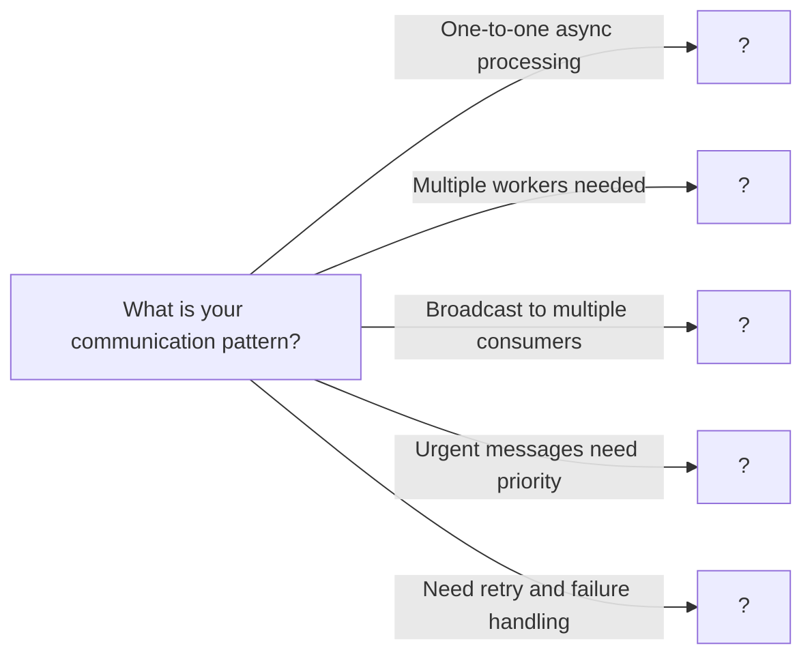

# Message Queues

> Asynchronous communication patterns for decoupled, scalable systems

---

## Learning Objectives

By the end of this topic you will be able to:

- Explain the difference between point-to-point queues and publish-subscribe patterns and when each is appropriate
- Implement a thread-safe blocking message queue with producer-consumer coordination
- Implement a priority message queue that preserves FIFO ordering within each priority tier
- Implement dead letter queue retry logic with idempotency considerations
- Choose between simple queue, producer-consumer, pub-sub, and priority queue for a given system requirement
- Identify and fix common message queue bugs including race conditions, duplicate processing, and out-of-order delivery

---

## ELI5: Explain Like I'm 5

<div class="learner-section" markdown>

**Your task:** After implementing different message queue patterns, explain them simply.

**Prompts to guide you:**

1. **What is a message queue in one sentence?**
    - A message queue is a ___ that lets producers ___ without waiting for consumers to ___

2. **Why do we need message queues?**
    - Message queues are preferred when ___ because they avoid the cost of ___

3. **Real-world analogy for simple queue:**
    - Example: "A simple queue is like a line at a store where..."
    - Think about how orders are taken at a restaurant counter and passed to the kitchen separately.
    - Your analogy: <span class="fill-in">[Fill in]</span>

4. **What is the producer-consumer pattern in one sentence?**
    - The producer-consumer pattern is a ___ where producers add work to a shared ___ and consumers pull from it, allowing ___

5. **How is pub-sub different from producer-consumer?**
    - Pub-sub differs from producer-consumer because each message is delivered to ___ instead of just ___

6. **Real-world analogy for pub-sub:**
    - Example: "Pub-sub is like a newsletter subscription where..."
    - Think about how a radio broadcast reaches all listeners simultaneously without the sender knowing who is tuned in.
    - Your analogy: <span class="fill-in">[Fill in]</span>

7. **What is a priority queue in one sentence?**
    - A priority queue is a ___ that always serves the highest-priority item first, while maintaining ___ within each priority level

8. **When would you use a dead letter queue?**
    - A dead letter queue is needed when ___ because without it, failed messages would ___

</div>

---

## Quick Quiz (Do BEFORE implementing)

!!! tip "How to use this section"
    Complete your predictions now, before reading further. You will revisit and verify each answer after running the benchmark (or completing the implementation).

<div class="learner-section" markdown>

**Your task:** Test your intuition without looking at code. Answer these, then verify after implementation.

### Complexity Predictions

1. **Synchronous API call to process 100 tasks:**
    - Time if each task takes 1 second: <span class="fill-in">[Your guess: ?]</span>
    - Verified after learning: <span class="fill-in">[Actual: ?]</span>

2. **Message queue with 3 workers processing 100 tasks:**
    - Time if each task takes 1 second: <span class="fill-in">[Your guess: ?]</span>
    - Speedup factor: <span class="fill-in">[Your guess: ?x faster]</span>
    - Verified: <span class="fill-in">[Actual]</span>

3. **Memory usage prediction:**
    - Simple queue with 1000 messages: <span class="fill-in">[Your guess: O(?)]</span>
    - Pub-sub with 5 subscribers and 100 messages: <span class="fill-in">[Your guess: O(?)]</span>
    - Verified: <span class="fill-in">[Actual]</span>

### Scenario Predictions

**Scenario 1:** Image upload service - users upload photos that need resizing

- **Should you use message queue?** <span class="fill-in">[Yes/No - Why?]</span>
- **Pattern to use:** <span class="fill-in">[Simple queue/Producer-consumer/Pub-sub/Priority]</span>
- **Why that pattern?** <span class="fill-in">[Fill in your reasoning]</span>
- **What happens without queue?** <span class="fill-in">[Fill in]</span>

**Scenario 2:** Notification system - send email AND SMS AND push notification

- **Should you use message queue?** <span class="fill-in">[Yes/No - Why?]</span>
- **Pattern to use:** <span class="fill-in">[Simple queue/Producer-consumer/Pub-sub/Priority]</span>
- **Why that pattern?** <span class="fill-in">[Fill in your reasoning]</span>
- **How many times is each message delivered?** <span class="fill-in">[Fill in]</span>

**Scenario 3:** Payment processing - some customers are VIP, need faster processing

- **Should you use message queue?** <span class="fill-in">[Yes/No - Why?]</span>
- **Pattern to use:** <span class="fill-in">[Simple queue/Producer-consumer/Pub-sub/Priority]</span>
- **Why that pattern?** <span class="fill-in">[Fill in your reasoning]</span>
- **How do you prevent low-priority starvation?** <span class="fill-in">[Fill in]</span>

### Trade-off Quiz

**Question:** When is a message queue WORSE than direct synchronous calls?

- Your answer: <span class="fill-in">[Fill in before implementation]</span>
- Verified answer: <span class="fill-in">[Fill in after learning]</span>

**Question:** What's the MAIN difference between a queue and pub-sub?

- [ ] Queue is faster
- [ ] Queue stores messages longer
- [ ] Queue delivers to one consumer, pub-sub to many
- [ ] Queue supports priorities

Verify after implementation: <span class="fill-in">[Which one(s)?]</span>

**Question:** What does "at-least-once delivery" mean?

- Your answer: <span class="fill-in">[Fill in before implementation]</span>
- What problem does it cause? <span class="fill-in">[Fill in]</span>
- Verified: <span class="fill-in">[Actual answer after learning]</span>

**Question:** When should you use a dead letter queue?

- Your answer: <span class="fill-in">[Fill in before implementation]</span>
- Verified: <span class="fill-in">[Fill in after implementation]</span>

</div>

---

## Core Implementation

### Part 1: Simple Message Queue

**Your task:** Implement a basic FIFO message queue.

```java
import java.util.*;
import java.util.concurrent.*;

/**
 * Simple Message Queue: FIFO with blocking operations
 *
 * Key principles:
 * - First In First Out ordering
 * - Blocking when empty (wait for messages)
 * - Thread-safe operations
 * - Decouples producers and consumers
 */

public class SimpleMessageQueue {

    private final Queue<Message> queue;
    private final int capacity;
    private final Object lock = new Object();

    /**
     * Initialize simple message queue
     *
     * @param capacity Maximum queue size
     *
     * TODO: Initialize queue
     * - Create LinkedList for messages
     * - Set capacity limit
     */
    public SimpleMessageQueue(int capacity) {
        // TODO: Initialize queue (LinkedList)

        // TODO: Store capacity

        this.queue = null; // Replace
        this.capacity = 0;
    }

    /**
     * Send message to queue (producer)
     *
     * @param message Message to send
     * @throws InterruptedException if interrupted while waiting
     *
     * TODO: Implement send
     * 1. Wait if queue is full
     * 2. Add message to queue
     * 3. Notify waiting consumers
     *
     * Hint: Use wait() and notifyAll() with synchronized block
     */
    public void send(Message message) throws InterruptedException {
        synchronized (lock) {
            // TODO: Implement iteration/conditional logic

            // TODO: Add message to queue

            // TODO: Notify all waiting consumers
            // lock.notifyAll()
        }
    }

    /**
     * Receive message from queue (consumer)
     *
     * @return Next message from queue
     * @throws InterruptedException if interrupted while waiting
     *
     * TODO: Implement receive
     * 1. Wait if queue is empty
     * 2. Remove and return message
     * 3. Notify waiting producers
     */
    public Message receive() throws InterruptedException {
        synchronized (lock) {
            // TODO: Implement iteration/conditional logic

            // TODO: Remove message from queue

            // TODO: Notify all waiting producers
            // lock.notifyAll()

            // TODO: Return message

            return null; // Replace
        }
    }

    /**
     * Try to receive with timeout
     *
     * @param timeoutMs Timeout in milliseconds
     * @return Message or null if timeout
     */
    public Message receive(long timeoutMs) throws InterruptedException {
        synchronized (lock) {
            long deadline = System.currentTimeMillis() + timeoutMs;

            // TODO: Wait until message available or timeout

            // TODO: Implement iteration/conditional logic

            return null; // Replace (or message)
        }
    }

    /**
     * Get queue size
     */
    public synchronized int size() {
        return queue.size();
    }

    /**
     * Check if queue is empty
     */
    public synchronized boolean isEmpty() {
        return queue.isEmpty();
    }

    static class Message {
        String id;
        String content;
        long timestamp;

        public Message(String id, String content) {
            this.id = id;
            this.content = content;
            this.timestamp = System.currentTimeMillis();
        }

        @Override
        public String toString() {
            return "Message{id='" + id + "', content='" + content + "'}";
        }
    }
}
```

!!! warning "Debugging Challenge — Race Condition in send/receive"

    The queue below loses messages under concurrent load. It has 2 bugs. Find them before reading the answer.

    ```java
    public class BuggyMessageQueue {
        private final Queue<Message> queue;
        private final int capacity;

        public BuggyMessageQueue(int capacity) {
            this.queue = new LinkedList<>();
            this.capacity = capacity;
        }

        public void send(Message message) throws InterruptedException {
            if (queue.size() >= capacity) {
                Thread.sleep(100); // Wait for space
            }
            queue.offer(message);
        }

        public Message receive() throws InterruptedException {
            if (queue.isEmpty()) {
                return null; // What happens to waiting consumers?
            }
            return queue.poll();
        }
    }
    ```

    ??? success "Answer"

        **Bug 1 (send method):** Missing synchronization. Multiple threads can check `queue.size()` simultaneously, both see space available, both add messages, exceeding capacity. Race condition on queue operations.

        **Fix:**
        ```java
        public synchronized void send(Message message) throws InterruptedException {
            while (queue.size() >= capacity) {
                wait(); // Wait until space available
            }
            queue.offer(message);
            notifyAll(); // Wake up waiting receivers
        }
        ```

        **Bug 2 (receive method):** Returns null instead of waiting. Consumers poll repeatedly or miss messages. No coordination between producers and consumers.

        **Fix:**
        ```java
        public synchronized Message receive() throws InterruptedException {
            while (queue.isEmpty()) {
                wait(); // Wait until message available
            }
            Message msg = queue.poll();
            notifyAll(); // Wake up waiting senders
            return msg;
        }
        ```

        **Why messages are lost:** Without synchronization, concurrent operations can corrupt the queue state. Without wait/notify, producers may overwrite or consumers may miss messages.

### Part 2: Producer-Consumer Pattern

**Your task:** Implement producer-consumer with multiple workers.

```java
/**
 * Producer-Consumer: Multiple producers and consumers processing work
 *
 * Key principles:
 * - Work distribution across consumers
 * - Load balancing
 * - Backpressure handling
 * - Graceful shutdown
 */

public class ProducerConsumer {

    private final SimpleMessageQueue queue;
    private final List<Thread> consumerThreads;
    private volatile boolean running;

    /**
     * Initialize producer-consumer system
     *
     * @param queueCapacity Queue size
     * @param numConsumers Number of consumer threads
     *
     * TODO: Initialize system
     * - Create message queue
     * - Create consumer threads
     * - Set running flag
     */
    public ProducerConsumer(int queueCapacity, int numConsumers) {
        // TODO: Create SimpleMessageQueue

        // TODO: Initialize consumer threads list

        // TODO: Track state

        this.queue = null; // Replace
        this.consumerThreads = null; // Replace
    }

    /**
     * Start all consumers
     *
     * TODO: Start consumer threads
     * - Each consumer polls queue and processes messages
     * - Handle InterruptedException
     * - Check running flag
     */
    public void start() {
        // TODO: Implement iteration/conditional logic
    }

    /**
     * Produce message (called by producers)
     *
     * TODO: Send message to queue
     */
    public void produce(String messageId, String content) throws InterruptedException {
        // TODO: Create Message and send to queue
    }

    /**
     * Process message (override in subclass for custom logic)
     *
     * TODO: Implement message processing
     * - Extract message content
     * - Perform work
     * - Handle errors
     */
    protected void processMessage(SimpleMessageQueue.Message message) {
        // TODO: Process message (simulated work)
        System.out.println(Thread.currentThread().getName() +
                          " processing: " + message);

        // TODO: Simulate work
        try {
            Thread.sleep(100);
        } catch (InterruptedException e) {
            Thread.currentThread().interrupt();
        }
    }

    /**
     * Shutdown system
     *
     * TODO: Graceful shutdown
     * - Set running to false
     * - Wait for consumers to finish
     */
    public void shutdown() throws InterruptedException {
        // TODO: Track state

        // TODO: Interrupt all consumer threads

        // TODO: Wait for all threads to finish (join)
    }

    /**
     * Get queue statistics
     */
    public QueueStats getStats() {
        return new QueueStats(queue.size(), consumerThreads.size());
    }

    static class QueueStats {
        int queueSize;
        int activeConsumers;

        public QueueStats(int queueSize, int activeConsumers) {
            this.queueSize = queueSize;
            this.activeConsumers = activeConsumers;
        }
    }
}
```

### Part 3: Publish-Subscribe Pattern

**Your task:** Implement pub-sub for multiple subscribers.

```java
/**
 * Publish-Subscribe: Broadcast messages to multiple subscribers
 *
 * Key principles:
 * - One message delivered to all subscribers
 * - Topic-based routing
 * - Decoupled publishers and subscribers
 * - Each subscriber has own queue
 */

public class PubSubMessageQueue {

    private final Map<String, List<Subscriber>> topicSubscribers;
    private final Object lock = new Object();

    /**
     * Initialize pub-sub system
     *
     * TODO: Initialize topic mapping
     */
    public PubSubMessageQueue() {
        // TODO: Initialize topicSubscribers map (ConcurrentHashMap)
        this.topicSubscribers = null; // Replace
    }

    /**
     * Subscribe to topic
     *
     * @param topic Topic name
     * @param subscriber Subscriber to register
     *
     * TODO: Register subscriber
     * - Create topic if doesn't exist
     * - Add subscriber to topic list
     */
    public void subscribe(String topic, Subscriber subscriber) {
        synchronized (lock) {
            // TODO: Get or create subscriber list for topic

            // TODO: Add subscriber to list

            System.out.println(subscriber.name + " subscribed to " + topic);
        }
    }

    /**
     * Unsubscribe from topic
     *
     * TODO: Remove subscriber from topic
     */
    public void unsubscribe(String topic, Subscriber subscriber) {
        synchronized (lock) {
            // TODO: Get subscriber list for topic

            // TODO: Remove subscriber
        }
    }

    /**
     * Publish message to topic
     *
     * @param topic Topic to publish to
     * @param message Message to publish
     *
     * TODO: Deliver to all subscribers
     * - Get all subscribers for topic
     * - Send message to each subscriber's queue
     */
    public void publish(String topic, SimpleMessageQueue.Message message) {
        synchronized (lock) {
            // TODO: Get subscribers for topic

            // TODO: Implement iteration/conditional logic

            System.out.println("Published to " + topic + ": " + message);
        }
    }

    /**
     * Get topic statistics
     */
    public Map<String, Integer> getTopicStats() {
        Map<String, Integer> stats = new HashMap<>();
        synchronized (lock) {
            for (Map.Entry<String, List<Subscriber>> entry : topicSubscribers.entrySet()) {
                stats.put(entry.getKey(), entry.getValue().size());
            }
        }
        return stats;
    }

    static class Subscriber {
        String name;
        Queue<SimpleMessageQueue.Message> queue;

        public Subscriber(String name) {
            this.name = name;
            this.queue = new LinkedList<>();
        }

        public void deliver(SimpleMessageQueue.Message message) {
            queue.offer(message);
        }

        public SimpleMessageQueue.Message receive() {
            return queue.poll();
        }

        public int getQueueSize() {
            return queue.size();
        }
    }
}
```

### Part 4: Priority Message Queue

**Your task:** Implement priority queue for urgent messages.

```java
/**
 * Priority Message Queue: Process high-priority messages first
 *
 * Key principles:
 * - Priority levels (HIGH, MEDIUM, LOW)
 * - Higher priority processed first
 * - FIFO within same priority
 * - Prevents starvation of low priority
 */

public class PriorityMessageQueue {

    private final PriorityQueue<PriorityMessage> queue;
    private final Object lock = new Object();
    private final int capacity;

    /**
     * Initialize priority queue
     *
     * @param capacity Maximum queue size
     *
     * TODO: Initialize priority queue
     * - Create PriorityQueue with comparator
     * - Sort by priority then timestamp
     */
    public PriorityMessageQueue(int capacity) {
        // TODO: Create PriorityQueue with comparator
        // Comparator: First by priority (descending), then timestamp (ascending)

        // TODO: Store capacity

        this.queue = null; // Replace
        this.capacity = 0;
    }

    /**
     * Send message with priority
     *
     * TODO: Add message to priority queue
     * - Wait if queue is full
     * - Add message
     * - Notify consumers
     */
    public void send(PriorityMessage message) throws InterruptedException {
        synchronized (lock) {
            // TODO: Wait while queue is full

            // TODO: Add message to queue

            // TODO: Notify waiting consumers
        }
    }

    /**
     * Receive highest priority message
     *
     * TODO: Get message with highest priority
     * - Wait if queue is empty
     * - Remove highest priority message
     * - Notify producers
     */
    public PriorityMessage receive() throws InterruptedException {
        synchronized (lock) {
            // TODO: Wait while queue is empty

            // TODO: Poll highest priority message

            // TODO: Notify waiting producers

            return null; // Replace
        }
    }

    /**
     * Get queue size
     */
    public synchronized int size() {
        return queue.size();
    }

    static class PriorityMessage implements Comparable<PriorityMessage> {
        String id;
        String content;
        Priority priority;
        long timestamp;

        public PriorityMessage(String id, String content, Priority priority) {
            this.id = id;
            this.content = content;
            this.priority = priority;
            this.timestamp = System.currentTimeMillis();
        }

        @Override
        public int compareTo(PriorityMessage other) {
            // TODO: Compare by priority first (higher priority first)

            // Hint:
            // int priorityCompare = other.priority.value - this.priority.value;
            // if (priorityCompare != 0) return priorityCompare;
            // return Long.compare(this.timestamp, other.timestamp);

            return 0; // Replace
        }

        @Override
        public String toString() {
            return "PriorityMessage{id='" + id + "', priority=" + priority + "}";
        }
    }

    enum Priority {
        LOW(1), MEDIUM(2), HIGH(3);

        final int value;

        Priority(int value) {
            this.value = value;
        }
    }
}
```

### Part 5: Dead Letter Queue

**Your task:** Implement dead letter queue for failed messages.

```java
/**
 * Dead Letter Queue: Handle messages that fail processing
 *
 * Key principles:
 * - Retry failed messages
 * - Max retry limit
 * - Move to DLQ after max retries
 * - Allows manual inspection/reprocessing
 */

public class DeadLetterQueue {

    private final SimpleMessageQueue mainQueue;
    private final SimpleMessageQueue dlq;
    private final int maxRetries;
    private final Map<String, Integer> retryCount;

    /**
     * Initialize dead letter queue system
     *
     * @param capacity Queue capacity
     * @param maxRetries Maximum retry attempts
     *
     * TODO: Initialize queues
     * - Create main queue
     * - Create DLQ
     * - Initialize retry counter
     */
    public DeadLetterQueue(int capacity, int maxRetries) {
        // TODO: Create main queue

        // TODO: Create DLQ

        // TODO: Store maxRetries

        // TODO: Initialize retry counter map

        this.mainQueue = null; // Replace
        this.dlq = null; // Replace
        this.maxRetries = 0;
        this.retryCount = null; // Replace
    }

    /**
     * Send message to main queue
     */
    public void send(SimpleMessageQueue.Message message) throws InterruptedException {
        // TODO: Send to main queue
        // Initialize retry count to 0
    }

    /**
     * Process message with retry logic
     *
     * @param processor Message processor
     * @return true if processed successfully
     *
     * TODO: Process with retries
     * 1. Receive message from main queue
     * 2. Try to process
     * 3. If fails, check retry count
     * 4. If under limit, requeue with incremented count
     * 5. If over limit, move to DLQ
     */
    public boolean processWithRetry(MessageProcessor processor) throws InterruptedException {
        // TODO: Receive message from main queue

        // TODO: Try to process message
        try {
            // processor.process(message)
            // return true if successful
        } catch (Exception e) {
            // TODO: Get current retry count

            // TODO: Implement iteration/conditional logic

            // TODO: Implement iteration/conditional logic
        }

        return false; // Replace
    }

    /**
     * Get message from DLQ for manual processing
     */
    public SimpleMessageQueue.Message receiveDLQ() throws InterruptedException {
        return dlq.receive();
    }

    /**
     * Reprocess message from DLQ (manual retry)
     */
    public void reprocessFromDLQ(SimpleMessageQueue.Message message) throws InterruptedException {
        // TODO: Reset retry count and send to main queue
    }

    /**
     * Get statistics
     */
    public DLQStats getStats() {
        return new DLQStats(
            mainQueue.size(),
            dlq.size(),
            retryCount.size()
        );
    }

    interface MessageProcessor {
        void process(SimpleMessageQueue.Message message) throws Exception;
    }

    static class DLQStats {
        int mainQueueSize;
        int dlqSize;
        int messagesWithRetries;

        public DLQStats(int mainQueueSize, int dlqSize, int messagesWithRetries) {
            this.mainQueueSize = mainQueueSize;
            this.dlqSize = dlqSize;
            this.messagesWithRetries = messagesWithRetries;
        }

        @Override
        public String toString() {
            return "DLQStats{main=" + mainQueueSize +
                   ", dlq=" + dlqSize +
                   ", retrying=" + messagesWithRetries + "}";
        }
    }
}
```

---

## Client Code

```java
import java.util.*;

public class MessageQueuesClient {

    public static void main(String[] args) throws Exception {
        testSimpleQueue();
        System.out.println("\n" + "=".repeat(50) + "\n");
        testProducerConsumer();
        System.out.println("\n" + "=".repeat(50) + "\n");
        testPubSub();
        System.out.println("\n" + "=".repeat(50) + "\n");
        testPriorityQueue();
        System.out.println("\n" + "=".repeat(50) + "\n");
        testDeadLetterQueue();
    }

    static void testSimpleQueue() throws InterruptedException {
        System.out.println("=== Simple Message Queue Test ===\n");

        SimpleMessageQueue queue = new SimpleMessageQueue(5);

        // Test: Producer thread
        Thread producer = new Thread(() -> {
            try {
                for (int i = 1; i <= 5; i++) {
                    SimpleMessageQueue.Message msg =
                        new SimpleMessageQueue.Message("msg" + i, "Content " + i);
                    queue.send(msg);
                    System.out.println("Sent: " + msg);
                    Thread.sleep(100);
                }
            } catch (InterruptedException e) {
                Thread.currentThread().interrupt();
            }
        });

        // Test: Consumer thread
        Thread consumer = new Thread(() -> {
            try {
                for (int i = 1; i <= 5; i++) {
                    SimpleMessageQueue.Message msg = queue.receive();
                    System.out.println("Received: " + msg);
                }
            } catch (InterruptedException e) {
                Thread.currentThread().interrupt();
            }
        });

        producer.start();
        consumer.start();
        producer.join();
        consumer.join();

        System.out.println("\nFinal queue size: " + queue.size());
    }

    static void testProducerConsumer() throws InterruptedException {
        System.out.println("=== Producer-Consumer Test ===\n");

        ProducerConsumer pc = new ProducerConsumer(10, 3);
        pc.start();

        // Produce messages
        System.out.println("Producing 10 messages...");
        for (int i = 1; i <= 10; i++) {
            pc.produce("msg" + i, "Task " + i);
            Thread.sleep(50);
        }

        // Let consumers process
        Thread.sleep(2000);

        System.out.println("\nStats: " + pc.getStats());
        pc.shutdown();
    }

    static void testPubSub() throws InterruptedException {
        System.out.println("=== Pub-Sub Test ===\n");

        PubSubMessageQueue pubsub = new PubSubMessageQueue();

        // Create subscribers
        PubSubMessageQueue.Subscriber sub1 = new PubSubMessageQueue.Subscriber("User1");
        PubSubMessageQueue.Subscriber sub2 = new PubSubMessageQueue.Subscriber("User2");
        PubSubMessageQueue.Subscriber sub3 = new PubSubMessageQueue.Subscriber("User3");

        // Subscribe to topics
        pubsub.subscribe("news", sub1);
        pubsub.subscribe("news", sub2);
        pubsub.subscribe("sports", sub2);
        pubsub.subscribe("sports", sub3);

        System.out.println("\nTopic stats: " + pubsub.getTopicStats());

        // Publish messages
        System.out.println("\nPublishing messages:");
        pubsub.publish("news", new SimpleMessageQueue.Message("n1", "Breaking news!"));
        pubsub.publish("sports", new SimpleMessageQueue.Message("s1", "Game update!"));

        // Check subscriber queues
        System.out.println("\nSubscriber queues:");
        System.out.println("User1 queue size: " + sub1.getQueueSize());
        System.out.println("User2 queue size: " + sub2.getQueueSize());
        System.out.println("User3 queue size: " + sub3.getQueueSize());

        // Receive messages
        System.out.println("\nUser1 receives: " + sub1.receive());
        System.out.println("User2 receives: " + sub2.receive());
        System.out.println("User2 receives: " + sub2.receive());
    }

    static void testPriorityQueue() throws InterruptedException {
        System.out.println("=== Priority Queue Test ===\n");

        PriorityMessageQueue queue = new PriorityMessageQueue(10);

        // Send messages with different priorities
        System.out.println("Sending messages:");
        queue.send(new PriorityMessageQueue.PriorityMessage(
            "m1", "Low priority", PriorityMessageQueue.Priority.LOW));
        queue.send(new PriorityMessageQueue.PriorityMessage(
            "m2", "High priority", PriorityMessageQueue.Priority.HIGH));
        queue.send(new PriorityMessageQueue.PriorityMessage(
            "m3", "Medium priority", PriorityMessageQueue.Priority.MEDIUM));
        queue.send(new PriorityMessageQueue.PriorityMessage(
            "m4", "High priority 2", PriorityMessageQueue.Priority.HIGH));

        System.out.println("Queue size: " + queue.size());

        // Receive in priority order
        System.out.println("\nReceiving messages (priority order):");
        while (queue.size() > 0) {
            PriorityMessageQueue.PriorityMessage msg = queue.receive();
            System.out.println("Received: " + msg);
        }
    }

    static void testDeadLetterQueue() throws InterruptedException {
        System.out.println("=== Dead Letter Queue Test ===\n");

        DeadLetterQueue dlq = new DeadLetterQueue(10, 3);

        // Create failing processor
        DeadLetterQueue.MessageProcessor failingProcessor = message -> {
            System.out.println("Processing: " + message.id);
            if (message.id.equals("msg2")) {
                throw new Exception("Simulated failure");
            }
        };

        // Send messages
        System.out.println("Sending messages:");
        dlq.send(new SimpleMessageQueue.Message("msg1", "Good message"));
        dlq.send(new SimpleMessageQueue.Message("msg2", "Bad message"));
        dlq.send(new SimpleMessageQueue.Message("msg3", "Good message"));

        // Process messages
        System.out.println("\nProcessing messages:");
        for (int i = 0; i < 3; i++) {
            boolean success = dlq.processWithRetry(failingProcessor);
            System.out.println("Process attempt " + (i+1) + ": " +
                             (success ? "SUCCESS" : "FAILED"));
            System.out.println("Stats: " + dlq.getStats());
        }

        // Try more times to move bad message to DLQ
        System.out.println("\nRetrying failed message:");
        for (int i = 0; i < 3; i++) {
            dlq.processWithRetry(failingProcessor);
            System.out.println("Stats: " + dlq.getStats());
        }
    }
}
```

---

!!! info "Loop back"
    Return to the Quick Quiz now and fill in your verified answers.

---

## Before/After: Why Message Queues Matter

**Your task:** Compare synchronous vs message queue vs pub-sub approaches to understand the impact.

### Example: Image Processing Service

**Problem:** Users upload images that need to be resized, compressed, and thumbnailed. Each operation takes 2 seconds.

#### Approach 1: Synchronous Processing (No Queue)

```java
// Naive approach - Process immediately in request handler
public class SynchronousImageService {

    public UploadResponse uploadImage(Image image) {
        // User waits for all processing to complete
        resize(image);        // 2 seconds
        compress(image);      // 2 seconds
        thumbnail(image);     // 2 seconds

        return new UploadResponse("success");
    }

    // Total user wait time: 6 seconds!
}
```

**Analysis:**

- User wait time: 6 seconds for each upload
- Scalability: Limited by processing capacity
- Failure handling: User sees error immediately
- For 100 uploads: 600 seconds (10 minutes)

**Problems:**

- Poor user experience (slow response)
- Request timeout on slow operations
- No retry mechanism
- Server blocked during processing

#### Approach 2: Simple Message Queue (Async Processing)

```java
// Better approach - Queue work for background processing
public class QueuedImageService {

    private final SimpleMessageQueue queue;
    private final List<Worker> workers; // 3 worker threads

    public UploadResponse uploadImage(Image image) {
        // Queue the work immediately
        queue.send(new ImageProcessingTask(image));

        // Return immediately - user doesn't wait!
        return new UploadResponse("processing");
    }

    // Workers process in background
    // Total user wait time: <100ms (just queue operation)
}
```

**Analysis:**

- User wait time: <100ms (instant response)
- Scalability: Can add more workers
- Failure handling: Automatic retry with DLQ
- For 100 uploads with 3 workers: ~200 seconds (parallelized)

**Benefits:**

- Fast user response
- Decoupled processing
- Horizontal scaling
- Retry mechanism

#### Approach 3: Pub-Sub (Multiple Subscribers)

```java
// Best approach - Multiple services process independently
public class PubSubImageService {

    private final PubSubMessageQueue pubsub;

    public UploadResponse uploadImage(Image image) {
        // Publish once to "image.uploaded" topic
        pubsub.publish("image.uploaded", new ImageEvent(image));

        // Multiple subscribers receive:
        // - Resize service
        // - Analytics service
        // - Notification service

        return new UploadResponse("processing");
    }

    // Each service processes independently!
}
```

**Analysis:**

- User wait time: <100ms (instant response)
- Scalability: Each subscriber scales independently
- Extensibility: Add new subscribers without code changes
- Loose coupling: Services don't know about each other

#### Performance Comparison

| Approach          | Upload Time | 100 Uploads      | Scalability | Failure Handling  |
|-------------------|-------------|------------------|-------------|-------------------|
| Synchronous       | 6 sec       | 600 sec (10 min) | Poor        | User sees error   |
| Queue (3 workers) | <100ms      | ~200 sec (3 min) | Good        | Auto retry + DLQ  |
| Pub-Sub           | <100ms      | ~200 sec (3 min) | Excellent   | Per-service retry |

**Your calculation:** For 1,000 uploads with 10 workers:

- Synchronous: <span class="fill-in">_____</span> seconds
- Queue: <span class="fill-in">_____</span> seconds
- Speedup: <span class="fill-in">_____</span> times faster

#### Why Does Message Queue Work?

!!! note "Key insight"
    The queue decouples the upload action from the processing work. The user's request completes in milliseconds because it only writes to memory; the slow work happens asynchronously on workers that can be scaled independently.

```
Without Queue:
User → [Upload + Process] → Response
       ↑ 6 seconds wait ↑

With Queue:
User → [Upload] → Response        (instant)
       Queue → [Worker 1] Process  (async)
            → [Worker 2] Process  (async)
            → [Worker 3] Process  (async)
```

**After implementing, explain in your own words:**

<div class="learner-section" markdown>

- Why does async processing improve user experience? <span class="fill-in">[Your answer]</span>
- What happens if a worker fails? <span class="fill-in">[Your answer]</span>
- When would you NOT use a message queue? <span class="fill-in">[Your answer]</span>

</div>

#### Queue vs Pub-Sub: When to Use Each

**Use Queue when:**

- One consumer should process each message
- Work distribution across workers
- Task processing (jobs, background work)
- Example: <span class="fill-in">[Fill in your example]</span>

**Use Pub-Sub when:**

- Multiple consumers need each message
- Broadcasting events
- Event-driven architecture
- Example: <span class="fill-in">[Fill in your example]</span>

**After implementing, explain the difference:**

<div class="learner-section" markdown>

- How does message delivery differ? <span class="fill-in">[Your answer]</span>
- Which one for image processing? Why? <span class="fill-in">[Your answer]</span>
- Which one for notifications? Why? <span class="fill-in">[Your answer]</span>

</div>

---

## Case Studies: Message Queues in the Wild

### Uber Ride Requests: Decoupling with a Task Queue

- **Pattern:** Point-to-Point (Task Queue) using a system like RabbitMQ or Apache Kafka.
- **How it works:** When a user requests a ride, the mobile application's API call doesn't wait for a driver to be
  found. Instead, it publishes a `RideRequested` message to a queue and immediately returns a response to the user. A
  separate pool of "dispatcher" microservices consumes tasks from this queue. These workers are responsible for the
  heavy lifting: finding nearby drivers, calculating ETAs, and sending notifications, all happening asynchronously.
- **Key Takeaway:** Message queues are fundamental for creating responsive and resilient systems. By decoupling the
  initial request from the complex backend processing, Uber's app feels fast and can handle massive bursts of requests,
  even if the backend services are temporarily slow.

### Twitter's Fan-out Service: The Power of Pub/Sub

- **Pattern:** Publish-Subscribe (Pub/Sub) for fanning out events.
- **How it works:** When a user tweets, that action is published as a single message to a "Tweets" topic in a system
  like Kafka. Many different downstream services subscribe to this topic. A "fan-out" service consumes the tweet and
  injects it into the home timeline caches of all the user's followers. A "notifications" service consumes it to send
  push notifications. A "search" service consumes it to index the tweet.
- **Key Takeaway:** Pub/sub is incredibly powerful for building extensible, loosely-coupled systems. The original
  tweeting service doesn't need to know about all the other services that care about new tweets. Teams can add new
  subscribers to the topic to build new features without ever changing the original service.

### Netflix Conductor: Orchestrating Workflows with Events

- **Pattern:** Pub/Sub for complex workflow orchestration.
- **How it works:** Encoding and processing a new movie is a complex, multi-step workflow. Netflix uses an event-driven
  orchestrator called Conductor. When a video upload is complete, a `VideoUploaded` event is published. A service
  consumes this and starts encoding, publishing a `VideoEncodingSucceeded` event on completion. This new event triggers
  multiple parallel actions: one service starts generating thumbnails, another runs quality control, and a third updates
  the catalog.
- **Key Takeaway:** Complex business processes can be modeled as a series of events and subscribers. This makes the
  system more resilient (a failed thumbnail generator doesn't stop the whole workflow) and easier to reason about than a
  single, monolithic application.

---

## Common Misconceptions

!!! warning "A message queue guarantees exactly-once delivery"
    Most message queue systems provide at-least-once delivery, not exactly-once. When a consumer crashes after processing but before acknowledging, the broker re-delivers the message. Exactly-once requires either idempotent consumers (safe to process twice) or a distributed transaction mechanism, both of which add significant complexity and cost.

!!! warning "Pub-sub and a queue with multiple consumers are the same thing"
    They are not. With a queue and multiple consumers, each message is delivered to exactly one consumer — the workers compete for messages. With pub-sub, each message is delivered to every subscriber independently. Use a queue for distributing work; use pub-sub for broadcasting events.

!!! warning "A dead letter queue automatically resolves failed messages"
    A DLQ only stores unprocessable messages — it does not fix them. A message that fails due to a bug in the consumer will keep failing even after it is replayed from the DLQ. The DLQ is an isolation mechanism, not a retry mechanism. Someone must investigate why messages are landing there and decide to fix the code, fix the data, or discard the message.

---

## Decision Framework

<div class="learner-section" markdown>

**Questions to answer after implementation:**

### 1. Pattern Selection

**When to use Simple Queue?**

- Your scenario: <span class="fill-in">[Fill in]</span>
- Key factors: <span class="fill-in">[Fill in]</span>

**When to use Producer-Consumer?**

- Your scenario: <span class="fill-in">[Fill in]</span>
- Key factors: <span class="fill-in">[Fill in]</span>

**When to use Pub-Sub?**

- Your scenario: <span class="fill-in">[Fill in]</span>
- Key factors: <span class="fill-in">[Fill in]</span>

**When to use Priority Queue?**

- Your scenario: <span class="fill-in">[Fill in]</span>
- Key factors: <span class="fill-in">[Fill in]</span>

**When to use Dead Letter Queue?**

- Your scenario: <span class="fill-in">[Fill in]</span>
- Key factors: <span class="fill-in">[Fill in]</span>

### 2. Trade-offs

**Simple Queue:**

- Pros: <span class="fill-in">[Fill in after understanding]</span>
- Cons: <span class="fill-in">[Fill in after understanding]</span>

**Producer-Consumer:**

- Pros: <span class="fill-in">[Fill in after understanding]</span>
- Cons: <span class="fill-in">[Fill in after understanding]</span>

**Pub-Sub:**

- Pros: <span class="fill-in">[Fill in after understanding]</span>
- Cons: <span class="fill-in">[Fill in after understanding]</span>

**Priority Queue:**

- Pros: <span class="fill-in">[Fill in after understanding]</span>
- Cons: <span class="fill-in">[Fill in after understanding]</span>

### 3. Your Decision Tree

Build your decision tree after practicing:


</div>

---

## Practice

<div class="learner-section" markdown>

### Scenario 1: Process uploaded images

**Requirements:**

- Users upload images
- Need to resize, compress, generate thumbnails
- Processing takes 5-10 seconds
- Want fast upload response
- Handle processing failures

**Your design:**

- Which pattern would you choose? <span class="fill-in">[Fill in]</span>
- Why? <span class="fill-in">[Fill in]</span>
- How many workers? <span class="fill-in">[Fill in]</span>
- Failure handling strategy? <span class="fill-in">[Fill in]</span>

**Failure modes:**

- What happens if an image processing worker crashes mid-job after dequeuing the message but before acknowledging it? <span class="fill-in">[Fill in]</span>
- How does your design behave when the queue fills up because processing is slower than the upload rate? <span class="fill-in">[Fill in]</span>

### Scenario 2: Notification system

**Requirements:**

- Send notifications via email, SMS, push
- Users subscribe to notification types
- Some notifications are urgent
- Must deliver to all channels
- Track delivery failures

**Your design:**

- Which pattern would you choose? <span class="fill-in">[Fill in]</span>
- Why? <span class="fill-in">[Fill in]</span>
- How to handle different channels? <span class="fill-in">[Fill in]</span>
- Priority strategy? <span class="fill-in">[Fill in]</span>

**Failure modes:**

- What happens if the SMS delivery service is down and the subscriber for that channel cannot process messages? <span class="fill-in">[Fill in]</span>
- How does your design behave when an urgent notification is published but the subscriber queue is backed up with non-urgent messages? <span class="fill-in">[Fill in]</span>

### Scenario 3: Order processing system

**Requirements:**

- Process orders from multiple sources
- Some orders need priority (VIP customers)
- Payment processing might fail
- Need retry logic
- Monitor failed orders

**Your design:**

- Which pattern would you choose? <span class="fill-in">[Fill in]</span>
- Why? <span class="fill-in">[Fill in]</span>
- How to handle priorities? <span class="fill-in">[Fill in]</span>
- Retry strategy? <span class="fill-in">[Fill in]</span>

**Failure modes:**

- What happens if a payment processing failure causes a message to be retried indefinitely, blocking the worker? <span class="fill-in">[Fill in]</span>
- How does your design behave when the dead letter queue itself fills up because failed orders are not being investigated and resolved? <span class="fill-in">[Fill in]</span>

</div>

---

## Test Your Understanding

Answer these without referring to your notes or implementation.

1. A `SimpleMessageQueue.receive()` returns `null` when the queue is empty instead of blocking. What concurrency problem does this cause for a consumer that loops calling `receive()`, and what is the correct fix?

    ??? success "Rubric"
        A complete answer addresses: (1) a tight spin loop calling `receive()` in a busy-wait wastes CPU cycles and can starve other threads — all CPU time goes to polling rather than doing useful work, (2) the correct fix is to use `BlockingQueue.take()` or `wait()`/`notify()` so the consumer thread sleeps until a message is available, releasing the CPU during idle periods, (3) `BlockingQueue` is the idiomatic Java solution: it handles all synchronisation internally, so the consumer naturally blocks on `take()` and wakes up when a producer calls `put()`.

2. Explain why at-least-once delivery requires idempotent consumers. Give a concrete example of what goes wrong when a consumer is not idempotent.

    ??? success "Rubric"
        A complete answer addresses: (1) at-least-once delivery guarantees the message will be delivered, but may deliver it more than once — this happens when a consumer processes the message but crashes before sending the acknowledgement, so the broker redelivers it, (2) concrete non-idempotent example: a consumer charges a user's credit card upon receiving an order message; if the message is delivered twice, the customer is charged twice even though only one order was placed, (3) to make the consumer idempotent, check whether the order ID has already been processed (e.g., via a deduplication table keyed on message ID) before performing the side effect.

3. You have a notification service that must send email, SMS, and push notification for every user event. Which queue pattern do you choose and why? What changes if only one channel should process each event?

    ??? success "Rubric"
        A complete answer addresses: (1) fan-out publish-subscribe: the event is published once to a topic, and three separate subscriber queues (one per channel) each receive a copy — every channel processes every event independently, (2) why pub-sub: point-to-point would require the producer to send three separate messages, coupling it to knowledge of all channel types; pub-sub decouples producer from consumers, (3) if only one channel should process each event (competing consumers), use a single point-to-point queue where each consumer competes for the same message — whichever channel picks it up first processes it, and the message is acknowledged and gone.

4. A priority queue processes HIGH messages before LOW messages. After 10 minutes of high traffic, the LOW messages have never been processed. What is this problem called, and describe two strategies to mitigate it.

    ??? success "Rubric"
        A complete answer addresses: (1) this is priority starvation (or priority inversion at the queue level) — lower priority messages are indefinitely blocked by a continuous stream of higher priority work, (2) mitigation 1: priority aging — track how long each message has been waiting and increase its effective priority over time, so a LOW message that has waited 5 minutes eventually gets promoted to HIGH priority and is processed, (3) mitigation 2: reserved capacity — allocate a fraction of worker threads (e.g., 10–20%) exclusively to LOW priority messages so they always make some progress regardless of HIGH queue depth.

5. A colleague says "We should use pub-sub everywhere — it's more flexible than point-to-point queues." What trade-offs are they ignoring, and what scenario would make point-to-point the clearly better choice?

    ??? success "Rubric"
        A complete answer addresses: (1) pub-sub trade-offs: every subscriber must independently consume and acknowledge messages — if a slow subscriber falls behind, its queue grows unboundedly; there is no back-pressure from consumers to producers across subscribers, (2) pub-sub also makes it harder to guarantee that exactly one consumer processes each work item — all active subscribers receive every message, so work deduplication must be managed by the application, (3) point-to-point is clearly better for task queues (work distribution) where a job should be processed by exactly one worker — e.g., image resizing, order fulfilment, payment processing — competing consumers naturally distribute load without duplication.

---

## Connected Topics

!!! info "Where this topic connects"

    - **10. Concurrency Patterns** — distributed producer-consumer extends the in-process blocking queue pattern; the same backpressure and ordering concerns apply at scale → [10. Concurrency Patterns](10-concurrency-patterns.md)
    - **13. Stream Processing** — Kafka functions as both a message queue and the event source for stream processors; queue delivery guarantees determine stream processing consistency → [13. Stream Processing](13-stream-processing.md)
    - **15. Distributed Transactions** — the transactional outbox pattern uses a message queue to guarantee that a database write and a downstream event are published atomically → [15. Distributed Transactions](15-distributed-transactions.md)
