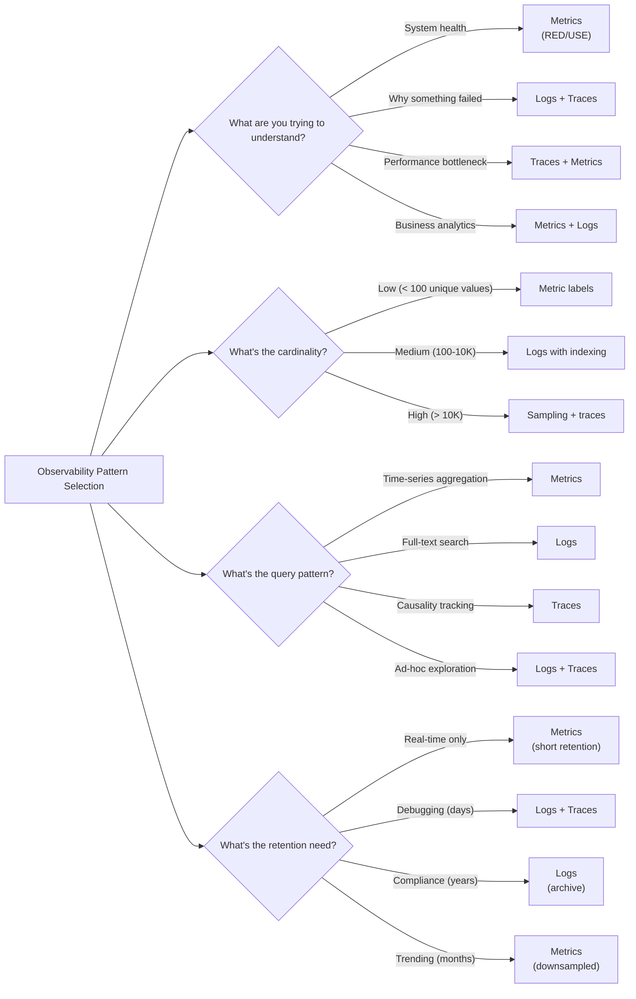

# 12. Observability

> Metrics, Logging, Tracing - Understanding what your distributed system is doing

---

## ELI5: Explain Like I'm 5

<div class="learner-section" markdown>

**Your task:** After implementing observability patterns, explain them simply.

**Prompts to guide you:**

1. **What is observability in one sentence?**
    - Your answer: <span class="fill-in">[Fill in after implementation]</span>

2. **What are the three pillars of observability?**
    - Your answer: <span class="fill-in">[Fill in after implementation]</span>

3. **Real-world analogy for metrics:**
    - Example: "Metrics are like a car's dashboard showing speed, fuel, temperature..."
    - Your analogy: <span class="fill-in">[Fill in]</span>

4. **Real-world analogy for logs:**
    - Example: "Logs are like a detailed diary of everything that happened..."
    - Your analogy: <span class="fill-in">[Fill in]</span>

5. **Real-world analogy for traces:**
    - Example: "Traces are like following a package through the postal system..."
    - Your analogy: <span class="fill-in">[Fill in]</span>

6. **When should you add metrics vs logs vs traces?**
    - Your answer: <span class="fill-in">[Fill in after practice]</span>

</div>

---

## Quick Quiz (Do BEFORE implementing)

<div class="learner-section" markdown>

**Your task:** Test your intuition without looking at code. Answer these, then verify after implementation.

### Complexity Predictions

1. **Storing all request details in memory:**
    - Space complexity: <span class="fill-in">[Your guess: O(?)]</span>
    - Verified after learning: <span class="fill-in">[Actual: O(?)]</span>

2. **Recording a metric counter increment:**
    - Time complexity: <span class="fill-in">[Your guess: O(?)]</span>
    - Space complexity: <span class="fill-in">[Your guess: O(?)]</span>
    - Verified: <span class="fill-in">[Actual]</span>

3. **Cost calculation:**
    - If you log every request at 10K req/sec = <span class="fill-in">_____</span> logs/day
    - If you sample traces at 1% = <span class="fill-in">_____</span> traces/day
    - Storage reduction factor: <span class="fill-in">_____</span> times less

### Scenario Predictions

**Scenario 1:** Your API has 99.5% success rate with a 99.9% SLO

- **Is this within SLO?** <span class="fill-in">[Yes/No - Why?]</span>
- **Error budget remaining:** <span class="fill-in">[Calculate]</span>
- **Should you alert?** <span class="fill-in">[Yes/No - Why?]</span>
- **How many more failures can you have?** <span class="fill-in">[Fill in]</span>

**Scenario 2:** Users report "slow checkout" but avg latency looks fine

- **Which observability tool helps most?** <span class="fill-in">[Metrics/Logs/Traces - Why?]</span>
- **What metric might you be missing?** <span class="fill-in">[Fill in]</span>
- **What percentile should you check?** <span class="fill-in">[P50/P95/P99 - Why?]</span>

**Scenario 3:** Metric label has user_id with 1M unique values

- **Is this a good metric label?** <span class="fill-in">[Yes/No - Why?]</span>
- **What problem does this cause?** <span class="fill-in">[Fill in]</span>
- **What should you do instead?** <span class="fill-in">[Fill in]</span>

### Trade-off Quiz

**Question:** When would structured logs be BETTER than traces for debugging?

- Your answer: <span class="fill-in">[Fill in before implementation]</span>
- Verified answer: <span class="fill-in">[Fill in after learning]</span>

**Question:** What's the MAIN difference between metrics and logs?

- [ ] Metrics are numbers, logs are text
- [ ] Metrics are aggregated, logs are individual events
- [ ] Metrics are faster, logs are slower
- [ ] Metrics are free, logs cost money

Verify after implementation: <span class="fill-in">[Which one(s)?]</span>

**Question:** Why sample traces instead of capturing 100%?

- Your answer: <span class="fill-in">[Fill in reasoning]</span>
- Verified: <span class="fill-in">[Fill in after learning about performance impact]</span>

</div>

---

## Before/After: Why This Pattern Matters

**Your task:** Compare blind systems vs observable systems to understand the impact.

### Example: Debugging a Slow API

**Problem:** Users report checkout API is slow, but you don't know why.

#### Approach 1: No Observability (Flying Blind)

```java
// No instrumentation - just the business logic
public class CheckoutService {
    public Order checkout(Cart cart) {
        validateCart(cart);
        chargePayment(cart);
        createOrder(cart);
        sendEmail(cart);
        return order;
    }
}
```

**What you can see:**

- Nothing! You have to guess what's slow
- Add println statements and redeploy
- Wait for complaints to narrow down the issue
- Time to debug: Hours to days

**Analysis:**

- Debugging time: Multiple deploy cycles
- Mean time to resolution: 4-8 hours
- Customer impact: High (prolonged issues)

#### Approach 2: With Full Observability

```java
// Instrumented with metrics, logs, and traces
public class CheckoutService {
    private final MetricsCollector metrics;
    private final StructuredLogger logger;
    private final DistributedTracer tracer;

    public Order checkout(Cart cart) {
        // Start trace
        Span span = tracer.startSpan("checkout");
        span.setTag("cart_id", cart.getId());
        span.setTag("items_count", cart.getItems().size());

        // Add context for logs
        logger.addContext("trace_id", span.traceId);
        logger.addContext("cart_id", cart.getId());

        long startTime = System.nanoTime();

        try {
            // Validate cart
            Span validateSpan = tracer.startChildSpan("validate_cart");
            validateCart(cart);
            tracer.finishSpan();

            // Charge payment
            Span paymentSpan = tracer.startChildSpan("charge_payment");
            chargePayment(cart);
            tracer.finishSpan();
            logger.info("Payment charged", Map.of("amount", cart.getTotal()));

            // Create order
            Span orderSpan = tracer.startChildSpan("create_order");
            Order order = createOrder(cart);
            tracer.finishSpan();

            // Send email
            Span emailSpan = tracer.startChildSpan("send_email");
            sendEmail(cart);
            tracer.finishSpan();

            // Record success metrics
            long duration = System.nanoTime() - startTime;
            metrics.recordRequest(duration / 1_000_000_000.0);
            logger.info("Checkout completed", Map.of("order_id", order.getId()));

            return order;

        } catch (Exception e) {
            metrics.recordError((System.nanoTime() - startTime) / 1_000_000_000.0);
            logger.error("Checkout failed", e);
            throw e;
        } finally {
            tracer.finishSpan();
            logger.clearContext();
        }
    }
}
```

**What you can see:**

1. **Metrics:** P99 latency is 3s (P50 is 100ms) - it's a tail latency issue!
2. **Logs:** Search by trace_id shows payment gateway timeouts
3. **Traces:** Visualization shows 95% of time spent in charge_payment span

**Analysis:**

- Debugging time: 5 minutes (query dashboards)
- Root cause: Payment gateway timeout for 1% of requests
- Solution: Add timeout + retry logic
- Time to resolution: 30 minutes

#### Performance Comparison

| Scenario                    | No Observability           | With Observability       | Improvement |
|-----------------------------|----------------------------|--------------------------|-------------|
| Time to detect issue        | 30+ minutes (user reports) | 30 seconds (alert fired) | 60x faster  |
| Time to identify root cause | 2-4 hours (trial/error)    | 5 minutes (query traces) | 24x faster  |
| Deploy cycles needed        | 3-5 deploys                | 1 deploy                 | 3-5x fewer  |
| Customer impact             | High (hours)               | Low (minutes)            | 10x better  |

**Your calculation:** If you have 10 incidents per month, observability saves approximately _____ engineering hours.

#### Why Does Observability Work?

**Key insight to understand:**

Without observability, debugging is like:

- Finding a needle in a haystack... blindfolded... in the dark

With observability, you can:

1. **Metrics:** Quickly identify that there IS a problem (P99 spike)
2. **Logs:** Find specific failing requests (search by error, user_id, trace_id)
3. **Traces:** See exactly where time is spent (payment span = 2.9s of 3s total)

```
No observability:
"Users say checkout is slow" → Try things → Deploy → Wait → Repeat

With observability:
"Users say checkout is slow"
  → Check metrics (P99 = 3s)
  → Check traces (payment = 2.9s)
  → Check logs (gateway timeout)
  → Fix + deploy → Done
```

**Why can you skip trial-and-error?**

- Traces show the exact bottleneck (no guessing)
- Logs provide context (what failed and why)
- Metrics prove the fix worked (P99 drops to 200ms)

**After implementing, explain in your own words:**

<div class="learner-section" markdown>

- How do the three pillars work together? <span class="fill-in">[Your answer]</span>
- What questions can you answer with each type? <span class="fill-in">[Your answer]</span>
- Why is context propagation (trace_id) important? <span class="fill-in">[Your answer]</span>

</div>

---

## Core Implementation

### Pattern 1: Metrics Collection

**Concept:** Time-series measurements for monitoring system health and performance.

**Use case:** API monitoring, resource utilization, business metrics.

```java
import java.util.*;
import java.util.concurrent.*;
import java.util.concurrent.atomic.*;

/**
 * Metrics Collection: Counter, Gauge, Histogram
 *
 * Metric types:
 * - Counter: monotonically increasing (requests, errors)
 * - Gauge: point-in-time value (CPU, memory, queue size)
 * - Histogram: distribution of values (latencies, sizes)
 *
 * Methods:
 * - RED: Rate, Errors, Duration
 * - USE: Utilization, Saturation, Errors
 */
public class MetricsCollector {

    /**
     * Counter: Monotonically increasing value
     * Time: O(1), Space: O(1)
     *
     * Use for: request counts, error counts, bytes processed
     */
    static class Counter {
        private final AtomicLong value = new AtomicLong(0);
        private final String name;
        private final Map<String, String> labels;

        Counter(String name, Map<String, String> labels) {
            this.name = name;
            this.labels = labels;
        }

        /**
         * Increment counter by 1
         * Time: O(1)
         *
         * TODO: Implement increment
         */
        public void inc() {
            // TODO: Increment value atomically
        }

        /**
         * Increment counter by delta
         * Time: O(1)
         *
         * TODO: Implement increment by delta
         */
        public void inc(long delta) {
            // TODO: Add delta to value atomically
        }

        public long get() {
            return value.get();
        }
    }

    /**
     * Gauge: Point-in-time value that can increase or decrease
     * Time: O(1), Space: O(1)
     *
     * Use for: CPU usage, memory usage, active connections
     */
    static class Gauge {
        private final AtomicDouble value = new AtomicDouble(0.0);
        private final String name;
        private final Map<String, String> labels;

        Gauge(String name, Map<String, String> labels) {
            this.name = name;
            this.labels = labels;
        }

        /**
         * Set gauge to specific value
         * Time: O(1)
         *
         * TODO: Implement gauge set
         */
        public void set(double val) {
            // TODO: Set value atomically
        }

        /**
         * Increment gauge
         * Time: O(1)
         *
         * TODO: Implement increment
         */
        public void inc(double delta) {
            // TODO: Add delta atomically
        }

        public void dec(double delta) {
            inc(-delta);
        }

        public double get() {
            return value.get();
        }
    }

    /**
     * Histogram: Distribution of observed values
     * Time: O(1) per observation, Space: O(B) where B = buckets
     *
     * Use for: request latencies, response sizes, batch sizes
     */
    static class Histogram {
        private final String name;
        private final double[] buckets; // Upper bounds
        private final AtomicLongArray counts; // Count per bucket
        private final AtomicLong sum = new AtomicLong(0);
        private final AtomicLong count = new AtomicLong(0);

        /**
         * Create histogram with specific buckets
         * Example: [0.01, 0.05, 0.1, 0.5, 1.0, 5.0]
         *
         * TODO: Initialize histogram
         */
        Histogram(String name, double[] buckets) {
            this.name = name;
            this.buckets = buckets;
            this.counts = new AtomicLongArray(buckets.length + 1); // +1 for +Inf
        }

        /**
         * Observe a value
         * Time: O(log B) with binary search
         *
         * TODO: Implement observation
         * 1. Find which bucket this value falls into
         * 2. Increment that bucket's count
         * 3. Update sum and count
         */
        public void observe(double value) {
            // TODO: Find bucket using binary search

            // TODO: Update sum and count
        }

        /**
         * Helper: Find bucket index for value
         *
         * TODO: Implement binary search
         */
        private int findBucket(double value) {
            // TODO: Binary search in buckets array
            return 0; // Replace
        }

        /**
         * Calculate percentile from histogram
         * Time: O(B)
         *
         * TODO: Implement percentile calculation
         */
        public double getPercentile(double percentile) {
            long totalCount = count.get();
            if (totalCount == 0) return 0.0;

            // TODO: Find bucket containing percentile

            return 0.0; // Replace
        }

        public double getAverage() {
            long c = count.get();
            return c > 0 ? (sum.get() / 1000.0) / c : 0.0;
        }
    }

    /**
     * RED Method: Rate, Errors, Duration
     * Time: O(1) per metric update
     *
     * TODO: Implement RED method tracking
     */
    static class REDMetrics {
        private final Counter requestCount;
        private final Counter errorCount;
        private final Histogram duration;

        REDMetrics(String service) {
            Map<String, String> labels = Map.of("service", service);
            this.requestCount = new Counter("requests_total", labels);
            this.errorCount = new Counter("errors_total", labels);
            this.duration = new Histogram("request_duration_seconds",
                new double[]{0.01, 0.05, 0.1, 0.5, 1.0, 5.0});
        }

        /**
         * Record successful request
         * Time: O(log B)
         *
         * TODO: Update RED metrics
         */
        public void recordRequest(double durationSeconds) {
            // TODO: Increment request count

            // TODO: Record duration
        }

        /**
         * Record failed request
         *
         * TODO: Update error metrics
         */
        public void recordError(double durationSeconds) {
            // TODO: Increment request and error counts

            // TODO: Record duration
        }

        public double getErrorRate() {
            long requests = requestCount.get();
            return requests > 0 ? (double)errorCount.get() / requests : 0.0;
        }

        public double getP50Latency() {
            return duration.getPercentile(0.50);
        }

        public double getP99Latency() {
            return duration.getPercentile(0.99);
        }
    }

    /**
     * USE Method: Utilization, Saturation, Errors
     * Time: O(1) per metric update
     *
     * TODO: Implement USE method tracking
     */
    static class USEMetrics {
        private final Gauge utilization;  // % of resource used
        private final Gauge saturation;   // Amount of queued work
        private final Counter errors;     // Error events

        USEMetrics(String resource) {
            Map<String, String> labels = Map.of("resource", resource);
            this.utilization = new Gauge("resource_utilization", labels);
            this.saturation = new Gauge("resource_saturation", labels);
            this.errors = new Counter("resource_errors", labels);
        }

        /**
         * Update resource utilization (0.0 to 1.0)
         *
         * TODO: Set utilization gauge
         */
        public void setUtilization(double percent) {
            // TODO: Set gauge value
        }

        /**
         * Update saturation (queue depth)
         *
         * TODO: Set saturation gauge
         */
        public void setSaturation(double queueDepth) {
            // TODO: Set gauge value
        }

        /**
         * Record resource error
         *
         * TODO: Increment error counter
         */
        public void recordError() {
            // TODO: Increment errors
        }
    }

    // Helper class for atomic double operations
    static class AtomicDouble {
        private final AtomicLong bits = new AtomicLong();

        public void set(double value) {
            bits.set(Double.doubleToLongBits(value));
        }

        public double get() {
            return Double.longBitsToDouble(bits.get());
        }

        public void addAndGet(double delta) {
            while (true) {
                long current = bits.get();
                double currentVal = Double.longBitsToDouble(current);
                double newVal = currentVal + delta;
                long newBits = Double.doubleToLongBits(newVal);
                if (bits.compareAndSet(current, newBits)) {
                    return;
                }
            }
        }
    }
}
```

**Runnable Client Code:**

```java
import java.util.*;

public class MetricsClient {

    public static void main(String[] args) throws InterruptedException {
        System.out.println("=== Metrics Collection ===\n");

        // Test 1: Counter
        System.out.println("--- Test 1: Counter ---");
        MetricsCollector.Counter requests = new MetricsCollector.Counter(
            "http_requests_total",
            Map.of("method", "GET", "endpoint", "/api/users")
        );

        for (int i = 0; i < 100; i++) {
            requests.inc();
        }
        System.out.println("Total requests: " + requests.get());

        // Test 2: Gauge
        System.out.println("\n--- Test 2: Gauge ---");
        MetricsCollector.Gauge cpuUsage = new MetricsCollector.Gauge(
            "cpu_usage_percent",
            Map.of("core", "0")
        );

        cpuUsage.set(45.5);
        System.out.println("CPU usage: " + cpuUsage.get() + "%");
        cpuUsage.inc(10.2);
        System.out.println("CPU usage after increase: " + cpuUsage.get() + "%");

        // Test 3: Histogram
        System.out.println("\n--- Test 3: Histogram ---");
        MetricsCollector.Histogram latency = new MetricsCollector.Histogram(
            "request_duration_seconds",
            new double[]{0.01, 0.05, 0.1, 0.5, 1.0, 5.0}
        );

        Random rand = new Random(42);
        for (int i = 0; i < 1000; i++) {
            double duration = rand.nextGaussian() * 0.2 + 0.3; // Mean 300ms
            latency.observe(Math.max(0, duration));
        }

        System.out.println("Average latency: " + latency.getAverage() + "s");
        System.out.println("P50 latency: " + latency.getPercentile(0.50) + "s");
        System.out.println("P99 latency: " + latency.getPercentile(0.99) + "s");

        // Test 4: RED Method
        System.out.println("\n--- Test 4: RED Method ---");
        MetricsCollector.REDMetrics red = new MetricsCollector.REDMetrics("user-service");

        for (int i = 0; i < 95; i++) {
            double duration = rand.nextDouble() * 0.5;
            red.recordRequest(duration);
        }
        for (int i = 0; i < 5; i++) {
            double duration = rand.nextDouble() * 2.0;
            red.recordError(duration);
        }

        System.out.println("Error rate: " + (red.getErrorRate() * 100) + "%");
        System.out.println("P50 latency: " + red.getP50Latency() + "s");
        System.out.println("P99 latency: " + red.getP99Latency() + "s");

        // Test 5: USE Method
        System.out.println("\n--- Test 5: USE Method ---");
        MetricsCollector.USEMetrics use = new MetricsCollector.USEMetrics("database_pool");

        use.setUtilization(0.75); // 75% of connections in use
        use.setSaturation(12.0);  // 12 requests waiting
        use.recordError();
        use.recordError();

        System.out.println("Pool utilization: 75%");
        System.out.println("Queue saturation: 12 waiting requests");
        System.out.println("Errors recorded: 2");
    }
}
```

---

### Pattern 2: Structured Logging

**Concept:** JSON-formatted logs with consistent fields for parsing and aggregation.

**Use case:** Application logs, audit trails, debugging distributed systems.

```java
import java.util.*;
import java.time.*;
import com.fasterxml.jackson.databind.ObjectMapper;

/**
 * Structured Logging: JSON logs with context
 *
 * Log levels: TRACE, DEBUG, INFO, WARN, ERROR, FATAL
 * Context: Trace ID, User ID, Request ID
 * Fields: timestamp, level, message, context, fields
 */
public class StructuredLogger {

    enum LogLevel {
        TRACE(0), DEBUG(1), INFO(2), WARN(3), ERROR(4), FATAL(5);

        final int priority;
        LogLevel(int priority) {
            this.priority = priority;
        }
    }

    private final String service;
    private final LogLevel minLevel;
    private final ObjectMapper mapper;
    private final ThreadLocal<Map<String, Object>> context;

    public StructuredLogger(String service, LogLevel minLevel) {
        this.service = service;
        this.minLevel = minLevel;
        this.mapper = new ObjectMapper();
        this.context = ThreadLocal.withInitial(HashMap::new);
    }

    /**
     * Log entry structure
     *
     * TODO: Define log entry format
     */
    static class LogEntry {
        public String timestamp;
        public String level;
        public String service;
        public String message;
        public Map<String, Object> context;
        public Map<String, Object> fields;

        LogEntry(String service, LogLevel level, String message,
                 Map<String, Object> context, Map<String, Object> fields) {
            this.timestamp = Instant.now().toString();
            this.level = level.name();
            this.service = service;
            this.message = message;
            this.context = new HashMap<>(context);
            this.fields = fields;
        }
    }

    /**
     * Add context to current thread (trace ID, user ID, etc.)
     * Time: O(1)
     *
     * TODO: Implement context addition
     */
    public void addContext(String key, Object value) {
        // TODO: Add to thread-local context
    }

    /**
     * Clear context for current thread
     * Time: O(1)
     *
     * TODO: Implement context clearing
     */
    public void clearContext() {
        // TODO: Clear thread-local context
    }

    /**
     * Log at INFO level
     * Time: O(1)
     *
     * TODO: Implement info logging
     */
    public void info(String message) {
        log(LogLevel.INFO, message, Map.of());
    }

    public void info(String message, Map<String, Object> fields) {
        log(LogLevel.INFO, message, fields);
    }

    /**
     * Log at WARN level
     *
     * TODO: Implement warn logging
     */
    public void warn(String message) {
        log(LogLevel.WARN, message, Map.of());
    }

    public void warn(String message, Map<String, Object> fields) {
        log(LogLevel.WARN, message, fields);
    }

    /**
     * Log at ERROR level
     *
     * TODO: Implement error logging
     */
    public void error(String message) {
        log(LogLevel.ERROR, message, Map.of());
    }

    public void error(String message, Throwable t) {
        Map<String, Object> fields = new HashMap<>();
        fields.put("error", t.getClass().getName());
        fields.put("error_message", t.getMessage());
        fields.put("stack_trace", getStackTrace(t));
        log(LogLevel.ERROR, message, fields);
    }

    public void error(String message, Map<String, Object> fields) {
        log(LogLevel.ERROR, message, fields);
    }

    /**
     * Core logging method
     * Time: O(1) + O(JSON serialization)
     *
     * TODO: Implement core logging
     * 1. Check if level is enabled
     * 2. Create log entry with context
     * 3. Serialize to JSON
     * 4. Write to output
     */
    private void log(LogLevel level, String message, Map<String, Object> fields) {
        // TODO: Check if level should be logged

        // TODO: Create log entry

        // TODO: Serialize to JSON and output
    }

    /**
     * Helper: Get stack trace as string
     *
     * TODO: Implement stack trace extraction
     */
    private String getStackTrace(Throwable t) {
        // TODO: Convert stack trace to string
        return null; // Replace
    }

    /**
     * Log aggregation helper: Parse JSON logs
     *
     * TODO: Implement log parsing for aggregation
     */
    public static LogEntry parseLog(String json) {
        // TODO: Parse JSON string back to LogEntry
        return null; // Replace
    }

    /**
     * Filter logs by level
     * Time: O(N) where N = logs
     *
     * TODO: Implement log filtering
     */
    public static List<LogEntry> filterByLevel(List<LogEntry> logs, LogLevel level) {
        // TODO: Filter logs by minimum level
        return null; // Replace
    }

    /**
     * Find logs by context (e.g., trace_id)
     * Time: O(N)
     *
     * TODO: Implement context-based search
     */
    public static List<LogEntry> findByContext(List<LogEntry> logs,
                                               String key, Object value) {
        // TODO: Filter logs by context field
        return null; // Replace
    }
}
```

**Runnable Client Code:**

```java
import java.util.*;

public class StructuredLoggerClient {

    public static void main(String[] args) {
        System.out.println("=== Structured Logging ===\n");

        StructuredLogger logger = new StructuredLogger(
            "order-service",
            StructuredLogger.LogLevel.INFO
        );

        // Test 1: Basic logging
        System.out.println("--- Test 1: Basic Logging ---");
        logger.info("Service started");
        logger.info("Processing order", Map.of("order_id", "12345", "amount", 99.99));
        logger.warn("High memory usage", Map.of("memory_percent", 85));

        // Test 2: Context propagation
        System.out.println("\n--- Test 2: Context Propagation ---");
        logger.addContext("trace_id", "abc-123-def");
        logger.addContext("user_id", "user_456");

        logger.info("User logged in");
        logger.info("Fetching user data", Map.of("user_id", "user_456"));
        logger.info("Order created", Map.of("order_id", "67890"));

        logger.clearContext();

        // Test 3: Error logging
        System.out.println("\n--- Test 3: Error Logging ---");
        try {
            throw new RuntimeException("Database connection failed");
        } catch (Exception e) {
            logger.error("Failed to process order", e);
        }

        // Test 4: Different log levels
        System.out.println("\n--- Test 4: Log Levels ---");
        StructuredLogger debugLogger = new StructuredLogger(
            "debug-service",
            StructuredLogger.LogLevel.DEBUG
        );

        debugLogger.info("This appears");
        // debugLogger.debug("This also appears"); // Would need debug method
        debugLogger.warn("Warning message");
        debugLogger.error("Error message");

        // Test 5: Structured fields
        System.out.println("\n--- Test 5: Structured Fields ---");
        Map<String, Object> orderFields = new HashMap<>();
        orderFields.put("order_id", "ORDER-123");
        orderFields.put("customer_id", "CUST-456");
        orderFields.put("total", 149.99);
        orderFields.put("items_count", 3);

        logger.info("Order completed", orderFields);
    }
}
```

---

### Pattern 3: Distributed Tracing

**Concept:** Track requests across multiple services with parent-child relationships.

**Use case:** Debugging microservices, understanding request flow, finding bottlenecks.

```java
import java.util.*;
import java.time.*;
import java.util.concurrent.*;

/**
 * Distributed Tracing: Track requests across services
 *
 * Concepts:
 * - Trace: End-to-end request flow
 * - Span: Single operation within a trace
 * - Context: Trace ID + Span ID propagated across services
 */
public class DistributedTracer {

    /**
     * Trace context: Propagated across service boundaries
     *
     * TODO: Define trace context structure
     */
    static class TraceContext {
        String traceId;      // Unique ID for entire trace
        String spanId;       // Current span ID
        String parentSpanId; // Parent span ID (null for root)

        TraceContext(String traceId, String spanId, String parentSpanId) {
            this.traceId = traceId;
            this.spanId = spanId;
            this.parentSpanId = parentSpanId;
        }

        /**
         * Create root trace context
         *
         * TODO: Generate new trace ID
         */
        public static TraceContext createRoot() {
            // TODO: Generate unique trace ID
            return null; // Replace
        }

        /**
         * Create child context for new span
         *
         * TODO: Generate child span ID
         */
        public TraceContext createChild() {
            // TODO: Keep same trace ID, new span ID
            return null; // Replace
        }
    }

    /**
     * Span: Represents single operation
     * Time: O(1) for all operations
     *
     * TODO: Define span structure
     */
    static class Span {
        String traceId;
        String spanId;
        String parentSpanId;
        String operationName;
        long startTimeMicros;
        long endTimeMicros;
        Map<String, String> tags;
        List<String> logs;

        Span(TraceContext context, String operationName) {
            this.traceId = context.traceId;
            this.spanId = context.spanId;
            this.parentSpanId = context.parentSpanId;
            this.operationName = operationName;
            this.startTimeMicros = System.nanoTime() / 1000;
            this.tags = new HashMap<>();
            this.logs = new ArrayList<>();
        }

        /**
         * Add tag to span (metadata)
         *
         * TODO: Add span tag
         */
        public void setTag(String key, String value) {
            // TODO: Add to tags map
        }

        /**
         * Log event within span
         *
         * TODO: Add log entry
         */
        public void log(String message) {
            // TODO: Add timestamped log
        }

        /**
         * Finish span (record end time)
         *
         * TODO: Record end time
         */
        public void finish() {
            // TODO: Set end time
        }

        public long getDurationMicros() {
            return endTimeMicros - startTimeMicros;
        }
    }

    /**
     * Tracer: Creates and manages spans
     */
    private final String serviceName;
    private final ThreadLocal<Deque<Span>> activeSpans;
    private final List<Span> completedSpans;

    public DistributedTracer(String serviceName) {
        this.serviceName = serviceName;
        this.activeSpans = ThreadLocal.withInitial(ArrayDeque::new);
        this.completedSpans = new CopyOnWriteArrayList<>();
    }

    /**
     * Start new root span
     * Time: O(1)
     *
     * TODO: Create root span
     */
    public Span startSpan(String operationName) {
        // TODO: Create root context and span
        return null; // Replace
    }

    /**
     * Start child span of current active span
     * Time: O(1)
     *
     * TODO: Create child span
     */
    public Span startChildSpan(String operationName) {
        // TODO: Get current span, create child context
        //
        //   Span parent = stack.peek();
        //   TraceContext parentContext = new TraceContext(
        //     parent.traceId, parent.spanId, parent.parentSpanId
        //   );
        //   TraceContext childContext = parentContext.createChild();
        //   Span span = new Span(childContext, operationName);
        //   span.setTag("service", serviceName);
        //   stack.push(span);
        //   return span;
        return null; // Replace
    }

    /**
     * Finish current span
     * Time: O(1)
     *
     * TODO: Finish and record span
     */
    public void finishSpan() {
        // TODO: Pop span from stack, finish it, store it
    }

    /**
     * Get current active span
     * Time: O(1)
     *
     * TODO: Return current span
     */
    public Span getCurrentSpan() {
        // TODO: Peek at top of stack
        return null; // Replace
    }

    /**
     * Find all spans for a trace
     * Time: O(N) where N = total spans
     *
     * TODO: Filter spans by trace ID
     */
    public List<Span> getTrace(String traceId) {
        // TODO: Filter completed spans by trace ID
        return null; // Replace
    }

    /**
     * Build trace tree for visualization
     * Time: O(N) where N = spans in trace
     *
     * TODO: Build parent-child tree
     */
    public String visualizeTrace(String traceId) {
        // TODO: Build tree structure from parent-child relationships
        //
        //   // Group by parent
        //   for (Span span : spans) {
        //     String parentId = span.parentSpanId != null ? span.parentSpanId : "root";
        //     childrenMap.computeIfAbsent(parentId, k -> new ArrayList<>())
        //                .add(span);
        //   }
        //
        //   // Find root and build tree
        //   Span root = spans.stream()
        //     .filter(s -> s.parentSpanId == null)
        //     .findFirst()
        //     .orElse(null);
        //
        //   StringBuilder sb = new StringBuilder();
        //   buildTraceString(root, childrenMap, sb, 0);
        //   return sb.toString();

        return null; // Replace
    }

    private void buildTraceString(Span span, Map<String, List<Span>> childrenMap,
                                   StringBuilder sb, int depth) {
        // TODO: Recursively build tree string
        //
        //   List<Span> children = childrenMap.get(span.spanId);
        //   if (children != null) {
        //     for (Span child : children) {
        //       buildTraceString(child, childrenMap, sb, depth + 1);
        //     }
        //   }
    }

    /**
     * Calculate critical path (longest path in trace)
     * Time: O(N) where N = spans
     *
     * TODO: Find bottleneck in trace
     */
    public List<Span> getCriticalPath(String traceId) {
        // TODO: DFS to find longest path
        return null; // Replace
    }
}
```

**Runnable Client Code:**

```java
import java.util.*;

public class DistributedTracerClient {

    public static void main(String[] args) throws InterruptedException {
        System.out.println("=== Distributed Tracing ===\n");

        DistributedTracer tracer = new DistributedTracer("order-service");

        // Test 1: Simple trace
        System.out.println("--- Test 1: Simple Trace ---");
        DistributedTracer.Span rootSpan = tracer.startSpan("process_order");
        rootSpan.setTag("order_id", "12345");
        rootSpan.log("Order validation started");

        Thread.sleep(10);
        rootSpan.log("Order validated");
        tracer.finishSpan();

        System.out.println("Root span duration: " +
            rootSpan.getDurationMicros() / 1000.0 + "ms");

        // Test 2: Parent-child spans
        System.out.println("\n--- Test 2: Parent-Child Spans ---");
        DistributedTracer.Span apiSpan = tracer.startSpan("api_request");
        apiSpan.setTag("endpoint", "/api/checkout");
        apiSpan.log("Request received");

        Thread.sleep(5);

        DistributedTracer.Span dbSpan = tracer.startChildSpan("database_query");
        dbSpan.setTag("query", "SELECT * FROM orders");
        dbSpan.log("Query started");
        Thread.sleep(15);
        dbSpan.log("Query completed");
        tracer.finishSpan(); // Finish DB span

        DistributedTracer.Span cacheSpan = tracer.startChildSpan("cache_lookup");
        cacheSpan.setTag("key", "user:123");
        Thread.sleep(2);
        tracer.finishSpan(); // Finish cache span

        apiSpan.log("Request completed");
        tracer.finishSpan(); // Finish API span

        String traceId = apiSpan.traceId;
        System.out.println("Trace ID: " + traceId);
        System.out.println("API span duration: " + apiSpan.getDurationMicros() / 1000.0 + "ms");
        System.out.println("DB span duration: " + dbSpan.getDurationMicros() / 1000.0 + "ms");
        System.out.println("Cache span duration: " + cacheSpan.getDurationMicros() / 1000.0 + "ms");

        // Test 3: Trace visualization
        System.out.println("\n--- Test 3: Trace Visualization ---");
        String visualization = tracer.visualizeTrace(traceId);
        if (visualization != null) {
            System.out.println(visualization);
        } else {
            System.out.println("(Trace visualization not yet implemented)");
        }

        // Test 4: Multiple traces
        System.out.println("\n--- Test 4: Multiple Traces ---");
        DistributedTracer.Span trace1 = tracer.startSpan("operation_1");
        Thread.sleep(5);
        tracer.finishSpan();

        DistributedTracer.Span trace2 = tracer.startSpan("operation_2");
        Thread.sleep(8);
        tracer.finishSpan();

        System.out.println("Trace 1 ID: " + trace1.traceId);
        System.out.println("Trace 2 ID: " + trace2.traceId);
        System.out.println("Different traces: " + !trace1.traceId.equals(trace2.traceId));
    }
}
```

---

### Pattern 4: SLOs and Alerting

**Concept:** Define Service Level Objectives and alert on violations.

**Use case:** Production monitoring, on-call alerting, capacity planning.

```java
import java.util.*;
import java.time.*;

/**
 * SLO Management and Alerting
 *
 * Definitions:
 * - SLI (Service Level Indicator): Actual measurement (e.g., 99.5% uptime)
 * - SLO (Service Level Objective): Target value (e.g., 99.9% uptime)
 * - SLA (Service Level Agreement): Contract with penalties (e.g., 99.95% uptime)
 * - Error Budget: Allowed failure amount (e.g., 0.1% = 43 minutes/month)
 */
public class SLOManager {

    /**
     * SLI: Service Level Indicator
     */
    enum SLIType {
        AVAILABILITY,  // % of successful requests
        LATENCY,       // % of requests below threshold
        ERROR_RATE     // % of failed requests
    }

    /**
     * SLO Definition
     *
     * TODO: Define SLO structure
     */
    static class SLO {
        String name;
        SLIType type;
        double target;         // Target value (e.g., 0.999 for 99.9%)
        Duration window;       // Time window (e.g., 30 days)
        double alertThreshold; // When to alert (e.g., 0.5 = 50% error budget consumed)

        SLO(String name, SLIType type, double target, Duration window, double alertThreshold) {
            this.name = name;
            this.type = type;
            this.target = target;
            this.window = window;
            this.alertThreshold = alertThreshold;
        }
    }

    /**
     * SLI Measurement
     *
     * TODO: Track actual measurements
     */
    static class SLIMeasurement {
        SLO slo;
        List<DataPoint> measurements;

        static class DataPoint {
            Instant timestamp;
            double value;

            DataPoint(Instant timestamp, double value) {
                this.timestamp = timestamp;
                this.value = value;
            }
        }

        SLIMeasurement(SLO slo) {
            this.slo = slo;
            this.measurements = new ArrayList<>();
        }

        /**
         * Record measurement
         * Time: O(1)
         *
         * TODO: Add data point
         */
        public void record(double value) {
            // TODO: Add measurement with timestamp
        }

        /**
         * Calculate current SLI value
         * Time: O(N) where N = measurements in window
         *
         * TODO: Calculate SLI for time window
         */
        public double calculate() {
            // TODO: Filter measurements within window
            //
            //   if (recent.isEmpty()) return 1.0;
            //
            //   // Calculate based on SLI type
            //   switch (slo.type) {
            //     case AVAILABILITY:
            //       // % of successful requests
            //       return recent.stream()
            //         .mapToDouble(dp -> dp.value)
            //         .average()
            //         .orElse(1.0);
            //     // ... other types
            //   }

            return 1.0; // Replace
        }

        /**
         * Calculate error budget remaining
         * Time: O(1) after calculate()
         *
         * TODO: Compute error budget
         * Error budget = (target - actual) / (1 - target)
         * Example: target=0.999, actual=0.998
         *   budget = (0.999 - 0.998) / (1 - 0.999) = 0.001 / 0.001 = 1.0 (100% remaining)
         */
        public double getErrorBudget() {
            // TODO: Calculate error budget
            //
            //   double allowed = 1.0 - slo.target;  // Allowed failure rate
            //   double actual = 1.0 - current;       // Actual failure rate
            //   double consumed = actual / allowed;  // Fraction consumed
            //   return Math.max(0.0, 1.0 - consumed); // Remaining budget

            return 1.0; // Replace
        }

        /**
         * Check if alert should fire
         * Time: O(1)
         *
         * TODO: Determine if alert needed
         */
        public boolean shouldAlert() {
            // TODO: Check if error budget below threshold
            return false; // Replace
        }
    }

    /**
     * Alert Rule
     *
     * TODO: Define alert conditions
     */
    static class AlertRule {
        String name;
        String query;          // Metric query (e.g., "error_rate > 0.01")
        Duration duration;     // Must be true for this long
        String severity;       // CRITICAL, WARNING, INFO
        String message;
        List<String> notifyChannels; // slack, pagerduty, email

        AlertRule(String name, String query, Duration duration,
                  String severity, String message, List<String> channels) {
            this.name = name;
            this.query = query;
            this.duration = duration;
            this.severity = severity;
            this.message = message;
            this.notifyChannels = channels;
        }
    }

    /**
     * Alert Manager
     *
     * TODO: Evaluate rules and fire alerts
     */
    static class AlertManager {
        private List<AlertRule> rules;
        private Map<String, Instant> firingAlerts; // Alert name -> first fired time

        AlertManager() {
            this.rules = new ArrayList<>();
            this.firingAlerts = new HashMap<>();
        }

        /**
         * Add alert rule
         *
         * TODO: Register alert rule
         */
        public void addRule(AlertRule rule) {
            // TODO: Add to rules list
        }

        /**
         * Evaluate all rules
         * Time: O(R) where R = rules
         *
         * TODO: Check all alert conditions
         */
        public List<Alert> evaluate(Map<String, Double> metrics) {
            List<Alert> alerts = new ArrayList<>();

            // TODO: Implement iteration/conditional logic
            //
            //     if (condition) {
            //       // Check if been firing long enough
            //       Instant firstFired = firingAlerts.computeIfAbsent(
            //         rule.name, k -> Instant.now()
            //       );
            //       Duration firingFor = Duration.between(firstFired, Instant.now());
            //
            //       if (firingFor.compareTo(rule.duration) >= 0) {
            //         alerts.add(new Alert(rule));
            //       }
            //     } else {
            //       // Clear if no longer firing
            //       firingAlerts.remove(rule.name);
            //     }
            //   }

            return alerts; // Replace
        }

        /**
         * Helper: Evaluate query condition
         *
         * TODO: Parse and evaluate simple queries
         */
        private boolean evaluateQuery(String query, Map<String, Double> metrics) {
            // TODO: Parse query like "error_rate > 0.01"
            //
            //   String metric = parts[0];
            //   String operator = parts[1];
            //   double threshold = Double.parseDouble(parts[2]);
            //
            //   Double value = metrics.get(metric);
            //   if (value == null) return false;
            //
            //   switch (operator) {
            //     case ">": return value > threshold;
            //     case "<": return value < threshold;
            //     case ">=": return value >= threshold;
            //     case "<=": return value <= threshold;
            //     default: return false;
            //   }

            return false; // Replace
        }
    }

    /**
     * Fired Alert
     *
     * TODO: Alert notification structure
     */
    static class Alert {
        AlertRule rule;
        Instant firedAt;

        Alert(AlertRule rule) {
            this.rule = rule;
            this.firedAt = Instant.now();
        }

        @Override
        public String toString() {
            return String.format("[%s] %s: %s",
                rule.severity, rule.name, rule.message);
        }
    }

    /**
     * Runbook: Steps to resolve alert
     *
     * TODO: Define runbook structure
     */
    static class Runbook {
        String alertName;
        String description;
        List<String> investigationSteps;
        List<String> resolutionSteps;
        Map<String, String> relatedDashboards;

        Runbook(String alertName) {
            this.alertName = alertName;
            this.investigationSteps = new ArrayList<>();
            this.resolutionSteps = new ArrayList<>();
            this.relatedDashboards = new HashMap<>();
        }

        public void addInvestigationStep(String step) {
            investigationSteps.add(step);
        }

        public void addResolutionStep(String step) {
            resolutionSteps.add(step);
        }

        public void addDashboard(String name, String url) {
            relatedDashboards.put(name, url);
        }

        @Override
        public String toString() {
            StringBuilder sb = new StringBuilder();
            sb.append("=== Runbook: ").append(alertName).append(" ===\n\n");
            sb.append(description).append("\n\n");

            sb.append("Investigation Steps:\n");
            for (int i = 0; i < investigationSteps.size(); i++) {
                sb.append((i + 1)).append(". ").append(investigationSteps.get(i)).append("\n");
            }

            sb.append("\nResolution Steps:\n");
            for (int i = 0; i < resolutionSteps.size(); i++) {
                sb.append((i + 1)).append(". ").append(resolutionSteps.get(i)).append("\n");
            }

            if (!relatedDashboards.isEmpty()) {
                sb.append("\nRelated Dashboards:\n");
                relatedDashboards.forEach((name, url) ->
                    sb.append("- ").append(name).append(": ").append(url).append("\n")
                );
            }

            return sb.toString();
        }
    }
}
```

**Runnable Client Code:**

```java
import java.util.*;
import java.time.*;

public class SLOManagerClient {

    public static void main(String[] args) throws InterruptedException {
        System.out.println("=== SLO Management and Alerting ===\n");

        // Test 1: SLO Tracking
        System.out.println("--- Test 1: SLO Tracking ---");
        SLOManager.SLO availabilitySLO = new SLOManager.SLO(
            "API Availability",
            SLOManager.SLIType.AVAILABILITY,
            0.999,  // 99.9% target
            Duration.ofDays(30),
            0.5     // Alert at 50% error budget
        );

        SLOManager.SLIMeasurement measurement = new SLOManager.SLIMeasurement(availabilitySLO);

        // Simulate measurements (1 = success, 0 = failure)
        for (int i = 0; i < 1000; i++) {
            measurement.record(1.0); // Success
        }
        for (int i = 0; i < 2; i++) {
            measurement.record(0.0); // Failure
        }

        double currentSLI = measurement.calculate();
        double errorBudget = measurement.getErrorBudget();
        boolean shouldAlert = measurement.shouldAlert();

        System.out.println("Target SLO: 99.9%");
        System.out.println("Current SLI: " + (currentSLI * 100) + "%");
        System.out.println("Error budget remaining: " + (errorBudget * 100) + "%");
        System.out.println("Should alert: " + shouldAlert);

        // Test 2: Alert Rules
        System.out.println("\n--- Test 2: Alert Rules ---");
        SLOManager.AlertManager alertManager = new SLOManager.AlertManager();

        SLOManager.AlertRule highErrorRate = new SLOManager.AlertRule(
            "HighErrorRate",
            "error_rate > 0.01",
            Duration.ofMinutes(5),
            "CRITICAL",
            "Error rate above 1% for 5+ minutes",
            Arrays.asList("pagerduty", "slack")
        );

        SLOManager.AlertRule highLatency = new SLOManager.AlertRule(
            "HighLatency",
            "p99_latency > 1.0",
            Duration.ofMinutes(10),
            "WARNING",
            "P99 latency above 1s for 10+ minutes",
            Arrays.asList("slack")
        );

        alertManager.addRule(highErrorRate);
        alertManager.addRule(highLatency);

        // Simulate metrics
        Map<String, Double> metrics = new HashMap<>();
        metrics.put("error_rate", 0.015);  // 1.5% errors
        metrics.put("p99_latency", 0.8);   // 800ms

        List<SLOManager.Alert> alerts = alertManager.evaluate(metrics);
        System.out.println("Alerts fired: " + alerts.size());
        for (SLOManager.Alert alert : alerts) {
            System.out.println(alert);
        }

        // Test 3: Error Budget Calculation
        System.out.println("\n--- Test 3: Error Budget Calculation ---");
        double[] targets = {0.99, 0.999, 0.9999};
        String[] names = {"99%", "99.9%", "99.99%"};

        for (int i = 0; i < targets.length; i++) {
            double target = targets[i];
            double allowedDowntime = (1.0 - target) * 30 * 24 * 60; // minutes per month
            System.out.println("\nSLO: " + names[i]);
            System.out.println("Allowed downtime: " + allowedDowntime + " minutes/month");
            System.out.println("That's " + (allowedDowntime / 60) + " hours/month");
        }

        // Test 4: Runbook
        System.out.println("\n--- Test 4: Runbook ---");
        SLOManager.Runbook runbook = new SLOManager.Runbook("HighErrorRate");
        runbook.description = "Error rate has exceeded 1% threshold";

        runbook.addInvestigationStep("Check error logs for patterns");
        runbook.addInvestigationStep("Review recent deployments");
        runbook.addInvestigationStep("Check downstream service health");
        runbook.addInvestigationStep("Verify database connection pool");

        runbook.addResolutionStep("Rollback recent deployment if needed");
        runbook.addResolutionStep("Scale up affected services");
        runbook.addResolutionStep("Enable circuit breakers");
        runbook.addResolutionStep("Update on-call ticket with findings");

        runbook.addDashboard("Error Dashboard", "https://grafana.example.com/errors");
        runbook.addDashboard("Service Health", "https://grafana.example.com/health");

        System.out.println(runbook);
    }
}
```

---

## Debugging Challenges

**Your task:** Find and fix bugs in broken observability implementations. This tests your understanding.

### Challenge 1: Missing Metric Labels

```java
/**
 * This metrics collector is supposed to track requests per endpoint.
 * It has a CRITICAL DESIGN FLAW. Find it!
 */
public class EndpointMetrics {
    private Counter totalRequests = new Counter("http_requests_total", Map.of());

    public void recordRequest(String endpoint, String method, int statusCode) {
        totalRequests.inc();
    }

    public long getRequestCount() {
        return totalRequests.get();
    }
}
```

**Your debugging:**

- Bug: <span class="fill-in">[What\'s the bug?]</span>
- **Impact:** <span class="fill-in">[Why is this a problem in production?]</span>

**Test scenario:**

- 100 requests to `/api/users` (GET)
- 50 requests to `/api/orders` (POST)
- 10 requests to `/api/users` (DELETE)
- **What can you query?** <span class="fill-in">[Fill in what you can and can't learn]</span>

<details markdown>
<summary>Click to verify your answers</summary>

**Bug:** No labels! All requests go into a single counter, so you can't distinguish:

- Which endpoint is getting traffic
- Which HTTP method is used
- Which status codes are returned

**Fix:**

```java
public void recordRequest(String endpoint, String method, int statusCode) {
    Map<String, String> labels = Map.of(
        "endpoint", endpoint,
        "method", method,
        "status_code", String.valueOf(statusCode)
    );
    Counter counter = new Counter("http_requests_total", labels);
    counter.inc();
}
```

**Impact:** Without labels, you can't:

- Alert on specific endpoint errors
- Identify which API is slow
- Track SLOs per endpoint
- Debug which endpoint is causing load

</details>

---

### Challenge 2: High-Cardinality Labels

```java
/**
 * This code tracks cache hits/misses per user.
 * It has a SCALABILITY BUG. Find it!
 */
public class CacheMetrics {
    private Map<String, Counter> cacheHitsByUser = new ConcurrentHashMap<>();

    public void recordCacheHit(String userId) {
        cacheHitsByUser
            .computeIfAbsent(userId,
                k -> new Counter("cache_hits", Map.of("user_id", userId)))
            .inc();
    }

    // 1M users = 1M unique metric series!
}
```

**Your debugging:**

- **Bug:** <span class="fill-in">[What's the high-cardinality problem?]</span>
- **Memory impact:** <span class="fill-in">[How much memory with 1M users?]</span>
- **Query impact:** <span class="fill-in">[Why do queries become slow?]</span>
- **Fix:** <span class="fill-in">[What should you track instead?]</span>

**Cardinality calculation:**

- If 1M users, you create _____ unique time series
- If each series uses 10KB of memory = <span class="fill-in">_____</span> GB total
- Query time grows from 10ms to _____ seconds

<details markdown>
<summary>Click to verify your answers</summary>

**Bug:** `user_id` is a high-cardinality label (potentially millions of unique values). This causes:

- **Memory explosion:** Each unique label combination = new time series
- **Slow queries:** Database must scan millions of series
- **Storage costs:** Unbounded growth
- **Metric system overload:** Can crash Prometheus/etc.

**Fix:** Track aggregated metrics instead:

```java
// GOOD: Low cardinality
private Counter cacheHits = new Counter("cache_hits_total", Map.of());
private Counter cacheMisses = new Counter("cache_misses_total", Map.of());

public void recordCacheHit(boolean hit) {
    if (hit) {
        cacheHits.inc();
    } else {
        cacheMisses.inc();
    }
}

// If you need user-level detail, use logs or traces instead!
logger.info("Cache hit", Map.of("user_id", userId, "key", key));
```

**Rule:** Metric labels should have **bounded cardinality** (< 100 unique values per label).
</details>

---

### Challenge 3: Slow Histogram Queries

```java
/**
 * This histogram implementation is correct but SLOW.
 * Why? How to fix it?
 */
public class LatencyHistogram {
    private List<Double> allLatencies = new ArrayList<>();

    public void observe(double latency) {
        synchronized(allLatencies) {
            allLatencies.add(latency);
        }
    }

    public double getP99() {
        synchronized(allLatencies) {
            if (allLatencies.isEmpty()) return 0.0;

            Collections.sort(allLatencies);
            int index = (int)(allLatencies.size() * 0.99);
            return allLatencies.get(index);
        }
    }
}
```

**Your debugging:**

- **Performance bug:** <span class="fill-in">[What operation is expensive?]</span>
- **Complexity:** <span class="fill-in">[What's the time complexity?]</span>
- **With 1M observations:** <span class="fill-in">[How long does getP99 take?]</span>
- **Fix:** <span class="fill-in">[What data structure should you use?]</span>

**Performance impact:**

- 1M observations in list
- Calling getP99 100 times per second
- Current: <span class="fill-in">_____</span> ms per call
- Fixed: <span class="fill-in">_____</span> ms per call

<details markdown>
<summary>Click to verify your answers</summary>

**Bug:** Sorting entire list on every query is O(n log n). With 1M observations:

- 1M * log(1M) ≈ 20M operations
- At 100 calls/sec = 2 billion operations/sec!

**Fix:** Use bucketed histogram (like Prometheus):

```java
public class LatencyHistogram {
    private final double[] buckets = {0.01, 0.05, 0.1, 0.5, 1.0, 5.0};
    private final AtomicLongArray counts = new AtomicLongArray(buckets.length + 1);
    private final AtomicLong totalCount = new AtomicLong(0);

    public void observe(double latency) {
        int bucket = findBucket(latency);
        counts.incrementAndGet(bucket);
        totalCount.incrementAndGet();
    }

    public double getP99() {
        long total = totalCount.get();
        long target = (long)(total * 0.99);
        long cumulative = 0;

        for (int i = 0; i < counts.length(); i++) {
            cumulative += counts.get(i);
            if (cumulative >= target) {
                return i < buckets.length ? buckets[i] : Double.POSITIVE_INFINITY;
            }
        }
        return 0.0;
    }
}
```

**Improvement:**

- **Before:** O(n log n) = ~20M ops for 1M observations
- **After:** O(buckets) = ~7 ops regardless of observation count
- **Speedup:** ~3 million times faster!

**Trade-off:** Approximate percentiles (bucket boundaries) vs exact values.
</details>

---

### Challenge 4: Broken Trace Sampling

```java
/**
 * This trace sampler is supposed to sample 10% of traces.
 * It has a CRITICAL BUG. Find it!
 */
public class TraceSampler {
    private Random random = new Random();
    private double sampleRate = 0.10; // 10%

    public boolean shouldSample(String traceId) {
        return random.nextDouble() < sampleRate;
    }
}

// Usage:
public Span startSpan(String operation) {
    if (sampler.shouldSample(currentTraceId)) {
        return tracer.startSpan(operation);
    }
    return null;
}
```

**Your debugging:**

- **Bug:** <span class="fill-in">[What's inconsistent about this sampling?]</span>
- **Impact:** <span class="fill-in">[What happens to child spans?]</span>
- **Trace visualization:** <span class="fill-in">[Why are traces incomplete?]</span>
- **Fix:** <span class="fill-in">[How to ensure consistent sampling?]</span>

**Test scenario:**

- Parent span: API request (sampled = true)
- Child span: Database query (sampled = ???)
- Grandchild span: Cache lookup (sampled = ???)
- **Problem:** <span class="fill-in">[What's broken about the trace?]</span>

<details markdown>
<summary>Click to verify your answers</summary>

**Bug:** Each span makes independent sampling decision! This causes:

- Parent sampled but children dropped → incomplete traces
- Children sampled but parent dropped → orphaned spans
- Can't reconstruct full request flow

**Fix:** Sample based on trace ID (head-based sampling):

```java
public class TraceSampler {
    private double sampleRate = 0.10;

    public boolean shouldSample(String traceId) {
        // Hash trace ID to get consistent decision
        // All spans in same trace get same result
        long hash = Math.abs(traceId.hashCode());
        return (hash % 100) < (sampleRate * 100);
    }
}

// Now all spans in trace have same sampling decision!
```

**Alternative:** Tail-based sampling (sample AFTER seeing full trace):

```java
// Keep all traces in memory temporarily
// Sample based on: errors, high latency, specific endpoints
// Trade-off: More memory, but smarter sampling
```

**Key insight:** Sampling decision must be consistent across entire trace.
</details>

---

### Challenge 5: Missing Log Context

```java
/**
 * These logs look fine individually but are USELESS for debugging.
 * What's missing?
 */
public class OrderService {
    private StructuredLogger logger = new StructuredLogger("order-service");

    public void processOrder(Order order) {
        logger.info("Processing order");

        validateOrder(order);
        logger.info("Order validated");

        chargePayment(order);
        logger.info("Payment charged");

        createShipment(order);
        logger.info("Shipment created");
    }
}

// Logs in production:
// {"timestamp":"...", "level":"INFO", "message":"Processing order"}
// {"timestamp":"...", "level":"INFO", "message":"Payment charged"}
// {"timestamp":"...", "level":"INFO", "message":"Order validated"}
// {"timestamp":"...", "level":"INFO", "message":"Shipment created"}
```

**Your debugging:**

- **Bug:** <span class="fill-in">[What's missing from every log?]</span>
- **Debugging scenario:** <span class="fill-in">[How do you find logs for order #12345?]</span>
- **Correlation:** <span class="fill-in">[How do you trace a request across services?]</span>
- **Fix:** <span class="fill-in">[What fields should every log have?]</span>

<details markdown>
<summary>Click to verify your answers</summary>

**Bug:** No context! Missing:

- `order_id` - can't find logs for specific order
- `trace_id` - can't correlate across services
- `user_id` - can't find user's journey
- Ordering - can't tell which log belongs to which request

**Fix:** Add context to every log:

```java
public void processOrder(Order order) {
    // Set context once at start
    logger.addContext("order_id", order.getId());
    logger.addContext("user_id", order.getUserId());
    logger.addContext("trace_id", getCurrentTraceId());

    try {
        logger.info("Processing order", Map.of("total", order.getTotal()));

        validateOrder(order);
        logger.info("Order validated");

        chargePayment(order);
        logger.info("Payment charged", Map.of("amount", order.getTotal()));

        createShipment(order);
        logger.info("Shipment created", Map.of("tracking", shipment.getTrackingId()));

    } finally {
        logger.clearContext(); // Clean up
    }
}

// Now logs look like:
// {"timestamp":"...", "level":"INFO", "message":"Processing order",
//  "context":{"order_id":"12345", "user_id":"user_1", "trace_id":"abc-123"},
//  "fields":{"total":99.99}}
```

**Key insight:** Logs without context are useless for debugging distributed systems.
</details>

---

### Your Debugging Scorecard

After finding and fixing all bugs:

- [ ] Found high-cardinality label issue
- [ ] Understood histogram performance trade-offs
- [ ] Fixed trace sampling consistency
- [ ] Added proper log context
- [ ] Avoided common observability pitfalls

**Common mistakes you discovered:**

1. <span class="fill-in">[List the patterns you noticed]</span>
2. <span class="fill-in">[Fill in]</span>
3. <span class="fill-in">[Fill in]</span>

---

## Decision Framework

**Your task:** Build decision trees for observability patterns.

### Question 1: Metrics vs Logs vs Traces?

Answer after implementation:

**Use Metrics when:**

- Aggregated data: <span class="fill-in">[Count of requests, average latency]</span>
- Alerting: <span class="fill-in">[Need to trigger alerts on thresholds]</span>
- Dashboards: <span class="fill-in">[Time-series graphs and trends]</span>
- Low overhead: <span class="fill-in">[Constant memory usage]</span>

**Use Logs when:**

- Debugging: <span class="fill-in">[Need full context of what happened]</span>
- Audit trail: <span class="fill-in">[Who did what and when]</span>
- Irregular events: <span class="fill-in">[Errors, exceptions, business events]</span>
- Flexible queries: <span class="fill-in">[Search by any field]</span>

**Use Traces when:**

- Distributed systems: <span class="fill-in">[Request flows across services]</span>
- Performance analysis: <span class="fill-in">[Find bottlenecks in request path]</span>
- Dependencies: <span class="fill-in">[Understand service relationships]</span>
- Latency debugging: <span class="fill-in">[Which service is slow]</span>

### Question 2: When to add observability?

**During development:**

- Add metrics: <span class="fill-in">[Core business operations, API endpoints]</span>
- Add logs: <span class="fill-in">[Error paths, state changes, important decisions]</span>
- Add traces: <span class="fill-in">[Service boundaries, external calls]</span>

**During incidents:**

- Add metrics: <span class="fill-in">[Missing visibility into problem area]</span>
- Add logs: <span class="fill-in">[Need more context for debugging]</span>
- Add traces: <span class="fill-in">[Don't understand request flow]</span>

### Question 3: How much is too much?

**Metrics:**

- Too few: <span class="fill-in">[Can't understand system health]</span>
- Too many: <span class="fill-in">[Storage costs, query performance]</span>
- Sweet spot: <span class="fill-in">[RED/USE for each service, key business metrics]</span>

**Logs:**

- Too few: <span class="fill-in">[Can't debug issues]</span>
- Too many: <span class="fill-in">[Storage costs, signal-to-noise ratio]</span>
- Sweet spot: <span class="fill-in">[WARN+ always, INFO for business events, DEBUG on-demand]</span>

**Traces:**

- Too few: <span class="fill-in">[Can't understand distributed requests]</span>
- Too many: <span class="fill-in">[Storage costs, performance impact]</span>
- Sweet spot: <span class="fill-in">[Sample based on traffic volume (1-10%)]</span>

### Your Decision Tree

Build this after solving practice scenarios:



---

## Practice

### Scenario 1: Monitor E-commerce API

**Requirements:**

- REST API: /checkout, /orders, /products
- Traffic: 10K requests/sec peak
- SLO: 99.9% availability, P99 < 500ms
- Team of 5 engineers on-call rotation

**Your observability design:**

Metrics to collect:

1. <span class="fill-in">[What RED metrics for each endpoint?]</span>
2. <span class="fill-in">[What USE metrics for infrastructure?]</span>
3. <span class="fill-in">[What business metrics (orders, revenue)?]</span>

Logs to capture:

1. <span class="fill-in">[What should be logged at each level?]</span>
2. <span class="fill-in">[How to add trace IDs to logs?]</span>
3. <span class="fill-in">[What fields in structured logs?]</span>

Traces to implement:

1. <span class="fill-in">[Where to start/end spans?]</span>
2. <span class="fill-in">[What sampling rate?]</span>
3. <span class="fill-in">[What tags on spans?]</span>

Alerts to configure:

1. <span class="fill-in">[SLO violation alerts?]</span>
2. <span class="fill-in">[Error budget alerts?]</span>
3. <span class="fill-in">[Runbook for each alert?]</span>

### Scenario 2: Debug Distributed Payment System

**Context:**

- Payment service calls: auth-service, fraud-service, payment-gateway
- Users reporting "payment hangs" (no error, just slow)
- Happens for 1% of requests
- Can't reproduce in staging

**Your debugging approach:**

Using traces:

1. <span class="fill-in">[What would you look for first?]</span>
2. <span class="fill-in">[How to find the slow requests?]</span>
3. <span class="fill-in">[How to identify which service is slow?]</span>

Using logs:

1. <span class="fill-in">[What log queries would you run?]</span>
2. <span class="fill-in">[How to correlate logs across services?]</span>
3. <span class="fill-in">[What might you be missing?]</span>

Using metrics:

1. <span class="fill-in">[What metrics would show the problem?]</span>
2. <span class="fill-in">[How to narrow down the time window?]</span>
3. <span class="fill-in">[What percentiles to examine?]</span>

Root cause:

- How would you prove your hypothesis? <span class="fill-in">[Your answer]</span>
- What would you change to fix it? <span class="fill-in">[Your answer]</span>
- What observability would you add? <span class="fill-in">[Your answer]</span>

### Scenario 3: Capacity Planning for Growth

**Situation:**

- Current: 1K requests/sec
- Growth: Expected 10K requests/sec in 6 months
- Need to plan infrastructure scaling

**Your analysis approach:**

Metrics analysis:

1. <span class="fill-in">[What metrics show current capacity?]</span>
2. <span class="fill-in">[How to extrapolate to 10x load?]</span>
3. <span class="fill-in">[What are the bottlenecks?]</span>

Load testing:

1. <span class="fill-in">[What metrics to collect during load test?]</span>
2. <span class="fill-in">[How to identify breaking points?]</span>
3. <span class="fill-in">[What percentiles matter most?]</span>

Planning:

1. <span class="fill-in">[When will current capacity be exceeded?]</span>
2. <span class="fill-in">[What needs to be scaled (compute, db, cache)?]</span>
3. <span class="fill-in">[What are the cost implications?]</span>

---

## Review Checklist

Before moving to the next topic:

- [ ] **Implementation**
    - [ ] Counter, Gauge, Histogram work correctly
    - [ ] RED and USE metrics implemented
    - [ ] Structured logging with JSON output works
    - [ ] Distributed tracing with spans works
    - [ ] SLO tracking and error budget calculation works
    - [ ] Alert rule evaluation works
    - [ ] All client code runs successfully

- [ ] **Understanding**
    - [ ] Filled in all ELI5 explanations
    - [ ] Understand difference between metrics/logs/traces
    - [ ] Know when to use RED vs USE method
    - [ ] Understand trace context propagation
    - [ ] Know how to calculate error budget
    - [ ] Can design alert rules

- [ ] **Decision Making**
    - [ ] Know when to use each observability pattern
    - [ ] Understand sampling strategies
    - [ ] Can design SLOs for a service
    - [ ] Completed practice scenarios
    - [ ] Can explain observability trade-offs

- [ ] **Mastery Check**
    - [ ] Could implement metrics collector from memory
    - [ ] Could add observability to new service
    - [ ] Understand observability costs and trade-offs
    - [ ] Know how to debug with observability data
    - [ ] Can write runbooks for alerts

---

### Mastery Certification

**I certify that I can:**

- [ ] Implement metrics (Counter, Gauge, Histogram) from memory
- [ ] Design structured logging with proper context
- [ ] Implement distributed tracing with span propagation
- [ ] Calculate SLOs and error budgets
- [ ] Choose the right observability tool for each problem
- [ ] Identify and fix high-cardinality issues
- [ ] Debug systems using metrics, logs, and traces
- [ ] Design observability for a new service

**Self-assessment score:** ___/10

**If score < 8:** Review the sections where you struggled, then retry this gate.

**If score ≥ 8:** Congratulations! You've mastered observability. Proceed to the next topic.
