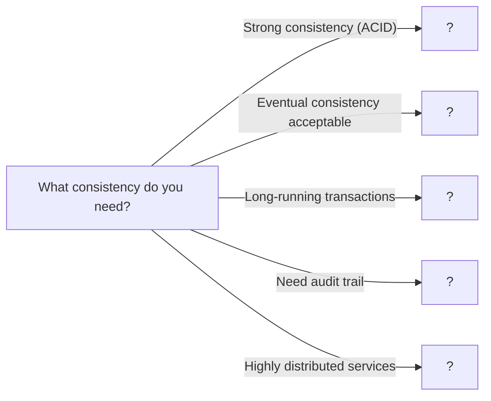

# 09. Distributed Transactions

> Maintaining consistency across multiple services and databases

---

## ELI5: Explain Like I'm 5

<div class="learner-section" markdown>

**Your task:** After implementing distributed transaction patterns, explain them simply.

**Prompts to guide you:**

1. **What is a distributed transaction in one sentence?**
    - Your answer: <span class="fill-in">[Fill in after implementation]</span>

2. **Why are distributed transactions hard?**
    - Your answer: <span class="fill-in">[Fill in after implementation]</span>

3. **Real-world analogy for 2PC:**
    - Example: "Two-phase commit is like a wedding ceremony where..."
    - Your analogy: <span class="fill-in">[Fill in]</span>

4. **What is the Saga pattern in one sentence?**
    - Your answer: <span class="fill-in">[Fill in after implementation]</span>

5. **How is orchestration different from choreography?**
    - Your answer: <span class="fill-in">[Fill in after implementation]</span>

6. **Real-world analogy for Saga choreography:**
    - Example: "Saga choreography is like a relay race where..."
    - Your analogy: <span class="fill-in">[Fill in]</span>

7. **What is compensation in one sentence?**
    - Your answer: <span class="fill-in">[Fill in after implementation]</span>

8. **When would you use event sourcing?**
    - Your answer: <span class="fill-in">[Fill in after implementation]</span>

</div>

---

## Quick Quiz (Do BEFORE implementing)

<div class="learner-section" markdown>

**Your task:** Test your intuition without looking at code. Answer these, then verify after implementation.

### Complexity Predictions

1. **Two-phase commit with 3 participants:**
    - Network round trips: <span class="fill-in">[Your guess: ?]</span>
    - Verified after learning: <span class="fill-in">[Actual: ?]</span>

2. **Saga with 5 steps:**
    - If 3rd step fails, how many compensations? <span class="fill-in">[Your guess: ?]</span>
    - Verified: <span class="fill-in">[Actual: ?]</span>

3. **Consistency guarantees:**
    - 2PC provides: <span class="fill-in">[Strong/Eventual consistency?]</span>
    - Saga provides: <span class="fill-in">[Strong/Eventual consistency?]</span>
    - Verified: <span class="fill-in">[Actual answers]</span>

### Scenario Predictions

**Scenario 1:** Transfer $100 from Account A to Account B across different databases

- **Can you use 2PC?** <span class="fill-in">[Yes/No - Why?]</span>
- **What if one database is down during commit phase?** <span class="fill-in">[What happens?]</span>
- **Is the transaction atomic?** <span class="fill-in">[Yes/No - Explain]</span>

**Scenario 2:** Order processing: Reserve inventory → Charge payment → Ship order

- **Can you use 2PC?** <span class="fill-in">[Yes/No - Why?]</span>
- **What if payment fails after inventory is reserved?** <span class="fill-in">[How to handle?]</span>
- **Should you use orchestration or choreography?** <span class="fill-in">[Fill in reasoning]</span>

**Scenario 3:** Payment service charged customer but shipping service is down

- **With 2PC, can this happen?** <span class="fill-in">[Yes/No - Why?]</span>
- **With Saga, can this happen?** <span class="fill-in">[Yes/No - Why?]</span>
- **How would you recover?** <span class="fill-in">[Fill in your approach]</span>

### Trade-off Quiz

**Question:** When would 2PC be WORSE than Saga for distributed transactions?

- Your answer: <span class="fill-in">[Fill in before implementation]</span>
- Verified answer: <span class="fill-in">[Fill in after learning]</span>

**Question:** What's the MAIN challenge with compensation in Saga?

- [ ] Compensation must be idempotent
- [ ] Compensation can fail
- [ ] Order matters (reverse order)
- [ ] All of the above

Verify after implementation: <span class="fill-in">[Which one(s)?]</span>

**Question:** Why does 2PC block while Saga doesn't?

- Your answer: <span class="fill-in">[Fill in before implementation]</span>
- Verified answer: <span class="fill-in">[Fill in after learning]</span>

</div>

---

## Before/After: Why This Pattern Matters

**Your task:** Compare naive vs optimized approaches to understand the impact.

### Example: E-Commerce Order Processing

**Problem:** Process an order involving inventory, payment, and shipping across 3 microservices.

#### Approach 1: Naive Distributed Operations (No Transaction Management)

```java
// Naive approach - Just call services, hope for the best
public class NaiveOrderProcessing {

    public boolean processOrder(Order order) {
        // Step 1: Reserve inventory
        inventoryService.reserve(order.items);

        // Step 2: Charge payment
        paymentService.charge(order.customerId, order.amount);

        // Step 3: Create shipment
        shippingService.createShipment(order);

        return true;
    }
}
```

**Problems:**

- **No rollback:** If payment fails, inventory stays reserved forever
- **Partial failures:** Customer charged but shipment never created
- **No consistency:** Services can be in inconsistent states
- **No retry logic:** Transient failures cause permanent data corruption
- **Debugging nightmare:** Can't tell which step failed or what state the system is in

**Real failure scenario:**

```
Step 1: Inventory reserved ✓
Step 2: Payment charged ✓
Step 3: Shipping service crashes ✗
Result: Customer charged, inventory locked, no shipment!
```

#### Approach 2: Two-Phase Commit (Strong Consistency)

```java
// 2PC approach - Coordinated commit across all services
public class TwoPhaseCommitOrderProcessing {

    public boolean processOrder(Order order) {
        String txId = generateTransactionId();

        // PHASE 1: PREPARE - Ask all services if they can commit
        boolean inventoryReady = inventoryService.prepare(txId, order.items);
        boolean paymentReady = paymentService.prepare(txId, order.customerId, order.amount);
        boolean shippingReady = shippingService.prepare(txId, order);

        // PHASE 2: COMMIT or ABORT
        if (inventoryReady && paymentReady && shippingReady) {
            // All ready - commit everywhere
            inventoryService.commit(txId);
            paymentService.commit(txId);
            shippingService.commit(txId);
            return true;
        } else {
            // Someone can't commit - abort everywhere
            inventoryService.abort(txId);
            paymentService.abort(txId);
            shippingService.abort(txId);
            return false;
        }
    }
}
```

**Benefits:**

- **Atomic:** Either all commit or all abort
- **Strong consistency:** No partial states
- **Locks held:** Resources reserved during prepare

**Drawbacks:**

- **Blocking:** If coordinator crashes, participants locked
- **Latency:** 2 network round trips minimum
- **Availability:** Any participant down = whole transaction fails
- **Not suitable for:** Long-running operations, high-latency networks

#### Approach 3: Saga Pattern (Eventual Consistency)

```java
// Saga approach - Sequential steps with compensation
public class SagaOrderProcessing {

    public boolean processOrder(Order order) {
        List<CompletedStep> completed = new ArrayList<>();

        try {
            // Step 1: Reserve inventory
            inventoryService.reserve(order.items);
            completed.add(new CompletedStep("inventory",
                () -> inventoryService.releaseReservation(order.items)));

            // Step 2: Charge payment
            paymentService.charge(order.customerId, order.amount);
            completed.add(new CompletedStep("payment",
                () -> paymentService.refund(order.customerId, order.amount)));

            // Step 3: Create shipment
            shippingService.createShipment(order);
            completed.add(new CompletedStep("shipping",
                () -> shippingService.cancelShipment(order)));

            return true;

        } catch (Exception e) {
            // Compensate in reverse order
            for (int i = completed.size() - 1; i >= 0; i--) {
                completed.get(i).compensate();
            }
            return false;
        }
    }
}
```

**Benefits:**

- **Non-blocking:** No locks held between steps
- **Eventual consistency:** System reaches consistent state
- **Resilient:** Can handle long-running operations
- **Suitable for:** Microservices, distributed systems

**Drawbacks:**

- **Compensation complexity:** Must implement reverse operations
- **Intermediate states visible:** Brief inconsistency possible
- **Idempotency required:** Compensations may retry
- **No isolation:** Other transactions may see partial state

#### Performance Comparison

| Aspect               | Naive            | 2PC                    | Saga                        |
|----------------------|------------------|------------------------|-----------------------------|
| **Consistency**      | None             | Strong (ACID)          | Eventual                    |
| **Availability**     | High             | Low (any down = fail)  | High                        |
| **Latency**          | 1 round trip     | 2+ round trips         | 1 round trip per step       |
| **Blocking**         | No               | Yes (locks held)       | No                          |
| **Partial failures** | Corrupt data     | All abort              | Compensate                  |
| **Complexity**       | Low              | Medium                 | High                        |
| **Best for**         | Nothing (unsafe) | Small, fast operations | Long-running, microservices |

**Latency Example (3 services, 50ms network latency each):**

- **Naive:** ~150ms (3 sequential calls) - but leaves data corrupt on failure
- **2PC:** ~300ms (prepare phase 150ms + commit phase 150ms)
- **Saga:** ~150ms (3 sequential calls) + compensation time if needed

#### Real-World Impact

**Scenario:** E-commerce site processing 1000 orders/minute

**With 2PC:**

- 1 stuck participant locks 100s of transactions
- Average latency: 300-500ms
- Failure of any service stops all orders
- Good for: Financial transfers, small critical updates

**With Saga:**

- Failures isolated per order
- Average latency: 150-200ms
- Partial failures compensated automatically
- Good for: Order processing, user onboarding, booking systems

**Your calculation:**

- For 5 microservices with 100ms latency each, 2PC takes approximately _____ ms
- Saga with same services takes approximately _____ ms
- If one service has 10% failure rate, 2PC success rate: <span class="fill-in">___</span>_%
- Saga can still complete (with compensation) in: <span class="fill-in">___</span>% of cases

#### Why Does Saga Work?

**Key insight to understand:**

In a long-running order process with potential failures:

```
Saga: Reserve → Charge → Ship (if any fails, undo previous)
```

**Why eventual consistency is acceptable:**

- Customer doesn't see intermediate states (happens in seconds)
- If compensation needed, appears as "order canceled" to user
- Each service independently consistent
- Auditability: Full history of actions + compensations

**After implementing, explain in your own words:**

<div class="learner-section" markdown>

- Why is compensation in reverse order critical? <span class="fill-in">[Your answer]</span>
- What makes a good compensation operation? <span class="fill-in">[Your answer]</span>
- When would you need orchestration vs choreography? <span class="fill-in">[Your answer]</span>

</div>

---

## Core Implementation

### Part 1: Two-Phase Commit (2PC)

**Your task:** Implement basic 2PC protocol.

```java
import java.util.*;

/**
 * Two-Phase Commit: Atomic commit across multiple participants
 *
 * Key principles:
 * - Phase 1: Prepare (voting)
 * - Phase 2: Commit/Abort (decision)
 * - Coordinator manages protocol
 * - All or nothing semantics
 */

public class TwoPhaseCommit {

    private final List<Participant> participants;
    private final TransactionLog log;

    /**
     * Initialize 2PC coordinator
     *
     * @param participants List of transaction participants
     *
     * TODO: Initialize coordinator
     * - Store participants
     * - Create transaction log
     */
    public TwoPhaseCommit(List<Participant> participants) {
        // TODO: Store participants list

        // TODO: Create transaction log

        this.participants = null; // Replace
        this.log = null; // Replace
    }

    /**
     * Execute distributed transaction
     *
     * @param transactionId Transaction identifier
     * @param operations Operations to execute
     * @return Transaction result
     *
     * TODO: Implement 2PC protocol
     * Phase 1: Prepare
     *   - Send prepare to all participants
     *   - Collect votes (YES/NO)
     *   - If any NO, abort
     * Phase 2: Commit/Abort
     *   - If all YES, send commit to all
     *   - If any NO, send abort to all
     *   - Wait for acknowledgments
     */
    public TransactionResult executeTransaction(String transactionId,
                                                Map<Participant, String> operations) {
        // TODO: Log transaction start
        log.write("START " + transactionId);

        // PHASE 1: PREPARE
        System.out.println("Phase 1: Prepare");

        // TODO: Send prepare to all participants
        Map<Participant, Vote> votes = new HashMap<>();
        for (Map.Entry<Participant, String> entry : participants) {
            // TODO: Send prepare request
            // Vote vote = participant.prepare(transactionId, operation)
            // Store vote
        }

        // TODO: Check if all voted YES
        boolean allYes = true; // Calculate this

        // PHASE 2: COMMIT or ABORT
        if (allYes) {
            System.out.println("Phase 2: Commit");
            // TODO: Send commit to all participants
            // for participant:
            //   participant.commit(transactionId)
            // TODO: Log commit
            // TODO: Return success

        } else {
            System.out.println("Phase 2: Abort");
            // TODO: Send abort to all participants
            // for participant:
            //   participant.abort(transactionId)
            // TODO: Log abort
            // TODO: Return failure
        }

        return null; // Replace
    }

    /**
     * Participant in distributed transaction
     */
    static class Participant {
        String id;
        Map<String, String> preparedTransactions; // transactionId -> data

        public Participant(String id) {
            this.id = id;
            this.preparedTransactions = new HashMap<>();
        }

        /**
         * Prepare phase: Can you commit?
         *
         * TODO: Prepare transaction
         * - Check if can commit (resources available, no conflicts)
         * - If yes, lock resources and save state
         * - Return YES or NO vote
         */
        public Vote prepare(String transactionId, String operation) {
            System.out.println(id + " preparing: " + operation);

            // TODO: Check if can commit (simulate)
            // Save prepared state
            // Return vote

            // Simulate: random failure 20% of time
            if (Math.random() < 0.2) {
                System.out.println(id + " votes NO");
                return Vote.NO;
            }

            preparedTransactions.put(transactionId, operation);
            System.out.println(id + " votes YES");
            return Vote.YES;
        }

        /**
         * Commit phase: Execute the transaction
         *
         * TODO: Commit transaction
         * - Apply prepared changes
         * - Release locks
         * - Clean up prepared state
         */
        public void commit(String transactionId) {
            System.out.println(id + " committing");
            // TODO: Apply changes
            // TODO: Clean up prepared state
            preparedTransactions.remove(transactionId);
        }

        /**
         * Abort phase: Rollback the transaction
         *
         * TODO: Abort transaction
         * - Discard prepared changes
         * - Release locks
         * - Clean up prepared state
         */
        public void abort(String transactionId) {
            System.out.println(id + " aborting");
            // TODO: Rollback changes
            // TODO: Clean up prepared state
            preparedTransactions.remove(transactionId);
        }
    }

    enum Vote {
        YES, NO
    }

    static class TransactionLog {
        List<String> entries;

        public TransactionLog() {
            this.entries = new ArrayList<>();
        }

        public void write(String entry) {
            entries.add(System.currentTimeMillis() + ": " + entry);
        }
    }

    static class TransactionResult {
        boolean success;
        String message;

        public TransactionResult(boolean success, String message) {
            this.success = success;
            this.message = message;
        }
    }
}
```

### Part 2: Saga Pattern - Orchestration

**Your task:** Implement Saga with centralized orchestrator.

```java
/**
 * Saga Orchestration: Centralized coordinator manages workflow
 *
 * Key principles:
 * - Orchestrator controls flow
 * - Sequential steps with compensation
 * - Rollback on failure
 * - Each step has compensating action
 */

public class SagaOrchestrator {

    private final List<SagaStep> steps;

    /**
     * Initialize Saga orchestrator
     *
     * TODO: Initialize step list
     */
    public SagaOrchestrator() {
        // TODO: Initialize steps list
        this.steps = null; // Replace
    }

    /**
     * Add step to saga
     *
     * @param step Saga step with transaction and compensation
     */
    public void addStep(SagaStep step) {
        // TODO: Add step to list
    }

    /**
     * Execute saga
     *
     * TODO: Execute all steps sequentially
     * 1. Execute each step's transaction
     * 2. If any step fails:
     *    - Execute compensation for completed steps
     *    - Return failure
     * 3. If all succeed, return success
     */
    public SagaResult execute(SagaContext context) {
        List<SagaStep> completedSteps = new ArrayList<>();

        System.out.println("Starting Saga execution");

        // TODO: Execute each step
        for (SagaStep step : steps) {
            try {
                System.out.println("Executing: " + step.getName());
                // TODO: Execute step transaction
                // step.execute(context)

                // TODO: Add to completed steps

            } catch (Exception e) {
                System.out.println("Step failed: " + step.getName());

                // TODO: Compensate completed steps in reverse order
                System.out.println("Starting compensation");
                // for (int i = completedSteps.size() - 1; i >= 0; i--):
                //   completedSteps.get(i).compensate(context)

                // TODO: Return failure
                return new SagaResult(false, "Failed at: " + step.getName());
            }
        }

        // TODO: All steps succeeded
        System.out.println("Saga completed successfully");
        return new SagaResult(true, "Success");
    }

    /**
     * Saga step with transaction and compensation
     */
    static abstract class SagaStep {
        String name;

        public SagaStep(String name) {
            this.name = name;
        }

        public String getName() {
            return name;
        }

        /**
         * Execute forward transaction
         */
        public abstract void execute(SagaContext context) throws Exception;

        /**
         * Execute compensating transaction
         */
        public abstract void compensate(SagaContext context);
    }

    /**
     * Saga execution context (shared state)
     */
    static class SagaContext {
        Map<String, Object> data;

        public SagaContext() {
            this.data = new HashMap<>();
        }

        public void put(String key, Object value) {
            data.put(key, value);
        }

        public Object get(String key) {
            return data.get(key);
        }
    }

    static class SagaResult {
        boolean success;
        String message;

        public SagaResult(boolean success, String message) {
            this.success = success;
            this.message = message;
        }
    }
}
```

### Part 3: Saga Pattern - Choreography

**Your task:** Implement Saga with event-based choreography.

```java
/**
 * Saga Choreography: Event-driven with no central coordinator
 *
 * Key principles:
 * - Services listen for events
 * - Each service knows next step
 * - Decentralized control
 * - Event-driven compensation
 */

public class SagaChoreography {

    private final Map<String, List<EventHandler>> eventHandlers;
    private final EventBus eventBus;

    /**
     * Initialize choreography
     *
     * TODO: Initialize event system
     * - Create event bus
     * - Create handler registry
     */
    public SagaChoreography() {
        // TODO: Initialize eventHandlers map

        // TODO: Create event bus

        this.eventHandlers = null; // Replace
        this.eventBus = null; // Replace
    }

    /**
     * Register event handler
     *
     * @param eventType Event type to listen for
     * @param handler Handler to execute
     *
     * TODO: Register handler for event type
     */
    public void registerHandler(String eventType, EventHandler handler) {
        // TODO: Get or create handler list for event type

        // TODO: Add handler to list
    }

    /**
     * Publish event
     *
     * TODO: Publish event to all registered handlers
     * - Get handlers for event type
     * - Execute each handler
     * - Handlers may publish new events
     */
    public void publishEvent(Event event) {
        System.out.println("Event published: " + event.type);

        // TODO: Get handlers for event type

        // TODO: Execute each handler
        // for handler in handlers:
        //   handler.handle(event, eventBus)
    }

    /**
     * Start saga by publishing initial event
     */
    public void startSaga(Event initialEvent) {
        // TODO: Publish initial event
        publishEvent(initialEvent);
    }

    /**
     * Event handler interface
     */
    interface EventHandler {
        void handle(Event event, EventBus eventBus);
    }

    /**
     * Event bus for publishing events
     */
    static class EventBus {
        SagaChoreography choreography;

        public EventBus(SagaChoreography choreography) {
            this.choreography = choreography;
        }

        public void publish(Event event) {
            choreography.publishEvent(event);
        }
    }

    /**
     * Event in the saga
     */
    static class Event {
        String type;
        Map<String, Object> data;

        public Event(String type) {
            this.type = type;
            this.data = new HashMap<>();
        }

        public void put(String key, Object value) {
            data.put(key, value);
        }

        public Object get(String key) {
            return data.get(key);
        }
    }
}
```

### Part 4: Compensation Pattern

**Your task:** Implement compensating transactions.

```java
/**
 * Compensation: Undo completed operations on failure
 *
 * Key principles:
 * - Each operation has compensating action
 * - Compensation executed in reverse order
 * - Semantic rollback (not physical)
 * - Eventually consistent
 */

public class CompensationHandler {

    private final Stack<CompensatingAction> completedActions;

    /**
     * Initialize compensation handler
     *
     * TODO: Initialize action stack
     */
    public CompensationHandler() {
        // TODO: Create stack for completed actions
        this.completedActions = null; // Replace
    }

    /**
     * Execute action and record for compensation
     *
     * @param action Action to execute
     * @return true if successful
     *
     * TODO: Execute and record action
     * - Try to execute action
     * - If success, push to stack
     * - If failure, return false
     */
    public boolean executeWithCompensation(CompensatingAction action) {
        try {
            System.out.println("Executing: " + action.getName());
            // TODO: Execute action
            // action.execute()

            // TODO: Push to stack for potential compensation

            return true;

        } catch (Exception e) {
            System.out.println("Action failed: " + action.getName());
            return false;
        }
    }

    /**
     * Compensate all completed actions
     *
     * TODO: Execute compensating actions in reverse order
     * - Pop actions from stack
     * - Execute compensation for each
     * - Handle compensation failures
     */
    public void compensateAll() {
        System.out.println("Starting compensation");

        // TODO: While stack not empty:
        //   Pop action
        //   Execute compensation
        //   Handle errors (log but continue)

        while (!completedActions.isEmpty()) {
            CompensatingAction action = completedActions.pop();
            try {
                System.out.println("Compensating: " + action.getName());
                // TODO: Execute compensation
                // action.compensate()
            } catch (Exception e) {
                System.out.println("Compensation failed: " + action.getName());
                // TODO: Log failure but continue compensating
            }
        }
    }

    /**
     * Clear compensation stack (after successful completion)
     */
    public void clear() {
        // TODO: Clear the stack
    }

    /**
     * Action with compensating logic
     */
    static abstract class CompensatingAction {
        String name;

        public CompensatingAction(String name) {
            this.name = name;
        }

        public String getName() {
            return name;
        }

        /**
         * Execute forward action
         */
        public abstract void execute() throws Exception;

        /**
         * Execute compensating action
         */
        public abstract void compensate() throws Exception;
    }
}
```

### Part 5: Event Sourcing

**Your task:** Implement event sourcing for transaction history.

```java
/**
 * Event Sourcing: Store events instead of current state
 *
 * Key principles:
 * - All changes stored as events
 * - Current state derived from events
 * - Complete audit trail
 * - Time travel (replay to any point)
 */

public class EventSourcedAggregate {

    private final String aggregateId;
    private final List<DomainEvent> events;
    private int version;

    /**
     * Initialize event sourced aggregate
     *
     * @param aggregateId Unique identifier
     *
     * TODO: Initialize aggregate
     * - Store aggregate ID
     * - Create events list
     * - Set version to 0
     */
    public EventSourcedAggregate(String aggregateId) {
        // TODO: Store aggregateId

        // TODO: Initialize events list

        // TODO: Set version to 0

        this.aggregateId = null; // Replace
        this.events = null; // Replace
        this.version = 0;
    }

    /**
     * Apply and record event
     *
     * @param event Event to apply
     *
     * TODO: Apply event
     * - Add event to list
     * - Increment version
     * - Apply state change
     */
    public void applyEvent(DomainEvent event) {
        // TODO: Set event version

        // TODO: Add to events list

        // TODO: Increment version

        // TODO: Apply state change (handled by subclass)

        System.out.println("Event applied: " + event);
    }

    /**
     * Replay events to reconstruct state
     *
     * @param events Historical events
     *
     * TODO: Replay all events
     * - Clear current state
     * - Apply each event in order
     * - Reconstruct current state
     */
    public void replayEvents(List<DomainEvent> events) {
        System.out.println("Replaying " + events.size() + " events");

        // TODO: For each event:
        //   Apply event
        //   Update version
    }

    /**
     * Get events after specific version
     *
     * TODO: Filter events by version
     */
    public List<DomainEvent> getEventsSince(int version) {
        // TODO: Filter events where event.version > version
        return null; // Replace
    }

    /**
     * Get all events
     */
    public List<DomainEvent> getAllEvents() {
        return new ArrayList<>(events);
    }

    /**
     * Get current version
     */
    public int getVersion() {
        return version;
    }

    /**
     * Domain event
     */
    static class DomainEvent {
        String aggregateId;
        String eventType;
        int version;
        long timestamp;
        Map<String, Object> data;

        public DomainEvent(String aggregateId, String eventType) {
            this.aggregateId = aggregateId;
            this.eventType = eventType;
            this.timestamp = System.currentTimeMillis();
            this.data = new HashMap<>();
        }

        public void put(String key, Object value) {
            data.put(key, value);
        }

        public Object get(String key) {
            return data.get(key);
        }

        @Override
        public String toString() {
            return "Event{type='" + eventType + "', version=" + version + "}";
        }
    }
}
```

---

## Client Code

```java
import java.util.*;

public class DistributedTransactionsClient {

    public static void main(String[] args) {
        testTwoPhaseCommit();
        System.out.println("\n" + "=".repeat(50) + "\n");
        testSagaOrchestration();
        System.out.println("\n" + "=".repeat(50) + "\n");
        testSagaChoreography();
        System.out.println("\n" + "=".repeat(50) + "\n");
        testCompensation();
        System.out.println("\n" + "=".repeat(50) + "\n");
        testEventSourcing();
    }

    static void testTwoPhaseCommit() {
        System.out.println("=== Two-Phase Commit Test ===\n");

        // Create participants
        List<TwoPhaseCommit.Participant> participants = Arrays.asList(
            new TwoPhaseCommit.Participant("Database-A"),
            new TwoPhaseCommit.Participant("Database-B"),
            new TwoPhaseCommit.Participant("Database-C")
        );

        TwoPhaseCommit coordinator = new TwoPhaseCommit(participants);

        // Execute transaction
        Map<TwoPhaseCommit.Participant, String> operations = new HashMap<>();
        for (TwoPhaseCommit.Participant p : participants) {
            operations.put(p, "UPDATE balance SET amount = amount - 100");
        }

        TwoPhaseCommit.TransactionResult result =
            coordinator.executeTransaction("tx123", operations);

        System.out.println("\nResult: " + result.message);
    }

    static void testSagaOrchestration() {
        System.out.println("=== Saga Orchestration Test ===\n");

        SagaOrchestrator saga = new SagaOrchestrator();

        // Define saga steps
        saga.addStep(new SagaOrchestrator.SagaStep("Reserve Inventory") {
            @Override
            public void execute(SagaOrchestrator.SagaContext context) throws Exception {
                System.out.println("  -> Reserving inventory");
                context.put("inventoryReserved", true);
                // Simulate occasional failure
                if (Math.random() < 0.3) {
                    throw new Exception("Out of stock");
                }
            }

            @Override
            public void compensate(SagaOrchestrator.SagaContext context) {
                System.out.println("  -> Releasing inventory");
                context.put("inventoryReserved", false);
            }
        });

        saga.addStep(new SagaOrchestrator.SagaStep("Process Payment") {
            @Override
            public void execute(SagaOrchestrator.SagaContext context) throws Exception {
                System.out.println("  -> Processing payment");
                context.put("paymentProcessed", true);
            }

            @Override
            public void compensate(SagaOrchestrator.SagaContext context) {
                System.out.println("  -> Refunding payment");
                context.put("paymentProcessed", false);
            }
        });

        saga.addStep(new SagaOrchestrator.SagaStep("Ship Order") {
            @Override
            public void execute(SagaOrchestrator.SagaContext context) throws Exception {
                System.out.println("  -> Shipping order");
                context.put("orderShipped", true);
            }

            @Override
            public void compensate(SagaOrchestrator.SagaContext context) {
                System.out.println("  -> Canceling shipment");
                context.put("orderShipped", false);
            }
        });

        // Execute saga
        SagaOrchestrator.SagaContext context = new SagaOrchestrator.SagaContext();
        SagaOrchestrator.SagaResult result = saga.execute(context);

        System.out.println("\nResult: " + result.message);
    }

    static void testSagaChoreography() {
        System.out.println("=== Saga Choreography Test ===\n");

        SagaChoreography choreography = new SagaChoreography();

        // Register event handlers
        choreography.registerHandler("OrderCreated", (event, bus) -> {
            System.out.println("  -> Handling OrderCreated");
            System.out.println("  -> Reserving inventory");

            // Publish next event
            SagaChoreography.Event inventoryReserved =
                new SagaChoreography.Event("InventoryReserved");
            inventoryReserved.put("orderId", event.get("orderId"));
            bus.publish(inventoryReserved);
        });

        choreography.registerHandler("InventoryReserved", (event, bus) -> {
            System.out.println("  -> Handling InventoryReserved");
            System.out.println("  -> Processing payment");

            // Publish next event
            SagaChoreography.Event paymentProcessed =
                new SagaChoreography.Event("PaymentProcessed");
            paymentProcessed.put("orderId", event.get("orderId"));
            bus.publish(paymentProcessed);
        });

        choreography.registerHandler("PaymentProcessed", (event, bus) -> {
            System.out.println("  -> Handling PaymentProcessed");
            System.out.println("  -> Shipping order");

            SagaChoreography.Event orderShipped =
                new SagaChoreography.Event("OrderShipped");
            orderShipped.put("orderId", event.get("orderId"));
            System.out.println("  -> Saga complete!");
        });

        // Start saga
        SagaChoreography.Event orderCreated =
            new SagaChoreography.Event("OrderCreated");
        orderCreated.put("orderId", "order123");
        choreography.startSaga(orderCreated);
    }

    static void testCompensation() {
        System.out.println("=== Compensation Test ===\n");

        CompensationHandler handler = new CompensationHandler();

        // Define compensating actions
        boolean success = true;

        success = handler.executeWithCompensation(
            new CompensationHandler.CompensatingAction("Deduct Balance") {
                @Override
                public void execute() throws Exception {
                    System.out.println("  -> Balance deducted");
                }

                @Override
                public void compensate() throws Exception {
                    System.out.println("  -> Balance restored");
                }
            }
        );

        if (!success) return;

        success = handler.executeWithCompensation(
            new CompensationHandler.CompensatingAction("Send Email") {
                @Override
                public void execute() throws Exception {
                    System.out.println("  -> Email sent");
                    // Simulate failure
                    if (Math.random() < 0.5) {
                        throw new Exception("Email service down");
                    }
                }

                @Override
                public void compensate() throws Exception {
                    System.out.println("  -> Cancellation email sent");
                }
            }
        );

        if (!success) {
            System.out.println("\nOperation failed, compensating...");
            handler.compensateAll();
        } else {
            System.out.println("\nAll operations successful");
            handler.clear();
        }
    }

    static void testEventSourcing() {
        System.out.println("=== Event Sourcing Test ===\n");

        EventSourcedAggregate account = new EventSourcedAggregate("account123");

        // Apply events
        System.out.println("Applying events:");

        EventSourcedAggregate.DomainEvent created =
            new EventSourcedAggregate.DomainEvent("account123", "AccountCreated");
        created.put("initialBalance", 1000);
        account.applyEvent(created);

        EventSourcedAggregate.DomainEvent deposited =
            new EventSourcedAggregate.DomainEvent("account123", "MoneyDeposited");
        deposited.put("amount", 500);
        account.applyEvent(deposited);

        EventSourcedAggregate.DomainEvent withdrawn =
            new EventSourcedAggregate.DomainEvent("account123", "MoneyWithdrawn");
        withdrawn.put("amount", 200);
        account.applyEvent(withdrawn);

        System.out.println("\nCurrent version: " + account.getVersion());
        System.out.println("Total events: " + account.getAllEvents().size());

        // Replay events
        System.out.println("\nReplaying events:");
        EventSourcedAggregate newAccount = new EventSourcedAggregate("account123");
        newAccount.replayEvents(account.getAllEvents());

        System.out.println("Reconstructed version: " + newAccount.getVersion());
    }
}
```

---

## Debugging Challenges

**Your task:** Find and fix bugs in distributed transaction implementations. This tests your understanding of
distributed systems pitfalls.

### Challenge 1: Broken Saga Compensation Order

```java
/**
 * This Saga implementation has a CRITICAL compensation bug.
 * It will leave the system in an inconsistent state on failure.
 */
public class BrokenSagaCompensation {

    public SagaResult executeOrderSaga(Order order) {
        List<SagaStep> completedSteps = new ArrayList<>();

        try {
            // Step 1: Reserve inventory
            inventoryService.reserve(order.items);
            completedSteps.add(new InventoryStep());

            // Step 2: Charge payment
            paymentService.charge(order.amount);
            completedSteps.add(new PaymentStep());

            // Step 3: Create shipment (this might fail)
            shippingService.createShipment(order);
            completedSteps.add(new ShippingStep());

            return SagaResult.success();

        } catch (Exception e) {
            for (SagaStep step : completedSteps) {
                step.compensate();  // What's wrong with this?
            }
            return SagaResult.failure();
        }
    }
}
```

**Your debugging:**

- **Bug location:** <span class="fill-in">[Which line?]</span>
- **Bug explanation:** <span class="fill-in">[Why is the compensation order wrong?]</span>
- **Real-world impact:** <span class="fill-in">[What could happen?]</span>
- **Fix:** <span class="fill-in">[How to correct it?]</span>

**Scenario to trace:**

- Inventory reserved (step 1)
- Payment charged (step 2)
- Shipping fails (step 3)
- Compensation runs in forward order...
- What happens if refund depends on shipment being canceled first?

<details markdown>
<summary>Click to verify your answer</summary>

**Bug:** Compensating in forward order instead of reverse order (line with `for (SagaStep step : completedSteps)`).

**Why it's wrong:**

- Step 3 depends on step 2, step 2 depends on step 1
- Must undo in reverse dependency order
- Forward compensation can violate business rules

**Example failure:**

```
Forward order: Compensate inventory → compensate payment → compensate shipping
Problem: Refund issued before shipment canceled (business rule violation)

Reverse order: Compensate shipping → compensate payment → compensate inventory
Correct: Cancel shipment first, then refund, then release inventory
```

**Fix:**

```java
for (int i = completedSteps.size() - 1; i >= 0; i--) {
    completedSteps.get(i).compensate();
}
```

</details>

---

### Challenge 2: Non-Idempotent Compensation

```java
/**
 * This compensation is NOT idempotent - running it twice causes problems!
 * In distributed systems, compensations may retry due to network failures.
 */
public class NonIdempotentCompensation extends CompensatingAction {

    @Override
    public void execute() throws Exception {
        // Deduct inventory
        inventory.reduce(productId, quantity);
    }

    @Override
    public void compensate() throws Exception {
        inventory.add(productId, quantity);
    }
}
```

**Your debugging:**

- **Bug:** <span class="fill-in">[What happens if compensate() is called twice?]</span>
- **Scenario:** <span class="fill-in">[Network timeout causes retry - what's the result?]</span>
- **Impact:** <span class="fill-in">[What's wrong with the inventory now?]</span>
- **Fix:** <span class="fill-in">[How to make it idempotent?]</span>

**Test case:**

- Initial inventory: 100 units
- Transaction reserves: 10 units (inventory now 90)
- Compensation called first time: adds back 10 (inventory now 100) ✓
- Network timeout, retry...
- Compensation called second time: adds back 10 again!
- Current inventory: <span class="fill-in">[Fill in - is this correct?]</span>

<details markdown>
<summary>Click to verify your answer</summary>

**Bug:** Compensation adds inventory without checking if it was already compensated. Running twice adds 20 units instead
of 10.

**Impact:**

- Inventory count becomes incorrect (ghost inventory)
- Overselling possible
- Accounting mismatch

**Fix - Make it idempotent:**

```java
@Override
public void compensate() throws Exception {
    // Use idempotency key
    String compensationId = transactionId + "-inventory-compensate";

    if (compensationLog.isAlreadyProcessed(compensationId)) {
        System.out.println("Already compensated, skipping");
        return;
    }

    inventory.add(productId, quantity);
    compensationLog.markProcessed(compensationId);
}
```

**Alternative fix - Use state machine:**

```java
if (reservation.status == COMPENSATED) {
    return; // Already done
}
inventory.add(productId, quantity);
reservation.status = COMPENSATED;
```

</details>

---

### Challenge 3: Orphaned Saga (Lost Coordinator)

```java
/**
 * The saga coordinator crashes after step 2 completes.
 * Steps 1 and 2 are done, but step 3 never executes.
 * How do you detect and recover from this?
 */
public class OrphanedSaga {

    public void executeSaga(String sagaId) {
        sagaLog.write(sagaId, "STARTED");

        // Step 1: Reserve inventory
        inventoryService.reserve(sagaId, items);
        sagaLog.write(sagaId, "INVENTORY_RESERVED");

        // Step 2: Charge payment
        paymentService.charge(sagaId, amount);
        sagaLog.write(sagaId, "PAYMENT_CHARGED");

        // CRASH HERE! Coordinator dies before step 3
        // Step 3 never executes, saga never completes

        // Step 3: Create shipment
        shippingService.createShipment(sagaId, order);
        sagaLog.write(sagaId, "COMPLETED");
    }
}
```

**Your debugging:**

- **Problem:** <span class="fill-in">[What's the system state after crash?]</span>
- **Detection:** <span class="fill-in">[How do you detect this orphaned saga?]</span>
- **Recovery strategy:** <span class="fill-in">[Should you complete it or compensate?]</span>
- **Prevention:** <span class="fill-in">[How to prevent this?]</span>

**Scenario:**

- Saga started at 10:00:00
- Step 1 completed at 10:00:01
- Step 2 completed at 10:00:02
- Coordinator crashed at 10:00:02.5
- Current time: 10:05:00 (5 minutes later)
- Saga status: <span class="fill-in">[What does the log show?]</span>
- Customer charged: <span class="fill-in">[Yes/No?]</span>
- Order shipped: <span class="fill-in">[Yes/No?]</span>

<details markdown>
<summary>Click to verify your answer</summary>

**Problem:** Saga is stuck in partial state - inventory reserved, payment charged, but never shipped.

**Detection strategies:**

1. **Timeout monitoring:**

```java
// Background job finds incomplete sagas
List<Saga> stuck = sagaLog.findSagasOlderThan(5 minutes, status != COMPLETED);
for (Saga saga : stuck) {
    recoverOrCompensate(saga);
}
```

2. **Health check pattern:**

```java
// Coordinator sends heartbeats
coordinator.recordHeartbeat(sagaId, timestamp);

// Monitor detects missing heartbeats
if (timeSinceLastHeartbeat > threshold) {
    recoverSaga(sagaId);
}
```

**Recovery strategy:**

```java
// Check saga log to determine recovery action
SagaState state = sagaLog.getCurrentState(sagaId);

if (state == "PAYMENT_CHARGED") {
    // Decision point: complete or compensate?

    // Option 1: Complete the saga (forward recovery)
    shippingService.createShipment(sagaId, order);
    sagaLog.write(sagaId, "COMPLETED");

    // Option 2: Compensate (backward recovery)
    paymentService.refund(sagaId);
    inventoryService.release(sagaId);
    sagaLog.write(sagaId, "COMPENSATED");
}
```

**Prevention:**

- Persist saga state before each step
- Use durable message queue for step execution
- Implement saga recovery service
- Set timeouts for each step

</details>

---

### Challenge 4: Compensation Failure

```java
/**
 * What happens when compensation itself fails?
 * This is one of the hardest distributed transaction problems!
 */
public class CompensationFailure {

    public void executeSagaWithFailingCompensation() {
        try {
            // Step 1: Charge payment - succeeds
            paymentService.charge(customerId, 100);

            // Step 2: Reserve inventory - FAILS
            inventoryService.reserve(items);
            throw new Exception("Out of stock");

        } catch (Exception e) {
            // Try to compensate step 1
            try {
                paymentService.refund(customerId, 100);
                throw new Exception("Payment gateway timeout");

            } catch (Exception compensationError) {
                // NOW WHAT? Customer charged, no order, refund failed!
                // Your code here: <span class="fill-in">[How do you handle this?]</span>
            }
        }
    }
}
```

**Your debugging:**

- **Problem:** <span class="fill-in">[What's the current state?]</span>
- **Can you retry?** <span class="fill-in">[What if retry also fails?]</span>
- **Manual intervention?** <span class="fill-in">[How to flag for human review?]</span>
- **Customer impact:** <span class="fill-in">[What does the customer see?]</span>

**Failure tree:**

```
Transaction: Charge $100 → Reserve inventory
├─ Charge succeeds ✓
├─ Reserve fails ✗
└─ Compensation: Refund $100
   └─ Refund FAILS ✗ (payment gateway down)

Current state:

- Customer charged: $100 ✓
- Inventory reserved: No ✗
- Refund processed: No ✗
- System state: INCONSISTENT!
```

<details markdown>
<summary>Click to verify your answer</summary>

**This is a real problem with no perfect solution.** Here are the strategies:

**Strategy 1: Retry with exponential backoff**

```java
catch (Exception compensationError) {
    // Add to retry queue
    retryQueue.add(new CompensationRetry(
        sagaId,
        "refund",
        maxRetries: 10,
        backoff: EXPONENTIAL
    ));

    // Alert monitoring
    alerting.criticalError("Compensation failed for " + sagaId);
}
```

**Strategy 2: Dead letter queue + manual intervention**

```java
catch (Exception compensationError) {
    // Move to dead letter queue after max retries
    if (retryCount > MAX_RETRIES) {
        deadLetterQueue.add(new FailedCompensation(
            sagaId,
            customerId,
            amount: 100,
            reason: compensationError.getMessage()
        ));

        // Create support ticket
        ticketSystem.create(
            priority: HIGH,
            title: "Manual refund needed",
            details: "Customer " + customerId + " needs $100 refund"
        );
    }
}
```

**Strategy 3: Eventual consistency with monitoring**

```java
catch (Exception compensationError) {
    // Mark saga as "COMPENSATION_PENDING"
    sagaLog.write(sagaId, "COMPENSATION_PENDING", {
        action: "refund",
        amount: 100,
        customerId: customerId,
        failureReason: compensationError.getMessage(),
        retryAfter: now + 5.minutes
    });

    // Background job will retry
    // Dashboard shows pending compensations
    // Alert if pending > 1 hour
}
```

**Key principle:** Compensation failures require:

1. Persistent retry mechanism
2. Monitoring and alerting
3. Manual intervention workflow
4. Clear audit trail
5. Customer communication plan

**There is no automatic fix for this - it's a fundamental distributed systems problem!**
</details>

---

### Challenge 5: Partial Failure in 2PC Commit Phase

```java
/**
 * In 2PC, what happens if coordinator crashes DURING commit phase?
 * Some participants committed, others still waiting!
 */
public class TwoPhaseCommitPartialFailure {

    public void executeTransaction(String txId) {
        // PHASE 1: PREPARE - All vote YES
        List<Vote> votes = new ArrayList<>();
        for (Participant p : participants) {
            votes.add(p.prepare(txId));  // All return YES
        }

        // Decision: COMMIT
        transactionLog.write(txId, "COMMIT_DECISION");

        // PHASE 2: Send commit to all
        participants.get(0).commit(txId);  // ✓ Committed
        participants.get(1).commit(txId);  // ✓ Committed

        // CRASH HERE! Coordinator dies

        // participants.get(2).commit(txId);  // Never called!
        // participants.get(3).commit(txId);  // Never called!

        // NOW: 2 participants committed, 2 still waiting!
        // What happens to the waiting participants?
    }
}
```

**Your debugging:**

- **Problem:** <span class="fill-in">[What state are the waiting participants in?]</span>
- **Blocking:** <span class="fill-in">[Are they holding locks?]</span>
- **Recovery:** <span class="fill-in">[How do they know to commit or abort?]</span>
- **Data consistency:** <span class="fill-in">[Is data consistent across participants?]</span>

**Participant states:**

```
Participant 0: COMMITTED ✓
Participant 1: COMMITTED ✓
Participant 2: PREPARED (waiting...) ⏳
Participant 3: PREPARED (waiting...) ⏳

Time passes...
Participant 2: Still holding locks on resources!
Participant 3: Still holding locks on resources!

Other transactions: BLOCKED waiting for locks!
```

<details markdown>
<summary>Click to verify your answer</summary>

**Problem:** This is the classic "blocking" problem of 2PC!

**What happens:**

1. Participants 2 & 3 are in PREPARED state
2. They're holding locks, waiting for commit/abort
3. Coordinator is dead, can't send decision
4. They can't commit on their own (might not be safe)
5. They can't abort on their own (others might have committed)
6. **They're STUCK!**

**Recovery using transaction log:**

```java
// Participant timeout handler
if (waitingTime > TIMEOUT) {
    // Ask coordinator for decision
    Decision decision = coordinator.getDecision(txId);

    if (decision == COMMIT) {
        this.commit(txId);
    } else if (decision == ABORT) {
        this.abort(txId);
    } else {
        // Coordinator unreachable - contact other participants
        Decision consensus = askOtherParticipants(txId);

        if (consensus == COMMITTED) {
            // Someone committed - we must commit too
            this.commit(txId);
        } else if (consensus == ALL_PREPARED) {
            // Everyone waiting - check coordinator log
            Decision loggedDecision = coordinatorLog.read(txId);
            if (loggedDecision == COMMIT) {
                this.commit(txId);
            }
        }
    }
}
```

**Why coordinator log is critical:**

```java
// Coordinator MUST log decision BEFORE sending commits
transactionLog.write(txId, "COMMIT_DECISION");  // Durable write!

// Now even if coordinator crashes, recovery can read log
// and complete the transaction
```

**This is why 2PC is considered "blocking":**

- Participants can be stuck if coordinator fails
- Requires timeout + recovery protocol
- Modern systems prefer non-blocking alternatives (3PC, Paxos, Raft)

**Prevention:**

- Use coordinator replicas (HA)
- Implement participant timeout and recovery
- Use 3-phase commit (reduces blocking window)
- Consider Saga pattern instead (no blocking)

</details>

---

### Your Debugging Scorecard

After finding and fixing all bugs:

- [ ] Understood why compensation order matters
- [ ] Can implement idempotent operations
- [ ] Know how to detect and recover orphaned sagas
- [ ] Understand compensation failure handling
- [ ] Recognize 2PC blocking scenarios
- [ ] Can design recovery mechanisms

**Common distributed transaction bugs you discovered:**

1. <span class="fill-in">[List the patterns you noticed]</span>
2. <span class="fill-in">[Fill in]</span>
3. <span class="fill-in">[Fill in]</span>

**Real-world war stories (fill in after implementation):**

- Most surprising bug: <span class="fill-in">[Fill in]</span>
- Hardest to debug: <span class="fill-in">[Fill in]</span>
- Most dangerous if missed: <span class="fill-in">[Fill in]</span>

---

## Decision Framework

**Questions to answer after implementation:**

### 1. Pattern Selection

**When to use Two-Phase Commit?**

- Your scenario: <span class="fill-in">[Fill in]</span>
- Key factors: <span class="fill-in">[Fill in]</span>

**When to use Saga (Orchestration)?**

- Your scenario: <span class="fill-in">[Fill in]</span>
- Key factors: <span class="fill-in">[Fill in]</span>

**When to use Saga (Choreography)?**

- Your scenario: <span class="fill-in">[Fill in]</span>
- Key factors: <span class="fill-in">[Fill in]</span>

**When to use Event Sourcing?**

- Your scenario: <span class="fill-in">[Fill in]</span>
- Key factors: <span class="fill-in">[Fill in]</span>

### 2. Trade-offs

**Two-Phase Commit:**

- Pros: <span class="fill-in">[Fill in after understanding]</span>
- Cons: <span class="fill-in">[Fill in after understanding]</span>

**Saga (Orchestration):**

- Pros: <span class="fill-in">[Fill in after understanding]</span>
- Cons: <span class="fill-in">[Fill in after understanding]</span>

**Saga (Choreography):**

- Pros: <span class="fill-in">[Fill in after understanding]</span>
- Cons: <span class="fill-in">[Fill in after understanding]</span>

**Event Sourcing:**

- Pros: <span class="fill-in">[Fill in after understanding]</span>
- Cons: <span class="fill-in">[Fill in after understanding]</span>

### 3. Your Decision Tree

Build your decision tree after practicing:


---

## Practice

### Scenario 1: Banking transfer

**Requirements:**

- Transfer money between accounts
- Accounts in different databases
- Must be atomic (all or nothing)
- Low latency required
- Rare failures acceptable

**Your design:**

- Which pattern would you choose? <span class="fill-in">[Fill in]</span>
- Why? <span class="fill-in">[Fill in]</span>
- How to handle failures? <span class="fill-in">[Fill in]</span>
- Consistency guarantees? <span class="fill-in">[Fill in]</span>

### Scenario 2: E-commerce order

**Requirements:**

- Order involves: inventory, payment, shipping
- Each service is independent
- Long-running process (minutes)
- Need to handle partial failures
- Must be eventually consistent

**Your design:**

- Which pattern would you choose? <span class="fill-in">[Fill in]</span>
- Why? <span class="fill-in">[Fill in]</span>
- Compensation strategy? <span class="fill-in">[Fill in]</span>
- How to monitor progress? <span class="fill-in">[Fill in]</span>

### Scenario 3: Account audit system

**Requirements:**

- Need complete history of all changes
- Regulatory compliance
- Ability to replay transactions
- Time-based queries
- High write volume

**Your design:**

- Which pattern would you choose? <span class="fill-in">[Fill in]</span>
- Why? <span class="fill-in">[Fill in]</span>
- Storage strategy? <span class="fill-in">[Fill in]</span>
- Query optimization? <span class="fill-in">[Fill in]</span>

---

## Review Checklist

- [ ] Two-phase commit implemented with prepare and commit phases
- [ ] Saga orchestration implemented with central coordinator
- [ ] Saga choreography implemented with event-driven flow
- [ ] Compensation handler implemented for rollback
- [ ] Event sourcing implemented with event replay
- [ ] Understand when to use each pattern
- [ ] Can explain trade-offs between patterns
- [ ] Built decision tree for pattern selection
- [ ] Completed practice scenarios

---

### Mastery Certification

**I certify that I can:**

- [ ] Explain 2PC, Saga (both types), and Event Sourcing
- [ ] Identify which pattern to use for different scenarios
- [ ] Implement basic Saga orchestrator from memory
- [ ] Design compensation strategies
- [ ] Handle failure scenarios (coordinator crash, participant failure, compensation failure)
- [ ] Implement idempotent operations
- [ ] Understand CAP theorem trade-offs
- [ ] Debug distributed transaction issues
- [ ] Teach these concepts to someone else

**Self-assessment score:** ___/10

**Critical understanding questions:**

1. What's the main difference between 2PC and Saga? <span class="fill-in">[Fill in]</span>
2. Why must compensations be idempotent? <span class="fill-in">[Fill in]</span>
3. What's the hardest failure scenario in distributed transactions? <span class="fill-in">[Fill in]</span>

**If score < 8:** Review the sections where you struggled, implement the patterns again, then retry this gate.

**If score ≥ 8:** Congratulations! You understand distributed transactions. You're ready for consensus patterns.
