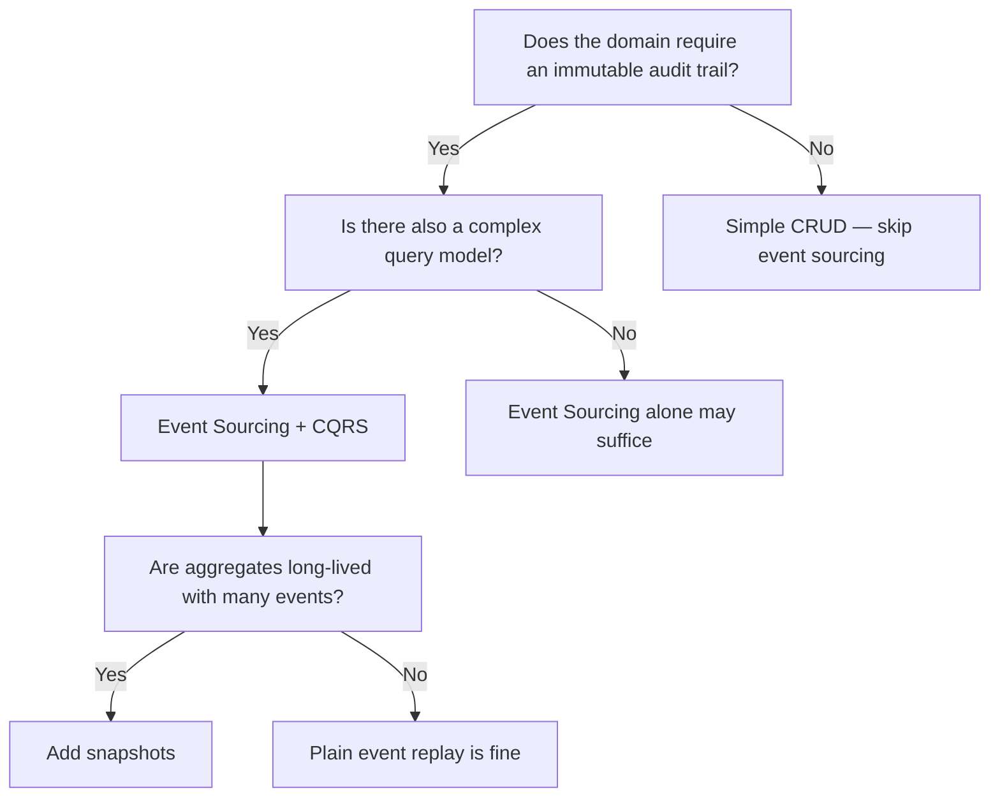

# Event Sourcing & CQRS

> Treating every state change as a first-class fact — and separating how you write from how you read

---

## Learning Objectives

By the end of this topic you will be able to:

- Explain why an append-only event log is a complete source of truth and why current state is just a materialised view of that log
- Describe how CQRS separates the write model from the read model and why each can be optimised independently
- Implement the `EventStore`, `Aggregate`, and `Projection` interfaces in Java with correct replay semantics
- Explain how snapshots bound replay time and describe the snapshot-plus-tail-of-log pattern
- Identify when event sourcing adds real value versus when it is over-engineering for a simple CRUD domain
- Articulate the schema evolution problem for stored events and name at least two safe migration strategies

---

!!! warning "Operational reality"
    Event sourcing has a reputation for being enthusiastically adopted and quietly abandoned 18 months later. It is genuinely powerful in domains where the event log is legally or architecturally required — financial ledgers, audit-heavy compliance systems, complex domains where temporal queries matter. But in most applications it adds two systems to maintain (the event log and all its projections), makes debugging significantly harder ("why does this user's balance look wrong?" requires replaying their entire event history), and turns schema evolution into an archaeology project.

    Teams that succeed with it tend to have one thing in common: they would have needed an audit log anyway. Study this for the interview domains where it is the right answer — not as a default architectural style.

## ELI5: Explain Like I'm 5

<div class="learner-section" markdown>

**Your task:** After working through the core concepts and implementation, explain them simply.

**Prompts to guide you:**

1. **What is event sourcing in one sentence?**
    - Your answer: <span class="fill-in">Event sourcing is a pattern where instead of storing current state, you store ___, and reconstruct state by ___</span>

2. **Real-world analogy for event sourcing:**
    - Example: "A bank statement is a list of transactions, not just a current balance — the balance is derived from replaying all the transactions."
    - Your analogy: <span class="fill-in">Think of a chess match recording — the board position at any moment is derived from ___, not from ___</span>

3. **What is CQRS in one sentence?**
    - Your answer: <span class="fill-in">CQRS is a pattern where you use ___ model to change state and a ___ model to query state, because ___</span>

4. **Why separate reads from writes?**
    - Your answer: <span class="fill-in">Write models enforce ___, while read models are optimised for ___; combining them forces you to ___</span>

5. **What is a projection in one sentence?**
    - Your answer: <span class="fill-in">A projection is a ___ built by consuming events in order, transforming the append-only log into a ___ optimised for queries</span>

6. **Why do we need snapshots?**
    - Your answer: <span class="fill-in">Without snapshots, replaying state requires processing ___ events; a snapshot captures state at a point in time so replay starts from ___ instead</span>

</div>

---

## Quick Quiz (Do BEFORE reading further)

!!! tip "How to use this section"
    Fill in your predictions now. You will return and verify each answer after working through the Core Concepts section.

<div class="learner-section" markdown>

**Your task:** Test your intuition. Answer these, then verify after reading.

### Concept Predictions

1. **An order goes through states: Placed, Paid, Shipped, Delivered. With event sourcing:**
    - How many records are written to the event store? <span class="fill-in">[Your guess]</span>
    - If you delete the "Paid" event, what happens when you replay? <span class="fill-in">[Your guess]</span>
    - Verified after reading: <span class="fill-in">[Actual]</span>

2. **CQRS read model update lag:**
    - If an order is placed and a user immediately queries "show my orders", could they not see it? <span class="fill-in">[Yes / No / Depends]</span>
    - Why? <span class="fill-in">[Your reasoning]</span>
    - Verified: <span class="fill-in">[Fill in]</span>

3. **Event replay performance:**
    - An aggregate has 10,000 historical events. Without snapshots, loading it requires: <span class="fill-in">[Your guess: how many event reads?]</span>
    - With a snapshot every 100 events, worst case reads drop to: <span class="fill-in">[Your guess]</span>
    - Verified: <span class="fill-in">[Fill in]</span>

### Scenario Predictions

**Scenario 1:** You need a full audit log of every price change on a product.

- Is event sourcing a good fit? <span class="fill-in">[Yes / No / Depends]</span>
- Why? <span class="fill-in">[Your reasoning]</span>
- Verified: <span class="fill-in">[Fill in]</span>

**Scenario 2:** A simple blog CRUD app with no regulatory requirements.

- Is event sourcing a good fit? <span class="fill-in">[Yes / No / Depends]</span>
- Why? <span class="fill-in">[Your reasoning]</span>
- Verified: <span class="fill-in">[Fill in]</span>

**Scenario 3:** A bank account ledger that must support balance-at-date queries.

- How does event sourcing make this query trivial? <span class="fill-in">[Your reasoning]</span>
- How would you implement it without event sourcing? <span class="fill-in">[Your reasoning]</span>
- Verified: <span class="fill-in">[Fill in]</span>

</div>

---

## Core Concepts

### Event Sourcing

**The core idea** is that the event log is the system of record — not the current-state table.

In a traditional (state-oriented) system, a row in the `orders` table holds the current order status. When the order ships, you `UPDATE orders SET status = 'Shipped'`. The previous status is gone.

In an event-sourced system you never update. You append:

```
OrderPlaced    { orderId: 42, customerId: 7, items: [...], at: T1 }
OrderPaid      { orderId: 42, paymentId: "px-99", at: T2 }
OrderShipped   { orderId: 42, trackingId: "UPS-123", at: T3 }
OrderDelivered { orderId: 42, at: T4 }
```

The current state of order 42 is rebuilt by replaying these four events from the beginning. The row you see in a read model is a materialised view, not the truth.

**Why this matters at the interview level:**

- **Audit log is free.** You do not need a separate audit table; the event log is the audit log.
- **Temporal queries are free.** "What was the order status at noon yesterday?" is a replay up to that timestamp, not a separate history table.
- **Bug replay.** If a bug corrupted state, you can fix the projection and replay from scratch to get correct state.
- **Event-driven integration.** Other services subscribe to the event log rather than polling the database.

**What the event log must guarantee:**

- **Append-only:** Events are immutable once written. No updates, no deletes.
- **Ordered:** Events for a given aggregate stream must be replayed in the order they were appended.
- **Durable:** A write acknowledgement means the event is persisted and will survive restart.

**Optimistic concurrency.** Because multiple writers could try to append to the same aggregate stream simultaneously, the event store enforces a version check: "append these events only if the stream is currently at version N." If another writer already advanced the stream, the append fails with a concurrency conflict and the command must be retried.

#### Event Schema Evolution

Events are immutable, but business rules change. A `CustomerAddressUpdated` event written in 2022 may be missing a `countryCode` field that was added in 2024. Three safe strategies:

| Strategy | Mechanism | Trade-off |
|---|---|---|
| **Upcasting** | Transform old event format to new at read time; never touch stored events | Schema conversion code accumulates over years |
| **Weak-schema tolerance** | Make new fields optional; projections default missing fields | Simpler but limits what you can add |
| **Event versioning** | Store `OrderPlaced_v1`, `OrderPlaced_v2` as distinct types | Clean separation; handler must support all versions |

The key constraint: **you must never change the stored bytes of a past event.** Any migration happens in reader logic, not in the log.

---

### CQRS

**Command Query Responsibility Segregation** separates the write path (commands that change state) from the read path (queries that return data). The names come from Bertrand Meyer's command-query separation principle, applied at the architectural level.

```
Client → Command → Command Handler → Aggregate → EventStore
                                                     ↓
                                              Event Bus / Log
                                                     ↓
                                            Projection updates ReadModel
Client ← Query  ← Query Handler   ← ReadModel (optimised for reads)
```

**Write side (command model):**

- Handles commands: `PlaceOrder`, `CancelOrder`, `ApplyDiscount`
- Loads the aggregate by replaying its event stream
- Validates business invariants against the aggregate's current state
- Appends new events to the store on success
- Returns success or a domain error; does not return query data

**Read side (query model):**

- A separate data store (relational table, Redis cache, Elasticsearch index) shaped for the query
- Rebuilt by consuming events from the event log
- Can be denormalised, pre-joined, or pre-aggregated — whatever makes the query fast
- Is eventually consistent with the write model; a command that succeeds may not be reflected immediately in the read model

**The key tradeoff:** CQRS introduces read lag and operational complexity (two data stores, event propagation pipeline). It pays off when the read and write access patterns are fundamentally different — for example, a write model that enforces complex invariants across a normalised aggregate but a read model that serves millions of dashboard queries against a flat, pre-computed view.

**CQRS does not require event sourcing**, and event sourcing does not require CQRS. They are independent patterns that are frequently combined because they are complementary: event sourcing gives you the event log that CQRS read models can consume.

---

### Projections

A projection is a read model built from the event stream. It is a pure function: given the same sequence of events, it always produces the same output.

**How a projection is built:**

1. Start from an empty state (or a checkpoint).
2. For each event in order, call the handler for that event type.
3. Update the projection store (a table, cache, or document store).
4. Record the last-processed event position as a checkpoint.

**Example projection:** `OrderSummaryProjection` maintains a table of open orders with their current status for a customer-facing dashboard. It handles `OrderPlaced` (insert row), `OrderPaid` (update status), `OrderShipped` (update status, add tracking number), `OrderDelivered` (update status), `OrderCancelled` (remove row or mark cancelled).

**Projection rebuild.** When a projection is new, buggy, or the schema changed, you rebuild it by replaying all events from the beginning against a fresh projection store. This is one of the most powerful capabilities of event sourcing — you can add a new query capability retroactively by defining a new projection and replaying history.

**Operational considerations:**

- Replay of millions of events is slow; a rebuild may take minutes to hours.
- Run rebuilds on a shadow store; swap atomically when complete to avoid serving stale data.
- Projections can lag behind the event log under load; callers must tolerate eventual consistency or accept read-your-writes inconsistency.
- A stale read is not an error in an eventually consistent projection; it is expected behaviour. Define and communicate the SLO for maximum acceptable lag.

**Checkpoint management.** The projection must persist its checkpoint durably. If the process crashes, it must restart from the last checkpoint, not from the beginning. The checkpoint and the projection state must be updated atomically (same transaction, or use idempotent event handlers that tolerate replay).

---

### Snapshots

**The problem.** An aggregate with 50,000 events must replay all 50,000 events every time a command arrives. For high-frequency aggregates (a busy account, a frequently-updated inventory item), this is prohibitively slow.

**The solution.** Periodically save a snapshot: the complete state of the aggregate at event version N. When loading the aggregate, find the latest snapshot (version N), deserialise it, then replay only events from version N+1 to the current head.

```
Events:   [1..100][101..200][201..300][301..400] ... [9901..10000]
Snapshot at 100, 200, 300, ..., 9900

Load at version 10000:
  1. Load snapshot at version 9900  (one read)
  2. Replay events 9901–10000       (100 event reads)
  Total: 101 reads, not 10,000
```

**Snapshot consistency.** A snapshot must be taken atomically with the event that triggered it. The snapshot must record the event version it was taken at. On restore, replay starts from the event immediately after that version. If you take a snapshot and then the process crashes before the event is durably written, the snapshot is invalid — guard against this by only taking snapshots after confirming the event is durable.

**When to take snapshots:**

- After every N events (e.g., every 50 or 100 events)
- Lazily, when loading detects the replay exceeds a time threshold
- On a background schedule, not in the critical command path

**Snapshots do not replace events.** The event log remains the source of truth. Snapshots are a read optimisation. You can always discard all snapshots and rebuild from the full event log.

---

### Sagas and Process Managers

A saga coordinates a multi-step workflow that spans multiple aggregates or services. Where a single aggregate enforces invariants within a consistency boundary, a saga handles processes that cross those boundaries — for example, "place order → reserve inventory → charge payment → confirm shipment."

Sagas work by reacting to events and issuing commands:

```
OrderPlaced event  →  Saga issues ReserveInventory command
InventoryReserved  →  Saga issues ChargePayment command
PaymentCharged     →  Saga issues ConfirmOrder command
PaymentFailed      →  Saga issues ReleaseInventory command (compensating)
```

The saga itself is persistent state (it records which steps are complete) and its state transitions are also event-sourced. If the process crashes, the saga restarts from its last state.

**This is a large topic.** For distributed failure modes, two-phase commit vs saga tradeoffs, and choreography vs orchestration, see [17. Distributed Transactions](17-distributed-transactions.md).

---

## Implementation

**Your task:** Implement the core abstractions. Focus on the semantics — the `// TODO` comments describe what each method must do.

```java
import java.util.List;

// ---------------------------------------------------------------------------
// Core domain types
// ---------------------------------------------------------------------------

/**
 * Marker interface for all domain events.
 * Every event carries the aggregate ID and the version it was appended at.
 */
public interface DomainEvent {
    String aggregateId();
    long version();
    long occurredAt(); // epoch millis
}

/**
 * Marker interface for all commands.
 * A command is a request to change state; it may be rejected.
 */
public interface Command {
    String aggregateId();
}

// ---------------------------------------------------------------------------
// EventStore — the append-only log
// ---------------------------------------------------------------------------

/**
 * The event store is the sole source of truth.
 *
 * Implementations may use a relational table, EventStoreDB, Kafka, or any
 * durable append-only log.
 */
public interface EventStore {

    /**
     * Append events to a stream.
     *
     * @param aggregateId  the stream identifier
     * @param events       ordered list of events to append
     * @param expectedVersion  the version the caller believes the stream is at;
     *                         throws OptimisticConcurrencyException if the
     *                         actual version differs (another writer raced ahead)
     *
     * TODO: Implement append
     * - Verify that the current stream version matches expectedVersion
     * - Assign sequential version numbers to each event
     * - Persist all events atomically (all succeed or all fail)
     * - Publish events to any registered subscribers after commit
     */
    void append(String aggregateId, List<DomainEvent> events, long expectedVersion);

    /**
     * Load all events for a stream, in order.
     *
     * @param aggregateId  the stream identifier
     * @return ordered list of all events; empty list if stream does not exist
     *
     * TODO: Implement load
     * - Return events in append order (by version, ascending)
     * - Return an empty list (not null) if the aggregate has no events
     */
    List<DomainEvent> load(String aggregateId);

    /**
     * Load events starting from a given version (inclusive).
     * Used when loading after a snapshot.
     *
     * @param aggregateId   the stream identifier
     * @param fromVersion   the first version to include in the result
     * @return ordered list of events at version >= fromVersion
     *
     * TODO: Implement partial load
     * - Return only events where version >= fromVersion
     * - Return in ascending version order
     */
    List<DomainEvent> loadFrom(String aggregateId, long fromVersion);
}

// ---------------------------------------------------------------------------
// Aggregate — the write-side consistency boundary
// ---------------------------------------------------------------------------

/**
 * Abstract base for event-sourced aggregates.
 *
 * An aggregate is rebuilt by replaying its events. It enforces business
 * invariants and emits new events when a command is accepted.
 *
 * Usage pattern:
 *   1. Load events from EventStore
 *   2. Call replayAll(events) to rebuild state
 *   3. Call handleCommand(cmd) to produce new events
 *   4. Append the returned events to EventStore
 */
public abstract class Aggregate {

    private String id;
    private long version = 0;

    // Events raised by the most recent handleCommand call, not yet persisted.
    // TODO: initialise this field to an empty mutable list
    private List<DomainEvent> pendingEvents;

    public String getId() { return id; }
    public long getVersion() { return version; }
    public List<DomainEvent> getPendingEvents() { return pendingEvents; }

    /**
     * Replay a single event to rebuild aggregate state.
     * Must NOT throw for unknown event types — be tolerant of future event versions.
     *
     * TODO: Implement in each concrete aggregate subclass
     * - Switch on event type and update internal state fields
     * - Increment the version counter
     * - Do NOT enforce invariants here — apply is called during both
     *   initial load and command handling; only handleCommand enforces rules
     */
    protected abstract void apply(DomainEvent event);

    /**
     * Replay a sequence of events (used when loading from the event store).
     *
     * TODO: Implement replayAll
     * - Call apply(event) for each event in order
     * - After replay, version should equal the version of the last event
     */
    public void replayAll(List<DomainEvent> events) {
        // TODO: iterate events and call apply on each
    }

    /**
     * Handle an inbound command and return the events it produces.
     * Returns an empty list if the command is a no-op.
     * Throws a domain exception if the command violates an invariant.
     *
     * TODO: Implement in each concrete aggregate subclass
     * - Validate the command against current state
     * - Construct new events (do not persist them — that is the caller's job)
     * - Call apply() on each new event to update in-memory state
     * - Add new events to pendingEvents
     * - Return the list of new events
     */
    public abstract List<DomainEvent> handleCommand(Command command);

    /**
     * Raise a new event: apply it locally and queue it for persistence.
     * Concrete subclasses call this inside handleCommand.
     *
     * TODO: Implement raiseEvent
     * - Call apply(event) to update in-memory state immediately
     * - Add event to pendingEvents
     */
    protected void raiseEvent(DomainEvent event) {
        // TODO: apply event to self
        // TODO: add to pendingEvents
    }
}

// ---------------------------------------------------------------------------
// Projection — the read-side materialised view
// ---------------------------------------------------------------------------

/**
 * A projection consumes the event stream and maintains a queryable read model.
 *
 * Projections are eventually consistent with the write model.
 * They must be idempotent: replaying the same event twice must not corrupt state.
 */
public interface Projection {

    /**
     * Process a single domain event and update the read model.
     *
     * TODO: Implement in each concrete projection
     * - Dispatch on event type to the appropriate handler method
     * - Update the projection store (database table, cache, etc.)
     * - Must be idempotent: if this event was already applied, do not double-count
     * - Record the event version as the new checkpoint after successful update
     *
     * @param event   the event to process
     */
    void on(DomainEvent event);

    /**
     * Return the version of the last event successfully applied.
     * Used to resume from a checkpoint after restart.
     *
     * TODO: Implement getCheckpoint
     * - Load the persisted checkpoint from durable storage
     * - Return 0 if no checkpoint exists (projection has never run)
     */
    long getCheckpoint();

    /**
     * Reset the projection to empty state.
     * Called at the start of a full rebuild.
     *
     * TODO: Implement reset
     * - Delete or truncate the projection store
     * - Reset the checkpoint to 0
     */
    void reset();
}

// ---------------------------------------------------------------------------
// Snapshot store — optimisation layer
// ---------------------------------------------------------------------------

/**
 * Stores and retrieves aggregate snapshots to bound replay time.
 */
public interface SnapshotStore {

    /**
     * Save a snapshot of aggregate state at a specific version.
     *
     * @param aggregateId  stream identifier
     * @param version      the event version this snapshot was taken after
     * @param state        serialised aggregate state (JSON, Protobuf, etc.)
     *
     * TODO: Implement save
     * - Persist aggregateId, version, and serialised state atomically
     * - Overwrite any existing snapshot for this aggregate
     */
    void save(String aggregateId, long version, byte[] state);

    /**
     * Load the most recent snapshot for an aggregate.
     * Returns null if no snapshot exists.
     *
     * TODO: Implement load
     * - Return the snapshot with the highest version for this aggregateId
     * - Return null (not an exception) if no snapshot exists
     */
    Snapshot load(String aggregateId);

    /**
     * Container for a snapshot read result.
     */
    record Snapshot(String aggregateId, long version, byte[] state) {}
}
```

---

## Decision Framework

<div class="learner-section" markdown>

**Your task:** Fill in this framework after working through the core concepts. These are the questions you will face in a staff-level system design interview.

### 1. When does event sourcing add value?

**Use event sourcing when:**

- Your answer: <span class="fill-in">The domain requires a complete, immutable audit trail because ___</span>
- Your answer: <span class="fill-in">You need to support temporal queries such as ___, which without event sourcing would require ___</span>
- Your answer: <span class="fill-in">The business domain is complex enough that ___, making event replay useful for debugging ___</span>
- Your answer: <span class="fill-in">Multiple downstream systems need to react to state changes; the event log gives them ___ without ___</span>

**Avoid event sourcing when:**

- Your answer: <span class="fill-in">The domain is simple CRUD with no audit requirement because the overhead of ___ is not justified by ___</span>
- Your answer: <span class="fill-in">The team has no prior exposure to the pattern, because the operational complexity of ___ will slow ___</span>
- Your answer: <span class="fill-in">Events are high-frequency and aggregates are long-lived; without careful snapshot strategy, ___ will degrade ___</span>

### 2. CQRS read model tradeoffs

**Read model consistency options:**

| Option | Mechanism | Acceptable lag | Use when |
|---|---|---|---|
| Eventual consistency | Async event propagation | Seconds to minutes | <span class="fill-in">[Fill in]</span> |
| Read-your-writes | Route reads to the write store immediately post-command | Zero lag for issuing user | <span class="fill-in">[Fill in]</span> |
| Synchronous projection | Update read model in same transaction as event append | Zero lag | <span class="fill-in">[Fill in]</span> |

**When is CQRS read lag acceptable?**

- Your answer: <span class="fill-in">Read lag is acceptable when queries are for ___ purposes (dashboards, reports) where users do not expect to see the result of their own action ___</span>

**When is CQRS read lag a problem?**

- Your answer: <span class="fill-in">Read lag becomes a problem when users perform a write and then immediately navigate to a page that queries the read model, because they see ___ and conclude ___</span>

### 3. Schema evolution strategy

**Given a stored event type that needs a new required field:**

- Option A (upcasting): <span class="fill-in">Describe the approach and when you would choose it ___</span>
- Option B (versioned types): <span class="fill-in">Describe the approach and when you would choose it ___</span>
- The invariant you must never violate: <span class="fill-in">___</span>

### 4. Snapshot strategy

**How often should you snapshot?**

- Your answer: <span class="fill-in">Snapshot every N events where N is chosen so that worst-case replay time is ___, typically evaluated by ___</span>

**When should you NOT snapshot?**

- Your answer: <span class="fill-in">Avoid snapshotting in the critical command path because ___, instead prefer ___</span>

### 5. Your decision tree

Fill in this after you can answer the above questions from memory:



</div>

---

## Practice Scenarios

<div class="learner-section" markdown>

### Scenario 1: Order Management System with Full Audit History

**Requirements:**

- E-commerce platform processing 50,000 orders per day
- Every order state change must be auditable (regulatory requirement)
- Customer service needs "order history" view showing all state transitions with timestamps
- Finance needs "revenue recognised" view aggregated by day
- The write path must enforce invariants (cannot ship an unpaid order)

**Your design:**

- What events would you define? <span class="fill-in">[List at least 5 domain events with the fields each carries]</span>
- What aggregates would you use? <span class="fill-in">[Define the consistency boundary — is OrderLine part of the Order aggregate or separate?]</span>
- How would you structure the CQRS read models? <span class="fill-in">[Describe at least two projections: what each stores, what query it serves]</span>
- How would you handle the "customer service history" view? <span class="fill-in">[Is this a projection, a direct event log query, or something else?]</span>
- How would you handle the "revenue by day" aggregation? <span class="fill-in">[Is this rebuilt from events nightly, maintained as a streaming projection, or calculated on demand?]</span>

**Failure modes:**

- A projection rebuild is running against the shadow store and takes 4 hours due to 3 years of event history. Traffic cannot be interrupted. How do you handle this? <span class="fill-in">[Fill in]</span>
- A bug in the OrderShipped handler wrote incorrect tracking numbers to the read model for 2,000 orders over 48 hours. The event log is correct. How do you recover? <span class="fill-in">[Fill in]</span>

### Scenario 2: Bank Account Ledger

**Requirements:**

- Each account has deposits, withdrawals, transfers, and interest credits
- Regulatory requirement: balances must be auditable to the cent for 7 years
- Support queries: current balance, balance at any historical date, transaction history with pagination
- Concurrency: multiple banking channels can operate on the same account simultaneously (ATM + online + direct debit)

**Your design:**

- What is the aggregate? <span class="fill-in">[What is the consistency boundary? Is a Transfer one aggregate or two?]</span>
- How do you enforce the invariant "balance cannot go below zero"? <span class="fill-in">[Which side of the architecture enforces this — command handler, aggregate, or event store?]</span>
- How would you support "balance as of date" queries? <span class="fill-in">[Describe the replay or projection strategy]</span>
- How do you handle the concurrency requirement? <span class="fill-in">[Describe the optimistic concurrency mechanism and retry strategy]</span>
- How would snapshots change your design for accounts that have been active for 7 years? <span class="fill-in">[Estimate the event count and describe the snapshot strategy]</span>

**Failure modes:**

- Two concurrent withdrawals arrive at the same millisecond and both pass the balance check before either is committed. How does your system prevent an overdraft? <span class="fill-in">[Fill in]</span>
- The snapshot store becomes unavailable but the event log is healthy. What degrades, and how do you detect and mitigate it? <span class="fill-in">[Fill in]</span>

</div>

---

## Test Your Understanding

Answer these without referring to your notes.

1. An `OrderAggregate` has 5,000 historical events. A snapshot was taken at version 4,800. Describe precisely what the system does when a `CancelOrder` command arrives for this aggregate. How many reads from the event store are required?

    ??? success "Rubric"
        A complete answer addresses: (1) the system first checks the snapshot store and finds the snapshot at version 4,800, then calls `EventStore.loadFrom(orderId, 4801)` to retrieve the 200 remaining events — 201 reads total (1 snapshot + 200 events), not 5,000; (2) each of the 200 events is passed to `Aggregate.apply()` to rebuild in-memory state from version 4,800 to 5,000; (3) only then is `handleCommand(CancelOrder)` called against the fully rebuilt aggregate — enforcing the invariant (e.g., "cannot cancel a delivered order") against current state before appending the `OrderCancelled` event at version 5,001.

2. A CQRS system has a `OrderListProjection` that serves the customer's "my orders" page. A user places an order and immediately navigates to the page. The new order does not appear. Is this a bug? How would you handle this in production without sacrificing the benefits of CQRS?

    ??? success "Rubric"
        A complete answer addresses: (1) this is not a bug — it is expected eventual consistency behaviour; the projection lag may be milliseconds or seconds depending on the event propagation path; (2) common mitigations include: read-your-writes consistency (immediately after a command, route the user's next read to the write store or a fresh projection query parameterised by the new aggregate ID); optimistic UI (display the new order client-side immediately, reconcile with server in the background); or a short client-side delay with a "processing" indicator; (3) the critical production measure is a SLO on projection lag (e.g., p99 lag under 500 ms) monitored as a metric, alerting when the projection falls behind.

3. You need to add a `regionCode` field to the `OrderPlaced` event. The event store contains 10 million `OrderPlaced` events written without this field. Describe two safe approaches. Which would you choose for a system in active production, and why?

    ??? success "Rubric"
        A complete answer addresses: (1) upcasting: add a transformation layer in the event deserialiser that sets `regionCode` to a default (e.g., "UNKNOWN" or derived from customer address) when reading old events — zero migration of stored data, but the upcasting code must be maintained forever; (2) versioned event types: register `OrderPlaced_v2` with the new field; existing code continues to handle `OrderPlaced_v1`, new code writes `OrderPlaced_v2` — clean separation but handler code must support both versions; (3) for an active production system, upcasting is usually preferred because it avoids a data migration that touches 10 million rows, eliminates dual-version handler logic in most projections, and can be deployed without downtime — the tradeoff is that the upcasting layer grows over time and must be tested with every schema change.

4. An event-sourced aggregate reaches version 100,000 after 18 months of operation. No snapshots were taken. A command arrives. Describe the performance impact, and outline a zero-downtime strategy to introduce snapshots without affecting in-flight commands.

    ??? success "Rubric"
        A complete answer addresses: (1) loading this aggregate requires reading and deserialising 100,000 events sequentially — even at 10,000 events/second read throughput, that is 10 seconds of pure I/O before the command can be validated; this makes the write path unusably slow for any interactive use case; (2) the zero-downtime strategy: run a background job that loads the aggregate (replaying all 100,000 events), serialises the resulting state, and writes it to the snapshot store at version 100,000 — no lock or downtime needed because the event log is the truth and the snapshot is additive; (3) on the next command, the system finds the snapshot at version 100,000 and calls `loadFrom(aggregateId, 100001)` to load only events since then; future snapshots can be taken periodically (e.g., every 100 events) as a background task after each successful command.

5. Two event-sourced services — `OrderService` and `InventoryService` — must coordinate: an order can only be confirmed if inventory can be reserved. Explain why you cannot use a single database transaction across both services, and describe how a saga handles this coordination using events and compensating transactions.

    ??? success "Rubric"
        A complete answer addresses: (1) each service owns its own event store and aggregate state; a cross-service database transaction would couple them at the storage layer, defeating the autonomy boundary and making deployment, scaling, and failure isolation impossible — the CAP theorem constraint means a distributed transaction either blocks both services or risks inconsistency; (2) the saga (or process manager) listens for `OrderPlaced`, then issues a `ReserveInventory` command to `InventoryService`; if `InventoryReserved` arrives, the saga issues `ConfirmOrder`; if `InventoryReservationFailed` arrives, the saga issues `CancelOrder` — a compensating command that reverses the `OrderPlaced` side effect; (3) the saga's own state is event-sourced and durable; if the saga process crashes between steps, it restarts from its last persisted state and re-issues the pending command — idempotency on the command handlers prevents double-processing.

---

## Review Checklist

After completing this topic, verify you can do each of the following:

- [ ] Explain event sourcing to a non-technical colleague using a real-world analogy
- [ ] Draw the command → aggregate → event store → projection → read model pipeline from memory
- [ ] Explain why events are immutable and what "append-only" guarantees you need from the event store
- [ ] Describe optimistic concurrency and why it is necessary in an event store
- [ ] Implement an `Aggregate` subclass with correct `apply()` and `handleCommand()` semantics
- [ ] Implement a `Projection` with correct checkpoint management
- [ ] Explain three safe event schema evolution strategies and their tradeoffs
- [ ] Describe when a snapshot is necessary, how it bounds replay time, and how to take one safely
- [ ] Articulate the CQRS read lag tradeoff and name two read-your-writes mitigation strategies
- [ ] Identify at least three domains where event sourcing is clearly justified
- [ ] Identify at least two domains where event sourcing is over-engineering
- [ ] Describe how a saga coordinates multi-service workflows without distributed transactions

---

## Connected Topics

!!! info "Where this topic connects"

    - **[12. Message Queues](12-message-queues.md)** — the event log is often implemented on a durable message broker (Kafka, Kinesis); projections subscribe as consumers; understanding consumer groups, offset management, and at-least-once delivery is essential for reliable projection updates → [12. Message Queues](12-message-queues.md)
    - **[17. Distributed Transactions](17-distributed-transactions.md)** — sagas are the event-sourcing answer to cross-service coordination; the two-phase commit vs saga tradeoff, choreography vs orchestration, and compensating transaction design are covered in depth → [17. Distributed Transactions](17-distributed-transactions.md)
    - **[11. Database Scaling](11-database-scaling.md)** — the event store and CQRS read models have distinct scaling profiles: the event store is append-heavy and benefits from write-optimised storage (LSM-based), while read models can be horizontally scaled read replicas or separate query stores → [11. Database Scaling](11-database-scaling.md)
