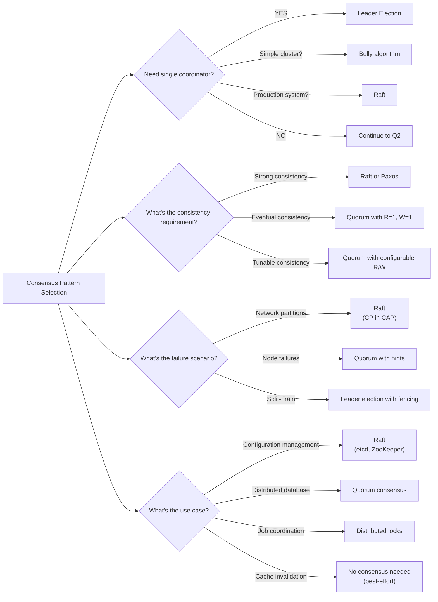

# 16. Consensus Patterns

> Leader election, Raft consensus, distributed locks, and quorum-based systems

---

## ELI5: Explain Like I'm 5

<div class="learner-section" markdown>

**Your task:** After implementing consensus patterns, explain them simply.

**Prompts to guide you:**

1. **What is consensus in one sentence?**
    - Your answer: <span class="fill-in">[Fill in after implementation]</span>

2. **Why do distributed systems need consensus?**
    - Your answer: <span class="fill-in">[Fill in after implementation]</span>

3. **Real-world analogy for leader election:**
    - Example: "Leader election is like choosing a class president where..."
    - Your analogy: <span class="fill-in">[Fill in]</span>

4. **What is the split-brain problem in one sentence?**
    - Your answer: <span class="fill-in">[Fill in after implementation]</span>

5. **Real-world analogy for distributed locks:**
    - Example: "A distributed lock is like a bathroom key that..."
    - Your analogy: <span class="fill-in">[Fill in]</span>

6. **Why do we need quorums?**
    - Your answer: <span class="fill-in">[Fill in after practice]</span>

</div>

---

## Quick Quiz (Do BEFORE implementing)

<div class="learner-section" markdown>

**Your task:** Test your intuition about distributed consensus without looking at code. Answer these, then verify after
implementation.

### Complexity Predictions

1. **Leader election with N nodes (Bully algorithm):**
    - Time complexity: <span class="fill-in">[Your guess: O(?)]</span>
    - Message complexity: <span class="fill-in">[How many messages?]</span>
    - Verified after learning: <span class="fill-in">[Actual: O(?)]</span>

2. **Raft log replication to majority of N nodes:**
    - Time complexity: <span class="fill-in">[Your guess: O(?)]</span>
    - When is an entry committed: <span class="fill-in">[Your guess]</span>
    - Verified: <span class="fill-in">[Actual]</span>

3. **Quorum read with R nodes, N total nodes:**
    - Time complexity: <span class="fill-in">[Your guess: O(?)]</span>
    - Space complexity per node: <span class="fill-in">[Your guess: O(?)]</span>
    - Verified: <span class="fill-in">[Actual]</span>

### Scenario Predictions

**Scenario 1:** 5-node cluster, leader fails during log replication

- **What happens to uncommitted entries?** <span class="fill-in">[Lost/Preserved - Why?]</span>
- **How long until new leader elected?** <span class="fill-in">[Depends on what?]</span>
- **Can clients write during election?** <span class="fill-in">[Yes/No - Why?]</span>

**Scenario 2:** Network partition splits 5 nodes into {3 nodes, 2 nodes}

- **Which partition can elect a leader?** <span class="fill-in">[3-node/2-node/Both - Why?]</span>
- **What happens to writes in minority partition?** <span class="fill-in">[Fill in]</span>
- **Is this a split-brain scenario?** <span class="fill-in">[Yes/No - Why?]</span>

**Scenario 3:** Distributed lock with 30-second TTL, holder crashes after 10 seconds

- **When can another process acquire the lock?** <span class="fill-in">[Immediately/After 20s/Never]</span>
- **Why that timing?** <span class="fill-in">[Fill in your reasoning]</span>
- **What could go wrong?** <span class="fill-in">[Fill in]</span>

### Trade-off Quiz

**Question:** When would leaderless (quorum) be BETTER than Raft for consensus?

- Your answer: <span class="fill-in">[Fill in before implementation]</span>
- Verified answer: <span class="fill-in">[Fill in after learning]</span>

**Question:** What's the MAIN requirement for achieving strong consistency with quorums?

-   [ ] R + W > N (where N is replication factor)
-   [ ] R + W = N
-   [ ] R = W = majority
-   [ ] R = N, W = 1

Verify after implementation: <span class="fill-in">[Which one(s)? Why?]</span>

**Question:** Why use fencing tokens with distributed locks?

- Your answer: <span class="fill-in">[Fill in before implementation]</span>
- Verified answer: <span class="fill-in">[Fill in after implementing Pattern 3]</span>

</div>

---

## Before/After: Why Consensus Matters

**Your task:** Compare naive distributed coordination vs proper consensus to understand the impact.

### Example: Leader Election Without Consensus

**Problem:** Multiple nodes need to coordinate on a single leader for a distributed database.

#### Approach 1: Naive Leader Election (No Consensus)

```java
// Naive approach - Highest ID claims leadership
public class NaiveLeaderElection {
    private int myId;
    private int leaderId;

    public void electLeader(Set<Integer> visibleNodes) {
        // Just pick the highest ID we can see
        int maxId = myId;
        for (int nodeId : visibleNodes) {
            if (nodeId > maxId) {
                maxId = nodeId;
            }
        }
        leaderId = maxId;

        if (leaderId == myId) {
            System.out.println("I am the leader!");
        }
    }
}
```

**What goes wrong: Network Partition Scenario**

```
Before partition:
Cluster: [Node 1, Node 2, Node 3, Node 4, Node 5]
Leader: Node 5 (highest ID)

After network partition:
Partition A: [Node 1, Node 2, Node 3]
Partition B: [Node 4, Node 5]

Partition A thinks: Node 3 is leader (highest visible)
Partition B thinks: Node 5 is leader (highest visible)

SPLIT-BRAIN: Two leaders accepting writes simultaneously!

Result:

- Data divergence (inconsistent state)
- Lost updates when partition heals
- Violated uniqueness guarantee
```

**Analysis:**

- Time: O(N) to scan visible nodes
- Space: O(1)
- Problem: No consensus, **split-brain during partition!**

- Failure rate: ~50% in networks with partitions

#### Approach 2: Raft Consensus (Safe Leader Election)

```java
// Raft approach - Majority vote required
public class RaftLeaderElection {
    private int currentTerm;
    private int votedFor;
    private int myId;

    public boolean electLeader(Set<Integer> allNodes) {
        currentTerm++;
        votedFor = myId;

        int votesReceived = 1; // Vote for self
        int majoritySize = (allNodes.size() / 2) + 1;

        // Request votes from all nodes
        for (int nodeId : allNodes) {
            if (nodeId != myId && requestVote(nodeId, currentTerm)) {
                votesReceived++;
            }
        }

        // Only become leader if MAJORITY votes received
        if (votesReceived >= majoritySize) {
            System.out.println("I am leader with " + votesReceived + " votes");
            return true;
        }
        return false;
    }
}
```

**Same network partition with Raft:**

```
After network partition:
Partition A: [Node 1, Node 2, Node 3] - 3 nodes, majority = 2
Partition B: [Node 4, Node 5]         - 2 nodes, majority = 2

Partition A attempts election:

- Node 3 requests votes from Node 1, Node 2 (both visible)
- Node 3 gets 3 votes total → SUCCESS (3 ≥ 2 majority)
- Node 3 becomes leader ✓

Partition B attempts election:

- Node 5 requests votes from Node 4 (only visible node)
- Node 5 gets 2 votes total → FAIL (2 < 3 majority of 5 total)
- No leader elected ✗

Result:

- Only ONE leader (Node 3)
- Partition B cannot accept writes (no leader)
- Partition A continues operating safely
- No split-brain! ✓
- When partition heals, Node 5 recognizes Node 3 as leader
```

**Analysis:**

- Time: O(N) to request votes
- Space: O(1)
- Safety: **Prevents split-brain through majority requirement**

- Availability: Minority partition cannot elect leader (trade-off for safety)

#### Performance Comparison: Failure Scenarios

| Scenario           | Naive Election            | Raft Consensus                |
|--------------------|---------------------------|-------------------------------|
| Network partition  | Split-brain (2 leaders)   | Single leader in majority     |
| Node failure       | Immediate re-election     | Election only if leader fails |
| Data consistency   | Violated during partition | Preserved (CP in CAP)         |
| Write availability | Both partitions accept    | Only majority partition       |

#### Why Does Raft Work?

**Key insight: The Majority Principle**

With 5 nodes, majority = 3:

- Any two majorities must overlap by at least 1 node
- That overlapping node prevents conflicting decisions
- Example: {Node 1, 2, 3} and {Node 3, 4, 5} both contain Node 3

```
Election term visualization:
Term 1: Node 5 is leader (got votes from 1, 3, 5)
Network partition occurs
Term 2: Node 3 attempts election
        - Gets votes from 1, 2, 3 (majority) → SUCCESS
        - Node 5 in minority cannot get majority → FAILS
Term 3: When partition heals, Node 5 sees Node 3 has higher term → steps down
```

**After implementing, explain in your own words:**

<div class="learner-section" markdown>

- Why does majority prevent split-brain? <span class="fill-in">[Your answer]</span>
- What's the trade-off between safety and availability? <span class="fill-in">[Your answer]</span>
- Why can't the minority partition elect a leader? <span class="fill-in">[Your answer]</span>

</div>

### Real-World Impact

**Without consensus (naive approach):**

- Google Cloud DNS split-brain (2015): Traffic routed to wrong servers
- MongoDB 2.4 split-brain: Accepted conflicting writes, data corruption
- Recovery time: Hours to manually resolve conflicts

**With consensus (Raft/Paxos):**

- etcd (Kubernetes): Thousands of clusters, zero split-brain incidents
- Consul: Service discovery with guaranteed consistency
- Recovery time: Seconds (automatic election)

**Your calculation:** For a 7-node cluster with network partition into {4, 3}:

- Naive approach: <span class="fill-in">_____</span> leaders elected (how many?)
- Raft consensus: <span class="fill-in">_____</span> leader(s) elected (in which partition?)
- Which partition can serve writes: <span class="fill-in">_____</span>

---

## Core Concepts

### Pattern 1: Leader Election

**Concept:** Distributed algorithm to elect a single leader node from a cluster of nodes, ensuring only one leader
exists at any time.

**Use case:** Distributed databases, coordination services, master-worker systems.

**Key Properties:**
- **Safety**: At most one leader at any time
- **Liveness**: Eventually a leader is elected if majority is available
- **Agreement**: All nodes agree on who the leader is

**Common Algorithms:**

**1. Bully Algorithm**
- Highest ID node becomes leader
- Node contacts all higher-ID nodes; if no response, declares itself leader
- Simple but can cause message storms
- Time: O(N²) messages in worst case

**2. Ring Algorithm**
- Nodes organized in logical ring
- Election message passes around ring collecting IDs
- Node with highest ID becomes leader
- Time: O(N) messages, but slower latency

**3. Raft Leader Election** (see Pattern 2)
- Term-based elections with majority voting
- Prevents split-brain through quorum
- Production-ready (etcd, Consul)

**Simplified Example:**

```java
// High-level API - implementation details abstracted
public interface LeaderElection {
    // Start election process
    void startElection(int nodeId);

    // Get current leader (or -1 if none)
    int getLeader();

    // Check if this node is the leader
    boolean isLeader(int nodeId);

    // Detect leader failure via heartbeat timeout
    void checkLeaderHealth(int nodeId);
}

// Typical usage
LeaderElection election = new BullyAlgorithm(nodeIds, heartbeatTimeout);
election.startElection(myNodeId);

if (election.isLeader(myNodeId)) {
    // I'm the leader, handle writes
    handleWrites();
} else {
    // I'm a follower, forward to leader
    forwardToLeader(election.getLeader());
}
```

**Failure Handling:**

```
Initial state: Node 5 is leader
Node 5 fails (heartbeat timeout)
Node 4 detects failure → starts election
Node 4 sends election messages to Node 5 (no response)
Node 4 declares itself leader
Node 4 broadcasts victory to all nodes
New state: Node 4 is leader
```

---

### Pattern 2: Raft Consensus Algorithm

**Concept:** Consensus algorithm that ensures replicated log consistency across distributed nodes through leader
election and log replication.

**Use case:** Distributed databases (etcd, Consul), replicated state machines, configuration management.

**Key Components:**

1. **Leader Election with Terms**
   - Each election cycle has a term number
   - Candidate requests votes from all nodes
   - Requires majority to become leader
   - Prevents split-brain through quorum

2. **Log Replication (AppendEntries RPC)**
   - Leader appends entries to local log
   - Replicates to followers
   - Commits when majority acknowledges
   - Guarantees: committed entries never lost

3. **Safety Properties**
   - **Election Safety**: At most one leader per term
   - **Leader Append-Only**: Leader never overwrites/deletes entries
   - **Log Matching**: If two logs contain entry with same index/term, all preceding entries are identical
   - **Leader Completeness**: If entry committed in term T, it will be present in leaders of all future terms
   - **State Machine Safety**: If a server applies log entry at index i, no other server will apply different entry at i

**How Raft Works:**

```
Phase 1: Leader Election
- Follower timeout → becomes Candidate
- Candidate increments term, votes for self
- Requests votes from all nodes
- If majority grants votes → becomes Leader
- If receives heartbeat from valid leader → becomes Follower
- If election timeout → starts new election

Phase 2: Log Replication
- Client sends command to Leader
- Leader appends to local log
- Leader sends AppendEntries to all Followers
- Followers append entries to their logs
- Once majority acknowledges → Leader commits entry
- Leader notifies Followers of commit via next AppendEntries

Phase 3: Safety
- New leader contains all committed entries (election restriction)
- Leader never commits entries from previous terms directly
- Only commits when majority has current-term entry
```

**Simplified API:**

```java
// High-level Raft interface
public interface RaftConsensus {
    // Start election (becomes candidate)
    void startElection(int nodeId);

    // Append command to replicated log
    boolean appendEntry(int leaderId, String command);

    // Get current leader
    int getLeader();

    // Get committed log entries
    List<LogEntry> getCommittedEntries(int nodeId);
}

// Typical usage
RaftConsensus raft = new RaftImpl(nodeIds);

// Elect a leader
raft.startElection(1);
int leader = raft.getLeader();

// Replicate commands
raft.appendEntry(leader, "SET x=1");
raft.appendEntry(leader, "DELETE y");

// All nodes will have same committed log
List<LogEntry> node1Log = raft.getCommittedEntries(1);
List<LogEntry> node2Log = raft.getCommittedEntries(2);
// node1Log == node2Log (same order, same entries)
```

**Log Replication Flow:**

```
Client → Leader: "SET x=1"

Leader state:
  term: 2
  log: [...]
  commitIndex: 5

Step 1: Leader appends to local log
  log: [..., Entry(term=2, index=6, cmd="SET x=1")]

Step 2: Leader sends AppendEntries to Followers
  → Follower 2: AppendEntries(term=2, prevIndex=5, entries=[Entry(6)])
  → Follower 3: AppendEntries(term=2, prevIndex=5, entries=[Entry(6)])
  → Follower 4: AppendEntries(term=2, prevIndex=5, entries=[Entry(6)])
  → Follower 5: AppendEntries(term=2, prevIndex=5, entries=[Entry(6)])

Step 3: Followers append and ACK
  Follower 2: ✓ ACK
  Follower 3: ✓ ACK
  Follower 4: ✗ (down)
  Follower 5: ✗ (partition)

Step 4: Leader receives majority (Leader + 2 followers = 3/5)
  commitIndex: 6 (committed!)

Step 5: Leader notifies followers of commit in next AppendEntries
  All nodes apply "SET x=1" to state machine
```

**Key Insight: Log Matching Property**

```
If two entries in different logs have same index and term:
1. They store the same command
2. All preceding entries are identical

Why? Leader creates at most one entry per index per term,
and entries are never moved or deleted (append-only).

This property enables Raft to keep logs consistent with simple checks.
```

---

### Pattern 3: Distributed Locks

**Concept:** Mechanism to ensure mutual exclusion across distributed systems, preventing concurrent access to shared
resources.

**Use case:** Job schedulers, resource allocation, preventing duplicate processing.

**Key Features:**

1. **Time-To-Live (TTL):**
   - Locks automatically expire after timeout
   - Prevents deadlock if lock holder crashes
   - Trade-off: Too short = premature release, too long = delayed recovery

2. **Fencing Tokens:**
   - Monotonically increasing token per lock acquisition
   - Prevents stale lock holders from corrupting data
   - Resource validates token before accepting operations

3. **Lock Renewal:**
   - Extend lease before expiration
   - Allows long-running operations
   - Heartbeat mechanism to prove liveness

**How Distributed Locks Work:**

```
Lock Lifecycle:

1. Try Acquire:
   Client → Lock Service: "Lock resource X for client A"

   If unlocked or expired:
     Generate fencing token (counter++)
     Store: {resource: X, owner: A, token: 123, expires: now+TTL}
     Return: Lock{token: 123}

   If locked by another owner:
     Return: null (acquisition failed)

2. Hold Lock:
   Client performs work
   Optionally renew before expiration:
     Client → Lock Service: "Renew X with token 123"
     If valid: Update expires = now + TTL

3. Release Lock:
   Client → Lock Service: "Release X with token 123"
   Verify owner and token match
   Delete lock entry

4. Auto-Expiration (if crash):
   Lock expires at TTL
   Next client can acquire
```

**Fencing Token Pattern:**

```
Problem: Lock holder's work outlives the lock

Scenario WITHOUT fencing tokens:
  t0: Client A acquires lock (TTL=10s), starts slow write
  t10: Lock expires (A still writing)
  t11: Client B acquires lock, starts fast write
  t12: Client B completes write
  t15: Client A completes write ← Overwrites B's data!

Solution WITH fencing tokens:
  t0: Client A acquires lock → token=100
  t10: Lock expires
  t11: Client B acquires lock → token=101
  t12: Client B writes with token=101 → SUCCESS
  t15: Client A writes with token=100 → REJECTED (stale token!)

Resource checks: token >= last_accepted_token
```

**Example Flow:**

```
Job Scheduler with Distributed Locks:

Job: "Send daily email"
Schedulers: A, B, C (for redundancy)

Scheduler A:
  1. tryAcquire("job:daily-email", "scheduler-A")
     → Lock{token: 456, expires: now+30s}

  2. Execute job (15 seconds)
     - Fetch recipients
     - Generate emails
     - Send emails

  3. release("job:daily-email", token=456)
     → Success

Scheduler B (parallel attempt):
  1. tryAcquire("job:daily-email", "scheduler-B")
     → null (already locked by A)

  2. Skip job (A is handling it)

Result: Email sent exactly once ✓
```

**High-Level API:**

```java
// Simple distributed lock interface
public interface DistributedLock {
    // Try to acquire lock immediately
    Lock tryAcquire(String resourceId, String ownerId);

    // Try with custom TTL
    Lock tryAcquire(String resourceId, String ownerId, long ttlMs);

    // Blocking acquire with timeout
    Lock acquire(String resourceId, String ownerId, long timeoutMs);

    // Release lock
    boolean release(String resourceId, String ownerId, long fencingToken);

    // Extend lease
    boolean renew(String resourceId, String ownerId, long fencingToken);

    // Check if locked
    boolean isLocked(String resourceId);
}

// Typical usage with try-finally
DistributedLock lockService = new RedisLock();

Lock lock = lockService.tryAcquire("resource:123", "worker-1", 30000);
if (lock != null) {
    try {
        // Perform exclusive work
        processResource();

        // Optionally renew if work takes longer
        if (needMoreTime()) {
            lockService.renew("resource:123", "worker-1", lock.fencingToken);
        }
    } finally {
        lockService.release("resource:123", "worker-1", lock.fencingToken);
    }
} else {
    // Resource locked by another worker, skip or retry later
    System.out.println("Resource busy");
}
```

**Lock Acquisition Strategies:**

**1. Non-blocking (tryAcquire):**
```
Use when: Fast failure preferred
Pattern: Try once, fail immediately if unavailable

lockService.tryAcquire("job:x", "worker-1");
→ null → Skip job, another worker handling it
```

**2. Blocking with timeout (acquire):**
```
Use when: Willing to wait briefly
Pattern: Retry with backoff until timeout

lockService.acquire("job:x", "worker-1", 5000);  // 5s timeout
→ Retries every 50-100ms
→ Returns lock or null after timeout
```

**3. Lease renewal:**
```
Use when: Long-running tasks
Pattern: Periodic heartbeat to extend lease

Lock lock = lockService.acquire("job:x", "worker-1", 30000);
ScheduledExecutorService renewalService = ...;
renewalService.scheduleAtFixedRate(() -> {
    lockService.renew("job:x", "worker-1", lock.fencingToken);
}, 10, 10, TimeUnit.SECONDS);  // Renew every 10s (TTL=30s)
```

**Common Pitfalls:**

**1. Deadlock from crashed holder:**
```
Problem: Client crashes while holding lock

Without TTL:
  Lock held forever → Deadlock

With TTL:
  Lock expires after 30s
  Next client can acquire
  System self-heals ✓
```

**2. Split-brain without fencing:**
```
Problem: GC pause longer than TTL

Client A:
  Acquires lock
  GC pause (40s) ← Longer than TTL!
  Resumes, thinks it still has lock
  Writes data ← DANGER!

Client B:
  Lock expired, acquires new lock
  Writes data

Result: Conflicting writes!

Solution: Use fencing tokens
  Client A write rejected (stale token)
```

**3. Clock skew:**
```
Problem: Distributed clocks not synchronized

Node 1 clock: 12:00:00
Node 2 clock: 12:00:30 (30s ahead!)

Lock expires at: 12:00:20
Node 1: Still valid (20s left)
Node 2: Expired! (in the past)

Solution:
- Use relative time (TTL in milliseconds, not absolute timestamps)
- Single source of truth (lock service's clock)
- Or use logical clocks (Lamport timestamps)
```

**Implementation Options:**

**Redis (Redlock algorithm):**
```
SET resource:lock "owner-id" NX PX 30000

NX = only if not exists
PX = expire after milliseconds

Pros: Fast, simple
Cons: Single point of failure (unless Redis cluster)
```

**ZooKeeper (ephemeral nodes):**
```
create /locks/resource-1 "owner-id" EPHEMERAL

Node auto-deleted if client session ends

Pros: Reliable, automatic cleanup
Cons: Higher latency, more complex
```

**etcd (lease-based):**
```
1. Create lease (TTL=30s)
2. Put key with lease
3. Keep-alive to renew lease

Pros: Lease abstraction, Raft consensus
Cons: More moving parts
```

**Time Complexity:**
- Acquire: O(1) - single operation
- Release: O(1) - single operation
- Renew: O(1) - update expiration
- Cleanup: O(N) - scan expired locks (background)

---

### Pattern 4: Quorum-Based Consensus

**Concept:** Achieve consistency by requiring a majority (quorum) of nodes to agree on reads and writes.

**Use case:** Distributed databases (Cassandra, DynamoDB), multi-datacenter replication, high availability systems.

**Key Properties:**

1. **Quorum Requirement (R + W > N):**
   - R = Read quorum (nodes to read from)
   - W = Write quorum (nodes to write to)
   - N = Replication factor (total copies)
   - When R + W > N, guarantees strong consistency (overlap ensures latest value seen)

2. **Versioning:**
   - Each write tagged with version (timestamp or vector clock)
   - Enables conflict detection and resolution
   - Client receives latest version on read

3. **Tunable Consistency:**
   - Adjust R and W based on workload
   - Read-heavy: R=1, W=N (fast reads, slow writes)
   - Write-heavy: R=N, W=1 (fast writes, slow reads)
   - Strong consistency: R+W > N (most common: R=W=majority)

**How Quorum Consensus Works:**

```
Cluster: 5 nodes, Replication Factor (N) = 3
Configuration: R=2, W=2 (R+W=4 > N=3, strong consistency)

Key "user:123" stored on nodes: [1, 3, 5] (consistent hashing)
```

**Quorum Write Flow:**

```
Client → Coordinator: write("user:123", "Alice")

Step 1: Select W nodes for write
  Coordinator selects 2 of 3 replicas: [Node 1, Node 3]

Step 2: Create versioned value
  value = {
    data: "Alice",
    version: {timestamp: 1234567890, vectorClock: v5}
  }

Step 3: Write to W nodes concurrently
  → Node 1: write(key, value) → ACK
  → Node 3: write(key, value) → ACK

Step 4: Wait for W=2 acknowledgments
  Received 2 ACKs → Write successful!
  (Even though Node 5 wasn't written, quorum satisfied)

Step 5: Return success to client
  Write latency: max(Node 1, Node 3 latency) ≈ 10-50ms
```

**Quorum Read Flow with Conflict Resolution:**

```
Client → Coordinator: read("user:123")

Step 1: Select R nodes for read
  Coordinator selects 2 of 3 replicas: [Node 1, Node 5]

Step 2: Read from R nodes concurrently
  → Node 1: value={data:"Alice", version:v5}
  → Node 5: value={data:"Bob", version:v3} (stale!)

Step 3: Wait for R=2 responses
  Received responses from Node 1 and Node 5

Step 4: Resolve conflicts (pick latest version)
  Compare versions:
    Node 1: v5 (latest)
    Node 5: v3 (stale)

  Winner: Node 1's value "Alice" (version v5)

Step 5: Optional read-repair
  Coordinator sends v5 to Node 5 to update stale data
  (Background operation, doesn't block client)

Step 6: Return latest value to client
  Client receives: "Alice"
  Read latency: max(Node 1, Node 5 latency) ≈ 5-20ms
```

**Why R + W > N Guarantees Consistency:**

```
N = 3 replicas: [Node 1, Node 2, Node 3]
R = 2, W = 2 (R + W = 4 > N = 3)

Write to nodes [1, 2] → At least one has latest value
Read from nodes [2, 3] → At least one has latest value

Overlap: Node 2 appears in both sets!
This guarantees reader sees latest write.

If R + W ≤ N:
  Write [1, 2], Read [3, 4] → No overlap! Stale read possible
```

**High-Level API:**

```java
// Simple quorum-based data store interface
public interface QuorumStore {
    // Write value with quorum
    boolean write(String key, String value);

    // Read value with quorum
    VersionedValue read(String key);

    // Configure quorum sizes
    void setQuorum(int readQuorum, int writeQuorum);

    // Check if value exists
    boolean exists(String key);
}

// Typical usage
QuorumStore store = new QuorumStore(
    numNodes: 5,
    replicationFactor: 3,
    readQuorum: 2,
    writeQuorum: 2
);

// Write data
store.write("session:abc123", "user-data");

// Read data (gets latest version)
VersionedValue value = store.read("session:abc123");
System.out.println("Value: " + value.data);
System.out.println("Version: " + value.version);
```

**Quorum Configurations:**

**Configuration 1: Strong Consistency (R=2, W=2, N=3)**
```
Use case: Financial transactions, inventory management
R + W = 4 > N = 3 ✓
Trade-off:
  + Always read latest write
  + Tolerate 1 node failure
  - Higher latency (wait for 2 nodes)
```

**Configuration 2: Read-Optimized (R=1, W=3, N=3)**
```
Use case: Product catalog, content delivery
R + W = 4 > N = 3 ✓
Trade-off:
  + Fast reads (only 1 node)
  - Slow writes (all 3 nodes)
  + Still strongly consistent
```

**Configuration 3: Write-Optimized (R=3, W=1, N=3)**
```
Use case: Write-heavy logging, telemetry
R + W = 4 > N = 3 ✓
Trade-off:
  + Fast writes (only 1 node)
  - Slow reads (all 3 nodes)
  + Still strongly consistent
```

**Configuration 4: Eventual Consistency (R=1, W=1, N=3)**
```
Use case: Shopping cart, user preferences
R + W = 2 ≤ N = 3 ✗
Trade-off:
  + Fastest reads and writes
  - May read stale data temporarily
  - Eventually consistent (not strongly consistent)
```

**Advanced Techniques:**

**1. Read Repair (Fix Stale Replicas):**
```
During quorum read, if coordinator detects stale replicas:

Read responses:
  Node 1: version v5 (latest)
  Node 2: version v3 (stale)

Coordinator triggers read-repair:
  → Node 2: write(key, value with v5)

Next read will see consistent data across replicas
Happens in background, doesn't block client
```

**2. Hinted Handoff (Handle Temporary Failures):**
```
Write fails because target node is down:

Intended replicas: [Node 1, Node 2, Node 3]
Node 2 is down!

Coordinator stores "hint" on Node 4:
  hint = {
    target: Node 2,
    key: "user:123",
    value: "Alice",
    version: v5
  }

When Node 2 recovers:
  Node 4 replays hint → Node 2 gets missing write
  System self-heals without manual intervention
```

**3. Anti-Entropy (Periodic Synchronization):**
```
Background process compares replicas:

Every 10 minutes:
  1. Compare Merkle trees of replicas
  2. Identify differences
  3. Synchronize stale data

Ensures eventual consistency even if read-repair missed
Handles network partitions and prolonged node failures
```

**Implementation Examples:**

**Cassandra (Apache):**
```
Configuration:
  CREATE KEYSPACE store WITH replication = {
    'class': 'SimpleStrategy',
    'replication_factor': 3
  };

Write:
  INSERT INTO users (id, name) VALUES ('123', 'Alice')
  USING CONSISTENCY QUORUM;  // W = majority

Read:
  SELECT * FROM users WHERE id='123'
  USING CONSISTENCY QUORUM;  // R = majority

Features:
  - Tunable consistency per query
  - Automatic read-repair
  - Hinted handoff
  - Multi-datacenter replication
```

**DynamoDB (AWS):**
```
Configuration:
  Table: users
  Read Capacity: 100 RCUs
  Write Capacity: 50 WCUs

Write:
  put_item(
    TableName='users',
    Item={'id': '123', 'name': 'Alice'},
    ConsistentRead=True  // W = majority
  )

Read:
  get_item(
    TableName='users',
    Key={'id': '123'},
    ConsistentRead=True  // R = majority (strong consistency)
  )

Features:
  - Eventually consistent reads by default
  - Strongly consistent reads on demand
  - Automatic scaling and replication
  - Global tables for multi-region
```

**Riak (Basho):**
```
Configuration:
  bucket-type create users '{"props":{"n_val":3}}'

Write with custom quorum:
  PUT /types/users/buckets/sessions/keys/abc123
  Header: X-Riak-W: 2  // Write quorum

Read with custom quorum:
  GET /types/users/buckets/sessions/keys/abc123
  Header: X-Riak-R: 2  // Read quorum

Features:
  - Per-request quorum tuning
  - Vector clocks for versioning
  - Conflict resolution strategies
  - Active anti-entropy
```

**Time Complexity:**

| Operation | Complexity | Notes |
|-----------|-----------|-------|
| Write | O(W) | W = write quorum, parallel writes |
| Read | O(R) | R = read quorum, parallel reads |
| Conflict resolution | O(R) | Compare R versions |
| Node selection | O(1) | Consistent hashing lookup |
| Read repair | O(N - R) | Update stale replicas in background |

**Space Complexity:**
- Per-node storage: O(K / N) where K = total keys, N = replication factor
- Version metadata: O(K) per node (small overhead)
- Hint storage: O(H) where H = pending hints (temporary)

---

## Debugging Challenges

**Your task:** Find and fix bugs in broken consensus implementations. This tests your understanding of distributed
systems failure modes.

### Challenge 1: Split-Brain in Leader Election

```java
/**
 * Leader election that's supposed to prevent split-brain.
 * This has 2 CRITICAL BUGS that allow multiple leaders.
 * Find them!
 */
public class BuggyLeaderElection {
    private Map<Integer, Node> nodes;
    private int majoritySize;

    public void startElection(int candidateId) {
        Node candidate = nodes.get(candidateId);
        candidate.role = NodeRole.CANDIDATE;
        candidate.currentTerm++;

        int votesReceived = 1; // Vote for self

        for (Map.Entry<Integer, Node> entry : nodes.entrySet()) {
            int nodeId = entry.getKey();
            if (nodeId != candidateId) {
                boolean voteGranted = requestVote(nodeId, candidateId);
                votesReceived++;  // Counting even if vote not granted!
            }
        }

        if (votesReceived > majoritySize) {  // Should this be > or >= ?
            becomeLeader(candidateId);
        }
    }
}
```

**Your debugging:**

- Bug 1: <span class="fill-in">[What\'s the bug?]</span>

- Bug 2: <span class="fill-in">[What\'s the bug?]</span>

**Split-brain scenario:**

- 5 nodes, majoritySize = 3
- Network partition: {1, 2} and {3, 4, 5}
- Node 1 starts election, gets vote from Node 2
- Node 3 starts election, gets votes from 4, 5
- With bugs: <span class="fill-in">[How many leaders? Why?]</span>
- After fixes: <span class="fill-in">[How many leaders? Why?]</span>

<details markdown>
<summary>Click to verify your answers</summary>

**Bug 1 (Line 15):** Increments `votesReceived` unconditionally, even when `voteGranted` is false. Should only increment
when vote is granted.

**Fix:**

```java
if (voteGranted) votesReceived++;
```

**Bug 2 (Line 19):** Uses `>` instead of `>=`. With 5 nodes, majority is 3. If candidate gets exactly 3 votes, `3 > 3`
is false, so no leader elected!

**Fix:**

```java
if (votesReceived >= majoritySize) {
```

**With bugs:** In partition {1, 2}, Node 1 gets 2 votes but bug counts as 3+ → becomes leader. In partition {3, 4, 5},
Node 3 gets 3 votes → becomes leader. **Two leaders!**

**After fixes:** Node 1 gets 2 votes < 3 majority → no leader. Node 3 gets 3 votes ≥ 3 majority → becomes leader. **One
leader only.**
</details>

---

### Challenge 2: Lost Commits in Raft

```java
/**
 * Raft log replication with a CRITICAL BUG.
 * Committed entries can be LOST after leader failure!
 */
public class BuggyRaftReplication {

    public boolean appendEntry(int leaderId, String command) {
        RaftNode leader = nodes.get(leaderId);
        if (leader.role != NodeRole.LEADER) return false;

        // Create log entry
        int newIndex = leader.getLastLogIndex() + 1;
        LogEntry entry = new LogEntry(leader.currentTerm, command, newIndex);
        leader.log.add(entry);

        int replicatedCount = 0;  // Forgot to count leader!

        for (Map.Entry<Integer, RaftNode> e : nodes.entrySet()) {
            int nodeId = e.getKey();
            if (nodeId != leaderId && nodeActive.get(nodeId)) {
                boolean success = sendAppendEntries(leaderId, nodeId);
                if (success) replicatedCount++;
            }
        }

        // Commit if majority replicated
        if (replicatedCount >= majoritySize) {
            leader.commitIndex = newIndex;
            return true;
        }

        return false;
    }
}
```

**Your debugging:**

- Bug: <span class="fill-in">[What\'s the bug?]</span>

**Failure scenario:**

- 5 nodes (Node 1 = leader), majoritySize = 3
- Leader appends entry "SET x=1"
- Entry replicated to Node 2, Node 3 (2 nodes)
- Bug: replicatedCount = 2 < 3 majority → NOT committed
- Leader crashes before replicating to Node 4
- With bug: Entry lost (never committed)
- Trace through: <span class="fill-in">[Step by step, what happens?]</span>

<details markdown>
<summary>Click to verify your answer</summary>

**Bug (Line 17):** Initializes `replicatedCount = 0`, forgetting that the leader already has the entry in its log.
Should start at 1.

**Fix:**

```java
int replicatedCount = 1; // Leader has it
```

**Why it matters:** With 5 nodes, majority = 3. If leader + 2 followers have the entry, that's 3 copies (majority). But
bug counts only 2 followers, thinks it's not committed, and entry could be lost if leader crashes.

**Correct behavior:** Leader counts self + 2 followers = 3 ≥ majority → committed. Entry is safe even if leader fails.
</details>

---

### Challenge 3: Term Confusion in Raft

```java
/**
 * Raft RequestVote RPC with TERM HANDLING BUG.
 * Can accept votes from candidates with STALE terms!
 */
public class BuggyRequestVote {

    private boolean requestVote(int voterId, int candidateId, int candidateTerm) {
        RaftNode voter = nodes.get(voterId);

        // Check term
        if (candidateTerm < voter.currentTerm) {
            return false; // Reject outdated candidate
        }

        voter.currentTerm = candidateTerm;
        // Missing: What should happen to voter.votedFor?

        // Grant vote if haven't voted
        if (voter.votedFor == -1) {
            voter.votedFor = candidateId;
            return true;
        }

        return false;
    }
}
```

**Your debugging:**

- Bug: <span class="fill-in">[What\'s the bug?]</span>

**Failure scenario:**

- Term 1: Node 3 votes for Node 5
- Term 2: Node 1 starts election, requests vote from Node 3
- Node 3's state: currentTerm=1, votedFor=5
- Node 1's term: currentTerm=2
- With bug: What happens to Node 3's votedFor?
- Expected: <span class="fill-in">[Should vote be granted? Why?]</span>

<details markdown>
<summary>Click to verify your answer</summary>

**Bug (After line 14):** When updating term, must reset `votedFor = -1` to allow voting in new term. Current code leaves
old vote in place.

**Fix:**

```java
if (candidateTerm > voter.currentTerm) {
    voter.currentTerm = candidateTerm;
    voter.votedFor = -1;  // Reset vote for new term!
}
```

**Why it matters:** In new term, voter should be able to vote again. Without reset, voter stays committed to old vote,
can't vote for anyone in new term, election may fail.

**Correct:** When Node 3 sees candidateTerm=2 > currentTerm=1, it resets votedFor=-1, then can vote for Node 1.
</details>

---

### Challenge 4: Log Inconsistency in Raft

```java
/**
 * Raft AppendEntries with LOG CONSISTENCY BUG.
 * Follower can accept entries that create holes in log!
 */
public class BuggyAppendEntries {

    private boolean appendEntries(int followerId, int leaderTerm,
                                   int prevLogIndex, int prevLogTerm,
                                   List<LogEntry> entries) {
        RaftNode follower = nodes.get(followerId);

        // Check term
        if (leaderTerm < follower.currentTerm) {
            return false;
        }

        // Should verify follower has entry at prevLogIndex with prevLogTerm

        // Append entries
        for (LogEntry entry : entries) {
            follower.log.add(entry);
        }

        return true;
    }
}
```

**Your debugging:**

- Bug: <span class="fill-in">[What\'s the bug?]</span>

**Failure scenario:**

- Leader log: [e1(term=1), e2(term=1), e3(term=2)]
- Follower log: [e1(term=1), e2(term=2)] (e2 has wrong term!)
- Leader sends: prevLogIndex=2, prevLogTerm=1, entries=[e3]
- With bug: <span class="fill-in">[What happens?]</span>
- Expected behavior: <span class="fill-in">[Should append be accepted?]</span>

<details markdown>
<summary>Click to verify your answer</summary>

**Bug (After line 16):** Missing log consistency check. Must verify that follower's log at `prevLogIndex` has term
`prevLogTerm`.

**Fix:**

```java
// Check log consistency
if (prevLogIndex > 0) {
    if (prevLogIndex > follower.getLastLogIndex()) {
        return false; // Follower's log too short
    }
    if (follower.log.get(prevLogIndex - 1).term != prevLogTerm) {
        return false; // Term mismatch
    }
}
```

**Why it matters:** Raft requires logs to be consistent before appending. If follower has conflicting entry (different
term at same index), must reject and let leader retry with earlier index.

**Correct:** Leader's prevLogTerm=1, but follower has term=2 at index 2 → reject. Leader decrements prevLogIndex and
retries until logs match.
</details>

---

### Challenge 5: Distributed Lock Deadlock

```java
/**
 * Distributed lock with DEADLOCK BUG.
 * Lock can remain held forever if holder crashes!
 */
public class BuggyDistributedLock {

    public Lock tryAcquire(String resourceId, String ownerId) {
        Lock existingLock = locks.get(resourceId);

        if (existingLock != null) {
            if (!existingLock.ownerId.equals(ownerId)) {
                return null; // Lock held by someone else
            }
        }

        // Acquire lock
        long fencingToken = tokenCounter.incrementAndGet();
        Lock newLock = new Lock(resourceId, ownerId, fencingToken, ttl);
        locks.put(resourceId, newLock);

        return newLock;
    }
}
```

**Your debugging:**

- Bug: <span class="fill-in">[What\'s the bug?]</span>

**Failure scenario:**

- Client A acquires lock with 30s TTL
- Client A crashes after 5 seconds (doesn't release)
- Client B tries to acquire lock after 40 seconds
- With bug: <span class="fill-in">[Can Client B acquire lock? Why?]</span>
- Expected: <span class="fill-in">[Should lock be available?]</span>

<details markdown>
<summary>Click to verify your answer</summary>

**Bug (Line 11):** Doesn't check if existing lock is expired. Should call `existingLock.isExpired()` before rejecting
acquisition.

**Fix:**

```java
if (existingLock != null && !existingLock.isExpired()) {
    if (!existingLock.ownerId.equals(ownerId)) {
        return null; // Lock still valid and held by someone else
    }
}
```

**Why it matters:** If lock holder crashes, lock expires after TTL. Without expiration check, lock remains held
forever → deadlock. Other processes can never acquire.

**Correct:** After TTL expires, lock is considered released, can be acquired by another process. Prevents deadlock from
crashed holders.
</details>

---

### Challenge 6: Quorum Read Inconsistency

```java
/**
 * Quorum read with CONSISTENCY BUG.
 * Can return stale data even with proper R/W settings!
 */
public class BuggyQuorumRead {

    public VersionedValue read(String key) {
        List<Node> replicas = selectNodes(key, replicationFactor);
        List<VersionedValue> responses = new ArrayList<>();

        // Read from R nodes
        int successCount = 0;
        for (Node node : replicas) {
            if (node.active && successCount < readQuorum) {
                VersionedValue value = node.get(key);
                if (value != null) {
                    responses.add(value);
                    successCount++;
                }
            }
        }

        if (!responses.isEmpty()) {
            return responses.get(0);  // Wrong! Might be stale!
        }

        return null;
    }
}
```

**Your debugging:**

- Bug: <span class="fill-in">[What\'s the bug?]</span>

**Inconsistency scenario:**

- R=2, W=2, N=3 (strong consistency: R+W > N)
- Node 1: value="v1" (version=1)
- Node 2: value="v2" (version=2, latest)
- Node 3: value="v2" (version=2)
- Read from Node 1, Node 2 (in that order)
- With bug: <span class="fill-in">[What value is returned?]</span>
- Expected: <span class="fill-in">[What should be returned?]</span>

<details markdown>
<summary>Click to verify your answer</summary>

**Bug (Line 23):** Returns first response without comparing versions. First response might be stale (lower version).

**Fix:**

```java
if (responses.size() >= readQuorum) {
    return resolveConflicts(responses); // Pick latest version
}
```

**Conflict resolution:**

```java
private VersionedValue resolveConflicts(List<VersionedValue> values) {
    VersionedValue latest = values.get(0);
    for (VersionedValue v : values) {
        if (v.version.vectorClock > latest.version.vectorClock) {
            latest = v;
        }
    }
    return latest;
}
```

**Why it matters:** Even with quorum, responses can have different versions. Must compare and return latest to guarantee
consistency.

**Correct:** Compare Node 1 (v1) and Node 2 (v2), return v2 (higher version). Client sees consistent, latest data.
</details>

---

### Your Debugging Scorecard

After finding and fixing all bugs:

-   [ ] Found all 8+ bugs across 6 challenges
-   [ ] Understood consensus failure modes (split-brain, lost commits, inconsistency)
-   [ ] Could explain WHY each bug violates safety properties
-   [ ] Learned common distributed systems mistakes

**Common consensus bugs you discovered:**

1. <span class="fill-in">[List patterns: vote counting, term handling, etc.]</span>
2. <span class="fill-in">[Fill in]</span>
3. <span class="fill-in">[Fill in]</span>

**Safety properties that bugs violated:**

- **Agreement:** <span class="fill-in">[Which bugs caused nodes to disagree?]</span>
- **Validity:** <span class="fill-in">[Which bugs caused invalid states?]</span>
- **Termination:** <span class="fill-in">[Which bugs caused deadlock/livelock?]</span>

---

## Decision Framework

**Your task:** Build decision trees for when to use each consensus pattern.

### Question 1: Leader Election vs Leaderless?

Answer after implementation:

**Use Leader Election when:**

- Single coordinator needed: <span class="fill-in">[One node must make decisions]</span>
- Simplify operations: <span class="fill-in">[Leader handles all writes]</span>
- Strong consistency: <span class="fill-in">[Leader ensures ordering]</span>
- Examples: <span class="fill-in">[Master-worker, coordinator services]</span>

**Use Leaderless (Quorum) when:**

- High availability: <span class="fill-in">[No single point of failure]</span>
- Multi-datacenter: <span class="fill-in">[Local writes in each DC]</span>
- Read/write balance: <span class="fill-in">[Tune R/W for workload]</span>
- Examples: <span class="fill-in">[Cassandra, DynamoDB]</span>

### Question 2: When to use Raft vs Paxos?

**Raft when:**

- Understandability: <span class="fill-in">[Easier to implement and reason about]</span>
- Log replication: <span class="fill-in">[Need ordered log of operations]</span>
- Modern systems: <span class="fill-in">[etcd, Consul use Raft]</span>

**Paxos when:**

- Proven formal correctness: <span class="fill-in">[Mathematically proven]</span>
- Legacy systems: <span class="fill-in">[Google Chubby uses Paxos]</span>
- Academic interest: <span class="fill-in">[Understanding distributed consensus theory]</span>

### Question 3: When to use distributed locks?

**Use distributed locks when:**

- Mutual exclusion: <span class="fill-in">[Only one process should access resource]</span>
- Job scheduling: <span class="fill-in">[Prevent duplicate job execution]</span>
- Leader election: <span class="fill-in">[Simple leader election mechanism]</span>

**Avoid distributed locks when:**

- Performance critical: <span class="fill-in">[Locks add latency]</span>
- Can use optimistic locking: <span class="fill-in">[Version-based concurrency control]</span>
- Idempotent operations: <span class="fill-in">[Can safely retry without lock]</span>

### Your Decision Tree

Build this after solving practice scenarios:



---

## Practice

### Scenario 1: Distributed Database Leader Election

**Requirements:**

- 5-node database cluster
- Need single primary for writes
- Automatic failover on primary failure
- Must prevent split-brain
- Downtime < 5 seconds on failure

**Your design:**

Leader election algorithm: <span class="fill-in">[Raft or Bully? Why?]</span>

Reasoning:

- Election speed: <span class="fill-in">[Fill in]</span>
- Split-brain prevention: <span class="fill-in">[How?]</span>
- Failure detection: <span class="fill-in">[Heartbeat timeout?]</span>

Implementation details:

1. <span class="fill-in">[Heartbeat interval and timeout values]</span>
2. <span class="fill-in">[How to handle network partition]</span>
3. <span class="fill-in">[Fencing mechanism to prevent dual-primary]</span>

### Scenario 2: Distributed Job Scheduler

**Requirements:**

- 1000 scheduled jobs
- Must run exactly once
- Multiple scheduler instances for HA
- Jobs can take 1-60 minutes
- Must handle scheduler crashes

**Your design:**

Lock mechanism: <span class="fill-in">[Distributed locks or leader election?]</span>

Why?

1. <span class="fill-in">[Exactly-once execution guarantee]</span>
2. <span class="fill-in">[How to handle lock holder crash]</span>
3. <span class="fill-in">[Lock timeout calculation]</span>

Lock implementation:

- TTL: <span class="fill-in">[How long?]</span>
- Renewal: <span class="fill-in">[When and how often?]</span>
- Fencing: <span class="fill-in">[Prevent duplicate execution how?]</span>

### Scenario 3: Multi-Region Key-Value Store

**Requirements:**

- 3 datacenters (US, EU, Asia)
- Need low latency reads in each region
- Eventual consistency acceptable
- 1M writes/sec globally
- Must survive datacenter failure

**Your design:**

Consensus approach: <span class="fill-in">[Quorum or leader?]</span>

Quorum configuration:

- Replication factor: <span class="fill-in">[How many DCs?]</span>
- Read quorum: <span class="fill-in">[R = ?]</span>
- Write quorum: <span class="fill-in">[W = ?]</span>
- Reasoning: <span class="fill-in">[R + W > N?]</span>

Trade-offs:

1. <span class="fill-in">[Consistency vs availability]</span>
2. <span class="fill-in">[Cross-DC write latency]</span>
3. <span class="fill-in">[Conflict resolution strategy]</span>

---

## Review Checklist

Before moving to the next topic:

-   [ ] **Implementation**
    -   [ ] Leader election works (Bully algorithm)
    -   [ ] Raft election and log replication work
    -   [ ] Distributed locks acquire, release, renew work
    -   [ ] Quorum reads and writes work
    -   [ ] All client code runs successfully

-   [ ] **Understanding**
    -   [ ] Filled in all ELI5 explanations
    -   [ ] Understand split-brain problem
    -   [ ] Know how Raft achieves consensus
    -   [ ] Understand fencing tokens
    -   [ ] Know how quorums provide consistency

-   [ ] **Failure Scenarios**
    -   [ ] Leader failure and re-election
    -   [ ] Lock holder crashes (deadlock prevention)
    -   [ ] Network partition (split-brain)
    -   [ ] Quorum not reachable
    -   [ ] Node recovery and catch-up

-   [ ] **Decision Making**
    -   [ ] Know when to use leader vs leaderless
    -   [ ] Know when to use Raft vs Paxos
    -   [ ] Completed practice scenarios
    -   [ ] Can explain trade-offs in CAP theorem

-   [ ] **Mastery Check**
    -   [ ] Could implement leader election from memory
    -   [ ] Could design consensus for new system
    -   [ ] Understand Raft log replication
    -   [ ] Know how to prevent split-brain
    -   [ ] Can calculate quorum sizes for requirements

---

### Mastery Certification

**I certify that I can:**

-   [ ] Implement leader election (Bully or Raft) from memory
-   [ ] Explain split-brain problem and how consensus prevents it
-   [ ] Design consensus strategy for new distributed system
-   [ ] Identify correct consensus pattern for requirements
-   [ ] Analyze failure modes and their impact
-   [ ] Debug common consensus bugs (vote counting, term handling, etc.)
-   [ ] Explain trade-offs between leader-based and leaderless
-   [ ] Apply CAP theorem to consensus decisions
-   [ ] Calculate quorum sizes for consistency requirements
-   [ ] Teach consensus concepts to someone else

**Self-assessment score:** ___/10

**Proof of mastery (choose one to complete):**

**Option A:** Implement complete Raft leader election + log replication from memory (30 mins)

**Option B:** Design consensus strategy for real-world system:

- E-commerce order processing across 3 datacenters
- Must prevent duplicate orders
- Must handle datacenter failure
- Specify: <span class="fill-in">[Leader election/Raft/Quorum/Locks - why?]</span>
- Draw architecture: <span class="fill-in">[How does it work?]</span>
- Failure analysis: <span class="fill-in">[What happens when...?]</span>

**Option C:** Debug a complex consensus bug:

- 5-node Raft cluster
- Client writes "SET x=1", leader replicates to 2 nodes, commits
- Leader crashes, new leader elected
- New leader doesn't have "SET x=1" in committed log
- What went wrong? <span class="fill-in">[Detailed analysis]</span>
- How to fix? <span class="fill-in">[Explain the bug and solution]</span>

**If score < 8:** Review the sections where you struggled, implement the proof of mastery, then retry this gate.

**If score ≥ 8:** Congratulations! You've mastered distributed consensus. Proceed to the next topic.
